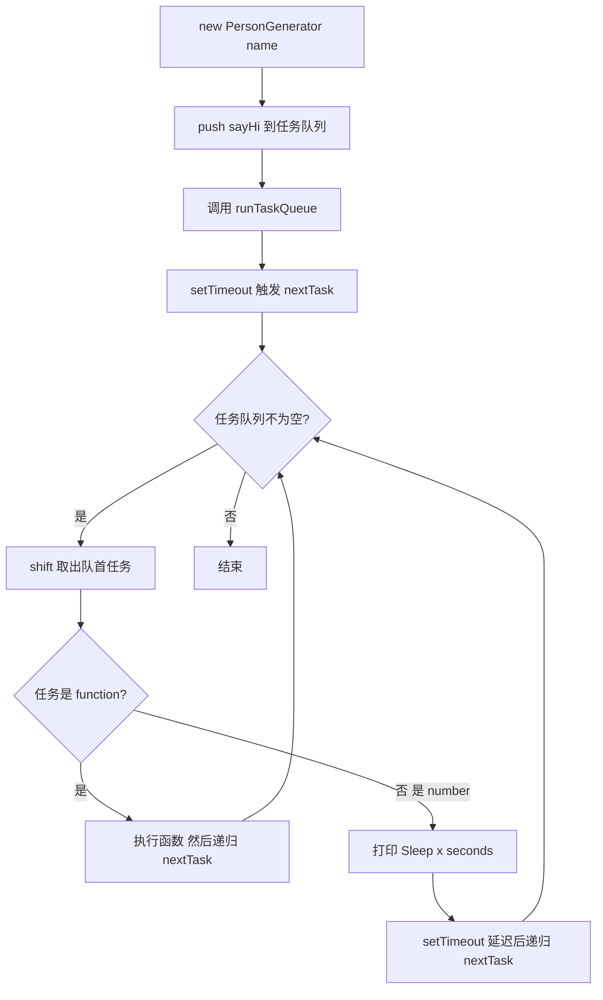

# LazyMan（链式调用的任务队列）

## 简介

实现一个 `Person` 方法，支持链式调用，可以依次执行 `sayHi`、`sleep`、`eat`、`sleepFirst` 等操作。核心思路是利用任务队列和 setTimeout 实现异步任务的顺序执行。

## 流程图



## 代码实现

```javascript
class PersonGenerator {
    taskQueue = [];
    constructor(name) {
        this.taskQueue.push(() => this.sayHi(name));
        this.runTaskQueue();
    }
    nextTask = () => {
        if (this.taskQueue.length > 0) {
            const task = this.taskQueue.shift();
            if (typeof task === "function") {
                task();
                this.nextTask();
            }
            if (typeof task === "number") {
                console.log(`Sleep ${task} seconds \n`);
                setTimeout(() => this.nextTask(), task * 1000);
            }
        }
    };
    runTaskQueue = () => {
        setTimeout(() => this.nextTask());
    };
    sayHi(name) {
        console.log(`Hi! This is ${name}! \n`);
        return this;
    }
    sleep(seconds) {
        this.taskQueue.push(seconds);
        return this;
    }
    sleepFirst(seconds) {
        this.taskQueue.splice(-1, 0, seconds);
        return this;
    }
    eat(food) {
        this.taskQueue.push(() => console.log(`Eat ${food}~ \n`));
        return this;
    }
}
const Person = name => new PersonGenerator(name);
```

## 逐行解析

- **第12行**：`PersonGenerator` 类，管理任务队列
- **第13行**：`taskQueue` 数组，用于存储待执行的任务
- **第14-17行**：构造函数，先将 `sayHi` 任务入队，然后启动任务队列
- **第18-30行**：`nextTask` 方法，从队列头部取出任务执行。如果任务是函数则直接执行并递归；如果是数字则作为延迟秒数，用 setTimeout 延迟后递归
- **第32-34行**：`runTaskQueue` 通过 setTimeout(0) 异步启动任务循环
- **第35-38行**：`sayHi` 输出欢迎信息，返回 `this` 支持链式调用
- **第39-42行**：`sleep` 将延迟秒数（数字）入队
- **第43-46行**：`sleepFirst` 将延迟任务插入队列倒数第二个位置（紧挨队尾之前）
- **第47-50行**：`eat` 将吃东西的函数入队
- **第52行**：`Person` 函数，返回 `PersonGenerator` 实例

## 复杂度分析

- **时间复杂度**：O(n)，n 为任务数量，每个任务执行一次
- **空间复杂度**：O(n)，任务队列存储所有待执行任务
