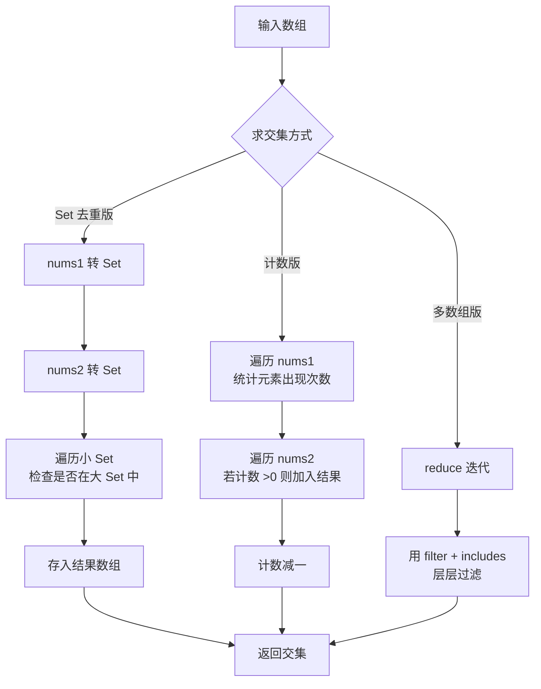

# 查找两个数组的交集

实现两个或多个数组的交集查找，支持去重和不去的两种情况。

## 流程图



## 代码与解析

### 方法一：Set 去重交集

```javascript
var intersection = function (nums1, nums2) {
  let map1 = new Set(nums1);
  let map2 = new Set(nums2);
  let res = [];
  map1.forEach((item) => {
    if (map2.has(item)) {
      res.push(item);
    }
  });
  return res;
};
const arr1 = [1, 2, 2, 1];
const arr2 = [1, 1, 5, 6];
console.log(intersection(arr1, arr2));
const fn = (n1, n2) => [...new Set(n1.filter((i) => n2.includes(i)))];
console.log(fn([1, 2, 2, 1], [0, 0]));
```

- 利用 `Set` 天然去重，分别将两个数组转为 `Set`
- 遍历其中一个 `Set`，检查元素是否在另一个 `Set` 中
- 箭头函数一行版：先 `filter` 过滤出在 `n2` 中的元素，再用 `Set` 去重

### 方法二：计数版（保留重复）

```javascript
const intersect = (nums1, nums2) => {
  const map = {};
  const res = [];
  for (let n of nums1) {
    if (map[n]) {
      map[n]++;
    } else {
      map[n] = 1;
    }
  }
  for (let n of nums2) {
    if (map[n] > 0) {
      res.push(n);
      map[n]--;
    }
  }
  return res;
};
console.log(intersect([1, 4, 5], [4, 7]));
```

- 适用于需要保留重复元素的场景（如 `[1, 2, 2, 1]` 与 `[2, 2]` 应返回 `[2, 2]`）
- 遍历 `nums1`，用哈希表统计每个元素出现次数
- 遍历 `nums2`，遇到计数大于 0 的元素就加入结果并将计数减 1

### 方法三：多个数组交集

```javascript
function intersect2(...args) {
  if (args.length === 0) {
    return [];
  }
  if (args.length === 1) {
    return args[0];
  }
  return args.reduce((result, arg) => {
    return result.filter((item) => arg.includes(item));
  });
}
console.log(intersect2([1, 4, 5], [4, 7], [5]));
```

- 使用 `reduce` 依次对每个数组求交集
- 用 `result.filter` 只保留在 `arg` 中存在的元素
- 支持任意多个数组作为参数

## 复杂度分析

| 方法 | 时间复杂度 | 空间复杂度 |
|------|-----------|-----------|
| Set 去重版 | O(n + m) | O(n + m) |
| 计数版 | O(n + m) | O(n) |
| 多数组版 | O(n × k) — k 为数组个数 | O(n) |
