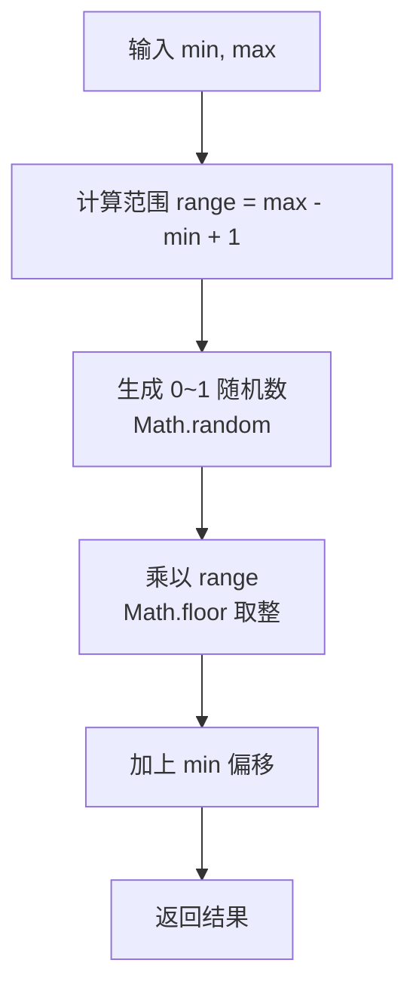

# 生成指定范围的随机数

生成 `[min, max]` 闭区间内的随机整数。

## 流程图



## 代码与解析

```javascript
export const randomNum = (min, max) =>
  Math.floor(Math.random() * (max - min + 1)) + min;
```

- `Math.random()` 生成 `[0, 1)` 浮点数
- `(max - min + 1)` 是闭区间的范围长度
- `Math.floor(Math.random() * range)` 生成 `[0, range-1]` 的整数
- 加上 `min` 偏移到目标区间 `[min, max]`
- 例如 `randomNum(5, 10)` 能生成 5、6、7、8、9、10 中的任意整数

## 复杂度分析

| 指标 | 值 |
|------|-----|
| 时间复杂度 | O(1) |
| 空间复杂度 | O(1) |
