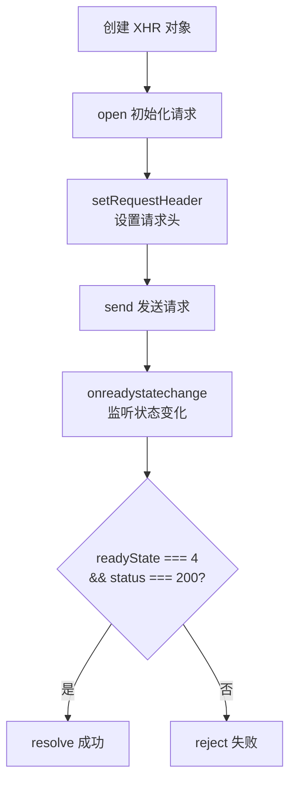

# 用 Ajax 原生实现一个 POST 请求

从原生 `XMLHttpRequest` 实现 POST 请求，到 Promise 封装，再到完整的 `axios` 风格封装，逐步升级。

## 流程图



## 代码与解析

### 原生 POST 请求

```javascript
function ajax_post(url, data) {
    // 1. 异步对象 ajax
    var ajax = new XMLHttpRequest();
    // 2. url 方法
    ajax.open('post', url);
    // 3. 设置请求报文
    ajax.setRequestHeader('Content-type', 'text/plain');
    // 4. 发送
    if (data) {
        ajax.send(data);
    } else {
        ajax.send();
    }
    // 5. 注册事件
    ajax.onreadystatechange = function () {
        if (ajax.readyState === 4 && ajax.status === 200) {
            console.log(ajax.respenseText);
        }
    }
}
```

- **步骤**：创建 XHR → `open` 初始化 → `setRequestHeader` 设置 Content-Type → `send` 发送 → 监听 `onreadystatechange`
- `readyState === 4` 表示请求完成，`status === 200` 表示成功

### Promise 封装 GET 请求

```javascript
function getJSON(url) {
    let promise = new Promise(function (resolve, reject) {
        let xhr = new XMLHttpRequest();
        xhr.open("GET", url, true);
        xhr.onreadystatechange = function () {
            if (this.readyState !== 4) return;
            if (this.status === 200) {
                resolve(this.response);
            } else {
                reject(new Error(this.statusText));
            }
        };
        xhr.onerror = function () {
            reject(new Error(this.statusText));
        };
        xhr.responseType = "json";
        xhr.setRequestHeader("Accept", "application/json");
        xhr.send(null);
    });
    return promise;
}
```

- Promise 包裹异步操作：成功时 `resolve`，失败时 `reject`
- `xhr.onerror` 处理网络异常
- `responseType = "json"` 自动解析 JSON 响应

### Promise 封装通用 ajax

```javascript
const promiseAjax = function (data) {
    function formatParams(param) {
        var arr = [];
        for (var name in param) {
            arr.push(encodeURIComponent(name) + "=" + encodeURIComponent(param[name]));
        }
        arr.push(("v=" + Math.random()).replace(".", ""));
        return arr.join("&");
    }
    if (!data) data = {}
    data.params = data.params || {}

    return new Promise((resolve, reject) => {
        const xhr = new XMLHttpRequest();

        if (data.type === 'get') {
            data.params = formatParams(data.params);
            xhr.open("GET", data.url + "?" + data.params, true);
            xhr.send(null);
        } else if (options.type == "post") {
            xhr.open("POST", data.url, true);
            xhr.setRequestHeader("Content-type", "application/json");
            xhr.send(data.params);
        }

        xhr.onreadystatechange = function () {
            if (xhr.readyState == 4) {
                if (xhr.status === 200) {
                    resolve(xhr.response)
                } else {
                    reject(xhr.responseText);
                }
            }
        }
    })
}
```

- 支持 GET 和 POST 两种方法
- `formatParams` 将参数对象转为 URL 查询字符串（含随机数防止缓存）
- POST 时设置 `Content-Type: application/json`

### 简洁版 ajax 封装

```javascript
function ajax(url) {
    return new Promise((resolve, reject) => {
        const xhr = new XMLHttpRequest()
        xhr.open('GET', url, true)
        xhr.onreadystatechange = function () {
            if (xhr.readyState !== 4) {
                return
            }
            if (xhr.status >= 200 && xhr.status < 300) {
                resolve(JSON.parse(xhr.responseText))
            } else {
                reject(new Error('request error staus ' + request.status))
            }
        }
        xhr.send(null)
    })
}
```

- 简洁版使用状态码范围 `200~299` 判断成功
- `JSON.parse` 自动解析 JSON

### 加强版 — axios 风格

```javascript
function axios({
    url,
    params = {},
    data = {},
    method = 'GET'
}) {
    return new Promise((resolve, reject) => {
        const request = new XMLHttpRequest()

        let queryStr = Object.keys(params).reduce((pre, key) => {
            pre += `&${key}=${params[key]}`
            return pre
        }, '')
        if (queryStr.length > 0) {
            queryStr = queryStr.substring(1)
            url += '?' + queryStr
        }
        method = method.toUpperCase()
        request.open(method, url, true)
        request.onreadystatechange = function () {
            if (request.readyState !== 4) {
                return
            }
            if (request.status >= 200 && request.status < 300) {
                const responseData = {
                    data: JSON.parse(request.response),
                    status: request.status,
                    statusText: request.statusText
                }
                resolve(responseData)
            } else {
                const error = new Error('request error staus ' + request.status)
                reject(error)
            }
        }
        if (method === 'POST' || method === 'PUT' || method === 'DELETE') {
            request.setRequestHeader('Content-Type', 'application/json;charset=utf-8')
            const dataJson = JSON.stringify(data)
            request.send(dataJson)
        } else {
            request.send(null)
        }
    })
}
```

- 参数配置化：`url`、`params`（query 参数）、`data`（请求体）、`method`
- 自动拼接 query 字符串
- 支持 GET / POST / PUT / DELETE 多种方法
- 返回结构化响应对象：`{ data, status, statusText }`

## 复杂度分析

| 操作 | 时间复杂度 | 空间复杂度 |
|------|-----------|-----------|
| XHR 请求 | O(1) — 发起请求 | O(n) — 响应数据 |
| Promise 封装 | O(1) | O(1) |
| 参数格式化 | O(k) — k 为参数个数 | O(k) |
