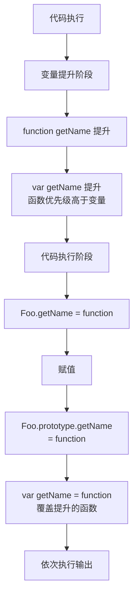

# 说出打印顺序（原型）

综合考察变量提升、函数声明优先级、原型链、运算符优先级以及命名函数表达式的经典面试题。

## 流程图



## 代码与解析

```javascript
function Foo() {
    getName = function () {
        console.log(1);
    };
    return this;
}
Foo.getName = function () {
    console.log(2);
};
Foo.prototype.getName = function () {
    console.log(3);
};
var getName = function () {
    console.log(4);
};

function getName() {
    console.log(5);
}
// 请写出以下输出结果：
Foo.getName(); //2
getName(); //4
Foo().getName(); //1
getName(); //1
new Foo.getName(); //2
new Foo().getName(); //3
```

### 逐行解析

**1. `Foo.getName()` — 输出 2**

- 直接调用 `Foo` 上的静态方法，输出 2

**2. `getName()` — 输出 4**

- 变量提升阶段：`function getName`（函数声明）优先提升到顶部
- `var getName = function(...)` 是变量声明 + 赋值，`var getName` 提升但不覆盖函数，但执行到赋值行时 `getName` 被重新赋值为新函数
- 所以 `getName()` 输出 4（而非 5）

**3. `Foo().getName()` — 输出 1**

- `Foo()` 执行，内部 `getName = function() { console.log(1) }` 修改了全局的 `getName`
- `Foo()` 返回 `this`，此时 `this` 指向 `window`
- 所以 `window.getName` 已经是输出 1 的函数
- 输出 1

**4. `getName()` — 输出 1**

- 全局 `getName` 已被 `Foo()` 内部重新赋值为输出 1 的函数

**5. `new Foo.getName()` — 输出 2**

- **运算符优先级**：成员访问 `.` 优先级为 20，`new` 无参数列表优先级为 19
- 因此先计算 `Foo.getName` 得到函数，再 `new` 这个函数
- `new` 执行函数，输出 2

**6. `new Foo().getName()` — 输出 3**

- `new` 带参数列表优先级为 20，与 `.` 同优先级，从左到右计算
- `new Foo()` 创建实例 → 实例上没有 `getName`
- 沿原型链查找 → `Foo.prototype.getName` → 输出 3

```javascript
console.log(t1)
var b = 10;
(function b() {
    b = 20;
    console.log(b);
})();

console.log(b);
```

- 命名函数表达式 `b` 在函数内部是只读的，`b = 20` 赋值无效，所以输出函数本身
- 外部 `console.log(b)` 输出全局变量 10

## 复杂度分析

| 操作 | 时间复杂度 | 空间复杂度 |
|------|-----------|-----------|
| 变量/函数提升 | O(1) | O(n) — 存储声明 |
| 函数调用 | O(1) | O(1) |
| 原型链查找 | O(n) — 链长度 | O(1) |
