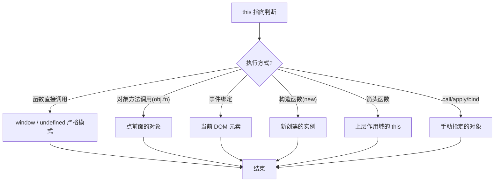

# 谈谈你对this的了解及应用场景

本文系统分析 JavaScript 中 `this` 的五种指向规则，并手写 `call` / `bind` 源码，以及介绍鸭子类型（Duck Typing）的应用。

## 流程图



## 代码与解析

### Q1: 函数直接调用 vs 对象方法调用

```javascript
const fn = function fn() {
    console.log(this);
};
let obj = {
    name: 'OBJ',
    fn: fn
};
fn();      // window（严格模式 undefined）
obj.fn();  // obj
```

- **函数直接调用**：前面没有"点"，`this` 指向 `window`（严格模式为 `undefined`）
- **对象方法调用**：前面有"点"，`this` 指向点前面的对象

### Q2: 事件绑定

```javascript
/* document.body.addEventListener('click', function () {
    console.log(this);  // document.body
}); */
```

- 事件触发时，方法中的 `this` 指向绑定事件的元素本身

### Q3: 构造函数

```javascript
/* function Factory() {
    this.name = '珠峰培训';
    this.age = 12;
    console.log(this);  // Factory 的实例
}
let f = new Factory; */
```

- 构造函数体中的 `this` 指向当前类的实例对象

### Q4: 箭头函数

```javascript
/* let demo = {
    name: 'DEMO',
    fn() {
        console.log(this);  // demo

        setTimeout(function () {
            console.log(this);  // window
        }, 1000);

        setTimeout(() => {
            console.log(this);  // demo
        }, 1000);
    }
};
demo.fn(); */
```

- 箭头函数没有自己的 `this`，所用到的 `this` 来自其所处上下文
- 普通函数 `setTimeout` 回调中的 `this` 指向 `window`

### Q5: call / apply / bind 改变 this

```javascript
// 原理：就是利用 "点"定THIS机制，context.xxx=self "obj.xxx=func" => obj.xxx()
// Function.prototype.call = function call(context, ...params) {
//     let self = this,
//         key = Symbol('KEY'),
//         result;
//     context == null ? context = window : null;
//     !/^(object|function)$/i.test(typeof context) ? context = Object(context) : null;
//     context[key] = self;
//     result = context[key](...params);
//     delete context[key];
//     return result;
// };

// func.call(obj, 10, 20);
// func.apply(obj, [10, 20]);
```

- `call` 原理：将函数临时挂载到 `context` 对象上，通过 `context.xxx()` 调用，利用"点"机制确定 `this`
- 使用 `Symbol` 作为唯一 key 避免属性名冲突
- `null` / `undefined` 时默认指向 `window`；基础类型包装为对象

### bind 的实现

```javascript
Function.prototype.bind = function bind(context, ...params) {
    let self = this;

    return function proxy(...args) {
        self.apply(context, params.concat(args));
    };
};

// document.body.addEventListener('click', func.bind(obj, 10, 20));
// 执行bind返回一个新的函数 proxy，事件触发时执行 proxy，
// 在 proxy 内部通过 apply 将 func 的 this 和参数都改变
```

- `bind` 与 `call/apply` 的区别：不立即执行，而是返回一个新函数
- 利用闭包保存 `context` 和 `params`
- 返回的 `proxy` 执行时，合并预先传入的参数和后续参数

### 鸭子类型（Duck Typing）

```javascript
/* Array.prototype.slice = function slice() {
    let result = [];
    for (let i = 0; i < this.length; i++) {
        result.push(this[i]);
    }
    return result;
}; */

function func() {
    // 把arguments变为数组
    // Array.prototype.slice -> [].slice
    // let result = Array.prototype.slice.call(arguments);

    [].forEach.call(arguments, item => {
        console.log(item);
    });
}
func(10, 20, 30);
```

- **鸭子类型**：像鸭子一样（有 `length` 和索引），我们就说它是鸭子
- 类数组（如 `arguments`）具有类似数组的结构，可借用数组原型上的方法
- 通过 `[].forEach.call(arguments, ...)` 让类数组使用数组方法

## 复杂度分析

| 方法 | 时间复杂度 | 空间复杂度 |
|------|-----------|-----------|
| call | O(1) | O(1) |
| apply | O(1) | O(1) |
| bind | O(1) — 返回函数 | O(n) — 闭包保存参数 |
| 鸭子类型 | O(n) | O(1) |
