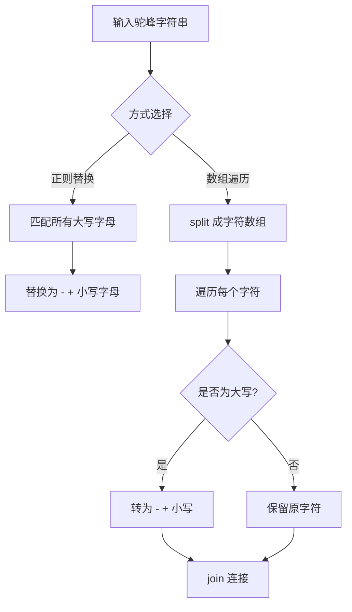

# 转化为短横线命名

将 `getElementById` 形式的驼峰命名转换为 `get-element-by-id` 形式的短横线命名。

## 流程图



## 代码与解析

### 方式一：正则表达式

```javascript
var getCamelCase1 = (str) => {
  return str.replace(/[A-Z]/g, (item) => "-" + item.toLowerCase());
};

console.log(getCamelCase1("getElementById"));
```

- 正则 `/[A-Z]/g` 匹配所有大写字母
- 每个大写字母被替换为 `-` + 该字母的小写形式
- 简洁高效，一次性完成转换

### 方式二：数组遍历

```javascript
function getKebabCase(str) {
  var arr = str.split("");
  str = arr
    .map(function (item) {
      if (item.toUpperCase() === item) {
        return "-" + item.toLowerCase();
      } else {
        return item;
      }
    })
    .join("");
  return str;
}
console.log(getKebabCase("getElementById")); //get-element-by-id
```

- 先将字符串拆分为字符数组
- 遍历每个字符，如果是大写字母则添加 `-` 前缀并转小写
- 最后 `join` 成字符串

## 复杂度分析

| 方式 | 时间复杂度 | 空间复杂度 |
|------|-----------|-----------|
| 正则替换 | O(n) | O(n) |
| 数组遍历 | O(n) | O(n) |
