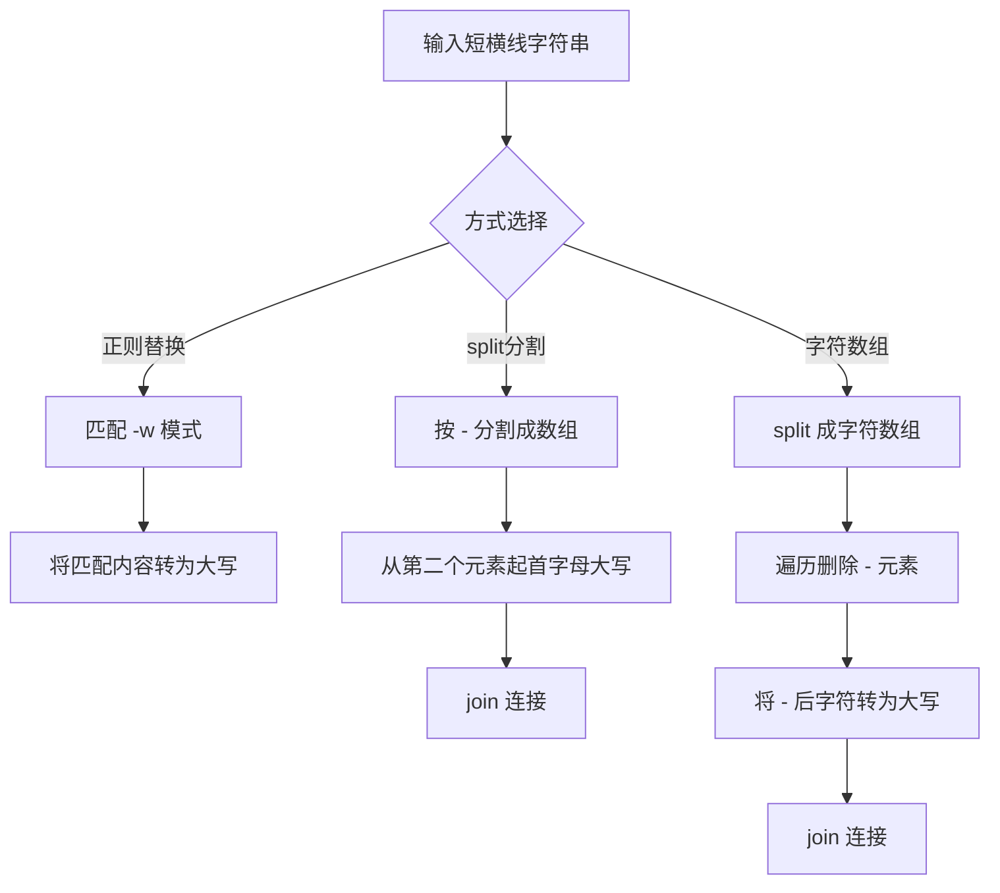

# 转化为驼峰命名

将 `get-element-by-id` 形式的短横线命名转换为 `getElementById` 形式的驼峰命名。本文展示三种实现方式。

## 流程图



## 代码与解析

### 方式一：正则表达式

```javascript
var s1 = "get-element-by-id";
// 转化为 getElementById
function MyFormat(s) {
  return s.replace(/-\w/g, function (x) {
    return x.slice(1).toUpperCase();
  });
}

const f1 = MyFormat(s1);
console.log(f1); //getElementById

var getCamelCase = (str) => {
  return str.replace(/-([a-z])/g, (i, item) => item.toUpperCase());
};
console.log(getCamelCase(s1));
```

- 正则 `/-\w/g` 匹配所有 `-` 后跟一个字符的模式
- 匹配到的内容丢弃 `-`，将后面的字符转为大写
- `/-([a-z])/g` 利用捕获组直接获取要转换的字母

### 方式二：数组 split 操作

```javascript
function transformStr2CamelCase1(str) {
  if (typeof str !== "string") {
    return "";
  }
  const strArr = str.split("-");
  for (let i = 1; i < strArr.length; i++) {
    strArr[i] = strArr[i].charAt(0).toUpperCase() + strArr[i].substring(1);
  }
  return strArr.join("");
}
console.log(transformStr2CamelCase1("hello-world")); // helloWorld
```

- 先用 `-` 分割成数组
- 从索引 1 开始遍历，每个元素的首字母大写 + 剩余部分
- 最后用空字符串 `join` 合并

### 方式三：字符数组操作

```javascript
function transformStr2CamelCase2(str) {
  if (typeof str !== "string") {
    return "";
  }
  const strArr = str.split("");
  for (let i = 0; i < strArr.length; i++) {
    if (strArr[i] === "-") {
      // 删除-
      strArr.splice(i, 1); // 将此处改为大写
      if (i < strArr.length) {
        strArr[i] = strArr[i].toUpperCase();
      }
    }
  }
  return strArr.join("");
}
console.log(transformStr2CamelCase2("hello-world")); // helloWorld
```

- 将字符串拆分为单个字符的数组
- 遍历时遇到 `-` 删除该元素，并将后一个元素转为大写
- 注意 `splice` 后索引 `i` 已经指向了原 `-` 后的字符

## 复杂度分析

| 方式 | 时间复杂度 | 空间复杂度 |
|------|-----------|-----------|
| 正则替换 | O(n) | O(n) |
| split 分割 | O(n) | O(n) |
| 字符数组 | O(n) | O(n) |
