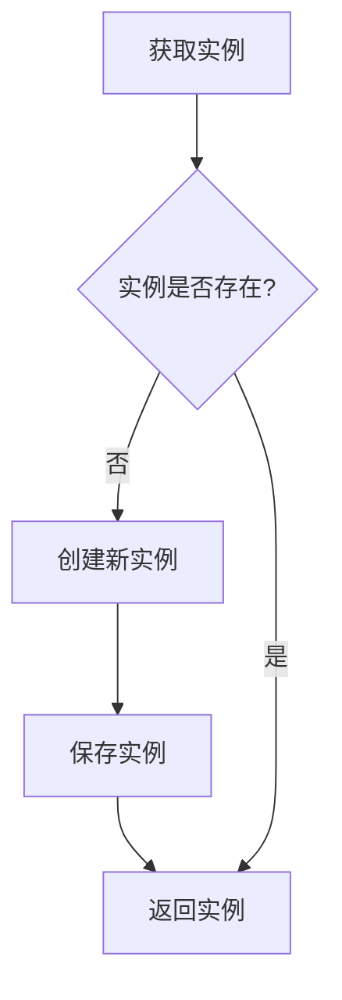

# 单例模式

单例模式确保一个类只有一个实例，并提供一个全局访问点。本文展示 ES6 class、闭包、ES5 等多种实现方式，并涵盖管理员和 Storage 等实际应用场景。

## 流程图



## 代码与解析

### 方式一：ES6 class 静态方法

```javascript
class SingletonCar {
    constructor() {
        this.name = 'benz';
    }
    static getInstance() {
        if (!SingletonCar.instance) {
            SingletonCar.instance = new SingletonCar();
        }
        return SingletonCar.instance;
    }
}

let car1 = SingletonCar.getInstance();
let car2 = SingletonCar.getInstance();

console.log(car1 === car2) // true
```

- 通过 `static getInstance` 静态方法统一管理实例
- 实例保存在 `SingletonCar.instance` 静态属性上
- 第一次调用时创建，后续直接返回已有实例

### 方式二：闭包

```javascript
var SingletonCar2 = (function () {
    var instance;

    var SingletonCarTemp = function () {
        this.name = 'benz';
    };

    return function () {
        if (!instance) {
            instance = new SingletonCarTemp();
        }
        return instance;
    }
})();

var car11 = new SingletonCar2();
var car22 = new SingletonCar2();

console.log(car11 === car22) // true
```

- 利用 IIFE 创建闭包，`instance` 保存在闭包中不被外部访问
- 返回的构造函数每次执行时检查 `instance` 是否存在

### 方式三：ES6 class 构造函数拦截

```javascript
class SingleManage {
    constructor({ name, level }) {
        if (!SingleManage.instance) {
            this.name = name;
            this.level = level
            SingleManage.instance = this;
        }
        return SingleManage.instance
    }
}

let boss = new SingleManage({ name: "Jokul", level: "1" })
let boss2 = new SingleManage({ name: "Jokul2", level: "2" })
console.log(boss === boss2) //true
```

- 在 `constructor` 中判断实例是否已存在
- 首次创建时将 `this` 赋值给 `SingleManage.instance`
- 后续 `new` 调用直接返回已有实例

### 方式四：ES5 静态方法

```javascript
function SingleManage2(manage) {
    this.name = manage.name
    this.level = manage.level
    this.info = function () {
        console.warn("Boss's name is " + this.name + " and level is " + this.level)
    }
}
SingleManage2.getInstance = function (manage) {
    if (!this.instance) {
        this.instance = new SingleManage2(manage)
    }
    return this.instance
}
var boss12 = SingleManage2.getInstance({ name: "Jokul", level: "1" })
var boss22 = SingleManage2.getInstance({ name: "Jokul2", level: "2" })
boss12.info() //Boss 's name is Jokul and level is 1
boss22.info() //Boss 's name is Jokul and level is 1
```

- 直接在构造函数上添加 `getInstance` 静态方法
- `this.instance` 指向 `SingleManage2.instance`
- 第二次传入的参数被忽略，始终返回第一个实例

### 方式五：Storage 单例

```javascript
function StorageBase() {}
StorageBase.prototype.getItem = function (key) {
    return localStorage.getItem(key)
}
StorageBase.prototype.setItem = function (key, value) {
    return localStorage.setItem(key, value)
}

const Storage = (function () {
    let instance = null
    return function () {
        if (!instance) {
            instance = new StorageBase()
        }
        return instance
    }
})()

const storage1 = new Storage()
const storage2 = new Storage()

storage1.setItem('name', 'yd')
storage1.getItem('name')  // yd
storage2.getItem('name')  // 也是yd

storage1 === storage2  // true
```

- `StorageBase` 提供基础方法，`Storage` 通过闭包实现单例
- `storage1` 和 `storage2` 指向同一个 `StorageBase` 实例，数据共享

## 复杂度分析

| 操作 | 时间复杂度 | 空间复杂度 |
|------|-----------|-----------|
| 首次获取实例 | O(1) | O(1) |
| 后续获取实例 | O(1) | O(1) |
