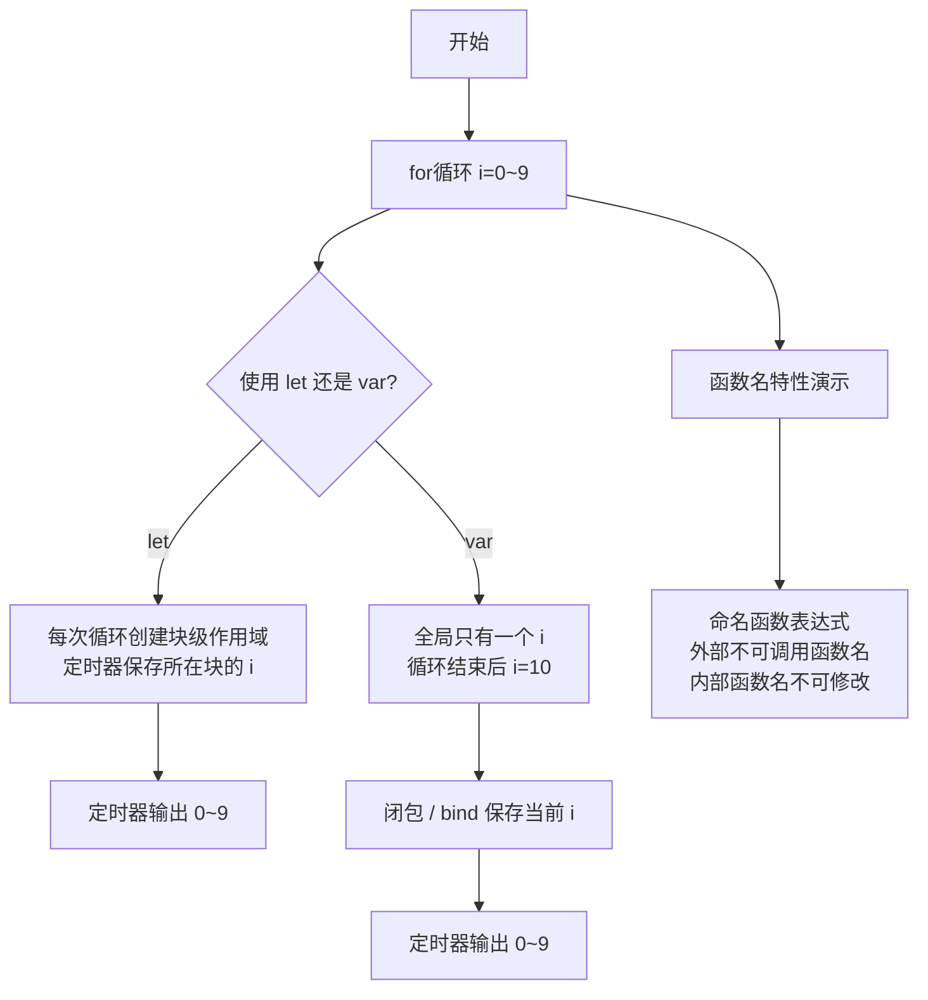

# 定时器输出

本文解析 JavaScript 中定时器与循环结合时的输出顺序问题，涵盖块级作用域、闭包、bind 预绑定以及函数名作用域等核心概念。

## 流程图



## 代码与解析

```javascript
//=>定时器是异步编程：每一轮循环设置定时器，无需等定时器触发执行，继续下一轮循环（定时器触发的时候，循环已经结束了）
for (let i = 0; i < 10; i++) {
	//=>LET存在块级作用域，每一次循环都会在当前块作用域中形成一个私有变量i存储0~9
	//当定时器执行的时候，所使用的i就是所处块作用域中的i
	setTimeout(() => {
		console.log(i);
	}, 1000);
}
```

- `let` 具有块级作用域，每次循环都会创建一个新的块作用域，`i` 分别保存 0~9
- 定时器是异步的，循环结束后定时器回调执行时，读取的是各自块作用域中的 `i`，所以依次输出 0~9

```javascript
//=>闭包解决
for (var i = 0; i < 10; i++) {
	~ function (i) {
		setTimeout(() => {
			console.log(i);
		}, 1000);
	}(i);
}
```

- 使用 IIFE（立即执行函数表达式）创建闭包，每次循环将当前 `i` 作为参数传入
- 定时器回调引用了闭包中的参数 `i`，此 `i` 被固定在每次循环传入的值上

```javascript
for (var i = 0; i < 10; i++) {
	setTimeout((i => () => console.log(i))(i), 1000);
}
```

- 箭头函数 + IIFE 的精简写法，本质与上一种相同

```javascript
//=>可以基于bind的预先处理机制：在循环的时候就把每次执行函数需要输出的结果，预先传给函数即可
var fn = function (i) {
	console.log(i);
};
for (var i = 0; i < 10; i++) {
	setTimeout(fn.bind(null, i), 1000);
}
```

- `bind` 预先将 `i` 绑定为 `fn` 的参数，生成一个新函数
- 每次循环绑定的 `i` 值不同，因此定时器触发时输出正确的 0~9

```javascript
var b = 10;
(function b() {
	b = 20;
	console.log(b); //=>函数
})();
console.log(b); //=>10 
```

- 命名函数表达式：函数名 `b` 在函数内部是只读的（类似 const），赋值 `b = 20` 无效
- 外部 `b` 是全局变量，函数内部修改的是局部函数名，不影响外部

```javascript
var b = 10;
(function b(b) {
	b = 20;
	console.log(b); //=>20 里面的b一定需要是私有的，不能是全局的（声明它或者改为形参）
})();
console.log(b); //=>10 
```

- 此时 `b` 是形参，是可读写的局部变量，因此 `b = 20` 生效
- 外部全局 `b` 不受影响

```javascript
let fn2 = function AAA() {
	// "use strict";
	// AAA = 1000; //=>Uncaught TypeError: Assignment to constant variable.
	console.log(AAA); //=>当前函数
};
// AAA(); //=>Uncaught ReferenceError: AAA is not defined  
// 1.本应匿名的函数如果设置了函数名，在外面还是无法调用，但是在函数里面是可以使用的
// 2.而且类似于创建常量一样，这个名字存储的值不能再被修改（非严格模式下不错报，但是不会有任何的效果，严格模式下直接报错，我们可以把AAA理解为是用 const 创建出来的）
fn2();
```

- 命名函数表达式 `AAA` 仅在函数内部可访问，外部不可调用
- `AAA` 如同 `const` 声明，不可重新赋值

## 复杂度分析

| 方法 | 时间复杂度 | 空间复杂度 |
|------|-----------|-----------|
| `let` 块级作用域 | O(n) | O(n) — 每个循环块保留一个 i |
| 闭包 IIFE | O(n) | O(n) — 每个闭包保留一个 i |
| `bind` 预绑定 | O(n) | O(n) — 每个 bind 生成新函数 |
