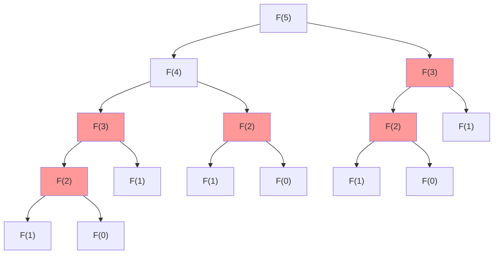
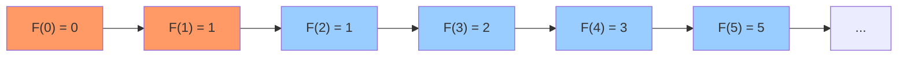

# 斐波那契数列

## 简介

斐波那契数列定义为：F(0) = 0, F(1) = 1, F(n) = F(n - 1) + F(n - 2) (n >= 2)。本题使用三种方式实现：**暴力递归**、**递归 + 缓存（记忆化搜索）**、**动态规划（滚动变量）**。

## 递归树（暴力递归）

以 n = 5 为例，暴力递归会展开如下树形结构，存在大量重复计算：



红色标记的节点存在重复计算，缓存优化后可避免。

## 状态转移图（DP）



## 代码实现

```javascript
/**
 * 题目：斐波那契数列
 * 描述：斐波那契数列定义为 F(0)=0, F(1)=1, F(n)=F(n-1)+F(n-2) (n>=2)
 *       使用三种方式实现：暴力递归、递归+缓存、动态规划
 *
 * 解法一：暴力递归
 * 思路：直接递归调用 fib(n-1) + fib(n-2)
 * 时间复杂度：O(2^n)；空间复杂度：O(n)
 *
 * 解法二：递归 + 缓存（记忆化搜索）
 * 思路：缓存已计算的值，避免重复计算
 * 时间复杂度：O(n)；空间复杂度：O(n)
 *
 * 解法三：动态规划（滚动变量）
 * 思路：用三个变量滚动计算，不需要数组
 * 时间复杂度：O(n)；空间复杂度：O(1)
 */

/**
 * fib - 暴力递归
 * @param {number} n
 * @return {number}
 */
var fib = function (n) {
  return n <= 1 ? n : fib(n - 1) + fib(n - 2);
};

/**
 * fib - 递归 + 缓存
 * @param {number} n
 * @return {number}
 */
var fibWithCache = function (n) {
  if (n <= 1) return n;
  const cache = [];
  cache[0] = 0;
  cache[1] = 1;
  function memorize(number) {
    if (cache[number] !== undefined) return cache[number];
    cache[number] = memorize(number - 1) + memorize(number - 2);
    return cache[number];
  }
  return memorize(n);
};

/**
 * fib - 动态规划（滚动变量）
 * @param {number} n
 * @return {number}
 */
var fibDP = function (n) {
  if (n < 2) return n;
  let p = 0, q = 0, r = 1;
  for (let i = 2; i <= n; i++) {
    p = q;
    q = r;
    r = p + q;
  }
  return r;
};
```

## 逐行解析

### 暴力递归（fib）
- 第 25 行：`n <= 1 ? n` — 递归基，F(0)=0, F(1)=1
- 第 25 行：`fib(n - 1) + fib(n - 2)` — 状态转移方程，但未缓存结果，导致大量重复计算

### 递归 + 缓存（fibWithCache）
- 第 34-37 行：先处理递归基，再初始化 cache 数组
- 第 38-42 行：定义 memorize 内部函数，每次递归前检查 cache 中是否已有结果
- 第 40 行：`cache[number] = memorize(number - 1) + memorize(number - 2)` — 计算结果存入缓存
- 通过缓存剪枝，将指数级复杂度降为线性

### 动态规划（fibDP）
- 第 52 行：`if (n < 2) return n` — 处理边界
- 第 53 行：p、q、r 三个滚动变量，分别代表 F(i-2)、F(i-1)、F(i)
- 第 54-58 行：每次迭代滚动更新：p→q、q→r、r→p+q
- 最终 r 即为 F(n)，空间复杂度优化到 O(1)

## 示例输入输出

| 输入 | 输出 | 说明 |
|------|------|------|
| n = 0 | 0 | F(0) = 0 |
| n = 1 | 1 | F(1) = 1 |
| n = 5 | 5 | 0,1,1,2,3,5 |
| n = 10 | 55 | 第 10 项为 55 |

## 复杂度分析

| 方法 | 时间复杂度 | 空间复杂度 |
|------|-----------|-----------|
| 暴力递归 | O(2ⁿ) | O(n) |
| 递归 + 缓存 | O(n) | O(n) |
| 动态规划（滚动变量） | O(n) | O(1) |
