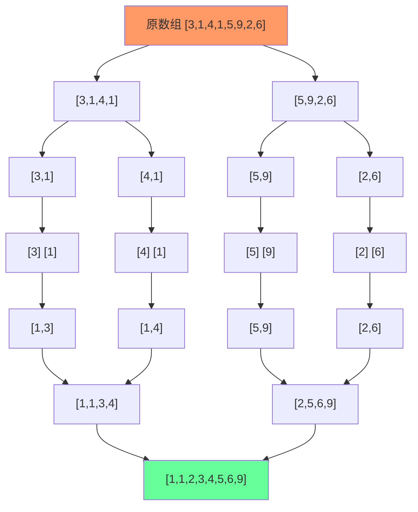

# 归并排序

## 简介

采用**分治思想**，将数组递归分成两半分别排序，再合并为有序数组。分治三步：**分解 → 解决 → 合并**。

## 分治流程图



## 代码实现

```javascript
/**
 * 题目：归并排序（分治策略）
 * 描述：采用分治思想，将数组递归分成两半分别排序，再合并为有序数组。
 *       分治的三步：分解 -> 解决 -> 合并
 * 时间复杂度：O(n log n)；空间复杂度：O(n)
 */

/**
 * mergeSort - 归并排序
 * @param {number[]} arr
 * @returns {number[]}
 */
const mergeSort = (arr) => {
  if (arr.length > 1) {
    const middle = Math.floor(arr.length / 2);
    const left = mergeSort(arr.slice(0, middle));
    const right = mergeSort(arr.slice(middle));
    arr = merge(left, right);
  }
  return arr;
};

/**
 * merge - 合并两个有序数组
 */
const merge = (left, right) => {
  let i = 0, j = 0;
  const res = [];
  while (i < left.length && j < right.length) {
    res.push(left[i] < right[j] ? left[i++] : right[j++]);
  }
  return res.concat(i < left.length ? left.slice(i) : right.slice(j));
};
```

## 逐行解析

### mergeSort 主函数
- 第 14 行：`if (arr.length > 1)` — 递归基，长度为 1 时直接返回（已有序）
- 第 15 行：计算中间位置
- 第 16-17 行：递归对左半部分和右半部分执行归并排序
- 第 18 行：调用 merge 合并两个有序子数组
- 第 20 行：返回合并后的有序数组

### merge 合并函数
- 第 27 行：双指针 i、j 分别指向 left 和 right 的起始位置
- 第 29-31 行：比较两个指针所指元素，将较小的放入结果数组，指针后移
- 第 32 行：将剩余元素（left 或 right 中未处理完的）拼接到结果后

## 示例输入输出

| 输入 | 输出 |
|------|------|
| `[3,1,4,1,5,9,2,6]` | `[1,1,2,3,4,5,6,9]` |
| `[5,2,8,3,1]` | `[1,2,3,5,8]` |

## 复杂度分析

| 指标 | 值 |
|------|-----|
| 时间复杂度 | O(n log n) — 每次分解 log n 层，每层合并 O(n) |
| 空间复杂度 | O(n) — 需要额外数组存储合并结果 |
| 稳定性 | 稳定排序（相等元素相对顺序不变） |
