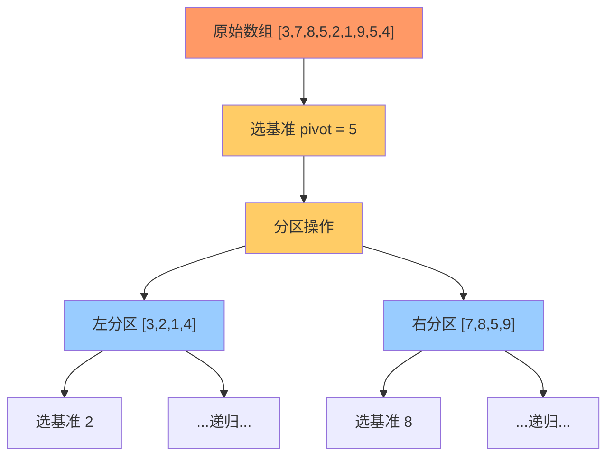

# 快速排序

## 简介

选择基准元素，将数组分为小于基准和大于基准两部分，递归排序。分治三步：**选择基准 → 分区 → 递归排序**。提供两种实现：原地分区法（高效）和非原地法（易理解）。

## 分区流程图



## 代码实现

```javascript
/**
 * 题目：快速排序（分治策略）
 * 描述：选择一个基准元素，将数组分为小于基准和大于基准两部分，递归排序。
 *       分治三步：选择基准 -> 分区 -> 递归排序
 *
 * 解法一：原地分区法
 * 思路：双指针从两端向中间扫描，交换不符合要求的元素
 * 时间复杂度：平均 O(n log n)，最坏 O(n²)；空间复杂度：O(log n)
 *
 * 解法二：非原地法（易理解）
 * 思路：遍历数组，将元素分类到 left/right 两个新数组，递归合并
 */

/**
 * quickSort - 原地分区快速排序
 * @param {number[]} arr
 * @returns {number[]}
 */
function quickSort(arr) {
  quick(arr, 0, arr.length - 1);
  return arr;
}

function quick(arr, start, end) {
  if (arr.length > 1) {
    const index = partition(arr, start, end);
    if (start < index - 1) quick(arr, start, index - 1);
    if (index < end) quick(arr, index, end);
  }
}

function partition(arr, start, end) {
  const pivot = arr[Math.floor((start + end) / 2)];
  let i = start, j = end;
  while (i <= j) {
    while (arr[i] < pivot) i++;
    while (arr[j] > pivot) j--;
    if (i <= j) {
      [arr[i], arr[j]] = [arr[j], arr[i]];
      i++;
      j--;
    }
  }
  return i;
}

/**
 * quickSortSimple - 非原地快速排序
 * @param {number[]} arr
 * @returns {number[]}
 */
function quickSortSimple(arr) {
  if (arr.length < 2) return arr;
  const cur = arr[arr.length - 1];
  let left = [], right = [];
  for (let i = 0; i < arr.length - 1; i++) {
    if (arr[i] >= cur) right.push(arr[i]);
    else left.push(arr[i]);
  }
  return [...quickSortSimple(left), cur, ...quickSortSimple(right)];
}
```

## 逐行解析

### 原地分区法（quickSort + quick + partition）
- `quickSort`：入口函数，调用 quick 对全数组排序
- `quick`：递归函数，接收子数组的 start 和 end 下标
  - 第 26 行：调用 partition 进行分区，返回分区索引
  - 第 27 行：递归排序左分区（start 到 index - 1）
  - 第 28 行：递归排序右分区（index 到 end）
- `partition`：核心分区函数
  - 第 33 行：选择中间位置的元素作为基准 pivot
  - 第 35-43 行：双指针从两端向中间扫描
    - 左指针跳过小于 pivot 的元素
    - 右指针跳过大于 pivot 的元素
    - 遇到不符合条件的元素时交换
  - 第 44 行：返回分区位置 i

### 非原地法（quickSortSimple）
- 第 53 行：如果数组长度小于 2，直接返回（已有序）
- 第 54 行：选择最后一个元素作为基准
- 第 55-59 行：遍历其余元素，分类到 left 或 right 数组
- 第 60 行：递归排序 left 和 right，拼接返回

## 示例输入输出

| 输入 | 输出 |
|------|------|
| `[3,7,8,5,2,1,9,5,4]` | `[1,2,3,4,5,5,7,8,9]` |
| `[5,2,8,3,1]` | `[1,2,3,5,8]` |

## 复杂度分析

| 指标 | 原地分区法 | 非原地法 |
|------|-----------|---------|
| 平均时间复杂度 | O(n log n) | O(n log n) |
| 最坏时间复杂度 | O(n²) — 数组已排序且基准选择不当 | O(n²) |
| 空间复杂度 | O(log n) — 递归栈 | O(n log n) — 每层创建新数组 |
| 稳定性 | 不稳定 | 不稳定 |
