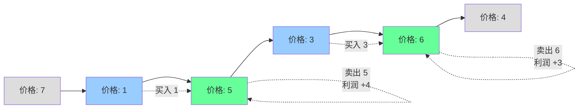

# 买卖股票的最佳时机 II

## 简介

给定股票价格数组，可以多次买卖（每天只能持有一股），求最大利润。每次卖出后可立即买入。核心思路：**只要今天的价格 > 昨天的价格，就在昨天买入今天卖出**，将所有正收益累加。

## 贪心策略图解



蓝色=买入，绿色=卖出。总利润 = 4 + 3 = 7。

## 代码实现

```javascript
/**
 * 题目：买卖股票的最佳时机 II（LeetCode 122）
 * 描述：给定股票价格数组，可以多次买卖（但每天只能持有一股），
 *       求最大利润。每次卖出后可以立即买入。
 * 示例：[7,1,5,3,6,4] -> 7（1买5卖 + 3买6卖）
 *
 * 解法：贪心算法
 * 思路：只要今天的价格 > 昨天的价格，就在昨天买入今天卖出。
 *       将所有的正收益累加即为最大利润。
 * 时间复杂度：O(n)；空间复杂度：O(1)
 */

/**
 * @param {number[]} prices
 * @return {number}
 */
let maxProfit = function (prices) {
  let profit = 0;
  for (let i = 0; i < prices.length - 1; i++) {
    if (prices[i + 1] > prices[i]) {
      profit += prices[i + 1] - prices[i];
    }
  }
  return profit;
};
```

## 逐行解析

- 第 18 行：初始化 profit 为 0
- 第 19-23 行：遍历价格数组，i 从 0 到 len - 2
  - 第 20 行：如果明日价格 > 今日价格，存在正收益
  - 第 21 行：将差价累加到 profit 中
- 第 24 行：返回累加的总利润

## 示例输入输出

| 输入 | 输出 | 操作 |
|------|------|------|
| `[7,1,5,3,6,4]` | 7 | 1 买 5 卖 (+4)，3 买 6 卖 (+3) |
| `[1,2,3,4,5]` | 4 | 1 买 5 卖 (+4) |
| `[7,6,4,3,1]` | 0 | 价格一直下跌，不交易 |

## 复杂度分析

| 指标 | 值 |
|------|-----|
| 时间复杂度 | O(n) — 只需一次遍历 |
| 空间复杂度 | O(1) — 只用了常数变量 |
