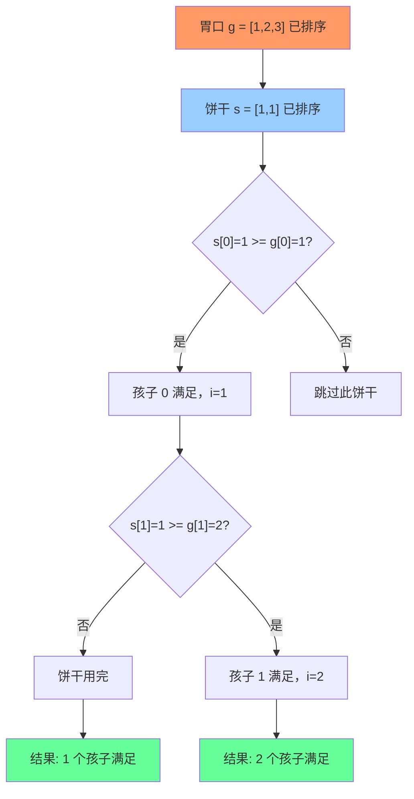

# 分发饼干

## 简介

每个孩子有胃口值 g[i]，饼干有尺寸 s[j]。每个孩子最多给一块饼干，当 s[j] >= g[i] 时孩子满足。求最多能满足多少个孩子。贪心策略：**将胃口和饼干都排序，用最小的饼干满足最小的胃口**。

## 贪心匹配流程



## 代码实现

```javascript
/**
 * 题目：分发饼干（LeetCode 455）
 * 描述：每个孩子有胃口值 g[i]，饼干有尺寸 s[j]。
 *       每个孩子最多给一块饼干，当 s[j] >= g[i] 时孩子满足。
 *       求最多能满足多少个孩子。
 *
 * 解法：贪心 + 双指针
 * 思路：将胃口和饼干都排序，用最小的饼干满足最小的胃口。
 *       如果当前饼干满足不了当前孩子，换更大的饼干。
 * 时间复杂度：O(n log n)；空间复杂度：O(1)
 *
 * 两个版本实现思路相同，细节略有差异。
 */

/**
 * @param {number[]} g 孩子胃口
 * @param {number[]} s 饼干尺寸
 * @return {number}
 */
var findContentChildren = function (g, s) {
  g.sort((a, b) => a - b);
  s.sort((a, b) => a - b);
  let i = 0;
  s.forEach((n) => {
    if (n >= g[i]) i++;
  });
  return i;
};

/**
 * findContentChildren - 双指针版本
 */
var findContentChildren2 = function (g, s) {
  g = g.sort((a, b) => a - b);
  s = s.sort((a, b) => a - b);
  let gi = 0, sj = 0, res = 0;
  while (gi < g.length && sj < s.length) {
    if (s[sj] >= g[gi]) {
      gi++;
      sj++;
      res++;
    } else {
      sj++;
    }
  }
  return res;
};
```

## 逐行解析

### 版本一（findContentChildren）
- 第 21-22 行：将孩子胃口和饼干尺寸升序排序
- 第 23 行：i 指针指向当前要满足的孩子（从胃口最小的开始）
- 第 24-26 行：遍历饼干，如果当前饼干 >= 当前孩子的胃口，则孩子被满足，i 后移
- 第 27 行：返回满足的孩子数量 i

### 版本二（findContentChildren2）
- 双指针 gi（孩子指针）和 sj（饼干指针）
- 第 38-44 行：当饼干满足孩子时，两个指针同时后移，res 加 1；否则只移动饼干指针
- 两种写法本质相同，版本二更清晰显示双指针移动

## 示例输入输出

| 输入 g | 输入 s | 输出 | 说明 |
|--------|--------|------|------|
| `[1,2,3]` | `[1,1]` | 1 | 胃口 1 的孩子用饼干 1 满足 |
| `[1,2]` | `[1,2,3]` | 2 | 两个孩子都能满足 |

## 复杂度分析

| 指标 | 值 |
|------|-----|
| 时间复杂度 | O(n log n + m log m) — 排序耗时 |
| 空间复杂度 | O(1) — 只使用了指针变量 |
