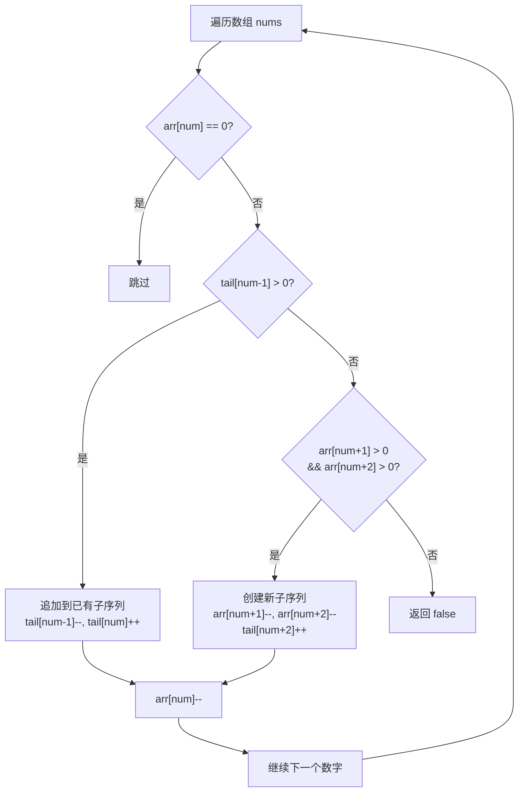

# 分割数组为连续子序列

## 简介

将升序数组分割成一个或多个子序列，每个子序列由连续整数组成且长度至少为 3。判断是否能完成分割。贪心策略：**优先将当前数字追加到已有子序列，否则尝试创建新的长度为 3 的子序列**。

## 贪心决策流程



## 代码实现

```javascript
/**
 * 题目：分割数组为连续子序列（LeetCode 659）
 * 描述：将升序数组分割成一个或多个子序列，每个子序列由连续整数组成且长度至少为 3。
 *       判断是否能完成分割。
 * 示例：[1,2,3,3,4,5] -> true（可分割为 [1,2,3] 和 [3,4,5]）
 *
 * 解法：贪心 + 哈希计数
 * 思路：
 * - arr[num] 记录数字 num 的剩余出现次数
 * - tail[num] 记录以 num 结尾的有效子序列数量
 * - 遍历每个数字，优先追加到已有子序列（tail[num-1] > 0）
 * - 否则尝试创建新子序列（检查 num+1 和 num+2 是否存在）
 * - 都不行则返回 false
 * 时间复杂度：O(n)；空间复杂度：O(n)
 */

/**
 * @param {number[]} nums
 * @return {boolean}
 */
const isPossible = function (nums) {
  let max = nums[nums.length - 1];
  let arr = new Array(max + 2).fill(0);
  let tail = new Array(max + 2).fill(0);
  for (let num of nums) arr[num]++;
  for (let num of nums) {
    if (arr[num] === 0) continue;
    else if (tail[num - 1] > 0) {
      tail[num - 1]--;
      tail[num]++;
    } else if (arr[num + 1] > 0 && arr[num + 2] > 0) {
      arr[num + 1]--;
      arr[num + 2]--;
      tail[num + 2]++;
    } else {
      return false;
    }
    arr[num]--;
  }
  return true;
};
```

## 逐行解析

- 第 22 行：获取数组中最大值，用于创建计数数组
- 第 23 行：`arr` 数组记录每个数字的剩余出现次数
- 第 24 行：`tail` 数组记录以每个数字结尾的有效子序列数量
- 第 25 行：遍历 nums，统计每个数字的出现次数
- 第 26-39 行：再次遍历 nums，对每个数字进行贪心分配
  - 第 27 行：如果该数字已被使用完，跳过
  - 第 28-30 行：如果有以 num-1 结尾的子序列，将当前数字追加到该子序列后（tail[num-1] 减 1，tail[num] 加 1）
  - 第 31-34 行：否则尝试创建一个新子序列，需要 num+1 和 num+2 都有剩余
  - 第 35-36 行：都不满足则返回 false
  - 第 38 行：当前数字使用次数减 1
- 第 40 行：所有数字都分配成功，返回 true

## 示例输入输出

| 输入 | 输出 | 子序列 |
|------|------|--------|
| `[1,2,3,3,4,5]` | true | `[1,2,3]` 和 `[3,4,5]` |
| `[1,2,3,4,4,5]` | false | 无法构成长度 >= 3 的所有子序列 |
| `[1,2,3,4,5,5,6,7]` | true | `[1,2,3,4,5]` 和 `[5,6,7]` |

## 复杂度分析

| 指标 | 值 |
|------|-----|
| 时间复杂度 | O(n) — 两次线性遍历 |
| 空间复杂度 | O(n) — 两个计数数组 |
