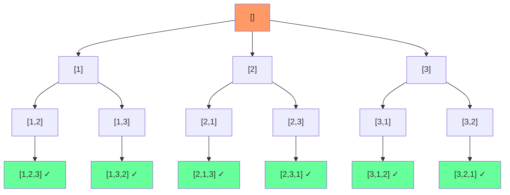

# 全排列问题

## 简介

给定一个没有重复数字的序列，返回所有可能的全排列。使用**回溯算法**，通过 DFS 深度优先遍历所有可能的选择，用 used 数组标记已使用的数字，当路径长度等于 nums 长度时收集结果。

## 决策树

以 `[1,2,3]` 为例，回溯决策树如下：



## 代码实现

```javascript
/**
 * 题目：全排列问题（LeetCode 46）
 * 描述：给定一个没有重复数字的序列，返回所有可能的全排列。
 * 示例：[1,2,3] -> [[1,2,3],[1,3,2],[2,1,3],[2,3,1],[3,1,2],[3,2,1]]
 *
 * 解法：回溯算法
 * 思路：使用 DFS 深度优先遍历所有可能的选择。
 * - used 数组标记已使用的数字
 * - path 记录当前路径
 * - 当 path 长度等于 nums 长度时，找到一个排列
 * - 回溯时撤销选择（used[i]=false, path.pop()）
 * 时间复杂度：O(n! * n)；空间复杂度：O(n)
 */

/**
 * @param {number[]} nums
 * @return {number[][]}
 */
let permute = function (nums) {
  let res = [];
  if (nums.length === 0) return res;
  let used = {}, path = [];
  const dfs = function (nums, len, depth, path, used, res) {
    if (depth === len) {
      res.push([...path]);
      return;
    }
    for (let i = 0; i < len; i++) {
      if (!used[i]) {
        path.push(nums[i]);
        used[i] = true;
        dfs(nums, len, depth + 1, path, used, res);
        used[i] = false;
        path.pop();
      }
    }
  };
  dfs(nums, nums.length, 0, path, used, res);
  return res;
};
```

## 逐行解析

- 第 20-21 行：初始化结果数组 res，处理空输入
- 第 22 行：`used` 对象标记已使用的下标，`path` 数组记录当前路径
- 第 23-37 行：定义 DFS 递归函数
  - 第 24-27 行：`depth === len` 表示路径长度等于 nums 长度，找到一个完整排列，将 path 的拷贝加入结果
  - 第 28-36 行：遍历每个位置
    - 第 29 行：如果当前数字未使用
    - 第 30-31 行：选择该数字，标记已使用
    - 第 32 行：递归进入下一层
    - 第 33-34 行：**回溯** — 撤销选择，取消标记
- 第 38 行：调用 DFS 入口
- 第 39 行：返回结果

## 示例输入输出

| 输入 | 输出 |
|------|------|
| `[1,2,3]` | `[[1,2,3],[1,3,2],[2,1,3],[2,3,1],[3,1,2],[3,2,1]]` |
| `[0,1]` | `[[0,1],[1,0]]` |
| `[1]` | `[[1]]` |

## 复杂度分析

| 指标 | 值 |
|------|-----|
| 时间复杂度 | O(n! × n) — n! 个排列，每个需要 O(n) 复制 |
| 空间复杂度 | O(n) — 递归栈深度 n，加上 path 和 used |
