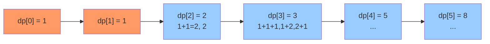

# 爬楼梯

## 简介

每次可以爬 1 或 2 个台阶，求爬到 n 阶楼顶有多少种方法。本质是**斐波那契数列**问题：f(n) = f(n - 1) + f(n - 2)。

## 状态转移图（DP 表格）



## 代码实现

```javascript
/**
 * 题目：爬楼梯（LeetCode 70）
 * 描述：每次可以爬 1 或 2 个台阶，求爬到 n 阶楼顶有多少种方法。
 * 本质：斐波那契数列问题 f(n) = f(n-1) + f(n-2)
 *
 * 解法一：动态规划（数组）
 * 思路：dp[i] = dp[i-1] + dp[i-2]，dp[0]=1, dp[1]=1
 * 时间复杂度：O(n)；空间复杂度：O(n)
 *
 * 解法二：动态规划（滚动变量优化）
 * 思路：用三个变量滚动计算，节省空间
 * 时间复杂度：O(n)；空间复杂度：O(1)
 */

/**
 * climbStairs - DP 数组版
 * @param {number} n
 * @return {number}
 */
let climbStairs = function (n) {
  let dp = [1, 1];
  for (let i = 2; i <= n; i++) {
    dp[i] = dp[i - 1] + dp[i - 2];
  }
  return dp[n];
};

/**
 * climbStairs2 - 滚动变量优化版
 * @param {number} n
 * @return {number}
 */
let climbStairs2 = function (n) {
  let res = 1, n1 = 1, n2 = 1;
  for (let i = 2; i <= n; i++) {
    res = n1 + n2;
    n1 = n2;
    n2 = res;
  }
  return res;
};
```

## 逐行解析

### DP 数组版（climbStairs）
- 第 21 行：初始化 dp[0] = 1（0 阶 → 1 种方法），dp[1] = 1（1 阶 → 1 种方法）
- 第 22-24 行：从 i = 2 开始递推，dp[i] = dp[i-1] + dp[i-2]
- 第 25 行：返回 dp[n]

### 滚动变量版（climbStairs2）
- 第 34 行：res 初始为 dp[1]，n1 为 dp[0]，n2 为 dp[1]
- 第 35-39 行：每次迭代滚动：res = n1 + n2，然后 n1 = n2, n2 = res
- 第 40 行：返回 res

## 示例输入输出

| 输入 n | 输出 | 方法列举 |
|--------|------|---------|
| 2 | 2 | 1+1, 2 |
| 3 | 3 | 1+1+1, 1+2, 2+1 |
| 4 | 5 | 1+1+1+1, 1+1+2, 1+2+1, 2+1+1, 2+2 |
| 5 | 8 | ... |

## 复杂度分析

| 版本 | 时间复杂度 | 空间复杂度 |
|------|-----------|-----------|
| DP 数组版 | O(n) | O(n) |
| 滚动变量版 | O(n) | O(1) |
