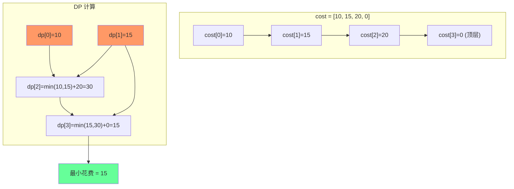

# 使用最小花费爬楼梯

## 简介

每个阶梯 i 有体力花费 cost[i]，每爬上一个阶梯要花费对应体力，然后可以选择爬 1 或 2 个阶梯。求到达顶层的最小花费。可从索引 0 或 1 开始。状态转移：**dp[i] = min(dp[i-2], dp[i-1]) + cost[i]**。

## 状态转移图



## 代码实现

```javascript
/**
 * 题目：使用最小花费爬楼梯（LeetCode 746）
 * 描述：每个阶梯 i 有体力花费 cost[i]，每爬上一个阶梯要花费对应体力，
 *       然后可以选择爬 1 或 2 个阶梯。求到达顶层的最小花费。
 *       可以从索引 0 或 1 开始。
 *
 * 解法一：动态规划（数组）
 * 思路：dp[i] = Math.min(dp[i-2], dp[i-1]) + cost[i]
 *       cost 最后补 0 表示顶层
 * 时间复杂度：O(n)；空间复杂度：O(n)
 *
 * 解法二：滚动变量优化
 * 时间复杂度：O(n)；空间复杂度：O(1)
 */

/**
 * minCostClimbingStairs - DP 数组版
 * @param {number[]} cost
 * @return {number}
 */
let minCostClimbingStairs = function (cost) {
  cost.push(0);
  let dp = [], n = cost.length;
  dp[0] = cost[0];
  dp[1] = cost[1];
  for (let i = 2; i < n; i++) {
    dp[i] = Math.min(dp[i - 2], dp[i - 1]) + cost[i];
  }
  return dp[n - 1];
};

/**
 * minCostClimbingStairs2 - 滚动变量优化版
 * @param {number[]} cost
 * @return {number}
 */
let minCostClimbingStairs2 = function (cost) {
  let n = cost.length, n1 = cost[0], n2 = cost[1];
  for (let i = 2; i < n; i++) {
    let tmp = n2;
    n2 = Math.min(n1, n2) + cost[i];
    n1 = tmp;
  }
  return Math.min(n1, n2);
};
```

## 逐行解析

### DP 数组版
- 第 22 行：在 cost 末尾补 0，表示顶层（到达顶层不需要再花费）
- 第 24-25 行：dp[0] 和 dp[1] 初始化为 cost[0] 和 cost[1]（可以从 0 或 1 开始）
- 第 26-28 行：dp[i] = min(dp[i-2], dp[i-1]) + cost[i]
- 第 29 行：返回 dp[n-1]（最后一项，即顶层的最小花费）

### 滚动变量版
- 第 38 行：n1 和 n2 分别代表 dp[i-2] 和 dp[i-1]
- 第 39-43 行：每次迭代计算新的 n2（即 dp[i]），将旧的 n2 存入 tmp 作为下一轮的 n1
- 第 44 行：最终取 min(n1, n2) 注意 n1 是 dp[n-2]，n2 是 dp[n-1]

## 示例输入输出

| 输入 cost | 输出 | 说明 |
|-----------|------|------|
| `[10, 15, 20]` | 15 | 从第 1 阶开始，跳过第 2 阶，花费 15 |
| `[1, 100, 1, 1, 1, 100, 1, 1, 100, 1]` | 6 | 最优路径：0→2→4→6→7→9 |

## 复杂度分析

| 版本 | 时间复杂度 | 空间复杂度 |
|------|-----------|-----------|
| DP 数组版 | O(n) | O(n) |
| 滚动变量版 | O(n) | O(1) |
