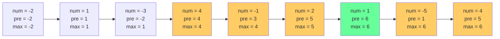

# 最大子序和

## 简介

找到具有最大和的连续子数组（至少包含一个元素），返回其最大和。使用 **Kadane 算法**（动态规划），核心思路：遍历数组，`pre` 记录以当前元素结尾的最大子数组和，如果 pre > 0 则累加，否则重新开始。

## 状态转移图

以 `[-2, 1, -3, 4, -1, 2, 1, -5, 4]` 为例：



绿色标记最大子数组和 6（子数组 `[4, -1, 2, 1]`）。

## 代码实现

```javascript
/**
 * 题目：最大子序和（LeetCode 53）
 * 描述：找到具有最大和的连续子数组（至少包含一个元素），返回其最大和。
 * 示例：[-2,1,-3,4,-1,2,1,-5,4] -> 6（子数组 [4,-1,2,1]）
 *
 * 解法：动态规划（Kadane 算法）
 * 思路：遍历数组，pre 记录以当前元素结尾的最大子数组和。
 *       如果 pre > 0，则 pre + num 肯定更大；否则从 num 重新开始。
 *       max 记录全局最大值。
 * 时间复杂度：O(n)；空间复杂度：O(1)
 */

/**
 * @param {number[]} nums
 * @return {number}
 */
let maxSubArray = function (nums) {
  let max = nums[0], pre = 0;
  for (const num of nums) {
    if (pre > 0) pre += num;
    else pre = num;
    max = Math.max(max, pre);
  }
  return max;
};
```

## 逐行解析

- 第 18 行：`max` 初始化为第一个元素，`pre` 初始为 0
- 第 19-23 行：遍历每个元素
  - 第 20 行：如果 `pre > 0`，说明加上当前 num 能增大和
  - 第 21 行：否则从当前 num 重新开始（因为负数前缀只会拖累）
  - 第 22 行：更新全局最大值
- 第 24 行：返回全局最大和

## 示例输入输出

| 输入 | 输出 | 最大子数组 |
|------|------|-----------|
| `[-2,1,-3,4,-1,2,1,-5,4]` | 6 | `[4,-1,2,1]` |
| `[1]` | 1 | `[1]` |
| `[5,4,-1,7,8]` | 23 | `[5,4,-1,7,8]` |
| `[-1]` | -1 | `[-1]` |

## 复杂度分析

| 指标 | 值 |
|------|-----|
| 时间复杂度 | O(n) — 一次遍历 |
| 空间复杂度 | O(1) — 常数变量 |
