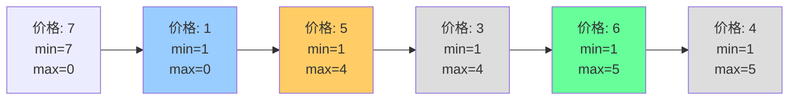

# 买卖股票的最佳时机 I

## 简介

只允许完成一笔交易（买入 + 卖出一次），求最大利润。在遍历过程中记录**历史最低点**，计算每天卖出能获得的最大利润，取最大值。

## 状态变化图

以 `[7, 1, 5, 3, 6, 4]` 为例：



蓝色=买入点（价格 1），绿色=卖出点（价格 6，利润 5）。

## 代码实现

```javascript
/**
 * 题目：买卖股票的最佳时机 I（LeetCode 121）
 * 描述：只允许完成一笔交易（买入 + 卖出一次），求最大利润。
 * 示例：[7,1,5,3,6,4] -> 5（第2天1元买入，第5天6元卖出）
 *
 * 解法：贪心 / DP
 * 思路：遍历价格，记录历史最低点 minprice。
 *       当天卖出可获得 prices[i] - minprice 的利润，
 *       取历史最大利润。
 * 时间复杂度：O(n)；空间复杂度：O(1)
 */

/**
 * @param {number[]} prices
 * @return {number}
 */
let maxProfit = function (prices) {
  let max = 0, minprice = prices[0];
  for (let i = 1; i < prices.length; i++) {
    minprice = Math.min(prices[i], minprice);
    max = Math.max(max, prices[i] - minprice);
  }
  return max;
};
```

## 逐行解析

- 第 18 行：初始化 max 为 0，minprice 为第一天价格
- 第 19-22 行：从第二天开始遍历
  - 第 20 行：更新历史最低价格
  - 第 21 行：计算当天卖出能获得的利润，取最大值
- 第 23 行：返回最大利润

## 示例输入输出

| 输入 | 输出 | 说明 |
|------|------|------|
| `[7,1,5,3,6,4]` | 5 | 第 2 天买入（1），第 5 天卖出（6） |
| `[7,6,4,3,1]` | 0 | 价格持续下跌，不交易 |

## 复杂度分析

| 指标 | 值 |
|------|-----|
| 时间复杂度 | O(n) — 一次遍历 |
| 空间复杂度 | O(1) — 两个变量 |
