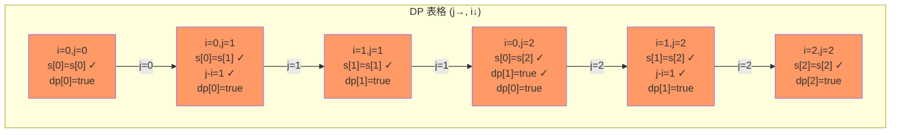

# 回文子串

## 简介

计算字符串中有多少个回文子串。不同位置的相同内容视为不同子串。提供两种解法：**暴力法**（枚举所有子串判断）和 **动态规划**（利用回文子串的递推关系）。

## DP 状态转移示意

以字符串 `"aaa"` 为例，DP 表格如下（j 为右边界，i 为左边界）：



所有 6 个子串均为回文，因此 count = 6。

## 代码实现

```javascript
/**
 * 题目：回文子串（LeetCode 647）
 * 描述：计算字符串中有多少个回文子串。不同位置的相同内容视为不同子串。
 * 示例："abc" -> 3（"a","b","c"）；"aaa" -> 6
 *
 * 解法一：暴力法
 * 思路：枚举所有子串，逐个判断是否为回文
 * 时间复杂度：O(n³)；空间复杂度：O(1)
 *
 * 解法二：动态规划
 * 思路：dp[i] 表示从 i 到当前 j 是否为回文
 *       状态转移：s[i]===s[j] && (j-i<=1 || dp[i+1])
 *       注意：外层循环是 j（右边界），内层是 i（左边界）
 * 时间复杂度：O(n²)；空间复杂度：O(n)
 */

/**
 * countSubstrings - 暴力法
 * @param {string} s
 * @return {number}
 */
let countSubstrings = function (s) {
  let count = 0;
  for (let i = 0; i < s.length; i++) {
    for (let j = i; j < s.length; j++) {
      if (isPalindrome(s.substring(i, j + 1))) count++;
    }
  }
  return count;
};

let isPalindrome = function (s) {
  let i = 0, j = s.length - 1;
  while (i < j) {
    if (s[i] != s[j]) return false;
    i++;
    j--;
  }
  return true;
};

/**
 * countSubstrings2 - 动态规划
 * @param {string} s
 * @return {number}
 */
let countSubstrings2 = function (s) {
  const len = s.length;
  let count = 0;
  const dp = new Array(len);
  for (let j = 0; j < len; j++) {
    for (let i = 0; i <= j; i++) {
      if (s[i] === s[j] && (j - i <= 1 || dp[i + 1])) {
        dp[i] = true;
        count++;
      } else {
        dp[i] = false;
      }
    }
  }
  return count;
};
```

## 逐行解析

### 暴力法
- 第 23-29 行：双层循环枚举所有子串（i 为起点，j 为终点）
- 第 26 行：调用 isPalindrome 判断子串是否为回文
- 第 32-40 行：双指针判断回文

### 动态规划（countSubstrings2）
- 第 48 行：dp 压缩为一维数组，dp[i] 表示从 i 到当前右边界 j 是否为回文
- 第 49-60 行：外层循环 j 为右边界，内层循环 i 为左边界
  - 第 51 行：核心状态转移方程
    - `s[i] === s[j]`：两端字符相等
    - `j - i <= 1`：长度为 1 或 2 的子串
    - `dp[i + 1]`：内部子串为回文（利用上一轮 j-1 的结果）
  - 第 52-53 行：回文则 dp[i] = true，count++
  - 第 55 行：否则 dp[i] = false

## 示例输入输出

| 输入 | 输出 | 回文子串 |
|------|------|----------|
| `"abc"` | 3 | "a", "b", "c" |
| `"aaa"` | 6 | "a", "a", "a", "aa", "aa", "aaa" |

## 复杂度分析

| 版本 | 时间复杂度 | 空间复杂度 |
|------|-----------|-----------|
| 暴力法 | O(n³) | O(1) |
| 动态规划 | O(n²) | O(n) |
