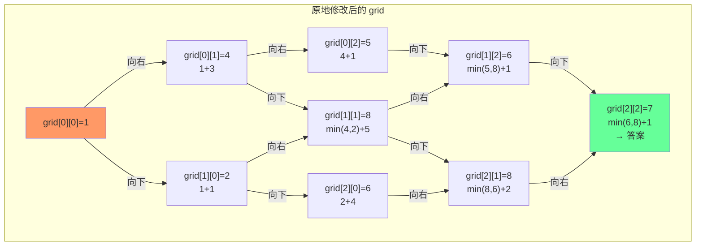

# 最小路径和

## 简介

给定 m × n 网格 grid，从左上角走到右下角，每次只能向下或向右移动一步，找出一条路径使得路径上的数字总和最小。使用**动态规划原地修改**，`grid[i][j]` 表示到达 (i,j) 的最小路径和。

## DP 状态转移（示例表格）

输入：`[[1,3,1],[1,5,1],[4,2,1]]`



最优路径：`1 → 3 → 1 → 1 → 1`，路径和 = 7。

## 代码实现

```javascript
/**
 * 题目：最小路径和（LeetCode 64）
 * 描述：给定 m x n 网格 grid，从左上角走到右下角，每次只能向下或向右移动一步。
 *       找出一条路径使得路径上的数字总和最小。
 * 示例：[[1,3,1],[1,5,1],[4,2,1]] -> 7（路径 1→3→1→1→1）
 *
 * 解法：动态规划（原地修改）
 * 思路：grid[i][j] 表示到达 (i,j) 的最小路径和。
 *       - 第一行：只能从左边来，grid[0][j] += grid[0][j-1]
 *       - 第一列：只能从上面来，grid[i][0] += grid[i-1][0]
 *       - 其他：grid[i][j] += Math.min(上, 左)
 * 时间复杂度：O(m*n)；空间复杂度：O(1)（原地修改）
 */

/**
 * @param {number[][]} grid
 * @return {number}
 */
var minPathSum = function (grid) {
  let row = grid.length, col = grid[0].length;
  for (let i = 1; i < row; i++) grid[i][0] += grid[i - 1][0];
  for (let j = 1; j < col; j++) grid[0][j] += grid[0][j - 1];
  for (let i = 1; i < row; i++)
    for (let j = 1; j < col; j++)
      grid[i][j] += Math.min(grid[i - 1][j], grid[i][j - 1]);
  return grid[row - 1][col - 1];
};
```

## 逐行解析

- 第 20 行：获取网格的行数 row 和列数 col
- 第 21 行：处理第一列（i >= 1），只能从上方来，累加上方值
- 第 22 行：处理第一行（j >= 1），只能从左方来，累加左方值
- 第 23-25 行：遍历剩余格子，`grid[i][j] += Math.min(上方, 左方)`
- 第 26 行：返回右下角的值（即为最小路径和）

## 示例输入输出

| 输入 grid | 输出 | 路径 |
|-----------|------|------|
| `[[1,3,1],[1,5,1],[4,2,1]]` | 7 | 1→3→1→1→1 |
| `[[1,2,3],[4,5,6]]` | 12 | 1→2→3→6 |

## 复杂度分析

| 指标 | 值 |
|------|-----|
| 时间复杂度 | O(m × n) — 遍历每个格子一次 |
| 空间复杂度 | O(1) — 原地修改，不使用额外空间 |
