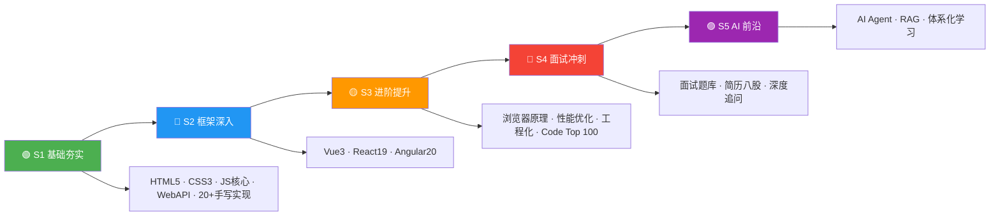

# 🎯 前端面试知识体系 · 完整导航

>**手写算法项目知识汇总** — 涵盖前端八股文、算法、框架、工程化、简历指导等全方位知识体系

---

## 🗺️ 五阶段学习路径图



---

## 📋 项目概览

本项目按 **准备面试五阶段** 编排，覆盖前端面试全部核心领域。

| 阶段 | 文件（点击跳转） | 内容 |
|------|------------------|------|
| **🟢 S1 基础夯实** | [`01-HTML.md`](S1-基础夯实/01-HTML.md) | src vs href、语义化、HTML5、Canvas vs SVG、Web Components、Resource Hints、View Transitions、Import Map、WebSocket、WebRTC、Popover API、Dialog、ARIA、表单高级特性、Service Worker/PWA、解析机制 |
| | [`02-CSS.md`](S1-基础夯实/02-CSS.md) | 选择器优先级、盒模型、Flex/Grid、BFC、定位、动画、场景应用(三角形/扇形/0.5px)、Container Queries、:has()、@layer、Nesting、@property、滚动驱动动画、Anchor Positioning、@scope、Subgrid、Tailwind、现代视口单位、编程题集 |
| | [`03-JavaScript-核心.md`](S1-基础夯实/03-JavaScript-核心.md) 🆕 | 8种数据类型、闭包、原型链、this绑定、执行上下文、Promise/async/await、ES6+(Map/Set/Symbol/BigInt)、面向对象继承、GC/内存泄漏、Immutable Array、RegExp v flag、Promise.try、现代JS新特性(ES2024-2027) |
| | [`04-JavaScript-WebAPI.md`](S1-基础夯实/04-JavaScript-WebAPI.md) 🆕 | 浏览器 Web API大全(IntersectionObserver/MutationObserver/Clipboard/FileSystem/Navigation等)、20+手写实现(防抖节流/深拷贝/Promise系列/发布订阅)、经典代码输出题 |
| **🔵 S2 框架深入** | [`01-Vue3.md`](S2-框架深入/01-Vue3.md) | Composition API、ref/reactive、Proxy响应式、模板指令、组件通信、Vue Router、Pinia、高级组件、自定义指令、TypeScript集成、Vite工程实践、性能优化、Vue 3.6 Alien Signals、面试题 |
| | [`02-React19.md`](S2-框架深入/02-React19.md) | JSX、Hooks系统、Context API、Refs/Portals、Error Boundaries、HOC/Render Props、Fiber架构、React 19 Actions/use()、React Compiler、Next.js、状态管理、并发模式、Server Components、性能优化、面试题 |
| | [`03-Angular20.md`](S2-框架深入/03-Angular20.md) | Angular 20新特性、Angular 21进展、组件/模板/指令、数据绑定、生命周期、DI系统、Signals、RxJS、路由系统、表单处理、HTTP客户端、状态管理、动画、OnPush、Zoneless、httpResource、工程实践、面试题 |
| | [`04-框架对比.md`](S2-框架深入/04-框架对比.md) 🆕 | 三大框架核心哲学、响应式原理、组件化、状态管理、路由、构建工具、TypeScript集成、性能优化策略、学习曲线、面试问答、选型决策树 |
| **🟡 S3 进阶提升** | [`01-浏览器原理.md`](S3-进阶提升/01-浏览器原理.md) | XSS/CSRF/MITM、多进程架构、缓存策略、渲染流水线、事件机制、事件循环、V8垃圾回收、bfcache、预渲染(Speculation Rules) |
| | [`02-性能优化.md`](S3-进阶提升/02-性能优化.md) | CDN、懒加载、回流重绘、节流防抖、图片优化(WebP等)、Webpack优化、Core Web Vitals(LCP/INP/CLS)、资源加载优化、GPU加速、Critical CSS、前沿(Islands/Streaming SSR) |
| | [`03-前端工程化.md`](S3-进阶提升/03-前端工程化.md) | 模块化、Git、Webpack、Babel、现代构建(Vite/esbuild/Turbopack/SWC/Rspack)、包管理(pnpm/Bun/Deno)、Monorepo(Turborepo)、微前端(Module Federation/qiankun/wujie)、代码质量(ESLint/Vitest/Playwright)、CI/CD(Docker/GitHub Actions)、新趋势(Biome/Rolldown/Vite 6) |
| | [`04-算法题解.md`](S3-进阶提升/04-算法题解.md) | Code Top 100 · 哈希表、双指针/滑动窗口、链表、二叉树、动态规划、字符串、二分查找、栈/队列、排序/TopK、回溯、DFS/BFS/图、设计题(LRU/Rand10) |
| | [`05-计算机网络.md`](S3-进阶提升/05-计算机网络.md) 🆕 | HTTP发展史(1.1→3)、HTTPS/TLS握手、TCP/UDP、DNS解析、浏览器缓存、CDN原理、CORS跨域、安全(XSS/CSRF/CSP)、Cookie/Session/JWT、HTTP状态码、WebSocket/SSE、QUIC/WebTransport |
| **🔴 S4 面试冲刺** | [`01-前端面试题库.md`](S4-面试冲刺/01-前端面试题库.md) | JS核心(类型/原型/闭包/继承)、异步/Promise/Event Loop、ES6+(Proxy/Reflect/ES2024-2025)、浏览器API、网络协议(HTTP/3/WebTransport)、CSS布局、工程化(Vite/Rspack/Turbopack)、框架机制(React 19/Zustand/Pinia/RTK)、设计模式、编程题 |
| | [`02-简历.md`](S4-面试冲刺/02-简历.md) | 简历模板与项目经验 |
| | [`03-简历问题.md`](S4-面试冲刺/03-简历问题.md) | React Fiber、SSE vs WebSocket、RxJS操作符、虚拟列表、OnPush变更检测、JWT安全、Event Loop、渲染流水线、TypeScript工具类型、Web Vitals、Webpack vs Vite、状态管理、微前端、XSS攻击 |
| **🟣 S5 AI 前沿** | [`01-AI前端开发体系化学习指南.md`](S5-AI/01-AI前端开发体系化学习指南.md) | 6阶段学习路径、Prompt Engineering、LangGraph工作流、Ollama本地部署、高级RAG、AI测试与CI/CD、成本估算、架构模式对比、Next.js AI架构 |
| | [`02-Agent.md`](S5-AI/02-Agent.md) | Agent架构与设计范式、ReAct/Plan-and-Execute/Reflection、记忆机制、Multi-Agent、Function Calling、MCP/A2A协议、AI Gateway、Transformer/Scaling Law/LoRA/DPO/PPO、KV Cache、LangChain框架 |
| **📘 导航** | README.md（本文件） | 知识导航与索引 |

---

## 📖 学习路径（按阶段）

---

### 🟢 S1 基础夯实（01-04）

> **目标：** 打好 HTML/CSS/JS 基础。 **建议用时：** 1-2 周

| 路径（点击跳转） | 核心知识点 |
|------------------|-----------|
| [1-HTML-详解版.md](S1-基础夯实/01-HTML.md) | src vs href、语义化标签、DOCTYPE、defer vs async、meta、HTML5 新特性、img srcset、行内/块级/空元素、Web Worker、离线存储、Canvas vs SVG、iframe、label、Web Components、Resource Hints、View Transitions、Import Map、WebSocket、WebRTC、Popover API、Dialog、ARIA、表单高级特性、Service Worker/PWA、HTML 解析机制 |
| [2-CSS-详解版.md](S1-基础夯实/02-CSS.md) | 选择器优先级、盒模型、Flex/Grid、BFC、定位、动画、场景应用(三角形/扇形/0.5px)、CSS 编程题 15 道、Container Queries、:has()、@layer、CSS Nesting、@property、Scroll-Driven Animations、Anchor Positioning、@scope、Subgrid、Tailwind、现代视口单位、light-dark()、:user-valid/:user-invalid |
| [3-JavaScript-核心.md](S1-基础夯实/03-JavaScript-核心.md) 🆕 | 8 种数据类型、原型链、闭包、this 绑定、执行上下文、Promise、async/await、ES6+(Map/Set/Symbol/BigInt)、面向对象继承、GC/内存泄漏、ES2024-2027 新特性 |
| [4-JavaScript-WebAPI.md](S1-基础夯实/04-JavaScript-WebAPI.md) 🆕 | 浏览器 Web API(IntersectionObserver/Clipboard/FileSystem/Navigation/Worker等)、20+ 手写实现(防抖节流/深拷贝/Promise/发布订阅)、经典代码输出题 |

---

### 🔵 S2 框架深入（01-04）

> **目标：** 选择一个主攻框架 + 通过框架对比文件横向理解差异。 **建议用时：** 2 周

| 路径（点击跳转） | 核心知识点 |
|------------------|-----------|
| [4-Vue3-详解版.md](S2-框架深入/01-Vue3.md) | Composition API、ref/reactive、Proxy 响应式、模板指令、组件通信、Vue Router、Pinia、高级组件、自定义指令、TypeScript 集成、Vite 工程实践、性能优化、Vue 3.6 Alien Signals、面试题 |
| [5-React19-详解版.md](S2-框架深入/02-React19.md) | JSX 语法、Hooks 系统、Context API、Refs/Portals、Error Boundaries、HOC/Render Props、Fiber 架构、React 19 Actions/use()、React Compiler、Next.js、状态管理、并发模式、Server Components、性能优化、面试题 |
| [6-Angular20-完整指南.md](S2-框架深入/03-Angular20.md) | Angular 20 新特性、Angular 21 进展、组件/模板/指令、数据绑定、生命周期、DI 系统、Signals、RxJS、路由系统、表单处理、HTTP 客户端、状态管理、动画、OnPush、Zoneless、httpResource、工程实践、面试题 |
| [7-框架对比.md](S2-框架深入/04-框架对比.md) 🆕 | 三大框架核心哲学、响应式原理、组件化、状态管理、路由、构建工具、TypeScript 集成、性能优化策略、学习曲线、面试问答、技术选型决策树 |

---

### 🟡 S3 进阶提升（01-05）

> **目标：** 深入浏览器原理、计算机网络、性能优化、工程化与算法。 **建议用时：** 2 周

| 路径（点击跳转） | 核心知识点 |
|------------------|-----------|
| [7-浏览器原理-详解版.md](S3-进阶提升/01-浏览器原理.md) | XSS/CSRF/MITM、多进程架构、缓存策略、渲染流水线、事件机制、事件循环、V8 垃圾回收、bfcache、预渲染(Speculation Rules API) |
| [8-性能优化-详解版.md](S3-进阶提升/02-性能优化.md) | CDN、懒加载、回流重绘、防抖节流、图片优化(WebP/雪碧图/Base64)、Webpack 优化、Core Web Vitals (LCP/INP/CLS)、资源加载优化(Resource Hints)、GPU 加速、Critical CSS、Edge Computing、Islands Architecture、Streaming SSR |
| [9-前端工程化-详解版.md](S3-进阶提升/03-前端工程化.md) | 模块化、Git、Webpack、Babel、现代构建(Vite/esbuild/Turbopack/SWC/Rspack)、包管理(pnpm/Bun/Deno)、Monorepo(Turborepo)、微前端(Module Federation/qiankun/wujie)、代码质量(ESLint/Vitest/Playwright)、CI/CD(Docker/GitHub Actions)、新趋势(Biome/Rolldown/Vite 6/MF 2.0) |
| [04-算法题解.md](S3-进阶提升/04-算法题解.md) | Code Top 100 · 哈希表、双指针/滑动窗口、链表、二叉树、动态规划、字符串、二分查找、栈/队列、排序/TopK、回溯、DFS/BFS/图、设计题(LRU/Rand10) |
| [05-计算机网络.md](S3-进阶提升/05-计算机网络.md) 🆕 | HTTP 发展史(1.1→3)、HTTPS/TLS、TCP/UDP、DNS、缓存、CDN、CORS、安全、状态码、WebSocket/SSE、WebTransport |

---

### 🔴 S4 面试冲刺（01-03）

> **目标：** 刷面试题库、深挖简历八股文。 **建议用时：** 1-2 周

| 路径（点击跳转） | 核心知识点 |
|------------------|-----------|
| [01-前端面试题库.md](S4-面试冲刺/01-前端面试题库.md) | JS 核心(类型/原型/闭包/继承)、异步/Promise/Event Loop、ES6+(Proxy/Reflect/ES2024-2025)、浏览器API、网络协议(HTTP/3/WebTransport/CORS/CDN)、CSS 布局、工程化(Vite/Rspack/Turbopack)、框架机制(React 19/Zustand/Pinia/RTK)、设计模式、编程题 |
| [02-简历.md](S4-面试冲刺/02-简历.md) | 简历模板、项目经验、技术栈描述 |
| [03-简历问题.md](S4-面试冲刺/03-简历问题.md) | React Fiber、SSE vs WebSocket、RxJS 操作符、虚拟列表、OnPush 变更检测、JWT 安全、Event Loop、渲染流水线、TypeScript 工具类型、Web Vitals、Webpack vs Vite、状态管理、微前端、XSS 攻击 |

---

### 🟣 S5 AI 前沿（01-02）

> **目标：** 掌握 AI Agent 架构与 AI 辅助前端开发体系。 **建议用时：** 1 周

| 路径（点击跳转） | 核心知识点 |
|------------------|-----------|
| [01-AI前端开发体系化学习指南.md](S5-AI/01-AI前端开发体系化学习指南.md) | 6 阶段学习路径、Prompt Engineering、LangGraph 工作流、Ollama 本地部署、高级 RAG 模式、AI 测试与 CI/CD、成本估算、架构模式对比、Next.js AI 架构 |
| [02-Agent.md](S5-AI/02-Agent.md) | Agent 架构与设计范式、ReAct/Plan-and-Execute/Reflection、记忆机制、Multi-Agent、Function Calling、MCP/A2A 协议、AI Gateway、Transformer/Scaling Law、LoRA/DPO/PPO、KV Cache、LangChain 框架 |

---

## 📁 目录结构

```
项目根目录/
|
|-- 📁 S1-基础夯实/          🟢 基础阶段（01-04）
|   |-- 01-HTML.md
|   |-- 02-CSS.md
|   |-- 03-JavaScript-核心.md    🆕 拆分
|   +-- 04-JavaScript-WebAPI.md  🆕 拆分
|
|-- 📁 S2-框架深入/          🔵 框架阶段（01-04）
|   |-- 01-Vue3.md
|   |-- 02-React19.md
|   |-- 03-Angular20.md
|   +-- 04-框架对比.md         🆕 新增
|
|-- 📁 S3-进阶提升/          🟡 进阶阶段（01-05）
|   |-- 01-浏览器原理.md
|   |-- 02-性能优化.md
|   |-- 03-前端工程化.md
|   |-- 04-算法题解.md
|   +-- 05-计算机网络.md       🆕 新增
|
|-- 📁 S4-面试冲刺/          🔴 冲刺阶段（01-03）
|   |-- 01-前端面试题库.md
|   |-- 02-简历.md
|   +-- 03-简历问题.md
|
|-- 📁 S5-AI/                🟣 AI 阶段（01-02）
|   |-- 01-AI前端开发体系化学习指南.md
|   +-- 02-Agent.md
|
+-- 📄 README.md             ← 导航文件
```

---

## 🚀 推荐学习节奏

| 时段 | 学习内容 | 每日附加 |
|------|---------|---------|
| 第 1-2 周 | 🌱 S1-基础夯实/ → 01+02+03 通读 | JS 手写练习 10 题/日 |
| 第 3-4 周 | 🌳 S2-框架深入/ → 选主攻框架精读 | 复习 S1 错题 |
| 第 5-6 周 | 🌿 S3-进阶提升/ → 01+02+03 系统学习 | Code Top 100 2-3 题/日 |
| 第 7-8 周 | 🏆 S4-面试冲刺/ → 01+03 反复刷 | Code Top 100 1 题/日 |
| 第 9 周 | 🤖 S5-AI/ → 01+02 了解前沿 | 关注 AI 工具更新 |

---

## ✅ 学习进度追踪

### S1 🟢 基础夯实

- [ ] [01-HTML.md](S1-基础夯实/01-HTML.md)
- [ ] [02-CSS.md](S1-基础夯实/02-CSS.md)
- [ ] [03-JavaScript-核心.md](S1-基础夯实/03-JavaScript-核心.md) 🆕
- [ ] [04-JavaScript-WebAPI.md](S1-基础夯实/04-JavaScript-WebAPI.md) 🆕

### S2 🔵 框架深入

- [ ] [01-Vue3.md](S2-框架深入/01-Vue3.md)
- [ ] [02-React19.md](S2-框架深入/02-React19.md)
- [ ] [03-Angular20.md](S2-框架深入/03-Angular20.md)
- [ ] [04-框架对比.md](S2-框架深入/04-框架对比.md) 🆕

### S3 🟡 进阶提升

- [ ] [01-浏览器原理.md](S3-进阶提升/01-浏览器原理.md)
- [ ] [02-性能优化.md](S3-进阶提升/02-性能优化.md)
- [ ] [03-前端工程化.md](S3-进阶提升/03-前端工程化.md)
- [ ] [04-算法题解.md](S3-进阶提升/04-算法题解.md)
- [ ] [05-计算机网络.md](S3-进阶提升/05-计算机网络.md) 🆕

### S4 🔴 面试冲刺

- [ ] [01-前端面试题库.md](S4-面试冲刺/01-前端面试题库.md)
- [ ] [02-简历.md](S4-面试冲刺/02-简历.md)
- [ ] [03-简历问题.md](S4-面试冲刺/03-简历问题.md)

### S5 🟣 AI 前沿

- [ ] [01-AI前端开发体系化学习指南.md](S5-AI/01-AI前端开发体系化学习指南.md)
- [ ] [02-Agent.md](S5-AI/02-Agent.md)

---

## 📊 文件统计

| 指标 | 数据 |
|------|------|
| 总文件数 | 18 份 Markdown + 1 份导航 |
| 总行数 | ~62,000+ 行（含 Mermaid 图解） |
| 总阶段 | 5 个 |
| 🟢 基础文档 | 4 份（JS 拆为核心 + WebAPI，~17,500+ 行） |
| 🔵 框架文档 | 4 份（含新增框架对比，~9,800+ 行） |
| 🟡 进阶文档 | 5 份（含新增计算机网络，~11,000+ 行） |
| 🔴 冲刺文档 | 3 份（含简历，~11,500+ 行） |
| 🟣 AI 文档 | 2 份（TOC 已重组折叠，~9,500+ 行） |
| 覆盖题型 | Code Top 100 算法题、300+ 面试题 |

---

> **🚀 祝面试顺利！** 按阶段逐步推进，每天坚持代码输出 + 算法，9 周拿下 offer 💪
