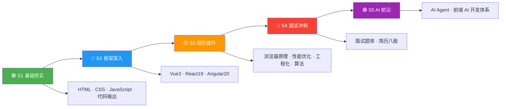

# 🎯 前端面试知识体系 · 完整导航

>**手写算法项目知识汇总** — 涵盖前端八股文、算法、框架、工程化、简历指导等全方位知识体系

---

## 🗺️ 四阶段学习路径图



---

## 📋 项目概览

本项目按 **准备面试四阶段** 编排，覆盖前端面试全部核心领域。

| 阶段 | 编号 | 文件（点击跳转） | 内容 |
|------|------|------------------|------|
| **🟢 S1 基础夯实** | 01 | [`01-HTML-详解版.md`](S1-基础夯实/01-HTML-详解版.md) | HTML5、语义化、Web Components、Popover、Dialog、ARIA、Service Worker |
| | 02 | [`02-CSS-详解版.md`](S1-基础夯实/02-CSS-详解版.md) | 选择器、布局、动画、编程题集、Container Queries、Anchor Positioning、@scope |
| | 03 | [`03-JavaScript-详解版.md`](S1-基础夯实/03-JavaScript-详解版.md) | 数据类型、闭包、原型链、异步、Immutable Array、Promise.try、Navigation API |
| | 04 | [`04-代码输出-详解版.md`](S1-基础夯实/04-代码输出-详解版.md) | Promise/this/作用域/原型输出题 |
| **🔵 S2 框架深入** | 05 | [`05-Vue3-详解版.md`](S2-框架深入/05-Vue3-详解版.md) | Vue 3、Composition API、响应式原理 |
| | 06 | [`06-React19-详解版.md`](S2-框架深入/06-React19-详解版.md) | React 19、Hooks、Fiber、Next.js |
| | 07 | [`07-Angular20-完整指南.md`](S2-框架深入/07-Angular20-完整指南.md) | Angular 20、Signals、DI、RxJS |
| **🟡 S3 进阶提升** | 08 | [`08-浏览器原理-详解版.md`](S3-进阶提升/08-浏览器原理-详解版.md) | 安全、缓存、渲染原理、事件循环 |
| | 09 | [`09-性能优化-详解版.md`](S3-进阶提升/09-性能优化-详解版.md) | CDN、懒加载、Web Vitals、渲染优化 |
| | 10 | [`10-前端工程化-详解版.md`](S3-进阶提升/10-前端工程化-详解版.md) | Webpack、Vite、Monorepo、CI/CD |
| | 11 | [`11-算法题解-CodeTop100.md`](S3-进阶提升/11-算法题解-CodeTop100.md) | LeetCode Top 100 手写 JS 实现 |
| **🔴 S4 面试冲刺** | 12 | [`12-前端面试题库.md`](S4-面试冲刺/12-前端面试题库.md) | 综合面试题、扫码登录、设计模式 |
| | 13 | [`13-简历.md`](S4-面试冲刺/13-简历.md) | 简历模板与项目经验 |
| | 14 | [`14-简历问题-深度八股.md`](S4-面试冲刺/14-简历问题-深度八股.md) | Fiber、SSE/WebSocket、RxJS、虚拟列表 |
| **🟣 S5 AI 前沿** | 15 | [`15-Agent-AI智能体.md`](S5-AI/15-Agent-AI智能体.md) | Agent 架构、Function Calling、MCP、2025/2026 趋势 |
| | 16 | [`16-AI前端开发体系化学习指南.md`](S5-AI/16-AI前端开发体系化学习指南.md) | AI 辅助前端开发体系化学习路径 |
| **📘 导航** | — | README.md（本文件） | 知识导航与索引 |

---

## 📖 学习路径（按阶段）

---

### 🟢 S1 基础夯实（01-04）

> **目标：** 打好 HTML/CSS/JS 基础，掌握代码输出题。 **建议用时：** 1-2 周

| 路径（点击跳转） | 核心知识点 |
|------------------|-----------|
| [1-HTML-详解版.md](S1-基础夯实/01-HTML-详解版.md) | src vs href、语义化标签、DOCTYPE、defer vs async、HTML5 新特性、Web Components、Popover API、Dialog、ARIA、表单高级特性、Service Worker/PWA、HTML 解析机制 |
| [2-CSS-详解版.md](S1-基础夯实/02-CSS-详解版.md) | 选择器优先级、盒模型、Flex/Grid、BFC、定位、动画、CSS 编程题 15 道、Container Queries、:has()、CSS Nesting、@property、Anchor Positioning、@scope、Scroll-Driven Animations |
| [3-JavaScript-详解版.md](S1-基础夯实/03-JavaScript-详解版.md) | 8 种数据类型、原型链、闭包、this 绑定、Promise、async/await、20+ 手写实现、Immutable Array、RegExp v flag、Promise.try、Navigation API、File System Access、Clipboard API |
| [4-代码输出-详解版.md](S1-基础夯实/04-代码输出-详解版.md) | 60+ 经典输出题：Promise 顺序、宏任务/微任务、this 指向、变量提升、原型链 |

---

### 🔵 S2 框架深入（05-07）

> **目标：** 选择一个主攻框架 + 了解其余框架的核心差异。 **建议用时：** 2 周

| 路径（点击跳转） | 核心知识点 |
|------------------|-----------|
| [5-Vue3-详解版.md](S2-框架深入/05-Vue3-详解版.md) | Composition API、ref/reactive、Proxy 响应式、模板指令、组件通信、Pinia、diff 算法 |
| [6-React19-详解版.md](S2-框架深入/06-React19-详解版.md) | Hooks 系统、Fiber 架构、React 19 Compiler/Actions、状态管理、Next.js、并发模式 |
| [7-Angular20-完整指南.md](S2-框架深入/07-Angular20-完整指南.md) | Signals、@if/@for/@defer、DI 系统、RxJS、路由守卫、表单、OnPush、httpResource |

---

### 🟡 S3 进阶提升（08-11）

> **目标：** 深入浏览器原理、性能优化、工程化与算法。 **建议用时：** 2 周

| 路径（点击跳转） | 核心知识点 |
|------------------|-----------|
| [8-浏览器原理-详解版.md](S3-进阶提升/08-浏览器原理-详解版.md) | XSS/CSRF、多进程架构、缓存策略、渲染流水线、事件循环、V8 垃圾回收、bfcache |
| [9-性能优化-详解版.md](S3-进阶提升/09-性能优化-详解版.md) | CDN、懒加载、回流重绘、防抖节流、Web Vitals (LCP/INP/CLS)、代码分割 |
| [10-前端工程化-详解版.md](S3-进阶提升/10-前端工程化-详解版.md) | 模块化、Git、Webpack/Vite/esbuild、Babel、pnpm、Monorepo、微前端、CI/CD |
| [11-算法题解-CodeTop100.md](S3-进阶提升/11-算法题解-CodeTop100.md) | 哈希表、双指针、链表、二叉树、动态规划、二分查找、回溯、LRU 缓存设计 |

---

### 🔴 S4 面试冲刺（12-14）

> **目标：** 刷面试题库、深挖简历八股文。 **建议用时：** 1-2 周

| 路径（点击跳转） | 核心知识点 |
|------------------|-----------|
| [12-前端面试题库.md](S4-面试冲刺/12-前端面试题库.md) | 类型系统、浮点数精度、闭包与内存、this 绑定、Promise 深度、扫码登录、虚拟 DOM |
| [13-简历.md](S4-面试冲刺/13-简历.md) | 简历模板、项目经验、技术栈描述 |
| [14-简历问题-深度八股.md](S4-面试冲刺/14-简历问题-深度八股.md) | React Fiber、SSE vs WebSocket、RxJS 操作符、虚拟列表、OnPush、JWT、Event Loop |

---

### 🟣 S5 AI 前沿（15-16）

> **目标：** 掌握 AI Agent 架构与 AI 辅助前端开发体系。 **建议用时：** 1 周

| 路径（点击跳转） | 核心知识点 |
|------------------|-----------|
| [15-Agent-AI智能体.md](S5-AI/15-Agent-AI智能体.md) | Agent vs LLM、ReAct/Plan-and-Execute、Function Calling、MCP 协议、MoE、LoRA、2025/2026 趋势 |
| [16-AI前端开发体系化学习指南.md](S5-AI/16-AI前端开发体系化学习指南.md) | AI 辅助编码、Prompt 工程、AI 工具链、前端 AI 应用场景 |

---

## 🧭 快速索引

### 按面试考点查找

| 考点 | 相关文档 |
|------|---------|
| HTML 语义化 & 标签 | [1](S1-基础夯实/01-HTML-详解版.md) , [12](S4-面试冲刺/12-前端面试题库.md) |
| CSS 布局 & 动画 | [2](S1-基础夯实/02-CSS-详解版.md) , [12](S4-面试冲刺/12-前端面试题库.md) |
| HTML 新特性 (Popover/Dialog/PWA) | [1](S1-基础夯实/01-HTML-详解版.md) |
| 现代 CSS (Container/Anchor/@scope) | [2](S1-基础夯实/02-CSS-详解版.md) |
| 现代 JS (Immutable Array/Promise.try) | [3](S1-基础夯实/03-JavaScript-详解版.md) |
| Web API (Navigation/Clipboard/File) | [3](S1-基础夯实/03-JavaScript-详解版.md) |
| JS 数据类型 & 类型转换 | [3](S1-基础夯实/03-JavaScript-详解版.md) , [12](S4-面试冲刺/12-前端面试题库.md) , [4](S1-基础夯实/04-代码输出-详解版.md) |
| 闭包 & 作用域 | [3](S1-基础夯实/03-JavaScript-详解版.md) , [简历八股](S4-面试冲刺/15-简历问题-深度八股.md) , [4](S1-基础夯实/04-代码输出-详解版.md) |
| 原型链 & 继承 | [3](S1-基础夯实/03-JavaScript-详解版.md) , [12](S4-面试冲刺/12-前端面试题库.md) , [4](S1-基础夯实/04-代码输出-详解版.md) |
| this 指向 & 箭头函数 | [3](S1-基础夯实/03-JavaScript-详解版.md) , [12](S4-面试冲刺/12-前端面试题库.md) , [4](S1-基础夯实/04-代码输出-详解版.md) |
| Promise & async/await | [3](S1-基础夯实/03-JavaScript-详解版.md) , [12](S4-面试冲刺/12-前端面试题库.md) , [4](S1-基础夯实/04-代码输出-详解版.md) |
| 事件循环 Event Loop | [3](S1-基础夯实/03-JavaScript-详解版.md) , [8](S3-进阶提升/08-浏览器原理-详解版.md) , [12](S4-面试冲刺/12-前端面试题库.md) , [简历八股](S4-面试冲刺/15-简历问题-深度八股.md) |
| 浏览器渲染原理 | [8](S3-进阶提升/08-浏览器原理-详解版.md) , [简历八股](S4-面试冲刺/15-简历问题-深度八股.md) |
| 浏览器缓存 | [8](S3-进阶提升/08-浏览器原理-详解版.md) , [12](S4-面试冲刺/12-前端面试题库.md) |
| 性能优化 (Web Vitals) | [9](S3-进阶提升/09-性能优化-详解版.md) , [简历八股](S4-面试冲刺/15-简历问题-深度八股.md) |
| 虚拟列表 | [简历八股](S4-面试冲刺/15-简历问题-深度八股.md) , [9](S3-进阶提升/09-性能优化-详解版.md) |
| React Hooks & Fiber | [6](S2-框架深入/06-React19-详解版.md) , [简历八股](S4-面试冲刺/15-简历问题-深度八股.md) |
| Vue 响应式原理 | [5](S2-框架深入/05-Vue3-详解版.md) |
| Angular DI & RxJS | [7](S2-框架深入/07-Angular20-完整指南.md) , [简历八股](S4-面试冲刺/15-简历问题-深度八股.md) |
| 算法 & 数据结构 | [11](S3-进阶提升/11-算法题解-CodeTop100.md) |
| AI Agent & MCP | [15-Agent](S5-AI/15-Agent-AI智能体.md) |
| 手写代码 & 输出题 | [4](S1-基础夯实/04-代码输出-详解版.md) , [3](S1-基础夯实/03-JavaScript-详解版.md) , [11](S3-进阶提升/11-算法题解-CodeTop100.md) |
| 简历指导 | [13-简历.md](S4-面试冲刺/13-简历.md) |

### 按难度等级

| 难度 | 推荐文件夹 | 说明 |
|------|-----------|------|
| 🟢 基础 | S1-基础夯实/ | 必读，零基础入门 |
| 🔵 进阶 | S2-框架深入/ | 选 1-2 个框架精读 |
| 🟡 高阶 | S3-进阶提升/ | 全面提升综合实力 |
| 🔴 冲刺 | S4-面试冲刺/ | 面试前最后冲刺 |
| 🟣 AI | S5-AI/ | AI Agent 与 AI 辅助开发 |

---

## 📁 目录结构

```
项目根目录/
|
|-- 📁 S1-基础夯实/          🟢 基础阶段（01-04）
|   |-- 01-HTML-详解版.md
|   |-- 02-CSS-详解版.md
|   |-- 03-JavaScript-详解版.md
|   +-- 04-代码输出-详解版.md
|
|-- 📁 S2-框架深入/          🔵 框架阶段（05-07）
|   |-- 05-Vue3-详解版.md
|   |-- 06-React19-详解版.md
|   +-- 07-Angular20-完整指南.md
|
|-- 📁 S3-进阶提升/          🟡 进阶阶段（08-11）
|   |-- 08-浏览器原理-详解版.md
|   |-- 09-性能优化-详解版.md
|   |-- 10-前端工程化-详解版.md
|   +-- 11-算法题解-CodeTop100.md
|
|-- 📁 S4-面试冲刺/          🔴 冲刺阶段（12-14）
|   |-- 12-前端面试题库.md
|   |-- 13-简历.md
|   +-- 14-简历问题-深度八股.md
|
|-- 📁 S5-AI/                🟣 AI 阶段（15-16）
|   |-- 15-Agent-AI智能体.md
|   +-- 16-AI前端开发体系化学习指南.md
|
+-- 📄 README.md             ← 导航文件
```

---

## 🚀 推荐学习节奏

| 时段 | 学习内容 | 每日附加 |
|------|---------|---------|
| 第 1-2 周 | 🌱 S1-基础夯实/ → 01+02+03 通读 | 04 代码输出 10 题/日 |
| 第 3-4 周 | 🌳 S2-框架深入/ → 选主攻框架精读 | 复习 S1 错题 |
| 第 5-6 周 | 🌿 S3-进阶提升/ → 08+09+10 系统学习 | 11 算法 2-3 题/日 |
| 第 7-8 周 | 🏆 S4-面试冲刺/ → 12+14 反复刷 | 04 输出 5 题 + 11 算法 1 题 |
| 第 9 周 | 🤖 S5-AI/ → 15+16 了解前沿 | 关注 AI 工具更新 |

---

## ✅ 学习进度追踪

### S1 🟢 基础夯实

- [ ] [01-HTML-详解版.md](S1-基础夯实/01-HTML-详解版.md)
- [ ] [02-CSS-详解版.md](S1-基础夯实/02-CSS-详解版.md)
- [ ] [03-JavaScript-详解版.md](S1-基础夯实/03-JavaScript-详解版.md)
- [ ] [04-代码输出-详解版.md](S1-基础夯实/04-代码输出-详解版.md)

### S2 🔵 框架深入

- [ ] [05-Vue3-详解版.md](S2-框架深入/05-Vue3-详解版.md)
- [ ] [06-React19-详解版.md](S2-框架深入/06-React19-详解版.md)
- [ ] [07-Angular20-完整指南.md](S2-框架深入/07-Angular20-完整指南.md)

### S3 🟡 进阶提升

- [ ] [08-浏览器原理-详解版.md](S3-进阶提升/08-浏览器原理-详解版.md)
- [ ] [09-性能优化-详解版.md](S3-进阶提升/09-性能优化-详解版.md)
- [ ] [10-前端工程化-详解版.md](S3-进阶提升/10-前端工程化-详解版.md)
- [ ] [11-算法题解-CodeTop100.md](S3-进阶提升/11-算法题解-CodeTop100.md)

### S4 🔴 面试冲刺

- [ ] [12-前端面试题库.md](S4-面试冲刺/12-前端面试题库.md)
- [ ] [13-简历.md](S4-面试冲刺/13-简历.md)
- [ ] [14-简历问题-深度八股.md](S4-面试冲刺/14-简历问题-深度八股.md)

### S5 🟣 AI 前沿

- [ ] [15-Agent-AI智能体.md](S5-AI/15-Agent-AI智能体.md)
- [ ] [16-AI前端开发体系化学习指南.md](S5-AI/16-AI前端开发体系化学习指南.md)

---

## 📊 文件统计

| 指标 | 数据 |
|------|------|
| 总文件数 | 16 份 Markdown + 1 份导航 |
| 总阶段 | 5 个 |
| 🟢 基础文档 | 4 份 |
| 🔵 框架文档 | 3 份 |
| 🟡 进阶文档 | 4 份 |
| 🔴 冲刺文档 | 3 份（含简历） |
| 🟣 AI 文档 | 2 份 |
| 覆盖题型 | 100+ 算法题、60+ 输出题、200+ 面试题 |

---

> **🚀 祝面试顺利！** 按阶段逐步推进，每天坚持代码输出 + 算法，9 周拿下 offer 💪
