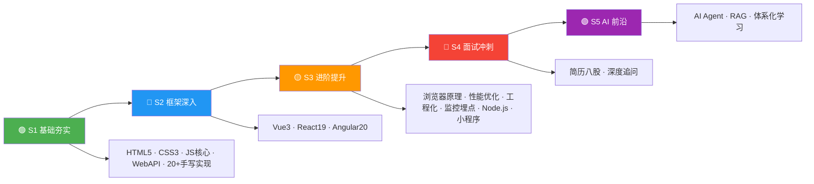

# 🎯 前端面试知识体系
---

## 🗺️ 五阶段学习路径图



---

## 📁 目录结构

```

项目根目录/
|
|-- 📁 S1-基础夯实/          🟢 基础阶段（01-04）
|   |-- 01-HTML.md
|   |-- 02-CSS.md
|   |-- 03-JavaScript-核心.md    🆕 拆分
|   +-- 04-JavaScript-WebAPI.md  🆕 拆分
|
|-- 📁 S2-框架深入/          🔵 框架阶段（01-07）
|   |-- 01-Vue3学习指南.md      实践向 📘
|   |-- 02-Vue3.md              面试向 📕
|   |-- 03-React学习指南.md      实践向 📘
|   |-- 04-React19.md           面试向 📕
|   |-- 05-Angular20学习指南.md  实践向 📘
|   |-- 06-Angular20.md         面试向 📕
|   +-- 07-框架对比.md          横向对比 🔗
|
|-- 📁 S3-进阶提升/          🟡 进阶阶段（01-08）
|   |-- 01-浏览器原理.md
|   |-- 02-性能优化.md
|   |-- 03-前端工程化.md
|   |-- 04-算法题解.md
|   |-- 05-计算机网络.md
|   |-- 06-前端监控与埋点.md     🆕 新增
|   |-- 07-Node.js与服务端.md    🆕 新增
|-- 📁 S4-面试冲刺/          🔴 冲刺阶段（01-03）
|   |-- 01-简历.md
|   |-- 02-简历问题.md
|   +-- 03-反向面试.md
|
|-- 📁 S5-AI/                🟣 AI 阶段（01-15 + README）
|   |-- 01-入门期-AI聊天室.md
|   |-- 02-进阶期-RAG应用.md
|   |-- 03-深耕期-端侧推理.md
|   |-- 04-专家期-Agent设计.md
|   |-- 05-生产化与工程化.md
|   |-- 06-前沿技术与生态.md
|   |-- 07-技术选型对比合集.md
|   |-- 08-开发实战与架构指南.md
|   |-- README.md
|   |-- 10-基础篇.md
|   |-- 11-工具协议篇.md
|   |-- 12-大模型基础篇.md
|   |-- 13-框架工具链篇.md
|   |-- 14-实战项目篇.md
|   |-- 15-前沿趋势篇.md
|
+-- 📄 README.md             ← 导航文件
```

---

## 📈 前端技术发展脉络（2010—2026）

> 了解技术从哪里来、到哪里去，是面试中展现"技术视野"的关键。

### 阶段一：刀耕火种（2010—2014）
```
HTML4 + CSS2 + jQuery         ← 原生 DOM 操作，贫血架构
├─ 2010: AngularJS（MVC 理念引入前端）
├─ 2011: React 诞生（虚拟 DOM 新范式）
├─ 2013: React 开源 + Node.js 生态萌芽
└─ 2014: HTML5 定稿，ES6 草案推进
```

### 阶段二：框架三国（2014—2019）
```
├─ 2014: Vue 1.0 发布（轻量级选手入场）
├─ 2015: React Native（跨平台）、ES6 正式发布
├─ 2016: Angular 2.0 重写（TypeScript 原生）、Vue 2.0
├─ 2017: React Fiber 架构重写开始
├─ 2018: Vue 3.0 提案（Proxy 响应式）
├─ 2019: React Hooks 发布（函数式革命）、Deno 1.0
```

### 阶段三：深度进化（2019—2024）
```
├─ 2020: Vue 3.0 正式版、Vite 诞生（ESM 开发服务器）
├─ 2021: React 18 Concurrent Mode、Angular Ivy 全面
├─ 2022: Next.js 13 App Router、Turbopack
├─ 2023: React 19 预览（Actions/use()）、Angular Signals
├─ 2024: React Compiler（自动记忆化）、Vue 3.5、Angular 18 Zoneless
```

### 阶段四：AI 融合（2024—2026）
```
├─ 2024: AI 编程助手（Cursor/Copilot）、LLM 前端集成
├─ 2025: Agent 互操作（MCP/A2A）、端侧推理（WebGPU）
├─ 2026: React 19 稳定、Vue 3.6 Alien Signals、Angular 21
│         AI Agent 标准化、Server Components 普及化
```

---

## 🔄 核心框架版本迭代速览

| 框架 | 第一代 | 重大重写 | 现代起点 | 最新版本 | 关键转折 |
|------|--------|---------|---------|---------|---------|
| **Vue** | Vue 1.0 (2014) | Vue 2.0 (2016) | Vue 3.0 (2020) | 3.6 (2026) | Options → Composition API |
| **React** | React 0.3 (2013) | React 16 Fiber (2017) | React 18 (2022) | 19 (2025) | Class → Hooks → Compiler |
| **Angular** | AngularJS (2010) | Angular 2 (2016) | Angular 15 (2022) | 21 (2026) | MVC → Component + Ivy |
| **构建工具** | Grunt → Gulp | Webpack 1-4 | Vite (2021) | Vite 8 (2026) | Bundle → ESM native |
| **Node.js** | 0.10 (2013) | 4.x LTS (2015) | 18 LTS (2022) | 22 LTS (2025) | CommonJS → ESM dual |

> 💡 **面试价值**：了解版本迭代的关键节点（如 AngularJS→Angular 2 的断裂式升级、React 16 Fiber 架构重写），能让面试官感受到你的"技术纵深"。

---

## 💼 职场心法

> **最佳跳槽时机 = 你不需要跳槽的时候**

- 永远保持"可被雇佣"状态（每季度更新一次简历）
- 用"离职者心态"打工（我现在做的哪件事，能写进下一份简历？）
- 入职第一天，就思考 3-5 年后（积累"年谈资"，还是积累"资本"？）
- 最可怕的不是跳槽，大家都在怕：打工人的精神状态，"我好像该走了，但不知道能去哪"。
---


