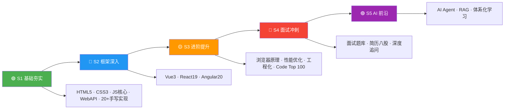

# 🎯 前端面试知识体系

---

## 💼 职场心法

> **最佳跳槽时机 = 你不需要跳槽的时候**

- 永远保持"可被雇佣"状态（每季度更新一次简历）
- 用"离职者心态"打工（我现在做的哪件事，能写进下一份简历？）
- 入职第一天，就思考 3-5 年后（积累"年谈资"，还是积累"资本"？）
- 最可怕的不是跳槽，大家都在怕：打工人的精神状态，"我好像该走了，但不知道能去哪"。

---

## 🗺️ 五阶段学习路径图



---

## 📁 目录结构

```

项目根目录/
|
|-- 📁 S1-基础夯实/          🟢 基础阶段（01-04）
|   |-- 01-HTML.md
|   |-- 02-CSS.md
|   |-- 03-JavaScript-核心.md    🆕 拆分
|   +-- 04-JavaScript-WebAPI.md  🆕 拆分
|
|-- 📁 S2-框架深入/          🔵 框架阶段（01-07）
|   |-- 01-Vue3学习指南.md      实践向 📘
|   |-- 02-Vue3.md              面试向 📕
|   |-- 03-React学习指南.md      实践向 📘
|   |-- 04-React19.md           面试向 📕
|   |-- 05-Angular20学习指南.md  实践向 📘
|   |-- 06-Angular20.md         面试向 📕
|   +-- 07-框架对比.md          横向对比 🔗
|
|-- 📁 S3-进阶提升/          🟡 进阶阶段（01-05）
|   |-- 01-浏览器原理.md
|   |-- 02-性能优化.md
|   |-- 03-前端工程化.md
|   |-- 04-算法题解.md
|   +-- 05-计算机网络.md       🆕 新增
|
|-- 📁 S4-面试冲刺/          🔴 冲刺阶段（01-03）
|   |-- 01-前端面试题库.md
|   |-- 02-简历.md
|   +-- 03-简历问题.md
|
|-- 📁 S5-AI/                🟣 AI 阶段（00-15）
|   |-- README.md
|   |-- 01-入门期-AI聊天室.md
|   |-- 02-进阶期-RAG应用.md
|   |-- 03-深耕期-端侧推理.md
|   |-- 04-专家期-Agent设计.md
|   |-- 05-生产化与工程化.md
|   |-- 06-前沿技术与生态.md
|   |-- 07-技术选型对比合集.md
|   |-- 08-开发实战与架构指南.md
|   |-- 09-附录与参考资料.md
|   |-- 10-基础篇.md
|   |-- 11-工具协议篇.md
|   |-- 12-大模型基础篇.md
|   |-- 13-框架工具链篇.md
|   |-- 14-实战项目篇.md
|   |-- 15-前沿趋势篇.md
|
+-- 📄 README.md             ← 导航文件
```

---

---

## 📈 前端技术发展脉络（2010—2026）

> 了解技术从哪里来、到哪里去，是面试中展现"技术视野"的关键。

### 阶段一：刀耕火种（2010—2014）
```
HTML4 + CSS2 + jQuery         ← 原生 DOM 操作，贫血架构
├─ 2010: AngularJS（MVC 理念引入前端）
├─ 2011: React 诞生（虚拟 DOM 新范式）
├─ 2013: React 开源 + Node.js 生态萌芽
└─ 2014: HTML5 定稿，ES6 草案推进
```

### 阶段二：框架三国（2014—2019）
```
├─ 2014: Vue 1.0 发布（轻量级选手入场）
├─ 2015: React Native（跨平台）、ES6 正式发布
├─ 2016: Angular 2.0 重写（TypeScript 原生）、Vue 2.0
├─ 2017: React Fiber 架构重写开始
├─ 2018: Vue 3.0 提案（Proxy 响应式）
├─ 2019: React Hooks 发布（函数式革命）、Deno 1.0
```

### 阶段三：深度进化（2019—2024）
```
├─ 2020: Vue 3.0 正式版、Vite 诞生（ESM 开发服务器）
├─ 2021: React 18 Concurrent Mode、Angular Ivy 全面
├─ 2022: Next.js 13 App Router、Turbopack
├─ 2023: React 19 预览（Actions/use()）、Angular Signals
├─ 2024: React Compiler（自动记忆化）、Vue 3.5、Angular 18 Zoneless
```

### 阶段四：AI 融合（2024—2026）
```
├─ 2024: AI 编程助手（Cursor/Copilot）、LLM 前端集成
├─ 2025: Agent 互操作（MCP/A2A）、端侧推理（WebGPU）
├─ 2026: React 19 稳定、Vue 3.6 Alien Signals、Angular 21
│         AI Agent 标准化、Server Components 普及化
```

---

## 🔄 核心框架版本迭代速览

| 框架 | 第一代 | 重大重写 | 现代起点 | 最新版本 | 关键转折 |
|------|--------|---------|---------|---------|---------|
| **Vue** | Vue 1.0 (2014) | Vue 2.0 (2016) | Vue 3.0 (2020) | 3.6 (2026) | Options → Composition API |
| **React** | React 0.3 (2013) | React 16 Fiber (2017) | React 18 (2022) | 19 (2025) | Class → Hooks → Compiler |
| **Angular** | AngularJS (2010) | Angular 2 (2016) | Angular 15 (2022) | 21 (2026) | MVC → Component + Ivy |
| **构建工具** | Grunt → Gulp | Webpack 1-4 | Vite (2021) | Vite 6 (2025) | Bundle → ESM native |
| **Node.js** | 0.10 (2013) | 4.x LTS (2015) | 18 LTS (2022) | 22 LTS (2025) | CommonJS → ESM dual |

> 💡 **面试价值**：了解版本迭代的关键节点（如 AngularJS→Angular 2 的断裂式升级、React 16 Fiber 架构重写），能让面试官感受到你的"技术纵深"。

---

## 📖 学习路径（按阶段）

---

### 🟢 S1 基础夯实（01-04）

> **目标：** 打好 HTML/CSS/JS 基础。 **建议用时：** 1-2 周

| 路径                                                         | 核心知识点                                                   |
| ------------------------------------------------------------ | ------------------------------------------------------------ |
| [01-HTML.md](S1-基础夯实/01-HTML.md)                         | src vs href、语义化标签、DOCTYPE、defer vs async、meta、HTML5 新特性、img srcset、行内/块级/空元素、Web Worker、离线存储、Canvas vs SVG、iframe、label、Web Components、Resource Hints、View Transitions、Import Map、WebSocket、WebRTC、Popover API、Dialog、ARIA、表单高级特性、Service Worker/PWA、HTML 解析机制 |
| [02-CSS.md](S1-基础夯实/02-CSS.md)                           | 选择器优先级、盒模型、Flex/Grid、BFC、定位、动画、场景应用(三角形/扇形/0.5px)、CSS 编程题 15 道、Container Queries、:has()、@layer、CSS Nesting、@property、Scroll-Driven Animations、Anchor Positioning、@scope、Subgrid、Tailwind、现代视口单位、light-dark()、:user-valid/:user-invalid |
| [3-JavaScript-核心.md](S1-基础夯实/03-JavaScript-核心.md) 🆕  | 8 种数据类型、原型链、闭包、this 绑定、执行上下文、Promise、async/await、ES6+(Map/Set/Symbol/BigInt)、面向对象继承、GC/内存泄漏、ES2024-2027 新特性 |
| [4-JavaScript-WebAPI.md](S1-基础夯实/04-JavaScript-WebAPI.md) 🆕 | 浏览器 Web API(IntersectionObserver/Clipboard/FileSystem/Navigation/Worker等)、20+ 手写实现(防抖节流/深拷贝/Promise/发布订阅)、经典代码输出题 |

---

### 🔵 S2 框架深入（01-07）

> **目标：** 选择一个主攻框架 + 通过框架对比文件横向理解差异。 **建议用时：** 2 周

| 路径 | 类型 | 核心知识点 |
|---|---|---|
| [01-Vue3学习指南.md](S2-框架深入/01-Vue3%E5%AD%A6%E4%B9%A0%E6%8C%87%E5%8D%97.md) | 📘 实践向 | 环境搭建 → Composition API → 响应式原理 → 组件系统 → Vue Router → Pinia → Hooks → TS → 性能优化 → 全栈实战 |
| [02-Vue3.md](S2-框架深入/02-Vue3.md) | 📕 面试向 | 五大设计理念、响应式引擎源码、模板编译、Diff 算法、keep-alive、源码面试题 |
| [03-React学习指南.md](S2-框架深入/03-React%E5%AD%A6%E4%B9%A0%E6%8C%87%E5%8D%97.md) | 📘 实践向 | React 19 初体验 → 组件化 → Tailwind → 状态管理 → TypeScript → Router → Hooks → Redux → 全栈电商实战 |
| [04-React19.md](S2-框架深入/04-React19.md) | 📕 面试向 | 设计理念、JSX 编译、Fiber 架构、Hooks 链表、React Compiler、Actions、Server Components、面试题 |
| [05-Angular20学习指南.md](S2-框架深入/05-Angular20%E5%AD%A6%E4%B9%A0%E6%8C%87%E5%8D%97.md) | 📘 实践向 | 环境搭建 → CLI → 组件 → 模板 → 指令 → DI → Signals → RxJS → 路由 → 表单 → HTTP → NgRx → 性能 → 全栈实战 |
| [06-Angular20.md](S2-框架深入/06-Angular20.md) | 📕 面试向 | 设计理念、变更检测、DI 源码、Signals 引擎、Router 守卫、Zoneless、httpResource、面试题 |
| [07-框架对比.md](S2-框架深入/07-%E6%A1%86%E6%9E%B6%E5%AF%B9%E6%AF%94.md) | 🔗 横评向 | 三大框架 16 个维度深度对比：响应式/组件化/状态管理/路由/构建/SSR/生态/TS/安全/性能/学习曲线/选型决策 |

---

### 🟡 S3 进阶提升（01-05）

> **目标：** 深入浏览器原理、计算机网络、性能优化、工程化与算法。 **建议用时：** 2 周

| 路径 | 核心知识点 |
|--------------------------------------------------------------------------------|-----------|
| [01-浏览器原理.md](S3-进阶提升/01-浏览器原理.md) | XSS/CSRF/MITM、多进程架构、缓存策略、渲染流水线、事件机制、事件循环、V8 垃圾回收、bfcache、预渲染(Speculation Rules API) |
| [02-性能优化.md](S3-进阶提升/02-性能优化.md) | CDN、懒加载、回流重绘、防抖节流、图片优化(WebP/雪碧图/Base64)、Webpack 优化、Core Web Vitals (LCP/INP/CLS)、资源加载优化(Resource Hints)、GPU 加速、Critical CSS、Edge Computing、Islands Architecture、Streaming SSR |
| [03-前端工程化.md](S3-进阶提升/03-前端工程化.md) | 模块化、Git、Webpack、Babel、现代构建(Vite/esbuild/Turbopack/SWC/Rspack)、包管理(pnpm/Bun/Deno)、Monorepo(Turborepo)、微前端(Module Federation/qiankun/wujie)、代码质量(ESLint/Vitest/Playwright)、CI/CD(Docker/GitHub Actions)、新趋势(Biome/Rolldown/Vite 6/MF 2.0) |
| [04-算法题解.md](S3-进阶提升/04-算法题解.md) | Code Top 100 · 哈希表、双指针/滑动窗口、链表、二叉树、动态规划、字符串、二分查找、栈/队列、排序/TopK、回溯、DFS/BFS/图、设计题(LRU/Rand10) |
| [05-计算机网络.md](S3-进阶提升/05-计算机网络.md) 🆕 | HTTP 发展史(1.1→3)、HTTPS/TLS、TCP/UDP、DNS、缓存、CDN、CORS、安全、状态码、WebSocket/SSE、WebTransport |

---

### 🔴 S4 面试冲刺（01-03）

> **目标：** 刷面试题库、深挖简历八股文。 **建议用时：** 1-2 周

| 路径 | 核心知识点 |
|--------------------------------------------------------------------------------|-----------|
| [01-前端面试题库.md](S4-面试冲刺/01-前端面试题库.md) | JS 核心(类型/原型/闭包/继承)、异步/Promise/Event Loop、ES6+(Proxy/Reflect/ES2024-2025)、浏览器API、网络协议(HTTP/3/WebTransport/CORS/CDN)、CSS 布局、工程化(Vite/Rspack/Turbopack)、框架机制(React 19/Zustand/Pinia/RTK)、设计模式、编程题 |
| [02-简历.md](S4-面试冲刺/02-简历.md) | 简历模板、项目经验、技术栈描述 |
| [03-简历问题.md](S4-面试冲刺/03-简历问题.md) | React Fiber、SSE vs WebSocket、RxJS 操作符、虚拟列表、OnPush 变更检测、JWT 安全、Event Loop、渲染流水线、TypeScript 工具类型、Web Vitals、Webpack vs Vite、状态管理、微前端、XSS 攻击 |

---

### 🟣 S5 AI 前沿（00-15）

> **目标：** 掌握 AI Agent 架构与 AI 辅助前端开发体系，从入门到专家期。 **建议用时：** 2-3 周

| 路径 | 核心知识点 |
|--------------------------------------------------------------------------------|-----------|
| [README.md](S5-AI/README.md) | 主指南 · 总纲、技术原理深究、学习路线图、AI 技术发展时间线（总览 + 索引） |
| [01-入门期-AI聊天室.md](S5-AI/01-入门期-AI聊天室.md) | LLM 核心参数、流式/同步调用、Vercel AI SDK、BPE Tokenizer 原理、SSE 协议详解、上下文窗口管理策略 |
| [02-进阶期-RAG应用.md](S5-AI/02-进阶期-RAG应用.md) | RAG 全景架构、LangChain 流水线、混合检索 (RRF)、语义分块、查询重写 (HyDE)、检索质量评估体系 |
| [03-深耕期-端侧推理.md](S5-AI/03-深耕期-端侧推理.md) | Transformers.js Pipeline、WebGPU Compute Shader (WGSL)、Buffer 复用池、模型量化 (INT4/AWQ/GPTQ)、离线缓存 |
| [04-专家期-Agent设计.md](S5-AI/04-专家期-Agent设计.md) | Agent 架构 (ReAct/PE/Reflection)、工具注册系统、多 Agent 协作 (Orchestrator/辩论)、Agent 通信协议、记忆管理、HITL 人机协同 |
| [05-生产化与工程化.md](S5-AI/05-生产化与工程化.md) | A/B 测试框架、灰度发布与回滚、生产监控仪表盘、Token Bucket 限流、Content Guardrails、SLA/SLO 定义 |
| [06-前沿技术与生态.md](S5-AI/06-前沿技术与生态.md) | MCP 协议深度解析 (JSON-RPC/工具发现/资源订阅)、A2A Agent Card 规范、AI 生成 UI (v0/Bolt)、Agentic Web、WASM AI 推理 |
| [07-技术选型对比合集.md](S5-AI/07-技术选型对比合集.md) | 模型/框架/工具链选型对比、开源 vs 商业方案、成本效益分析 |
| [08-开发实战与架构指南.md](S5-AI/08-开发实战与架构指南.md) | 完整项目架构、代码组织、调试技巧、性能调优、最佳实践 |
| [09-附录与参考资料.md](S5-AI/09-附录与参考资料.md) | 推荐阅读、学习资源、工具清单、术语表 |
| [10~15-面试题库](S5-AI/10-基础篇.md) | 6 模块 199 题：基础篇(32题)、工具协议(16题)、大模型基础(84题)、框架工具链(20题)、实战项目(25题)、前沿趋势(22题) — 每题含 💡要点+Mermaid图+对比表+代码示例 |

---


## 🚀 推荐学习节奏

| 时段 | 学习内容 | 每日附加 |
|------|---------|---------|
| 第 1-2 周 | 🌱 S1-基础夯实/ → 01+02+03 通读 | JS 手写练习 10 题/日 |
| 第 3-4 周 | 🌳 S2-框架深入/ → 选主攻框架精读 | 复习 S1 错题 |
| 第 5-6 周 | 🌿 S3-进阶提升/ → 01+02+03 系统学习 | Code Top 100 2-3 题/日 |
| 第 7-8 周 | 🏆 S4-面试冲刺/ → 01+03 反复刷 | Code Top 100 1 题/日 |
| 第 9-10 周 | 🤖 S5-AI/ → README+04+05+10~12 核心必读，其余选读 | 关注 AI 工具更新 |
| 第 11-12 周 | 🤖 S5-AI/ → 13~15 面试题库冲刺 + 07 选型对比 | 模拟面试自测 |

---

**🚀 祝面试顺利！** 按阶段逐步推进，每天坚持代码输出 + 算法，12 内 周拿下 offer 💪

