# 📚 HTML 知识点详解版

> 🎯 **面试星级**：★★★★☆ | **建议用时**：2 天
> HTML 核心知识全面梳理，涵盖语义化、HTML5 新特性、Web Components、Resource Hints、Service Workers 等核心考点

---


## 📈 HTML 版本演进史

> HTML 自 1993 年诞生以来，经历了从"文档标记语言"到"应用开发平台"的蜕变。

### HTML 版本时间线

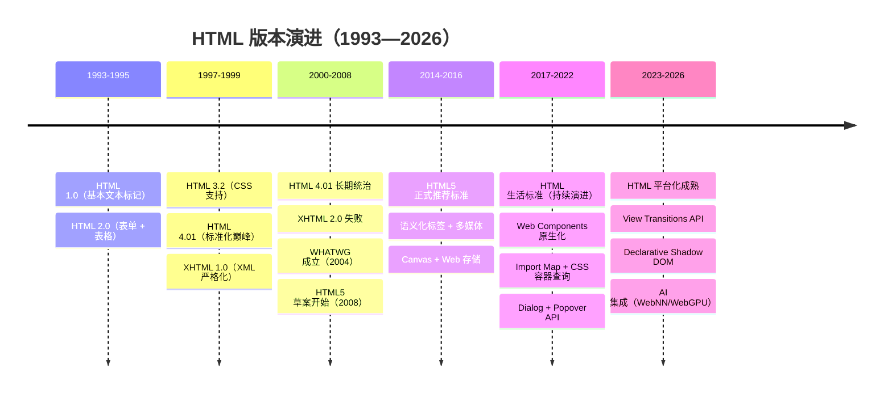

### HTML 各版本核心变化

| 版本 | 年份 | 关键特性 | 历史意义 |
|------|------|---------|---------|
| **HTML 1.0** | 1993 | 基本文本标记、超链接 | Web 的开端 |
| **HTML 2.0** | 1995 | 表单、表格、图像 | 交互式网页诞生 |
| **HTML 3.2** | 1997 | CSS 支持、脚本、iframe | 样式与内容分离开始 |
| **HTML 4.01** | 1999 | 标准化、框架、对象 | 最稳定的传统版本 |
| **XHTML 1.0** | 2000 | XML 严格语法 | 向 XML 过渡（未普及） |
| **HTML5** | 2014 | 语义化、Canvas、Web 存储、多媒体 | **现代 Web 应用基础** |
| **HTML 生活标准** | 2016+ | 持续演进（Dialog/Popover/Transitions） | 平台化成熟 |

### HTML5 为何是里程碑？

```
HTML5 之前的 Web：文档展示平台
  ├─ Flash 承担多媒体
  ├─ 无原生语义化
  └─ 无本地存储能力

HTML5 之后的 Web：应用开发平台
  ├─ 原生多媒体（<video>/<audio>）
  ├─ 语义化标签（<header>/<nav>/<article>）
  ├─ Canvas + SVG → 图形化能力
  ├─ Web Storage / IndexedDB → 客户端存储
  ├─ Web Worker → 多线程
  ├─ Service Worker → 离线/推送
  ├─ Web Components → 组件化
  ├─ WebSocket/WebRTC → 实时通信
  └─ WebGPU/WebNN → AI 计算
```

---

## 🧠 知识脑图

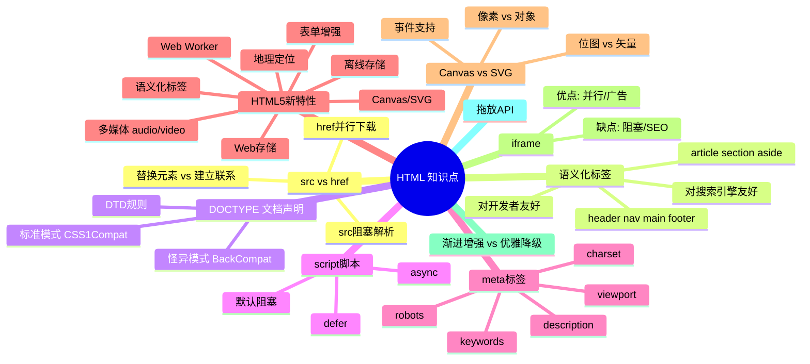

---

## 1️⃣ src 和 href 的区别

> ⚡️ **核心区别**：src 会阻塞解析（替换内容），href 不会阻塞（建立关系）

### 核心本质

| 特性 | src | href |
|------|-----|------|
| 全称 | Source（源） | Hypertext Reference（超文本引用） |
| 作用 | 将外部资源嵌入到当前标签位置 | 在当前文档和资源之间建立引用关系 |
| 对解析的影响 | **阻塞**后续文档解析 | **不阻塞**，并行下载 |
| 典型标签 | `<script>`, ``, `<iframe>` | `<link>`, `<a>` |

### src（Source — 替换当前元素）

`src` 指向的资源会被**下载并替换到当前标签所处的位置**。浏览器遇到 `src` 属性时：

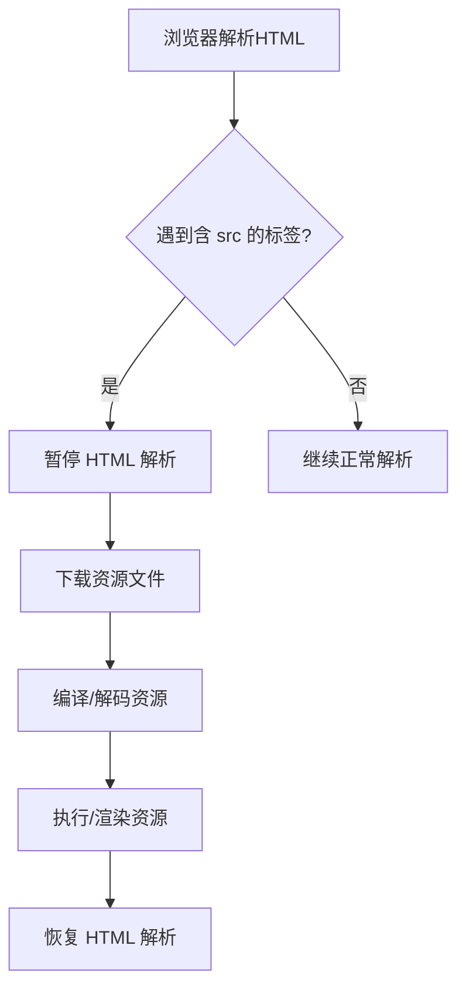

> **关键影响**：当浏览器解析到 `<script src="js.js"></script>` 时，会**暂停**后续文档的下载和渲染，直到该脚本加载、编译、执行完毕。这就是为什么 `<script>` 标签通常放在 `</body>` 之前，而不是 `<head>` 中。

```html
<!-- 方案1：放在底部，不阻塞上方 DOM 的渲染 -->
<body>
  <div>内容</div>
  <script src="app.js"></script>
</body>

<!-- 方案2：使用 defer 属性（推荐） - 保持执行顺序，DOM解析完成后执行 -->
<head>
  <script defer src="app.js"></script>
</head>

<!-- 方案3：使用 async 属性 - 乱序执行，适合独立脚本 -->
<head>
  <script async src="analytics.js"></script>
</head>

<!-- 方案4：使用 Module Script - 默认defer，支持import/export -->
<head>
  <script type="module" src="app.js"></script>
</head>
```

**脚本加载方式对比：**

| 方式 | 执行时机 | 执行顺序 | 适用场景 |
|------|---------|---------|---------|
| 无属性 | 阻塞解析，下载完立即执行 | 按文档顺序 | 遗留代码 |
| `defer` | DOM解析完成后执行 | 按文档顺序 | 需要DOM的脚本（推荐） |
| `async` | 下载完立即执行 | 乱序 | 独立脚本（如统计） |
| `type="module"` | 默认defer | 按模块顺序 | ESM模块 |

### href（Hypertext Reference — 建立联系）

`href` 表示当前文档与目标资源之间存在某种**链接关系**，浏览器会**并行下载**该资源，而**不会暂停**当前文档的解析。

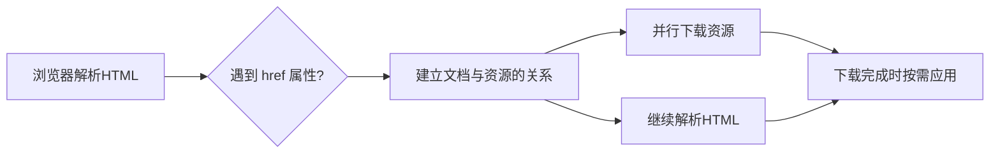

```html
<!-- link 标签使用 href，不阻塞页面渲染 -->
<link href="styles.css" rel="stylesheet" />

<!-- a 标签使用 href，不阻塞 -->
<a href="https://example.com">链接</a>
```

### 为什么推荐 link 而不是 @import？

```css
/* @import 方式：等到 CSS 文件被加载后才开始下载另一个 */
@import url('other.css');

/* link 方式：编译即开始并行下载 */
```

- `<link>` 使用 `href`，浏览器发现后立即下载，**不阻塞**
- `@import` 需要 CSS 文件加载解析后才能继续下载其他资源，**串行阻塞**

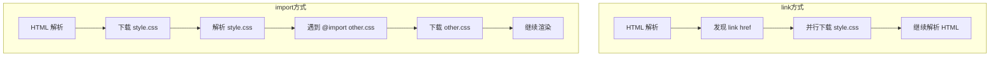

---

## 2️⃣ 对 HTML 语义化的理解

> 🏷️ **语义化 = 用正确的标签做正确的事情**

### 什么是语义化？

**语义化 = 内容结构化 + 标签代码化**——即"用正确的标签做正确的事情"。

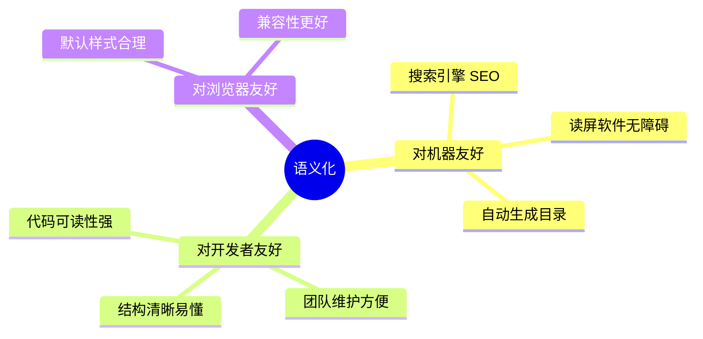

### 语义化标签一览

| 标签 | 语义含义 | 类比 |
|------|---------|------|
| `<header>` | 页面/区域的头部 | 一本书的封面 + 前言 |
| `<nav>` | 导航链接区域 | 目录页 |
| `<main>` | 页面主要内容（唯一） | 正文主体 |
| `<article>` | 独立的内容单元 | 一篇章节 |
| `<section>` | 通用的内容分区 | 书中的节 |
| `<aside>` | 侧边栏/补充内容 | 页边注释 |
| `<footer>` | 页面/区域的底部 | 书末尾的版权页 |

```html
<body>
  <header>
    <nav>导航链接</nav>
  </header>
  <main>
    <article>
      <section>第一节内容</section>
      <section>第二节内容</section>
    </article>
    <aside>相关推荐</aside>
  </main>
  <footer>版权信息</footer>
</body>
```

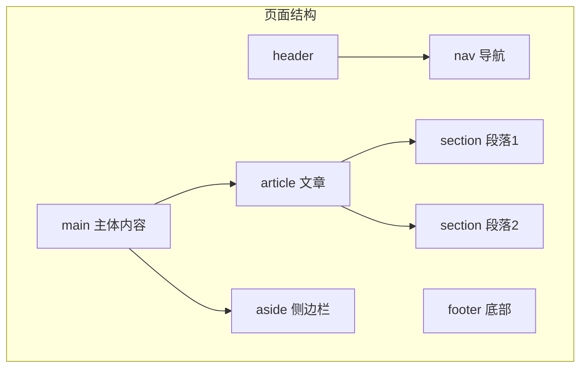

---

## 3️⃣ DOCTYPE（文档类型）的作用

> 📄 **DOCTYPE 告诉浏览器以何种标准解析渲染页面**

### 核心功能

`<!DOCTYPE html>` 是 HTML5 的文档类型声明，它**告诉浏览器以何种标准来解析渲染页面**。必须出现在 HTML 文档的第一行。

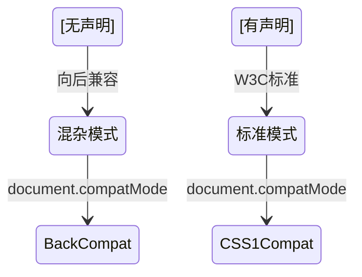

### 两种渲染模式对比

| 模式 | 名称 | document.compatMode | 行为 |
|------|------|--------------------|------|
| **标准模式（Standard）** | CSS1Compat | `"CSS1Compat"` | 遵循 W3C 标准解析渲染 |
| **怪异模式（Quirks）** | BackCompat | `"BackCompat"` | 模拟老式浏览器，向后兼容 |

### 模式判定规则

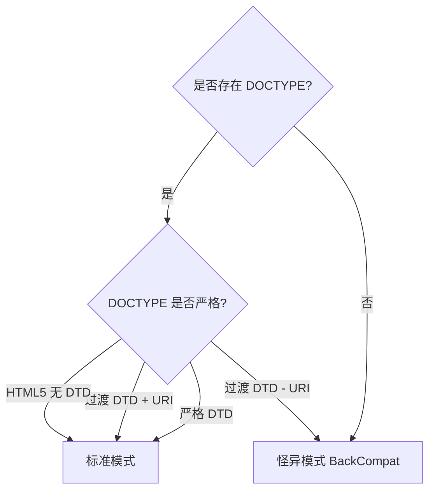

- **严格 DTD** → 标准模式
- **过渡 DTD + URI** → 标准模式
- **过渡 DTD - URI** → 怪异模式
- **无 DOCTYPE / 格式错误** → 怪异模式
- **HTML5**（`<!DOCTYPE html>`）→ 标准模式

> **注意**：在标准模式下，不同浏览器对 CSS 和 JavaScript 的解析行为一致；怪异模式下各有差异，应避免。

---

## 4️⃣ script 标签中 defer 和 async 的区别

> ⚙️ **脚本加载方式选择**：默认阻塞 / async 并行不保证顺序 / defer 并行保证顺序

### 三种加载方式对比

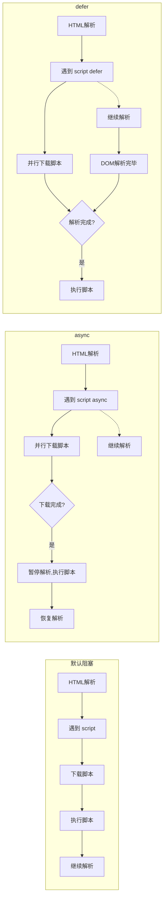

### 区别总结

| 特性 | 默认 | async | defer |
|------|------|-------|-------|
| 是否阻塞 HTML 解析 | 是——发现即暂停 | 否——并行加载 | 否——并行加载 |
| 执行时机 | 下载完成立即执行 | 下载完成立即执行 | HTML 解析完成后 |
| 执行顺序 | 按文档顺序 | **不保证顺序** | 按文档顺序 |
| DOMContentLoaded 触发时机 | 脚本执行后 | 可能在之前或之后（不保证顺序） | 脚本执行后 → 触发 |

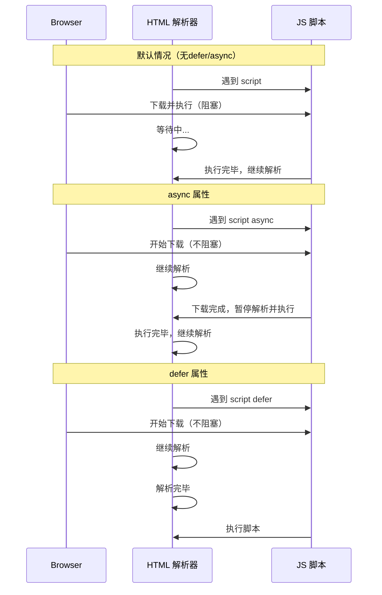

```html
<!-- 不保证顺序，谁先下载完谁先执行 -->
<script async src="a.js"></script>
<script async src="b.js"></script>

<!-- 保证顺序：先 a 后 b -->
<script defer src="a.js"></script>
<script defer src="b.js"></script>
```

---

## 5️⃣ 常用的 meta 标签

> 🏷️ **meta 标签提供元数据，不显示在页面上，但对浏览器和搜索引擎很重要**

### meta 标签的本质

`<meta>` 提供关于 HTML 文档的**元数据**（metadata），由 `name` 和 `content` 属性配合定义。它不会显示在页面上，但对浏览器、搜索引擎有重要作用。

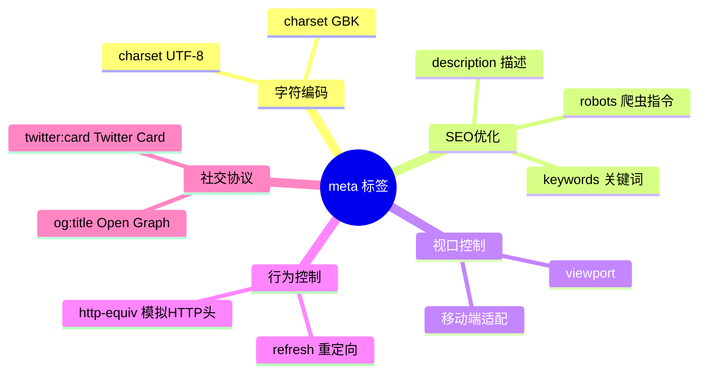

### 常用 meta 详解

| meta 类型 | 作用 | 示例 |
|-----------|------|------|
| `charset` | 声明文档编码 | `<meta charset="UTF-8">` |
| `keywords` | 告诉搜索引擎页面关键词 | `<meta name="keywords" content="HTML,CSS">` |
| `description` | 页面描述（搜索结果摘要） | `<meta name="description" content="专业前端教程">` |
| `refresh` | 定时刷新或跳转 | `<meta http-equiv="refresh" content="0;url=...">` |
| `viewport` | 移动端视口控制 | `<meta name="viewport" content="width=device-width">` |
| `robots` | 搜索引擎索引策略 | `<meta name="robots" content="index,follow">` |

### viewport 参数详解

```
width=device-width    → 宽度等于设备宽度
initial-scale=1.0    → 初始缩放比例 1:1
maximum-scale=1.0    → 最大缩放比例
minimum-scale=1.0    → 最小缩放比例
user-scalable=no     → 禁止用户缩放
```

### robots 参数详解

| 参数值 | 是否收录 | 是否跟踪链接 |
|--------|---------|-------------|
| `all` | ✅ 收录 | ✅ 跟踪 |
| `none` | ❌ 不收录 | ❌ 不跟踪 |
| `index` | ✅ 收录 | 默认 |
| `follow` | 默认 | ✅ 跟踪 |
| `noindex` | ❌ 不收录 | 默认 |
| `nofollow` | 默认 | ❌ 不跟踪 |

---

## 6️⃣ HTML5 有哪些更新

> 🚀 **HTML5 是 HTML 的最新标准，增加了许多强大的新特性**

### 全景概览

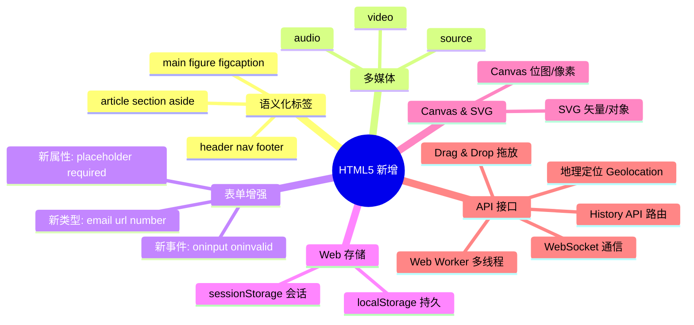

### 6.1 语义化标签

```html
<header>   <!-- 头部 -->
<nav>      <!-- 导航 -->
<main>     <!-- 主体（唯一） -->
<article>  <!-- 独立文章 -->
<section>  <!-- 内容分区 -->
<aside>    <!-- 侧边栏/补充 -->
<footer>   <!-- 底部 -->
```

### 6.2 多媒体标签

#### audio

```html
<audio src="music.mp3" controls autoplay loop></audio>
```

| 属性 | 作用 |
|------|------|
| `controls` | 显示播放控制面板 |
| `autoplay` | 自动播放（多数浏览器需用户交互后才生效） |
| `loop` | 循环播放 |
| `preload` | 预加载策略（none/metadata/auto） |
| `muted` | 静音播放 |

#### video

```html
<video src="movie.mp4" poster="cover.jpg" controls width="720"></video>
```

| 属性 | 作用 |
|------|------|
| `poster` | 视频封面的图片 |
| `controls` | 显示控制面板 |
| `width/height` | 视频尺寸 |
| `muted` | 静音（允许自动播放） |

#### source 标签—多格式兼容

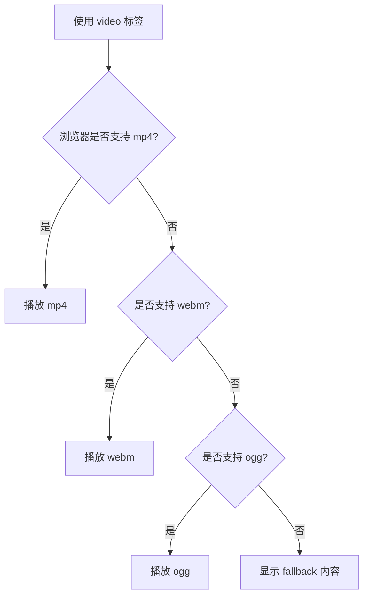

```html
<video controls>
  <source src="movie.mp4" type="video/mp4">
  <source src="movie.webm" type="video/webm">
  您的浏览器不支持视频播放
</video>
```

### 6.3 表单增强

#### 新增 input 类型

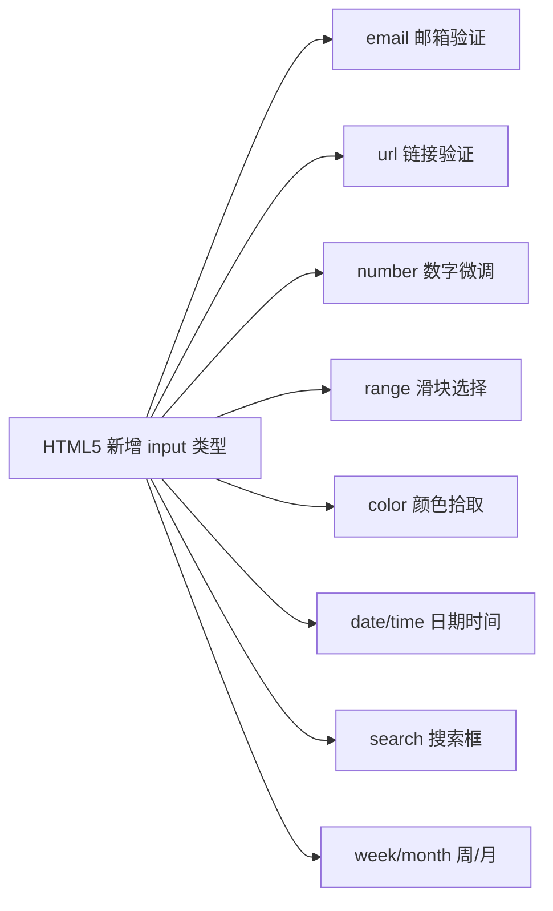

```html
<input type="email" placeholder="请输入邮箱">
<input type="url" placeholder="https://">
<input type="number" min="1" max="100" step="1">
<input type="range" min="0" max="100" value="50">
<input type="color" value="#ff0000">
<input type="date">
<input type="time">
<input type="search" placeholder="搜索...">
```

#### 新增表单属性

| 属性 | 作用 |
|------|------|
| `placeholder` | 占位提示文字 |
| `autofocus` | 自动获得焦点 |
| `autocomplete="on/off"` | 自动完成（需表单提交过 + 有 name 属性） |
| `required` | 必填验证 |
| `pattern` | 正则验证 |
| `multiple` | 多选（文件/邮箱） |
| `form` | 指定所属表单 ID |

```html
<form>
  <input type="text" placeholder="用户名" autofocus required
         pattern="^[a-zA-Z]\w{5,17}$">
  <input type="submit" value="提交">
</form>
```

#### 新增表单事件

```javascript
// oninput — 输入内容变化时实时触发
inputElement.oninput = function() {
  console.log('当前输入:', this.value);
};

// oninvalid — 验证失败时触发
inputElement.oninvalid = function() {
  this.setCustomValidity('请输入有效内容');
};
```

### 6.4 进度条和度量器

#### progress

```html
<progress max="100" value="70">70%</progress>
```

#### meter

```html
<meter min="0" max="100" low="30" high="70" value="85">85%</meter>
```

取值规则：`min < low < high < max`

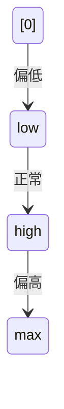

### 6.5 DOM 查询操作

```javascript
// 选择器——更强大灵活
document.querySelector('.classname');      // 匹配第一个
document.querySelectorAll('.classname');   // 匹配全部（NodeList）

// 示例
const nav = document.querySelector('nav');
const items = document.querySelectorAll('.item');
const main = document.querySelector('#main');
```

### 6.6 Web 存储

| 特性 | localStorage | sessionStorage |
|------|-------------|----------------|
| 生命周期 | 永久保存（需手动清除） | 关闭标签页/窗口即清除 |
| 作用域 | 同源策略下所有页面共享 | 当前标签页独享 |
| 容量 | 约 5MB | 约 5MB |
| 存储位置 | 客户端磁盘 | 客户端内存/磁盘 |

```javascript
// localStorage
localStorage.setItem('key', 'value');
const val = localStorage.getItem('key');
localStorage.removeItem('key');
localStorage.clear();

// sessionStorage（API 完全一致）
sessionStorage.setItem('key', 'value');
```

### 6.7 其他重要新特性

#### 拖放（Drag & Drop）

```html
<div draggable="true">拖我</div>
```

#### Canvas

```html
<canvas id="myCanvas" width="200" height="100"></canvas>
<script>
  const ctx = document.getElementById('myCanvas').getContext('2d');
  ctx.fillStyle = 'red';
  ctx.fillRect(10, 10, 100, 50);
</script>
```

#### History API

```javascript
history.pushState({page: 1}, 'title', '?page=1');
history.replaceState({page: 2}, 'title', '?page=2');
history.back();
history.forward();
history.go(-1);
```

### HTML5 移除的元素

| 类别 | 移除的标签 | 替代方案 |
|------|-----------|---------|
| 纯表现元素 | `basefont`, `big`, `center`, `font`, `strike`, `tt` | CSS 样式（`<s>`、`<u>` 在 HTML5 中被重新赋予语义，未被移除） |
| 对可用性有负面影响的元素 | `frame`, `frameset`, `noframes` | `<iframe>` + CSS |

---

## 7️⃣ img 的 srcset 属性的作用

> 🖼️ **响应式图片：让不同设备加载最合适的图片**

### 响应式图片——不同屏幕密度加载不同图片

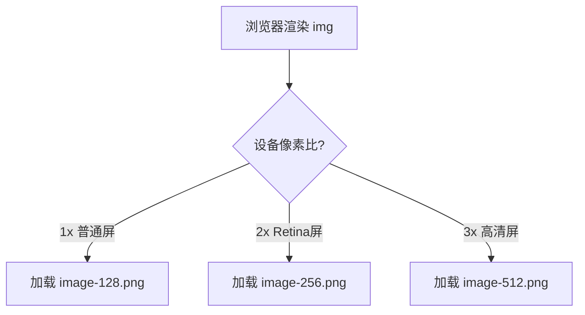

### 基础用法

```html

```

### 进阶用法——w 单位 + sizes

```html

```

`w` 单位表示图片的**实际宽度**（不同质量/分辨率），浏览器根据视口宽度自动选择最小可用图片。

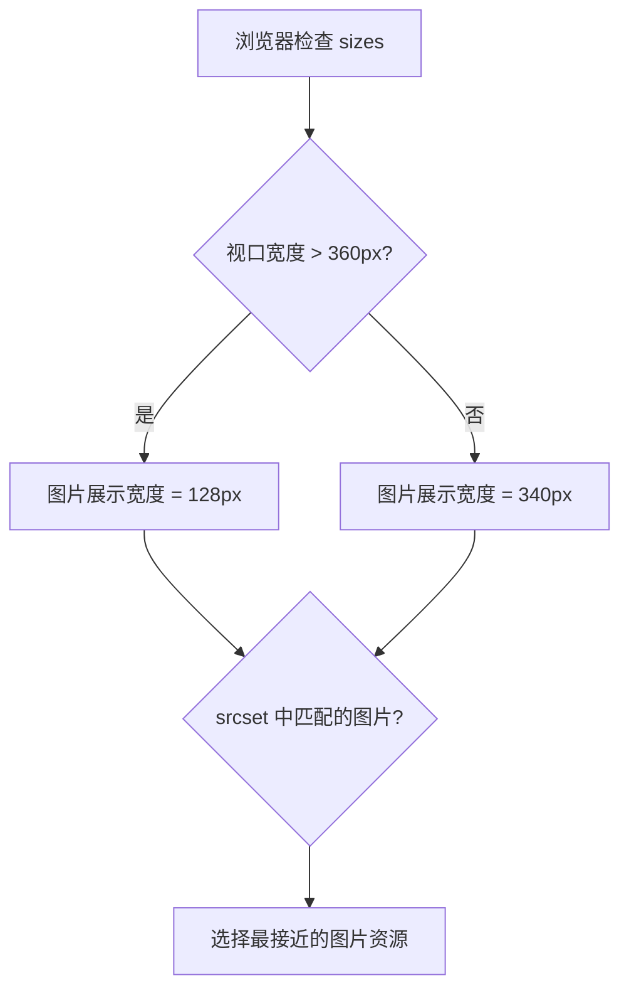

---

## 8️⃣ 行内元素、块级元素、空元素

> 📦 **元素的显示模式决定了布局方式**

### 分类对比

| 类别 | 特点 | 常见标签 |
|------|------|---------|
| **块级元素** | 独占一行，可设置宽高 | `div`, `p`, `h1-h6`, `ul`, `ol`, `li`, `dl`, `dt`, `dd` |
| **行内元素** | 不换行，宽高由内容决定 | `a`, `b`, `span`, `img`, `input`, `select`, `strong` |
| **行内块元素** | 不换行，但可设置宽高 | `img`, `input`, `button`, `textarea` |
| **空元素**（void） | 没有内容，没有闭合标签 | `br`, `hr`, `img`, `input`, `link`, `meta` |

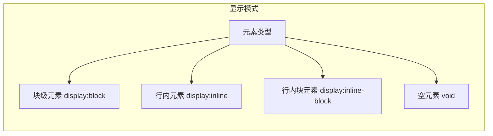

### 空元素完整列表

**常见：** `<br>`, `<hr>`, ``, `<input>`, `<link>`, `<meta>`

**较少见：** `<area>`, `<base>`, `<col>`, `<embed>`, `<param>`, `<source>`, `<track>`, `<wbr>`

---

## 9️⃣ 对 Web Worker 的理解

> 🔧 **Web Worker 在后台线程运行 JS，不阻塞主线程**

### 为什么需要 Web Worker？

JavaScript 是单线程的，长时间运行的计算任务会**阻塞主线程**（UI 渲染、用户交互）。Web Worker 允许在**后台线程**中运行 JS，不阻塞主线程。

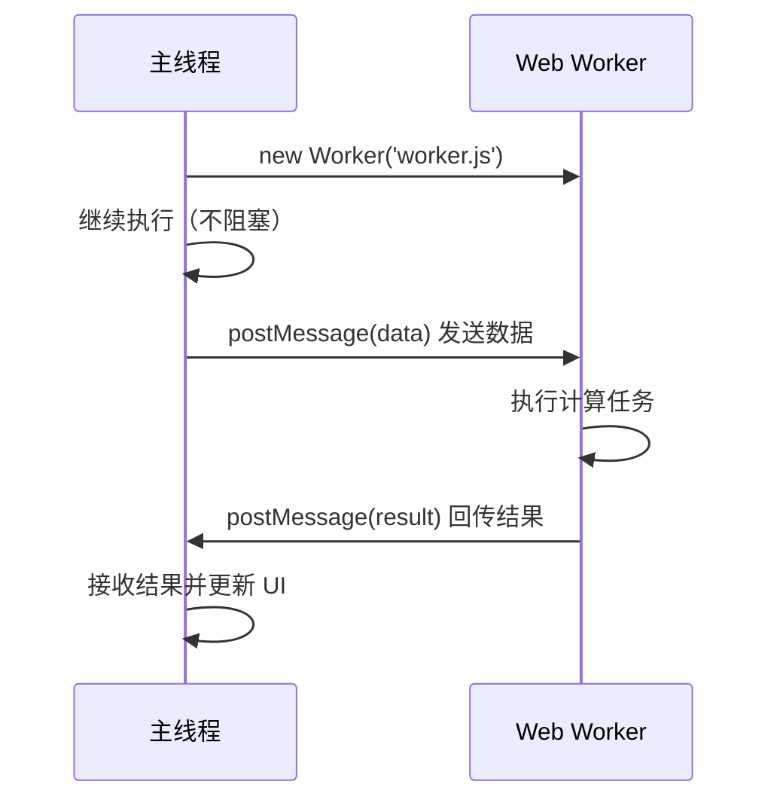

### 使用方法

```javascript
// 1. 检测支持
if (window.Worker) {
  // 2. 创建 worker
  const myWorker = new Worker('worker.js');

  // 3. 发送数据到 worker
  myWorker.postMessage([10, 20]);

  // 4. 接收 worker 回传结果
  myWorker.onmessage = function(e) {
    console.log('结果:', e.data);
  };
}
```

```javascript
// worker.js — 在后台线程中执行
self.onmessage = function(e) {
  const result = e.data[0] + e.data[1];
  // 回传结果到主线程
  self.postMessage(result);
};
```

### 限制

| 限制 | 说明 |
|------|------|
| 无法访问 DOM | 不能操作 document, window, parent |
| 同源限制 | 脚本文件必须与页面同源 |
| 无法使用部分 API | 不能使用 alert, confirm 等 |

---

## 🔟 HTML5 离线存储（Application Cache）

> 📥 **离线存储让应用在无网络时也能正常运行**

> ⚠️ **注意**：Application Cache 已被废弃，推荐使用 Service Worker

### 工作原理

```mermaid
flowchart TD
    A["用户访问页面"] --> B{"是否有网络?"}
    B -->|在线| C{"首次访问?"}
    B -->|离线| D["从缓存加载"]
    C -->|首次| E["请求 manifest 文件"]
    C -->|非首次| F["用缓存加载页面"]
    E --> G["根据 manifest 下载资源"]
    G --> H["缓存到本地"]
    F --> I["在线对比 manifest 变化"]
    I -->|有变化| J["更新并重新缓存"]
    I -->|无变化| K["无需操作"]
```

### 使用步骤

#### 1. 在 HTML 中引入 manifest

```html
<html manifest="index.appcache">
```

#### 2. 编写 manifest 文件

```txt
CACHE MANIFEST
# 版本号 v0.11

CACHE:
# 需要离线存储的资源
js/app.js
css/style.css
images/logo.png

NETWORK:
# 只有在线的资源（不会被缓存）
resource/api

FALLBACK:
# 离线时访问失败，用 offline.html 替代
/ /offline.html
```

#### 3. 三大区域说明

| 区域 | 作用 | 示例 |
|------|------|------|
| `CACHE` | 需要离线缓存的资源列表 | 静态 JS、CSS、图片 |
| `NETWORK` | 只有在在线状态下才能访问的资源 | API 接口 |
| `FALLBACK` | 访问失败时降级替换资源 | `/ /offline.html` |

### 更新缓存的方式

1. **更新 manifest 文件**（修改版本号或内容）
2. **通过 JavaScript 操作**

```javascript
window.applicationCache.update();
```

3. **清除浏览器缓存**

### ⚠️ 注意事项

| 注意事项 | 说明 |
|---------|------|
| 容量限制 | 每个站点约 5MB |
| 更新失败处理 | manifest 中任一文件下载失败，整个更新失败，继续用旧缓存 |
| 同源限制 | manifest 文件必须与 HTML 同源 |
| FALLBACK 同源 | fallback 资源也必须同源 |
| 直接请求缓存 | 资源被缓存后，直接请求绝对路径也会访问缓存 |
| 跨页面生效 | 站点中其他页面即使没有 manifest，也会访问缓存的资源 |
| 文件变更触发 | manifest 改变本身会触发资源更新 |

> **重要提示**：Application Cache 已被 W3C 标记为**废弃（Deprecated）**，推荐使用 **Service Worker + Cache API** 作为替代方案。

---

## 1️⃣1️⃣ 离线存储资源的管理与加载

> 🔄 **根据在线/离线状态决定资源加载方式**

### 不同状态下的行为

```mermaid
stateDiagram-v2
    [首次在线访问] --> 下载并缓存: 根据 manifest
    下载并缓存 --> 再次在线访问
    再次在线访问 --> 对比manifest: 请求新 manifest
    对比manifest --> 无变化: 继续使用缓存
    对比manifest --> 有变化: 重新下载资源
    有变化 --> 更新缓存
    再次在线访问 --> 离线访问: 断网
    离线访问 --> 使用缓存: 从存储中加载
```

### 在线 vs 离线场景

| 场景 | 行为 |
|------|------|
| **首次在线访问** | 下载 manifest → 根据清单缓存所有 `CACHE` 资源 |
| **非首次在线访问** | 用缓存加载页面 → 后台请求 manifest → 对比新旧 manifest |
| **manifest 未变化** | 不做任何操作，继续使用现有缓存 |
| **manifest 已变化** | 重新下载所有资源，更新缓存 |
| **离线访问** | 直接从缓存中加载资源 |

---

## 1️⃣2️⃣ title vs h1, b vs strong, i vs em

> ✨ **视觉 vs 语义：搜索引擎更重视语义化标签**

### 对比总结

| 对比项 | 区别 |
|--------|------|
| `title` vs `h1` | `title` 是 HTML 标题（浏览器标签页/SEO 标题），`h1` 是页面内容标题 |
| `b` vs `strong` | `b` 仅视觉加粗（无语义），`strong` 语义强调（加重语气） |
| `i` vs `em` | `i` 仅视觉斜体（无语义），`em` 语义强调文本 |

```mermaid
flowchart LR
    subgraph 视觉 vs 语义
        A["b 加粗"] -->|纯视觉| B["strong 加粗+强调"]
        C["i 斜体"] -->|纯视觉| D["em 斜体+强调"]
    end
```

### 搜索引擎如何看待？

搜索引擎给 `strong` 和 `em` 赋予更高的权重，而 `b` 和 `i` 只是文本样式，没有 SEO 价值。

---

## 1️⃣3️⃣ iframe 的优缺点

> 🖥️ **iframe 在当前页面嵌入另一个页面**

### 什么是 iframe？

`<iframe>` 创建包含另一个文档的**内联框架**，在当前页面中嵌入另一个页面。

### 优缺点对比

| 优点 | 缺点 |
|------|------|
| 加载慢的内容不影响主页面（如广告） | 会阻塞主页面 `load` 事件（但不会阻塞 `DOMContentLoaded`） |
| 脚本可以并行下载 | 难以被搜索引擎识别（SEO 负面影响） |
| 可实现跨子域通信 | 产生多个页面，管理复杂 |
| 沙箱隔离，提高安全性 | 增加内存消耗 |

```html
<iframe src="https://example.com/ad.html" width="300" height="250"
        sandbox="allow-scripts allow-same-origin">
</iframe>
```

`sandbox` 属性提供安全隔离：

| sandbox 值 | 作用 |
|------------|------|
| (空) | 启用所有限制 |
| `allow-scripts` | 允许执行脚本 |
| `allow-same-origin` | 允许同源访问 |
| `allow-forms` | 允许提交表单 |
| `allow-popups` | 允许弹出窗口 |

---

## 1️⃣4️⃣ label 的作用和使用

> 🏷️ **label 绑定表单控件，提升可用性和可访问性**

### 作用

`<label>` 定义表单控件的关系——点击 label 文字，焦点会自动转移到关联的表单控件上，提高可用性。

### 两种使用方法

| 方法 | 代码 | 原理 |
|------|------|------|
| **for + id**（显式关联） | `<label for="mobile">手机:</label><input id="mobile">` | `for` 属性指向 input 的 `id` |
| **包裹关联**（隐式关联） | `<label>手机:<input type="text"></label>` | label 直接包裹 input |

---

## 1️⃣5️⃣ Canvas 和 SVG 的区别

> 🎨 **Canvas 是位图（像素），SVG 是矢量图（对象）**

### 核心差异

```mermaid
flowchart TD
    subgraph SVG 矢量图
        A["XML 定义图形"] --> B["每个图形都是 DOM 对象"]
        B --> C["支持事件处理器"]
        B --> D["不依赖分辨率"]
        B --> E["复杂度高会慢"]
        B --> F["适合地图/UI"]
    end

    subgraph Canvas 位图
        G["JavaScript 逐像素绘制"] --> H["像素点阵"]
        H --> I["不支持事件"]
        H --> J["依赖分辨率"]
        H --> K["频繁重绘高效"]
        H --> L["适合游戏/图表"]
    end
```

### 详细对比

| 对比维度 | SVG | Canvas |
|---------|-----|--------|
| 本质 | 矢量图形（DOM 对象） | 位图（像素点阵） |
| 渲染方式 | XML 描述，保留图形对象 | JavaScript 逐像素绘制 |
| 分辨率 | **不依赖**（放大不失真） | **依赖**（放大变模糊） |
| 事件支持 | ✅ 支持（每个元素可绑定事件） | ❌ 不支持（需自己计算坐标） |
| 文本渲染 | 强（原生文本元素） | 弱（需手动绘制） |
| 性能 | 元素多时 DOM 操作慢 | 频繁重绘时表现好 |
| 保存格式 | 不能直接保存为图片 | 可导出 `.png`/`.jpg` |
| 典型场景 | 地图、UI 图标、数据可视化 | 游戏、动态图像、实时动画 |

### 代码对比

```html
<!-- SVG：声明式 -->
<svg width="100" height="100">
  <circle cx="50" cy="50" r="40" fill="red"
          onclick="alert('点击了圆圈')"/>
</svg>
```

```html
<!-- Canvas：脚本式 -->
<canvas id="canvas" width="100" height="100"></canvas>
<script>
  const ctx = document.getElementById('canvas').getContext('2d');
  ctx.beginPath();
  ctx.arc(50, 50, 40, 0, Math.PI * 2);
  ctx.fillStyle = 'red';
  ctx.fill();
  // 需要手动计算点击坐标
  canvas.onclick = function(e) {
    const rect = canvas.getBoundingClientRect();
    const x = e.clientX - rect.left;
    const y = e.clientY - rect.top;
    // 判断是否在圆内...
  };
</script>
```

---

## 1️⃣6️⃣ head 标签的作用

> 📑 **head 包含文档元信息，不显示在页面上**

### 功能概述

`<head>` 是文档的**头部容器**，包含文档的元信息、样式、脚本等，这些内容通常**不会直接显示**在页面上。

### 可用子标签

```mermaid
flowchart LR
    A["head"] --> B["title 标题 必需"]
    A --> C["meta 元数据"]
    A --> D["link 外部资源"]
    A --> E["style 内部样式"]
    A --> F["script 脚本"]
    A --> G["base 基础URL"]
```

### 必要元素

| 标签 | 是否必须 | 作用 |
|------|---------|------|
| `<title>` | **✅ 必须** | 定义文档标题，出现在浏览器标签页 |
| 其他 | ❌ 可选 | 按需使用 |

```html
<head>
  <meta charset="UTF-8">
  <meta name="viewport" content="width=device-width, initial-scale=1.0">
  <title>页面标题 - 这个最重要</title>
  <link rel="stylesheet" href="style.css">
</head>
```

---

## 1️⃣7️⃣ 文档声明（Doctype）与严格/混杂模式

> 📄 **文档声明告诉浏览器以何种标准解析渲染页面**

### 文档声明的作用

告诉浏览器当前 HTML 文档使用的**版本标准**，以便正确解析渲染。

### `<!DOCTYPE html>` 的作用

让浏览器以 **HTML5 标准模式**解析页面。

### 严格模式 vs 混杂模式

```mermaid
stateDiagram-v2
    state "浏览器解析模式" as modes {
        [*] --> 严格模式: 标准DTD/HTML5
        [*] --> 混杂模式: 无DTD/错误DTD
    }
    严格模式 --> 统一标准: W3C规范
    混杂模式 --> 各自兼容: 老浏览器行为
```

| 模式 | 别名 | 行为 |
|------|------|------|
| **严格模式** | 标准模式 | 按 W3C 最新标准解析 |
| **混杂模式** | 怪异/兼容模式 | 模拟老式浏览器行为，防止旧站点崩溃 |

### 模式判定规则

> ⚠️ **忘记写 `<!DOCTYPE html>` 会导致浏览器以混杂模式渲染**，不同浏览器对相同 CSS 可能有不同解析结果，造成跨浏览器兼容问题。

| 条件 | 结果 |
|------|------|
| 严格 DTD | ✅ 严格模式 |
| 过渡 DTD + URI | ✅ 严格模式 |
| 过渡 DTD - URI | ❌ 混杂模式 |
| 无 DOCTYPE / 格式错误 | ❌ 混杂模式 |
| HTML5 (`<!DOCTYPE html>`) | ✅ 严格模式（无 DTD 概念） |

> **总结**：严格模式保证各浏览器按统一标准工作；混杂模式保证旧站点继续可用。

---

## 1️⃣8️⃣ 浏览器乱码的原因与解决

> 🔤 **统一 UTF-8 编码是解决乱码的根本之道**

### 乱码产生的三种场景

```mermaid
flowchart TD
    A["乱码原因"] --> B["文件编码 vs 声明编码不一致"]
    A --> C["数据库编码 vs 页面编码不一致"]
    A --> D["浏览器无法自动检测编码"]
```

### 场景详解

| 场景 | 具体原因 | 典型表现 |
|------|---------|---------|
| 1 | 文件保存为 GBK，但声明 `charset=utf-8` | 中文乱码 |
| 2 | 文件为 GBK，数据库内容为 UTF-8 | 部分文字乱码 |
| 3 | 浏览器编码检测机制失效 | 整页乱码 |

### 解决方案

> 💡 **最佳实践**：HTML 文件保存为 UTF-8 无 BOM 格式 + `meta charset="UTF-8"` 声明 + 服务端 HTTP 头 `Content-Type: text/html; charset=utf-8` 三者一致，即可彻底解决乱码问题。

| 问题 | 解决方法 |
|------|---------|
| 文件编码不一致 | 统一使用 UTF-8 保存 HTML 文件 |
| 数据库编码不一致 | 查询时做编码转换（如 `SET NAMES utf8mb4`） |
| 浏览器检测失败 | 手动在浏览器菜单中切换编码，或 HTTP 头声明编码 |

```html
<!-- 最好的预防：统一 UTF-8 -->
<meta charset="UTF-8">
```

---

## 1️⃣9️⃣ 渐进增强和优雅降级

> 📈 **渐进增强是"从基础到增强"，优雅降级是"从完整到兼容"**

### 概念对比

```mermaid
flowchart LR
    subgraph 渐进增强 Progressive Enhancement
        A1["基础功能"] --> B1["兼容低版本浏览器"]
        B1 --> C1["追加高级交互"]
        C1 --> D1["现代浏览器体验更好"]
    end

    subgraph 优雅降级 Graceful Degradation
        A2["完整高级功能"] --> B2["面向现代浏览器"]
        B2 --> C2["逐步降级适配"]
        C2 --> D2["旧浏览器也能用"]
    end
```

| 对比维度 | 渐进增强 | 优雅降级 |
|---------|---------|---------|
| 出发点 | 从低版本浏览器开始构建 | 从高版本浏览器开始构建 |
| 方向 | 向前看（基础→增强） | 向后看（完整→降级） |
| 核心哲学 | 内容优先，逐步完善 | 功能完整，再兼容旧环境 |
| 开发流程 | 先保证都能用，再优化体验 | 先做最丰富的，再处理降级 |
| 代表实践 | Yahoo 分级浏览器支持策略 | 传统桌面优先开发 |

### 代码示例

```css
/* 渐进增强：先做基础，再叠加新特性 */
.button {
  background: #333;           /* 所有浏览器 */
  color: #fff;
  border-radius: 4px;         /* 较新浏览器生效，旧的忽略 */
  box-shadow: 0 2px 4px rgba(0,0,0,0.2); /* 新浏览器 */
}

/* 优雅降级：先做完整的，再用 hack */
.button {
  background: #333;
  color: #fff;
  -webkit-border-radius: 4px; /* 旧 WebKit */
     -moz-border-radius: 4px; /* 旧 Firefox */
          border-radius: 4px; /* 标准 */
}
```

---

## 2️⃣0️⃣ HTML5 Drag & Drop API

> 🖱️ **拖放 API 使 HTML 元素支持原生拖拽交互，通过 dataTransfer 传递数据**

### 拖放事件流

```mermaid
sequenceDiagram
    participant Source as 被拖放元素
    participant Target as 目标元素

    Source->>Source: dragstart 开始拖动
    Source->>Source: drag 拖动中（持续触发）
    Source->>Target: dragenter 进入目标区域
    Target->>Target: dragover 在目标内移动（持续）
    Target->>Target: dragleave 离开目标区域
    Target->>Target: drop 释放（接受拖放）
    Source->>Source: dragend 拖放结束
```

### 事件详解

| 事件 | 触发主体 | 触发时机 |
|------|---------|---------|
| `dragstart` | **被拖放元素** | 开始拖动时 |
| `drag` | **被拖放元素** | 拖动过程中（持续触发） |
| `dragenter` | **目标元素** | 被拖放元素进入目标时 |
| `dragover` | **目标元素** | 在目标内移动时（持续触发） |
| `dragleave` | **目标元素** | 被拖放元素离开目标时 |
| `drop` | **目标元素** | 释放鼠标，接受拖放 |
| `dragend` | **被拖放元素** | 拖动操作结束时 |

### 完整示例

```html
<div id="source" draggable="true" style="width:100px;height:100px;background:red;">
  拖我
</div>
<div id="target" style="width:200px;height:200px;border:2px dashed #333;">
  放到这里
</div>

<script>
  const source = document.getElementById('source');
  const target = document.getElementById('target');

  source.addEventListener('dragstart', (e) => {
    e.dataTransfer.setData('text/plain', '被拖动的数据');
    e.dataTransfer.effectAllowed = 'move';
  });

  target.addEventListener('dragover', (e) => {
    e.preventDefault(); // 必须阻止默认行为才能触发 drop
    e.dataTransfer.dropEffect = 'move';
  });

  target.addEventListener('drop', (e) => {
    e.preventDefault();
    const data = e.dataTransfer.getData('text/plain');
    target.textContent = '收到: ' + data;
    target.style.background = 'lightgreen';
  });
</script>
```

### 关键点

- 被拖放元素需要设置 `draggable="true"`
- `drop` 事件需要在 `dragover` 中调用 `e.preventDefault()` 才能触发
- 通过 `dataTransfer` 对象传递数据

---

## 2️⃣1️⃣ Web Components

> 🧩 **Web Components 是浏览器原生 API，用于创建可复用的自定义元素**

### 概念

Web Components 是一组浏览器原生 API，允许开发者创建可复用的**自定义元素**（Custom Elements），并实现封装（Shadow DOM）和模板化（HTML Templates）。

```mermaid
flowchart TD
    subgraph Web Components 三大核心技术
        A["Custom Elements 自定义元素"] --> D["自定义标签"]
        B["Shadow DOM 影子DOM"] --> E["样式与DOM隔离"]
        C["HTML Templates 模板"] --> F["可复用标记片段"]
    end
    D --> G["<my-component>"]
    E --> H["样式不泄漏/不被覆盖"]
    F --> I["<template><slot>"]
    G & H & I --> J["可复用 Web Component"]
```

### 21.1 Custom Elements（自定义元素）

```javascript
class MyCard extends HTMLElement {
  // 监听的属性列表
  static get observedAttributes() {
    return ['title', 'content'];
  }

  constructor() {
    super();
    // 初始化
    this._shadowRoot = this.attachShadow({ mode: 'open' });
  }

  // 元素首次插入 DOM 时触发
  connectedCallback() {
    this.render();
  }

  // 元素从 DOM 中移除时触发
  disconnectedCallback() {
    console.log('元素已移除');
  }

  // 监听的属性发生变化时触发
  attributeChangedCallback(name, oldValue, newValue) {
    if (oldValue !== newValue) {
      this.render();
    }
  }

  // 元素被移动到新文档时触发
  adoptedCallback() {
    console.log('元素被移动到了新文档');
  }

  render() {
    this._shadowRoot.innerHTML = `
      <style>
        .card { border: 1px solid #ccc; border-radius: 8px; padding: 16px; }
        .card-title { font-size: 18px; font-weight: bold; }
      </style>
      <div class="card">
        <div class="card-title">${this.getAttribute('title') || '默认标题'}</div>
        <div>${this.getAttribute('content') || '默认内容'}</div>
      </div>
    `;
  }
}

// 注册自定义元素
customElements.define('my-card', MyCard);
```

> ⚠️ **注意**：自定义元素名**必须包含连字符（-）**，这是为了与原生 HTML 元素区分，例如 `my-card`、`app-header`。

```html
<!-- 使用自定义元素 -->
<my-card title="Web Components" content="一套浏览器原生组件方案"></my-card>
```

### 21.2 Shadow DOM（影子 DOM）

Shadow DOM 提供**封装性**——组件的样式和 DOM 结构不会泄漏到外部，也不会被外部影响。

```mermaid
flowchart LR
    subgraph Light DOM
        A["主文档"]
    end
    subgraph Shadow DOM
        B["Shadow Root"]
        C["Shadow Tree"]
        D["样式隔离"]
    end
    A -->|attachShadow| B
    B --> C
    C --> D
```

| 概念 | 说明 |
|------|------|
| `Shadow Root` | Shadow DOM 的根节点 |
| `Shadow Tree` | Shadow DOM 内部的 DOM 树 |
| `Shadow Host` | 挂载 Shadow DOM 的普通元素 |
| `mode: 'open'` | 外部可通过 `element.shadowRoot` 访问 |
| `mode: 'closed'` | 外部无法访问 Shadow DOM |

> 💡 `mode: 'open'` 可通过 `element.shadowRoot` 访问内部 DOM，适合需要外部交互的场景；`mode: 'closed'` 更严格但会阻止表单自动关联等行为，通常推荐使用 `open`。

#### `:host` 选择器

```css
:host {
  display: block;
  border: 1px solid #333;
}

:host(.active) {
  border-color: blue;
}

:host-context(.dark-theme) {
  background: #333;
  color: #fff;
}
```

#### `<slot>` 插槽

```html
<!-- 定义插槽 -->
<template id="card-tpl">
  <style>
    .wrapper { border: 1px solid #ddd; padding: 16px; }
    ::slotted(h2) { margin-top: 0; }
  </style>
  <div class="wrapper">
    <slot name="title">默认标题</slot>
    <slot name="content">默认内容</slot>
  </div>
</template>
```

```html
<!-- 使用插槽 -->
<my-card>
  <h2 slot="title">自定义标题</h2>
  <p slot="content">自定义内容</p>
</my-card>
```

### 21.3 HTML Templates（模板元素）

```html
<template id="hello-template">
  <style>
    p { color: blue; }
  </style>
  <p>Hello, Web Components!</p>
</template>

<script>
  const template = document.getElementById('hello-template');
  const clone = template.content.cloneNode(true);
  document.body.appendChild(clone);
</script>
```

| API | 说明 |
|-----|------|
| `<template>` | 声明可复用的 HTML 片段（不渲染） |
| `template.content` | 返回 `DocumentFragment`（模板内容） |
| `cloneNode(true)` | 深拷贝模板内容 |
| `<slot>` | 定义可替换的插槽位置 |

---

## 2️⃣2️⃣ 资源提示（Resource Hints）

> ⚡ **资源提示提前告知浏览器未来需要的资源，优化加载性能**

### 概念

资源提示是一组 `<link>` 属性，用于**提前告诉浏览器**未来可能需要哪些资源，从而优化加载性能。

```mermaid
flowchart LR
    A["资源提示"] --> B["preload 提前加载当前页关键资源"]
    A --> C["prefetch 预取未来页面资源"]
    A --> D["preconnect 提前建立连接"]
    A --> E["dns-prefetch DNS预解析"]
    A --> F["modulepreload ES Module预加载"]

    B --> G["当前页面必须"]
    C --> H["下一页可能需要"]
    D --> I["减少连接延迟"]
    E --> J["减少DNS查询时间"]
    F --> K["预加载ES Module"]
```

### 各提示对比

| 提示 | 语法 | 优先级 | 适用场景 |
|------|------|--------|---------|
| **preload** | `<link rel="preload">` | **高** | 当前页关键 CSS/JS/字体 |
| **prefetch** | `<link rel="prefetch">` | **低** | 下一页的资源 |
| **preconnect** | `<link rel="preconnect">` | **中** | 第三方域名提前握手 |
| **dns-prefetch** | `<link rel="dns-prefetch">` | **最低** | 只需提前解析 DNS |
| **modulepreload** | `<link rel="modulepreload">` | **高** | ES Module 预加载 |

### 22.1 preload

```html
<!-- 预加载样式 -->
<link rel="preload" href="styles.css" as="style">

<!-- 预加载字体（必须加crossorigin） -->
<link rel="preload" href="font.woff2" as="font" crossorigin>

<!-- 预加载脚本 -->
<link rel="preload" href="critical.js" as="script">

<!-- 预加载图片 -->
<link rel="preload" href="hero.jpg" as="image">
```

`as` 属性可选值: `style`, `script`, `font`, `image`, `fetch`, `document`, `audio`, `video`, `worker`, `embed`

> ⚡ **注意**：preload 字体资源时必须添加 `crossorigin` 属性，否则浏览器会因跨域策略忽略预加载。`as` 属性必须正确指定，否则浏览器不会使用预加载资源。

```mermaid
sequenceDiagram
    participant Browser
    participant HTML
    participant Network

    Browser->>HTML: 解析到 <link rel="preload">
    Browser->>Network: 立即下载（高优先级）
    HTML->>HTML: 继续解析
    Network-->>Browser: 下载完成放入内存
    HTML->>Browser: 解析到真正引用
    Browser->>Browser: 直接使用内存缓存
```

### 22.2 prefetch

```html
<!-- 预取下一页的资源 -->
<link rel="prefetch" href="next-page.js">
<link rel="prefetch" href="next-page.css">
```

> preload 和 prefetch 的区别：**preload 用于当前页必需资源，prefetch 用于未来可能需要**。

### 22.3 preconnect

```html
<!-- 提前连接第三方 CDN -->
<link rel="preconnect" href="https://api.example.com">
<link rel="preconnect" href="https://fonts.gstatic.com" crossorigin>
```

### 22.4 dns-prefetch

```html
<!-- DNS 预解析 -->
<link rel="dns-prefetch" href="//fonts.googleapis.com">
```

```mermaid
flowchart LR
    A["浏览页面"] --> B{"需要连接第三方?"}
    B -->|preconnect| C["DNS查询"]
    B -->|dns-prefetch| C
    C --> D["TCP握手"]
    D --> E["TLS协商"]
    E --> F["连接就绪"]
    B -.->|无预连接| G["DNS+TCP+TLS串行"]
    G --> H["等待时间长"]
```

### 22.5 modulepreload

```html
<link rel="modulepreload" href="app.mjs">

<!-- 相当于 preload，但针对 ES Module -->
<link rel="modulepreload" href="utils.mjs"
      integrity="sha384-..." 
      crossorigin="anonymous">
```

### 22.6 Priority Hints（优先级提示）

```html
<!-- fetchpriority 提示资源优先级 -->


<!-- loading="lazy" 图片/iframe 懒加载 -->

<iframe src="map.html" loading="lazy"></iframe>

<!-- decoding 解码方式 -->

```

| 属性 | 值 | 说明 |
|------|----|------|
| `fetchpriority` | `high` / `low` / `auto` | 提示浏览器资源加载优先级 |
| `loading` | `lazy` / `eager` | 延迟加载（视口外） |
| `decoding` | `async` / `sync` / `auto` | 图片解码方式 |

```html
<!-- 综合示例：首屏大图优先，滚动图片懒加载 -->


```

---

## 2️⃣3️⃣ View Transitions API

> 🎬 **浏览器原生视图过渡动画 API，让 DOM 状态变化时产生平滑动画效果**

### 概念

View Transitions API 是浏览器原生提供的**视图过渡动画 API**，允许在 DOM 状态变化时创建平滑的动画效果，无需引入第三方动画库。

### 核心工作原理

```mermaid
sequenceDiagram
    participant Page as 当前页面
    participant API as ViewTransition
    participant Snapshot as 快照
    participant New as 新页面

    Page->>API: document.startViewTransition()
    API->>Snapshot: 截取旧状态快照
    API->>New: 更新 DOM（回调函数）
    API->>Snapshot: 截取新状态快照
    Snapshot->>API: 旧快照 → 新快照 过渡动画
    API->>Page: 过渡完成
```

### 基本用法

```javascript
// 启动视图过渡
const transition = document.startViewTransition(() => {
  // 在此回调中更新 DOM
  document.querySelector('#content').innerHTML = newContent;
});

// 等待过渡完成
await transition.finished;

// 过渡已准备好（旧状态已捕获，即将开始动画）
await transition.ready;

// 过渡已更新（新 DOM 已就绪）
await transition.updateCallbackDone;
```

### CSS 动画控制

```css
/* 定义默认交叉淡入动画 */
::view-transition-old(root) {
  animation: fade-out 0.3s ease-in;
}

::view-transition-new(root) {
  animation: fade-in 0.3s ease-out;
}

@keyframes fade-out {
  from { opacity: 1; }
  to   { opacity: 0; }
}

@keyframes fade-in {
  from { opacity: 0; }
  to   { opacity: 1; }
}

/* 指定特定元素过渡 */
.content-item {
  view-transition-name: content-item;
}
```

```css
/* @view-transition 规则 */
@view-transition {
  navigation: auto;
}
```

### SPA 页面切换示例

> ⚠️ **兼容性提示**：View Transitions API 目前（2024+）在 Chrome/Edge 中可用，Safari 和 Firefox 尚在开发中。使用前需检测 `document.startViewTransition` 是否存在，并提供降级方案。

```javascript
// Vue Router 或 React Router 中使用
async function navigateTo(url) {
  // 确保浏览器支持
  if (document.startViewTransition) {
    const transition = document.startViewTransition(async () => {
      await updateDOM(url); // 更新 DOM
    });
    await transition.finished;
  } else {
    // 不支持时的降级
    await updateDOM(url);
  }
}
```

| API | 说明 |
|-----|------|
| `document.startViewTransition(callback)` | 启动视图过渡，callback 中更新 DOM |
| `transition.ready` | 旧状态已捕获，动画即将开始 |
| `transition.finished` | 过渡动画完成 |
| `transition.updateCallbackDone` | DOM 更新回调执行完毕 |
| `::view-transition-old()` | 旧页面快照的伪元素 |
| `::view-transition-new()` | 新页面快照的伪元素 |
| `view-transition-name` | 为特定元素指定独立过渡 |
| `@view-transition` | CSS 规则，声明导航是否触发过渡 |

---

## 2️⃣4️⃣ Import Map

> 📦 **Import Map 使浏览器原生支持 ES Module 裸导入，无需打包工具处理模块路径**

### 概念

Import Map 允许在浏览器中直接使用**裸导入**（bare import specifiers）ES Module，无需打包工具处理模块路径。

```mermaid
flowchart TD
    A["传统方式"] --> B["需要打包工具<br>Webpack/Rollup/Vite"]
    B --> C["将裸导入映射为完整路径"]
    C --> D["import React from 'react'<br>→ 'node_modules/react/index.js'"]

    E["Import Map 方式"] --> F["浏览器原生支持"]
    F --> G["<script type='importmap'>"]
    G --> H["import React from 'react'<br>浏览器自动解析"]
```

### 基本用法

```html
<script type="importmap">
{
  "imports": {
    "react": "https://cdn.jsdelivr.net/npm/react@18.2.0/index.js",
    "lodash": "/node_modules/lodash-es/lodash.js",
    "utils/": "/js/utils/"
  }
}
</script>

<script type="module">
  import React from 'react';
  import { debounce } from 'lodash';
  import { format } from 'utils/date.js';
</script>
```

### 作用域映射

```html
<script type="importmap">
{
  "imports": {
    "helper": "/js/helper-v2.js"
  },
  "scopes": {
    "/js/legacy/": {
      "helper": "/js/helper-v1.js"
    }
  }
}
</script>
```

| 特性 | 说明 |
|------|------|
| `imports` | 定义模块名称到路径的映射 |
| `scopes` | 特定路径范围内的映射覆盖 |
| 支持路径映射 | `"utils/": "/js/utils/"` 匹配所有子路径 |
| 多个 importmap | 允许定义多个 `<script type="importmap">`，不可重复键 |

### 与 Bundler 的关系

```mermaid
flowchart LR
    subgraph 开发阶段
        A["裸导入代码"] --> B["Bundler 处理"]
        B --> C["打包产物"]
    end

    subgraph 无打包场景
        D["裸导入代码"] --> E["Import Map 映射"]
        E --> F["浏览器直接加载"]
    end

    subgraph 混合方案
        G["裸导入代码"] --> H["Import Map + 开发服务器"]
        H --> I["开发无需打包<br>生产仍需构建"]
    end
```

### 更完整的示例

```html
<!DOCTYPE html>
<html>
<head>
  <script type="importmap">
  {
    "imports": {
      "vue": "https://unpkg.com/vue@3/dist/vue.esm-browser.js",
      "vue-router": "https://unpkg.com/vue-router@4/dist/vue-router.esm-browser.js",
      "pinia": "https://unpkg.com/pinia@2/dist/pinia.esm-browser.js",
      "lodash-es": "https://cdn.skypack.dev/lodash-es",
      "charts/": "https://cdn.jsdelivr.net/npm/chart.js@4/dist/"
    }
  }
  </script>
  <script type="module" src="src/main.js"></script>
</head>
<body>
  <div id="app"></div>
</body>
</html>
```

```javascript
// src/main.js — 裸导入直接在浏览器中工作
import { createApp } from 'vue';
import { createRouter } from 'vue-router';
import { debounce } from 'lodash-es';
```

---

## 2️⃣5️⃣ WebSocket

> 🔗 **WebSocket 基于 TCP 的全双工通信协议，由 HTTP 升级而来，服务端可主动推送数据**

### 概念与原理

WebSocket 是一种在单个 TCP 连接上进行**全双工通信**的协议，由 HTTP 升级而来，服务端可以主动向客户端推送数据。

```mermaid
sequenceDiagram
    participant Client as 客户端
    participant Server as 服务端

    Client->>Server: HTTP 请求（Upgrade: websocket）
    Server->>Client: 101 Switching Protocols
    Note over Client,Server: WebSocket 连接建立
    Client->>Server: 发送消息
    Server->>Client: 推送消息（全双工）
    Client->>Server: 发送消息
    Server->>Client: 推送消息
    Note over Client,Server: 任意一方可随时发送
    Client->>Server: 关闭连接
    Server->>Client: 确认关闭
```

### 与 HTTP 轮询的对比

```mermaid
flowchart TD
    subgraph HTTP 轮询
        A1["客户端"] -->|请求| B1["服务端"]
        B1 -->|响应| A1
        A1 -->|再次请求| B1
        Note_R["每次都建立新连接"]
    end

    subgraph WebSocket
        A2["客户端"] -->|握手升级| B2["服务端"]
        Note_W["连接保持，双向推送"]
        A2 -..->|任意时刻| B2
        B2 -..->|任意时刻| A2
    end
```

| 对比维度 | HTTP 轮询 | WebSocket |
|---------|-----------|-----------|
| 连接方式 | 短连接（每次请求新建） | 长连接（一次握手，持续通信） |
| 通信方向 | 单向（客户端发起请求） | **全双工**（双向同时通信） |
| 开销 | 每次请求携带 HTTP 头 | 少量帧头（约 2-14 字节） |
| 实时性 | 取决于轮询间隔 | 毫秒级实时推送 |
| 协议 | HTTP/1.1 或 HTTP/2 | ws:// 或 wss:// |

### 使用示例

```javascript
// 1. 创建连接
const socket = new WebSocket('wss://ws.example.com/chat');

// 2. 连接打开
socket.addEventListener('open', (event) => {
  console.log('WebSocket 连接已建立');
  // 发送消息
  socket.send(JSON.stringify({
    type: 'join',
    room: 'general',
    user: 'Alice'
  }));
});

// 3. 接收消息
socket.addEventListener('message', (event) => {
  const data = JSON.parse(event.data);
  console.log('收到消息:', data);
  // 更新 UI
  renderMessage(data);
});

// 4. 连接关闭
socket.addEventListener('close', (event) => {
  console.log('连接已关闭', event.code, event.reason);
  // 自动重连
  reconnect();
});

// 5. 错误处理
socket.addEventListener('error', (event) => {
  console.error('WebSocket 错误:', event);
});

// 6. 主动关闭
socket.close(1000, '正常关闭');
```

> ⚠️ **生产环境注意**：WebSocket 连接可能因网络波动断开，建议实现**自动重连机制**（指数退避策略），并监听 `close` 事件处理重连逻辑。

### 应用场景

| 场景 | 说明 |
|------|------|
| 即时通讯 | 聊天室、在线客服、消息推送 |
| 实时协作 | 在线文档编辑、协同白板 |
| 实时数据 | 股票行情、加密货币价格 |
| 在线游戏 | 多人在线游戏实时同步 |
| 物联网 | 设备状态实时上报 |

### Node.js 服务端示例

```javascript
// 使用 ws 库
const WebSocket = require('ws');
const wss = new WebSocket.Server({ port: 8080 });

wss.on('connection', (ws, req) => {
  console.log('新客户端连接');

  ws.on('message', (data) => {
    const message = data.toString();
    // 广播给所有客户端
    wss.clients.forEach((client) => {
      if (client.readyState === WebSocket.OPEN) {
        client.send(message);
      }
    });
  });

  ws.on('close', () => {
    console.log('客户端断开');
  });
});
```

---

## 2️⃣6️⃣ WebRTC 简介

> 📹 **WebRTC 是浏览器原生 P2P 实时通信技术，支持音视频通话和数据传输，无需安装插件**

### 概念

WebRTC（Web Real-Time Communication）是浏览器原生的**实时通信**技术，支持点对点（P2P）的音视频通信和数据传输，无需安装插件。

```mermaid
flowchart TD
    subgraph WebRTC 架构
        A["getUserMedia"] --> D["媒体流采集<br>摄像头/麦克风"]
        B["RTCPeerConnection"] --> E["P2P 连接建立<br>音视频传输"]
        C["RTCDataChannel"] --> F["任意数据<br>文本/文件/二进制"]
    end
    D --> G["远程用户A"]
    E --> G
    F --> G
```

### 三大核心 API

> 💡 **WebRTC 需要信令服务器（Signaling Server）协助建立连接**，通过信令交换 SDP（会话描述）和 ICE Candidate 后才能建立 P2P 直连。信令服务器本身不在 WebRTC 规范内，通常使用 WebSocket 实现。

| API | 作用 | 说明 |
|-----|------|------|
| `getUserMedia` | 采集音视频 | 获取摄像头、麦克风权限 |
| `RTCPeerConnection` | P2P 连接 | 建立和维护点对点连接 |
| `RTCDataChannel` | 数据传输 | 在 P2P 连接上传输任意数据 |

### 26.1 getUserMedia

```javascript
// 获取摄像头和麦克风
async function startCamera() {
  try {
    const stream = await navigator.mediaDevices.getUserMedia({
      video: { width: 1280, height: 720, facingMode: 'user' },
      audio: true
    });
    const video = document.getElementById('localVideo');
    video.srcObject = stream;
  } catch (err) {
    console.error('获取媒体设备失败:', err.name, err.message);
  }
}

// 获取屏幕共享
async function startScreenShare() {
  try {
    const stream = await navigator.mediaDevices.getDisplayMedia({
      video: true,
      audio: true
    });
    // 处理屏幕共享流
  } catch (err) {
    console.error('屏幕共享失败:', err);
  }
}
```

### 26.2 RTCPeerConnection

```javascript
// 创建连接
const config = {
  iceServers: [
    { urls: 'stun:stun.l.google.com:19302' },
    { urls: 'turn:turn.example.com', username: 'user', credential: 'pass' }
  ]
};
const pc = new RTCPeerConnection(config);

// 添加本地流
localStream.getTracks().forEach(track => {
  pc.addTrack(track, localStream);
});

// 处理远程流
pc.ontrack = (event) => {
  const remoteVideo = document.getElementById('remoteVideo');
  remoteVideo.srcObject = event.streams[0];
};

// ICE 候选者交换
pc.onicecandidate = (event) => {
  if (event.candidate) {
    // 通过信令服务发送给对方
    signalingService.send({ candidate: event.candidate });
  }
};

// 创建 Offer（发起方）
async function createOffer() {
  const offer = await pc.createOffer();
  await pc.setLocalDescription(offer);
  // 发送 offer 给远程
  signalingService.send({ offer: offer });
}

// 接收 Answer（接收方）
async function handleAnswer(answer) {
  await pc.setRemoteDescription(new RTCSessionDescription(answer));
}
```

```mermaid
sequenceDiagram
    participant A as 客户端A（发起方）
    participant S as 信令服务器
    participant B as 客户端B（接收方）

    A->>S: 发送 Offer (SDP)
    S->>B: 转发 Offer
    B->>S: 发送 Answer (SDP)
    S->>A: 转发 Answer
    Note over A,B: SDP 交换完成
    A->>S: ICE Candidate
    S->>B: 转发 ICE
    B->>S: ICE Candidate
    S->>A: 转发 ICE
    Note over A,B: NAT 穿透建立 P2P 连接
    A->>B: 媒体流/数据直接传输
```

### 26.3 RTCDataChannel

```javascript
// 创建数据通道（发起方）
const dataChannel = pc.createDataChannel('chat', {
  ordered: true,        // 保证顺序
  maxRetransmits: 3     // 最大重传次数
});

dataChannel.onopen = () => {
  console.log('数据通道已打开');
};

dataChannel.onmessage = (event) => {
  console.log('收到数据:', event.data);
};

// 发送数据
function sendMessage(text) {
  dataChannel.send(text);
}

// 接收数据通道（接收方监听）
pc.ondatachannel = (event) => {
  const channel = event.channel;
  channel.onmessage = (e) => {
    console.log('收到数据:', e.data);
  };
};
```

### 应用场景

| 场景 | 核心技术 | 说明 |
|------|---------|------|
| 视频会议 | `getUserMedia` + `RTCPeerConnection` | Zoom/Google Meet 替代方案 |
| 文件传输 | `RTCDataChannel` | P2P 文件分享（大文件，不经过服务器） |
| 在线教育 | 视频 + 数据通道 | 实时音视频 + 课件同步 |
| 远程桌面 | 屏幕共享 + 信令 | 远程协助 |
| 实时游戏 | 数据通道 | 低延迟多人游戏 |

---

## 2️⃣7️⃣. 安全和隐私相关新特性

### 概念

现代浏览器引入了多种安全和隐私策略，通过 HTTP 头和 HTML 属性来控制跨域行为、权限管理和文档行为。

```mermaid
flowchart TD
    A["Web 安全策略"] --> B["跨域隔离 Cross-Origin Isolation"]
    B --> C["COOP Cross-Origin Opener Policy"]
    B --> D["COEP Cross-Origin Embedder Policy"]
    A --> E["权限管理 Permissions Policy"]
    A --> F["文档策略 Document Policy"]
```

### 27.1 COOP / COEP（跨域隔离）

**COOP（Cross-Origin Opener Policy）** 和 **COEP（Cross-Origin Embedder Policy）** 配合使用可实现**跨域隔离**，是启用 `SharedArrayBuffer`、`performance.measureUserAgentSpecificMemory()` 等高精度 API 的前提。

```mermaid
sequenceDiagram
    participant A as 页面A（cross-origin-isolated）
    participant B as 跨域弹出页
    participant C as 跨域资源

    A->>A: COOP: same-origin
    A->>A: COEP: require-corp
    A->>B: window.open() 打开跨域页面
    B->>B: 独立的浏览上下文组
    Note over A,B: A 无法访问 B 的 window 对象
    A->>C: 加载跨域图片
    C-->>A: 需要 CORP 头 / CORS
    Note over A: 跨域隔离启用
    A->>A: SharedArrayBuffer 可用
```

#### COOP 配置

```http
# 仅同源窗口共享浏览上下文组
Cross-Origin-Opener-Policy: same-origin

# 允许同源和同站点
Cross-Origin-Opener-Policy: same-origin-allow-popups

# 不安全（默认），允许任意跨域访问
Cross-Origin-Opener-Policy: unsafe-none
```

#### COEP 配置

```http
# 要求所有跨域资源显式授权
Cross-Origin-Embedder-Policy: require-corp

# 宽松模式，允许未授权资源但降级功能
Cross-Origin-Embedder-Policy: credentialless
```

#### 跨域资源提供授权

```http
# 跨域资源通过 CORP 头授权
Cross-Origin-Resource-Policy: cross-origin

# 或通过 CORS 头
Access-Control-Allow-Origin: *
```

```html
<!-- HTML 方式：<iframe> 设置 credentialless -->
<iframe src="https://cross-origin.com" credentialless></iframe>
```

| 头 | 值 | 说明 |
|----|----|------|
| `COOP: same-origin` | 严格隔离 | 跨域窗口独立浏览上下文组 |
| `COEP: require-corp` | 严格隔离 | 所有跨域资源需显式授权 |
| `CORP: cross-origin` | 允许跨域加载 | 资源允许被任意页面嵌入 |

### 27.2 Permissions Policy（权限策略）

替代了废弃的 Feature Policy，通过 HTTP 头或 `<iframe>` 属性控制浏览器 API 的可用性。

```http
# HTTP 头方式
Permissions-Policy: camera=(), microphone=("self"), geolocation=(self "https://trusted.com"), payment=*
```

```html
<!-- iframe 属性方式 -->
<iframe src="https://other.com" allow="camera; microphone"></iframe>

<!-- 使用 allow 属性限制 -->
<iframe src="https://child.com" allow="geolocation 'none'"></iframe>

<!-- HTML meta 方式（实验性） -->
<meta http-equiv="Permissions-Policy" content="camera=(), microphone=()">
```

#### 常用权限

| 权限名称 | 控制功能 | 默认值 |
|---------|---------|--------|
| `camera` | 摄像头访问 | 允许（\*） |
| `microphone` | 麦克风访问 | 允许（\*） |
| `geolocation` | 地理定位 | 允许（\*） |
| `fullscreen` | 全屏 API | 允许（\*） |
| `payment` | 支付请求 API | 允许（\*） |
| `autoplay` | 自动播放 | 允许（\*） |
| `clipboard-read` | 剪贴板读取 | 不允许（self） |
| `clipboard-write` | 剪贴板写入 | 允许（\*） |
| `picture-in-picture` | 画中画 | 允许（\*） |
| `interest-cohort` | FLoC 兴趣追踪（隐私） | 不允许 |

```javascript
// 通过 Permissions API 查询权限
navigator.permissions.query({ name: 'camera' }).then(result => {
  console.log('摄像头权限:', result.state); // granted / denied / prompt
});

// 监听权限变化
navigator.permissions.query({ name: 'geolocation' }).then(result => {
  result.onchange = () => {
    console.log('权限状态变化:', result.state);
  };
});
```

### 27.3 Document Policy

Document Policy 通过 HTTP 头或 `<iframe>` 属性控制**文档级**行为策略，与 Permissions Policy 不同——它控制的是功能行为而非权限。

```http
Document-Policy: force-load-at-top=?, js-profiling=?0
```

```html
<!-- iframe 策略 -->
<iframe src="child.html" policy="force-load-at-top">
```

| 策略名 | 说明 |
|--------|------|
| `force-load-at-top` | 阻止页面滚动加载，强制从顶部加载 |
| `js-profiling` | 控制是否允许 JavaScript Profiling |
| `brotli` | 控制 Brotli 压缩 |
| `lossy-images-max-bpp` | 有损图片最大 BPP 限制 |
| `lossless-images-max-bpp` | 无损图片最大 BPP 限制 |

### 整体安全策略架构

```mermaid
flowchart TD
    A["Web 安全策略体系"] --> B["跨域隔离"]
    A --> C["权限控制"]
    A --> D["功能行为控制"]

    B --> B1["COOP: 控制跨域窗口访问"]
    B --> B2["COEP: 控制跨域资源加载"]
    B --> B3["CORP: 资源声明可被谁加载"]

    C --> C1["Permissions-Policy HTTP头"]
    C --> C2["iframe allow 属性"]
    C --> C3["Permissions API 查询"]

    D --> D1["Document-Policy HTTP头"]
    D --> D2["iframe policy 属性"]

    A --> E["启用共享内存等高级功能"]
    E --> E1["SharedArrayBuffer"]
    E --> E2["performance.measureUserAgentSpecificMemory"]
```

```javascript
// 检测是否启用了跨域隔离
if (crossOriginIsolated) {
  // 可以安全使用 SharedArrayBuffer
  const sab = new SharedArrayBuffer(1024);
  console.log('跨域隔离已启用');
} else {
  console.warn('请配置 COOP + COEP 头以启用跨域隔离');
}
```

---

## 2️⃣8️⃣ Popover API

> 🫧 **浏览器原生弹出层 API，无需引入第三方库即可创建弹窗、提示框、菜单等**

### 概念

Popover API 是浏览器原生提供的**弹出层**机制，通过 HTML 属性即可创建弹出层，支持自动定位、轻触关闭（light dismiss）和焦点管理。

```mermaid
flowchart TD
    A["Popover API 核心"] --> B["popover 属性<br>声明元素为弹层"]
    A --> C["popovertarget 属性<br>触发器关联弹层"]
    A --> D["popovertargetaction<br>控制行为"]
    B --> E["popover='auto'<br>自动模式（默认）"]
    B --> F["popover='manual'<br>手动模式"]
    C --> G["button/input 绑定弹层"]
    D --> H["show / hide / toggle"]
```

### 28.1 popover 属性

```html
<!-- 声明为弹层（自动模式，支持 light dismiss） -->
<div id="my-popover" popover>
  <p>这是一个 popover 弹层</p>
  <button popovertarget="my-popover" popovertargetaction="hide">关闭</button>
</div>

<!-- 触发器 -->
<button popovertarget="my-popover">打开弹层</button>

<!-- 手动模式：必须由开发者控制关闭 -->
<div id="manual-popover" popover="manual">
  <p>点击外部不会关闭我</p>
</div>
```

| popover 值 | light dismiss | 关闭策略 |
|------------|---------------|----------|
| `auto`（默认） | 支持 | 点击外部/按 ESC 关闭 |
| `manual` | 不支持 | 必须通过 API 或按钮关闭 |

### 28.2 popovertarget 与 popovertargetaction

```html
<button popovertarget="info" popovertargetaction="show">显示</button>
<button popovertarget="info" popovertargetaction="hide">隐藏</button>
<button popovertarget="info" popovertargetaction="toggle">切换</button>

<div id="info" popover>
  popovertargetaction 默认为 toggle，可省略
</div>
```

### 28.3 JavaScript API

```javascript
const popover = document.getElementById('my-popover');

// 显示弹层
popover.showPopover();

// 隐藏弹层
popover.hidePopover();

// 切换弹层
popover.togglePopover();

// 检查是否显示
console.log(popover.matches(':popover-open')); // true / false

// 事件监听
popover.addEventListener('beforetoggle', (e) => {
  if (e.newState === 'open') {
    console.log('弹层即将打开');
  } else {
    console.log('弹层即将关闭');
  }
});

popover.addEventListener('toggle', (e) => {
  console.log('弹层状态已变更为:', e.newState);
});
```

### 28.4 顶层层叠与样式

```css
/* 弹层默认显示在最顶层 */
[popover] {
  /* 默认样式 */
  position: fixed;
  inset: 0;
  margin: auto;
  border: none;
  padding: 1em;
  background: Canvas;
  color: CanvasText;
}

/* 弹层打开时 */
[popover]:popover-open {
  /* 自定义打开样式 */
}

/* 弹层背板（::backdrop） */
[popover]::backdrop {
  background: rgba(0, 0, 0, 0.3);
  backdrop-filter: blur(2px);
}
```

> 💡 **Popover API 的优势**：无需 z-index 管理、自动焦点捕获、内置 light dismiss、无障碍友好。适合工具提示、下拉菜单、通知面板等场景。

---

## 2️⃣9️⃣ Dialog 元素

> 🪟 **浏览器原生模态框元素，支持模态和非模态两种模式，内置焦点管理和键盘交互**

### 概念

`<dialog>` 是 HTML5 原生的**对话框元素**，提供模态（modal）和非模态（non-modal）两种模式，内置焦点陷阱（focus trap）、ESC 关闭（模态模式）和表单交互。

```mermaid
flowchart TD
    A["<dialog> 元素"] --> B["show() <br>非模态"]
    A --> C["showModal() <br>模态"]
    A --> D["close() <br>关闭"]
    B --> E["不阻止其他元素交互"]
    C --> F["阻止外部交互 + 焦点陷阱"]
    C --> G["ESC 键关闭"]
    C --> H["显示 ::backdrop"]
    D --> I["可传递 returnValue"]
```

### 29.1 基本用法

```html
<!-- 非模态对话框 -->
<dialog id="dialog">
  <p>这是一个非模态对话框</p>
  <button onclick="this.closest('dialog').close()">关闭</button>
</dialog>

<!-- 模态对话框 -->
<dialog id="modal">
  <p>这是一个模态对话框</p>
  <form method="dialog">
    <button value="confirm">确认</button>
    <button value="cancel" formmethod="dialog">取消</button>
  </form>
</dialog>

<button onclick="document.getElementById('dialog').show()">打开非模态</button>
<button onclick="document.getElementById('modal').showModal()">打开模态</button>
```

### 29.2 JavaScript API

```javascript
const dialog = document.getElementById('dialog');
const modal = document.getElementById('modal');

// 非模态打开（不阻止外部交互）
dialog.show();

// 模态打开（阻止外部交互，焦点陷阱）
modal.showModal();

// 关闭
dialog.close();
modal.close('closed-by-user'); // 传递返回值

// 事件监听
dialog.addEventListener('close', () => {
  console.log('对话框关闭，返回值:', dialog.returnValue);
});

dialog.addEventListener('cancel', () => {
  console.log('用户按 ESC 取消了模态框');
});
```

### 29.3 form 与 method="dialog"

```html
<dialog id="form-dialog">
  <form method="dialog">
    <label>
      姓名：
      <input type="text" name="username" required>
    </label>
    <button type="submit" value="ok">提交</button>
    <button type="reset" value="cancel">取消</button>
  </form>
</dialog>
```

```javascript
const fd = document.getElementById('form-dialog');

// 表单 method="dialog" 提交时自动关闭 dialog
fd.addEventListener('close', () => {
  if (fd.returnValue === 'ok') {
    // 获取表单数据需要通过其他方式
    const form = fd.querySelector('form');
    const data = new FormData(form);
    console.log('表单数据:', Object.fromEntries(data));
  }
});
```

### 29.4 样式控制

```css
/* 模态对话框的背板 */
dialog::backdrop {
  background: rgba(0, 0, 0, 0.5);
  backdrop-filter: blur(4px);
}

/* 对话框动画 */
dialog[open] {
  animation: slide-in 0.3s ease;
}

@keyframes slide-in {
  from {
    opacity: 0;
    transform: translateY(-30px) scale(0.95);
  }
  to {
    opacity: 1;
    transform: translateY(0) scale(1);
  }
}

/* 关闭动画 */
dialog.closing {
  animation: fade-out 0.2s ease;
}

@keyframes fade-out {
  from { opacity: 1; }
  to   { opacity: 0; }
}
```

> 💡 **dialog vs popover**：`<dialog>` 专为"需要用户确认/输入"的场景设计（表单、确认框）；Popover 适合"展示附加信息"（提示、菜单、面板）。

---

## 3️⃣0️⃣ 可访问性 ARIA

> ♿ **WAI-ARIA 是补充语义的规范，用于弥补 HTML 原生语义的不足，提升残障用户的可访问性**

### 概念

ARIA（Accessible Rich Internet Applications）由 W3C 的 WAI（Web Accessibility Initiative）制定，是一组用于**增强 HTML 语义**的属性和角色，帮助屏幕阅读器等辅助技术理解网页内容和交互。

```mermaid
flowchart TD
    A["WAI-ARIA 三大支柱"] --> B["角色 Roles"]
    A --> C["属性 Properties"]
    A --> D["状态 States"]
    B --> E["button / dialog / tab"]
    B --> F["navigation / banner / main"]
    C --> G["aria-label / aria-labelledby"]
    C --> H["aria-describedby / aria-live"]
    D --> I["aria-expanded / aria-pressed"]
    D --> J["aria-hidden / aria-disabled"]
```

### 30.1 ARIA 使用原则

> ⚠️ **第一原则：不要使用 ARIA**——优先使用原生 HTML 语义元素。ARIA 只在原生语义不足时使用。

```html
<!-- ❌ 错误：用 div 模拟按钮并加 ARIA -->
<div role="button" tabindex="0" onclick="submit()">提交</div>

<!-- ✅ 正确：直接使用原生 button -->
<button onclick="submit()">提交</button>

<!-- 何时使用 ARIA：自定义组件且无原生替代时 -->
<div role="tablist">
  <button role="tab" aria-selected="true" aria-controls="panel1">标签1</button>
  <button role="tab" aria-selected="false" aria-controls="panel2">标签2</button>
</div>
<div id="panel1" role="tabpanel">面板内容1</div>
<div id="panel2" role="tabpanel" hidden>面板内容2</div>
```

### 30.2 常用角色

| 角色 | 作用 | 对应原生元素 |
|------|------|-------------|
| `banner` | 页面顶部导航区 | `<header>` |
| `navigation` | 导航链接集合 | `<nav>` |
| `main` | 页面主要内容 | `<main>` |
| `complementary` | 补充内容 | `<aside>` |
| `contentinfo` | 版权/脚注 | `<footer>` |
| `form` | 表单区域 | `<form>` |
| `button` | 可点击按钮 | `<button>` |
| `link` | 超链接 | `<a>` |
| `dialog` | 对话框 | `<dialog>` |
| `alert` | 重要提示 | — |

### 30.3 常用属性和状态

```html
<!-- aria-label：给元素提供可访问的名称 -->
<button aria-label="关闭对话框">✕</button>

<!-- aria-labelledby：关联其他元素作为标签 -->
<h2 id="dialog-title">确认操作</h2>
<div role="dialog" aria-labelledby="dialog-title">...</div>

<!-- aria-describedby：提供详细描述 -->
<button aria-describedby="tooltip-text">保存</button>
<div id="tooltip-text" role="tooltip">将当前更改保存到服务器</div>

<!-- aria-live：动态内容更新通知 -->
<div aria-live="polite" id="notification">
  操作成功
</div>
```

| 属性 | 值 | 说明 |
|------|-----|------|
| `aria-live` | `off` / `polite` / `assertive` | 动态内容更新的通知策略 |
| `aria-atomic` | `true` / `false` | 是否将整个区域作为整体朗读 |
| `aria-relevant` | `additions` / `removals` / `text` / `all` | 哪些类型的变更需要通知 |
| `aria-expanded` | `true` / `false` / `undefined` | 可展开元素（如手风琴）的状态 |
| `aria-pressed` | `true` / `false` / `mixed` | 切换按钮的按压状态 |
| `aria-hidden` | `true` / `false` | 从可访问树中移除 |
| `aria-disabled` | `true` / `false` | 禁用状态（比 disabled 更友好） |
| `aria-current` | `page` / `step` / `location` / `date` / `time` / `true` | 当前选中项 |

### 30.4 无障碍焦点管理

```javascript
// 焦点陷阱（Focus Trap）：模态框中循环焦点
function trapFocus(container) {
  const focusable = container.querySelectorAll(
    'button, [href], input, select, textarea, [tabindex]:not([tabindex="-1"])'
  );
  const first = focusable[0];
  const last = focusable[focusable.length - 1];

  container.addEventListener('keydown', (e) => {
    if (e.key !== 'Tab') return;

    if (e.shiftKey && document.activeElement === first) {
      e.preventDefault();
      last.focus();
    } else if (!e.shiftKey && document.activeElement === last) {
      e.preventDefault();
      first.focus();
    }
  });
}
```

### 30.5 可访问性测试

```javascript
// 检查可访问树
// 开发者工具 -> 更多工具 -> 无障碍功能

// 使用 axe-core 自动化测试
// npm install @axe-core/cli
// axe http://localhost:3000

// 程序化检查
function checkA11y(element) {
  let name = element.getAttribute('aria-label');
  if (!name) {
    const labelledby = element.getAttribute('aria-labelledby');
    if (labelledby) {
      const refEl = document.getElementById(labelledby);
      name = refEl ? refEl.textContent.trim() : '';
    }
  }
  if (!name) {
    name = element.textContent.trim();
  }
  if (!name) {
    console.warn('元素缺少可访问名称:', element);
  }
}
```

> 💡 **WCAG 2.2 核心原则**：可感知（Perceivable）、可操作（Operable）、可理解（Understandable）、健壮性（Robust）。

---

## 3️⃣1️⃣ HTML 表单高级特性

> 📋 **HTML 表单不仅支持基本输入验证，还提供 Constraint Validation API、FormData、自定义表单元素等高级能力**

### 概念

HTML5 表单在基础输入控件之上，提供了**约束验证 API**（Constraint Validation API）、**表单数据序列化**（FormData）和**自定义表单元素注册**等高级特性。

```mermaid
flowchart TD
    subgraph 表单高级特性
        A["约束验证 API"] --> D["ValidityState 对象"]
        A --> E["setCustomValidity()"]
        A --> F["checkValidity() / reportValidity()"]

        B["FormData API"] --> G["键值对构造"]
        B --> H["文件上传"]
        B --> I["entries() / forEach()"]

        C["表单相关元素"] --> J["form-associated custom elements"]
        C --> K["form 属性跨元素关联"]
    end
```

### 31.1 Constraint Validation API

```html
<form id="register">
  <input type="email" id="email" required>
  <input type="password" id="pwd" minlength="6" pattern="^(?=.*[A-Z])">
  <input type="number" id="age" min="18" max="120">
  <button type="submit">注册</button>
</form>
```

```javascript
const form = document.getElementById('register');
const email = document.getElementById('email');

// ValidityState 对象
console.log(email.validity);
// {
//   valueMissing: false,    // 必填字段为空
//   typeMismatch: false,    // 类型不匹配（如 email 格式）
//   patternMismatch: false, // 不匹配 pattern
//   tooLong: false,         // 超过 maxlength
//   tooShort: false,        // 不足 minlength
//   rangeUnderflow: false,  // 小于 min
//   rangeOverflow: false,   // 大于 max
//   stepMismatch: false,    // 不匹配 step
//   badInput: false,        // 输入格式错误
//   customError: false,     // 自定义验证错误
//   valid: true
// }

// 实现自定义验证
email.addEventListener('input', () => {
  if (email.value.endsWith('@example.com')) {
    email.setCustomValidity('不允许使用 example.com 邮箱');
  } else {
    email.setCustomValidity('');
  }
});

// 手动触发验证
form.addEventListener('submit', (e) => {
  if (!form.checkValidity()) {
    e.preventDefault();
    form.reportValidity(); // 显示验证提示
  }
});
```

### 31.2 FormData API

```javascript
// 从表单创建 FormData
const formData = new FormData(document.getElementById('register'));

// 读取数据
for (const [name, value] of formData.entries()) {
  console.log(name, value);
}

// 手动添加/修改
formData.append('token', 'abc123');
formData.set('email', 'new@example.com');
formData.delete('extra-field');

// 检查内容
console.log(formData.has('email'));       // true
console.log(formData.get('email'));        // new@example.com
console.log(formData.getAll('hobby'));     // 同名多值

// 文件上传
const fileInput = document.getElementById('avatar');
const uploadData = new FormData();
uploadData.append('avatar', fileInput.files[0]);

fetch('/upload', {
  method: 'POST',
  body: uploadData
  // 不要设置 Content-Type，浏览器会自动设置 multipart/form-data
});
```

### 31.3 form 属性跨元素关联

```html
<!-- 表单外的元素通过 form 属性关联 -->
<form id="main-form" action="/submit">
  <input name="field1">
</form>

<!-- 不在 form 内，但通过 form 属性关联 -->
<input name="field2" form="main-form">
<select name="field3" form="main-form">
  <option value="a">A</option>
</select>

<!-- 表单控件关联多个表单元素 -->
<fieldset form="main-form">
  <legend>子区域</legend>
  <input name="nested">
</fieldset>
```

### 31.4 原生表单事件

```javascript
const form = document.getElementById('myForm');

// input 事件：值每次改变都触发（比 change 更实时）
form.querySelector('input').addEventListener('input', (e) => {
  console.log('当前值:', e.target.value);
});

// change 事件：值改变且失去焦点时触发
form.querySelector('input').addEventListener('change', (e) => {
  console.log('最终值:', e.target.value);
});

// invalid 事件：验证不通过时触发
form.addEventListener('invalid', (e) => {
  console.log('无效字段:', e.target.name, e.target.validationMessage);
}, true); // 捕获阶段

// formdata 事件：FormData 构建时触发
form.addEventListener('formdata', (e) => {
  const data = e.formData;
  data.append('timestamp', Date.now());
});
```

### 31.5 form-associated custom elements

```javascript
class MyInput extends HTMLElement {
  static formAssociated = true; // 声明为表单关联元素

  constructor() {
    super();
    this._internals = this.attachInternals(); // 获取 FormControls 内部接口
  }

  // 表单控件的值
  get value() {
    return this.getAttribute('value') || '';
  }

  set value(val) {
    this.setAttribute('value', val);
    this._internals.setFormValue(val);
  }

  // 表单验证钩子
  checkValidity() {
    const valid = this.value.length >= 3;
    this._internals.setValidity(
      valid ? {} : { customError: true },
      valid ? '' : '至少输入3个字符',
      this
    );
    return valid;
  }
}

customElements.define('my-input', MyInput);
```

```html
<form>
  <my-input name="username" value="abc"></my-input>
  <button>提交</button>
</form>
```

> 💡 **表单 API 适用场景**：FormData 适合 AJAX 提交和文件上传；Constraint Validation API 适合实时验证反馈；form 属性跨元素关联适合复杂布局。

---

## 3️⃣2️⃣ Service Worker 与 PWA

> ⚙️ **Service Worker 是浏览器后台脚本，充当网络代理，实现离线缓存、消息推送和后台同步，是 PWA 的核心技术**

### 概念

Service Worker 是一种**独立于网页**的 JavaScript Worker，运行在后台线程，可以拦截和处理网络请求，实现离线缓存、消息推送和后台同步等功能。

```mermaid
flowchart TD
    A["PWA 三大核心"] --> B["Service Worker<br>离线缓存与网络代理"]
    A --> C["Web App Manifest<br>安装到主屏幕"]
    A --> D["HTTPS<br>安全保障"]

    B --> E["install 事件<br>预缓存资源"]
    B --> F["activate 事件<br>清理旧缓存"]
    B --> G["fetch 事件<br>请求拦截与响应"]
    B --> H["push 事件<br>推送通知"]
    B --> I["sync 事件<br>后台同步"]
```

### 32.1 Service Worker 生命周期

```mermaid
sequenceDiagram
    participant Page as 网页
    participant SW as Service Worker
    participant Cache as 缓存
    participant Network as 网络

    Page->>SW: 注册 sw.js
    SW->>SW: install 事件
    SW->>Cache: 预缓存静态资源
    SW->>SW: 安装完成，等待激活
    SW->>SW: activate 事件
    SW->>Cache: 清理旧版本缓存
    SW->>SW: 激活完成，开始控制页面
    Page->>SW: fetch 请求
    SW->>Cache: 检查缓存
    alt 缓存命中
        Cache-->>SW: 返回缓存
    else 未命中
        SW->>Network: 请求网络
        Network-->>SW: 返回响应
        SW->>Cache: 更新缓存
    end
    SW-->>Page: 返回响应
```

### 32.2 注册与生命周期 API

```javascript
// 注册 Service Worker
if ('serviceWorker' in navigator) {
  navigator.serviceWorker.register('/sw.js', {
    scope: '/' // SW 控制的路径范围
  }).then((registration) => {
    console.log('SW 注册成功:', registration.scope);

    // 监听更新
    registration.addEventListener('updatefound', () => {
      const newSW = registration.installing;
      newSW.addEventListener('statechange', () => {
        if (newSW.state === 'installed' && navigator.serviceWorker.controller) {
          // 新版本已安装，提示用户刷新
          showUpdatePrompt();
        }
      });
    });
  }).catch((err) => {
    console.error('SW 注册失败:', err);
  });

  // 监听 controller change（新 SW 接管）
  navigator.serviceWorker.addEventListener('controllerchange', () => {
    console.log('新版本 SW 已激活');
  });
}

// 检查更新
navigator.serviceWorker.register('/sw.js').then((reg) => {
  reg.update(); // 手动检查更新
});
```

### 32.3 sw.js — 缓存策略

```javascript
const CACHE_NAME = 'my-app-v1';
const STATIC_ASSETS = [
  '/',
  '/index.html',
  '/styles/main.css',
  '/scripts/app.js',
  '/images/logo.png'
];

// install 事件：预缓存核心资源
self.addEventListener('install', (event) => {
  event.waitUntil(
    caches.open(CACHE_NAME).then((cache) => {
      console.log('缓存静态资源');
      return cache.addAll(STATIC_ASSETS);
    })
  );
  // 跳过等待，立即激活
  self.skipWaiting();
});

// activate 事件：清理旧缓存
self.addEventListener('activate', (event) => {
  event.waitUntil(
    caches.keys().then((cacheNames) => {
      return Promise.all(
        cacheNames
          .filter((name) => name !== CACHE_NAME)
          .map((name) => caches.delete(name))
      );
    }).then(() => {
      // 立即接管所有页面
      self.clients.claim();
    })
  );
});

// fetch 事件：请求拦截 —— 不同缓存策略
self.addEventListener('fetch', (event) => {
  event.respondWith(
    // 策略1: Cache First（静态资源优先读缓存）
    cacheFirst(event.request)
    // 策略2: Network First（动态资源优先请求网络）
    // networkFirst(event.request)
    // 策略3: Stale While Revalidate（快速响应的同时更新缓存）
    // staleWhileRevalidate(event.request)
  );
});

// Cache First：先缓存，缓存没有才请求网络
async function cacheFirst(request) {
  const cached = await caches.match(request);
  if (cached) return cached;
  try {
    const response = await fetch(request);
    const cache = await caches.open(CACHE_NAME);
    cache.put(request, response.clone());
    return response;
  } catch (error) {
    return new Response('离线', { status: 503 });
  }
}

// Network First：先请求网络，失败时回退缓存
async function networkFirst(request) {
  try {
    const response = await fetch(request);
    const cache = await caches.open(CACHE_NAME);
    cache.put(request, response.clone());
    return response;
  } catch (error) {
    const cached = await caches.match(request);
    if (cached) return cached;
    return new Response('离线', { status: 503 });
  }
}

// Stale While Revalidate：同时返回缓存和请求网络
async function staleWhileRevalidate(request) {
  const cache = await caches.open(CACHE_NAME);
  const cached = await cache.match(request);

  const fetchPromise = fetch(request).then((response) => {
    cache.put(request, response.clone());
    return response;
  });

  return cached || fetchPromise;
}
```

### 32.4 Web App Manifest

```json
{
  "name": "我的 PWA 应用",
  "short_name": "PWA应用",
  "description": "这是一个渐进式 Web 应用",
  "start_url": "/",
  "display": "standalone",
  "background_color": "#ffffff",
  "theme_color": "#1976d2",
  "icons": [
    {
      "src": "/icons/icon-192.png",
      "type": "image/png",
      "sizes": "192x192"
    },
    {
      "src": "/icons/icon-512.png",
      "type": "image/png",
      "sizes": "512x512",
      "purpose": "maskable"
    }
  ]
}
```

```html
<link rel="manifest" href="/manifest.json">
```

### 32.5 推送通知

```javascript
// 请求权限
async function requestNotificationPermission() {
  const permission = await Notification.requestPermission();
  if (permission === 'granted') {
    // 订阅推送服务
    const registration = await navigator.serviceWorker.ready;
    const subscription = await registration.pushManager.subscribe({
      userVisibleOnly: true,
      applicationServerKey: '...' // VAPID 公钥
    });
    // 将 subscription 发送到服务器
    await fetch('/api/push/subscribe', {
      method: 'POST',
      body: JSON.stringify(subscription)
    });
  }
}

// sw.js 中处理推送事件
self.addEventListener('push', (event) => {
  const data = event.data.json();
  const options = {
    body: data.body,
    icon: '/icons/icon-192.png',
    badge: '/icons/badge.png',
    vibrate: [200, 100, 200],
    data: { url: data.url }
  };

  event.waitUntil(
    self.registration.showNotification(data.title, options)
  );
});

// 通知点击事件
self.addEventListener('notificationclick', (event) => {
  event.notification.close();
  const url = event.notification.data.url;
  event.waitUntil(
    clients.openWindow(url)
  );
});
```

> 💡 **PWA 准入门槛**：HTTPS + Manifest + Service Worker。可使用 Lighthouse 检测 PWA 合规性。

---

## 3️⃣3️⃣ HTML 解析机制

> 🔍 **HTML 解析是浏览器将 HTML 文本转换为 DOM 树的复杂过程，包含标记化（Tokenization）和树构建（Tree Construction）两个阶段**

### 概念

HTML 解析器将 HTML 文档转换为 DOM（文档对象模型）树，不同于 XML 解析，HTML 解析器是**宽容**的——它能处理格式不正确的标签，遵循 HTML5 规范的解析规则。

```mermaid
flowchart TD
    A["HTML 解析全过程"] --> B["字节流（Bytes）"]
    B --> C["字符编码（Encoding）"]
    C --> D["标记化（Tokenization）"]
    D --> E["树构建（Tree Construction）"]
    E --> F["DOM 树"]

    D --> D1["起始标签 StartTagToken"]
    D --> D2["结束标签 EndTagToken"]
    D --> D3["文本 CharacterToken"]
    D --> D4["注释 CommentToken"]
    D --> D5["DOCTYPE 标签"]

    E --> E1["插入节点到 DOM 树"]
    E --> E2["维护开放元素栈"]
    E --> E3["脚本执行暂停解析"]
```

### 33.1 解析阶段详解

#### 阶段一：字节 → 字符

```mermaid
sequenceDiagram
    participant B as 网络/文件
    participant E as 编码解码器
    participant T as 标记化器
    participant P as 树构建器

    B->>E: 原始字节 [68 65 6C 6C 6F]
    E->>E: 根据编码解码（UTF-8/GBK/...）
    E->>T: 字符序列 "hello"
    T->>T: 扫描并生成 Token
    T->>P: StartTag(html), StartTag(head), ...
    P->>P: 插入 DOM 节点
    P->>P: 维护栈/表
```

```javascript
// 模拟标记化过程（简化示意）
function tokenize(html) {
  const tokens = [];
  let i = 0;
  while (i < html.length) {
    if (html[i] === '<') {
      if (html[i + 1] === '/') {
        // 结束标签
        const end = html.indexOf('>', i);
        tokens.push({ type: 'EndTag', name: html.slice(i + 2, end) });
        i = end + 1;
      } else if (html[i + 1] === '!') {
        // 注释或 DOCTYPE
        const end = html.indexOf('>', i);
        tokens.push({ type: 'Comment', content: html.slice(i + 4, end - 2) });
        i = end + 1;
      } else {
        // 起始标签
        const end = html.indexOf('>', i);
        const tag = html.slice(i + 1, end);
        tokens.push({ type: 'StartTag', name: tag.split(/\s/)[0] });
        i = end + 1;
      }
    } else {
      // 文本
      const end = html.indexOf('<', i);
      tokens.push({ type: 'Character', data: html.slice(i, end === -1 ? html.length : end) });
      i = end === -1 ? html.length : end;
    }
  }
  return tokens;
}
```

### 33.2 解析容错性

```html
<!-- 以下不规范的 HTML 都会被浏览器正确解析 -->
<!-- 1. 未闭合标签 -->
<p>段落
<p>另一个段落

<!-- 2. 交叉嵌套 -->
<b>粗体<i>粗斜体</b></i>

<!-- 3. 隐式闭合 -->
<li>列表项1
<li>列表项2

<!-- 4. 表格结构自动纠正 -->
<table>
  <td>内容</td>
</table>
```

> ⚡ **HTML 解析的容错机制**：HTML5 规范定义了超过 80 种错误场景的处理方式，确保浏览器在所有 HTML 文档上行为一致。这也是 HTML 与 XHTML 的核心区别。

### 33.3 脚本与解析阻塞

```html
<!-- 脚本阻塞解析 -->
<head>
  <!-- 普通脚本：下载+执行 会阻塞解析 -->
  <script src="blocking.js"></script>

  <!-- defer：并行下载，解析完成后执行（保持顺序） -->
  <script defer src="deferred.js"></script>

  <!-- async：并行下载，下载完即执行（不保证顺序） -->
  <script async src="async.js"></script>

  <!-- type="module"：类似 defer，自动延迟 -->
  <script type="module" src="module.js"></script>
</head>
<body>
  <!-- document.write 在解析期间可用 -->
  <script>
    document.write('<p>解析期间插入</p>');
  </script>
</body>
```

```mermaid
sequenceDiagram
    participant P as HTML Parser
    participant N as Network
    participant S as Script Engine
    participant D as DOM

    P->>P: 解析 HTML
    P->>N: 遇到 <script src="">
    P->>P: 暂停解析 ⏸️
    N->>S: 下载脚本文件
    S->>S: 编译 + 执行
    S->>D: 操作 DOM
    P->>P: 恢复解析 ▶️
```

### 33.4 预加载扫描器（Preload Scanner）

> ⚡ **现代浏览器使用预加载扫描器加速页面加载**——当主解析器被脚本阻塞时，预加载扫描器会并行扫描剩余的 HTML 文本，提前发现并加载 CSS、图片、脚本等资源。

```html
<!-- 预加载扫描器会在主解析器阻塞时提前发现这些资源 -->
<head>
  <script src="blocking.js"></script>
  <!-- 预加载扫描器提前发现并开始加载以下资源 -->
  <link rel="stylesheet" href="styles.css">
  
  <script defer src="app.js"></script>
</head>
```

```mermaid
flowchart LR
    subgraph 主解析器
        A1["解析 HTML..."] --> A2["遇到脚本"]
        A2 --> A3["⏸️ 暂停"]
    end
    subgraph 预加载扫描器
        B1["并行扫描"] --> B2["发现 link/img"]
        B2 --> B3["提前下载资源"]
    end
    A3 --> C["脚本执行完毕"]
    C --> A4["▶️ 恢复解析"]
    A4 --> A5["资源已就绪 ✅"]
```

### 33.5 重新解析（Reparse）

某些情况下浏览器需要重新解析文档：

```html
<!-- 1. document.write 可能会触发重解析 -->
<script>
  document.open();
  document.write('全新文档');
  document.close(); // 触发重解析
</script>

<!-- 2. innerHTML 解析 -->
<script>
  const div = document.createElement('div');
  div.innerHTML = '<span>解析此 HTML 片段</span>';
  // 浏览器为 innerHTML 片段创建独立的 HTML 解析器
</script>

<!-- 3. 编码检测变更 -->
<!-- 如果内容中指定的编码与 HTTP 头不同，浏览器需要重解析 -->
```

### 33.6 关键性能指标与优化

```mermaid
flowchart TD
    A["解析性能指标"] --> B["DOMContentLoaded<br>DOM 树构建完成"]
    A --> C["首次内容绘制<br>FCP"]
    A --> D["首次有意义的绘制<br>FMP"]
    A --> E["可交互时间<br>TTI"]

    A --> F["优化策略"]
    F --> F1["减少首屏阻塞脚本"]
    F --> F2["使用 defer/async"]
    F --> F3["精简 HTML 大小"]
    F --> F4["使用预加载 preload"]
    F --> F5["服务端渲染 SSR"]
```

```javascript
// 测量 DOMContentLoaded 时间
performance.mark('dom-start');

document.addEventListener('DOMContentLoaded', () => {
  performance.mark('dom-end');
  performance.measure('DOM 构建时间', 'dom-start', 'dom-end');
  const measure = performance.getEntriesByName('DOM 构建时间')[0];
  console.log(`DOM 构建耗时: ${measure.duration}ms`);
});

// 通过 Performance API 分析解析阶段
const paintMetrics = performance.getEntriesByType('paint');
paintMetrics.forEach((metric) => {
  console.log(`${metric.name}: ${metric.startTime}ms`);
});
```

> 💡 **总结**：HTML 解析是浏览器性能的关键环节，理解解析机制有助于优化首屏加载速度、避免不必要的文档写入和 DOM 操作。
