# 🎨 CSS 知识详解版（含 Mermaid 图解）

> 🚀 前端面试必备 - CSS 核心知识全面梳理 | 建议收藏 ⭐

---

## 知识脑图

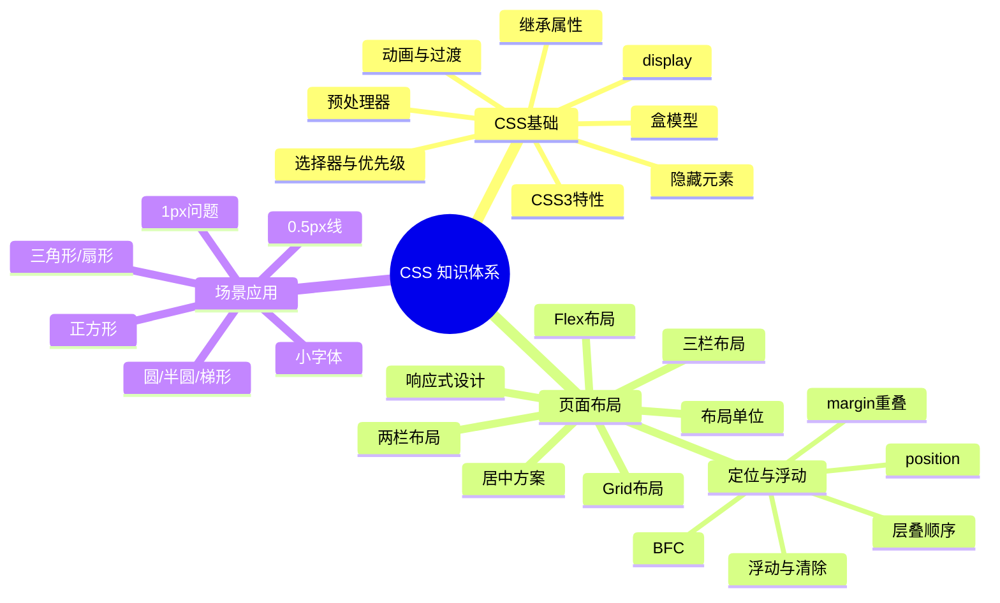

## 📑 目录

- [🎯 一、CSS 基础](#-一css-基础)
- [📐 二、页面布局](#-二页面布局)
- [📍 三、定位与浮动](#-三定位与浮动)
- [🛠️ 四、场景应用](#-四场景应用)
- [✨ 五、现代 CSS 新特性](#-五现代-css-新特性)
  - [Container Queries](#1️⃣-css-container-queries容器查询)
  - [:has() 选择器](#2️⃣-css-has-选择器)
  - [@layer 层叠层](#3️⃣-css-cascade-layerslayer)
  - [原生 Nesting](#4️⃣-css-nesting原生-css-嵌套)
  - [@property](#5️⃣-css-自定义属性进阶property)
  - [颜色函数](#6️⃣-新颜色函数)
  - [滚动驱动动画](#7️⃣-css-scroll-driven-animations滚动驱动动画)
  - [content-visibility](#8️⃣-content-visibility-和-contain)
  - [@starting-style](#9️⃣-starting-style-和-transition-behavior)
  - [Tailwind CSS](#1️⃣0️⃣-tailwind-css-简介)
  - [Anchor Positioning](#1️⃣1️⃣-css-anchor-positioning锚点定位)
  - [@scope](#1️⃣2️⃣-scopecss-样式作用域)
  - [text-wrap](#1️⃣3️⃣-text-wrap-新值)
  - [light-dark()](#1️⃣4️⃣-light-dark-颜色函数)
  - [:user-valid/:user-invalid](#1️⃣5️⃣-user-valid--user-invalid-伪类)
  - [accent-color](#1️⃣6️⃣-accent-color-表单控件主题色)
  - [现代视口单位](#1️⃣7️⃣-现代视口单位dvh--svh--lvh)
  - [容器查询单位](#1️⃣8️⃣-容器查询单位cqi--cqw--cqb)
  - [Subgrid](#1️⃣9️⃣-css-subgrid)
  - [CSS 数学函数](#2️⃣0️⃣-css-数学函数sin--cos--tan--等)
  - [渐变插值提示](#2️⃣1️⃣-渐变插值提示interpolation-hints)
- [🧩 六、CSS 编程题集](#-六css-编程题集)

---

## 🎯 一、CSS 基础

---

### 1️⃣ CSS 选择器及其优先级

> 💡 **要点：** 选择器优先级权重分为四级（行内 1000、ID 100、类/属性/伪类 10、标签/伪元素 1），!important 最高，继承最低

#### 选择器类型与权重

| **选择器**     | **格式**      | **优先级权重** |
| -------------- | ------------- | -------------- |
| id 选择器       | `#id`         | 100            |
| 类选择器       | `.classname`    | 10             |
| 属性选择器     | `a[ref="eee"]` | 10             |
| 伪类选择器     | `li:last-child` | 10             |
| 标签选择器     | `div`          | 1              |
| 伪元素选择器   | `li::after`    | 1              |
| 相邻兄弟选择器 | `h1 + p`       | 0              |
| 子选择器       | `ul > li`      | 0              |
| 后代选择器     | `li a`         | 0              |
| 通配符选择器   | `*`            | 0              |

#### 优先级计算规则

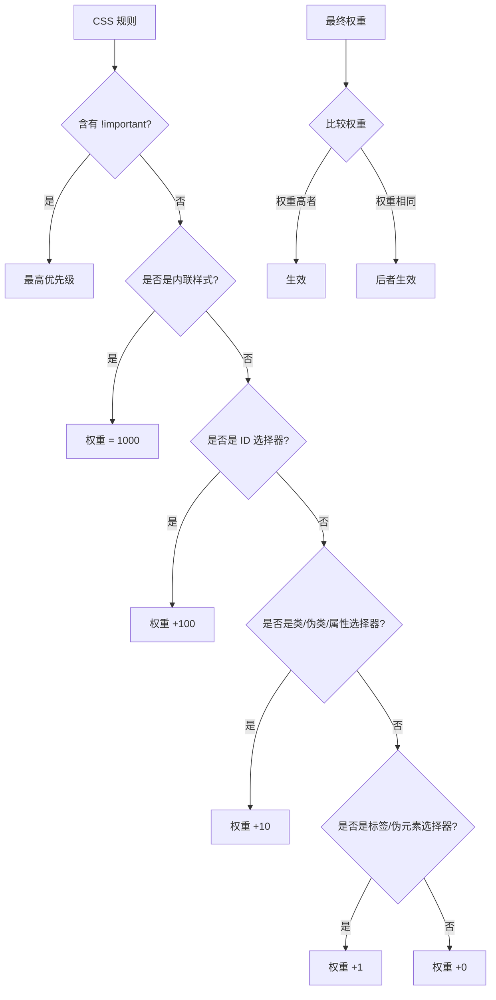

#### 详细说明

- **!important** 声明的样式优先级最高，会覆盖任何选择器的权重
- 如果优先级相同，则**最后出现**的样式生效（就近原则）
- **继承得到的样式**优先级最低，比通配符选择器的权重还低
- 通用选择器（`*`）、子选择器（`>`）和相邻同胞选择器（`+`）的权值都为 0
- 样式表的来源不同时，优先级顺序为：**内联样式 > 内部样式 > 外部样式 > 浏览器用户自定义样式 > 浏览器默认样式**

> ⚠️ **注意：** !important 应谨慎使用，滥用会导致样式难以调试和维护。推荐通过提高选择器 specificity 来覆盖样式，而非依赖 !important

#### 权重计算示例

```css
/* 权重: 0,1,0,0 (10) */
.class-name { color: blue; }

/* 权重: 0,1,1,1 (111) */
div#main .content { color: red; }

/* 权重: 0,0,0,1 (1) + 0,1,0,0 (10) = 0,1,0,1 (11) */
div .highlight { color: green; }

/* 权重: 1,0,0,0 (1000) - 内联 */
/* <div style="color: yellow;"> */
```

---

### 2️⃣ CSS 中可继承与不可继承属性

> 💡 **要点：** 字体（font-*）和文本（color、line-height、text-align）相关属性大多可继承；盒模型（width/height、margin/padding、border）和定位相关属性不可继承

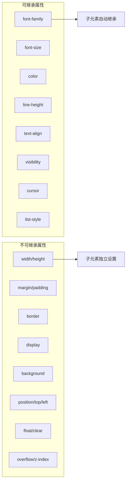

#### 一、无继承性的属性

1. **display**
2. **文本属性**：`vertical-align`、`text-decoration`、`text-shadow`、`white-space`、`unicode-bidi`
3. **盒子模型的属性**：`width`、`height`、`margin`、`border`、`padding`
4. **背景属性**：`background`、`background-color`、`background-image` 等
5. **定位属性**：`float`、`clear`、`position`、`top`、`right`、`bottom`、`left`、`min-width`、`min-height`、`max-width`、`max-height`、`overflow`、`clip`、`z-index`
6. **生成内容属性**：`content`、`counter-reset`、`counter-increment`
7. **轮廓样式属性**：`outline-style`、`outline-width`、`outline-color`、`outline`
8. **页面样式属性**：`size`、`page-break-before`、`page-break-after`
9. **声音样式属性**：`pause-before`、`pause-after`、`pause`、`cue-before`、`cue-after`、`cue`、`play-during`

#### 二、有继承性的属性

1. **字体系列属性**：`font-family`、`font-weight`、`font-size`、`font-style`
2. **文本系列属性**：`text-indent`、`text-align`、`line-height`、`word-spacing`、`letter-spacing`、`text-transform`、`color`
3. **元素可见性**：`visibility`
4. **列表布局属性**：`list-style`
5. **光标属性**：`cursor`

---

### 3️⃣ display 的属性值及其作用

> 💡 **要点：** 理解 block（独占一行可设宽高）、inline（同行显示不可设宽高）、inline-block（兼得二者优点）三者的核心区别是掌握 CSS 布局的基础

| **属性值**   | **作用**                                                 |
| ------------ | -------------------------------------------------------- |
| `none`       | 元素不显示，从文档流中移除                               |
| `block`      | 块类型，默认宽度为父元素宽度，可设置宽高，换行显示       |
| `inline`     | 行内元素类型，默认宽度为内容宽度，不可设置宽高，同行显示 |
| `inline-block` | 默认宽度为内容宽度，可以设置宽高，同行显示             |
| `list-item`  | 像块类型元素一样显示，并添加样式列表标记                 |
| `table`      | 此元素会作为块级表格来显示                               |
| `flex`       | 弹性布局容器                                             |
| `grid`       | 网格布局容器                                             |
| `inherit`    | 从父元素继承 display 属性的值                            |

#### display 类型分类

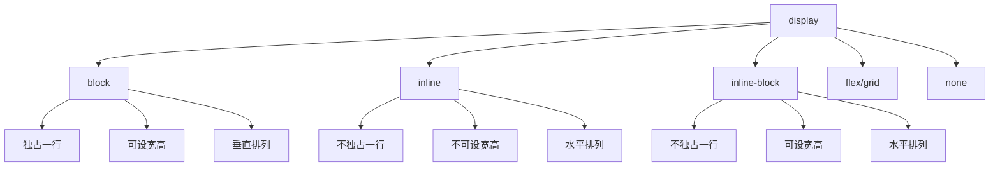

---

### 4️⃣ display 的 block、inline 和 inline-block 的区别

> 💡 **要点：** block 独占一行，宽高 margin padding 四个方向均有效；inline 不可设宽高，margin/padding 仅水平有效；inline-block 不独占一行但可设宽高

| 特性     | block             | inline           | inline-block     |
| -------- | ----------------- | ---------------- | ---------------- |
| 独占一行 | 是               | 否               | 否               |
| 设置宽高 | 有效             | 无效             | 有效             |
| margin/padding | 四个方向均有效 | 仅水平方向有效 | 四个方向均有效   |
| 默认宽度 | 父元素宽度       | 内容宽度         | 内容宽度         |

#### 行内元素与块级元素对比

| 对比项               | 行内元素               | 块级元素               |
| -------------------- | ---------------------- | ---------------------- |
| 宽高设置             | 无效                   | 有效                   |
| 水平方向 margin/padding | 有效               | 有效                   |
| 垂直方向 margin/padding | 无效               | 有效                   |
| 自动换行             | 否                     | 是                     |
| 排列方向             | 水平排列（从左到右）   | 垂直排列（从上到下）   |

---

### 5️⃣ 隐藏元素的方法有哪些

> 💡 **要点：** display:none 不占空间触发重排；visibility:hidden 占空间只重绘；opacity:0 占空间且可交互（触发合成）

| 方法                               | 是否占据空间 | 是否响应事件 | 是否触发重排/重绘     |
| ---------------------------------- | ------------ | ------------ | --------------------- |
| `display: none`                    | 不占据       | 否           | 重排                  |
| `visibility: hidden`               | 占据         | 否           | 重绘                  |
| `opacity: 0`                       | 占据         | 是           | 合成（composite）     |
| `position: absolute` + 移出可视区  | 不占据       | 否           | 重排                  |
| `z-index: 负值`                   | 占据         | 是（被遮盖） | 重绘                  |
| `clip / clip-path: inset(0)`    | 占据         | 否           | 重绘                  |
| `transform: scale(0,0)`           | 占据         | 否           | 合成（composite）     |

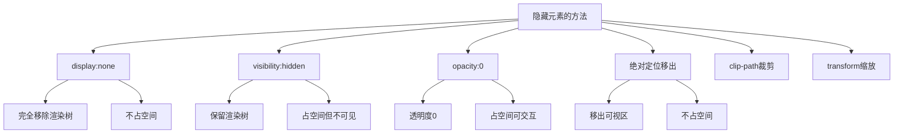

---

### 6️⃣ link 和 @import 的区别

> 💡 **要点：** 推荐使用 `<link>` 而非 `@import`，前者随页面同时加载、无兼容问题、JS 可控、优先级更高

| 对比项             | `<link>`                   | `@import`                    |
| ------------------ | -------------------------- | ---------------------------- |
| 类别               | XHTML 标签                 | CSS 规则                      |
| 加载时机           | 页面载入时**同时**加载     | 页面完全载入**后**加载       |
| 兼容性             | 无兼容问题                 | CSS2.1 提出，低版本不支持    |
| JS 控制 DOM       | 支持                       | 不支持                       |
| 额外功能           | 可定义 RSS 等其他事物      | 只能加载 CSS                 |
| 权重               | 使用 link 加载的样式优先级更高 | 使用 @import 加载的优先级较低 |

```css
/* link 方式（推荐） */
<link rel="stylesheet" href="style.css">

/* @import 方式 */
<style>
  @import url("style.css");
</style>
```

**最佳实践：** 尽量使用 `<link>` 替代 `@import`，因为 link 在页面加载时同时加载 CSS，而 @import 需要等页面完全加载后才加载，会导致白屏时间变长。

---

### 7️⃣ transition 和 animation 的区别

> 💡 **要点：** transition 需事件触发，仅两个关键帧（开始→结束）；animation 可自动执行，支持 @keyframes 多关键帧和循环播放

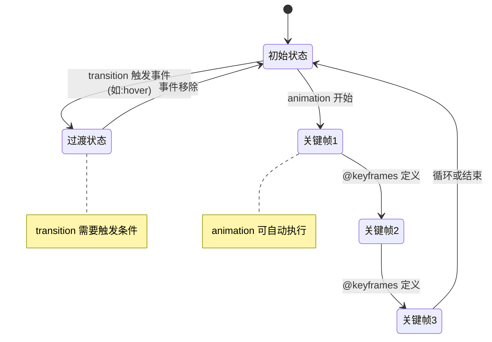

| 对比项     | transition（过渡）                     | animation（动画）                       |
| ---------- | -------------------------------------- | --------------------------------------- |
| 触发方式   | 需要事件触发（hover、click 等）        | 可自动执行，无需触发                    |
| 关键帧     | 只有开始和结束两个关键帧               | 可通过 @keyframes 设置多个关键帧        |
| 循环播放   | 不支持                                 | 支持                                    |
| 精细控制   | 简单，只有中间过程                     | 可控制每一帧的样式                      |
| 适用场景   | 简单的交互效果，如 hover 变色          | 复杂动画，如加载动画、路径动画          |

```css
/* transition - 鼠标悬停时宽度从100px变为200px */
.box {
  width: 100px;
  transition: width 0.3s ease;
}
.box:hover {
  width: 200px;
}

/* animation - 自动循环旋转 */
@keyframes rotate {
  0%   { transform: rotate(0deg); }
  50%  { transform: rotate(180deg); }
  100% { transform: rotate(360deg); }
}
.spinner {
  animation: rotate 2s linear infinite;
}
```

---

### 8️⃣ display:none 与 visibility:hidden 的区别

> 💡 **要点：** display:none 脱离文档流（重排），子节点不可恢复；visibility:hidden 保留空间（重绘），子节点可设 visible 恢复显示

| 对比项               | `display: none`                         | `visibility: hidden`                   |
| -------------------- | --------------------------------------- | -------------------------------------- |
| 渲染树               | 完全消失，不占空间                      | 保留空间，仅内容不可见                 |
| 继承性               | 非继承属性，子节点随父节点消失          | 继承属性，子节点可设置 visible 显示    |
| 文档重排/重绘        | 导致重排（reflow）                      | 只导致重绘（repaint）                  |
| 读屏器读取           | 不会被读取                             | 会被读取                               |
| 动画                 | 无法做过渡动画                          | 可配合 opacity 做淡入淡出              |

```html
<div class="parent" style="display: none">
  <div class="child" style="display: block">我依然不可见</div>
</div>

<div class="parent" style="visibility: hidden">
  <div class="child" style="visibility: visible">我可以看到！</div>
</div>
```

---

### 9️⃣ 伪元素和伪类的区别

> 💡 **要点：** 伪类（:hover）选择已有元素的特定状态；伪元素（::before）创建 DOM 中不存在的虚拟元素，CSS3 规范推荐双冒号写法

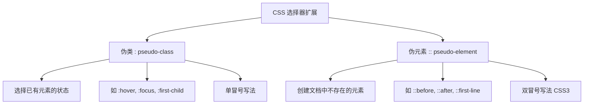

| 对比项     | 伪类（:）                            | 伪元素（::）                          |
| ---------- | ------------------------------------ | ------------------------------------- |
| 含义       | 选择已有元素在**特定状态下**的样式   | 创建**不存在于 DOM 中**的虚拟元素      |
| 示例       | `a:hover`、`li:first-child`          | `p::before`、`div::after`             |
| CSS2 写法  | 单冒号 `:hover`                      | 单冒号 `:before`                      |
| CSS3 规范  | 单冒号保持不变                       | 改为双冒号 `::before`                 |
| 作用       | 改变已有元素的外观                   | 在元素内容前后插入额外内容或样式       |

```css
/* 伪类 - 元素在交互状态下的样式 */
a:hover { color: red; }
li:first-child { font-weight: bold; }
input:focus { border-color: blue; }
p:nth-child(2n) { background: #f5f5f5; }

/* 伪元素 - 在元素前后创建虚拟元素 */
p::before { content: "📌 "; }
p::after { content: " 🔚"; }
p::first-line { font-size: 1.2em; }
p::first-letter { font-size: 2em; font-weight: bold; }
```

---

### 🔟 requestAnimationFrame 的理解

> 💡 **要点：** rAF 与屏幕刷新率同步（60fps），页面不可见时自动暂停，相比 setTimeout 更省电、更平滑、不掉帧

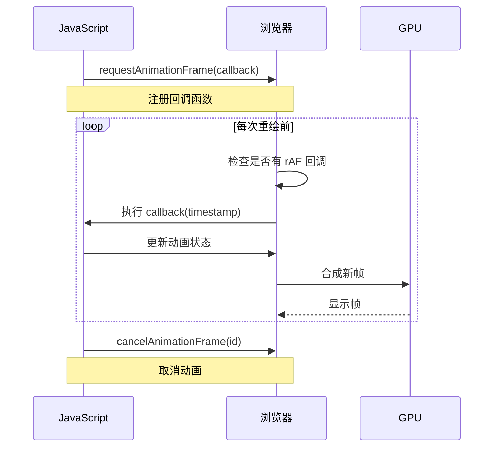

#### 语法

```javascript
// 启动动画
const animationId = requestAnimationFrame(function(timestamp) {
  // timestamp 是开始执行回调的时刻
  element.style.transform = `translateX(${progress}px)`;
});

// 取消动画
cancelAnimationFrame(animationId);
```

#### requestAnimationFrame 的优势

| 对比项         | `setTimeout/setInterval`                 | `requestAnimationFrame`                  |
| -------------- | ---------------------------------------- | ---------------------------------------- |
| CPU 节能       | 页面隐藏时仍在后台执行，浪费资源         | 页面隐藏时自动暂停，节省 CPU             |
| 执行时机       | 固定时间间隔，可能与屏幕刷新不同步       | 与屏幕刷新率同步（通常 60fps）           |
| 函数节流       | 一个刷新间隔内可能执行多次               | 每个刷新间隔只执行一次                   |
| DOM 操作       | 分散操作，多次重排/重绘                  | 自动合并每帧中的 DOM 操作                |
| 掉帧现象       | 容易卡顿、抖动                           | 平滑流畅                                 |

**setTimeout 执行动画的缺点：**
- setTimeout 任务放入异步队列，只有当主线程任务执行完才会执行，实际执行时间比设定时间晚
- 固定时间间隔不一定与屏幕刷新间隔相同，会引起丢帧

---

### 1️⃣1️⃣ 盒模型的理解

> 💡 **要点：** content-box 的 width 只包含内容区域；border-box 的 width 包含 content+padding+border，后者更符合直觉且方便计算

#### 标准盒模型 vs IE 盒模型

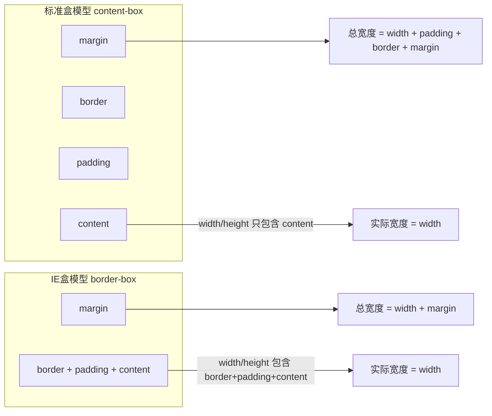

#### 盒模型结构详图

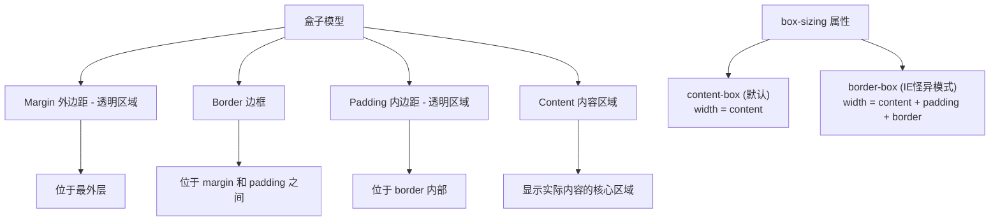

| 模型类型 | `box-sizing` 值         | width 包含范围                        | 总宽度计算公式                                      |
| -------- | ----------------------- | ------------------------------------- | --------------------------------------------------- |
| 标准模型 | `content-box`（默认）   | 仅 content                            | `width + padding-left + padding-right + border-left + border-right + margin-left + margin-right` |
| IE 模型  | `border-box`            | content + padding + border            | `width + margin-left + margin-right`                |

> 💡 **最佳实践：** 全局设置 `box-sizing: border-box` 可使布局计算更直观，推荐在项目 Reset CSS 中加入 `*, *::before, *::after { box-sizing: border-box; }`

#### 代码演示

```css
/* 标准盒模型 */
.standard-box {
  box-sizing: content-box;
  width: 200px;
  padding: 20px;
  border: 10px solid black;
  margin: 30px;
  /* content宽度 = 200px */
  /* 实际渲染宽度 = 200 + 20*2 + 10*2 = 260px */
  /* 总占用宽度 = 260 + 30*2 = 320px */
}

/* IE/怪异盒模型 */
.ie-box {
  box-sizing: border-box;
  width: 200px;
  padding: 20px;
  border: 10px solid black;
  margin: 30px;
  /* content宽度 = 200 - 20*2 - 10*2 = 140px */
  /* 实际渲染宽度 = 200px (就是 width) */
  /* 总占用宽度 = 200 + 30*2 = 260px */
}
```

---

### 1️⃣2️⃣ 为什么用 translate 改变位置而不是定位？

> 💡 **要点：** translate 触发合成（composite）使用 GPU 加速，不触发重排/重绘；改变定位使用 CPU 触发重排，性能开销更大

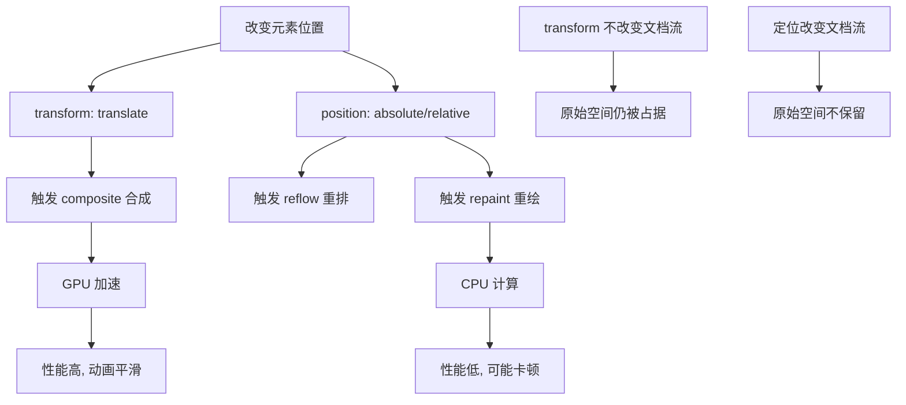

**核心区别：**
- `translate` 是 `transform` 属性的一个值，改变它**不会触发浏览器重新布局（reflow）或重绘（repaint）**，只会触发**复合（composite）**
- 改变绝对定位会触发重新布局，进而触发重绘和复合
- `transform` 使浏览器为元素创建 **GPU 图层**，而改变绝对定位使用 **CPU**
- 因此 `translate()` 更高效，可以缩短平滑动画的绘制时间
- `translate` 改变位置时，元素依然会占据其原始空间，绝对定位不会

---

### 1️⃣3️⃣ li 与 li 之间看不见的空白间隔

> 💡 **要点：** inline/inline-block 元素的换行符被渲染为空格，可通过 font-size:0、浮动、删除空白符等方式解决

**原因：** 浏览器会把 inline 内联元素间的空白字符（空格、换行、Tab 等）渲染成一个空格。

```html
<ul>
  <li>1</li>   <!-- 这里的换行符被渲染成了一个空格 -->
  <li>2</li>   <!-- 这里的换行符也被渲染成了一个空格 -->
  <li>3</li>
</ul>
```

**解决方案对比：**

| 方案                         | 优点               | 缺点                                           |
| ---------------------------- | ------------------ | ---------------------------------------------- |
| `float: left`                | 简单直接           | 有些容器不能设浮动                             |
| 所有 `<li>` 写在同一行        | 不需要额外 CSS     | 代码不美观，可维护性差                         |
| `font-size: 0`               | 简单               | 子元素需重新设置字号，Safari 仍有问题          |
| `letter-spacing: -8px`       | 有效               | 子元素需重置 letter-spacing                    |

---

### 1️⃣4️⃣ CSS3 新特性

> 💡 **要点：** 包括圆角、渐变、变换、过渡、动画、弹性布局、网格布局、媒体查询、CSS 变量、滤镜等，极大扩展了 CSS 能力

| 类别       | 特性                                                         |
| ---------- | ------------------------------------------------------------ |
| 选择器     | 新增 `:nth-child`、`:not()`、`:last-child`、属性选择器等     |
| 圆角       | `border-radius`                                              |
| 多列布局   | `column-count`、`column-gap`、`column-rule`                  |
| 阴影       | `box-shadow`、`text-shadow`                                  |
| 文字特效   | `text-shadow`、`text-stroke`、`text-fill-color`              |
| 渐变       | `linear-gradient`、`radial-gradient`、`conic-gradient`       |
| 变换       | `transform`（旋转、缩放、位移、倾斜）                        |
| 过渡       | `transition`                                                 |
| 动画       | `@keyframes` + `animation`                                   |
| 弹性布局   | `display: flex`                                              |
| 网格布局   | `display: grid`                                              |
| 媒体查询   | `@media`                                                     |
| 自定义属性 | `--variable-name`（CSS 变量）                                |
| 滤镜       | `filter: blur()`、`grayscale()`、`drop-shadow()` 等          |

---

### 1️⃣5️⃣ 替换元素的概念及计算规则

> 💡 **要点：** 替换元素（img、video、input 等）内容不受页面 CSS 影响，尺寸优先级：CSS 尺寸 > HTML 尺寸 > 固有尺寸

**替换元素（Replaced Element）：** 通过修改某个属性值呈现的内容就可以被替换的元素，如 ``、`<video>`、`<iframe>`、`<input>`、`<textarea>`、`<select>` 等。

#### 替换元素的特性

1. 内容的外观不受页面 CSS 影响（在 CSS 作用域之外）
2. 有自己的尺寸（默认 300px × 150px，如 ``、`<video>`）
3. 在 CSS 属性上有自己的一套表现规则（如 `vertical-align` 的基线定义不同）
4. 所有替换元素都是**内联水平元素**

#### 替换元素的尺寸层级

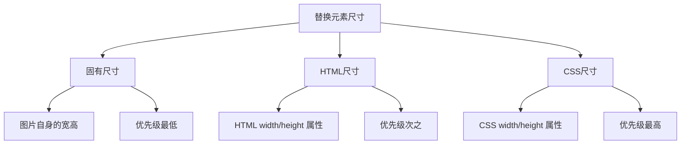

**计算规则（优先级从高到低）：**
1. 有 CSS 尺寸 → 用 CSS 尺寸
2. 无 CSS 尺寸，有 HTML 尺寸 → 用 HTML 尺寸
3. 无 CSS 和 HTML 尺寸 → 用固有尺寸
4. 仅设宽度或高度之一，且有固有宽高比 → 按比例计算另一维
5. 以上都不符合 → 宽度 300px，高度 150px

---

### 1️⃣6️⃣ 常见图片格式及使用场景

> 💡 **要点：** WebP 综合最优（比 PNG 小 26%、比 JPEG 小 25-34%），PNG 适合透明图，SVG 适合矢量图标，GIF 适合简单动画

| 格式     | 压缩方式 | 色彩     | 透明度 | 动画 | 适合场景               | 文件大小 |
| -------- | -------- | -------- | ------ | ---- | ---------------------- | -------- |
| BMP      | 无损     | 直接色   | 不支持 | 不支持 | 不适合 Web 使用       | 极大     |
| GIF      | 无损     | 索引色   | 支持   | 支持 | 简单动画、小图标       | 小       |
| JPEG     | 有损     | 直接色   | 不支持 | 不支持 | 照片、复杂色彩图片     | 中       |
| PNG-8    | 无损     | 索引色   | 支持   | 不支持 | 图标、Logo             | 小       |
| PNG-24   | 无损     | 直接色   | 支持   | 不支持 | 需要高质量透明的图片   | 大       |
| SVG      | 无损     | 矢量     | 支持   | 支持 | Logo、Icon、图表       | 小到中   |
| WebP     | 有损/无损 | 直接色 | 支持   | 支持 | Web 图片（文件体积最优） | 极小     |

**WebP 优势：**
- 无损压缩比 PNG 小 26%
- 有损压缩比 JPEG 小 25%~34%
- 支持透明度（无损压缩时仅增加 22% 文件大小）

---

### 1️⃣7️⃣ CSS Sprites（精灵图）

> 💡 **要点：** 将小图标合并为一张大图，通过 background-position 定位，减少 HTTP 请求数，但维护成本较高

**概念：** 将一个页面涉及到的所有小图片合并到一张大图中，通过 `background-image`、`background-repeat`、`background-position` 进行定位。

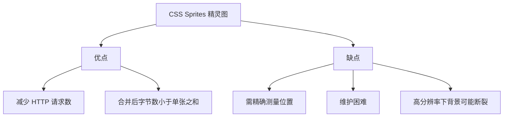

```css
/* 精灵图使用示例 */
.icon-arrow {
  width: 32px;
  height: 32px;
  background-image: url('sprites.png');
  background-position: -10px -20px;  /* 偏移到箭头图标位置 */
}
```

---

### 1️⃣8️⃣ 物理像素、逻辑像素与像素密度

> 💡 **要点：** devicePixelRatio = 物理像素 / 逻辑像素（CSS 像素），高 DPR 屏幕（Retina）需提供对应倍率的高清图

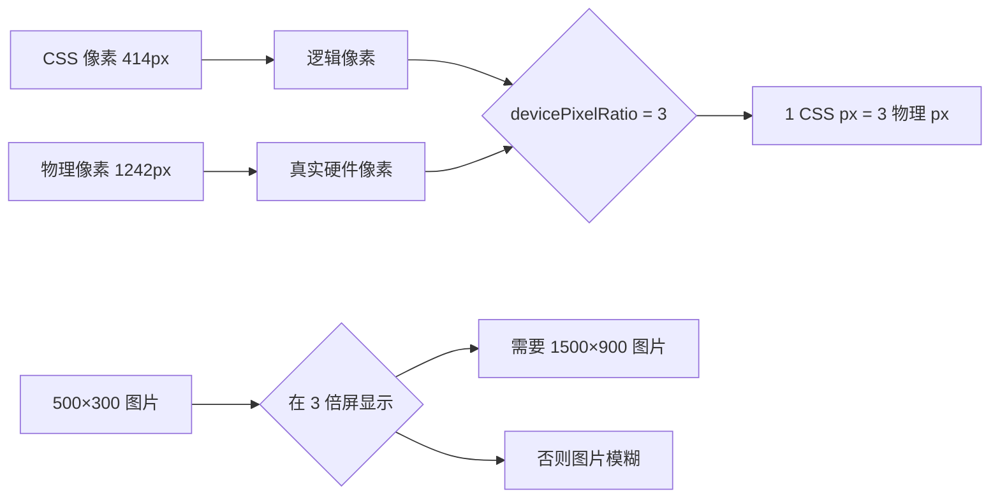

#### 概念解释

- **物理像素：** 设备屏幕实际拥有的像素点，由硬件决定
- **逻辑像素（CSS 像素）：** CSS 中使用的抽象单位
- **像素密度（devicePixelRatio）：** 物理像素 / 逻辑像素

#### 适配方案

```javascript
/* 方案一：媒体查询 */
.my-image {
  background: url('low.png');
}
@media only screen and (min-device-pixel-ratio: 1.5) {
  .my-image {
    background: url('high.png');
  }
}

/* 方案二：使用 srcset */

```

---

### 1️⃣9️⃣ margin 和 padding 的使用场景

> 💡 **要点：** margin 用于元素间间距（border 外侧），padding 用于元素内间距和扩大点击区域（border 内侧）

| 场景                         | 使用     |
| ---------------------------- | -------- |
| border 外侧加空白，不需要背景 | margin   |
| border 内侧加空白，需要背景   | padding  |
| 两个元素之间间距             | margin   |
| 扩大点击区域                 | padding  |
| 父子元素间距                 | padding（推荐）或 margin |

---

### 2️⃣0️⃣ line-height 的理解及赋值方式

> 💡 **要点：** 推荐使用纯数字赋值（如 1.5），因为计算后的比例会正确传递给后代元素；px/em/百分比会传递固定计算值

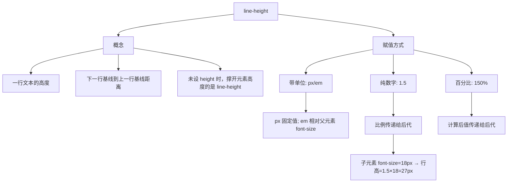

**注意事项：**
- `line-height` 和 `height` 设为相等时，可实现单行文本垂直居中
- 推荐使用**纯数字**赋值方式，因为比例会正确传递给后代元素

---

### 2️⃣1️⃣ CSS 优化与性能提升

> 💡 **要点：** 从加载性能（压缩、link 优先）、选择器性能（避免通配符、层级不超过 3 层）、渲染性能（减少重排重绘）三个维度优化

#### 加载性能

| 优化项               | 说明                                       |
| -------------------- | ------------------------------------------ |
| CSS 压缩             | 去除空格、注释、换行，减小文件体积         |
| 使用 link 而非 @import | link 随页面同时加载，@import 需等待页面加载完 |
| CSS 单一样式         | 如分别写 `margin-bottom` 而非复合属性       |

#### 选择器性能

| 优化项                         | 说明                                             |
| ------------------------------ | ------------------------------------------------ |
| 关键选择器优化                 | 选择器从右向左匹配，关键选择器（最右侧）应尽量精确 |
| 避免通配符 `*`                 | 计算量巨大                                       |
| 用 class 代替标签选择器        | 减少匹配范围                                     |
| 层级不超过 3 层                | 后代选择器开销最高                               |
| 利用继承                     | 避免重复指定可继承属性                           |

#### 渲染性能

| 优化项                 | 说明                 |
| ---------------------- | -------------------- |
| 减少重排、重绘         | 使用 transform、opacity |
| 去除空规则             | `{}` 无用            |
| 属性值 0 不加单位      | `margin: 0`          |
| 使用 CSS 雪碧图        | 减少请求数           |
| 不滥用 Web 字体        | 文件体积大，阻塞渲染 |

---

### 2️⃣2️⃣ CSS 预处理器/后处理器

> 💡 **要点：** 预处理器（Sass/Less）在 CSS 基础上增加变量、嵌套、Mixin 等编程特性；后处理器（PostCSS）对已有 CSS 进行编译优化

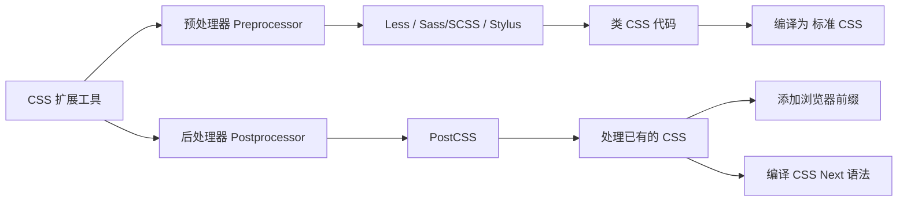

#### 预处理器特性

| 特性     | 说明                                         |
| -------- | -------------------------------------------- |
| 变量     | `$color: red;`（Sass）、`@color: red;`（Less）|
| 嵌套     | 反映 CSS 属性间的层级关系                     |
| Mixin    | 可复用的代码块                               |
| 函数     | 提供计算、颜色处理等函数                     |
| 循环     | `@for`、`@each` 等                           |
| 模块化   | 拆分 CSS 文件，实现复用                       |

#### 后处理器（PostCSS）

PostCSS 类似 CSS 世界的 Babel，可以：
- 自动添加浏览器私有前缀（Autoprefixer）
- 编译 CSS Next（未来的 CSS 语法）
- 代码压缩、lint 检查

---

### 2️⃣3️⃣ ::before 和 :after 的双冒号与单冒号

> 💡 **要点：** CSS3 规范推荐伪元素使用双冒号（::before），伪类使用单冒号（:hover）；浏览器向后兼容单冒号写法

**规则：** 单冒号（`:`）用于 CSS3 伪类，双冒号（`::`）用于 CSS3 伪元素。

| 版本     | 伪元素写法 | 伪类写法 |
| -------- | --------- | -------- |
| CSS2.1   | `:before` | `:hover` |
| CSS3     | `::before` | `:hover` |

**注意：** `::before` 创建一个不在 DOM 中的子元素，定义在元素主体内容之前。为了向后兼容，浏览器仍支持 `:before` 写法，但规范推荐使用 `::before`。

---

### 2️⃣4️⃣ display: inline-block 的间隙问题

> 💡 **要点：** HTML 中的空格/换行符会被渲染为字符空格，推荐父元素 font-size:0 或删除 HTML 空白符解决

**原因：** HTML 中的空格、换行符被渲染成了字符空格。

**解决方法：**
1. 删除 HTML 空格（代码写在一行）
2. 父元素 `font-size: 0`（需子元素重置字号）
3. 父元素 `letter-spacing: -4px` + 子元素重置 `letter-spacing: normal`
4. `margin` 设为负值

---

### 2️⃣5️⃣ 单行/多行文本溢出隐藏

> 💡 **要点：** 单行使用 text-overflow:ellipsis + white-space:nowrap + overflow:hidden；多行使用 -webkit-line-clamp 配合弹性盒模型

#### 单行文本溢出

```css
.single-line-ellipsis {
  overflow: hidden;
  text-overflow: ellipsis;
  white-space: nowrap;
}
```

#### 多行文本溢出

```css
.multi-line-ellipsis {
  overflow: hidden;
  text-overflow: ellipsis;
  display: -webkit-box;
  -webkit-box-orient: vertical;
  -webkit-line-clamp: 3;   /* 显示3行后省略 */
  line-clamp: 3;            /* 标准属性 */
}
```

**注意：** `-webkit-line-clamp` 需要在 `display: -webkit-box` 和 `-webkit-box-orient: vertical` 配合下使用。

---

### 2️⃣6️⃣ Sass / Less 是什么

> 💡 **要点：** CSS 预处理器增加了变量、嵌套、Mixin、函数、循环等编程特性，显著提升 CSS 的可维护性和复用性

**CSS 预处理器：** 在 CSS 基础上添加了变量、嵌套、Mixin、函数等编程特性。

```scss
// Sass 示例
$primary-color: #3498db;
$border-radius: 4px;

.button {
  background: $primary-color;
  border-radius: $border-radius;
  padding: 10px 20px;

  &:hover {
    background: darken($primary-color, 10%);
  }
}

// 编译后
.button { background: #3498db; border-radius: 4px; padding: 10px 20px; }
.button:hover { background: #2980b9; }
```

| 功能     | CSS       | Less/Sass |
| -------- | --------- | --------- |
| 变量     | 原生 CSS 支持自定义属性 `--var`，但逻辑能力有限 | 支持编译期变量 |
| 嵌套     | 原生 CSS 已支持基础嵌套 | 支持且生态成熟 |
| 运算     | `calc()` 有限 | 完整支持 |
| 函数     | 内置函数为主 | 支持自定义函数 |
| Mixin    | 不支持 | 支持 |
| 继承     | 不支持选择器继承 | 支持 `@extend` |
| 循环     | 不支持 | 支持 |

---

## 🧩 六、CSS 编程题集

> 💡 **要点：** 通过 15 个 CSS/JS 实战题目，将布局、定位、动画、交互、响应式和常见面试技巧落地练习。

### 6.1 题目总览

| 题号 | 题目 | 核心能力 |
| ---- | ---- | -------- |
| 1 | 水平居中布局 | 绝对定位、transform、Flex、Grid |
| 2 | 九宫格布局 | Flex / float / Grid 布局 |
| 3 | 实现三角形 | CSS 边框、透明边、0 宽高 |
| 4 | CSS 实现八卦图 | border-radius、伪元素、position |
| 5 | 自适应正方形 | 宽高比、padding-top、vw/vh |
| 6 | CSS 画圆圈 | border-radius、大小、背景 |
| 7 | 三列布局-两边固定中间自适应 | flex / width / margin |
| 8 | 上下固定中间自适应 | calc、position、Flex |
| 9 | Flex 布局-八个元素分两行摆放 | flex-wrap、等分布局 |
| 10 | 品字布局 | Grid、float、块级排列 |
| 11 | 吸顶效果 | position: sticky / fixed |
| 12 | 文字逐个打印 | CSS 动画、step-end、JS 字符串 |
| 13 | CSS 歌词逐渐高亮 | 动画、渐变、文字过渡 |
| 14 | 防抖和节流 | JS 计时器、交互优化 |
| 15 | 手写拖拽 | Pointer Events、position、边界判断 |

### 6.2 实战要点

- 面试手写题先说清楚「结构」「关键 CSS」「兼容或注意点」，再写代码。
- 新项目布局优先考虑 Flex / Grid；float、table、负 margin 主要用于理解历史方案。
- 不定宽高居中首选 `transform: translate(-50%, -50%)`、Flex 或 Grid。
- 自适应比例布局优先使用 `aspect-ratio`，老方案再考虑 `padding-top` 百分比。
- 图形题常见关键字：`border`、`border-radius`、`transform`、`linear-gradient`、`radial-gradient`、伪元素。
- 交互题尽量用 `pointer` 事件统一鼠标和触摸，动画过程用 `requestAnimationFrame` 控制重绘节奏。

---

### 6.3 水平垂直居中布局

> 💡 **要点：** 定宽高可以用绝对定位 + 负 margin；不定宽高推荐 `transform`、Flex 或 Grid。

#### 方法一：绝对定位 + transform（通用）

```html
<div class="center-box">
  <div class="target">center</div>
</div>
```

```css
.center-box {
  position: relative;
  min-height: 300px;
}

.target {
  position: absolute;
  left: 50%;
  top: 50%;
  transform: translate(-50%, -50%);
}
```

#### 方法二：Flex 居中

```css
.center-box {
  min-height: 300px;
  display: flex;
  justify-content: center;
  align-items: center;
}
```

#### 方法三：Grid 居中

```css
.center-box {
  min-height: 300px;
  display: grid;
  place-items: center;
}
```

**面试说明：** `transform` 不依赖元素自身宽高，适合弹窗、提示层等不定尺寸元素；Flex / Grid 更适合普通文档流布局。

---

### 6.4 九宫格布局

> 💡 **要点：** 九宫格本质是 3 行 3 列等分布局，Grid 最直接，Flex 适合兼容或流式换行。

#### Grid 实现（推荐）

```html
<ul class="grid-9">
  <li>1</li><li>2</li><li>3</li>
  <li>4</li><li>5</li><li>6</li>
  <li>7</li><li>8</li><li>9</li>
</ul>
```

```css
.grid-9 {
  display: grid;
  grid-template-columns: repeat(3, 1fr);
  gap: 8px;
  padding: 0;
  list-style: none;
}

.grid-9 li {
  aspect-ratio: 1;
  display: grid;
  place-items: center;
  background: #f59e0b;
  color: #fff;
}
```

#### Flex 实现

```css
.grid-9 {
  display: flex;
  flex-wrap: wrap;
  gap: 8px;
}

.grid-9 li {
  flex: 0 0 calc((100% - 16px) / 3);
  aspect-ratio: 1;
}
```

**注意：** 使用 `gap` 时要在 `flex-basis` 中减去两列间距，否则一行可能放不下 3 个。

---

### 6.5 实现三角形

> 💡 **要点：** 宽高设为 0，四个边框相互挤压，保留一个有颜色的边，其余边透明。

```css
.triangle-up {
  width: 0;
  height: 0;
  border-left: 50px solid transparent;
  border-right: 50px solid transparent;
  border-bottom: 80px solid #ef4444;
}

.triangle-down {
  width: 0;
  height: 0;
  border-left: 50px solid transparent;
  border-right: 50px solid transparent;
  border-top: 80px solid #3b82f6;
}

.triangle-right {
  width: 0;
  height: 0;
  border-top: 50px solid transparent;
  border-bottom: 50px solid transparent;
  border-left: 80px solid #22c55e;
}
```

#### 方向记忆

| 方向 | 有颜色的边 |
| ---- | ---------- |
| 向上 | `border-bottom` |
| 向下 | `border-top` |
| 向左 | `border-right` |
| 向右 | `border-left` |

---

### 6.6 CSS 实现八卦图

> 💡 **要点：** 大圆由上下两色构成，两个半圆和两个小圆通过伪元素叠加完成。

```html
<div class="taiji"></div>
```

```css
.taiji {
  position: relative;
  width: 200px;
  height: 200px;
  border-radius: 50%;
  background: linear-gradient(#fff 0 50%, #111 50% 100%);
  border: 2px solid #111;
}

.taiji::before,
.taiji::after {
  content: "";
  position: absolute;
  top: 50%;
  width: 100px;
  height: 100px;
  border-radius: 50%;
  transform: translateY(-50%);
}

.taiji::before {
  left: 0;
  background:
    radial-gradient(circle, #111 0 12px, #fff 13px 100%);
}

.taiji::after {
  right: 0;
  background:
    radial-gradient(circle, #fff 0 12px, #111 13px 100%);
}
```

**拆解思路：** 先画大圆，再用 `linear-gradient` 分成上下两半，最后用两个伪元素画左右半圆和圆点。

---

### 6.7 自适应正方形

> 💡 **要点：** 正方形的关键是让高度跟随宽度变化，现代写法首选 `aspect-ratio: 1 / 1`。

#### 现代方案

```css
.square {
  width: 40%;
  aspect-ratio: 1 / 1;
  background: #8b5cf6;
}
```

#### padding 百分比方案

```css
.square {
  width: 40%;
  height: 0;
  padding-top: 40%;
  background: #8b5cf6;
}
```

#### 需要放内容时

```html
<div class="square-card">
  <div class="square-card__content">A</div>
</div>
```

```css
.square-card {
  position: relative;
  width: min(40vw, 240px);
  aspect-ratio: 1;
}

.square-card__content {
  position: absolute;
  inset: 0;
  display: grid;
  place-items: center;
}
```

---

### 6.8 CSS 画圆圈

> 💡 **要点：** 圆形使用 `border-radius: 50%`；圆环可用 `border`、`box-shadow` 或 `radial-gradient`。

#### 普通圆

```css
.circle {
  width: 120px;
  height: 120px;
  border-radius: 50%;
  background: #14b8a6;
}
```

#### 圆环：border

```css
.ring-border {
  width: 120px;
  height: 120px;
  border: 24px solid #f9a8d4;
  border-radius: 50%;
  background: #14b8a6;
  box-sizing: border-box;
}
```

#### 圆环：radial-gradient

```css
.ring-gradient {
  width: 120px;
  height: 120px;
  border-radius: 50%;
  background: radial-gradient(circle, transparent 42%, #f97316 43% 100%);
}
```

**选择建议：** 要真实占据边框尺寸用 `border`；只做视觉效果用 `box-shadow` 或 `radial-gradient` 更灵活。

---

### 6.9 三列布局：两边固定，中间自适应

> 💡 **要点：** 现代方案推荐 Flex / Grid；旧方案可用 float + BFC 或绝对定位。

```html
<div class="three-column">
  <aside class="left">left</aside>
  <main class="center">center</main>
  <aside class="right">right</aside>
</div>
```

#### Flex 实现

```css
.three-column {
  display: flex;
  min-height: 240px;
}

.left,
.right {
  flex: 0 0 240px;
}

.center {
  flex: 1;
  min-width: 0;
}
```

#### Grid 实现

```css
.three-column {
  display: grid;
  grid-template-columns: 240px minmax(0, 1fr) 240px;
  min-height: 240px;
}
```

**注意：** 中间列放长文本时，Flex 写法中建议加 `min-width: 0`，否则内容可能把布局撑开。

---

### 6.10 上下固定，中间自适应

> 💡 **要点：** 整体高度固定为视口高，头尾固定高度，中间区域 `flex: 1` 并允许滚动。

```html
<div class="page">
  <header class="page__header">header</header>
  <main class="page__main">content</main>
  <footer class="page__footer">footer</footer>
</div>
```

```css
.page {
  min-height: 100vh;
  display: flex;
  flex-direction: column;
}

.page__header,
.page__footer {
  height: 64px;
  flex: 0 0 auto;
}

.page__main {
  flex: 1;
  min-height: 0;
  overflow: auto;
}
```

#### calc 方案

```css
.page__main {
  height: calc(100vh - 128px);
  overflow: auto;
}
```

**选择建议：** 页面框架优先 Flex；高度固定、结构简单时可用 `calc()`。

---

### 6.11 Flex 布局：八个元素分两行摆放

> 💡 **要点：** 容器开启换行，子元素固定为每行 4 个。

```html
<ul class="two-row-list">
  <li>1</li><li>2</li><li>3</li><li>4</li>
  <li>5</li><li>6</li><li>7</li><li>8</li>
</ul>
```

```css
.two-row-list {
  display: flex;
  flex-wrap: wrap;
  gap: 12px;
  padding: 0;
  list-style: none;
}

.two-row-list li {
  flex: 0 0 calc((100% - 36px) / 4);
  height: 80px;
  display: grid;
  place-items: center;
  background: #dbeafe;
}
```

**公式：** 每行 4 个，间距有 3 个，所以宽度是 `(100% - 3 * gap) / 4`。

---

### 6.12 品字布局

> 💡 **要点：** 上面一个块居中，下面两个块左右排列，整体像“品”字。

#### Grid 实现

```html
<div class="pin-layout">
  <div class="pin-layout__top">1</div>
  <div>2</div>
  <div>3</div>
</div>
```

```css
.pin-layout {
  width: min(100%, 480px);
  display: grid;
  grid-template-columns: repeat(2, 1fr);
  gap: 12px;
}

.pin-layout > div {
  height: 120px;
  display: grid;
  place-items: center;
  color: #fff;
  background: #2563eb;
}

.pin-layout__top {
  grid-column: 1 / -1;
  width: 50%;
  justify-self: center;
}
```

#### Float 思路

```css
.top {
  width: 50%;
  margin: 0 auto;
}

.left,
.right {
  float: left;
  width: 50%;
}
```

---

### 6.13 吸顶效果

> 💡 **要点：** `position: sticky` 让元素在普通文档流和固定定位之间切换。

```html
<section class="article">
  <nav class="article__tabs">tabs</nav>
  <div class="article__content">...</div>
</section>
```

```css
.article__tabs {
  position: sticky;
  top: 0;
  z-index: 10;
  background: #fff;
}
```

#### sticky 失效常见原因

- 没有设置 `top`、`left`、`right` 或 `bottom` 之一。
- 父元素高度不够，滚动范围不足。
- 父级设置了不合适的 `overflow: hidden / auto / scroll`，导致 sticky 参考滚动容器变化。
- 表格、复杂 transform 场景下可能受层叠上下文影响。

---

### 6.14 文字逐个打印

> 💡 **要点：** CSS 方案用 `steps()` 控制宽度逐格变化，配合 `overflow: hidden` 和等宽字体。

```html
<p class="typing">CSS makes layout visible.</p>
```

```css
.typing {
  width: 0;
  overflow: hidden;
  white-space: nowrap;
  border-right: 2px solid currentColor;
  font-family: monospace;
  animation:
    typing 3s steps(25, end) forwards,
    cursor 0.8s step-end infinite;
}

@keyframes typing {
  to {
    width: 25ch;
  }
}

@keyframes cursor {
  50% {
    border-color: transparent;
  }
}
```

**注意：** `steps(25)` 和 `25ch` 要与字符数量接近；中文或非等宽字体时宽度控制会更难精确。

---

### 6.15 CSS 歌词逐渐高亮

> 💡 **要点：** 用渐变背景作为文字颜色，通过 `background-clip: text` 只显示文字区域。

```html
<p class="lyric">愿你走出半生，归来仍是少年</p>
```

```css
@property --progress {
  syntax: "<percentage>";
  inherits: false;
  initial-value: 0%;
}

.lyric {
  --progress: 0%;
  display: inline-block;
  color: transparent;
  background:
    linear-gradient(
      90deg,
      #ef4444 0 var(--progress),
      #111827 var(--progress) 100%
    );
  background-clip: text;
  -webkit-background-clip: text;
  animation: lyric-progress 4s linear forwards;
}

@keyframes lyric-progress {
  to {
    --progress: 100%;
  }
}
```

#### 更稳的兼容写法

```css
.lyric {
  background-size: 0% 100%;
  background-repeat: no-repeat;
  background-image: linear-gradient(90deg, #ef4444, #ef4444);
  -webkit-text-fill-color: transparent;
  -webkit-background-clip: text;
  animation: highlight 4s linear forwards;
}

@keyframes highlight {
  to {
    background-size: 100% 100%;
  }
}
```

---

### 6.16 防抖和节流

> 💡 **要点：** 防抖是“停下来再执行”，节流是“固定间隔执行一次”。

#### 防抖 Debounce

```javascript
function debounce(fn, delay = 300) {
  let timer = null;

  return function debounced(...args) {
    clearTimeout(timer);
    timer = setTimeout(() => {
      fn.apply(this, args);
    }, delay);
  };
}
```

#### 节流 Throttle

```javascript
function throttle(fn, delay = 300) {
  let lastTime = 0;

  return function throttled(...args) {
    const now = Date.now();

    if (now - lastTime >= delay) {
      lastTime = now;
      fn.apply(this, args);
    }
  };
}
```

#### 使用场景

| 类型 | 触发特点 | 适用场景 |
| ---- | -------- | -------- |
| 防抖 | 高频触发后只执行最后一次 | 搜索输入、窗口 resize、提交按钮防重复 |
| 节流 | 高频触发时按固定频率执行 | 滚动监听、拖拽移动、游戏按键 |

---

### 6.17 手写拖拽

> 💡 **要点：** 使用 Pointer Events 统一鼠标、触摸和触控笔；记录按下时的偏移量，移动时更新位置。

```html
<div class="drag-stage">
  <div class="drag-box">drag</div>
</div>
```

```css
.drag-stage {
  position: relative;
  width: 480px;
  height: 300px;
  border: 1px solid #d1d5db;
}

.drag-box {
  position: absolute;
  left: 0;
  top: 0;
  width: 96px;
  height: 96px;
  display: grid;
  place-items: center;
  cursor: grab;
  user-select: none;
  background: #60a5fa;
}

.drag-box.is-dragging {
  cursor: grabbing;
}
```

```javascript
const stage = document.querySelector(".drag-stage");
const box = document.querySelector(".drag-box");

let startX = 0;
let startY = 0;
let originX = 0;
let originY = 0;
let dragging = false;

box.addEventListener("pointerdown", (event) => {
  dragging = true;
  startX = event.clientX;
  startY = event.clientY;
  originX = box.offsetLeft;
  originY = box.offsetTop;
  box.classList.add("is-dragging");
  box.setPointerCapture(event.pointerId);
});

box.addEventListener("pointermove", (event) => {
  if (!dragging) return;

  const stageRect = stage.getBoundingClientRect();
  const nextX = originX + event.clientX - startX;
  const nextY = originY + event.clientY - startY;
  const maxX = stageRect.width - box.offsetWidth;
  const maxY = stageRect.height - box.offsetHeight;

  box.style.left = `${Math.min(Math.max(nextX, 0), maxX)}px`;
  box.style.top = `${Math.min(Math.max(nextY, 0), maxY)}px`;
});

box.addEventListener("pointerup", (event) => {
  dragging = false;
  box.classList.remove("is-dragging");
  box.releasePointerCapture(event.pointerId);
});
```

**可扩展点：** 边界吸附、网格吸附、拖拽排序、拖拽过程中用 `transform` 替代 `left/top` 以减少布局计算。

---

### 6.18 编程题作答模板

> 💡 **要点：** 面试手写 CSS 题不只看代码，也看你能否解释方案取舍。

1. 先确认题目约束：是否定宽高、是否需要兼容旧浏览器、是否要响应式。
2. 给出推荐方案：现代布局优先 Flex/Grid，图形题优先伪元素和渐变。
3. 写核心代码：只写必要 HTML 和 CSS，避免无关样式干扰。
4. 补充注意点：滚动容器、层叠上下文、盒模型、`gap`、`min-width: 0` 等。
5. 给出替代方案：例如 Grid 不可用时用 Flex，`aspect-ratio` 不可用时用 padding 百分比。

> 📌 说明：以上题目均来自 `CSS编程题集.md`，可作为 `02-CSS-详解版.md` 的实践补充。 更多代码与示例请参考该题集。

---

### 2️⃣7️⃣ 媒体查询的理解

> 💡 **要点：** 通过 @media 检测设备特性（屏幕宽度、分辨率等）实现响应式设计，常见断点：手机 320px、平板 768px、桌面 1024px

```css
/* 在屏幕宽度小于等于 600px 时生效 */
@media (max-width: 600px) {
  .sidebar {
    display: none;
  }
}

/* 同时匹配屏幕类型和宽度范围 */
@media screen and (min-width: 768px) and (max-width: 1024px) {
  .container {
    width: 750px;
  }
}

/* link 标签中使用 */
<link rel="stylesheet" media="(max-width: 800px)" href="mobile.css">
```

**响应式断点常见值：**
- 手机：320px ~ 480px
- 平板：768px ~ 1024px
- 桌面：1024px ~ 1440px
- 宽屏：1440px+

---

### 2️⃣8️⃣ CSS 工程化理解

> 💡 **要点：** 解决 CSS 组织拆分、编码复用、构建优化、可维护性问题，常用方案包括预处理器、PostCSS、CSS Modules、BEM 命名规范

**需要解决的问题：**
1. **宏观设计：** CSS 如何组织、拆分、模块化
2. **编码优化：** 写出结构清晰、可复用的 CSS
3. **构建优化：** 打包压缩、兼容处理
4. **可维护性：** 降低变更成本

**主流工程化实践：**
- **CSS 预处理器：** Less、Sass（解决编码和可维护性问题）
- **PostCSS：** Autoprefixer、CSS Next 编译（解决构建问题）
- **CSS Modules / CSS-in-JS：** 解决样式冲突和模块化问题
- **BEM 命名规范：** `.block__element--modifier`

---

### 2️⃣9️⃣ 判断元素是否到达可视区域

> 💡 **要点：** 使用 getBoundingClientRect() 获取元素相对于视口的位置，结合 scrollTop 和 innerHeight 判断懒加载或无限滚动触发时机

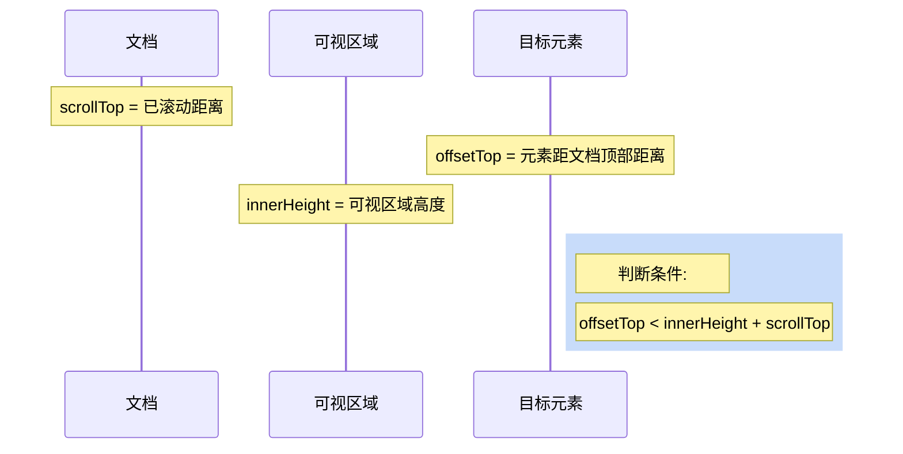

```javascript
function isInViewport(element) {
  const rect = element.getBoundingClientRect();
  return (
    rect.top >= 0 &&
    rect.left >= 0 &&
    rect.bottom <= (window.innerHeight || document.documentElement.clientHeight) &&
    rect.right <= (window.innerWidth || document.documentElement.clientWidth)
  );
}

// 或者判断元素是否进入可视区域（适合懒加载）
function isVisible(element) {
  const top = element.getBoundingClientRect().top;
  return top < window.innerHeight;
}
```

---

### 3️⃣0️⃣ z-index 在什么情况下会失效

> 💡 **要点：** z-index 只在定位元素（非 static）上生效，常见失效原因：未设定位、父元素层叠上下文限制、与 float 冲突

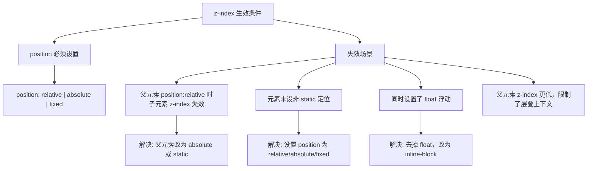

---

## 📐 二、页面布局

---

### 1️⃣ 常见 CSS 布局单位

> 💡 **要点：** px 固定大小、em 相对父元素 font-size（有级联）、rem 相对根元素（无级联）、vw/vh 相对视口，rem 和 vw 适合响应式

| 单位  | 类型 | 相对对象       | 特点                         |
| ----- | ---- | -------------- | ---------------------------- |
| px    | 绝对 | 无             | 固定大小，不随屏幕变化       |
| %     | 相对 | 父元素（大部分情况） | 随父元素变化               |
| em    | 相对 | 父元素 font-size | 级联效应，可嵌套           |
| rem   | 相对 | 根元素 font-size | 无级联效应，适合响应式     |
| vw    | 相对 | 视口宽度       | 1vw = 视口宽度的 1%          |
| vh    | 相对 | 视口高度       | 1vh = 视口高度的 1%          |
| vmin  | 相对 | vw 和 vh 中较小值 | 适配横竖屏切换           |
| vmax  | 相对 | vw 和 vh 中较大值 | 适配横竖屏切换           |

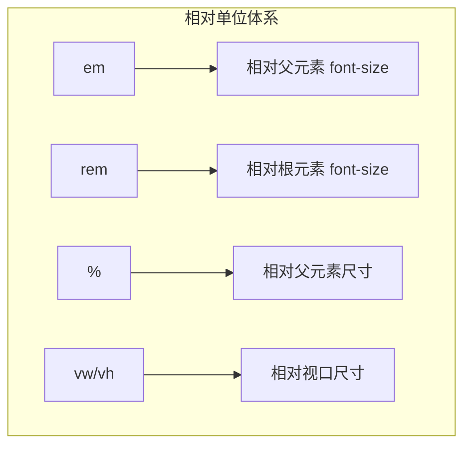

---

### 2️⃣ px、em、rem 的区别及使用场景

> 💡 **要点：** px 适合精确尺寸（边框、阴影）；em 适合与字体关联的尺寸（按钮内边距）；rem 适合响应式布局（全局统一缩放）

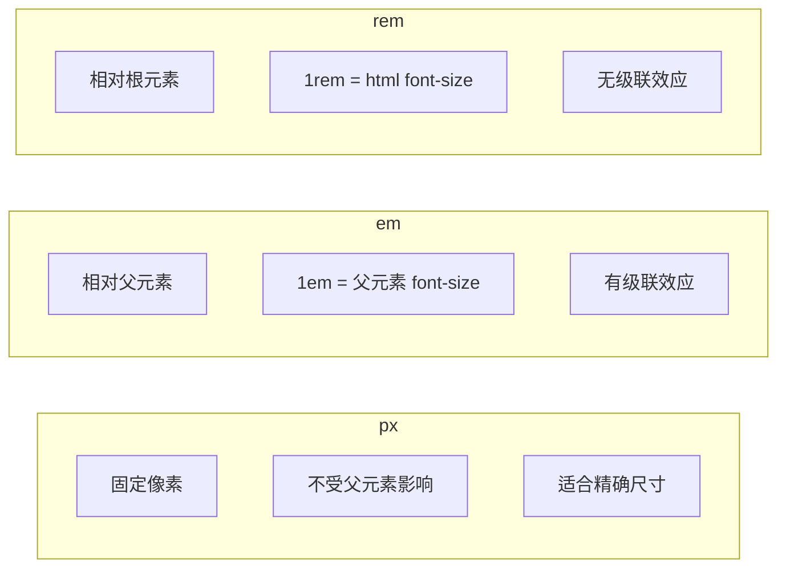

| 单位 | 适用场景                             | 不适用场景                             |
| ---- | ------------------------------------ | -------------------------------------- |
| px   | 边框、阴影、精细化尺寸               | 需要适配多设备                        |
| em   | 按钮内边距、与字体大小关联的尺寸     | 多层嵌套时容易混乱                    |
| rem  | 响应式布局、移动端适配               | 需要精确像素控制的场景                |

```css
/* rem 实现响应式 - 通过根元素字体大小控制全局 */
html {
  font-size: 16px;
}

@media (max-width: 768px) {
  html {
    font-size: 14px;
  }
}

.title {
  font-size: 2rem;   /* 在桌面 = 32px, 在移动端 = 28px */
  margin: 1rem 0;    /* 自适应间距 */
}
```

---

### 3️⃣ 两栏布局的实现（左固定右自适应）

> 💡 **要点：** 推荐使用 Flex 方案（父 display:flex，右 flex:1）最简洁；float+BFC 方案兼容性好；绝对定位方案脱离文档流需注意

```mermaid
flowchart TD
    subgraph 两栏布局方案
        A["float + margin"]
        B["float + BFC"]
        C["Flex"]
        D["绝对定位"]
    end

    A --> A1["左 float:left"]
    A --> A2["右 margin-left: 固定宽度"]

    B --> B1["左 float:left"]
    B --> B2["右 overflow:hidden"]
    B --> B3["触发生成BFC"]

    C --> C1["父 display:flex"]
    C --> C2["右 flex:1"]

    D --> D1["父 position:relative"]
    D --> D2["左 position:absolute"]
    D --> D3["右 margin-left: 固定宽度"]
```

#### 方法一：float + margin

```css
.outer {
  height: 100px;
}
.left {
  float: left;
  width: 200px;
  background: tomato;
}
.right {
  margin-left: 200px;
  width: auto;
  background: gold;
}
```

#### 方法二：float + BFC（overflow: hidden）

```css
.left {
  width: 100px;
  height: 200px;
  background: red;
  float: left;
}
.right {
  height: 300px;
  background: blue;
  overflow: hidden;  /* 触发 BFC，不与浮动元素重叠 */
}
```

#### 方法三：Flex 布局

```css
.outer {
  display: flex;
  height: 100px;
}
.left {
  width: 200px;
  background: tomato;
}
.right {
  flex: 1;
  background: gold;
}
```

#### 方法四：绝对定位

```css
.outer {
  position: relative;
  height: 100px;
}
.left {
  position: absolute;
  width: 200px;
  height: 100px;
  background: tomato;
}
.right {
  margin-left: 200px;
  background: gold;
}
```

---

### 4️⃣ 三栏布局的实现（左右固定中间自适应）

> 💡 **要点：** Flex 方案最简洁（中间 flex:1）；圣杯和双飞翼是经典 CSS 布局，核心是利用浮动和负 margin 实现中间列优先渲染

```mermaid
flowchart TD
    subgraph 三栏布局方案
        A["绝对定位"]
        B["Flex"]
        C["浮动"]
        D["圣杯布局"]
        E["双飞翼布局"]
    end

    A --> A1["左右 absolute"]
    A --> A2["中间 margin"]

    B --> B1["父 display:flex"]
    B --> B2["中间 flex:1"]

    C --> C1["左右 float"]
    C --> C2["中间 margin"]

    D --> D1["父 padding 预留空间"]
    D --> D2["三列 float + 负 margin"]
    D --> D3["相对定位调整位置"]

    E --> E1["中间 100% 宽度"]
    E --> E2["左右负 margin 拉回"]
    E --> E3["中间子元素 margin 留空间"]
```

#### 方法一：绝对定位

```css
.outer {
  position: relative;
  height: 100px;
}
.left {
  position: absolute;
  width: 100px;
  height: 100px;
  background: tomato;
}
.right {
  position: absolute;
  top: 0;
  right: 0;
  width: 200px;
  height: 100px;
  background: gold;
}
.center {
  margin-left: 100px;
  margin-right: 200px;
  height: 100px;
  background: lightgreen;
}
```

#### 方法二：Flex 布局

```css
.outer {
  display: flex;
  height: 100px;
}
.left {
  width: 100px;
  background: tomato;
}
.right {
  width: 200px;
  background: gold;
}
.center {
  flex: 1;
  background: lightgreen;
}
```

#### 方法三：浮动布局

```css
.outer {
  height: 100px;
}
.left {
  float: left;
  width: 100px;
  height: 100px;
  background: tomato;
}
.right {
  float: right;
  width: 200px;
  height: 100px;
  background: gold;
}
.center {
  height: 100px;
  margin-left: 100px;
  margin-right: 200px;
  background: lightgreen;
}
```

#### 方法四：圣杯布局

```css
.outer {
  height: 100px;
  padding-left: 100px;    /* 为左栏预留空间 */
  padding-right: 200px;   /* 为右栏预留空间 */
}
.center {
  float: left;
  width: 100%;
  height: 100px;
  background: lightgreen;
}
.left {
  position: relative;
  left: -100px;
  float: left;
  margin-left: -100%;       /* 拉回上一行 */
  width: 100px;
  height: 100px;
  background: tomato;
}
.right {
  position: relative;
  left: 200px;
  float: right;
  margin-left: -200px;      /* 拉回上一行 */
  width: 200px;
  height: 100px;
  background: gold;
}
```

#### 方法五：双飞翼布局

```css
.outer {
  height: 100px;
}
.wrapper {
  float: left;
  width: 100%;
  height: 100px;
  background: lightgreen;
}
.center {
  margin-left: 100px;    /* 为左栏留空间 */
  margin-right: 200px;   /* 为右栏留空间 */
  height: 100px;
}
.left {
  float: left;
  margin-left: -100%;    /* 拉回上一行 */
  width: 100px;
  height: 100px;
  background: tomato;
}
.right {
  float: left;
  margin-left: -200px;   /* 拉回上一行 */
  width: 200px;
  height: 100px;
  background: gold;
}
```

#### 圣杯 vs 双飞翼对比

| 对比项     | 圣杯布局                   | 双飞翼布局                   |
| ---------- | -------------------------- | ---------------------------- |
| 中间列空间 | 父元素 padding 预留        | 中间列子元素 margin 预留     |
| 定位方式   | 使用 position:relative     | 仅用 margin 负值             |
| 结构       | 三层结构                   | 四层结构（多一层 wrapper）   |
| 优点       | DOM 结构简单               | 不需要定位，更灵活           |

---

### 5️⃣ 水平垂直居中的实现

> 💡 **要点：** Flex 方案最推荐（justify-content:center + align-items:center）；transform 方案无需知道元素宽高；Grid 方案一行代码完成

```mermaid
flowchart TD
    subgraph 水平垂直居中方案
        A["transform 偏移"]
        B["margin:auto"]
        C["margin 负值"]
        D["Flex"]
    end

    A --> A1["position: absolute; top: 50%; left: 50%;"]
    A --> A2["transform: translate("-50%, -50%")"]
    A --> A3["无需知道宽高"]

    B --> B1["position: absolute; top:0; ...; margin:auto"]
    B --> B2["需知道宽高"]

    C --> C1["position: absolute; top: 50%; left: 50%"]
    C --> C2["margin-top: -50px; margin-left: -50px"]
    C --> C3["需知道宽高"]

    D --> D1["display: flex; justify-content: center;"]
    D --> D2["align-items: center"]
    D --> D3["移动端常用"]
```

| 方法                           | 优点                     | 缺点                     |
| ------------------------------ | ------------------------ | ------------------------ |
| transform 偏移                 | 无需知道元素宽高         | 兼容性（IE9+）           |
| margin: auto                   | 代码简洁                 | 需设置宽高               |
| margin 负值                    | 兼容性好                 | 需知道宽高               |
| Flex                           | 代码最简单               | 兼容性（IE10+）          |
| Grid                           | 一行代码                 | 兼容性                   |

**Flex 居中（推荐）：**

```css
.parent {
  display: flex;
  justify-content: center;
  align-items: center;
  height: 100vh;
}
```

**Grid 居中：**

```css
.parent {
  display: grid;
  place-items: center;
  height: 100vh;
}
```

---

### 6️⃣ 移动端适配

> 💡 **要点：** 两个维度：适配像素密度（通过媒体查询或 srcset 提供高清图）和适配屏幕大小（使用 rem/vw 等相对单位）

**两个核心维度：**

1. **适配不同像素密度：** 使用媒体查询或 `srcset` 选择不同精度的图片

```css
/* 2 倍屏使用高清图 */
@media (-webkit-min-device-pixel-ratio: 2), (min-resolution: 192dpi) {
  .logo {
    background-image: url('logo@2x.png');
  }
}
```

2. **适配不同屏幕大小：** 使用 rem、vw/vh 等相对单位

```javascript
// flexible 方案的简化版 - 基于 rem 的适配
(function flexible() {
  const docEl = document.documentElement;
  const maxWidth = 750;

  function setRemUnit() {
    const width = docEl.clientWidth;
    const ratio = width / 375;  // 以 iPhone 6/7/8 为基准
    docEl.style.fontSize = 16 * ratio + 'px';
  }

  setRemUnit();
  window.addEventListener('resize', setRemUnit);
})();
```

---

### 7️⃣ Flex 布局的理解

> 💡 **要点：** 容器属性控制主轴（flex-direction/justify-content）和交叉轴（align-items）对齐；项目属性控制自身伸缩（flex-grow/shrink/basis）

```mermaid
flowchart TD
    A["Flex 容器 display:flex"] --> B["主轴 main axis"]
    A --> C["交叉轴 cross axis"]

    B --> D["容器属性 - 主轴控制"]
    D --> D1["flex-direction: row/column"]
    D --> D2["justify-content: flex-start/center/space-between"]

    C --> E["容器属性 - 交叉轴控制"]
    E --> E1["align-items: center/stretch"]
    E --> E2["align-content: 多行对齐"]

    A --> F["项目属性"]
    F --> F1["flex: flex-grow flex-shrink flex-basis"]
    F --> F2["order: 排列顺序"]
    F --> F3["align-self: 单独对齐"]
```

```mermaid
flowchart LR
    subgraph Flex 主轴方向
        direction LR
        A1["flex-direction: row"] --> A2["项目 → → →"]
        B1["flex-direction: column"] --> B2["项目 ↓ ↓ ↓"]
    end
```

| 容器属性          | 作用                                       | 可选值                                                 |
| ----------------- | ------------------------------------------ | ------------------------------------------------------ |
| `flex-direction`  | 主轴方向                                   | `row` / `row-reverse` / `column` / `column-reverse`   |
| `flex-wrap`       | 是否换行                                   | `nowrap` / `wrap` / `wrap-reverse`                     |
| `flex-flow`       | 前两者的简写                               | `row nowrap`（默认）                                   |
| `justify-content` | 主轴对齐方式                               | `flex-start` / `flex-end` / `center` / `space-between` / `space-around` / `space-evenly` |
| `align-items`     | 交叉轴对齐方式                             | `stretch` / `flex-start` / `flex-end` / `center` / `baseline` |
| `align-content`   | 多根轴线对齐（多行时有效）                 | `stretch` / `flex-start` / `flex-end` / `center` / `space-between` / `space-around` |

| 项目属性       | 作用                   | 可选值                                        |
| -------------- | ---------------------- | --------------------------------------------- |
| `order`        | 排列顺序（数值越小越靠前） | 数字（默认 0）                              |
| `flex-grow`    | 放大比例               | 数字（默认 0，有剩余空间时不放大）           |
| `flex-shrink`  | 缩小比例               | 数字（默认 1，空间不足时缩小）               |
| `flex-basis`   | 分配多余空间前的项目大小 | 长度 / `auto`（默认）                        |
| `flex`         | 前三者的简写           | `0 1 auto`（默认）                           |
| `align-self`   | 单独对齐方式           | `auto` / `flex-start` / `flex-end` / `center` / `baseline` / `stretch` |

---

### 8️⃣ flex:1 表示什么

> 💡 **要点：** flex:1 等价于 `flex: 1 1 0%`，即可放大（grow=1）、可缩小（shrink=1）、基础大小为 0（basis=0%），表示项目将等分剩余空间

\`flex: 1\` 是三个属性的简写：\`flex: 1 1 0%\`

| 属性          | 值    | 含义                                                         |
| ------------- | ----- | ------------------------------------------------------------ |
| flex-grow     | 1     | 有剩余空间时，项目将按比例放大                               |
| flex-shrink   | 1     | 空间不足时，项目将按比例缩小                                 |
| flex-basis    | 0%    | 项目在分配多余空间前的基础大小为 0，所有空间都通过 grow 灵活分配 |

```css
/* 以下写法等价 */
.item-1 { flex: 1; }
.item-1 { flex: 1 1 0%; }

/* flex: none 等价于 flex: 0 0 auto */
.item-2 { flex: none; }
.item-2 { flex: 0 0 auto; }

/* flex: auto 等价于 flex: 1 1 auto */
.item-3 { flex: auto; }
.item-3 { flex: 1 1 auto; }
```

---

### 9️⃣ 响应式设计

> 💡 **要点：** 通过媒体查询检测设备屏幕尺寸做处理，核心 meta 标签为 `viewport`，常用方案包括媒体查询、百分比、rem/vw、Flex、Grid

**概念：** 一个网站能够兼容多个终端，而不是为每一个终端做一个特定版本。

**原理：** 通过媒体查询（`@media`）检测不同设备的屏幕尺寸做处理。

**必要条件：**
```html
<meta name="viewport" content="width=device-width, initial-scale=1.0, maximum-scale=1.0, user-scalable=no">
```

**实现方式对比：**

| 方式               | 说明                                         | 适用场景         |
| ------------------ | -------------------------------------------- | ---------------- |
| 媒体查询           | 不同断点使用不同样式                         | 传统响应式       |
| 百分比布局         | 宽度使用百分比自适应                         | 基础响应式       |
| rem / vw 布局      | 相对单位统一缩放                             | 移动端适配       |
| Flex 布局          | 弹性伸缩，自动换行                           | 组件级自适应     |
| Grid 布局          | 自动填充列数                                 | 网格型布局       |

---

### 🔟 实现品字布局

> 💡 **要点：** 上方块居中（margin: 0 auto），下方两个块并排（float 或 inline-block），配合 calc() 精确计算位置

```mermaid
flowchart TD
    A["品字布局"] --> B["上方一个块居中"]
    A --> C["下方两个块并排"]

    B --> B1["margin: 0 auto 居中"]
    C --> C1["float: left 并排"]
    C --> C2["inline-block 并排"]
```

#### float 实现

```css
.div1 { background: red; margin: 0 auto; }
.div2 { background: green; float: left; margin-left: calc(50% - 50px); }
.div3 { background: blue; float: left; margin-left: 10px; }

div {
  width: 100px;
  height: 100px;
  text-align: center;
  line-height: 100px;
  color: #fff;
}
```

#### inline-block 实现

```css
.div1 { background: red; margin: 0 auto; }
.div2 { background: green; display: inline-block; margin-left: calc(50% - 110px); }
.div3 { background: blue; display: inline-block; margin-left: 10px; }
```

---

### 1️⃣1️⃣ 九宫格布局

> 💡 **要点：** Grid 实现最简洁（`grid-template-columns: repeat(3, 1fr)`），Flex 需要处理 margin 间隙和换行，适合面试手写

```mermaid
flowchart TD
    subgraph 九宫格实现方案
        A["Flex 布局"]
        B["Grid 布局"]
        C["Float 布局"]
        D["inline-block 布局"]
        E["Table 布局"]
    end

    A --> A1["flex-wrap: wrap"]
    A --> A2["li:nth-of-type("3n") margin-right:0"]

    B --> B1["grid-template-columns"]
    B --> B2["grid-gap"]

    C --> C1["float:left"]
    C --> C2["overflow:hidden 清浮动"]

    D --> D1["display:inline-block"]
    D --> D2["letter-spacing 去间隙"]

    E --> E1["display:table"]
    E --> E2["display:table-cell"]
```

#### Flex 实现

```css
ul {
  display: flex;
  flex-wrap: wrap;
  width: 100%;
  height: 100%;
}
li {
  width: 30%;
  height: 30%;
  margin-right: 5%;
  margin-bottom: 5%;
}
li:nth-of-type(3n) { margin-right: 0; }
li:nth-of-type(n+7) { margin-bottom: 0; }
```

#### Grid 实现（最简洁）

```css
ul {
  display: grid;
  grid-template-columns: repeat(3, 1fr);
  grid-template-rows: repeat(3, 1fr);
  gap: 10px;
  height: 300px;
}
li { background: skyblue; border-radius: 5px; }
```

---

## 📍 三、定位与浮动

---

### 1️⃣ 清除浮动

> 💡 **要点：** 推荐使用 ::after 伪元素清除浮动（无额外标签、兼容性好）；overflow:hidden 一行代码但会裁剪溢出内容

#### 浮动引起的问题

```mermaid
flowchart TD
    A["浮动"] --> B["元素脱离文档流"]
    B --> C["父元素高度塌陷"]
    B --> D["与浮动元素同级的非浮动元素跟随其后"]
    B --> E["非第一个元素浮动影响结构"]

    C --> C1["父元素高度变为0或无"]
```

#### 清除浮动的方式

| 方式                          | 优点               | 缺点                     |
| ----------------------------- | ------------------ | ------------------------ |
| 父元素设置 `height`           | 最简单             | 固定高度，不灵活         |
| 末尾加空 div + `clear:both`   | 兼容性好           | 增加无用标签             |
| 父元素 `overflow: hidden`     | 一行代码           | 溢出内容被裁剪           |
| 父元素 `overflow: auto`       | 一行代码           | 可能出现滚动条           |
| ::after 伪元素清除            | 无额外标签，最推荐 | 需额外 CSS 代码          |

**推荐方式 - ::after 伪元素：**

```css
.clearfix::after {
  content: '';
  display: block;
  clear: both;
  height: 0;
  visibility: hidden;
}
.clearfix {
  *zoom: 1;  /* 兼容 IE6/7 */
}
```

---

### 2️⃣ clear 属性清除浮动的原理

> 💡 **要点：** clear 阻止元素与前面的浮动元素相邻，只对块级元素有效，伪元素需设置 display:block 才能生效

\`clear\` 属性的官方解释："**元素盒子的边不能和前面的浮动元素相邻**"

```css
clear: none | left | right | both
```

**注意事项：**
- `clear` 属性只对**前面的**浮动元素有效，对后面的浮动元素不生效
- `clear:both` 是最实用的值，`clear:left` 和 `clear:right` 在大多数情况下等效于 `clear:both`
- `clear` 属性只有**块级元素**才有效，所以伪元素需要设置 `display: block`

```css
/* 推荐的标准清除浮动方式 */
.clearfix::after {
  content: '';
  display: block;   /* 将伪元素转为块级 */
  clear: both;
}
```

---

### 3️⃣ BFC 的理解

> 💡 **要点：** BFC（块级格式化上下文）是独立渲染区域，创建方式包括 overflow:hidden、float、position:absolute、display:inline-block 等，用于解决 margin 重叠、清除浮动、自适应布局

```mermaid
flowchart TD
    A["BFC 块级格式化上下文"] --> B["创建条件"]
    A --> C["特点"]
    A --> D["作用"]

    B --> B1["根元素 body"]
    B --> B2["float: left/right"]
    B --> B3["position: absolute/fixed"]
    B --> B4["display: inline-block/table-cell/flex/grid"]
    B --> B5["overflow: hidden/auto/scroll"]

    C --> C1["垂直排列"]
    C --> C2["margin 会重叠"]
    C --> C3["计算高度包含浮动元素"]
    C --> C4["不与浮动元素重叠"]
    C --> C5["独立容器，内外互不影响"]

    D --> D1["解决 margin 重叠"]
    D --> D2["清除浮动（高度塌陷）"]
    D --> D3["自适应两栏布局"]
```

> 🎯 **拓展：** BFC 是面试高频考点，理解 BFC 的创建条件和三大作用（阻止 margin 重叠、清除浮动、实现两栏布局）能帮助解答 80% 的布局类面试题

#### BFC 解决 margin 重叠

```css
/* 两个兄弟元素分别创建 BFC 可解决 margin 重叠 */
.box1 { margin-bottom: 20px; overflow: hidden; }
.box2 { margin-top: 30px; overflow: hidden; }
/* 实际间距 = max(20, 30) = 30px，但包装在两个不同的 BFC 中 */
```

#### BFC 清除浮动（高度塌陷）

```css
.parent {
  overflow: hidden;  /* 触发 BFC，计算高度时包含浮动子元素 */
}
.child {
  float: left;
}
```

#### BFC 实现两栏布局

```css
.left {
  float: left;
  width: 200px;
}
.right {
  overflow: hidden;  /* 触发 BFC，不与浮动元素重叠 */
}
```

---

### 4️⃣ margin 重叠问题

> 💡 **要点：** 只有垂直方向 margin 会重叠（取较大值），BFC、浮动、定位、inline-block 均可解决，父子元素重叠可通过父加 border/padding/overflow 解决

```mermaid
flowchart TD
    A["margin 重叠"] --> B["兄弟元素重叠"]
    A --> C["父子元素重叠"]
    A --> D["计算原则"]

    D --> D1["两者正数 → 取最大值"]
    D --> D2["一正一负 → 正 - |负|"]
    D --> D3["两者负数 → 0 - |绝对值大的|"]

    B --> B1["底部改为 inline-block"]
    B --> B2["设置浮动"]
    B --> B3["设置 absolute/fixed"]

    C --> C1["父 overflow:hidden"]
    C --> C2["父加透明边框"]
    C --> C3["子改为 inline-block"]
    C --> C4["子加浮动或定位"]
```

**注意：** 只有垂直方向的 margin 才会重叠（`margin-top` 和 `margin-bottom`），水平方向不会。

---

### 5️⃣ 元素的层叠顺序

> 💡 **要点：** 从下到上：背景边框 → 负 z-index → 块级 → 浮动 → 行内 → z-index:0（定位）→ 正 z-index；z-index:auto 不创建新层叠上下文

```mermaid
flowchart TD
    A["层叠顺序 从下到上"] --> B["1. 背景和边框"]
    A --> C["2. 负 z-index"]
    A --> D["3. 块级盒 - 文档流非定位元素"]
    A --> E["4. 浮动盒"]
    A --> F["5. 行内盒 - 文档流行内元素"]
    A --> G["6. z-index:0 - 定位元素"]
    A --> H["7. 正 z-index"]

    B --> B1["层叠上下文背景"]
    C --> C1["z-index: -1"]
    D --> D1["display: block"]
    E --> E1["float: left/right"]
    F --> F1["display: inline"]
    G --> G1["z-index: auto / 0"]
    H --> H1["z-index: 1+"]
```

**注意：** `z-index: auto` 不会建立新的层叠上下文（根元素除外），层级为 0。

---

### 6️⃣ position 属性

> 💡 **要点：** relative 相对自身（不脱离文档流）；absolute 相对最近定位祖先（脱离文档流）；fixed 相对视口；sticky 混合模式需设阈值

| 属性值     | 定位基准           | 是否脱离文档流 | 是否保留原空间 |
| ---------- | ------------------ | -------------- | -------------- |
| `static`   | 无（默认）         | 否             | 是             |
| `relative` | 自身原位置         | 否             | 是             |
| `absolute` | 最近的非 static 祖先 | 是           | 否             |
| `fixed`    | 视口（viewport）   | 是             | 否             |
| `sticky`   | 滚动容器 + 视口阈值 | 混合           | 是（滚动前）   |

```mermaid
flowchart LR
    subgraph position 定位
        direction LR
        P1["relative: 相对自身"]
        P2["absolute: 相对祖先"]
        P3["fixed: 相对视口"]
        P4["sticky: 相对与固定之间切换"]
    end
```

#### relative 定位

```css
/* 相对元素自身原来的位置偏移，不影响其他元素 */
.relative-box {
  position: relative;
  top: 10px;
  left: 20px;
}
```

#### absolute 定位

```css
/* 向上查找第一个非 static 定位的祖先，以其为基准 */
.absolute-box {
  position: absolute;
  top: 0;
  right: 0;
}
```

#### fixed 定位

```css
/* 相对于浏览器视口定位，滚动时不移动 */
.fixed-header {
  position: fixed;
  top: 0;
  left: 0;
  right: 0;
  height: 60px;
  z-index: 1000;
}
```

#### sticky 定位

```css
/* 在滚动到设定阈值前如 relative，到达后如 fixed */
.sticky-nav {
  position: sticky;
  top: 0;           /* 阈值：滚动到顶部时固定 */
  z-index: 100;
}
```

---

### 7️⃣ display、float、position 的关系

> 💡 **要点：** display:none 优先级最高（隐藏）；position:absolute/fixed 使 float 失效；三者按规则优先级逐级转换，最终影响元素的盒模型类型

```mermaid
flowchart TD
    A["开始"] --> B{"display: none?"}
    B -->|是| C["元素隐藏，不渲染"]
    B -->|否| D{"position: absolute/fixed?"}
    D -->|是| E["float 失效"]
    E --> F["display 按规则转换"]
    D -->|否| G{"float: 非 none?"}
    G -->|是| H["display 按规则转换"]
    G -->|否| I{"是否为根元素?"}
    I -->|是| J["display 按规则转换"]
    I -->|否| K["保持原 display 值"]
```

**优先级规则：**
1. `display: none` → 隐藏，position 和 float 不生效
2. `position: absolute/fixed` → float 失效，display 需调整
3. `float` 非 none（且不是 absolute/fixed）→ display 需调整
4. 根元素 → display 需调整
5. 其他 → 保持 display 原值

---

### 8️⃣ absolute 与 fixed 的共同点与不同点

> 💡 **要点：** 都脱离文档流、改变行内元素为 inline-block；区别在于定位基准不同：absolute 找最近定位祖先，fixed 直接相对于视口

**共同点：**
- 改变行内元素的呈现方式，display 转为 inline-block
- 使元素脱离普通文档流，不占据文档物理空间
- 覆盖非定位文档元素

**不同点：**

| 对比项         | absolute               | fixed                 |
| -------------- | ---------------------- | --------------------- |
| 定位基准       | 最近的非 static 祖先   | 浏览器视口            |
| 滚动行为       | 随父元素滚动           | 固定在视口某位置      |
| 层叠上下文     | 可能受父元素影响       | 独立层叠上下文        |

---

### 9️⃣ sticky 定位的理解

> 💡 **要点：** sticky 是 relative 和 fixed 的混合体，未超过阈值时表现为 relative，超过后表现为 fixed；必须设置 top/left 等阈值才生效

**sticky = relative + fixed 的混合体：**

```mermaid
flowchart LR
    A["滚动位置"] --> B{"未超过阈值?"}
    B -->|是| C["position:relative - 跟随滚动"]
    B -->|否| D["position:fixed - 固定位置"]
    C --> E["继续滚动"]
    E --> B
```

**必要条件：** 必须设置 `top`、`right`、`bottom` 或 `left` 之一作为阈值，否则表现为相对定位。

---

## 🛠️ 四、场景应用

---

### 1️⃣ 实现三角形

> 💡 **要点：** 利用 border 四个方向均为三角形的特性，设置宽高为 0，保留目标方向边框颜色，其余方向设为透明

**原理：** border 的四个方向实际上是四个三角形。

```mermaid
flowchart TD
    A["border 由 4 个三角形组成"] --> B["border-top"]
    A --> C["border-right"]
    A --> D["border-bottom"]
    A --> E["border-left"]

    B --> F["通过设置宽高为0"]
    F --> G["可以看到四个三角形拼成的方形"]
    G --> H["设置三个方向透明 → 得到一个三角形"]
```

```css
/* 实现一个向上的三角形 */
.triangle-up {
  width: 0;
  height: 0;
  border-left: 50px solid transparent;
  border-right: 50px solid transparent;
  border-bottom: 50px solid red;
}

/* 实现一个向左的三角形 */
.triangle-left {
  width: 0;
  height: 0;
  border-top: 50px solid transparent;
  border-bottom: 50px solid transparent;
  border-right: 50px solid red;
}
```

**三角形方向控制原则：**

| 需要方向 | 有颜色的边框 | 透明边框           |
| -------- | ------------ | ------------------ |
| 向上     | border-bottom | border-left + border-right |
| 向下     | border-top | border-left + border-right |
| 向左     | border-right | border-top + border-bottom |
| 向右     | border-left | border-top + border-bottom |

---

### 2️⃣ 实现扇形

> 💡 **要点：** 在三角形基础上添加 border-radius 将直边变成弧线，border-radius 值设为 border 宽度即可

```css
/* 实现一个 90° 扇形 */
.sector {
  width: 0;
  height: 0;
  border: 100px solid transparent;
  border-radius: 100px;
  border-top-color: red;
}
```

**原理：** 和三角形类似，但加上 `border-radius` 将直边变成弧线。

---

### 3️⃣ 实现圆和半圆

> 💡 **要点：** 正圆使用 border-radius:50%（推荐，避免浏览器重算）；半圆高度设宽度一半，只给需弯曲的边设圆角

#### 圆

```css
.circle {
  width: 100px;
  height: 100px;
  background: red;
  border-radius: 50%;
}
```

**border-radius: 50% vs 100%：**
- 两者都能实现正圆
- 但 50% 是推荐写法：避免浏览器因相邻半径之和超过边长而重新计算

#### 半圆

```css
.semi-circle {
  width: 100px;
  height: 50px;        /* 高度为宽度的一半 */
  background: red;
  border-radius: 0 0 100px 100px;  /* 只有下边圆角 */
}
```

---

### 4️⃣ 宽高自适应的正方形

> 💡 **要点：** 三种方案：vw 单位（最简洁）、padding-top 百分比（兼容性好）、伪元素 margin-top（需 overflow:hidden），核心都用百分比相对于父元素宽度

| 方法                             | 原理                               |
| -------------------------------- | ---------------------------------- |
| `height: 10vw`                   | vw 单位相对于视口宽度              |
| `padding-top: 20%`              | padding 百分比相对于父元素宽度      |
| `::after { margin-top: 100% }` | margin 百分比相对于父元素宽度       |

```css
/* 方法一：利用 vw */
.square-1 {
  width: 20%;
  height: 20vw;      /* 与 width 等值 */
  background: tomato;
}

/* 方法二：利用 padding-top */
.square-2 {
  width: 20%;
  height: 0;
  padding-top: 20%;  /* padding 百分比基于父元素宽度 */
  background: orange;
}

/* 方法三：利用伪元素 margin-top */
.square-3 {
  width: 30%;
  overflow: hidden;
  background: yellow;
}
.square-3::after {
  content: '';
  display: block;
  margin-top: 100%;  /* margin 百分比基于父元素宽度 */
}
```

---

### 5️⃣ 画一个梯形

> 💡 **要点：** 利用非对称 border 宽度制作梯形效果，上底由 width 决定，下底由 border-width 决定，等腰和直角梯形写法不同

```css
/* 等腰梯形 */
.trapezoid {
  height: 0;
  width: 100px;
  border-width: 0 40px 100px 40px;
  border-style: none solid solid;
  border-color: transparent transparent red;
}

/* 直角梯形 */
.trapezoid-right {
  height: 0;
  width: 100px;
  border-bottom: 100px solid red;
  border-right: 40px solid transparent;
}
```

---

### 6️⃣ 画一条 0.5px 的线

> 💡 **要点：** 使用 transform:scaleY(0.5) 将 1px 线压扁为 0.5px，或使用伪元素先放大 2 倍再缩放回 0.5 实现 0.5px 边框

```css
/* 方法一：transform: scale */
.half-px-line {
  height: 1px;
  transform: scaleY(0.5);
  transform-origin: 0 0;
  background: #000;
}

/* 方法二：伪元素缩放 */
.half-px-border {
  position: relative;
}
.half-px-border::after {
  content: '';
  position: absolute;
  top: 0;
  left: 0;
  width: 200%;
  height: 200%;
  border: 1px solid #000;
  transform-origin: left top;
  transform: scale(0.5);
  box-sizing: border-box;
  pointer-events: none;
}
```

---

### 7️⃣ 设置小于 12px 的字体

> 💡 **要点：** Chrome 最小字体限制为 12px，推荐使用 transform:scale() 整体缩放绕过限制，注意需将元素设为 inline-block

**问题：** Chrome 浏览器最小字体为 12px，设置小于 12px 无效。

**解决方案：**

```css
/* 方案一：transform 缩放 */
.small-text {
  font-size: 12px;
  transform: scale(0.8);       /* 实际显示 ≈ 9.6px */
  transform-origin: left top;
  display: inline-block;       /* 内联元素需转块级 */
}

/* 方案二：-webkit-text-size-adjust（已弃用） */
.small-text-old {
  -webkit-text-size-adjust: none;
  font-size: 10px;
}
/* 注意：Chrome 27+ 已不支持 */
```

| 方案       | 优点           | 缺点                     |
| ---------- | -------------- | ------------------------ |
| transform  | 兼容性好       | 整体缩放，需调整布局     |
| 图片       | 不受限制       | 维护麻烦，非文本         |

---

### 8️⃣ 解决 1px 问题

> 💡 **要点：** Retina 屏 devicePixelRatio>1 使 CSS 1px 实际占用多物理像素，推荐伪元素先放大 2 倍再 scale(0.5) 方案，兼容性最好

**问题来源：** 在 Retina 屏上，CSS 1px 对应多个物理像素（如 iPhone 6/7/8 的 devicePixelRatio = 2），导致实际显示的边框比 1px 粗。

```mermaid
flowchart TD
    A["1px 问题"] --> B["CSS 1px"]
    A --> C["物理像素"]

    B --> D{"devicePixelRatio"}
    C --> D

    D -->|iPhone 6/7/8: ratio=2| E["1 CSS px = 2 物理 px"]
    D -->|iPhone X: ratio=3| F["1 CSS px = 3 物理 px"]

    G["解决方案"] --> H["直接写 0.5px"]
    G --> I["伪元素先放大后缩小"]
    G --> J["viewport 缩放"]

    H --> H1["最简单"]
    H --> H2["兼容性差"]

    I --> I1["兼容性好"]
    I --> I2["代码较多"]

    J --> J1["彻底"]
    J --> J2["副作用大-整体缩放"]
```

#### 方案一：直接写 0.5px

```css
/* 通过 JS 获取 devicePixelRatio，动态设置 */
#container[data-device="2"] {
  border: 0.5px solid #333;
}
```

#### 方案二：伪元素先放大后缩小（推荐）

```css
.element {
  position: relative;
}
.element::after {
  content: '';
  position: absolute;
  top: 0;
  left: 0;
  width: 200%;
  height: 200%;
  border: 1px solid #333;
  transform: scale(0.5);
  transform-origin: left top;
  box-sizing: border-box;
  pointer-events: none;
}
```

#### 方案三：viewport 缩放

```javascript
const scale = 1 / window.devicePixelRatio;
const meta = document.querySelector('meta[name="viewport"]');
meta.setAttribute(
  'content',
  `width=device-width, initial-scale=${scale}, maximum-scale=${scale}, minimum-scale=${scale}`
);
```

---

## ⚡ CSS 渲染性能总结

### 浏览器渲染过程

```mermaid
flowchart LR
    A["HTML 解析"] --> B["构建 DOM 树"]
    C["CSS 解析"] --> D["构建 CSSOM 树"]
    B --> E["构建渲染树 Render Tree"]
    D --> E
    E --> F["布局 Layout - 回流"]
    F --> G["绘制 Paint - 重绘"]
    G --> H["合成 Composite"]

    style F fill:#ff9999
    style G fill:#ffcc99
    style H fill:#99cc99
```

### 回流与重绘

| 操作       | 触发条件                                                     | 性能影响     |
| ---------- | ------------------------------------------------------------ | ------------ |
| 回流/重排  | 添加/删除 DOM、改变尺寸、改变内容、改变字体、激活伪类、offset/scroll/client 属性读取 | 性能最差     |
| 重绘       | 改变颜色、背景色、visibility、outline                         | 性能中等     |
| 合成       | transform、opacity、filter                                   | 性能最优     |

**性能优化要点：**
1. 使用 `transform` 和 `opacity` 代替位置/尺寸变化
2. 批量修改 DOM（使用 `DocumentFragment` 或 `display: none`）
3. 避免频繁读取 `offsetTop`、`scrollTop` 等触发回流的属性
4. 使用 `will-change` 提前告知浏览器需要优化的属性

> 🚀 **面试重点：** 渲染性能优化是高频面试题，牢记"合成 > 重绘 > 回流"的性能层级，回答时能清晰阐述触发条件和优化策略将大幅加分

---

> 本详解版在原文基础上进行了大幅扩充，增加了 Mermaid 图解、对比表格、深度原理讲解，以及更多代码示例，帮助读者构建完整的 CSS 知识体系。

---

## ✨ 五、现代 CSS 新特性

---

### 1️⃣ CSS Container Queries（容器查询）

> 💡 **要点：** 容器查询让组件根据自身容器尺寸（而非视口）响应式调整，实现真正的组件级自适应，需先通过 container-type 定义容器上下文

Container Queries 允许组件根据其**容器**的尺寸（而非视口尺寸）来响应式调整样式，是实现真正组件级自适应的关键特性。

#### @container 规则

```css
/* 1. 定义容器上下文 */
.card-container {
  container-type: inline-size;
  container-name: card;
}

/* 2. 在容器查询中使用 */
@container card (min-width: 400px) {
  .card {
    display: grid;
    grid-template-columns: 1fr 2fr;
  }
}

@container card (max-width: 399px) {
  .card {
    display: flex;
    flex-direction: column;
  }
}
```

#### container-type / container-name

| 属性 | 值 | 说明 |
| --- | --- | --- |
| `container-type` | `normal` / `inline-size` / `size` | 指定容器查询的维度类型 |
| `container-name` | `<自定义名称>` | 为容器命名，方便在 @container 中引用 |
| `container` | 前两者的简写 | `container: card / inline-size` |

#### 与 Media Queries 的区别

```mermaid
flowchart TD
    A["响应式方案"] --> B["Media Queries"]
    A --> C["Container Queries"]

    B --> B1["基于视口 viewport 尺寸"]
    B1 --> B2["全局响应: 页面级布局调整"]
    B2 --> B3["无法感知组件在布局中的实际宽度"]

    C --> C1["基于父容器尺寸"]
    C1 --> C2["组件级响应: 同一组件在不同容器中表现不同"]
    C2 --> C3["真正的组件封装与复用"]

    B4["示例: 侧边栏 300px 时隐藏"]
    C4["示例: 同一卡片在宽/窄容器中自动切换布局"]
```

```css
/* Media Queries - 全局视口响应 */
@media (max-width: 768px) {
  .sidebar { display: none; }
}

/* Container Queries - 组件级响应 */
@container sidebar (max-width: 300px) {
  .nav-item { font-size: 0.8rem; }
}
```

#### 实战：自适应组件的实现

```html
<div class="dashboard">
  <div class="wide-wrapper">
    <div class="component">...</div>  <!-- 宽容器 -->
  </div>
  <div class="narrow-wrapper">
    <div class="component">...</div>  <!-- 窄容器 -->
  </div>
</div>
```

```css
.wide-wrapper, .narrow-wrapper {
  container-type: inline-size;
  container-name: dashboard;
}

@container dashboard (min-width: 500px) {
  .component { display: flex; gap: 20px; }
  .component__thumb { width: 200px; }
  .component__content { flex: 1; }
}

@container dashboard (max-width: 499px) {
  .component { display: block; }
  .component__thumb { width: 100%; }
}
```

---

### 2️⃣ CSS :has() 选择器

> 💡 **要点：** :has() 被称为"父级选择器"，可根据子元素是否存在或状态来选择父元素，极大改变了传统 CSS 单向选择的能力

\`:has()\` 被称为"父级选择器"，它允许根据**子元素**是否存在或处于某种状态来选择父元素。

#### :has() 语法和用法

```css
/* 基本语法: 选择包含某子元素的父元素 */
/* 选择包含 img 的 figure */
figure:has(img) { border: 2px solid #333; }

/* 选择包含复选框且为 checked 的 label */
label:has(input:checked) { font-weight: bold; }

/* 选择包含至少一个 .error 子元素的表单 */
form:has(.error) { border-color: red; }

/* 相邻兄弟条件: h2 后面紧跟 p 时 */
h2:has(+ p) { margin-bottom: 0; }
```

#### 父级选择器能力

```css
/* 根据子元素数量选择父元素 */
.card:has(> :last-child:nth-child(3)) { grid-column: span 3; }

/* 根据元素后面是否有兄弟来选择 */
li:has(+ li) { border-bottom: 1px solid #eee; }
li:last-child:has(+ li) { border-bottom: none; }  /* 倒数第二个 */

/* 表单验证样式 */
.form-group:has(input:invalid) .error-message { display: block; }
.form-group:has(input:valid) .error-message { display: none; }
```

#### 实战：根据子元素状态改变父级样式

```css
/* 卡片悬停时，若包含图片则图片放大，否则改变背景 */
.card:has(img):hover { transform: scale(1.02); }
.card:not(:has(img)):hover { background: #f0f0f0; }

/* Tab 选中高亮 */
.tab-group:has(.tab.active) { box-shadow: 0 2px 8px rgba(0,0,0,0.1); }

/* 导航菜单: 有子菜单的项显示箭头 */
.nav-item:has(> .submenu)::after { content: '▾'; }
```

#### Mermaid 选择器对比图

```mermaid
flowchart LR
    subgraph 传统CSS选择器
        A1["父 → 子"]
        A2["兄 → 弟"]
        A3["无法子 → 父"]
    end

    subgraph :has() 新能力
        B1["子 → 父"]
        B2["兄弟的后代 → 兄"]
        B3["条件式选择"]
    end

    C1[".parent .child"] --> A1
    C2[".sibling ~ .sibling"] --> A2
    C3[":has(".child")"] --> B1
    C4["h2:has("+ p")"] --> B2
    C5["figure:has("img")"]
    C5 --> B3
    C5 --> B1

    style B1 fill:#99cc99
    style B2 fill:#99cc99
    style B3 fill:#99cc99
```

---

### 3️⃣ CSS Cascade Layers（@layer）

> 💡 **要点：** @layer 显式控制级联优先级，后定义的层优先级更高；!important 会反转层优先级；解决传统 CSS 选择器权重和源顺序的复杂博弈

\`@layer\` 允许开发者显式控制样式的**级联优先级**，解决了传统 CSS 中源顺序和选择器权重的复杂博弈问题。

#### @layer 的作用：控制样式优先级

```css
/* 定义层及其优先级（从低到高） */
@layer reset, base, components, utilities;

/* 在对应层中写入样式 */
@layer reset {
  * { margin: 0; padding: 0; box-sizing: border-box; }
}

@layer base {
  body { font-family: system-ui; line-height: 1.6; }
  h1 { font-size: 2rem; }
}

@layer components {
  .card { padding: 1rem; border-radius: 8px; }
  .btn { display: inline-flex; align-items: center; }
}

@layer utilities {
  .mt-4 { margin-top: 1rem; }
  .text-center { text-align: center; }
}
```

#### 如何定义和使用 layer

```css
/* 方式一：先声明层顺序，再填充 */
@layer theme, layout;

@layer theme {
  .box { background: blue; color: white; }
}

@layer layout {
  .box { display: grid; gap: 1rem; }
}

/* 方式二：嵌套层 */
@layer framework {
  @layer reset, base, theme;
}

/* 方式三：匿名层（无法在其他地方追加） */
@layer {
  .fallback { color: red; }
}
```

#### 与 !important 的关系

```mermaid
flowchart TD
    A["CSS 级联优先级"] --> B["!important"]
    A --> C["@layer"]
    A --> D["选择器权重"]
    A --> E["源顺序"]

    B --> B1["反转层顺序"]
    B1 --> B2["!important 在低层 > 非 !important 在高层"]

    C --> C1["后定义的层优先"]
    C1 --> C2["utilities 层 > components 层 > base 层"]

    D --> D1["同层内按权重"]
    E --> E1["同层同权重按源顺序"]

    F["最终规则"] --> G["1. !important 层反转<br/>2. 层优先级<br/>3. 选择器权重<br/>4. 源顺序"]
```

```css
/* !important 与 layer 的交互 */
@layer low {
  .btn { color: red !important; }  /* 低层 !important */
}

@layer high {
  .btn { color: blue; }            /* 高层非 !important */
}
/* 结果: color: red —— 因为 !important 会反转层优先级 */
```

#### 实战：CSS 重置和框架样式分层

```css
/* 分层架构示例 */

/* 第1步：声明层顺序 */
@layer reset, framework, components, overrides;

/* 第2步：重置层 */
@layer reset {
  *, *::before, *::after {
    box-sizing: border-box;
    margin: 0;
    padding: 0;
  }
  img { max-width: 100%; display: block; }
}

/* 第3步：框架基础层 */
@layer framework {
  :root {
    --color-primary: #3498db;
    --color-danger: #e74c3c;
  }
  .container { max-width: 1200px; margin-inline: auto; }
}

/* 第4步：组件层 - 业务组件样式 */
@layer components {
  .user-card { padding: 2rem; border-radius: 12px; }
  .user-card__name { font-size: 1.25rem; color: var(--color-primary); }
}

/* 第5步：覆盖层 - 特定页面特殊处理 */
@layer overrides {
  .user-card { border: 2px solid var(--color-danger); }
}
```

#### Mermaid 层叠优先级图示

```mermaid
flowchart LR
    subgraph 无@layer
        A1["框架: .btn { color: blue; }"]
        A2["业务: .btn { color: red; }"]
        A3["结果: red (后定义覆盖)"]
    end

    subgraph 有@layer
        B1["@layer framework { .btn { color: blue; } }"]
        B2["@layer components { .btn { color: red; } }"]
        B3["结果: red (按层, 非按源顺序)"]
    end

    subgraph !important反转
        C1["@layer framework { .btn { color: blue !important; } }"]
        C2["@layer components { .btn { color: red; } }"]
        C3["结果: blue (!important 反转层优先级)"]
    end
```

---

### 4️⃣ CSS Nesting（原生 CSS 嵌套）

> 💡 **要点：** 原生 CSS 嵌套语法无需 Sass/SCSS 等预处理器，使用 & 符号引用父选择器，主流浏览器 Chrome 120+、Firefox 117+ 已原生支持

CSS 原生嵌套语法允许直接在 CSS 中书写嵌套规则，不再需要 Sass/SCSS 等预处理器。

#### CSS 嵌套语法（& 符号的使用）

```css
/* 基本嵌套 */
.card {
  background: white;
  border-radius: 8px;

  & .title { font-size: 1.25rem; }
  & .body { padding: 1rem; }

  &:hover { box-shadow: 0 4px 12px rgba(0,0,0,0.1); }
}

/* 等价于未嵌套 */
.card { background: white; border-radius: 8px; }
.card .title { font-size: 1.25rem; }
.card .body { padding: 1rem; }
.card:hover { box-shadow: 0 4px 12px rgba(0,0,0,0.1); }

/* & 可以放在任意位置（不限于开头） */
.list { color: red; }
.list .item { color: blue; }
/* 等价嵌套: */
.list {
  color: red;
  .item { color: blue; }   /* 隐式 &，自动补全为 & .item */
}

/* 嵌套连接选择器 */
.btn {
  &-primary { background: blue; }
  &-danger { background: red; }
}
/* 等价于 .btn-primary 和 .btn-danger */
```

```css
/* 伪类和伪元素嵌套 */
.form {
  & input {
    &:focus { border-color: blue; }
    &:disabled { opacity: 0.5; }

    &::placeholder { color: gray; }
  }
}

/* 媒体查询嵌套 */
.card {
  display: grid;
  grid-template-columns: 1fr 1fr;

  @media (max-width: 768px) {
    grid-template-columns: 1fr;
  }
}
```

#### 与 Sass/SCSS 嵌套的对比

```mermaid
flowchart LR
    subgraph 原生CSS Nesting
        A1["&.active { ... }"]
        A2["无需编译工具"]
        A3["浏览器直接支持"]
    end

    subgraph Sass/SCSS
        B1["&.active { ... }"]
        B2["需要编译为CSS"]
        B3["更成熟的生态"]
    end

    subgraph 共同点
        C1["& 引用父选择器"]
        C2["层级嵌套"]
        C3["提高可读性"]
    end

    subgraph 差异
        D1["Sass 支持 @mixin、@extend<br/>CSS 原生不支持"]
        D2["Sass 支持运算<br/>CSS 只能用 calc()"]
        D3["CSS 嵌套必须用 & 开头<br/>Sass 更灵活"]
    end
```

```css
/* Sass 写法 */
.card {
  background: white;
  .dark & { background: #333; }           /* 父级前置 */
  > .header { font-weight: bold; }         /* 直接子代 */
  #id & { border: 2px solid; }             /* ID 前缀 */
}

/* CSS 原生等效写法 */
.card {
  background: white;
  .dark & { background: #333; }            /* ✅ 支持 */
  > .header { font-weight: bold; }          /* ✅ 支持 */
  /* #id & { ... } */                        /* ✅ 支持 */
}
```

#### 浏览器兼容性

| 浏览器 | 版本支持 |
| --- | --- |
| Chrome/Edge | 120+ ✅ |
| Firefox | 117+ ✅ |
| Safari | 17.2+ ✅ |
| Opera | 106+ ✅ |

---

### 5️⃣ CSS 自定义属性进阶（@property）

> 💡 **要点：** @property 为自定义属性提供类型检查（syntax）、继承控制（inherits）、初始值（initial-value），使自定义属性可参与过渡和动画

\`@property\` 规则允许开发者注册自定义 CSS 属性，并为其指定类型、初始值和继承行为，使自定义属性可用于动画。

#### @property 注册自定义属性

```css
/* 注册一个具有类型检查的自定义属性 */
@property --rotation-angle {
  syntax: '<angle>';
  inherits: false;
  initial-value: 0deg;
}

@property --theme-color {
  syntax: '<color>';
  inherits: true;
  initial-value: #3498db;
}

@property --spacing {
  syntax: '<length>';
  inherits: false;
  initial-value: 0px;
}

/* 使用注册后的属性 */
.box {
  --rotation-angle: 45deg;
  --spacing: 16px;

  transform: rotate(var(--rotation-angle));
  margin: var(--spacing);
  transition: --rotation-angle 0.3s ease;  /* ✅ 现在可以过渡 */
}
```

#### 自定义属性的类型检查和初始值和继承

```css
/* 类型错误的赋值会被忽略（回退到初始值） */
@property --opacity {
  syntax: '<number>';
  inherits: false;
  initial-value: 1;
}

.element {
  --opacity: 0.5;        /* ✅ 有效 */
  --opacity: semi;       /* ❌ 无效，回退到 1 */
  opacity: var(--opacity); /* = 1 */
}

/* inherits: true 的例子 */
@property --brand-color {
  syntax: '<color>';
  inherits: true;        /* 子元素自动继承 */
  initial-value: black;
}

.parent { --brand-color: red; }
.child { color: var(--brand-color); }  /* = red (继承) */
```

#### 实战：自定义属性实现动画

```css
/* 用 @property 使渐变角度可动画 */
@property --gradient-angle {
  syntax: '<angle>';
  inherits: false;
  initial-value: 0deg;
}

.gradient-box {
  --gradient-angle: 0deg;
  background: linear-gradient(
    var(--gradient-angle),
    #ff6b6b,
    #4ecdc4,
    #45b7d1
  );
  transition: --gradient-angle 1s linear;
}

.gradient-box:hover {
  --gradient-angle: 360deg;  /* 渐变角度旋转动画 */
}

/* 自定义属性动画的 @keyframes */
@property --hue {
  syntax: '<integer>';
  inherits: false;
  initial-value: 0;
}

@keyframes hue-rotate {
  from { --hue: 0; }
  to   { --hue: 360; }
}

.rainbow-text {
  color: hsl(var(--hue), 80%, 50%);
  animation: hue-rotate 3s linear infinite;
}
```

#### Mermaid 示例

```mermaid
flowchart TD
    A["@property 注册自定义属性"] --> B["类型检查 syntax"]
    A --> C["继承控制 inherits"]
    A --> D["初始值 initial-value"]

    B --> B1["<length>"]
    B --> B2["<color>"]
    B --> B3["<angle>"]
    B --> B4["<number>"]
    B --> B5["<percentage>"]
    B --> B6["<custom-ident>"]

    C --> C1["true: 子元素继承"]
    C --> C2["false: 不继承"]

    D --> D1["无效赋值时回退"]

    E["核心优势"] --> E1["自定义属性可参与过渡/动画"]
    E --> E2["类型安全"]
    E --> E3["浏览器编译期检查"]
```

---

### 6️⃣ 新颜色函数

> 💡 **要点：** oklch/oklab 提供感知均匀的色彩空间（调整亮度时视觉过渡平滑）；color-mix() 可按比例混合颜色，是现代 CSS 颜色方案的核心

#### color-mix() 颜色混合

```css
/* 将两种颜色按比例混合 */
.element {
  --primary: blue;
  --secondary: yellow;

  /* 等比例混合 */
  background: color-mix(in srgb, blue 50%, yellow 50%);

  /* 指定混合空间 */
  color: color-mix(in hsl, var(--primary) 60%, white);

  /* 减淡/加深效果 */
  --lighter: color-mix(in srgb, var(--primary), white 30%);
  --darker: color-mix(in srgb, var(--primary), black 20%);
}
```

#### oklch() / oklab() 感知均匀色彩空间

```css
/* oklch: 亮度(L) + 彩度(C) + 色相(H) */
.element {
  /* 更符合人眼感知的色彩空间 */
  color: oklch(70% 0.15 280);    /* 蓝色 */
  background: oklch(50% 0.2 30); /* 偏红的橙色 */
  border-color: oklch(90% 0.05 120);  /* 非常浅的绿色 */
}

/* 相比 hsl 的优势: 调整 lightness 保持视觉感受一致 */
:root {
  --primary-oklch: oklch(55% 0.2 250);    /* 基准色 */
  --primary-light: oklch(75% 0.15 250);   /* 变亮: 视觉均匀 */
  --primary-dark: oklch(35% 0.25 250);    /* 变暗: 视觉均匀 */

  --primary-hsl: hsl(220, 100%, 50%);      /* 基准色 */
  --primary-light-hsl: hsl(220, 100%, 75%); /* 变亮后饱和度感不同 */
}
```

#### 对比传统 rgb/hsl

```mermaid
flowchart LR
    subgraph 传统色彩空间
        A1["rgb: 红绿蓝混合"]
        A2["hsl: 色相+饱和度+明度"]
        A1 --> A3["线性混合，不感知人眼"]
        A2 --> A3
    end

    subgraph 现代色彩空间
        B1["oklch: 亮度+彩度+色相"]
        B2["oklab: 亮度+绿红+蓝黄"]
        B3["color-mix: 颜色混合函数"]
        B1 --> B4["感知均匀: 调整参数时视觉过渡平滑"]
        B2 --> B4
    end

    C["关键区别"] --> C1["oklch 中改变 L 值<br/>人眼感受亮度均匀变化"]
    C --> C2["hsl 中改变 L 值<br/>不同色相感受变化不同"]
```

```css
/* 传统 vs 现代的视觉对比 */
.old { color: hsl(250, 100%, 50%); }       /* 紫色 */
.old-light { color: hsl(250, 100%, 70%); }  /* 变亮 - 感觉饱和度也变了 */

.new { color: oklch(50% 0.25 270); }         /* 紫色 */
.new-light { color: oklch(70% 0.25 270); }    /* 变亮 - 色调保持不变 */
```

#### 实战：动态主题色

```css
:root {
  --brand: oklch(55% 0.2 250);
  --brand-light: oklch(from var(--brand) calc(l + 0.2) c h);
  --brand-dark: oklch(from var(--brand) calc(l - 0.15) c h);
  --brand-muted: oklch(from var(--brand) l calc(c * 0.3) h);
}

.theme-blue {
  --brand: oklch(55% 0.2 250);
}

.theme-green {
  --brand: oklch(55% 0.2 150);
}

/* 使用主题色 */
.button {
  background: var(--brand);
  color: white;
  transition: background 0.2s;
}

.button:hover {
  background: var(--brand-dark);
}

.button--secondary {
  background: var(--brand-muted);
  color: var(--brand-dark);
}
```

---

### 7️⃣ CSS Scroll-Driven Animations（滚动驱动动画）

> 💡 **要点：** 动画进度直接绑定滚动位置（animation-timeline: scroll/view），无需 JavaScript 监听滚动事件，实现滚动进度条、视差滚动等效果

滚动驱动动画允许动画的进度直接绑定到**滚动位置**，无需 JavaScript 监听滚动事件。

#### animation-timeline: scroll()

```css
/* 基本用法: 动画进度绑定到滚动容器 */
@keyframes grow-progress {
  from { transform: scaleX(0); }
  to   { transform: scaleX(1); }
}

.progress-bar {
  animation: grow-progress linear;
  animation-timeline: scroll(root);     /* 与根元素（文档）滚动同步 */
  transform-origin: left;
  position: fixed;
  top: 0;
  width: 100%;
  height: 4px;
  background: linear-gradient(90deg, #3498db, #e74c3c);
}
```

#### view-timeline

```css
/* 基于元素自身与视口的可见范围驱动动画 */
@keyframes fade-in {
  from {
    opacity: 0;
    transform: translateY(50px);
  }
  to {
    opacity: 1;
    transform: translateY(0);
  }
}

.reveal {
  animation: fade-in linear both;
  animation-timeline: view();               /* 默认: 元素进入/离开视口 */
  animation-range: entry 0% entry 100%;     /* 进入过程中 0%-100% */
}

/* animation-range 控制动画触发区间 */
@keyframes slide-in {
  from { transform: translateX(-100%); }
  to   { transform: translateX(0); }
}

.sidebar {
  animation: slide-in linear both;
  animation-timeline: view(inline);
  animation-range: entry 20% cover 50%;
  /* entry: 元素开始进入视口 */
  /* cover: 元素完全覆盖视口某区域 */
  /* exit: 元素开始离开视口 */
}
```

#### 实战：滚动进度条

```html
<header>
  <div class="progress-indicator"></div>
</header>
<main>
  <!-- 长内容... -->
</main>
```

```css
@keyframes scale-progress {
  from { scale: 0 1; }
  to   { scale: 1 1; }
}

.progress-indicator {
  position: fixed;
  top: 0;
  left: 0;
  width: 100%;
  height: 3px;
  background: linear-gradient(90deg, #f97316, #ec4899);
  transform-origin: left;

  animation: scale-progress linear;
  animation-timeline: scroll(root);
}
```

#### Mermaid 动画时序图

```mermaid
sequenceDiagram
    participant S as 滚动容器
    participant E as 目标元素
    participant A as CSS动画

    rect rgb(230, 240, 255)
        Note over S: 视口（Viewport）
    end

    rect rgb(220, 255, 220)
        Note over E: 元素在文档流中
    end

    S->>E: 滚动开始
    Note over A: animation-timeline: view()

    S->>E: entry (元素进入视口)
    E->>A: 动画进度 0%
    Note over A: 元素刚进入时

    S->>E: cover (元素在视口中)
    E->>A: 动画进度 50%
    Note over A: 元素完全可见

    S->>E: exit (元素离开视口)
    E->>A: 动画进度 100%

    Note over A: animation-range 控制哪个阶段触发
```

---

### 8️⃣ content-visibility 和 contain

> 💡 **要点：** content-visibility:auto 跳过视口外元素渲染（性能提升可达 90%），配合 contain-intrinsic-size 预留空间防止滚动条跳动

这两个属性用于**渲染性能优化**，可以显著减少长页面或复杂组件的渲染开销。

#### content-visibility: auto 虚拟渲染

```css
/* 虚拟渲染: 不在视口中的元素跳过渲染 */
.long-list-item {
  content-visibility: auto;

  /* 为虚拟渲染预留空间，防止滚动条跳动 */
  contain-intrinsic-size: 200px;
}

/* 对比各值 */
.element {
  content-visibility: visible;   /* 默认: 正常渲染 */
  content-visibility: hidden;    /* 跳过渲染，类似 display:none 但保留渲染状态 */
  content-visibility: auto;      /* 在视口中才渲染，视口外跳过 */
}
```

```javascript
// content-visibility 性能数据对比
// 假设页面有 1000 个列表项：
// 无优化: 渲染全部 1000 项 → 30ms 布局 + 40ms 绘制 = 70ms
// content-visibility: auto: 只渲染视口内 ~10 项 → 3ms 布局 + 4ms 绘制 = 7ms
// 性能提升: ~90%
```

#### CSS contain 属性

```css
/* contain 限制浏览器的布局/样式/绘制的计算范围 */
.element {
  contain: none;          /* 不限制 */
  contain: layout;        /* 内部布局变化不影响外部 */
  contain: paint;         /* 内部绘制裁剪在边界内 */
  contain: size;          /* 元素尺寸固定，子元素变化不影响 */
  contain: style;         /* 样式影响限制在内部 */
  contain: content;       /* layout + paint + style (推荐) */
  contain: strict;        /* layout + paint + size + style (最严格) */
}

/* 使用 contain 的典型场景 */
.widget {
  contain: content;       /* 确保 widget 内部的变化不会引起页面其他部分重排 */
  content-visibility: auto;
}
```

#### 性能优化效果

```mermaid
flowchart TD
    A["长列表/复杂页面"] --> B{"使用 content-visibility?"}

    B -->|否| C["浏览器渲染所有元素"]
    C --> C1["大量 DOM 计算"]
    C --> C2["长布局时间"]
    C --> C3["首屏加载慢"]

    B -->|是: auto| D["只渲染视口内元素"]
    D --> D1["首屏渲染极快"]
    D --> D2["滚动时动态渲染"]
    D --> D3["内存占用降低"]

    B -->|是: hidden| E["完全跳过渲染"]
    E --> E1["页面切换时快速恢复"]

    F["配合 contain"] --> G["contain: content → 隔离渲染边界"]
```

#### 实战：长列表优化

```css
/* 虚拟列表中的每一项 */
.virtual-item {
  content-visibility: auto;
  contain-intrinsic-size: 0 150px;  /* 宽 0, 高 150px 预留空间 */
  contain: content;
}

/* 分页加载的评论区域 */
.comments-section {
  content-visibility: auto;
  contain-intrinsic-size: 500px;   /* 预留 500px 空间 */
}

.comment {
  content-visibility: auto;
  contain-intrinsic-size: 80px;
}

/* 博客文章中的图片 */
.post-image {
  content-visibility: auto;
  contain-intrinsic-size: 800px 400px;  /* 预留图片宽高 */
  contain: content;
}
```

---

### 9️⃣ @starting-style 和 transition-behavior

> 💡 **要点：** @starting-style 解决元素首次出现时无法做动画的问题；transition-behavior:allow-discrete 使 display:none↔block 可过渡

两个让 CSS 过渡更加完善的特性：处理元素**首次渲染**和 `display` 切换的动画。

#### @starting-style: 元素首次渲染动画

```css
/* 传统问题: 元素首次出现时无法做动画 */
/* @starting-style 解决了这个问题 */

.tooltip {
  opacity: 0;
  transform: translateY(-10px);
  transition: opacity 0.3s, transform 0.3s;

  /* 定义元素首次出现时的初始样式 */
  @starting-style {
    opacity: 0;
    transform: translateY(-10px);
  }
}

.tooltip.visible {
  opacity: 1;
  transform: translateY(0);
}

/* 当 tooltip 首次添加到 DOM 并立即加上 .visible 时，
   它会从 @starting-style 定义的样式过渡到 .visible 的样式 */
```

```css
/* 弹窗入场动画 */
@keyframes fade-in-down {
  from { opacity: 0; translate: 0 -20px; }
  to   { opacity: 1; translate: 0 0; }
}

.modal {
  /* 不使用 @starting-style 也能用 animation */
  animation: fade-in-down 0.3s ease-out;

  @starting-style {
    opacity: 0;
    translate: 0 -20px;
  }
}
```

#### display:none 到 block 的过渡动画

```css
/* 新特性: display 也可过渡！ */
.dropdown {
  transition:
    display 0.3s allow-discrete,     /* allow-discrete 启用离散过渡 */
    opacity 0.3s,
    translate 0.3s;

  opacity: 0;
  translate: 0 -10px;
  display: none;                     /* 初始隐藏 */
}

.dropdown.open {
  opacity: 1;
  translate: 0 0;
  display: block;                    /* 显示 */
}

/* 隐藏时的过渡也有效 */
```

```css
/* 和 @starting-style 结合使用 */
.menu-panel {
  transition:
    display 0.5s allow-discrete,
    opacity 0.5s,
    scale 0.5s;

  opacity: 0;
  scale: 0.9;
  display: none;

  @starting-style {
    opacity: 0;
    scale: 0.9;
  }
}

.menu-panel.open {
  opacity: 1;
  scale: 1;
  display: block;
}
```

#### overlay 属性

```css
/* overlay 将元素提升到顶层（类似 dialog 的 ::backdrop 层级） */
.modal {
  overlay: auto;       /* 元素在顶层渲染，不受父元素 overflow/clip 限制 */
  position: fixed;

  transition:
    display 0.3s allow-discrete,
    overlay 0.3s allow-discrete,   /* overlay 也可过渡 */
    opacity 0.3s;

  opacity: 0;
  display: none;
}

.modal.open {
  opacity: 1;
  display: block;
  overlay: auto;
}
```

---

### 🔟 Tailwind CSS 简介

> 💡 **要点：** Utility-First 框架通过组合预定义工具类（如 p-4、bg-white）在 HTML 中直接构建界面，构建时 Tree-shaking 仅保留用到的类，体积极小

Tailwind CSS 是当前最流行的 **Utility-First（原子化）CSS 框架**，通过组合大量细粒度的工具类来快速构建界面。

#### 什么是 Utility-First CSS

```html
<!-- 传统 CSS: 需要命名类、写样式文件 -->
<div class="card">Hello World</div>
<style>
  .card {
    padding: 1rem;
    background: white;
    border-radius: 8px;
    box-shadow: 0 2px 8px rgba(0,0,0,0.1);
  }
</style>

<!-- Tailwind CSS: 直接用工具类组合 -->
<div class="p-4 bg-white rounded-lg shadow-md">
  Hello World
</div>
```

```html
<!--
  习语: atomic/utility-first
  p-4      → padding: 1rem;
  bg-white → background: white;
  rounded-lg → border-radius: 0.5rem;
  shadow-md  → box-shadow: 0 4px 6px -1px rgba(0,0,0,0.1);
-->
```

#### 与 传统 CSS / Sass 的对比

```mermaid
flowchart LR
    subgraph 传统CSS
        A1["手写选择器与属性"]
        A2["需命名大量类名"]
        A3["样式文件随项目膨胀"]
        A4["CSS 文件可复用"]
    end

    subgraph Sass/Less
        B1["变量+嵌套+函数"]
        B2["编译为CSS"]
        B3["更好的组织代码"]
        B4["仍需要命名类"]
    end

    subgraph Tailwind CSS
        C1["预定义工具类"]
        C2["HTML 中直接组合"]
        C3["无需写 CSS 文件"]
        C4["构建时 Tree-shaking"]
        C5["设计系统约束"]
    end

    A1 --> D["优缺点对比"]
    B1 --> D
    C1 --> D

    D --> E["传统: 灵活但维护成本高"]
    D --> F["Sass: 结构好但需编译"]
    D --> G["Tailwind: 快速一致性高但有学习成本"]
```

| 对比维度 | 传统 CSS | Sass/SCSS | Tailwind CSS |
| --- | --- | --- | --- |
| 命名压力 | 需为每个元素定义类名 | 同左 | 无需命名，直接使用工具类 |
| 样式隔离 | 需 BEM / CSS Modules | 同左 | 天然隔离（内联类） |
| 设计一致性 | 需手动维护设计变量 | 通过变量管理 | 内置设计系统（5/10/20 间距体系） |
| 构建体积 | 全量 CSS | 全量 CSS | Tree-shaking 仅保留用到的类 |
| 学习成本 | 低 | 中 | 需记忆工具类名 |
| 调试难度 | 低（直接看样式） | 中（需看编译后） | 中（HTML 类名堆叠） |

#### 核心概念：原子化 CSS

```css
/* 传统原子化 CSS 写法（自己实现） */
.m-0 { margin: 0; }
.p-4 { padding: 1rem; }
.text-center { text-align: center; }
.flex { display: flex; }
.items-center { align-items: center; }
.justify-between { justify-content: space-between; }

/* Tailwind 已预置了数千个这样的原子类 */
```

```html
<!-- 使用 Tailwind 构建的响应式卡片示例 -->
<div class="max-w-sm mx-auto bg-white rounded-xl shadow-lg overflow-hidden md:max-w-2xl">
  <div class="md:flex">
    <div class="md:shrink-0">
      
    </div>
    <div class="p-8">
      <div class="uppercase tracking-wide text-sm text-indigo-500 font-semibold">
        分类标签
      </div>
      <a href="#" class="block mt-1 text-lg leading-tight font-medium text-black hover:underline">
        文章标题
      </a>
      <p class="mt-2 text-gray-500">
        文章摘要内容...
      </p>
    </div>
  </div>
</div>
```

#### 优缺点分析

```mermaid
flowchart TD
    A["Tailwind CSS"] --> B["优点"]
    A --> C["缺点"]

    B --> B1["快速原型开发"]
    B --> B2["设计一致性"]
    B --> B3["极小的生产体积"]
    B --> B4["响应式内置"]
    B --> B5["暗黑模式内置"]
    B --> B6["丰富的生态插件"]

    C --> C1["HTML 可读性下降"]
    C --> C2["记忆成本"]
    C --> C3["脱离 CSS 标准"]
    C --> C4["定制复杂样式需 escape"]
    C --> C5["初始配置学习曲线"]

    B1 --> D["适合: 组件库/中后台/快速验证"]
    C1 --> E["不适合: 高度定制设计/小项目"]
```

| 优势 | 说明 | 劣势 | 说明 |
| --- | --- | --- | --- |
| 开发速度快 | 无需写 CSS，直接在 HTML 中组合 | HTML 冗长 | 一个元素可能有 10+ 个类 |
| 体积小 | 构建时 purging 无用 CSS | 学习曲线 | 需掌握整套命名体系 |
| 一致性高 | 基于约束的设计系统 | 灵活性受限 | 超出设计系统需自定义配置 |
| 响应式方便 | `sm:`、`md:`、`lg:` 前缀 | 样式与结构耦合 | 语义化不足 |
| 生态完善 | 官方插件（forms, typography, animation） | 调试困难 | 需构建工具支持 |

```css
/* 当 Tailwind 不够用时: 自定义 CSS + @apply 指令 */
/* tailwind.config.js 中配置 */
@layer components {
  .card-custom {
    @apply p-6 bg-white rounded-2xl shadow-lg;
    @apply hover:shadow-xl transition-shadow duration-300;
    /* 也可以写原生 CSS 覆盖或扩展 */
    background: linear-gradient(135deg, #667eea 0%, #764ba2 100%);
  }
}
```

---

### 1️⃣1️⃣ CSS Anchor Positioning（锚点定位）

> 💡 **要点：** 原生 CSS 锚点定位让元素相对于其他元素（锚点）精确定位，无需 JavaScript 计算位置，适合 tooltip、popover、下拉菜单

Anchor Positioning 允许将一个元素**锚定**到另一个元素上，并基于锚点的位置进行精确定位。

#### anchor-name / position-anchor

```css
/* 1. 锚点元素: 声明 anchor-name */
.anchor-btn {
  anchor-name: --action-btn;
}

/* 2. 目标元素: 通过 position-anchor 绑定锚点 */
.tooltip {
  position: absolute;              /* 或 fixed */
  position-anchor: --action-btn;   /* 绑定锚点 */

  /* 3. 使用 anchor() 函数定位 */
  top: anchor(bottom);             /* 顶部对齐锚点底部 */
  left: anchor(center);            /* 水平居中 */
}
```

#### anchor() 和 anchor-size() 函数

```css
.positioned-element {
  /* anchor() 引用锚点的位置 */
  top: anchor(--btn bottom);       /* 锚点的 bottom 边 */
  left: anchor(--btn right);       /* 锚点的 right 边 */

  /* anchor-size() 引用锚点的尺寸 */
  width: anchor-size(--btn width);  /* 与锚点同宽 */
  height: anchor-size(--btn height, 50px); /* 回退值 */
}

/* 常用锚点关键字 */
/*
  anchor(top)     → 锚点的上边缘
  anchor(right)   → 锚点的右边缘
  anchor(bottom)  → 锚点的下边缘
  anchor(left)    → 锚点的左边缘
  anchor(center)  → 锚点的中心
*/
```

#### position-try-fallbacks 溢出处理

```css
.tooltip {
  position: absolute;
  position-anchor: --btn;
  bottom: anchor(top);
  left: anchor(center);
  translate: -50% 0;

  /* 当上述位置溢出时，尝试其他位置 */
  position-try-fallbacks:
    flip-block,           /* 上下翻转 */
    flip-inline,          /* 左右翻转 */
    flip-block flip-inline; /* 对角翻转 */
}

/* 自定义回退位置 */
@position-try --try-top {
  bottom: auto;
  top: anchor(bottom);
}

@position-try --try-right {
  left: anchor(right);
  top: anchor(top);
}

.tooltip {
  position-try-fallbacks: --try-top, --try-right, flip-block;
}
```

#### 实战：Tooltip 定位

```css
[popover] {
  position: absolute;
  position-anchor: --trigger;
  margin: 0;
  inset: unset;

  /* 默认在锚点下方居中 */
  top: anchor(bottom);
  left: anchor(center);
  translate: -50% 4px;

  /* 溢出自动翻转 */
  position-try-fallbacks:
    flip-block,
    flip-inline,
    flip-block flip-inline;
}

button {
  anchor-name: --trigger;
}
```

```html
<button popovertarget="tip" anchor-name="--trigger">鼠标悬停</button>
<div id="tip" popover>提示内容</div>
```

> ⚠️ **兼容性**：Anchor Positioning 是较新的 CSS 特性（2024+），Chrome 125+ 支持。使用前建议检测 `CSS.supports('anchor-name', '--test')`。

---

### 1️⃣2️⃣ @scope（CSS 样式作用域）

> 💡 **要点：** @scope 允许将样式限制在特定 DOM 子树内，提供比 BEM / CSS Modules 更原生的样式隔离方案

`@scope` 规则允许将样式限制在页面的特定部分，原生实现作用域隔离。

#### @scope 语法

```css
/* 将样式限制在 .card 内 */
@scope (.card) {
  /* 仅匹配 .card 内的 p 元素 */
  p {
    color: #333;
    line-height: 1.6;
  }

  .title {
    font-size: 1.25rem;
    font-weight: 600;
  }
}

/* 等价于传统写法 */
/* .card p { color: #333; } */
/* .card .title { font-size: 1.25rem; } */
```

#### 深层/浅层选择

```css
/* @scope 支持"浅层"（只选直接子代）和"深层"（选所有后代） */
@scope (.card) {
  /* 默认: 匹配所有后代 */
  p { color: #333; }

  /* 使用 :scope 选择器限定 */
  :scope {                 /* 等同 .card */
    border: 1px solid #ddd;
    padding: 1rem;
  }

  /* 仅限直接子代 */
  > p { margin-bottom: 0.5rem; }
}
```

#### 与 Shadow DOM、BEM 对比

```mermaid
flowchart LR
    subgraph 样式隔离方案
        A["BEM 命名约定"]
        B["CSS Modules"]
        C["Shadow DOM"]
        D["@scope"]
    end

    A --> A1["人为约定，无运行时开销"]
    A --> A2["命名冗长，易出错"]

    B --> B1["构建时自动重命名"]
    B --> B2["依赖构建工具"]

    C --> C1["完全 DOM 隔离"]
    C --> C2["无法外部覆盖"]
    C --> C3["影响事件冒泡"]

    D --> D1["原生语法，无工具依赖"]
    D --> D2["运行时无开销"]
    D --> D3["可被外部覆盖（灵活）"]
    D --> D4["浏览器原生支持"]
```

```css
/* @scope 的优势：无需构建工具、无运行时开销 */
@scope (.sidebar) {
  a { color: blue; }
}

@scope (.main-content) {
  a { color: green; }
}
```

> 💡 **适用场景**：适合组件样式的轻量隔离，不需要 Shadow DOM 的完全隔离时；第三方组件嵌入、微前端样式隔离。

---

### 1️⃣3️⃣ text-wrap 新值

> 💡 **要点：** text-wrap: balance / pretty 分别优化标题和段落的文本换行，提升排版美观度，无需手动插入 `<wbr>` 或 `<br>`

#### text-wrap: balance

```css
/* balance: 平衡每行文字数量，适合标题 */
h1, h2, h3 {
  text-wrap: balance;  /* 每行文字长度尽量均衡 */
}

/* 效果对比 */
/*
  传统 wrap:                    balance 模式:
  这是一段很长的标题文        这是一段很长的
  字需要自动换行              标题文字需要
                              自动换行
*/
```

#### text-wrap: pretty

```css
/* pretty: 优化段落末尾换行，避免"孤行"（widow/orphan） */
article p {
  text-wrap: pretty;   /* 段落末尾至少保留 2 个词 */
}

/* 其他值 */
.wrap-normal  { text-wrap: wrap; }      /* 默认行为，允许在任意位置换行 */
.wrap-balance { text-wrap: balance; }   /* 每行文字数量均衡 */
.wrap-pretty  { text-wrap: pretty; }    /* 优化段落实例 */
.wrap-nowrap  { text-wrap: nowrap; }    /* 不换行 */
```

| 值 | 用途 | 性能影响 |
|----|------|----------|
| `wrap`（默认） | 常规文本 | 无 |
| `balance` | 标题、引言 | 有少量计算开销（最多 6 行） |
| `pretty` | 段落正文 | 有少量计算开销（避免孤行） |
| `nowrap` | 内联元素 | 无 |

> 💡 **最佳实践**：标题用 `balance`，正文段落用 `pretty`，常规内容保持默认 `wrap`。

---

### 1️⃣4️⃣ light-dark() 颜色函数

> 💡 **要点：** light-dark() 根据 color-scheme 自动切换深浅色模式，无需 CSS 变量或媒体查询，一行代码实现主题适配

#### 基本用法

```css
/* 1. 声明支持的颜色方案 */
:root {
  color-scheme: light dark;  /* 页面支持亮色和暗色 */
}

/* 2. 使用 light-dark() 双色值 */
.element {
  background: light-dark(white, #1a1a2e);     /* light: white, dark: #1a1a2e */
  color: light-dark(#333, #e0e0e0);           /* light: #333, dark: #e0e0e0 */
  border-color: light-dark(#ddd, #444);       /* light: #ddd, dark: #444 */
}
```

#### 与传统方案的对比

```css
/* 传统方案: prefers-color-scheme + CSS 变量 */
:root {
  --bg: white;
  --text: #333;
}

@media (prefers-color-scheme: dark) {
  :root {
    --bg: #1a1a2e;
    --text: #e0e0e0;
  }
}

/* light-dark() 方案: 更简洁 */
:root {
  color-scheme: light dark;
  --bg: light-dark(white, #1a1a2e);
  --text: light-dark(#333, #e0e0e0);
}
```

```mermaid
flowchart LR
    subgraph 传统方案
        A1["声明 CSS 变量"]
        A2["@media (prefers-color-scheme: dark)"]
        A3["覆盖变量"]
        A4["引用变量"]
    end

    subgraph light-dark()
        B1["color-scheme: light dark"]
        B2["light-dark(亮色值, 暗色值)"]
        B3["自动适配"]
    end

    A1 --> A2 --> A3 --> A4
    B1 --> B2 --> B3

    C["light-dark 优势"] --> C1["无需媒体查询"]
    C --> C2["无需 CSS 变量"]
    C --> C3["单行声明"]
    C --> C4["可嵌套 calc()/var()"]
```

#### 实战：主题系统

```css
:root {
  color-scheme: light dark;
  --surface: light-dark(#ffffff, #1e1e2e);
  --text-primary: light-dark(#1a1a2e, #cdd6f4);
  --text-secondary: light-dark(#6c7086, #a6adc8);
  --accent: light-dark(#7c3aed, #a78bfa);
  --border: light-dark(#e2e8f0, #313244);
  --success: light-dark(#16a34a, #4ade80);
  --error: light-dark(#dc2626, #f87171);
}

.card {
  background: var(--surface);
  color: var(--text-primary);
  border: 1px solid var(--border);
}

.button {
  background: var(--accent);
  color: light-dark(white, #1a1a2e);
}
```

> ⚠️ **前提条件**：必须设置 `color-scheme` 属性，否则 `light-dark()` 始终使用亮色值。

---

### 1️⃣5️⃣ :user-valid / :user-invalid 伪类

> 💡 **要点：** 用户交互后才触发的验证反馈伪类，比 :valid/:invalid 更合理——不会在页面加载时就显示错误状态

#### 与传统 :valid/:invalid 的区别

```css
/* 传统验证伪类: 页面加载时就会应用 */
input:valid { border-color: green; }
input:invalid { border-color: red; }

/* 用户交互伪类: 只在用户操作后生效 */
input:user-valid { border-color: green; }
input:user-invalid { border-color: red; }
```

```html
<form>
  <!-- 传统: 页面加载时直接显示红色边框（用户体验差） -->
  <input type="email" required>

  <!-- :user-invalid 只在用户输入/离开后才显示错误 -->
  <input type="email" required class="user-validate">
</form>
```

```css
/* 推荐用法: 结合两者实现渐进增强 */
input {
  border: 2px solid #ddd;
  transition: border-color 0.2s;
}

/* 基础无效样式（默认不显示） */
input:invalid {
  border-color: #fca5a5;  /* 浅红色，几乎看不出 */
}

/* 用户交互后才深红色提示 */
input:user-invalid {
  border-color: #dc2626;  /* 深红色，醒目 */
  background: #fef2f2;
}

/* 成功状态 */
input:user-valid {
  border-color: #16a34a;
  background: #f0fdf4;
}
```

```mermaid
sequenceDiagram
    participant U as 用户
    participant I as 输入框
    participant S as 样式

    U->>I: 页面加载
    I->>S: :invalid （默认样式）
    S->>I: 浅色边框（不明显）

    U->>I: 点击输入框（focus）
    U->>I: 输入内容...
    U->>I: 离开输入框（blur）
    I->>S: :user-invalid 激活
    S->>I: 深红色边框 + 背景 ✅

    U->>I: 修正输入为有效值
    I->>S: :user-valid 激活
    S->>I: 绿色边框 ✅
```

| 伪类 | 触发时机 | 适用场景 |
|------|----------|----------|
| `:valid` / `:invalid` | DOM 加载即生效 | 实时反馈（可结合 `:focus`） |
| `:user-valid` / `:user-invalid` | 用户交互后（输入/提交/blur） | 表单验证反馈，更好的 UX |

> 💡 **最佳实践**：表单验证反馈推荐使用 `:user-invalid`，避免用户在填写前就看到满屏红色错误提示。

---

### 1️⃣6️⃣ accent-color 表单控件主题色

> 💡 **要点：** 一行 CSS 统一设置表单控件（checkbox、radio、range、progress）的主题色，无需自定义样式

```css
/* 统一设置表单控件主题色 */
form {
  accent-color: #3b82f6;
}

/* 单独控制 */
input[type="checkbox"] { accent-color: green; }
input[type="radio"]    { accent-color: purple; }
input[type="range"]    { accent-color: orange; }
input[type="color"]    { accent-color: red; }
progress               { accent-color: #16a34a; }
```

| 支持的控件 | 说明 |
|-----------|------|
| `checkbox` | 复选框选中颜色 |
| `radio` | 单选按钮选中颜色 |
| `range` | 滑块轨道填充颜色 |
| `progress` | 进度条填充颜色 |
| `color` | 颜色选择器 |

```css
/* 实战：暗色模式表单 */
@media (prefers-color-scheme: dark) {
  form { accent-color: #60a5fa; }
}
```

---

### 1️⃣7️⃣ 现代视口单位（dvh / svh / lvh）

> 💡 **要点：** dvh/svh/lvh 解决移动端浏览器地址栏伸缩导致的 100vh 溢出问题，是现代响应式布局必备

```css
/* 传统 vh - 移动端地址栏弹出时会溢出 */
.hero { height: 100vh; }  /* ❌ 移动端可能溢出 */

/* 现代视口单位 */
.hero-dvh  { height: 100dvh; }  /* 动态视口 - 随地址栏变化 */
.hero-svh  { height: 100svh; }  /* 小视口 - 地址栏展开时 */
.hero-lvh  { height: 100lvh; }  /* 大视口 - 地址栏收起时 */

/* 水平方向 */
.sidebar { width: 100dvw; }

/* 内联/块方向（逻辑属性） */
.component {
  min-height: 100dvi;  /* 动态内联视口 */
  min-height: 100dvb;  /* 动态块视口 */
}
```

| 单位 | 含义 | 适用场景 |
|------|------|----------|
| `vh` / `vw` | 传统视口 | 桌面端布局 |
| `dvh` / `dvw` | 动态视口 | 移动端全屏布局（推荐） |
| `svh` / `svw` | 小视口 | 确保内容始终可见 |
| `lvh` / `lvw` | 大视口 | 最大化可用空间 |

```css
/* 兼容性降级方案 */
.hero {
  height: 100vh;            /* 降级 */
  height: 100dvh;           /* 现代浏览器覆盖 */
}
```

---

### 1️⃣8️⃣ 容器查询单位（cqi / cqw / cqb）

> 💡 **要点：** 容器查询单位相对于父容器尺寸，配合 @container 实现真正的组件级响应式

```css
.card-container {
  container-type: inline-size;
}

.card {
  /* 相对于容器宽度的百分比 */
  padding: 2cqi;           /* 容器内联尺寸的 2% */
  font-size: clamp(0.8rem, 3cqi, 1.2rem);

  /* 容器块方向尺寸 */
  min-height: 20cqb;       /* 容器块尺寸的 20% */

  /* 相对于容器宽度的 vw 替代 */
  width: 50cqw;            /* 容器宽度的 50% */
  height: 30cqh;           /* 容器高度的 30% */
}
```

| 单位 | 相对于 | 等价 |
|------|--------|------|
| `cqi` | 容器 inline-size | 通常 = 宽度 |
| `cqb` | 容器 block-size | 通常 = 高度 |
| `cqw` | 容器宽度 | 容器宽度的 1% |
| `cqh` | 容器高度 | 容器高度的 1% |
| `cqmin` | cqi/cqb 中较小值 | 适配横竖屏 |
| `cqmax` | cqi/cqb 中较大值 | 适配横竖屏 |

---

### 1️⃣9️⃣ CSS Subgrid

> 💡 **要点：** Subgrid 让嵌套 Grid 继承父 Grid 的轨道尺寸，实现跨层级对齐

```css
/* 父 Grid */
.grid {
  display: grid;
  grid-template-columns: repeat(3, 1fr);
  gap: 1rem;
}

/* 子 Grid 继承父级轨道 */
.card {
  display: grid;
  grid-template-rows: subgrid;  /* 继承父级行轨道 */
  grid-row: span 3;             /* 跨越 3 行 */
}

/* 实战：卡片内容对齐 */
.grid {
  display: grid;
  grid-template-rows: auto 1fr auto;  /* 标题 / 内容 / 底部 */
}

.card {
  display: grid;
  grid-template-rows: subgrid;
  grid-row: span 3;
}

.card__title   { grid-row: 1; }
.card__body    { grid-row: 2; }
.card__footer  { grid-row: 3; }
```

```css
/* 没有 Subgrid 时的问题：卡片高度不一致，底部按钮不对齐 */
/* 有了 Subgrid：所有卡片的标题、内容、底部严格对齐 */
```

> ⚠️ **兼容性**：Chrome 117+、Firefox 124+、Safari 16+ 支持。

---

### 2️⃣0️⃣ CSS 数学函数（sin / cos / tan / 等）

> 💡 **要点：** CSS 原生三角函数和指数函数，无需 JavaScript 即可实现圆形布局、波浪动画等

```css
/* 三角函数 */
.circle-item {
  --i: 1;  /* 索引变量 */
  --angle: calc(360deg / 8 * var(--i));
  --x: calc(cos(var(--angle)) * 150px);
  --y: calc(sin(var(--angle)) * 150px);
  transform: translate(var(--x), var(--y));
}

/* 指数和对数函数 */
.element {
  --value: 10;
  width: calc(pow(var(--value), 2) * 1px);     /* 100px */
  opacity: calc(log(var(--value)) / 10);        /* 对数映射 */
  --sqrt: calc(sqrt(var(--value)));             /* 平方根 */
}

/* 实战：圆形导航菜单 */
.nav {
  --items: 8;
  --radius: 120px;
}

.nav-item {
  --i: attr(data-index number);
  --angle: calc(360deg / var(--items) * var(--i));
  --x: calc(cos(var(--angle)) * var(--radius));
  --y: calc(sin(var(--angle)) * var(--radius));
  position: absolute;
  transform: translate(var(--x), var(--y));
}
```

| 函数 | 说明 | 示例 |
|------|------|------|
| `sin()` / `cos()` / `tan()` | 三角函数 | `cos(45deg)` |
| `asin()` / `acos()` / `atan()` / `atan2()` | 反三角函数 | `atan2(1, 1)` |
| `pow(base, exp)` | 幂运算 | `pow(2, 3)` = 8 |
| `sqrt()` | 平方根 | `sqrt(16)` = 4 |
| `log()` / `exp()` | 对数/指数 | `log(10)` |
| `hypot(a, b)` | 平方和的平方根 | `hypot(3, 4)` = 5 |
| `round()` / `mod()` / `rem()` | 取整/取模 | `round(3.7)` = 4 |

> ⚠️ **兼容性**：Chrome 111+、Safari 15.4+ 支持三角函数，Firefox 124+ 全部支持。

---

### 2️⃣1️⃣ 渐变插值提示（Interpolation Hints）

> 💡 **要点：** 在 linear-gradient/radial-gradient 中使用颜色空间关键字，控制颜色过渡的平滑度

```css
/* 传统渐变 - 在 srgb 空间插值（可能出现灰色带） */
.old {
  background: linear-gradient(90deg, red, blue);
}

/* 现代渐变 - 指定插值颜色空间 */
.modern {
  background: linear-gradient(90deg in oklch, red, blue);
  background: linear-gradient(90deg in oklab, red, blue);
  background: linear-gradient(90deg in hsl, red, blue);
  background: linear-gradient(90deg in srgb, red, blue);
  background: linear-gradient(90deg in srgb-linear, red, blue);
}

/* 带插值提示的 conic-gradient */
.conic {
  background: conic-gradient(in oklch, red, yellow, lime, aqua, blue, magenta, red);
}
```

| 颜色空间 | 效果 | 推荐场景 |
|----------|------|----------|
| `srgb` | 默认，可能出现灰色带 | 兼容所有浏览器 |
| `srgb-linear` | 线性 srgb，更亮 | 需要更亮过渡时 |
| `oklch` | 感知均匀，最平滑 | **推荐**，渐变最自然 |
| `oklab` | 感知均匀 | 类似 oklch |
| `hsl` | 色相过渡 | 彩虹渐变 |
| `hwb` | 色相-白-黑 | 柔和渐变 |

---

> 本详解版在原文基础上进行了大幅扩充，增加了 Mermaid 图解、对比表格、深度原理讲解，以及更多代码示例，帮助读者构建完整的 CSS 知识体系。
