# 📜 JavaScript 知识详解（面试精华版）

> 🎯 **面试星级**：★★★★★ | **建议用时**：3 天
> JavaScript 核心知识全面梳理，涵盖数据类型、闭包、原型链、异步编程、ES6+ 等核心考点
> 📌 浏览器 Web API、手写实现、代码输出题已移至 [`04-JavaScript-WebAPI.md`](./04-JavaScript-WebAPI.md) → 侧重点拨跳转

---

## 📈 ECMAScript / JavaScript 版本演进史

> JavaScript 从诞生时 10 天设计的"玩具语言"，演变为全球最广泛使用的编程语言。

### ECMAScript 版本时间线

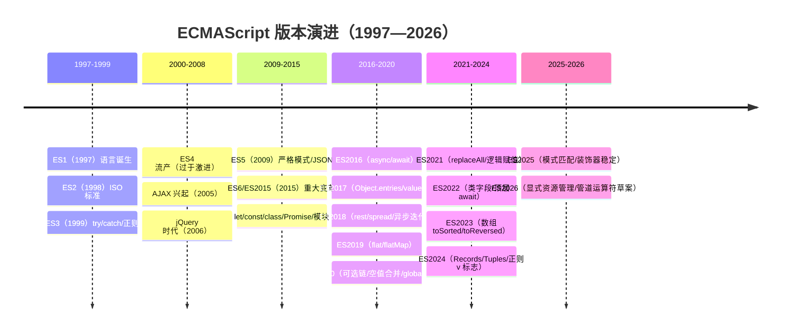
```mermaid
timeline
    title ECMAScript 版本演进（1997—2026）
    1997-1999 : ES1（1997）语言诞生
              : ES2（1998）ISO 标准
              : ES3（1999）try/catch/正则
    2000-2008 : ES4 流产（过于激进）
              : AJAX 兴起（2005）
              : jQuery 时代（2006）
    2009-2015 : ES5（2009）严格模式/JSON
              : ES6/ES2015（2015）重大变革
              : let/const/class/Promise/模块
    2016-2020 : ES2016（async/await）
              : ES2017（Object.entries/values）
              : ES2018（rest/spread/异步迭代）
              : ES2019（flat/flatMap）
              : ES2020（可选链/空值合并/globalThis）
    2021-2024 : ES2021（replaceAll/逻辑赋值）
              : ES2022（类字段/顶层 await）
              : ES2023（数组 toSorted/toReversed）
              : ES2024（Records/Tuples/正则 v 标志）
    2025-2026 : ES2025（模式匹配/装饰器稳定）
              : ES2026（显式资源管理/管道运算符草案）
```

### 关键版本对比

| 版本 | 年份 | 核心新特性 | 对前端的影响 |
|------|------|-----------|-------------|
| **ES3** | 1999 | try/catch、正则、switch | 语言基础定型 |
| **ES5** | 2009 | 严格模式、JSON、bind | jQuery 时代 |
| **ES6/ES2015** | 2015 | **let/const、class、Promise、模块** | **现代 JS 起点** |
| **ES2016** | 2016 | async/await | 异步编程范式革新 |
| **ES2017** | 2017 | Object entries/values | 对象操作增强 |
| **ES2020** | 2020 | 可选链、空值合并、globalThis | 代码简洁性提升 |
| **ES2022** | 2022 | 类字段、顶层 await | OOP + 模块完善 |
| **ES2023** | 2023 | 数组不可变方法 | 函数式编程增强 |
| **ES2024** | 2024 | Records/Tuples、正则 v | 数据结构扩展 |
| **ES2025** | 2025 | 装饰器稳定、模式匹配 | 元编程成熟 |

### 为什么 ES6 是 JavaScript 的分水岭？

```
ES5 时代（2009-2015）："增强的脚本语言"
  ├─ var 函数作用域（变量提升陷阱）
  ├─ function 声明
  ├─ 回调地狱
  ├─ 手动模块化（IIFE/AMD/CMD）
  └─ Object.defineProperty 开始可用

ES6 时代（2015+）："现代化的编程语言"
  ├─ let/const 块级作用域
  ├─ 箭头函数 + class 语法糖
  ├─ Promise + async/await
  ├─ 原生模块（import/export）
  ├─ Proxy/Reflect 元编程
  └─ Symbol/BigInt/Map/Set 新数据结构
```

---

## 📌 知识脑图

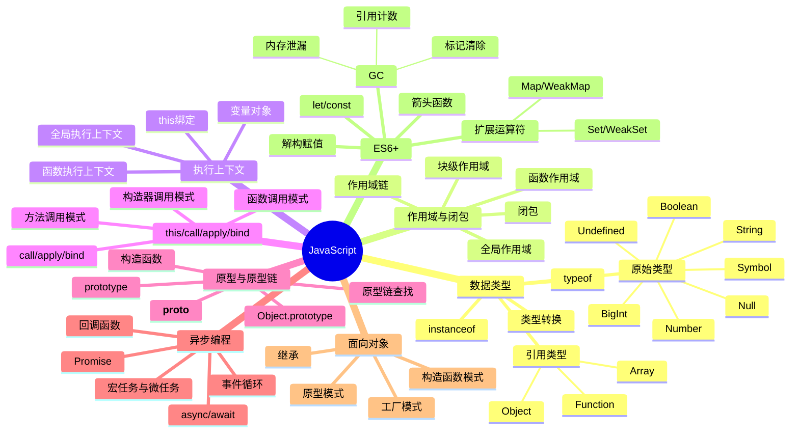
```mermaid
mindmap
  root((JavaScript))
    数据类型
      原始类型
        Undefined
        Null
        Boolean
        Number
        String
        Symbol
        BigInt
      引用类型
        Object
        Array
        Function
      typeof
      instanceof
      类型转换
    作用域与闭包
      全局作用域
      函数作用域
      块级作用域
      作用域链
      闭包
    执行上下文
      全局执行上下文
      函数执行上下文
      this绑定
      变量对象
    this/call/apply/bind
      函数调用模式
      方法调用模式
      构造器调用模式
      call/apply/bind
    原型与原型链
      构造函数
      prototype
      __proto__
      原型链查找
      Object.prototype
    异步编程
      回调函数
      Promise
      async/await
      事件循环
      宏任务与微任务
    面向对象
      工厂模式
      构造函数模式
      原型模式
      继承
    ES6+
      let/const
      箭头函数
      解构赋值
      扩展运算符
       Map/WeakMap
       Set/WeakSet
     GC
       标记清除
       引用计数
       内存泄漏
```

---

> 📌 **关联文件**：浏览器WebAPI/手写实现/代码输出 → [`04-JavaScript-WebAPI`](./04-JavaScript-WebAPI.md) | 框架对比 → [`S2-框架深入/07-框架对比`](../S2-框架深入/07-框架对比)


## 📦 一、数据类型

### 1️⃣ JavaScript 有哪些数据类型，它们的区别？

JavaScript 共有 **八种数据类型**，分为 **原始类型（Primitive）** 和 **引用类型（Reference）**。

**原始类型（7种）：** `Undefined`、`Null`、`Boolean`、`Number`、`String`、`Symbol`、`BigInt`

**引用类型（1种）：** `Object`（包含普通对象、数组、函数、Date、RegExp、Map、Set 等）

其中 `Symbol` 是 ES6 中新增的数据类型，`BigInt` 是 ES2020（ES11）中新增的数据类型：

- **Symbol**：创建后独一无二且不可变的数据类型，主要解决全局变量冲突问题。每个 `Symbol()` 返回值都是唯一的，即使传入相同描述。
- **BigInt**：可表示任意精度格式的整数，使用 `BigInt` 可以安全地存储和操作大整数，超出 `Number.MAX_SAFE_INTEGER`（2^53 - 1）范围也不会丢失精度。

#### 栈（Stack）vs 堆（Heap）存储

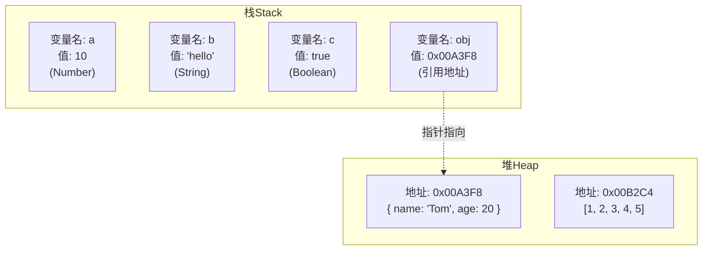
```mermaid
graph TD
    subgraph 栈Stack
        direction TB
        S1["变量名: a<br/>值: 10<br/>(Number)"]
        S2["变量名: b<br/>值: 'hello'<br/>(String)"]
        S3["变量名: c<br/>值: true<br/>(Boolean)"]
        S4["变量名: obj<br/>值: 0x00A3F8<br/>(引用地址)"]
    end

    subgraph 堆Heap
        H1["地址: 0x00A3F8<br/>{ name: 'Tom', age: 20 }"]
        H2["地址: 0x00B2C4<br/>[1, 2, 3, 4, 5]"]
    end

    S4 -.->|指针指向| H1
```

**两种类型的区别在于存储位置的不同：**

| 特性 | 原始类型 | 引用类型 |
|------|---------|---------|
| 存储位置 | 栈（Stack） | 堆（Heap） |
| 空间大小 | 固定、小 | 不固定、大 |
| 访问方式 | 按值访问 | 按引用访问 |
| 复制行为 | 独立副本 | 共享引用 |
| 比较方式 | 值比较 | 引用比较 |

**详细说明：**

- **原始数据类型** 直接存储在栈中的简单数据段，占据空间小、大小固定，属于被频繁使用数据，所以放入栈中存储。
- **引用数据类型** 存储在堆中的对象，占据空间大、大小不固定。如果存储在栈中，将会影响程序运行的性能。引用数据类型在栈中存储了**指针**，该指针指向堆中该实体的起始地址。当解释器寻找引用值时，会首先检索其在栈中的地址，取得地址后从堆中获得实体。

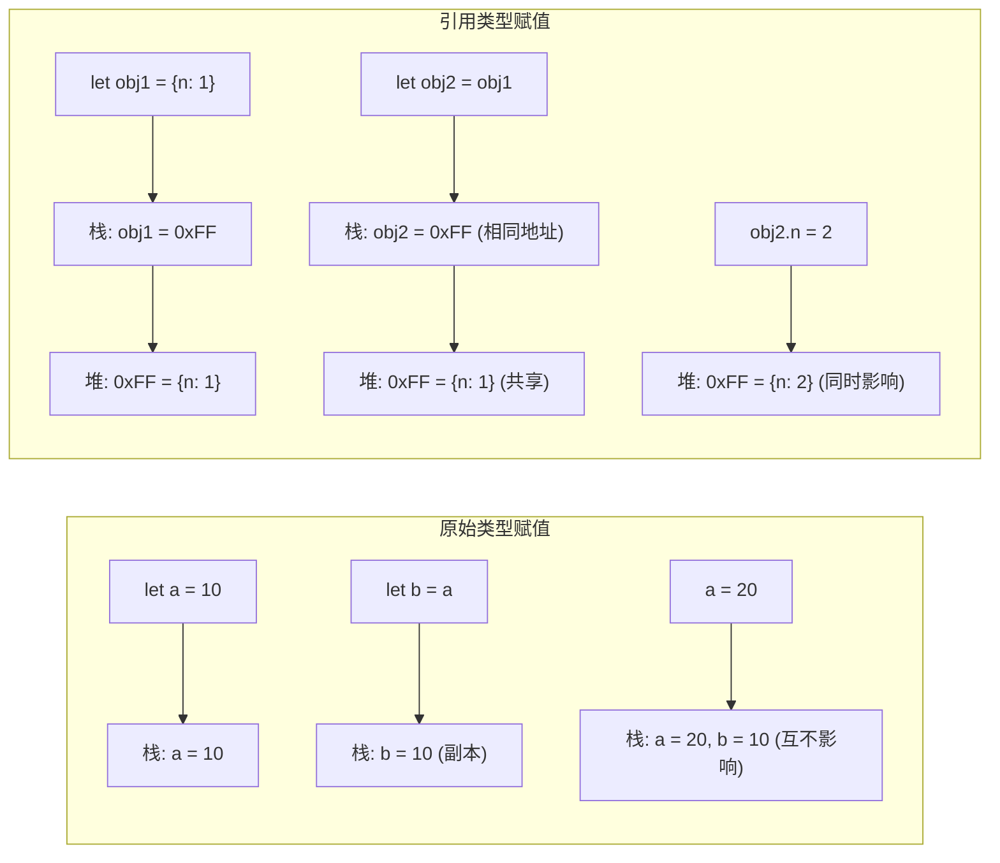
```mermaid
graph LR
    subgraph 原始类型赋值
        A1["let a = 10"] --> A2["栈: a = 10"]
        A3["let b = a"] --> A4["栈: b = 10 (副本)"]
        A5["a = 20"] --> A6["栈: a = 20, b = 10 (互不影响)"]
    end

    subgraph 引用类型赋值
        B1["let obj1 = {n: 1}"] --> B2["栈: obj1 = 0xFF"]
        B2 --> B3["堆: 0xFF = {n: 1}"]
        B4["let obj2 = obj1"] --> B5["栈: obj2 = 0xFF (相同地址)"]
        B5 --> B6["堆: 0xFF = {n: 1} (共享)"]
        B7["obj2.n = 2"] --> B8["堆: 0xFF = {n: 2} (同时影响)"]
    end
```

### 2️⃣ 数据类型检测的方式有哪些

#### 1️⃣ typeof

```javascript
// typeof 操作符检测数据类型
console.log(typeof 2);               // number
console.log(typeof true);            // boolean
console.log(typeof 'str');           // string
console.log(typeof []);              // object
console.log(typeof function(){});    // function
console.log(typeof {});              // object
console.log(typeof undefined);       // undefined
console.log(typeof null);            // object  (历史遗留bug)
console.log(typeof Symbol());        // symbol
console.log(typeof 10n);             // bigint
```

> ⚠️ **注意**：`typeof null` 返回 `"object"` 是 JavaScript 第一版就存在的 bug，因为 `null` 的机器码全 0，与 `object` 的类型标签相同。由于历史兼容性原因，这个 bug 从未被修复。

**typeof 的局限性：**
- `null` 被检测为 `object`（JS 第一版遗留bug，null 的机器码全0，与 object 的类型标签相同）
- 数组、对象都被检测为 `object`，无法区分具体对象类型

#### 2️⃣ instanceof

```javascript
// instanceof 检测构造函数原型是否在原型链上
console.log(2 instanceof Number);                    // false
console.log(true instanceof Boolean);                // false
console.log('str' instanceof String);                // false
console.log([] instanceof Array);                    // true
console.log(function(){} instanceof Function);       // true
console.log({} instanceof Object);                   // true
```

`instanceof` 的原理：判断构造函数的 `prototype` 属性是否出现在对象的原型链中。

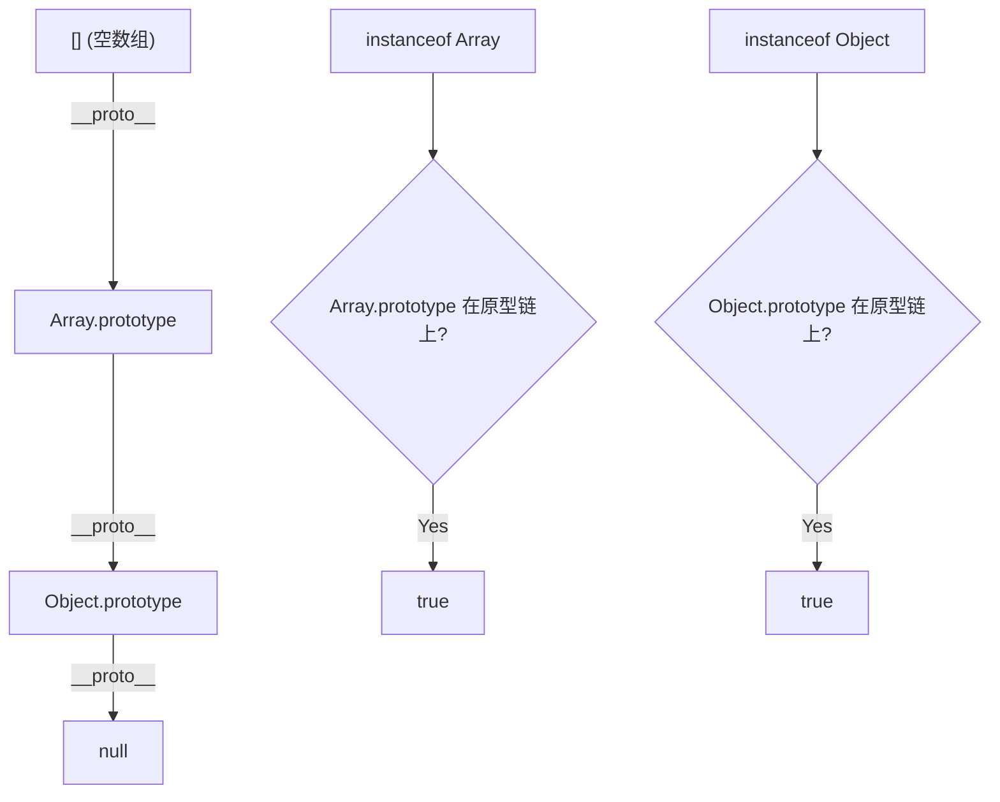
```mermaid
graph TD
    A["[] (空数组)"] -->|__proto__| B["Array.prototype"]
    B -->|__proto__| C["Object.prototype"]
    C -->|__proto__| D["null"]

    E["instanceof Array"] --> F{"Array.prototype 在原型链上?"}
    F -->|Yes| G["true"]

    H["instanceof Object"] --> I{"Object.prototype 在原型链上?"}
    I -->|Yes| J["true"]
```

#### 3️⃣ constructor

```javascript
console.log((2).constructor === Number);          // true
console.log((true).constructor === Boolean);      // true
console.log(('str').constructor === String);      // true
console.log(([]).constructor === Array);          // true
console.log((function() {}).constructor === Function); // true
console.log(({}).constructor === Object);         // true
```

**注意：** `constructor` 可以被改写，不安全。

```javascript
function Fn(){};
Fn.prototype = new Array();
var f = new Fn();
console.log(f.constructor === Fn);    // false
console.log(f.constructor === Array); // true
```

#### 4️⃣ Object.prototype.toString.call() （最准确）

```javascript
var a = Object.prototype.toString;
console.log(a.call(2));              // [object Number]
console.log(a.call(true));           // [object Boolean]
console.log(a.call('str'));          // [object String]
console.log(a.call([]));             // [object Array]
console.log(a.call(function(){}));   // [object Function]
console.log(a.call({}));             // [object Object]
console.log(a.call(undefined));      // [object Undefined]
console.log(a.call(null));           // [object Null]
```

**原理：** 每个对象都有一个内部属性 `[[Class]]`（在ES5中），`Object.prototype.toString` 返回该属性的值。Array、Function 等类型重写了 `toString` 方法，所以必须通过 `Object.prototype.toString.call()` 来调用原始版本。

### 3️⃣ 判断数组的方式有哪些

| 方法 | 代码示例 | 原理 |
|------|---------|------|
| `Object.prototype.toString.call()` | `Object.prototype.toString.call(obj).slice(8,-1) === 'Array'` | 获取内部 [[Class]] |
| 原型链 | `obj.__proto__ === Array.prototype` | 直接比较原型 |
| `Array.isArray()` | `Array.isArray(obj)` | ES6 原生方法，最推荐 |
| `instanceof` | `obj instanceof Array` | 检查原型链 |
| `isPrototypeOf` | `Array.prototype.isPrototypeOf(obj)` | 检查原型关系 |

### 4️⃣ null 和 undefined 区别

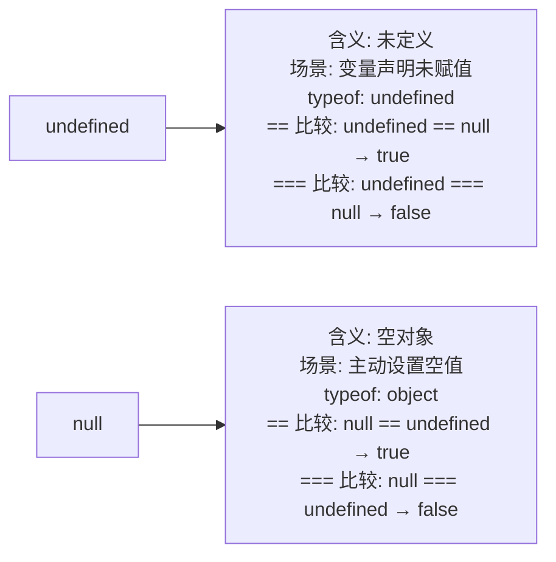
```mermaid
graph LR
    A["undefined"] --> B["含义: 未定义<br/>场景: 变量声明未赋值<br/>typeof: undefined<br/>== 比较: undefined == null → true<br/>=== 比较: undefined === null → false"]
    C["null"] --> D["含义: 空对象<br/>场景: 主动设置空值<br/>typeof: object<br/>== 比较: null == undefined → true<br/>=== 比较: null === undefined → false"]
```

| 对比项 | undefined | null |
|--------|-----------|------|
| 含义 | 未定义 | 空对象 |
| 类型 | undefined | object（typeof） |
| 转数字 | NaN | 0 |
| JSON序列化 | 被忽略 | 保留为 null |
| 常见场景 | 变量声明未赋值、函数无返回值 | 主动释放引用、原型链终点 |

`undefined` 在 JavaScript 中**不是保留字**，这意味着可以使用 `undefined` 作为变量名（极不推荐）。可以用 `void 0` 获取安全的 `undefined`。

### 5️⃣ typeof null 的结果为什么是 Object？

在 JavaScript 第一个版本中，所有值都存储在 32 位的单元中，每个单元包含一个小的**类型标签（1-3 bits）**：

```
000: object
  1: int
010: double
100: string
110: boolean
```

`null` 的值是机器码 NULL 指针（全0），类型标签也是 `000`，和 `object` 类型标签一样，所以被判定为 `object`。这是 JS 设计之初的遗留 bug，但为了兼容性一直保留至今。

### 6️⃣ instanceof 操作符的实现原理

```javascript
// myInstanceof 手动实现 instanceof 原理
function myInstanceof(left, right) {
  let proto = Object.getPrototypeOf(left)
  let prototype = right.prototype;

  while (true) {
    if (!proto) return false;
    if (proto === prototype) return true;
    proto = Object.getPrototypeOf(proto);
  }
}
```

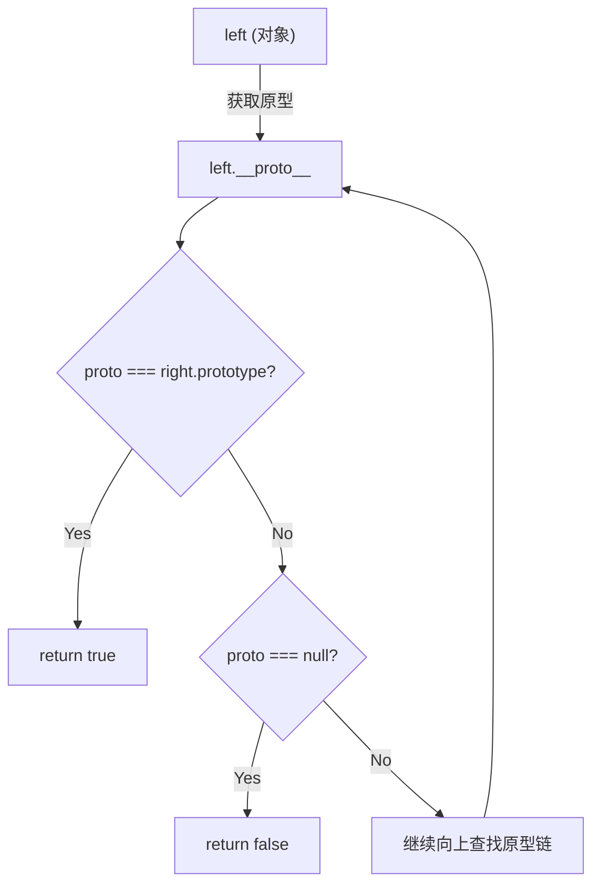
```mermaid
graph TD
    A["left (对象)"] -->|获取原型| B["left.__proto__"]
    B --> C{"proto === right.prototype?"}
    C -->|Yes| D["return true"]
    C -->|No| E{"proto === null?"}
    E -->|Yes| F["return false"]
    E -->|No| G["继续向上查找原型链"]
    G --> B
```

### 7️⃣ 为什么 0.1 + 0.2 !== 0.3？

> ⚠️ **经典面试题**：浮点数精度问题源于 IEEE 754 双精度标准。0.1 和 0.2 的二进制是无限循环小数，截断后相加产生误差。解决方案：`toFixed`、`Number.EPSILON` 或放大倍数计算。**注意：这不是 JS 特有的问题**，所有使用 IEEE 754 的语言都会遇到。

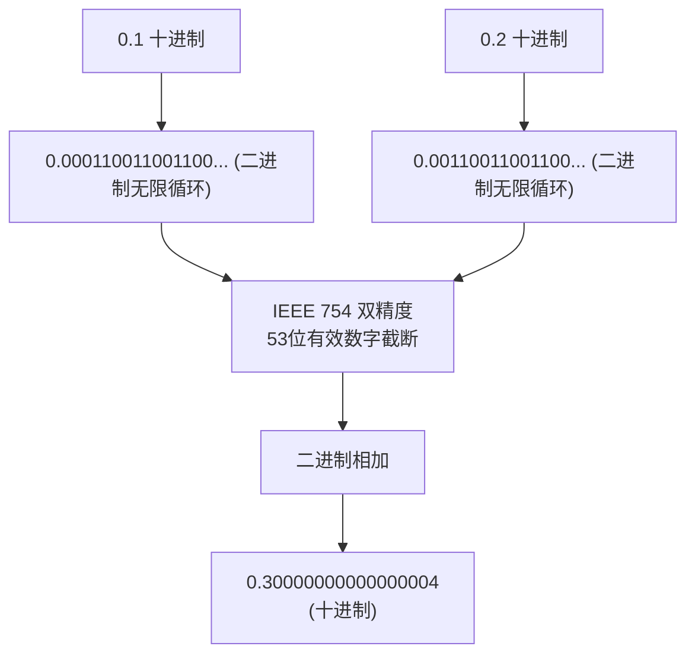
```mermaid
graph TD
    A["0.1 十进制"] --> B["0.000110011001100... (二进制无限循环)"]
    C["0.2 十进制"] --> D["0.00110011001100... (二进制无限循环)"]
    B --> E["IEEE 754 双精度<br/>53位有效数字截断"]
    D --> E
    E --> F["二进制相加"]
    F --> G["0.30000000000000004<br/>(十进制)"]
```

**原因：** JavaScript 的 Number 遵循 IEEE 754 标准，使用 64 位双精度浮点数表示。

- 符号位（sign）：1 bit
- 指数位（exponent）：11 bit
- 小数位（fraction）：52 bit

0.1 和 0.2 的二进制都是无限循环小数，IEEE 754 只能保留 53 位有效数字（52 位 + 隐含的 1 位），超出部分"0 舍 1 入"，导致精度丢失。

**解决方案：**

```javascript
// 方法1: toFixed
(0.1 + 0.2).toFixed(2)  // "0.30"

// 方法2: ES6 Number.EPSILON
function numberepsilon(arg1, arg2) {
  return Math.abs(arg1 - arg2) < Number.EPSILON;
}
console.log(numberepsilon(0.1 + 0.2, 0.3)); // true

// 方法3: 放大倍数后计算
(0.1 * 10 + 0.2 * 10) / 10  // 0.3
```

### 8️⃣ 如何获取安全的 undefined 值？

```javascript
void 0        // undefined
void (1 + 1)  // undefined
void 'hello'  // undefined
```

`void` 运算符对给定的表达式求值，然后返回 `undefined`。因为 `undefined` 可以被重写（非严格模式下），使用 `void 0` 最安全。

### 9️⃣ typeof NaN 的结果是什么？

```javascript
typeof NaN  // "number"
```

`NaN`（Not a Number）是一个"警戒值"，表示数学运算失败的结果。它是唯一一个**与自身不相等**的值：

```javascript
NaN === NaN  // false
NaN !== NaN  // true
```

### 1️⃣0️⃣ isNaN 和 Number.isNaN 的区别

| 方法 | 行为 | 特点 |
|------|------|------|
| `isNaN()` | 先尝试转换为数字，再判断 | 非数字值也会返回 true，不准确 |
| `Number.isNaN()` | 先判断是否为数字类型，再判断 | 更准确，不进行类型转换 |

```javascript
isNaN('hello')          // true (先转换 Number('hello') → NaN，然后判断)
Number.isNaN('hello')   // false (先判断类型，'hello' 不是 number，直接 false)
Number.isNaN(NaN)       // true
```

### 1️⃣1️⃣ 其他值到字符串的转换规则

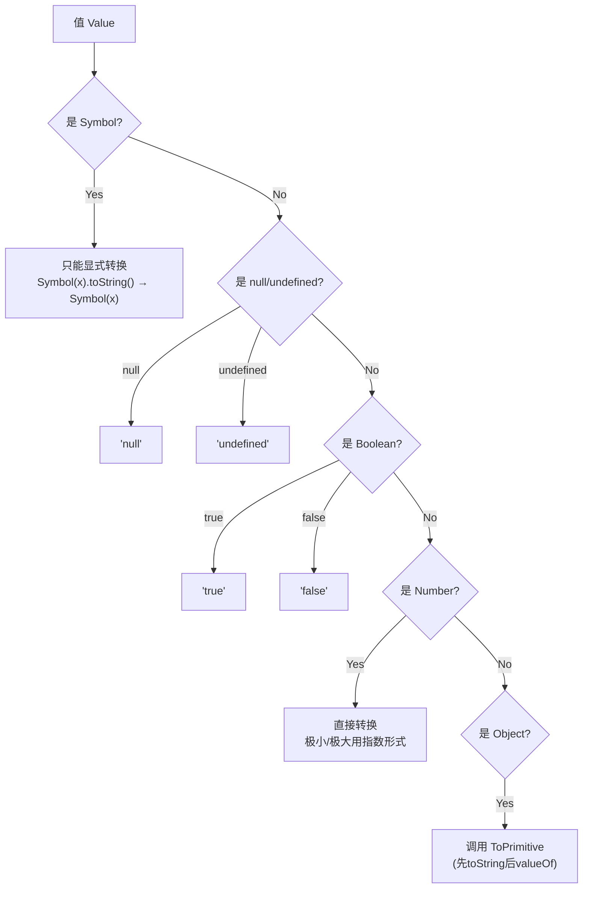
```mermaid
graph TD
    A["值 Value"] --> B{"是 Symbol?"}
    B -->|Yes| C["只能显式转换<br/>Symbol(x).toString() → Symbol(x)"]
    B -->|No| D{"是 null/undefined?"}
    D -->|null| E["'null'"]
    D -->|undefined| F["'undefined'"]
    D -->|No| G{"是 Boolean?"}
    G -->|true| H["'true'"]
    G -->|false| I["'false'"]
    G -->|No| J{"是 Number?"}
    J -->|Yes| K["直接转换<br/>极小/极大用指数形式"]
    J -->|No| L{"是 Object?"}
    L -->|Yes| M["调用 ToPrimitive<br/>(先toString后valueOf)"]
```

### 1️⃣2️⃣ 其他值到数字值的转换规则

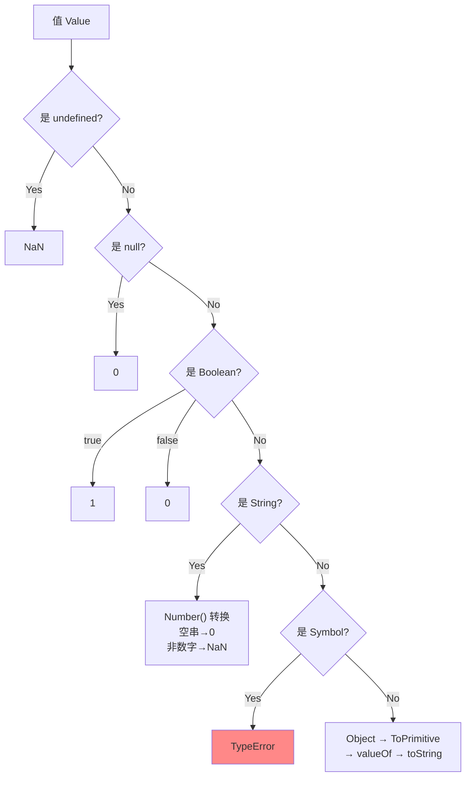
```mermaid
graph TD
    A["值 Value"] --> B{"是 undefined?"}
    B -->|Yes| C["NaN"]
    B -->|No| D{"是 null?"}
    D -->|Yes| E["0"]
    D -->|No| F{"是 Boolean?"}
    F -->|true| G["1"]
    F -->|false| H["0"]
    F -->|No| I{"是 String?"}
    I -->|Yes| J["Number() 转换<br/>空串→0<br/>非数字→NaN"]
    I -->|No| K{"是 Symbol?"}
    K -->|Yes| L["TypeError"]
    K -->|No| M["Object → ToPrimitive<br/>→ valueOf → toString"]

    style L fill:#f88
```

**ToPrimitive 抽象操作流程：**

当 `type = number` 时：
1. 调用 `valueOf()`，如果返回原始值，则返回
2. 否则调用 `toString()`，如果返回原始值，则返回
3. 否则抛出 `TypeError`

当 `type = string` 时（仅 Date 对象默认）：
1. 调用 `toString()`，如果返回原始值，则返回
2. 否则调用 `valueOf()`，如果返回原始值，则返回
3. 否则抛出 `TypeError`

### 1️⃣3️⃣ 其他值到布尔类型的转换规则

**假值（Falsy）列表：**

| 值 | 转布尔结果 |
|----|-----------|
| `undefined` | `false` |
| `null` | `false` |
| `false` | `false` |
| `+0`、`-0`、`NaN` | `false` |
| `""`（空字符串） | `false` |

所有其他值都是**真值（Truthy）**，包括 `"false"` 字符串、`[]`、`{}`、`Infinity` 等。

### 1️⃣4️⃣ || 和 && 操作符的返回值

这两个操作符返回的是**操作数的值**，而非布尔值。

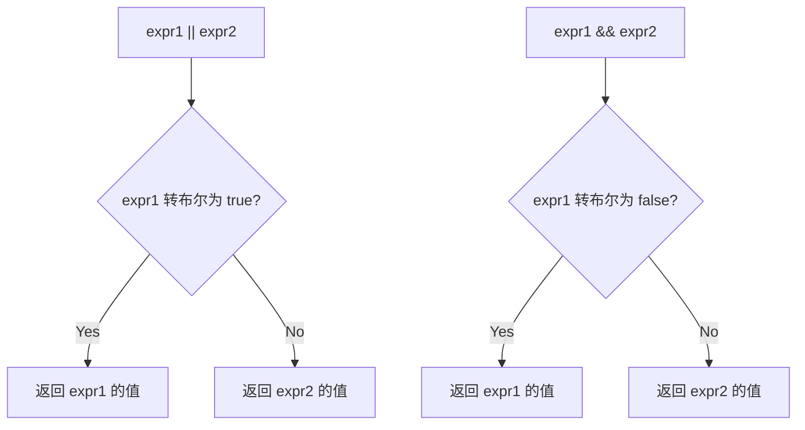
```mermaid
graph TD
    A["expr1 || expr2"] --> B{"expr1 转布尔为 true?"}
    B -->|Yes| C["返回 expr1 的值"]
    B -->|No| D["返回 expr2 的值"]

    E["expr1 && expr2"] --> F{"expr1 转布尔为 false?"}
    F -->|Yes| G["返回 expr1 的值"]
    F -->|No| H["返回 expr2 的值"]
```

```javascript
0 || 'default'       // 'default'
'' || 'hello'        // 'hello'
'abc' && 123         // 123
null && 'anything'   // null
```

### 1️⃣5️⃣ Object.is() 与 == 和 === 的区别

| 比较方式 | 类型转换 | 特殊处理 |
|---------|---------|---------|
| `==` | **会**进行类型转换 | `null == undefined` → true |
| `===` | **不**进行类型转换 | 严格相等 |
| `Object.is()` | **不**进行类型转换 | 修复了 `===` 的两种特殊情况 |

```javascript
// 区别1: NaN 处理
NaN === NaN           // false
Object.is(NaN, NaN)   // true

// 区别2: +0 和 -0
+0 === -0             // true
Object.is(+0, -0)     // false
```

### 1️⃣6️⃣ 什么是 JavaScript 中的包装类型？

原始类型本身没有属性和方法，但 JavaScript 在访问原始类型的属性或方法时，会在后台隐式地将其转换为对应的**包装对象**。

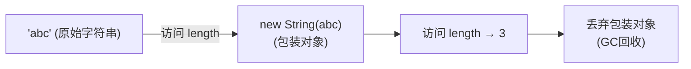
```mermaid
graph LR
    A["'abc' (原始字符串)"] -->|访问 length| B["new String(abc)<br/>(包装对象)"]
    B --> C["访问 length → 3"]
    C --> D["丢弃包装对象<br/>(GC回收)"]
```

```javascript
const a = "abc";
a.length;         // 3 → 内部临时创建 String 包装对象
a.toUpperCase();  // "ABC"

// 显式创建包装对象
Object('abc')     // String {"abc"}
new Number(123)   // Number {123}

// 包装对象转回原始值
var b = Object('abc');
b.valueOf()       // 'abc'
```

**陷阱示例：**
```javascript
var a = new Boolean(false);
if (!a) {
  console.log("不会执行");  // a 是对象，对象永远是 truthy
}
```

### 1️⃣7️⃣ JavaScript 中如何进行隐式类型转换？

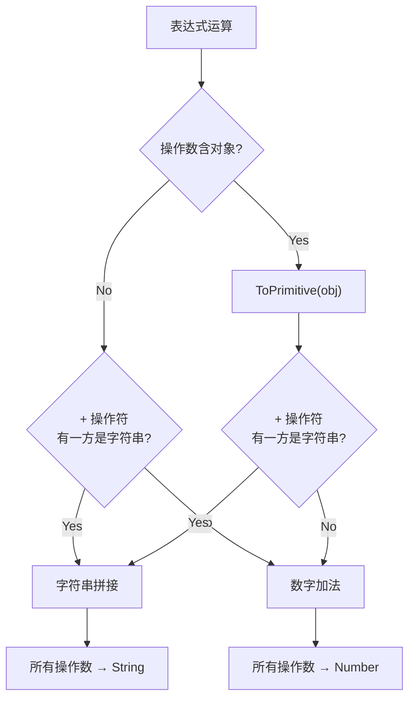
```mermaid
graph TD
    A["表达式运算"] --> B{"操作数含对象?"}
    B -->|Yes| C["ToPrimitive(obj)"]
    B -->|No| D{"+ 操作符<br/>有一方是字符串?"}
    C --> E{"+ 操作符<br/>有一方是字符串?"}
    D -->|Yes| F["字符串拼接"]
    D -->|No| G["数字加法"]
    E -->|Yes| F
    E -->|No| G
    F --> H["所有操作数 → String"]
    G --> I["所有操作数 → Number"]
```

**+ 操作符规则：**
- 有一方是字符串 → 字符串拼接
- 否则 → 数字加法

```javascript
1 + '23'        // '123'
1 + false       // 1
'1' + false     // '1false'
false + true    // 1
```

**-、*、/ 操作符规则：**
- 所有操作数转数字

```javascript
1 * '23'        // 23
1 * false       // 0
1 / 'aa'        // NaN
```

**== 操作符规则：**
- 两边的值尽量转为 `number` 比较

```javascript
3 == true       // false (3 → 3, true → 1)
'0' == false    // true  ('0' → 0, false → 0)
'0' == 0        // true  ('0' → 0)
```

### 1️⃣8️⃣ + 操作符何时用于字符串拼接？

根据 ES5 规范，如果某个操作数是字符串或能通过 `ToPrimitive` 转换为字符串，则进行拼接。如果其中一个操作数是对象（包括数组），首先对其调用 `ToPrimitive(obj, number)`：

```javascript
var a = {name: 'Jack'}
var b = {age: 18}
a + b  // "[object Object][object Object]"

// 运算过程:
// a.valueOf() → {} (还是对象)
// a.toString() → "[object Object]"
// b.valueOf() → {}
// b.toString() → "[object Object]"
// 结果: "[object Object][object Object]"
```

### 1️⃣9️⃣ 为什么会有 BigInt 的提案？

`Number.MAX_SAFE_INTEGER = 9007199254740991`（2^53 - 1）

超过这个范围，JavaScript 的数字计算会出现精度丢失：

```javascript
9007199254740991 + 1  // 9007199254740992 (正确)
9007199254740991 + 2  // 9007199254740992 (错误，应该是 9007199254740993)
```

**BigInt 解决方案：**
```javascript
BigInt(9007199254740991) + 2n  // 9007199254740993n
```

### 2️⃣0️⃣ Object.assign 和扩展运算符：深拷贝还是浅拷贝？

**两者都是浅拷贝！**

```javascript
let outObj = {
  inObj: {a: 1, b: 2}
}

// 扩展运算符
let newObj1 = {...outObj}
newObj1.inObj.a = 2
console.log(outObj.inObj.a)  // 2 (被修改了！)

// Object.assign
let newObj2 = Object.assign({}, outObj)
newObj2.inObj.a = 2
console.log(outObj.inObj.a)  // 2 (也被修改了！)
```

**区别：**
- `Object.assign()`：第一个参数为目标对象，会触发 ES6 setter
- 扩展运算符 `...`：不复制继承的属性和类的属性，但复制 ES6 symbols 属性

### 2️⃣1️⃣ 如何判断一个对象是空对象？

```javascript
// 方法1: JSON 序列化
JSON.stringify(obj) === '{}'

// 方法2: Object.keys (推荐)
Object.keys(obj).length === 0

// 方法3: 遍历 for...in + hasOwnProperty
function isEmpty(obj) {
  for (let key in obj) {
    if (Object.prototype.hasOwnProperty.call(obj, key)) return false
  }
  return true
}

// 方法4: Object.getOwnPropertyNames
Object.getOwnPropertyNames(obj).length === 0
```

---

## 🔧 二、ES6

### 1️⃣ let、const、var 的区别

> 💡 **要点**：`var` 有变量提升，可重复声明，无块级作用域；`let`/`const` 有块级作用域和暂时性死区（TDZ），不可重复声明。`const` 声明时必须初始化，且不能改变指针指向（但可修改对象属性）。

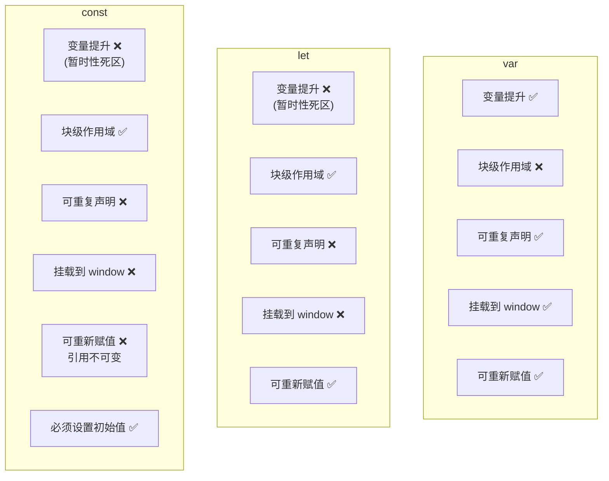
```mermaid
graph TD
    subgraph var
        V1["变量提升 ✅"]
        V2["块级作用域 ❌"]
        V3["可重复声明 ✅"]
        V4["挂载到 window ✅"]
        V5["可重新赋值 ✅"]
    end

    subgraph let
        L1["变量提升 ❌<br/>(暂时性死区)"]
        L2["块级作用域 ✅"]
        L3["可重复声明 ❌"]
        L4["挂载到 window ❌"]
        L5["可重新赋值 ✅"]
    end

    subgraph const
        C1["变量提升 ❌<br/>(暂时性死区)"]
        C2["块级作用域 ✅"]
        C3["可重复声明 ❌"]
        C4["挂载到 window ❌"]
        C5["可重新赋值 ❌<br/>引用不可变"]
        C6["必须设置初始值 ✅"]
    end
```

| 区别 | var | let | const |
|------|-----|-----|-------|
| 块级作用域 | ❌ | ✅ | ✅ |
| 变量提升 | ✅ | ❌（暂时性死区） | ❌（暂时性死区） |
| 挂载到全局对象 | ✅（window.varName） | ❌ | ❌ |
| 重复声明 | ✅（可覆盖） | ❌（报错） | ❌（报错） |
| 暂时性死区 | ❌ | ✅ | ✅ |
| 必须设置初始值 | ❌ | ❌ | ✅ |
| 改变指针指向 | ✅ | ✅ | ❌ |

**暂时性死区（Temporal Dead Zone, TDZ）：**
```javascript
console.log(a)  // undefined (var 提升)
var a = 1

console.log(b)  // ReferenceError! (TDZ)
let b = 2
```

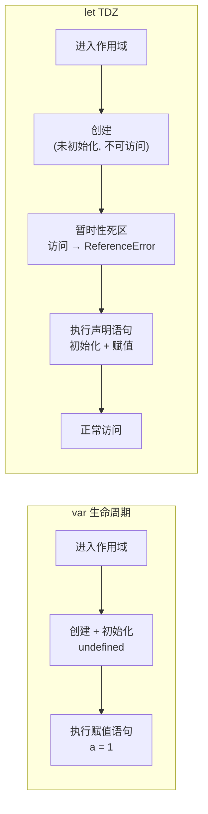
```mermaid
graph LR
    subgraph var 生命周期
        V1["进入作用域"] --> V2["创建 + 初始化<br/>undefined"]
        V2 --> V3["执行赋值语句<br/>a = 1"]
    end

    subgraph let TDZ
        L1["进入作用域"] --> L2["创建<br/>(未初始化, 不可访问)"]
        L2 --> L3["暂时性死区<br/>访问 → ReferenceError"]
        L3 --> L4["执行声明语句<br/>初始化 + 赋值"]
        L4 --> L5["正常访问"]
    end
```

### 2️⃣ const 对象的属性可以修改吗？

**可以修改属性，但不能重新赋值。**

```javascript
const obj = { name: 'Tom' }
obj.name = 'Jerry'  // ✅ 属性修改允许
obj = {}            // ❌ TypeError: Assignment to constant variable

const arr = [1, 2, 3]
arr.push(4)         // ✅ 数组操作允许
arr = []            // ❌ TypeError
```

**原理：** `const` 保证的是变量指向的内存地址不能改变。对于原始类型，值就在栈内存中，所以值本身不可变。对于引用类型，栈中保存的是指针（堆地址），`const` 保证指针不变，但堆中的数据仍然可变。

### 3️⃣ 如果 new 一个箭头函数会怎么样？

**会报错：** `arrowFn is not a constructor`

箭头函数不能作为构造函数，因为：
1. 箭头函数没有 `prototype` 属性
2. 箭头函数没有自己的 `this`，不能绑定到新对象
3. 箭头函数不能使用 `arguments`

### 4️⃣ 箭头函数与普通函数的区别

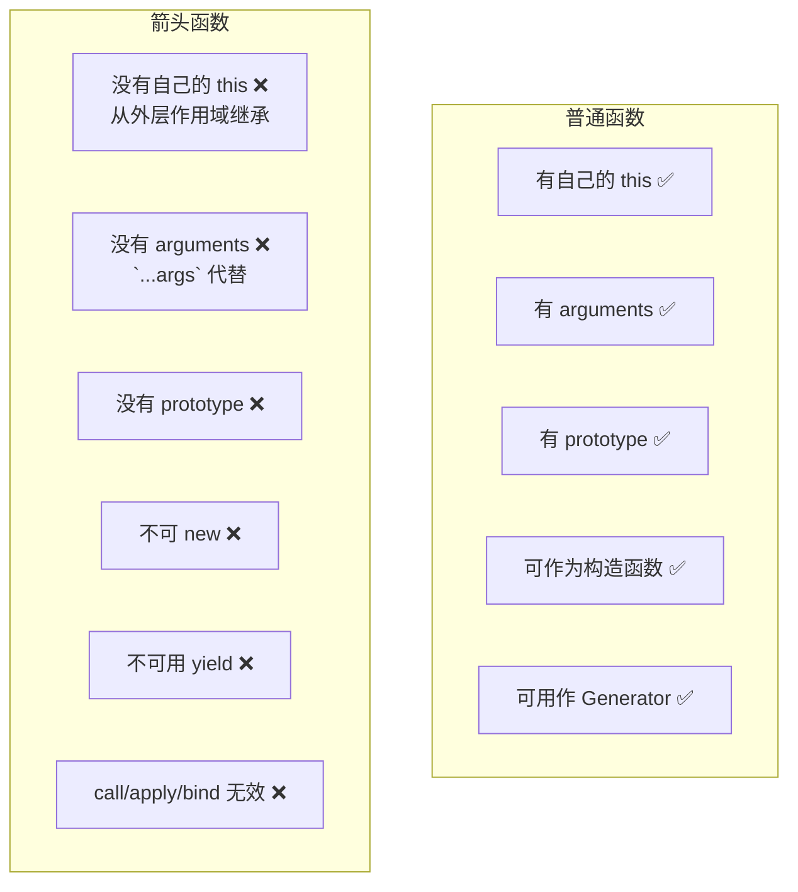
```mermaid
graph TD
    subgraph 普通函数
        A1["有自己的 this ✅"]
        A2["有 arguments ✅"]
        A3["有 prototype ✅"]
        A4["可作为构造函数 ✅"]
        A5["可用作 Generator ✅"]
    end

    subgraph 箭头函数
        B1["没有自己的 this ❌<br/>从外层作用域继承"]
        B2["没有 arguments ❌<br/>`...args` 代替"]
        B3["没有 prototype ❌"]
        B4["不可 new ❌"]
        B5["不可用 yield ❌"]
        B6["call/apply/bind 无效 ❌"]
    end
```

**（1）简洁语法：**
```javascript
// 无参数
const fn1 = () => {}
// 单参数，省略括号
const fn2 = x => x * 2
// 多参数
const fn3 = (a, b) => a + b
// 返回值是对象需要括号
const fn4 = () => ({ name: 'Tom' })
// 无返回值
const fn5 = () => void console.log('test')
```

**（2）没有自己的 this：**
```javascript
const obj = {
  id: 'OBJ',
  normal: function() { console.log(this.id) },  // this → obj
  arrow: () => { console.log(this.id) }          // this → 外层 (window/global)
}
obj.normal()  // 'OBJ'
obj.arrow()   // undefined (严格模式) 或 全局 id
```

**（3）this 不可改变：**
```javascript
const arrowFn = () => console.log(this)
arrowFn.call({id: 1})   // 还是指向外层 this
arrowFn.apply({id: 1})  // 还是指向外层 this
arrowFn.bind({id: 1})() // 还是指向外层 this
```

**（4）没有 arguments：**
```javascript
const normalFn = function() { console.log(arguments) }
normalFn(1, 2, 3)  // Arguments(3) [1, 2, 3]

const arrowFn = (...args) => console.log(args)  // 用 rest 参数替代
arrowFn(1, 2, 3)  // [1, 2, 3]
```

### 5️⃣ 箭头函数的 this 指向哪里？

箭头函数捕获其所在上下文的 `this` 值作为自己的 `this`，且不可改变。

**Babel 转译理解：**
```javascript
// ES6
const obj = {
  getArrow() {
    return () => console.log(this === obj)
  }
}

// ES5 (Babel 转译后)
var obj = {
  getArrow: function getArrow() {
    var _this = this  // → 捕获外层 this
    return function() {
      console.log(_this === obj)
    }
  }
}
```

### 6️⃣ 扩展运算符的作用及使用场景

#### 对象扩展运算符

```javascript
// 复制对象（浅拷贝）
let bar = { a: 1, b: 2 }
let baz = { ...bar }  // { a: 1, b: 2 }

// 等价于 Object.assign
let baz2 = Object.assign({}, bar)

// 覆盖属性
let merged = { ...bar, ...{a: 2, b: 4} }  // { a: 2, b: 4 }

// 修改对象的部分属性（Redux reducer 常用）
const newState = { ...state, user: { ...state.user, name: 'newName' } }
```

#### 数组扩展运算符

```javascript
// 参数序列
function add(x, y) { return x + y }
const numbers = [1, 2]
add(...numbers)  // 3

// 复制数组（浅拷贝）
const arr1 = [1, 2]
const arr2 = [...arr1]

// 合并数组
const merged = ['one', ...arr1, 'four']  // ['one', 1, 2, 'four']

// 解构赋值
const [first, ...rest] = [1, 2, 3, 4]  // first=1, rest=[2,3,4]

// 字符串转数组
[...'hello']  // ['h', 'e', 'l', 'l', 'o']

// 类数组转数组
function foo() {
  const args = [...arguments]
}
```

### 7️⃣ 对对象与数组的解构的理解

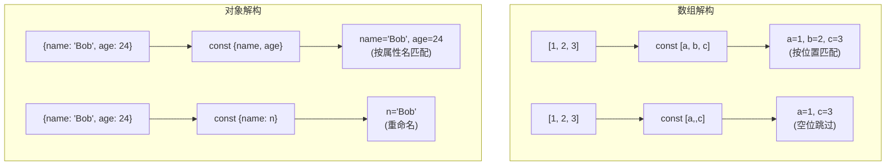
```mermaid
graph TD
    subgraph 数组解构
        A1["[1, 2, 3]"] --> A2["const [a, b, c]"]
        A2 --> A3["a=1, b=2, c=3<br/>(按位置匹配)"]
        A4["[1, 2, 3]"] --> A5["const [a,,c]"]
        A5 --> A6["a=1, c=3<br/>(空位跳过)"]
    end

    subgraph 对象解构
        B1["{name: 'Bob', age: 24}"] --> B2["const {name, age}"]
        B2 --> B3["name='Bob', age=24<br/>(按属性名匹配)"]
        B4["{name: 'Bob', age: 24}"] --> B5["const {name: n}"]
        B5 --> B6["n='Bob'<br/>(重命名)"]
    end
```

### 8️⃣ 提取高度嵌套的对象里的指定属性

```javascript
const school = {
  classes: {
    stu: {
      name: 'Bob',
      age: 24
    }
  }
}

// 方法1: 逐层解构
const { classes } = school
const { stu } = classes
const { name } = stu

// 方法2: 一行解构（推荐）
const { classes: { stu: { name } } } = school
console.log(name)  // 'Bob'

// 解构 + 重命名
const { classes: { stu: { name: studentName } } } = school
console.log(studentName)  // 'Bob'
```

### 9️⃣ 对 rest 参数的理解

Rest 参数将多个独立参数收集到一个数组中：

```javascript
// 收集剩余参数
function sum(...numbers) {
  return numbers.reduce((acc, cur) => acc + cur, 0)
}
sum(1, 2, 3, 4)  // 10

// 与解构结合
const [first, second, ...rest] = [1, 2, 3, 4, 5]
// first=1, second=2, rest=[3,4,5]

// 注意: rest 参数必须在最后
// const [...rest, last] = [1,2,3]  ❌ 语法错误
```

### 1️⃣0️⃣ ES6 中模板语法与字符串处理

**模板字符串特性：**
1. `${}` 嵌入变量/表达式
2. 保留空格、缩进、换行
3. 支持运算表达式

```javascript
const name = 'css'
const career = 'coder'
const html = `
  <div>
    <h1>${name}</h1>
    <p>${career}</p>
    <p>${1 + 2}</p>
  </div>
`
```

**新增字符串方法：**

| 方法 | 作用 | 示例 |
|------|------|------|
| `includes()` | 是否包含子串 | `'hello'.includes('ell')` → true |
| `startsWith()` | 是否以某串开头 | `'hello'.startsWith('he')` → true |
| `endsWith()` | 是否以某串结尾 | `'hello'.endsWith('lo')` → true |
| `repeat()` | 重复字符串 | `'ab'.repeat(3)` → `'ababab'` |

---

## 🧱 三、JavaScript 基础

### 1️⃣ new 操作符的实现原理

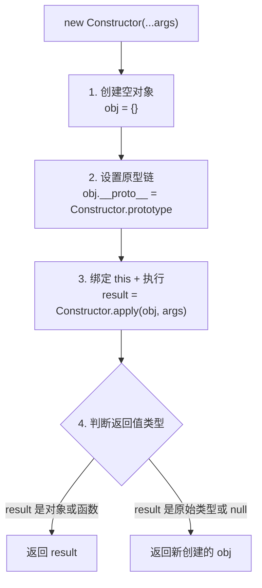
```mermaid
graph TD
    A["new Constructor(...args)"] --> B["1. 创建空对象<br/>obj = {}"]
    B --> C["2. 设置原型链<br/>obj.__proto__ = Constructor.prototype"]
    C --> D["3. 绑定 this + 执行<br/>result = Constructor.apply(obj, args)"]
    D --> E{"4. 判断返回值类型"}
    E -->|"result 是对象或函数"| F["返回 result"]
    E -->|"result 是原始类型或 null"| G["返回新创建的 obj"]
```

**手动实现：**

```javascript
function objectFactory() {
  let newObject = null
  let constructor = Array.prototype.shift.call(arguments)
  let result = null

  if (typeof constructor !== "function") {
    console.error("type error")
    return
  }

  // 1+2: 创建空对象并链接原型
  newObject = Object.create(constructor.prototype)

  // 3: 绑定 this 并执行
  result = constructor.apply(newObject, arguments)

  // 4: 判断返回类型
  let flag = result && (typeof result === "object" || typeof result === "function")
  return flag ? result : newObject
}
```

### 2️⃣ Map 和 Object 的区别

| 特性 | Map | Object |
|------|-----|--------|
| 键的类型 | 任意类型（包括对象、函数） | String 或 Symbol |
| 键的顺序 | 按插入顺序有序 | 无序（ES6 后部分有序） |
| size | `map.size` 直接获取 | 需手动计算 `Object.keys().length` |
| 迭代 | 原生可迭代（`for...of`） | 需先获取 keys |
| 性能 | 频繁增删改查更优 | 未针对此场景优化 |
| 原型继承 | 无默认键 | 有原型链，可能产生冲突 |

### 3️⃣ Map 和 WeakMap 的区别

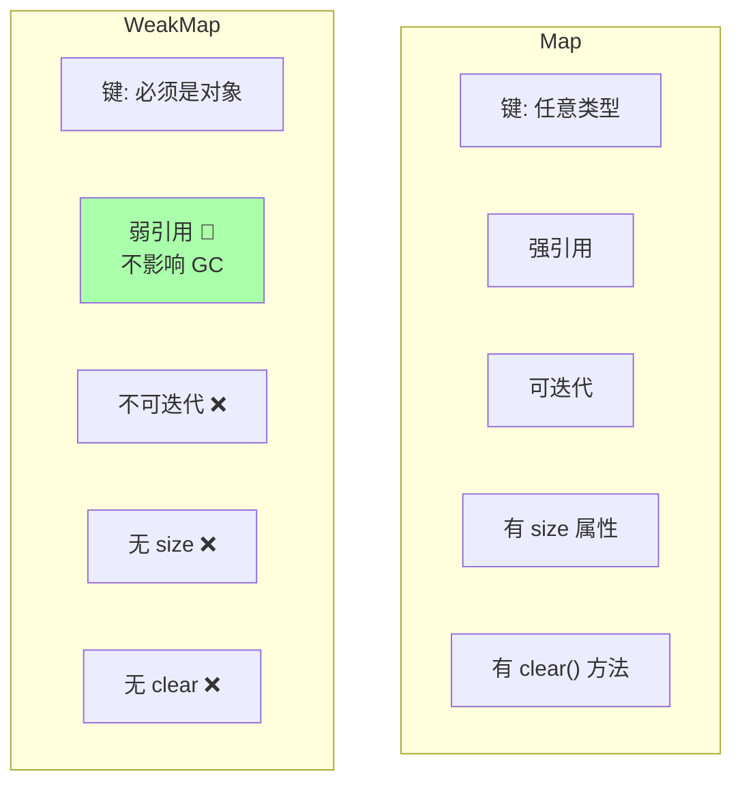
```mermaid
graph TD
    subgraph Map
        M1["键: 任意类型"]
        M2["强引用"]
        M3["可迭代"]
        M4["有 size 属性"]
        M5["有 clear() 方法"]
    end

    subgraph WeakMap
        W1["键: 必须是对象"]
        W2["弱引用 🔑<br/>不影响 GC"]
        W3["不可迭代 ❌"]
        W4["无 size ❌"]
        W5["无 clear ❌"]
    end

    style W2 fill:#afa
```

**WeakMap 弱引用机制：**
```javascript
let obj = { name: 'Tom' }
const wm = new WeakMap()
wm.set(obj, 'some data')

obj = null  // 引用被删除
// WeakMap 中的键名对象会被 GC 自动回收，无需手动删除
```

**应用场景：**
- 存储 DOM 元素的私有数据
- 缓存数据（对象不再被使用时自动释放）
- 防止内存泄漏

### 4️⃣ JavaScript 有哪些内置对象

**分类总结：**

| 分类 | 示例 |
|------|------|
| 值属性 | `Infinity`、`NaN`、`undefined`、`null` |
| 函数属性 | `eval()`、`parseInt()`、`parseFloat()`、`isNaN()` |
| 基本对象 | `Object`、`Function`、`Boolean`、`Symbol`、`Error` |
| 数字日期 | `Number`、`Math`、`Date` |
| 字符串 | `String`、`RegExp` |
| 可索引集合 | `Array`、`Int8Array`、`Uint8Array` 等 |
| 键值集合 | `Map`、`Set`、`WeakMap`、`WeakSet` |
| 结构化数据 | `JSON`、`ArrayBuffer`、`DataView` |
| 控制抽象 | `Promise`、`Generator`、`Iterator` |
| 反射 | `Reflect`、`Proxy` |
| 国际化 | `Intl`、`Intl.Collator` |

### 5️⃣ 常用的正则表达式

```javascript
// 16进制颜色
/#([0-9a-fA-F]{6}|[0-9a-fA-F]{3})/g

// 日期 yyyy-mm-dd
/^[0-9]{4}-(0[1-9]|1[0-2])-(0[1-9]|[12][0-9]|3[01])$/

// QQ号
/^[1-9][0-9]{4,10}$/g

// 手机号
/^1[34578]\d{9}$/g

// 用户名（字母开头，4-16位字母数字下划线）
/^[a-zA-Z\$][a-zA-Z0-9_\$]{4,16}$/
```

### 6️⃣ 对 JSON 的理解

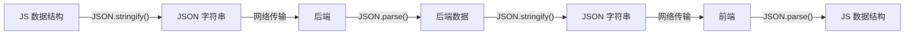
```mermaid
graph LR
    A["JS 数据结构"] -->|"JSON.stringify()"| B["JSON 字符串"]
    B -->|"网络传输"| C["后端"]
    C -->|"JSON.parse()"| D["后端数据"]
    D -->|"JSON.stringify()"| E["JSON 字符串"]
    E -->|"网络传输"| F["前端"]
    F -->|"JSON.parse()"| G["JS 数据结构"]
```

**JSON 与 JS 对象的区别：**
- JSON 属性值不能为函数
- JSON 属性名必须用双引号
- JSON 中不能出现 `undefined`、`NaN`
- JSON 中不能有注释

**JSON.stringify 的特殊处理：**
```javascript
JSON.stringify({a: undefined, b: function(){}, c: Symbol()})
// '{}'  // 忽略 undefined、函数、Symbol

JSON.stringify({a: /abc/})
// '{"a":{}}'  // RegExp 转空对象

JSON.stringify({a: NaN, b: Infinity, c: -Infinity})
// '{"a":null,"b":null,"c":null}'  // 特殊数字转 null
```

### 7️⃣ JavaScript 脚本延迟加载的方式

| 方式 | 说明 |
|------|------|
| `defer` 属性 | 与文档解析同步加载，文档解析完后按顺序执行 |
| `async` 属性 | 异步加载，加载完成后立即执行（顺序不可预测） |
| 动态创建 DOM | `document.createElement('script')`，文档加载完后插入 |
| `setTimeout` | 设置定时器延迟加载 |
| 放在底部 | `</body>` 前放置 script 标签 |

```html
<!-- defer: 解析完 HTML 后执行，多个 defer 按顺序 -->
<script defer src="script.js"></script>

<!-- async: 加载完立即执行，不保证顺序 -->
<script async src="script.js"></script>
```

```mermaid
graph LR
    subgraph 普通脚本
        A1["HTML 解析"] --> A2["遇到 script<br/>暂停解析"] --> A3["下载 + 执行"] --> A4["继续解析"]
    end

    subgraph defer 脚本
        B1["HTML 解析"] --> B2["遇到 script<br/>后台下载"] --> B3["下载完毕<br/>等待 HTML 解析完成"] --> B4["按顺序执行"]
    end

    subgraph async 脚本
        C1["HTML 解析"] --> C2["遇到 script<br/>后台下载"] --> C3["下载完毕<br/>立即执行"] --> C4["继续解析"]
    end
```

### 8️⃣ 类数组对象的定义与转换

**类数组对象：** 拥有 `length` 属性和数字索引的对象。

```javascript
// 常见类数组
arguments         // 函数的参数对象
document.querySelectorAll('div')  // NodeList
document.forms    // HTMLCollection
```

**转换为数组的四种方法：**

```javascript
// 1. Array.prototype.slice.call
Array.prototype.slice.call(arrayLike)

// 2. Array.prototype.splice.call
Array.prototype.splice.call(arrayLike, 0)

// 3. Array.prototype.concat.apply
Array.prototype.concat.apply([], arrayLike)

// 4. Array.from (ES6 推荐)
Array.from(arrayLike)

// 5. 扩展运算符（需可迭代）
;[...arrayLike]
```

### 9️⃣ 数组有哪些原生方法？

| 类别 | 方法 | 影响原数组 | 描述 |
|------|------|-----------|------|
| 转换 | `toString()`、`join()` | ❌ | 数组转字符串 |
| 尾部操作 | `push()`、`pop()` | ✅ | 尾部增删 |
| 首部操作 | `shift()`、`unshift()` | ✅ | 首部增删 |
| 排序 | `reverse()`、`sort()` | ✅ | 排序/反转 |
| 连接 | `concat()` | ❌ | 合并数组 |
| 截取 | `slice()` | ❌ | 返回子数组 |
| 增删改 | `splice()` | ✅ | 全能操作 |
| 查找 | `indexOf()`、`lastIndexOf()`、`includes()` | ❌ | 查找元素 |
| 迭代 | `forEach()`、`map()`、`filter()`、`some()`、`every()` | ❌ | 遍历处理 |
| 归并 | `reduce()`、`reduceRight()` | ❌ | 累计计算 |
| 扁平 | `flat()`、`flatMap()` | ❌ | 数组扁平化 |
| 填充 | `fill()`、`copyWithin()` | ✅ | 批量填充 |

### 1️⃣0️⃣ Unicode、UTF-8、UTF-16、UTF-32 的区别

```mermaid
graph TD
    A["字符"] --> B["Unicode<br/>字符集<br/>给每个字符分配唯一编号"]
    B --> C["编码规则"]
    C --> D["UTF-8<br/>变长 1-4 字节<br/>兼容 ASCII"]
    C --> E["UTF-16<br/>变长 2 或 4 字节<br/>有代理对机制"]
    C --> F["UTF-32<br/>固定 4 字节<br/>空间大但直接"]
```

| 特性 | Unicode | UTF-8 | UTF-16 | UTF-32 |
|------|---------|-------|--------|--------|
| 类型 | 字符集 | 编码规则 | 编码规则 | 编码规则 |
| 字节长度 | - | 1-4 可变 | 2 或 4 | 固定 4 |
| 兼容 ASCII | - | ✅ | ❌ | ❌ |
| 中文占用 | - | 3 字节 | 2 字节 | 4 字节 |
| 容错性 | - | 差（错一个影响后续） | 好（只错一个字符） | 好 |

**Unicode 平面概念：**
- **基本平面（BMP）：** U+0000 ~ U+FFFF，65536 个码位
- **辅助平面（SMP）：** U+10000 ~ U+10FFFF，16 个平面

**UTF-16 代理对机制：**
```javascript
// "𡠀" 字 U+21800，超出 BMP
// 计算: 0x21800 - 0x10000 = 0x11800
// 二进制: 0001000110 0000000000
// 高位 (U+D800 + 前10位) → 0xD846
// 低位 (U+DC00 + 后10位) → 0xDC00
// UTF-16 编码: 0xD846 0xDC00
```

### 1️⃣1️⃣ 位运算符

| 运算符 | 名称 | 规则 |
|--------|------|------|
| `&` | 按位与 | 两个位都为1 → 1 |
| `|` | 按位或 | 两个位都为0 → 0 |
| `^` | 按位异或 | 相同为0，相异为1 |
| `~` | 按位取反 | 0变1，1变0 |
| `<<` | 左移 | 高位丢弃，低位补0，相当于乘 2^n |
| `>>` | 右移 | 正数左补0，负数左补1，相当于除 2^n |

### 1️⃣2️⃣ 为什么 arguments 是类数组而不是数组？

`arguments` 是一个对象，有 `length` 和数字索引属性，但**没有继承 `Array.prototype`**，所以不能调用 `push`、`forEach` 等数组方法。它是为了性能考虑而设计的特殊对象。

### 1️⃣3️⃣ 什么是 DOM 和 BOM？

```mermaid
graph TD
    BOM["BOM (Browser Object Model)<br/>浏览器对象模型"] --> W["window"]
    W --> L["location<br/>URL 信息"]
    W --> N["navigator<br/>浏览器信息"]
    W --> S["screen<br/>屏幕信息"]
    W --> H["history<br/>浏览历史"]
    W --> D["document<br/>(DOM 入口)"]
    D --> DOM["DOM (Document Object Model)<br/>文档对象模型"]
```

**DOM：** 文档对象模型，定义了访问和操作 HTML 文档的 API（`getElementById`、`createElement`、`appendChild` 等）。

**BOM：** 浏览器对象模型，提供了与浏览器交互的 API（`alert`、`setTimeout`、`location`、`navigator` 等）。

### 1️⃣4️⃣ escape、encodeURI、encodeURIComponent 的区别

```javascript
const url = "https://example.com/测试 page?name=张三&age=20"

encodeURI(url)
// "https://example.com/%E6%B5%8B%E8%AF%95%20page?name=%E5%BC%A0%E4%B8%89&age=20"
// 保留 URI 结构字符 (:/?#[]@!$&'()*+,;=-._~)

encodeURIComponent("测试 page?name=张三")
// "%E6%B5%8B%E8%AF%95%20page%3Fname%3D%E5%BC%A0%E4%B8%89"
// 编码所有非字母数字字符，包括 ?=& 等
```

| 函数 | 用途 | 编码范围 |
|------|------|---------|
| `encodeURI` | 编码整个 URL | 不编码 URI 保留字符 |
| `encodeURIComponent` | 编码 URL 参数值 | 编码所有特殊字符 |
| `escape`（已弃用） | 编码字符串 | 对非 ASCII 字符编码为 `%uXXXX` |

### 1️⃣5️⃣ 对 AJAX 的理解

**AJAX（Asynchronous JavaScript And XML）：** 在不重新加载整个页面的情况下，与服务器交换数据并更新部分网页。

```mermaid
graph TD
    A["创建 XMLHttpRequest"] --> B["xhr.open(method, url, async)"]
    B --> C["设置请求头<br/>xhr.setRequestHeader"]
    C --> D["注册回调<br/>xhr.onreadystatechange"]
    D --> E["xhr.send(body)"]
    E --> F{"readyState === 4?"}
    F -->|No| G["等待..."]
    F -->|Yes| H{"status 200-299 或 304?"}
    H -->|Yes| I["处理响应数据"]
    H -->|No| J["处理错误"]
```

```javascript
// Promise 封装 AJAX
function getJSON(url) {
  return new Promise(function(resolve, reject) {
    let xhr = new XMLHttpRequest()
    xhr.open("GET", url, true)
    xhr.onreadystatechange = function() {
      if (this.readyState !== 4) return
      if (this.status === 200) {
        resolve(this.response)
      } else {
        reject(new Error(this.statusText))
      }
    }
    xhr.onerror = function() {
      reject(new Error(this.statusText))
    }
    xhr.responseType = "json"
    xhr.setRequestHeader("Accept", "application/json")
    xhr.send(null)
  })
}
```

### 1️⃣6️⃣ 变量提升的原因与问题

```mermaid
graph TD
    A["JS 执行过程"] --> B["1. 解析阶段（编译）"]
    A --> C["2. 执行阶段"]
    B --> D["创建执行上下文"]
    D --> E["变量声明 → undefined"]
    D --> F["函数声明 → 完整函数"]
    D --> G["确定 this"]
    D --> H["创建作用域链"]
```

**变量提升的好处：**
1. **提高性能：** 预编译时一次解析变量和函数声明，分配栈空间，避免每次执行重复解析
2. **容错性更好：** 即使先使用后声明也能正常执行

**变量提升的问题：**
```javascript
// 问题1: 内层变量覆盖外层
var tmp = new Date();
function fn() {
  console.log(tmp);   // undefined (不是外部 Date)
  if (false) {
    var tmp = 'hello';  // 提升到函数顶部
  }
}

// 问题2: 循环变量泄露为全局
for (var i = 0; i < 10; i++) { }
console.log(i)  // 10 (i 变成全局变量)
```

**ES6 的 `let`/`const` 通过块级作用域解决了这些问题。**

### 1️⃣7️⃣ 什么是尾调用？

**尾调用（Tail Call）：** 函数的最后一步是调用另一个函数。

```javascript
// 尾调用 ✅
function f(x) {
  return g(x)
}

// 不是尾调用 ❌
function f(x) {
  return g(x) + 1  // 还有加操作
}

function f(x) {
  g(x)  // 隐式返回 undefined，不是函数最后一步的调用
}
```

**尾调用优化：** 由于是最后一步，当前函数的执行上下文不需要保留，可以直接复用，从而节省内存。ES6 的尾调用优化只在**严格模式**下开启。

```mermaid
graph TD
    subgraph 无尾调用优化
        A["调用 f()"] --> B["push f 上下文"]
        B --> C["f 调用 g()"]
        C --> D["push g 上下文"]
        D --> E["g 执行完毕"]
        E --> F["pop g 上下文"]
        F --> G["f 执行完毕"]
        G --> H["pop f 上下文"]
    end

    subgraph 尾调用优化
        A2["调用 f()"] --> B2["push f 上下文"]
        B2 --> C2["f 最后一步调用 g()"]
        C2 --> D2["pop f 上下文<br/>(无需保留)"]
        D2 --> E2["push g 上下文"]
        E2 --> F2["g 执行完毕"]
        F2 --> G2["pop g 上下文"]
    end
```

### 1️⃣8️⃣ ES6 模块与 CommonJS 模块的异同

| 对比维度 | ES6 Module | CommonJS |
|---------|-----------|----------|
| 输出方式 | 值的引用（只读） | 值的拷贝 |
| 加载方式 | 编译时加载（静态） | 运行时加载（动态） |
| 是否可修改导入值 | ❌（只读引用） | ✅（可以重新赋值） |
| 语法 | `import` / `export` | `require()` / `module.exports` |
| 树摇（Tree Shaking） | ✅ 支持 | ❌ 不支持 |

```javascript
// CommonJS — 值的拷贝
let count = 0
module.exports = { count, increment: () => count++ }
// 导入的是 count 的拷贝，导出后再变化不影响已导入的值

// ES6 Module — 值的引用
export let count = 0
export const increment = () => count++
// 导入的是对 count 的引用，始终同步
```

### 1️⃣9️⃣ 常见的 DOM 操作

```javascript
// 获取节点
document.getElementById('id')
document.getElementsByTagName('div')
document.getElementsByClassName('cls')
document.querySelector('.cls')
document.querySelectorAll('div.cls')

// 创建节点
const div = document.createElement('div')
const text = document.createTextNode('hello')
const fragment = document.createDocumentFragment()

// 插入节点
parent.appendChild(child)
parent.insertBefore(newNode, referenceNode)

// 删除节点
parent.removeChild(child)
child.remove()  // ES5+

// 修改节点
element.innerHTML = '<span>new</span>'
element.textContent = 'new text'
element.setAttribute('class', 'newClass')
element.style.color = 'red'

// 遍历节点
element.parentNode
element.childNodes
element.children
element.nextSibling
element.previousSibling
```

### 2️⃣0️⃣ use strict 是什么？

**严格模式（Strict Mode）** 是 ES5 引入的一种更严格的运行模式。

```javascript
"use strict";  // 全局或函数级开启

// 主要区别：
// 1. 禁止 with 语句
with (obj) { x = 1 }  // SyntaxError

// 2. 禁止 this 指向全局
function test() { console.log(this) }
test()  // undefined (非严格模式为 window)

// 3. 禁止重复属性名
var obj = { a: 1, a: 2 }  // SyntaxError

// 4. 禁止删除不可删除属性
delete Object.prototype  // TypeError

// 5. 禁止八进制字面量
var x = 010  // SyntaxError

// 6. 必须声明变量
x = 1  // ReferenceError
```

### 2️⃣1️⃣ 如何判断对象属于某个类？

```javascript
// 1. instanceof（检查原型链）
obj instanceof Constructor

// 2. constructor（可能被改写）
obj.constructor === Constructor

// 3. Object.prototype.toString（最可靠）
Object.prototype.toString.call(obj)  // 如 [object Array]

// 4. isPrototypeOf
Constructor.prototype.isPrototypeOf(obj)
```

### 2️⃣2️⃣ 强类型 vs 弱类型语言

| 特性 | 强类型（Java/C++） | 弱类型（JavaScript） |
|------|-------------------|-------------------|
| 类型约束 | 变量类型固定，需强制转换 | 变量类型可隐式转换 |
| 示例 | `int a = "1"` ❌ | `var a = "1"` ✅ |
| 严谨性 | 高，编译期错误少 | 低，运行时易出错 |
| 灵活性 | 低 | 高 |

### 2️⃣3️⃣ 解释型 vs 编译型语言

| 特性 | 编译型（C/C++/Go） | 解释型（JavaScript/Python） |
|------|-------------------|--------------------------|
| 执行时机 | 执行前编译成机器码 | 运行时逐行解释 |
| 执行效率 | 高 | 低 |
| 跨平台 | 差（需重新编译） | 好（平台提供解释器） |
| 开发速度 | 慢（需编译） | 快（即时运行） |

JavaScript 是**解释型语言**，但现代 JavaScript 引擎（V8）使用 **JIT（Just-In-Time）编译**技术，将热点代码编译为机器码，大幅提升性能。

### 2️⃣4️⃣ for...in 和 for...of 的区别

```mermaid
graph TD
    subgraph for...in
        A1["遍历键名（key）"]
        A2["会遍历原型链"]
        A3["适合遍历对象"]
        A4["性能较差"]
    end

    subgraph for...of
        B1["遍历键值（value）"]
        B2["不遍历原型链"]
        B3["适合遍历数组/Set/Map"]
        B4["需要迭代器协议"]
        B5["可与 await 配合"]
    end
```

```javascript
const arr = ['a', 'b', 'c']
Array.prototype.customProp = 'prototype'

for (const key in arr) {
  console.log(key)  // '0', '1', '2', 'customProp' (原型链上的也遍历了)
}

for (const val of arr) {
  console.log(val)  // 'a', 'b', 'c' (只遍历自身元素)
}
```

### 2️⃣5️⃣ 使用 for...of 遍历对象

默认对象不可迭代，需要手动添加 `[Symbol.iterator]`：

```javascript
// 方法1: 手动实现迭代器
const obj = { a: 1, b: 2, c: 3 }
obj[Symbol.iterator] = function() {
  const keys = Object.keys(this)
  let count = 0
  return {
    next: () => {
      if (count < keys.length) {
        return { value: this[keys[count++]], done: false }
      }
      return { value: undefined, done: true }
    }
  }
}

// 方法2: 使用 Generator
obj[Symbol.iterator] = function*() {
  const keys = Object.keys(this)
  for (const k of keys) {
    yield [k, this[k]]
  }
}
```

### 2️⃣6️⃣ ajax、axios、fetch 的区别

```mermaid
graph TD
    subgraph AJAX
        A1["基于 XMLHttpRequest"]
        A2["原生 API"]
        A3["回调地狱"]
        A4["配置混乱"]
    end

    subgraph Fetch
        B1["基于 Promise"]
        B2["原生 API (ES6)"]
        B3["语法简洁"]
        B4["400/500 不 reject"]
        B5["默认不带 cookie"]
        B6["不支持进度监听"]
    end

    subgraph Axios
        C1["基于 XMLHttpRequest/Promise"]
        C2["第三方库"]
        C3["请求/响应拦截"]
        C4["自动 JSON 转换"]
        C5["支持取消请求"]
        C6["支持进度监听"]
        C7["防御 XSRF"]
    end
```

### 2️⃣7️⃣ 数组遍历方法对比

| 方法 | 返回值 | 是否改变原数组 | 特点 |
|------|-------|--------------|------|
| `forEach()` | undefined | ❌ | 最基础遍历 |
| `map()` | 新数组 | ❌ | 映射转换 |
| `filter()` | 新数组 | ❌ | 过滤筛选 |
| `some()` | boolean | ❌ | 有一个满足即 true |
| `every()` | boolean | ❌ | 全部满足才 true |
| `find()` | 元素值 | ❌ | 返回第一个满足的元素 |
| `findIndex()` | 索引 | ❌ | 返回第一个满足的索引 |
| `reduce()` | 累计值 | ❌ | 归并计算 |
| `reduceRight()` | 累计值 | ❌ | 从右向左归并 |
| `flat()` | 新数组 | ❌ | 扁平化 |
| `flatMap()` | 新数组 | ❌ | map + flat |

### 2️⃣8️⃣ forEach 和 map 的区别

| 对比 | forEach | map |
|------|---------|-----|
| 返回值 | undefined | 新数组 |
| 原始数组 | 可能被操作改变 | 不变 |
| 链式调用 | ❌ | ✅ |
| 用途 | 执行副作用 | 数据转换 |

### 29. addEventListener() 的使用

```javascript
target.addEventListener(type, listener, options)
target.addEventListener(type, listener, useCapture)
```

**options 参数：**
```javascript
{
  capture: false,    // 是否在捕获阶段触发
  once: false,       // 是否只触发一次后自动移除
  passive: true,    // 声明不调用 preventDefault，浏览器可优化滚动性能
  signal: null       // AbortSignal，用于移除监听器
}
```

**事件流三阶段：**

```mermaid
graph TD
    A["window"] -->|"1. 捕获阶段"| B["document"]
    B -->|"捕获"| C["body"]
    C -->|"捕获"| D["div"]
    D -->|"2. 目标阶段"| E["button (触发事件)"]
    E -->|"3. 冒泡阶段"| F["div"]
    F -->|"冒泡"| G["body"]
    G -->|"冒泡"| H["document"]
    H -->|"冒泡"| I["window"]
```

---

## 🔗 四、原型与原型链

### 1️⃣ 对原型、原型链的理解

> 💡 **要点**：每个函数有 `prototype`（显式原型），每个对象有 `__proto__`（隐式原型）。访问属性时沿 `__proto__` 链向上查找直到 `null`。原型链终点是 `Object.prototype.__proto__` → `null`。

```mermaid
graph TD
    subgraph 构造函数
        F["function Person(){}"]
        F -->|".prototype"| P["Person.prototype<br/>{ constructor: Person, ... }"]
    end

    subgraph 实例
        I["p = new Person()"]
        I -->|".__proto__"| P
    end

    P -->|".__proto__"| OP["Object.prototype<br/>{ toString, hasOwnProperty, ... }"]
    OP -->|".__proto__"| NULL["null (原型链终点)"]
```

**核心概念：**
1. 每个**构造函数**都有一个 `prototype` 属性，指向原型对象
2. 每个**对象**都有一个 `__proto__` 属性（也称隐式原型），指向其构造函数的 `prototype`
3. 访问对象的属性时，若自身不存在则沿着 `__proto__` 链向上查找，直到找到或到达 `null`
4. 原型链终点是 `Object.prototype.__proto__` → `null`

**特点：** JavaScript 对象通过引用传递，修改原型会影响所有相关对象。

### 2️⃣ 原型修改与重写

```javascript
function Person(name) {
  this.name = name
}

// 修改原型（添加属性/方法）
Person.prototype.getName = function() { return this.name }
var p1 = new Person('hello')
console.log(p1.__proto__ === Person.prototype)                 // true
console.log(p1.__proto__ === p1.constructor.prototype)         // true

// 重写原型（整个替换）
Person.prototype = {
  getName: function() { return this.name }
}
var p2 = new Person('hello')
console.log(p2.__proto__ === Person.prototype)                 // true
console.log(p2.__proto__ === p2.constructor.prototype)         // false!
// 原因是 Person.prototype = {} 切断了 constructor 引用
```

**修复 constructor 引用：**
```javascript
Person.prototype = {
  constructor: Person,  // 手动指回
  getName: function() { return this.name }
}
```

### 3️⃣ 原型链指向

```javascript
p.__proto__                                   // Person.prototype
Person.prototype.__proto__                    // Object.prototype
p.__proto__.__proto__                         // Object.prototype
p.__proto__.constructor.prototype.__proto__    // Object.prototype
Person.prototype.constructor                  // Person
Person.prototype.constructor.prototype        // Person.prototype
```

### 4️⃣ 原型链的终点是什么？

**原型链的终点是 `null`。**

```javascript
Object.prototype.__proto__  // null
```

因为 `Object.prototype` 是原型链的顶端，它的原型是 `null`，没有任何属性和方法。

### 5️⃣ 如何获得对象非原型链上的属性？

使用 `hasOwnProperty()` 方法判断属性是否是对象自身的（而不是原型链上的）：

```javascript
function iterate(obj) {
  var res = []
  for (var key in obj) {
    if (obj.hasOwnProperty(key)) {
      res.push(key + ': ' + obj[key])
    }
  }
  return res
}
```

**`in` 操作符 vs `hasOwnProperty`：**
- `'key' in obj`：检查自身和原型链上的所有属性
- `obj.hasOwnProperty('key')`：只检查自身属性

---

## 🎯 五、执行上下文 / 作用域链 / 闭包

### 1️⃣ 对闭包的理解

> 💡 **要点**：闭包是指内部函数可以访问外部函数作用域中变量的能力。即使外部函数执行完毕，其变量对象仍被内部函数引用而无法被 GC 回收。

**闭包（Closure）：** 一个函数内定义了另一个函数，内部函数可以访问外部函数作用域中的变量。

```mermaid
graph TD
    subgraph "闭包工作原理"
        direction TB
        A["外部函数 outer()"] --> B["创建局部变量<br/>let count = 0"]
        A --> C["定义内部函数 inner()"]
        C --> D["inner 访问 count<br/>(闭包保留引用)"]
        D --> E["outer 执行完毕<br/>执行上下文弹出"]
        E --> F["count 不会被 GC 回收<br/>因为 inner 还引用着"]

        G["window"] --> H["执行 outer()"]
        H --> I["执行上下文栈"]
        I --> J["outer 上下文入栈 → 执行 → 出栈"]
        J --> K["inner 保留对 outer 作用域的引用"]
    end
```

**闭包的用途：**

1. **创建私有变量：**
```javascript
function createCounter() {
  let count = 0
  return {
    increment: () => ++count,
    decrement: () => --count,
    getCount: () => count
  }
}
const counter = createCounter()
counter.increment()  // 1
counter.increment()  // 2
counter.getCount()   // 2
```

2. **函数柯里化：**
```javascript
function multiply(a) {
  return function(b) {
    return a * b
  }
}
const double = multiply(2)
double(5)  // 10
```

3. **经典面试题——循环中的闭包：**
```javascript
// 问题：输出 6 个 6
for (var i = 1; i <= 5; i++) {
  setTimeout(function timer() {
    console.log(i)
  }, i * 1000)
}

// 解决方案1：IIFE 闭包
for (var i = 1; i <= 5; i++) {
  (function(j) {
    setTimeout(function timer() {
      console.log(j)
    }, j * 1000)
  })(i)
}

// 解决方案2：setTimeout 第三个参数
for (var i = 1; i <= 5; i++) {
  setTimeout(function timer(j) {
    console.log(j)
  }, i * 1000, i)
}

// 解决方案3：let 块级作用域（推荐）
for (let i = 1; i <= 5; i++) {
  setTimeout(function timer() {
    console.log(i)
  }, i * 1000)
}
```

> ⚠️ **注意**：不合理使用闭包会导致内存泄漏，因为被引用的外部变量无法被 GC 回收。使用闭包时要注意及时释放不再需要的引用（如将变量置为 `null`）。

### 2️⃣ 对作用域与作用域链的理解

**作用域（Scope）的类型：**

```mermaid
graph TD
    Scope["JavaScript 作用域"] --> G["全局作用域<br/>window/global"]
    Scope --> F["函数作用域<br/>function 内部"]
    Scope --> B["块级作用域<br/>{ } let/const (ES6)"]

    G --> G1["最外层定义的变量"]
    G --> G2["未声明直接赋值的变量"]
    G --> G3["window 对象的属性"]

    F --> F1["函数内部声明的变量"]
    F --> F2["内层可访问外层，反之不行"]

    B --> B1["let/const 在 { } 内"]
    B --> B2["循环绑定计数器"]
```

**作用域链（Scope Chain）：**

```javascript
const x = 'global'

function outer() {
  const x = 'outer'
  const y = 'outer-y'

  function inner() {
    const x = 'inner'
    console.log(x)  // 'inner' (自己的 x)
    console.log(y)  // 'outer-y' (从 outer 作用域查找)
  }

  console.log(x)  // 'outer' (自己的 x)
  inner()
}

outer()
```

```mermaid
graph TD
    subgraph "作用域链"
        direction LR
        INNER["inner 作用域<br/>x = 'inner'"] --> OUTER["outer 作用域<br/>x = 'outer', y = 'outer-y'"]
        OUTER --> GLOBAL["全局作用域<br/>x = 'global'"]
    end

    subgraph "变量查找顺序"
        A["访问 x"] --> B{"inner 作用域有 x?"}
        B -->|Yes| C["'inner'"]
        B -->|No| D{"outer 作用域有 x?"}
        D -->|Yes| E["'outer'"]
        D -->|No| F{"全局作用域有 x?"}
        F -->|Yes| G["'global'"]
        F -->|No| H["ReferenceError"]
    end
```

**作用域链的实质：** 一个指向变量对象的指针列表。前端始终是当前执行上下文的变量对象，末端是全局执行上下文的变量对象。

### 3️⃣ 对执行上下文的理解

**执行上下文类型：**

```mermaid
graph TD
    subgraph 执行上下文栈 ECS
        direction TB
        T["栈顶 ← 当前执行"]
        T --> F3["函数 C 上下文"]
        F3 --> F2["函数 B 上下文"]
        F2 --> F1["函数 A 上下文"]
        F1 --> G["全局执行上下文<br/>(栈底)"]
    end
```

**创建执行上下文的两个阶段：**

```mermaid
graph TD
    A["创建阶段"] --> A1["1. 绑定 this"]
    A --> A2["2. 创建词法环境<br/>- 环境记录器<br/>- 外部环境引用"]
    A --> A3["3. 创建变量环境<br/>- var 声明 → undefined"]
    A --> A4["4. 函数声明 → 完整函数"]
    A --> A5["5. 确定 arguments (函数上下文)"]

    B["执行阶段"] --> B1["变量赋值"]
    B --> B2["执行代码"]
    B --> B3["函数调用 → 新执行上下文入栈"]
```

**全局执行上下文：**
- 任何不在函数内部的代码
- 创建全局 `window` 对象
- `this` 指向全局对象
- 程序中只有一个全局执行上下文

**函数执行上下文：**
- 每次函数调用时创建
- 可以有任意多个
- 比全局上下文多 `this`、`arguments` 和函数参数

---

## 🎯 六、this / call / apply / bind

### 1️⃣ 对 this 的理解

> 💡 **要点**：`this` 的指向遵循"谁调⽤指向谁"的原则。箭头函数不绑定 `this`，⽽是继承外层作⽤域的 `this`。优先级：`new` > `call/apply/bind` > 隐式绑定 > 默认绑定。

`this` 是执行上下文中的一个属性，指向**最后一次调用这个方法的对象**。

**四种调用模式（优先级从高到低）：**

```mermaid
graph TD
    Priority["this 绑定优先级"] --> P1["1. new 绑定<br/>优先级最高"]
    Priority --> P2["2. call / apply / bind 绑定"]
    Priority --> P3["3. 方法调用<br/>obj.method()"]
    Priority --> P4["4. 函数调用<br/>直接调用（默认绑定）"]
    Priority --> P5["5. 箭头函数<br/>不绑定 this<br/>继承外层 this"]
```

**示例：**
```javascript
// 1. 函数调用模式（this → window/global）
function test() { console.log(this) }
test()  // window (非严格模式) / undefined (严格模式)

// 2. 方法调用模式（this → 调用对象）
const obj = { name: 'obj', test: function() { console.log(this) } }
obj.test()  // obj

// 3. 构造器调用模式（this → 新创建对象）
function Person(name) { this.name = name }
const p = new Person('Tom')
console.log(p.name)  // 'Tom'

// 4. call/apply/bind（this → 指定对象）
function greet() { console.log(this.name) }
greet.call({ name: 'call' })    // 'call'
greet.apply({ name: 'apply' })  // 'apply'
greet.bind({ name: 'bind' })()  // 'bind'
```

### 2️⃣ call 和 apply 的区别

**相同点：** 都用于改变函数执行时的 `this` 指向，立即调用函数。

**不同点：** 参数传递形式不同。

| 方法 | 第二个参数 | 使用场景 |
|------|-----------|---------|
| `call(thisArg, arg1, arg2, ...)` | 参数列表 | 参数数量固定时 |
| `apply(thisArg, [argsArray])` | 数组或类数组 | 参数数量不固定或已有数组时 |

```javascript
function sum(a, b, c) { return a + b + c }

sum.call(null, 1, 2, 3)    // 6
sum.apply(null, [1, 2, 3]) // 6

// 典型应用：借用数组方法
Math.max.apply(null, [1, 3, 2])  // 3
// ES6 写法：Math.max(...[1, 3, 2])
```

### 3️⃣ 实现 call、apply、bind

**call 实现：**
```javascript
Function.prototype.myCall = function(context) {
  if (typeof this !== "function") throw new TypeError("Error")
  const args = Array.from(arguments).slice(1)
  context = context || window
  const fnSymbol = Symbol()  // 避免属性名冲突
  context[fnSymbol] = this
  const result = context[fnSymbol](...args)
  delete context[fnSymbol]
  return result
}
```

**apply 实现：**
```javascript
Function.prototype.myApply = function(context, argsArr) {
  if (typeof this !== "function") throw new TypeError("Error")
  context = context || window
  const fnSymbol = Symbol()
  context[fnSymbol] = this
  const result = argsArr
    ? context[fnSymbol](...argsArr)
    : context[fnSymbol]()
  delete context[fnSymbol]
  return result
}
```

**bind 实现：**
```javascript
Function.prototype.myBind = function(context, ...bindArgs) {
  if (typeof this !== "function") throw new TypeError("Error")
  const fn = this
  return function boundFn(...callArgs) {
    return fn.apply(
      this instanceof boundFn ? this : context,
      bindArgs.concat(callArgs)
    )
  }
}
```

---

## ⏳ 七、异步编程

### 1️⃣ 异步编程的实现方式

```mermaid
graph TD
    subgraph JavaScript 异步编程演进
        A["1. 回调函数<br/>Callback"] --> B["问题: 回调地狱"]
        B --> C["2. Promise<br/>链式调用"]
        C --> D["问题: then 链仍冗长"]
        D --> E["3. Generator + Co<br/>同步写法"]
        E --> F["问题: 需手动执行"]
        F --> G["4. async/await<br/>终极方案"]
    end
```

| 方式 | 优点 | 缺点 |
|------|------|------|
| 回调函数 | 简单、通用 | 回调地狱、耦合高 |
| Promise | 链式调用、错误处理好 | then 链仍不够直观 |
| Generator | 同步风格写法 | 需要执行器 |
| async/await | 同步风格、自动执行 | 不能并行（需配合 Promise.all） |

### 2️⃣ setTimeout、Promise、Async/Await 的区别

```mermaid
graph TD
    subgraph 事件循环 Event Loop
        E["执行栈"] --> F{"是同步任务?"}
        F -->|Yes| G["立即执行"]
        F -->|No| H["进入 Web API"]
        H --> I{"宏任务 MacroTask?"}
        I -->|setTimeout/setInterval/I/O| J["MacroTask Queue"]
        I -->|No → 微任务 MicroTask| K["MicroTask Queue"]
        J --> L["事件循环取任务"]
        K --> L
        L --> E
    end
```

**执行顺序示例：**
```javascript
console.log('script start')  // 1. 同步

setTimeout(() => {
  console.log('settimeout')  // 4. 宏任务
}, 0)

Promise.resolve()
  .then(() => console.log('promise1'))  // 3. 微任务
  .then(() => console.log('promise2'))  // 5. 第二个微任务

console.log('script end')  // 2. 同步

// 输出: script start → script end → promise1 → promise2 → settimeout
```

**async/await 执行顺序详解：**
```javascript
async function async1() {
  console.log('async1 start')    // 2
  await async2()                 // await 让出线程
  console.log('async1 end')      // 5 (微任务)
}

async function async2() {
  console.log('async2')          // 3
}

console.log('script start')      // 1
async1()
console.log('script end')        // 4

// 输出: script start → async1 start → async2 → script end → async1 end
```

### 3️⃣ 对 Promise 的理解

> 💡 **要点**：Promise 是一个状态机，从 Pending 可以变为 Fulfilled 或 Rejected，且状态一旦改变就不可逆转。构造函数中的代码是**立即执行的**，`.then()` 中的回调是**微任务**。

```mermaid
graph TD
    subgraph Promise 状态机
        P["Pending (进行中)"] -->|"resolve(value)"| F["Fulfilled (已完成)"]
        P -->|"reject(reason)"| R["Rejected (已拒绝)"]
    end

    note["状态一经改变，不可逆转！<br/>Pending → Fulfilled<br/>Pending → Rejected"]
```

**Promise 的三个状态：**
- **Pending（进行中）：** 初始状态，异步操作尚未完成
- **Fulfilled（已成功）：** 异步操作成功完成，调用 `resolve()`
- **Rejected（已失败）：** 异步操作失败，调用 `reject()`

**特点：**
1. 状态不受外界影响，只能由异步操作结果决定
2. 状态一旦改变就不会再变
3. 构造函数中的代码是**立即执行的**

### 4️⃣ Promise 的基本用法

**创建 Promise：**
```javascript
const promise = new Promise((resolve, reject) => {
  // 异步操作
  if (success) {
    resolve(value)   // → fulfilled
  } else {
    reject(error)    // → rejected
  }
})
```

**快捷方式：**
```javascript
Promise.resolve(42)      // 等价于 new Promise(r => r(42))
Promise.reject('err')    // 等价于 new Promise((_, r) => r('err'))
```

**实例方法：**

```javascript
// then: 注册回调，返回新 Promise
promise.then(
  value => { /* fulfilled */ },
  reason => { /* rejected */ }
)

// catch: rejected 回调 + 处理 then 中的异常
promise.catch(error => { /* 处理错误 */ })

// finally: 无论成功失败都执行
promise.finally(() => { /* 清理操作 */ })
```

**静态方法：**

```mermaid
graph TD
    subgraph Promise.all
        A["promise1 ✅"] --> D["all ✅"]
        B["promise2 ✅"] --> D
        C["promise3 ✅"] --> D
        D --> E["resolved[val1, val2, val3]"]
    end

    subgraph Promise.race
        F["promise1 (3s)"] --> I["race 取第一个完成"]
        G["promise2 (1s) ⚡"] --> I
        H["promise3 (2s)"] --> I
        I --> J["返回最快的 promise 结果"]
    end

    subgraph Promise.allSettled
        K["promise1 ✅"] --> N["allSettled ✅"]
        L["promise2 ❌"] --> N
        M["promise3 ✅"] --> N
        N --> O["[ {status:'fulfilled',value:...},<br/>{status:'rejected',reason:...}, ...]"]
    end
```

```javascript
Promise.all([p1, p2, p3])       // 全部成功才成功，一个失败则失败
Promise.race([p1, p2, p3])     // 第一个完成的结果（无论成功失败）
Promise.allSettled([p1, p2])    // 等所有完成，返回每个的状态
Promise.any([p1, p2])           // 第一个成功的（忽略失败）
```

### 5️⃣ Promise 解决了什么问题？

**解决"回调地狱"（Callback Hell）：**

```javascript
// 回调地狱（嵌套金字塔）
fs.readFile('./a.txt', function(err, data) {
  fs.readFile(data, function(err, data) {
    fs.readFile(data, function(err, data) {
      console.log(data)
    })
  })
})

// Promise 扁平链式调用
read('./a.txt')
  .then(data => read(data))
  .then(data => read(data))
  .then(data => console.log(data))
  .catch(err => console.error(err))
```

### 6️⃣ Promise.all 和 Promise.race 的使用场景

**Promise.all 适用场景：**
- 多个不相关的请求需要全部完成后处理
- 并行请求且需要保持结果顺序

```javascript
// 并行请求用户信息
const [user, posts, friends] = await Promise.all([
  fetch('/user'),
  fetch('/posts'),
  fetch('/friends')
])
```

**Promise.race 适用场景：**
- 超时控制
- 多个数据源取最快响应

```javascript
// 超时控制
const timeout = (ms) => new Promise((_, reject) =>
  setTimeout(() => reject(new Error('timeout')), ms)
)

Promise.race([
  fetch('/data'),
  timeout(5000)
]).then(data => console.log(data))
  .catch(err => console.log('请求超时'))
```

### 7️⃣ 对 async/await 的理解

async/await 是 **Generator + Promise** 的语法糖。

```javascript
async function test() {
  return 'hello'
}
// 等价于
function test() {
  return Promise.resolve('hello')
}

// async 函数返回 Promise
test().then(v => console.log(v))  // 'hello'
```

### 8️⃣ await 到底在等什么？

```javascript
async function test() {
  const v1 = await '直接量'       // v1 = '直接量'（不是 Promise 直接返回值）
  const v2 = await Promise.resolve(42)  // v2 = 42（Promise 则等 resolve）
  return [v1, v2]
}

test().then(console.log)  // ['直接量', 42]
```

**await 的工作原理：**
1. 如果 await 后面不是 Promise → 直接返回值
2. 如果 await 后面是 Promise → 暂停 async 函数执行，等待 Promise resolve，然后继续执行

### 9️⃣ async/await 的优势

```javascript
// Promise 链式
function doIt() {
  return step1(300)
    .then(time2 => step2(time2))
    .then(time3 => step3(time3))
    .then(result => console.log(result))
}

// async/await（更清晰）
async function doIt() {
  const time1 = 300
  const time2 = await step1(time1)
  const time3 = await step2(time2)
  const result = await step3(time3)
  console.log(result)
}
```

| 对比 | Promise | async/await |
|------|---------|-------------|
| 代码风格 | 链式 | 同步风格 |
| 中间值传递 | 需要嵌套/传参 | 直接赋值 |
| 错误处理 | `.catch()` | `try/catch` |
| 调试 | 困难（不能步进 then） | 友好（像同步代码） |

### 1️⃣0️⃣ async/await 如何捕获异常

```javascript
async function fn() {
  try {
    const data = await fetch('/api')
    // 处理 data
  } catch (error) {
    // 网络错误 OR 返回的 rejected Promise
    console.error(error)
  }
}

// 全局捕获
async function fn2() {
  const data = await fetch('/api').catch(err => {
    console.error(err)
    return null  // 返回默认值
  })
  if (data) { /* 处理 */ }
}
```

---

## 🏗️ 八、面向对象

### 1️⃣ 对象创建的方式

| 模式 | 优点 | 缺点 |
|------|------|------|
| 字面量 | 简单直接 | 不适用于大量相似对象 |
| 工厂模式 | 封装复用代码 | 不能识别对象类型 |
| 构造函数模式 | 可识别类型（instanceof） | 方法不能复用（每次创建新函数） |
| 原型模式 | 方法复用 | 引用类型属性共享问题、不能传参 |
| 组合模式 | 构造函数初始化+原型复用方法 | 封装性不够好 |
| 动态原型模式 | 封装性更好 | - |
| 寄生构造函数模式 | 扩展已有类型 | 不能识别类型 |

**最佳实践：组合使用构造函数和原型**
```javascript
function Person(name, age) {
  this.name = name   // 实例属性（每个实例独有）
  this.age = age
}

Person.prototype.sayName = function() {  // 共享方法
  console.log(this.name)
}
```

### 2️⃣ 对象继承的方式

| 继承方式 | 原理 | 优点 | 缺点 |
|---------|------|------|------|
| 原型链继承 | `Child.prototype = new Parent()` | 简单 | 引用类型共享、不能传参 |
| 借用构造函数 | `Parent.call(this)` | 可传参、独有属性 | 方法不能复用 |
| 组合继承 | 原型链 + 借用构造函数 | 两者优点 | 调用两次父构造函数 |
| 原型式继承 | `Object.create()` | 简洁 | 引用类型共享 |
| 寄生式继承 | 增强对象 | 可添加额外属性 | 方法不能复用 |
| **寄生组合继承** | 借用构造函数 + 原型副本 | **最理想** | - |

**最佳实践：寄生组合继承**
```javascript
function Parent(name) {
  this.name = name
  this.colors = ['red', 'blue']
}

Parent.prototype.sayName = function() {
  console.log(this.name)
}

function Child(name, age) {
  Parent.call(this, name)  // 继承实例属性
  this.age = age
}

// 关键：使用父类原型副本来替代父类实例
Child.prototype = Object.create(Parent.prototype)
Child.prototype.constructor = Child

Child.prototype.sayAge = function() {
  console.log(this.age)
}
```

---

## 🗑️ 九、垃圾回收与内存泄漏

### 1️⃣ 浏览器的垃圾回收机制

```mermaid
graph TD
    subgraph 垃圾回收机制
        direction LR
        A["标记清除<br/>Mark-and-Sweep"] --> B["引用计数<br/>Reference Counting"]
    end

    subgraph 标记清除过程
        C["1. 标记所有对象"] --> D["2. 从根开始遍历<br/>标记可达对象"]
        D --> E["3. 清除未标记对象"]
        E --> F["4. 内存整理（可选）"]
    end

    subgraph 引用计数问题
        G["obj1.a = obj2"] --> H["obj2.a = obj1"]
        H --> I["互相引用，计数不为0"]
        I --> J["内存泄漏"]
    end
```

**现代浏览器使用"标记清除"算法，分为新生代（Scavenge）和老生代（Mark-Sweep/Mark-Compact）：**

- **新生代：** 空间小、存活时间短的对象（局部变量），使用 Scavenge 算法
- **老生代：** 空间大、存活时间长的对象（全局变量、闭包），使用 Mark-Sweep + Mark-Compact

### 2️⃣ 哪些情况会导致内存泄漏？

```javascript
// 1. 意外的全局变量
function foo() {
  bar = 'global'  // 未声明 → 全局变量
}

// 2. 遗忘的定时器
const data = { /* 大量数据 */ }
setInterval(() => {
  // 使用 data，但未清理定时器
}, 1000)
// clearInterval(timer)  // 忘记清理

// 3. 脱离 DOM 的引用
const button = document.getElementById('btn')
document.body.removeChild(button)
// button 变量仍持有引用 → DOM 无法被 GC

// 4. 闭包不合理使用
function outer() {
  const largeData = new Array(1000000)
  return function inner() {
    // 引用 largeData，外部持有 inner 时 largeData 无法释放
  }
}
```

| 泄漏原因 | 解决方案 |
|---------|---------|
| 意外全局变量 | 使用严格模式 `'use strict'` |
| 遗忘定时器 | 及时 `clearInterval` / `clearTimeout` |
| DOM 引用 | 删除 DOM 时同时清除引用 |
| 闭包 | 用完后置为 `null` 释放 |
| 事件监听器 | `removeEventListener` |
| WeakMap/WeakSet | 使用 WeakMap 替代 Map（键为对象时） |

---

## 🔄 十、事件循环（Event Loop）详解

> 💡 **要点**：JS 是单线程语言，通过事件循环实现异步。执行顺序：同步代码 → 微任务（Promise.then/MutationObserver）→ 宏任务（setTimeout/setInterval/I/O）。每取一个宏任务执行，清空所有微任务，再进行 UI 渲染。

```mermaid
graph TD
    subgraph 事件循环
        ST["同步代码执行栈"] -->|"遇到异步"| WA["Web APIs<br/>setTimeout / AJAX / DOM 事件"]
        WA -->|"回调入队"| MQ{"判断类型"}

        MQ -->|"宏任务 MacroTask"| MacroQ["MacroTask Queue<br/>setTimeout / setInterval / I/O / UI render"]
        MQ -->|"微任务 MicroTask"| MicroQ["MicroTask Queue<br/>Promise.then / MutationObserver / queueMicrotask"]

        ST -->|"执行栈清空"| Check["检查微任务队列"]
        Check -->|"清空所有微任务"| MicroQ
        Check -->|"取一个宏任务"| MacroQ
        Check --> ST
    end
```

**事件循环规则：**

```mermaid
graph TD
    A["开始循环"] --> B["执行一个宏任务<br/>（从宏任务队列取一个）"]
    B --> C["执行过程中产生的<br/>微任务入队"]
    C --> D["检查微任务队列"]
    D --> E{"微任务队列非空?"}
    E -->|Yes| F["执行全部微任务<br/>（清空队列）"]
    F --> D
    E -->|No| G["进行 UI 渲染（如果需要）"]
    G --> H["检查宏任务队列"]
    H --> I{"宏任务队列非空?"}
    I -->|Yes| B
    I -->|No| A
```

**任务优先级：**
1. **同步代码**（当前执行栈）
2. **微任务**（Promise.then/catch/finally、MutationObserver、queueMicrotask）
3. **宏任务**（setTimeout、setInterval、setImmediate、I/O、UI render）

**经典面试题：**
```javascript
console.log('1')  // 同步：1

setTimeout(() => {
  console.log('2')  // 宏任务
}, 0)

Promise.resolve().then(() => {
  console.log('3')  // 微任务
})

console.log('4')  // 同步：4

// 输出顺序: 1 → 4 → 3 → 2
```

---

## 📋 总结

```mermaid
mindmap
  root((JavaScript 核心))
    数据类型
      原始类型: Undefined, Null, Boolean, Number, String, Symbol, BigInt
      引用类型: Object, Array, Function
      检测: typeof, instanceof, Object.prototype.toString
    作用域与闭包
      词法作用域
      作用域链
      闭包: 函数+外部变量引用
      内存管理
    this指向
      默认绑定: window
      隐式绑定: obj.fn()
      显式绑定: call/apply/bind
      new绑定
      箭头函数: 不绑定this
    原型链
      constructor.prototype
      instance.__proto__
      原型链查找
      Object.prototype → null
    异步编程
      回调函数
      Promise: 状态机
      async/await: 语法糖
      事件循环: 宏任务+微任务
     ES6+
      let/const: 块级作用域
       解构赋值: 数组+对象
       扩展运算符: ...
       Map/Set: 新集合
       Symbol: 唯一值
       BigInt: 大整数
```

---

## ✨ 十一、现代JavaScript新特性

### 1️⃣ 可选链操作符 ?.

#### 语法和用法

可选链 `?.` 允许读取位于连接对象链深处的属性，而不必明确验证链中的每个引用是否有效。如果某个环节是 `null` 或 `undefined`，表达式会短路返回 `undefined`。

```javascript
const obj = {
  user: {
    address: {
      street: '长安街'
    }
  }
}

// 传统写法：层层判空
const street1 = obj && obj.user && obj.user.address && obj.user.address.street

// 可选链写法
const street2 = obj?.user?.address?.street

// 函数调用
const result = obj?.method?.()  // 如果 method 不存在返回 undefined
```

#### 与 && 的对比

| 对比项 | 传统 && | 可选链 ?. |
|--------|---------|-----------|
| 语法简洁度 | 嵌套多层时代码冗余 | 链式调用，语义清晰 |
| 短路行为 | 遇到 falsy 值即停止 | 仅对 `null/undefined` 短路 |
| 函数调用 | `obj && obj.fn()` | `obj?.fn?.()` |
| 表达式支持 | 支持任意表达式 | 仅支持属性访问和函数调用 |

```mermaid
graph LR
    A["obj?.user?.address?.street"] --> B{"obj 存在?"}
    B -->|"是"| C{"user 存在?"}
    B -->|"否 → undefined"| F["返回 undefined"]
    C -->|"是"| D{"address 存在?"}
    C -->|"否 → undefined"| F
    D -->|"是"| E["返回 street 值"]
    D -->|"否 → undefined"| F
```

#### 实战: 深层嵌套属性安全读取

```javascript
// API 返回的深层嵌套数据
const response = {
  data: {
    articles: [
      { title: 'JS 新特性', author: { name: '张三', email: 'zhang@example.com' } }
    ]
  }
}

// 安全读取第一篇文章的作者邮箱
const email = response?.data?.articles?.[0]?.author?.email ?? '未知'

// 动态属性名
const key = 'articles'
const firstTitle = response?.data?.[key]?.[0]?.title
```

### 2️⃣ 空值合并操作符 ??

#### 语法和用法

空值合并运算符 `??` 是一个逻辑运算符，当左侧的操作数为 `null` 或 `undefined` 时，返回其右侧操作数，否则返回左侧操作数。

```javascript
const foo = null ?? '默认值'   // '默认值'
const bar = 0 ?? '默认值'       // 0
const baz = '' ?? '默认值'      // ''
const qux = false ?? '默认值'   // false
```

#### 与 || 的区别

`||` 对所有 falsy 值（`0`、`''`、`false`、`null`、`undefined`、`NaN`）都会取右侧值，而 `??` 仅对 `null` 和 `undefined`。

```javascript
const count = 0
console.log(count || 100)   // 100（0 被当作 falsy）
console.log(count ?? 100)   // 0（0 不是 null/undefined）

const name = ''
console.log(name || '匿名')  // '匿名'
console.log(name ?? '匿名')  // ''
```

```mermaid
graph TD
    subgraph "空值合并 ??"
        A["value ?? defaultValue"] --> B{"value === null || undefined?"}
        B -->|"是"| C["返回 defaultValue"]
        B -->|"否"| D["返回 value 本身<br/>(包括 0, '', false)"]
    end

    subgraph "逻辑或 ||"
        E["value || defaultValue"] --> F{"value 是 falsy?"}
        F -->|"是<br/>(null,undefined,0,'',false,NaN)"| G["返回 defaultValue"]
        F -->|"否"| H["返回 value"]
    end
```

#### 实战: 默认值设置场景

```javascript
// 用户配置
const config = {
  theme: undefined,
  pageSize: 0,
  showSidebar: false
}

// 使用 ?? 保留有意义的值
const theme = config.theme ?? 'light'        // 'light'
const pageSize = config.pageSize ?? 20       // 0（用户设置每页0条，有意义）
const showSidebar = config.showSidebar ?? true // false（用户关闭了侧边栏）

// 结合可选链
const userName = response?.data?.user?.name ?? '访客'
```

### 3️⃣ Top-level await

#### ES2022特性

Top-level await 允许在模块的顶层使用 `await` 关键字，无需包裹在 `async` 函数中。

```javascript
// 以前需要包裹在 async 函数中
(async () => {
  const data = await fetch('/api/data').then(r => r.json())
  console.log(data)
})()

// 现在可以直接在模块顶层使用
// module.mjs
const response = await fetch('/api/data')
const data = await response.json()
export default data
```

#### 在 Module 中的使用

```javascript
// 仅 ES Module 支持，script 需加 type="module"
// <script type="module" src="app.js"></script>

// config.mjs
export const config = await loadConfig()

// app.mjs
import { config } from './config.mjs'
console.log(config)  // 等 config 加载完成后再执行
```

#### 动态导入结合

```javascript
// 动态导入 + top-level await
const module = await import(`./locale/${navigator.language}.js`)

// 条件加载
const lodash = await (Condition ? import('lodash') : import('lodash-es'))
```

#### 实战: 模块初始化依赖

```javascript
// db.mjs - 数据库连接初始化
export const db = await createConnection({
  host: process.env.DB_HOST,
  port: process.env.DB_PORT
})

// service.mjs - 依赖 db 模块
import { db } from './db.mjs'
// 此模块会自动等待 db 初始化完成
export const users = await db.query('SELECT * FROM users')
```

### 4️⃣ Promise 新方法

#### Promise.allSettled()

等待所有 Promise 完成（无论成功或失败），返回每个 Promise 的结果状态。

```javascript
const promises = [
  fetch('/api/a'),
  fetch('/api/b'),
  fetch('/api/c')
]

const results = await Promise.allSettled(promises)
results.forEach(result => {
  if (result.status === 'fulfilled') {
    console.log('成功:', result.value)
  } else {
    console.log('失败:', result.reason)
  }
})
```

#### Promise.any()

接收一组 Promise，返回**第一个成功（fulfilled）** 的结果。如果全部失败，则返回 `AggregateError`。

```javascript
const promises = [
  fetch('/api/slow').then(r => r.json()),
  fetch('/api/fast').then(r => r.json()),
  fetch('/api/cache').then(r => r.json())
]

// 返回最先成功的
Promise.any(promises)
  .then(firstResult => console.log('最快响应:', firstResult))
  .catch(err => console.log('全部失败:', err.errors))
```

#### Promise.withResolvers()

创建一个 Promise 并同时暴露 resolve 和 reject 方法，避免嵌套。

```javascript
// 传统写法
function createPromise() {
  let resolve, reject
  const promise = new Promise((res, rej) => {
    resolve = res
    reject = rej
  })
  return { promise, resolve, reject }
}

// 新写法
const { promise, resolve, reject } = Promise.withResolvers()

// 使用场景：事件驱动
const { promise: loaded, resolve: onLoaded } = Promise.withResolvers()
img.onload = () => onLoaded(img)
await loaded
```

#### 对比表

| 方法 | 行为 | 短路条件 | 返回结果 |
|------|------|----------|----------|
| `Promise.all` | 全部完成 | 任一拒绝 | 所有值 / 首个拒绝原因 |
| `Promise.allSettled` | 全部完成 | 不短路 | 每个 Promise 的 {status, value/reason} |
| `Promise.race` | 首个完成 | 首个敲定 | 首个结果（不论成功/失败） |
| `Promise.any` | 首个成功 | 首个成功 | 首个成功值 / AggregateError |

```mermaid
stateDiagram-v2
    [*] --> Pending: Promise 创建
    Pending --> Fulfilled: resolve(value)
    Pending --> Rejected: reject(reason)

    state "Promise.all" as ALL
    state "Promise.allSettled" as ALLS
    state "Promise.race" as RACE
    state "Promise.any" as ANY

    ALL --> Rejected: 任一reject
    ALL --> Fulfilled: 全部resolve
    ALLS --> Fulfilled: 全部完成(记录状态)
    RACE --> Fulfilled: 首个resolve
    RACE --> Rejected: 首个reject
    ANY --> Fulfilled: 首个resolve
    ANY --> Rejected: 全部reject
```

### 5️⃣ structuredClone() 深度克隆

#### 浏览器原生深度克隆

`structuredClone()` 是浏览器原生提供的深度克隆函数，使用结构化克隆算法。

```javascript
const original = {
  name: '张三',
  age: 30,
  hobbies: ['reading', 'coding'],
  address: { city: '北京', district: '海淀' },
  birth: new Date('1994-01-01'),
  regex: /hello/gi,
  map: new Map([['key1', 'value1']]),
  set: new Set([1, 2, 3])
}

const cloned = structuredClone(original)
console.log(cloned === original)          // false
console.log(cloned.hobbies === original.hobbies)  // false
console.log(cloned.address === original.address)  // false
console.log(cloned.birth === original.birth)      // false
```

#### 与 JSON.parse(JSON.stringify()) 的对比

```javascript
const obj = {
  date: new Date('2024-01-01'),
  regex: /test/gi,
  func: () => {},
  undef: undefined,
  nan: NaN,
  infinity: Infinity,
  map: new Map([['a', 1]])
}

// JSON 方式
const jsonClone = JSON.parse(JSON.stringify(obj))
console.log(jsonClone.date)     // "2024-01-01T00:00:00.000Z"（字符串）
console.log(jsonClone.regex)    // {}（空对象）
console.log(jsonClone.func)     // 丢失
console.log(jsonClone.undef)    // 丢失
console.log(jsonClone.map)      // {}（空对象）

// structuredClone 方式
const structClone = structuredClone(obj)
console.log(structClone.date)   // Date 对象（保留类型）
console.log(structClone.regex)  // RegExp 对象
console.log(structClone.map)    // Map 对象
console.log(structClone.nan)    // NaN
console.log(structClone.infinity) // Infinity
```

#### 支持的数据类型

| 数据类型 | JSON.parse | structuredClone |
|---------|------------|-----------------|
| Object/Array | ✅ | ✅ |
| Date | ❌ 转为字符串 | ✅ 保留 Date 对象 |
| RegExp | ❌ 转为空对象 | ✅ |
| Map | ❌ 转为空对象 | ✅ |
| Set | ❌ 转为空对象 | ✅ |
| Blob/File | ❌ | ✅ |
| TypedArray | ❌ | ✅ |
| Function | ❌ 丢失 | ❌ 抛出异常 |
| Symbol | ❌ 丢失 | ❌ 抛出异常 |
| DOM 元素 | ❌ | ❌ 抛出异常 |

#### 限制条件

```javascript
// ❌ 不支持 Function
structuredClone({ fn: () => {} })  // DOMException

// ❌ 不支持 Symbol
structuredClone({ sym: Symbol('a') })  // DOMException

// ❌ 不支持 DOM 节点
structuredClone(document.body)  // DOMException

// ❌ 不支持 Error
structuredClone(new Error('msg'))  // DOMException

// ❌ 循环引用
const cyclic = {}
cyclic.self = cyclic
structuredClone(cyclic)  // DOMException
```

### 6️⃣ 新的 Set 方法

#### Set.prototype.intersection() - 交集

```javascript
const set1 = new Set([1, 2, 3, 4])
const set2 = new Set([3, 4, 5, 6])

const intersection = set1.intersection(set2)
console.log([...intersection])  // [3, 4]
```

#### Set.prototype.union() - 并集

```javascript
const set1 = new Set([1, 2, 3])
const set2 = new Set([3, 4, 5])

const union = set1.union(set2)
console.log([...union])  // [1, 2, 3, 4, 5]
```

#### Set.prototype.difference() - 差集

```javascript
const set1 = new Set([1, 2, 3, 4])
const set2 = new Set([3, 4, 5, 6])

const difference = set1.difference(set2)
console.log([...difference])  // [1, 2]
```

#### Set.prototype.symmetricDifference() - 对称差集

```javascript
const set1 = new Set([1, 2, 3, 4])
const set2 = new Set([3, 4, 5, 6])

const symDiff = set1.symmetricDifference(set2)
console.log([...symDiff])  // [1, 2, 5, 6]
```

#### Set.prototype.isSubsetOf() - 子集判断

```javascript
const set1 = new Set([1, 2])
const set2 = new Set([1, 2, 3, 4])

console.log(set1.isSubsetOf(set2))  // true
console.log(set2.isSubsetOf(set1))  // false
```

```mermaid
graph TD
    subgraph "集合运算"
        direction LR
        A["Set A: {1,2,3,4}"]
        B["Set B: {3,4,5,6}"]
    end

    subgraph "结果"
        I["intersection: {3,4}<br/>交集: 共有的元素"]
        U["union: {1,2,3,4,5,6}<br/>并集: 全部元素去重"]
        D["difference(A-B): {1,2}<br/>差集: A有B没有"]
        SD["symmetricDifference: {1,2,5,6}<br/>对称差: 互不共有的"]
        SUB["isSubsetOf({1,2}, {1,2,3,4})<br/>子集: true"]
    end
```

### 7️⃣ Array 和 Object 新方法

#### Array.fromAsync()

异步版本的 `Array.from()`，用于从异步可迭代对象创建数组。

```javascript
// 异步生成器
async function* asyncGenerator() {
  yield 1
  yield 2
  yield 3
}

const arr = await Array.fromAsync(asyncGenerator())
console.log(arr)  // [1, 2, 3]

// 从 Promise 数组
const promises = [Promise.resolve(1), Promise.resolve(2), Promise.resolve(3)]
const result = await Array.fromAsync(promises)
console.log(result)  // [1, 2, 3]
```

#### Iterator Helper

为迭代器提供链式调用的 map、filter、take、drop、flatMap、reduce 方法。

```javascript
function* naturals() {
  let i = 1
  while (true) yield i++
}

const result = naturals()
  .map(x => x * 2)         // 每个元素乘以2
  .filter(x => x > 5)      // 过滤大于5
  .take(3)                  // 取前3个
  .drop(1)                  // 跳过第1个
  .toArray()                // 转为数组

console.log(result)  // [8, 10]

// flatMap
function* nums() {
  yield 1; yield 2; yield 3
}

const flat = nums()
  .flatMap(x => [x, x * 10])
  .toArray()

console.log(flat)  // [1, 10, 2, 20, 3, 30]

// reduce
const sum = naturals()
  .take(5)
  .reduce((acc, x) => acc + x, 0)

console.log(sum)  // 15
```

#### Object.groupBy() / Map.groupBy()

```javascript
const inventory = [
  { name: '苹果', type: '水果', quantity: 10 },
  { name: '香蕉', type: '水果', quantity: 20 },
  { name: '鲫鱼', type: '水产', quantity: 5 },
  { name: '草鱼', type: '水产', quantity: 8 }
]

// 按类型分组 -> Object
const byType = Object.groupBy(inventory, item => item.type)
console.log(byType)
// {
//   水果: [{ name: '苹果', ... }, { name: '香蕉', ... }],
//   水产: [{ name: '鲫鱼', ... }, { name: '草鱼', ... }]
// }

// 按数量范围分组 -> Map
const byQuantityRange = Map.groupBy(inventory, item => {
  return item.quantity > 10 ? '充足' : '不足'
})
console.log(byQuantityRange)
// Map { '不足' => [{苹果}, {鲫鱼}, {草鱼}], '充足' => [{香蕉}] }
```

#### Array.prototype.findLast() / findLastIndex()

从数组末尾开始查找。

```javascript
const arr = [1, 2, 3, 4, 5, 3, 2, 1]

// 查找最后一个大于2的元素
const lastLarge = arr.findLast(x => x > 2)
console.log(lastLarge)  // 3（不是5，因为是3是最后一个 >2 的）

// 查找最后一个大于2的元素索引
const lastLargeIndex = arr.findLastIndex(x => x > 2)
console.log(lastLargeIndex)  // 5

// 对比
console.log(arr.find(x => x > 2))         // 3（正向第一个）
console.log(arr.findIndex(x => x > 2))    // 2（正向第一个索引）
console.log(arr.findLast(x => x > 2))     // 3（反向第一个）
console.log(arr.findLastIndex(x => x > 2)) // 5（反向第一个索引）
```

### 8️⃣ Error Cause

#### Error 构造函数添加 cause 选项

ES2022 引入 `cause` 属性，用于构建错误链。

```javascript
// 基本用法
const error = new Error('用户不存在', {
  cause: { code: 404, service: 'user-service' }
})

console.log(error.message)   // '用户不存在'
console.log(error.cause)     // { code: 404, service: 'user-service' }
```

#### 错误链追踪

```javascript
async function getUser(userId) {
  try {
    const response = await fetch(`/api/users/${userId}`)
    if (!response.ok) {
      throw new Error(`HTTP ${response.status}`, {
        cause: { status: response.status, url: response.url }
      })
    }
    return await response.json()
  } catch (err) {
    throw new Error('获取用户信息失败', { cause: err })
  }
}

async function getProfile() {
  try {
    const user = await getUser(123)
    return user.profile
  } catch (err) {
    // 完整错误链
    console.log(err.message)     // '获取用户信息失败'
    console.log(err.cause.message)  // 'HTTP 404'
    console.log(err.cause.cause)    // { status: 404, url: '/api/users/123' }
    throw new Error('页面加载失败', { cause: err })
  }
}
```

#### 实战: 多层调用的错误传递

```javascript
// 数据库层
async function queryDatabase(sql) {
  try {
    return await db.query(sql)
  } catch (err) {
    throw new Error('数据库查询失败', {
      cause: { original: err.message, sql, time: new Date() }
    })
  }
}

// 服务层
async function getUserOrders(userId) {
  try {
    return await queryDatabase(`SELECT * FROM orders WHERE user_id = ${userId}`)
  } catch (err) {
    throw new Error('获取用户订单失败', { cause: err })
  }
}

// API 层
async function handler(req, res) {
  try {
    const orders = await getUserOrders(req.params.userId)
    res.json(orders)
  } catch (err) {
    // 最终统一处理，保留完整错误链
    console.error(err)
    console.error('原因链:', err.cause?.cause?.original)
    res.status(500).json({ error: err.message })
  }
}
```

### 9️⃣ WeakRef 和 FinalizationRegistry

#### WeakRef 弱引用

`WeakRef` 允许创建对象的弱引用，不阻止垃圾回收。

```javascript
let target = { data: '重要数据' }
const ref = new WeakRef(target)

// 获取弱引用的目标对象
function getData() {
  const obj = ref.deref()
  if (obj) {
    return obj.data
  }
  return '对象已被回收'
}

console.log(getData())  // '重要数据'

// 解除强引用
target = null
// 此时目标可能已被 GC 回收
```

#### FinalizationRegistry 注册清理回调

```javascript
const registry = new FinalizationRegistry((heldValue) => {
  console.log(`${heldValue} 已被回收`)
})

let obj = { name: '缓存对象' }
registry.register(obj, 'obj的清理标记')

// 释放引用
obj = null
// GC 后输出: 'obj的清理标记 已被回收'
```

#### 使用场景: 内存敏感缓存

```javascript
class WeakCache {
  constructor() {
    this.cache = new Map()
    this.registry = new FinalizationRegistry((key) => {
      // 值被回收后自动清理键
      this.cache.delete(key)
      console.log(`缓存 [${key}] 已清理`)
    })
  }

  set(key, value) {
    this.cache.set(key, new WeakRef(value))
    this.registry.register(value, key)
  }

  get(key) {
    const ref = this.cache.get(key)
    if (ref) {
      const value = ref.deref()
      if (value) return value
      this.cache.delete(key)  // 已被回收，清理条目
    }
    return undefined
  }
}

const cache = new WeakCache()
let data = { heavy: new Array(1000000).fill('*') }
cache.set('large', data)
console.log(cache.get('large'))  // { heavy: [...] }
data = null  // 解除引用，GC 后缓存自动清理
```

#### 注意事项

```javascript
// ⚠️ 不要过度依赖 WeakRef
// 1. deref() 的结果不可预测，可能在下一刻就被回收
const ref = new WeakRef(obj)
const obj2 = ref.deref()
// 此时 obj2 可能已经为 undefined

// 2. GC 时机不确定，不同引擎/版本行为不同
// 3. FinalizationRegistry 的回调可能不按注册顺序执行
// 4. 尽量使用 WeakMap/WeakSet 替代 WeakRef
```

### 1️⃣0️⃣ globalThis

#### 跨环境全局对象

`globalThis` 是 ES2020 引入的标准全局对象，在任何 JavaScript 环境中都能访问。

```javascript
// 在任何环境中都能获得正确的全局对象
console.log(globalThis)

// 全局变量声明
globalThis.appName = 'MyApp'
console.log(appName)  // 'MyApp'
```

#### 在浏览器/Node/WebWorker 中获取全局对象

```javascript
// 不同环境下的全局对象
// 浏览器: window
// Node.js: global
// Web Worker: self

// 以前需要判断环境
function getGlobal() {
  if (typeof self !== 'undefined') return self
  if (typeof window !== 'undefined') return window
  if (typeof global !== 'undefined') return global
  throw new Error('无法获取全局对象')
}

// 现在
const env = globalThis
console.log(env === window)   // 浏览器: true
console.log(env === global)   // Node: true
console.log(env === self)     // WebWorker: true
```

#### 与 window/global/self 的对比

| 环境 | window | global | self | globalThis |
|------|--------|--------|------|------------|
| 浏览器 | ✅ | ❌ | ✅ | ✅ |
| Node.js | ❌ | ✅ | ❌ | ✅ |
| WebWorker | ❌ | ❌ | ✅ | ✅ |
| Deno | ❌ | ❌ | ❌ | ✅ |

```javascript
// polyfill (仅在不支持的环境中需要)
// 实际上现代浏览器/Node都已支持
if (!globalThis) {
  Object.defineProperty(Object.prototype, 'globalThis', {
    get() {
      // 通过 Function 构造函数获取全局对象
      return Function('return this')()
    },
    configurable: true
  })
}
```

```mermaid
graph TD
    title["globalThis - 统一全局对象访问"]
    Browser["浏览器<br/>window"] --> globalThis
    NodeJS["Node.js<br/>global"] --> globalThis
    WebWorker["Web Worker<br/>self"] --> globalThis
    Deno["Deno"] --> globalThis
    globalThis --> APIs["统一API访问<br/>setTimeout, fetch, console, Math"]
```

---

## 🔄 隐式类型转换经典题目

> 💡 **要点**：`==` 运算符在类型不同时会进行隐式转换，这是 JS 中常见的坑点，也是面试高频题。

### 经典题：`a == 1 && a == 2 && a == 3`

```javascript
// 解法 1: 利用 valueOf（每次比较时调用）
const a = {
  value: 1,
  valueOf() { return this.value++; }
};
console.log(a == 1 && a == 2 && a == 3); // true

// 解法 2: 利用 toString
const b = {
  value: 1,
  toString() { return this.value++; }
};
console.log(b == 1 && b == 2 && b == 3); // true

// 解法 3: Symbol.toPrimitive（优先级最高）
const c = {
  value: 1,
  [Symbol.toPrimitive]() { return this.value++; }
};
console.log(c == 1 && c == 2 && c == 3); // true

// 解法 4: 数组的 valueOf 返回自身，利用 toString
const d = [1, 2, 3];
d.toString = d.shift;
console.log(d == 1 && d == 2 && d == 3); // true

// 解法 5: Object.defineProperty 拦截（全局污染）
Object.defineProperty(globalThis, 'e', {
  get: function() {
    let val = 1;
    return {
      valueOf() { return val++; }
    };
  }
});
console.log(e == 1 && e == 2 && e == 3); // true
```

### 对象属性键的隐式转换

```javascript
// 对象的键只能是 string 或 Symbol，数字键会被转为字符串
const obj = {};
obj[1] = 'number';
obj['1'] = 'string';  // 覆盖上一行
console.log(obj); // { '1': 'string' }

// 对象作为键时，会调用 toString 得到 "[object Object]"
const key1 = { id: 1 };
const key2 = { id: 2 };
const map = {};
map[key1] = 'value1';
map[key2] = 'value2';  // 覆盖上一行
console.log(map); // { '[object Object]': 'value2' }

// ✅ 解决方案：使用 Map
const realMap = new Map();
realMap.set(key1, 'value1');
realMap.set(key2, 'value2');
console.log(realMap.size); // 2
```

### `['1', '2', '3'].map(parseInt)` 返回什么？

```javascript
// parseInt 接收两个参数: (string, radix)
// map 传入三个参数: (element, index, array)
['1', '2', '3'].map(parseInt);
// 实际执行:
// parseInt('1', 0)  → radix=0 视为 10 → 1
// parseInt('2', 1)  → radix=1 不合法 → NaN
// parseInt('3', 2)  → 二进制不含 3 → NaN
// 返回: [1, NaN, NaN]

// ✅ 正确写法:
['1', '2', '3'].map(num => parseInt(num));  // [1, 2, 3]
['1', '2', '3'].map(Number);                 // [1, 2, 3]
```
