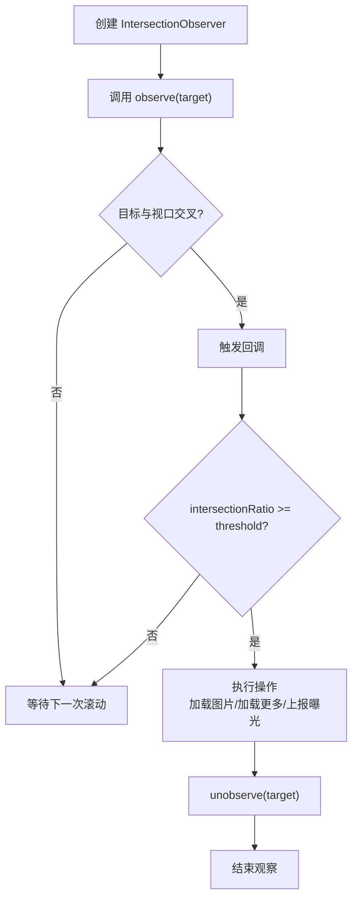
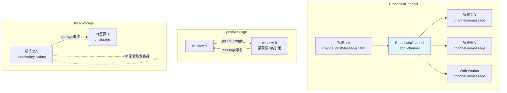
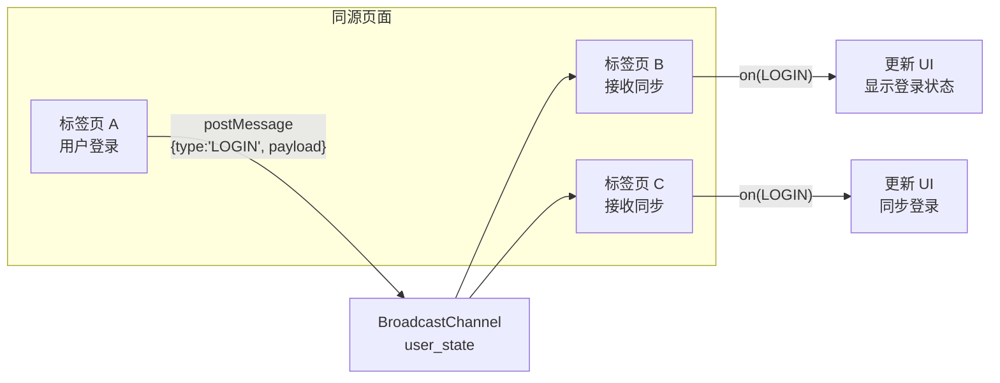
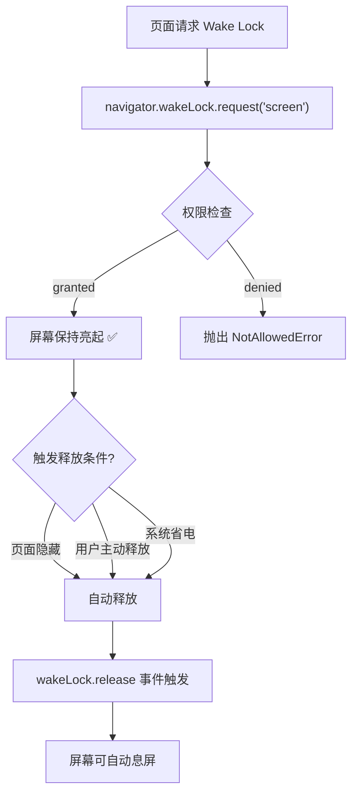
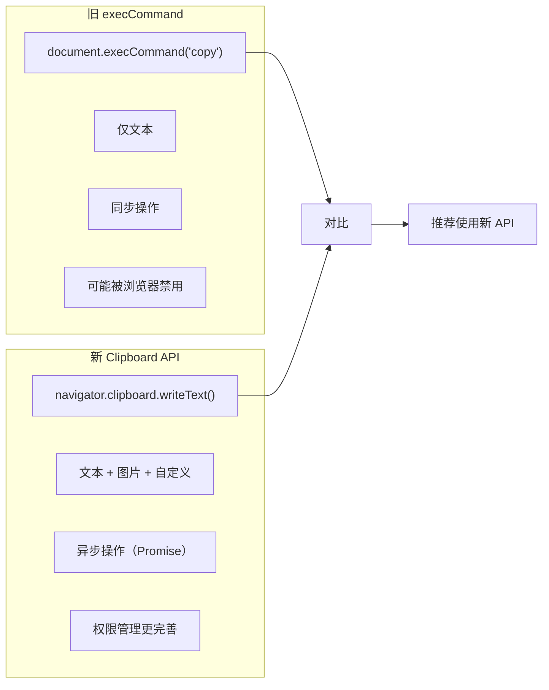

---
title: 浏览器 Web API
---
## 🌐 浏览器 Web API

### 1️⃣ IntersectionObserver

#### 概念和作用

`IntersectionObserver` 提供了一种异步观察目标元素与祖先元素或视口（viewport）交叉状态的方法。用于检测元素是否可见。

```javascript
const observer = new IntersectionObserver((entries) => {
  entries.forEach(entry => {
    if (entry.isIntersecting) {
      console.log('元素进入视口:', entry.target)
    }
  })
})

const target = document.querySelector('.lazy-image')
observer.observe(target)

// 停止观察
// observer.unobserve(target)
// observer.disconnect()
```

#### 配置项

```javascript
const observer = new IntersectionObserver(callback, {
  // 目标与视口交叉比例，0~1 或数组 [0, 0.5, 1]
  threshold: 0.5,

  // 视口偏移量，类似 CSS margin（可正可负，负值提前触发）
  rootMargin: '10px 20px 30px 40px',

  // 指定父级元素作为视口（默认使用浏览器视口）
  root: document.querySelector('.scroll-container'),
})

// ⚠️ 注意事项：
// 1. 不存在 'delay' 配置项——若需节流请自行用 setTimeout 包裹回调
// 2. 'trackVisibility' 仍为实验性 API，仅在部分浏览器（Chrome 86+ 需 flag）支持
// 3. 'threshold' 数组形式：[0, 0.5, 1] 表示元素可见比例穿过 0%/50%/100% 时各触发一次
```

#### 实战: 图片懒加载

```javascript
const lazyImages = document.querySelectorAll('img[data-src]')

const imageObserver = new IntersectionObserver((entries, observer) => {
  entries.forEach(entry => {
    if (!entry.isIntersecting) return

    const img = entry.target
    img.src = img.dataset.src
    img.onload = () => {
      img.classList.add('loaded')
    }
    img.removeAttribute('data-src')
    observer.unobserve(img)
  })
}, {
  rootMargin: '100px',  // 提前100px加载
  threshold: 0.01
})

lazyImages.forEach(img => imageObserver.observe(img))
```

#### 实战: 无限滚动

```javascript
const sentinel = document.querySelector('#scroll-sentinel')

const scrollObserver = new IntersectionObserver(async (entries) => {
  const entry = entries[0]
  if (entry.isIntersecting && !isLoading) {
    isLoading = true
    try {
      const newData = await fetchMoreData()
      appendData(newData)
    } finally {
      isLoading = false
    }
  }
}, {
  rootMargin: '200px'
})

scrollObserver.observe(sentinel)
```

#### 实战: 曝光埋点

```javascript
class ExposureTracker {
  constructor(options = {}) {
    this.reported = new WeakSet()
    this.observer = new IntersectionObserver((entries) => {
      entries.forEach(entry => {
        if (entry.isIntersecting && !this.reported.has(entry.target)) {
          this.reported.add(entry.target)
          const eventData = entry.target.dataset.track
          this.report(eventData)
        }
      })
    }, {
      threshold: options.threshold ?? 0.5
    })
  }

  observe(element) {
    this.observer.observe(element)
  }

  report(data) {
    // 发送埋点请求
    navigator.sendBeacon('/api/track', JSON.stringify({
      element: data,
      timestamp: Date.now()
    }))
  }

  destroy() {
    this.observer.disconnect()
  }
}

// 使用
const tracker = new ExposureTracker({ threshold: 0.3 })
document.querySelectorAll('[data-track]').forEach(el => tracker.observe(el))
```



### 2️⃣ ResizeObserver

#### 监听元素尺寸变化

`ResizeObserver` 用于监听元素的尺寸变化，提供元素内容盒（content-box）、边框盒（border-box）的精确尺寸。

```javascript
const observer = new ResizeObserver((entries) => {
  entries.forEach(entry => {
    const { width, height } = entry.contentBoxSize[0]
    console.log(`${entry.target.id}: ${width} x ${height}`)
  })
})

const element = document.querySelector('.resizable')
observer.observe(element)

// 观察边框盒
observer.observe(element, { box: 'border-box' })
```

#### 与 window.resize 的区别

```javascript
// window.resize 只能监听窗口变化
window.addEventListener('resize', () => {
  console.log('窗口大小变化')
})

// ResizeObserver 可以监听任意元素
const resizeObserver = new ResizeObserver((entries) => {
  entries.forEach(entry => {
    // 元素尺寸变化（包括由内部内容变化引起的）
    console.log(`元素 ${entry.target.id} 尺寸变化:`, entry.contentRect)
  })
})

// 适用场景
const sidebar = document.querySelector('#sidebar')
const chartContainer = document.querySelector('#chart')
const textarea = document.querySelector('#auto-resize')

resizeObserver.observe(sidebar)
resizeObserver.observe(chartContainer)
resizeObserver.observe(textarea)
```

| 对比项 | window.resize | ResizeObserver |
|--------|--------------|----------------|
| 监听对象 | 仅 window | 任意元素 |
| 触发时机 | 窗口大小改变 | 元素内容/边框盒改变 |
| 性能 | 高频触发，可能卡顿 | 批量处理，性能更好 |
| 精确度 | 仅获取窗口尺寸 | 获取 contentBox/borderBox/devicePixelContentBox |
| 触发原因 | 仅用户调整窗口 | 元素尺寸变化（含 JS 修改、子元素变化等） |

#### 实战: 自适应组件

```javascript
class ResponsiveComponent {
  constructor(element) {
    this.element = element
    this.observer = new ResizeObserver(this.handleResize.bind(this))
    this.observer.observe(element)
  }

  handleResize(entries) {
    const entry = entries[0]
    const { width, height } = entry.contentRect

    // 根据宽度切换布局
    if (width > 800) {
      this.element.classList.add('layout-wide')
      this.element.classList.remove('layout-narrow')
    } else if (width > 400) {
      this.element.classList.add('layout-medium')
      this.element.classList.remove('layout-wide', 'layout-narrow')
    } else {
      this.element.classList.add('layout-narrow')
      this.element.classList.remove('layout-wide', 'layout-medium')
    }

    // 更新图表或画布
    if (this.chart) {
      this.chart.resize({ width, height })
    }
  }

  destroy() {
    this.observer.disconnect()
  }
}

// 使用
const chartWidget = new ResponsiveComponent(document.querySelector('#chart-widget'))
```

### 3️⃣ MutationObserver

#### 监听 DOM 变化

`MutationObserver` 用于监听 DOM 树的变更事件，包括节点增删、属性变化、文本内容变化等。

```javascript
const observer = new MutationObserver((mutations) => {
  mutations.forEach(mutation => {
    console.log('变更类型:', mutation.type)
    console.log('目标节点:', mutation.target)

    if (mutation.type === 'childList') {
      console.log('新增节点:', mutation.addedNodes)
      console.log('移除节点:', mutation.removedNodes)
    }

    if (mutation.type === 'attributes') {
      console.log('属性名:', mutation.attributeName)
      console.log('旧值:', mutation.oldValue)
    }

    if (mutation.type === 'characterData') {
      console.log('文本变化:', mutation.oldValue, '→', mutation.target.textContent)
    }
  })
})
```

#### 配置项

```javascript
const targetNode = document.querySelector('#observable-area')

observer.observe(targetNode, {
  // 监听子节点增删
  childList: true,

  // 监听属性变化
  attributes: true,

  // 监听文本变化
  characterData: true,

  // 是否监听所有后代节点
  subtree: true,

  // 是否记录属性旧值
  attributeOldValue: true,

  // 是否记录文本旧值
  characterDataOldValue: true,

  // 监听的特定属性列表（默认监听所有，不支持通配符）
  attributeFilter: ['class', 'style']
})
```

#### 实战: 监听子元素变化

```javascript
// 动态列表监控
class DynamicListMonitor {
  constructor(listElement, options = {}) {
    this.list = listElement
    this.onItemAdd = options.onItemAdd || (() => {})
    this.onItemRemove = options.onItemRemove || (() => {})

    this.observer = new MutationObserver((mutations) => {
      mutations.forEach(mutation => {
        mutation.addedNodes.forEach(node => {
          if (node.nodeType === 1) {  // 元素节点
            this.onItemAdd(node)
          }
        })
        mutation.removedNodes.forEach(node => {
          if (node.nodeType === 1) {
            this.onItemRemove(node)
          }
        })
      })
    })

    this.observer.observe(listElement, {
      childList: true,
      subtree: false
    })
  }

  destroy() {
    this.observer.disconnect()
  }
}

// 使用: 监控聊天消息列表
const chatMonitor = new DynamicListMonitor(
  document.querySelector('#chat-messages'),
  {
    onItemAdd: (node) => {
      console.log('新消息:', node.textContent)
      node.classList.add('message-enter')
      // 自动滚动到底部
      node.parentElement.scrollTop = node.parentElement.scrollHeight
    },
    onItemRemove: (node) => {
      console.log('消息被移除:', node.id)
    }
  }
)
```

### 4️⃣ AbortController

#### 中止请求

`AbortController` 提供一个 `signal` 属性和 `abort()` 方法，用于中止正在进行 DOM 操作或网络请求。

```javascript
const controller = new AbortController()
const signal = controller.signal

// 监听中止事件
signal.addEventListener('abort', () => {
  console.log('请求已中止:', signal.aborted ? '是' : '否')
  console.log('中止原因:', signal.reason)
})

// 发起可中止的请求
fetch('/api/large-data', { signal })
  .then(response => response.json())
  .catch(err => {
    if (err.name === 'AbortError') {
      console.log('请求被用户取消')
    } else {
      console.error('其他错误:', err)
    }
  })

// 在超时或其他条件下中止请求
setTimeout(() => controller.abort('用户取消了请求'), 5000)
```

#### 与 fetch 配合

```javascript
function fetchWithTimeout(url, timeout = 5000) {
  const controller = new AbortController()
  const timeoutId = setTimeout(() => controller.abort('请求超时'), timeout)

  return fetch(url, { signal: controller.signal })
    .finally(() => clearTimeout(timeoutId))
}

// 使用
try {
  const response = await fetchWithTimeout('https://api.example.com/data', 3000)
  const data = await response.json()
  console.log(data)
} catch (err) {
  if (err.name === 'AbortError') {
    console.log('请求超时或被取消')
  }
}
```

#### 实战: 取消重复请求

```javascript
class RequestManager {
  constructor() {
    this.pendingRequests = new Map()
  }

  async request(url, options = {}) {
    // 如果已有相同 url 的请求，取消旧的
    if (this.pendingRequests.has(url)) {
      const oldController = this.pendingRequests.get(url)
      oldController.abort('请求被新的请求替代')
      this.pendingRequests.delete(url)
    }

    const controller = new AbortController()
    this.pendingRequests.set(url, controller)

    try {
      const response = await fetch(url, {
        ...options,
        signal: controller.signal
      })
      return await response.json()
    } finally {
      this.pendingRequests.delete(url)
    }
  }

  cancelAll(reason = '页面离开') {
    this.pendingRequests.forEach(controller => {
      controller.abort(reason)
    })
    this.pendingRequests.clear()
  }
}

// 搜索防抖 + 取消旧请求
const requestManager = new RequestManager()
const searchInput = document.querySelector('#search')

let debounceTimer
searchInput.addEventListener('input', (event) => {
  clearTimeout(debounceTimer)
  debounceTimer = setTimeout(() => {
    requestManager.request(`/api/search?q=${event.target.value}`)
  }, 300)
})
```

### 5️⃣ PerformanceObserver

#### 性能指标监控

`PerformanceObserver` 用于监测性能度量事件，获取页面性能数据。

```javascript
// 基本用法
const observer = new PerformanceObserver((list) => {
  list.getEntries().forEach(entry => {
    console.log(`${entry.name}: ${entry.duration}ms`)
  })
})

// 观察特定类型的性能条目
observer.observe({ entryTypes: ['resource', 'navigation', 'paint', 'largest-contentful-paint'] })
```

#### LCP/FID/CLS 监控

```javascript
// LCP - Largest Contentful Paint (最大内容绘制)
const lcpObserver = new PerformanceObserver((list) => {
  const entries = list.getEntries()
  const lastEntry = entries[entries.length - 1]
  console.log('LCP:', lastEntry.startTime, 'ms')
  console.log('LCP元素:', lastEntry.element)
})
lcpObserver.observe({ type: 'largest-contentful-paint', buffered: true })

// FID - First Input Delay (首次输入延迟)
const fidObserver = new PerformanceObserver((list) => {
  list.getEntries().forEach(entry => {
    console.log('FID:', entry.processingStart - entry.startTime, 'ms')
    console.log('交互类型:', entry.name)
  })
})
fidObserver.observe({ type: 'first-input', buffered: true })

// CLS - Cumulative Layout Shift (累计布局偏移)
let clsValue = 0
let clsEntries = []
const clsObserver = new PerformanceObserver((list) => {
  list.getEntries().forEach(entry => {
    if (!entry.hadRecentInput) {
      clsValue += entry.value
      clsEntries.push(entry)
      console.log('CLS值:', clsValue, '来源:', entry.sources)
    }
  })
})
clsObserver.observe({ type: 'layout-shift', buffered: true })
```

#### 实战: 性能埋点

```javascript
class PerformanceMonitor {
  constructor(reportUrl) {
    this.reportUrl = reportUrl
    this.metrics = {}
    this.initObservers()
  }

  initObservers() {
    // 页面导航性能
    const navObserver = new PerformanceObserver((list) => {
      const [entry] = list.getEntries()
      this.metrics.navigation = {
        dns: entry.domainLookupEnd - entry.domainLookupStart,
        tcp: entry.connectEnd - entry.connectStart,
        ttfb: entry.responseStart - entry.requestStart,
        domReady: entry.domContentLoadedEventEnd - entry.domContentLoadedEventStart,
        loadTime: entry.loadEventEnd - entry.loadEventStart
      }
    })
    navObserver.observe({ type: 'navigation', buffered: true })

    // 资源加载
    const resObserver = new PerformanceObserver((list) => {
      list.getEntries().forEach(entry => {
        if (entry.initiatorType === 'script' || entry.initiatorType === 'link' ||
            entry.initiatorType === 'img') {
          this.metrics.resources ||= {}
          this.metrics.resources[entry.name] = entry.duration
        }
      })
    })
    resObserver.observe({ type: 'resource', buffered: true })

    // Web Vitals
    const vitalsObserver = new PerformanceObserver((list) => {
      list.getEntries().forEach(entry => {
        if (entry.entryType === 'largest-contentful-paint') {
          this.metrics.LCP = entry.startTime
        }
        if (entry.entryType === 'first-input') {
          this.metrics.FID = entry.processingStart - entry.startTime
        }
        if (entry.entryType === 'layout-shift' && !entry.hadRecentInput) {
          this.metrics.CLS = (this.metrics.CLS || 0) + entry.value
        }
      })
    })
    vitalsObserver.observe({ entryTypes: ['largest-contentful-paint', 'first-input', 'layout-shift'], buffered: true })
  }

  report() {
    // 页面关闭前上报
    if (navigator.sendBeacon) {
      navigator.sendBeacon(this.reportUrl, JSON.stringify(this.metrics))
    }
  }
}

// 使用
const monitor = new PerformanceMonitor('/api/perf-report')
document.addEventListener('visibilitychange', () => {
  if (document.visibilityState === 'hidden') {
    monitor.report()
  }
})
```

### 6️⃣ BroadcastChannel

#### 跨标签页通信

`BroadcastChannel` 允许同源的不同浏览上下文（标签页、iframe、Worker）之间进行消息通信。

```javascript
// 页面 A - 发送消息
const channelA = new BroadcastChannel('app_channel')
channelA.postMessage({ type: 'USER_LOGIN', data: { userId: 123, name: '张三' } })

// 页面 B - 接收消息
const channelB = new BroadcastChannel('app_channel')
channelB.onmessage = (event) => {
  console.log('收到消息:', event.data)
  // { type: 'USER_LOGIN', data: { userId: 123, name: '张三' } }
}

// 清理
// channelA.close()
// channelB.close()
```

#### 与 postMessage / localStorage 对比

```javascript
// 方案1: BroadcastChannel
const bc = new BroadcastChannel('channel')
bc.postMessage('hello')
bc.onmessage = (event) => console.log(event.data)
// 优点: 专门用于同源跨标签页通信，API 简洁
// 缺点: 仅支持同源

// 方案2: window.postMessage
// window.opener.postMessage('hello', '*')
// window.addEventListener('message', (event) => console.log(event.data))
// 优点: 支持跨域
// 缺点: 需要获取窗口引用，安全性需注意 origin

// 方案3: localStorage
window.addEventListener('storage', (event) => {
  if (event.key === 'shared-data') {
    console.log('数据变化:', event.newValue)
  }
})
localStorage.setItem('shared-data', JSON.stringify({ msg: 'hello' }))
// 优点: 简单易用，不需要建立连接
// 缺点: 存储大小限制，存储事件不会在触发页面触发，会序列化
```

| 对比项 | BroadcastChannel | postMessage | localStorage |
|--------|-----------------|-------------|--------------|
| 通信范围 | 同源标签页/iframe/Worker | 任意窗口（可跨域） | 同源标签页 |
| API 复杂度 | 简单 | 中等 | 简单 |
| 数据格式 | 结构化克隆 | 结构化克隆 | 仅字符串 |
| 是否需要引用 | 不需要 | 需要窗口对象 | 不需要 |
| 事件接收 | 所有同源页面 | 指定窗口 | 除自身外的同源页面 |
| 安全性 | 同源限制 | 需验证 origin | 同源限制 |



```javascript
// 实战: 跨标签页状态同步
class CrossTabState {
  constructor(channelName = 'app_state') {
    this.channel = new BroadcastChannel(channelName)
    this.listeners = new Map()

    this.channel.onmessage = (event) => {
      const { type, payload } = event.data
      const callbacks = this.listeners.get(type) || []
      callbacks.forEach(cb => cb(payload, event.origin))
    }
  }

  // 发送消息到所有同源页面
  broadcast(type, payload) {
    this.channel.postMessage({ type, payload })
  }

  // 监听特定消息类型
  on(type, callback) {
    if (!this.listeners.has(type)) {
      this.listeners.set(type, [])
    }
    this.listeners.get(type).push(callback)
  }

  // 取消监听
  off(type, callback) {
    const callbacks = this.listeners.get(type)
    if (callbacks) {
      this.listeners.set(type, callbacks.filter(cb => cb !== callback))
    }
  }

  close() {
    this.channel.close()
    this.listeners.clear()
  }
}

// 使用: 用户登录状态同步
const stateSync = new CrossTabState('user_state')

// 页面 A: 用户登录
stateSync.broadcast('LOGIN', { userId: 1, name: '张三', token: 'xxx' })

// 页面 B: 监听登录事件
stateSync.on('LOGIN', (userData) => {
  console.log(`用户 ${userData.name} 在其他标签页登录了`)
  updateUI(userData)
})

// 页面 C: 监听登出事件
stateSync.on('LOGOUT', () => {
  console.log('用户已从其他标签页登出')
  redirectToLogin()
})
```



---

### 7️⃣ Navigation API

> 💡 **要点：** 新一代前端路由 API，取代 history.pushState/popstate，提供拦截导航、跨页面跳转、事件管理等完整能力

Navigation API 是浏览器原生的**导航管理** API，用于替代传统的 `history.pushState` + `popstate` 事件。

```javascript
const navigation = window.navigation;

// 监听所有导航
navigation.addEventListener('navigate', (event) => {
  console.log('导航到:', event.destination.url);
  console.log('导航类型:', event.navigateType); // push/replace/reload/traverse

  // 拦截导航（SPA 路由）
  if (shouldIntercept(event.destination.url)) {
    event.intercept({
      handler: async () => {
        const content = await loadContent(event.destination.url);
        document.getElementById('app').innerHTML = content;
      }
    });
  }
});

// 编程式导航
navigation.navigate('/about');
navigation.navigate('/settings', { state: { from: 'home' } });
navigation.reload();

// 前进/后退
navigation.back();
navigation.forward();
navigation.traverseTo(entry.key); // 跳转到特定历史条目

// 当前导航条目
console.log('当前条目:', navigation.currentEntry);
console.log('当前 URL:', navigation.currentEntry.url);
console.log('当前状态:', navigation.currentEntry.getState());
```

| 能力 | 传统 history API | Navigation API |
|------|-----------------|----------------|
| 导航拦截 | 无法直接拦截 | `navigate` 事件 + `intercept()` |
| SPA 路由 | 手动监听 popstate | 原生支持 intercept |
| 导航类型判断 | 无 | `navigateType`: push/replace/reload/traverse |
| 历史条目管理 | 有限的栈操作 | `navigation.entries()` 遍历全部历史 |
| 导航完成通知 | 无 | `navigation.navigatesuccess` / `navigatenerror` |

```javascript
// 导航事件
navigation.addEventListener('navigatesuccess', () => {
  console.log('导航成功完成');
});

navigation.addEventListener('navigatenerror', (event) => {
  console.error('导航失败:', event.error);
});

// 导航中止
const abortController = new AbortController();
navigation.navigate('/slow-page', {
  signal: abortController.signal,
  history: 'replace',
  info: { transition: 'slide' }
});
```

### 8️⃣ File System Access API

> 💡 **要点：** 浏览器原生文件系统 API，允许网页读写本地文件和目录，实现真正的"浏览器 IDE"

```javascript
// 打开文件选择器（读取）
async function openFile() {
  const [fileHandle] = await window.showOpenFilePicker({
    types: [
      {
        description: 'Markdown 文件',
        accept: { 'text/markdown': ['.md'] }
      }
    ],
    multiple: false
  });

  const file = await fileHandle.getFile();
  const content = await file.text();
  return { content, fileHandle };
}

// 保存文件（写入）
async function saveFile(fileHandle, content) {
  const writable = await fileHandle.createWritable();
  await writable.write(content);
  await writable.close();
}

// 新建文件保存
async function saveAs(content) {
  const fileHandle = await window.showSaveFilePicker({
    suggestedName: 'untitled.txt',
    types: [
      {
        description: '文本文件',
        accept: { 'text/plain': ['.txt'] }
      }
    ]
  });

  const writable = await fileHandle.createWritable();
  await writable.write(content);
  await writable.close();
}

// 选择目录（读取目录）
async function openDirectory() {
  const dirHandle = await window.showDirectoryPicker();

  async function listFiles(dirHandle, path = '') {
    const result = [];
    for await (const [name, handle] of dirHandle.entries()) {
      const fullPath = `${path}/${name}`;
      if (handle.kind === 'file') {
        const file = await handle.getFile();
        result.push({ name, path: fullPath, size: file.size });
      } else if (handle.kind === 'directory') {
        result.push(...await listFiles(handle, fullPath));
      }
    }
    return result;
  }

  return await listFiles(dirHandle);
}
```

| API | 说明 | 权限 |
|-----|------|------|
| `showOpenFilePicker()` | 打开文件选择器 | 用户手势触发 |
| `showSaveFilePicker()` | 保存文件对话框 | 用户手势触发 |
| `showDirectoryPicker()` | 选择目录 | 用户手势触发 |
| `FileSystemFileHandle` | 文件句柄 | 可持久化（IndexedDB） |
| `FileSystemDirectoryHandle` | 目录句柄 | 可持久化（IndexedDB） |

```javascript
// 保留文件句柄（IndexedDB 持久化）
const db = await openDB('file-store', 1);
await db.put('handles', fileHandle, 'last-opened');

// 恢复文件操作
const savedHandle = await db.get('handles', 'last-opened');
if (savedHandle) {
  const file = await savedHandle.getFile();
  console.log('恢复文件:', file.name);
  // 验证权限
  if (await savedHandle.queryPermission() !== 'granted') {
    await savedHandle.requestPermission();
  }
}
```

### 9️⃣ Screen Wake Lock API

> 💡 **要点：** 防止设备屏幕息屏/锁屏，适合阅读器、视频播放、演示等场景

```javascript
// 请求唤醒锁（保持屏幕亮起）
let wakeLock = null;

async function requestWakeLock() {
  try {
    wakeLock = await navigator.wakeLock.request('screen');
    console.log('屏幕唤醒锁已激活');

    // 监听释放事件（如用户切换标签页）
    wakeLock.addEventListener('release', () => {
      console.log('屏幕唤醒锁被释放');
    });
  } catch (err) {
    console.error('唤醒锁请求失败:', err.name, err.message);
  }
}

// 释放唤醒锁
function releaseWakeLock() {
  if (wakeLock) {
    wakeLock.release();
    wakeLock = null;
  }
}

// 处理页面可见性变化（重新获取唤醒锁）
document.addEventListener('visibilitychange', async () => {
  if (document.visibilityState === 'visible' && !wakeLock) {
    await requestWakeLock();
  }
});

// 使用场景：阅读器保持屏幕常亮
readerButton.addEventListener('click', async () => {
  if (wakeLock) {
    releaseWakeLock();
    readerButton.textContent = '自动息屏';
  } else {
    await requestWakeLock();
    readerButton.textContent = '保持亮屏';
  }
});
```



### 🔟 Clipboard API（异步剪贴板）

> 💡 **要点：** 异步剪贴板 API 支持读取/写入文本、图片等格式，比 document.execCommand 更强大，需用户权限

```javascript
// 写入剪贴板
async function writeToClipboard() {
  try {
    await navigator.clipboard.writeText('要复制的文本');
    console.log('文本已复制到剪贴板');
  } catch (err) {
    console.error('复制失败:', err);
  }
}

// 读取剪贴板
async function readFromClipboard() {
  try {
    const text = await navigator.clipboard.readText();
    console.log('剪贴板内容:', text);
    return text;
  } catch (err) {
    console.error('读取剪贴板失败:', err);
  }
}

// 写入图片（Blob）
async function copyImage(canvas) {
  try {
    const blob = await new Promise(resolve => canvas.toBlob(resolve));
    await navigator.clipboard.write([
      new ClipboardItem({
        [blob.type]: blob
      })
    ]);
    console.log('图片已复制到剪贴板');
  } catch (err) {
    console.error('图片复制失败:', err);
  }
}

// 读取图片
async function readImage() {
  try {
    const items = await navigator.clipboard.read();
    for (const item of items) {
      if (item.types.includes('image/png')) {
        const blob = await item.getType('image/png');
        const img = document.createElement('img');
        img.src = URL.createObjectURL(blob);
        document.body.appendChild(img);
      }
    }
  } catch (err) {
    console.error('读取图片失败:', err);
  }
}
```

| API | 说明 | 权限要求 |
|-----|------|----------|
| `writeText()` | 写入文本 | 无需显式权限（用户手势） |
| `readText()` | 读取文本 | 需要用户授权 |
| `write()` | 写入多种格式（Blob） | 无需显式权限（用户手势） |
| `read()` | 读取多种格式 | 需要用户授权 |
| `ClipboardItem` | 表示剪贴板中的一项数据 | — |



---

