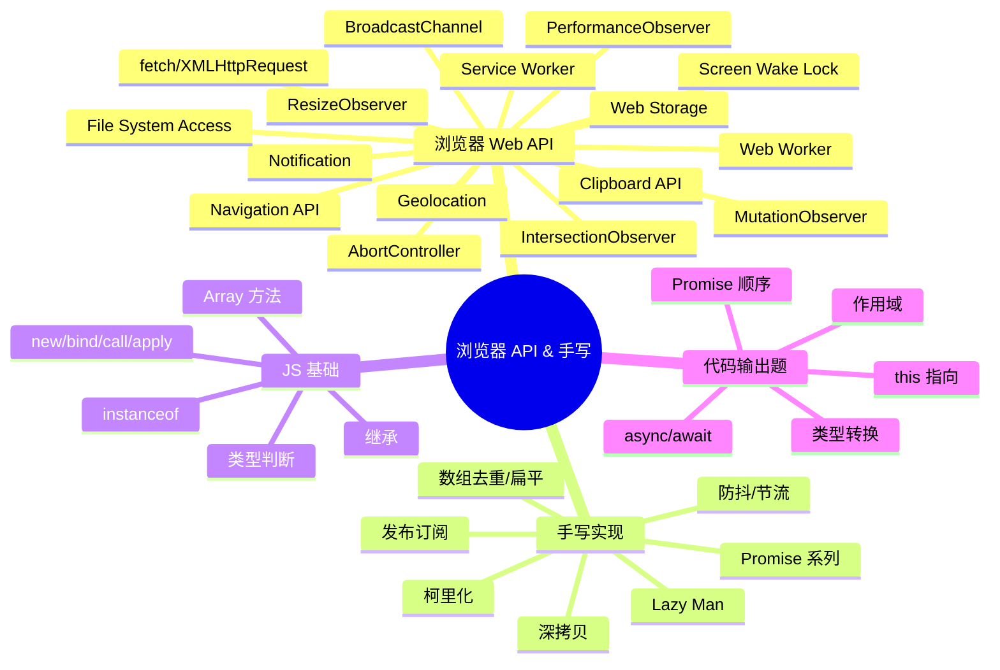

---
title: JavaScript 手写与代码
---
# 🌐 JavaScript 手写实现

> 🎯 **面试星级**：★★★★★ | **建议用时**：2 天
>

---

## 📈 浏览器 Web API 演进史

> 浏览器 API 的丰富程度，直接反映了 Web 从"文档平台"到"操作系统级平台"的跨越。

### Web API 发展代际

```
DOM 0-1 时代（1995-2000）
  ├─ document.getElementById / window.alert
  ├─ XMLHttpRequest（1999，改变世界）
  └─ 基础事件处理

HTML5 API 爆发（2008-2014）
  ├─ Web Storage / IndexedDB（本地存储）
  ├─ Web Worker / WebSocket（多线程 + 实时）
  ├─ Canvas / SVG / Audio/Video（多媒体）
  ├─ Geolocation / Drag & Drop（设备能力）
  └─ History API / requestAnimationFrame（SPA 基础）

现代 API 成熟（2015-2020）
  ├─ fetch / Service Worker / Cache API（PWA）
  ├─ IntersectionObserver / ResizeObserver（高效感知）
  ├─ WebRTC / Web Bluetooth / Web USB（设备通信）
  ├─ Clipboard / File System Access（生产力）
  └─ Performance API / Network Information（监控）

前沿 API 爆发（2021-2026）
  ├─ WebGPU / WebNN / WebAssembly（AI + 高性能）
  ├─ View Transitions / Navigation API（应用体验）
  ├─ Screen Wake Lock / Window Management（设备集成）
  ├─ AbortController / Compression Streams（控制流）
  └─ File System / Web Locks / BroadcastChannel（平台级）
```

---

## 📌 知识脑图



---


## 目录

- [浏览器 Web API](./01-浏览器WebAPI)
- [手写代码实现](./02-手写实现)
- [代码输出题](./03-代码输出题)

