---
title: 数据类型与 ES6
---
## 📦 一、数据类型

### 1️⃣ JavaScript 有哪些数据类型，它们的区别？

JavaScript 共有 **八种数据类型**，分为 **原始类型（Primitive）** 和 **引用类型（Reference）**。

**原始类型（7种）：** `Undefined`、`Null`、`Boolean`、`Number`、`String`、`Symbol`、`BigInt`

**引用类型（1种）：** `Object`（包含普通对象、数组、函数、Date、RegExp、Map、Set 等）

其中 `Symbol` 是 ES6 中新增的数据类型，`BigInt` 是 ES2020（ES11）中新增的数据类型：

- **Symbol**：创建后独一无二且不可变的数据类型，主要解决全局变量冲突问题。每个 `Symbol()` 返回值都是唯一的，即使传入相同描述。
- **BigInt**：可表示任意精度格式的整数，使用 `BigInt` 可以安全地存储和操作大整数，超出 `Number.MAX_SAFE_INTEGER`（2^53 - 1）范围也不会丢失精度。

#### 栈（Stack）vs 堆（Heap）存储

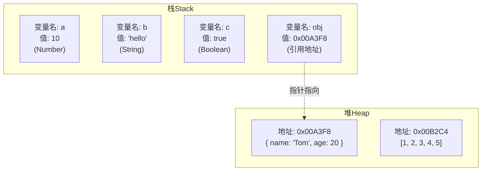

**两种类型的区别在于存储位置的不同：**

| 特性 | 原始类型 | 引用类型 |
|------|---------|---------|
| 存储位置 | 栈（Stack） | 堆（Heap） |
| 空间大小 | 固定、小 | 不固定、大 |
| 访问方式 | 按值访问 | 按引用访问 |
| 复制行为 | 独立副本 | 共享引用 |
| 比较方式 | 值比较 | 引用比较 |

**详细说明：**

- **原始数据类型** 直接存储在栈中的简单数据段，占据空间小、大小固定，属于被频繁使用数据，所以放入栈中存储。
- **引用数据类型** 存储在堆中的对象，占据空间大、大小不固定。如果存储在栈中，将会影响程序运行的性能。引用数据类型在栈中存储了**指针**，该指针指向堆中该实体的起始地址。当解释器寻找引用值时，会首先检索其在栈中的地址，取得地址后从堆中获得实体。

> ⚠️ **教学简化提示**：以上"原始 → 栈、引用 → 堆"是 V8 等主流引擎**最常见**的分配策略，足够理解"值传递 / 引用传递"。但现代引擎还会做**逃逸分析（Escape Analysis）**、**Inline Cache**、**对象字面量缓存**等优化——某些"短命"的引用对象可能被分配到栈而非堆。本结论不直接等于底层 100% 实现细节，仅作为概念模型使用。

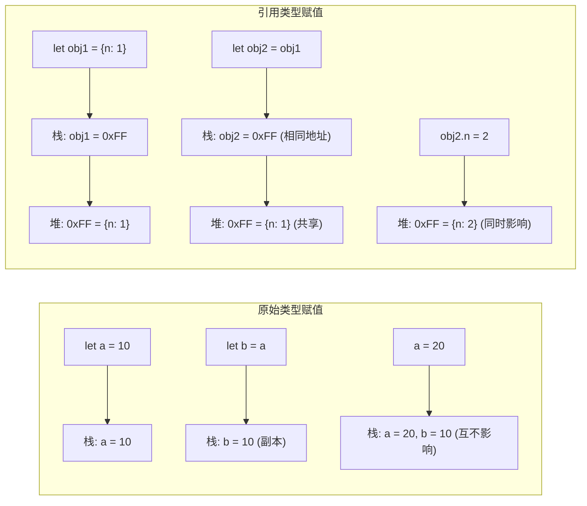

### 2️⃣ 数据类型检测的方式有哪些

#### 1️⃣ typeof

```javascript
// typeof 操作符检测数据类型
console.log(typeof 2);               // number
console.log(typeof true);            // boolean
console.log(typeof 'str');           // string
console.log(typeof []);              // object
console.log(typeof function(){});    // function
console.log(typeof {});              // object
console.log(typeof undefined);       // undefined
console.log(typeof null);            // object  (历史遗留bug)
console.log(typeof Symbol());        // symbol
console.log(typeof 10n);             // bigint
```

> ⚠️ **注意**：`typeof null` 返回 `"object"` 是 JavaScript 第一版就存在的 bug，因为 `null` 的机器码全 0，与 `object` 的类型标签相同。由于历史兼容性原因，这个 bug 从未被修复。

**typeof 的局限性：**
- `null` 被检测为 `object`（JS 第一版遗留bug，null 的机器码全0，与 object 的类型标签相同）
- 数组、对象都被检测为 `object`，无法区分具体对象类型

#### 2️⃣ 现代类型检测最佳实践

```javascript
// 封装类型检测工具函数
const typeCheck = {
  isArray: Array.isArray,
  isNull: (v) => v === null,
  isUndefined: (v) => v === undefined,
  isNil: (v) => v == null,
  isObject: (v) => typeof v === 'object' && v !== null,
  isPlainObject: (v) => Object.prototype.toString.call(v) === '[object Object]',
  isFunction: (v) => typeof v === 'function',
  isPrimitive: (v) => v == null || (typeof v !== 'object' && typeof v !== 'function'),
};

// 使用示例
console.log(typeCheck.isArray([]));           // true
console.log(typeCheck.isPlainObject({}));      // true
console.log(typeCheck.isPrimitive(null));      // true
console.log(typeCheck.isNil(undefined));       // true
```

#### 3️⃣ instanceof

```javascript
// instanceof 检测构造函数原型是否在原型链上
console.log(2 instanceof Number);                    // false
console.log(true instanceof Boolean);                // false
console.log('str' instanceof String);                // false
console.log([] instanceof Array);                    // true
console.log(function(){} instanceof Function);       // true
console.log({} instanceof Object);                   // true
```

`instanceof` 的原理：判断构造函数的 `prototype` 属性是否出现在对象的原型链中。

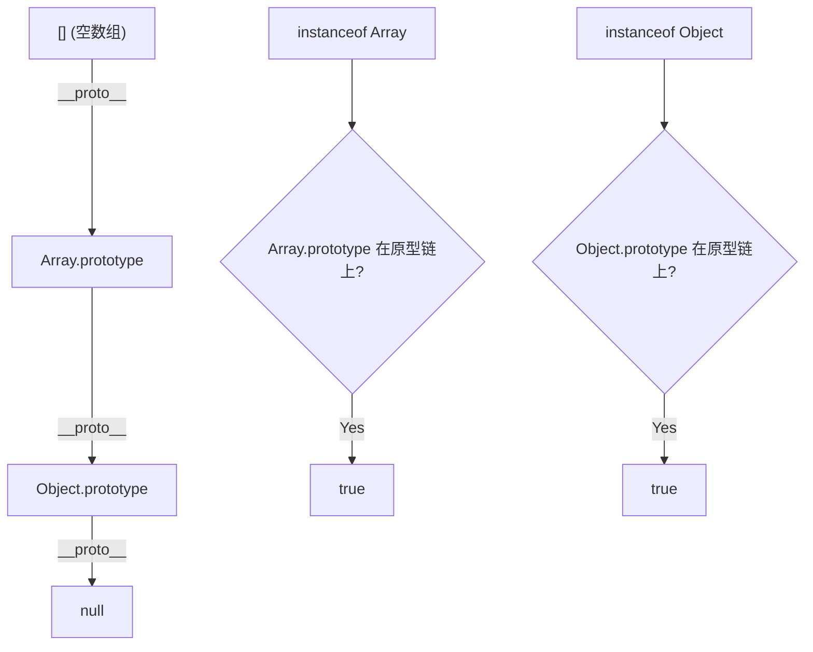

#### 3️⃣ constructor

```javascript
console.log((2).constructor === Number);          // true
console.log((true).constructor === Boolean);      // true
console.log(('str').constructor === String);      // true
console.log(([]).constructor === Array);          // true
console.log((function() {}).constructor === Function); // true
console.log(({}).constructor === Object);         // true
```

**注意：** `constructor` 可以被改写，不安全。

```javascript
function Fn(){};
Fn.prototype = new Array();
var f = new Fn();
console.log(f.constructor === Fn);    // false
console.log(f.constructor === Array); // true
```

#### 4️⃣ Object.prototype.toString.call() （最准确）

```javascript
var a = Object.prototype.toString;
console.log(a.call(2));              // [object Number]
console.log(a.call(true));           // [object Boolean]
console.log(a.call('str'));          // [object String]
console.log(a.call([]));             // [object Array]
console.log(a.call(function(){}));   // [object Function]
console.log(a.call({}));             // [object Object]
console.log(a.call(undefined));      // [object Undefined]
console.log(a.call(null));           // [object Null]
```

**原理：** 每个对象都有一个内部属性 `[[Class]]`（在ES5中），`Object.prototype.toString` 返回该属性的值。Array、Function 等类型重写了 `toString` 方法，所以必须通过 `Object.prototype.toString.call()` 来调用原始版本。

### 3️⃣ 判断数组的方式有哪些

| 方法 | 代码示例 | 原理 |
|------|---------|------|
| `Object.prototype.toString.call()` | `Object.prototype.toString.call(obj).slice(8,-1) === 'Array'` | 获取内部 [[Class]] |
| 原型链 | `obj.__proto__ === Array.prototype` | 直接比较原型 |
| `Array.isArray()` | `Array.isArray(obj)` | ES6 原生方法，最推荐 |
| `instanceof` | `obj instanceof Array` | 检查原型链 |
| `isPrototypeOf` | `Array.prototype.isPrototypeOf(obj)` | 检查原型关系 |

### 4️⃣ null 和 undefined 区别

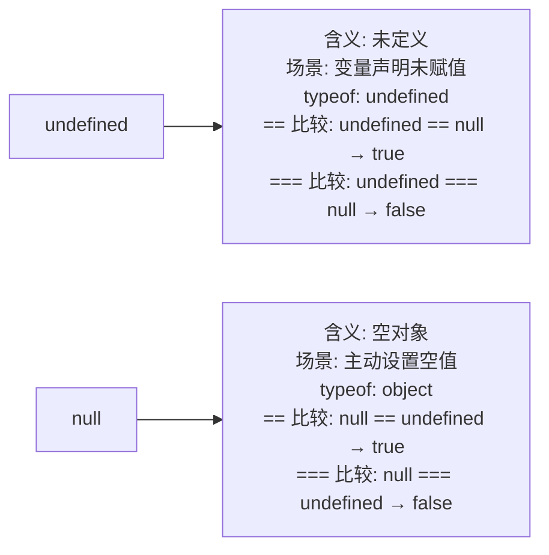

| 对比项 | undefined | null |
|--------|-----------|------|
| 含义 | 未定义 | 空对象 |
| 类型 | undefined | object（typeof） |
| 转数字 | NaN | 0 |
| JSON序列化 | 被忽略 | 保留为 null |
| 常见场景 | 变量声明未赋值、函数无返回值 | 主动释放引用、原型链终点 |

`undefined` 在 ES5+ 中全局不可写不可配置，但局部可遮蔽（`const undefined = 1` 在函数内可运行，全局抛 TypeError）。

### 5️⃣ typeof null 的结果为什么是 Object？

在 JavaScript 第一个版本中，所有值都存储在 32 位的单元中，每个单元包含一个小的**类型标签（1-3 bits）**：

```
000: object
  1: int
010: double
100: string
110: boolean
```

`null` 的值是机器码 NULL 指针（全0），类型标签也是 `000`，和 `object` 类型标签一样，所以被判定为 `object`。这是 JS 设计之初的遗留 bug，但为了兼容性一直保留至今。

### 6️⃣ instanceof 操作符的实现原理

```javascript
// myInstanceof 手动实现 instanceof 原理
function myInstanceof(left, right) {
  let proto = Object.getPrototypeOf(left)
  let prototype = right.prototype;

  while (true) {
    if (!proto) return false;
    if (proto === prototype) return true;
    proto = Object.getPrototypeOf(proto);
  }
}
```

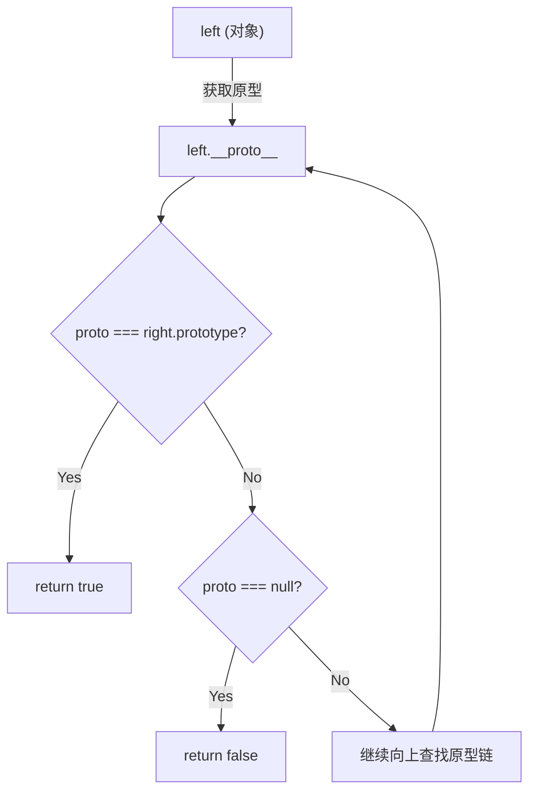

### 7️⃣ 为什么 0.1 + 0.2 !== 0.3？

> ⚠️ **经典面试题**：浮点数精度问题源于 IEEE 754 双精度标准。0.1 和 0.2 的二进制是无限循环小数，截断后相加产生误差。解决方案：`toFixed`、`Number.EPSILON` 或放大倍数计算。**注意：这不是 JS 特有的问题**，所有使用 IEEE 754 的语言都会遇到。

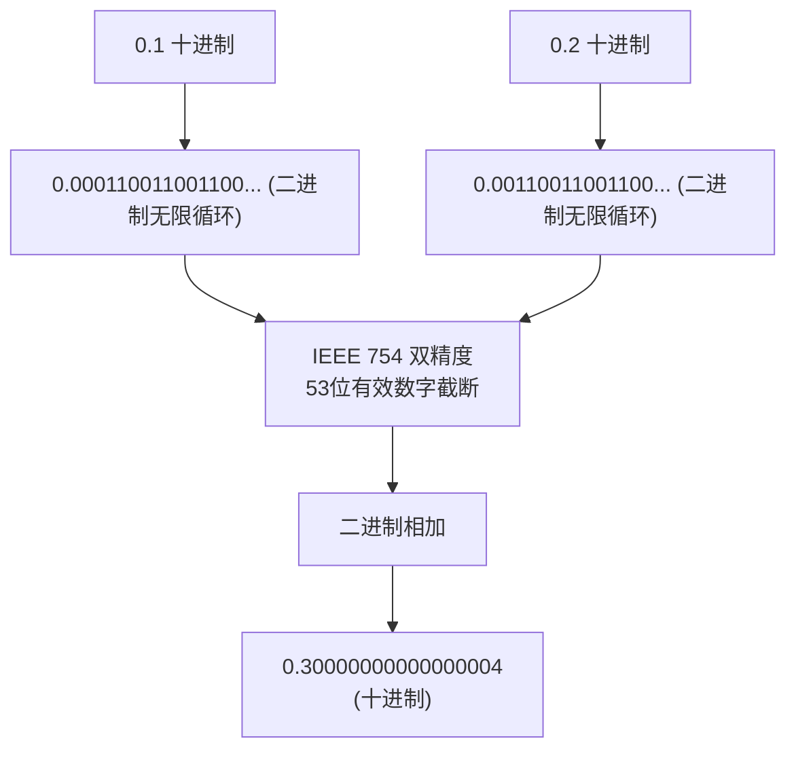

**原因：** JavaScript 的 Number 遵循 IEEE 754 标准，使用 64 位双精度浮点数表示。

- 符号位（sign）：1 bit
- 指数位（exponent）：11 bit
- 小数位（fraction）：52 bit

0.1 和 0.2 的二进制都是无限循环小数，IEEE 754 只能保留 53 位有效数字（52 位 + 隐含的 1 位），超出部分"0 舍 1 入"，导致精度丢失。

**解决方案：**

```javascript
// 方法1: toFixed
(0.1 + 0.2).toFixed(2)  // "0.30"

// 方法2: ES6 Number.EPSILON
function numberepsilon(arg1, arg2) {
  return Math.abs(arg1 - arg2) < Number.EPSILON;
}
console.log(numberepsilon(0.1 + 0.2, 0.3)); // true

// 方法3: 放大倍数后计算
(0.1 * 10 + 0.2 * 10) / 10  // 0.3
```

### 8️⃣ 如何获取安全的 undefined 值？

```javascript
void 0        // undefined
void (1 + 1)  // undefined
void 'hello'  // undefined
```

`void` 运算符对给定的表达式求值，然后返回 `undefined`。因为 `undefined` 在局部作用域中可被遮蔽（ES5+ 中全局 `undefined` 不可写不可配置），使用 `void 0` 最安全。

### 9️⃣ typeof NaN 的结果是什么？

```javascript
typeof NaN  // "number"
```

`NaN`（Not a Number）是一个"警戒值"，表示数学运算失败的结果。它是唯一一个**与自身不相等**的值：

```javascript
NaN === NaN  // false
NaN !== NaN  // true
```

### 1️⃣0️⃣ isNaN 和 Number.isNaN 的区别

| 方法 | 行为 | 特点 |
|------|------|------|
| `isNaN()` | 先尝试转换为数字，再判断 | 非数字值也会返回 true，不准确 |
| `Number.isNaN()` | 先判断是否为数字类型，再判断 | 更准确，不进行类型转换 |

```javascript
isNaN('hello')          // true (先转换 Number('hello') → NaN，然后判断)
Number.isNaN('hello')   // false (先判断类型，'hello' 不是 number，直接 false)
Number.isNaN(NaN)       // true
```

### 1️⃣1️⃣ 其他值到字符串的转换规则

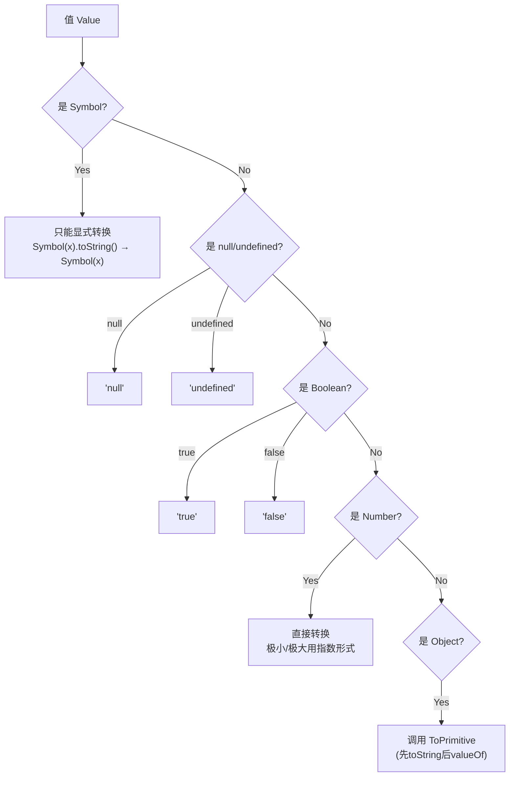

### 1️⃣2️⃣ 其他值到数字值的转换规则

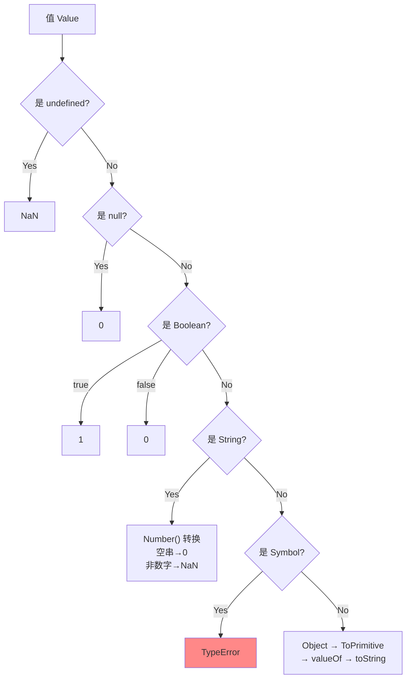

**ToPrimitive 抽象操作流程：**

当 `type = number` 时：
1. 调用 `valueOf()`，如果返回原始值，则返回
2. 否则调用 `toString()`，如果返回原始值，则返回
3. 否则抛出 `TypeError`

当 `type = string` 时（仅 Date 对象默认）：
1. 调用 `toString()`，如果返回原始值，则返回
2. 否则调用 `valueOf()`，如果返回原始值，则返回
3. 否则抛出 `TypeError`

### 1️⃣3️⃣ 其他值到布尔类型的转换规则

**假值（Falsy）列表：**

| 值 | 转布尔结果 |
|----|-----------|
| `undefined` | `false` |
| `null` | `false` |
| `false` | `false` |
| `+0`、`-0`、`NaN` | `false` |
| `""`（空字符串） | `false` |

所有其他值都是**真值（Truthy）**，包括 `"false"` 字符串、`[]`、`{}`、`Infinity` 等。

### 1️⃣4️⃣ || 和 && 操作符的返回值

这两个操作符返回的是**操作数的值**，而非布尔值。

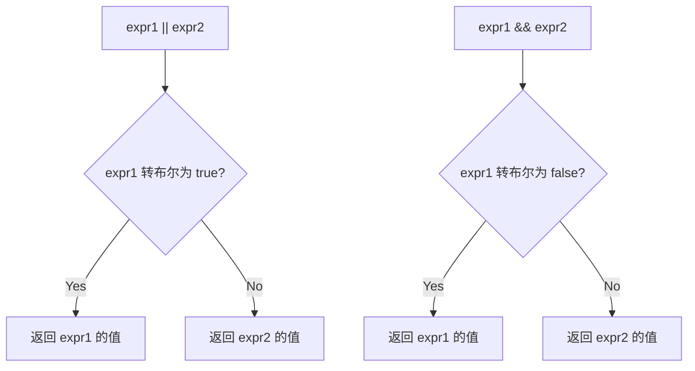

```javascript
0 || 'default'       // 'default'
'' || 'hello'        // 'hello'
'abc' && 123         // 123
null && 'anything'   // null
```

### 1️⃣5️⃣ Object.is() 与 == 和 === 的区别

| 比较方式 | 类型转换 | 特殊处理 |
|---------|---------|---------|
| `==` | **会**进行类型转换 | `null == undefined` → true |
| `===` | **不**进行类型转换 | 严格相等 |
| `Object.is()` | **不**进行类型转换 | 修复了 `===` 的两种特殊情况 |

```javascript
// 区别1: NaN 处理
NaN === NaN           // false
Object.is(NaN, NaN)   // true

// 区别2: +0 和 -0
+0 === -0             // true
Object.is(+0, -0)     // false
```

### 1️⃣6️⃣ 什么是 JavaScript 中的包装类型？

原始类型本身没有属性和方法，但 JavaScript 在访问原始类型的属性或方法时，会在后台隐式地将其转换为对应的**包装对象**。

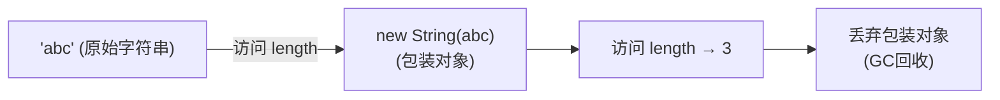

```javascript
const a = "abc";
a.length;         // 3 → 内部临时创建 String 包装对象
a.toUpperCase();  // "ABC"

// 显式创建包装对象
Object('abc')     // String {"abc"}
new Number(123)   // Number {123}

// 包装对象转回原始值
var b = Object('abc');
b.valueOf()       // 'abc'
```

**陷阱示例：**
```javascript
var a = new Boolean(false);
if (!a) {
  console.log("不会执行");  // a 是对象，对象永远是 truthy
}
```

### 1️⃣7️⃣ JavaScript 中如何进行隐式类型转换？

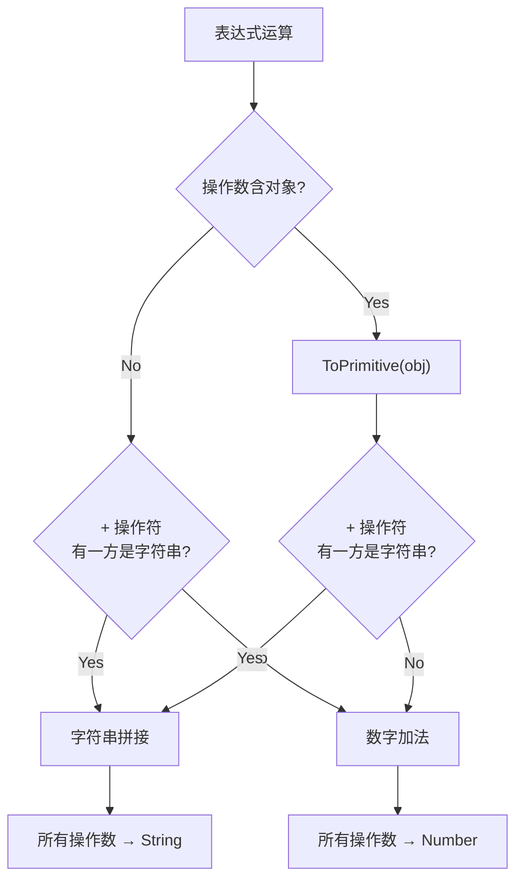

**+ 操作符规则：**
- 有一方是字符串 → 字符串拼接
- 否则 → 数字加法

```javascript
1 + '23'        // '123'
1 + false       // 1
'1' + false     // '1false'
false + true    // 1
```

**-、*、/ 操作符规则：**
- 所有操作数转数字

```javascript
1 * '23'        // 23
1 * false       // 0
1 / 'aa'        // NaN
```

**== 操作符规则：**
- 两边的值尽量转为 `number` 比较

```javascript
3 == true       // false (3 → 3, true → 1)
'0' == false    // true  ('0' → 0, false → 0)
'0' == 0        // true  ('0' → 0)
```

### 1️⃣8️⃣ + 操作符何时用于字符串拼接？

根据 ES5 规范，如果某个操作数是字符串或能通过 `ToPrimitive` 转换为字符串，则进行拼接。如果其中一个操作数是对象（包括数组），首先对其调用 `ToPrimitive(obj, number)`：

```javascript
var a = {name: 'Jack'}
var b = {age: 18}
a + b  // "[object Object][object Object]"

// 运算过程:
// a.valueOf() → {} (还是对象)
// a.toString() → "[object Object]"
// b.valueOf() → {}
// b.toString() → "[object Object]"
// 结果: "[object Object][object Object]"
```

### 1️⃣9️⃣ 为什么会有 BigInt 的提案？

`Number.MAX_SAFE_INTEGER = 9007199254740991`（2^53 - 1）

超过这个范围，JavaScript 的数字计算会出现精度丢失：

```javascript
9007199254740991 + 1  // 9007199254740992 (正确)
9007199254740991 + 2  // 9007199254740992 (错误，应该是 9007199254740993)
```

**BigInt 解决方案：**
```javascript
BigInt(9007199254740991) + 2n  // 9007199254740993n
```

### 2️⃣0️⃣ Object.assign 和扩展运算符：深拷贝还是浅拷贝？

**两者都是浅拷贝！**

```javascript
let outObj = {
  inObj: {a: 1, b: 2}
}

// 扩展运算符
let newObj1 = {...outObj}
newObj1.inObj.a = 2
console.log(outObj.inObj.a)  // 2 (被修改了！)

// Object.assign
let newObj2 = Object.assign({}, outObj)
newObj2.inObj.a = 2
console.log(outObj.inObj.a)  // 2 (也被修改了！)
```

**区别：**
- `Object.assign()`：第一个参数为目标对象，会触发 ES6 setter
- 扩展运算符 `...`：不复制继承的属性和类的属性，但复制 ES6 symbols 属性

### 2️⃣1️⃣ 如何判断一个对象是空对象？

```javascript
// 方法1: JSON 序列化
JSON.stringify(obj) === '{}'

// 方法2: Object.keys (推荐)
Object.keys(obj).length === 0

// 方法3: 遍历 for...in + hasOwnProperty
function isEmpty(obj) {
  for (let key in obj) {
    if (Object.prototype.hasOwnProperty.call(obj, key)) return false
  }
  return true
}

// 方法4: Object.getOwnPropertyNames
Object.getOwnPropertyNames(obj).length === 0
```

---

## 🔧 二、ES6

### 1️⃣ let、const、var 的区别

> 💡 **要点**：`var` 有变量提升，可重复声明，无块级作用域；`let`/`const` 有块级作用域和暂时性死区（TDZ），不可重复声明。`const` 声明时必须初始化，且不能改变指针指向（但可修改对象属性）。

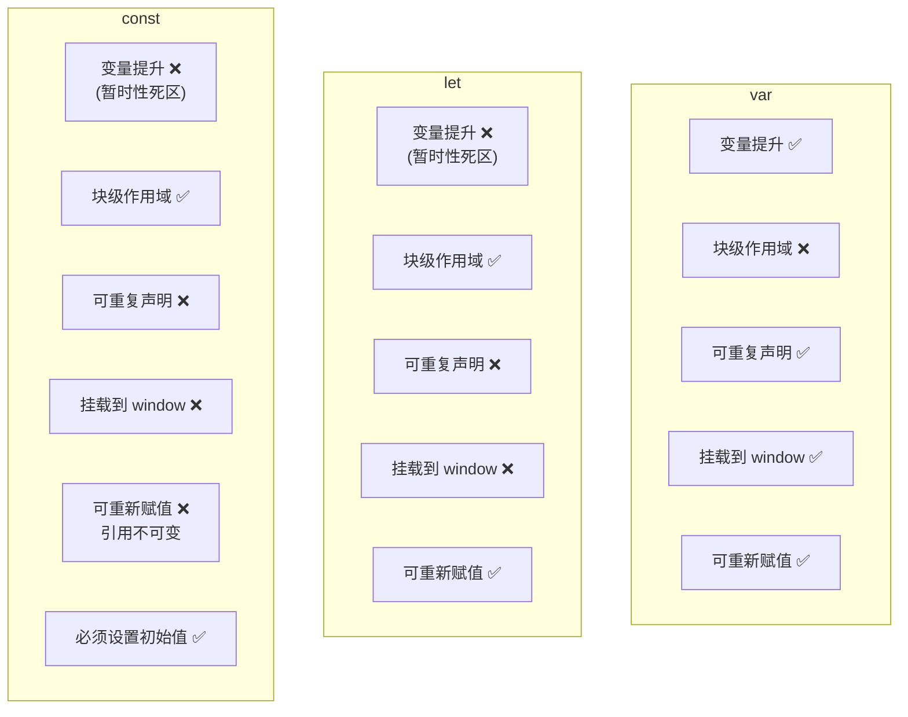

| 区别 | var | let | const |
|------|-----|-----|-------|
| 块级作用域 | ❌ | ✅ | ✅ |
| 变量提升 | ✅ | ❌（暂时性死区） | ❌（暂时性死区） |
| 挂载到全局对象 | ✅（window.varName） | ❌ | ❌ |
| 重复声明 | ✅（可覆盖） | ❌（报错） | ❌（报错） |
| 暂时性死区 | ❌ | ✅ | ✅ |
| 必须设置初始值 | ❌ | ❌ | ✅ |
| 改变指针指向 | ✅ | ✅ | ❌ |

**暂时性死区（Temporal Dead Zone, TDZ）：**
```javascript
console.log(a)  // undefined (var 提升)
var a = 1

console.log(b)  // ReferenceError! (TDZ)
let b = 2
```

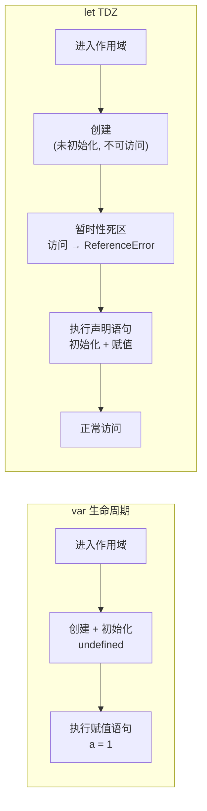

### 2️⃣ const 对象的属性可以修改吗？

**可以修改属性，但不能重新赋值。**

```javascript
const obj = { name: 'Tom' }
obj.name = 'Jerry'  // ✅ 属性修改允许
obj = {}            // ❌ TypeError: Assignment to constant variable

const arr = [1, 2, 3]
arr.push(4)         // ✅ 数组操作允许
arr = []            // ❌ TypeError
```

**原理：** `const` 保证的是变量指向的内存地址不能改变。对于原始类型，值就在栈内存中，所以值本身不可变。对于引用类型，栈中保存的是指针（堆地址），`const` 保证指针不变，但堆中的数据仍然可变。

### 3️⃣ 如果 new 一个箭头函数会怎么样？

**会报错：** `arrowFn is not a constructor`

箭头函数不能作为构造函数，因为：
1. 箭头函数没有 `prototype` 属性
2. 箭头函数没有自己的 `this`，不能绑定到新对象
3. 箭头函数不能使用 `arguments`

### 4️⃣ 箭头函数与普通函数的区别

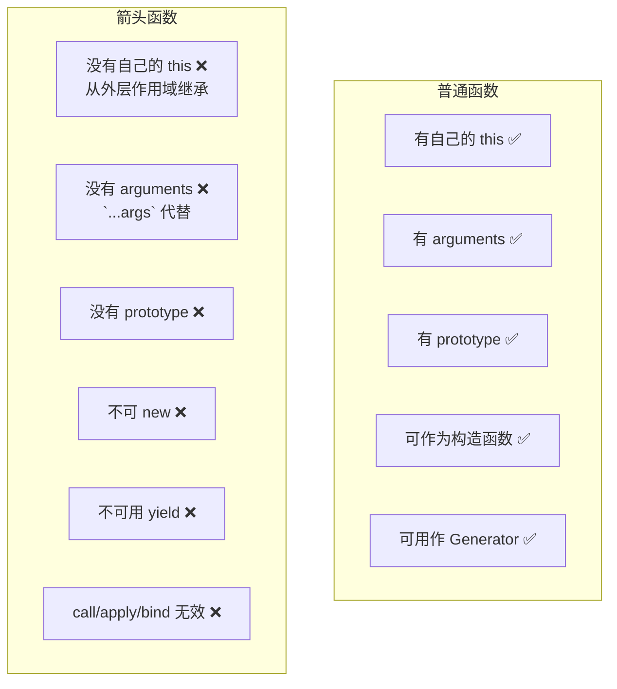

**（1）简洁语法：**
```javascript
// 无参数
const fn1 = () => {}
// 单参数，省略括号
const fn2 = x => x * 2
// 多参数
const fn3 = (a, b) => a + b
// 返回值是对象需要括号
const fn4 = () => ({ name: 'Tom' })
// 无返回值
const fn5 = () => void console.log('test')
```

**（2）没有自己的 this：**
```javascript
const obj = {
  id: 'OBJ',
  normal: function() { console.log(this.id) },  // this → obj
  arrow: () => { console.log(this.id) }          // this → 外层 (window/global)
}
obj.normal()  // 'OBJ'
obj.arrow()   // undefined (严格模式) 或 全局 id
```

**（3）this 不可改变：**
```javascript
const arrowFn = () => console.log(this)
arrowFn.call({id: 1})   // 还是指向外层 this
arrowFn.apply({id: 1})  // 还是指向外层 this
arrowFn.bind({id: 1})() // 还是指向外层 this
```

**（4）没有 arguments：**
```javascript
const normalFn = function() { console.log(arguments) }
normalFn(1, 2, 3)  // Arguments(3) [1, 2, 3]

const arrowFn = (...args) => console.log(args)  // 用 rest 参数替代
arrowFn(1, 2, 3)  // [1, 2, 3]
```

### 5️⃣ 箭头函数的 this 指向哪里？

箭头函数捕获其所在上下文的 `this` 值作为自己的 `this`，且不可改变。

**Babel 转译理解：**
```javascript
// ES6
const obj = {
  getArrow() {
    return () => console.log(this === obj)
  }
}

// ES5 (Babel 转译后)
var obj = {
  getArrow: function getArrow() {
    var _this = this  // → 捕获外层 this
    return function() {
      console.log(_this === obj)
    }
  }
}
```

### 6️⃣ 扩展运算符的作用及使用场景

#### 对象扩展运算符

```javascript
// 复制对象（浅拷贝）
let bar = { a: 1, b: 2 }
let baz = { ...bar }  // { a: 1, b: 2 }

// 等价于 Object.assign
let baz2 = Object.assign({}, bar)

// 覆盖属性
let merged = { ...bar, ...{a: 2, b: 4} }  // { a: 2, b: 4 }

// 修改对象的部分属性（Redux reducer 常用）
const newState = { ...state, user: { ...state.user, name: 'newName' } }
```

#### 数组扩展运算符

```javascript
// 参数序列
function add(x, y) { return x + y }
const numbers = [1, 2]
add(...numbers)  // 3

// 复制数组（浅拷贝）
const arr1 = [1, 2]
const arr2 = [...arr1]

// 合并数组
const merged = ['one', ...arr1, 'four']  // ['one', 1, 2, 'four']

// 解构赋值
const [first, ...rest] = [1, 2, 3, 4]  // first=1, rest=[2,3,4]

// 字符串转数组
[...'hello']  // ['h', 'e', 'l', 'l', 'o']

// 类数组转数组
function foo() {
  const args = [...arguments]
}
```

### 7️⃣ 对对象与数组的解构的理解

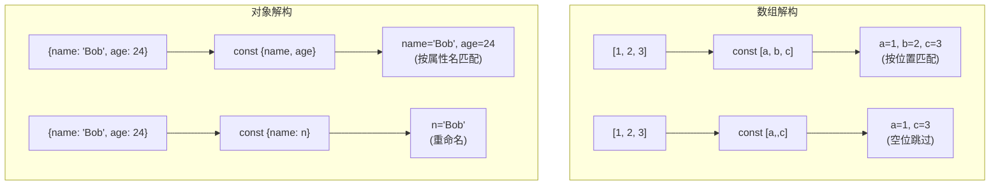

### 8️⃣ 提取高度嵌套的对象里的指定属性

```javascript
const school = {
  classes: {
    stu: {
      name: 'Bob',
      age: 24
    }
  }
}

// 方法1: 逐层解构
const { classes } = school
const { stu } = classes
const { name } = stu

// 方法2: 一行解构（推荐）
const { classes: { stu: { name } } } = school
console.log(name)  // 'Bob'

// 解构 + 重命名
const { classes: { stu: { name: studentName } } } = school
console.log(studentName)  // 'Bob'
```

### 9️⃣ 对 rest 参数的理解

Rest 参数将多个独立参数收集到一个数组中：

```javascript
// 收集剩余参数
function sum(...numbers) {
  return numbers.reduce((acc, cur) => acc + cur, 0)
}
sum(1, 2, 3, 4)  // 10

// 与解构结合
const [first, second, ...rest] = [1, 2, 3, 4, 5]
// first=1, second=2, rest=[3,4,5]

// 注意: rest 参数必须在最后
// const [...rest, last] = [1,2,3]  ❌ 语法错误
```

### 1️⃣0️⃣ ES6 中模板语法与字符串处理

**模板字符串特性：**
1. `${}` 嵌入变量/表达式
2. 保留空格、缩进、换行
3. 支持运算表达式

```javascript
const name = 'css'
const career = 'coder'
const html = `
  <div>
    <h1>${name}</h1>
    <p>${career}</p>
    <p>${1 + 2}</p>
  </div>
`
```

**新增字符串方法：**

| 方法 | 作用 | 示例 |
|------|------|------|
| `includes()` | 是否包含子串 | `'hello'.includes('ell')` → true |
| `startsWith()` | 是否以某串开头 | `'hello'.startsWith('he')` → true |
| `endsWith()` | 是否以某串结尾 | `'hello'.endsWith('lo')` → true |
| `repeat()` | 重复字符串 | `'ab'.repeat(3)` → `'ababab'` |

---

