---
title: JavaScript 基础
---
## 🧱 三、JavaScript 基础

### 1️⃣ new 操作符的实现原理

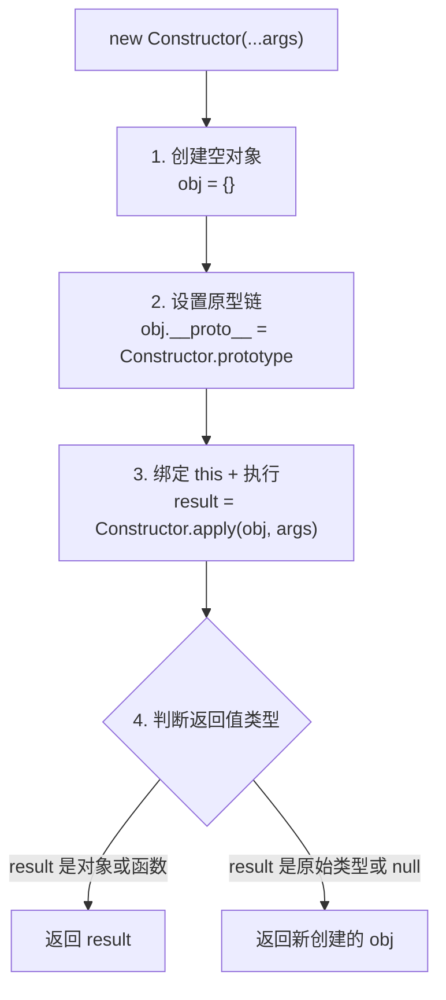

**手动实现：**

```javascript
function objectFactory() {
  let newObject = null
  let constructor = Array.prototype.shift.call(arguments)
  let result = null

  if (typeof constructor !== "function") {
    console.error("type error")
    return
  }

  // 1+2: 创建空对象并链接原型
  newObject = Object.create(constructor.prototype)

  // 3: 绑定 this 并执行
  result = constructor.apply(newObject, arguments)

  // 4: 判断返回类型
  let flag = result && (typeof result === "object" || typeof result === "function")
  return flag ? result : newObject
}
```

### 2️⃣ Map 和 Object 的区别

| 特性 | Map | Object |
|------|-----|--------|
| 键的类型 | 任意类型（包括对象、函数） | String 或 Symbol |
| 键的顺序 | 按插入顺序有序 | 无序（ES6 后部分有序） |
| size | `map.size` 直接获取 | 需手动计算 `Object.keys().length` |
| 迭代 | 原生可迭代（`for...of`） | 需先获取 keys |
| 性能 | 频繁增删改查更优 | 未针对此场景优化 |
| 原型继承 | 无默认键 | 有原型链，可能产生冲突 |

### 3️⃣ Map 和 WeakMap 的区别

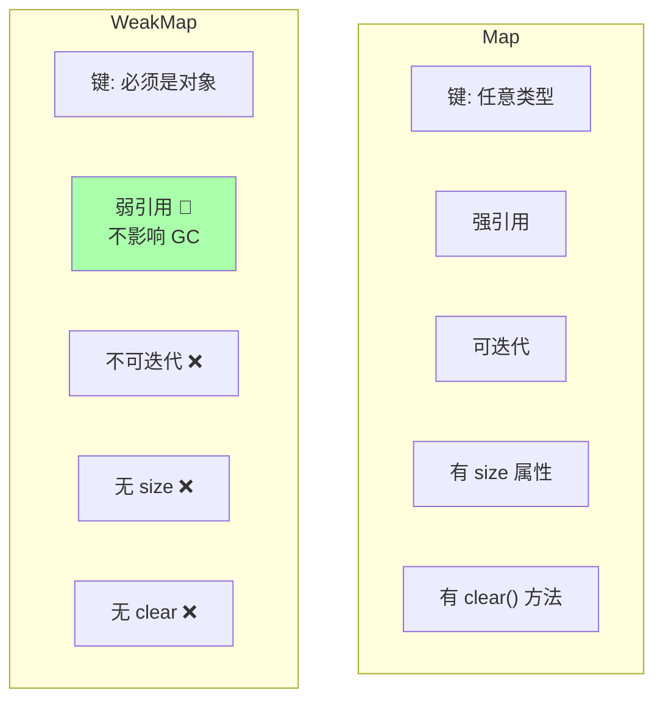

**WeakMap 弱引用机制：**
```javascript
let obj = { name: 'Tom' }
const wm = new WeakMap()
wm.set(obj, 'some data')

obj = null  // 引用被删除
// WeakMap 中的键名对象会被 GC 自动回收，无需手动删除
```

**应用场景：**
- 存储 DOM 元素的私有数据
- 缓存数据（对象不再被使用时自动释放）
- 防止内存泄漏

### 4️⃣ JavaScript 有哪些内置对象

**分类总结：**

| 分类 | 示例 |
|------|------|
| 值属性 | `Infinity`、`NaN`、`undefined`、`null` |
| 函数属性 | `eval()`、`parseInt()`、`parseFloat()`、`isNaN()` |
| 基本对象 | `Object`、`Function`、`Boolean`、`Symbol`、`Error` |
| 数字日期 | `Number`、`Math`、`Date` |
| 字符串 | `String`、`RegExp` |
| 可索引集合 | `Array`、`Int8Array`、`Uint8Array` 等 |
| 键值集合 | `Map`、`Set`、`WeakMap`、`WeakSet` |
| 结构化数据 | `JSON`、`ArrayBuffer`、`DataView` |
| 控制抽象 | `Promise`、`Generator`、`Iterator` |
| 反射 | `Reflect`、`Proxy` |
| 国际化 | `Intl`、`Intl.Collator` |

### 5️⃣ 常用的正则表达式

```javascript
// 16进制颜色
/#([0-9a-fA-F]{6}|[0-9a-fA-F]{3})/g

// 日期 yyyy-mm-dd
/^[0-9]{4}-(0[1-9]|1[0-2])-(0[1-9]|[12][0-9]|3[01])$/

// QQ号
/^[1-9][0-9]{4,10}$/g

// 手机号
/^1[34578]\d{9}$/g

// 用户名（字母开头，4-16位字母数字下划线）
/^[a-zA-Z\$][a-zA-Z0-9_\$]{4,16}$/
```

### 6️⃣ 对 JSON 的理解

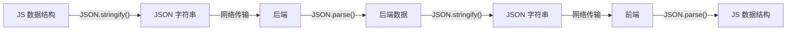

**JSON 与 JS 对象的区别：**
- JSON 属性值不能为函数
- JSON 属性名必须用双引号
- JSON 中不能出现 `undefined`、`NaN`
- JSON 中不能有注释

**JSON.stringify 的特殊处理：**
```javascript
JSON.stringify({a: undefined, b: function(){}, c: Symbol()})
// '{}'  // 忽略 undefined、函数、Symbol

JSON.stringify({a: /abc/})
// '{"a":{}}'  // RegExp 转空对象

JSON.stringify({a: NaN, b: Infinity, c: -Infinity})
// '{"a":null,"b":null,"c":null}'  // 特殊数字转 null
```

### 7️⃣ JavaScript 脚本延迟加载的方式

| 方式 | 说明 |
|------|------|
| `defer` 属性 | 与文档解析同步加载，文档解析完后按顺序执行 |
| `async` 属性 | 异步加载，加载完成后立即执行（顺序不可预测） |
| 动态创建 DOM | `document.createElement('script')`，文档加载完后插入 |
| `setTimeout` | 设置定时器延迟加载 |
| 放在底部 | `</body>` 前放置 script 标签 |

```html
<!-- defer: 解析完 HTML 后执行，多个 defer 按顺序 -->
<script defer src="script.js"></script>

<!-- async: 加载完立即执行，不保证顺序 -->
<script async src="script.js"></script>
```

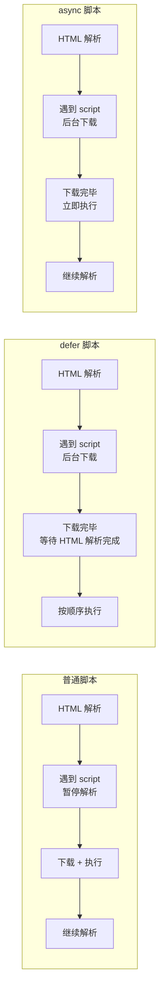

### 8️⃣ 类数组对象的定义与转换

**类数组对象：** 拥有 `length` 属性和数字索引的对象。

```javascript
// 常见类数组
arguments         // 函数的参数对象
document.querySelectorAll('div')  // NodeList
document.forms    // HTMLCollection
```

**转换为数组的四种方法：**

```javascript
// 1. Array.prototype.slice.call
Array.prototype.slice.call(arrayLike)

// 2. Array.prototype.splice.call
Array.prototype.splice.call(arrayLike, 0)

// 3. Array.prototype.concat.apply
Array.prototype.concat.apply([], arrayLike)

// 4. Array.from (ES6 推荐)
Array.from(arrayLike)

// 5. 扩展运算符（需可迭代）
;[...arrayLike]
```

### 9️⃣ 数组有哪些原生方法？

| 类别 | 方法 | 影响原数组 | 描述 |
|------|------|-----------|------|
| 转换 | `toString()`、`join()` | ❌ | 数组转字符串 |
| 尾部操作 | `push()`、`pop()` | ✅ | 尾部增删 |
| 首部操作 | `shift()`、`unshift()` | ✅ | 首部增删 |
| 排序 | `reverse()`、`sort()` | ✅ | 排序/反转 |
| 连接 | `concat()` | ❌ | 合并数组 |
| 截取 | `slice()` | ❌ | 返回子数组 |
| 增删改 | `splice()` | ✅ | 全能操作 |
| 查找 | `indexOf()`、`lastIndexOf()`、`includes()` | ❌ | 查找元素 |
| 迭代 | `forEach()`、`map()`、`filter()`、`some()`、`every()` | ❌ | 遍历处理 |
| 归并 | `reduce()`、`reduceRight()` | ❌ | 累计计算 |
| 扁平 | `flat()`、`flatMap()` | ❌ | 数组扁平化 |
| 填充 | `fill()`、`copyWithin()` | ✅ | 批量填充 |

### 1️⃣0️⃣ Unicode、UTF-8、UTF-16、UTF-32 的区别

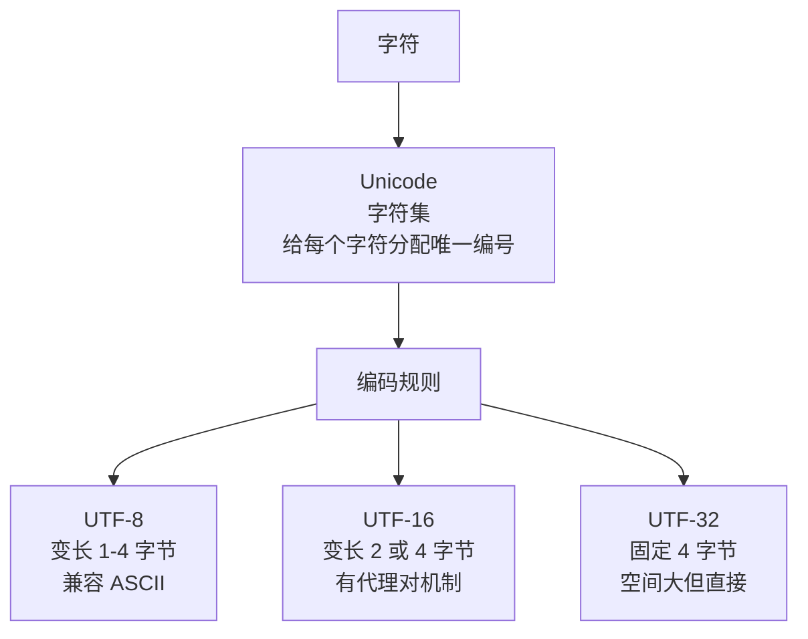

| 特性 | Unicode | UTF-8 | UTF-16 | UTF-32 |
|------|---------|-------|--------|--------|
| 类型 | 字符集 | 编码规则 | 编码规则 | 编码规则 |
| 字节长度 | - | 1-4 可变 | 2 或 4 | 固定 4 |
| 兼容 ASCII | - | ✅ | ❌ | ❌ |
| 中文占用 | - | 3 字节 | 2 字节 | 4 字节 |
| 容错性 | - | 差（错一个影响后续） | 好（只错一个字符） | 好 |

**Unicode 平面概念：**
- **基本平面（BMP）：** U+0000 ~ U+FFFF，65536 个码位
- **辅助平面（SMP）：** U+10000 ~ U+10FFFF，16 个平面

**UTF-16 代理对机制：**
```javascript
// "𡠀" 字 U+21800，超出 BMP
// 计算: 0x21800 - 0x10000 = 0x11800
// 二进制: 0001000110 0000000000
// 高位 (U+D800 + 前10位) → 0xD846
// 低位 (U+DC00 + 后10位) → 0xDC00
// UTF-16 编码: 0xD846 0xDC00
```

### 1️⃣1️⃣ 位运算符

| 运算符 | 名称 | 规则 |
|--------|------|------|
| `&` | 按位与 | 两个位都为1 → 1 |
| `|` | 按位或 | 两个位都为0 → 0 |
| `^` | 按位异或 | 相同为0，相异为1 |
| `~` | 按位取反 | 0变1，1变0 |
| `<<` | 左移 | 高位丢弃，低位补0，相当于乘 2^n |
| `>>` | 右移 | 正数左补0，负数左补1，相当于除 2^n |

### 1️⃣2️⃣ 为什么 arguments 是类数组而不是数组？

`arguments` 是一个对象，有 `length` 和数字索引属性，但**没有继承 `Array.prototype`**，所以不能调用 `push`、`forEach` 等数组方法。它是为了性能考虑而设计的特殊对象。

### 1️⃣3️⃣ 什么是 DOM 和 BOM？

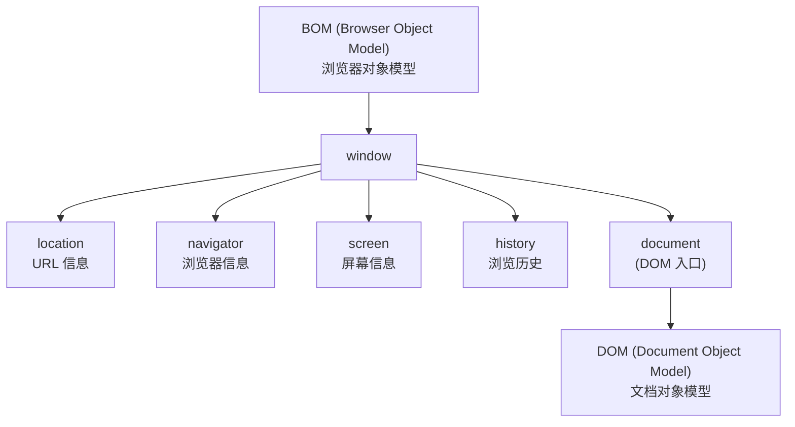

**DOM：** 文档对象模型，定义了访问和操作 HTML 文档的 API（`getElementById`、`createElement`、`appendChild` 等）。

**BOM：** 浏览器对象模型，提供了与浏览器交互的 API（`alert`、`setTimeout`、`location`、`navigator` 等）。

### 1️⃣4️⃣ escape、encodeURI、encodeURIComponent 的区别

```javascript
const url = "https://example.com/测试 page?name=张三&age=20"

encodeURI(url)
// "https://example.com/%E6%B5%8B%E8%AF%95%20page?name=%E5%BC%A0%E4%B8%89&age=20"
// 保留 URI 结构字符 (:/?#[]@!$&'()*+,;=-._~)

encodeURIComponent("测试 page?name=张三")
// "%E6%B5%8B%E8%AF%95%20page%3Fname%3D%E5%BC%A0%E4%B8%89"
// 编码所有非字母数字字符，包括 ?=& 等
```

| 函数 | 用途 | 编码范围 |
|------|------|---------|
| `encodeURI` | 编码整个 URL | 不编码 URI 保留字符 |
| `encodeURIComponent` | 编码 URL 参数值 | 编码所有特殊字符 |
| `escape`（已弃用） | 编码字符串 | 对非 ASCII 字符编码为 `%uXXXX` |

### 1️⃣5️⃣ 对 AJAX 的理解

**AJAX（Asynchronous JavaScript And XML）：** 在不重新加载整个页面的情况下，与服务器交换数据并更新部分网页。

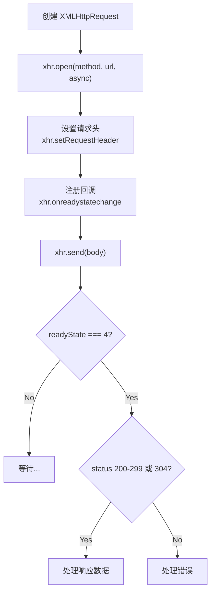

```javascript
// Promise 封装 AJAX
function getJSON(url) {
  return new Promise(function(resolve, reject) {
    let xhr = new XMLHttpRequest()
    xhr.open("GET", url, true)
    xhr.onreadystatechange = function() {
      if (this.readyState !== 4) return
      if (this.status === 200) {
        resolve(this.response)
      } else {
        reject(new Error(this.statusText))
      }
    }
    xhr.onerror = function() {
      reject(new Error(this.statusText))
    }
    xhr.responseType = "json"
    xhr.setRequestHeader("Accept", "application/json")
    xhr.send(null)
  })
}
```

### 1️⃣6️⃣ 变量提升的原因与问题

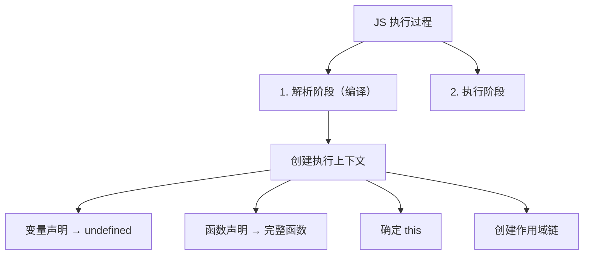

**变量提升的好处：**
1. **提高性能：** 预编译时一次解析变量和函数声明，分配栈空间，避免每次执行重复解析
2. **容错性更好：** 即使先使用后声明也能正常执行

**变量提升的问题：**
```javascript
// 问题1: 内层变量覆盖外层
var tmp = new Date();
function fn() {
  console.log(tmp);   // undefined (不是外部 Date)
  if (false) {
    var tmp = 'hello';  // 提升到函数顶部
  }
}

// 问题2: 循环变量泄露为全局
for (var i = 0; i < 10; i++) { }
console.log(i)  // 10 (i 变成全局变量)
```

**ES6 的 `let`/`const` 通过块级作用域解决了这些问题。**

### 1️⃣7️⃣ 什么是尾调用？

**尾调用（Tail Call）：** 函数的最后一步是调用另一个函数。

```javascript
// 尾调用 ✅
function f(x) {
  return g(x)
}

// 不是尾调用 ❌
function f(x) {
  return g(x) + 1  // 还有加操作
}

function f(x) {
  g(x)  // 隐式返回 undefined，不是函数最后一步的调用
}
```

**尾调用优化：** 由于是最后一步，当前函数的执行上下文不需要保留，可以直接复用，从而节省内存。ES6 的尾调用优化只在**严格模式**下开启。

```mermaid
graph TD
    subgraph 无尾调用优化
        A["调用 f()"] --> B["push f 上下文"]
        B --> C["f 调用 g()"]
        C --> D["push g 上下文"]
        D --> E["g 执行完毕"]
        E --> F["pop g 上下文"]
        F --> G["f 执行完毕"]
        G --> H["pop f 上下文"]
    end

    subgraph 尾调用优化
        A2["调用 f()"] --> B2["push f 上下文"]
        B2 --> C2["f 最后一步调用 g()"]
        C2 --> D2["pop f 上下文<br/>(无需保留)"]
        D2 --> E2["push g 上下文"]
        E2 --> F2["g 执行完毕"]
        F2 --> G2["pop g 上下文"]
    end
```

### 1️⃣8️⃣ ES6 模块与 CommonJS 模块的异同

| 对比维度 | ES6 Module | CommonJS |
|---------|-----------|----------|
| 输出方式 | 值的引用（只读） | 值的拷贝 |
| 加载方式 | 编译时加载（静态） | 运行时加载（动态） |
| 是否可修改导入值 | ❌（只读引用） | ✅（可以重新赋值） |
| 语法 | `import` / `export` | `require()` / `module.exports` |
| 树摇（Tree Shaking） | ✅ 支持 | ❌ 不支持 |

```javascript
// CommonJS — 值的拷贝
let count = 0
module.exports = { count, increment: () => count++ }
// 导入的是 count 的拷贝，导出后再变化不影响已导入的值

// ES6 Module — 值的引用
export let count = 0
export const increment = () => count++
// 导入的是对 count 的引用，始终同步
```

### 1️⃣9️⃣ 常见的 DOM 操作

```javascript
// 获取节点
document.getElementById('id')
document.getElementsByTagName('div')
document.getElementsByClassName('cls')
document.querySelector('.cls')
document.querySelectorAll('div.cls')

// 创建节点
const div = document.createElement('div')
const text = document.createTextNode('hello')
const fragment = document.createDocumentFragment()

// 插入节点
parent.appendChild(child)
parent.insertBefore(newNode, referenceNode)

// 删除节点
parent.removeChild(child)
child.remove()  // DOM Living Standard

// 修改节点
element.innerHTML = '<span>new</span>'
element.textContent = 'new text'
element.setAttribute('class', 'newClass')
element.style.color = 'red'

// 遍历节点
element.parentNode
element.childNodes
element.children
element.nextSibling
element.previousSibling
```

### 2️⃣0️⃣ use strict 是什么？

**严格模式（Strict Mode）** 是 ES5 引入的一种更严格的运行模式。

```javascript
"use strict";  // 全局或函数级开启

// 主要区别：
// 1. 禁止 with 语句
with (obj) { x = 1 }  // SyntaxError

// 2. 禁止 this 指向全局
function test() { console.log(this) }
test()  // undefined (非严格模式为 window)

// 3. 禁止重复参数名
function test(a, a) { }  // SyntaxError

// 4. 禁止删除不可删除属性
delete Object.prototype  // TypeError

// 5. 禁止八进制字面量
var x = 010  // SyntaxError

// 6. 必须声明变量
x = 1  // ReferenceError
```

### 2️⃣1️⃣ 如何判断对象属于某个类？

```javascript
// 1. instanceof（检查原型链）
obj instanceof Constructor

// 2. constructor（可能被改写）
obj.constructor === Constructor

// 3. Object.prototype.toString（最可靠）
Object.prototype.toString.call(obj)  // 如 [object Array]

// 4. isPrototypeOf
Constructor.prototype.isPrototypeOf(obj)
```

### 2️⃣2️⃣ 强类型 vs 弱类型语言

| 特性 | 强类型（Java/C++） | 弱类型（JavaScript） |
|------|-------------------|-------------------|
| 类型约束 | 变量类型固定，需强制转换 | 变量类型可隐式转换 |
| 示例 | `int a = "1"` ❌ | `var a = "1"` ✅ |
| 严谨性 | 高，编译期错误少 | 低，运行时易出错 |
| 灵活性 | 低 | 高 |

### 2️⃣3️⃣ 解释型 vs 编译型语言

| 特性 | 编译型（C/C++/Go） | 解释型（JavaScript/Python） |
|------|-------------------|--------------------------|
| 执行时机 | 执行前编译成机器码 | 运行时逐行解释 |
| 执行效率 | 高 | 低 |
| 跨平台 | 差（需重新编译） | 好（平台提供解释器） |
| 开发速度 | 慢（需编译） | 快（即时运行） |

JavaScript 是**解释型语言**，但现代 JavaScript 引擎（V8）使用 **JIT（Just-In-Time）编译**技术，将热点代码编译为机器码，大幅提升性能。

### 2️⃣4️⃣ for...in 和 for...of 的区别

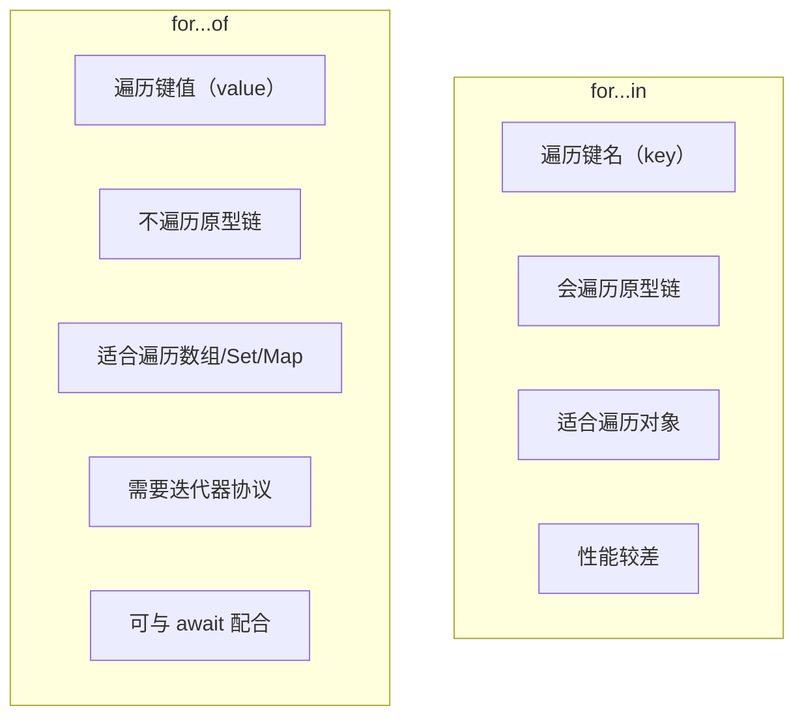

```javascript
const arr = ['a', 'b', 'c']
Array.prototype.customProp = 'prototype'

for (const key in arr) {
  console.log(key)  // '0', '1', '2', 'customProp' (原型链上的也遍历了)
}

for (const val of arr) {
  console.log(val)  // 'a', 'b', 'c' (只遍历自身元素)
}
```

### 2️⃣5️⃣ 使用 for...of 遍历对象

默认对象不可迭代，需要手动添加 `[Symbol.iterator]`：

```javascript
// 方法1: 手动实现迭代器
const obj = { a: 1, b: 2, c: 3 }
obj[Symbol.iterator] = function() {
  const keys = Object.keys(this)
  let count = 0
  return {
    next: () => {
      if (count < keys.length) {
        return { value: this[keys[count++]], done: false }
      }
      return { value: undefined, done: true }
    }
  }
}

// 方法2: 使用 Generator
obj[Symbol.iterator] = function*() {
  const keys = Object.keys(this)
  for (const k of keys) {
    yield [k, this[k]]
  }
}
```

### 2️⃣6️⃣ ajax、axios、fetch 的区别

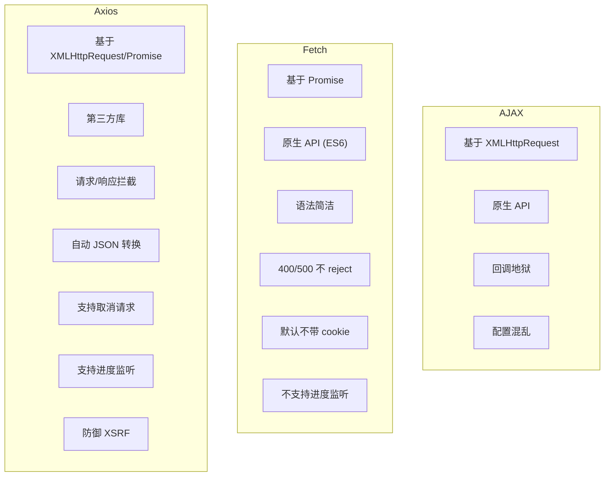

### 2️⃣7️⃣ 数组遍历方法对比

| 方法 | 返回值 | 是否改变原数组 | 特点 |
|------|-------|--------------|------|
| `forEach()` | undefined | ❌ | 最基础遍历 |
| `map()` | 新数组 | ❌ | 映射转换 |
| `filter()` | 新数组 | ❌ | 过滤筛选 |
| `some()` | boolean | ❌ | 有一个满足即 true |
| `every()` | boolean | ❌ | 全部满足才 true |
| `find()` | 元素值 | ❌ | 返回第一个满足的元素 |
| `findIndex()` | 索引 | ❌ | 返回第一个满足的索引 |
| `reduce()` | 累计值 | ❌ | 归并计算 |
| `reduceRight()` | 累计值 | ❌ | 从右向左归并 |
| `flat()` | 新数组 | ❌ | 扁平化 |
| `flatMap()` | 新数组 | ❌ | map + flat |

### 2️⃣8️⃣ forEach 和 map 的区别

| 对比 | forEach | map |
|------|---------|-----|
| 返回值 | undefined | 新数组 |
| 原始数组 | 可能被操作改变 | 不变 |
| 链式调用 | ❌ | ✅ |
| 用途 | 执行副作用 | 数据转换 |

### 29. addEventListener() 的使用

```javascript
target.addEventListener(type, listener, options)
target.addEventListener(type, listener, useCapture)
```

**options 参数：**
```javascript
{
  capture: false,    // 是否在捕获阶段触发
  once: false,       // 是否只触发一次后自动移除
  passive: true,    // 声明不调用 preventDefault，浏览器可优化滚动性能
  signal: null       // AbortSignal，用于移除监听器
}
```

**事件流三阶段：**

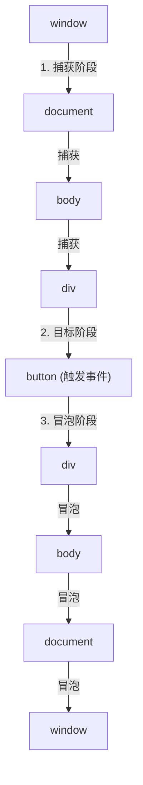

---

