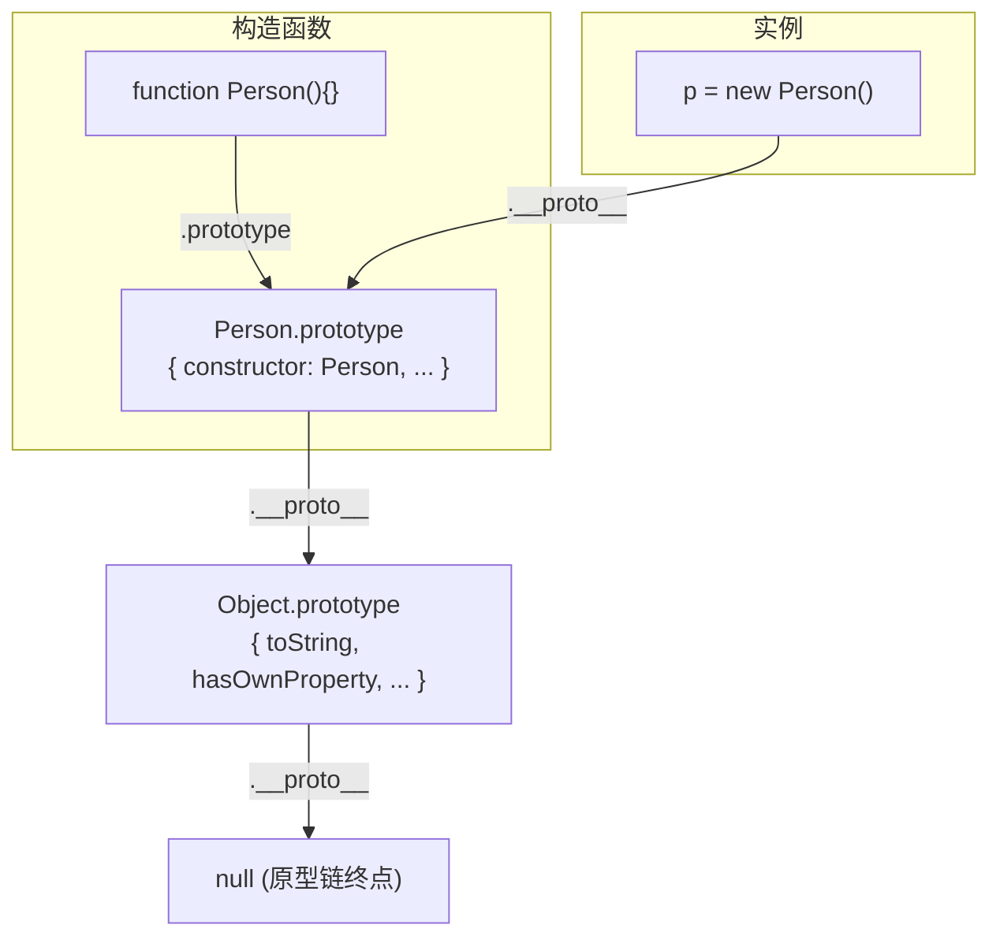
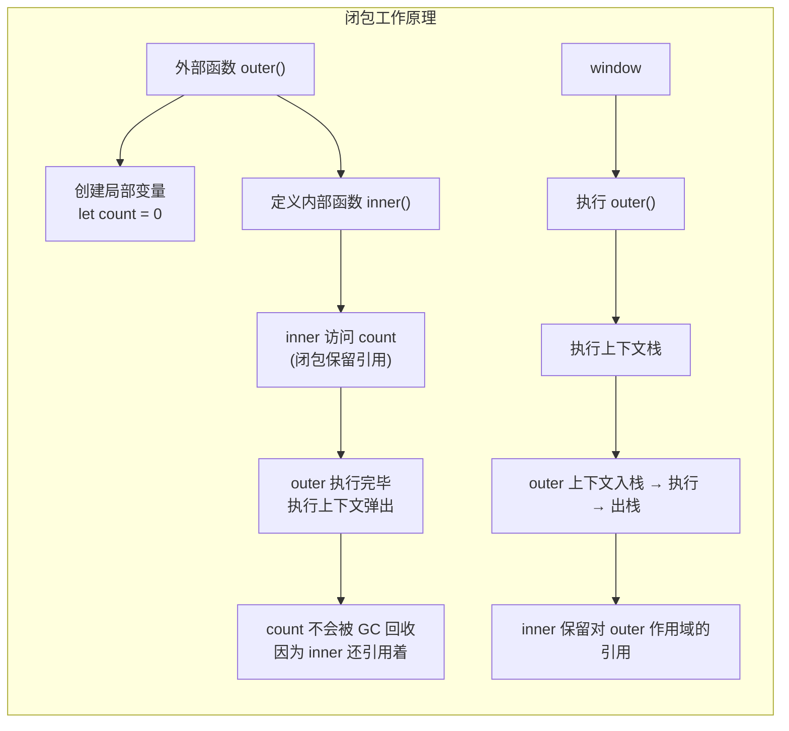
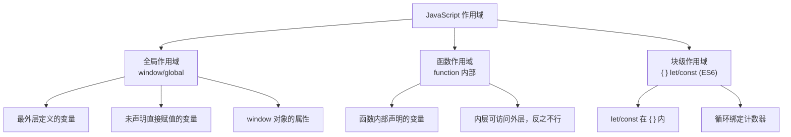
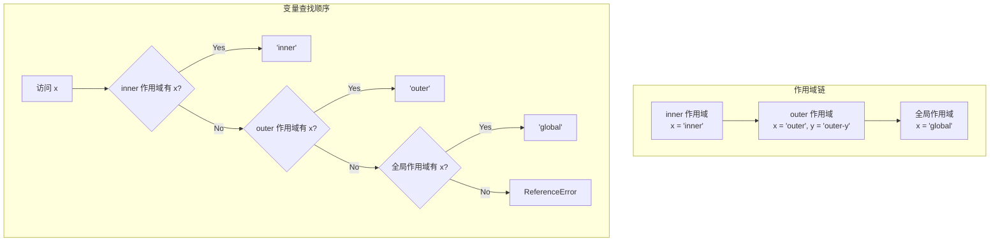
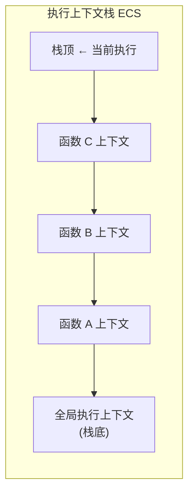
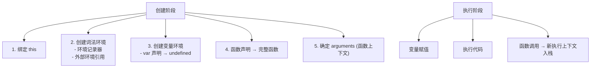

---
title: 原型、作用域与 this
---
## 🔗 四、原型与原型链

### 1️⃣ 对原型、原型链的理解

> 💡 **要点**：每个函数有 `prototype`（显式原型），每个对象有 `__proto__`（隐式原型）。访问属性时沿 `__proto__` 链向上查找直到 `null`。原型链终点是 `Object.prototype.__proto__` → `null`。



**核心概念：**
1. 每个**构造函数**都有一个 `prototype` 属性，指向原型对象
2. 每个**对象**都有一个 `__proto__` 属性（也称隐式原型），指向其构造函数的 `prototype`
3. 访问对象的属性时，若自身不存在则沿着 `__proto__` 链向上查找，直到找到或到达 `null`
4. 原型链终点是 `Object.prototype.__proto__` → `null`

**特点：** JavaScript 对象通过引用传递，修改原型会影响所有相关对象。

### 2️⃣ 原型修改与重写

```javascript
function Person(name) {
  this.name = name
}

// 修改原型（添加属性/方法）
Person.prototype.getName = function() { return this.name }
var p1 = new Person('hello')
console.log(p1.__proto__ === Person.prototype)                 // true
console.log(p1.__proto__ === p1.constructor.prototype)         // true

// 重写原型（整个替换）
Person.prototype = {
  getName: function() { return this.name }
}
var p2 = new Person('hello')
console.log(p2.__proto__ === Person.prototype)                 // true
console.log(p2.__proto__ === p2.constructor.prototype)         // false!
// 原因是 Person.prototype = {} 切断了 constructor 引用
```

**修复 constructor 引用：**
```javascript
Person.prototype = {
  constructor: Person,  // 手动指回
  getName: function() { return this.name }
}
```

### 3️⃣ 原型链指向

```javascript
p.__proto__                                   // Person.prototype
Person.prototype.__proto__                    // Object.prototype
p.__proto__.__proto__                         // Object.prototype
p.__proto__.constructor.prototype.__proto__    // Object.prototype
Person.prototype.constructor                  // Person
Person.prototype.constructor.prototype        // Person.prototype
```

### 4️⃣ 原型链的终点是什么？

**原型链的终点是 `null`。**

```javascript
Object.prototype.__proto__  // null
```

因为 `Object.prototype` 是原型链的顶端，它的原型是 `null`，没有任何属性和方法。

### 5️⃣ 如何获得对象非原型链上的属性？

使用 `hasOwnProperty()` 方法判断属性是否是对象自身的（而不是原型链上的）：

```javascript
function iterate(obj) {
  var res = []
  for (var key in obj) {
    if (obj.hasOwnProperty(key)) {
      res.push(key + ': ' + obj[key])
    }
  }
  return res
}
```

**`in` 操作符 vs `hasOwnProperty`：**
- `'key' in obj`：检查自身和原型链上的所有属性
- `obj.hasOwnProperty('key')`：只检查自身属性

---

## 🎯 五、执行上下文 / 作用域链 / 闭包

### 1️⃣ 对闭包的理解

> 💡 **要点**：闭包是指内部函数可以访问外部函数作用域中变量的能力。即使外部函数执行完毕，其变量对象仍被内部函数引用而无法被 GC 回收。

**闭包（Closure）：** 一个函数内定义了另一个函数，内部函数可以访问外部函数作用域中的变量。



**闭包的用途：**

1. **创建私有变量：**
```javascript
function createCounter() {
  let count = 0
  return {
    increment: () => ++count,
    decrement: () => --count,
    getCount: () => count
  }
}
const counter = createCounter()
counter.increment()  // 1
counter.increment()  // 2
counter.getCount()   // 2
```

2. **函数柯里化：**
```javascript
function multiply(a) {
  return function(b) {
    return a * b
  }
}
const double = multiply(2)
double(5)  // 10
```

3. **经典面试题——循环中的闭包：**
```javascript
// 问题：输出 6 个 6
for (var i = 1; i <= 5; i++) {
  setTimeout(function timer() {
    console.log(i)
  }, i * 1000)
}

// 解决方案1：IIFE 闭包
for (var i = 1; i <= 5; i++) {
  (function(j) {
    setTimeout(function timer() {
      console.log(j)
    }, j * 1000)
  })(i)
}

// 解决方案2：setTimeout 第三个参数
for (var i = 1; i <= 5; i++) {
  setTimeout(function timer(j) {
    console.log(j)
  }, i * 1000, i)
}

// 解决方案3：let 块级作用域（推荐）
for (let i = 1; i <= 5; i++) {
  setTimeout(function timer() {
    console.log(i)
  }, i * 1000)
}
```

> ⚠️ **注意**：不合理使用闭包会导致内存泄漏，因为被引用的外部变量无法被 GC 回收。使用闭包时要注意及时释放不再需要的引用（如将变量置为 `null`）。

### 2️⃣ 对作用域与作用域链的理解

**作用域（Scope）的类型：**



**作用域链（Scope Chain）：**

```javascript
const x = 'global'

function outer() {
  const x = 'outer'
  const y = 'outer-y'

  function inner() {
    const x = 'inner'
    console.log(x)  // 'inner' (自己的 x)
    console.log(y)  // 'outer-y' (从 outer 作用域查找)
  }

  console.log(x)  // 'outer' (自己的 x)
  inner()
}

outer()
```



**作用域链的实质：** 一个指向变量对象的指针列表。前端始终是当前执行上下文的变量对象，末端是全局执行上下文的变量对象。

### 3️⃣ 对执行上下文的理解

**执行上下文类型：**



**创建执行上下文的两个阶段：**



**全局执行上下文：**
- 任何不在函数内部的代码
- 创建全局 `window` 对象
- `this` 指向全局对象
- 程序中只有一个全局执行上下文

**函数执行上下文：**
- 每次函数调用时创建
- 可以有任意多个
- 比全局上下文多 `this`、`arguments` 和函数参数

---

