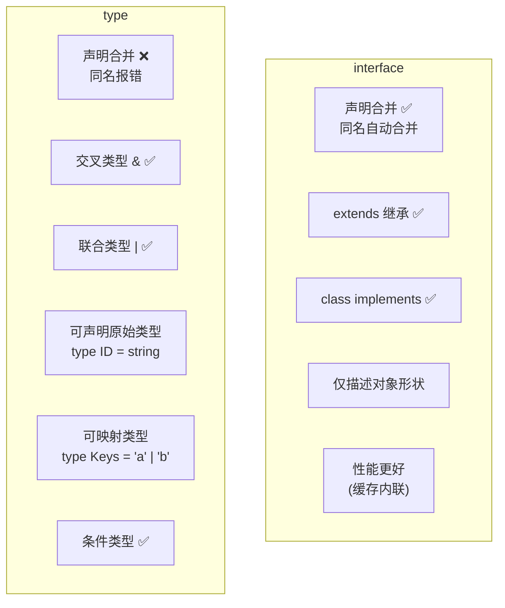
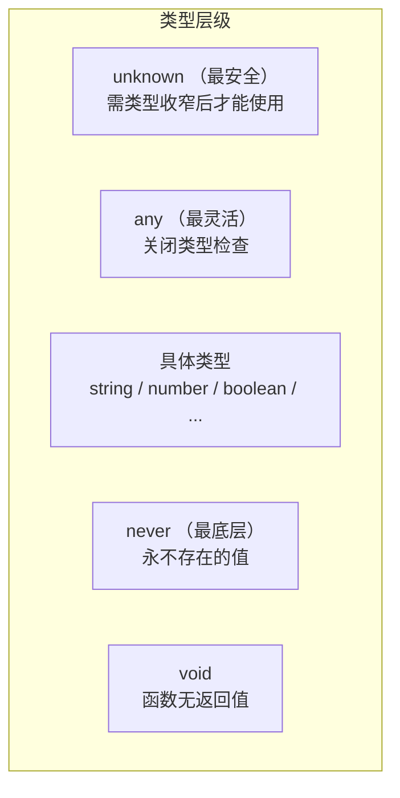
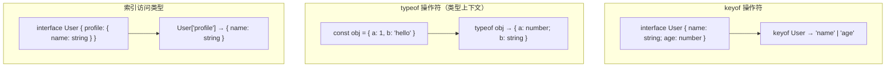
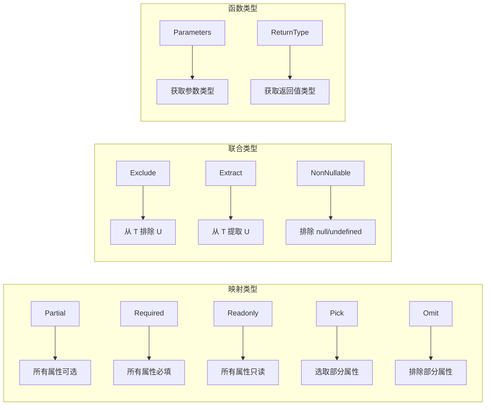

---
title: TypeScript 高频题
---
## 📘 十二、TypeScript 高频面试题

> 🎯 **面试星级**：★★★★★ | 几乎每场前端面试必问
> TypeScript 已成为前端开发标配，以下为最高频的面试考点

### 1️⃣ TypeScript 和 JavaScript 的区别

| 对比维度 | JavaScript | TypeScript |
|---------|-----------|------------|
| 类型系统 | 动态类型，运行时确定 | 静态类型，编译时检查 |
| 编译 | 解释执行（JIT） | 编译为 JS 后执行 |
| 错误发现 | 运行时才能发现类型错误 | 编码阶段即可发现 |
| 面向对象 | ES6 class，较弱 | 完整的 OOP 支持（接口、泛型、抽象类） |
| 工具链 | 基础语法提示 | 更丰富的 IDE 智能提示和重构 |
| 文件后缀 | `.js` / `.mjs` | `.ts` / `.tsx` |
| 学习成本 | 低 | 较高（需学习类型系统） |
| 适用场景 | 小型项目、原型验证 | 中大型项目、团队协作 |

```javascript
// JavaScript：运行时才发现问题
function add(a, b) {
  return a + b;
}
add(1, '2');  // '12'（不是期望的结果）

// TypeScript：编译期报错
function add(a: number, b: number): number {
  return a + b;
}
add(1, '2');  // ❌ 类型错误：string 不能赋值给 number
```

### 2️⃣ interface 和 type 的区别



| 特性 | interface | type |
|------|-----------|------|
| 声明合并 | ✅ 同名自动合并 | ❌ 同名报错 |
| 继承 | `extends` | `&`（交叉类型） |
| 描述对象 | ✅ | ✅ |
| 联合类型 | ❌ | ✅ |
| 映射类型 | ❌ | ✅ |
| 条件类型 | ❌ | ✅ |
| 元组类型 | ❌ | ✅ |
| class implements | ✅ | ✅ |
| 性能 | 更好（结果缓存） | 较慢（每次重新计算） |

```typescript
// 声明合并
interface User { name: string }
interface User { age: number }
// User → { name: string; age: number } ✅

// type 同名报错
type User = { name: string }
type User = { age: number }  // ❌ 重复标识

// type 优势：联合类型
type Status = 'pending' | 'success' | 'error'
type Result<T> = { data: T } | { error: string }

// interface 优势：class implements
interface Animal { eat(): void }
class Dog implements Animal {
  eat() { console.log('eating') }
}
```

**推荐原则：** 优先用 `interface` 描述对象，需要联合/映射/条件类型时用 `type`。

### 3️⃣ any、unknown、never、void 的区别



| 类型 | 含义 | 可赋值给其他类型 | 可接收其他类型赋值 | 是否可以调用方法 |
|------|------|----------------|-----------------|----------------|
| `any` | 任意类型 | ✅ 任意 | ✅ 任意 | ✅ 任意操作 |
| `unknown` | 未知类型 | ❌（需收窄） | ✅ 任意 | ❌ 需收窄后使用 |
| `never` | 永不存在的值 | ✅ 可赋值给任何类型 | ❌ 不能接收任何赋值 | - |
| `void` | 无返回值 | ❌（除 `any`） | ✅ `undefined` 可赋值 | - |

```typescript
// any：放弃类型检查
let value: any = 1
value = 'string'
value.toFixed()       // 运行时可能报错，但编译不报错

// unknown：安全的 any
let value2: unknown = 'hello'
value2.toUpperCase()  // ❌ 类型不明确，不能调用方法

// 需类型收窄才能使用
if (typeof value2 === 'string') {
  value2.toUpperCase()  // ✅
}

// never：永不存在的值
function throwError(msg: string): never {
  throw new Error(msg)  // 永远不返回
}

function infiniteLoop(): never {
  while (true) {}      // 永远不结束
}

// never 在条件类型中的妙用
type IsString<T> = T extends string ? 'yes' : 'no'
type Result = IsString<number>  // 'no'

// void：没有返回值（返回 undefined）
function log(msg: string): void {
  console.log(msg)
  // 没有 return 或者 return undefined
}
```

### 4️⃣ 泛型（Generics）的理解与应用

**泛型：** 在定义函数、接口、类时，不预先指定具体类型，而是在使用时再确定的类型变量。

```typescript
// 基础泛型函数
function identity<T>(arg: T): T {
  return arg
}
identity<string>('hello')  // 显式指定
identity(42)               // 类型推断 → number

// 泛型约束（extends）
function getLength<T extends { length: number }>(arg: T): number {
  return arg.length
}
getLength('hello')     // ✅ 5
getLength([1, 2, 3])   // ✅ 3
getLength(123)         // ❌ number 没有 length

// 泛型接口
interface ApiResponse<T> {
  code: number
  message: string
  data: T
}
type UserResponse = ApiResponse<{ id: number; name: string }>

// 泛型类
class Stack<T> {
  private items: T[] = []
  push(item: T) { this.items.push(item) }
  pop(): T | undefined { return this.items.pop() }
}
const numStack = new Stack<number>()
numStack.push(1)
numStack.push('2')  // ❌ 类型错误

// 多泛型参数
function pair<K, V>(key: K, value: V): [K, V] {
  return [key, value]
}
pair('id', 1)  // [string, number]

// 泛型默认值
function createArray<T = string>(length: number, value: T): T[] {
  return Array(length).fill(value)
}
```

### 5️⃣ keyof、typeof、索引访问类型的用法



```typescript
// keyof：获取对象类型的键的联合类型
interface Person {
  name: string
  age: number
  email: string
}
type PersonKeys = keyof Person  // 'name' | 'age' | 'email'

// 应用场景：安全访问对象属性
function getProperty<T, K extends keyof T>(obj: T, key: K): T[K] {
  return obj[key]
}
const p: Person = { name: 'Tom', age: 20, email: 'tom@test.com' }
getProperty(p, 'name')  // ✅ string
getProperty(p, 'phone') // ❌ 'phone' 不在 keyof Person 中

// typeof：在类型上下文中获取值的类型
const config = {
  url: 'https://api.example.com',
  timeout: 5000,
  retry: true
}
type Config = typeof config
// { url: string; timeout: number; retry: boolean }

// 索引访问类型：获取属性的类型
type NameType = Person['name']  // string
type ValueType = Person['name' | 'age']  // string | number

// 实战：深层索引访问
interface APIResponse {
  data: {
    user: {
      id: number
      profile: { avatar: string; bio: string }
    }
  }
}
type AvatarType = APIResponse['data']['user']['profile']['avatar']  // string
```

### 6️⃣ 类型守卫（Type Guards）和类型收窄

```typescript
// typeof 类型守卫
function format(value: string | number) {
  if (typeof value === 'string') {
    return value.toUpperCase()   // 此处 value 收窄为 string
  }
  return value.toFixed(2)        // 此处 value 收窄为 number
}

// instanceof 类型守卫
class Dog { bark() {} }
class Cat { meow() {} }
function makeSound(animal: Dog | Cat) {
  if (animal instanceof Dog) {
    animal.bark()  // ✅ Dog
  } else {
    animal.meow()  // ✅ Cat
  }
}

// in 类型守卫
interface Admin { role: 'admin'; permissions: string[] }
interface User { role: 'user'; email: string }
function handleUser(user: Admin | User) {
  if ('permissions' in user) {
    console.log(user.permissions)  // ✅ Admin
  } else {
    console.log(user.email)        // ✅ User
  }
}

// 自定义类型守卫（is）
interface Fish { swim(): void }
interface Bird { fly(): void }
function isFish(animal: Fish | Bird): animal is Fish {
  return (animal as Fish).swim !== undefined
}
function move(animal: Fish | Bird) {
  if (isFish(animal)) {
    animal.swim()  // ✅ 收窄为 Fish
  } else {
    animal.fly()   // ✅ 收窄为 Bird
  }
}

// 可辨识联合（Discriminated Union）
type Shape =
  | { kind: 'circle'; radius: number }
  | { kind: 'square'; side: number }
  | { kind: 'triangle'; base: number; height: number }

function area(shape: Shape): number {
  switch (shape.kind) {
    case 'circle':
      return Math.PI * shape.radius ** 2    // ✅ radius 可用
    case 'square':
      return shape.side ** 2                 // ✅ side 可用
    case 'triangle':
      return (shape.base * shape.height) / 2 // ✅ base/height 可用
  }
}
```

### 7️⃣ 工具类型（Utility Types）详解



```typescript
interface User {
  id: number
  name: string
  email: string
  age?: number
}

// Partial - 所有属性变为可选
type PartialUser = Partial<User>
// { id?: number; name?: string; email?: string; age?: number }

// Required - 所有属性变为必填
type RequiredUser = Required<User>
// { id: number; name: string; email: string; age: number }

// Readonly - 所有属性变为只读
type ReadonlyUser = Readonly<User>
// { readonly id: number; readonly name: string; ... }

// Pick - 选取指定属性
type UserBasic = Pick<User, 'id' | 'name'>
// { id: number; name: string }

// Omit - 排除指定属性
type UserWithoutEmail = Omit<User, 'email'>
// { id: number; name: string; age?: number }

// Exclude - 从联合类型中排除
type T0 = Exclude<'a' | 'b' | 'c', 'a'>     // 'b' | 'c'

// Extract - 从联合类型中提取
type T1 = Extract<'a' | 'b' | 'c', 'a' | 'f'>  // 'a'

// ReturnType - 获取函数返回值类型
function fetchUser() { return { id: 1, name: 'Tom' } }
type FetchResult = ReturnType<typeof fetchUser>
// { id: number; name: string }

// Parameters - 获取函数参数类型
function greet(name: string, age: number) {}
type GreetParams = Parameters<typeof greet>
// [string, number]

// Record - 构造对象类型
type PageInfo = Record<'home' | 'about' | 'contact', string>
// { home: string; about: string; contact: string }

// 手动实现 Partial（理解原理）
type MyPartial<T> = {
  [K in keyof T]?: T[K]
}
```

### 8️⃣ 条件类型（Conditional Types）

```typescript
// 基础条件类型
type IsString<T> = T extends string ? 'yes' : 'no'
type A = IsString<string>  // 'yes'
type B = IsString<number>  // 'no'

// 分布式条件类型（联合类型自动分发）
type ToArray<T> = T extends unknown ? T[] : never
type Result = ToArray<string | number>
// string[] | number[]（不是 (string | number)[]）

// 实战：提取 Promise 中的值类型
type Unwrap<T> = T extends Promise<infer U> ? U : T
type T1 = Unwrap<Promise<string>>  // string
type T2 = Unwrap<number>           // number

// infer 关键字：在条件类型中推断类型
type Return<T> = T extends (...args: any[]) => infer R ? R : never
type Fn = Return<() => number>  // number

// 实战：深度提取数组元素类型
type ElementOf<T> = T extends (infer E)[] ? E : never
type Arr = ElementOf<string[]>  // string

// 实战：函数第一个参数类型
type FirstArg<T> = T extends (first: infer F, ...args: any[]) => any ? F : never
type First = FirstArg<(name: string, age: number) => void>  // string
```

### 9️⃣ 映射类型（Mapped Types）

```typescript
// 基础映射类型：将对象的所有属性转为 boolean
type Booleanify<T> = {
  [K in keyof T]: boolean
}
type Feature = { darkMode: string; autoSave: string }
type FeatureFlags = Booleanify<Feature>
// { darkMode: boolean; autoSave: boolean }

// 修饰符：+/- 添加/移除 readonly
type CreateMutable<T> = {
  -readonly [K in keyof T]: T[K]  // 移除 readonly
}

type CreateImmutable<T> = {
  +readonly [K in keyof T]: T[K]  // 添加 readonly
}

// 键名重映射（as 子句）
type Getters<T> = {
  [K in keyof T as `get${Capitalize<string & K>}`]: () => T[K]
}
interface Person { name: string; age: number }
type PersonGetters = Getters<Person>
// { getName: () => string; getAge: () => number }

// 过滤属性
type FilterString<T> = {
  [K in keyof T as T[K] extends string ? K : never]: T[K]
}
interface Mixed { a: string; b: number; c: boolean }
type OnlyString = FilterString<Mixed>
// { a: string }

// 实战：所有属性变为可选且值为函数
type Methods<T> = {
  [K in keyof T as `set${Capitalize<string & K>}`]?: (value: T[K]) => void
}
type UserMethods = Methods<{ name: string; age: number }>
// { setName?: (value: string) => void; setAge?: (value: number) => void }
```

### 1️⃣0️⃣ `satisfies` 操作符

`satisfies`（TS 4.9+）用于**验证类型兼容性**，同时保留**最窄的类型推断**。

```typescript
// 不使用 satisfies：类型被放宽
const palette1: Record<'red' | 'green' | 'blue', string | string[]> = {
  red: [255, 0, 0],     // 类型推断为 string | string[]
  green: '#00ff00',     // 类型推断为 string | string[]
  blue: [0, 0, 255],    // 类型推断为 string | string[]
}
palette1.red.map(Number)  // ❌ map 不存在于 string | string[]

// 使用 satisfies：保留精确类型
const palette2 = {
  red: [255, 0, 0],
  green: '#00ff00',
  blue: [0, 0, 255],
} satisfies Record<'red' | 'green' | 'blue', string | string[]>

palette2.red.map(Number)  // ✅ TS 知道 red 是 number[]
palette2.green.toUpperCase()  // ✅ TS 知道 green 是 string

// 另一个场景：对象属性校验
type Color = 'primary' | 'secondary'
type ButtonConfig = Record<Color, string>

const config1 = {
  primary: 'bg-blue-500',
  secondary: 'bg-gray-500',
  tertiary: 'bg-red-500',  // ❌ 多余属性会报错
} satisfies ButtonConfig

const config2 = {
  primary: 'bg-blue-500',
  secondary: 'bg-gray-500',
} satisfies ButtonConfig  // ✅ 正确
```

### 1️⃣1️⃣ `as const` 的作用

`as const` 将值推断为**字面量类型**，使对象的属性变为 `readonly`。

```typescript
// 没有 as const：类型被放宽
const colors = {
  primary: 'blue',
  secondary: 'gray'
}
// typeof colors → { primary: string; secondary: string }

// 有 as const：保持字面量类型
const colorsConst = {
  primary: 'blue',
  secondary: 'gray'
} as const
// typeof colorsConst → { readonly primary: 'blue'; readonly secondary: 'gray' }

// 应用场景1：联合类型来源于配置
const HTTP_METHODS = {
  GET: 'GET',
  POST: 'POST',
  PUT: 'PUT',
  DELETE: 'DELETE'
} as const
type HttpMethod = typeof HTTP_METHODS[keyof typeof HTTP_METHODS]
// 'GET' | 'POST' | 'PUT' | 'DELETE'

// 应用场景2：枚举替代方案
export const ERROR_CODES = {
  NOT_FOUND: 404,
  UNAUTHORIZED: 401,
  SERVER_ERROR: 500,
} as const
export type ErrorCode = typeof ERROR_CODES[keyof typeof ERROR_CODES]
// 404 | 401 | 500

// 应用场景3：数组字面量
const roles = ['admin', 'user', 'guest'] as const
type Role = typeof roles[number]  // 'admin' | 'user' | 'guest'
```

### 1️⃣2️⃣ 装饰器（Decorators）

```typescript
// 类装饰器
function logClass(constructor: Function) {
  console.log(`Class ${constructor.name} 被创建`)
}

@logClass
class MyService {
  constructor() {}
}

// 方法装饰器
function Log(target: any, propertyKey: string, descriptor: PropertyDescriptor) {
  const original = descriptor.value
  descriptor.value = function(...args: any[]) {
    console.log(`调用 ${propertyKey}，参数:`, args)
    return original.apply(this, args)
  }
  return descriptor
}

class Calculator {
  @Log
  add(a: number, b: number): number {
    return a + b
  }
}
new Calculator().add(1, 2)
// 输出: 调用 add，参数: [1, 2]

// 属性装饰器
function Readonly(target: any, propertyKey: string) {
  Object.defineProperty(target, propertyKey, {
    writable: false,
    value: '不可修改'
  })
}

class Config {
  @Readonly
  static apiUrl: string
}
Config.apiUrl = 'new-url'  // 严格模式下不生效

// ⚠️ 注意：装饰器在 ES 提案中（Stage 3），TypeScript 需开启 experimentalDecorators
```

### 1️⃣3️⃣ TypeScript 中的 class 增强

```typescript
// 访问修饰符
class Animal {
  public name: string        // 公开（默认）
  private age: number        // 私有，仅在类内访问
  protected type: string     // 保护，类及子类可访问
  readonly id: number        // 只读

  constructor(name: string, age: number, type: string, id: number) {
    this.name = name
    this.age = age
    this.type = type
    this.id = id
  }

  // 参数属性简写（等价于上面）
  constructor(
    public name: string,
    private age: number,
    protected type: string,
    readonly id: number
  ) {}
}

// 抽象类
abstract class Shape {
  abstract getArea(): number  // 抽象方法，子类必须实现

  // 可以有具体实现
  getDescription(): string {
    return `面积: ${this.getArea()}`
  }
}

class Circle extends Shape {
  constructor(private radius: number) {
    super()
  }
  getArea(): number {
    return Math.PI * this.radius ** 2
  }
}

// implements：类实现接口
interface Flyable {
  fly(): void
}
interface Swimmable {
  swim(): void
}
class Duck implements Flyable, Swimmable {
  fly() { console.log('飞') }
  swim() { console.log('游') }
}

// 静态成员
class Utils {
  static readonly PI = 3.14159
  static createRandomId(): string {
    return Math.random().toString(36).slice(2)
  }
}
Utils.PI               // ✅ 3.14159
Utils.createRandomId() // ✅ 'x7f8a...'
```

### 1️⃣4️⃣ 模块声明与类型声明

```typescript
// .d.ts 声明文件
// global.d.ts
declare module '*.vue' {
  import type { DefineComponent } from 'vue'
  const component: DefineComponent<{}, {}, any>
  export default component
}

// 为无类型的三方库声明
declare module 'some-untyped-lib' {
  export function doSomething(): void
  export const version: string
}

// 全局类型声明
declare global {
  interface Window {
    __INITIAL_STATE__: Record<string, any>
  }
}

// 命名空间（旧写法）
declare namespace MyLib {
  function greet(name: string): string
  interface Config { path: string }
}

// 类型声明 vs 变量声明
// 类型：编译后完全移除
type UserID = string
interface Data { id: UserID }

// 变量：编译后会保留
const API_URL = '/api'
```

### 1️⃣5️⃣ tsconfig.json 核心配置

```json
{
  "compilerOptions": {
    // 模块配置
    "module": "ESNext",              // 模块系统
    "moduleResolution": "bundler",   // 模块解析策略
    "target": "ES2020",              // 目标 ECMAScript 版本
    "lib": ["ES2020", "DOM"],        // 引入的类型定义

    // 严格模式（推荐全开）
    "strict": true,                   // 启用所有严格检查
    "noImplicitAny": true,            // 禁止隐式 any
    "strictNullChecks": true,         // 严格的 null 检查
    "noUnusedLocals": true,           // 禁止未使用的局部变量
    "noUnusedParameters": true,       // 禁止未使用的参数

    // 输出配置
    "outDir": "./dist",
    "rootDir": "./src",
    "sourceMap": true,               // 生成 sourceMap
    "declaration": true,             // 生成 .d.ts 文件

    // 其他
    "esModuleInterop": true,         // 兼容 CommonJS 和 ES Module
    "skipLibCheck": true,            // 跳过库文件的类型检查
    "forceConsistentCasingInFileNames": true,  // 强制文件名大小写一致性
    "resolveJsonModule": true,       // 允许导入 JSON
    "isolatedModules": true          // 每个文件独立编译
  },
  "include": ["src/**/*.ts"],
  "exclude": ["node_modules", "dist"]
}
```

**高频面试问题：**

```typescript
// Q: strictNullChecks 的作用？
// A: 启用后，null/undefined 不能赋值给其他类型，需显式处理

// 关闭 strictNullChecks：
const name: string = null  // ✅ 允许

// 开启 strictNullChecks：
const name: string = null  // ❌ Type 'null' is not assignable to type 'string'
const name: string | null = null  // ✅ 需联合类型
```

### 1️⃣6️⃣ 枚举（Enum）的使用与问题

```typescript
// 数字枚举
enum Direction {
  Up,      // 0
  Down,    // 1
  Left,    // 2
  Right    // 3
}

// 字符串枚举
enum Color {
  Red = 'RED',
  Green = 'GREEN',
  Blue = 'BLUE'
}

// 反向映射（仅数字枚举支持）
console.log(Direction[0])     // 'Up'
console.log(Direction.Up)     // 0

// 异构枚举（混合类型，不推荐）
enum Mixed {
  Yes = 'YES',
  No = 0
}

// 常量枚举（编译时内联，性能更好）
const enum HttpStatus {
  OK = 200,
  NotFound = 404,
  Error = 500
}
// 编译后直接内联为数字，不会生成枚举对象

// 枚举的问题与替代方案
// 问题1：枚举是运行时存在的对象，会增加打包体积
// 问题2：数字枚举可能有安全风险
enum Foo { A }
function f(value: Foo) {}
f(100)  // ✅ 不会报错！数字枚举运行时检查不严格

// 替代方案：as const + 联合类型（推荐）
const Status = {
  Active: 'active',
  Inactive: 'inactive',
  Pending: 'pending',
} as const
type Status = typeof Status[keyof typeof Status]
// 'active' | 'inactive' | 'pending'
```

### 1️⃣7️⃣ 类型断言 vs 类型声明

```typescript
// 类型断言（告诉 TS 你比它更了解类型）
const value: any = 'hello'
const length1 = (value as string).length  // as 语法
const length2 = (<string>value).length    // 尖括号语法（JSX 中不能用）

// 非空断言（告诉 TS 一定不是 null/undefined）
function logX(x?: number | null) {
  console.log(x!.toFixed(2))  // x! 表示 x 一定存在
}

// 双重断言（极少使用，通常是设计问题）
const str = 'hello' as unknown as number  // 先转 unknown 再转其他

// 类型声明（比类型断言更严格）
interface Admin { name: string; permissions: string[] }
interface User { name: string; email: string }

const user1 = { name: 'Tom', email: 'tom@test.com' } as Admin
// 编译通过 ✅（但运行时可能有问题）

const user2: Admin = { name: 'Tom', email: 'tom@test.com' }
// ❌ 类型错误：缺少 permissions，email 不在 Admin 中

// 关键区别：类型声明要求完全符合接口，类型断言会放宽检查
```

### 1️⃣8️⃣ `this` 参数类型

```typescript
// TypeScript 可以显式声明 this 参数类型（此参数为假参数，编译后移除）
interface Clickable {
  click(): void
}

function handleClick(this: Clickable) {
  console.log('点击:', this.click())
}

const button: Clickable = {
  click() { console.log('clicked') }
}
handleClick.call(button)  // ✅ '点击: clicked'

// 禁止错误的调用方式
handleClick()  // ❌ this 类型不匹配

// this 参数在回调中的类型保护
const handlers = {
  onClick(this: HTMLButtonElement, e: Event) {
    this.disabled = true  // ✅ this 被收窄为 HTMLButtonElement
  }
}
```

### 1️⃣9️⃣ 模板字面量类型

```typescript
// 基础模板字面量类型
type EventName = `on${Capitalize<string>}`
type ClickEvent = EventName  // 'on' + Capitalize<string>（过于宽泛）

// 更实用的用法：结合联合类型
type Direction = 'left' | 'right' | 'top' | 'bottom'
type CSSProperty = `margin-${Direction}`
// 'margin-left' | 'margin-right' | 'margin-top' | 'margin-bottom'

type Size = 'sm' | 'md' | 'lg'
type Color = 'primary' | 'secondary'
type ButtonVariant = `${Color}-${Size}`
// 'primary-sm' | 'primary-md' | 'primary-lg' | 'secondary-sm' | ...

// 内置字符串操作类型
type Greeting = 'hello, world'
type UpperGreeting = Uppercase<Greeting>    // 'HELLO, WORLD'
type LowerGreeting = Lowercase<Greeting>    // 'hello, world'
type Capitalized = Capitalize<Greeting>     // 'Hello, world'
type UnCapitalized = Uncapitalize<Greeting> // 'hello, world'

// 实战：类型安全的 CSS 类名生成
type Spacing = '0' | '1' | '2' | '4' | '8'
type SpacingType = 'm' | 'p'  // margin / padding
type SpacingSide = '' | 't' | 'b' | 'l' | 'r'
type SpacingClass = `${SpacingType}${SpacingSide}-${Spacing}`
// 'm-0' | 'm-1' | ... | 'pt-2' | 'pb-4' | 'pr-8' | ...
```

### 2️⃣0️⃣ TypeScript 常见面试手写题

```typescript
// 1. 实现 Pick
type MyPick<T, K extends keyof T> = {
  [P in K]: T[P]
}

// 2. 实现 Readonly
type MyReadonly<T> = {
  readonly [P in keyof T]: T[P]
}

// 3. 实现 ReturnType
type MyReturnType<T extends (...args: any) => any> =
  T extends (...args: any) => infer R ? R : any

// 4. 实现 Omit
type MyOmit<T, K extends keyof T> = {
  [P in Exclude<keyof T, K>]: T[P]
}

// 5. 实现 Partial
type MyPartial<T> = {
  [P in keyof T]?: T[P]
}

// 6. 实现 DeepPartial（递归）
type DeepPartial<T> = {
  [P in keyof T]?: T[P] extends object ? DeepPartial<T[P]> : T[P]
}

// 7. 实现 Required
type MyRequired<T> = {
  [P in keyof T]-?: T[P]
}

// 8. 实现 Record
type MyRecord<K extends keyof any, V> = {
  [P in K]: V
}

// 9. 获取数组元素类型
type ArrayItem<T extends any[]> = T extends (infer U)[] ? U : never
type Item = ArrayItem<string[]>  // string

// 10. 去除 readonly（映射类型 - 修饰符）
type Mutable<T> = {
  -readonly [P in keyof T]: T[P]
}
```
