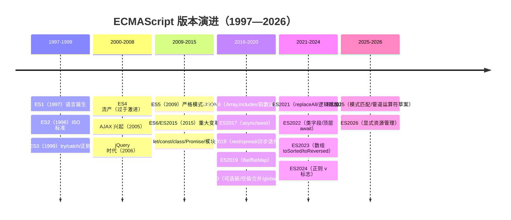
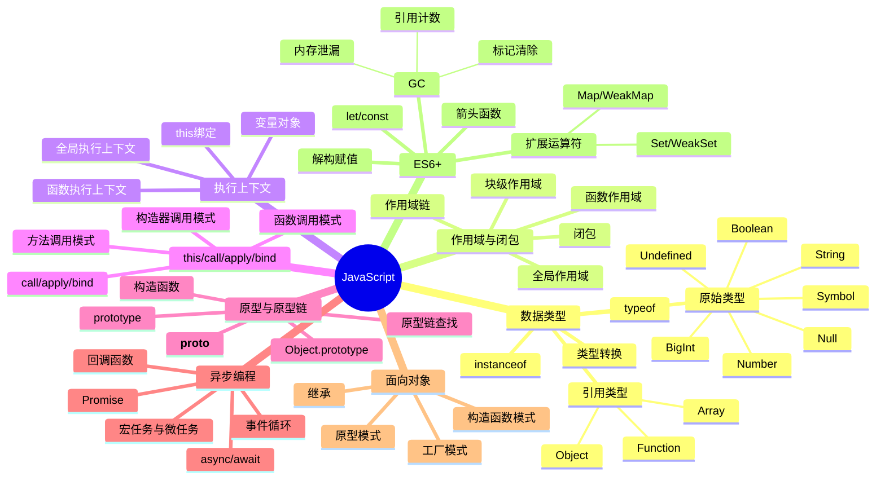

---
title: JavaScript 核心知识
---
# 📜 JavaScript 知识详解（面试精华版）

> 🎯 **面试星级**：★★★★★ | **建议用时**：3 天
> JavaScript 核心知识全面梳理，涵盖数据类型、闭包、原型链、异步编程、ES6+ 等核心考点
> 📌 浏览器 Web API、手写实现、代码输出题已移至 [`04-JavaScript-WebAPI.md`](./04-JavaScript-WebAPI.md) → 侧重点拨跳转

---

## 📈 ECMAScript / JavaScript 版本演进史

> JavaScript 从诞生时 10 天设计的"玩具语言"，演变为全球最广泛使用的编程语言。

### ECMAScript 版本时间线



### 关键版本对比

| 版本 | 年份 | 核心新特性 | 对前端的影响 |
|------|------|-----------|-------------|
| **ES3** | 1999 | try/catch、正则、switch | 语言基础定型 |
| **ES5** | 2009 | 严格模式、JSON、bind | jQuery 时代 |
| **ES6/ES2015** | 2015 | **let/const、class、Promise、模块** | **现代 JS 起点** |
| **ES2017** | 2017 | async/await、Object.entries/values | 异步编程范式革新 |
| **ES2020** | 2020 | 可选链、空值合并、globalThis | 代码简洁性提升 |
| **ES2022** | 2022 | 类字段、顶层 await | OOP + 模块完善 |
| **ES2023** | 2023 | 数组不可变方法 | 函数式编程增强 |
| **ES2024** | 2024 | 正则 v 标志 | 正则增强 |
| **ES2025** | 2025 | 模式匹配、管道运算符 | 元编程成熟 |

### 为什么 ES6 是 JavaScript 的分水岭？

```
ES5 时代（2009-2015）："增强的脚本语言"
  ├─ var 函数作用域（变量提升陷阱）
  ├─ function 声明
  ├─ 回调地狱
  ├─ 手动模块化（IIFE/AMD/CMD）
  └─ Object.defineProperty 开始可用

ES6 时代（2015+）："现代化的编程语言"
  ├─ let/const 块级作用域
  ├─ 箭头函数 + class 语法糖
  ├─ Promise + async/await
  ├─ 原生模块（import/export）
  ├─ Proxy/Reflect 元编程
  └─ Symbol/BigInt/Map/Set 新数据结构
```

---

## 📌 知识脑图



---

> 📌 **关联文件**：浏览器WebAPI/手写实现/代码输出 → [`04-JavaScript-WebAPI`](./04-JavaScript-WebAPI.md) | 框架对比 → [`S2-框架深入/07-框架对比`](../S2-框架深入/07-框架对比)


## 目录

- [数据类型与 ES6](./01-数据类型与ES6)
- [JavaScript 基础](./02-JavaScript基础)
- [原型、作用域与 this](./03-原型作用域与this)
- [异步编程](./04-异步编程)
- [垃圾回收、事件循环与新特性](./05-垃圾回收事件循环与新特性)
- [TypeScript 高频题](./06-TypeScript高频题)

