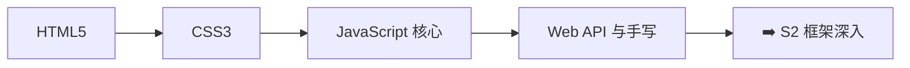

# S1 基础夯实 🟢

> **学习目标**：筑牢前端基础，掌握 HTML5、CSS3、JavaScript 核心与 Web API

## 内容章节

- [🌐 HTML](./01-HTML) — HTML 语义化、HTML5 新特性、Web Components、Resource Hints、Service Worker、View Transitions、Dialog、Popover、ARIA
- [🎨 CSS](./02-CSS) — CSS 选择器、盒模型、布局（Flex/Grid）、响应式、动画、预处理器、BEM
- [⚡ JavaScript 核心](./03-JavaScript-核心) — 数据类型、作用域、闭包、原型链、异步编程、ES6+ 新特性
- [🧩 JavaScript 代码篇](./04-JavaScript-代码篇) — 面试代码实现和输出

## 学习路线

