# 🚀 [Vue 3](https://vuejs.org) 完整学习指南

> 🎯 **面试星级**：★★★★★ | **建议用时**：5 天
> Vue 3 系统学习指南，融合核心原理、高级特性、工程实践与面试题，从入门到精通、源码级原理、Vue 3.6+ 新特性、项目实战重难点、内存泄漏排查、深度面试追问题
>

---

### 🎯 Vue 核心概念关系图

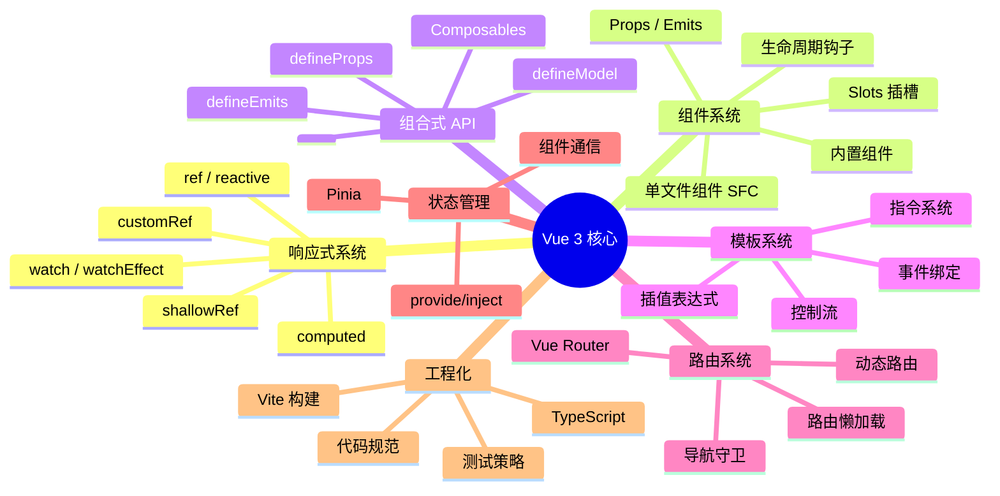

### 📈 Vue 技术栈完整知识体系

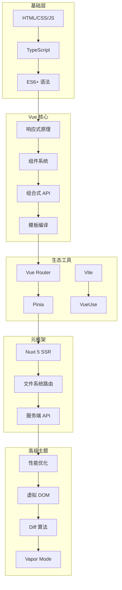

---

# 第一部分：核心基础

## 1️⃣ Vue 是什么？

### 📌 核心定义

**Vue** 是一个渐进式 JavaScript 框架，用于构建用户界面。它以**易学易用、高性能和灵活的组件化**而闻名，是介于 React 的自由度和 Angular 的完整性之间的完美平衡。

### 🎯 Vue 的核心角色

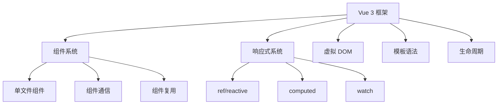

### 🎨 Vue 五大设计理念深度解析

Vue 的设计哲学可以用一句话概括：**"渐进式框架，让开发者少做决定"**。与 React 的函数式 pure 和 Angular 的全家桶不同，Vue 走了一条"中庸之道"。

#### ① 渐进式（Progressive）

> **核心思想**：从轻到重，按需选用，不强制全栈

```
Vue 的渐进式设计：
  ├─ 仅仅一个 CDN script 标签 → 增强静态页面
  ├─ + SFC + 组件 → 完整的 SPA
  ├─ + Vue Router → 多页面路由
  ├─ + Pinia → 全局状态管理
  └─ + Nuxt → SSR/SSG 全栈

对比：
  React：起步需 JSX 编译工具链（除非用 CDN 的 JSX 转换器）
  Angular：必须 CLI 创建，全栈框架开箱即用
  Vue：从 CDN 到 CLI，学习成本线性增长
```

**为什么重要？**
- **低门槛**：从 script 标签开始，不需要构建工具
- **灵活增量**：老项目可直接引入 Vue 替代 jQuery 片段
- **渐进迁移**：Vue 2 → 3 可以逐步升级，无需一次性重写
- **按需引入**：不需要路由就不引入路由，不需要状态管理就不引入 Pinia

#### ② 易用性（Approachable）

> **核心思想**：模板语法 + 响应式 = 直观的开发体验

```vue
<!-- Vue 的模板语法接近原生 HTML，学习成本极低 -->
<template>
  <div class="card" @click="handleClick">
    <h2>{{ title }}</h2>
    <slot />
  </div>
</template>

<script setup>
// 响应式数据像普通变量一样使用
const count = ref(0)
const doubled = computed(() => count.value * 2)
</script>
```

**为什么重要？**
- **模板语法**：接近 HTML，设计师也能理解
- **自动响应式**：`ref()` 赋值即更新，无需 setState 手动触发
- **单文件组件**：模板/脚本/样式一个文件，心智负担低
- **中文文档**：Vue 是唯一有官方中文文档的主流框架

#### ③ 响应式（Reactivity）

> **核心思想**：数据变化自动追踪 → 视图自动更新

```javascript
// React：手动触发
const [count, setCount] = useState(0)
setCount(count + 1)          // 必须调用 setter

// Vue：自动追踪
const count = ref(0)
count.value++                // Proxy 自动拦截，触发更新
```

**与 React 的本质差异：**

| 维度 | Vue | React |
|------|-----|-------|
| **更新机制** | Proxy 自动追踪变化 | 手动触发 setState |
| **更新粒度** | 组件级精确更新 | 默认全量，React Compiler 优化 |
| **编译优化** | Block Tree + Patch Flag | React Compiler（实验性） |
| **调度方式** | 同步更新 | 并发模式 + 优先级调度 |
| **开发者心智** | 数据变了就自动更新 | 显式调用 setter |

- **Vue**：Proxy 代理 → 知道"什么变了" → 精确更新对应组件
- **React**：setState 触发 → 依赖 React Compiler 或手动 memo 优化
- Vue 的响应式是**编译时 + 运行时**协同，React 正在通过 React Compiler 追赶

#### ④ 编译优化（Compile-time Optimization）

> **核心思想**：在编译阶段做尽可能多的工作，减少运行时开销

```
Vue 3 的编译优化三板斧：
  ├─ 静态提升（Static Hoisting）
  │   └─ 静态节点只在创建时执行一次，后续渲染复用
  ├─ Patch Flag
  │   └─ 为动态节点标记具体变化类型（class/style/text/props）
  └─ Block Tree
      └─ 以动态节点为边界分割树 → 跳过静态子树

结果：Vue 3 的虚拟 DOM 性能接近 Solid.js 等无虚拟 DOM 框架
```

**对比 React：**
- Vue 在**编译时**标记"哪里变了"，运行时只对比标记部分
- React 在**运行时**不知道"哪里变了"，需要全量 Diff 找出变化
- React Compiler（React 19）正在追赶 Vue 的编译优化思路

#### ⑤ 灵活性（Flexibility）

> **核心思想**：不强制单一范式，vue 开发者可以根据场景选择

```
Vue 3 的多种选择：
  ├─ API 风格：Options API / Composition API（自由选择）
  ├─ 构建工具：Vite / Webpack（自由选择）
  ├─ 模板 vs JSX：支持两种写法
  ├─ TypeScript：可选（渐进采用）
  └─ 状态管理：Pinia / Vuex / 自管理（自由选择）
```

**双刃剑**：灵活性带来易用性，但过度灵活可能导致规范难以统一。大型团队需要建立内部约定。

---

### 💡 一个公式理解 Vue

```
UI = reactive(state) + template
│       │                  │
▼       ▼                  ▼
视图  响应式代理          声明式模板
```

- **reactive(state)**：通过 Proxy 将数据变为响应式
- **template**：声明式模板描述 UI 结构
- Vue 在 **state 变化时**自动重新渲染受影响的组件

### 📊 框架对比

| 特性 | Vue | React | Angular |
|-----|-----|-------|---------|
| 学习曲线 | 🟢 平缓 | 🟡 中等 | 🔴 陡峭 |
| 灵活性 | ✅ 高 | ✅ 极高 | ⚠️ 受限 |
| 性能 | ✅ 优秀 | ✅ 优秀 | ✅ 优秀 |
| 生态 | ✅ 完整 | ✅ 最庞大 | ✅ 完整 |
| 中文资源 | ✅ 丰富 | ⚠️ 中等 | ⚠️ 有限 |
| **设计哲学** | 渐进式、易用 | 纯函数、声明式 | 全栈、强约束 |
| **响应式** | Proxy 自动追踪 | setState 手动触发 | Zone.js / Signals |
| **编译优化** | Block Tree + Patch Flag | React Compiler（19） | Incremental DOM |

---

## 2️⃣➕ Vue 版本迭代史（2014—2026）

> 了解 Vue 的演进历程，才能理解今天的设计决策。

### 版本演进路线图

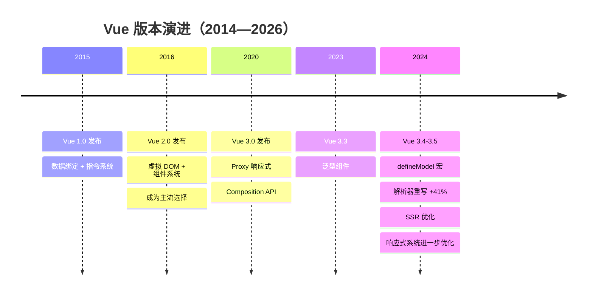

### 关键版本逐代解析

| 版本 | 年份 | 核心变化 | 对开发者的影响 |
|------|------|---------|--------------|
| **Vue 1.0** | 2015 | 数据绑定 + 指令系统，轻量级 | 从 jQuery 切换到声明式开发 |
| **Vue 2.0** | 2016 | 虚拟 DOM、组件化、脚手架 | 奠定 Vue 主流地位，生态爆炸 |
| **Vue 2.7** | 2022 | 移植 Composition API 到 2.x | 2.x 用户平滑过渡到 3.x 心智模型 |
| **Vue 3.0** | 2020 | Proxy 响应式、Composition API、TS | 性能大幅提升，逻辑复用范式革新 |
| **Vue 3.3** | 2023 | 泛型组件、宏 | 提升 TS 体验 |
| **Vue 3.4** | 2024 | `defineModel`、解析器重写（+41% 性能） | 简化 v-model，编译速度显著提升 |
| **Vue 3.5** | 2024 | SSR 优化、响应式优化、内存改进 | 服务端渲染更高效，DevTools 支持增强 |
| **Vue 3.6** | 2026 | Alien Signals 响应式、Vapor Mode 实验性 | 性能接近 Solid.js，编译时优化 |

### Vue 2 → Vue 3 核心变化速览

| 维度 | Vue 2 | Vue 3 |
|------|-------|-------|
| **响应式** | Object.defineProperty（数组/新增属性受限） | Proxy（全面拦截，无限制） |
| **API 风格** | Options API（data/methods/computed 分散） | Composition API（按逻辑聚合） |
| **TypeScript** | 支持有限（装饰器方案复杂） | 原生支持（`<script setup lang="ts">`） |
| **虚拟 DOM** | 全量 Diff | Patch Flag + Block Tree 静态标记 |
| **性能** | 中等 | 2-3 倍提升 |
| **包体积** | ~45KB | ~33KB（gzip） |
| **构建工具** | Webpack 为主 | Vite（原生 ESM，HMR < 50ms） |

```typescript
// Vue 2 的局限
const vm = new Vue({
  data: { user: { name: 'John' } }
})
vm.user.age = 25      // ❌ 非响应式
vm.$set(vm.user, 'age', 25)  // ✅ 需要 $set

// Vue 3 的改进
const state = reactive({ user: { name: 'John' } })
state.user.age = 25   // ✅ 直接赋值即可响应
```

---

## 3️⃣ Vue 3 新特性详解

### 🌟 重要特性速览

```
Vue 3 (2020+)
├─ Composition API (组合式 API)
├─ Proxy 响应式系统
├─ Fragment & Teleport
├─ Suspense (异步组件)
├─ 更快的性能
├─ TypeScript 优化
└─ 新的全局 API
```

### 🔄 Composition API 详解

#### 问题背景

Vue 2 选项式 API 在处理复杂组件时，相关逻辑被分散在不同选项中，难以维护：

```typescript
// ❌ 问题：逻辑分散
export default {
  data() {
    return { count: 0, name: '' };
  },
  computed: {
    doubledCount() { return this.count * 2; }
  },
  methods: {
    increment() { this.count++; }
  },
  watch: {
    name(newVal) { console.log(newVal); }
  }
};
```

#### 解决方案：Composition API

```typescript
// ✅ 解决：逻辑聚合
import { ref, computed, watch } from 'vue';

export default {
  setup() {
    const count = ref(0);
    const name = ref('');

    const doubledCount = computed(() => count.value * 2);
    const increment = () => { count.value++; };

    watch(name, (newVal) => {
      console.log(newVal);
    });

    return { count, name, doubledCount, increment };
  }
};
```

**改进点：**
- ✅ 逻辑聚合，易于阅读和维护
- ✅ 强大的代码复用能力
- ✅ 更好的 TypeScript 支持
- ✅ 灵活的代码组织

### ⚡ Proxy 响应式系统

#### Vue 2 vs Vue 3

**Vue 2: Object.defineProperty**
- ❌ 无法检测属性新增/删除
- ❌ 数组索引变化无法检测
- ❌ 需要 `$set` 进行强制更新

**Vue 3: Proxy**
- ✅ 全面响应式（任何变化）
- ✅ 直观的 API 设计
- ✅ 更好的 TypeScript 支持
- ✅ 惰性处理（按需响应）

#### 工作原理图

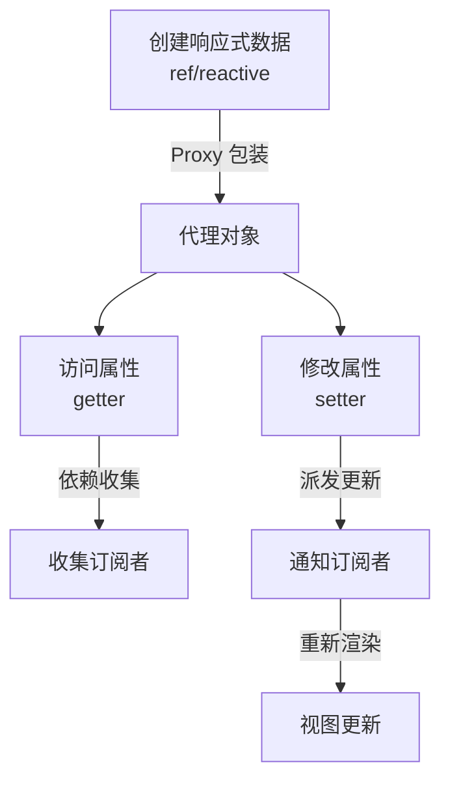

### 🎯 `ref` vs `reactive`

```typescript
// ref - 适用于任何类型
const count = ref(0);
const user = ref({ name: 'John' });

console.log(count.value); // 0
// 模板中自动解包: <div>{{ count }}</div>

// reactive - 仅适用于对象
const state = reactive({
  count: 0,
  user: { name: 'John' }
});

console.log(state.count); // 0
// 模板中也无需 .value: <div>{{ state.count }}</div>

// ⚠️ reactive 整体重新赋值会丢失响应性
// ❌ 错误（如果用 let 声明 state）：用新对象覆盖 Proxy 包装
let stateBad = reactive({ count: 0 });
stateBad = reactive({ count: 5 }); // 新对象与模板失去关联

// ✅ 正确：保持原引用，修改属性
const state = reactive({ count: 0 });
state.count = 5;

// ✅ 整体替换内容：Object.assign 保持 Proxy 引用不变
Object.assign(state, { count: 5, user: { name: 'Mary' } });
```

---

## 4️⃣ 响应式原理深入

### 📌 Vue 的基本原理

Vue 通过 `Object.defineProperty`（Vue 2）/ `Proxy`（Vue 3）实现数据响应式，核心三要素是 **Observer**（观察者）、**Dep**（依赖收集器）、**Watcher**（订阅者），三者协作驱动视图更新。

当一个 Vue 实例创建时，Vue 会遍历 `data` 中的属性，用 `Object.defineProperty`（Vue 3 使用 `Proxy`）将它们转为 `getter/setter`，并在内部追踪相关依赖。当属性被访问时收集依赖，被修改时通知变化。

> ⚠️ **重要说明**：下面的 Observer / Dep / Watcher 三要素描述的是 **Vue 2 的 Object.defineProperty 响应式系统**，不是 Vue 3。Vue 3 使用 **Proxy + ReactiveEffect + track/trigger** 机制，不再有 Dep 类和 Watcher 类。虽然概念上类似（依赖收集 → 通知更新），但实现完全不同。

**核心三要素（Vue 2）：**
- **Observer**：递归遍历 data，为每个属性添加 getter/setter
- **Dep**：每个响应式属性对应一个 Dep，管理订阅它的 Watcher
- **Watcher**：组件渲染 Watcher、计算属性 Watcher、用户 Watcher

### 🔄 双向数据绑定的原理（Vue 2 时代）

Vue 采用**数据劫持 + 发布者-订阅者模式**，通过 `Object.defineProperty()` 劫持各属性的 `setter/getter`，在数据变动时发布消息给订阅者，触发相应监听回调。

> 💡 **关键点**：Vue 的**响应式系统**（Model → View）是**单向**的；"双向"特指 `v-model` 指令的语法糖：本质是 `v-bind` + `v-on` 的组合（把 value 绑给输入框，再监听 input 事件更新 value）。理解这一点对 Vue 3 Composition API 非常重要——**`ref()` 永远是单向流，`v-model` 只是语法糖**。

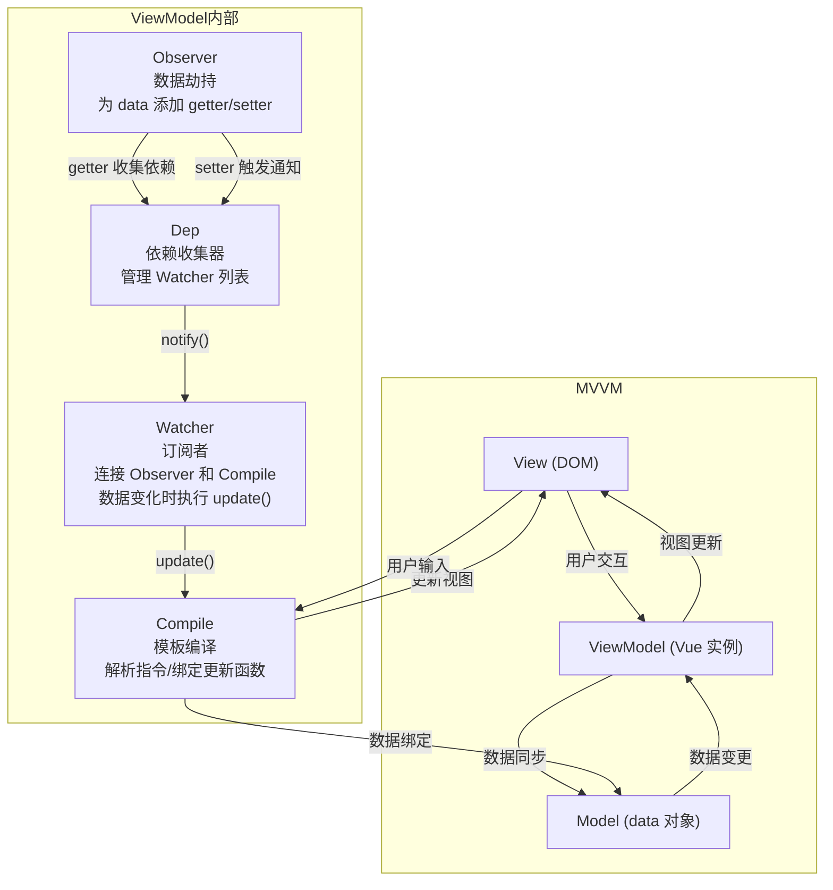

**核心流程四步：**
1. **Observer**：递归遍历 data 对象，为所有属性添加 getter/setter
2. **Compile**：解析模板指令，将模板中的变量替换为数据，为每个指令对应的节点绑定更新函数
3. **Watcher**：作为 Observer 和 Compile 之间的通信桥梁，属性变动时触发 Compile 回调
4. **MVVM**：整合 Observer、Compile 和 Watcher 三者，实现双向绑定

### 🏛️ MVVM / MVC / MVP 架构对比

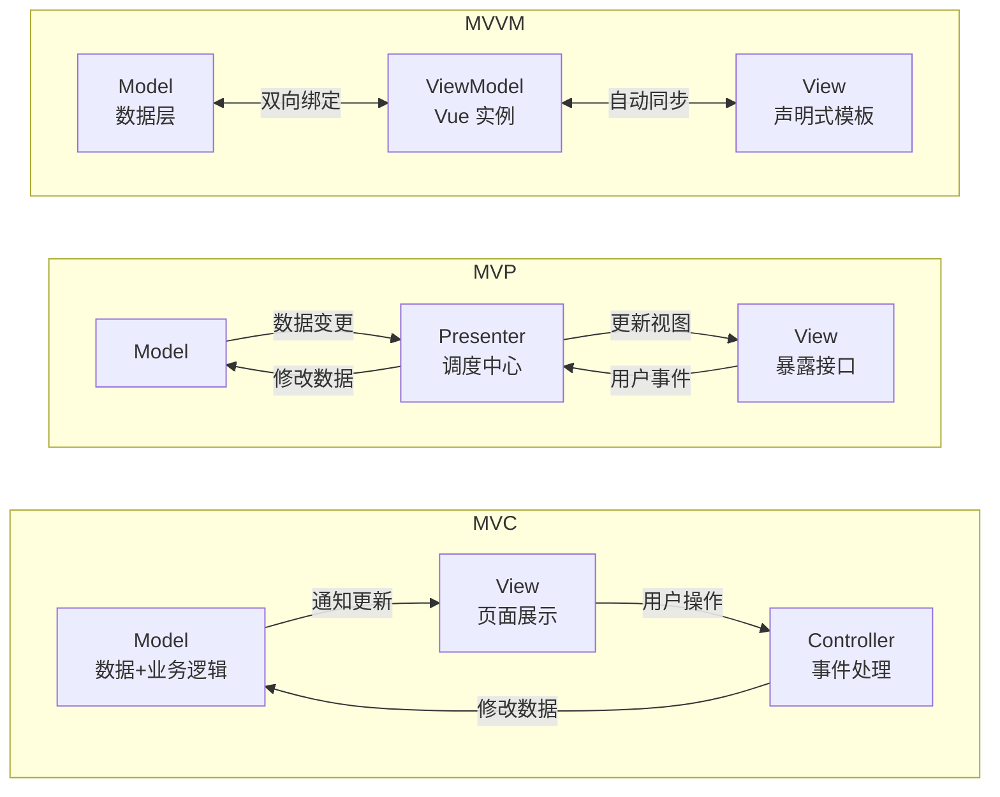

| 特性 | MVC | MVP | MVVM |
|------|-----|-----|------|
| View 与 Model 关系 | 观察者模式，直接耦合 | 完全解耦 | 完全解耦 |
| 通信中枢 | Controller | Presenter | ViewModel |
| 数据流 | 单向 | 单向 | 双向 |
| DOM 操作 | 需要手动操作 | 需要手动操作 | 自动完成 |

### 📦 依赖收集原理（Vue 2 实现）

> ⚠️ **本节为 Vue 2 (Object.defineProperty) 时代的实现原理**，目的是让读者理解"依赖收集 + 派发更新"的核心思想。Vue 3 已不再使用 `Dep` / `Watcher` 这两个类，而是 `ReactiveEffect` + `track/trigger`（见下节）。理解本节后再读 Vue 3 源码会非常顺畅。

```mermaid
flowchart TB
    subgraph "1.初始化（Vue 2）"
        init["new Vue()"] --> initState["initState()"]
        initState --> defineReactive["defineReactive()<br/>为 data 属性添加 getter/setter"]
        defineReactive --> depInit["创建 Dep 实例"]
    end

    subgraph "2.依赖收集（Vue 2）"
        mount["mount 过程"] --> newWatcher["new Watcher(render)"]
        newWatcher --> pushTarget["pushTarget(this)<br/>Dep.target = 当前 Watcher"]
        pushTarget --> render["执行 render()"]
        render --> readData["访问 data 属性"]
        readData --> getter["触发 getter"]
        getter --> depDepend["dep.depend()"]
        depDepend --> addDep["Watcher.addDep(dep)"]
        addDep --> depAddSub["dep.addSub(Watcher)<br/>Watcher 被添加到 subs"]
    end

    subgraph "3.派发更新（Vue 2）"
        modify["修改数据"] --> setter["触发 setter"]
        setter --> depNotify["dep.notify()"]
        depNotify --> subsLoop["遍历 subs"]
        subsLoop --> watcherUpdate["Watcher.update()"]
        watcherUpdate --> queueWatcher["queueWatcher<br/>加入异步队列"]
    end
```

| 角色（Vue 2） | 作用 |
|------|------|
| `Dep` | 依赖收集器，`subs` 数组存储所有订阅它的 Watcher |
| `Watcher` | 订阅者，有 `update()`、`get()`、`addDep()` 等方法 |
| `Dep.target` | 静态属性，全局唯一，指向当前正在计算的 Watcher |

> 💡 **对照记忆 Vue 3**：`Dep` ≈ `ReactiveEffect 集合`（存在 `targetMap` 里）；`Watcher` ≈ `ReactiveEffect`（含 `run()` / `stop()`）；`Dep.target` ≈ `activeEffect`（当前正在执行的 effect 引用）。其他流程几乎一致。

### 🔄 响应式数据更新流程

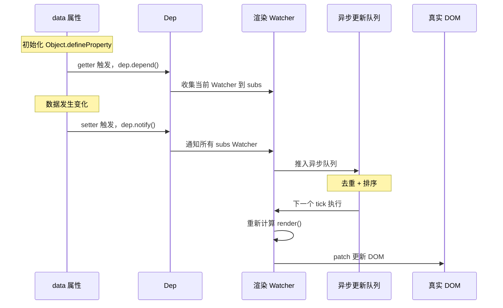

### 🧬 Proxy 响应式引擎源码级原理

Vue 3 的响应式核心在 `packages/reactivity/src` 中，关键函数是 `track()` 和 `trigger()`：

```typescript
// 简化的 Vue 3 响应式引擎核心逻辑

type Dep = Set<ReactiveEffect>
const targetMap = new WeakMap<object, Map<string | symbol, Dep>>()

let activeEffect: ReactiveEffect | null = null

// Proxy handler - reactive()
function createReactiveHandler() {
  return {
    get(target: object, key: string | symbol, receiver: object) {
      const value = Reflect.get(target, key, receiver)
      track(target, key)                    // 依赖收集
      if (isObject(value)) return reactive(value)  // 懒代理
      return value
    },
    set(target: object, key: string | symbol, value: unknown, receiver: object) {
      const oldValue = Reflect.get(target, key, receiver)
      const result = Reflect.set(target, key, value, receiver)
      if (oldValue !== value) trigger(target, key)  // 触发更新
      return result
    }
  }
}

// 依赖收集
function track(target: object, key: string | symbol) {
  if (!activeEffect) return
  let depsMap = targetMap.get(target)
  if (!depsMap) targetMap.set(target, (depsMap = new Map()))
  let dep = depsMap.get(key)
  if (!dep) depsMap.set(key, (dep = new Set()))
  dep.add(activeEffect)
  activeEffect.deps.push(dep)
}

// 触发更新
function trigger(target: object, key: string | symbol) {
  const depsMap = targetMap.get(target)
  if (!depsMap) return
  const dep = depsMap.get(key)
  if (!dep) return
  const effects = [...dep]
  effects.forEach(effect => {
    if (effect.scheduler) effect.scheduler()
    else effect.run()
  })
}

// 核心数据结构
class ReactiveEffect {
  deps: Dep[] = []
  scheduler?: () => void

  constructor(public fn: () => void) {}

  run() {
    try {
      activeEffect = this
      return this.fn()
    } finally {
      activeEffect = null
    }
  }
}
```

**关键设计要点：**
- `targetMap` 是 `WeakMap`，防止内存泄漏
- `Reflect` 确保 `this` 指向正确
- 懒代理：嵌套对象在访问时才代理（Vue 2 是递归初始化）
- `activeEffect` 全局指针，同步上下文保证单一

> 🔗 **链式思考**：Vue 的 Proxy 响应式是"自动追踪"——赋值即触发更新。React 的 `setState` 是"手动触发"，需要显式调用；Angular 22 的 Signal 则是"精确依赖追踪"，通过 `.get()`/`.set()` 显式读写。三者本质都是"数据变化→视图更新"，但追踪粒度不同（属性级 vs 组件级 vs Signal 级）。详见 [框架对比](./框架对比/) 的"响应式原理深度对比"。
>
> 💡 **举一反三**：如果你理解了 Vue 的 `track()` 依赖收集机制，那么 Angular 的 `computed()` 自动追踪依赖的逻辑几乎相同——都是在 getter 中收集依赖，在 setter 中触发更新。React 的 `use()` + Server Components 则是另一种"惰性求值"思路。

### 🔧 `Object.defineProperty()` 的缺陷与 Proxy 的改进

| 问题 | 说明 | Vue 2 的变通方案 |
|------|------|-----------------|
| 无法监听数组下标赋值 | `arr[0] = newVal` 不会触发 setter | 重写数组的 7 个方法 |
| 无法监听数组长度变化 | `arr.length = 0` 无响应 | 同上 |
| 无法监听对象新增属性 | `obj.newKey = val` 无响应 | 使用 `Vue.set()` |
| 无法监听对象删除属性 | `delete obj.key` 无响应 | 使用 `Vue.delete()` |
| 需要递归遍历 | 初始化时就要深度遍历所有属性 | 一次性开销 |

**Proxy 的优势（Vue 3）：**

| 能力 | Object.defineProperty（Vue 2） | Proxy（Vue 3） |
|------|-------------------------------|----------------|
| 拦截方式 | 逐个定义属性 | 代理整个对象 |
| 对象新增属性 | ❌ 需 Vue.set() | ✅ 自动检测 |
| 对象删除属性 | ❌ 需 Vue.delete() | ✅ 自动检测 |
| 数组下标修改 | ❌ 需重写方法 | ✅ 原生支持 |
| 数组长度变更 | ❌ 不可检测 | ✅ 原生支持 |
| Map/Set | ❌ 不支持 | ✅ 原生支持 |
| 初始化性能 | 递归遍历所有属性 | 懒代理（访问时才代理深层对象） |

### ❓ data 为什么是函数

组件 data 必须是函数，每次创建组件实例时返回新的数据对象，避免多个实例共享同一引用导致数据污染。

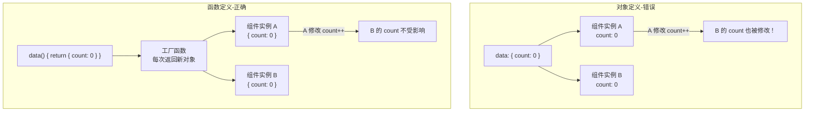

### ⚡ `$nextTick` 原理

`$nextTick` 利用微任务/宏任务机制在 DOM 更新后执行回调，实现数据变更与 DOM 操作的时序协调。

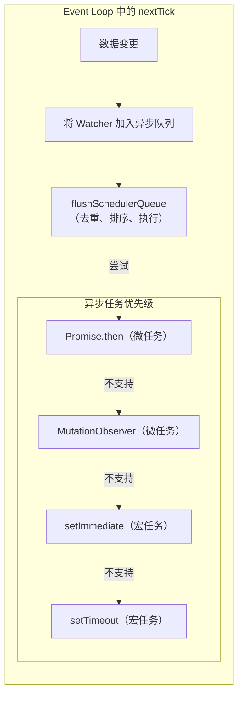

**异步更新的好处：**
1. **去重**：多次对同一个属性赋值，只会触发一次更新
2. **合并**：同一 tick 内的多次数据变更合并为一次 DOM 操作
3. **性能**：避免频繁的 DOM 重排重绘

### 💡 `$set` 原理（Vue 2）

`$set` 用于向响应式对象添加新属性或修改数组元素，内部通过 `defineReactive` 为新属性添加响应式并手动触发 `dep.notify()`。

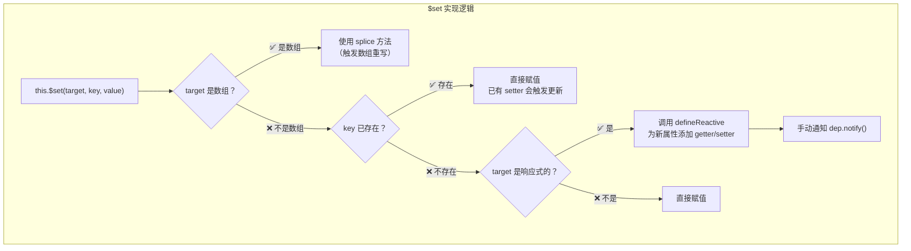

### 🔧 Vue 数组方法重写（Vue 2）

Vue 2 通过重写数组的 7 个方法实现数组响应式：`push` / `pop` / `shift` / `unshift` / `splice` / `sort` / `reverse`。

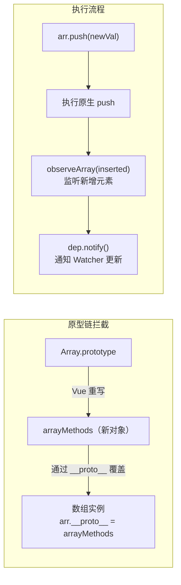

### 📝 Template → Render 编译过程

模板编译分三阶段：`parse`（解析为 AST）→ `optimize`（标记静态节点）→ `generate`（生成 render 函数）。

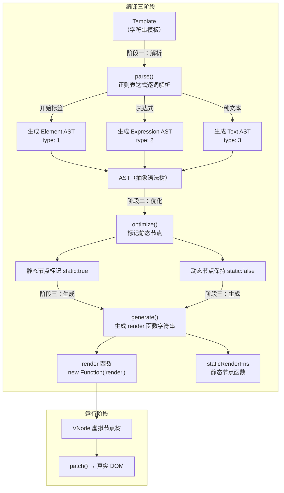

| 阶段 | 函数 | 输入 | 输出 | 核心工作 |
|------|------|------|------|---------|
| 解析 | `parse()` | template 字符串 | AST | 正则表达式解析标签、指令、属性 |
| 优化 | `optimize()` | AST | 带标记的 AST | 标记静态节点，跳过后续 diff |
| 生成 | `generate()` | AST | render 函数字符串 | 拼接成可执行的 JS 代码 |

---

## 5️⃣ 组合式 API 完全指南

### 🎣 核心函数详解

#### `ref` - 单个值的响应式

```typescript
import { ref } from 'vue';

const count = ref(0);
const name = ref('Alice');

console.log(count.value); // 0
count.value = 5;
// 模板中自动解包: {{ count }} → 5
```

#### `computed` - 计算属性

```typescript
import { ref, computed } from 'vue';

const count = ref(1);
const multiplier = ref(2);

// 只读计算属性
const doubled = computed(() => count.value * multiplier.value);

// 可写计算属性
const userFullName = computed({
  get: () => `${firstName.value} ${lastName.value}`,
  set: (newValue) => {
    const [first, last] = newValue.split(' ');
    firstName.value = first;
    lastName.value = last;
  }
});
```

#### `watch` - 监听变化

```typescript
import { ref, watch } from 'vue';

const count = ref(0);
const user = ref({ name: 'Alice', age: 30 });

// 监听单个 ref
watch(count, (newVal, oldVal) => {
  console.log(`Count changed from ${oldVal} to ${newVal}`);
});

// 监听对象（深度监听）
watch(user, (newVal, oldVal) => {
  console.log('User changed:', newVal);
}, { deep: true });

// 监听多个源
watch([count, user], ([newCount, newUser]) => {
  console.log('Count or User changed!');
});

// 取消监听
const stopWatching = watch(count, () => {});
stopWatching();
```

#### `watchEffect` - 自动依赖追踪

```typescript
import { ref, watchEffect } from 'vue';

const count = ref(0);

// 自动追踪依赖
watchEffect(() => {
  console.log(`Count is now: ${count.value}`);
});

// 获取停止函数
const stop = watchEffect(() => {});
stop(); // 停止监听
```

#### 生命周期钩子

```typescript
import {
  onBeforeMount, onMounted,
  onBeforeUpdate, onUpdated,
  onBeforeUnmount, onUnmounted
} from 'vue';

onMounted(() => {
  console.log('组件已挂载');
  const timer = setInterval(() => {}, 1000);

  onUnmounted(() => {
    clearInterval(timer);
  });
});
```

### 🔬 Computed vs Watch vs Methods

| 特性 | Computed | Watch | Methods |
|------|----------|-------|---------|
| 缓存 | ✅ 依赖不变不重新计算 | ❌ 每次变化都触发 | ❌ 每次调用都执行 |
| 异步支持 | ❌ 不支持 | ✅ 支持 | ✅ 支持 |
| 适用场景 | 派生数据、模板简化 | 数据变化后执行副作用 | 事件处理、主动调用 |
| 返回值 | 必须返回一个值 | 不要求返回值 | 不要求返回值 |
| 模板可用 | ✅ | ❌ 不可直接用 | ✅ |

### 🧩 完整组合式 API 示例

```vue
<script setup lang="ts">
import { ref, computed, watch, onMounted, onUnmounted } from 'vue';

const count = ref(0);
const multiplier = ref(2);

const doubled = computed(() => count.value * multiplier.value);
const countStatus = computed(() => {
  if (count.value < 0) return '负数';
  if (count.value === 0) return '零';
  return '正数';
});

watch(count, (newVal) => {
  console.log(`Count changed to ${newVal}`);
});

let timer: number;
onMounted(() => {
  timer = setInterval(() => {}, 1000);
});
onUnmounted(() => {
  clearInterval(timer);
});

const increment = () => count.value++;
const decrement = () => count.value--;
const reset = () => count.value = 0;
</script>

<template>
  <div>
    <h2>计数器</h2>
    <p>Count: {{ count }} ({{ countStatus }})</p>
    <p>Doubled: {{ doubled }}</p>
    <button @click="increment">+</button>
    <button @click="decrement">-</button>
    <button @click="reset">重置</button>
  </div>
</template>
```

---

## 6️⃣ 模板语法完全参考

### 📋 指令和绑定

```html
<!-- 插值表达式 -->
<div>{{ message }}</div>
<div>{{ count + 1 }}</div>

<!-- 属性绑定 -->

<button :disabled="isDisabled">按钮</button>
<div :class="{ active: isActive }">动态类</div>
<div :style="{ color: activeColor }">动态样式</div>

<!-- 事件绑定 -->
<button @click="handleClick">点击</button>
<input @keyup.enter="submitForm" />

<!-- 双向绑定 -->
<input v-model="message" />
<input v-model.number="age" />
<input v-model.trim="name" />

<!-- 条件渲染 -->
<div v-if="visible">显示</div>
<div v-else-if="loading">加载中...</div>
<div v-else>隐藏</div>
<div v-show="visible">始终存在于 DOM</div>

<!-- 列表渲染 -->
<ul>
  <li v-for="item in items" :key="item.id">{{ item.name }}</li>
</ul>

<!-- 特殊属性 -->
<component :is="currentComponent" />
<KeepAlive>
  <component :is="currentComponent" />
</KeepAlive>
```

#### v-model 修饰符

| 修饰符 | 作用 | 示例 |
|--------|------|------|
| `.number` | 自动转为数字 | `v-model.number="age"` |
| `.trim` | 去除首尾空格 | `v-model.trim="name"` |
| `.lazy` | 改为 change 事件触发 | `v-model.lazy="message"` |

#### 动态指令参数（Vue 3.3+）

```html
<div :[attributeName]="value">动态属性</div>
<button @[eventName]="handler">动态事件</button>
```

### 🎯 v-model 实现原理（语法糖）

`v-model` 本质是 `:value + @input` 的语法糖，表单元素监听原生事件，自定义组件默认利用 `value` prop 和 `input` 事件。

```mermaid
flowchart LR
    subgraph 表单元素上的v-model
        direction LR
        vm_input["<input v-model='msg'>"] -->|"语法糖展开"| expand1["<input :value='msg' @input='msg = $event.target.value'>"]
    end

    subgraph 组件上的v-model
        direction LR
        vm_component["<custom-input v-model='msg'>"] -->|"语法糖展开"| expand2["<custom-input :value='msg' @input='msg = $event'>"]
    end
```

```
// v-model 语法糖本质：绑定 value 与监听 input 事件
v-model = v-bind:value + v-on:input
```

### 🔄 v-if vs v-show vs v-html 原理

| 指令 | 渲染方式 | 切换成本 | 初始渲染 | 适用场景 |
|------|----------|---------|---------|---------|
| `v-if` | 条件渲染，销毁/创建 DOM | 高（重建） | 条件为 false 时不创建 | 不频繁切换 |
| `v-show` | 始终渲染，切换 `display` | 低（CSS 切换） | 始终创建 DOM | 频繁切换 |
| `v-html` | 直接设置 `innerHTML` | — | — | 渲染 HTML（警惕 XSS） |

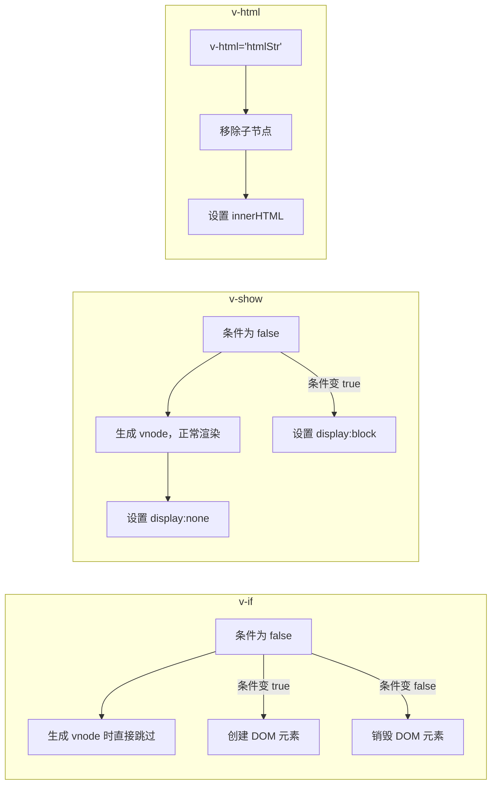

### 🧩 Slot 插槽机制

插槽是组件内容分发的核心机制，分为默认插槽（匿名）、具名插槽（name 属性）、作用域插槽（子传数据给父）。

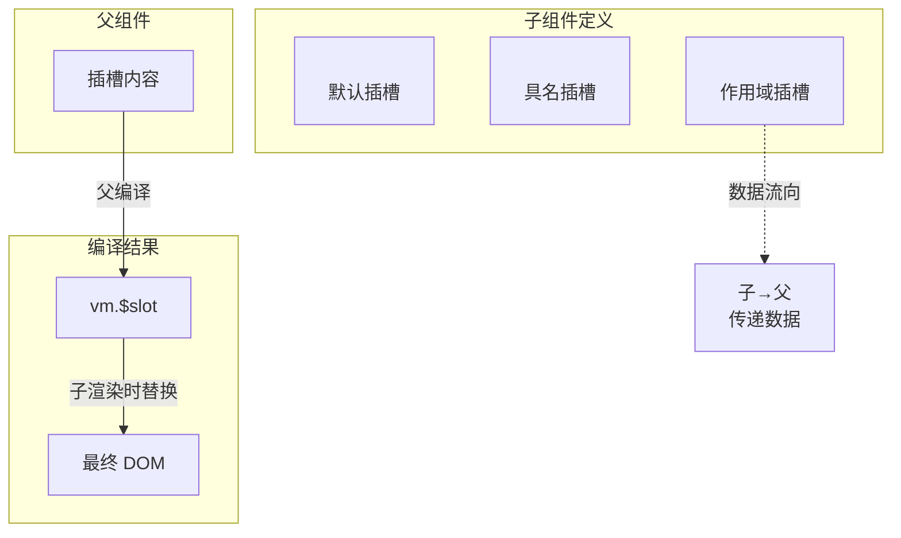

**插槽分类：**
- **默认插槽**（匿名插槽）：`<slot>`，组件内只有一个
- **具名插槽**：`<slot name="xxx">`，一个组件可有多个
- **作用域插槽**：子组件通过 `slot` 标签属性传递数据给父组件

### 🔄 保持页面状态的方案

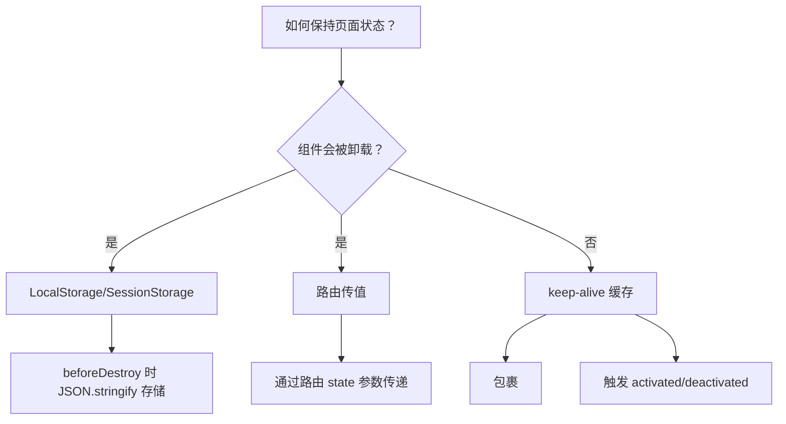

---

## 7️⃣ mixin / extends 合并策略

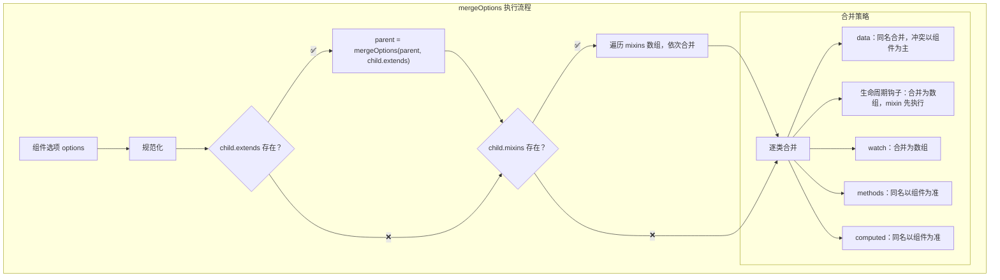

**合并优先级：** 组件自身 > mixins（后传入优先）> extends > 全局 mixin

---

# 第二部分：高级特性

## 1️⃣ 组件通信完全指南

### 🔄 通信方式对比

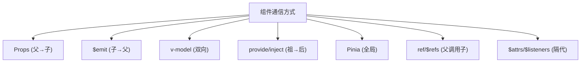

| 方式 | 适用场景 | 方向 |
|------|----------|------|
| `props` / `$emit` | 父子组件 | 父→子 / 子→父 |
| `ref` / `$refs` | 父子组件 | 父调用子实例 |
| `$parent` / `$children` | 父子组件 | 任意方向 |
| `provide` / `inject` | 祖孙组件 | 祖先→后代 |
| `$attrs`（Vue 3 中 `$listeners` 已合并到 `$attrs`） | 隔代组件 | 祖先→深层后代 |
| `eventBus` | 任意组件 | 双向 |
| `Pinia` / `Vuex` | 复杂状态管理 | 全局 |

> 🔗 **链式思考**：Vue 组件通信是"多路并行"——props/$emit 用于父子、provide/inject 用于祖孙、Pinia 用于全局。React 则是"单向数据流 + 状态提升"，跨层级通信靠 Context（类似 provide/inject）；Angular 则是"DI 注入 + @Input/@Output"，全局通信靠 Service + DI（类似 Pinia 但无响应式）。详见 [框架对比](./框架对比/) 的"组件化方案对比"。

### 📍 Props - 父向子传递

```vue
<!-- 父组件 -->
<script setup lang="ts">
import Child from './Child.vue';
const message = ref('Hello from parent');
</script>

<template>
  <Child :message="message" :user="user" :count="123" />
</template>

<!-- 子组件 -->
<script setup lang="ts">
interface User { name: string; age: number; }

const props = defineProps<{
  message: string;
  user: User;
  count?: number;
}>();

const propsWithDefaults = withDefaults(
  defineProps<Props>(),
  { count: 0 }
);
</script>

<template>
  <p>{{ props.message }}</p>
</template>
```

### 📍 $emit - 子向父传递

```vue
<!-- 子组件 -->
<script setup lang="ts">
const emit = defineEmits<{
  (e: 'increment', value: number): void;
  (e: 'update-name', name: string): void;
}>();

const handleClick = () => emit('increment', 1);
</script>

<template>
  <button @click="handleClick">增加</button>
</template>

<!-- 父组件 -->
<template>
  <Child @increment="(val) => count += val" />
</template>
```

### 📍 v-model - 双向绑定

```vue
<!-- 子组件 -->
<script setup lang="ts">
const props = defineProps<{ modelValue: string }>();
const emit = defineEmits<{ (e: 'update:modelValue', value: string): void }>();

const handleInput = (e: Event) => {
  emit('update:modelValue', (e.target as HTMLInputElement).value);
};
</script>

<template>
  <input :value="modelValue" @input="handleInput" />
</template>

<!-- 父组件 -->
<script setup lang="ts">
const message = ref('Hello');
</script>

<template>
  <Child v-model="message" />
  <!-- 等价于 <Child :modelValue="message" @update:modelValue="message = $event" /> -->
</template>
```

### 📍 provide/inject - 跨多层传递

```vue
<!-- 祖先组件 -->
<script setup lang="ts">
import { provide, ref } from 'vue';

const theme = ref('light');
provide('theme', theme);
provide('toggleTheme', () => {
  theme.value = theme.value === 'light' ? 'dark' : 'light';
});
</script>

<!-- 后代组件 -->
<script setup lang="ts">
import { inject } from 'vue';

const theme = inject<'light' | 'dark'>('theme', 'light');
const toggleTheme = inject<() => void>('toggleTheme');
</script>

<template>
  <div :class="theme">
    <p>当前主题: {{ theme }}</p>
    <button @click="toggleTheme">切换主题</button>
  </div>
</template>
```

---

## 2️⃣ 生命周期详解

### 🔄 完整生命周期流程图

```mermaid
flowchart TD
    start["new Vue()"] --> beforeCreate["beforeCreate<br/>数据观测/事件未初始化"]
    beforeCreate --> created["created<br/>数据观测完成，可访问 data/methods<br/>$el 尚未挂载"]
    created --> beforeMount["beforeMount<br/>模板编译完成"]
    beforeMount --> mounted["mounted<br/>真实 DOM 已挂载，可操作 DOM"]

    mounted --> beforeUpdate["beforeUpdate<br/>数据已变化，虚拟 DOM 重新渲染前"]
    beforeUpdate --> updated["updated<br/>虚拟 DOM 已打补丁，真实 DOM 已更新"]
    updated --> beforeUpdate

    mounted --> onBeforeUnmount["onBeforeUnmount<br/>组件卸载前"]
    onBeforeUnmount --> onUnmounted["onUnmounted<br/>组件卸载后"]
```

**Vue 3 组合式 API 生命周期钩子：**

| Vue 2 选项式 | Vue 3 组合式 | 执行时机 |
|-------------|-------------|---------|
| `beforeCreate` | `setup()` | 组件实例化后，Props 解析完成后执行 |
| `created` | `setup()` | 同上 |
| `beforeMount` | `onBeforeMount` | 组件挂载到 DOM 前 |
| `mounted` | `onMounted` | 组件挂载到 DOM 后 |
| `beforeUpdate` | `onBeforeUpdate` | 响应式数据更新，DOM 尚未更新 |
| `updated` | `onUpdated` | DOM 更新完毕 |
| `beforeDestroy` | `onBeforeUnmount` | 组件卸载前 |
| `destroyed` | `onUnmounted` | 组件卸载后（清理定时器、事件监听） |
| `activated` | `onActivated` | 被 `<KeepAlive>` 缓存的组件激活时 |
| `deactivated` | `onDeactivated` | 被 `<KeepAlive>` 缓存的组件停用时 |
| `errorCaptured` | `onErrorCaptured` | 捕获子组件树中的错误 |

### 📍 父子组件生命周期顺序

**挂载阶段：**

```mermaid
sequenceDiagram
    participant Parent as 父组件
    participant Child as 子组件

    Note over Parent: beforeCreate → created → beforeMount
    Parent->>Child: 开始挂载子组件
    Note over Child: beforeCreate → created → beforeMount → mounted
    Note over Parent: mounted
```

**更新阶段：**

```mermaid
sequenceDiagram
    participant Parent as 父组件
    participant Child as 子组件

    Note over Parent: beforeUpdate
    Note over Child: beforeUpdate → updated
    Note over Parent: updated
```

**销毁阶段：**

```mermaid
sequenceDiagram
    participant Parent as 父组件
    participant Child as 子组件

    Note over Parent: onBeforeUnmount
    Note over Child: onBeforeUnmount → onUnmounted
    Note over Parent: onUnmounted
```

**关键提示：** 遵循"父组件创建 → 子组件创建 → 子组件挂载 → 父组件挂载"的顺序。更新阶段父 beforeUpdate 先触发，子更新完成后再触发父 updated。

### 🔄 keep-alive 专属生命周期

```mermaid
sequenceDiagram
    participant 未使用keepalive
    participant 使用keepalive

    Note over 未使用keepalive: beforeCreate → created → beforeMount → mounted
    Note over 未使用keepalive: 切换 → onBeforeUnmount → onUnmounted

    Note over 使用keepalive: beforeCreate → created → beforeMount → mounted
    Note over 使用keepalive: 切换 → deactivated（缓存）
    Note over 使用keepalive: 切换回来 → activated（恢复）
```

> 🔗 **链式思考**：Vue 生命周期分为创建（onMounted）、更新（onUpdated）、销毁（onUnmounted）三阶段。React Hooks 用 `useEffect` 统一覆盖这三个阶段，通过依赖数组控制触发时机。Angular 生命周期更细粒度（ngOnChanges → ngOnInit → ngDoCheck → ngAfterContentInit → ngAfterViewInit → ngOnDestroy），其中 `ngDoCheck` 和 `ngAfterViewChecked` 在 SSR 中不执行。三者都在"组件挂载后→数据变更后→组件销毁前"这三个时间点有对应钩子，只是命名和执行顺序不同。详见 [框架对比](./框架对比/) 的"组件化方案对比"。

---

## 3️⃣ 模板与渲染进阶

### 🏗️ keep-alive 实现原理

`keep-alive` 是抽象组件，通过 LRU 缓存策略缓存组件 vnode，新增 `activated`/`deactivated` 生命周期，命中缓存时不触发 `created`/`mounted`。

```mermaid
flowchart TB
    subgraph keep-alive 工作流程
        start["组件切换触发"] --> includeCheck{"匹配 include/exclude？"}
        includeCheck -->|"不匹配"| noCache["直接返回 vnode，不缓存"]
        includeCheck -->|"匹配"| keyGen["生成组件 key"]
        keyGen --> cacheCheck{"cache[key] 存在？"}
        cacheCheck -->|"✅ 缓存命中"| lru["LRU 策略，将 key 移到数组末尾"]
        cacheCheck -->|"❌ 未命中"| addCache["加入缓存"]
        addCache --> maxCheck{"超过 max 限制？"}
        maxCheck -->|"是"| prune["淘汰最久未使用的"]
        maxCheck -->|"否"| setKeepAlive["设置 keepAlive=true"]
        lru --> setKeepAlive
        setKeepAlive --> render["返回 vnode"]
    end
```

**核心要点：**
- `keep-alive` 是一个内置组件，自身不渲染 DOM 元素
- 通过 `cache` 对象缓存组件的 `vnode` 实例
- 采用 **LRU（Least Recently Used）** 缓存淘汰策略
- 缓存命中时不会执行 `created`、`mounted` 等钩子，而是直接插入缓存的 DOM
- 新增 `activated` 和 `deactivated` 两个生命周期钩子

### ⚡ 虚拟 DOM 与 Diff 算法

#### 虚拟 DOM 概述

```mermaid
flowchart LR
    subgraph 真实DOM
        real["真实 DOM 节点<br/>div#app"]
        real --> realAttr["大量属性"]
        real --> realHeavy["创建/修改成本高"]
    end

    subgraph 虚拟DOM
        virtual["VNode 对象<br/>{ tag, data, children, ... }"]
        virtual --> virtualLight["轻量级 JS 对象"]
        virtual --> virtualFast["创建/对比成本低"]
    end

    virtual -->|"批量对比差异"| diff["Diff 算法"]
    diff -->|"一次批量更新"| real
```

**VNode 核心结构：**
```javascript
{
  tag: 'div',
  data: {
    attrs: { id: 'app' },
    class: ['foo'],
    style: { color: 'red' }
  },
  children: [
    { tag: 'span', text: 'hello' },
    { text: 'world' }
  ],
  elm: null,
  key: 'unique-id',
  component: null,
  shapeFlag: 0
}
```

#### Diff 算法详解

Vue 的 Diff 算法采用**同层比较 + 四个指针遍历**策略，通过 key 建立 Map 快速查找可复用节点。

```mermaid
flowchart TD
    patch["patch(oldVnode, newVnode)"] --> same{"sameVnode?<br/>（key 和 tag 相同？）"}
    same -->|"❌ 不同"| replace["用新 vnode 替换旧 vnode"]
    same -->|"✅ 相同"| patchVnode["patchVnode"]

    patchVnode --> newHas{"newVnode 有子节点？"}
    newHas -->|"❌ 无"| removeOld["移除旧节点的所有子节点"]
    newHas -->|"✅ 有"| oldHas{"oldVnode 有子节点？"}
    oldHas -->|"❌ 无"| addNew["将新子节点添加到 DOM"]
    oldHas -->|"✅ 有"| updateChildren["updateChildren（核心 diff）"]

    subgraph updateChildren
        direction TB
        start["新旧 children 各四个指针"] --> compare["头头/尾尾/头尾/尾头<br/>依次比较"]
        compare -->|"key 匹配"| sameNode["递归 patchVnode，移动指针"]
        compare -->|"未匹配"| createKeyMap["用新 child 的 key 建立 Map"]
        createKeyMap --> keyInOld{"旧 children 中有同 key 节点？"}
        keyInOld -->|"有"| moveNode["移动节点位置"]
        keyInOld -->|"没有"| createNew["创建新节点插入"]
        moveNode --> checkRemaining{"对比完所有节点后<br/>检查剩余"}
        createNew --> checkRemaining
        sameNode --> checkRemaining
        checkRemaining -->|"旧的有剩余"| removeRemaining["批量删除"]
        checkRemaining -->|"新的有剩余"| addRemaining["批量新增"]
    end
```

**Diff 的关键优化：**
1. **只做同层比较**：不跨层级比较 DOM 节点，时间复杂度从 O(n³) 降至 O(n)
2. **四个指针遍历**：头头、尾尾、头尾、尾头四组比较，提高匹配效率
3. **key 建立 Map**：通过 key 的 Map 快速查找可复用的节点

#### Key 的作用

key 帮助 Diff 算法准确识别节点身份，避免就地复用导致的渲染错误。**不要使用 index 作为 key**。

```mermaid
flowchart TB
    subgraph 不设置 key 就地复用
        list1["旧列表：[A, B, C]"]
        list2["新列表：[B, A, C]"]
        list1 -->|"对比"| noKey["默认就地复用，依次替换文本"]
        noKey --> inefficient["操作：<br/>A 变 B, B 变 A, C 不变"]
    end

    subgraph 设置唯一 key
        list1k["旧列表：[A-id1, B-id2, C-id3]"]
        list2k["新列表：[B-id2, A-id1, C-id3]"]
        list1k -->|"对比"| withKey["根据 key 匹配"]
        withKey --> efficient["操作：<br/>移动 B 到前面，A 自动排后"]
    end
```

#### 虚拟 DOM 的完整工作流程

```mermaid
flowchart TB
    subgraph 首次渲染
        template2["Vue Template"] --> compile2["编译"]
        compile2 --> renderFn2["render 函数"]
        renderFn2 --> vnodeTree["VNode 树"]
        vnodeTree --> createElm["createElm<br/>创建真实 DOM"]
        createElm --> insert["插入到页面"]
    end

    subgraph 更新渲染
        dataChange2["数据变化"] --> newVnode["新 VNode 树"]
        newVnode --> diff2["diff(oldVnode, newVnode)"]
        oldVnode["旧 VNode 树（已保存）"] --> diff2
        diff2 --> patches["找出差异 patch 列表"]
        patches --> patchOps["批量 DOM 操作"]
        patchOps --> updateDOM["更新真实 DOM"]
    end
```

> 🔗 **链式思考**：Vue 的 Diff 算法通过 PatchFlag + Block Tree 实现"编译时标记+运行时按需 Diff"。React 的 Fiber Diff 则是"运行时全量 Diff + 可中断调度"——没有编译时标记，但能通过优先级调度保证 60fps。Angular 22 走了另一条路：Ivy 编译时生成指令序列直接操作 DOM，跳过虚拟 DOM 和 Diff 两个阶段。详见 [框架对比](./框架对比/) 的"虚拟 DOM vs 模板编译优化 vs 增量 DOM"。

---

## 4️⃣ 路由系统详解

### 🛣️ 路由流程图

```mermaid
graph TD
    A["URL 变化"] -->|路由匹配| B["查找路由配置"]
    B -->|找到| C["执行路由守卫"]
    C -->|通过| D["加载组件"]
    D --> E["渲染视图"]
    C -->|拒绝| F["阻止导航"]
    B -->|未找到| G["404 路由"]
```

### 📍 完整路由配置示例

```typescript
// router/index.ts
import { createRouter, createWebHistory } from 'vue-router';
import type { RouteRecordRaw } from 'vue-router';

const routes: RouteRecordRaw[] = [
  {
    path: '/',
    name: 'home',
    component: () => import('../views/Home.vue')
  },
  {
    path: '/about',
    name: 'about',
    component: () => import('../views/About.vue')
  },
  {
    path: '/user/:id',
    name: 'user-detail',
    component: () => import('../views/UserDetail.vue'),
    props: true
  },
  {
    path: '/dashboard',
    name: 'dashboard',
    component: () => import('../layouts/DashboardLayout.vue'),
    meta: { requiresAuth: true },
    children: [
      { path: '', name: 'dashboard-overview', component: () => import('../views/DashboardOverview.vue') },
      { path: 'settings', name: 'dashboard-settings', component: () => import('../views/DashboardSettings.vue') }
    ]
  },
  {
    path: '/:pathMatch(.*)*',
    name: 'not-found',
    component: () => import('../views/NotFound.vue')
  }
];

const router = createRouter({
  history: createWebHistory(),
  routes,
  scrollBehavior(to, from, savedPosition) {
    if (savedPosition) return savedPosition;
    return { top: 0 };
  },
});

router.beforeEach((to, from, next) => {
  if (to.meta.requiresAuth && !isAuthenticated()) {
    next('/login');
  } else {
    next();
  }
});

export default router;
```

> 🔗 **链式思考**：Vue Router 的导航守卫（beforeEach/beforeResolve/afterEach）和 React Router 的 loaders/actions 都是"路由生命周期钩子"，但 Vue 以守卫形式控制权限，React 以数据加载器形式声明数据依赖，Angular Router 则结合了守卫（canActivate/canDeactivate）和数据预取（resolve）。核心差异：Vue 偏命令式守卫，React 偏声明式数据加载，Angular 偏配置式前置处理。详见 [框架对比](./框架对比/) 的"路由方案"。

### 📍 在组件中使用路由

```vue
<script setup lang="ts">
import { useRoute, useRouter } from 'vue-router';
import { computed } from 'vue';

const route = useRoute();
const router = useRouter();

const userId = computed(() => route.params.id);
const searchQuery = computed(() => route.query.search);

const goToHome = () => router.push('/');
</script>

<template>
  <router-link to="/">返回首页</router-link>
  <router-link :to="{ name: 'user-detail', params: { id: 456 } }">查看用户</router-link>
  <button @click="goToHome">首页</button>
  <router-view />
</template>
```

### 🔄 hash 模式 vs history 模式

| 特性 | hash 模式 | history 模式 |
|------|-----------|-------------|
| URL 格式 | 带 `#` | 正常 URL |
| 浏览器兼容性 | IE8+ | IE10+ |
| 后端配置 | 无需 | 需要 |
| 刷新行为 | 不触发请求 | 触发真实 HTTP 请求 |

```mermaid
flowchart TB
    subgraph hash模式
        url_hash["http://abc.com/#/user/123"]
        hash_change["#/user/123 变化"]
        hash_event["触发 onhashchange 事件"]
        hash_event --> route_match["前端路由匹配"]
        route_match --> render_view["渲染对应组件"]
        hash_event -->|"不发送 HTTP 请求"| no_request["对后端无影响"]
    end

    subgraph history模式
        url_history["http://abc.com/user/123"]
        history_api["调用 history.pushState()"]
        history_api --> change_url["修改 URL<br/>（不刷新页面）"]
        change_url --> route_match2["前端路由匹配"]
        refresh["用户刷新页面"] --> server_request["发送 HTTP 请求到服务器"]
        server_request -->|"需后端配置"| backend["返回 index.html"]
    end
```

### 🔄 导航守卫执行顺序

```mermaid
flowchart TD
    trigger["导航被触发"] --> beforeRouteLeave["beforeRouteLeave<br/>（离开的组件内）"]
    beforeRouteLeave --> beforeEach["router.beforeEach<br/>（全局前置守卫）"]
    beforeEach --> beforeRouteUpdate["beforeRouteUpdate<br/>（可复用的组件内）"]
    beforeRouteUpdate --> beforeEnter["beforeEnter<br/>（路由独享守卫）"]
    beforeEnter --> resolveAsync["解析异步路由组件"]
    resolveAsync --> beforeRouteEnter["beforeRouteEnter<br/>（进入的组件内）"]
    beforeRouteEnter --> beforeResolve["router.beforeResolve<br/>（全局解析守卫）"]
    beforeResolve --> confirm["导航被确认"]
    confirm --> afterEach["router.afterEach<br/>（全局后置钩子）"]
    afterEach --> mount["组件生命周期"]
```

**组件内守卫示例：**

```typescript
import { onBeforeRouteLeave } from 'vue-router';

onBeforeRouteLeave((to, from) => {
  const answer = window.confirm('确定离开吗？');
  if (!answer) return false;
});
```

---

## 5️⃣ 状态管理

### 📊 [Pinia](https://pinia.vuejs.org) vs Vuex

```
Pinia (推荐)            Vuex (传统)
━━━━━━━━━━━━━━━━━━━━━━━━━━━━━━
✅ 更简洁的 API         ⚠️ 样板代码多
✅ 完美的 TypeScript    ⚠️ 类型支持弱
✅ 无 Mutations        ⚠️ 必需 Mutations
✅ 按需导入             ⚠️ 需要导入全部
✅ 官方推荐             ⚠️ 逐步淘汰
```

### 📍 Pinia 完整示例

```typescript
// stores/counter.ts
import { defineStore } from 'pinia';
import { ref, computed } from 'vue';

// Setup 函数式（推荐）
export const useCounterStore = defineStore('counter', () => {
  const count = ref(0);
  const name = ref('Counter Store');

  const doubled = computed(() => count.value * 2);
  const isPositive = computed(() => count.value > 0);

  const increment = () => count.value++;
  const decrement = () => count.value--;
  const reset = () => count.value = 0;

  const fetchRandomCount = async () => {
    const response = await fetch('https://api.example.com/random');
    const data = await response.json();
    count.value = data.number;
  };

  return { count, name, doubled, isPositive, increment, decrement, reset, fetchRandomCount };
});

// Options 式
export const useUserStore = defineStore('user', {
  state: () => ({ user: null, isLoading: false }),
  getters: {
    isLoggedIn: (state) => !!state.user,
    userName: (state) => state.user?.name || 'Guest'
  },
  actions: {
    async login(username: string, password: string) {
      this.isLoading = true;
      try {
        const response = await fetch('/api/login', { method: 'POST', body: JSON.stringify({ username, password }) });
        this.user = await response.json();
      } finally { this.isLoading = false; }
    },
    logout() { this.user = null; }
  }
});
```

**Pinia State 操作方式：**

```javascript
const store = useCounterStore()

// 直接修改
store.count++

// $patch 批量修改（推荐多个属性同时修改）
store.$patch({ count: store.count + 1, name: 'updated' })

// $patch 函数式
store.$patch((state) => { state.count++; state.name = 'updated' })

// $reset 重置
store.$reset()

// 保持响应式解构
import { storeToRefs } from 'pinia'
const { count, name } = storeToRefs(store)
```

### 📍 组件中使用 Pinia

```vue
<script setup lang="ts">
import { useCounterStore } from '../stores/counter';
const counterStore = useCounterStore();
</script>

<template>
  <p>Count: {{ counterStore.count }}</p>
  <p>Doubled: {{ counterStore.doubled }}</p>
  <button @click="counterStore.increment">+1</button>
</template>
```

### 🏪 Vuex 核心架构

Vuex 采用单向数据流：Component → dispatch → Action → commit → Mutation → mutate → State → 响应式渲染到 Component。

```mermaid
flowchart TB
    subgraph Vuex 数据流
        Components["Vue Components"] -->|"dispatch"| Actions["Actions<br/>（异步/同步操作）"]
        Actions -->|"commit"| Mutations["Mutations<br/>（同步修改 State）"]
        Mutations -->|"mutate"| State["State<br/>（单一状态树）"]
        State -->|"响应式渲染"| Components
        Components -->|"读取"| Getters["Getters<br/>（计算属性）"]
        Getters -->|"派生数据"| Components
    end
```

**五大核心属性：**

| 属性 | 作用 | 特点 |
|------|------|------|
| `State` | 数据源 | 单一状态树，响应式 |
| `Getter` | 派生数据 | 类似计算属性，有缓存 |
| `Mutation` | 同步修改 State | 唯一修改方式，必须同步 |
| `Action` | 异步操作 | 提交 Mutation，可含异步逻辑 |
| `Module` | 模块化 | 拆分 Store，命名空间 |

**Vuex vs Pinia 详细对比：**

| 对比维度 | Pinia | Vuex |
|----------|-------|------|
| API 设计 | Composition API 风格，简洁直观 | Options API 风格 |
| TypeScript 支持 | 原生极佳，无需额外类型声明 | 需要复杂类型推导 |
| 模块化 | 无 Module 概念，每个 Store 独立 | Module + 命名空间 |
| Mutation | ❌ 无，直接修改 State | ✅ 必须通过 Mutation |
| 代码体积 | ~1KB | ~10KB |
| HMR | ✅ 支持热更新 | ✅ 支持（需配置） |

> 🔗 **链式思考**：状态管理方案的三框架映射——Vue 的 Pinia = `reactive` 对象 + `computed` 派生 + 插件系统；React 的 Zustand = `setState` 不可变更新 + 选择器 + middleware；Angular 的 NgRx SignalStore = `signal` 状态 + `computed` 派生 + `withMethods` 封装。核心共性：都遵循"单向数据流 + 派生状态 + 异步处理"模式。详见 [框架对比](./框架对比/) 的"状态管理生态"。

**Pinia 数据流：**

```mermaid
flowchart TB
    subgraph Component
        C1["组件 A<br/>（商品列表）"]
        C2["组件 B<br/>（购物车图标）"]
        C3["组件 C<br/>（购物车详情）"]
    end

    subgraph Pinia Stores
        Cart["Cart Store<br/>items, coupon, discount"]
        User["User Store<br/>user, token"]
    end

    C1 -->|"调用"| A1["addItem()"]
    A1 --> Cart
    C2 -->|"展示数量"| Cart
    C3 --> Cart
```

---

## 6️⃣ 组合式 API 进阶

### 📝 `<script setup>` 语法

```vue
<script setup>
import { ref, onMounted } from 'vue'

const count = ref(0)
const msg = ref('Hello')

onMounted(() => {
  console.log('mounted')
})
</script>

<template>
  <div>{{ count }} - {{ msg }}</div>
</template>
```

**defineProps / defineEmits / defineExpose：**

```vue
<script setup>
const props = defineProps({
  title: String,
  count: { type: Number, default: 0 }
})

const emit = defineEmits(['update', 'delete'])

function handleClick() {
  emit('update', props.count + 1)
}

defineExpose({ resetCount() { /* ... */ } })
</script>
```

**defineModel（v-model 语法糖，Vue 3.4+）：**

```vue
<!-- 子组件 -->
<script setup>
const model = defineModel({ type: String, default: '' })
</script>

<template>
  <input v-model="model" />
</template>

<!-- 父组件 -->
<ChildComponent v-model="value" />
```

**defineOptions（Vue 3.3+）：**

```vue
<script setup>
defineOptions({
  name: 'MyComponent',
  inheritAttrs: false
})
</script>
```

**withDefaults：**

```vue
<script setup>
interface Props {
  title?: string
  count?: number
  items?: string[]
}

const props = withDefaults(defineProps<Props>(), {
  title: '默认标题',
  count: 0,
  items: () => []
})
</script>
```

**组件类型安全实践：**

```vue
<script setup lang="ts">
interface Product {
  id: number;
  name: string;
  price: number;
  category: string;
  tags?: string[];
}

interface ProductCardProps {
  product: Product;
  showDiscount?: boolean;
  variant?: 'small' | 'medium' | 'large';
}

const props = withDefaults(defineProps<ProductCardProps>(), {
  showDiscount: false,
  variant: 'medium',
});

const emit = defineEmits<{
  (e: 'add-to-cart', id: number): void;
  (e: 'toggle-favorite', id: number, isFav: boolean): void;
}>();

// 模板 ref 类型
const cardRef = ref<HTMLElement | null>(null);
const childRef = ref<InstanceType<typeof ChildComponent> | null>(null);

// 事件处理类型
function handleClick(event: MouseEvent) {
  console.log(event.clientX);
}

function handleInput(event: Event) {
  const target = event.target as HTMLInputElement;
  console.log(target.value);
}
</script>
```

### 🔬 进阶响应式 API

```mermaid
flowchart TB
    subgraph 响应式分类
        Deep["深度响应式"] --> Ref["ref()<br/>深度监听"]
        Deep --> Reactive["reactive()<br/>深度监听"]

        Shallow["浅层响应式"] --> ShallowRef["shallowRef()<br/>只监听 .value 变化"]
        Shallow --> ShallowReactive["shallowReactive()<br/>只监听第一层属性"]

        Utility["工具函数"] --> ToRef["toRef() / toRefs()"]
        Utility --> ToRaw["toRaw()"]
        Utility --> MarkRaw["markRaw()"]
        Utility --> TriggerRef["triggerRef()"]
        Utility --> CustomRef["customRef()"]
    end
```

**shallowRef / shallowReactive：**

```javascript
import { shallowRef, shallowReactive } from 'vue'

// shallowRef：只追踪 .value 的变化，不深度监听内部属性
const state = shallowRef({ count: 0 })
state.value.count = 1  // ❌ 不触发响应式
state.value = { count: 1 }  // ✅ 触发响应式

// shallowReactive：只监听第一层属性的变化
const obj = shallowReactive({
  nested: { count: 0 }
})
obj.nested.count = 1  // ❌ 不触发响应式
```

**triggerRef / customRef：**

```javascript
import { triggerRef, customRef, shallowRef } from 'vue'

// triggerRef：强制触发依赖更新
const shallow = shallowRef({ count: 0 })
shallow.value.count = 1
triggerRef(shallow)  // 手动触发更新

// customRef：显式控制依赖收集和触发更新
function useDebouncedRef(value, delay = 200) {
  let timeout
  return customRef((track, trigger) => ({
    get() {
      track()
      return value
    },
    set(newValue) {
      clearTimeout(timeout)
      timeout = setTimeout(() => {
        value = newValue
        trigger()
      }, delay)
    }
  }))
}
```

**toRef / toRefs / toRaw / markRaw：**

```javascript
import { reactive, toRef, toRefs, toRaw, markRaw } from 'vue'

const state = reactive({ a: 1, b: 2 })

// toRef：为 reactive 对象的单个属性创建 ref
const aRef = toRef(state, 'a')
aRef.value++  // state.a 也会改变

// toRefs：将 reactive 对象的所有属性转为 ref
const { a, b } = toRefs(state)

// toRaw：获取响应式对象的原始对象
const raw = toRaw(state)

// markRaw：标记对象永远不会转为响应式
const heavyData = markRaw({ /* 大型不可变数据 */ })
```

**effectScope：**

```javascript
import { effectScope, onScopeDispose, ref, computed, watch } from 'vue'

const scope = effectScope()

scope.run(() => {
  const count = ref(0)
  const double = computed(() => count.value * 2)

  watch(count, (newVal) => {
    console.log('count changed:', newVal)
  })

  onScopeDispose(() => {
    console.log('scope disposed')
  })
})

// 停止作用域：所有 effect 被自动清理
scope.stop()
```

### 🧩 内置组件

**`<Teleport>`（传送门）：**

```vue
<template>
  <div class="component">
    <button @click="showModal = true">打开模态框</button>

    <!-- 模态框渲染到 body 下，避免父组件 overflow:hidden 裁剪 -->
    <Teleport to="body">
      <div v-if="showModal" class="modal">
        <p>模态框内容</p>
      </div>
    </Teleport>

    <!-- 可禁用传送 -->
    <Teleport :disabled="!isMobile">
      <MobileNav />
    </Teleport>
  </div>
</template>
```

**``<Suspense>``（异步依赖处理）：**

```vue
<script setup>
import { defineAsyncComponent } from 'vue'

const AsyncComp = defineAsyncComponent(() => import('./HeavyComponent.vue'))
</script>

<template>
  <Suspense>
    <AsyncComp />
    <template #fallback>
      <div>加载中...</div>
    </template>
  </Suspense>
</template>
```

**`<KeepAlive>` 进阶：**

```vue
<script setup>
const tabs = ['Home', 'About', 'Contact']
const activeTab = ref('Home')

const isCached = (comp) => comp.name !== 'Contact'
</script>

<template>
  <KeepAlive :max="5" :include="isCached">
    <component :is="activeTab" />
  </KeepAlive>

  <!-- KeepAlive + Router -->
  <RouterView v-slot="{ Component, route }">
    <KeepAlive :include="route.meta.keepAlive ? [route.name] : []">
      <component :is="Component" :key="route.name" />
    </KeepAlive>
  </RouterView>
</template>
```

**``<Transition>`` / `<TransitionGroup>` 增强：**

```vue
<template>
  <Transition name="fade"
    enter-from-class="opacity-0"
    enter-active-class="transition duration-500"
    leave-active-class="transition duration-300"
    @before-enter="onBeforeEnter"
    @enter="onEnter"
  >
    <div v-if="show">内容</div>
  </Transition>

  <TransitionGroup name="list" tag="ul">
    <li v-for="item in items" :key="item.id">{{ item.text }}</li>
  </TransitionGroup>
</template>

<style>
.list-enter-active, .list-leave-active { transition: all 0.5s ease; }
.list-enter-from, .list-leave-to { opacity: 0; transform: translateX(30px); }
.list-move { transition: transform 0.5s ease; }
</style>
```

### 🔧 函数式组件与渲染函数

**h() 函数：**

```javascript
import { h, ref } from 'vue'

export default {
  setup() {
    const count = ref(0)
    return () => h('div', { class: 'counter' }, [
      h('span', `计数: ${count.value}`),
      h('button', { onClick: () => count.value++ }, '增加')
    ])
  }
}
```

**渲染函数 + 指令/插槽：**

```javascript
import { h, withDirectives, resolveComponent, vShow } from 'vue'

export default {
  render() {
    const MyComp = resolveComponent('MyComponent')
    const vnode = h(MyComp, { title: 'Hello' }, {
      default: () => h('span', '默认插槽'),
      header: () => h('h1', '标题插槽')
    })
    return withDirectives(vnode, [ [vShow, this.visible] ])
  }
}
```

**JSX/TSX 支持：**

```tsx
import { defineComponent, ref } from 'vue'

export default defineComponent({
  name: 'Button',
  props: { type: { type: String, default: 'primary' } },
  emits: ['click'],
  setup(props, { emit, slots }) {
    const count = ref(0)
    const handleClick = () => { count.value++; emit('click', count.value) }

    return () => (
      <button class={['btn', `btn-${props.type}`]} onClick={handleClick}>
        {slots.default?.() ?? '按钮'}
        {count.value > 0 && <span>（点击{count.value}次）</span>}
      </button>
    )
  }
})
```

### 🎣 可组合函数（Composables）

**常用 Composables 封装：**

```typescript
// composables/useFetch.ts
import { ref, onMounted } from 'vue'

export function useFetch<T>(url: string) {
  const data = ref<T | null>(null)
  const loading = ref(false)
  const error = ref<string | null>(null)

  const fetchData = async () => {
    loading.value = true
    error.value = null
    try {
      const response = await fetch(url)
      if (!response.ok) throw new Error(`HTTP ${response.status}`)
      data.value = await response.json()
    } catch (e) {
      error.value = (e as Error).message
    } finally { loading.value = false }
  }

  onMounted(() => fetchData())
  return { data, loading, error, fetch: fetchData }
}

// composables/useCounter.ts
import { ref, computed } from 'vue'

export function useCounter(initialValue = 0) {
  const count = ref(initialValue)
  const doubled = computed(() => count.value * 2)
  const increment = () => count.value++
  const decrement = () => count.value--
  const reset = () => count.value = initialValue
  return { count, doubled, increment, decrement, reset }
}

// composables/useAsync.ts
import { ref, type Ref } from 'vue';

export function useAsync<T>(
  asyncFn: () => Promise<T>,
  immediate = true
) {
  const data = ref<T | null>(null) as Ref<T | null>;
  const loading = ref(false);
  const error = ref<string | null>(null);

  const execute = async () => {
    loading.value = true;
    error.value = null;
    try {
      data.value = await asyncFn();
    } catch (err) {
      error.value = err instanceof Error ? err.message : '未知错误';
    } finally {
      loading.value = false;
    }
  };

  if (immediate) execute();
  return { data, loading, error, execute };
}

// composables/useDebounce.ts
import { ref, watch, type Ref } from 'vue';

export function useDebounce<T>(value: Ref<T>, delay = 300): Ref<T> {
  const debouncedValue = ref(value.value) as Ref<T>;
  let timeoutId: ReturnType<typeof setTimeout> | null = null;

  watch(value, (newVal) => {
    if (timeoutId) clearTimeout(timeoutId);
    timeoutId = setTimeout(() => {
      debouncedValue.value = newVal;
    }, delay);
  });

  return debouncedValue;
}

// composables/useThrottle.ts
import { ref, watch, type Ref } from 'vue';

export function useThrottle<T>(value: Ref<T>, delay = 300): Ref<T> {
  const throttledValue = ref(value.value) as Ref<T>;
  let lastCall = 0;
  watch(value, () => {
    const now = Date.now();
    if (now - lastCall >= delay) {
      throttledValue.value = value.value;
      lastCall = now;
    }
  });
  return throttledValue;
}

// composables/useLocalStorage.ts
import { ref, watch, type Ref } from 'vue';

export function useLocalStorage<T>(key: string, initialValue: T): Ref<T> {
  const storedValue = ref<T>(() => {
    try {
      const item = localStorage.getItem(key);
      return item ? JSON.parse(item) : initialValue;
    } catch {
      return initialValue;
    }
  }) as Ref<T>;
  watch(storedValue, (newVal) => {
    localStorage.setItem(key, JSON.stringify(newVal));
  }, { deep: true });
  return storedValue;
}

// composables/useEventListener.ts
import { onMounted, onUnmounted } from 'vue';

export function useEventListener(
  target: EventTarget,
  event: string,
  handler: EventListener
) {
  onMounted(() => target.addEventListener(event, handler));
  onUnmounted(() => target.removeEventListener(event, handler));
}

// composables/useIntersectionObserver.ts
import { ref, onMounted, onUnmounted, type Ref } from 'vue';

export function useIntersectionObserver(
  targetRef: Ref<HTMLElement | null>,
  options?: IntersectionObserverInit
): Ref<boolean> {
  const isIntersecting = ref(false);
  onMounted(() => {
    if (!targetRef.value) return;
    const observer = new IntersectionObserver(([entry]) => {
      isIntersecting.value = entry.isIntersecting;
    }, options);
    observer.observe(targetRef.value);
    onUnmounted(() => observer.disconnect());
  });
  return isIntersecting;
}

**常用 Hooks 一览：**

| Hook | 用途 | 来源 |
|------|------|------|
| `useAsync` | 异步请求管理 | 自定义 |
| `useDebounce` | 防抖 | 自定义 |
| `useThrottle` | 节流 | 自定义 |
| `useLocalStorage` | 本地存储 | 自定义 |
| `useEventListener` | 事件监听 | 自定义 |
| `useIntersectionObserver` | 滚动加载 | 自定义 |
| `useMouse` | 鼠标位置 | VueUse |
| `useWindowSize` | 窗口大小 | VueUse |
| `useClipboard` | 剪贴板 | VueUse |
| `useDark` | 暗黑模式 | VueUse |
```

```bash
npm install @vueuse/core
```

**在组件中使用：**

```vue
<script setup lang="ts">
import { useFetch } from '../composables/useFetch'
import { useCounter } from '../composables/useCounter'

interface Post { id: number; title: string; body: string }

const { data: posts, loading, error } = useFetch<Post[]>(
  'https://jsonplaceholder.typicode.com/posts?_limit=5'
)
const { count, doubled, increment, decrement } = useCounter(0)
</script>

<template>
  <div>
    <h2>计数器: {{ count }} (Double: {{ doubled }})</h2>
    <button @click="increment">+</button>
    <button @click="decrement">-</button>

    <div v-if="loading">加载中...</div>
    <div v-if="error" class="error">{{ error }}</div>
    <ul v-if="posts">
      <li v-for="post in posts" :key="post.id">
        <strong>{{ post.title }}</strong>
      </li>
    </ul>
  </div>
</template>
```

> 🔗 **链式思考**：Vue 的 Composables（可组合函数）本质上等价于 React 的 Hooks——都是将状态逻辑抽取为独立函数，在组件内"按需调用"。核心区别：Composables 可以在任意位置调用（条件/循环中也可），而 Hooks 必须遵守"顶层调用"规则（React 依赖调用顺序来维护状态）。Angular 的 inject() 函数（Angular 14+）则介于两者之间——可以在构造函数或字段初始化中调用，但也不支持条件调用。详见 [框架对比](./框架对比/) 的"组件化方案对比"。

**Composables vs Mixins：**

| 维度 | Mixins | Composables |
|------|--------|-------------|
| 命名冲突 | 合并时可能冲突 | 解构可重命名，无冲突 |
| 来源清晰 | 不确定属性来自哪个 mixin | 每次调用显式返回 |
| 参数传递 | 无法传递参数 | 支持接受参数 |
| Tree-shaking | 全部打包 | 按需导入 |

---

## 7️⃣ 单文件组件最佳实践

### 📝 现代单文件组件结构

```vue
<script setup lang="ts">
import { ref, computed, onMounted } from 'vue'

// 类型定义
interface User { id: number; name: string; email: string }

// Props 定义
const props = withDefaults(
  defineProps<{ title: string; user?: User; count?: number }>(),
  { count: 0 }
)

// Emits 定义
const emit = defineEmits<{ (e: 'update:user', user: User): void; (e: 'delete'): void }>()

// 状态
const loading = ref(false)
const error = ref<string | null>(null)

// 计算属性
const displayName = computed(() => props.user?.name || 'Unknown')

// 方法
const handleDelete = async () => {
  loading.value = true
  try { emit('delete') }
  catch (e) { error.value = (e as Error).message }
  finally { loading.value = false }
}

// 生命周期
onMounted(() => { console.log('Component mounted') })

defineExpose({ handleDelete })
</script>

<template>
  <div class="user-card">
    <h2>{{ props.title }}</h2>
    <p>Name: {{ displayName }}</p>
    <div v-if="loading" class="loading">加载中...</div>
    <button @click="handleDelete">删除</button>
  </div>
</template>

<style scoped>
.user-card { border: 1px solid #ccc; padding: 20px; border-radius: 8px; }
.loading { color: #1890ff; }
.error { color: #ff4d4f; }
</style>
```

#### 商品卡片示例

```vue
<script setup lang="ts">
interface Product {
  id: number;
  name: string;
  price: number;
  image: string;
}

const props = defineProps<{ product: Product }>();
const emit = defineEmits<{ (e: 'add-to-cart', id: number): void }>();

const discountedPrice = computed(() => props.product.price * 0.9);

function handleAdd() {
  emit('add-to-cart', props.product.id);
}
</script>

<template>
  <div class="product-card">
    
    <h3 class="product-name">&#123;&#123; product.name &#125;&#125;</h3>
    <div class="product-price">
      <span class="original">¥&#123;&#123; product.price &#125;&#125;</span>
      <span class="discounted">¥&#123;&#123; discountedPrice &#125;&#125;</span>
    </div>
    <button class="add-btn" @click="handleAdd">加入购物车</button>
  </div>
</template>

<style scoped>
.product-card { border: 1px solid #e0e0e0; border-radius: 8px; padding: 16px; }
.product-name { font-size: 16px; font-weight: 600; }
.discounted { color: #e74c3c; font-weight: bold; }
.original { text-decoration: line-through; color: #999; margin-right: 8px; }
</style>
```

---


## 8️⃣ Vue 生态

### ⚡ [Vite](https://vite.dev)

Vite 基于原生 ES Module 实现秒级启动，开发时按需编译（esbuild），生产环境用 Rollup 打包；HMR 毫秒级，远快于 Webpack。

```mermaid
flowchart TB
    subgraph Webpack 开发阶段
        W1["启动 dev server"] --> W2["全量打包整个应用"]
        W2 --> W3["等待打包完成<br/>大型项目 10-30s"]
        W3 --> W4["浏览器加载 bundle"]
        W4 --> W5["HMR 也要 1-5s"]
    end

    subgraph Vite 开发阶段
        V1["启动 dev server"] --> V2["按需编译<br/>（ES Module 原生加载）"]
        V2 --> V3["秒启动，无需打包"]
        V3 --> V4["浏览器加载单个 ESM 文件"]
        V4 --> V5["HMR 毫秒级"]
    end
```

**构建策略：**

```
开发环境：esbuild（快，适用于 Dev）
    ↓
生产环境：Rollup（成熟，Tree-shaking 最佳）
    ↓
    • 自动 CSS 代码分割
    • 预加载指令生成
    • 异步 chunk 加载
    • 资源内联/优化
```

---

#### Vite 7 vs Vite 8 对比

Vite 8 是一次**构建体系的重构**——用 Rust 原生的 **Rolldown**（由 Oxc 团队开发）替换了 Rollup 作为生产构建器，核心差异如下：

| 维度 | Vite 7（Rollup） | Vite 8（Rolldown） |
|------|-----------------|-------------------|
| **构建语言** | JavaScript | **Rust**（Oxc 生态） |
| **构建速度** | 中等（JIT 编译） | **3-10x 提升**（原生编译） |
| **Dev 即时性** | esbuild 预构建，很快 | Rolldown 统一 Dev/Prod |
| **打包体积** | 依赖 Rollup 插件生态 | Rolldown 原生支持（API 兼容 Rollup） |
| **HMR** | 毫秒级 | **亚毫秒级**（Rust 增量编译） |
| **CSS 处理** | PostCSS + Lightning CSS 可选 | **原生 Lightning CSS** 集成 |
| **SSR 支持** | 需要额外插件 | 内置 SSR 构建管线 |
| **插件兼容** | 全量 Rollup 插件 | 🟡 Rolldown 插件 API + ↗ 迁移适配层 |

**Rolldown 的核心优势：**

```mermaid
flowchart LR
    subgraph V7["Vite 7 构建流程"]
        A["esbuild<br/>预构建依赖"] --> B["Rollup<br/>打包应用"]
        B --> C["产物吐出"]
    end

    subgraph V8["Vite 8 构建流程"]
        D["Rolldown<br/>(单一 Rust 管道)"] --> E["产物吐出"]
    end

    V7 -->|"双引擎切换开销"| V8 -->|"统一管道"| F["速度 3-10x<br/>简化配置"]
```

**关键变化解读：**

1. **Rolldown 统一 Dev/Prod**：Vite 7 需要在 esbuild（开发）和 Rollup（生产）之间维护两套行为，偶有产物不一致问题。Vite 8 用 Rolldown 一统开发和生产，消除差异。

2. **API 兼容 Rollup**：Rolldown 实现了 Rollup 插件 API 的子集，大多数常用 Rollup 插件可直接使用或只需小幅修改。对于无法兼容的插件，提供 `@rollup/plugin-compat` 适配层。

3. **Lightning CSS 原生集成**：Vite 7 中 Lightning CSS 是可选配置，Vite 8 默认使用 Lightning CSS 处理 CSS 转换和压缩，速度比 PostCSS 快 10-100 倍。

**迁移成本评估：**

| 场景 | Vite 7 → Vite 8 工作量 |
|------|----------------------|
| 纯 Vite 官方插件 | 零改动，直接升级 |
| 常用 Rollup 插件（`alias`、`replace` 等） | 零改动或小幅配置调整 |
| 自定义 Rollup 插件 | 检查 Rolldown 兼容列表，大部分可直接使用 |
| 深度依赖 Rollup 钩子链 | 可能需要适配，参考迁移指南 |

```bash
# 升级到 Vite 8
npm install vite@latest

# 若遇到插件兼容问题，安装适配层
npm install @rollup/plugin-compat -D
```

---

### 🏗️ [Nuxt.js](https://nuxt.com)

Nuxt 提供 SSR/SSG/CSR 三种渲染模式，基于文件系统路由，自动导入 composables 和组件。

```mermaid
flowchart TB
    subgraph Nuxt SSR
        SSR1["用户请求"] --> SSR2["Node.js 服务器执行 Vue"]
        SSR2 --> SSR3["生成完整 HTML"]
        SSR3 --> SSR4["浏览器直接展示 HTML"]
        SSR4 --> SSR5["hydrate 激活交互"]
    end
```

**文件系统路由：**

```
pages/
├── index.vue          → /
├── about.vue          → /about
├── blog/
│   ├── index.vue      → /blog
│   └── [id].vue       → /blog/:id
└── category/
    └── [...slug].vue  → /category/*（catch-all）
```

**Nuxt vs Vue SPA 对比：**

| 特性 | Vue SPA (CSR) | Nuxt (SSR/SSG) |
|------|---------------|----------------|
| 首屏白屏 | ❌ 存在 | ✅ 完整 HTML |
| SEO | ❌ 差 | ✅ 优秀 |
| 部署 | ✅ 简单 | 需 Node 服务 |
| 适用场景 | 后台管理系统 | 官网/电商/博客 |

### 🧰 VueUse

基于 Composition API 的工具函数集合，提供 200+ 常用组合式函数。

```mermaid
mindmap
  root((VueUse))
    状态
      useLocalStorage
      useSessionStorage
      useRefHistory
    浏览器
      useMouse
      useScroll
      useWindowSize
    网络
      useFetch
      useWebSocket
    时间
      useNow
      useInterval
      useTimeout
    工具
      useDebounceFn
      useThrottleFn
      useToggle
```

**常用函数示例：**

```javascript
import { useStorage, useMouse, useIntersectionObserver } from '@vueuse/core'

// 持久化状态（自动同步 localStorage）
const theme = useStorage('theme', 'light')
theme.value = 'dark'  // 自动写入 localStorage

// 鼠标追踪
const { x, y } = useMouse()

// 元素可见性
const target = ref(null)
const { stop } = useIntersectionObserver(
  target,
  ([{ isIntersecting }]) => { targetIsVisible.value = isIntersecting },
  { threshold: 0.5 }
)
```

### 💨 Vapor Mode

Vapor Mode 是 Vue 3 的一种可选编译策略，编译时跳过虚拟 DOM，直接生成高效的命令式 DOM 操作代码。

```mermaid
flowchart LR
    subgraph 传统模式虚拟 DOM
        T1["Template"] --> T2["编译为 render 函数"]
        T2 --> T3["运行时生成 VNode"]
        T3 --> T4["Diff + Patch → DOM"]
    end

    subgraph Vapor Mode
        V1["Template"] --> V2["编译为命令式 DOM 代码"]
        V2 --> V3["直接操作 DOM"]
        V3 --> V4["跳过 VNode 和 Diff"]
    end
```

| 特性 | 传统模式 | Vapor Mode |
|------|----------|------------|
| 虚拟 DOM | ✅ 使用 | ❌ 跳过 |
| 运行时体积 | ~32KB | ~6KB |
| 内存占用 | 较高（VNode 树） | 更低 |
| 更新性能 | 依赖 Diff 算法 | 精确更新 |
| 灵活度 | 支持动态渲染、JSX | 受限（编译时优化） |

---

### 🚀 Vue 生态 2025-2026 最新进展

#### Vue 技术发展演进时间线

```mermaid
timeline
    title Vue 框架演进历程
    2015 : Vue 1.0 发布
         : 基础响应式系统
         : 模板引擎
    2016 : Vue 2.0 发布
         : 虚拟 DOM 引入
         : 服务端渲染 SSR
         : 单文件组件 SFC
    2019 : Vue 3.0 预览
         : Composition API RFC
         : Proxy 响应式系统
    2020 : Vue 3.0 正式发布
         : Composition API
         : Proxy 替代 Object.defineProperty
         : Fragment / Teleport / Suspense
         : 更好的 TypeScript 支持
    2022 : Vue 3.2 发布
         : ＜script setup＞ 语法
         : v-memo 指令
         : 响应式 API 增强
    2023 : Vue 3.3 发布
         : 响应式 Props 解构（实验性）
         : 泛型组件支持
         : 动态指令参数
    2024 : Vue 3.4 发布
         : defineModel 宏
         : 响应式 Props 解构正式支持
         : 性能优化提升
     2025 : Vue 3.5 发布
          : 响应式系统进一步优化
          : 更好的 DevTools 支持
```

#### Nuxt 5 正式发布

```bash
# 创建 Nuxt 5 项目
npx nuxi@latest init my-app

# Nuxt 5 核心变化
# - app/ 目录结构（更清晰的项目组织）
# - 内置数据获取优化（useFetch/useAsyncData 改进）
# - 更快的 CLI 和开发服务器
# - 更好的 TypeScript 支持
# - Nitro v3 后端引擎（更快速的 SSR）
```

```typescript
// Nuxt 5 项目结构
my-app/
├── app/
│   ├── pages/        # 页面路由
│   ├── components/   # 组件
│   ├── composables/  # 组合式函数
│   ├── layouts/      # 布局
│   └── app.vue       # 根组件
├── server/           # 服务端 API
├── public/           # 静态资源
└── nuxt.config.ts    # 配置
```

#### Nuxt 5 渲染模式对比

```mermaid
flowchart LR
    subgraph CSR 客户端渲染
        C1["浏览器下载 JS"] --> C2["执行 Vue 应用"]
        C2 --> C3["渲染页面"]
        C3 --> C4["白屏时间长"]
    end

    subgraph SSR 服务端渲染
        S1["用户请求"] --> S2["Node.js 执行 Vue"]
        S2 --> S3["返回完整 HTML"]
        S3 --> S4["浏览器立即显示"]
        S4 --> S5["Hydrate 激活交互"]
    end

    subgraph SSG 静态生成
        G1["构建时预渲染"] --> G2["生成静态 HTML"]
        G2 --> G3["CDN 分发"]
        G3 --> G4["极速加载"]
    end
```

#### Pinia 3 - 状态管理升级

```typescript
import { defineStore } from 'pinia'

// Pinia 3 新特性
export const useCartStore = defineStore('cart', {
  state: () => ({
    items: [] as CartItem[],
    total: 0
  }),
  // 新增：更好的 TypeScript 推断
  actions: {
    async addItem(product: Product) {
      this.items.push(product)
      this.total = this.items.reduce((sum, item) => sum + item.price, 0)
    }
  },
  // 持久化支持（需要 pinia-plugin-persistedstate）
  persist: true  // 自动同步到 localStorage
})
```

#### 2026 年 Vue 生态工具链

| 工具 | 最新版本 | 关键变化 |
|------|----------|----------|
| Vue | 3.5 | 响应式系统进一步优化 |
| Nuxt | 4 | app/ 目录结构，Nitro v3 |
| Vite | 8 | 基于 Rolldown 的生产构建，Rust 原生，HMR 亚毫秒级 |
| Vitest | 3 | 更快的测试执行 |
| Pinia | 3 | 内置持久化，更好的 TS |
| VueUse | 12+ | 300+ 组合式函数 |

#### Vue 生态全景图

```mermaid
mindmap
  root((Vue 生态))
    核心库
      Vue 3.5
      Vue Router 4
      Pinia 3
    元框架
      Nuxt 5
      VitePress
      Gridsome
    开发工具
      Vite 8
      Vue DevTools
      Vue CLI
    测试工具
      Vitest
      Cypress
      Playwright
    工具库
      VueUse
      Element Plus
      Ant Design Vue
      Naive UI
    渲染模式
      CSR 客户端渲染
      SSR 服务端渲染
      SSG 静态生成
      ISR 增量静态
```

---

## 9️⃣ 生态深度解析

### ⚡ Vite 插件开发实战

```typescript
// plugins/vue-auto-import.ts
import { Plugin } from 'vite'
import { scanDir } from './utils'

export function vueAutoImport(options: { dirs: string[] }): Plugin {
  const { dirs } = options

  return {
    name: 'vue-auto-import',
    // 1. 转换模块代码
    transform(code, id) {
      // 只处理 .vue 文件
      if (!id.endsWith('.vue')) return

      // 2. 扫描指定目录，生成导入代码
      const imports = dirs.flatMap(dir =>
        scanDir(dir).map(file =>
          `import ${file.name} from '${file.path}'`
        )
      ).join('
')

      // 3. 注入到组件 setup 中
      return {
        code: `${imports} ${code}`,
        map: null
      }
    },

    // 4. 解析模块 ID
    resolveId(source) {
      if (source.startsWith('virtual:')) {
        return `\0${source}`
      }
    },

    // 5. 加载虚拟模块
    load(id) {
      if (id.startsWith('\0virtual:')) {
        const name = id.slice(9)
        return `export default { name: '${name}' }`
      }
    }
  }
}

// vite.config.ts
import { vueAutoImport } from './plugins/vue-auto-import'

export default defineConfig({
  plugins: [
    vueAutoImport({ dirs: ['src/components', 'src/composables'] })
  ]
})
```

### 📍 Vite 构建优化配置

```typescript
// vite.config.ts
export default defineConfig({
  build: {
    // 1. 代码分割策略（Vite 8 使用 Rolldown advancedChunks）
    advancedChunks: {
      groups: [
        { name: 'vue-vendor', test: ['vue', 'vue-router', 'pinia'] },
        { name: 'ui-vendor', test: ['element-plus'] },
        { name: 'utils', test: ['lodash-es', 'axios'] }
      ]
    },

    // 2. 压缩配置
    minify: 'terser',
    terserOptions: {
      compress: {
        drop_console: true,  // 移除 console
        drop_debugger: true  // 移除 debugger
      }
    },

    // 3. 资源优化
    assetsInlineLimit: 4096,  // 小于 4KB 内联
    chunkSizeWarningLimit: 500,  // 警告阈值

    // 4. Sourcemap 生成
    sourcemap: process.env.NODE_ENV === 'development'
  },

  // 5. 预构建优化
  optimizeDeps: {
    include: ['vue', 'vue-router', 'pinia'],
    exclude: ['element-plus']
  }
})
```

---

### 🏪 Pinia 持久化原理

```typescript
// pinia-plugin-persistedstate 实现原理
import { createPinia } from 'pinia'
import { watch } from 'vue'

// 持久化插件
function persistedstatePlugin(context) {
  const { store, options } = context

  // 1. 读取本地存储
  const storageKey = `pinia-${store.$id}`
  const savedState = localStorage.getItem(storageKey)

  if (savedState) {
    try {
      const parsed = JSON.parse(savedState)
      store.$patch(parsed)  // 恢复状态
    } catch (e) {
      console.error('Failed to restore state:', e)
    }
  }

  // 2. 监听状态变化，自动保存
  watch(
    () => store.$state,
    (newState) => {
      localStorage.setItem(storageKey, JSON.stringify(newState))
    },
    { deep: true }
  )
}

// 使用
const store = defineStore('cart', {
  state: () => ({ items: [] }),
  persist: true  // 开启持久化
})

// 高级配置
const store = defineStore('cart', {
  state: () => ({ items: [] }),
  persist: {
    key: 'cart-storage',  // 自定义 key
    storage: sessionStorage,  // 使用 sessionStorage
    paths: ['items']  // 只持久化 items
  }
})
```

### 📍 Pinia 状态管理最佳实践

```typescript
// stores/user.ts
import { defineStore } from 'pinia'
import { ref, computed } from 'vue'
import http from '@/utils/http'

export const useUserStore = defineStore('user', () => {
  // 1. State
  const user = ref<User | null>(null)
  const token = ref<string | null>(localStorage.getItem('token'))
  const permissions = ref<string[]>([])

  // 2. Getters
  const isAuthenticated = computed(() => !!token.value)
  const isAdmin = computed(() => permissions.value.includes('admin'))
  const userName = computed(() => user.value?.name || 'Guest')

  // 3. Actions
  async function login(email: string, password: string) {
    try {
      const response = await http.post('/auth/login', { email, password })
      token.value = response.token
      user.value = response.user
      permissions.value = response.permissions
      localStorage.setItem('token', response.token)
    } catch (error) {
      throw error
    }
  }

  async function logout() {
    token.value = null
    user.value = null
    permissions.value = []
    localStorage.removeItem('token')
  }

  async function fetchUser() {
    if (!token.value) return
    try {
      const response = await http.get('/auth/me')
      user.value = response.user
      permissions.value = response.permissions
    } catch (error) {
      await logout()
    }
  }

  return {
    // State
    user, token, permissions,
    // Getters
    isAuthenticated, isAdmin, userName,
    // Actions
    login, logout, fetchUser
  }
}, {
  // 4. 配置
  persist: {
    paths: ['token']  // 只持久化 token
  }
})
```

---

### 🔌 WebSocket 实战

```typescript
// composables/useWebSocket.ts
import { ref, onUnmounted, watch } from 'vue'

interface WebSocketOptions {
  url: string
  protocols?: string | string[]
  reconnect?: boolean
  reconnectInterval?: number
  maxReconnectAttempts?: number
}

export function useWebSocket(options: WebSocketOptions) {
  const {
    url,
    protocols,
    reconnect = true,
    reconnectInterval = 3000,
    maxReconnectAttempts = 5
  } = options

  const data = ref<any>(null)
  const status = ref<'connecting' | 'open' | 'closed'>('connecting')
  const error = ref<Error | null>(null)

  let ws: WebSocket | null = null
  let reconnectAttempts = 0
  let reconnectTimer: number | null = null

  function connect() {
    ws = new WebSocket(url, protocols)

    ws.onopen = () => {
      status.value = 'open'
      reconnectAttempts = 0
      console.log('WebSocket connected')
    }

    ws.onmessage = (event) => {
      try {
        data.value = JSON.parse(event.data)
      } catch {
        data.value = event.data
      }
    }

    ws.onerror = (event) => {
      error.value = new Error('WebSocket error')
      console.error('WebSocket error:', event)
    }

    ws.onclose = (event) => {
      status.value = 'closed'

      // 自动重连
      if (reconnect && reconnectAttempts < maxReconnectAttempts) {
        reconnectTimer = window.setTimeout(() => {
          reconnectAttempts++
          connect()
        }, reconnectInterval)
      }
    }
  }

  function send(data: any) {
    if (ws?.readyState === WebSocket.OPEN) {
      ws.send(typeof data === 'string' ? data : JSON.stringify(data))
    }
  }

  function close() {
    if (reconnectTimer) {
      clearTimeout(reconnectTimer)
    }
    ws?.close()
  }

  // 启动连接
  connect()

  // 清理
  onUnmounted(() => {
    close()
  })

  return { data, status, error, send, close }
}

// 使用示例
const { data, status, send } = useWebSocket({
  url: 'ws://localhost:3000/ws',
  reconnect: true
})

// 监听消息
watch(data, (newData) => {
  console.log('Received:', newData)
})

// 发送消息
send({ type: 'message', content: 'Hello' })
```

### 📍 WebSocket 心跳机制

```typescript
// 心跳检测实现
function useWebSocketWithHeartbeat(options: WebSocketOptions) {
  const { data, status, send, close } = useWebSocket(options)

  let heartbeatTimer: number | null = null

  // 启动心跳
  function startHeartbeat() {
    heartbeatTimer = window.setInterval(() => {
      if (status.value === 'open') {
        send({ type: 'ping' })
      }
    }, 30000)  // 每 30 秒发送一次心跳
  }

  // 停止心跳
  function stopHeartbeat() {
    if (heartbeatTimer) {
      clearInterval(heartbeatTimer)
      heartbeatTimer = null
    }
  }

  // 监听状态变化
  watch(status, (newStatus) => {
    if (newStatus === 'open') {
      startHeartbeat()
    } else {
      stopHeartbeat()
    }
  })

  onUnmounted(() => {
    stopHeartbeat()
  })

  return { data, status, send, close }
}
```

---

## 📚 高级学习资源

### 源码学习路线

| 阶段 | 内容 | 推荐资源 |
|------|------|---------|
| 入门 | 响应式原理 | Vue 3 官方文档 - Reactivity in Depth |
| 进阶 | 编译器优化 | Vue 3 源码 packages/compiler-core |
| 高级 | 虚拟 DOM | Vue 3 源码 packages/runtime-core |
| 精通 | 整体架构 | Vue 3 源码仓库 + issues |

### 推荐源码仓库

```
Vue 3 源码：https://github.com/vuejs/core
Vue Router：https://github.com/vuejs/router
Pinia：https://github.com/vuejs/pinia
Vite：https://github.com/vitejs/vite
VueUse：https://github.com/vueuse/vueuse
```

---

# 第三部分：工程实践

## 1️⃣ 工程化

### [Vite](https://vite.dev)（Vue 3 推荐）

| 特性 | Vite | Vue CLI (Webpack) |
|------|------|-------------------|
| 开发服务器 | 基于 ESM，秒启动 | 全量打包，慢 |
| HMR | 毫秒级 | 秒级 |
| 构建 | Rollup | Webpack |
| 创建项目 | `npm create vue@latest` | `vue create my-app` |

### 环境搭建与项目创建

#### 环境准备

```bash
node -v  # 要求 22+（推荐 LTS）
npm -v   # 或 pnpm / yarn
```

#### 创建项目（Vite）

```bash
npm create vue@latest
# 或
npm create vite@latest my-vue-app -- --template vue-ts

cd my-vue-app
npm install
npm run dev
```

#### 项目结构

```
my-vue-app/
├── src/
│   ├── App.vue              # 根组件
│   ├── main.ts              # 应用入口
│   ├── components/          # 公共组件
│   ├── views/               # 页面组件
│   ├── stores/              # Pinia 状态
│   ├── router/              # 路由配置
│   ├── composables/         # 组合式函数
│   ├── assets/              # 静态资源
│   └── styles/              # 全局样式
├── index.html
├── vite.config.ts
├── tsconfig.json
└── package.json
```

#### vite.config.ts

```typescript
import { defineConfig } from 'vite';
import vue from '@vitejs/plugin-vue';
import { resolve } from 'path';

export default defineConfig({
  plugins: [vue()],
  resolve: {
    alias: {
      '@': resolve(__dirname, 'src'),
    },
  },
  server: {
    port: 3000,
    open: true,
    proxy: {
      '/api': {
        target: 'http://localhost:8080',
        changeOrigin: true,
      },
    },
  },
});
```

#### main.ts 入口

```typescript
import { createApp } from 'vue';
import { createPinia } from 'pinia';
import App from './App.vue';
import router from './router';
import './styles/main.css';

const app = createApp(App);
app.use(createPinia());
app.use(router);
app.mount('#app');
```

### 规范与约定

- **组件文件名**：PascalCase（如 `UserList.vue`）
- **Props 命名**：camelCase（JS），kebab-case（模板）
- **CSS 类名**：kebab-case 或 BEM 规范
- **工具链**：ESLint + Prettier + Husky + Lint-staged

### API 封装

```typescript
// utils/http.ts
import axios from 'axios';
import type { AxiosInstance } from 'axios';

const http: AxiosInstance = axios.create({
  baseURL: import.meta.env.VITE_API_URL,
  timeout: 10000,
  headers: { 'Content-Type': 'application/json' },
});

http.interceptors.request.use((config) => {
  const token = localStorage.getItem('token');
  if (token) {
    config.headers.Authorization = `Bearer ${token}`;
  }
  return config;
});

http.interceptors.response.use(
  (response) => response.data,
  (error) => {
    if (error.response?.status === 401) {
      localStorage.removeItem('token');
      window.location.href = '/login';
    }
    return Promise.reject(error);
  }
);

export default http;

// services/productService.ts
export const productService = {
  getProducts(params?: { category?: string; page?: number }) {
    return http.get<Product[]>('/products', { params });
  },
  getProductById(id: number) {
    return http.get<Product>(`/products/${id}`);
  },
  createProduct(product: Partial<Product>) {
    return http.post<Product>('/products', product);
  },
  updateProduct(id: number, product: Partial<Product>) {
    return http.put<Product>(`/products/${id}`, product);
  },
  deleteProduct(id: number) {
    return http.delete(`/products/${id}`);
  },
};
```

### JWT 登录实战

```typescript
// stores/auth.ts
import { defineStore } from 'pinia';
import { ref, computed } from 'vue';
import http from '@/utils/http';

interface User {
  id: number;
  email: string;
  name: string;
  avatar?: string;
}

export const useAuthStore = defineStore('auth', () => {
  const user = ref<User | null>(null);
  const token = ref<string | null>(localStorage.getItem('token'));

  const isAuthenticated = computed(() => !!token.value);

  async function login(email: string, password: string) {
    const response = await http.post<{ token: string; user: User }>('/auth/login', {
      email, password,
    });
    token.value = response.token;
    user.value = response.user;
    localStorage.setItem('token', response.token);
  }

  function logout() {
    token.value = null;
    user.value = null;
    localStorage.removeItem('token');
  }

  return { user, token, isAuthenticated, login, logout };
});
```

### 构建部署

```bash
# 构建
npm run build

# 预览构建结果
npm run preview

# 环境变量
# .env.development
VITE_API_URL=http://localhost:3000

# .env.production
VITE_API_URL=https://api.example.com
```

```nginx
# nginx.conf
server {
    listen 80;
    server_name example.com;

    root /var/www/dist;
    index index.html;

    location / {
        try_files $uri $uri/ /index.html;
    }

    location /api/ {
        proxy_pass http://localhost:3000;
        proxy_set_header Host $host;
        proxy_set_header X-Real-IP $remote_addr;
    }

    location /assets/ {
        expires 1y;
        add_header Cache-Control "public, immutable";
    }
}
```

---

## 2️⃣ 安全

### XSS 防护

- Vue 模板默认对所有值进行 HTML 转义
- 谨慎使用 `v-html`，必要时使用 `DOMPurify` 净化
- 避免在客户端存储敏感数据（密码、API 密钥）

### CSRF 防护

- 结合后端实现 CSRF token
- 在 `axios` 拦截器中自动添加
- 使用 `SameSite` 属性的 Cookie

### HTTP 安全

- 全程 HTTPS 加密通信
- 配置 CSP（Content Security Policy）
- 合理配置 CORS 策略
- 依赖项审计：定期运行 `npm audit`

---

## 3️⃣ 测试

### 单元测试

| 工具 | 用途 |
|------|------|
| Vitest | 基于 Vite 的单元测试框架，速度快 |
| Vue Test Utils | 挂载和与 Vue 组件交互的工具库 |

```typescript
import { mount } from '@vue/test-utils';
import { describe, it, expect } from 'vitest';

describe('Counter Component', () => {
  it('should render with initial count 0', () => {
    const wrapper = mount(Counter);
    expect(wrapper.text()).toContain('Count: 0');
  });
});
```

### 端到端测试

- **Cypress**：流行的 E2E 测试框架
- **Playwright**：微软的跨浏览器测试工具

---

# 第四部分：性能优化

## 1️⃣ 性能优化完全指南

### 📊 优化策略金字塔

```mermaid
graph TD
    Opt[🚀 性能优化] --> UX[用户体验优化<br/>Core Web Vitals]
    Opt --> Runtime[运行时优化<br/>响应式/渲染]
    
    subgraph 网络层优化
    Net1[代码分割]
    Net2[资源预加载]
    Net3[CDN 部署]
    Net4[HTTP/2 多路复用]
    end
    
    subgraph 编译时优化
    Comp1[静态提升]
    Comp2[块树优化]
    Comp3[事件缓存]
    Comp4[Tree-shaking]
    end
    
    subgraph 运行时优化策略
    Run1[shallowRef]
    Run2[v-once / v-memo]
    Run3[异步组件]
    Run4[虚拟列表]
    end
    
    UX -.-> Net1
    Runtime -.-> Comp1
    Runtime -.-> Run1
```

#### 性能优化决策树

```mermaid
flowchart TD
    A["性能问题诊断"] --> B{"问题类型?"}

    B -->|"首屏加载慢"| C["网络层优化"]
    C --> C1["路由懒加载"]
    C --> C2["组件异步加载"]
    C --> C3["资源压缩/CDN"]
    C --> C4["预加载关键资源"]

    B -->|"运行时卡顿"| D["渲染优化"]
    D --> D1{"列表渲染?"}
    D1 -->|"是"| D2["虚拟滚动"]
    D1 -->|"否"| D3["v-memo 缓存"]
    D --> D4["shallowRef 大型数据"]
    D --> D5["函数式组件"]

    B -->|"内存占用高"| E["响应式优化"]
    E --> E1["markRaw 标记大对象"]
    E --> E2["shallowReactive"]
    E --> E3["及时清理副作用"]
    E --> E4["合理使用 KeepAlive"]

    B -->|"频繁重新渲染"| F["更新优化"]
    F --> F1["computed 缓存计算"]
    F --> F2["v-if vs v-show 选择"]
    F --> F3["正确使用 key"]
    F --> F4["避免模板中函数调用"]
```

### 📍 常见优化技巧

#### 合理使用 shallowRef

```javascript
import { shallowRef } from 'vue'

// ❌ 大型数据结构使用 ref 导致深度响应式
const data = ref({
  users: new Array(10000).fill({ /* ... */ }),
  config: { /* ... */ }
})

// ✅ 改为 shallowRef 避免深度响应式开销
const data = shallowRef({
  users: new Array(10000).fill({ /* ... */ }),
  config: { /* ... */ }
})

function updateUsers(newUsers) {
  data.value = { ...data.value, users: newUsers }
}
```

#### v-once / v-memo

```vue
<template>
  <!-- v-once：只渲染一次，后续不再更新 -->
  <div v-once>
    <h1>静态标题</h1>
    <p>创建时间：&#123;&#123; createdTime &#125;&#125;</p>
  </div>

  <!-- v-memo（Vue 3.2+）：依赖不变时不更新 -->
  <div v-for="item in list" :key="item.id" v-memo="[item.updated]">
    <!-- 只有 item.updated 变化时才重新渲染 -->
  </div>
</template>
```

#### 函数式组件

```javascript
// 函数式组件：无状态、无实例，渲染开销极低
import { h } from 'vue'

function StatelessButton(props, { slots, emit }) {
  return h('button', {
    class: `btn btn-${props.type}`,
    onClick: () => emit('click')
  }, slots.default?.())
}
```

#### 异步组件 defineAsyncComponent

```vue
<script setup>
import { defineAsyncComponent, h } from 'vue'

// 基础用法
const HeavyComp = defineAsyncComponent(() => import('./HeavyComponent.vue'))

// 完整配置
const AsyncComp = defineAsyncComponent({
  loader: () => import('./HeavyComponent.vue'),
  loadingComponent: () => h('div', '加载中...'),
  errorComponent: () => h('div', '加载失败'),
  delay: 200,
  timeout: 3000,
  suspensible: true,
  onError(error, retry, fail, attempts) {
    if (attempts <= 3) retry()
    else fail()
  }
})
</script>
```

#### 虚拟列表

```mermaid
flowchart TB
    subgraph 普通列表
        UL["全量渲染"] --> Items["10,000 个 DOM 节点"]
        Items --> Heavy["内存占用大，滚动卡顿"]
    end

    subgraph 虚拟列表-虚拟滚动
        VL["可视区域渲染"] --> Container["容器（固定高度 + overflow）"]
        Container --> Visible["只渲染可见的 20 项"]
        Visible --> Scroll["滚动时动态替换内容"]
        Scroll --> Efficient["始终保持少量 DOM 节点"]
    end
```

#### 其他优化要点

```vue
<!-- 优化 1: v-if vs v-show -->
<Component v-if="isVisible" />      <!-- 初始快，切换慢 -->
<Component v-show="isVisible" />     <!-- 初始慢，切换快 -->

<!-- 优化 2: 正确使用 key -->
<div v-for="item in items" :key="item.id">
  {{  item.name  }}
</div>

<!-- 优化 3: 异步组件懒加载 -->
<script setup lang="ts">
const HeavyComponent = defineAsyncComponent(() => import('./HeavyComponent.vue'));
</script>

<!-- 优化 4: KeepAlive 缓存组件 -->
<KeepAlive :max="10">
  <component :is="currentComponent" />
</KeepAlive>

<!-- 优化 5: 浅层响应式 -->
<script setup lang="ts">
import { shallowRef } from 'vue';
const items = shallowRef([{ id: 1, name: 'Item 1' }]);
items.value = [...items.value, { id: 2, name: 'Item 2' }];
</script>
```

#### 编译时优化（Vue 3 核心优势）

- **静态提升**：编译器将从不改变的静态节点提升到渲染函数之外，只创建一次
- **块树**：只跟踪动态变化的块，减少虚拟 DOM 比较开销
- **事件缓存**：自动缓存内联事件处理器，避免每次渲染创建新函数
- **Tree-shaking**：移除未使用的 Vue 模块，减小打包体积

---

---

# 第五部分：源码级原理深度解析

> 🎯 **面试星级**：★★★★★ | 本章深入 Vue 3 源码，适合中高级面试

## 1️⃣ 虚拟 DOM Patch 过程详解

### 🔄 mount 组件完整流程

```mermaid
flowchart TB
    subgraph 1.组件挂载流程
        mount["app.mount(selector)"] --> createApp["createApp(RootComponent)"]
        createApp --> usePlugins["安装插件 use(plugin)"]
        usePlugins --> mountRoot["app.mount('#app')"]
        mountRoot --> createVNode["createVNode(RootComponent)"]
        createVNode --> patch["patch(null, vnode)"]
        patch --> createElm["createElm(vnode) → 真实 DOM"]
        createElm --> insert["insert(parentElm, elm)"]
    end

    subgraph 2.patch 核心流程
        patch["patch(oldVnode, newVnode)"] --> isSame{"sameVnode?"}
        isSame -->|"否"| replace["replaceNode"]
        isSame -->|"是"| patchVnode["patchVnode()"]
        patchVnode --> hasChildren{"有子节点?"}
        hasChildren -->|"是"| updateChildren["updateChildren()"]
        hasChildren -->|"否"| setText["setText / setAttributes"]
    end
```

### 📍 patchVnode 源码逻辑

```typescript
// packages/runtime-core/src/renderer.ts - 简化版
function patchVnode(oldVnode, vnode, container) {
  // 1. 如果是同一个节点，直接返回
  if (oldVnode === vnode) return

  // 2. 处理静态节点（Patch Flag 为 -1）
  if (vnode.patchFlag < 0) {
    return  // 静态节点直接跳过
  }

  // 3. 获取 shapeFlag（组件/元素/文本等）
  const { shapeFlag } = vnode

  // 4. 根据类型进行 patch
  if (shapeFlag & ShapeFlags.ELEMENT) {
    // 元素节点：对比 props、children
    patchElement(oldVnode, vnode)
  } else if (shapeFlag & ShapeFlags.COMPONENT) {
    // 组件节点：更新组件实例
    patchComponent(oldVnode, vnode)
  } else if (shapeFlag & ShapeFlags.TEXT) {
    // 文本节点：对比文本内容
    if (oldVnode.children !== vnode.children) {
      hostSetElementText(container, vnode.children)
    }
  }
}
```

### ⚡ updateChildren 双端对比算法

```typescript
// 四个指针：oldStart, oldEnd, newStart, newEnd
function updateChildren(oldChildren, newChildren, parentElm) {
  let oldStartIdx = 0
  let oldEndIdx = oldChildren.length - 1
  let newStartIdx = 0
  let newEndIdx = newChildren.length - 1

  while (oldStartIdx <= oldEndIdx && newStartIdx <= newEndIdx) {
    // 1. 头头比较：oldStart vs newStart
    if (sameVnode(oldChildren[oldStartIdx], newChildren[newStartIdx])) {
      patch(oldChildren[oldStartIdx++], newChildren[newStartIdx++])
    }
    // 2. 尾尾比较：oldEnd vs newEnd
    else if (sameVnode(oldChildren[oldEndIdx], newChildren[newEndIdx])) {
      patch(oldChildren[oldEndIdx--], newChildren[newEndIdx--])
    }
    // 3. 头尾比较：oldStart vs newEnd（节点右移）
    else if (sameVnode(oldChildren[oldStartIdx], newChildren[newEndIdx])) {
      patch(oldChildren[oldStartIdx++], newChildren[newEndIdx--])
      // 将节点移到 oldEndIdx 位置
      hostInsert(oldVnode.elm, parentElm, oldChildren[oldEndIdx].elm)
    }
    // 4. 尾头比较：oldEnd vs newStart（节点左移）
    else if (sameVnode(oldChildren[oldEndIdx], newChildren[newStartIdx])) {
      patch(oldChildren[oldEndIdx--], newChildren[newStartIdx++])
      // 将节点移到 oldStartIdx 位置
      hostInsert(oldVnode.elm, parentElm, oldChildren[oldStartIdx].elm)
    }
    // 5. 都不匹配：通过 key 在 oldChildren 中查找
    else {
      const idxInOld = findKeyInMap(newChildren[newStartIdx], oldKeyToIdx)
      if (idxInOld) {
        // 找到可复用节点，移动到 newStartIdx 位置
        const vnodeToMove = oldChildren[idxInOld]
        patch(vnodeToMove, newChildren[newStartIdx])
        hostInsert(vnodeToMove.elm, parentElm, oldChildren[oldStartIdx].elm)
      } else {
        // 找不到，创建新节点
        createElm(newChildren[newStartIdx], parentElm)
      }
      newStartIdx++
    }
  }

  // 6. 处理剩余节点
  if (oldStartIdx > oldEndIdx) {
    // old 已遍历完，new 还有剩余 → 批量新增
    addVnodes(parentElm, newChildren, newStartIdx, newEndIdx)
  } else if (newStartIdx > newEndIdx) {
    // new 已遍历完，old 还有剩余 → 批量删除
    removeVnodes(parentElm, oldChildren, oldStartIdx, oldEndIdx)
  }
}
```

---

## 2️⃣ 编译器优化源码分析

### 🏗️ 模板编译三阶段源码

```typescript
// packages/compiler-core/src/compile.ts
export function baseCompile(template: string, options: CompilerOptions) {
  // 阶段 1：解析模板为 AST
  const ast = baseParse(template, options)

  // 阶段 2：优化 AST（标记静态节点）
  transform(ast, options)

  // 阶段 3：生成渲染函数代码
  const code = generate(ast, options)

  return {
    ast,
    code: code.render,
    staticRenderFns: code.staticRenderFns
  }
}
```

### 📍 静态提升（Static Hoisting）实现

```typescript
// packages/compiler-core/src/transforms/hoistStatic.ts
function hoistStatic(root: RootNode) {
  const { children } = root
  const hoisted: VNodeCall[] = []

  children.forEach(child => {
    if (isString(child) || isSymbol(child)) return

    // 检查是否为静态节点（PatchFlag 为 -1）
    if (child.patchFlag === PatchFlags.NEED_HOIST) {
      // 将静态节点提升到 render 函数外部
      const codegenNode = child.codegenNode!
      hoisted.push(codegenNode)
      // 替换为 null 占位
      child.codegenNode = createVNodeCall(
        context,
        context.helperString(Comment),
        undefined,
        `'static_${hoisted.length}'`
      )
    }
  })

  root.hoisted = hoisted
}
```

### 📍 Block Tree 生成逻辑

```typescript
// packages/compiler-core/src/transforms/vFor.ts
function processFor(node: ForNode, context: TransformContext) {
  const { root, children } = node

  // 1. 为每个 v-for 创建 Block
  const block = createBlock(node)

  // 2. 将 Block 添加到父节点的 dynamicChildren
  if (root.children.length === 0) {
    root.children.push(block)
  }

  // 3. 标记 PatchFlag
  if (node.patchFlag === undefined) {
    node.patchFlag = PatchFlags.NEED_HOIST
  }
}

// packages/compiler-core/src/ast.ts
function createBlock(node: VNodeCall): BlockCodegenNode {
  return {
    type: NodeTypes.VNODE_CALL,
    tag: node.tag,
    props: node.props,
    children: node.children,
    patchFlag: node.patchFlag,
    dynamicProps: node.dynamicProps
  }
}
```

### 📍 PatchFlag 枚举定义

```typescript
// packages/shared/src/patchFlags.ts
export const enum PatchFlags {
  TEXT = 1,           // 动态文本
  CLASS = 1 << 1,    // 动态 class
  STYLE = 1 << 2,    // 动态 style
  PROPS = 1 << 3,    // 动态 props（非 class/style）
  FULL_PROPS = 1 << 4,  // 有动态 key 的 props
  NEED_HYDRATION = 1 << 5,  // 需要 hydrate
  STABLE_FRAGMENT = 1 << 6,  // 稳定的 fragment
  KEYED_FRAGMENT = 1 << 7,   // 带 key 的 fragment
  UNKEYED_FRAGMENT = 1 << 8,  // 无 key 的 fragment
  NEED_PATCH = 1 << 9,  // 非 props/attrs 的 patch（如 ref）
  DYNAMIC_SLOTS = 1 << 10, // 动态插槽
  // 特殊标记
  HOISTED = -1,       // 静态提升
  BAIL = -2           // 放弃优化
}
```

---

## 3️⃣ effectScope 副作用作用域

### 📌 实现原理

```typescript
// packages/reactivity/src/effectScope.ts
export class EffectScope {
  private _active = true
  private effects: ReactiveEffect[] = []
  private scopes: Set<EffectScope> | null = null

  private parent: EffectScope | null = null

  constructor(public detached = false) {
    this.parent = activeEffectScope
    if (!detached && activeEffectScope) {
      activeEffectScope.scopes ??= new Set()
      activeEffectScope.scopes.add(this)
    }
  }

  get active() {
    return this._active
  }

  run<T>(fn: () => T): T | undefined {
    if (!this._active) return fn()

    // 当前作用域激活
    this.on()
    try {
      this.effects.push(activeEffect!)
      return fn()
    } finally {
      this.off()
    }
  }

  stop() {
    if (this._active) {
      // 停止所有 effect
      this.effects.forEach(effect => effect.stop())
      this.effects.length = 0

      // 停止所有子作用域
      this.scopes?.forEach(scope => scope.stop())
      this._active = false
    }
  }

  // 注册 effect
  on() {
    if (!this.detached) {
      activeEffectScope = this
    }
  }

  // 取消注册
  off() {
    activeEffectScope = this.parent
  }

  // 收集子作用域
  include(effect: ReactiveEffect) {
    if (!this.effects.includes(effect)) {
      this.effects.push(effect)
      effect.scope = this
    }
  }
}
```

### 📍 onScopeDispose 自动清理

```typescript
// packages/reactivity/src/effect.ts
export function onScopeDispose(fn: () => void) {
  const scope = activeEffectScope

  if (scope) {
    // 将清理函数添加到作用域的停止列表
    scope.cleanups.push(fn)
  }
}

// 当 scope.stop() 调用时，执行所有 cleanups
class EffectScope {
  // ...

  stop() {
    if (this._active) {
      // 执行所有清理函数
      this.cleanups.forEach(fn => fn())
      this.cleanups.length = 0

      // 停止所有 effect
      this.effects.forEach(effect => effect.stop())
      this.effects.length = 0

      this._active = false
    }
  }
}
```

### 📍 provide/inject 响应式实现

```typescript
// packages/runtime-core/src/apiInject.ts
export function provide<T>(key: InjectionKey<T> | string, value: T) {
  const currentInstance = getCurrentInstance()!

  // 获取父级的 provides
  let provides = currentInstance.provides

  // 如果是根组件，直接使用 parent.provides
  // 否则创建新的 provides（避免污染父级）
  const parentProvides = currentInstance.parent?.provides
  if (parentProvides === provides) {
    provides = currentInstance.provides = Object.create(parentProvides)
  }

  // 存储值（响应式数据自动保持响应性）
  provides[key as string] = value
}

export function inject<T>(
  key: InjectionKey<T> | string,
  defaultValue?: T
): T {
  const currentInstance = getCurrentInstance()!

  if (currentInstance.parent) {
    const provides = currentInstance.parent.provides

    if (key in provides) {
      return provides[key as string]  // 返回响应式值
    } else if (defaultValue !== undefined) {
      return typeof defaultValue === 'function'
        ? defaultValue()
        : defaultValue
    }
  }
}
```

### ⚡ KeepAlive LRU 缓存实现

```typescript
// packages/runtime-core/src/components/KeepAlive.ts
export class KeepAlive {
  private cache: Map<string, VNode> = new Map()
  private keys: Set<string> = new Set()
  private max: number

  constructor({ max }: { max?: number }) {
    this.max = max || Infinity
  }

  // 缓存组件
  cacheVNode(vnode: VNode) {
    const { type, component, key } = vnode
    if (!key) return

    // 检查是否已缓存
    if (this.cache.has(key)) {
      // 命中缓存，移到末尾（最近使用）
      this.keys.delete(key)
      this.keys.add(key)
      return
    }

    // 新增缓存
    this.cache.set(key, cloneVNode(vnode))
    this.keys.add(key)

    // 超出 max，淘汰最久未使用的（第一个）
    if (this.keys.size > this.max) {
      const firstKey = this.keys.values().next().value
      this.cache.delete(firstKey)
      this.keys.delete(firstKey)
    }
  }

  // 获取缓存
  getCached(key: string): VNode | undefined {
    return this.cache.get(key)
  }

  // 命中缓存时触发
  activate(vnode: VNode) {
    // 移到末尾
    this.keys.delete(vnode.key!)
    this.keys.add(vnode.key!)
    // 设置 keepAlive 标志
    vnode.component!.isDeactivated = false
  }

  deactivate(vnode: VNode) {
    // 标记为非激活状态
    vnode.component!.isDeactivated = true
  }
}
```

---

# 第六部分：Vue 3.6+ 新特性深度解析

## 1️⃣ defineModel 双向绑定宏

### 🔄 语法糖原理

```vue
<!-- Vue 3.4+ 语法 -->
<script setup>
const model = defineModel({ type: String, default: '' })
</script>

<template>
  <input v-model="model" />
</template>

<!-- 编译后等价于 -->
<script setup>
const props = defineProps({ modelValue: String, modelModifiers: Object })
const emit = defineEmits(['update:modelValue'])

const model = computed({
  get: () => props.modelValue,
  set: (value) => emit('update:modelValue', value)
})
</script>

<template>
  <input :value="modelValue" @input="emit('update:modelValue', $event.target.value)" />
</template>
```

### 📍 defineModel 支持多值绑定

```vue
<!-- 子组件支持多个 v-model -->
<script setup>
const firstName = defineModel('firstName', { type: String })
const lastName = defineModel('lastName', { type: String })
const age = defineModel('age', { type: Number, default: 0 })
</script>

<template>
  <div>
    <input v-model="firstName" placeholder="First Name" />
    <input v-model="lastName" placeholder="Last Name" />
    <input v-model.number="age" type="number" />
  </div>
</template>

<!-- 父组件使用 -->
<template>
  <UserForm
    v-model:first-name="user.firstName"
    v-model:last-name="user.lastName"
    v-model:age="user.age"
  />
</template>
```

### 📍 defineModel 编译时优化

```typescript
// 编译器优化点：
// 1. 避免创建额外的 computed 对象
// 2. 直接生成高效的 getter/setter
// 3. 减少运行时开销

// 传统方式（需要 computed 包装）
const modelValue = computed({
  get: () => props.modelValue,
  set: (value) => emit('update:modelValue', value)
})

// defineModel 方式（编译器直接生成）
// 运行时更高效，无额外 computed 对象
```

---

## 2️⃣ 响应式 Props 解构

### 🔄 从 toRefs 到编译时优化

```vue
<!-- Vue 3.3 之前：必须使用 toRefs -->
<script setup>
import { toRefs } from 'vue'

const props = defineProps({ name: String, age: Number })
const { name, age } = toRefs(props)

// 需要 .value 访问
console.log(name.value, age.value)
</script>

<!-- Vue 3.4+：直接解构，保持响应式 -->
<script setup>
const { name, age } = defineProps({ name: String, age: Number })

// 直接访问，无需 .value（模板中）
// script 中仍需 .value
console.log(name.value, age.value)
</script>

<template>
  <!-- 模板中自动解包 -->
  <div>{{ name }} -{{ age }}</div>
</template>
```

### 📍 编译时优化原理

```typescript
// 编译器生成的代码（简化）
function setup(props) {
  // 1. 创建响应式引用（编译时优化，避免 toRefs 的额外开销）
  const __props_name = toRef(props, 'name')
  const __props_age = toRef(props, 'age')

  // 2. 直接返回解构变量
  return {
    name: __props_name,
    age: __props_age
  }
}

// 对比 toRefs 的优势：
// 1. 编译时静态分析，无需运行时遍历 props
// 2. 减少 toRefs 的额外对象创建
// 3. Tree-shaking 更友好
```

### 📍 响应式 Props 解构 + 默认值

```vue
<script setup>
// 支持默认值
const { name = 'Guest', age = 0 } = defineProps({
  name: String,
  age: Number
})

// 支持类型声明
interface Props {
  name?: string
  age?: number
  items?: string[]
}

const { name = 'Guest', items = [] } = defineProps<Props>()
</script>

<template>
  <div> {{ name }} : {{ age }} </div>
</template>
```

---

## 3️⃣ 解析器重写性能提升

### 📊 性能对比数据

```typescript
// Vue 3.3 vs Vue 3.4 解析器性能对比
// 基准测试：10,000 个节点的模板

// Vue 3.3 解析器
// - 解析时间：~120ms
// - 内存占用：~45MB

// Vue 3.4 解析器（重写）
// - 解析时间：~70ms（提升 41%）
// - 内存占用：~38MB（减少 16%）

// 关键优化：
// 1. 正则表达式优化：减少回溯
// 2. 状态机优化：减少内存分配
// 3. 缓存机制：复用解析结果
```

### 📍 解析器核心改进

```typescript
// packages/compiler-core/src/parser.ts

// 优化 1：正则表达式预编译
const startTagOpen = /^<([a-zA-Z_][\w\-\.]*)/
const endTag = /^<\/([a-zA-Z_][\w\-\.]*)\s*>/
const attribute = /^\s*([^\s"'<>\/=]+)(?:\s*=\s*(?:"([^"]*)"|'([^']*)'|([^\s"'=<>`]+)))?/

// 优化 2：状态机减少分支
function parseContext(rawContent: string) {
  return {
    source: rawContent,
    mode: Modes.DATA,  // 状态机模式
    // ...
  }
}

// 优化 3：Token 缓存
const tokenCache = new Map<string, Token[]>()

function tokenize(template: string): Token[] {
  if (tokenCache.has(template)) {
    return tokenCache.get(template)!
  }
  // ... 解析逻辑
  tokenCache.set(template, tokens)
  return tokens
}
```

---

# 第七部分：项目实战重难点

## 1️⃣ 微前端与 Vue 3

### 🔄 qiankun + Vue 3 集成

```typescript
// 主应用配置（Vue 3 + Vite）
// main-app/src/micro-apps.ts
import { registerMicroApps, start } from 'qiankun'

const microApps = [
  {
    name: 'vue3-sub-app',
    entry: '//localhost:5173',  // 子应用地址
    container: '#micro-app-container',
    activeRule: '/sub-app',
    props: { token: getToken() }
  }
]

registerMicroApps(microApps, {
  beforeLoad: (app) => {
    console.log('加载子应用:', app.name)
    return Promise.resolve()
  },
  afterMount: (app) => {
    console.log('子应用挂载完成:', app.name)
    return Promise.resolve()
  }
})

start({ sandbox: { strictStyleIsolation: true } })
```

```ts
<!-- 子应用配置（Vue 3） -->
<!-- main.ts -->
import { createApp } from 'vue'
import App from './App.vue'
import router from './router'

let app: ReturnType<typeof createApp> | null = null

// 独立运行时
if (!window.__POWERED_BY_QIANKUN__) {
  app = createApp(App)
  app.use(router)
  app.mount('#app')
}

// qiankun 生命周期
export async function bootstrap() {
  console.log('子应用 bootstrap')
}

export async function mount(props: any) {
  console.log('子应用 mount', props)
  app = createApp(App)
  app.use(router)
  app.mount(props.container?.querySelector('#app') || '#app')
}

export async function unmount() {
  console.log('子应用 unmount')
  app?.unmount()
  app = null
}

export async function update(props: any) {
  console.log('子应用 update', props)
}
```

### 📍 跨应用状态共享

```typescript
// 主应用提供全局状态
registerMicroApps(microApps, {
  props: {
    globalState: {
      user: reactive({ name: '', token: '' }),
      setUser(user) {
        this.user = user
      }
    }
  }
})

// 子应用消费
import { watch } from 'vue'

export function mount(props: any) {
  const { globalState } = props

  // 监听状态变化
  watch(() => globalState.user, (newUser) => {
    console.log('用户信息更新:', newUser)
  })

  // 修改状态
  globalState.setUser({ name: 'test', token: 'xxx' })
}
```

---

## 2️⃣ SSR 服务端渲染实战

### 🔄 Nuxt 3/5 hydration 原理

```typescript
// hydration 过程
// 1. 服务端生成完整 HTML
// 2. 客户端加载 Vue 时，找到服务端生成的 HTML
// 3. 对比服务端和客户端的 vnode 差异
// 4. 补充事件监听器（hydrate 而非 mount）

// packages/runtime-core/src/hydration.ts
function hydrate(vnode: VNode, container: Element) {
  // 1. 找到服务端渲染的 DOM 节点
  const realNode = findMatchingNode(vnode, container)

  // 2. 标记为 hydration 模式
  vnode.elm = realNode

  // 3. 只补充事件监听器，不重新创建 DOM
  patch(
    null,  // 无旧 vnode
    vnode,
    realNode,
    null,
    null,
    null,
    { isHydration: true }
  )

  // 4. 设置 mounted 钩子
  invokeHooks(vnode.component!.mounted)
}
```

### 📍 SSR 数据预取

```typescript
// pages/products.vue
<script setup>
// Nuxt 3/5 自动处理 SSR 数据预取
const { data: products } = await useFetch('/api/products')

// useFetch 在服务端执行，数据自动序列化到客户端
// 客户端 hydration 时直接使用预取的数据，无需重新请求
</script>

<template>
  <div v-for="product in products" :key="product.id">
    &#123;&#123; product.name &#125;&#125;
  </div>
</template>
```

```typescript
// 自定义 SSR 友好的 composable
export function useServerState<T>(key: string, fetcher: () => Promise<T>) {
  const data = useState<T>(key)

  // 服务端：执行 fetcher
  if (import.meta.server) {
    const result = await fetcher()
    data.value = result
  }

  return data
}
```

---

## 3️⃣ 性能监控与埋点

### 📊 Vue 3 应用性能指标采集

```typescript
// utils/performance.ts
export function setupPerformanceMonitor(app: App) {
  // 1. 首屏加载时间
  if (window.performance) {
    const perfEntries = performance.getEntriesByType('navigation')
    if (perfEntries.length > 0) {
      const nav = perfEntries[0] as PerformanceNavigationTiming
      console.log('首屏加载时间:', nav.loadEventEnd - nav.startTime)
    }
  }

  // 2. 路由切换性能
  const router = useRouter()
  router.beforeEach((to, from) => {
    performance.mark('route-start')
  })

  router.afterEach((to, from) => {
    performance.mark('route-end')
    performance.measure(
      `route-${to.path}`,
      'route-start',
      'route-end'
    )
    const measure = performance.getEntriesByName(`route-${to.path}`).pop()
    console.log(`路由 ${to.path} 加载耗时:`, measure?.duration)
  })

  // 3. 组件渲染性能
  app.config.performance = true  // 开启 Vue DevTools 性能追踪

  // 4. 自定义组件性能标记
  app.directive('perf', {
    mounted(el, binding) {
      const name = binding.value
      performance.mark(`component-${name}-start`)
    },
    updated(el, binding) {
      const name = binding.value
      performance.mark(`component-${name}-end`)
      performance.measure(
        `component-${name}`,
        `component-${name}-start`,
        `component-${name}-end`
      )
    }
  })
}
```

### 📍 Web Vitals 采集

```typescript
// utils/web-vitals.ts
import { onCLS, onFID, onFCP, onLCP, onTTFB } from 'web-vitals'

export function reportWebVitals() {
  function sendToAnalytics(metric: any) {
    console.log('Web Vitals:', metric)
    // 发送到分析服务
    // fetch('/api/analytics', { method: 'POST', body: JSON.stringify(metric) })
  }

  onCLS(sendToAnalytics)   // 累积布局偏移
  onFID(sendToAnalytics)   // 首次输入延迟
  onFCP(sendToAnalytics)   // 首次内容绘制
  onLCP(sendToAnalytics)   // 最大内容绘制
  onTTFB(sendToAnalytics)  // 服务器响应时间
}
```

---

## 4️⃣ 大型项目架构设计

### 📁 模块化目录结构

```
src/
├── modules/                    # 业务模块
│   ├── user/
│   │   ├── components/         # 用户模块组件
│   │   ├── composables/        # 用户相关逻辑
│   │   ├── stores/             # 用户状态
│   │   ├── services/           # 用户 API
│   │   ├── types/              # 用户类型定义
│   │   └── index.ts            # 模块导出
│   │
│   ├── product/
│   │   └── ...（同上结构）
│   │
│   └── order/
│       └── ...（同上结构）
│
├── shared/                     # 共享层
│   ├── components/             # 通用组件
│   ├── composables/            # 通用逻辑
│   ├── utils/                  # 工具函数
│   ├── constants/              # 常量定义
│   └── types/                  # 全局类型
│
├── core/                       # 核心层
│   ├── router/                 # 路由配置
│   ├── stores/                 # 全局状态
│   ├── plugins/                # 插件
│   └── config/                 # 配置
│
├── layouts/                    # 布局组件
├── views/                      # 页面组件
└── main.ts                     # 入口文件
```

### 📍 路由权限控制

```typescript
// router/index.ts
const routes: RouteRecordRaw[] = [
  {
    path: '/admin',
    component: AdminLayout,
    meta: { requiresAuth: true, roles: ['admin'] },
    children: [
      {
        path: 'dashboard',
        component: () => import('@/modules/admin/views/Dashboard.vue'),
        meta: { title: '仪表盘', icon: 'dashboard' }
      },
      {
        path: 'users',
        component: () => import('@/modules/admin/views/Users.vue'),
        meta: { title: '用户管理', icon: 'users', roles: ['admin'] }
      }
    ]
  }
]

// 路由守卫
router.beforeEach(async (to, from, next) => {
  const authStore = useAuthStore()

  // 1. 检查登录状态
  if (to.meta.requiresAuth && !authStore.isAuthenticated) {
    return next({ path: '/login', query: { redirect: to.fullPath } })
  }

  // 2. 检查角色权限
  if (to.meta.roles && !to.meta.roles.some(role => authStore.roles.includes(role))) {
    return next({ path: '/403' })
  }

  // 3. 动态路由加载（按需）
  if (to.meta.loadAsync) {
    await loadAsyncRoutes(to.meta.loadAsync)
  }

  next()
})
```

### 📍 动态路由加载

```typescript
// utils/dynamic-routes.ts
export async function loadAsyncRoutes(moduleName: string) {
  const router = useRouter()

  // 动态导入模块路由
  const module = await import(`@/modules/${moduleName}/routes.ts`)
  const routes = module.default

  // 添加到路由
  routes.forEach(route => {
    router.addRoute(route)
  })

  return routes
}

// 权限指令
export const vPermission = {
  mounted(el: HTMLElement, binding: DirectiveBinding) {
    const { value } = binding
    const authStore = useAuthStore()

    if (value && !value.some((role: string) => authStore.roles.includes(role))) {
      el.parentNode?.removeChild(el)
    }
  }
}
```

---

# 第八部分：常见 Bug 与调试技巧

## 1️⃣ 响应式丢失问题

### 📍 问题场景与解决方案

```typescript
// ❌ 错误：解构 reactive 导致响应式丢失
const state = reactive({ count: 0, name: 'test' })
const { count, name } = state

count.value++  // ❌ 不会触发响应式更新

// ✅ 正确：使用 toRefs 保持响应式
import { toRefs } from 'vue'
const { count, name } = toRefs(state)

count.value++  // ✅ 触发响应式更新

// ✅ 正确：使用 computed 派生
const count = computed(() => state.count)
const name = computed(() => state.name)
```

```typescript
// ❌ 错误：从函数返回 reactive 对象
function useCounter() {
  const state = reactive({ count: 0 })
  const increment = () => state.count++

  return {
    state,  // ❌ 返回后响应式丢失
    increment
  }
}

// ✅ 正确：使用 toRefs 或 ref
function useCounter() {
  const state = reactive({ count: 0 })
  const increment = () => state.count++

  return {
    ...toRefs(state),  // ✅ 保持响应式
    increment
  }
}

// ✅ 推荐：使用 ref
function useCounter() {
  const count = ref(0)
  const increment = () => count.value++

  return {
    count,  // ✅ ref 本身就是响应式的
    increment
  }
}
```

---

## 2️⃣ 内存泄漏排查

### 📍 常见泄漏场景

```typescript
// ❌ 泄漏场景 1：未清理的定时器
onMounted(() => {
  setInterval(() => {
    console.log('timer')
  }, 1000)  // ❌ 组件卸载后仍在运行
})

// ✅ 正确：清理定时器
const timer = ref<number | null>(null)

onMounted(() => {
  timer.value = window.setInterval(() => {
    console.log('timer')
  }, 1000)
})

onUnmounted(() => {
  if (timer.value) {
    clearInterval(timer.value)  // ✅ 清理
  }
})

// ❌ 泄漏场景 2：未清理的事件监听
onMounted(() => {
  window.addEventListener('resize', handleResize)
})

// ✅ 正确：清理事件监听
onUnmounted(() => {
  window.removeEventListener('resize', handleResize)
})

// ✅ 更推荐：使用 VueUse 的自动清理
import { useEventListener } from '@vueuse/core'
useEventListener(window, 'resize', handleResize)  // 自动清理
```

### 📍 内存泄漏检测

```typescript
// utils/memory-leak-detector.ts
export function detectMemoryLeak() {
  // 1. 监听内存使用
  if (performance.memory) {
    console.log('堆内存使用:', performance.memory.usedJSHeapSize)
  }

  // 2. 监听节点数量
  const observer = new MutationObserver(() => {
    const domCount = document.querySelectorAll('*').length
    console.log('DOM 节点数量:', domCount)
  })

  observer.observe(document.body, {
    childList: true,
    subtree: true
  })

  // 3. 定期检查
  setInterval(() => {
    if (performance.memory) {
      const used = performance.memory.usedJSHeapSize / 1024 / 1024
      if (used > 100) {  // 超过 100MB
        console.warn('可能存在内存泄漏，当前使用:', used.toFixed(2), 'MB')
      }
    }
  }, 10000)
}
```

---

## 3️⃣ TypeScript 类型推导失败

### 📍 常见类型问题

```typescript
// ❌ 问题 1：泛型组件类型丢失
const GenericList = defineComponent({
  props: {
    items: { type: Array, required: true }
  },
  setup(props) {
    // props.items 类型为 unknown[]
    return { items: props.items }
  }
})

// ✅ 正确：使用泛型声明
interface GenericListProps<T> {
  items: T[]
}

const GenericList = defineComponent({
  props: {
    items: { type: Array, required: true }
  },
  setup(props: { items: any[] }) {
    return { items: props.items }
  }
})

// ✅ 更好：使用 <script setup lang="ts">
// <script setup lang="ts">
// interface Props<T> {
//   items: T[]
// }
// const props = defineProps<Props<string>>()
// </script>
```

```typescript
// ❌ 问题 2：ref 类型推导失败
const list = ref([])  // 类型为 Ref<never[]>

// ✅ 正确：显式声明类型
interface Item {
  id: number
  name: string
}

const list = ref<Item[]>([])  // ✅ 类型为 Ref<Item[]>

// ✅ 使用接口断言
const list = ref([]) as Ref<Item[]>
```

```typescript
// ❌ 问题 3：computed 类型推导失败
const count = ref(0)
const doubled = computed(() => {
  return count.value * 2
})
// doubled 类型为 WritableComputedRef<number>

// ✅ 如果需要特定类型
const doubled = computed<number>(() => {
  return count.value * 2
})
```

---

## 4️⃣ 调试技巧

### 📍 Vue DevTools 进阶使用

```typescript
// 1. 自定义调试标签
app.config.devtools = true
app.config.debug = true

// 2. 自定义全局属性
app.config.globalProperties.$log = (...args: any[]) => {
  console.log('[Vue]', ...args)
}

// 3. 错误处理
app.config.errorHandler = (err, instance, info) => {
  console.error('Vue Error:', err)
  console.error('Component:', instance)
  console.error('Info:', info)
  // 发送到错误监控服务
  reportError(err, instance, info)
}

// 4. 性能追踪
app.config.performance = true

// 5. 自定义调试指令
app.directive('debug', {
  mounted(el, binding) {
    console.log('Component:', binding.value)
    el.style.outline = '2px solid red'
  }
})
```

### 📍 问题排查清单

```
Vue 3 常见问题排查清单：

1. 响应式不更新？
   → 检查是否使用 ref.value
   → 检查是否解构 reactive
   → 检查是否使用 toRef/toRefs

2. 组件不渲染？
   → 检查 v-if 条件
   → 检查 key 是否重复
   → 检查组件是否正确导出

3. 类型报错？
   → 检查 defineProps 泛型
   → 检查 ref/reactive 类型
   → 检查 computed 返回类型

4. 性能问题？
   → 检查是否使用 shallowRef
   → 检查 v-for 是否有 key
   → 检查 computed 缓存

5. 内存泄漏？
   → 检查 onUnmounted 清理
   → 检查事件监听器移除
   → 检查定时器清理
```

---

## 🤖 Vue in AI Era：AI 时代 Vue 的核心优势

> AI 时代不仅仅是 React 的舞台 — Vue 的模板语法和渐进式设计在 AI 辅助开发中具有独特优势。

### Vue 在 AI 时代为何更具优势？

```
Vue 对 AI 友好的核心原因：
  ├─ 模板语法接近原生 HTML → LLM 更容易理解和生成
  ├─ SFC（单文件组件）→ 模板/脚本/样式在同一个文件中
  │   AI 一次生成整个组件，无需跨文件协调
  ├─ 响应式自动追踪 → AI 生成的代码即使不完美也不易崩溃
  └─ 渐进式设计 → AI 可以从简单组件开始逐步扩展
```

### AI 辅助 Vue 开发效率对比

| 场景 | 传统方式 | AI 辅助方式 | 效率提升 |
|------|---------|------------|---------|
| **组件生成** | 手写 template + script + style | 描述需求 → AI 生成完整 SFC | 5x |
| **Composable 编写** | 手动封装逻辑复用函数 | Prompt 描述逻辑 → AI 生成 composable | 5-10x |
| **Pinia Store** | 手动定义 state/getter/action | 描述数据结构 → AI 生成 store | 3-5x |
| **表单验证** | 手写验证规则 + 错误处理 | 描述字段规则 → AI 生成验证代码 | 5x |
| **类型定义** | 手动写 TS 接口 | 描述数据结构 → AI 生成接口 | 10x |
| **单元测试** | 手写 Vitest 测试用例 | AI 分析组件 props 自动生成测试 | 5-10x |

### 用 Vue 3 + AI 构建智能应用

```vue
<script setup lang="ts">
// AI Chat Stream — Vue 的响应式流式渲染天然适配 AI
const messages = ref<Message[]>([])
const isLoading = ref(false)

async function sendMessage(text: string) {
  isLoading.value = true
  const response = await fetch('/api/chat', {
    method: 'POST',
    body: JSON.stringify({ message: text }),
  })

  const reader = response.body!.getReader()
  const decoder = new TextDecoder()

  // 添加一个空消息占位
  messages.value.push({ role: 'assistant', content: '' })

  while (true) {
    const { done, value } = await reader.read()
    if (done) break
    // Vue 的响应式会自动追踪数组变化，无需手动 setState
    messages.value[messages.value.length - 1].content += decoder.decode(value)
  }
  isLoading.value = false
}
</script>

<template>
  <div>
    <MessageBubble v-for="msg in messages" :key="msg.id" :message="msg" />
    <TypingIndicator v-if="isLoading" />
  </div>
</template>
```

**Vue 在 AI 流式渲染中的优势：**
- `messages.value[messages.length - 1].content += chunk` — 直接赋值即可触发更新，无需 `setState` 或 `immer`
- `v-for` 自动追踪数组变化，无需 key 管理
- Proxy 响应式让 AI 生成的代码更健壮

### 结合 Nuxt + AI

```typescript
// server/api/ai-insights.ts — Nuxt Server 端调用 AI API
export default defineEventHandler(async (event) => {
  const body = await readBody(event)
  const response = await $fetch('https://api.openai.com/v1/chat/completions', {
    method: 'POST',
    headers: { Authorization: `Bearer ${process.env.OPENAI_API_KEY}` },
    body: {
      model: 'gpt-4',
      messages: body.messages,
      stream: true,
    },
    responseType: 'stream',
  })
  return sendStream(event, response)
})
```

### 总结：Vue in AI Era

```
Vue 在 AI 时代的不可替代性：
  ├─ 模板语法 → LLM 生成准确率最高（接近天然 HTML）
  ├─ SFC 单文件 → AI 一次生成完整组件
  ├─ 自动响应式 → 减少 AI 生成代码的错误
  ├─ 渐进式 → AI 从小组件开始，逐步构建复杂应用
  └─ Nuxt SSR → 安全的 API Key 管理 + 流式渲染
```

---


## 最佳实践总结

### 🎯 Vue 开发黄金法则

```
1️⃣ 优先使用 Composition API (＜script setup＞)
   → 更易维护、易于复用，TypeScript 支持更好

2️⃣ 充分利用 TypeScript
   → 类型安全、IDE 智能提示、减少运行时错误

3️⃣ 为列表提供稳定的 key
   → 避免使用 index，确保 Diff 算法高效复用

4️⃣ 及时清理副作用
   → onUnmounted 中清理定时器、事件监听、订阅

5️⃣ 合理选择状态管理方案
   → 小应用用 Props + emit，大应用用 Pinia

6️⃣ 利用 computed 缓存计算
   → 避免不必要的重复计算

7️⃣ 组件按功能拆分
   → 单一职责原则，易于维护和测试

8️⃣ 充分利用 slot 进行组件组合
   → 增强组件的灵活性和可复用性

9️⃣ 编写可复用的 Composables
   → 抽取业务逻辑为组合式函数，提高复用性

🔟 使用 shallowRef 优化大型数据结构
   → 避免深度响应式监听的开销

1️⃣1️⃣ 合理选择 v-if 和 v-show
   → v-if 用于不频繁切换，v-show 用于频繁切换

1️⃣2️⃣ 异步组件实现代码分割
   → defineAsyncComponent + 路由懒加载
```

---

## 📚 推荐学习资源

- 🌐 [官方文档](https://vuejs.org)
- 📖 [Vue 3 中文文档](https://cn.vuejs.org)
- 🎓 [Vue Mastery 教程](https://www.vuemastery.com)
- 💻 [StackBlitz 在线编辑](https://stackblitz.com)
- 📦 [Awesome Vue](https://github.com/vuejs/awesome-vue)

