# 🚀 [Vue 3](https://vuejs.org) 完整学习指南

> 🎯 **面试星级**：★★★★★ | **建议用时**：3 天
> Vue 3 系统学习指南，融合核心原理、Composition API、响应式系统、工程实践与面试题

---


# 📦 第1章：起航Vue 3之旅

## 1-1 Vue 全景透视

### 📌 核心定义

**Vue** 是一个渐进式 JavaScript 框架，用于构建用户界面。它以**易学易用、高性能和灵活的组件化**而闻名，是介于 React 的自由度和 Angular 的完整性之间的完美平衡。

```typescript
// Vue 3 的三大特性：
// 1. 渐进式：从 CDN 到全栈，按需选用
// 2. 响应式：Proxy 拦截数据变化，自动更新视图
// 3. 组件化：SFC 单文件组件封装 UI
```

### 🎯 Vue 的核心角色

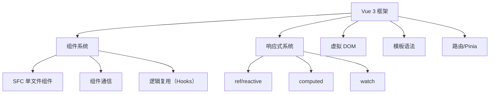

### 📊 框架对比

| 特性 | Vue | React | Angular |
|-----|-----|-------|---------|
| 学习曲线 | 🟢 平缓 | 🟡 中等 | 🔴 陡峭 |
| 灵活性 | ✅ 高 | ✅ 极高 | ⚠️ 受限 |
| 性能 | ✅ 优秀 | ✅ 优秀 | ✅ 优秀 |
| 生态 | ✅ 完整 | ✅ 最庞大 | ✅ 完整 |
| TypeScript | ✅ 优秀（3.3+） | ✅ 优秀 | ✅ 原生 |
| **范式** | 渐进式、易用 | 纯函数、声明式 | 全栈、强约束 |
| **响应式** | Proxy 自动追踪 | setState 手动触发 | Zone.js / Signals |
| **编译优化** | Block Tree + Patch Flag | React Compiler（19） | Incremental DOM |
| **Bundle** | ~33KB（gzip） | ~40KB | ~120KB |

### 🎨 Vue 五大设计理念

#### ① 渐进式（Progressive）

```
Vue 的渐进式设计：
  ├─ 一个 CDN script 标签 → 增强静态页面
  ├─ + SFC + 组件 → 完整的 SPA
  ├─ + Vue Router → 多页面路由
  ├─ + Pinia → 全局状态管理
  └─ + Nuxt → SSR/SSG 全栈
```

#### ② 易用性（Approachable）

```vue
<template>
  <div class="card" @click="handleClick">
    <h2>{{ title }}</h2>
    <slot />
  </div>
</template>

<script setup lang="ts">
import { ref, computed } from 'vue';

const count = ref(0);
const doubled = computed(() => count.value * 2);
</script>
```

#### ③ 响应式（Reactivity）

```javascript
// React：手动触发
const [count, setCount] = useState(0);
setCount(count + 1);

// Vue：自动追踪
const count = ref(0);
count.value++; // Proxy 自动拦截，触发更新
```

#### ④ 编译优化（Compile-time Optimization）

```
Vue 3 的编译优化三板斧：
  ├─ 静态提升（Static Hoisting）
  │   └─ 静态节点只在创建时执行一次
  ├─ Patch Flag
  │   └─ 为动态节点标记具体变化类型
  └─ Block Tree
      └─ 以动态节点为边界分割树
```

#### ⑤ 灵活性（Flexibility）

```
Vue 3 的多种选择：
  ├─ API 风格：Options API / Composition API
  ├─ 构建工具：Vite / Webpack
  ├─ 模板 vs JSX
  ├─ TypeScript：可选（渐进采用）
  └─ 状态管理：Pinia / Vuex / 自管理
```

### 💡 一个公式理解 Vue

```
UI = reactive(state) + template
│       │                  │
▼       ▼                  ▼
视图  响应式代理          声明式模板
```

### 🗺️ 版本演进（2014—2026）

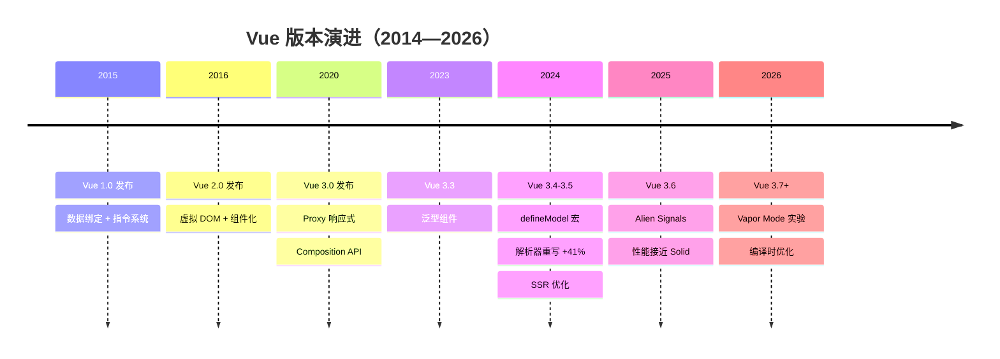

| 版本 | 年份 | 核心变化 | 对开发者的影响 |
|------|------|---------|--------------|
| **Vue 1.0** | 2015 | 数据绑定 + 指令系统 | 从 jQuery 到声明式 |
| **Vue 2.0** | 2016 | 虚拟 DOM、组件化 | 生态爆炸，成为主流 |
| **Vue 3.0** | 2020 | Proxy 响应式、Composition API | 性能大幅提升 |
| **Vue 3.3** | 2023 | 泛型组件 | TS 体验提升 |
| **Vue 3.4** | 2024 | defineModel 宏、解析器重写（+41%） | 编译速度显著提升 |
| **Vue 3.5** | 2024 | SSR 优化、内存改进 | 服务端渲染更高效 |
| **Vue 3.6** | 2025 | Alien Signals | 响应式性能接近 Solid.js |

---

# 📦 第2章：环境搭建与项目创建

## 2-1 环境准备

```bash
node -v  # 要求 22+（推荐 LTS）
npm -v   # 或 pnpm / yarn
```

## 2-2 创建项目（Vite）

```bash
npm create vue@latest
# 或
npm create vite@latest my-vue-app -- --template vue-ts

cd my-vue-app
npm install
npm run dev
```

## 2-3 项目结构

```
my-vue-app/
├── src/
│   ├── App.vue              # 根组件
│   ├── main.ts              # 应用入口
│   ├── components/          # 公共组件
│   ├── views/               # 页面组件
│   ├── stores/              # Pinia 状态
│   ├── router/              # 路由配置
│   ├── composables/         # 组合式函数
│   ├── assets/              # 静态资源
│   └── styles/              # 全局样式
├── index.html
├── vite.config.ts
├── tsconfig.json
└── package.json
```

## 2-4 vite.config.ts

```typescript
import { defineConfig } from 'vite';
import vue from '@vitejs/plugin-vue';
import { fileURLToPath, URL } from 'node:url';

export default defineConfig({
  plugins: [vue()],
  resolve: {
    alias: {
      '@': fileURLToPath(new URL('./src', import.meta.url)),
    },
  },
  server: {
    port: 3000,
    open: true,
    proxy: {
      '/api': {
        target: 'http://localhost:8080',
        changeOrigin: true,
      },
    },
  },
});
```

## 2-5 main.ts 入口

```typescript
import { createApp } from 'vue';
import { createPinia } from 'pinia';
import App from './App.vue';
import router from './router';
import './styles/main.css';

const app = createApp(App);
app.use(createPinia());
app.use(router);
app.mount('#app');
```

---

# 📦 第3章：Composition API

## 3-1 Options API vs Composition API

```vue
<!-- ❌ Options API：逻辑分散 -->
<script>
export default {
  data() { return { count: 0, name: '' } },
  computed: { doubledCount() { return this.count * 2 } },
  methods: { increment() { this.count++ } },
  watch: { name(newVal) { console.log(newVal) } },
};
</script>

<!-- ✅ Composition API：逻辑聚合 -->
<script setup lang="ts">
import { ref, computed, watch } from 'vue';

const count = ref(0);
const name = ref('');
const doubledCount = computed(() => count.value * 2);
const increment = () => count.value++;
watch(name, (newVal) => console.log(newVal));
</script>
```

## 3-2 ref / reactive

```typescript
import { ref, reactive } from 'vue';

// ref：适用于任何类型
const count = ref(0);
const user = ref<User | null>(null);
console.log(count.value); // 0
// 模板中自动解包: <div>{{ count }}</div>

// reactive：仅适用于对象
const state = reactive({
  count: 0,
  user: { name: 'John' },
});
console.log(state.count); // 0

// ⚠️ reactive 重新赋值会丢失响应性
state.count = 5;       // ✅ 正确
// state = { count: 5 } // ❌ 错误
```

### ref vs reactive

| 特性 | ref | reactive |
|------|-----|----------|
| 支持类型 | 任意类型 | 对象类型 |
| 访问方式 | `.value` | 直接访问 |
| 模板解包 | ✅ 自动 | ✅ 直接 |
| 重新赋值 | ✅ 安全 | ❌ 丢失响应 |
| 适用场景 | 基本类型、需要重新赋值 | 深层对象 |

## 3-3 computed

```typescript
const count = ref(1);
const multiplier = ref(2);

// 只读计算属性
const doubled = computed(() => count.value * multiplier.value);

// 可写计算属性
const fullName = computed({
  get: () => `${firstName.value} ${lastName.value}`,
  set: (newValue) => {
    const [first, last] = newValue.split(' ');
    firstName.value = first;
    lastName.value = last;
  },
});
```

## 3-4 watch / watchEffect

```typescript
const count = ref(0);
const user = ref({ name: 'Alice', age: 30 });

// watch：监听特定源
watch(count, (newVal, oldVal) => {
  console.log(`Count: ${oldVal} → ${newVal}`);
});

// 深度监听
watch(user, (newVal, oldVal) => {
  console.log('User changed:', newVal);
}, { deep: true });

// 监听多个源
watch([count, user], ([newCount, newUser]) => {
  console.log('Count or User changed');
});

// watchEffect：自动追踪依赖
watchEffect(() => {
  console.log(`Count 现在: ${count.value}`); // 自动追踪 count
});

// 停止监听
const stop = watch(count, () => {});
stop();
```

### watch vs watchEffect

| 特性 | watch | watchEffect |
|------|-------|-------------|
| 懒执行 | ✅ 默认不执行 | ❌ 立即执行 |
| 访问旧值 | ✅ 提供新旧值 | ❌ 只提供新值 |
| 显式源 | ✅ 需要指定 | ❌ 自动追踪 |
| 适用场景 | 特定数据变化时 | 副作用自动追踪 |

## 3-5 `<script setup>` 语法

```vue
<script setup lang="ts">
import { ref, computed, onMounted } from 'vue';
import Child from './Child.vue';

// 响应式数据
const count = ref(0);

// 计算属性
const doubled = computed(() => count.value * 2);

// 方法
function increment() {
  count.value++;
}

// 生命周期
onMounted(() => {
  console.log('组件已挂载');
});

// 定义 props
const props = defineProps<{
  title: string;
  count?: number;
}>();

// 定义 emits
const emit = defineEmits<{
  (e: 'update:count', value: number): void;
}>();
</script>

<template>
  <div>
    <h2>{{ title }}</h2>
    <p>Count: {{ count }} (翻倍: {{ doubled }})</p>
    <button @click="increment">+1</button>
    <Child :msg="title" />
  </div>
</template>
```

---

# 📦 第4章：响应式系统原理

## 4-1 Vue 2 vs Vue 3 响应式

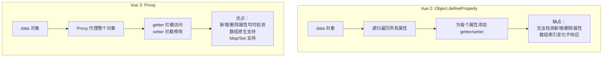

| 能力 | Vue 2（Object.defineProperty） | Vue 3（Proxy） |
|------|-------------------------------|----------------|
| 对象新增属性 | ❌ 需 Vue.set() | ✅ 自动检测 |
| 对象删除属性 | ❌ 需 Vue.delete() | ✅ 自动检测 |
| 数组下标修改 | ❌ 需重写方法 | ✅ 原生支持 |
| 数组长度变更 | ❌ 不可检测 | ✅ 原生支持 |
| Map/Set | ❌ 不支持 | ✅ 原生支持 |
| 初始化性能 | 递归遍历所有属性 | 懒代理（访问时才代理） |

## 4-2 响应式引擎核心原理

```typescript
// 简化版 Vue 3 响应式引擎
type Dep = Set<ReactiveEffect>;
const targetMap = new WeakMap<object, Map<string | symbol, Dep>>();

let activeEffect: ReactiveEffect | null = null;

class ReactiveEffect {
  deps: Dep[] = [];
  constructor(public fn: () => void) {}

  run() {
    try {
      activeEffect = this;
      return this.fn();
    } finally {
      activeEffect = null;
    }
  }
}

// Proxy handler
function reactive<T extends object>(target: T): T {
  return new Proxy(target, {
    get(target, key, receiver) {
      const value = Reflect.get(target, key, receiver);
      track(target, key);                               // 依赖收集
      if (isObject(value)) return reactive(value);       // 懒代理
      return value;
    },
    set(target, key, value, receiver) {
      const oldValue = Reflect.get(target, key, receiver);
      const result = Reflect.set(target, key, value, receiver);
      if (oldValue !== value) trigger(target, key);     // 触发更新
      return result;
    },
  });
}

// 依赖收集
function track(target: object, key: string | symbol) {
  if (!activeEffect) return;
  let depsMap = targetMap.get(target);
  if (!depsMap) targetMap.set(target, (depsMap = new Map()));
  let dep = depsMap.get(key);
  if (!dep) depsMap.set(key, (dep = new Set()));
  dep.add(activeEffect);
  activeEffect.deps.push(dep);
}

// 触发更新
function trigger(target: object, key: string | symbol) {
  const depsMap = targetMap.get(target);
  if (!depsMap) return;
  const dep = depsMap.get(key);
  if (!dep) return;
  dep.forEach(effect => {
    if (effect.scheduler) effect.scheduler();
    else effect.run();
  });
}
```

## 4-3 依赖收集流程图

```mermaid
flowchart TB
    subgraph 初始化
        init["reactive(obj)"] --> proxy["Proxy 代理"]
        proxy --> lazy["懒代理：<br/>只代理访问到的深层对象"]
    end

    subgraph 依赖收集
        render["模板渲染 / effect()"] --> setActive["设置 activeEffect"]
        setActive --> read["访问响应式属性"]
        read --> track["track(target, key)"]
        track --> addDep["将 activeEffect 加入 Dep"]
    end

    subgraph 派发更新
        modify["修改属性值"] --> setter["触发 Proxy setter"]
        setter --> trigger["trigger(target, key)"]
        trigger --> notify["通知所有 effect"]
        notify --> reRender["组件重新渲染"]
    end
```

## 4-4 Alien Signals（Vue 3.6+）

Vue 3.6 引入 Alien Signals，进一步优化响应式性能，使响应式追踪粒度更细、开销更小。

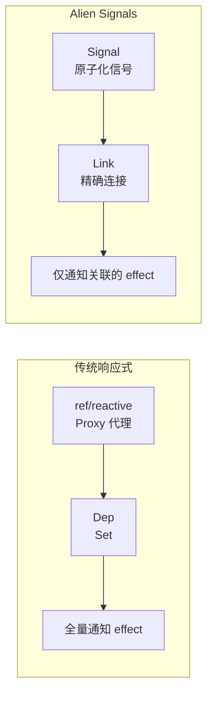

---

# 📦 第5章：组件系统

## 5-1 SFC 单文件组件

```vue
<script setup lang="ts">
import { ref, computed } from 'vue';

interface Product {
  id: number;
  name: string;
  price: number;
  image: string;
}

const props = defineProps<{ product: Product }>();
const emit = defineEmits<{ (e: 'add-to-cart', id: number): void }>();

const discountedPrice = computed(() => props.product.price * 0.9);

function handleAdd() {
  emit('add-to-cart', props.product.id);
}
</script>

<template>
  <div class="product-card">
    
    <h3 class="product-name">{{ product.name }}</h3>
    <div class="product-price">
      <span class="original">¥{{ product.price }}</span>
      <span class="discounted">¥{{ discountedPrice }}</span>
    </div>
    <button class="add-btn" @click="handleAdd">加入购物车</button>
  </div>
</template>

<style scoped>
.product-card { border: 1px solid #e0e0e0; border-radius: 8px; padding: 16px; }
.product-name { font-size: 16px; font-weight: 600; }
.discounted { color: #e74c3c; font-weight: bold; }
.original { text-decoration: line-through; color: #999; margin-right: 8px; }
</style>
```

## 5-2 Props 声明

```vue
<script setup lang="ts">
// 方式1：类型声明（推荐）
const props = defineProps<{
  title: string;
  count?: number;
  items: string[];
  user?: {
    name: string;
    age: number;
  };
}>();

// 方式2：运行时声明（需要默认值时）
const props2 = defineProps({
  title: { type: String, required: true },
  count: { type: Number, default: 0 },
  items: { type: Array as () => string[], default: () => [] },
});

// withDefaults：为类型声明 props 添加默认值
interface Props {
  title: string;
  count?: number;
  items?: string[];
}

const props3 = withDefaults(defineProps<Props>(), {
  count: 0,
  items: () => [],
});
</script>
```

## 5-3 Emits 声明

```vue
<script setup lang="ts">
// 方式1：类型声明（推荐）
const emit = defineEmits<{
  (e: 'submit', data: FormData): void;
  (e: 'close', reason: string): void;
  (e: 'update:modelValue', value: string): void;
}>();

// 方式2：运行时声明
const emit2 = defineEmits(['submit', 'close']);

function handleSubmit() {
  emit('submit', formData);
}
</script>
```

## 5-4 v-model 组件双向绑定

```vue
<!-- 父组件 -->
<script setup lang="ts">
const searchText = ref('');
</script>

<template>
  <SearchInput v-model="searchText" />
</template>

<!-- 子组件 SearchInput.vue -->
<script setup lang="ts">
defineProps<{ modelValue: string }>();
const emit = defineEmits<{ (e: 'update:modelValue', value: string): void }>();

function handleInput(e: Event) {
  emit('update:modelValue', (e.target as HTMLInputElement).value);
}
</script>

<template>
  <input :value="modelValue" @input="handleInput" class="search-input" />
</template>
```

## 5-5 Slot 插槽

```vue
<!-- 子组件 Card.vue -->
<template>
  <div class="card">
    <div class="card-header">
      <slot name="header">默认标题</slot>
    </div>
    <div class="card-body">
      <slot />
    </div>
    <div class="card-footer">
      <slot name="footer" />
    </div>
  </div>
</template>

<!-- 父组件使用 -->
<template>
  <Card>
    <template #header>
      <h2>产品卡片</h2>
    </template>
    <p>这是卡片内容</p>
    <template #footer>
      <button>确认</button>
    </template>
  </Card>
</template>
```

## 5-6 动态组件

```vue
<script setup lang="ts">
const currentTab = ref('Home');
const tabs = ['Home', 'Products', 'About'] as const;
</script>

<template>
  <div class="tabs">
    <button v-for="tab in tabs" :key="tab"
      @click="currentTab = tab"
      :class="{ active: currentTab === tab }">
      {{ tab }}
    </button>
  </div>

  <KeepAlive>
    <component :is="currentTab" />
  </KeepAlive>
</template>
```

---

# 📦 第6章：模板语法与指令

## 6-1 插值与绑定

```html
<!-- 文本插值 -->
<p>{{ message }}</p>
<p>{{ count + 1 }}</p>
<p>{{ isActive ? '激活' : '未激活' }}</p>

<!-- 属性绑定 -->

<button :disabled="isDisabled">按钮</button>
<div :class="{ active: isActive, disabled: isDisabled }">动态类</div>
<div :class="[baseClass, isActive ? 'active' : '']">数组类</div>
<div :style="{ color: activeColor, fontSize: size + 'px' }">动态样式</div>

<!-- 事件绑定 -->
<button @click="handleClick">点击</button>
<input @keyup.enter="submit" @keyup.escape="cancel" />
<div @click.stop="onClick">阻止冒泡</div>
<a @click.prevent="onClick">阻止默认</a>
```

## 6-2 v-model 修饰符

```html
<input v-model="text" />
<input v-model.number="age" />
<input v-model.trim="name" />
<input v-model.lazy="message" />
```

| 修饰符 | 作用 | 示例 |
|--------|------|------|
| `.number` | 自动转为数字 | `v-model.number="age"` |
| `.trim` | 去除首尾空格 | `v-model.trim="name"` |
| `.lazy` | 改为 change 事件触发 | `v-model.lazy="message"` |

## 6-3 条件渲染

```html
<!-- v-if 系列：条件渲染，切换时销毁/重建 -->
<div v-if="status === 'loading'">加载中...</div>
<div v-else-if="status === 'error'">出错了</div>
<div v-else>内容加载完成</div>

<!-- v-show：始终渲染，切换 display 属性 -->
<div v-show="isVisible">始终在 DOM 中</div>
```

### v-if vs v-show

| 指令 | 渲染方式 | 切换成本 | 初始渲染 | 适用场景 |
|------|----------|---------|---------|---------|
| `v-if` | 条件渲染，销毁/创建 DOM | 高（重建） | 条件 false 时不创建 | 不频繁切换 |
| `v-show` | 始终渲染，切换 display | 低（CSS） | 始终创建 | 频繁切换 |

## 6-4 列表渲染

```html
<!-- v-for 基本用法 -->
<ul>
  <li v-for="item in items" :key="item.id">{{ item.name }}</li>
</ul>

<!-- 带索引 -->
<li v-for="(item, index) in items" :key="item.id">{{ index }} - {{ item.name }}</li>

<!-- 遍历对象 -->
<li v-for="(value, key, index) in user" :key="key">{{ key }}: {{ value }}</li>

<!-- 范围遍历 -->
<li v-for="n in 10" :key="n">{{ n }}</li>
```

## 6-5 Teleport

将内容渲染到指定的 DOM 节点：

```vue
<!-- 将模态框传送到 body 下 -->
<Teleport to="body">
  <div class="modal" v-if="showModal">
    <div class="modal-content">
      <slot />
    </div>
  </div>
</Teleport>
```

## 6-6 Suspense（实验性）

```vue
<script setup lang="ts">
import { ref } from 'vue';

const userData = ref(await fetchUser()); // 顶层 await
</script>

<template>
  <Suspense>
    <template #default>
      <UserProfile :user="userData" />
    </template>
    <template #fallback>
      <LoadingSpinner />
    </template>
  </Suspense>
</template>
```

---

# 📦 第7章：生命周期与组件通信

## 7-1 生命周期钩子

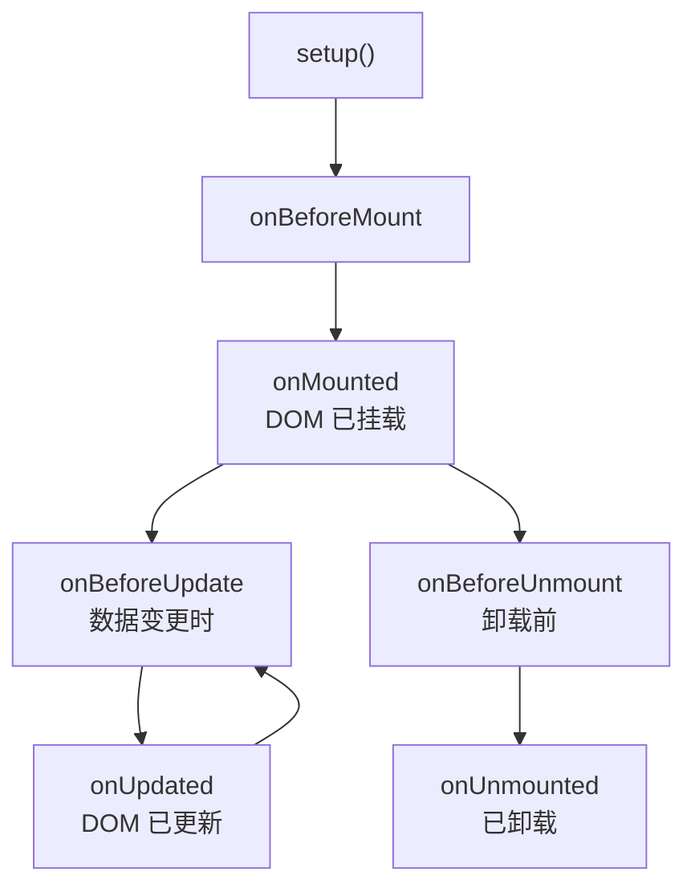

### 组合式 API 生命周期

| 选项式 API | 组合式 API | 执行时机 |
|-----------|-----------|---------|
| `beforeCreate` | `setup()` | 组件实例化后 |
| `created` | `setup()` | 同上 |
| `beforeMount` | `onBeforeMount` | 挂载到 DOM 前 |
| `mounted` | `onMounted` | DOM 挂载后 |
| `beforeUpdate` | `onBeforeUpdate` | 数据更新，DOM 未更新 |
| `updated` | `onUpdated` | DOM 更新完毕 |
| `beforeDestroy` | `onBeforeUnmount` | 组件卸载前 |
| `destroyed` | `onUnmounted` | 组件卸载后 |
| `activated` | `onActivated` | keep-alive 激活时 |
| `deactivated` | `onDeactivated` | keep-alive 停用时 |
| `errorCaptured` | `onErrorCaptured` | 捕获子组件错误 |

## 7-2 组件通信方式

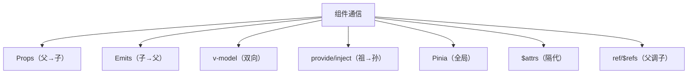

## 7-3 Props 父向子

```vue
<!-- 父组件 -->
<template>
  <Child :message="msg" :user="userData" :count="123" />
</template>

<!-- 子组件 -->
<script setup lang="ts">
const props = defineProps<{
  message: string;
  user: User;
  count?: number;
}>();
</script>
```

## 7-4 Emits 子向父

```vue
<!-- 子组件 -->
<script setup lang="ts">
const emit = defineEmits<{
  (e: 'increment', value: number): void;
  (e: 'update:modelValue', value: string): void;
}>();
</script>

<template>
  <button @click="emit('increment', 1)">增加</button>
</template>

<!-- 父组件 -->
<template>
  <Child @increment="(val) => count += val" />
</template>
```

## 7-5 provide / inject 祖孙通信

```vue
<!-- 祖先组件 -->
<script setup lang="ts">
import { provide, ref } from 'vue';

const theme = ref<'light' | 'dark'>('light');
provide('theme', theme);
provide('toggleTheme', () => {
  theme.value = theme.value === 'light' ? 'dark' : 'light';
});
</script>

<!-- 后代组件 -->
<script setup lang="ts">
import { inject } from 'vue';

const theme = inject('theme', ref<'light' | 'dark'>('light'));
const toggleTheme = inject<() => void>('toggleTheme');
</script>

<template>
  <div :class="theme">
    <p>当前主题: {{ theme }}</p>
    <button @click="toggleTheme">切换</button>
  </div>
</template>
```

## 7-6 父子组件生命周期顺序

**挂载阶段：**
```
父 setup → 子 setup → 子 onMounted → 父 onMounted
```

**更新阶段：**
```
父 onBeforeUpdate → 子 onBeforeUpdate → 子 onUpdated → 父 onUpdated
```

**卸载阶段：**
```
父 onBeforeUnmount → 子 onBeforeUnmount → 子 onUnmounted → 父 onUnmounted
```

---

# 📦 第8章：Vue Router 路由系统

## 8-1 路由配置

```typescript
// router/index.ts
import { createRouter, createWebHistory } from 'vue-router';
import type { RouteRecordRaw } from 'vue-router';

const routes: RouteRecordRaw[] = [
  {
    path: '/',
    name: 'home',
    component: () => import('@/views/Home.vue'), // 懒加载
  },
  {
    path: '/products',
    name: 'products',
    component: () => import('@/views/ProductList.vue'),
    children: [
      { path: ':id', name: 'product-detail', component: () => import('@/views/ProductDetail.vue') },
    ],
  },
  {
    path: '/cart',
    name: 'cart',
    component: () => import('@/views/Cart.vue'),
    meta: { requiresAuth: true },
  },
  {
    path: '/login',
    name: 'login',
    component: () => import('@/views/Login.vue'),
  },
  {
    path: '/:pathMatch(.*)*',
    name: 'not-found',
    component: () => import('@/views/NotFound.vue'),
  },
];

const router = createRouter({
  history: createWebHistory(),
  routes,
  scrollBehavior(to, from, savedPosition) {
    if (savedPosition) return savedPosition;
    return { top: 0 };
  },
});

export default router;
```

## 8-2 路由导航

```vue
<script setup lang="ts">
import { useRoute, useRouter } from 'vue-router';

const route = useRoute();
const router = useRouter();

// 读取参数
const productId = computed(() => route.params.id as string);
const category = computed(() => route.query.category as string);

// 编程式导航
function goToProduct(id: number) {
  router.push({ name: 'product-detail', params: { id } });
}

function goBack() {
  router.back();
}

function goToLogin() {
  router.push({ path: '/login', query: { redirect: route.fullPath } });
}
</script>

<template>
  <!-- 声明式导航 -->
  <nav>
    <RouterLink to="/">首页</RouterLink>
    <RouterLink to="/products">产品</RouterLink>
    <RouterLink :to="{ name: 'cart' }">购物车</RouterLink>

    <!-- 激活样式 -->
    <RouterLink to="/products"
      class="nav-link"
      active-class="active"
      :class="{ highlight: route.path.startsWith('/products') }">
      产品
    </RouterLink>
  </nav>

  <!-- 路由出口 -->
  <RouterView />
</template>
```

## 8-3 路由守卫

```typescript
// 全局前置守卫
router.beforeEach(async (to, from) => {
  const authStore = useAuthStore();

  // 需要登录
  if (to.meta.requiresAuth && !authStore.isAuthenticated) {
    return { path: '/login', query: { redirect: to.fullPath } };
  }

  // 已登录用户不能访问登录页
  if (to.name === 'login' && authStore.isAuthenticated) {
    return { path: '/' };
  }
});

// 全局后置守卫
router.afterEach((to) => {
  document.title = `${to.meta.title as string} - 电商平台`;
});

// 组件内守卫
onBeforeRouteLeave((to, from) => {
  const answer = window.confirm('确定离开吗？');
  if (!answer) return false;
});
```

## 8-4 路由元信息

```typescript
const routes = [
  {
    path: '/admin',
    meta: {
      requiresAuth: true,
      role: 'admin',
      title: '管理后台',
      transition: 'slide-left',
    },
    component: () => import('@/views/Admin.vue'),
  },
];

// 在组件中访问
const route = useRoute();
const title = route.meta.title as string;
```

---

# 📦 第9章：Pinia 状态管理

## 9-1 创建 Store

```typescript
// stores/cart.ts
import { defineStore } from 'pinia';
import { ref, computed } from 'vue';

interface CartItem {
  id: number;
  name: string;
  price: number;
  quantity: number;
  image: string;
}

export const useCartStore = defineStore('cart', () => {
  // State
  const items = ref<CartItem[]>([]);

  // Getters
  const totalCount = computed(() =>
    items.value.reduce((sum, item) => sum + item.quantity, 0)
  );

  const totalAmount = computed(() =>
    items.value.reduce((sum, item) => sum + item.price * item.quantity, 0)
  );

  const isEmpty = computed(() => items.value.length === 0);

  // Actions
  function addItem(product: Omit<CartItem, 'quantity'>) {
    const existing = items.value.find(i => i.id === product.id);
    if (existing) {
      existing.quantity++;
    } else {
      items.value.push({ ...product, quantity: 1 });
    }
  }

  function removeItem(id: number) {
    items.value = items.value.filter(i => i.id !== id);
  }

  function updateQuantity(id: number, quantity: number) {
    const item = items.value.find(i => i.id === id);
    if (item) item.quantity = Math.max(0, quantity);
  }

  function clearCart() {
    items.value = [];
  }

  return { items, totalCount, totalAmount, isEmpty, addItem, removeItem, updateQuantity, clearCart };
});
```

## 9-2 在组件中使用

```vue
<script setup lang="ts">
import { useCartStore } from '@/stores/cart';
import { storeToRefs } from 'pinia';

const cartStore = useCartStore();

// 解构保持响应性
const { items, totalCount, totalAmount } = storeToRefs(cartStore);

function handleAddToCart(product: Product) {
  cartStore.addItem(product);
}
</script>

<template>
  <div>
    <div class="cart-header">
      <h2>购物车 ({{ totalCount }})</h2>
      <span>总计: ¥{{ totalAmount }}</span>
    </div>

    <div v-for="item in items" :key="item.id" class="cart-item">
      
      <div class="item-info">
        <h3>{{ item.name }}</h3>
        <p>¥{{ item.price }}</p>
      </div>
      <div class="quantity-controls">
        <button @click="cartStore.updateQuantity(item.id, item.quantity - 1)">-</button>
        <span>{{ item.quantity }}</span>
        <button @click="cartStore.updateQuantity(item.id, item.quantity + 1)">+</button>
      </div>
      <button @click="cartStore.removeItem(item.id)" class="remove-btn">删除</button>
    </div>

    <button v-if="!isEmpty" @click="cartStore.clearCart()" class="clear-btn">清空购物车</button>
  </div>
</template>
```

## 9-3 Pinia 持久化

```typescript
// stores/cart.ts
import { defineStore } from 'pinia';
import { ref, watch } from 'vue';

export const useCartStore = defineStore('cart', () => {
  const items = ref<CartItem[]>(JSON.parse(localStorage.getItem('cart') || '[]'));

  // 自动持久化
  watch(items, (newVal) => {
    localStorage.setItem('cart', JSON.stringify(newVal));
  }, { deep: true });

  function addItem(product: Omit<CartItem, 'quantity'>) { ... }
  function removeItem(id: number) { ... }

  return { items, addItem, removeItem };
});

// 或使用 pinia-plugin-persistedstate
// npm install pinia-plugin-persistedstate
export const useCartStore = defineStore('cart', () => {
  // ...
}, {
  persist: {
    key: 'cart',
    storage: localStorage,
    paths: ['items'], // 只持久化 items
  },
});
```

## 9-4 Pinia vs Vuex

| 特性 | Pinia | Vuex 4 |
|------|-------|--------|
| TypeScript | ✅ 原生 | ⚠️ 需手动类型 |
| 体积 | ~1KB | ~10KB |
| 模块 | ❌ 不需要 | ✅ modules |
| DevTools | ✅ 支持 | ✅ 支持 |
| Composition API | ✅ 原生 | ⚠️ 需要辅助 |
| 推荐度 | ✅ 官方推荐 | ⚠️ 维护模式 |

---

# 📦 第10章：常用 Composition API 工具函数

## 10-1 ref / reactive 最佳实践

```typescript
// ✅ 复杂表单状态用 reactive + toRefs
const form = reactive({
  name: '',
  email: '',
  password: '',
  address: {
    city: '',
    street: '',
  },
});

// 解构并保持响应性
const { name, email } = toRefs(form);

// ✅ 需要重新赋值用 ref
const user = ref<User | null>(null);
user.value = await fetchUser(); // ref 可以重新赋值
```

## 10-2 shallowRef / shallowReactive

```typescript
import { shallowRef, shallowReactive } from 'vue';

// 浅层响应式：只追踪顶层属性变化
const users = shallowRef<User[]>([]);
users.value = newUsers; // ✅ 触发更新
users.value[0].name = 'New'; // ❌ 不触发更新（嵌套不追踪）

// 适用于：大数据列表、不需要深层响应的场景
```

## 10-3 triggerRef

```typescript
import { shallowRef, triggerRef } from 'vue';

const users = shallowRef<User[]>([]);

function updateUserName(id: number, name: string) {
  const user = users.value.find(u => u.id === id);
  if (user) {
    user.name = name;
    triggerRef(users); // 手动触发响应
  }
}
```

## 10-4 toRef / toRefs

```typescript
import { reactive, toRef, toRefs } from 'vue';

const state = reactive({
  name: 'Alice',
  age: 30,
});

// toRef：为单个属性创建 ref
const nameRef = toRef(state, 'name');
nameRef.value = 'Bob'; // 同时更新 state.name

// toRefs：将 reactive 所有属性转为 ref
const { name, age } = toRefs(state);
```

## 10-5 readonly

```typescript
import { ref, readonly, type DeepReadonly } from 'vue';

const count = ref(0);
const readonlyCount = readonly(count); // 只读版本

const state = reactive({ user: { name: 'Alice' } });
const readonlyState = readonly(state); // 深度只读
```

## 10-6 isRef / unref

```typescript
import { isRef, unref, ref } from 'vue';

function useLength(value: string | Ref<string>) {
  // unref：如果是 ref 则返回 .value，否则返回原值
  const len = unref(value).length;
  return len;
}

// 类型守卫
if (isRef(value)) {
  value.value = 'new'; // TypeScript 自动推断为 Ref 类型
}
```

---

# 📦 第11章：自定义 Hooks 与逻辑复用

## 11-1 useAsync 异步管理

```typescript
// composables/useAsync.ts
import { ref, type Ref } from 'vue';

interface UseAsyncReturn<T> {
  data: Ref<T | null>;
  loading: Ref<boolean>;
  error: Ref<string | null>;
  execute: () => Promise<void>;
}

export function useAsync<T>(
  asyncFn: () => Promise<T>,
  immediate = true
): UseAsyncReturn<T> {
  const data = ref<T | null>(null) as Ref<T | null>;
  const loading = ref(false);
  const error = ref<string | null>(null);

  const execute = async () => {
    loading.value = true;
    error.value = null;
    try {
      data.value = await asyncFn();
    } catch (err) {
      error.value = err instanceof Error ? err.message : '未知错误';
    } finally {
      loading.value = false;
    }
  };

  if (immediate) execute();

  return { data, loading, error, execute };
}

// 使用
const { data: products, loading, error, execute: reload } = useAsync(
  () => fetch('/api/products').then(r => r.json()),
  true
);
```

## 11-2 useDebounce / useThrottle

```typescript
// composables/useDebounce.ts
import { ref, watch, type Ref } from 'vue';

export function useDebounce<T>(value: Ref<T>, delay = 300): Ref<T> {
  const debouncedValue = ref(value.value) as Ref<T>;

  watch(value, () => {
    const handler = setTimeout(() => {
      debouncedValue.value = value.value;
    }, delay);

    // 自动清理：watch 返回的停止函数
    watch(value, () => clearTimeout(handler), { once: true });
  });

  return debouncedValue;
}

// composables/useThrottle.ts
import { ref, watch, type Ref } from 'vue';

export function useThrottle<T>(value: Ref<T>, delay = 300): Ref<T> {
  const throttledValue = ref(value.value) as Ref<T>;
  let lastCall = 0;

  watch(value, () => {
    const now = Date.now();
    if (now - lastCall >= delay) {
      throttledValue.value = value.value;
      lastCall = now;
    }
  });

  return throttledValue;
}

// 使用
const searchQuery = ref('');
const debouncedQuery = useDebounce(searchQuery, 500);

watch(debouncedQuery, (query) => {
  if (query) searchAPI(query);
});
```

## 11-3 useLocalStorage

```typescript
// composables/useLocalStorage.ts
import { ref, watch, type Ref } from 'vue';

export function useLocalStorage<T>(key: string, initialValue: T): Ref<T> {
  const storedValue = ref<T>(() => {
    try {
      const item = localStorage.getItem(key);
      return item ? JSON.parse(item) : initialValue;
    } catch {
      return initialValue;
    }
  }) as Ref<T>;

  watch(storedValue, (newVal) => {
    localStorage.setItem(key, JSON.stringify(newVal));
  }, { deep: true });

  return storedValue;
}

// 使用
const theme = useLocalStorage('theme', 'light');
const cartItems = useLocalStorage<CartItem[]>('cart', []);
```

## 11-4 useEventListener

```typescript
// composables/useEventListener.ts
import { onMounted, onUnmounted } from 'vue';

export function useEventListener(
  target: EventTarget,
  event: string,
  handler: EventListener
) {
  onMounted(() => target.addEventListener(event, handler));
  onUnmounted(() => target.removeEventListener(event, handler));
}

// 使用
useEventListener(window, 'resize', () => {
  console.log(window.innerWidth);
});

useEventListener(document, 'keydown', (e: KeyboardEvent) => {
  if (e.key === 'Escape') closeModal();
});
```

## 11-5 useIntersectionObserver

```typescript
// composables/useIntersectionObserver.ts
import { ref, onMounted, onUnmounted, type Ref } from 'vue';

export function useIntersectionObserver(
  targetRef: Ref<HTMLElement | null>,
  options?: IntersectionObserverInit
): Ref<boolean> {
  const isIntersecting = ref(false);

  onMounted(() => {
    if (!targetRef.value) return;

    const observer = new IntersectionObserver(([entry]) => {
      isIntersecting.value = entry.isIntersecting;
    }, options);

    observer.observe(targetRef.value);
    onUnmounted(() => observer.disconnect());
  });

  return isIntersecting;
}

// 使用
const loadMoreRef = ref<HTMLElement | null>(null);
const isVisible = useIntersectionObserver(loadMoreRef, {
  threshold: 0.1,
});

watch(isVisible, (visible) => {
  if (visible) loadMore();
});
```

## 11-6 常用 Hooks 一览

| Hook | 用途 | 来源 |
|------|------|------|
| `useAsync` | 异步请求管理 | 自定义 |
| `useDebounce` | 防抖 | 自定义 |
| `useThrottle` | 节流 | 自定义 |
| `useLocalStorage` | 本地存储 | 自定义 |
| `useEventListener` | 事件监听 | 自定义 |
| `useIntersectionObserver` | 滚动加载 | 自定义 |
| `useMouse` | 鼠标位置 | VueUse |
| `useWindowSize` | 窗口大小 | VueUse |
| `useClipboard` | 剪贴板 | VueUse |
| `useDark` | 暗黑模式 | VueUse |

```bash
# VueUse - 官方工具集
npm install @vueuse/core
```

---

# 📦 第12章：Vue 3 + TypeScript 集成

## 12-1 TS 配置

```json
{
  "compilerOptions": {
    "target": "ES2022",
    "module": "ESNext",
    "moduleResolution": "bundler",
    "strict": true,
    "jsx": "preserve",
    "resolveJsonModule": true,
    "paths": {
      "@/*": ["./src/*"]
    }
  },
  "include": ["src/**/*.ts", "src/**/*.vue"],
  "references": [{ "path": "./tsconfig.node.json" }]
}
```

## 12-2 组件类型安全

```vue
<script setup lang="ts">
// Props 类型
interface Product {
  id: number;
  name: string;
  price: number;
  category: string;
  tags?: string[];
  images: string[];
}

interface ProductCardProps {
  product: Product;
  showDiscount?: boolean;
  variant?: 'small' | 'medium' | 'large';
}

const props = withDefaults(defineProps<ProductCardProps>(), {
  showDiscount: false,
  variant: 'medium',
});

// Emits 类型
const emit = defineEmits<{
  (e: 'add-to-cart', id: number): void;
  (e: 'toggle-favorite', id: number, isFav: boolean): void;
}>();

// 模板 ref 类型
const cardRef = ref<HTMLElement | null>(null);
const childRef = ref<InstanceType<typeof ChildComponent> | null>(null);

// 事件处理类型
function handleClick(event: MouseEvent) {
  console.log(event.clientX);
}

function handleInput(event: Event) {
  const target = event.target as HTMLInputElement;
  console.log(target.value);
}
</script>
```

## 12-3 泛型组件（Vue 3.3+）

```vue
<script setup lang="ts" generic="T extends { id: number | string }">
defineProps<{
  items: T[];
  selectedId?: T['id'];
  renderItem: (item: T) => string;
}>();

const emit = defineEmits<{
  (e: 'select', id: T['id']): void;
}>();
</script>

<template>
  <ul>
    <li v-for="item in items" :key="item.id"
      @click="emit('select', item.id)"
      :class="{ selected: item.id === selectedId }">
      {{ renderItem(item) }}
    </li>
  </ul>
</template>
```

## 12-4 类型声明文件

```typescript
// src/types/env.d.ts
/// <reference types="vite/client" />

declare module '*.vue' {
  import type { DefineComponent } from 'vue';
  const component: DefineComponent<{}, {}, any>;
  export default component;
}

interface ImportMetaEnv {
  readonly VITE_API_URL: string;
  readonly VITE_APP_TITLE: string;
}

interface ImportMeta {
  readonly env: ImportMetaEnv;
}
```

---

# 📦 第13章：性能优化与编译原理

## 13-1 编译优化三件套

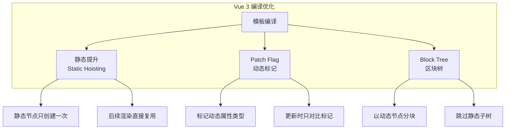

### 静态提升

```html
<!-- 编译前 -->
<div>
  <span>静态文本</span>       <!-- 静态节点 -->
  <span>{{ dynamic }}</span>  <!-- 动态节点 -->
</div>

<!-- 编译后（简化） -->
const _hoisted_1 = _createVNode("span", null, "静态文本");

function render() {
  return _createVNode("div", null, [
    _hoisted_1,                          // 复用静态节点
    _createVNode("span", null, ctx.dynamic)  // 动态节点
  ]);
}
```

### Patch Flag

```html
<!-- 编译前 -->
<div :class="active" :style="style" @click="handler">{{ text }}</div>

<!-- 编译后 -->
_createVNode("div", {
  class: ctx.active,
  style: ctx.style,
  onClick: ctx.handler
}, ctx.text, 9 /* CLASS | STYLE | TEXT */)
```

## 13-2 响应式优化

```typescript
// 1. 使用 shallowRef 避免深层响应
const largeList = shallowRef<Item[]>([]);
largeList.value = newItems; // 替换整个数组

// 2. 合理使用 computed 缓存
const filteredProducts = computed(() =>
  products.value.filter(p => p.price < threshold.value)
);

// 3. 避免不必要的 watch deep
// ❌ 避免深度监听大对象
watch(user, handler, { deep: true });
// ✅ 只监听需要的属性
watch(() => user.value.name, handler);

// 4. v-once：一次性渲染
<div v-once>{{ expensiveComputation }}</div>
```

## 13-3 组件优化

```vue
<script setup lang="ts">
// 1. 动态组件使用 KeepAlive
// 2. v-memo：缓存模板片段（Vue 3.2+）
// 3. 函数式组件减少开销
</script>

<template>
  <!-- KeepAlive：缓存组件状态 -->
  <KeepAlive>
    <component :is="currentTab" />
  </KeepAlive>

  <!-- v-memo：依赖不变时跳过渲染 -->
  <div v-memo="[product.id, product.price]">
    {{ product.name }} - ¥{{ product.price }}
  </div>
</template>
```

## 13-4 路由懒加载

```typescript
// 路由懒加载：按需加载组件代码
const routes = [
  {
    path: '/products',
    component: () => import('@/views/ProductList.vue'),
  },
  {
    path: '/checkout',
    component: () => import('@/views/Checkout.vue'),
  },
];
```

## 13-5 Vapor Mode（Vue 3.6+ 实验性）

Vapor Mode 是 Vue 的**无虚拟 DOM 编译模式**，在编译时将模板直接编译为细粒度的 DOM 更新操作，跳过虚拟 DOM 阶段。

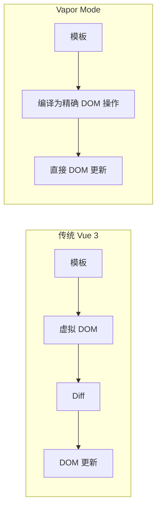

## 13-6 性能优化清单

| 优化项 | 效果 | 难度 |
|--------|------|------|
| **v-once** | 静态内容仅渲染一次 | 🟢 低 |
| **v-memo** | 缓存模板片段 | 🟢 低 |
| **shallowRef** | 避免深层响应 | 🟢 低 |
| **computed 缓存** | 减少重复计算 | 🟢 低 |
| **路由懒加载** | 减少首屏 Bundle | 🟢 低 |
| **KeepAlive** | 缓存组件 | 🟢 低 |
| **异步组件** | 按需加载 | 🟡 中 |
| **虚拟滚动** | 优化长列表 | 🟡 中 |
| **Vapor Mode** | 免虚拟 DOM | 🔴 实验性 |

---

# 📦 第14章：全栈实战与部署

## 14-1 项目架构

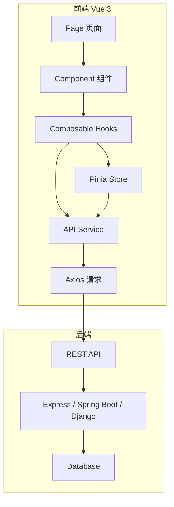

## 14-2 API 封装

```typescript
// utils/http.ts
import axios from 'axios';
import type { AxiosInstance, AxiosRequestConfig } from 'axios';

const http: AxiosInstance = axios.create({
  baseURL: import.meta.env.VITE_API_URL,
  timeout: 10000,
  headers: { 'Content-Type': 'application/json' },
});

// 请求拦截器
http.interceptors.request.use((config) => {
  const token = localStorage.getItem('token');
  if (token) {
    config.headers.Authorization = `Bearer ${token}`;
  }
  return config;
});

// 响应拦截器
http.interceptors.response.use(
  (response) => response.data,
  (error) => {
    if (error.response?.status === 401) {
      localStorage.removeItem('token');
      window.location.href = '/login';
    }
    return Promise.reject(error);
  }
);

export default http;

// services/productService.ts
export const productService = {
  getProducts(params?: { category?: string; page?: number }) {
    return http.get<Product[]>('/products', { params });
  },
  getProductById(id: number) {
    return http.get<Product>(`/products/${id}`);
  },
  createProduct(product: Partial<Product>) {
    return http.post<Product>('/products', product);
  },
  updateProduct(id: number, product: Partial<Product>) {
    return http.put<Product>(`/products/${id}`, product);
  },
  deleteProduct(id: number) {
    return http.delete(`/products/${id}`);
  },
};
```

## 14-3 JWT 登录实战

```typescript
// stores/auth.ts
import { defineStore } from 'pinia';
import { ref, computed } from 'vue';
import { useRouter } from 'vue-router';
import http from '@/utils/http';

interface User {
  id: number;
  email: string;
  name: string;
  avatar?: string;
}

export const useAuthStore = defineStore('auth', () => {
  const user = ref<User | null>(null);
  const token = ref<string | null>(localStorage.getItem('token'));

  const isAuthenticated = computed(() => !!token.value);

  async function login(email: string, password: string) {
    const response = await http.post<{ token: string; user: User }>('/auth/login', {
      email, password,
    });
    token.value = response.token;
    user.value = response.user;
    localStorage.setItem('token', response.token);
  }

  function logout() {
    token.value = null;
    user.value = null;
    localStorage.removeItem('token');
  }

  return { user, token, isAuthenticated, login, logout };
});
```

## 14-4 构建部署

```bash
# 构建
npm run build

# 预览构建结果
npm run preview

# 环境变量
# .env.development
VITE_API_URL=http://localhost:3000

# .env.production
VITE_API_URL=https://api.example.com
```

```nginx
# nginx.conf
server {
    listen 80;
    server_name example.com;

    root /var/www/dist;
    index index.html;

    # SPA 路由重定向
    location / {
        try_files $uri $uri/ /index.html;
    }

    # API 反向代理
    location /api/ {
        proxy_pass http://localhost:3000;
        proxy_set_header Host $host;
        proxy_set_header X-Real-IP $remote_addr;
    }

    # 静态资源缓存
    location /assets/ {
        expires 1y;
        add_header Cache-Control "public, immutable";
    }
}
```

---

# 🎯 高频面试题精选

## Q1: Vue 响应式原理

Vue 3 使用 **Proxy** 代理整个对象，在 `getter` 中调用 `track()` 收集依赖，在 `setter` 中调用 `trigger()` 触发更新。依赖通过 `WeakMap<target, Map<key, Set<effect>>>` 结构存储。

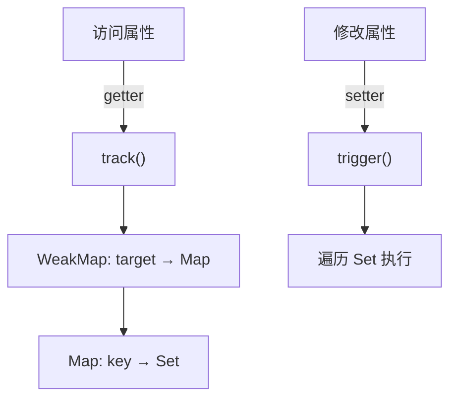

## Q2: ref vs reactive

| 维度 | ref | reactive |
|------|-----|----------|
| 数据结构 | `Ref<T>` 包装 | `T` 直接代理 |
| 访问方式 | `.value` | 直接访问 |
| 模板解包 | 顶层自动解包 | 直接使用 |
| 重新赋值 | ✅ 安全 | ❌ 丢失响应 |
| 适用类型 | 所有类型 | 对象/数组 |

## Q3: Computed 实现原理

Computed 本质是一个**惰性求值**的响应式副作用，内部维护 `dirty` 标记位：

1. 首次访问时计算值，设置 `dirty = false`
2. 依赖变化时仅设置 `dirty = true`，不重新计算
3. 再次访问时检查 `dirty`，为 `true` 则重新计算

## Q4: nextTick 原理

`nextTick` 利用**微任务**（Promise.then）在 DOM 更新后执行回调：

```
数据变更 → 队列 Watcher → flushSchedulerQueue
→ 更新 DOM → nextTick 回调（微任务）
```

## Q5: Vue 3 编译优化

| 优化 | 说明 |
|------|------|
| **静态提升** | 静态节点只创建一次，后续复用 |
| **Patch Flag** | 标记动态节点的属性类型（class/style/text/props） |
| **Block Tree** | 以动态节点为边界分块，跳过静态子树 |

## Q6: Composition API vs Options API

| 维度 | Options API | Composition API |
|------|-------------|----------------|
| 逻辑组织 | 按选项分散（data/methods） | 按功能聚合 |
| 逻辑复用 | mixins（命名冲突） | composables（无冲突） |
| TypeScript | 有限 | 原生 |
| 代码量 | 多 | 少 |
| 推荐度 | 简单组件 | 所有组件 |

## Q7: Vue Router 守卫类型

```
全局：beforeEach / beforeResolve / afterEach
路由：beforeEnter
组件：onBeforeRouteLeave / onBeforeRouteUpdate
```

## Q8: Diff 算法详解

Vue 3 的 Diff 采用**同层比较 + 双端指针**策略：

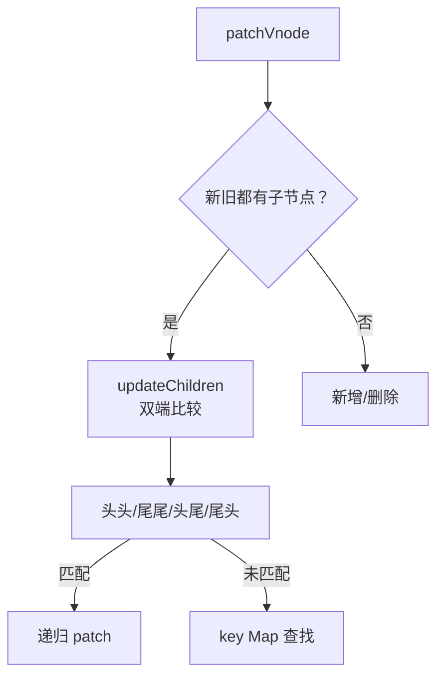

## Q9: Pinia 与 Vuex 核心差异

- **TypeScript**：Pinia 原生支持，Vuex 需额外类型
- **体积**：Pinia ~1KB，Vuex ~10KB
- **DevTools**：两者均支持
- **Mutation**：Pinia 无 mutation，Vuex 有
- **推荐度**：Vue 3 项目优先使用 Pinia

## Q10: keep-alive 原理

`keep-alive` 通过 **LRU 缓存策略**缓存组件 vnode：

1. 组件切换时检查 `cache[key]` 是否命中
2. 命中则激活缓存 DOM，不触发 created/mounted
3. 未命中则创建新组件并加入缓存
4. 超出 `max` 限制时淘汰最久未使用的

## Q11: Teleport 的作用

Teleport 将组件内容渲染到指定 DOM 节点，常用于：
- 模态框（挂载到 body）
- 通知提示（挂载到独立容器）
- 避免 z-index 层叠上下文问题

## Q12: Suspense 的作用

Suspense 管理异步组件的**加载状态**，提供 fallback 内容：

```html
<Suspense>
  <AsyncComponent />     <!-- 异步组件，支持顶层 await -->
  <template #fallback>
    <Loading />
  </template>
</Suspense>
```

## Q13: v-if 与 v-for 优先级

**Vue 3 中 `v-if` 优先级高于 `v-for`**，因此以下代码会有问题：

```html
<!-- ❌ 错误：v-if 先执行，item 未定义 -->
<li v-for="item in items" v-if="item.visible" :key="item.id">

<!-- ✅ 正确：用 computed 过滤 -->
<li v-for="item in visibleItems" :key="item.id">
```

## Q14: 响应式数据丢失场景

```typescript
// ❌ 解构 reactive 丢失响应
const { name, age } = reactive({ name: 'Alice', age: 30 });
// ❌ 直接赋值给新变量
let newName = reactive({ name: 'Alice' }).name;

// ✅ 使用 toRefs 保持响应
const state = reactive({ name: 'Alice', age: 30 });
const { name, age } = toRefs(state);
```
