# 🚀 [React 19](https://react.dev) 完整学习指南

> 🎯 **面试星级**：★★★★★ | **建议用时**：3 天
> React 19 系统学习指南，融合核心原理、高级特性、工程实践与面试题，从入门到精通

---

## 📑 目录结构

- [📦 第一部分：核心基础](#第一部分核心基础)
  - [1️⃣ React 是什么？](#1️⃣-react-是什么)
  - [2️⃣ React 19 新特性](#2️⃣-react-19-新特性详解)
  - [3️⃣ JSX 语法](#3️⃣-jsx-语法)
  - [4️⃣ 组件基础](#4️⃣-组件基础)
  - [5️⃣ Props 与 State](#5️⃣-props-与-state)
  - [6️⃣ 事件处理](#6️⃣-事件处理)
  - [7️⃣ 条件渲染](#7️⃣-条件渲染)
  - [8️⃣ 列表与 Key](#8️⃣-列表与-key)
- [🚀 第二部分：高级特性](#第二部分高级特性)
  - [1️⃣ Hooks 系统](#1️⃣-hooks-系统)
  - [2️⃣ Context API](#2️⃣-context-api)
  - [3️⃣ Refs & DOM](#3️⃣-refs--dom)
  - [4️⃣ Portals](#4️⃣-portals)
  - [5️⃣ Error Boundaries](#5️⃣-error-boundaries)
  - [6️⃣ Fragments](#6️⃣-fragments)
  - [7️⃣ 高阶组件](#7️⃣-高阶组件)
  - [8️⃣ Render Props](#8️⃣-render-props)
- [🛠️ 第三部分：工程实践](#第三部分工程实践)
  - [1️⃣ Next.js 框架](#1️⃣-nextjs-框架)
  - [2️⃣ 状态管理](#2️⃣-状态管理)
  - [3️⃣ 路由系统](#3️⃣-路由系统)
  - [4️⃣ 测试策略](#4️⃣-测试策略)
  - [5️⃣ TypeScript 集成](#5️⃣-typescript-集成)
  - [6️⃣ 代码规范](#6️⃣-代码规范)
- [⚡ 第四部分：性能优化](#第四部分性能优化)
  - [1️⃣ React.memo](#1️⃣-reactmemo)
  - [2️⃣ useMemo & useCallback](#2️⃣-usememo--usecallback)
  - [3️⃣ 代码分割](#3️⃣-代码分割)
  - [4️⃣ 虚拟列表](#4️⃣-虚拟列表)
  - [5️⃣ 并发模式](#5️⃣-并发模式)
  - [6️⃣ React Compiler](#6️⃣-react-compiler)
  - [7️⃣ Server Components](#7️⃣-server-components)
  - [8️⃣ 2026 性能优化趋势](#8️⃣-2026-性能优化趋势)
- [🤖 AI 时代 React](#-ai-时代-react)
- [🎯 第五部分：高频面试题精选](#第五部分面试题汇总)
  - [Q1 渲染流程 Trigger→Render→Commit](#q1-渲染流程)
  - [Q2 useEffect 执行时序](#q2-useeffect-执行时序)
  - [Q3 Actions 机制](#q3-actions-机制)
  - [Q4 key 的作用](#q4-key-的作用)
  - [Q5 Concurrent Mode](#q5-concurrent-mode)
  - [Q6 use() vs useEffect](#q6-use-vs-useeffect)
  - [Q7 合成事件](#q7-合成事件)
  - [Q8 Hooks 条件调用限制](#q8-hooks-条件调用)
  - [Q9 Server vs Client Component](#q9-server-vs-client-component)
  - [Q10 React.memo vs useMemo](#q10-reactmemo-vs-usememo)
  - [Q11 React Compiler 原理](#q11-react-compiler-原理)
  - [Q12 Fiber 可中断渲染](#q12-fiber-可中断渲染)
  - [Q13 事件机制对比](#q13-事件机制对比)

---

# 第一部分：核心基础

## 1️⃣ React 是什么？

### 📌 核心定义

**React** 是由 Facebook 开发的 JavaScript 库，用于构建用户界面。它通过**组件化思想**和**声明式编程**，帮助开发者高效构建交互式、动态的 Web 应用。

```typescript
// React 的三大特性：
// 1. 声明式：描述你想要什么，而不是如何实现
// 2. 组件化：封装独立可复用的 UI 单元
// 3. 虚拟 DOM：高效批量更新真实 DOM
```

### 🎯 React 的核心角色

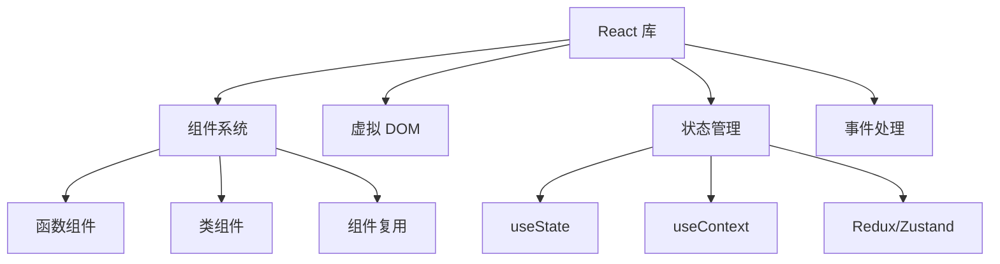

### 📊 React vs 其他框架

| 特性 | React | Vue | Angular |
|-----|-------|-----|---------|
| 学习曲线 | 🟡 中等 | 🟢 平缓 | 🔴 陡峭 |
| 灵活性 | ✅ 极高 | ⚠️ 中等 | ❌ 受限 |
| 生态系统 | ✅ 最庞大 | ⚠️ 中等 | ✅ 完整 |
| 性能 | ✅ 优秀 | ✅ 优秀 | ✅ 优秀 |
| 企业应用 | ✅ 完美 | ⚠️ 可行 | ✅ 完美 |

### 🎨 React 五大设计理念深度解析

React 的设计哲学可以概括为 **"UI = f(state)"** — 视图是状态函数的输出。这个简洁公式背后是五大设计理念的支撑。

#### ① 声明式（Declarative）

> **核心思想**：描述"想要什么"，而非"怎么做"

```jsx
// ❌ 命令式（jQuery 思维）
const div = document.createElement('div');
div.className = 'card';
div.textContent = 'Hello';
parent.appendChild(div);

// ✅ 声明式（React 思维）
function Card({ text }) {
  return <div className="card">{text}</div>;
}
```

**为什么重要？**
- **认知负荷降低**：开发者的精力集中在"什么状态对应什么 UI"，而非 DOM 操作的细节
- **可预测性**：给定相同 props + state，永远渲染相同结果
- **React 帮你做"脏活"**：Diff 对比、批量更新、DOM 操作全由框架管理
- **本质是抽象**：声明式将"如何操作 DOM"的复杂性封装在框架层

#### ② 组件化（Component-Based）

> **核心思想**：UI = 组件树（compose(Component₁, Component₂, ...)）

```jsx
// 组件 = 独立单元
function UserCard({ user }) {
  return (
    <Card>
      <Avatar src={user.avatar} />
      <Name>{user.name}</Name>
      <Stats posts={user.postCount} />
    </Card>
  );
}
```

**为什么重要？**
- **单一职责**：每个组件只做一件事，降低复杂度
- **可复用性**：组件像乐高积木，自由组合
- **可测试性**：每个组件独立测试，无需渲染整个页面
- **并行开发**：组件是天然的开发边界，团队可并行工作

#### ③ 虚拟 DOM（Virtual DOM）

> **核心思想**：在内存中维护 UI 的轻量级表示，批量计算差异后再操作真实 DOM

```
状态变化 → 新虚拟 DOM → Diff(旧虚拟DOM, 新虚拟DOM) → Patch(真实DOM)
```

**为什么不用直接操作 DOM？**
- 真实 DOM 操作极慢（浏览器需要重排/重绘）
- 每次 setState 都直接操作 DOM → 性能灾难
- 虚拟 DOM 在 JS 层面比较 → 只更新最小差异

**虚拟 DOM 的本质是"性能保底"**：React 通过虚拟 DOM 保证即使在没有手动优化的情况下，性能也不会太差。React 的设计原则是 **"默认足够快，需要极致时可手动优化"**。

#### ④ 函数式编程（Functional）

> **核心思想**：纯函数 + 不可变数据

```jsx
// ❌ 可变数据（违反函数式）
function BadList({ items }) {
  items.push('new item');  // 直接修改 props
  return <ul>{items.map(/* ... */)}</ul>;
}

// ✅ 不可变数据
function GoodList({ items }) {
  return <ul>{[...items, 'new item'].map(/* ... */)}</ul>;
}
```

**为什么重要？**
- **可预测性**：纯函数 → 相同输入永远相同输出
- **时间旅行调试**：不可变数据允许保存/回放状态快照
- **并发安全**：不可变数据天然支持 React 18+ 的并发渲染
- **易于推理**：无需追踪"谁修改了什么"

#### ⑤ 一次学习，随处编写（Learn Once, Write Anywhere）

```
React DOM      → Web 应用
React Native   → iOS / Android 原生应用
React Three    → 3D 场景（Three.js 封装）
React Ink      → 命令行终端 UI
React 360      → VR 应用
React PDF      → PDF 文档生成
```

**设计决策：** React 将"平台无关的 UI 逻辑"与"平台特定的渲染"彻底分离。`react` 包只关心组件树、状态、生命周期；渲染到哪个平台由 `react-dom`/`react-native` 等负责。这是 React 跨平台的架构基石。

---

### 💡 一个公式理解 React

```
UI = f(state)
│     │
▼     ▼
视图  纯函数  状态
```

- **f** 是 React 组件（纯函数）
- **state** 包括 props / state / context
- React 在 **f 变化时** 自动重新计算 UI

**与 Vue / Angular 的核心差异：**

| 维度 | React | Vue | Angular |
|------|-------|-----|---------|
| **UI 公式** | UI = f(state) | UI = template + state | UI = class + template |
| **更新时机** | setState → 全量重渲染 | Proxy 自动追踪 → 精确更新 | Zone.js → 全量检测 / Signals 精确 |
| **数据流** | 单向（强制） | 双向（v-model 可选） | 双向（[(ngModel)]） |
| **副作用** | useEffect 显式管理 | watchEffect 自动追踪 | 生命周期 + Observable |
| **范式的本质** | **纯函数式**: 状态快照不可变 | **响应式**: 状态变化自动追踪 | **面向对象**: 类 + 装饰器 |

---

## 1️⃣➕ React 版本迭代史（2013—2026）

> React 的演进史，就是前端声明式编程的进化史。

### 版本演进路线图

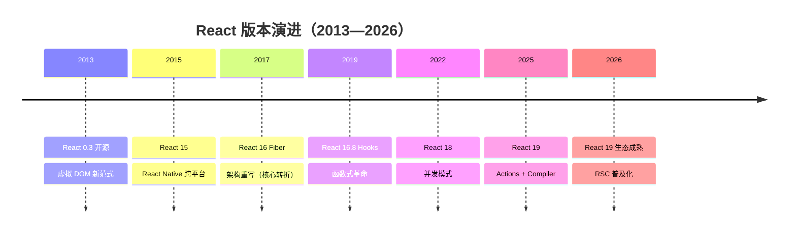

### 关键版本逐代解析

| 版本 | 年份 | 核心变化 | 对开发者的影响 |
|------|------|---------|--------------|
| **React 0.3** | 2013 | 虚拟 DOM，JSX 首次开源 | 开创性范式：声明式 UI |
| **React 15** | 2016 | DOM 重构 + React Native | 跨平台能力，一次学习随处编写 |
| **React 16** | 2017 | **Fiber 架构重写** | 可中断渲染，优先级调度 |
| **React 16.8** | 2019 | **Hooks** 发布 | 函数组件拥有状态，告别 class |
| **React 17** | 2020 | 渐进升级桥梁版 | 无重大新特性，平滑过渡 |
| **React 18** | 2022 | 并发模式、自动批处理 | 更好的用户体验，Suspense 完善 |
| **React 19** | 2025 | Actions、use()、React Compiler | 表单革新、自动记忆化、RSC |

### React 15 → 16 → 17 → 18 → 19 核心变化

| 维度 | 15 (DOM) | 16 (Fiber) | 17 | 18 (Concurrent) | 19 (Compiler) |
|------|---------|-----------|-----|-----------------|---------------|
| **架构** | Stack 栈递归 | Fiber 链表中断 | 桥接 | 并发模式 | 编译优化 |
| **渲染** | 同步不可中断 | 可中断/恢复 | 渐进升级 | 自动批处理 | 自动记忆化 |
| **组件** | class 为主 | class + function | 过渡 | 函数为主 | 函数 + Server |
| **状态** | setState | setState + Hooks(2019) | Hooks 完善 | useDeferredValue | Actions + use() |
| **编译** | 无 | 无 | React Refresh | 基础优化 | **React Compiler** |
| **生态** | 早期 | Redux 为主 | Context 增强 | Suspense + Streaming | RSC 主流 |

**Fiber 架构核心突破：**
```typescript
// Fiber 节点结构（简化）
interface Fiber {
  tag: WorkTag          // 节点类型
  key: string | null    // 唯一标识
  type: any             // 函数/类/原生标签
  stateNode: any        // 对应真实 DOM
  
  return: Fiber | null  // 父节点
  child: Fiber | null   // 第一个子节点
  sibling: Fiber | null // 右边兄弟节点
  
  pendingProps: any     // 新 props
  memoizedProps: any    // 旧 props
  memoizedState: any    // 状态
  updateQueue: any      // 更新队列
  
  lanes: Lanes          // 优先级
  alternate: Fiber | null // workInProgress 树关联
}
```

Fiber 将原本不可中断的**递归渲染**（Stack Reconciler）改造成了可中断/恢复的**链表遍历**（Fiber Reconciler），这是 React 并发能力的基石。

---

## 2️⃣ React 19 新特性详解

### 🌟 重要特性速览

```
React 19 (2025)
├─ React Compiler (自动优化)
├─ Actions (统一表单处理)
├─ use() Hook (异步数据)
├─ useOptimistic() (乐观更新)
├─ useFormStatus/useActionState (原 useFormState)
├─ Server Components 支持
└─ Web Components 增强
```

### 🔧 React Compiler (Forget)详解

#### 问题背景

手动优化 React 性能很复杂：

```typescript
// ❌ 需要手动记忆化
const MyComponent = memo((props) => {
  const handleClick = useCallback(() => {}, []);
  const value = useMemo(() => expensiveComputation(), [dep]);
  return <Child onClick={handleClick} value={value} />;
});
```

#### 解决方案：Compiler 自动优化

```typescript
// ✅ 自动转换，无需手动记忆化
function MyComponent(props) {
  const handleClick = () => {};        // ← Compiler 自动缓存
  const value = expensiveComputation(); // ← Compiler 自动缓存
  return <Child onClick={handleClick} value={value} />;
}
```

**性能收益：**
- 自动消除不必要的重新渲染
- 减少 90%+ 的手写优化代码
- 编译时静态分析，极低运行时开销（仍需要运行时支持）

### 🎯 Actions 机制

```typescript
// 注意：useFormStatus 需要从 'react-dom' 导入
import { useFormStatus } from 'react-dom';
import { useActionState } from 'react';

async function submitForm(prevState, formData) {
  const username = formData.get('username');
  const password = formData.get('password');
  try {
    const response = await fetch('/api/login', {
      method: 'POST',
      body: JSON.stringify({ username, password })
    });
    return { success: true, message: '登录成功!' };
  } catch (error) {
    return { success: false, message: '登录失败' };
  }
}

export function LoginForm() {
  const [state, formAction] = useActionState(submitForm, null);
  const { pending } = useFormStatus();

  return (
    <form action={formAction}>
      <input name="username" />
      <button type="submit" disabled={pending}>
        {pending ? '登录中...' : '登录'}
      </button>
      {state?.message && <p>{state.message}</p>}
    </form>
  );
}
```

**改进点：**
- ✅ 自动加载状态管理
- ✅ 简化异步操作处理
- ✅ 内置乐观更新支持

### ⏳ `use()` Hook - 异步数据获取与 Context 读取

`use()` 是 React 19 新增的 Hook，可用于：
1. 读取 Promise（需配合 Suspense 使用）
2. 读取 Context（替代 `useContext`）

```typescript
import { use, Suspense } from 'react';

// 方式 1：读取 Promise
function DataComponent() {
  const data = use(fetchPromise); // fetchPromise 是一个 Promise 对象
  return <div>{data.title}</div>;
}

// 方式 2：读取 Context（React 19 新用法）
function ThemedButton() {
  const theme = use(ThemeContext); // 替代 useContext(ThemeContext)
  return <button style={{ color: theme }}>按钮</button>;
}
```

> ⚠️ **注意**：`use()` 可以在条件语句中调用（与 Hooks 规则不同），但 Promise 必须在 Suspense 边界内使用。

### ⏱️ React 18 vs 19 vs 20（预期）关键变化

| 特性 | React 18 (2022) | React 19 (2024) | React 20 (预期 2025+) |
|------|-----------------|-----------------|----------------------|
| 并发模式 | 可选启用 | 默认启用 | 默认启用 |
| startTransition | ✅ | ✅ 增强 | ✅ 自动 |
| use() | ❌ | ✅ | ✅ 增强 |
| useOptimistic | ❌ | ✅ | ✅ 自动 |
| Server Components | 实验性 | ✅ 稳定 | ✅ 默认推荐 |
| ref 传参 | forwardRef | 直接传 ref | 直接传 ref |
| Compiler | 实验性 | ✅ 自动 memo | ✅ 默认 |

> ⚠️ **注意**：React 20/21 的特性基于官方 RFC 和社区预测，实际发布可能有所调整。

---

### 🚀 React 在 2026 年的最新进展

#### React 技术发展演进时间线

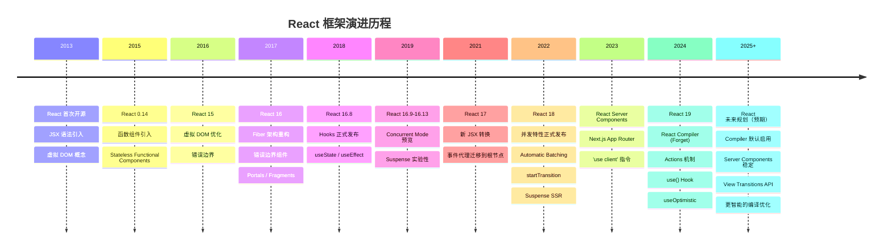

#### React Compiler 工作原理

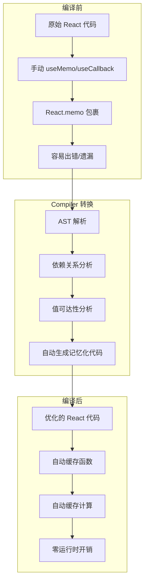

#### Compiler 优化对比

| 优化项 | 手动优化 | Compiler 自动优化 |
|--------|---------|------------------|
| 函数缓存 | useCallback | 自动识别并缓存 |
| 计算缓存 | useMemo | 自动识别并缓存 |
| 组件缓存 | React.memo | 自动包裹 |
| 依赖数组 | 手动维护 | 自动推导 |
| 性能收益 | 60-70% | 90%+（实验阶段） |
| 代码量 | 增加 30% | 减少 50% |

#### React Server Components 成为默认

```jsx
// app/page.jsx - 默认就是 Server Component
export default async function Page() {
  const data = await fetch('https://api.example.com/data')
  return <DataDisplay data={data} />
}

// app/component.client.jsx - 需要交互时标记
'use client'
export function InteractiveComponent() {
  const [count, setCount] = useState(0)
  return <button onClick={() => setCount(c => c + 1)}>{count}</button>
}
```

#### RSC 架构工作原理

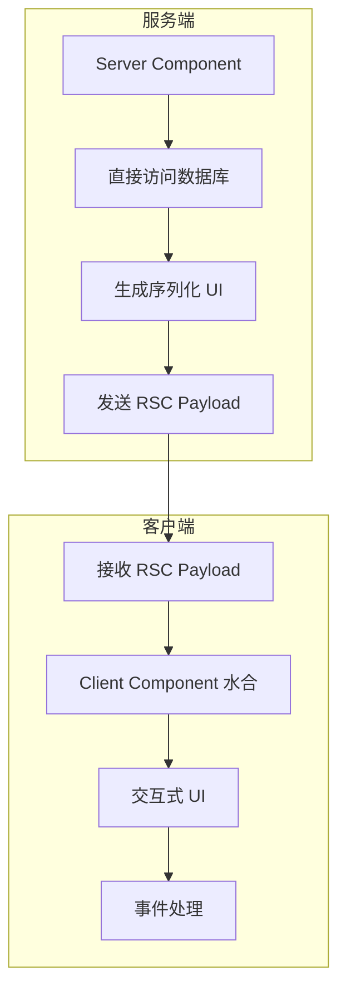

#### View Transitions API 集成

```jsx
// React 19+ 支持 View Transitions
import { ViewTransition } from 'react'

function PageTransition({ children }) {
  return (
    <ViewTransition>
      {children}
    </ViewTransition>
  )
}
```

#### 2026 年 React 生态工具链

| 工具 | 最新版本 | 关键变化 |
|------|----------|----------|
| React | 19/20 | Compiler 推荐启用，RSC 稳定 |
| Next.js | 15+ | App Router 默认，Turbopack |
| React Router | 7+ | 统一客户端/服务端路由 |
| Redux | 5+ | RTK 简化，更好的 TS |
| Zustand | 5+ | 更轻量，持久化内置 |
| TanStack Query | 5+ | 更精细缓存，SSR 优化 |
| React Testing Library | 16+ | 更好的异步测试 |

#### 2026 年前端框架格局

| 框架 | 定位 | 2026 状态 |
|------|------|-----------|
| React 19 + Next.js | 全栈应用首选 | 最广泛使用 |
| Angular 21 | 企业级应用 | Zoneless 默认，性能大幅提升 |
| Vue 3.6 + Nuxt 4 | 渐进式开发 | Vapor Mode 实验性，性能接近 Solid |
| Svelte 5 | 编译时优化 | Runes 响应式，轻量级首选 |
| Solid.js | 细粒度响应式 | 性能标杆，生态增长中 |
| Astro 5 | 内容型网站 | Islands 架构，零 JS 默认 |

#### React 生态全景图

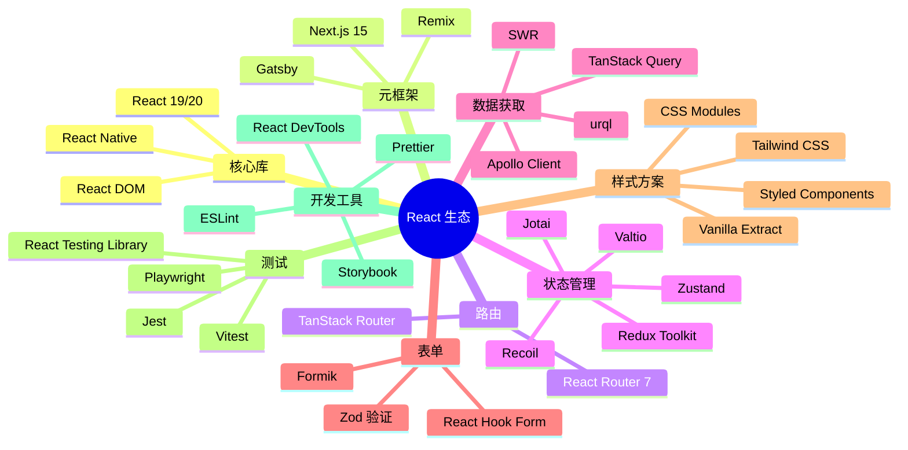

---

## 3️⃣ JSX 与 Babel

### 📝 JSX 详解

JSX 是 **JavaScript XML**，让你能在 JS 中写 HTML 结构。JSX 本质是 `React.createElement` 的语法糖，经 Babel 编译为 AST → createElement 调用 → React 元素对象 → 虚拟 DOM → 真实 DOM。

```jsx
// 原始 JSX
const element = <h1 className="greeting">Hello, {name}!</h1>;

// Babel 编译后
const element = React.createElement(
  "h1",
  { className: "greeting" },
  "Hello, ", name, "!"
);
```

### 🔄 JSX 转换流程图

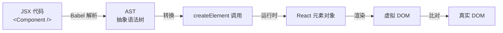

### ⚙️ JSX 规则

```jsx
// ✅ 使用 Fragment 避免多余 DOM
return (
  <>
    <p>Hello</p>
    <p>World</p>
  </>
);

// ✅ 属性驼峰命名
<div className="card" data-testid="card" />

// ✅ 表达式插值
<p>Count: {count * 2}</p>

// ✅ 条件渲染
{showTitle ? <h1>Title</h1> : null}
{showTitle && <h1>Title</h1>}
```

---

## 4️⃣ 组件与 Props 深度剖析

### 🧩 组件解剖

```typescript
import { ReactNode } from 'react';

interface CardProps {
  title: string;
  children: ReactNode;
  onClick?: (id: string) => void;
  disabled?: boolean;
}

function Card({ title, children, onClick, disabled = false }: CardProps) {
  return (
    <div className="card" style={{ opacity: disabled ? 0.5 : 1 }}>
      <h2>{title}</h2>
      <div className="card-body">{children}</div>
      <button onClick={() => onClick?.(title)} disabled={disabled}>Click Me</button>
    </div>
  );
}
```

### 📊 Props 完整对比

| 特征 | Props | State |
|------|-------|-------|
| 来源 | 父组件 | 组件自身 |
| 可修改 | ❌ 只读 | ✅ 可修改 |
| 默认值 | Component.defaultProps | useState 初值 |
| 影响重建 | ✅ Props 变化重新渲染 | ✅ State 变化重新渲染 |

### 🔄 React.Component vs React.PureComponent

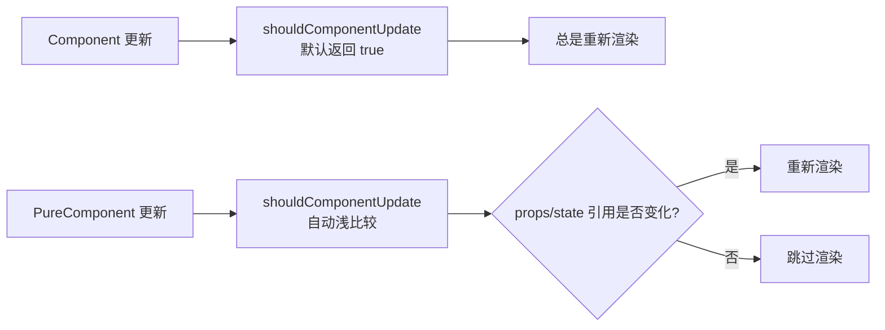

**注意：** PureComponent 进行**浅比较**，引用类型只比较地址。如需深比较的数据变更，必须创建新对象。

> ⚠️ **易错点**：直接在现有对象上修改属性然后 `setState` 不会触发 PureComponent 重新渲染。务必使用展开运算符或 Object.assign 创建新对象。

### 🔟 受控组件 vs 非受控组件

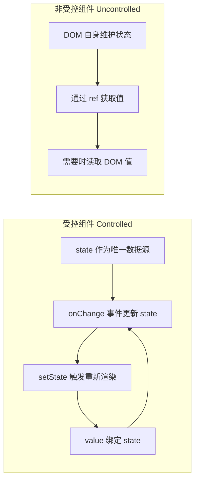

| 维度 | 受控组件 | 非受控组件 |
|------|---------|-----------|
| 数据源 | React state | DOM 自身 |
| 值获取 | state 变量 | ref 读取 |
| 表单验证 | ✅ 容易 | ❌ 困难 |
| 适用场景 | 复杂表单 | 简单一次性表单 |

---

## 5️⃣ React 事件机制

### 📌 合成事件（SyntheticEvent）

React 的事件并非绑定在真实的 DOM 节点上，而是通过**事件代理（Event Delegation）**的方式，将所有事件统一绑定在根容器上。当事件冒泡到根容器时，React 将事件内容封装并交由真正的处理函数运行。

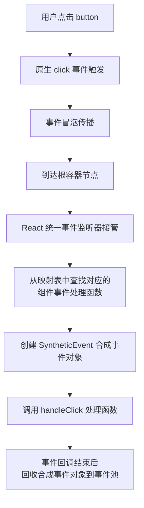

**React 事件与原生 HTML 事件的区别：**

| 对比项 | 原生事件 | React 事件 |
|--------|---------|-----------|
| 命名方式 | 全小写 `onclick` | 小驼峰 `onClick` |
| 处理函数语法 | 字符串 `"handle()"` | 函数 `{handleClick}` |
| 阻止默认行为 | `return false` | `e.preventDefault()` |
| 执行顺序 | 先执行 | 后执行（冒泡到根容器） |

> 💡 React 17+ 将事件代理从 document 迁移到 root DOM 容器，为微前端和多版本 React 共存提供更好的隔离性。

---

## 6️⃣ Hooks 系统完全指南

### 🎣 Hooks 工作原理

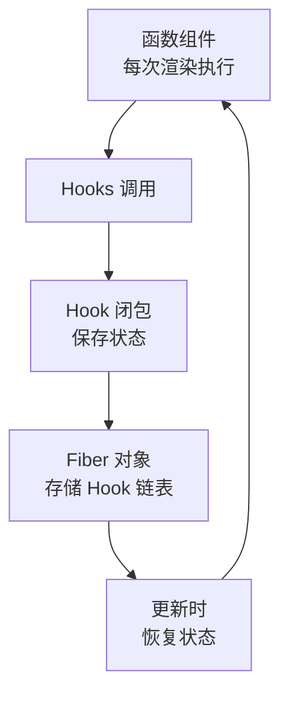

### 📍 useState - 状态管理

```typescript
const [count, setCount] = useState(0);

// 函数式初始化（避免重复计算）
const [state, setState] = useState(() => expensiveComputation());

// 更新函数（基于前一个状态）
setState(prev => prev + 1);
```

**规则 ⚠️：**
- ✅ 只在组件顶层调用
- ✅ 只在函数组件中调用
- ❌ 不要在循环、条件、嵌套函数中调用

### 📍 useEffect - 副作用管理

```typescript
function EffectDemo() {
  useEffect(() => {
    console.log('挂载 + 每次渲染后');
    return () => console.log('清理副作用');
  }); // 没有依赖数组，每次都运行

  useEffect(() => {
    console.log('仅在挂载时运行');
    return () => console.log('卸载时清理');
  }, []); // 空依赖数组，仅一次

  useEffect(() => {
    console.log('count 或 name 变化时运行');
  }, [count, name]); // 指定依赖

  return null;
}
```

**常见模式：**

```typescript
// 数据获取（处理竞态条件）
useEffect(() => {
  let ignore = false;
  fetchData().then(data => { if (!ignore) setData(data); });
  return () => { ignore = true; };
}, []);

// 事件监听
useEffect(() => {
  const handleResize = () => console.log('resized');
  window.addEventListener('resize', handleResize);
  return () => window.removeEventListener('resize', handleResize);
}, []);

// 定时器
useEffect(() => {
  const timer = setInterval(() => console.log('tick'), 1000);
  return () => clearInterval(timer);
}, []);
```

### 📍 useContext - 跨组件通信

```typescript
const ThemeContext = createContext<'light' | 'dark'>('light');

function ThemeProvider({ children }: { children: ReactNode }) {
  const [theme, setTheme] = useState<'light' | 'dark'>('light');
  return (
    <ThemeContext.Provider value={theme}>
      {children}
    </ThemeContext.Provider>
  );
}

function ThemedButton() {
  const theme = useContext(ThemeContext);
  return <button style={{
    background: theme === 'light' ? '#fff' : '#333',
    color: theme === 'light' ? '#000' : '#fff'
  }}>按钮</button>;
}
```

### 📍 useReducer - 复杂状态逻辑

```typescript
type Action =
  | { type: 'ADD_TODO'; payload: Todo }
  | { type: 'REMOVE_TODO'; payload: number }
  | { type: 'TOGGLE_TODO'; payload: number };

function todoReducer(state: State, action: Action): State {
  switch (action.type) {
    case 'ADD_TODO':
      return { ...state, todos: [...state.todos, action.payload] };
    case 'REMOVE_TODO':
      return { ...state, todos: state.todos.filter(t => t.id !== action.payload) };
    case 'TOGGLE_TODO':
      return {
        ...state,
        todos: state.todos.map(t => t.id === action.payload ? { ...t, completed: !t.completed } : t)
      };
    default:
      return state;
  }
}

function TodoApp() {
  const [state, dispatch] = useReducer(todoReducer, initialState);
  return (
    <div>
      {state.todos.map(todo => (
        <input type="checkbox" checked={todo.completed}
          onChange={() => dispatch({ type: 'TOGGLE_TODO', payload: todo.id })} />
      ))}
    </div>
  );
}
```

### 📍 useRef - 访问 DOM 和保存值

```typescript
// 访问 DOM 元素
function TextInput() {
  const inputRef = useRef<HTMLInputElement>(null);
  const focusInput = () => { inputRef.current?.focus(); };
  return <><input ref={inputRef} /><button onClick={focusInput}>Focus Input</button></>;
}

// 保存可变值（不触发重新渲染）
function StopWatch() {
  const intervalRef = useRef<number | null>(null);
  const start = () => { intervalRef.current = setInterval(() => {}, 1000); };
  const stop = () => { if (intervalRef.current) clearInterval(intervalRef.current); };
  return <><button onClick={start}>Start</button><button onClick={stop}>Stop</button></>;
}
```

### 📍 useCallback & useMemo - 性能优化

```typescript
// ❌ 问题：每次重新创建函数，导致子组件重新渲染
function Parent() {
  const handleClick = () => console.log('clicked');
  return <Child onClick={handleClick} />;
}

// ✅ useCallback 缓存函数
function Parent() {
  const handleClick = useCallback(() => console.log('clicked'), []);
  return <Child onClick={handleClick} />;
}

// ✅ useMemo 缓存计算结果
function Component() {
  const expensiveValue = useMemo(() => complexComputation(data), [data]);
  return <div>{expensiveValue}</div>;
}
```

### ⏱️ useEffect vs useLayoutEffect

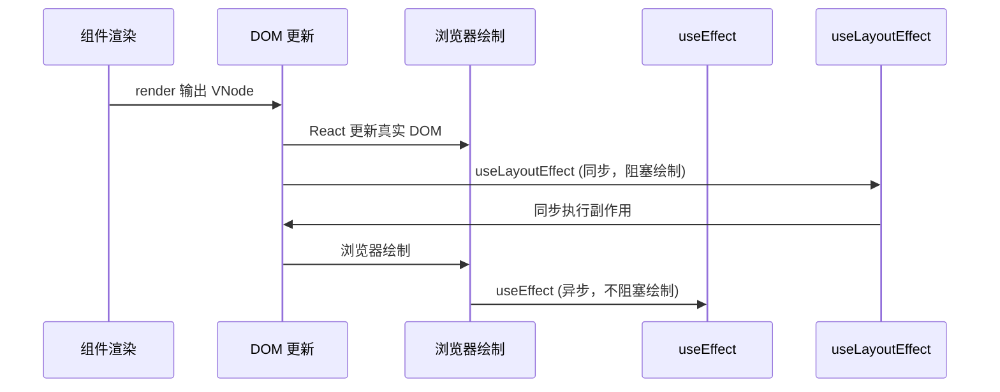

| 特性 | useEffect | useLayoutEffect |
|------|-----------|----------------|
| 执行时机 | 浏览器绘制后（异步） | DOM 更新后绘制前（同步） |
| 阻塞绘制 | ❌ 不阻塞 | ✅ 阻塞 |
| 适用场景 | 数据获取、订阅、日志 | DOM 测量、样式调整 |
| 推荐度 | ⭐ 优先使用 | ⚠️ 特殊场景使用 |

### 📋 Hooks 与 Class 生命周期对照

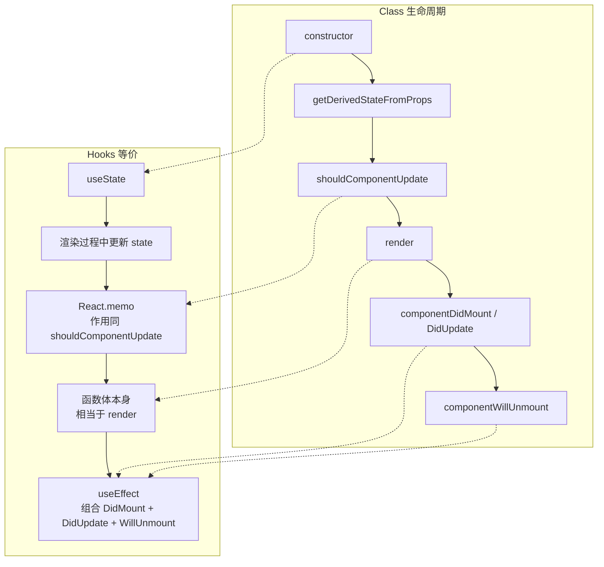

### 📍 React 19 新增 Hooks

```typescript
// use() - 异步数据获取
import { use } from 'react';
function DataComponent() {
  const data = use(fetchPromise);
  return <div>{data}</div>;
}

// useOptimistic() - 乐观更新
import { useOptimistic } from 'react';
function TodoList() {
  const [optimisticTodos, addOptimisticTodo] = useOptimistic(todos);
  const handleAdd = async (todo: Todo) => {
    addOptimisticTodo([...optimisticTodos, todo]);
    await saveTodo(todo);
  };
  return <ul>{optimisticTodos.map(todo => <li key={todo.id}>{todo.text}</li>)}</ul>;
}

// useFormStatus() - 表单状态（需从 react-dom 导入）
import { useFormStatus } from 'react-dom';
function SubmitButton() {
  const { pending } = useFormStatus();
  return <button disabled={pending}>{pending ? '提交中...' : '提交'}</button>;
}

// useActionState() - 表单结果（React 19 中 useFormState 已重命名）
import { useActionState } from 'react';
function LoginForm() {
  const [state, formAction] = useActionState(login, null);
  return (
    <form action={formAction}>
      <input name="email" type="email" />
      <button type="submit">登录</button>
      {state?.error && <p>{state.error}</p>}
    </form>
  );
}
```

---

## 7️⃣ 自定义 Hooks 设计模式

### 🎣 常用自定义 Hooks

```typescript
// useAsync - 异步操作管理
function useAsync<T>(asyncFunction: () => Promise<T>, immediate = true) {
  const [state, setState] = useState<{
    status: 'idle' | 'pending' | 'success' | 'error';
    data: T | null;
    error: Error | null;
  }>({ status: 'idle', data: null, error: null });

  const execute = useCallback(async () => {
    setState({ status: 'pending', data: null, error: null });
    try {
      const response = await asyncFunction();
      setState({ status: 'success', data: response, error: null });
      return response;
    } catch (error) {
      setState({ status: 'error', data: null, error: error as Error });
    }
  }, [asyncFunction]);

  useEffect(() => { if (immediate) execute(); }, [execute, immediate]);

  return { ...state, execute };
}

// useLocalStorage - 本地存储 Hook
function useLocalStorage<T>(key: string, initialValue: T) {
  const [storedValue, setStoredValue] = useState<T>(() => {
    try {
      const item = window.localStorage.getItem(key);
      return item ? JSON.parse(item) : initialValue;
    } catch { return initialValue; }
  });

  const setValue = (value: T | ((val: T) => T)) => {
    try {
      const valueToStore = value instanceof Function ? value(storedValue) : value;
      setStoredValue(valueToStore);
      window.localStorage.setItem(key, JSON.stringify(valueToStore));
    } catch (error) { console.error(error); }
  };

  return [storedValue, setValue] as const;
}

// useDebounce - 防抖 Hook
function useDebounce<T>(value: T, delay: number): T {
  const [debouncedValue, setDebouncedValue] = useState(value);
  useEffect(() => {
    const handler = setTimeout(() => setDebouncedValue(value), delay);
    return () => clearTimeout(handler);
  }, [value, delay]);
  return debouncedValue;
}
```

---

## 8️⃣ 生命周期与 Fiber 架构

### 🔄 组件生命周期（React 16+）

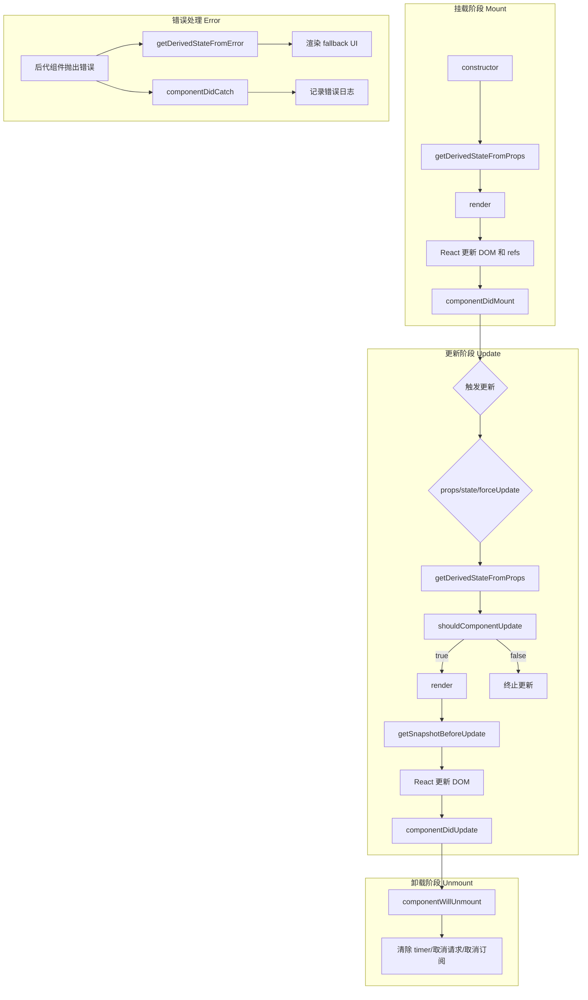

#### 废弃的生命周期（React 16+）

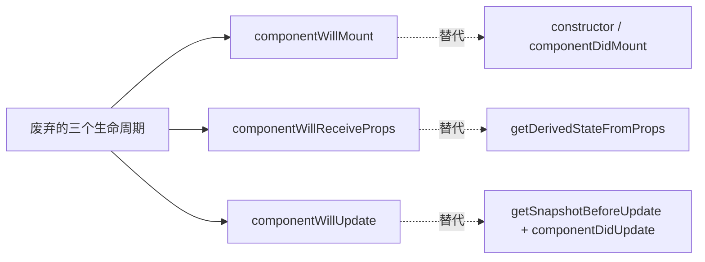

**废弃原因（Fiber 架构导致）：**
- Fiber 让渲染过程可中断，`render` 之前的生命周期可能被执行多次
- `componentWillMount`：功能可被 constructor 和 componentDidMount 替代
- `componentWillReceiveProps`：容易破坏单一数据源
- `componentWillUpdate`：回调可能被多次调用，无法可靠获取 DOM 信息

### 🏗️ Fiber 架构

Fiber 架构将虚拟 DOM 从递归不可中断的 Stack Reconciler 重构为可中断的 Fiber 链表结构，引入时间切片和优先级调度机制。

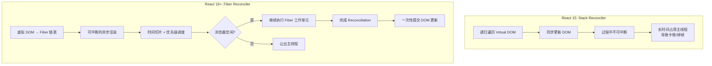

**Fiber 架构核心概念：**
- **Fiber Node**：每个组件对应一个 Fiber 节点，构成 Fiber 树（单链表结构）
- **双缓冲**：`current` 树（当前 UI）和 `workInProgress` 树（内存中构建的新树）
- **时间切片（Time Slicing）**：将一个渲染任务拆分成多个小单元，每执行完一个单元就让出主线程
- **优先级调度**：任务分优先级，高优先级任务（如用户输入）可打断低优先级任务（如数据加载）

### 🔄 Reconciliation（协调）过程

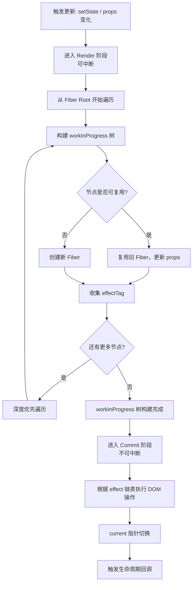

| 阶段 | 是否可中断 | 主要工作 |
|------|-----------|---------|
| Render | 可中断 | 构建 workInProgress 树，diff 对比，标记 effect |
| Pre-commit | 不可中断 | 读取 DOM 快照（getSnapshotBeforeUpdate） |
| Commit | 不可中断 | 执行 DOM 操作，触发生命周期 |

---

## 9️⃣ 代码复用方案对比

### 🧩 HOC vs Render Props vs Hooks

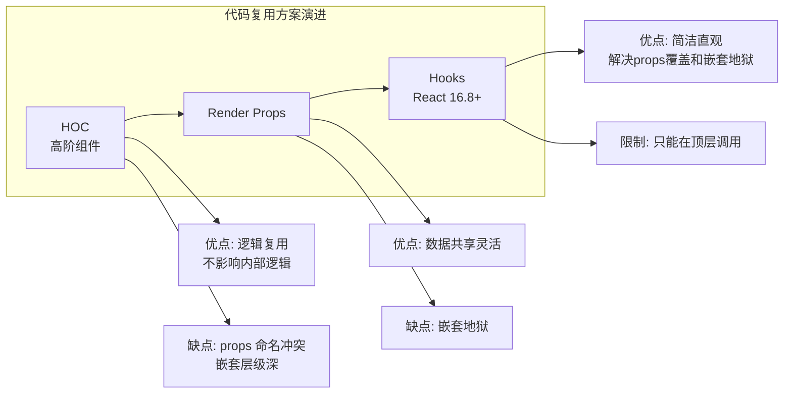

| 维度 | HOC | Render Props | Hooks |
|------|-----|-------------|-------|
| 模式 | 装饰器模式 | 函数作为 children | 组合式函数 |
| 命名冲突 | ⚠️ 容易冲突 | ✅ 不冲突 | ✅ 不冲突 |
| 嵌套层级 | 深 | 深（嵌套地狱） | 浅 |
| 模板代码 | 多 | 多 | 少 |
| 推荐度 | ⭐⭐ | ⭐ | ⭐⭐⭐⭐⭐ |

**HOC 示例：**

```javascript
function withSubscription(WrappedComponent, selectData) {
  return class extends React.Component {
    constructor(props) {
      super(props)
      this.state = { data: selectData(DataSource, props) }
    }
    render() {
      return <WrappedComponent data={this.state.data} {...this.props} />
    }
  }
}
```

**Render Props 示例：**

```javascript
class DataProvider extends React.Component {
  state = { name: 'Tom' }
  render() {
    return <div>{this.props.render(this.state)}</div>
  }
}
// 使用: <DataProvider render={data => <h1>Hello {data.name}</h1>} />
```

---

# 第二部分：高级特性

## 🔟 Context API 深度应用

### 🔄 Context 完整工作流

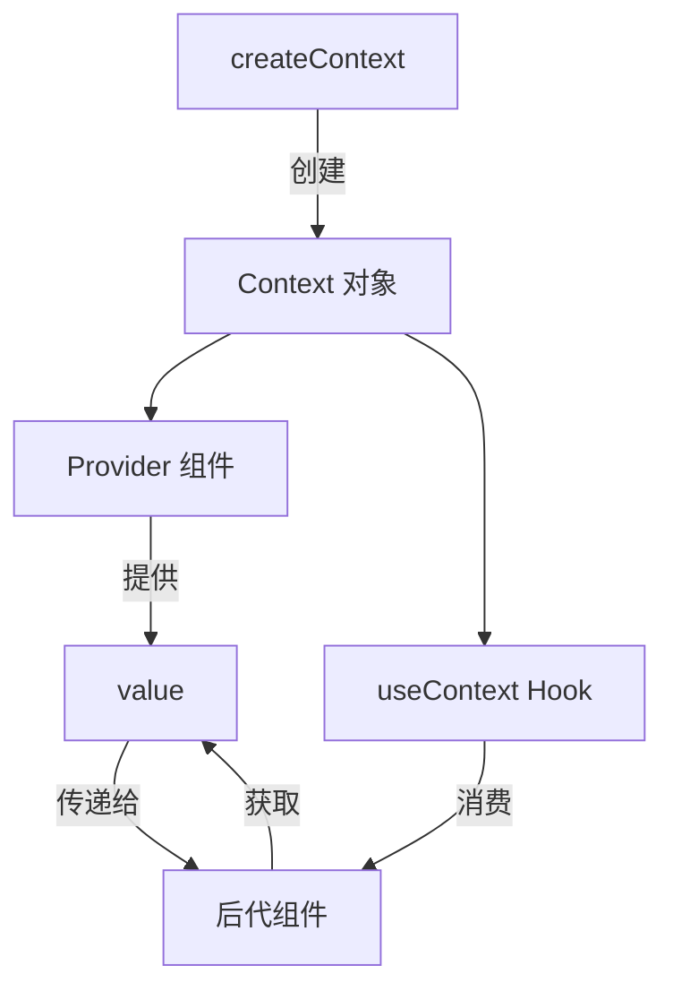

### 🎯 实战：主题系统

```typescript
// theme-context.ts
interface ThemeContextType {
  theme: { primary: string; background: string; text: string };
  toggleTheme: () => void;
  currentThemeName: 'light' | 'dark';
}

const ThemeContext = createContext<ThemeContextType | undefined>(undefined);

const themes = {
  light: { primary: '#007bff', background: '#ffffff', text: '#000000' },
  dark: { primary: '#0d6efd', background: '#1a1a1a', text: '#ffffff' }
};

export function ThemeProvider({ children }: { children: ReactNode }) {
  const [themeName, setThemeName] = useState<'light' | 'dark'>('light');
  const value: ThemeContextType = {
    theme: themes[themeName],
    toggleTheme: () => setThemeName(prev => prev === 'light' ? 'dark' : 'light'),
    currentThemeName: themeName
  };
  return <ThemeContext.Provider value={value}>{children}</ThemeContext.Provider>;
}

export function useTheme() {
  const context = useContext(ThemeContext);
  if (!context) throw new Error('useTheme must be used within ThemeProvider');
  return context;
}
```

---

## 1️⃣1️⃣ 状态管理完全指南

### 📊 状态管理全景图

```
┌─────────────────────────────────────────────────────────────┐
│                    React 状态管理生态（2026）                  │
├──────────────┬──────────────┬──────────────┬────────────────┤
│  本地状态      │  跨组件共享    │  全局状态      │  服务器状态      │
│              │              │              │                │
│ useState     │ Context API  │ Redux        │ TanStack Query│
│ useReducer   │ useMemo(值)  │ Zustand      │ SWR            │
│ useRef       │              │ Jotai        │ Apollo         │
│              │              │ MobX         │ RTK Query      │
│              │              │ Valtio       │                │
│              │              │ Legend State │                │
└──────────────┴──────────────┴──────────────┴────────────────┘
```

### 🧭 状态管理分类与演进

**四个象限分类法：**

| 象限 | 范围 | 典型方案 | 核心问题 |
|------|------|---------|---------|
| **本地** | 单个组件内 | useState / useReducer / useRef | 表单输入、UI 开关 |
| **共享** | 组件树内 | Context API / 组合提升 | 主题、语言、用户 |
| **全局（客户端）** | 整个应用 | Redux / Zustand / Jotai / MobX | 缓存数据、复杂交互 |
| **全局（服务端）** | 服务端来源 | TanStack Query / SWR / Apollo | API 数据同步 |

**版本演进时间线：**

```
2014: Redux 发布（Flux 理念 + 单一状态树）
2015: MobX 发布（响应式可变状态）
2016: Redux 成为 React 标配
2018: React Context + useReducer（内置替代方案）
2019: Recoil 发布（原子化先驱，Meta）
      SWR 发布（stale-while-revalidate）
2020: Zustand 发布（极简 API，~1KB）
      Jotai 发布（原子化改进，Recoil 竞争者）
      TanStack Query v3（服务器状态管理）
2021: Valtio 发布（Proxy 响应式）
      Redux Toolkit 成为官方推荐
2022: Legend State 发布（高性能信号式）
2023: Zustand v4 + Middleware
      Jotai v2（突破性改进）
2024-2026: React 19 + Signal 状态库融合
           Server State + Client State 界限模糊
           Zustand v5 / Jotai v2 稳定
```

### 🎯 主流方案快速对比

| 方案 | 范式 | Bundle | Star | 学习曲线 | TS 支持 | 适用规模 |
|------|------|--------|------|---------|---------|---------|
| **useState** | 不可变 | 0KB（内置） | — | 🟢 极低 | ✅ | 单组件 |
| **Context + useReducer** | 不可变 | 0KB（内置） | — | 🟢 低 | ✅ | 小功能 |
| **Zustand** | 不可变 | ~1KB | 50k+ | 🟢 低 | ✅ 优秀 | 中/大型 |
| **Jotai** | 原子不可变 | ~3KB | 22k+ | 🟢 低 | ✅ 优秀 | 中/大型 |
| **Valtio** | 可变（Proxy） | ~2KB | 9k+ | 🟢 低 | ✅ 好 | 中/大型 |
| **MobX** | 可变（Proxy） | ~16KB | 27k+ | 🟡 中 | ⚠️ 一般 | 中/大型 |
| **Redux Toolkit** | 不可变（Immer） | ~12KB | 60k+ | 🔴 中-高 | ✅ 优秀 | 大型企业 |
| **TanStack Query** | 不可变（缓存） | ~13KB | 45k+ | 🟡 中 | ✅ 优秀 | 任意（服务端） |
| **Legend State** | 信号式 | ~3KB | 4k+ | 🟢 低 | ✅ 好 | 中/大型 |

### 🏆 方案深度对比

#### 1. [Zustand](https://github.com/pmndrs/zustand) — 极简全局状态（💡 推荐首选）

```typescript
import { create } from 'zustand';
import { devtools, persist, subscribeWithSelector } from 'zustand/middleware';

interface BearStore {
  bears: number;
  fishes: number;
  addBear: () => void;
  consumeFish: (n: number) => void;
}

export const useBearStore = create<BearStore>()(
  subscribeWithSelector(
    devtools(
      persist(
        (set) => ({
          bears: 0,
          fishes: 10,
          addBear: () => set((s) => ({ bears: s.bears + 1 })),
          consumeFish: (n) => set((s) => ({ fishes: s.fishes - n })),
        }),
        { name: 'bear-storage' }
      ),
      { name: 'BearStore' }
    )
  )
);

// 组件外读写
const bears = useBearStore.getState().bears;
useBearStore.getState().addBear();
useBearStore.subscribe((s) => console.log('changed:', s.bears));

// 选择器自动优化重渲染
function BearCounter() {
  const bears = useBearStore((s) => s.bears);
  return <h1>{bears} bears</h1>;
}

// 组合多个选择器
const { bears, fishes } = useBearStore((s) => ({ bears: s.bears, fishes: s.fishes }), shallow);
```

**Zustand vs Context 核心差异：**
- Context 导致 Provider 嵌套地狱，Zustand 无 Provider
- Context 会重渲染所有消费者，Zustand 选择器精确订阅
- Zustand 可在组件外读写（Router/Promise 回调）

#### 2. Redux Toolkit — 大型企业标准

```typescript
import { createSlice, configureStore } from '@reduxjs/toolkit';
import { useDispatch, useSelector } from 'react-redux';

// slice：action + reducer 自动生成
const counterSlice = createSlice({
  name: 'counter',
  initialState: { value: 0 },
  reducers: {
    increment: (state) => { state.value += 1; },      // Immer 可变写法
    decrement: (state) => { state.value -= 1; },
    incrementByAmount: (state, action) => { state.value += action.payload; },
  },
});

// 异步 thunk
const incrementAsync = createAsyncThunk('counter/fetchCount', async (amount: number) => {
  const response = await fetch('/api/count');
  return response.json() as number;
});

const store = configureStore({
  reducer: { counter: counterSlice.reducer },
  middleware: (gDM) => gDM().concat(logger),
});

// Hooks 封装 + TypeScript 类型
type RootState = ReturnType<typeof store.getState>;
type AppDispatch = typeof store.dispatch;
export const useAppSelector = useSelector.withTypes<RootState>();
export const useAppDispatch = useDispatch.withTypes<AppDispatch>();

function Counter() {
  const count = useAppSelector((s) => s.counter.value);
  const dispatch = useAppDispatch();
  return <button onClick={() => dispatch(increment())}>{count}</button>;
}
```

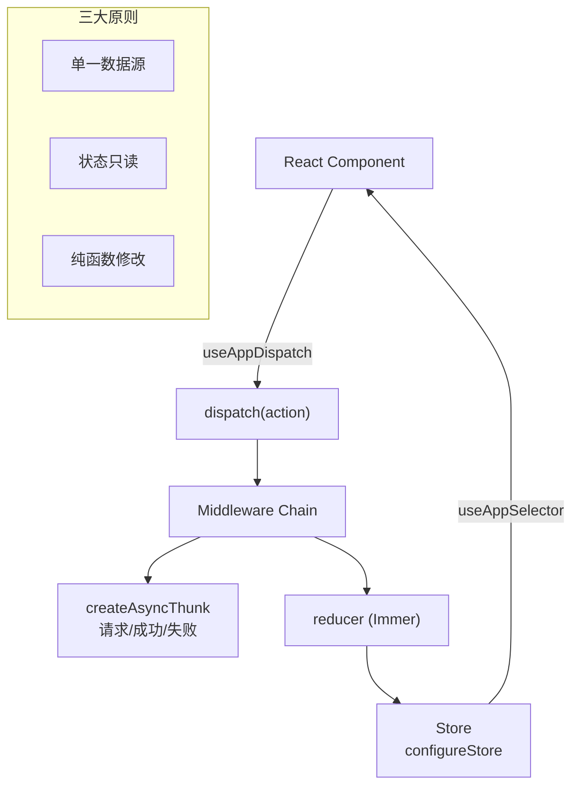

**Redux 中间件洋葱模型：**

```mermaid
flowchart LR
    A["dispatch"] --> B["logger"]
    B --> C["thunk"]
    C --> D["saga"]
    D --> E["reducer"]
    E --> F["store"]
    style B fill:#e3f2fd
    style C fill:#e3f2fd
    style D fill:#e3f2fd
```

#### 3. Jotai — 原子化状态

```typescript
import { atom, useAtom, useAtomValue, useSetAtom } from 'jotai';
import { atomWithStorage, splitAtom, loadable } from 'jotai/utils';

// 基础原子
const countAtom = atom(0);

// 派生原子（懒计算，自动缓存）
const doubledAtom = atom((get) => get(countAtom) * 2);

// 异步原子
const userAtom = atom(async () => {
  const res = await fetch('/api/user');
  return res.json();
});

// 存储原子（自动持久化）
const themeAtom = atomWithStorage('theme', 'light');

// 拆分原子（数组管理）
const itemsAtom = atom([{ id: 1, text: 'hello' }]);
const itemAtomsAtom = splitAtom(itemsAtom);

function Counter() {
  const count = useAtomValue(countAtom);       // 只读
  const setCount = useSetAtom(countAtom);       // 只写
  return <button onClick={() => setCount(c => c + 1)}>{count}</button>;
}

// 异步 + loading 状态
function User() {
  const user = useAtomValue(loadable(userAtom));
  if (user.state === 'loading') return <Spinner />;
  if (user.state === 'hasError') return <Error message={user.error} />;
  return <div>{user.data.name}</div>;
}
```

| 维度 | Context API | Jotai | Recoil（已停更） |
|------|-------------|-------|-----------------|
| 渲染优化 | ❌ 所有消费者重渲染 | ✅ 仅关联原子变化 | ✅ 仅关联原子变化 |
| 组合性 | ❌ 多层 Provider 嵌套 | ✅ 原子自由组合 | ✅ 原子自由组合 |
| 异步支持 | ❌ 需手动管理 | ✅ loadable / 异步原子 | ✅ selector |
| Bundle | 0KB | ~3KB | ~15KB |
| 维护状态 | ✅ 活跃 | ✅ 活跃 | ❌ Meta 已不推荐 |

#### 4. MobX — 可变响应式

```typescript
import { makeAutoObservable } from 'mobx';
import { observer } from 'mobx-react-lite';

// 可观察状态（class-based）
class TodoStore {
  todos: Todo[] = [];
  filter: 'all' | 'active' | 'completed' = 'all';

  constructor() {
    makeAutoObservable(this);  // 自动将属性转为 observable
  }

  // action：修改状态
  addTodo(text: string) {
    this.todos.push({ id: Date.now(), text, completed: false });
  }

  // computed：自动衍生
  get filteredTodos() {
    if (this.filter === 'all') return this.todos;
    return this.todos.filter(t => t.completed === (this.filter === 'completed'));
  }
}

const todoStore = new TodoStore();

// 组件自动追踪依赖
const TodoList = observer(({ store }: { store: TodoStore }) => (
  <ul>
    {store.filteredTodos.map(todo => (
      <li key={todo.id}>{todo.text}</li>
    ))}
  </ul>
));
```

**MobX 与 Zustand 核心差异：**
- MobX 可变响应式（类似 Vue reactive），Zustand 不可变（类似 React setState）
- MobX 自动追踪依赖，Zustand 手动选择器
- MobX 更适合 OOP 思维，Zustand 更适合函数式

#### 5. Valtio — Proxy 响应式

```typescript
import { proxy, useSnapshot } from 'valtio';

// Proxy 代理对象，类似 Vue reactive
const state = proxy({
  count: 0,
  user: { name: 'John', todos: [] as Todo[] },
});

// mutations
state.count++;
state.user.todos.push({ id: 1, text: 'hello' });

// 组件订阅快照（不可变）
function Counter() {
  const snap = useSnapshot(state);        // 只读快照
  return <button onClick={() => state.count++}>{snap.count}</button>;
}

// 派生状态
const doubled = ref(0);
subscribe(state, () => { doubled.value = state.count * 2; });
```

#### 6. Legend State — 信号式高性能

```typescript
import { observable, useObservable, batch } from '@legendapp/state';

// 信号式状态（类似 Angular Signals）
const state = observable({
  count: 0,
  user: { name: '' },
});

// 精确依赖追踪，无需选择器
function Counter() {
  const count = useObservable(state.count);
  return <button onClick={() => state.count.set(c => c + 1)}>{count}</button>;
}

// 批量更新（合并触发）
batch(() => {
  state.count.set(5);
  state.user.name.set('Jane');
});
```

### 📊 八维对比矩阵

| 维度 | useState | Zustand | Redux Toolkit | Jotai | MobX | Valtio | TanStack Query |
|------|----------|---------|--------------|-------|------|--------|----------------|
| **范式** | 不可变 | 不可变 | 不可变(Immer) | 不可变 | 可变 | **Proxy** | 不可变 |
| **Bundle** | 0KB | ~1KB | ~12KB | ~3KB | ~16KB | ~2KB | ~13KB |
| **模板代码** | 无 | 极少 | 中 | 少 | 少 | 极少 | 少 |
| **组件外访问** | ❌ | ✅ | ✅ | ✅ | ✅ | ✅ | ✅ |
| **异步支持** | ❌ | Promise | createAsyncThunk | atom(async) | flow | proxy + | ✅ 内置 |
| **中间件** | — | persist/imber | thunk/saga | utils | — | — | 查询/变更 |
| **DevTools** | React DevTools | Zustand DevTools | **Redux DevTools** | Jotai DevTools | MobX DevTools | — | React Query Devtools |
| **SSR 友好** | ✅ | ✅ | ✅ | ✅ | ⚠️ | ✅ | ✅ |

### 🎯 技术选型决策树

```mermaid
graph TD
    A["状态管理选型"] --> B{"状态来源"}
    B -->|"服务端 API"| C["TanStack Query / SWR / RTK Query"]
    B -->|"客户端"| D{"应用规模"}
    
    D -->|"单组件"| E["useState"]
    D -->|"少数组件"| F["Context + useReducer"]
    D -->|"中等规模"| G{"团队偏好"}
    D -->|"大型企业"| H["Redux Toolkit<br/>（规范 + 生态）"]
    
    G -->|"极简 API"| I["Zustand 💡"]
    G -->|"原子化"| J["Jotai"]
    G -->|"响应式/可变"| K["MobX / Valtio"]
    
    I --> L{"需要中间件"}
    L -->|"持久化"| M["Zustand + persist"]
    L -->|"DevTools"| N["Zustand + devtools"]
    L -->|"大项目"| O["Zustand + immer"]
```

### 📊 性能基准（粗略）

```
# 更新 1000 个状态项 + 订阅组件重渲染（ms）
Zustand:     ~2ms  （选择器精确订阅）
Jotai:       ~3ms  （原子级依赖追踪）
MobX:        ~4ms  （自动追踪）
Valtio:      ~3ms  （Proxy + 快照对比）
Redux:       ~8ms  （全量 selector 检查）
Context:     ~15ms （所有消费者重渲染）

# Bundle 体积（gzip）
Zustand:     1.2KB
Valtio:      1.8KB
Jotai:       2.5KB
MobX:        12KB
RTK:         10KB
TanStack Q:  11KB
```

---

## 1️⃣2️⃣ 路由完全指南

### 📍 React Router 实现原理

```mermaid
flowchart TD
    subgraph HashRouter
        H1["URL: http://xxx/#/path"] --> H2["监听 hashchange 事件"]
        H2 --> H3["hash 变化 → 匹配路由 → 渲染组件"]
    end

    subgraph BrowserRouter
        B1["URL: http://xxx/path"] --> B2["使用 History API"]
        B2 --> B3["pushState/replaceState<br/>改变 URL 不刷新页面"]
        B3 --> B4["监听 popstate 事件 → 匹配路由"]
    end

    subgraph react-router 封装
        L1["history 库<br/>抹平 hash 与 history 差异"]
        L2["Route 组件<br/>path 匹配当前 URL"]
        L3["Link 组件<br/>阻止 a 默认行为"]
    end
```

### 🛣️ 完整路由配置

```typescript
import { createBrowserRouter, RouterProvider, Outlet } from 'react-router-dom';

const router = createBrowserRouter([
  {
    path: '/',
    element: <RootLayout />,
    children: [
      { index: true, element: <Home /> },
      { path: 'about', element: <About /> },
      {
        path: 'dashboard',
        element: <DashboardLayout />,
        children: [
          { index: true, element: <DashboardHome /> },
          { path: 'settings', element: <Settings /> },
        ],
      },
      { path: 'products/:id', element: <ProductDetail /> },
      { path: '*', element: <NotFound /> }
    ]
  }
]);

function RootLayout() {
  return <div><Header /><Outlet /></div>;
}

export default function App() {
  return <RouterProvider router={router} />;
}
```

**参数读取与导航：**

```typescript
function ProductDetail() {
  const { id } = useParams<{ id: string }>();
  const navigate = useNavigate();
  return <div>Product: {id}<button onClick={() => navigate('/')}>返回</button></div>;
}

// 受保护路由
function ProtectedRoute({ children }: { children: ReactNode }) {
  const isAuthenticated = useAuth();
  return isAuthenticated ? children : <Navigate to="/login" />;
}
```

### 📍 loaders / actions (v6.4+)

```typescript
const router = createBrowserRouter([
  {
    path: '/products/:id',
    element: <ProductDetail />,
    loader: async ({ params }) => {
      const product = await fetch(`/api/products/${params.id}`);
      return product.json();
    },
    action: async ({ request, params }) => {
      const formData = await request.formData();
      await fetch(`/api/products/${params.id}`, { method: 'PUT', body: formData });
      return { success: true };
    },
  },
]);

function ProductDetail() {
  const product = useLoaderData();
  const actionData = useActionData();
  return (
    <div>
      <h1>{product.name}</h1>
      <Form method="put">
        <input name="price" defaultValue={product.price} />
        <button type="submit">更新</button>
        {actionData?.success && <p>更新成功</p>}
      </Form>
    </div>
  );
}
```

**defer / Await（延迟数据加载）：**

```typescript
async function loader() {
  const reviewsPromise = fetch('/api/reviews').then(r => r.json());
  return defer({
    product: await fetch('/api/product').then(r => r.json()),
    reviews: reviewsPromise,
  });
}

function ProductPage() {
  const data = useLoaderData();
  return (
    <div>
      <ProductDetail product={data.product} />
      <Suspense fallback={<ReviewsSkeleton />}>
        <Await resolve={data.reviews}>
          {(reviews) => <ReviewsList reviews={reviews} />}
        </Await>
      </Suspense>
    </div>
  );
}
```

---

## 1️⃣3️⃣ 表单系统

### 📋 受控组件完整示例

```typescript
interface FormData {
  name: string;
  email: string;
  password: string;
  agreeTerms: boolean;
}

function RegistrationForm() {
  const [formData, setFormData] = useState<FormData>({
    name: '', email: '', password: '', agreeTerms: false
  });
  const [errors, setErrors] = useState<Partial<FormData>>({});

  const handleChange = (e: ChangeEvent<HTMLInputElement>) => {
    const { name, type, value, checked } = e.target;
    setFormData(prev => ({ ...prev, [name]: type === 'checkbox' ? checked : value }));
  };

  const validate = (): boolean => {
    const newErrors: Partial<FormData> = {};
    if (!formData.name) newErrors.name = '姓名必填';
    if (!formData.email) newErrors.email = '邮箱必填';
    if (!formData.password || formData.password.length < 6) newErrors.password = '密码至少6个字符';
    setErrors(newErrors);
    return Object.keys(newErrors).length === 0;
  };

  const handleSubmit = async (e: FormEvent) => {
    e.preventDefault();
    if (!validate()) return;
    await submitForm(formData);
  };

  return (
    <form onSubmit={handleSubmit}>
      <input name="name" value={formData.name} onChange={handleChange} />
      {errors.name && <span>{errors.name}</span>}
      <input type="email" name="email" value={formData.email} onChange={handleChange} />
      <input type="checkbox" name="agreeTerms" checked={formData.agreeTerms} onChange={handleChange} />
      <button type="submit">提交</button>
    </form>
  );
}
```

---

## 1️⃣4️⃣ 组件设计模式

### 🎭 复合组件 (Compound Component)

```typescript
const AccordionContext = createContext(null);

function Accordion({ children }) {
  const [openIndex, setOpenIndex] = useState(null);
  return (
    <AccordionContext.Provider value={{ openIndex, setOpenIndex }}>
      <div className="accordion">{children}</div>
    </AccordionContext.Provider>
  );
}

function Item({ index, children }) {
  const { openIndex, setOpenIndex } = useContext(AccordionContext);
  const isOpen = openIndex === index;
  return (
    <div className="accordion-item">
      <button onClick={() => setOpenIndex(isOpen ? null : index)}>{children}</button>
      {isOpen && <div>{children}</div>}
    </div>
  );
}

Accordion.Item = Item;
// 使用: <Accordion><Accordion.Item index={0}>内容</Accordion.Item></Accordion>
```

### 🎨 Render Props 模式

```typescript
function MouseTracker({ render }: { render: (data: MousePosition) => ReactNode }) {
  const [position, setPosition] = useState({ x: 0, y: 0 });
  useEffect(() => {
    const handleMouseMove = (e: MouseEvent) => setPosition({ x: e.clientX, y: e.clientY });
    window.addEventListener('mousemove', handleMouseMove);
    return () => window.removeEventListener('mousemove', handleMouseMove);
  }, []);
  return render(position);
}
```

### 🔧 Control Props（受控属性）

```typescript
function Toggle({ on, onChange, defaultOn = false }) {
  const isControlled = on !== undefined;
  const [internalOn, setInternalOn] = useState(defaultOn);
  const isOn = isControlled ? on : internalOn;

  function toggle() {
    if (isControlled) onChange?.(!isOn);
    else setInternalOn(!isOn);
  }

  return <button onClick={toggle}>{isOn ? 'ON' : 'OFF'}</button>;
}
```

### 💡 State Reducer（状态归约器）

```typescript
function useToggle({ reducer = defaultReducer } = {}) {
  const [state, dispatch] = useReducer(reducer, { on: false });
  return { on: state.on, toggle: () => dispatch({ type: 'toggle' }) };
}

function customReducer(state, action) {
  switch (action.type) {
    case 'toggle': return { on: !state.on };
    default: return state;
  }
}
```

---

# 第三部分：工程实践

## 1️⃣5️⃣ 工程化与测试

### 🔧 测试策略

| 层级 | 工具 | 测试内容 |
|------|------|---------|
| 单元测试 | Vitest + React Testing Library | 组件、Hooks、工具函数 |
| 集成测试 | Vitest + RTL | 组件交互、数据流 |
| E2E 测试 | Playwright / Cypress | 用户流程 |

**Vitest + React Testing Library：**

```tsx
import { render, screen, fireEvent } from '@testing-library/react';
import { describe, it, expect } from 'vitest';

describe('Counter', () => {
  it('renders initial count', () => {
    render(<Counter />);
    expect(screen.getByText('Count: 0')).toBeInTheDocument();
  });

  it('increments count on click', () => {
    render(<Counter />);
    fireEvent.click(screen.getByText('+1'));
    expect(screen.getByText('Count: 1')).toBeInTheDocument();
  });
});
```

**Hooks 测试：**

```tsx
import { renderHook, act } from '@testing-library/react';

describe('useCounter', () => {
  it('should increment counter', () => {
    const { result } = renderHook(() => useCounter());
    act(() => { result.current.increment(); });
    expect(result.current.count).toBe(1);
  });
});
```

**E2E 测试（Playwright）：**

```tsx
import { test, expect } from '@playwright/test';

test('user can complete purchase flow', async ({ page }) => {
  await page.goto('/products');
  await page.click('[data-testid="add-to-cart"]');
  await expect(page.locator('.cart-count')).toHaveText('1');
});
```

### 🛠️ 构建工具

| 工具 | 用途 |
|------|------|
| Vite | 开发/构建（推荐） |
| Turbopack | Next.js 构建 |
| Webpack | 传统项目 |

---

## 1️⃣6️⃣ [Next.js](https://nextjs.org)（React 元框架）

### 🏗️ App Router vs Pages Router

**Pages Router（旧）：**
```
pages/
  index.tsx        → /
  about.tsx        → /about
  blog/[slug].tsx  → /blog/:slug
```

**App Router（新，推荐）：**
```
app/
  page.tsx         → /
  layout.tsx       → 根布局
  about/page.tsx   → /about
  blog/[slug]/page.tsx → /blog/:slug
```

**Layout 嵌套布局：**

```tsx
// app/layout.tsx - 根布局
export default function RootLayout({ children }: { children: React.ReactNode }) {
  return (
    <html>
      <body>
        <Header />
        <main>{children}</main>
        <Footer />
      </body>
    </html>
  );
}

// app/dashboard/layout.tsx - 仪表盘布局
export default function DashboardLayout({ children }: { children: React.ReactNode }) {
  return <section><DashboardSidebar />{children}</section>;
}
```

**loading / error / not-found 边界：**

```tsx
// app/dashboard/loading.tsx
export default function Loading() {
  return <div>Loading dashboard...</div>;
}

// app/dashboard/error.tsx
'use client';
export default function Error({ error, reset }: { error: Error; reset: () => void }) {
  return <div><h2>Something went wrong!</h2><button onClick={() => reset()}>Try again</button></div>;
}
```

### 📡 数据获取模式

```tsx
// Server-side fetching（async 组件 fetch）
async function PostsPage() {
  const posts = await fetch('https://api.example.com/posts', {
    next: { revalidate: 60 } // ISR: 60秒后重新验证
  }).then(r => r.json());

  return <ul>{posts.map(post => <li key={post.id}>{post.title}</li>)}</ul>;
}

// Static Generation（构建时）
export const dynamic = 'force-static';

// ISR（增量静态再生）
async function ProductPage({ params }: { params: { id: string } }) {
  const product = await fetch(`/api/products/${params.id}`, {
    next: { revalidate: 300 }
  }).then(r => r.json());
  return <ProductDetail product={product} />;
}

// Streaming SSR
async function Dashboard() {
  return (
    <div>
      <h1>Dashboard</h1>
      <Suspense fallback={<SlowWidgetSkeleton />}>
        <SlowWidget />
      </Suspense>
    </div>
  );
}
```

### 🗄️ 缓存策略

**多层缓存体系：**

```mermaid
graph TB
    subgraph "请求生命周期"
        A["用户请求"] --> B["Router Cache"]
        B -->|命中| C["客户端缓存页面"]
        B -->|未命中| D["Next.js Server"]
    end

    subgraph "服务端缓存层"
        D --> E["Full Route Cache"]
        E -->|命中| F["返回缓存的HTML"]
        E -->|未命中| G["渲染组件"]
        G --> H["Data Cache"]
        H -->|命中| I["使用缓存数据"]
        H -->|未命中| J["执行 fetch"]
        J --> K["写入 Data Cache"]
        I --> L["生成HTML"]
        K --> L
        L --> M["写入 Full Route Cache"]
    end

    M --> N["返回HTML给客户端"]
    N --> O["更新 Router Cache"]
```

| 缓存类型 | 作用 | 控制方式 |
|---------|------|---------|
| Full Route Cache | 静态路由构建时缓存 | `revalidate` / `dynamic` |
| Data Cache | fetch 响应缓存 | `cache: 'no-store'` / `next: { revalidate }` |
| Router Cache | 客户端预加载 | `prefetch` / `<Link prefetch>` |

### 🏪 Next.js vs Remix vs Gatsby

| 维度 | Next.js | Remix | Gatsby |
|------|---------|-------|--------|
| 渲染模式 | SSR/SSG/ISR/CSR | SSR + 渐进增强 | 纯 SSG |
| 路由 | App Router (RSC) + Pages Router | 嵌套路由 + loaders | 基于 GraphQL |
| 数据获取 | 服务端 fetch / RSC | loaders / actions | GraphQL 查询 |
| 缓存 | 多层缓存策略 | HTTP 缓存优先 | 静态文件 CDN |
| 学习曲线 | 中等 | 低 | 中 |
| 适用场景 | 通用/企业级 | SaaS/CRUD | 内容型网站 |

---

## 1️⃣7️⃣ React 最佳实践

### 🎭 现代组件模式

**Props Collection（属性集合）：**

```typescript
function useToggle() {
  const [on, setOn] = useState(false);
  const toggle = () => setOn(!on);

  const getTogglerProps = ({ onClick, ...props } = {}) => ({
    'aria-expanded': on,
    onClick: () => { onClick?.(); toggle(); },
    ...props,
  });

  return { on, toggle, getTogglerProps };
}

function MyComponent() {
  const { on, getTogglerProps } = useToggle();
  return <button {...getTogglerProps({ onClick: () => console.log('clicked') })}>
    {on ? 'ON' : 'OFF'}
  </button>;
}
```

### 🧪 Bundle 分析优化

- 使用 `vite-bundle-visualizer` 或 `webpack-bundle-analyzer`
- 动态导入大型库（`import('moment')` → 按需使用）
- 使用 `lodash-es` 替代 `lodash`

### 🧩 组件通信方式总结

| 方式 | 适用场景 | 方向 |
|------|----------|------|
| props | 父子组件 | 父→子 |
| 回调函数 | 父子组件 | 子→父 |
| 共同父组件转发 | 兄弟组件 | — |
| Context API | 跨层级 | 祖先→后代 |
| Redux / Zustand | 任意组件 | 全局 |

---

# 第四部分：性能优化

## 1️⃣8️⃣ 性能优化完全指南

### 📊 优化策略金字塔

```
                    🚀 性能优化
                   /          \
                  /            \
          用户体验优化        运行时优化
         (Core Web Vitals)  (渲染/状态)

       ┌──────────────────────────────┐
       │  网络层优化                   │
       │  • 代码分割                   │
       │  • 资源预加载                 │
       │  • CDN 部署                  │
       │  • HTTP/2 多路复用           │
       └──────────────────────────────┘

       ┌──────────────────────────────┐
       │  编译时优化                 │
       │  • React Compiler           │
       │  • Tree-shaking            │
       │  • 代码压缩                 │
       │  • 静态分析                 │
       └──────────────────────────────┘

       ┌──────────────────────────────┐
       │  运行时优化                 │
       │  • React.memo               │
       │  • useMemo / useCallback    │
       │  • 虚拟列表                 │
       │  • 并发特性                 │
       └──────────────────────────────┘
```

#### 性能优化决策树

```mermaid
flowchart TD
    A["性能问题诊断"] --> B{"问题类型?"}
    
    B -->|"首屏加载慢"| C["网络层优化"]
    C --> C1["路由懒加载"]
    C --> C2["组件 React.lazy"]
    C --> C3["资源压缩/CDN"]
    C --> C4["预加载关键资源"]
    
    B -->|"运行时卡顿"| D["渲染优化"]
    D --> D1{"列表渲染?"}
    D1 -->|"是"| D2["react-window 虚拟列表"]
    D1 -->|"否"| D3["React.memo 缓存组件"]
    D --> D4["useMemo 缓存计算"]
    D --> D5["useCallback 缓存函数"]
    
    B -->|"频繁重渲染"| E["状态优化"]
    E --> E1["拆分状态"]
    E --> E2["提升状态位置"]
    E --> E3["使用 Context 优化"]
    E --> E4["原子化状态 Jotai"]
    
    B -->|"交互响应慢"| F["并发优化"]
    F --> F1["startTransition"]
    F --> F2["useDeferredValue"]
    F --> F3["Suspense 边界"]
    F --> F4["流式 SSR"]
```

### 🎯 渲染优化技巧

```typescript
// ❌ 问题 1：列表没有正确的 key
{items.map((item, index) => <li key={index}>{item.name}</li>)} // ❌

// ✅ 解决
{items.map((item) => <li key={item.id}>{item.name}</li>)} // ✅

// ❌ 问题 2：不必要的重新渲染
function Parent() {
  const [count, setCount] = useState(0);
  return <ExpensiveChild onUpdate={() => {}} />; // ❌ 每次创建新函数
}

// ✅ 解决方案：React.memo + useCallback
const MemoChild = React.memo(ExpensiveChild);
function Parent() {
  const handleUpdate = useCallback(() => {}, []);
  return <MemoChild data="data" onUpdate={handleUpdate} />;
}

// ❌ 问题 3：在渲染时创建新对象
function Parent() {
  const style = { color: 'red' }; // ❌ 每次都创建新对象
  return <Child style={style} />;
}

// ✅ 解决：提取到常量
const CONST_STYLE = { color: 'red' };
```

### 🚀 代码分割与懒加载

```typescript
// React.lazy + Suspense
const HeavyComponent = lazy(() => import('./HeavyComponent'));

function App() {
  return (
    <Suspense fallback={<LoadingSpinner />}>
      <HeavyComponent />
    </Suspense>
  );
}

// 路由级别代码分割
const routeConfig = [
  { path: '/admin', element: <React.lazy(() => import('./pages/Admin')) /> }
];
```

### 🎯 React.memo 最佳实践

```typescript
const ExpensiveList = React.memo(function ExpensiveList({ items, onItemClick }) {
  return items.map(item => (
    <div key={item.id} onClick={() => onItemClick(item.id)}>{item.name}</div>
  ));
});
```

**useMemo / useCallback 合理使用：**

```typescript
// ✅ 需要：计算开销大
const sortedList = useMemo(() => items.sort((a, b) => a.name.localeCompare(b.name)), [items]);

// ✅ 需要：作为依赖传递给 useEffect/React.memo
const handleClick = useCallback((id) => dispatch({ type: 'SELECT', payload: id }), [dispatch]);

// ❌ 不需要：简单计算
const fullName = `${firstName} ${lastName}`;
```

### 📋 虚拟列表

```typescript
import { FixedSizeList } from 'react-window';

function VirtualList({ items }) {
  const Row = ({ index, style }) => <div style={style}>{items[index].name}</div>;

  return (
    <FixedSizeList height={400} itemCount={items.length} itemSize={50} width={300}>
      {Row}
    </FixedSizeList>
  );
}
```

### 🔄 setState 流程（批量更新机制）

```mermaid
flowchart TD
    A["调用 setState"] --> B["enqueueSetState<br/>将新的 state 放入队列"]
    B --> C["enqueueUpdate"]
    C --> D{"isBatchingUpdates?"}
    D -->|true 批量模式| E["推入 dirtyComponents<br/>等待批量处理"]
    D -->|false| F["立即执行 batchedUpdates"]
    E --> G["合并多个 setState"]
    G --> H["执行 shouldComponentUpdate"]
    H --> I["重新渲染 Virtual DOM"]
    I --> J["Diff + Patch 更新真实 DOM"]
```

**setState 是同步还是异步？**

| 场景 | 是否批量 | 行为 |
|------|---------|------|
| React 生命周期 | ✅ 批量 | 异步合并 |
| 合成事件处理器 | ✅ 批量 | 异步合并 |
| 原生事件 | ❌ 非批量 | 同步更新 |
| setTimeout / Promise | ❌ 非批量（React 18 前） | 同步更新 |

> React 18 中，Promise、setTimeout、原生事件中也能自动批处理。

```typescript
// React 18 中以下代码只触发一次渲染（自动批处理）
setTimeout(() => {
  setCount(c => c + 1);
  setFlag(f => !f);
}, 1000);
```

---

## 1️⃣9️⃣ React 18 并发特性

### ⚡ startTransition - 非紧急更新

```typescript
function SearchUsers() {
  const [searchTerm, setSearchTerm] = useState('');
  const [results, setResults] = useState<User[]>([]);
  const [isPending, startTransition] = useTransition();

  const handleSearch = (value: string) => {
    setSearchTerm(value); // 紧急更新
    startTransition(() => { // 非紧急更新
      setResults(performExpensiveSearch(value));
    });
  };

  return (
    <>
      <input value={searchTerm} onChange={(e) => handleSearch(e.target.value)} />
      {isPending && <span>搜索中...</span>}
      <ul>{results.map(user => <li key={user.id}>{user.name}</li>)}</ul>
    </>
  );
}
```

### 🎯 useDeferredValue - 延迟值

```typescript
function List({ searchTerm }: { searchTerm: string }) {
  const deferredSearchTerm = useDeferredValue(searchTerm);

  const filteredItems = useMemo(() => {
    return items.filter(item => item.name.includes(deferredSearchTerm));
  }, [deferredSearchTerm]);

  return <ul>{filteredItems.map(item => <li key={item.id}>{item.name}</li>)}</ul>;
}
```

### 🎯 并发特性速览

| 特性 | 说明 |
|------|------|
| startTransition | 标记非紧急更新 |
| useDeferredValue | 延迟更新某个值 |
| Automatic Batching | Promise/setTimeout 中也能自动批处理 |
| Suspense SSR | 服务端流式渲染 + 选择性水合 |
| useId | SSR 场景下生成唯一 ID |
| useSyncExternalStore | 订阅外部存储，避免撕裂问题 |

---

## 2️⃣0️⃣ 图片和资源优化

```typescript
// 响应式图片
function ResponsiveImage() {
  return (
    
  );
}

// 延迟加载（Intersection Observer）
function LazyImage({ src, alt }: { src: string; alt: string }) {
  const imgRef = useRef<HTMLImageElement>(null);
  const [isLoaded, setIsLoaded] = useState(false);

  useEffect(() => {
    const observer = new IntersectionObserver(
      ([entry]) => {
        if (entry.isIntersecting) {
          const img = entry.target as HTMLImageElement;
          img.src = src;
          setIsLoaded(true);
          observer.unobserve(img);
        }
      },
      { rootMargin: '50px' }
    );
    if (imgRef.current) observer.observe(imgRef.current);
    return () => observer.disconnect();
  }, [src]);

  return ;
}
```

---

---

## React 技术体系化总结

### 🎯 React 核心概念关系图

```mermaid
mindmap
  root((React 核心))
    组件系统
      函数组件
      JSX 语法
      Props / State
      组合模式
    Hooks 系统
      useState
      useEffect
      useContext
      useReducer
      useRef
      自定义 Hooks
    并发特性
      startTransition
      useDeferredValue
      Suspense
      ["use()"]
    服务端组件
      RSC 架构
      'use client'
      流式 SSR
      选择性水合
    状态管理
      Context API
      Zustand
      Redux Toolkit
      Jotai/Recoil
    数据获取
      TanStack Query
      SWR
      React Query
    路由系统
      React Router
      Next.js App Router
      动态路由
      嵌套路由
    工程化
      Vite / Webpack
      TypeScript
      测试策略
      React Compiler
```

### 📈 React 技术栈完整知识体系

```mermaid
flowchart TB
    subgraph 基础层
        A1["HTML/CSS/JS"] --> A2["TypeScript"]
        A2 --> A3["ES6+ 语法"]
    end
    
    subgraph React 核心
        B1["组件化思想"] --> B2["JSX 语法"]
        B2 --> B3["Hooks 系统"]
        B3 --> B4["状态管理"]
    end
    
    subgraph 并发特性
        C1["Fiber 架构"] --> C2["时间切片"]
        C2 --> C3["优先级调度"]
        C3 --> C4["Suspense"]
    end
    
    subgraph 服务端渲染
        D1["Next.js"] --> D2["SSR/SSG/ISR"]
        D2 --> D3["RSC 架构"]
        D3 --> D4["流式渲染"]
    end
    
    subgraph 高级主题
        E1["性能优化"] --> E2["React Compiler"]
        E2 --> E3["虚拟列表"]
        E3 --> E4["内存管理"]
    end
    
    A3 --> B1
    B4 --> C1
    C4 --> D1
    D4 --> E1
```

---

## 🤖 React in AI Era：AI 时代 React 的核心优势

> AI 时代并不消灭 React，反而让 React 的声明式 UI 和组件化思维变得更加重要。

### 为什么 AI 时代 React 更重要？

```
AI 生成代码的核心挑战：
  ├─ 如何保证生成代码的质量？
  ├─ 如何让生成代码可维护？
  └─ 如何让生成代码可预测？

React 的答案：
  ├─ 声明式 UI → 描述"要什么"，LLM 更容易理解和生成
  ├─ 纯函数组件 → 给定输入确定输出，AI 生成结果可测试
  ├─ 组件化 → 小单元生成，组合验证
  └─ TypeScript → AI 类型提示提升生成准确率
```

### AI 辅助 React 开发的核心场景

| 场景 | 工具/方式 | 效率提升 |
|------|----------|---------|
| **组件生成** | Copilot / Cursor 根据描述生成组件 | 3-5x |
| **测试生成** | AI 自动生成单元测试 + 边界用例 | 5-10x |
| **样式编写** | Tailwind CSS + AI 提示 | 2-3x |
| **代码迁移** | Class → Hooks / Vue → React | 10x+ |
| **Bug 修复** | AI 分析错误栈 + 定位修复 | 3-5x |
| **性能分析** | AI 识别重渲染 + 建议优化 | 2x |
| **文档生成** | 组件 props 自动生成文档 | 5x |

### React for AI：构建 AI 应用的最佳前端选择

```tsx
// AI Chat Stream 组件（React 天然适合流式 UI）
function AIChat() {
  const [messages, setMessages] = useState<Message[]>([]);
  const [isStreaming, setIsStreaming] = useState(false);

  async function sendMessage(text: string) {
    setIsStreaming(true);
    const response = await fetch('/api/chat', {
      method: 'POST',
      body: JSON.stringify({ message: text }),
    });

    const reader = response.body!.getReader();
    const decoder = new TextDecoder();

    // 流式读取，React 的声明式更新完美适配
    while (true) {
      const { done, value } = await reader.read();
      if (done) break;
      const chunk = decoder.decode(value);
      setMessages(prev => {
        const last = prev[prev.length - 1];
        return last?.role === 'assistant'
          ? [...prev.slice(0, -1), { ...last, content: last.content + chunk }]
          : [...prev, { role: 'assistant', content: chunk }];
      });
    }
    setIsStreaming(false);
  }

  return (
    <div>
      {messages.map((msg, i) => (
        <MessageBubble key={i} message={msg} />
      ))}
      {isStreaming && <TypingIndicator />}
    </div>
  );
}
```

### React Server Components 在 AI 时代的价值

```tsx
// Server Component：在服务器端调用 AI API，不暴露 API Key
// app/ai-insights/page.tsx
export default async function AIInsightsPage() {
  const insights = await callLLMApi('分析用户行为数据，给出建议');
  // 数据在服务器端渲染完成，直接返回 HTML
  return <InsightsView data={insights} />;
}

// Client Component：交互式 AI 对话
// app/ai-chat/page.tsx
'use client';
export default function AIChat() {
  // 客户端处理流式响应、用户交互
  return <ChatUI />;
}
```

**RSC 在 AI 时代的核心价值：**
1. **API Key 安全**：服务器端调用 AI API，不暴露密钥
2. **减少客户端 JS**：AI 处理结果在服务端渲染，客户端只需展示
3. **流式 SSR**：AI 生成内容可以边生成边推送
4. **资源优化**：大模型推理在服务端，客户端零负担

### 总结：React in AI Era 的不可替代性

```
React 的核心优势在 AI 时代被放大：
  ├─ 声明式 UI → LLM 更容易理解和生成
  ├─ 组件化 → AI 生成的小单元可组合验证
  ├─ Server Components → 安全的 AI API 调用
  ├─ Streaming SSR → AI 流式输出原生支持
  ├─ 庞大的生态系统 → AI 工具链最完善
  └─ TypeScript 深度集成 → AI 类型感知，准确率提升 30%+
```

---

# 第五部分：面试题汇总

## ⚡ 高频面试题精选（2026 版）

### Q1：说说 React 的渲染流程（Trigger → Render → Commit）

**三阶段模型：**

```
┌──────────┐    ┌───────────┐    ┌────────┐
│  Trigger  │ → │   Render   │ → │  Commit  │
│  触发更新  │   │  渲染阶段   │   │  提交阶段  │
│ setState  │   │ 构建 VNode │   │ 操作 DOM │
│  useState │   │  Diff 对比  │   │ 生命周期 │
│  useReducer│   │ 收集 Effect│   │ 执行 Effect│
└──────────┘   └───────────┘    └────────┘
      ↑ 可多次           ↓ 可中断            ← 不可中断
```

**详细过程：**

```
1️⃣ Trigger（触发阶段）
   ├─ 首次渲染：createRoot → render
   ├─ 状态更新：setState / useReducer / useState dispatch
   └─ 强制更新：forceUpdate / useSyncExternalStore

2️⃣ Render（渲染阶段 — 可中断）
   ├─ 深度优先遍历 Fiber 树
   ├─ 构建 workInProgress 树
   ├─ Diff 对比 → 标记 effectTag（Placement/Update/Deletion）
   ├─ 收集 Hooks 链表
   └─ 时间切片：每 5ms 让出主线程

3️⃣ Commit（提交阶段 — 不可中断）
   ├─ Pre-mutation：getSnapshotBeforeUpdate
   ├─ Mutation：DOM 操作（插入/更新/删除），同步执行
   ├─ Layout：useLayoutEffect 同步执行
   ├─ Passive：useEffect 异步调度执行
   └─ current 指针切换到 workInProgress 树
```

**面试追问：** *Render 阶段为什么可以中断？哪些生命周期在 Render 阶段会被多次调用？*
> Fiber 架构将渲染拆分为最小工作单元（每个 Fiber 节点）。`componentWillMount`、`componentWillReceiveProps`、`componentWillUpdate` 在 Render 阶段执行，可能被多次调用，因此在 React 16+ 被标记为 UNSAFE_。

### Q2：useEffect 的完整执行时序是什么？

```typescript
function Lifecycle() {
  useEffect(() => {
    console.log('1. 浏览器绘制后异步执行');
    return () => console.log('3. 清理（下次 effect 前/unmount 时）');
  });

  useLayoutEffect(() => {
    console.log('2. DOM 更新后、浏览器绘制前同步执行');
    return () => console.log('4. 清理');
  });
}
```

**执行顺序：**
```
Render → DOM 更新 → useLayoutEffect（同步）→ 浏览器绘制 → useEffect（异步）
```

### Q3：React 19 Actions 是什么？解决了什么问题？

**核心问题：** 表单提交需要手动管理 loading、error、success 状态，代码冗余：

```typescript
// ❌ React 18 中管理表单状态
const [pending, setPending] = useState(false);
const [error, setError] = useState<Error | null>(null);
const [data, setData] = useState(null);

async function handleSubmit(formData: FormData) {
  setPending(true);
  setError(null);
  try {
    const result = await submitAPI(formData);
    setData(result);
  } catch (e) {
    setError(e as Error);
  } finally {
    setPending(false);
  }
}

// ✅ React 19 Actions：useActionState + useFormStatus
const [state, formAction, pending] = useActionState(async (prev, formData) => {
  const result = await submitAPI(formData);
  return result;
}, null);
```

**Actions 的四大能力：**
1. **自动管理 pending**：`useFormStatus` 读取最近的 `<form>` 的 pending 状态
2. **乐观更新**：`useOptimistic` 假设请求成功提前展示结果
3. **渐进增强**：`<form action={formAction}>` 即使 JS 未加载也能提交
4. **表单重置**：`formAction` 成功后自动调用 `form.reset()`

### Q4：React 中 key 的作用和最佳实践？

```mermaid
flowchart LR
    subgraph 无 key / index 作为 key
        L1["A(0) B(1) C(2)"] -->|"首位插入 X"| L2["X(0) A(1) B(2) C(3)"]
        L2 --> L3["所有子节点全部重渲染！"]
    end

    subgraph 稳定唯一 key
        R1["A:id1 B:id2 C:id3"] -->|"首位插入 X:id4"| R2["X:id4 A:id1 B:id2 C:id3"]
        R2 --> R3["仅插入 X，复用 A/B/C"]
    end
```

**最佳实践：**
```
✅ 使用唯一且稳定的 ID（`item.id` / `crypto.randomUUID()`）
❌ 不要使用数组 index（插入/删除/排序时 bug）
❌ 不要使用随机数（每次渲染都不同，导致不必要重建）
❌ 不要使用 Math.random()（完全破坏缓存）
⚠️ 只有静态列表可用 index（不增删改排）
```

### Q5：React 18 Concurrent Mode 解决了什么问题？

**核心价值：** 紧急更新不被非紧急更新阻塞。

```
用户输入（紧急）     ❌ 被数据加载（非紧急）阻塞 → 界面卡顿
                    ✅ Concurrent: 输入优先，数据加载可中断
```

| 特性 | React 17（同步） | React 18（Concurrent） |
|------|----------------|----------------------|
| 渲染 | 一次更新完整执行 | 可中断/恢复 |
| 优先级 | 无优先级 | 任务分 urgency / transition |
| 用户输入 | 被所有更新阻塞 | **高优更新跳队优先** |
| Suspense | 基础支持 | 流式 SSR + 选择性 hydration |
| startTransition | ❌ | ✅ 标记非紧急更新 |

### Q6：React 19 `use()` 与 useEffect 数据获取的区别？

```typescript
// 方式 1：useEffect + useState（React 18 及以前）
function User() {
  const [user, setUser] = useState(null);
  useEffect(() => {
    fetch('/api/user').then(r => r.json()).then(setUser);
  }, []);
  if (!user) return <Spinner />;
  return <div>{user.name}</div>;
}

// 方式 2：use() + Suspense（React 19）
function User() {
  const user = use(fetchUserPromise);  // 直接消费 Promise
  return <div>{user.name}</div>;
}

// 父组件提供 Suspense 边界
function App() {
  return (
    <Suspense fallback={<Spinner />}>
      <User />
    </Suspense>
  );
}
```

| 维度 | useEffect + useState | use() + Suspense |
|------|---------------------|-----------------|
| 代码量 | 多（loading/error 手动管理） | 少（Suspense 管理 loading） |
| 错误处理 | 手动 catch 设置 error | ErrorBoundary 统一处理 |
| 竞态条件 | 需手动处理（ignore flag） | 自动处理 |
| 灵活性 | 高（完全控制） | 受限于 Suspense 边界 |

### Q7：React 合成事件（SyntheticEvent）是什么？

**为什么需要合成事件？**

```
原生事件问题：
  ├─ 浏览器兼容性差异（e.target / e.preventDefault 命名不同）
  ├─ 内存泄漏风险（事件未卸载）
  └─ 无法在 Fiber 架构中优化

合成事件的优势：
  ├─ 跨浏览器统一接口
  ├─ 事件池（React 16 前）减少 GC
  ├─ 事件委托到 root 节点（React 17 前 document → React 17+ root）
  └─ 与 Fiber 架构深度集成（优先级调度）
```

```typescript
// React 16：事件委托到 document
document.addEventListener('click', ReactEvent.listener);

// React 17+：事件委托到 root 节点
root.addEventListener('click', ReactEvent.listener);

// React 19：基于 createRoot 的事件系统
function handleClick(e: React.MouseEvent) {
  // e 是 SyntheticEvent，但行为与原生事件一致
  e.preventDefault();  // 跨浏览器
  e.stopPropagation();
}
```

### Q8：React Hooks 为什么不能放在条件/循环中？

**根本原因：** Hooks 存储在 Fiber 节点的 **单向链表** 中，依赖**调用顺序**来匹配状态。

```typescript
// Hooks 在 Fiber 中的存储结构
fiber.memoizedState = {
  queue: { pending: null },      // useState 的更新队列
  next: {                        // 指向下一个 Hook
    queue: { pending: null },    // useEffect 的 effect 链表
    next: {
      queue: { pending: null },  // useRef
      next: null
    }
  }
}

// ✅ 正确：每次渲染，Hooks 调用顺序和数量一致
function Good() {
  const [a] = useState(0);       // Hook #1
  const [b] = useState(0);       // Hook #2
  useEffect(() => {}, []);        // Hook #3
}

// ❌ 错误：条件语句导致 Hook 数量不一致
function Bad({ flag }) {
  const [a] = useState(0);       // Hook #1
  if (flag) {
    const [b] = useState(0);     // flag=false 时 Hook #2 不存在
  }
  useEffect(() => {}, []);       // flag=false 时变成了 Hook #2（本应是 #3）
  // → React 无法匹配正确的状态！
}
```

### Q9：Server Component vs Client Component 的区别？

```tsx
// 🖥️ Server Component（默认）
// app/page.tsx
export default async function Page() {
  const data = await db.query('SELECT * FROM posts');
  // 1. 在服务器端执行（可访问数据库/文件系统/AI API）
  // 2. 不发送 JS bundle 到客户端
  // 3. 不可用 useState/useEffect/事件处理
  return <PostList posts={data} />;
}

// 💻 Client Component（需 'use client'）
// app/counter.tsx
'use client';
export function Counter() {
  // 1. 在客户端执行
  // 2. 可交互（事件/状态/副作用）
  // 3. 发送 JS bundle 到客户端
  const [count, setCount] = useState(0);
  return <button onClick={() => setCount(c => c + 1)}>{count}</button>;
}
```

| 维度 | Server Component | Client Component |
|------|-----------------|-----------------|
| 执行位置 | **服务器** | **浏览器** |
| 访问 DB/FS | ✅ 直接 | ❌ 只能通过 API |
| useState/Effects | ❌ 不可用 | ✅ 可用 |
| JS Bundle | **0KB** | 发送到客户端 |
| 数据获取 | 直接 await | use/useEffect |
| API Key 安全 | ✅ 安全 | ❌ 暴露风险 |

### Q10：React.memo 和 useMemo 的区别？

| 特性 | React.memo | useMemo |
|------|-----------|---------|
| **作用对象** | 组件 | 值/计算 |
| **比较方式** | props 浅比较（默认） | 依赖数组比较 |
| **返回值** | 新的组件 | 缓存的值 |
| **使用场景** | 避免组件重渲染 | 避免重复计算 |

```typescript
// React.memo：缓存整个组件
const ExpensiveComponent = React.memo(function Expensive({ data }) {
  return <div>{/* 复杂渲染 */}</div>;
});

// useMemo：缓存计算值
function Parent({ items }) {
  const sorted = useMemo(
    () => items.sort((a, b) => a.name.localeCompare(b.name)),
    [items]
  );
  return <ExpensiveComponent data={sorted} />;
}

// useCallback：缓存函数（等价于无参数的 useMemo）
const handleClick = useCallback(() => doSomething(id), [id]);
// 等价于：const handleClick = useMemo(() => () => doSomething(id), [id]);
```

### Q11：React 19 Compiler 如何实现自动记忆化？

**原理：** Compiler 在编译阶段分析函数的作用域和依赖关系，自动推断哪些值和函数需要缓存。

```typescript
// 编译前（开发者写的代码）
function ProfilePage({ user }) {
  const title = user.name + '\'s Profile';
  const handleClick = () => showProfile(user.id);
  return <div onClick={handleClick}>{title}</div>;
}

// 编译后（React Compiler 自动转换）
function ProfilePage({ user }) {
  const $ = _c(2);                                        // 分配缓存槽
  let title, handleClick;

  if ($[0] !== user) {                                    // 依赖变化？
    title = user.name + '\'s Profile';
    handleClick = _F(() => showProfile(user.id));         // 自动缓存
    $[0] = user;
    $[1] = [title, handleClick];                         // 更新缓存
  } else {
    [title, handleClick] = $[1];                          // 复用缓存
  }

  return <div onClick={handleClick}>{title}</div>;
}
```

**关键机制：**
- `_c(n)`：分配 n 个缓存槽位
- `_F(fn)`：自动缓存函数引用
- 闭包语义感知：分析哪些外部变量被捕获
- 无手动依赖数组：Compiler 自动推导 `$[0] !== user`

### Q12：React Fiber 架构如何实现可中断渲染？

**核心数据结构：Fiber 链表**

```typescript
// 对比：Stack Reconciler vs Fiber Reconciler

// React 15：函数调用栈（不可中断）
function render15(element) {
  if (typeof element.type === 'function') {
    const children = element.type(element.props);
    render15(children);  // 递归，必须执行完
  }
  // 直接操作 DOM
  document.appendChild(element);
}

// React 16+：Fiber 链表（可中断）
function workLoop(fiber: Fiber) {
  while (fiber && shouldYield() === false) {  // 每次检查是否让出
    fiber = performUnitOfWork(fiber);         // 处理一个 Fiber 节点
    if (fiber === null) {                     // 遍历完成
      commitRoot();                           // 提交 DOM 更新
      break;
    }
  }
  if (fiber) {
    requestIdleCallback(() => workLoop(fiber)); // 下次空闲继续
  }
}
```

**调度机制：** React 通过 `requestIdleCallback` 或 `MessageChannel` 实现时间切片，每次处理一个 Fiber 节点后检查是否超时（约 5ms），超时则让出主线程。

### Q13：React 事件机制与原生事件的区别？

| 对比项 | 原生 DOM 事件 | React 合成事件 |
|--------|-------------|---------------|
| **绑定方式** | `element.addEventListener` | `onClick={handler}` |
| **事件委托** | 分散绑定 | **统一委托到 root**（React 17+） |
| **跨浏览器** | 需兼容性处理 | ✅ 统一接口 |
| **阻止冒泡** | `e.stopPropagation()` | ✅ 同样支持 |
| **性能** | 多个 listener | 内存中 1 个 listener |
| **异步访问** | 始终可访问 | React 16 需 `e.persist()`，React 17+ 无需 |

---

## Hooks 实现原理

### 🧬 useState 实现原理

```typescript
// 简化版 useState 内部实现
let stateIndex = 0;
const stateQueue = [];

function useState(initialValue) {
  const currentIndex = stateIndex;

  if (stateQueue[currentIndex] === undefined) {
    stateQueue[currentIndex] = initialValue;
  }

  function setState(newValue) {
    const resolvedValue = typeof newValue === 'function'
      ? newValue(stateQueue[currentIndex])
      : newValue;
    stateQueue[currentIndex] = resolvedValue;
    scheduleUpdate(); // 触发重新渲染
  }

  stateIndex++;
  return [stateQueue[currentIndex], setState];
}
```

**核心要点：**
- 每个组件实例有一个 Fiber 节点，存储 hooks 链表
- 通过 `stateIndex` 按调用顺序匹配状态
- **不能在条件/循环中调用 Hooks**（保证调用顺序一致）
- `setState` 触发更新调度，合并到批量更新队列

### 🧬 useEffect 实现原理

```typescript
function useEffect(callback, deps) {
  const currentIndex = effectIndex;
  const previousDeps = effectQueue[currentIndex];

  const hasChanged = !previousDeps || deps.some((dep, i) => !Object.is(dep, previousDeps[i]));

  if (hasChanged) {
    if (effectQueue[currentIndex]?.cleanup) {
      effectQueue[currentIndex].cleanup();
    }
    scheduleAfterPaint(() => {
      const cleanup = callback();
      effectQueue[currentIndex] = { deps, cleanup };
    });
  }

  effectIndex++;
}
```

**核心要点：**
- 在 commit 阶段后异步执行（LayoutEffect 则是同步）
- 通过 `Object.is` 比较依赖项
- 返回的 cleanup 函数在下一次 effect 执行前调用

### 🧬 useRef 实现原理

```typescript
function useRef(initialValue) {
  const currentIndex = refIndex;
  if (refQueue[currentIndex] === undefined) {
    refQueue[currentIndex] = { current: initialValue };
  }
  refIndex++;
  return refQueue[currentIndex];
}
```

**核心要点：**
- 返回一个稳定的对象引用（整个生命周期不变）
- `.current` 变化不会触发重新渲染
- 常用于 DOM 引用、保存可变值

### 🧬 useContext 实现原理

```typescript
function useContext(Context) {
  const fiber = getCurrentFiber();
  let provider = fiber;

  while (provider) {
    if (provider.type === Context.Provider) {
      return provider.memoizedProps.value;
    }
    provider = provider.return; // 父 Fiber
  }

  return Context._defaultValue;
}
```

**核心要点：**
- 本质是沿着 Fiber 树向上遍历查找最近的 Context.Provider
- Provider 的 value 变化时，所有消费该 Context 的组件会强制更新

---

## React 生态对比

### 元框架对比

| 维度 | Next.js | Remix | Gatsby |
|------|---------|-------|--------|
| 渲染模式 | SSR/SSG/ISR/CSR | SSR + 渐进增强 | 纯 SSG |
| 学习曲线 | 中等 | 低 | 中 |
| 适用场景 | 通用/企业级 | SaaS/CRUD | 内容型网站 |

### 状态管理对比

| 维度 | Zustand | Redux Toolkit | MobX |
|------|---------|---------------|------|
| 范式 | 不可变 | 不可变（Immer） | 可变（响应式） |
| 模板代码 | 极少 | 中等 | 少 |
| Bundle | ~1KB | ~12KB | ~16KB |
| 学习曲线 | 低 | 中 | 低 |

### 数据获取对比

| 维度 | TanStack Query | SWR | Apollo Client |
|------|----------------|-----|---------------|
| 协议 | REST/GraphQL | REST/GraphQL | GraphQL |
| 缓存策略 | 精细（GC/Stale） | 基础 | 规范化缓存 |
| Bundle | ~13KB | ~5KB | ~35KB |

---

## 实战场景题

### 场景 1：实现一个具有分页、搜索、排序的数据表格

```typescript
function DataTable() {
  const [data, setData] = useState<Item[]>([]);
  const [searchTerm, setSearchTerm] = useState('');
  const [sortBy, setSortBy] = useState<'name' | 'date'>('name');
  const [page, setPage] = useState(1);
  const pageSize = 10;

  const filtered = useMemo(() => data.filter(item =>
    item.name.toLowerCase().includes(searchTerm.toLowerCase())
  ), [data, searchTerm]);

  const sorted = useMemo(() => {
    const newData = [...filtered];
    newData.sort((a, b) => sortBy === 'name'
      ? a.name.localeCompare(b.name)
      : new Date(a.date).getTime() - new Date(b.date).getTime());
    return newData;
  }, [filtered, sortBy]);

  const paginatedData = useMemo(() => {
    const start = (page - 1) * pageSize;
    return sorted.slice(start, start + pageSize);
  }, [sorted, page]);

  return (
    <div>
      <input placeholder="搜索..." value={searchTerm}
        onChange={(e) => { setSearchTerm(e.target.value); setPage(1); }} />
      <table>
        {paginatedData.map(item => <tr key={item.id}>
          <td>{item.name}</td><td>{item.date}</td>
        </tr>)}
      </table>
      <button onClick={() => setPage(Math.max(1, page - 1))}>上一页</button>
      <span>{page}</span>
      <button onClick={() => setPage(page + 1)}>下一页</button>
    </div>
  );
}
```

### 场景 2：实现一个具有撤销/重做功能的编辑器

```typescript
function useHistory<T>(initialValue: T) {
  const [state, setState] = useState(initialValue);
  const [history, setHistory] = useState<T[]>([initialValue]);
  const [historyStep, setHistoryStep] = useState(0);

  const updateState = (newState: T) => {
    const newHistory = history.slice(0, historyStep + 1);
    newHistory.push(newState);
    setHistory(newHistory);
    setHistoryStep(newHistory.length - 1);
    setState(newState);
  };

  const undo = () => {
    if (historyStep > 0) {
      const newStep = historyStep - 1;
      setHistoryStep(newStep);
      setState(history[newStep]);
    }
  };

  const redo = () => {
    if (historyStep < history.length - 1) {
      const newStep = historyStep + 1;
      setHistoryStep(newStep);
      setState(history[newStep]);
    }
  };

  return { state, updateState, undo, redo, canUndo: historyStep > 0, canRedo: historyStep < history.length - 1 };
}
```

---

## 最佳实践总结

### 🎯 React 开发黄金法则

```
1️⃣ 优先使用函数组件和 Hooks
   → 更简洁、更易测试、更好的代码复用

2️⃣ 合理拆分组件
   → 单一职责、易于维护和测试

3️⃣ 使用 TypeScript
   → 类型安全、IDE 智能提示、减少运行时错误

4️⃣ 为列表提供稳定的 key
   → 避免在 map 中使用索引

5️⃣ 避免在渲染时创建新对象
   → 提取到常量或使用 useMemo

6️⃣ 及时清理副作用
   → 在 useEffect 中返回清理函数

7️⃣ 使用受控组件处理表单
   → 更易验证、变换、条件提交

8️⃣ 分离关注点
   → 逻辑与 UI 分离，使用自定义 Hooks

9️⃣ 使用 React.memo 优化纯展示组件
   → 避免不必要的重渲染

🔟 充分利用 React DevTools
   → 分析性能瓶颈、调试组件状态
```

---

## 📚 推荐学习资源

- 🌐 [官方文档](https://react.dev)
- 📖 [React 最佳实践](https://react.dev/learn)
- 🎓 [React 核心概念深入](https://react.dev/reference)
- 💻 [CodeSandbox 在线编辑](https://codesandbox.io)
- 🧪 [React Testing Library](https://testing-library.com)

---

## 🔗 官方参考链接

| 技术/库 | 官网 |
|---------|------|
| **框架与核心** |
| React | https://react.dev |
| React Router | https://reactrouter.com |
| TanStack Router | https://tanstack.com/router |
| Expo | https://expo.dev |
| Remix | https://remix.run |
| Gatsby | https://www.gatsbyjs.com |
| Astro | https://astro.build |
| **状态管理** |
| Redux / RTK | https://redux.js.org |
| Zustand | https://github.com/pmndrs/zustand |
| Jotai | https://jotai.org |
| Recoil | https://recoiljs.org |
| MobX | https://mobx.js.org |
| Legend State | https://legendapp.com/open-source/state |
| Immer | https://immerjs.github.io/immer |
| **数据获取** |
| TanStack Query | https://tanstack.com/query |
| SWR | https://swr.vercel.app |
| Apollo Client | https://www.apollographql.com |
| Zod | https://zod.dev |
| **UI 组件库** |
| shadcn/ui | https://ui.shadcn.com |
| Radix UI | https://www.radix-ui.com |
| Ant Design | https://ant.design |
| Tailwind CSS | https://tailwindcss.com |
| framer-motion | https://www.framer.com/motion |
| Three.js | https://threejs.org |
| React Aria | https://react-spectrum.adobe.com/react-aria |
| **表单** |
| React Hook Form | https://react-hook-form.com |
| Formik | https://formik.org |
| **测试** |
| Vitest | https://vitest.dev |
| Jest | https://jestjs.io |
| Playwright | https://playwright.dev |
| Cypress | https://www.cypress.io |
| **构建工具** |
| Vite | https://vite.dev |
| Turbopack | https://turbo.build/pack |
| Webpack | https://webpack.js.org |
| Babel | https://babeljs.io |
| Storybook | https://storybook.js.org |
| **SSR/Meta 框架** |
| Next.js | https://nextjs.org |
| Vercel AI SDK | https://sdk.vercel.ai |
| **部署** |
| Vercel | https://vercel.com |
| Netlify | https://www.netlify.com |
| Cloudflare Workers | https://workers.cloudflare.com |
| **代码质量** |
| ESLint | https://eslint.org |
| Prettier | https://prettier.io |
| Husky | https://typicode.github.io/husky |
| **监控** |
| Sentry | https://sentry.io |
| **其他** |
| TypeScript | https://www.typescriptlang.org |
| Node.js | https://nodejs.org |
| React Native | https://reactnative.dev |
| Auth0 | https://auth0.com |
| Clerk | https://clerk.com |

---

**如有问题或建议，欢迎反馈！** 🚀
