# 🚀 Angular 20 完整学习指南

> 🎯 **面试星级**：★★★★★ | **建议用时**：3 天
> Angular 20 系统学习指南，覆盖组件、模板、DI、Signals、RxJS、路由、表单、性能优化与面试题

---

## 📑 目录结构

- [📦 第一部分：核心基础](#第一部分核心基础)
  - [1️⃣ 什么是 Angular？](#1️⃣-什么是-angular)
  - [2️⃣ Angular 20 新特性](#2️⃣-angular-20-新特性详解)
  - [2️⃣➕ Angular 21 最新进展](#2️⃣-angular-21-最新进展2025-2026)
  - [3️⃣ 组件系统](#3️⃣-组件系统)
  - [4️⃣ 模板语法](#4️⃣-模板语法)
  - [5️⃣ 数据绑定](#5️⃣-数据绑定)
  - [6️⃣ 指令系统](#6️⃣-指令系统)
  - [7️⃣ 生命周期](#7️⃣-生命周期钩子)
- [🚀 第二部分：高级特性](#第二部分高级特性)
  - [1️⃣ 依赖注入 (DI)](#1️⃣-依赖注入-di)
  - [2️⃣ Signals 响应式](#2️⃣-signals-响应式系统)
  - [3️⃣ RxJS 集成](#3️⃣-rxjs-集成)
  - [4️⃣ 路由系统](#4️⃣-路由系统)
  - [5️⃣ 表单处理](#5️⃣-表单处理)
  - [6️⃣ HTTP 客户端](#6️⃣-http-客户端)
  - [7️⃣ 状态管理](#7️⃣-状态管理)
  - [8️⃣ 动画系统](#8️⃣-动画系统)
- [🛠️ 第三部分：工程实践](#第三部分工程实践)
  - [1️⃣ Angular CLI](#1️⃣-angular-cli)
  - [2️⃣ 项目结构](#2️⃣-项目结构)
  - [3️⃣ 模块系统](#3️⃣-模块系统)
  - [4️⃣ 测试策略](#4️⃣-测试策略)
  - [5️⃣ 构建优化](#5️⃣-构建优化)
  - [6️⃣ 部署方案](#6️⃣-部署方案)
- [⚡ 第四部分：性能优化](#第四部分性能优化)
  - [1️⃣ OnPush 策略](#1️⃣-onpush-变更检测)
  - [2️⃣ 懒加载](#2️⃣-懒加载)
  - [3️⃣ TrackBy](#3️⃣-trackby-函数)
  - [4️⃣ 虚拟滚动](#4️⃣-虚拟滚动)
  - [5️⃣ Zoneless 模式](#5️⃣-zoneless-模式)
  - [6️⃣ httpResource](#6️⃣-httpresource-声明式数据)
- [🎯 第五部分：面试题汇总](#第五部分面试题汇总)
  - [1️⃣ 基础面试题](#1️⃣-基础面试题)
  - [2️⃣ 进阶面试题](#2️⃣-进阶面试题)
  - [3️⃣ 原理面试题](#3️⃣-原理面试题)
  - [4️⃣ 实战面试题](#4️⃣-实战面试题)

---

# 第一部分：核心基础

## 1️⃣ 什么是 Angular？

### 📌 核心定义

**Angular** 是由 Google 开发的开源、企业级 TypeScript 框架，用于构建高性能、可维护的**单页面应用 (SPA)**。

```typescript
// Angular 的三大特性：
// 1. 基于 TypeScript：强类型，开发时捕获错误
// 2. 组件化架构：模块化、可复用的 UI 构件
// 3. 完整的框架：内置路由、表单、HTTP、测试等
```

### 🎯 Angular 的核心角色

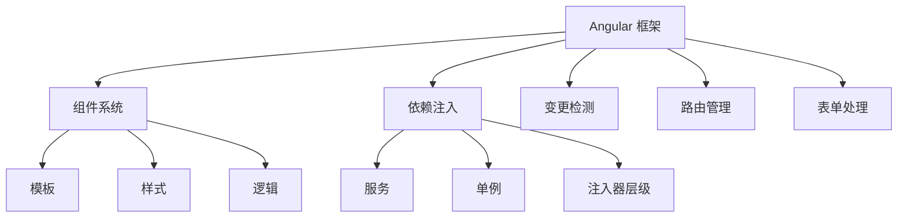

### 📊 Angular vs 其他框架

| 特性 | Angular | React | Vue |
|-----|---------|-------|-----|
| 类型系统 | ✅ TypeScript 原生 | ❌ 需第三方库 | ⚠️ 部分支持 |
| 学习曲线 | 🔴 陡峭 | 🟡 中等 | 🟢 平缓 |
| 企业应用 | ✅ 完美 | ✅ 良好 | ⚠️ 可行 |
| 包大小 | 🔴 较大 | 🟡 中等 | 🟢 较小 |
| 内置工具 | ✅ 完整 | ⚠️ 需组合 | ⚠️ 部分集成 |

---

## 2️⃣ Angular 20 新特性详解

### 🌟 重要特性速览

```
Angular 20 (2024)
├─ Signals 生产级发布
├─ 新控制流语法 (@if/@for/@switch)
├─ 延迟加载块 (@defer)
├─ 更新的 HTTP 客户端
├─ Zoneless 检测模式
└─ 独立组件默认生成
```

---

## 2️⃣➕ Angular 21 最新进展（2025-2026）

### 🌟 Angular 技术发展演进时间线

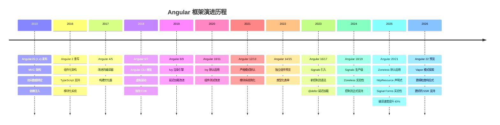

### 关键版本逐代解析

| 版本 | 年份 | 核心变化 | 对开发者的影响 |
|------|------|---------|--------------|
| **AngularJS** | 2010 | MVC 架构、双向绑定、DI | 首次将 MVVM 理念带入前端 |
| **Angular 2** | 2016 | **完全重写**：TypeScript、组件化 | 断裂式升级，生态重建 |
| **Angular 4** | 2017 | 体积更小、编译优化 | 小版本平稳迭代 |
| **Angular 5** | 2017 | 构建优化器、HttpClient 替换 Http | HTTP 模块统一 |
| **Angular 8** | 2019 | Ivy 编译器**预览** | 可选的增量 DOM 编译 |
| **Angular 9** | 2020 | **Ivy 默认**、体积减少 40% | 编译速度↑，包体积↓ |
| **Angular 12** | 2021 | 严格模式默认、移除 IE11 | 告别旧兼容 |
| **Angular 14** | 2022 | 独立组件预览、类型化表单 | 迈向 standalone 架构 |
| **Angular 15** | 2022 | **Standalone API 稳定** | 可创建无 NgModule 应用 |
| **Angular 17** | 2024 | Signals、`@if/@for` 控制流 | 响应式范式革命 |
| **Angular 18** | 2024 | **Zoneless 实验性** | 可选的精确变更检测 |
| **Angular 19** | 2025 | `linkedSignal`、`resource()` | 声明式数据获取 |
| **Angular 20** | 2025 | `httpResource`、Signal Forms | 响应式全面化 |
| **Angular 21** | 2026 | **Zoneless 默认**、esbuild 原生 | 全面现代化 |

### ⚡ Angular 关键转折点：AngularJS → Angular 2 → Ivy → Zoneless

```
2010: AngularJS（MVC + 双向绑定）     ← 先驱
  │    断裂式升级（完全重写）
  ▼
2016: Angular 2（TypeScript + 组件）   ← 重建根基
  │    View Engine 编译器
  ▼
2020: Angular 9（Ivy 默认）            ← 性能飞跃
  │    增量 DOM，包体积 -40%
  ▼
2024: Angular 17（Signals + 控制流）   ← 响应式革命
  │    新语法，新范式
  ▼
2026: Angular 21（Zoneless 默认）      ← 全面现代化
      精确依赖追踪，无需 Zone.js
```

### AngularJS → Angular 2 核心差异

| 维度 | AngularJS (1.x) | Angular 2+ |
|------|----------------|-------------|
| **架构** | MVC | 组件化 + DI |
| **语言** | JavaScript | **TypeScript** |
| **响应式** | 脏检查 ($digest) | Zone.js / Signals |
| **编译** | 无 | Ahead-of-Time (AOT) |
| **路由** | $routeProvider | Angular Router |
| **性能** | 慢（大量 watcher） | 快（Ivy 增量 DOM） |
| **移动端** | 不支持 | 支持 |

### 🌟 Angular 21 核心变化

```
Angular 21 (2025.11 发布)
├─ Zoneless 变更检测成为默认 ✅
├─ 内置 HttpClient 默认提供
├─ 构建工具优化（Vite 集成）
├─ Signal Forms 实验性引入
├─ Angular ARIA 无障碍包
├─ 编译速度提升 40%
└─ Bundle 体积减少 30-40%
```

### 🔥 Zoneless 变更检测（默认启用）

Angular 21 最大的变化是 **Zoneless 成为新项目的默认配置**。

```typescript
// Angular 20 - 手动启用 Zoneless
import { provideZonelessChangeDetection } from '@angular/core';

bootstrapApplication(AppComponent, {
  providers: [provideZonelessChangeDetection()]
});

// Angular 21 - 默认就是 Zoneless，无需手动配置
// ng new 生成的项目自动使用 Zoneless
```

#### Zoneless vs Zone.js 对比

| 特性 | Zone.js 模式 | Zoneless 模式 |
|------|-------------|---------------|
| 变更检测触发 | 所有异步操作自动触发 | 仅 Signal 变化和事件触发 |
| Bundle 大小 | +40KB (zone.js) | 0KB (无需 zone.js) |
| 性能 | 可能过度检测 | 精确检测，减少 25-40% 检查 |
| 调试体验 | 堆栈复杂 | 堆栈清晰，易于追踪 |
| 可预测性 | 低（隐式触发） | 高（显式触发） |

#### 迁移步骤

```typescript
// 1. 从 angular.json 移除 zone.js polyfills
// "polyfills": ["zone.js"] → 删除

// 2. 确保组件使用 OnPush 或 Signals
@Component({
  changeDetection: ChangeDetectionStrategy.OnPush
})

// 3. 使用 Signals 替代部分 Observable
// 之前
data$ = this.http.get('/api/data');
// 之后
data = resource(() => ({ request: '/api/data' }));

// 4. 测试中移除 zone.js/testing
// "polyfills": ["zone.js", "zone.js/testing"] → 删除
```

#### Zoneless 变更检测工作原理

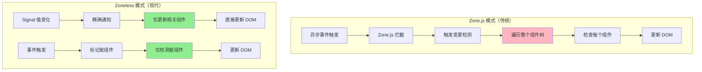

#### Zoneless vs Zone.js 性能对比

| 指标 | Zone.js 模式 | Zoneless 模式 | 提升 |
|------|-------------|---------------|------|
| 变更检测次数 | 全量遍历 | 精确检测 | -70% |
| Bundle 大小 | +40KB | 0KB | -40KB |
| 首次渲染 | 较慢 | 快 | +30% |
| 内存占用 | 较高 | 低 | -25% |
| 调试体验 | 堆栈复杂 | 堆栈清晰 | ⭐⭐⭐⭐⭐ |

### 🔬 Signals 引擎原理深度解析

Angular Signals 的底层实现与 Vue 3 的响应式系统类似，但独立设计：

```typescript
// Angular Signals 核心引擎（简化版）

type Node = {
  value: unknown
  version: number       // 版本号，每次变化递增
  sources: Node[] | null  // 依赖的上游信号
  subscribers: Node[] | null  // 订阅的下游信号
  
  computationFn: (() => unknown) | null  // computed 计算函数
  equal: (a: unknown, b: unknown) => boolean  // 值比较函数
}

// 全局追踪上下文
let activeSubscriber: Node | null = null

function signal<T>(initialValue: T): Signal<T> {
  const node: Node = {
    value: initialValue,
    version: 0,
    sources: null,
    subscribers: null,
    computationFn: null,
    equal: Object.is
  }
  
  function get(): T {
    // 读取时注册依赖
    if (activeSubscriber) {
      node.subscribers ??= []
      if (!node.subscribers.includes(activeSubscriber)) {
        node.subscribers.push(activeSubscriber)
      }
      activeSubscriber.sources ??= []
      if (!activeSubscriber.sources.includes(node)) {
        activeSubscriber.sources.push(node)
      }
    }
    return node.value as T
  }
  
  function set(newValue: T): void {
    if (node.equal(node.value, newValue)) return
    node.value = newValue
    node.version++
    // 通知所有下游订阅者
    node.subscribers?.forEach(sub => {
      if (sub.computationFn) {
        sub.value = sub.computationFn()
        sub.version++
      }
    })
  }
  
  return { get, set }
}

function computed<T>(fn: () => T): Signal<T> {
  const node: Node = {
    value: undefined,
    version: 0,
    sources: null,
    subscribers: null,
    computationFn: fn as () => unknown,
    equal: Object.is
  }
  
  function get(): T {
    // 懒计算：只在被读取时才计算结果
    if (activeSubscriber && node.version === 0) {
      const prev = activeSubscriber
      activeSubscriber = node
      node.value = fn()
      node.version++
      activeSubscriber = prev
    }
    return node.value as T
  }
  
  return { get }
}
```

**Angular Signals vs Vue 3 响应式对比：**

| 特性 | Angular Signals | Vue 3 (ref/reactive) |
|------|----------------|---------------------|
| **依赖追踪** | 手动 `get()` 调用 | Proxy 自动拦截 |
| **底层机制** | 版本号 + 订阅列表 | Proxy + WeakMap + Dep |
| **惰性计算** | computed 懒计算 | computed 即时计算（带缓存） |
| **变更检测** | 精确到信号级 | 组件级（Proxy 触发） |
| **框架耦合** | 可脱离 Angular 使用 | 需 Vue 运行时 |

### 📡 httpResource - 声明式数据获取

```typescript
import { httpResource } from '@angular/common/http';

@Component({
  template: `
    @if (users.isLoading()) {
      <p>加载中...</p>
    } @else if (users.error()) {
      <p>错误: {{ users.error().message }}</p>
    } @else {
      <ul>
        @for (user of users.value(); track user.id) {
          <li>{{ user.name }}</li>
        }
      </ul>
    }
  `
})
export class UserListComponent {
  // 声明式 HTTP 请求，自动管理加载/错误状态
  users = httpResource<User[]>('/api/users');

  // 带参数的请求
  userById = (id: number) => httpResource<User>(() => `/api/users/${id}`);
}
```

### 📝 Signal Forms（实验性）

```typescript
import { signal, linkedSignal } from '@angular/core';

// 表单状态用 Signals 管理
const name = signal('');
const email = signal('');

// 派生验证状态
const isNameValid = computed(() => name().length >= 2);
const isEmailValid = computed(() => email().includes('@'));
const isFormValid = computed(() => isNameValid() && isEmailValid());

// linkedSignal - 依赖其他 Signal 的派生状态
const displayName = linkedSignal({
  source: name,
  computation: (newName) => newName.toUpperCase()
});
```

### 🎨 Angular MCP Server（AI 辅助开发）

Angular 21 引入了 **Angular MCP Server**，支持 AI 工具（如 Cursor、Claude Code）直接理解 Angular 项目结构：

- 自动生成组件、服务、模块
- 智能代码补全和重构建议
- 自动检测可优化的 Signals 使用
- 辅助 Zoneless 迁移

### 2026 年 Angular 生态工具链

| 工具 | 最新版本 | 关键变化 |
|------|----------|----------|
| Angular | 21 | Zoneless 默认，Signals 成熟 |
| Angular CLI | 21 | Vite 集成，更快构建 |
| NgRx | 18+ | SignalStore 改进 |
| Angular Material | 21 | M3 设计系统 |
| Nx | 20+ | 更好的模块联邦 |
| Angular Universal | 废弃 | SSR 内置支持 |

### Angular 生态全景图

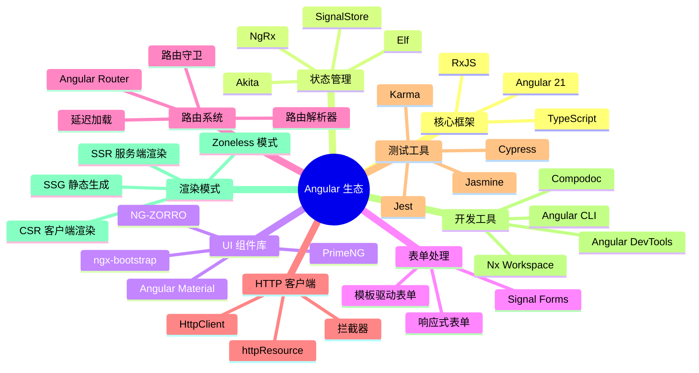

---

### 🔄 Signals 响应式系统详解

#### 问题背景
在 Angular 18 之前，检测变化需要遍历整个组件树：

```
变更发生 → Zone.js 拦截 → 整个树遍历 → 每个组件 detectChanges
```

这在大型应用中会导致性能问题。

#### 解决方案：Signal
Signals 提供**细粒度的反应性**：

```typescript
import { signal, computed, effect } from '@angular/core';

// 📍 创建可写信号
const count = signal(0);

// 📍 派生计算信号（自动依赖追踪）
const doubled = computed(() => count() * 2);
const message = computed(() => {
  const c = count();
  return c === 0 ? '零' : c === 1 ? '一' : `${c}个`;
});

// 📍 监听变化副作用
effect(() => {
  console.log(`Count 变化: ${count()}`);
  console.log(`Doubled: ${doubled()}`);
});

// 📍 更新信号
count.set(5);           // 直接赋值
count.update(v => v+1); // 基于旧值更新
```

#### 执行流程图

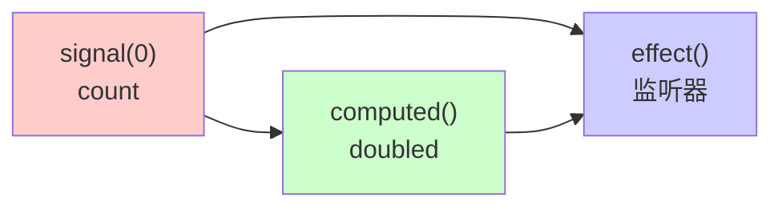

### ✨ 新控制流语法

#### ❌ 旧方式 vs ✅ 新方式对比

```html
<!-- 旧方式：指令风格 -->
<div *ngIf="isLoading" class="spinner"></div>
<div *ngIf="!isLoading" class="content">
  <div *ngFor="let item of items; trackBy: trackById">
    {{ item.name }}
  </div>
</div>

<!-- ✨ 新方式：块级语法 -->
@if (isLoading) {
  <div class="spinner">加载中...</div>
} @else {
  <div class="content">
    @for (item of items; track item.id) {
      <div>{{ item.name }}</div>
    }
  </div>
}
```

**改进点：**
- ✅ 语法更清晰
- ✅ 自动 `trackBy` 支持
- ✅ 编译器优化更好
- ✅ 性能提升 20-30%

### ⏳ 延迟加载块 (@defer)

```typescript
@Component({
  selector: 'app-dashboard',
  template: `
    <!-- 立即加载 -->
    <app-header></app-header>
    
    <!-- 延迟加载：当进入视口时 -->
    @defer (on viewport) {
      <app-heavy-chart></app-heavy-chart>
    } @placeholder {
      <div>图表加载中...</div>
    }
    
    <!-- 延迟加载：交互时 -->
    @defer (on interaction) {
      <app-comments-section></app-comments-section>
    } @loading {
      <p>评论加载中...</p>
    }
    
    <!-- 延迟加载：条件满足时 -->
    @defer (when isPremiumUser()) {
      <app-premium-features></app-premium-features>
    }
  `
})
export class DashboardComponent {
  isPremiumUser = signal(false);
}
```

**性能收益：**
- 初始加载体积减少 40-50%
- 首屏加载时间缩短
- 按需加载组件和组件逻辑

---

## 3️⃣ TypeScript 与 Angular 深度融合

### 🏗️ 装饰器系统（Decorators）

装饰器是 Angular 的核心，它为类、属性、方法添加元数据：

```typescript
// 📍 类装饰器（Angular 20+ 默认 standalone，无需显式声明）
@Component({
  selector: 'app-hero',
  template: `...`,
  styles: [`...`],
  changeDetection: ChangeDetectionStrategy.OnPush
})
export class HeroComponent { }

// 📍 属性装饰器（现代推荐：信号式）
export class ChildComponent {
  heroName = input<string>('');
  age = input<number>(0);
  heroSelected = output<Hero>();
  
  chart = viewChild.required<ChartComponent>();
  items = viewChildren<ListItemComponent>();
  actionBar = contentChild(ActionBarComponent);
}

// 📍 宿主绑定（现代推荐：host 属性）
@Component({
  host: {
    '(click)': 'onClick($event)'
  }
})
export class ClickComponent {
  onClick(event: MouseEvent) { }
}

// 📍 依赖注入（现代推荐：inject() 函数）
constructor() {
  const doc = inject(DOCUMENT);
}
```

### 📝 类型安全的组件

```typescript
// ✅ 正确：强类型的 Product 接口
interface Product {
  id: number;
  name: string;
  price: number;
  rating?: number;
  tags: string[];
}

@Component({
  selector: 'app-product-list',
  template: `
    @for (product of products(); track product.id) {
      <app-product-card 
        [product]="product"
        (onSelect)="onProductSelect($event)"
      />
    }
  `,
  imports: [ProductCardComponent]
})
export class ProductListComponent {
  // Signal 类型约束
  products = signal<Product[]>([]);
  selectedProduct = signal<Product | null>(null);
  
  private productService = inject(ProductService);
  
  ngOnInit() {
    // 类型检查：productService.getProducts() 返回 Observable<Product[]>
    this.productService.getProducts().subscribe(
      products => this.products.set(products)
    );
  }
  
  onProductSelect(product: Product): void {
    this.selectedProduct.set(product);
  }
}
```

---

## 4️⃣ 组件系统深层理解

### 🧩 组件解剖

```typescript
import { Component, input, output, signal, computed } from '@angular/core';

interface TodoItem {
  id: number;
  text: string;
  completed: boolean;
}

@Component({
  selector: 'app-todo-list',
  template: `
    <!-- 1️⃣ 模板：定义视图 -->
    <div class="todo-container">
      <h2>{{ title }}</h2>
      
      @for (todo of displayedTodos(); track todo.id) {
        <div 
          class="todo-item"
          [class.completed]="todo.completed"
          (click)="toggleTodo(todo.id)"
        >
          <span>{{ todo.text }}</span>
          <button (click)="removeTodo(todo.id); $event.stopPropagation()">
            删除
          </button>
        </div>
      }
      
      <div class="stats">
        已完成: {{ completedCount() }} / 总数: {{ todos().length }}
      </div>
    </div>
  `,
  // 2️⃣ 样式：组件作用域样式
  styles: [`
    .todo-container {
      max-width: 500px;
      margin: 20px auto;
    }
    .todo-item {
      padding: 10px;
      border: 1px solid #ddd;
      margin: 5px 0;
      cursor: pointer;
      display: flex;
      justify-content: space-between;
    }
    .todo-item.completed {
      text-decoration: line-through;
      opacity: 0.5;
    }
  `]
})
export class TodoListComponent {
  // 3️⃣ 数据：响应式状态管理
  title = input('我的任务列表');
  todoAdded = output<TodoItem>();
  
  todos = signal<TodoItem[]>([
    { id: 1, text: '学习 Angular', completed: false },
    { id: 2, text: '完成项目', completed: false }
  ]);
  
  // 4️⃣ 计算属性：派生状态
  completedCount = computed(() => 
    this.todos().filter(t => t.completed).length
  );
  
  displayedTodos = computed(() => 
    this.todos().filter(t => !t.completed)
  );
  
  // 5️⃣ 方法：处理逻辑
  toggleTodo(id: number): void {
    this.todos.update(todos => 
      todos.map(t => 
        t.id === id ? { ...t, completed: !t.completed } : t
      )
    );
  }
  
  removeTodo(id: number): void {
    this.todos.update(todos => todos.filter(t => t.id !== id));
  }
}
```

### 📋 模板语法完整参考

| 语法 | 用途 | 示例 |
|------|------|------|
| `{{ expression }}` | 插值 | `{{ user.name }}` |
| `[property]="value"` | 属性绑定 | `[disabled]="!form.valid"` |
| `(event)="handler()"` | 事件绑定 | `(click)="submit()"` |
| `[(ngModel)]="value"` | 双向绑定 | `[(ngModel)]="searchTerm"` |
| `@if (condition)` | 条件渲染 | `@if (isAdmin) { ... }` |
| `@for (item of list)` | 列表渲染 | `@for (item of items; track item.id)` |
| `\| pipe` | 管道转换 | `{{ price \| currency }}` |

---

## 5️⃣ Signals vs Observables

### 🤔 何时使用哪一个？

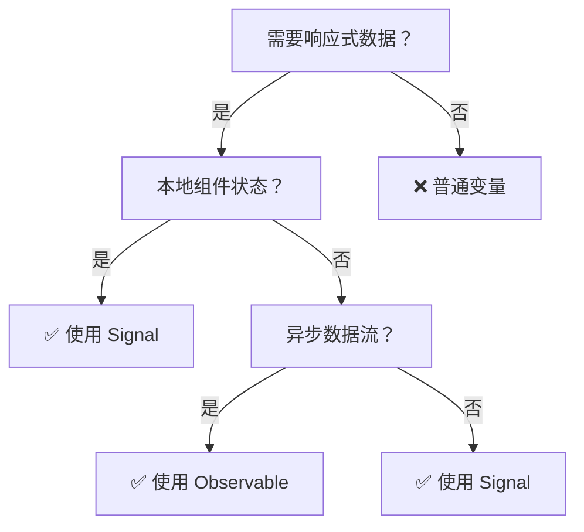

### 📊 详细对比

```typescript
// 场景 1：本地组件状态 → Signal 更好
const userCount = signal(0);
const users = computed(() => allUsers().slice(0, userCount()));

// 场景 2：HTTP 请求 → 两者都可，Signal 推荐
// 方式 A：Observable (需要手动管理订阅)
users$ = this.http.get('/users');

// 方式 B：Signal (推荐，更现代)
users = resource(() => ({
  request: { /* 参数 */ },
  loader: ({ request }) => this.http.get('/users')
}));

// 场景 3：事件流、轮询 → Observable 更好
const messages$ = this.messageService.getMessages().pipe(
  switchMap(msg => this.processMessage(msg))
);

// 场景 4：WebSocket 连接 → Observable 最优
socket$ = webSocket('ws://...');
```

---

## 6️⃣ 数据绑定深度剖析

### 🔄 数据流向可视化

```
┌─────────────────────────────────────────────────┐
│           Angular 数据流架构                     │
├─────────────────────────────────────────────────┤
│                                                 │
│  组件类                    模板                  │
│  ┌──────────┐              ┌───────┐           │
│  │  count   │◄─ 读取 ─►│{{ count  │           │
│  │  变量    │            │  }}     │           │
│  └──────────┘            └───────┘           │
│       ▲                       │                │
│       │ [@] Input 传入         │ 事件绑定      │
│       │                       ▼                │
│  ┌──────────┐              ┌───────┐           │
│  │ onSubmit │◄─ 处理 ◄─ (click) │           │
│  │ 方法     │            └───────┘           │
│  └──────────┘                                  │
│                                                 │
│  单向数据流保证可预测性 ✅                      │
│  变更检测机制确保同步 ✅                        │
└─────────────────────────────────────────────────┘
```

### 🎯 四种绑定方式详解

```html
<!-- 1️⃣ 插值绑定：组件 → 模板 -->
<h1>{{ title }}</h1>

<!-- 2️⃣ 属性绑定：组件 → DOM属性 -->

<button [disabled]="isSubmitting">提交</button>

<!-- 3️⃣ 事件绑定：模板 → 组件 -->
<button (click)="onSave()">保存</button>
<input (keyup.enter)="search()" placeholder="搜索...">

<!-- 4️⃣ 双向绑定：组件 ◄→ 模板 -->
<input [(ngModel)]="username" />
<!-- 等价于 -->
<input 
  [ngModel]="username" 
  (ngModelChange)="username = $event"
/>
```

### ⚙️ 高级绑定技巧

```html
<!-- 事件对象 -->
<input (keyup)="onKeyUp($event)" />

<!-- 模板变量 -->
<input #nameInput type="text" />
<button (click)="greet(nameInput.value)">问候</button>

<!-- 按键事件修饰符 -->
<input (keyup.enter)="save()" />      <!-- Enter 键 -->
<input (keyup.escape)="cancel()" />   <!-- Esc 键 -->

<!-- 鼠标事件修饰符 -->
<button (mouseenter)="highlight()" (mouseleave)="unhighlight()">
  悬停
</button>

<!-- 事件停止冒泡 -->
<div (click)="onParentClick()">
  <button (click)="onChildClick(); $event.stopPropagation()">
    内层按钮
  </button>
</div>
```

---

## 7️⃣ RxJS 在 Angular 中的应用

### 🌊 Observable 核心概念

```typescript
import { Observable, Subject, BehaviorSubject, ReplaySubject } from 'rxjs';
import { map, filter, debounceTime, distinctUntilChanged, switchMap, tap, catchError } from 'rxjs/operators';

// 📍 创建 Observable 的多种方式

// 方式 1：from 创建
from([1, 2, 3]).subscribe(console.log);

// 方式 2：timer 创建
timer(1000, 2000).subscribe(() => console.log('每2秒触发'));

// 方式 3：创建可观察的 HTTP 请求
const users$ = this.http.get<User[]>('/api/users');

// 方式 4：Subject - 可观察对象和观察者的混合体
const userClick$ = new Subject<ClickEvent>();
userClick$.subscribe(event => console.log('用户点击了'));
userClick$.next(clickEvent); // 发出新值
```

### 🔗 常用操作符详解

```typescript
// 1️⃣ 转换操作符
source$.pipe(
  map(x => x * 2),              // 变换每个值
  switchMap(x => this.fetch(x)) // 切换到新 observable
);

// 2️⃣ 过滤操作符
source$.pipe(
  filter(x => x > 10),          // 过滤值
  distinctUntilChanged()        // 去重相邻值
);

// 3️⃣ 时间操作符
source$.pipe(
  debounceTime(300),            // 防抖（最后一个事件）
  throttleTime(1000)            // 节流（固定间隔）
);

// 4️⃣ 组合操作符
combineLatest([users$, posts$]).pipe(
  map(([users, posts]) => ({ users, posts }))
);

// 5️⃣ 错误处理
source$.pipe(
  retry(3),                           // 重试3次
  catchError(err => of(defaultValue)) // 捕获错误
);
```

### 🔍 实战场景：搜索输入框

```typescript
@Component({
  selector: 'app-search',
  template: `
    <input 
      #searchInput
      (input)="onSearch(searchInput.value)"
      placeholder="搜索用户..."
    />

    @if (results.value(); as data) {
      @for (result of data; track result.id) {
        <div class="result">{{ result.name }}</div>
      }
    }
  `
})
export class SearchComponent {
  private userService = inject(UserService);

  searchTerm = signal('');

  results = resource({
    request: () => this.searchTerm(),
    loader: ({ request: term }) => {
      if (!term) return of([] as User[]);
      return this.userService.search(term).pipe(
        debounceTime(300),
        catchError(error => {
          console.error('搜索失败', error);
          return of([] as User[]);
        })
      );
    }
  });

  onSearch(term: string) {
    this.searchTerm.set(term);
  }
}
```

---

# 第二部分：高级特性

## 8️⃣ 依赖注入（DI）系统

### 🎯 DI 核心原理

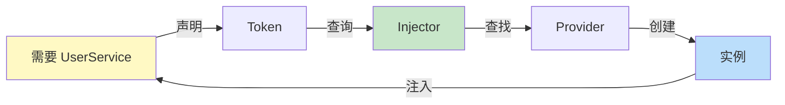

### 📍 Provider 提供者详解

```typescript
import { Injectable, inject, InjectionToken } from '@angular/core';

// 📍 1️⃣ 服务提供者（最常见）
@Injectable({ providedIn: 'root' })
export class UserService {
  users = signal<User[]>([]);
  
  getUsers() { /* ... */ }
}

// 📍 2️⃣ 值提供者
const appConfig = new InjectionToken<AppConfig>('app.config');
const configProvider = {
  provide: appConfig,
  useValue: { apiUrl: 'https://api.example.com' }
};

// 📍 3️⃣ 类提供者
const httpProvider = {
  provide: HttpClient,
  useClass: CachedHttpClient // 使用子类替代
};

// 📍 4️⃣ 工厂提供者
const dateProvider = {
  provide: 'app.timestamp',
  useFactory: () => new Date().getTime()
};

// 📍 5️⃣ 注入令牌（提供非类型的依赖）
export const API_URL = new InjectionToken<string>('api.url');
export const DATABASE = new InjectionToken('app.database');

@Injectable()
export class DataService {
  private apiUrl = inject(API_URL);
  private db = inject(DATABASE);
}
```

### 🏗️ 注入器层级结构

```
┌────────────────────────────────┐
│     应用级（根）注入器           │ 
│  providedIn: 'root' 的服务      │
└──────────────┬─────────────────┘
               │
   ┌───────────┴────────────┐
   │                        │
┌──▼──────────┐    ┌──────▼───┐
│  模块注入器   │    │  模块注入器 │
│  （NgModule）│    │（NgModule）│
└──────────────┘    └───────────┘
   │ │              │ │
┌──▼─▼────┐    ┌───▼─▼──┐
│组件注入器 │    │组件注入器│
└──────────┘    └────────┘
```

### 💉 现代 DI 用法（inject() API）

```typescript
// ✅ 推荐：使用 inject() 的函数式方式
@Component({
  selector: 'app-user'
})
export class UserComponent {
  // 在组件类中直接使用
  private userService = inject(UserService);
  private route = inject(ActivatedRoute);
  private apiUrl = inject(API_URL);
  
  ngOnInit() {
    this.userService.getUsers();
  }
}

// 📍 在函数/管道中也能使用
export function loadUserGuard() {
  const userService = inject(UserService);
  const router = inject(Router);
  
  return () => userService.isLoaded() || router.navigate(['/login']);
}

export class UppercasePipe implements PipeTransform {
  private logger = inject(LogService);
  
  transform(value: string): string {
    this.logger.log(`Transforming: ${value}`);
    return value.toUpperCase();
  }
}
```

---

## 9️⃣ 路由系统（Router）

### 📍 路由工作流程

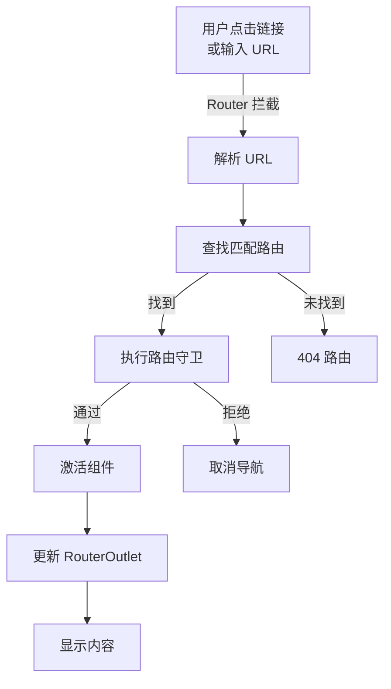

### 🛣️ 路由配置详细示例

```typescript
import { Routes, Router, ActivatedRoute } from '@angular/router';
import { inject } from '@angular/core';

// 📍 路由守卫示例
export function authGuard(): boolean {
  const authService = inject(AuthService);
  const router = inject(Router);
  
  if (authService.isAuthenticated()) {
    return true;
  } else {
    router.navigate(['/login']);
    return false;
  }
}

// 📍 路由解析器（预加载数据）
export function userResolver() {
  return (route: ActivatedRouteSnapshot) => {
    const userId = route.paramMap.get('id');
    return inject(UserService).getUserById(userId!);
  };
}

// 📍 完整的路由配置
export const routes: Routes = [
  // 1️⃣ 简单路由
  { path: '', redirectTo: '/dashboard', pathMatch: 'full' },
  
  // 2️⃣ 组件路由
  { 
    path: 'dashboard', 
    component: DashboardComponent,
    canActivate: [authGuard],  // 进入前守卫
    canDeactivate: [unsavedChangesGuard] // 离开前守卫
  },
  
  // 3️⃣ 参数路由
  {
    path: 'user/:id',
    component: UserDetailComponent,
    resolve: { user: userResolver() } // 预加载数据
  },
  
  // 4️⃣ 嵌套路由（子路由）
  {
    path: 'admin',
    component: AdminLayoutComponent,
    canActivate: [adminGuard],
    children: [
      { path: '', redirectTo: 'dashboard', pathMatch: 'full' },
      { path: 'dashboard', component: AdminDashboardComponent },
      { path: 'users', component: AdminUsersComponent },
      { path: 'settings', component: SettingsComponent }
    ]
  },
  
  // 5️⃣ 延迟加载模块
  {
    path: 'analytics',
    loadChildren: () => 
      import('./analytics/analytics.module').then(m => m.AnalyticsModule),
    canLoad: [authGuard]
  },
  
  // 6️⃣ 通配符路由（必须放在最后）
  { path: '**', component: NotFoundComponent }
];

// 📍 在组件中使用路由
@Component({
  selector: 'app-user-detail',
  template: `
    <h1>User: {{ user?.name }}</h1>
    <p>ID: {{ userId }}</p>
    <button (click)="goBack()">返回</button>
  `
})
export class UserDetailComponent {
  private router = inject(Router);
  private route = inject(ActivatedRoute);
  
  userId = signal('');
  user = signal<User | null>(null);
  private userService = inject(UserService);
  
  constructor() {
    // 方式 1：使用 signal 从 resolve 获取数据
    const resolvedUser = this.route.snapshot.data['user'] as User | undefined;
    if (resolvedUser) this.user.set(resolvedUser);
    
    // 方式 2：监听参数变化（组件复用时自动更新）
    const id$ = this.route.paramMap.pipe(
      map(params => params.get('id') || ''),
      takeUntilDestroyed()
    );
    id$.subscribe(id => {
      this.userId.set(id);
      this.loadUser();
    });
    
    // 方式 3（推荐）：使用 input 转换路由参数
    // Angular 20+ 支持: userId = input<string>(); 
    // 配合路由配置: { path: 'user/:id', ...}
  }
  
  goBack() {
    this.router.navigate(['../'], { relativeTo: this.route });
  }
}
```

### 🧭 声明式导航

```html
<!-- 基础导航 -->
<a routerLink="/dashboard">仪表板</a>

<!-- 带参数 -->
<a [routerLink]="['/user', userId]">查看用户</a>

<!-- 查询参数 -->
<a [routerLink]="['/search']" [queryParams]="{ q: 'angular' }">
  搜索 Angular
</a>

<!-- 活跃链接标记 -->
<nav>
  <a routerLink="/home" routerLinkActive="active">首页</a>
  <a routerLink="/about" routerLinkActive="active" 
     [routerLinkActiveOptions]="{ exact: true }">
    关于
  </a>
</nav>

<!-- 路由出口 -->
<div class="container">
  <router-outlet></router-outlet>
</div>

<!-- 多个路由出口 -->
<router-outlet></router-outlet>
<router-outlet name="sidebar"></router-outlet>
```

---

## 🔟 表单系统深度剖析

### 📝 表单类型选择指南

```
表单类型选择
│
├─ 简单表单？(< 5 个字段)
│  └─ ✅ 模板驱动表单
│
├─ 复杂/动态表单？
│  └─ ✅ 响应式表单
│
├─ 需要自定义验证？
│  └─ ✅ 响应式表单
│
└─ 需要实时数据同步？
   └─ ✅ 响应式表单
```

### 📋 模板驱动表单示例

```html
<!-- 简单的登录表单 -->
<form #loginForm="ngForm" (ngSubmit)="onSubmit(loginForm.value)">
  <!-- 文本输入 -->
  <input 
    type="email"
    name="email"
    placeholder="邮箱"
    [(ngModel)]="model.email"
    required
    email
    #emailField="ngModel"
  />
  @if (emailField.invalid && emailField.touched) {
    <div class="error">{{ getEmailError(emailField) }}</div>
  }
  
  <!-- 密码输入 -->
  <input 
    type="password"
    name="password"
    placeholder="密码"
    [(ngModel)]="model.password"
    required
    minlength="8"
    #passwordField="ngModel"
  />
  
  <!-- 提交按钮 -->
  <button [disabled]="!loginForm.valid">登录</button>
</form>
```

### ⚙️ 响应式表单深度示例

```typescript
import { FormBuilder, FormGroup, Validators, AbstractControl } from '@angular/forms';

@Component({
  selector: 'app-user-form',
  template: `
    <form [formGroup]="userForm" (ngSubmit)="onSubmit()">
      <!-- 基本字段 -->
      <input 
        formControlName="name" 
        placeholder="姓名"
      />
      @if (userForm.get('name')?.errors?.['required']) {
        <span class="error">姓名必填</span>
      }
      
      <!-- 嵌套 FormGroup -->
      <fieldset [formGroup]="userForm.get('address')">
        <input 
          formControlName="city" 
          placeholder="城市"
        />
      </fieldset>
      
      <!-- 动态 FormArray -->
      <div formArrayName="hobbies">
        @for (hobby of hobbies().controls; let i = $index) {
          <div [formGroupName]="i">
            <input formControlName="name" placeholder="爱好名称" />
            <button type="button" (click)="removeHobby(i)">删除</button>
          </div>
        }
      </div>
      <button type="button" (click)="addHobby()">添加爱好</button>
      
      <button type="submit" [disabled]="!userForm.valid">保存</button>
    </form>
  `,
  imports: [ReactiveFormsModule]
})
export class UserFormComponent {
  private fb = inject(FormBuilder);
  userForm: FormGroup = this.fb.group({
      name: ['', [Validators.required, Validators.minLength(2)]],
      email: ['', [Validators.required, Validators.email]],
      // 嵌套 FormGroup
      address: this.fb.group({
        city: [''],
        street: [''],
        zipCode: ['']
      }),
      // 动态 FormArray
      hobbies: this.fb.array([])
    });
  
  // 获取 FormArray
  hobbies() {
    return this.userForm.get('hobbies') as FormArray;
  }
  
  // 添加爱好
  addHobby() {
    const hobbyForm = this.fb.group({
      name: ['', Validators.required]
    });
    this.hobbies().push(hobbyForm);
  }
  
  // 删除爱好
  removeHobby(index: number) {
    this.hobbies().removeAt(index);
  }
  
  // 自定义验证器
  passwordMatchValidator(control: AbstractControl): ValidationErrors | null {
    const password = control.get('password')?.value;
    const confirmPassword = control.get('confirmPassword')?.value;
    
    if (password !== confirmPassword) {
      return { passwordMismatch: true };
    }
    return null;
  }
  
  onSubmit() {
    if (this.userForm.valid) {
      console.log(this.userForm.value);
    }
  }
}
```

---

## 1️⃣1️⃣ 生命周期钩子完全指南

### 🔄 生命周期执行顺序图

```
组件创建
  ↓
constructor() ← 构造函数（不是钩子）
  ↓
ngOnChanges() ← 输入属性变化（首次 + 后续变化）
  ↓
ngOnInit() ← 初始化（只执行一次）
  ↓
ngDoCheck() ← 自定义变更检测（每次检测都执行）
  ↓
ngAfterContentInit() ← 内容投影初始化
  ↓
ngAfterContentChecked() ← 内容投影检查
  ↓
┌─────────────────────────┐
│  显示视图，用户交互       │ ← 这期间会多次执行检查钩子
│  ↓ ngDoCheck()          │
│  ↓ ngAfterViewChecked() │
└─────────────────────────┘
  ↓
ngOnDestroy() ← 销毁前清理
  ↓
组件销毁
```

### 📊 生命周期钩子详解表

| 钩子 | 调用时机 | 执行次数 | 用途 | 优先度 |
|------|---------|---------|------|--------|
| `ngOnInit` | 初始化后 | 1次 | 初始化数据、订阅 | ⭐⭐⭐⭐⭐ |
| `ngOnDestroy` | 销毁前 | 1次 | 清理资源、取消订阅 | ⭐⭐⭐⭐⭐ |
| `ngOnChanges` | @Input变化 | 多次 | 响应Input变化 | ⭐⭐⭐⭐ |
| `ngAfterViewInit` | 视图初始化后 | 1次 | 操作@ViewChild | ⭐⭐⭐ |
| `ngAfterContentInit` | 内容投影后 | 1次 | 操作@ContentChild | ⭐⭐⭐ |
| `ngDoCheck` | 变更检测时 | 多次 | 自定义检测逻辑 | ⭐⭐ |
| `ngAfterViewChecked` | 视图检查后 | 多次 | 🔴 避免使用 | ⭐ |
| `ngAfterContentChecked` | 内容检查后 | 多次 | 🔴 避免使用 | ⭐ |

### 💡 生命周期最佳实践

```typescript
@Component({...})
export class BestPracticeComponent implements OnInit {
  private readonly destroyRef = inject(DestroyRef);
  
  constructor(private userService: UserService) {
    // ❌ 不要在这里做复杂初始化
    // ❌ 不要访问 @Input/@ViewChild
  }
  
  ngOnInit() {
    // ✅ 初始化数据
    this.userService.getUsers()
      .pipe(takeUntilDestroyed(this.destroyRef))
      .subscribe(users => console.log(users));
    
    // ✅ 订阅
    // ✅ 设置定时器
  }
  
  ngAfterViewInit() {
    // ✅ 访问 @ViewChild 元素
    // ✅ 操作原生 DOM
  }
  // ❌ 无需 ngOnDestroy — takeUntilDestroyed 自动管理取消订阅
  
  // 清理定时器/事件监听仍可在 ngOnDestroy 中手动处理
}
```

---

# 第三部分：工程实践

## 1️⃣2️⃣ 变更检测机制

### 🧠 变更检测工作原理

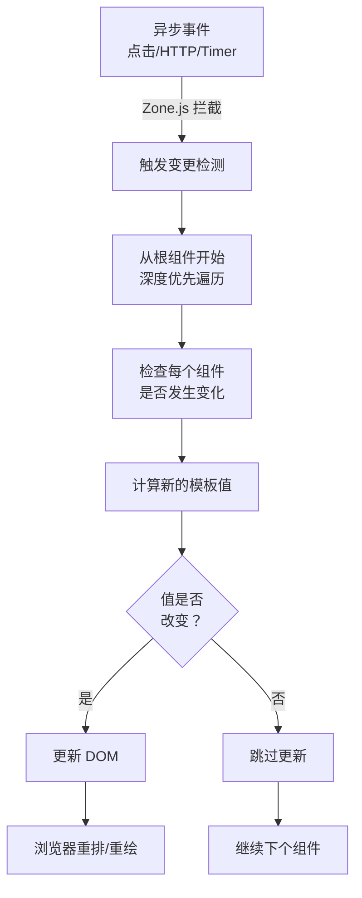

### 📍 ChangeDetectionStrategy

```typescript
// 🔴 默认策略：检查整个树
@Component({
  selector: 'app-default',
  template: `<p>{{ data }}</p>`
  // changeDetection: ChangeDetectionStrategy.Default （默认）
})
export class DefaultComponent {
  data = signal('');
}

// 🟢 OnPush 策略：细粒度检测
@Component({
  selector: 'app-onpush',
  template: `<p>{{ user().name }}</p>`,
  changeDetection: ChangeDetectionStrategy.OnPush
})
export class OnPushComponent {
  user = signal({ name: 'John' });
  
  // OnPush 何时触发变更检测？
  // 1️⃣ Signal input 或 @Input 引用改变
  inputData = input.required<any>();
  // 或 @Input() set inputData(value: any) { }
  
  // 2️⃣ 事件从该组件发出
  onClick() {
    // 点击事件后触发检测
  }
  
  // 3️⃣ async 管道发出新值
  data$ = this.http.get('/api/data');
  // {{ data$ | async }} 会触发检测
  
  // 4️⃣ Signal 值变化（新特性）
  count = signal(0);
  // {{ count() }} 值变化后触发检测
}
```

### 🎯 性能优化：OnPush 最佳实践

```typescript
@Component({
  selector: 'app-optimized-list',
  template: `
    @for (item of items; track item.id) {
      <app-list-item 
        [item]="item"
        [selected]="item.id === selectedId()"
        (itemClick)="onItemClick($event)"
      />
    }
  `,
  changeDetection: ChangeDetectionStrategy.OnPush
})
export class OptimizedListComponent {
  // ✅ 使用 Signal
  items = signal<Item[]>([]);
  selectedId = signal<number | null>(null);
  
  private cdRef = inject(ChangeDetectorRef);
  
  // ✅ 不可变更新
  updateItems(newItems: Item[]) {
    this.items.set(newItems); // Signal 自动触发检测
  }
  
  // ❌ 避免直接修改
  // this.items().push(newItem); ❌ 不会触发检测
  
  // ✅ 手动触发检测（必要时）
  asyncOperation() {
    this.fetch().subscribe(data => {
      this.items.set(data);
      this.cdRef.markForCheck(); // 标记为脏，下次检测时更新
    });
  }
}
```

---

## 1️⃣3️⃣ HTTP 和数据获取

### 🌐 HttpClient 完整示例

```typescript
import { HttpClient, HttpErrorResponse, HttpHeaders, HttpParams } from '@angular/common/http';
import { Observable, throwError } from 'rxjs';
import { retry, catchError, timeout } from 'rxjs/operators';

interface ApiResponse<T> {
  success: boolean;
  data: T;
  message: string;
}

@Injectable({ providedIn: 'root' })
export class ApiService {
  private baseUrl = 'https://api.example.com';
  
  constructor(private http: HttpClient) {}
  
  // ✅ GET 请求
  getUsers(page: number = 1): Observable<User[]> {
    const params = new HttpParams()
      .set('page', page.toString())
      .set('limit', '10');
    
    return this.http.get<User[]>(`${this.baseUrl}/users`, { params })
      .pipe(
        timeout(5000),           // 5秒超时
        retry(2),               // 失败重试2次
        catchError(this.handleError)
      );
  }
  
  // ✅ POST 请求
  createUser(user: Partial<User>): Observable<User> {
    const headers = new HttpHeaders({
      'Content-Type': 'application/json',
      'Authorization': `Bearer ${this.getToken()}`
    });
    
    return this.http.post<User>(
      `${this.baseUrl}/users`,
      user,
      { headers }
    ).pipe(
      catchError(this.handleError)
    );
  }
  
  // ✅ PUT 请求
  updateUser(id: number, updates: Partial<User>): Observable<User> {
    return this.http.put<User>(
      `${this.baseUrl}/users/${id}`,
      updates
    ).pipe(
      catchError(this.handleError)
    );
  }
  
  // ✅ DELETE 请求
  deleteUser(id: number): Observable<void> {
    return this.http.delete<void>(
      `${this.baseUrl}/users/${id}`
    ).pipe(
      catchError(this.handleError)
    );
  }
  
  // ✅ 错误处理
  private handleError(error: HttpErrorResponse) {
    let errorMessage = '发生了一个错误';
    
    if (error.error instanceof ErrorEvent) {
      // 客户端错误
      errorMessage = `错误: ${error.error.message}`;
    } else {
      // 服务器错误
      errorMessage = `错误代码: ${error.status}, 消息: ${error.message}`;
    }
    
    console.error(errorMessage);
    return throwError(() => new Error(errorMessage));
  }
}
```

### 🔐 HTTP 拦截器系统（函数式拦截器）

```typescript
import { HttpInterceptorFn } from '@angular/common/http';

// 📍 认证拦截器（函数式）
export const authInterceptor: HttpInterceptorFn = (req, next) => {
  const authService = inject(AuthService);
  const router = inject(Router);
  
  // 1️⃣ 添加 Token
  const token = authService.getToken();
  if (token) {
    req = req.clone({
      setHeaders: { Authorization: `Bearer ${token}` }
    });
  }
  
  // 2️⃣ 处理响应
  return next(req).pipe(
    catchError(error => {
      if (error.status === 401) {
        authService.logout();
        router.navigate(['/login']);
      }
      return throwError(() => error);
    })
  );
};

// 📍 日志拦截器（函数式）
export const loggingInterceptor: HttpInterceptorFn = (req, next) => {
  const startTime = Date.now();
  console.log(`[${req.method}] ${req.url}`);
  
  return next(req).pipe(
    tap(event => {
      if (event instanceof HttpResponse) {
        const duration = Date.now() - startTime;
        console.log(`✅ ${req.method} ${req.url} (${duration}ms)`);
      }
    }),
    catchError(error => {
      const duration = Date.now() - startTime;
      console.error(`❌ ${req.method} ${req.url} (${duration}ms)`);
      return throwError(() => error);
    })
  );
};

// 📍 在 main.ts 中注册
bootstrapApplication(AppComponent, {
  providers: [
    provideHttpClient(
      withInterceptors([authInterceptor, loggingInterceptor])
    )
  ]
});
```

### 🎯 现代方式：httpResource()

```typescript
import { resource } from '@angular/core';
import { httpResource } from '@angular/common/http';

@Component({...})
export class UserListComponent {
  // 📍 使用 httpResource 简化 HTTP 请求
  users = resource({
    request: () => ({ pageSize: 10, page: this.currentPage() }),
    loader: ({ request }) => 
      this.http.get<User[]>('/api/users', {
        params: { 
          pageSize: request.pageSize,
          page: request.page
        }
      })
  });
  
  currentPage = signal(1);
  
  // 自动处理的功能：
  // ✅ 请求状态：users.isLoading
  // ✅ 错误处理：users.error
  // ✅ 数据：users.value
  // ✅ 自动缓存
  // ✅ 自动清理订阅
  
  onPageChange(page: number) {
    this.currentPage.set(page);
    // users 会自动重新加载
  }
}
```

---

# 第四部分：性能优化

## 1️⃣4️⃣ 性能优化全景图

### 📊 优化策略金字塔

```
                    🚀 性能优化
                   /          \
                  /            \
          用户体验优化        运行时优化
         (Core Web Vitals)  (变更检测)

       ┌──────────────────────────────┐
       │  网络层优化                   │
       │  • 模块懒加载                 │
       │  • 资源预加载                 │
       │  • CDN 部署                  │
       │  • HTTP/2 多路复用           │
       └──────────────────────────────┘

       ┌──────────────────────────────┐
       │  编译时优化                 │
       │  • AOT 编译                 │
       │  • Tree-shaking            │
       │  • 代码压缩                 │
       │  • 静态分析                 │
       └──────────────────────────────┘

       ┌──────────────────────────────┐
       │  运行时优化                 │
       │  • OnPush 策略              │
       │  • Signals 响应式           │
       │  • trackBy 优化             │
       │  • 虚拟滚动                 │
       └──────────────────────────────┘
```

#### 性能优化决策树

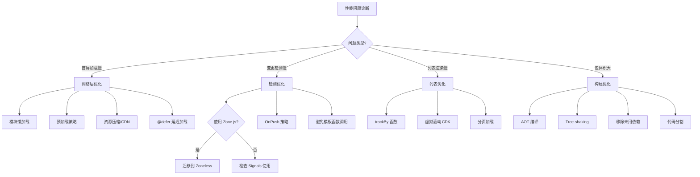

### ⚡ 包体积优化

```typescript
// 📍 优化前的包体积分析
ng build --stats-json

// 📍 减少依赖
// ❌ 避免导入整个库
import _ from 'lodash';          // 整个库 ~70KB

// ✅ 只导入需要的部分
import { debounce } from 'lodash-es';  // 只有几KB

// 📍 动态导入（代码分割）
@Component({...})
export class LazyComponent {
  // 使用 import()，该组件代码不包含在主 bundle 中
}

// 📍 删除未使用的代码
// TreeShaking 要求 package.json 中 sideEffects: false
```

### 🚀 运行时性能优化

```typescript
// ✅ 1. 虚拟滚动（大列表）
import { ScrollingModule } from '@angular/cdk/scrolling';

@Component({
  template: `
    <cdk-virtual-scroll-viewport itemSize="50" class="list">
      @for (item of items; track item.id) {
        <div class="item">{{ item.name }}</div>
      }
    </cdk-virtual-scroll-viewport>
  `
})
export class LargeListComponent {
  items = signal<Item[]>([...Array(10000).keys()].map(i => ({ 
    id: i, 
    name: `Item ${i}` 
  })));
}

// ✅ 2. 防抖搜索
@Component({
  template: `
    <input 
      #searchInput
      (input)="onSearch(searchInput.value)"
      placeholder="搜索..."
    />
  `
})
export class SearchComponent {
  private searchTerm = signal('');
  
  onSearch = debounce((term: string) => {
    this.searchTerm.set(term);
    this.performSearch(term);
  }, 300);
}

// ✅ 3. trackBy 优化列表
@Component({
  template: `
    @for (item of items; track trackById(item)) {
      <app-item [item]="item" />
    }
  `
})
export class ListComponent {
  items = signal<Item[]>([]);
  
  trackById(item: Item): number {
    return item.id;
  }
}
```

---

## 1️⃣5️⃣ 测试策略

### 🧪 测试金字塔

```
                    端到端测试 (E2E)
                  /              \
                /                  \
      集成测试 (Integration)     
    /                            \
  /                              \
单元测试 (Unit)
```

### 📝 单元测试示例

```typescript
import { TestBed } from '@angular/core/testing';
import { provideHttpClient } from '@angular/common/http';
import { provideHttpClientTesting, HttpTestingController } from '@angular/common/http/testing';

describe('用户服务', () => {
  let service: UserService;
  let httpMock: HttpTestingController;
  
  beforeEach(() => {
    TestBed.configureTestingModule({
      providers: [
        provideHttpClient(),
        provideHttpClientTesting(),
        UserService
      ]
    });
    
    service = TestBed.inject(UserService);
    httpMock = TestBed.inject(HttpTestingController);
  });
  
  afterEach(() => {
    httpMock.verify(); // 确保没有未完成的请求
  });
  
  it('应该获取用户列表', () => {
    const mockUsers: User[] = [
      { id: 1, name: 'Alice' },
      { id: 2, name: 'Bob' }
    ];
    
    service.getUsers().subscribe(users => {
      expect(users.length).toBe(2);
      expect(users[0].name).toBe('Alice');
    });
    
    const req = httpMock.expectOne('/api/users');
    expect(req.request.method).toBe('GET');
    req.flush(mockUsers);
  });
  
  it('应该处理错误', () => {
    service.getUsers().subscribe(
      () => fail('应该失败'),
      error => {
        expect(error.status).toBe(404);
      }
    );
    
    const req = httpMock.expectOne('/api/users');
    req.flush('Not found', { status: 404, statusText: 'Not Found' });
  });
});

// 📝 组件测试
describe('用户列表组件', () => {
  let component: UserListComponent;
  let fixture: ComponentFixture<UserListComponent>;
  
  beforeEach(async () => {
    await TestBed.configureTestingModule({
      imports: [UserListComponent],
      providers: [
        provideHttpClient(),
        provideHttpClientTesting()
      ]
    }).compileComponents();

    fixture = TestBed.createComponent(UserListComponent);
    component = fixture.componentInstance;
  });
  
  it('应该显示用户列表', () => {
    component.users.set([
      { id: 1, name: 'Alice' },
      { id: 2, name: 'Bob' }
    ]);
    
    fixture.detectChanges();
    
    const items = fixture.nativeElement.querySelectorAll('.user-item');
    expect(items.length).toBe(2);
    expect(items[0].textContent).toContain('Alice');
  });
});
```

---

# 第五部分：面试题汇总

---

## Angular 技术体系化总结

### 🎯 Angular 核心概念关系图

```mermaid
mindmap
  root((Angular 核心))
    组件系统
      独立组件
      模板语法
      数据绑定
      生命周期
    依赖注入
      Injectable
      Provider
      Injector
      inject() 函数
    Signals 响应式
      signal
      computed
      effect
      linkedSignal
    指令系统
      结构指令
      属性指令
      自定义指令
      新控制流
    路由系统
      Angular Router
      路由守卫
      延迟加载
      路由解析器
    表单处理
      响应式表单
      模板驱动表单
      表单验证
    HTTP 客户端
      HttpClient
      httpResource
      拦截器
    状态管理
      NgRx
      SignalStore
      Services
    工程化
      Angular CLI
      TypeScript
      测试策略
      Nx Workspace
```

### 📈 Angular 技术栈完整知识体系

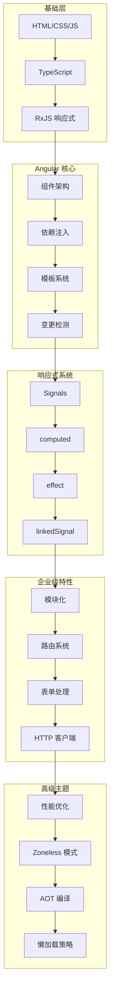

---

## 核心概念面试题

### Q1：Angular 中的依赖注入（DI）是什么？工作原理如何？

**标准答案：**

依赖注入是 Angular 的核心特性，它允许组件或服务声明它们需要的依赖项，而不是自己创建它们。

```
工作流程：
1. 组件/服务声明依赖 → 2. Injector 查询 Provider → 3. 创建实例 → 4. 注入使用
```

**代码示例：**

```typescript
// 1️⃣ 定义服务
@Injectable({ providedIn: 'root' })
export class UserService {
  getUsers() { /* ... */ }
}

// 2️⃣ 注入到组件
@Component({...})
export class UserListComponent {
  // 方式 A：构造函数注入（传统）
  constructor(private userService: UserService) {}
  
  // 方式 B：inject() 函数（现代）
  private userService = inject(UserService);
}

// 3️⃣ Angular 自动处理整个过程
```

**为什么重要：**
- ✅ 解耦：组件不依赖于具体实现
- ✅ 易测试：可以注入 mock 对象
- ✅ 单一职责：每个类专注于自己的功能

---

### Q2：Signals 和 Observables 的区别？何时使用哪个？

**对比表：**

| 方面 | Signals | Observables |
|------|---------|-------------|
| 同步性 | ✅ 同步 | ❌ 异步 |
| 当前值 | ✅ 总有值 | ⚠️ 需要订阅 |
| 内存开销 | 低 | 较高 |
| 学习曲线 | 低 | 陡峭 |
| 库依赖 | ❌ 无 | ✅ RxJS |

**使用指南：**

```typescript
// ✅ Signal：本地组件状态
count = signal(0);
user = signal<User | null>(null);

// ✅ Observable：异步操作和数据流
users$ = this.http.get('/users');
clicks$ = fromEvent(element, 'click');

// ⚠️ 两者结合
userResource = resource({
  request: () => this.filterId(),
  loader: ({ request }) => this.http.get(`/users/${request}`)
});
```

---

### Q3：如何处理内存泄漏？

**常见原因和解决方案：**

```typescript
// ❌ 问题 1：订阅未取消
export class BadComponent {
  constructor(private userService: UserService) {}
  
  ngOnInit() {
    // ❌ 如果不取消订阅，组件销毁时内存泄漏
    this.userService.users$.subscribe(
      users => console.log(users)
    );
  }
}

// ✅ 解决方案 1：takeUntilDestroyed（Angular 20+ 推荐）
import { takeUntilDestroyed } from '@angular/core/rxjs-interop';

export class GoodComponent {
  private readonly destroyRef = inject(DestroyRef);
  
  constructor(private userService: UserService) {}
  
  ngOnInit() {
    this.userService.users$
      .pipe(takeUntilDestroyed(this.destroyRef))
      .subscribe(users => console.log(users));
  }
  // 无需 ngOnDestroy
}

// ✅ 解决方案 2：async 管道（自动取消订阅）
@Component({
  template: `<div>{{ users$ | async }}</div>`
})
export class BestComponent {
  users$ = this.userService.users$;
  constructor(private userService: UserService) {}
}

// ✅ 解决方案 3：Signals（不需要取消订阅）
export class ModernComponent {
  users = resource({
    loader: () => this.userService.getUsers()
  });
}
```

---

### Q4：什么是 OnPush 变更检测策略？何时应该使用？

**工作原理：**

```
Default 策略：任何变化 → 检查整个树 ❌ 性能差

OnPush 策略：只在以下情况检查该组件：
  1️⃣ @Input 引用改变
  2️⃣ 事件在组件内触发
  3️⃣ Signal 值变化
  4️⃣ async 管道发出新值
```

**实战示例：**

```typescript
@Component({
  selector: 'app-optimized',
  changeDetection: ChangeDetectionStrategy.OnPush,
  template: `
    <p>{{ user().name }}</p>
    <button (click)="update()">更新</button>
  `
})
export class OptimizedComponent {
  // ✅ 使用 Signal 实现细粒度响应
  user = signal({ name: 'John' });
  
  update() {
    // ✅ Signal 变化会自动触发检测
    this.user.set({ name: 'Jane' });
  }
}
```

**性能对比：**

```
Default 策略：
  1000 个组件 × 100 次检测 = 100,000 次检查 🐌

OnPush 策略：
  实际影响的组件 × 100 次检测 = 1,000 次检查 ⚡
```

---

### Q5：如何优化大型 Angular 应用？

**优化清单：**

```
📦 包体积优化
  ✅ 延迟加载模块
  ✅ Tree Shaking
  ✅ AOT 编译
  ✅ 代码分割

⚡ 运行时优化
  ✅ OnPush 策略
  ✅ trackBy
  ✅ 虚拟滚动
  ✅ 防抖/节流

🔍 变更检测优化
  ✅ Signals 替代 Observable
  ✅ 细粒度检测
  ✅ 避免模板中的函数调用

📡 网络优化
  ✅ HTTP 缓存
  ✅ 请求合并
  ✅ CDN 部署
```

---

## 实战场景题

### 场景1：实现一个具有搜索、排序、分页的数据表格

```typescript
@Component({
  selector: 'app-data-table',
  template: `
    <!-- 搜索框 -->
    <input 
      [formControl]="searchControl" 
      placeholder="搜索..."
    />
    
    <!-- 排序选择 -->
    <select (change)="onSortChange($event)">
      <option value="name">按名称排序</option>
      <option value="date">按日期排序</option>
    </select>
    
    <!-- 数据表格 -->
    <table>
      <thead>
        <tr>
          <th>名称</th>
          <th>日期</th>
          <th>操作</th>
        </tr>
      </thead>
      <tbody>
        @for (item of filteredData(); track item.id) {
          <tr>
            <td>{{ item.name }}</td>
            <td>{{ item.date | date }}</td>
            <td>
              <button (click)="edit(item)">编辑</button>
              <button (click)="delete(item.id)">删除</button>
            </td>
          </tr>
        }
      </tbody>
    </table>
    
    <!-- 分页 -->
    <div class="pagination">
      <button (click)="previousPage()" [disabled]="currentPage() === 1">
        上一页
      </button>
      <span>第 {{ currentPage() }} 页</span>
      <button (click)="nextPage()">下一页</button>
    </div>
  `,
  imports: [ReactiveFormsModule]
})
export class DataTableComponent {
  private dataService = inject(DataService);
  
  // 响应式状态
  searchControl = new FormControl('');
  sortBy = signal<'name' | 'date'>('name');
  currentPage = signal(1);
  pageSize = 10;
  
  // 原始数据
  allData = resource({
    loader: () => this.dataService.getData()
  });
  
  // 搜索过滤
  filteredBySearch = computed(() => {
    const term = this.searchControl.value?.toLowerCase() || '';
    return (this.allData.value() || []).filter(item =>
      item.name.toLowerCase().includes(term)
    );
  });
  
  // 排序
  sortedData = computed(() => {
    const data = [...this.filteredBySearch()];
    const sortKey = this.sortBy();
    return data.sort((a, b) => {
      if (sortKey === 'name') {
        return a.name.localeCompare(b.name);
      } else {
        return new Date(a.date).getTime() - new Date(b.date).getTime();
      }
    });
  });
  
  // 分页
  filteredData = computed(() => {
    const start = (this.currentPage() - 1) * this.pageSize;
    const end = start + this.pageSize;
    return this.sortedData().slice(start, end);
  });
  
  onSortChange(event: Event) {
    const select = event.target as HTMLSelectElement;
    this.sortBy.set(select.value as 'name' | 'date');
    this.currentPage.set(1);
  }
  
  previousPage() {
    if (this.currentPage() > 1) {
      this.currentPage.update(p => p - 1);
    }
  }
  
  nextPage() {
    this.currentPage.update(p => p + 1);
  }
  
  edit(item: DataItem) {
    // 编辑逻辑
  }
  
  delete(id: number) {
    this.dataService.deleteItem(id).subscribe(() => {
      // 刷新数据
    });
  }
}
```

---

## 代码质量

### 如何组织 Angular 项目结构？

**推荐的项目结构：**

```
src/
├── app/
│   ├── core/                    # 核心模块（单例服务）
│   │   ├── services/
│   │   │   ├── auth.service.ts
│   │   │   └── api.service.ts
│   │   ├── interceptors/
│   │   ├── guards/
│   │   └── core.module.ts
│   │
│   ├── shared/                  # 共享模块（可复用组件）
│   │   ├── components/
│   │   │   ├── header/
│   │   │   ├── footer/
│   │   │   └── loading/
│   │   ├── pipes/
│   │   ├── directives/
│   │   └── shared.module.ts
│   │
│   ├── features/                # 功能模块
│   │   ├── dashboard/
│   │   │   ├── dashboard.component.ts
│   │   │   ├── dashboard.routes.ts
│   │   │   └── services/
│   │   ├── products/
│   │   │   ├── product-list/
│   │   │   ├── product-detail/
│   │   │   └── services/
│   │   └── admin/
│   │
│   ├── app.routes.ts            # 路由配置
│   ├── app.component.ts         # 根组件
│   └── app.config.ts            # 应用配置
│
└── assets/                      # 静态资源
    ├── images/
    ├── styles/
    └── data/
```

**核心原则：**

```
✅ 单一职责：每个文件一个功能
✅ 可扩展性：易于添加新功能
✅ 可维护性：代码结构清晰
✅ 可测试性：便于单元测试
✅ 可复用性：共享组件集中管理
```

---

## 性能指标

### 如何衡量 Angular 应用的性能？

```typescript
// 📊 关键性能指标 (Core Web Vitals)

// 1️⃣ LCP (Largest Contentful Paint) - 最大内容绘制
// ✅ 目标：< 2.5 秒
// 优化：预加载资源、Code Splitting

// 2️⃣ FID (First Input Delay) - 首次输入延迟
// ✅ 目标：< 100 毫秒
// 优化：减少主线程工作、使用 Web Workers

// 3️⃣ CLS (Cumulative Layout Shift) - 累积布局偏移
// ✅ 目标：< 0.1
// 优化：预留尺寸空间、避免突然 DOM 插入

// 📍 性能监控代码
export class PerformanceService {
  logNavigationTiming() {
    window.addEventListener('load', () => {
      const perfData = window.performance.timing;
      const pageLoadTime = perfData.loadEventEnd - perfData.navigationStart;
      console.log(`页面加载时间: ${pageLoadTime}ms`);
    });
  }
  
  logCoreWebVitals() {
    // 使用 web-vitals 库
    import('web-vitals').then(({ getLCP, getFID, getCLS }) => {
      getLCP(console.log);
      getFID(console.log);
      getCLS(console.log);
    });
  }
}
```

---

## 总结与最佳实践

### 🎯 Angular 开发黄金法则

```
1️⃣ 优先使用 Signals 进行状态管理
   → 更简洁、更高效、更易理解

2️⃣ 默认采用 OnPush 变更检测
   → 性能提升 20-30%

3️⃣ 响应式表单优于模板驱动表单
   → 复杂表单首选

4️⃣ 始终在 ngOnDestroy 中清理资源
   → 防止内存泄漏

5️⃣ 优先 async 管道处理 Observables
   → 自动管理订阅

6️⃣ 使用 trackBy 优化列表性能
   → 避免不必要的 DOM 操作

7️⃣ 类型安全始终第一
   → 充分利用 TypeScript

8️⃣ 分离关注点
   → 每个组件/服务单一职责

9️⃣ 编写可测试的代码
   → 提高代码质量和维护性

🔟 遵循 Angular 风格指南
   → 保持代码一致性
```


## 📚 推荐学习资源

- 🌐 [官方文档](https://angular.io)
- 📖 [Angular 风格指南](https://angular.io/guide/styleguide)
- 🎓 [Angular University](https://angular-university.io)
- 💻 [StackBlitz 在线编辑器](https://stackblitz.com)

---

**如有问题或建议，欢迎提出！** 🚀
