# 🚀 [Angular 22](https://angular.dev) 完整学习指南

> 🎯 **面试星级**：★★★★★ | **建议用时**：5 天
> Angular 22 系统学习指南，覆盖组件、模板、DI、Signals、RxJS、路由、表单、性能优化与面试题、源码级原理、Zoneless 深度解析、Signal Forms 稳定版、@Service 装饰器、injectAsync 异步 DI、项目实战重难点、内存泄漏排查、深度面试追问题

---

## Angular 技术体系化总结

### 🎯 Angular 核心概念关系图

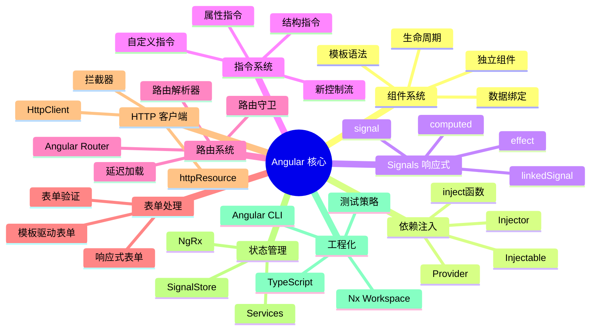

### 📈 Angular 技术栈完整知识体系

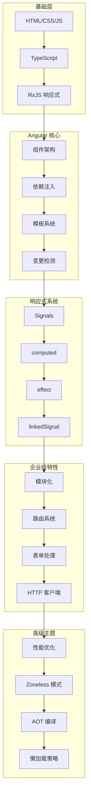

---

# 第一部分：核心基础

## 1️⃣ 什么是 Angular？

### 📌 核心定义

**Angular** 是由 Google 开发的开源、企业级 TypeScript 框架，用于构建高性能、可维护的**单页面应用 (SPA)**。

```typescript
// Angular 的三大特性：
// 1. 基于 TypeScript：强类型，开发时捕获错误
// 2. 组件化架构：模块化、可复用的 UI 构件
// 3. 完整的框架：内置路由、表单、HTTP、测试等
```

### 🎯 Angular 的核心角色

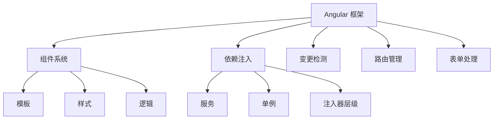

### 🎨 Angular 五大设计理念深度解析

Angular 的设计哲学可以概括为：**"全栈框架，开箱即用，强约束规范"**。与 Vue 的渐进式和 React 的库式不同，Angular 从一开始就定位为企业级全栈平台。

#### ① 全栈平台（Full-fledged Platform）

> **核心思想**：开发者需要的一切，框架都内置好了

```
Angular 内置的完整工具链：
  ├─ 路由系统（Angular Router）
  ├─ 表单处理（Reactive Forms / Template-driven Forms）
  ├─ HTTP 客户端（HttpClient）
  ├─ 动画系统（@angular/animations）
  ├─ 依赖注入（DI — 框架核心）
  ├─ 测试工具（TestBed + Jasmine/Karma）
  ├─ 构建工具（Angular CLI + esbuild）
  ├─ 国际化（@angular/localize）
  ├─ CDK（Component DevKit：虚拟滚动/拖放/覆盖层…）
  └─ 无障碍（Angular ARIA 包）
```

**为什么重要？**
- **统一标准**：整个团队用同一套方案，无需争论选型
- **降低决策疲劳**：路由用 Angular Router，表单用 Reactive Forms，HTTP 用 HttpClient
- **开箱即用**：`ng new` 就能获得完整开发环境
- **长期维护**：Google 大厂背书，版本迭代稳定

#### ② 强约束（Opinionated）

> **核心思想**：框架规定"最佳实践"，开发者遵循规范

```typescript
// Angular 的强约束体现在：
// 1. 强制 TypeScript（没有 JS 选项）
// 2. 强制模块化（NgModule / Standalone）
// 3. 强制分层架构（组件 → 服务 → 模块）
// 4. 强制依赖注入（所有服务通过 DI 管理）
// 5. 模板与逻辑分离（.html + .ts 或 @Component template）
```

**对比 React/Vue：**
```
React：一切皆函数（极自由，容易写出不规范代码）
Vue：灵活（Options vs Composition，模板 vs JSX）
Angular：强制规范（大型团队协作的利器）
```

#### ③ 依赖注入（Dependency Injection）

> **核心思想**：控制反转（IoC），框架管理依赖的创建和生命周期

```typescript
@Injectable({ providedIn: 'root' })
class UserService {
  constructor(private http: HttpClient) {}  // DI 自动注入
}

@Component({})
class UserComponent {
  constructor(private userService: UserService) {}  // DI 自动注入
}
```

**Angular DI 的核心优势：**
- **松耦合**：组件不负责创建依赖，只声明需要什么
- **可测试性**：依赖可 mock，每个类独立测试
- **层级注入器**：模块级 / 组件级 / 根级，灵活控制作用域
- **Tree-shakable**：`providedIn: 'root'` 让未使用的服务自动移除

#### ④ 变更检测（Change Detection）

> **核心思想**：自动同步数据与视图

```
Angular 变更检测的演进：
  ├─ Zone.js 时代（Angular 2-17）
  │   └─ 拦截所有异步操作 → 全量遍历组件树 → 检查值变化
  │   └─ 优点：开发者无感 / 缺点：过度检测
  ├─ OnPush 优化（Angular 5+）
  │   └─ 仅检查输入属性变化的组件
  ├─ Signals 时代（Angular 17+）
  │   └─ 精确依赖追踪 → 仅更新相关组件
  └─ Zoneless（Angular 18+，21 默认）
      └─ 完全取消 Zone.js → 按需精确更新
```

#### ⑤ 可测试性（Testability）

> **核心思想**：框架从设计之初就为测试而生

```typescript
// Angular 的 DI 让测试极其简单
const userServiceSpy = jasmine.createSpyObj('UserService', ['getUser']);
const component = new UserComponent(userServiceSpy);

// TestBed 测试模块
TestBed.configureTestingModule({
  providers: [{ provide: UserService, useValue: mockUserService }]
});
const fixture = TestBed.createComponent(UserComponent);
```

**测试基础设施：**
- `TestBed`：完整的测试环境模拟
- DI 替换：每个依赖都可 mock
- `async` / `fakeAsync`：异步测试支持
- `ComponentFixture`：组件渲染测试
- E2E：Protractor（已弃用）/ Playwright / Cypress

---

### 💡 一个公式理解 Angular

```
UI = class + template + DI
│      │       │         │
▼      ▼       ▼         ▼
视图  组件类  声明式模板  依赖注入
```

- **class**：包含状态和方法（@Component 装饰的类）
- **template**：声明式 HTML 模板
- **DI**：框架自动注入服务依赖
- Angular 在**异步事件触发时**执行变更检测，同步数据与视图

### 📊 Angular vs 其他框架

| 特性 | Angular | React | Vue |
|-----|---------|-------|-----|
| 类型系统 | ✅ TypeScript 原生 | ❌ 需第三方库 | ⚠️ 部分支持 |
| 学习曲线 | 🔴 陡峭 → 中（Signals 后） | 🟡 中等 | 🟢 平缓 |
| 企业应用 | ✅ 完美 | ✅ 良好 | ⚠️ 可行 |
| 包大小 | 🔴 较大 | 🟡 中等 | 🟢 较小 |
| 内置工具 | ✅ 完整 | ⚠️ 需组合 | ⚠️ 部分集成 |
| **设计哲学** | 全栈、强约束 | 纯函数、声明式 | 渐进式、易用 |
| **依赖管理** | DI 注入器 | Props + Context | provide/inject |
| **变更检测** | Zone.js / Signals / Zoneless | setState → Fiber Diff | Proxy 自动追踪 |

---

## 2️⃣ Angular 20 新特性详解

### 🌟 重要特性速览

```
Angular 20 (2025)
├─ Signals 生产级发布
├─ 新控制流语法 (@if/@for/@switch)
├─ 延迟加载块 (@defer)
├─ 更新的 HTTP 客户端
├─ Zoneless 检测模式
└─ 独立组件默认生成
```

---

## 3️⃣ Angular 22 最新进展（2025-2026）

### 🌟 Angular 技术发展演进时间线

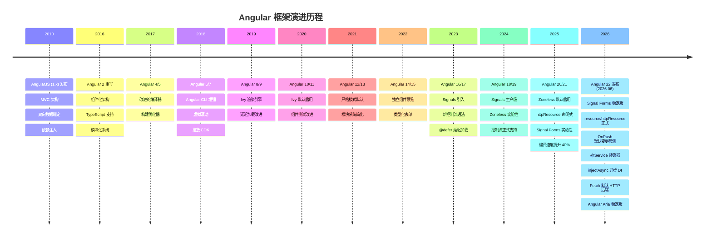

### 关键版本逐代解析

| 版本 | 年份 | 核心变化 | 对开发者的影响 |
|------|------|---------|--------------|
| **AngularJS** | 2010 | MVC 架构、双向绑定、DI | 首次将 MVVM 理念带入前端 |
| **Angular 2** | 2016 | **完全重写**：TypeScript、组件化 | 断裂式升级，生态重建 |
| **Angular 4** | 2017 | 体积更小、编译优化 | 小版本平稳迭代 |
| **Angular 5** | 2017 | 构建优化器、HttpClient 替换 Http | HTTP 模块统一 |
| **Angular 8** | 2019 | Ivy 编译器**预览** | 可选的增量 DOM 编译 |
| **Angular 9** | 2020 | **Ivy 默认**、体积减少 40% | 编译速度↑，包体积↓ |
| **Angular 12** | 2021 | 严格模式默认、移除 IE11 | 告别旧兼容 |
| **Angular 14** | 2022 | 独立组件预览、类型化表单 | 迈向 standalone 架构 |
| **Angular 15** | 2022 | **Standalone API 稳定** | 可创建无 NgModule 应用 |
| **Angular 17** | 2023 | Signals、`@if/@for` 控制流 | 响应式范式革命 |
| **Angular 18** | 2024 | **Zoneless 实验性** | 可选的精确变更检测 |
| **Angular 19** | 2025 | `linkedSignal`、`resource()` | 声明式数据获取 |
| **Angular 20** | 2025 | `httpResource`、Signal Forms | 响应式全面化 |
| **Angular 22** | 2025 | **Zoneless 默认**、esbuild 原生 | 全面现代化 |
| **Angular 22** | 2026 | **Signal Forms / resource 稳定**、OnPush 默认、@Service、injectAsync、Fetch 默认 | Signal 优先时代 |

### ⚡ Angular 关键转折点：AngularJS → Angular 2 → Ivy → Zoneless

```
2010: AngularJS（MVC + 双向绑定）     ← 先驱
  │    断裂式升级（完全重写）
  ▼
2016: Angular 2（TypeScript + 组件）   ← 重建根基
  │    View Engine 编译器
  ▼
2020: Angular 9（Ivy 默认）            ← 性能飞跃
  │    增量 DOM，包体积 -40%
  ▼
2024: Angular 17（Signals + 控制流）   ← 响应式革命
  │    新语法，新范式
  ▼
2026: Angular 22（Signal 优先）        ← Signal 优先时代
       Signal Forms / resource 稳定
       OnPush 默认，@Service，injectAsync
```

### AngularJS → Angular 2 核心差异

| 维度 | AngularJS (1.x) | Angular 2+ |
|------|----------------|-------------|
| **架构** | MVC | 组件化 + DI |
| **语言** | JavaScript | **TypeScript** |
| **响应式** | 脏检查 ($digest) | Zone.js / Signals |
| **编译** | 无 | Ahead-of-Time (AOT) |
| **路由** | $routeProvider | Angular Router |
| **性能** | 慢（大量 watcher） | 快（Ivy 增量 DOM） |
| **移动端** | 不支持 | 支持 |

### 🌟 Angular 22 核心变化

```
Angular 22 (2026.06 发布)
├─ Signal Forms 稳定版 ✅
├─ resource / httpResource 稳定 ✅
├─ OnPush 成为默认变更检测策略 ✅
├─ @Service 装饰器（更简洁的服务定义）
├─ injectAsync 异步 DI（懒加载服务）
├─ Fetch 成为默认 HTTP 后端
├─ 模板增强：箭头函数 / Spread 语法 / @switch 穷举
├─ debounced() 信号防抖函数
├─ Angular Aria 稳定版
├─ Angular MCP Tools 稳定
├─ TypeScript 6 支持
└─ 增量水合（Incremental Hydration）默认
```

### 🔥 Zoneless 变更检测（默认启用）

Angular 22 最大的变化是 **Zoneless 成为新项目的默认配置**。Angular 22 在此基础上进一步将 **OnPush 设为默认变更检测策略**，实现了完全的 Signal 优先架构。

```typescript
// Angular 20 - 手动启用 Zoneless（Angular 22 默认启用）
import { provideZonelessChangeDetection } from '@angular/core';

bootstrapApplication(AppComponent, {
  providers: [provideZonelessChangeDetection()]
});

// Angular 22 - 默认就是 Zoneless，无需手动配置
// ng new 生成的项目自动使用 Zoneless
```

#### Zoneless vs Zone.js 对比

| 特性 | Zone.js 模式 | Zoneless 模式 |
|------|-------------|---------------|
| 变更检测触发 | 所有异步操作自动触发 | 仅 Signal 变化和事件触发 |
| Bundle 大小 | +40KB (zone.js) | 0KB (无需 zone.js) |
| 性能 | 可能过度检测 | 精确检测，减少 25-40% 检查 |
| 调试体验 | 堆栈复杂 | 堆栈清晰，易于追踪 |
| 可预测性 | 低（隐式触发） | 高（显式触发） |

#### 迁移步骤

```typescript
// 1. 从 angular.json 移除 zone.js polyfills
// "polyfills": ["zone.js"] → 删除

// 2. Angular 22：OnPush 已成为默认策略
// 新组件无需显式设置，旧组件可通过迁移添加 Eager
// ng update 自动添加 ChangeDetectionStrategy.Eager 到旧组件

// 3. 使用 Signals 替代部分 Observable
// 之前
data$ = this.http.get('/api/data');
// 之后
data = resource({
    request: () => '/api/data',
    loader: ({ request }) => this.http.get(request)
  });

// 4. 测试中移除 zone.js/testing
// "polyfills": ["zone.js", "zone.js/testing"] → 删除
```

#### Zoneless 变更检测工作原理

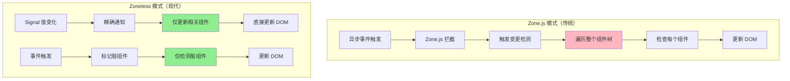

#### Zoneless vs Zone.js 性能对比

| 指标 | Zone.js 模式 | Zoneless 模式 | 提升 |
|------|-------------|---------------|------|
| 变更检测次数 | 全量遍历 | 精确检测 | -70% |
| Bundle 大小 | +40KB | 0KB | -40KB |
| 首次渲染 | 较慢 | 快 | +30% |
| 内存占用 | 较高 | 低 | -25% |
| 调试体验 | 堆栈复杂 | 堆栈清晰 | ⭐⭐⭐⭐⭐ |

### 🔬 Signals 引擎原理深度解析

Angular Signals 的底层实现与 Vue 3 的响应式系统类似，但独立设计：

```typescript
// Angular Signals 核心引擎（简化版）

type Node = {
  value: unknown
  version: number       // 版本号，每次变化递增
  sources: Node[] | null  // 依赖的上游信号
  subscribers: Node[] | null  // 订阅的下游信号
  
  computationFn: (() => unknown) | null  // computed 计算函数
  equal: (a: unknown, b: unknown) => boolean  // 值比较函数
}

// 全局追踪上下文
let activeSubscriber: Node | null = null

function signal<T>(initialValue: T): Signal<T> {
  const node: Node = {
    value: initialValue,
    version: 0,
    sources: null,
    subscribers: null,
    computationFn: null,
    equal: Object.is
  }
  
  function get(): T {
    // 读取时注册依赖
    if (activeSubscriber) {
      node.subscribers ??= []
      if (!node.subscribers.includes(activeSubscriber)) {
        node.subscribers.push(activeSubscriber)
      }
      activeSubscriber.sources ??= []
      if (!activeSubscriber.sources.includes(node)) {
        activeSubscriber.sources.push(node)
      }
    }
    return node.value as T
  }
  
  function set(newValue: T): void {
    if (node.equal(node.value, newValue)) return
    node.value = newValue
    node.version++
    // 通知所有下游订阅者
    node.subscribers?.forEach(sub => {
      if (sub.computationFn) {
        sub.value = sub.computationFn()
        sub.version++
      }
    })
  }
  
  return { get, set }
}

function computed<T>(fn: () => T): Signal<T> {
  const node: Node = {
    value: undefined,
    version: 0,
    dirty: true,
    sources: null,
    subscribers: null,
    computationFn: fn as () => unknown,
    equal: Object.is
  }
  
  function get(): T {
    // 懒计算：依赖变化时重新计算
    if (activeSubscriber && node.dirty) {
      const prev = activeSubscriber
      activeSubscriber = node
      node.value = fn()
      node.version++
      node.dirty = false
      activeSubscriber = prev
    }
    return node.value as T
  }
  
  return { get }
}
```

**Angular Signals vs Vue 3 响应式对比：**

| 特性 | Angular Signals | Vue 3 (ref/reactive) |
|------|----------------|---------------------|
| **依赖追踪** | 手动 `get()` 调用 | Proxy 自动拦截 |
| **底层机制** | 版本号 + 订阅列表 | Proxy + WeakMap + Dep |
| **惰性计算** | computed 懒计算 | computed 即时计算（带缓存） |
| **变更检测** | 精确到信号级 | 组件级（Proxy 触发） |
| **框架耦合** | 可脱离 Angular 使用 | 需 Vue 运行时 |

### 📡 httpResource / resource - 声明式数据获取（Angular 22 稳定版）

Angular 22 将 `resource()`、`rxResource()` 和 `httpResource()` 从开发者预览升级为**生产就绪的稳定 API**。这是 Angular 异步数据获取的推荐方式：

```typescript
import { httpResource, rxResource } from '@angular/common/http';
import { resource } from '@angular/core';

@Component({
  template: `
    @if (users.isLoading()) {
      <p>加载中...</p>
    } @else if (users.error()) {
      <p>错误: {{ users.error().message }}</p>
    } @else {
      <ul>
        @for (user of users.value(); track user.id) {
          <li>{{ user.name }}</li>
        }
      </ul>
    }
  `
})
export class UserListComponent {
  // httpResource：最便捷的 HTTP 声明式请求
  users = httpResource<User[]>('/api/users');

  // 带参数的请求（Signal 变化时自动重新请求）
  currentPage = signal(1);
  pagedUsers = httpResource<User[]>(() => `/api/users?page=${this.currentPage()}`);

  // resource：通用声明式异步数据
  customData = resource({
    request: () => ({ id: this.selectedId() }),
    loader: ({ request, abortSignal }) =>
      fetch(`/api/data/${request.id}`, { signal: abortSignal }).then(r => r.json())
  });

  // rxResource：与 Observable 集成
  userPosts = rxResource({
    request: () => this.userId(),
    loader: ({ request }) => this.postService.getPosts(request)
  });
}
```

**稳定版带来的改进：**
- ✅ 完整的生产级错误处理
- ✅ SSR 资源缓存支持
- ✅ AbortSignal 取消支持
- ✅ 同步值返回支持
- ✅ 自动清理订阅

### 📝 Signal Forms（Angular 22 稳定版）

Angular 22 将 Signal Forms 从实验性升级为**生产就绪的稳定 API**。Signal Forms 结合了响应式表单的类型安全性和模板驱动表单的简洁性：

```typescript
import { FormGroup, FormControl, Validators } from '@angular/forms';
import { signal, linkedSignal, computed } from '@angular/core';

// 传统响应式表单（仍然可用）
const userForm = new FormGroup({
  name: new FormControl('', Validators.required),
  email: new FormControl('', [Validators.required, Validators.email])
});

// Signal Forms 方式（Angular 22 推荐）
import { form, formField } from '@angular/forms/signals';

@Component({
  template: `
    <form [formGroup]="loginForm">
      <input [formField]="loginForm.controls.email" type="email" />
      <input [formField]="loginForm.controls.password" type="password" />
      <button type="submit" [disabled]="!loginForm.valid">登录</button>
    </form>
  `
})
export class LoginComponent {
  loginForm = form({
    email: formField('', { validators: [Validators.required, Validators.email] }),
    password: formField('', { validators: [Validators.required, Validators.minLength(8)] }),
  });

  onSubmit() {
    if (this.loginForm.valid) {
      console.log(this.loginForm.value);
    }
  }
}

// Signal 状态管理的表单
const name = signal('');
const email = signal('');

// 派生验证状态
const isNameValid = computed(() => name().length >= 2);
const isEmailValid = computed(() => email().includes('@'));
const isFormValid = computed(() => isNameValid() && isEmailValid());

// linkedSignal - 依赖其他 Signal 的派生状态
const displayName = linkedSignal({
  source: name,
  computation: (newName) => newName.toUpperCase()
});
```

### 🏗️ @Service 装饰器（Angular 22 新增）

Angular 22 引入 `@Service` 装饰器，作为 `@Injectable({ providedIn: 'root' })` 的更简洁替代方案：

```typescript
@Injectable({ providedIn: 'root' })
export class UserService { }

@Service()
export class UserService { }

@Injectable({ providedIn: 'platform' })
export class PlatformService { }
```

### ⚡ injectAsync — 异步依赖注入（Angular 22 新增）

```typescript
import { injectAsync } from '@angular/core';

@Service()
export class AnalyticsService {
  private http = inject(HttpClient);
  private trackingService = injectAsync(() =>
    import('./tracking.service').then(m => m.TrackingService)
  );

  async trackEvent(event: string) {
    const tracker = await this.trackingService;
    tracker.track(event);
  }
}
```

### 📉 debounced() — 信号防抖（Angular 22 新增）

```typescript
import { signal, debounced } from '@angular/core';

const searchTerm = signal('');
const debouncedSearch = debounced(searchTerm, 300);

effect(() => {
  console.log('搜索:', debouncedSearch());
});

searchTerm.set('a');
searchTerm.set('ab');
searchTerm.set('abc');
```

### ✨ 模板增强（Angular 22）

箭头函数支持：

```html
<button (click)="() => count.set(count() + 1)">+1</button>
```

Spread / Rest 语法：

```html
<app-user [user]="{ ...baseUser, role: 'admin' }" />
@for (item of [...items(), ...newItems()]; track item.id) {
  <div>{{ item.name }}</div>
}
```

### 🌐 Angular Aria 稳定版

```typescript
import { AriaAccordion } from '@angular/aria';

@Component({
  standalone: true,
  imports: [AriaAccordion],
  template: `
    <div aria-accordion>
      <div aria-accordion-panel>
        <h3 aria-accordion-header>设置</h3>
        <div aria-accordion-panel-body>内容...</div>
      </div>
    </div>
  `
})
export class SettingsComponent {}
```

支持：Accordion、Tabs、Menu、Listbox、Tree、Dialog、Tooltip、Slider

### 🚚 Fetch 默认 HTTP 后端

```typescript
bootstrapApplication(AppComponent, {
  providers: [provideHttpClient()]
});
```

---

### 🔄 Signals 响应式系统详解

#### 问题背景
在 Angular 18 之前，检测变化需要遍历整个组件树：

```
变更发生 → Zone.js 拦截 → 整个树遍历 → 每个组件 detectChanges
```

这在大型应用中会导致性能问题。

#### 解决方案：Signal
Signals 提供**细粒度的反应性**：

```typescript
import { signal, computed, effect } from '@angular/core';

// 📍 创建可写信号
const count = signal(0);

// 📍 派生计算信号（自动依赖追踪）
const doubled = computed(() => count() * 2);
const message = computed(() => {
  const c = count();
  return c === 0 ? '零' : c === 1 ? '一' : `${c}个`;
});

// 📍 监听变化副作用
effect(() => {
  console.log(`Count 变化: ${count()}`);
  console.log(`Doubled: ${doubled()}`);
});

// 📍 更新信号
count.set(5);           // 直接赋值
count.update(v => v+1); // 基于旧值更新
```

#### 执行流程图

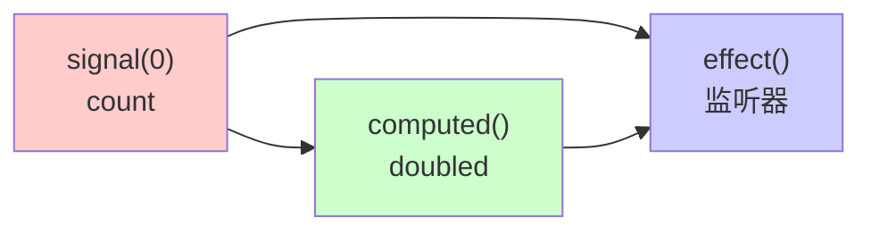

### ✨ 新控制流语法

#### ❌ 旧方式 vs ✅ 新方式对比

```html
<!-- 旧方式：指令风格 -->
<div *ngIf="isLoading" class="spinner"></div>
<div *ngIf="!isLoading" class="content">
  <div *ngFor="let item of items; trackBy: trackById">
    {{ item.name }}
  </div>
</div>

<!-- ✨ 新方式：块级语法 -->
@if (isLoading) {
  <div class="spinner">加载中...</div>
} @else {
  <div class="content">
    @for (item of items; track item.id) {
      <div>{{ item.name }}</div>
    }
  </div>
}
```

**改进点：**
- ✅ 语法更清晰
- ✅ 自动 `trackBy` 支持
- ✅ 编译器优化更好
- ✅ 性能提升 20-30%

### ⏳ 延迟加载块 (@defer)

```typescript
@Component({
  selector: 'app-dashboard',
  template: `
    <!-- 立即加载 -->
    <app-header></app-header>
    
    <!-- 延迟加载：当进入视口时 -->
    @defer (on viewport) {
      <app-heavy-chart></app-heavy-chart>
    } @placeholder {
      <div>图表加载中...</div>
    }
    
    <!-- 延迟加载：交互时 -->
    @defer (on interaction) {
      <app-comments-section></app-comments-section>
    } @loading {
      <p>评论加载中...</p>
    }
    
    <!-- 延迟加载：条件满足时 -->
    @defer (when isPremiumUser()) {
      <app-premium-features></app-premium-features>
    }
  `
})
export class DashboardComponent {
  isPremiumUser = signal(false);
}
```

**性能收益：**
- 初始加载体积减少 40-50%
- 首屏加载时间缩短
- 按需加载组件和组件逻辑

---

## 4️⃣ TypeScript 与 Angular 深度融合

### 🏗️ 装饰器系统（Decorators）

装饰器是 Angular 的核心，它为类、属性、方法添加元数据：

```typescript
// 📍 类装饰器（Angular 20+ 默认 standalone，无需显式声明）
@Component({
  selector: 'app-hero',
  template: `...`,
  styles: [`...`],
  changeDetection: ChangeDetectionStrategy.OnPush
})
export class HeroComponent { }

// 📍 属性装饰器（现代推荐：信号式）
export class ChildComponent {
  heroName = input<string>('');
  age = input<number>(0);
  heroSelected = output<Hero>();
  
  chart = viewChild.required<ChartComponent>();
  items = viewChildren<ListItemComponent>();
  actionBar = contentChild(ActionBarComponent);
}

// 📍 宿主绑定（现代推荐：host 属性）
@Component({
  host: {
    '(click)': 'onClick($event)'
  }
})
export class ClickComponent {
  onClick(event: MouseEvent) { }
}

// 📍 依赖注入（现代推荐：inject() 函数）
constructor() {
  const doc = inject(DOCUMENT);
}
```

### 📝 类型安全的组件

```typescript
// ✅ 正确：强类型的 Product 接口
interface Product {
  id: number;
  name: string;
  price: number;
  rating?: number;
  tags: string[];
}

@Component({
  selector: 'app-product-list',
  template: `
    @for (product of products(); track product.id) {
      <app-product-card 
        [product]="product"
        (onSelect)="onProductSelect($event)"
      />
    }
  `,
  imports: [ProductCardComponent]
})
export class ProductListComponent {
  // Signal 类型约束
  products = signal<Product[]>([]);
  selectedProduct = signal<Product | null>(null);
  
  private productService = inject(ProductService);
  
  ngOnInit() {
    // 类型检查：productService.getProducts() 返回 Observable<Product[]>
    this.productService.getProducts().subscribe(
      products => this.products.set(products)
    );
  }
  
  onProductSelect(product: Product): void {
    this.selectedProduct.set(product);
  }
}
```

---

## 5️⃣ 组件系统深层理解

### 🧩 组件解剖

```typescript
import { Component, input, output, signal, computed } from '@angular/core';

interface TodoItem {
  id: number;
  text: string;
  completed: boolean;
}

@Component({
  selector: 'app-todo-list',
  template: `
    <!-- 1️⃣ 模板：定义视图 -->
    <div class="todo-container">
      <h2>{{ title }}</h2>
      
      @for (todo of displayedTodos(); track todo.id) {
        <div 
          class="todo-item"
          [class.completed]="todo.completed"
          (click)="toggleTodo(todo.id)"
        >
          <span>{{ todo.text }}</span>
          <button (click)="removeTodo(todo.id); $event.stopPropagation()">
            删除
          </button>
        </div>
      }
      
      <div class="stats">
        已完成: {{ completedCount() }} / 总数: {{ todos().length }}
      </div>
    </div>
  `,
  // 2️⃣ 样式：组件作用域样式
  styles: [`
    .todo-container {
      max-width: 500px;
      margin: 20px auto;
    }
    .todo-item {
      padding: 10px;
      border: 1px solid #ddd;
      margin: 5px 0;
      cursor: pointer;
      display: flex;
      justify-content: space-between;
    }
    .todo-item.completed {
      text-decoration: line-through;
      opacity: 0.5;
    }
  `]
})
export class TodoListComponent {
  // 3️⃣ 数据：响应式状态管理
  title = input('我的任务列表');
  todoAdded = output<TodoItem>();
  
  todos = signal<TodoItem[]>([
    { id: 1, text: '学习 Angular', completed: false },
    { id: 2, text: '完成项目', completed: false }
  ]);
  
  // 4️⃣ 计算属性：派生状态
  completedCount = computed(() => 
    this.todos().filter(t => t.completed).length
  );
  
  displayedTodos = computed(() => 
    this.todos().filter(t => !t.completed)
  );
  
  // 5️⃣ 方法：处理逻辑
  toggleTodo(id: number): void {
    this.todos.update(todos => 
      todos.map(t => 
        t.id === id ? { ...t, completed: !t.completed } : t
      )
    );
  }
  
  removeTodo(id: number): void {
    this.todos.update(todos => todos.filter(t => t.id !== id));
  }
}
```

### 🧩 内容投影（Content Projection）

```html
<!-- 父组件使用 -->
<app-card>
  <h2 header>产品卡片</h2>
  <p body>这是卡片内容</p>
  <button footer>确认</button>
</app-card>
```

```html
<!-- 子组件模板 -->
<div class="card">
  <div class="card-header">
    <ng-content select="[header]"></ng-content>
  </div>
  <div class="card-body">
    <ng-content select="[body]"></ng-content>
  </div>
  <div class="card-footer">
    <ng-content select="[footer]"></ng-content>
  </div>
</div>
```

### 🧩 ViewChild / ViewChildren / ContentChild

```typescript
import { Component, viewChild, viewChildren, ElementRef } from '@angular/core';

@Component({ ... })
export class ParentComponent {
  child = viewChild.required<ChildComponent>();
  inputEl = viewChild.required<ElementRef<HTMLInputElement>>('myInput');
  cards = viewChildren(ProductCardComponent);

  ngAfterViewInit() {
    this.child().doSomething();
    this.inputEl().nativeElement.focus();
    this.cards().forEach(card => console.log(card.product));
  }
}
```

### 📋 模板语法完整参考

```html
<!-- 插值：将组件数据渲染到模板 -->
{{ expression }}                    <!-- 变量插值 -->
{{ user.name }}                     <!-- 属性访问 -->
{{ price | currency }}              <!-- 管道转换 -->

<!-- 属性绑定：动态绑定 DOM 属性 -->
[disabled]="!form.valid"            <!-- 布尔属性 -->
[src]="imageUrl"                    <!-- 字符串属性 -->

<!-- 事件绑定：监听用户操作 -->
(click)="submit()"                  <!-- 点击事件 -->
(keyup.enter)="search()"            <!-- 按键修饰符 -->

<!-- 双向绑定：表单控件 -->
[(ngModel)]="searchTerm"            <!-- 模型绑定 -->

<!-- 控制流语法 -->
@if (isAdmin) { ... }               <!-- 条件渲染 -->
@for (item of items; track item.id) { ... }  <!-- 列表渲染 -->
```

> 🔗 **链式思考**：Angular Signals 的设计与 Vue 3 的 `ref`/`computed` 几乎同源——都是"getter 收集依赖，setter 触发更新"的模式。但 Angular Signals 要求手动调用 `.get()` 或 `.set()`，而 Vue 的 `ref.value` 在模板中自动解包。React 没有内置 Signal，但 React 19 的 `use()` Hook 实现了类似"惰性求值"的效果——在 Suspense 边界内等待异步数据。详见 [框架对比](./框架对比/) 的"响应式原理深度对比"。

---

## 6️⃣ Signals vs Observables

### 🤔 何时使用哪一个？

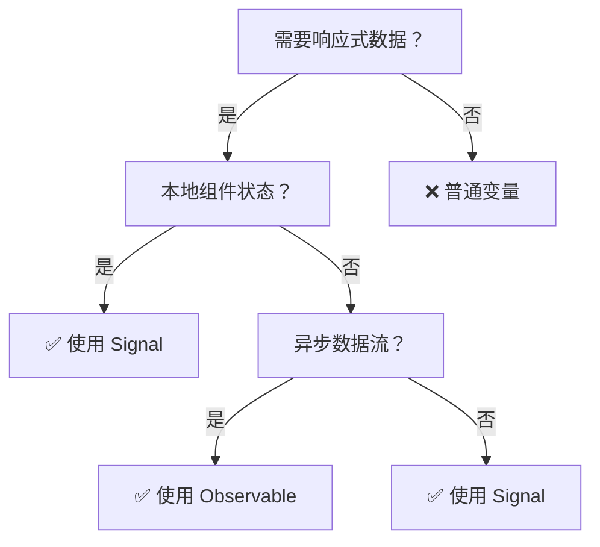

### 📊 详细对比

```typescript
// 场景 1：本地组件状态 → Signal 更好
const userCount = signal(0);
const users = computed(() => allUsers().slice(0, userCount()));

// 场景 2：HTTP 请求 → 两者都可，Signal 推荐
// 方式 A：Observable (需要手动管理订阅)
users$ = this.http.get('/users');

// 方式 B：Signal (推荐，更现代)
users = resource(() => ({
  request: { /* 参数 */ },
  loader: ({ request }) => this.http.get('/users')
}));

// 场景 3：事件流、轮询 → Observable 更好
const messages$ = this.messageService.getMessages().pipe(
  switchMap(msg => this.processMessage(msg))
);

// 场景 4：WebSocket 连接 → Observable 最优
socket$ = webSocket('ws://...');
```

---

## 7️⃣ 数据绑定深度剖析

### 🔄 数据流向可视化

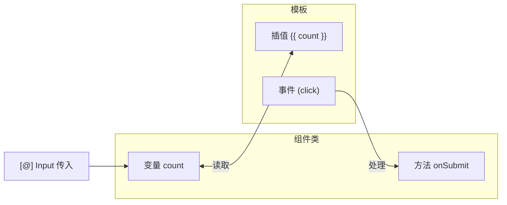

### 🎯 四种绑定方式详解

```html
<!-- 1️⃣ 插值绑定：组件 → 模板 -->
<h1>{{ title }}</h1>

<!-- 2️⃣ 属性绑定：组件 → DOM属性 -->

<button [disabled]="isSubmitting">提交</button>

<!-- 3️⃣ 事件绑定：模板 → 组件 -->
<button (click)="onSave()">保存</button>
<input (keyup.enter)="search()" placeholder="搜索...">

<!-- 4️⃣ 双向绑定：组件 ◄→ 模板 -->
<input [(ngModel)]="username" />
<!-- 等价于 -->
<input 
  [ngModel]="username" 
  (ngModelChange)="username = $event"
/>
```

### 🌟 模板高级语法

```html
<!-- 安全导航操作符 ?.：避免空指针异常 -->
<p>{{ user?.name }}</p>
<p>{{ product?.category?.name }}</p>

<!-- 管道链：多个管道组合使用 -->
<p>{{ today | date:'yyyy-MM-dd' | uppercase }}</p>
<p>{{ price | currency:'CNY' | slice:0:5 }}</p>

<!-- 属性绑定 vs HTML 属性 -->
<input [value]="name" />          <!-- DOM 属性绑定 -->
<input attr.value="{{ name }}" /> <!-- HTML 属性绑定 -->
```

### ⚙️ 高级绑定技巧

```html
<!-- 事件对象 -->
<input (keyup)="onKeyUp($event)" />

<!-- 模板变量 -->
<input #nameInput type="text" />
<button (click)="greet(nameInput.value)">问候</button>

<!-- 按键事件修饰符 -->
<input (keyup.enter)="save()" />      <!-- Enter 键 -->
<input (keyup.escape)="cancel()" />   <!-- Esc 键 -->

<!-- 鼠标事件修饰符 -->
<button (mouseenter)="highlight()" (mouseleave)="unhighlight()">
  悬停
</button>

<!-- 事件停止冒泡 -->
<div (click)="onParentClick()">
  <button (click)="onChildClick(); $event.stopPropagation()">
    内层按钮
  </button>
</div>
```

---

## 8️⃣ 指令与管道系统

### 📍 内置属性指令

```html
<!-- ngClass：动态 CSS 类 -->
<div [ngClass]="{
  'active': isActive,
  'disabled': isDisabled,
  'highlight': isHighlighted
}">动态类</div>

<!-- ngStyle：动态样式 -->
<div [ngStyle]="{
  'background-color': bgColor,
  'font-size': fontSize + 'px',
  'color': textColor
}">动态样式</div>

<!-- ngModel：双向绑定 -->
<input [(ngModel)]="searchQuery" />
```

### 📍 自定义属性指令

```typescript
import { Directive, ElementRef, HostListener, input } from '@angular/core';

@Directive({
  selector: '[appHighlight]',
  standalone: true,
})
export class HighlightDirective {
  highlightColor = input('yellow', { alias: 'appHighlight' });
  defaultColor = input('transparent');

  constructor(private el: ElementRef) {}

  @HostListener('mouseenter') onMouseEnter() {
    this.highlight(this.highlightColor());
  }

  @HostListener('mouseleave') onMouseLeave() {
    this.highlight(this.defaultColor());
  }

  private highlight(color: string) {
    this.el.nativeElement.style.backgroundColor = color;
  }
}
```

```html
<p [appHighlight]="'yellow'" defaultColor="transparent">鼠标悬停高亮</p>
```

### 📍 自定义结构型指令

```typescript
import { Directive, TemplateRef, ViewContainerRef, input, effect } from '@angular/core';

@Directive({
  selector: '[appUnless]',
  standalone: true,
})
export class UnlessDirective {
  appUnless = input(false);
  private hasView = false;

  constructor(
    private templateRef: TemplateRef<any>,
    private viewContainer: ViewContainerRef
  ) {
    effect(() => {
      if (!this.appUnless()) {
        if (!this.hasView) {
          this.viewContainer.createEmbeddedView(this.templateRef);
          this.hasView = true;
        }
      } else {
        if (this.hasView) {
          this.viewContainer.clear();
          this.hasView = false;
        }
      }
    });
  }
}
```

```html
<div *appUnless="isLoading">内容显示</div>
```

### 📍 管道（Pipes）

#### 内置管道

```html
<p>{{ today | date:'yyyy-MM-dd' }}</p>
<p>{{ price | currency:'CNY':'symbol':'1.2-2' }}</p>
<p>{{ text | uppercase }}</p>
<p>{{ user | json }}</p>
<p>{{ 0.1234 | percent:'1.2-2' }}</p>
<p>{{ longText | slice:0:50 }}...</p>
```

#### 自定义管道

```typescript
import { Pipe, PipeTransform } from '@angular/core';

@Pipe({
  name: 'productFilter',
  standalone: true,
  pure: true,
})
export class ProductFilterPipe implements PipeTransform {
  transform(products: Product[], searchQuery: string): Product[] {
    if (!searchQuery) return products;
    return products.filter(p =>
      p.name.toLowerCase().includes(searchQuery.toLowerCase())
    );
  }
}
```

```html
@for (product of products | productFilter:searchQuery; track product.id) {
  <app-product-card [product]="product" />
}
```

#### 纯管道 vs 非纯管道

| 特性 | 纯管道 (Pure) | 非纯管道 (Impure) |
|------|--------------|------------------|
| 触发时机 | 输入值变化 | 每次变更检测 |
| 性能 | ✅ 高效 | ❌ 可能影响性能 |
| 默认 | ✅ 是 | ❌ 需设置 `pure: false` |
| 适用场景 | 过滤、排序 | 异步数据、实时计算 |

---

## 9️⃣ [RxJS](https://rxjs.dev) 在 Angular 中的应用

### 🌊 Observable 核心概念

```typescript
import { Observable, Subject, BehaviorSubject, ReplaySubject } from 'rxjs';
import { map, filter, debounceTime, distinctUntilChanged, switchMap, tap, catchError } from 'rxjs/operators';

// 📍 创建 Observable 的多种方式

// 方式 1：from 创建
from([1, 2, 3]).subscribe(console.log);

// 方式 2：timer 创建
timer(1000, 2000).subscribe(() => console.log('每2秒触发'));

// 方式 3：创建可观察的 HTTP 请求
const users$ = this.http.get<User[]>('/api/users');

// 方式 4：Subject - 可观察对象和观察者的混合体
const userClick$ = new Subject<ClickEvent>();
userClick$.subscribe(event => console.log('用户点击了'));
userClick$.next(clickEvent); // 发出新值
```

### 🔗 常用操作符详解

```typescript
// 1️⃣ 转换操作符
source$.pipe(
  map(x => x * 2),              // 变换每个值
  switchMap(x => this.fetch(x)) // 切换到新 observable
);

// 2️⃣ 过滤操作符
source$.pipe(
  filter(x => x > 10),          // 过滤值
  distinctUntilChanged()        // 去重相邻值
);

// 3️⃣ 时间操作符
source$.pipe(
  debounceTime(300),            // 防抖（最后一个事件）
  throttleTime(1000)            // 节流（固定间隔）
);

// 4️⃣ 组合操作符
combineLatest([users$, posts$]).pipe(
  map(([users, posts]) => ({ users, posts }))
);

// 5️⃣ 错误处理
source$.pipe(
  retry(3),                           // 重试3次
  catchError(err => of(defaultValue)) // 捕获错误
);
```

### 🔍 实战场景：搜索输入框

```typescript
@Component({
  selector: 'app-search',
  template: `
    <input 
      #searchInput
      (input)="onSearch(searchInput.value)"
      placeholder="搜索用户..."
    />

    @if (results.value(); as data) {
      @for (result of data; track result.id) {
        <div class="result">{{ result.name }}</div>
      }
    }
  `
})
export class SearchComponent {
  private userService = inject(UserService);

  rawTerm = signal('');
  debouncedTerm = signal('');

  constructor() {
    effect((onCleanup) => {
      const value = this.rawTerm();
      const id = setTimeout(() => this.debouncedTerm.set(value), 300);
      onCleanup(() => clearTimeout(id));
    });
  }

  results = resource({
    request: () => this.debouncedTerm(),
    loader: ({ request: term }) => {
      if (!term) return of([] as User[]);
      return this.userService.search(term).pipe(
        catchError(error => {
          console.error('搜索失败', error);
          return of([] as User[]);
        })
      );
    }
  });

  onSearch(term: string) {
    this.rawTerm.set(term);
  }
}
```

> 🔗 **链式思考**：Angular 状态管理从 NgRx（Redux 模式）演进到 SignalStore（响应式模式），趋势与 Vue 从 Vuex 到 Pinia 一致——更简洁、更类型安全、更低样板代码。React 的 Zustand 则从一开始就走"极简 API + 不可变更新"路线。核心规律：状态管理正从"类 Redux"（action/reducer/dispatch）向"响应式 Store"（signal/ref + computed）演进。详见 [框架对比](./框架对比/) 的"状态管理生态"。

---

## 🔟 状态管理（NgRx/Signals Store）

### 📊 状态管理方案对比

| 方案 | 复杂度 | Bundle | 适用场景 |
|------|--------|--------|---------|
| **Signals + DI** | 🟢 低 | 0KB | 中小型应用 |
| **NgRx** | 🔴 高 | ~30KB | 大型企业应用 |
| **NgRx SignalStore** | 🟡 中 | ~10KB | 中型应用 |
| **RxJS Service** | 🟡 中 | 0KB | 任意应用 |

### 📍 Signals + DI 状态管理

```typescript
@Injectable({ providedIn: 'root' })
export class CartStore {
  private readonly items = signal<CartItem[]>([]);

  readonly totalCount = computed(() =>
    this.items().reduce((sum, item) => sum + item.quantity, 0)
  );

  readonly totalAmount = computed(() =>
    this.items().reduce((sum, item) => sum + item.price * item.quantity, 0)
  );

  readonly isEmpty = computed(() => this.items().length === 0);
  readonly cartItems = this.items.asReadonly();

  addItem(item: CartItem) {
    this.items.update(current => {
      const existing = current.find(i => i.id === item.id);
      if (existing) {
        return current.map(i =>
          i.id === item.id ? { ...i, quantity: i.quantity + 1 } : i
        );
      }
      return [...current, { ...item, quantity: 1 }];
    });
  }

  removeItem(id: number) {
    this.items.update(current => current.filter(i => i.id !== id));
  }

  clearCart() {
    this.items.set([]);
  }
}

// 组件中使用
@Component({ ... })
export class CartComponent {
  private cartStore = inject(CartStore);
  readonly cartItems = this.cartStore.cartItems;
  readonly totalAmount = this.cartStore.totalAmount;
}
```

### 📍 NgRx SignalStore（NgRx 17+）

```typescript
import { signalStore, withState, withComputed, withMethods } from '@ngrx/signals';
import { withStorageSync } from '@ngrx/signals/storage-sync';

interface CartState {
  items: CartItem[];
  loading: boolean;
}

const initialState: CartState = {
  items: [],
  loading: false,
};

export const CartStore = signalStore(
  { providedIn: 'root' },
  withState(initialState),
  withStorageSync({ key: 'cart' }),

  withComputed(({ items }) => ({
    totalCount: computed(() =>
      items().reduce((sum, item) => sum + item.quantity, 0)
    ),
    totalAmount: computed(() =>
      items().reduce((sum, item) => sum + item.price * item.quantity, 0)
    ),
  })),

  withMethods((store) => ({
    addItem(item: CartItem) {
      store.$update(state => ({
        items: [...state.items, item],
      }));
    },
    removeItem(id: number) {
      store.$update(state => ({
        items: state.items.filter(i => i.id !== id),
      }));
    },
  }))
);

@Component({ ... })
export class CartComponent {
  readonly store = inject(CartStore);

  ngOnInit() {
    console.log(this.store.totalCount());
  }
}
```

### 📍 传统 NgRx（大型应用）

```typescript
// Actions
export const loadProducts = createAction('[Product] Load Products');
export const loadProductsSuccess = createAction(
  '[Product] Load Products Success',
  props<{ products: Product[] }>()
);
export const loadProductsFailure = createAction(
  '[Product] Load Products Failure',
  props<{ error: string }>()
);

// Reducer
export interface ProductState {
  products: Product[];
  loading: boolean;
  error: string | null;
}

const initialState: ProductState = {
  products: [],
  loading: false,
  error: null,
};

export const productReducer = createReducer(
  initialState,
  on(loadProducts, state => ({ ...state, loading: true })),
  on(loadProductsSuccess, (state, { products }) => ({
    ...state, products, loading: false,
  })),
  on(loadProductsFailure, (state, { error }) => ({
    ...state, error, loading: false,
  }))
);

// Effects
@Injectable()
export class ProductEffects {
  private actions$ = inject(Actions);
  private productService = inject(ProductService);

  loadProducts$ = createEffect(() =>
    this.actions$.pipe(
      ofType(loadProducts),
      switchMap(() =>
        this.productService.getProducts().pipe(
          map(products => loadProductsSuccess({ products })),
          catchError(error => of(loadProductsFailure({ error })))
        )
      )
    )
  );
}

// Selector
export const selectProductState = (state: AppState) => state.products;
export const selectAllProducts = createSelector(
  selectProductState,
  (state) => state.products
);
```

> 🔗 **链式思考**：Angular DI 是 Angular 最独特的架构特征——它是一个"编译时可 tree-shaking"的层级注入系统。Vue 的 `provide/inject` 是"运行时响应式"的组件树注入，两者都支持"祖先→后代"传递，但 Angular 的注入器有独立的层级结构（根/模块/组件），而 Vue 完全依赖组件树层级。React 的 Context 则是最简单的"单一值传递"，缺少层级查找和多例管理能力。详见 [框架对比](./框架对比/) 的"DI 与 Context 对比"。

---

# 第二部分：高级特性

## 1️⃣ 依赖注入（DI）系统

### 🎯 DI 核心原理

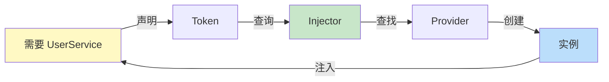

### 📍 Provider 提供者详解

```typescript
import { Injectable, inject, InjectionToken } from '@angular/core';

// 📍 1️⃣ 服务提供者（最常见）
@Injectable({ providedIn: 'root' })
export class UserService {
  users = signal<User[]>([]);
  
  getUsers() { /* ... */ }
}

// 📍 2️⃣ 值提供者
const appConfig = new InjectionToken<AppConfig>('app.config');
const configProvider = {
  provide: appConfig,
  useValue: { apiUrl: 'https://api.example.com' }
};

// 📍 3️⃣ 类提供者
const httpProvider = {
  provide: HttpClient,
  useClass: CachedHttpClient // 使用子类替代
};

// 📍 4️⃣ 工厂提供者
const dateProvider = {
  provide: 'app.timestamp',
  useFactory: () => new Date().getTime()
};

// 📍 5️⃣ 注入令牌（提供非类型的依赖）
export const API_URL = new InjectionToken<string>('api.url');
export const DATABASE = new InjectionToken('app.database');

@Injectable()
export class DataService {
  private apiUrl = inject(API_URL);
  private db = inject(DATABASE);
}
```

### 🏗️ 注入器层级结构

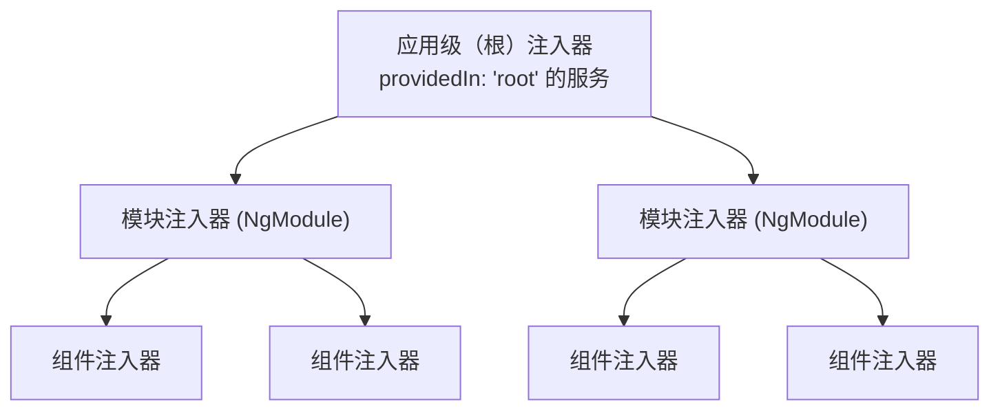

### 💉 现代 DI 用法（inject() API）

```typescript
// ✅ 推荐：使用 inject() 的函数式方式
@Component({
  selector: 'app-user'
})
export class UserComponent {
  // 在组件类中直接使用
  private userService = inject(UserService);
  private route = inject(ActivatedRoute);
  private apiUrl = inject(API_URL);
  
  ngOnInit() {
    this.userService.getUsers();
  }
}

// 📍 在函数/管道中也能使用
export function loadUserGuard() {
  const userService = inject(UserService);
  const router = inject(Router);
  
  return () => userService.isLoaded() || router.navigate(['/login']);
}

export class UppercasePipe implements PipeTransform {
  private logger = inject(LogService);
  
  transform(value: string): string {
    this.logger.log(`Transforming: ${value}`);
    return value.toUpperCase();
  }
}
```

> 🔗 **链式思考**：Angular Router 是三框架中最"重量级"的——自带路由守卫（canActivate/canDeactivate/resolve）、多出口（`<router-outlet>` 带 name 属性）、以及懒加载模块支持。Vue Router 在灵活性上类似但更简洁（路由守卫更少、命名视图较新）。React Router v8.1 则用 `loaders`/`actions` 替代传统守卫，走"声明式数据获取"路线。详见 [框架对比](./框架对比/) 的"路由方案"。

---

## 2️⃣ 路由系统（Router）

### 📍 路由工作流程

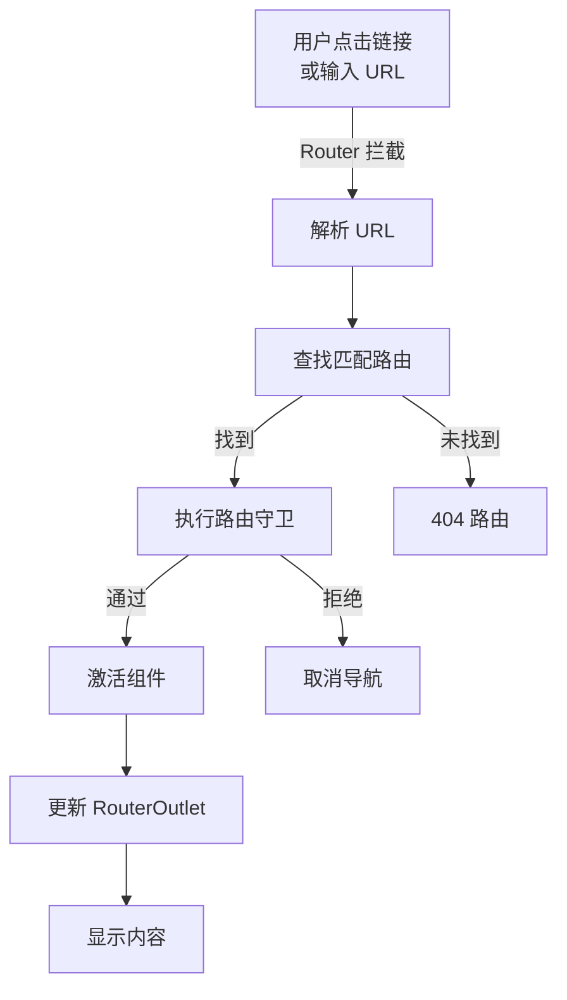

### 🛣️ 路由配置详细示例

```typescript
import { Routes, Router, ActivatedRoute } from '@angular/router';
import { inject } from '@angular/core';

// 📍 路由守卫示例
export function authGuard(): boolean {
  const authService = inject(AuthService);
  const router = inject(Router);
  
  if (authService.isAuthenticated()) {
    return true;
  } else {
    router.navigate(['/login']);
    return false;
  }
}

// 📍 路由解析器（预加载数据）
export function userResolver() {
  return (route: ActivatedRouteSnapshot) => {
    const userId = route.paramMap.get('id');
    return inject(UserService).getUserById(userId!);
  };
}

// 📍 完整的路由配置
export const routes: Routes = [
  // 1️⃣ 简单路由
  { path: '', redirectTo: '/dashboard', pathMatch: 'full' },
  
  // 2️⃣ 组件路由
  { 
    path: 'dashboard', 
    component: DashboardComponent,
    canActivate: [authGuard],  // 进入前守卫
    canDeactivate: [unsavedChangesGuard] // 离开前守卫
  },
  
  // 3️⃣ 参数路由
  {
    path: 'user/:id',
    component: UserDetailComponent,
    resolve: { user: userResolver() } // 预加载数据
  },
  
  // 4️⃣ 嵌套路由（子路由）
  {
    path: 'admin',
    component: AdminLayoutComponent,
    canActivate: [adminGuard],
    children: [
      { path: '', redirectTo: 'dashboard', pathMatch: 'full' },
      { path: 'dashboard', component: AdminDashboardComponent },
      { path: 'users', component: AdminUsersComponent },
      { path: 'settings', component: SettingsComponent }
    ]
  },
  
  // 5️⃣ 延迟加载模块
  {
    path: 'analytics',
    loadChildren: () => 
      import('./analytics/analytics.module').then(m => m.AnalyticsModule),
    canMatch: [authGuard],  // ✅ canLoad 已废弃，使用 canMatch


  // 6️⃣ 通配符路由（必须放在最后）
  { path: '**', component: NotFoundComponent }
];

// 📍 在组件中使用路由
@Component({
  selector: 'app-user-detail',
  template: `
    <h1>User: {{ user?.name }}</h1>
    <p>ID: {{ userId }}</p>
    <button (click)="goBack()">返回</button>
  `
})
export class UserDetailComponent {
  private router = inject(Router);
  private route = inject(ActivatedRoute);
  
  userId = signal('');
  user = signal<User | null>(null);
  private userService = inject(UserService);
  
  constructor() {
    // 方式 1：使用 signal 从 resolve 获取数据
    const resolvedUser = this.route.snapshot.data['user'] as User | undefined;
    if (resolvedUser) this.user.set(resolvedUser);
    
    // 方式 2：监听参数变化（组件复用时自动更新）
    const id$ = this.route.paramMap.pipe(
      map(params => params.get('id') || ''),
      takeUntilDestroyed()
    );
    id$.subscribe(id => {
      this.userId.set(id);
      this.loadUser();
    });
    
    // 方式 3（推荐）：使用 input 转换路由参数
    // Angular 20+ 支持: userId = input<string>(); 
    // 配合路由配置: { path: 'user/:id', ...}
  }
  
  goBack() {
    this.router.navigate(['../'], { relativeTo: this.route });
  }
}
```

### 🧭 声明式导航

```html
<!-- 基础导航 -->
<a routerLink="/dashboard">仪表板</a>

<!-- 带参数 -->
<a [routerLink]="['/user', userId]">查看用户</a>

<!-- 查询参数 -->
<a [routerLink]="['/search']" [queryParams]="{ q: 'angular' }">
  搜索 Angular
</a>

<!-- 活跃链接标记 -->
<nav>
  <a routerLink="/home" routerLinkActive="active">首页</a>
  <a routerLink="/about" routerLinkActive="active" 
     [routerLinkActiveOptions]="{ exact: true }">
    关于
  </a>
</nav>

<!-- 路由出口 -->
<div class="container">
  <router-outlet></router-outlet>
</div>

<!-- 多个路由出口 -->
<router-outlet></router-outlet>
<router-outlet name="sidebar"></router-outlet>
```

> 🔗 **链式思考**：Angular 的 Reactive Forms 显式声明 `FormGroup`/`FormControl`，在代码中管理验证逻辑——这与 React 受控组件 + 手动验证模式相似（`useState` + `onChange` + 验证函数）。Vue 的 `v-model` 则是"声明式双向绑定"，验证逻辑分散在模板中（或通过第三方库 VeeValidate）。选型建议：复杂表单用 Angular Reactive Forms 或 React React Hook Form；简单表单用 Vue v-model 或 Angular 模板驱动表单。详见 [框架对比](./框架对比/) 的"状态管理生态"。

---

## 3️⃣ 表单系统深度剖析

### 📝 表单类型选择指南

```
表单类型选择
│
├─ 简单表单？(< 5 个字段)
│  └─ ✅ 模板驱动表单
│
├─ 复杂/动态表单？
│  └─ ✅ 响应式表单
│
├─ 需要自定义验证？
│  └─ ✅ 响应式表单
│
└─ 需要实时数据同步？
   └─ ✅ 响应式表单
```

### 📋 模板驱动表单示例

```html
<!-- 简单的登录表单 -->
<form #loginForm="ngForm" (ngSubmit)="onSubmit(loginForm.value)">
  <!-- 文本输入 -->
  <input 
    type="email"
    name="email"
    placeholder="邮箱"
    [(ngModel)]="model.email"
    required
    email
    #emailField="ngModel"
  />
  @if (emailField.invalid && emailField.touched) {
    <div class="error">{{ getEmailError(emailField) }}</div>
  }
  
  <!-- 密码输入 -->
  <input 
    type="password"
    name="password"
    placeholder="密码"
    [(ngModel)]="model.password"
    required
    minlength="8"
    #passwordField="ngModel"
  />
  
  <!-- 提交按钮 -->
  <button [disabled]="!loginForm.valid">登录</button>
</form>
```

### ⚙️ 响应式表单深度示例

```typescript
import { FormBuilder, FormGroup, Validators, AbstractControl } from '@angular/forms';

@Component({
  selector: 'app-user-form',
  template: `
    <form [formGroup]="userForm" (ngSubmit)="onSubmit()">
      <!-- 基本字段 -->
      <input 
        formControlName="name" 
        placeholder="姓名"
      />
      @if (userForm.get('name')?.errors?.['required']) {
        <span class="error">姓名必填</span>
      }
      
      <!-- 嵌套 FormGroup -->
      <fieldset [formGroup]="userForm.get('address')">
        <input 
          formControlName="city" 
          placeholder="城市"
        />
      </fieldset>
      
      <!-- 动态 FormArray -->
      <div formArrayName="hobbies">
        @for (hobby of hobbies().controls; let i = $index) {
          <div [formGroupName]="i">
            <input formControlName="name" placeholder="爱好名称" />
            <button type="button" (click)="removeHobby(i)">删除</button>
          </div>
        }
      </div>
      <button type="button" (click)="addHobby()">添加爱好</button>
      
      <button type="submit" [disabled]="!userForm.valid">保存</button>
    </form>
  `,
  imports: [ReactiveFormsModule]
})
export class UserFormComponent {
  private fb = inject(FormBuilder);
  userForm: FormGroup = this.fb.group({
      name: ['', [Validators.required, Validators.minLength(2)]],
      email: ['', [Validators.required, Validators.email]],
      // 嵌套 FormGroup
      address: this.fb.group({
        city: [''],
        street: [''],
        zipCode: ['']
      }),
      // 动态 FormArray
      hobbies: this.fb.array([])
    });
  
  // 获取 FormArray
  hobbies() {
    return this.userForm.get('hobbies') as FormArray;
  }
  
  // 添加爱好
  addHobby() {
    const hobbyForm = this.fb.group({
      name: ['', Validators.required]
    });
    this.hobbies().push(hobbyForm);
  }
  
  // 删除爱好
  removeHobby(index: number) {
    this.hobbies().removeAt(index);
  }
  
  // 自定义验证器
  passwordMatchValidator(control: AbstractControl): ValidationErrors | null {
    const password = control.get('password')?.value;
    const confirmPassword = control.get('confirmPassword')?.value;
    
    if (password !== confirmPassword) {
      return { passwordMismatch: true };
    }
    return null;
  }
  
  onSubmit() {
    if (this.userForm.valid) {
      console.log(this.userForm.value);
    }
  }
}
```

---

## 4️⃣ 生命周期钩子完全指南

### 🔄 生命周期执行顺序图

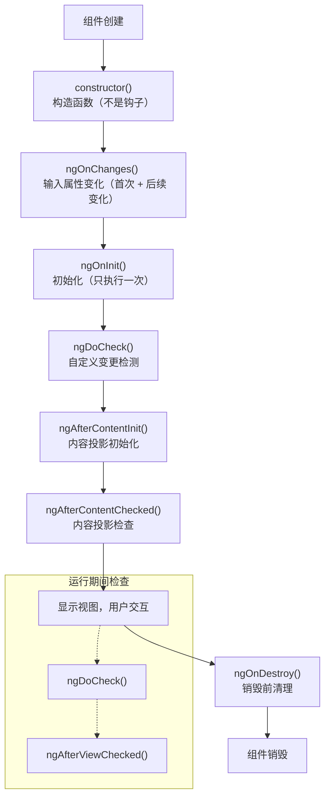

### 📊 生命周期钩子详解表

| 钩子 | 调用时机 | 执行次数 | 用途 | 优先度 |
|------|---------|---------|------|--------|
| `ngOnInit` | 初始化后 | 1次 | 初始化数据、订阅 | ⭐⭐⭐⭐⭐ |
| `ngOnDestroy` | 销毁前 | 1次 | 清理资源、取消订阅 | ⭐⭐⭐⭐⭐ |
| `ngOnChanges` | @Input变化 | 多次 | 响应Input变化 | ⭐⭐⭐⭐ |
| `ngAfterViewInit` | 视图初始化后 | 1次 | 操作@ViewChild | ⭐⭐⭐ |
| `ngAfterContentInit` | 内容投影后 | 1次 | 操作@ContentChild | ⭐⭐⭐ |
| `ngDoCheck` | 变更检测时 | 多次 | 自定义检测逻辑 | ⭐⭐ |
| `ngAfterViewChecked` | 视图检查后 | 多次 | 🔴 避免使用 | ⭐ |
| `ngAfterContentChecked` | 内容检查后 | 多次 | 🔴 避免使用 | ⭐ |

### 💡 生命周期最佳实践

```typescript
@Component({...})
export class BestPracticeComponent implements OnInit {
  private readonly destroyRef = inject(DestroyRef);
  
  constructor(private userService: UserService) {
    // ❌ 不要在这里做复杂初始化
    // ❌ 不要访问 @Input/@ViewChild
  }
  
  ngOnInit() {
    // ✅ 初始化数据
    this.userService.getUsers()
      .pipe(takeUntilDestroyed(this.destroyRef))
      .subscribe(users => console.log(users));
    
    // ✅ 订阅
    // ✅ 设置定时器
  }
  
  ngAfterViewInit() {
    // ✅ 访问 @ViewChild 元素
    // ✅ 操作原生 DOM
  }
  // ❌ 无需 ngOnDestroy — takeUntilDestroyed 自动管理取消订阅
  
  // 清理定时器/事件监听仍可在 ngOnDestroy 中手动处理
}
```

---

# 第三部分：工程实践

## 1️⃣ Angular CLI 与项目结构

### 📦 CLI 安装

```bash
npm install -g @angular/cli
ng version
```

### 🏗️ 创建项目

```bash
ng new my-angular-app --standalone --routing --style=scss
cd my-angular-app
ng serve --open
```

### 📁 项目结构

```
my-angular-app/
├── src/
│   ├── app/
│   │   ├── app.component.ts     # 根组件
│   │   ├── app.config.ts        # 应用配置
│   │   ├── app.routes.ts        # 路由配置
│   │   └── components/          # 组件目录
│   ├── assets/                  # 静态资源
│   ├── index.html               # 入口 HTML
│   ├── main.ts                  # 应用入口
│   └── styles.scss              # 全局样式
├── angular.json                 # Angular 配置
├── tsconfig.json                # TypeScript 配置
└── package.json
```

### ⚡ CLI 常用命令

```bash
ng generate component product-list      # 生成组件
ng generate service product             # 生成服务
ng generate directive highlight          # 生成指令
ng generate pipe filter                  # 生成管道
ng generate guard auth                   # 生成守卫
ng build --configuration production      # 生产构建
ng test                                  # 运行测试
ng lint                                  # 代码检查
```

> 🔗 **链式思考**：Angular 的变更检测经历 Zone.js（全量检测）→ OnPush（组件级优化）→ Zoneless + Signals（精确依赖追踪）的演进。Vue 3 从一开始就是精确到属性级的自动追踪（Proxy），跳过了"全量检测"阶段。React 至今仍是"全量 Diff"，但通过 Fiber 调度 + React Compiler 自动 memo 来最小化开销。三种路线：精确追踪（Vue）、全量 Diff + 可中断（React）、渐进优化（Angular 从 Zone.js 到 Signals）。详见 [框架对比](./框架对比/) 的"响应式原理深度对比"。

---

## 2️⃣ 变更检测机制

### 🧠 变更检测工作原理

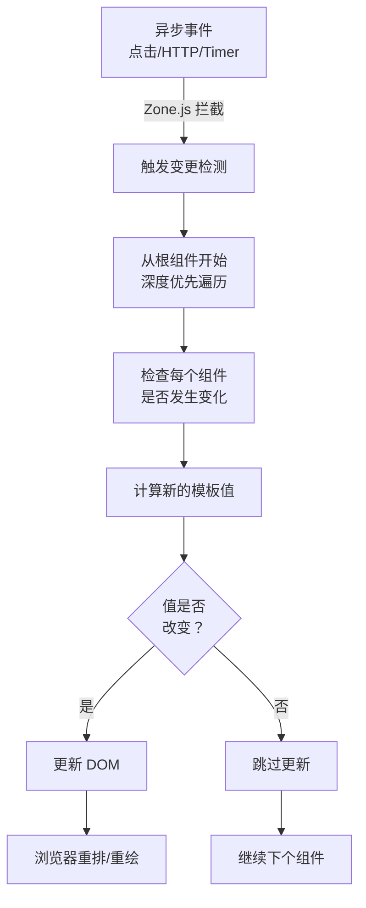

### 📍 ChangeDetectionStrategy

```typescript
// 🔴 默认策略：检查整个树
@Component({
  selector: 'app-default',
  template: `<p>{{ data }}</p>`
  // changeDetection: ChangeDetectionStrategy.Default （默认）
})
export class DefaultComponent {
  data = signal('');
}

// 🟢 OnPush 策略：细粒度检测
@Component({
  selector: 'app-onpush',
  template: `<p>{{ user().name }}</p>`,
  changeDetection: ChangeDetectionStrategy.OnPush
})
export class OnPushComponent {
  user = signal({ name: 'John' });
  
  // OnPush 何时触发变更检测？
  // 1️⃣ Signal input 或 @Input 引用改变
  inputData = input.required<any>();
  // 或 @Input() set inputData(value: any) { }
  
  // 2️⃣ 事件从该组件发出
  onClick() {
    // 点击事件后触发检测
  }
  
  // 3️⃣ async 管道发出新值
  data$ = this.http.get('/api/data');
  // {{ data$ | async }} 会触发检测
  
  // 4️⃣ Signal 值变化（新特性）
  count = signal(0);
  // {{ count() }} 值变化后触发检测
}
```

### 🎯 性能优化：OnPush 最佳实践

```typescript
@Component({
  selector: 'app-optimized-list',
  template: `
    @for (item of items; track item.id) {
      <app-list-item 
        [item]="item"
        [selected]="item.id === selectedId()"
        (itemClick)="onItemClick($event)"
      />
    }
  `,
  changeDetection: ChangeDetectionStrategy.OnPush
})
export class OptimizedListComponent {
  // ✅ 使用 Signal
  items = signal<Item[]>([]);
  selectedId = signal<number | null>(null);
  
  private cdRef = inject(ChangeDetectorRef);
  
  // ✅ 不可变更新
  updateItems(newItems: Item[]) {
    this.items.set(newItems); // Signal 自动触发检测
  }
  
  // ❌ 避免直接修改
  // this.items().push(newItem); ❌ 不会触发检测
  
  // ✅ 手动触发检测（必要时）
  asyncOperation() {
    this.fetch().subscribe(data => {
      this.items.set(data);
      this.cdRef.markForCheck(); // 标记为脏，下次检测时更新
    });
  }
}
```

> 🔗 **链式思考**：Angular 22 的 `httpResource()` + Signals 实现了"声明式数据获取"：描述数据来源，框架自动处理 loading/error/refetch。这与 React 19 的 `use()` + Server Functions 理念一致，也类似 Vue 生态的 `useFetch`（Nuxt）/ TanStack Query（React）。三者的共同演进方向：从"手动管理请求状态"到"声明式描述数据依赖"。详见 [框架对比](./框架对比/) 的"SSR/SSG 方案"。

---

## 3️⃣ HTTP 和数据获取

### 🌐 HttpClient 完整示例

```typescript
import { HttpClient, HttpErrorResponse, HttpHeaders, HttpParams } from '@angular/common/http';
import { Observable, throwError } from 'rxjs';
import { retry, catchError, timeout } from 'rxjs/operators';

interface ApiResponse<T> {
  success: boolean;
  data: T;
  message: string;
}

@Injectable({ providedIn: 'root' })
export class ApiService {
  private baseUrl = 'https://api.example.com';
  
  constructor(private http: HttpClient) {}
  
  // ✅ GET 请求
  getUsers(page: number = 1): Observable<User[]> {
    const params = new HttpParams()
      .set('page', page.toString())
      .set('limit', '10');
    
    return this.http.get<User[]>(`${this.baseUrl}/users`, { params })
      .pipe(
        timeout(5000),           // 5秒超时
        retry(2),               // 失败重试2次
        catchError(this.handleError)
      );
  }
  
  // ✅ POST 请求
  createUser(user: Partial<User>): Observable<User> {
    const headers = new HttpHeaders({
      'Content-Type': 'application/json',
      'Authorization': `Bearer ${this.getToken()}`
    });
    
    return this.http.post<User>(
      `${this.baseUrl}/users`,
      user,
      { headers }
    ).pipe(
      catchError(this.handleError)
    );
  }
  
  // ✅ PUT 请求
  updateUser(id: number, updates: Partial<User>): Observable<User> {
    return this.http.put<User>(
      `${this.baseUrl}/users/${id}`,
      updates
    ).pipe(
      catchError(this.handleError)
    );
  }
  
  // ✅ DELETE 请求
  deleteUser(id: number): Observable<void> {
    return this.http.delete<void>(
      `${this.baseUrl}/users/${id}`
    ).pipe(
      catchError(this.handleError)
    );
  }
  
  // ✅ 错误处理
  private handleError(error: HttpErrorResponse) {
    let errorMessage = '发生了一个错误';
    
    if (error.error instanceof ErrorEvent) {
      // 客户端错误
      errorMessage = `错误: ${error.error.message}`;
    } else {
      // 服务器错误
      errorMessage = `错误代码: ${error.status}, 消息: ${error.message}`;
    }
    
    console.error(errorMessage);
    return throwError(() => new Error(errorMessage));
  }
}
```

### 🔐 HTTP 拦截器系统（函数式拦截器）

```typescript
import { HttpInterceptorFn } from '@angular/common/http';

// 📍 认证拦截器（函数式）
export const authInterceptor: HttpInterceptorFn = (req, next) => {
  const authService = inject(AuthService);
  const router = inject(Router);
  
  // 1️⃣ 添加 Token
  const token = authService.getToken();
  if (token) {
    req = req.clone({
      setHeaders: { Authorization: `Bearer ${token}` }
    });
  }
  
  // 2️⃣ 处理响应
  return next(req).pipe(
    catchError(error => {
      if (error.status === 401) {
        authService.logout();
        router.navigate(['/login']);
      }
      return throwError(() => error);
    })
  );
};

// 📍 日志拦截器（函数式）
export const loggingInterceptor: HttpInterceptorFn = (req, next) => {
  const startTime = Date.now();
  console.log(`[${req.method}] ${req.url}`);
  
  return next(req).pipe(
    tap(event => {
      if (event instanceof HttpResponse) {
        const duration = Date.now() - startTime;
        console.log(`✅ ${req.method} ${req.url} (${duration}ms)`);
      }
    }),
    catchError(error => {
      const duration = Date.now() - startTime;
      console.error(`❌ ${req.method} ${req.url} (${duration}ms)`);
      return throwError(() => error);
    })
  );
};

// 📍 在 main.ts 中注册
bootstrapApplication(AppComponent, {
  providers: [
    provideHttpClient(
      withInterceptors([authInterceptor, loggingInterceptor])
    )
  ]
});
```

### 🎯 现代方式：httpResource()

```typescript
import { resource } from '@angular/core';
import { httpResource } from '@angular/common/http';

@Component({...})
export class UserListComponent {
  // 📍 使用 httpResource 简化 HTTP 请求
  users = resource({
    request: () => ({ pageSize: 10, page: this.currentPage() }),
    loader: ({ request }) => 
      this.http.get<User[]>('/api/users', {
        params: { 
          pageSize: request.pageSize,
          page: request.page
        }
      })
  });
  
  currentPage = signal(1);
  
  // 自动处理的功能：
  // ✅ 请求状态：users.isLoading
  // ✅ 错误处理：users.error
  // ✅ 数据：users.value
  // ✅ 自动缓存
  // ✅ 自动清理订阅
  
  onPageChange(page: number) {
    this.currentPage.set(page);
    // users 会自动重新加载
  }
}
```

### 🔐 JWT 认证服务（实战示例）

```typescript
@Injectable({ providedIn: 'root' })
export class AuthService {
  private http = inject(HttpClient);
  private router = inject(Router);
  private readonly tokenKey = 'auth_token';

  private readonly user = signal<User | null>(null);
  readonly currentUser = this.user.asReadonly();
  readonly isAuthenticated = computed(() => this.user() !== null);

  login(credentials: { email: string; password: string }): Observable<AuthResponse> {
    return this.http.post<AuthResponse>('/api/auth/login', credentials).pipe(
      tap(response => {
        localStorage.setItem(this.tokenKey, response.token);
        this.user.set(response.user);
      })
    );
  }

  logout() {
    localStorage.removeItem(this.tokenKey);
    this.user.set(null);
    this.router.navigate(['/login']);
  }

  getToken(): string | null {
    return localStorage.getItem(this.tokenKey);
  }
}
```

---

# 第四部分：性能优化

## 1️⃣ 性能优化全景图

### 📊 优化策略金字塔

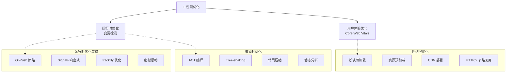

#### 性能优化决策树

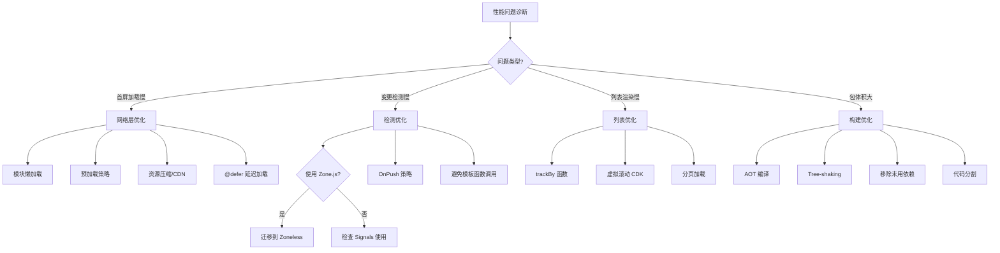

### ⚡ 包体积优化

```typescript
// 📍 优化前的包体积分析
ng build --stats-json

// 📍 减少依赖
// ❌ 避免导入整个库
import _ from 'lodash';          // 整个库 ~70KB

// ✅ 只导入需要的部分
import { debounce } from 'lodash-es';  // 只有几KB

// 📍 动态导入（代码分割）
@Component({...})
export class LazyComponent {
  // 使用 import()，该组件代码不包含在主 bundle 中
}

// 📍 删除未使用的代码
// TreeShaking 要求 package.json 中 sideEffects: false
```

### 🚀 运行时性能优化

```typescript
// ✅ 1. 虚拟滚动（大列表）
import { ScrollingModule } from '@angular/cdk/scrolling';

@Component({
  template: `
    <cdk-virtual-scroll-viewport itemSize="50" class="list">
      @for (item of items; track item.id) {
        <div class="item">{{ item.name }}</div>
      }
    </cdk-virtual-scroll-viewport>
  `
})
export class LargeListComponent {
  items = signal<Item[]>([...Array(10000).keys()].map(i => ({ 
    id: i, 
    name: `Item ${i}` 
  })));
}

// ✅ 2. 防抖搜索
@Component({
  template: `
    <input 
      #searchInput
      (input)="onSearch(searchInput.value)"
      placeholder="搜索..."
    />
  `
})
export class SearchComponent {
  private searchTerm = signal('');
  
  onSearch = debounce((term: string) => {
    this.searchTerm.set(term);
    this.performSearch(term);
  }, 300);
}

// ✅ 3. trackBy 优化列表
@Component({
  template: `
    @for (item of items; track trackById(item)) {
      <app-item [item]="item" />
    }
  `
})
export class ListComponent {
  items = signal<Item[]>([]);
  
  trackById(item: Item): number {
    return item.id;
  }
}
```

---

## 2️⃣ 测试策略

### 🧪 测试金字塔

```
                    端到端测试 (E2E)
                  /              \
                /                  \
      集成测试 (Integration)     
    /                            \
  /                              \
单元测试 (Unit)
```

### 📝 单元测试示例

```typescript
import { TestBed } from '@angular/core/testing';
import { provideHttpClient } from '@angular/common/http';
import { provideHttpClientTesting, HttpTestingController } from '@angular/common/http/testing';

describe('用户服务', () => {
  let service: UserService;
  let httpMock: HttpTestingController;
  
  beforeEach(() => {
    TestBed.configureTestingModule({
      providers: [
        provideHttpClient(),
        provideHttpClientTesting(),
        UserService
      ]
    });
    
    service = TestBed.inject(UserService);
    httpMock = TestBed.inject(HttpTestingController);
  });
  
  afterEach(() => {
    httpMock.verify(); // 确保没有未完成的请求
  });
  
  it('应该获取用户列表', () => {
    const mockUsers: User[] = [
      { id: 1, name: 'Alice' },
      { id: 2, name: 'Bob' }
    ];
    
    service.getUsers().subscribe(users => {
      expect(users.length).toBe(2);
      expect(users[0].name).toBe('Alice');
    });
    
    const req = httpMock.expectOne('/api/users');
    expect(req.request.method).toBe('GET');
    req.flush(mockUsers);
  });
  
  it('应该处理错误', () => {
    service.getUsers().subscribe(
      () => fail('应该失败'),
      error => {
        expect(error.status).toBe(404);
      }
    );
    
    const req = httpMock.expectOne('/api/users');
    req.flush('Not found', { status: 404, statusText: 'Not Found' });
  });
});

// 📝 组件测试
describe('用户列表组件', () => {
  let component: UserListComponent;
  let fixture: ComponentFixture<UserListComponent>;
  
  beforeEach(async () => {
    await TestBed.configureTestingModule({
      imports: [UserListComponent],
      providers: [
        provideHttpClient(),
        provideHttpClientTesting()
      ]
    }).compileComponents();

    fixture = TestBed.createComponent(UserListComponent);
    component = fixture.componentInstance;
  });
  
  it('应该显示用户列表', () => {
    component.users.set([
      { id: 1, name: 'Alice' },
      { id: 2, name: 'Bob' }
    ]);
    
    fixture.detectChanges();
    
    const items = fixture.nativeElement.querySelectorAll('.user-item');
    expect(items.length).toBe(2);
    expect(items[0].textContent).toContain('Alice');
  });
});
```

---

# 第五部分：源码级原理深度解析

> 🎯 **面试星级**：★★★★★ | 本章深入 Angular 源码，适合中高级面试

## 1️⃣ 变更检测源码原理

### 🔄 Zone.js 工作原理

```typescript
// packages/core/src/zone/ng_zone.ts
// Zone.js 通过 monkey-patching 拦截所有异步操作

// 1. 拦截原生 API
const originalSetTimeout = window.setTimeout;
window.setTimeout = function(fn, delay) {
  // 进入 Zone 上下文
  const zone = Zone.current;
  return originalsetTimeout.call(window, function() {
    // 离开 Zone 上下文，触发变更检测
    zone.runOutsideAngular(() => {
      fn();
    });
    // 检测变化
    this.appRef.tick();
  }, delay);
};

// 2. 拦截的 API 列表
// - setTimeout / setInterval
// - Promise
// - addEventListener / removeEventListener
// - XMLHttpRequest
// - Web Workers
// - requestAnimationFrame
```

### 📍 变更检测执行流程

```typescript
// packages/core/src/application/ref.ts
export class ApplicationRef {
  // 1. 触发变更检测
  tick(): void {
    // 遍历所有视图
    this._views.forEach(view => {
      view.detectChanges();
    });
  }

  // 2. 组件级变更检测
  detectChanges(): void {
    const cdr = this._cdRef;
    if (cdr) {
      // 根据 ChangeDetectionStrategy 执行检测
      cdr.detectChanges();
    }
  }
}

// packages/core/src/render3/instructions/detect_changes.ts
export function detectChangesInEmbeddedViews(lView: LView) {
  // 遍历嵌入式视图
  for (let i = 0; i < viewContainerRef.length; i++) {
    const embeddedView = viewContainerRef.get(i);
    // 检查视图是否需要更新
    if (embeddedView.shouldCheck) {
      embeddedView.detectChanges();
    }
  }
}

export function detectChangesInComponent(hostView: LView) {
  const component = hostView[HOST_COMPONENT];
  const changeDetectionMode = component.changeDetection;

  if (changeDetectionMode === ChangeDetectionStrategy.OnPush) {
    // OnPush：只在输入变化时检测
    if (hostView.flags & LViewFlags.Dirty) {
      component.detectChanges();
    }
  } else {
    // Default：每次都检测
    component.detectChanges();
  }
}
```

### 📍 OnPush 优化原理

```typescript
// packages/core/src/render3/component.ts
export function markViewDirty(lView: LView, flags: number) {
  // 1. 标记视图为脏
  lView.flags |= LViewFlags.Dirty;

  // 2. 向上遍历父组件，标记为需要检测
  let parent = lView[PARENT];
  while (parent) {
    // 检查父组件是否为 OnPush
    if (parent.flags & LViewFlags.OnPush) {
      // 只有在输入变化时才标记
      if (flags & MarkDirtyFlags.InputChanged) {
        parent.flags |= LViewFlags.Dirty;
      } else {
        break; // 非输入变化，不继续向上标记
      }
    } else {
      parent.flags |= LViewFlags.Dirty;
    }
    parent = parent[PARENT];
  }

  // 3. 触发变更检测
  scheduleTick(rootContext);
}
```

---

## 2️⃣ 依赖注入源码分析

### 🔄 DI 核心实现

```typescript
// packages/core/src/di/injector.ts
export class NodeInjector {
  private _records: Map<InjectableType<any>, Record>;

  constructor(private _lView: LView) {
    this._records = new Map();
  }

  // 1. 获取依赖
  get<T>(
    token: ProviderToken<T>,
    notFoundValue?: T,
    flags?: InjectFlags
  ): T {
    // 2. 查找记录
    const record = this._records.get(token);

    if (record) {
      // 3. 从记录中获取实例
      return this._getFromRecord(record, token);
    }

    // 4. 创建新实例
    return this._createInstance(token, notFoundValue);
  }

  // 5. 创建实例
  private _createInstance<T>(
    token: ProviderToken<T>,
    notFoundValue?: T
  ): T {
    const provider = this._resolveProvider(token);

    if (provider === undefined) {
      return notFoundValue as T;
    }

    // 6. 根据 Provider 类型创建实例
    if (provider.useExisting) {
      return this.get(provider.useExisting);
    } else if (provider.useFactory) {
      const deps = provider.deps?.map(dep => this.get(dep)) || [];
      return provider.useFactory(...deps);
    } else if (provider.useValue) {
      return provider.useValue;
    } else if (provider.useClass) {
      const deps = this._resolveDeps(provider.deps || []);
      return new provider.useClass(...deps);
    }

    return notFoundValue as T;
  }
}
```

### 📍 Injector 层级机制

```typescript
// packages/core/src/render3/instructions/shared.ts
export function createLView(
  parentLView: LView | null,
  tView: TView,
  context: any,
  flags: LViewFlags
): LView {
  // 1. 创建 LView
  const lView = new LView(parentLView, tView, context, flags);

  // 2. 设置 Injector 层级
  if (parentLView) {
    // 子组件的 Injector 继承自父组件
    lView.injector = parentLView.injector.createChildInjector(lView);
  } else {
    // 根组件使用 RootInjector
    lView.injector = new RootInjector();
  }

  return lView;
}

// 3. 注入器查找顺序
// LView → Component → Module → Root
function findInjector(lView: LView, token: any): any {
  let injector = lView.injector;

  while (injector) {
    const instance = injector.get(token, null);
    if (instance !== null) {
      return instance;
    }
    injector = injector.parent;
  }

  throw new Error(`No provider for ${token}`);
}
```

### 📍 providedIn: 'root' 原理

```typescript
// packages/core/src/di/r3_injector.ts
export function makeRootProviders(
  providers: (Provider | EnvironmentProviders)[]
): StaticProvider[] {
  return providers.map(provider => {
    if (isInjectable(provider)) {
      // providedIn: 'root' 的服务
      return {
        provide: provider,
        useClass: provider,
        deps: getConstructorDeps(provider),
        providedIn: 'root'
      };
    }
    return provider;
  });
}

// Tree-shaking 原理
// 1. 标记 providedIn: 'root' 的服务
// 2. 如果服务未被引用，编译器会移除
// 3. 减少打包体积
```

---

## 3️⃣ 模板编译原理

### 🔄 AOT 编译流程

```typescript
// packages/compiler/src/template_parser/template_parser.ts
export class TemplateParser {
  // 1. 解析模板
  parse(template: string, templateUrl: string): ParsedTemplate {
    // 2. 词法分析
    const tokens = this.tokenize(template);

    // 3. 语法分析
    const ast = this.parseTokens(tokens);

    // 4. 生成 AST
    return this.transformToAST(ast);
  }

  // 5. 生成渲染函数
  generate(ast: ParsedTemplate): ComponentDef {
    return {
      type: NodeType.Element,
      tag: ast.tagName,
      attrs: ast.attributes,
      children: ast.children.map(child => this.generate(child)),
      bindings: ast.bindings
    };
  }
}
```

### 📍 指令编译原理

```typescript
// packages/compiler/src/render3/view/compiler.ts
export function compileDirective(
  directive: DirectiveMetadata,
  bindingParser: BindingParser
): ComponentDef {
  // 1. 解析指令元数据
  const selector = directive.selector;
  const inputs = directive.inputs;
  const outputs = directive.outputs;

  // 2. 生成指令定义
  return {
    type: 'directive',
    selector,
    inputs: this.compileInputs(inputs),
    outputs: this.compileOutputs(outputs),
    hostBindings: this.compileHostBindings(directive.host),
    exportAs: directive.exportAs
  };
}

// 3. 生成模板代码
function compileTemplate(
  template: ParsedTemplate,
  directive: DirectiveMetadata
): string {
  // 将模板转换为渲染函数代码
  return `
    function render(ctx, cm) {
      if (cm) {
        // 创建 DOM 节点
        $r3$.ɵɵelementStart(0, 'div');
        $r3$.ɵɵtext(1);
        $r3$.ɵɵelementEnd();
      }
      // 更新绑定值
      $r3$.ɵɵtextBinding(1, $r3$.ɵɵbind(ctx.value));
    }
  `;
}
```

---

## 4️⃣ Signals 源码实现

### 🔄 Signal 核心实现

```typescript
// packages/core/src/signals/src/signal.ts
export function signal<T>(
  initialValue: T,
  options?: CreateSignalOptions<T>
): WritableSignal<T> {
  // 1. 创建 Signal 节点
  const node: SignalNode<T> = {
    value: initialValue,
    equal: options?.equal ?? defaultEquals,
    producers: new Set(),
    consumers: new Set()
  };

  // 2. 返回 Signal 函数
  function read(): T {
    // 收集依赖
    if (activeEffect) {
      node.producers.add(activeEffect);
      activeEffect.consumers.add(node);
    }
    return node.value;
  }

  // 3. 返回 Writable Signal
  function write(newValue: T): void {
    // 检查值是否变化
    if (!node.equal(node.value, newValue)) {
      node.value = newValue;
      // 通知所有依赖
      notifyEffect(node.consumers);
    }
  }

  return Object.assign(read, {
    set: write,
    update: (fn: (value: T) => T) => write(fn(node.value)),
    asReadonly: () => read
  });
}
```

### 📍 computed 源码实现

```typescript
// packages/core/src/signals/src/computed.ts
export function computed<T>(
  computation: () => T,
  options?: CreateSignalOptions<T>
): Signal<T> {
  let cachedValue: T | undefined;
  let dirty = true;

  // 1. 创建 Computed 节点
  const node: ComputedNode<T> = {
    value: undefined,
    dirty: true,
    producers: new Set(),
    consumers: new Set()
  };

  // 2. 读取函数
  function read(): T {
    // 收集依赖
    if (activeEffect) {
      node.producers.add(activeEffect);
      activeEffect.consumers.add(node);
    }

    // 检查是否需要重新计算
    if (node.dirty) {
      cachedValue = computation();
      node.dirty = false;
    }

    return cachedValue;
  }

  // 3. 脏检查
  function checkDirty(): boolean {
    if (node.dirty) return true;

    // 检查依赖是否变化
    for (const producer of node.producers) {
      if (producer.dirty) {
        node.dirty = true;
        return true;
      }
    }

    return false;
  }

  // 4. 更新函数
  function update(): void {
    if (checkDirty()) {
      cachedValue = computation();
      node.dirty = false;
      // 通知下游
      notifyEffect(node.consumers);
    }
  }

  return Object.assign(read, {
    [SIGNAL]: node,
    update
  });
}
```

### 📍 effect 源码实现

```typescript
// packages/core/src/signals/src/effect.ts
export function effect(
  effectFn: () => void,
  options?: EffectOptions
): EffectRef {
  // 1. 创建 Effect 节点
  const node: EffectNode = {
    fn: effectFn,
    deps: new Set(),
    dirty: true,
    active: true
  };

  // 2. 执行函数
  function run(): void {
    if (!node.active) return;

    // 设置当前 effect
    const previousEffect = activeEffect;
    activeEffect = node;

    try {
      // 清理之前的依赖
      cleanupDeps(node);

      // 执行 effect 函数
      node.fn();

      // 收集新依赖
      node.deps.forEach(dep => dep.consumers.add(node));
    } finally {
      activeEffect = previousEffect;
    }
  }

  // 3. 调度执行
  function schedule(): void {
    if (node.dirty) return;
    node.dirty = true;
    // 加入更新队列
    effectQueue.add(node);
  }

  // 4. 清理依赖
  function cleanupDeps(node: EffectNode): void {
    node.deps.forEach(dep => dep.producers.delete(node));
    node.deps.clear();
  }

  // 5. 返回 EffectRef
  return {
    destroy: () => {
      node.active = false;
      cleanupDeps(node);
    }
  };
}
```

---

# 第六部分：Angular 20/21/22 新特性深度解析

## 1️⃣ Zoneless 模式深度解析

### 🔄 工作原理

```typescript
// packages/core/src/change_detection/scheduling/zoneless_scheduling.ts
export class ZonelessSchedulingService {
  private notificationQueue: Set<NotificationNode> = new Set();

  // 1. 调度变更检测
  scheduleChangeDetection(): void {
    // 使用 MessageChannel 实现微任务调度
    const channel = new MessageChannel();
    channel.port1.onmessage = () => {
      this.processNotifications();
    };
    channel.port2.postMessage(undefined);
  }

  // 2. 处理通知
  private processNotifications(): void {
    this.notificationQueue.forEach(node => {
      // 只更新需要更新的组件
      node.detectChanges();
    });
    this.notificationQueue.clear();
  }

  // 3. 注册通知
  registerNotification(node: NotificationNode): void {
    this.notificationQueue.add(node);
    this.scheduleChangeDetection();
  }
}
```

### 📍 Zoneless 组件实现

```typescript
// packages/core/src/render3/component.ts
export function createComponent<T>(
  component: Type<T>,
  options: CreateComponentOptions
): ComponentRef<T> {
  // 1. 检查是否使用 Zoneless
  const isZoneless = options.environmentInjector.get(ZONELESS_ENABLED);

  if (isZoneless) {
    // 2. Zoneless 模式：使用 Signals 驱动更新
    return this.createComponentWithSignals(component, options);
  } else {
    // 3. 传统模式：使用 Zone.js
    return this.createComponentWithZone(component, options);
  }
}

// 4. Signals 驱动的更新
private createComponentWithSignals<T>(
  component: Type<T>,
  options: CreateComponentOptions
): ComponentRef<T> {
  const ref = this.createRenderer(component, options);

  // 监听 Signal 变化
  effect(() => {
    ref.detectChanges();
  });

  return ref;
}
```

## 2️⃣ linkedSignal 原理

```typescript
// packages/core/src/signals/src/linked_signal.ts
export function linkedSignal<S, T>(
  options: LinkedSignalOptions<S, T>
): WritableSignal<T> {
  const { source, computation } = options;

  // 1. 创建 Linked Signal
  let cachedValue: T;
  let previousSource: S | undefined = undefined;

  // 2. 读取函数
  function read(): T {
    const currentSource = source();

    // 检查源是否变化
    if (currentSource !== previousSource) {
      // 重新计算
      cachedValue = computation(currentSource);
      previousSource = currentSource;
    }

    return cachedValue;
  }

  // 3. 写入函数
  function write(newValue: T): void {
    cachedValue = newValue;
    // 通知下游
    notifyEffect();
  }

  return Object.assign(read, {
    set: write,
    update: (fn: (value: T) => T) => write(fn(cachedValue))
  });
}
```

---

## 3️⃣ Angular 22 新特性源码分析

### @Service 装饰器实现

```typescript
// @Service 是 @Injectable({ providedIn: 'root' }) 的语法糖
// packages/core/src/di/service_decorator.ts

export function Service(): ClassDecorator {
  return (target: any) => {
    Injectable({ providedIn: 'root' })(target);
  };
}

// 使用方式
@Service()
export class UserService {
  // 自动 providedIn: 'root'
  // 可 tree-shaking
}
```

### injectAsync 异步注入实现

```typescript
// packages/core/src/di/inject_async.ts

export function injectAsync<T>(
  factory: () => Promise<Type<T>>
): Signal<T | undefined> {
  const instance = signal<T | undefined>(undefined);
  const loading = signal(false);
  const error = signal<Error | undefined>(undefined);

  async function load() {
    if (instance() !== undefined) return;
    loading.set(true);
    try {
      const type = await factory();
      const resolved = inject(type);
      instance.set(resolved);
    } catch (e) {
      error.set(e as Error);
    } finally {
      loading.set(false);
    }
  }

  // 惰性触发：首次读取时加载
  const read = () => {
    if (instance() === undefined && !loading()) {
      load();
    }
    return instance();
  };

  return read as Signal<T | undefined>;
}
```

### OnPush 默认策略实现

```typescript
// packages/core/src/render3/component.ts

// Angular 22: ChangeDetectionStrategy.Default 重命名为 Eager
export const enum ChangeDetectionStrategy {
  OnPush = 0,  // 新默认值
  Eager = 1,   // 旧 Default 重命名
}

export function getChangeDetectionStrategy(
  component: Component,
): ChangeDetectionStrategy {
  // Angular 22: 未显式指定则使用 OnPush
  return component.changeDetection ?? ChangeDetectionStrategy.OnPush;
}
```

### debounced() 信号防抖实现

```typescript
// packages/core/src/signals/src/debounced.ts

export function debounced<T>(
  source: Signal<T>,
  delayMs: number
): Signal<T> {
  const debouncedValue = signal(source());

  effect((onCleanup) => {
    const value = source();
    const timerId = setTimeout(() => {
      debouncedValue.set(value);
    }, delayMs);

    onCleanup(() => clearTimeout(timerId));
  });

  return debouncedValue.asReadonly();
}
```

---

# 第七部分：常见 Bug 与调试技巧

## 1️⃣ 变更检测问题

### 📍 问题场景

```typescript
// ❌ 问题 1：OnPush 组件不更新
@Component({
  selector: 'app-child',
  changeDetection: ChangeDetectionStrategy.OnPush,
  template: `<p>{{ data }}</p>`
})
export class ChildComponent {
  @Input() data!: string;
}

// 父组件修改数据但不更新子组件
@Component({
  template: `<app-child [data]="data"></app-child>`
})
export class ParentComponent {
  data = 'initial';

  updateData() {
    this.data = 'updated';  // ❌ 引用不变，不触发更新
  }
}

// ✅ 解决方案 1：使用新引用
updateData() {
  this.data = 'updated';  // 如果是对象，创建新对象
}

// ✅ 解决方案 2：使用 Signal
@Component({
  template: `<p>{{ data() }}</p>`
})
export class ChildComponent {
  data = signal('initial');
}

// ✅ 解决方案 3：使用 markForCheck
constructor(private cdr: ChangeDetectorRef) {}

updateData() {
  this.data = 'updated';
  this.cdr.markForCheck();  // 手动触发检测
}
```

### 📍 问题排查清单

```
变更检测问题排查：

1. OnPush 组件不更新？
   → 检查输入引用是否变化
   → 检查是否使用 Signal
   → 检查是否调用 markForCheck

2. 变更检测循环？
   → 检查是否有同步异步操作
   → 检查是否在变更检测中触发更新
   → 检查是否使用 untracked

3. 性能问题？
   → 使用 OnPush 策略
   → 使用 Signals 替代 Observables
   → 避免模板中的函数调用
```

## 2️⃣ 内存泄漏排查

### 📍 常见泄漏场景

```typescript
// ❌ 泄漏场景 1：未取消订阅
export class MyComponent implements OnInit, OnDestroy {
  private subscriptions = new Subscription();

  ngOnInit() {
    this.subscriptions.add(
      this.dataService.getData().subscribe(data => {
        this.data = data;
      })
    );
  }

  ngOnDestroy() {
    this.subscriptions.unsubscribe();  // ✅ 正确清理
  }
}

// ✅ 更好的方案：使用 async 管道
@Component({
  template: `<div>{{ data$ | async }}</div>`
})
export class MyComponent {
  data$ = this.dataService.getData();
  constructor(private dataService: DataService) {}
}

// ❌ 泄漏场景 2：未清理事件监听
ngOnInit() {
  window.addEventListener('resize', this.handleResize);
}

ngOnDestroy() {
  window.removeEventListener('resize', this.handleResize);  // ✅
}

// ✅ 更好的方案：使用 Renderer2
constructor(private renderer: Renderer2) {}

ngOnInit() {
  this.renderer.listen('window', 'resize', this.handleResize);
}

ngOnDestroy() {
  // Renderer2 自动清理
}
```

### 📍 内存泄漏检测

```typescript
// 使用 Chrome DevTools Memory 面板
// 1. 堆快照对比：查找 Detached 节点
// 2. 分配时间线：观察内存增长趋势

// 自动检测
export class MemoryLeakDetector {
  private initialMemory: number;

  constructor() {
    this.initialMemory = performance.memory?.usedJSHeapSize || 0;
  }

  check(): void {
    const currentMemory = performance.memory?.usedJSHeapSize || 0;
    const leak = currentMemory - this.initialMemory;

    if (leak > 10 * 1024 * 1024) {  // 超过 10MB
      console.warn(`Possible memory leak: ${(leak / 1024 / 1024).toFixed(2)}MB`);
    }
  }
}
```

### 🤖 Angular in AI Era：AI 时代 Angular 的核心优势

> Angular 的强类型 + DI + 模板系统在 AI 辅助开发中有独特优势 — AI 生成的代码更准确、更可靠。

#### Angular 在 AI 时代的独特优势

```
Angular 对 AI 友好的核心原因：
  ├─ 强制 TypeScript → AI 类型提示提升生成代码准确率 30%+
  ├─ 强约束架构（模块/组件/服务）→ AI 生成的结构天然规范
  ├─ 依赖注入 → AI 自动管理服务创建和注入
  ├─ 模板与逻辑分离 → AI 可以分别生成和验证
  └─ Angular CLI → AI 可以通过 CLI 命令快速创建脚手架
```

#### Angular MCP Server（AI 辅助开发）

Angular 22 引入了 **Angular MCP Server**，支持 AI 工具直接理解 Angular 项目结构：

| 能力 | 描述 | 效率提升 |
|------|------|---------|
| **组件生成** | AI 根据描述生成完整组件（模板 + 类 + 样式） | 5x |
| **服务生成** | 自动创建服务 + DI 注册 | 5x |
| **Signals 优化** | 检测可优化的 Observable → Signal 转换点 | 3x |
| **Zoneless 迁移** | 自动将 Zone.js 代码迁移到 Zoneless | 10x |
| **测试生成** | 分析组件依赖自动生成 TestBed 测试 | 5-10x |
| **模板类型检查** | 检测模板中的类型错误 | 2x |

```typescript
// 使用 Angular MCP Server 的 AI 提示示例
// 用户输入："创建一个用户列表组件，支持搜索和分页"
// AI 通过 MCP 分析项目结构后生成：

@Component({
  selector: 'app-user-list',
  standalone: true,
  imports: [CommonModule, FormsModule, RouterLink],
  template: `
    <input [(ngModel)]="searchTerm" placeholder="搜索用户..." />
    
    @for (user of filteredUsers(); track user.id) {
      <div class="user-card" [routerLink]="['/users', user.id]">
        <h3>{{ user.name }}</h3>
        <p>{{ user.email }}</p>
      </div>
    }
    
    @if (isLoading()) {
      <div class="spinner">加载中...</div>
    }
  `
})
export class UserListComponent {
  private userService = inject(UserService);
  searchTerm = signal('');
  
  users = httpResource(() => '/api/users');
  filteredUsers = computed(() => {
    const search = this.searchTerm().toLowerCase();
    return this.users.value()?.filter(u => u.name.toLowerCase().includes(search)) ?? [];
  });
  isLoading = computed(() => this.users.isLoading());
}
```

#### AI 辅助 Angular 开发对比

| 场景 | 传统方式 | AI 辅助 | 效率提升 |
|------|---------|---------|---------|
| 创建模块 + 组件 + 路由 | 手动创建 4 个文件 | ng generate + AI 填充 | 5x |
| 编写 Reactive Forms | 手写 FormGroup + FormControl + 验证 | 描述表单 → AI 生成 | 5-10x |
| NgRx Store | 手写 action/reducer/selector/effect | 描述数据流 → AI 生成 | 5x |
| HTTP Interceptor | 手写拦截器逻辑 | 描述需求 → AI 生成 | 3-5x |
| 单元测试 | 手写 TestBed + mock | AI 分析依赖自动生成 | 5-10x |
| Zoneless 迁移 | 逐个组件检查和修改 | MCP 自动识别和重构 | 10x |

#### Angular + AI 应用实践

```typescript
// AI Chat 组件 — Angular Signals + 流式响应
@Component({
  selector: 'app-ai-chat',
  template: `
    <div class="chat-container">
      @for (msg of messages(); track msg.id) {
        <div class="message" [class.assistant]="msg.role === 'assistant'">
          {{ msg.content }}
        </div>
      }
      @if (isStreaming()) {
        <div class="typing">AI 正在输入...</div>
      }
    </div>
    
    <input [(ngModel)]="inputText" (keyup.enter)="sendMessage()" />
    <button (click)="sendMessage()" [disabled]="isStreaming()">发送</button>
  `
})
export class AIChatComponent {
  private http = inject(HttpClient);
  messages = signal<Message[]>([]);
  isStreaming = signal(false);
  inputText = signal('');

  async sendMessage() {
    this.isStreaming.set(true);
    const text = this.inputText();
    
    this.messages.update(msgs => [...msgs, { role: 'user', content: text, id: crypto.randomUUID() }]);
    this.messages.update(msgs => [...msgs, { role: 'assistant', content: '', id: crypto.randomUUID() }]);
    
    const response = await fetch('/api/chat', {
      method: 'POST',
      body: JSON.stringify({ message: text }),
    });
    
    const reader = response.body!.getReader();
    const decoder = new TextDecoder();
    
    while (true) {
      const { done, value } = await reader.read();
      if (done) break;
      this.messages.update(msgs => {
        const last = msgs[msgs.length - 1];
        last.content += decoder.decode(value);
        return [...msgs];
      });
    }
    this.isStreaming.set(false);
  }
}
```

#### 总结：Angular in AI Era

```
Angular 在 AI 时代的不可替代性：
  ├─ TypeScript 原生 → AI 生成代码类型安全
  ├─ 强约束架构 → AI 输出天然规范可维护
  ├─ 依赖注入 → AI 自动管理服务依赖关系
  ├─ Angular MCP Server → 首款框架级 AI 辅助工具
  └─ 企业级定位 → Angular + AI 是企业级应用的未来标准
```

### 2026 年 Angular 生态工具链

| 工具 | 最新版本 | 关键变化 |
|------|----------|----------|
| Angular | 22 | Zoneless 默认，Signals 成熟 |
| Angular CLI | 22 | esbuild/Vite 默认，增量编译 |
| NgRx | 19+ | SignalStore 稳定版 |
| Angular Material | 22 | M3 设计系统稳定 |
| Nx | 21+ | 更好的模块联邦与缓存 |
| Angular Universal | 废弃 | SSR 内置支持 (@angular/ssr) |

### Angular 生态全景图

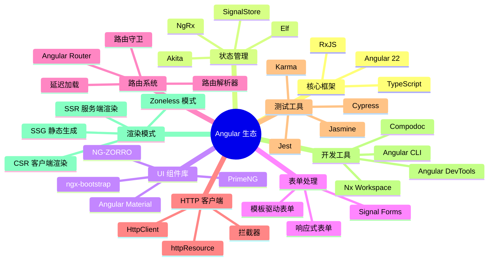

## 实战场景题

### 场景1：实现一个具有搜索、排序、分页的数据表格

```typescript
@Component({
  selector: 'app-data-table',
  template: `
    <!-- 搜索框 -->
    <input 
      [formControl]="searchControl" 
      placeholder="搜索..."
    />
    
    <!-- 排序选择 -->
    <select (change)="onSortChange($event)">
      <option value="name">按名称排序</option>
      <option value="date">按日期排序</option>
    </select>
    
    <!-- 数据表格 -->
    <table>
      <thead>
        <tr>
          <th>名称</th>
          <th>日期</th>
          <th>操作</th>
        </tr>
      </thead>
      <tbody>
        @for (item of filteredData(); track item.id) {
          <tr>
            <td>{{ item.name }}</td>
            <td>{{ item.date | date }}</td>
            <td>
              <button (click)="edit(item)">编辑</button>
              <button (click)="delete(item.id)">删除</button>
            </td>
          </tr>
        }
      </tbody>
    </table>
    
    <!-- 分页 -->
    <div class="pagination">
      <button (click)="previousPage()" [disabled]="currentPage() === 1">
        上一页
      </button>
      <span>第 {{ currentPage() }} 页</span>
      <button (click)="nextPage()">下一页</button>
    </div>
  `,
  imports: [ReactiveFormsModule]
})
export class DataTableComponent {
  private dataService = inject(DataService);
  
  // 响应式状态
  searchControl = new FormControl('');
  sortBy = signal<'name' | 'date'>('name');
  currentPage = signal(1);
  pageSize = 10;
  
  // 原始数据
  allData = resource({
    loader: () => this.dataService.getData()
  });
  
  // 搜索过滤
  filteredBySearch = computed(() => {
    const term = this.searchControl.value?.toLowerCase() || '';
    return (this.allData.value() || []).filter(item =>
      item.name.toLowerCase().includes(term)
    );
  });
  
  // 排序
  sortedData = computed(() => {
    const data = [...this.filteredBySearch()];
    const sortKey = this.sortBy();
    return data.sort((a, b) => {
      if (sortKey === 'name') {
        return a.name.localeCompare(b.name);
      } else {
        return new Date(a.date).getTime() - new Date(b.date).getTime();
      }
    });
  });
  
  // 分页
  filteredData = computed(() => {
    const start = (this.currentPage() - 1) * this.pageSize;
    const end = start + this.pageSize;
    return this.sortedData().slice(start, end);
  });
  
  onSortChange(event: Event) {
    const select = event.target as HTMLSelectElement;
    this.sortBy.set(select.value as 'name' | 'date');
    this.currentPage.set(1);
  }
  
  previousPage() {
    if (this.currentPage() > 1) {
      this.currentPage.update(p => p - 1);
    }
  }
  
  nextPage() {
    this.currentPage.update(p => p + 1);
  }
  
  edit(item: DataItem) {
    // 编辑逻辑
  }
  
  delete(id: number) {
    this.dataService.deleteItem(id).subscribe(() => {
      // 刷新数据
    });
  }
}
```

### 场景2：支付失败怎么再次支付？如何防止重复支付？

在 Angular 企业级开发中，支付状态管理和防重复提交是非常典型的场景。这要求我们结合 Signals、RxJS 和状态机模型进行防抖与幂等性控制。

**核心防御策略：**
1. **前端组件层**：通过 Signal 管理 `isPaying` 状态（防抖/禁用按钮）。
2. **幂等性控制**：每次点击生成唯一的 `Idempotency-Key`，失败重试时**必须刷新**该 Key。
3. **HTTP 请求层**：结合 RxJS 处理请求的取消与重试机制。

```typescript
import { Component, inject, signal } from '@angular/core';
import { HttpClient, HttpHeaders } from '@angular/common/http';
import { finalize, catchError } from 'rxjs/operators';
import { EMPTY } from 'rxjs';

@Component({
  selector: 'app-payment',
  template: `
    <div class="payment-card">
      <h3>订单号: {{ orderNo() }}</h3>
      
      <!-- 支付按钮：正在支付时禁用 -->
      <button 
        (click)="handlePay()" 
        [disabled]="isPaying()">
        {{ isPaying() ? '正在处理中...' : '立即支付' }}
      </button>

      <!-- 错误提示 -->
      @if (errorMessage()) {
        <div class="error-alert">
          {{ errorMessage() }}
          <button (click)="handlePay()">重新支付</button>
        </div>
      }
    </div>
  `
})
export class PaymentComponent {
  private http = inject(HttpClient);
  
  orderNo = signal('ORD-20260701-001');
  isPaying = signal(false);
  errorMessage = signal('');
  
  // 幂等性键：防止网络抖动导致的重试重复扣款
  private idempotencyKey = crypto.randomUUID();

  handlePay() {
    if (this.isPaying()) return; // 1. 前端防重复点击拦截
    
    this.isPaying.set(true);
    this.errorMessage.set('');

    const headers = new HttpHeaders({
      'Idempotency-Key': this.idempotencyKey
    });

    this.http.post('/api/payments/create', 
      { orderNo: this.orderNo() }, 
      { headers }
    ).pipe(
      // 2. 无论成功失败，重置 loading 状态
      finalize(() => this.isPaying.set(false)),
      catchError(err => {
        // 3. 支付失败处理：必须刷新幂等键，允许用户重试！
        this.idempotencyKey = crypto.randomUUID();
        this.errorMessage.set(err.error?.message || '支付失败，请重试');
        return EMPTY;
      })
    ).subscribe({
      next: (res) => {
        // 4. 支付成功逻辑：跳转成功页
        console.log('支付成功:', res);
        // this.router.navigate(['/success']);
      }
    });
  }
}
```

---

## 代码质量

### 如何组织 Angular 项目结构？

**推荐的项目结构：**

```
src/
├── app/
│   ├── core/                    # 核心模块（单例服务）
│   │   ├── services/
│   │   │   ├── auth.service.ts
│   │   │   └── api.service.ts
│   │   ├── interceptors/
│   │   ├── guards/
│   │   └── core.module.ts
│   │
│   ├── shared/                  # 共享模块（可复用组件）
│   │   ├── components/
│   │   │   ├── header/
│   │   │   ├── footer/
│   │   │   └── loading/
│   │   ├── pipes/
│   │   ├── directives/
│   │   └── shared.module.ts
│   │
│   ├── features/                # 功能模块
│   │   ├── dashboard/
│   │   │   ├── dashboard.component.ts
│   │   │   ├── dashboard.routes.ts
│   │   │   └── services/
│   │   ├── products/
│   │   │   ├── product-list/
│   │   │   ├── product-detail/
│   │   │   └── services/
│   │   └── admin/
│   │
│   ├── app.routes.ts            # 路由配置
│   ├── app.component.ts         # 根组件
│   └── app.config.ts            # 应用配置
│
└── assets/                      # 静态资源
    ├── images/
    ├── styles/
    └── data/
```

**核心原则：**

```
✅ 单一职责：每个文件一个功能
✅ 可扩展性：易于添加新功能
✅ 可维护性：代码结构清晰
✅ 可测试性：便于单元测试
✅ 可复用性：共享组件集中管理
```

---

## 性能指标

### 如何衡量 Angular 应用的性能？

```typescript
// 📊 关键性能指标 (Core Web Vitals)

// 1️⃣ LCP (Largest Contentful Paint) - 最大内容绘制
// ✅ 目标：< 2.5 秒
// 优化：预加载资源、Code Splitting

// 2️⃣ FID (First Input Delay) - 首次输入延迟
// ✅ 目标：< 100 毫秒
// 优化：减少主线程工作、使用 Web Workers

// 3️⃣ CLS (Cumulative Layout Shift) - 累积布局偏移
// ✅ 目标：< 0.1
// 优化：预留尺寸空间、避免突然 DOM 插入

// 📍 性能监控代码
export class PerformanceService {
  logNavigationTiming() {
    window.addEventListener('load', () => {
      const perfData = window.performance.timing;
      const pageLoadTime = perfData.loadEventEnd - perfData.navigationStart;
      console.log(`页面加载时间: ${pageLoadTime}ms`);
    });
  }
  
  logCoreWebVitals() {
    // 使用 web-vitals 库
    import('web-vitals').then(({ getLCP, getFID, getCLS }) => {
      getLCP(console.log);
      getFID(console.log);
      getCLS(console.log);
    });
  }
}
```

---

## 总结与最佳实践

### 🎯 Angular 开发黄金法则

```
1️⃣ 优先使用 Signals 进行状态管理
   → 更简洁、更高效、更易理解

2️⃣ 默认采用 OnPush 变更检测
   → 性能提升 20-30%

3️⃣ 响应式表单优于模板驱动表单
   → 复杂表单首选

4️⃣ 始终在 ngOnDestroy 中清理资源
   → 防止内存泄漏

5️⃣ 优先 async 管道处理 Observables
   → 自动管理订阅

6️⃣ 使用 trackBy 优化列表性能
   → 避免不必要的 DOM 操作

7️⃣ 类型安全始终第一
   → 充分利用 TypeScript

8️⃣ 分离关注点
   → 每个组件/服务单一职责

9️⃣ 编写可测试的代码
   → 提高代码质量和维护性

🔟 遵循 Angular 风格指南
   → 保持代码一致性
```

## 📚 推荐学习资源

- 🌐 [官方文档](https://angular.dev)
- 📖 [Angular 风格指南](https://angular.dev/guide/styleguide)
- 🎓 [Angular University](https://angular-university.io)
- 💻 [StackBlitz 在线编辑器](https://stackblitz.com)
