# 🚀 [React 19](https://react.dev) 完整学习指南

> 🎯 **面试星级**：★★★★★ | **建议用时**：3 天
> React 19 系统学习指南，融合核心原理、高级特性、工程实践与面试题，从入门到精通

---


# 📦 第1章：起航React之旅

## 1-1 全景透视：React 课程精华与学习决胜路径

### 📌 React 的核心定义

**React** 是由 Facebook（Meta）开发的 JavaScript 库，用于构建用户界面。它通过**组件化思想**和**声明式编程**，帮助开发者高效构建交互式、动态的 Web 应用。

```typescript
// React 的三大特性：
// 1. 声明式：描述你想要什么，而不是如何实现
// 2. 组件化：封装独立可复用的 UI 单元
// 3. 虚拟 DOM：高效批量更新真实 DOM
```

### 🎯 React 的核心角色

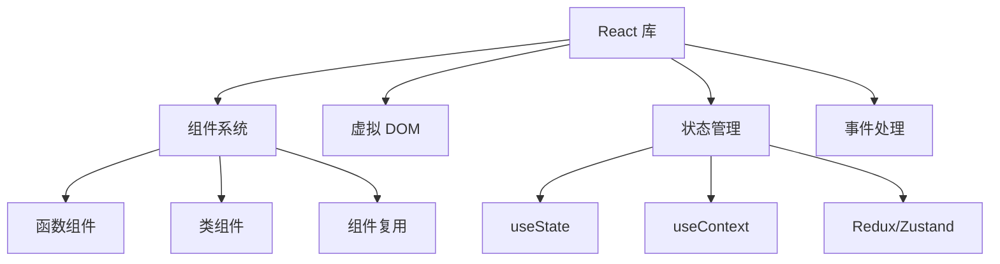

### 🎨 React 五大设计理念

React 的设计哲学可以概括为 **"UI = f(state)"** — 视图是状态函数的输出。

#### ① 声明式（Declarative）

```jsx
// ❌ 命令式（jQuery 思维）
const div = document.createElement('div');
div.className = 'card';
div.textContent = 'Hello';
parent.appendChild(div);

// ✅ 声明式（React 思维）
function Card({ text }) {
  return <div className="card">{text}</div>;
}
```

#### ② 组件化（Component-Based）

```jsx
// 组件 = 独立单元
function UserCard({ user }) {
  return (
    <Card>
      <Avatar src={user.avatar} />
      <Name>{user.name}</Name>
      <Stats posts={user.postCount} />
    </Card>
  );
}
```

#### ③ 虚拟 DOM（Virtual DOM）

```
状态变化 → 新虚拟 DOM → Diff(旧虚拟DOM, 新虚拟DOM) → Patch(真实DOM)
```

#### ④ 函数式编程（Functional）

```jsx
// ✅ 不可变数据
function GoodList({ items }) {
  return <ul>{[...items, 'new item'].map(/* ... */)}</ul>;
}
```

#### ⑤ 一次学习，随处编写

```
React DOM      → Web 应用
React Native   → iOS / Android 原生应用
React Three    → 3D 场景（Three.js 封装）
React Ink      → 命令行终端 UI
```

### 💡 一个公式理解 React

```
UI = f(state)
│     │
▼     ▼
视图  纯函数  状态
```

### 📊 React vs 其他框架

| 特性 | React | Vue | Angular |
|-----|-------|-----|---------|
| 学习曲线 | 🟡 中等 | 🟢 平缓 | 🔴 陡峭 |
| 灵活性 | ✅ 极高 | ⚠️ 中等 | ❌ 受限 |
| 生态系统 | ✅ 最庞大 | ⚠️ 中等 | ✅ 完整 |
| 性能 | ✅ 优秀 | ✅ 优秀 | ✅ 优秀 |
| 企业应用 | ✅ 完美 | ⚠️ 可行 | ✅ 完美 |

### 🗺️ 课程学习路径

```mermaid
graph LR
    A["第1章<br/>React 概述"] --> B["第2章<br/>环境搭建"]
    B --> C["第3章<br/>组件化基础"]
    C --> D["第4章<br/>高效渲染"]
    D --> E["第5章<br/>Tailwind CSS"]
    E --> F["第6章<br/>状态管理"]
    F --> G["第7章<br/>TypeScript"]
    G --> H["第8章<br/>路由系统"]
    H --> I["第9章<br/>数据请求"]
    I --> J["第10章<br/>Context API"]
    J --> K["第11章<br/>Hooks 深入"]
    K --> L["第12章<br/>useReducer"]
    L --> M["第13章<br/>Redux/RTK"]
    M --> N["第14章<br/>全栈实战"]
```

---

# 📦 第2章：React 19初体验与开发环境

## 2-1 前沿洞察：React 领跑前端开发的核心优势

### React 版本迭代史（2013—2026）

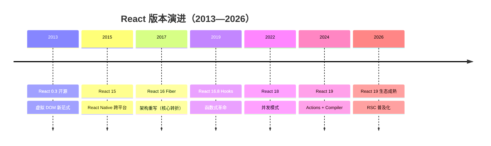

### 关键版本逐代解析

| 版本 | 年份 | 核心变化 | 对开发者的影响 |
|------|------|---------|--------------|
| **React 0.3** | 2013 | 虚拟 DOM，JSX 首次开源 | 开创性范式：声明式 UI |
| **React 15** | 2016 | DOM 重构 + React Native | 跨平台能力 |
| **React 16** | 2017 | **Fiber 架构重写** | 可中断渲染，优先级调度 |
| **React 16.8** | 2019 | **Hooks** 发布 | 函数组件拥有状态 |
| **React 18** | 2022 | 并发模式、自动批处理 | Suspense 完善 |
| **React 19** | 2024 | Actions、use()、React Compiler | 表单革新、自动记忆化 |

### React 18 → 19 核心变化

| 特性 | React 18 | React 19 |
|------|---------|----------|
| 并发模式 | opt-in（通过 createRoot） | 默认启用 |
| Actions | ❌ | ✅ 统一表单处理 |
| use() | ❌ | ✅ 异步数据获取 |
| useOptimistic | ❌ | ✅ 乐观更新 |
| Server Components | 实验性 | ✅ 稳定 |
| ref 传参 | forwardRef | 直接传 ref |
| React Compiler | 实验性 | ✅ 自动 memo |

## 2-2 一步到位：React 开发环境搭建实战全攻略

### 环境要求

```
Node.js 22+（推荐 LTS）
npm / yarn / pnpm
VS Code + ESLint + Prettier 插件
```

## 2-3 Vite + React 19 闪电战：3秒启动

### 创建项目

```bash
npm create vite@latest my-react-app -- --template react-ts
cd my-react-app
npm install
npm run dev
```

### 目录结构

```
my-react-app/
├── index.html          # 入口 HTML
├── src/
│   ├── main.tsx        # 应用入口
│   ├── App.tsx         # 根组件
│   ├── App.css
│   ├── index.css
│   ├── assets/
│   └── vite-env.d.ts
├── package.json
├── tsconfig.json
├── vite.config.ts
└── public/
```

## 2-4 Vite+React 项目核心结构剖析

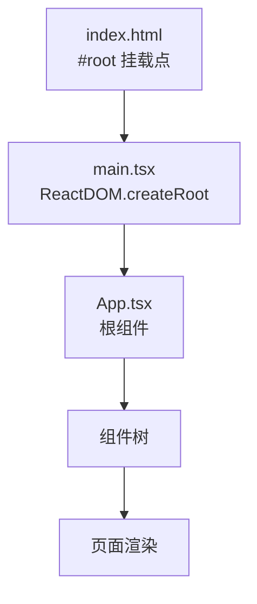

## 2-5 项目总控：package.json

```json
{
  "name": "my-react-app",
  "private": true,
  "version": "0.0.0",
  "type": "module",
  "scripts": {
    "dev": "vite",
    "build": "tsc && vite build",
    "lint": "eslint .",
    "preview": "vite preview"
  },
  "dependencies": {
    "react": "^19.0.0",
    "react-dom": "^19.0.0"
  },
  "devDependencies": {
    "@types/react": "^19.0.0",
    "@types/react-dom": "^19.0.0",
    "@vitejs/plugin-react": "^6.0.0",
    "typescript": "^5.0.0",
    "vite": "^8.0.0"
  }
}
```

## 2-6 工程监理：package-lock.json

`package-lock.json` 锁定依赖版本，确保团队和 CI/CD 环境安装一致的依赖版本，避免"我机器上能跑"的问题。

## 2-7 施工蓝图：vite.config.js

```typescript
import { defineConfig } from 'vite';
import react from '@vitejs/plugin-react';
import path from 'path';

export default defineConfig({
  plugins: [react()],
  resolve: {
    alias: {
      '@': path.resolve(__dirname, './src'),
    },
  },
  server: {
    port: 3000,
    open: true,
  },
});
```

---

# 📦 第3章：核心机制与组件化艺术

## 3-1 组件化架构与 Props 高效通信

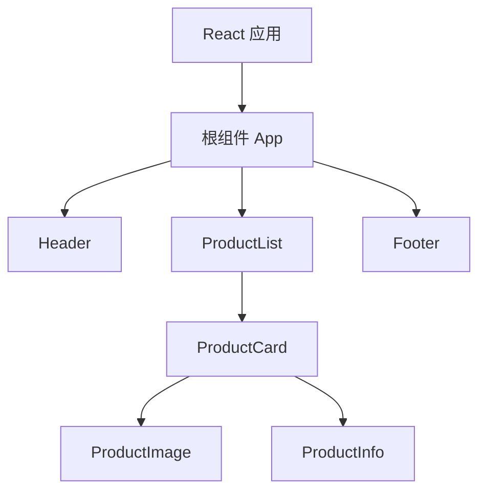

## 3-2 React 根组件：从零构建应用

```tsx
// main.tsx
import { StrictMode } from 'react';
import { createRoot } from 'react-dom/client';
import App from './App.tsx';

createRoot(document.getElementById('root')!).render(
  <StrictMode>
    <App />
  </StrictMode>
);
```

## 3-3 JSX 语法革命：从 HTML 到 React

JSX 是 **JavaScript XML**，是 `React.createElement` 的语法糖。

```jsx
// 原始 JSX
const element = <h1 className="greeting">Hello, {name}!</h1>;

// Babel 编译后
const element = React.createElement(
  "h1",
  { className: "greeting" },
  "Hello, ", name, "!"
);
```

### JSX 转换流程图

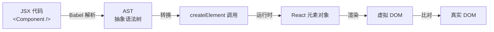

### JSX 规则

```jsx
// ✅ 使用 Fragment
return (
  <>
    <p>Hello</p>
    <p>World</p>
  </>
);

// ✅ 属性驼峰命名
<div className="card" data-testid="card" />

// ✅ 表达式插值
<p>Count: {count * 2}</p>

// ✅ 条件渲染
{showTitle ? <h1>Title</h1> : null}
{showTitle && <h1>Title</h1>}
```

## 3-4 JSX + 组件 + 单根法则

组件必须返回**单个根元素**（Fragment 不算额外 DOM 节点）。

```tsx
// ❌ 错误：多个根元素
function Bad() {
  return (
    <h1>Title</h1>
    <p>Content</p>
  );
}

// ✅ 正确：Fragment 包裹
function Good() {
  return (
    <>
      <h1>Title</h1>
      <p>Content</p>
    </>
  );
}
```

## 3-5 React 视觉工程入门：CSS 基础与原子化设计

### CSS 引入方式

```tsx
// 方式1：全局 CSS
import './App.css';

// 方式2：CSS Modules
import styles from './Card.module.css';

// 方式3：内联样式
<div style={{ color: 'red', fontSize: '16px' }} />

// 方式4：Styled-components
import styled from 'styled-components';
```

## 3-6 CSS 模块化实战

```css
/* Card.module.css */
.card {
  border: 1px solid #e0e0e0;
  border-radius: 8px;
  padding: 16px;
}

.title {
  font-size: 18px;
  font-weight: 600;
}
```

```tsx
import styles from './Card.module.css';

function Card({ title, children }) {
  return (
    <div className={styles.card}>
      <h2 className={styles.title}>{title}</h2>
      {children}
    </div>
  );
}
```

### CSS 方案对比

| 方案 | 作用域 | 动态样式 | 运行时 | Bundle |
|------|--------|---------|--------|--------|
| 原生 CSS | 全局 | ❌ | 无 | 0 |
| CSS Modules | 组件级 | ❌ | 无 | 0 |
| Styled-components | 组件级 | ✅ 主题 | ✅ 有 | ~15KB |
| Tailwind CSS | 全局 | ✅ 条件 | 无 | 可 tree-shake |

## 3-7 Styled-components 样式化组件

```tsx
import styled, { css } from 'styled-components';

const Button = styled.button<{ $primary?: boolean }>`
  padding: 12px 24px;
  border-radius: 6px;
  font-size: 16px;
  border: none;
  cursor: pointer;

  ${({ $primary }) => $primary && css`
    background: #007bff;
    color: white;
    &:hover {
      background: #0056b3;
    }
  `}
`;
```

## 3-8 CSS-in-JS 原理深度拆解

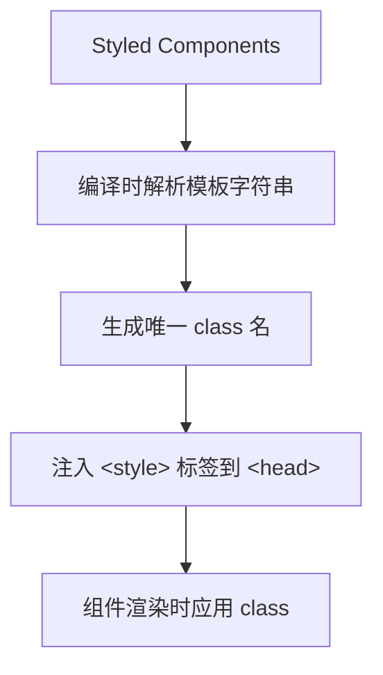

## 3-9 Props 传声筒：父子孙跨层级数据通道

```tsx
interface Product {
  id: number;
  name: string;
  price: number;
}

interface ProductCardProps {
  product: Product;
  onAddToCart: (id: number) => void;
}

function ProductCard({ product, onAddToCart }: ProductCardProps) {
  return (
    <div className="product-card">
      <h3>{product.name}</h3>
      <p>¥{product.price}</p>
      <button onClick={() => onAddToCart(product.id)}>加入购物车</button>
    </div>
  );
}
```

## 3-10 Props 单向数据流：不可变性的防崩溃设计哲学

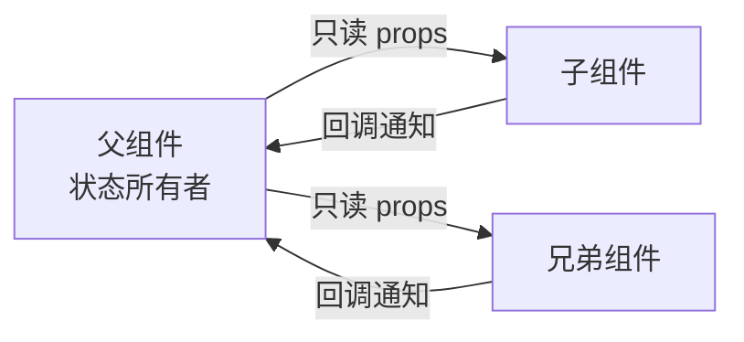

### ⚠️ Props 不可变性原则

```tsx
// ❌ 错误：直接修改 props
function Bad({ user }) {
  user.name = 'new name'; // 直接修改 props！
  return <div>{user.name}</div>;
}

// ✅ 正确：props 只读
function Good({ user }) {
  return <div>{user.name}</div>;
}
```

## 3-11 如何防止 props 被非法修改？用 ESLint 保驾护航

```json
{
  "rules": {
    "react/no-direct-mutation-state": "error",
    "react/forbid-component-props": ["error", { "forbid": ["style"] }]
  }
}
```

## 3-12 Props 黑科技

```tsx
// 解构 + 默认值
function Card({ title = '默认标题', children }) {
  return (
    <div>
      <h2>{title}</h2>
      {children}
    </div>
  );
}

// Spread 批量传递
const productProps = { name: '手机', price: 2999, stock: 10 };
<ProductCard {...productProps} />

// 回调呼叫（子→父通信）
function Parent() {
  const handleChildEvent = (data: string) => console.log(data);
  return <Child onAction={handleChildEvent} />;
}
```

---

# 📦 第4章：高效渲染与组件性能突围

## 4-1 React 实战之路：从列表渲染到高阶组件

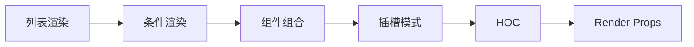

## 4-2 列表渲染工业级实践

```tsx
function ProductList({ products }: { products: Product[] }) {
  return (
    <div className="grid">
      {products.map(product => (
        <ProductCard key={product.id} product={product} />
      ))}
    </div>
  );
}
```

## 4-3 Key 属性玄机：Diff 算法核心优化

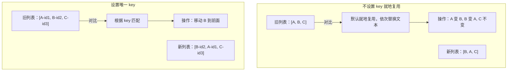

> ⚠️ **不要使用 index 作为 key！** 列表发生变化（增删排序）时，index 会变化，导致组件状态错乱。

## 4-4 短路运算（&&）：极简逻辑控制

```tsx
function UserProfile({ user }) {
  return (
    <div>
      <h2>{user.name}</h2>
      {user.isVIP && <span className="badge">VIP 用户</span>}
      {/* ⚠️ 注意：user.isVIP 为 0 或 '' 时会渲染 0 或空字符串 */}
      {user.bio && <p>{user.bio}</p>}
    </div>
  );
}
```

## 4-5 三元运算符：JSX 中的优雅分支决策

```tsx
function StatusMessage({ status }) {
  return (
    <div>
      {status === 'loading' ? <Spinner /> :
       status === 'error' ? <Error /> :
       status === 'success' ? <Success /> :
       null}
    </div>
  );
}
```

## 4-6 if 的多重返回：组件逻辑分叉与拆分

```tsx
function Dashboard({ user, data, loading, error }) {
  if (loading) return <LoadingSkeleton />;
  if (error) return <ErrorFallback message={error} />;
  if (!user) return <LoginPrompt />;
  if (!data.length) return <EmptyState />;

  return <DataGrid data={data} />;
}
```

## 4-7 React 组件组合

```tsx
function Layout({ header, sidebar, main }) {
  return (
    <div className="layout">
      <header>{header}</header>
      <aside>{sidebar}</aside>
      <main>{main}</main>
    </div>
  );
}

// 使用
<Layout
  header={<Header />}
  sidebar={<Sidebar />}
  main={<MainContent />}
/>
```

## 4-8 props.children：万能插口

```tsx
interface CardProps {
  title: string;
  children: React.ReactNode;
  footer?: React.ReactNode;
}

function Card({ title, children, footer }: CardProps) {
  return (
    <div className="card">
      <div className="card-header">{title}</div>
      <div className="card-body">{children}</div>
      {footer && <div className="card-footer">{footer}</div>}
    </div>
  );
}
```

## 4-9 具名插槽：组件组合的精准对接

```tsx
function ProductCard({
  image,
  info,
  actions,
}: {
  image: React.ReactNode;
  info: React.ReactNode;
  actions: React.ReactNode;
}) {
  return (
    <div className="product-card">
      <div className="product-image">{image}</div>
      <div className="product-info">{info}</div>
      <div className="product-actions">{actions}</div>
    </div>
  );
}
```

## 4-10 & 4-11 HOC 高阶组件

```tsx
// HOC：高阶组件（Higher-Order Component）
function withLogger<P extends object>(Component: React.ComponentType<P>) {
  return function WithLogger(props: P) {
    useEffect(() => {
      console.log(`${Component.displayName || Component.name} mounted`);
      return () => console.log(`${Component.displayName || Component.name} unmounted`);
    }, []);

    return <Component {...props} />;
  };
}

// HOC：withLoading
function withLoading<P extends { loading?: boolean }>(
  Component: React.ComponentType<P>
) {
  return function WithLoading(props: P) {
    if (props.loading) return <div>Loading...</div>;
    return <Component {...props} />;
  };
}

// 使用 HOC
const ProductCardWithLogging = withLogger(ProductCard);
const ProductCardWithLoading = withLoading(ProductCard);
```

### HOC vs Hooks vs Render Props

| 维度 | HOC | Render Props | Hooks |
|------|-----|-------------|-------|
| 模式 | 装饰器模式 | 函数作为 children | 组合式函数 |
| 命名冲突 | ⚠️ 容易冲突 | ✅ 不冲突 | ✅ 不冲突 |
| 嵌套层级 | 深 | 深（嵌套地狱） | 浅 |
| 推荐度 | ⭐⭐ | ⭐ | ⭐⭐⭐⭐⭐ |

---

# 📦 第5章：React+Tailwind CSS 原子化样式

## 5-1 掌握 React 和 Tailwind CSS

Tailwind CSS 是**原子化 CSS** 框架，提供大量工具类（utility class）来快速构建 UI。

## 5-2 CSS 四大酷刑 vs Tailwind 魔法

| 传统 CSS 痛点 | Tailwind 解决方案 |
|--------------|------------------|
| 命名困难（BEM/语义化） | 不命名，直接用工具类 |
| 样式冲突（全局污染） | 作用域天然隔离 |
| 重复代码多 | 组合可复用工具类 |
| 难以维护 | 修改即改 HTML |

## 5-3 React + Tailwind CSS 开发配置

```bash
npm install -D tailwindcss @tailwindcss/vite
```

```typescript
// vite.config.ts
import { defineConfig } from 'vite';
import react from '@vitejs/plugin-react';
import tailwindcss from '@tailwindcss/vite';

export default defineConfig({
  plugins: [react(), tailwindcss()],
});
```

```css
/* index.css */
@import "tailwindcss";
```

## 5-4 Flex 三板斧

```tsx
<div className="flex justify-center items-center h-screen">
  <div className="flex-1 bg-blue-500 p-4">项目1</div>
  <div className="flex-1 bg-green-500 p-4">项目2</div>
  <div className="flex-1 bg-red-500 p-4">项目3</div>
</div>
```

## 5-5 Flex 终极对齐

```
justify-content: justify-start | justify-center | justify-end | justify-between | justify-around | justify-evenly
align-items:     items-start | items-center | items-end | items-stretch | items-baseline
flex-direction:  flex-row | flex-col | flex-row-reverse | flex-col-reverse
```

## 5-6 Grid 网格布局

```tsx
<div className="grid grid-cols-3 gap-4">
  {products.map(product => (
    <div key={product.id} className="bg-white rounded-lg shadow p-4">
      <h3>{product.name}</h3>
    </div>
  ))}
</div>
```

## 5-7 手机、平板、PC：三屏联动响应式

```tsx
<div className="
  grid
  grid-cols-1         /* 手机：1列 */
  sm:grid-cols-2      /* 平板：2列 */
  lg:grid-cols-3      /* 桌面：3列 */
  xl:grid-cols-4      /* 大屏：4列 */
  gap-4
  p-4
">
  {products.map(product => (
    <ProductCard key={product.id} product={product} />
  ))}
</div>
```

## 5-10 状态特效

```tsx
<button className="
  px-6 py-3 bg-blue-600 text-white rounded-lg font-semibold
  hover:bg-blue-700 hover:shadow-lg hover:scale-105
  focus:outline-none focus:ring-2 focus:ring-blue-400
  transition-all duration-200
">
  悬停发光按钮
</button>

<input className="
  w-full px-4 py-2 border border-gray-300 rounded-lg
  focus:border-blue-500 focus:ring-2 focus:ring-blue-200
  outline-none transition-all duration-200
" />
```

## 5-11 黑暗模式：React + Tailwind CSS

```tsx
// 使用 Tailwind 的 dark: 前缀
function ThemedCard() {
  const [dark, setDark] = useState(false);

  return (
    <div className={dark ? 'dark' : ''}>
      <div className="bg-white dark:bg-gray-800 text-black dark:text-white p-6 rounded-lg shadow">
        <h2 className="text-xl font-bold">暗黑模式切换</h2>
        <p className="mt-2 text-gray-600 dark:text-gray-300">
          使用 Tailwind 的 dark: 前缀实现
        </p>
        <button
          onClick={() => setDark(!dark)}
          className="mt-4 px-4 py-2 bg-blue-500 dark:bg-yellow-500 text-white rounded"
        >
          切换 {dark ? '亮色' : '暗黑'} 模式
        </button>
      </div>
    </div>
  );
}
```

## 5-13 主题与指令：自定义 CSS 变量

```css
@import "tailwindcss";

@theme {
  --color-primary: #007bff;
  --color-secondary: #6c757d;
  --color-accent: #ffc107;
}
```

## 5-14 综合实战：产品推荐组件

```tsx
function ProductRecommendations() {
  const products = [
    { id: 1, name: '无线耳机', price: 299, image: '/earbuds.jpg', rating: 4.5 },
    { id: 2, name: '智能手表', price: 1299, image: '/watch.jpg', rating: 4.8 },
  ];

  return (
    <div className="max-w-7xl mx-auto px-4 py-8">
      <h2 className="text-2xl font-bold text-gray-900 dark:text-white mb-6">
        为你推荐
      </h2>
      <div className="grid grid-cols-1 sm:grid-cols-2 lg:grid-cols-4 gap-6">
        {products.map(product => (
          <div key={product.id}
            className="bg-white dark:bg-gray-800 rounded-xl shadow-md overflow-hidden
                       hover:shadow-xl transition-shadow duration-300">
            
            <div className="p-4">
              <h3 className="text-lg font-semibold text-gray-900 dark:text-white">
                {product.name}
              </h3>
              <div className="flex items-center mt-2">
                <span className="text-yellow-400">{'★'.repeat(Math.floor(product.rating))}</span>
                <span className="text-gray-500 ml-1">{product.rating}</span>
              </div>
              <div className="flex items-center justify-between mt-3">
                <span className="text-xl font-bold text-red-500">¥{product.price}</span>
                <button className="px-4 py-2 bg-blue-600 text-white rounded-lg
                                   hover:bg-blue-700 transition-colors">
                  加入购物车
                </button>
              </div>
            </div>
          </div>
        ))}
      </div>
    </div>
  );
}
```

---

# 📦 第6章：状态管理与组件交互

## 6-1 React 状态管理核心技术

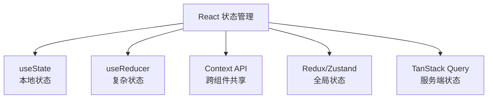

## 6-2 从 let 到 useState 的正确打开方式

```tsx
// ❌ 错误：普通变量不会触发重新渲染
function Wrong() {
  let count = 0;
  const increment = () => { count++; };
  return <button onClick={increment}>{count}</button>; // 显示不会更新！
}

// ✅ 正确：useState
function Correct() {
  const [count, setCount] = useState(0);
  return <button onClick={() => setCount(c => c + 1)}>{count}</button>;
}
```

## 6-3 React State 深度解析

### State 特性

- **异步更新**：`setState` 不会立即更新，React 会批量处理
- **快照机制**：每次渲染都有独立的 state 快照
- **不可变性**：必须创建新值，不能直接修改现有 state

```tsx
function Counter() {
  const [count, setCount] = useState(0);

  const handleClick = () => {
    setCount(count + 1);
    console.log(count); // 依然是旧的 count 值！
  };

  return <button onClick={handleClick}>{count}</button>;
}
```

## 6-4 & 6-5 React 状态管理的特点

### 批处理（Batching）

```tsx
// React 18+ 自动批处理
function handleClick() {
  setCount(c => c + 1);
  setFlag(f => !f);
  setText('hello');
  // 只触发一次重新渲染
}
```

### 函数式更新

```tsx
// ✅ 正确：使用函数式更新避免闭包陷阱
setCount(prev => prev + 1);

// 连续多次更新
setCount(prev => prev + 1);
setCount(prev => prev + 1);
setCount(prev => prev + 1);
// 结果：count 增加 3
```

## 6-6 State 实战：SKU选择器

```tsx
interface SKU {
  color: string;
  size: string;
  stock: number;
  price: number;
}

function SKUSelector({ skus }: { skus: SKU[] }) {
  const [selectedColor, setSelectedColor] = useState('');
  const [selectedSize, setSelectedSize] = useState('');

  const availableSizes = useMemo(() =>
    [...new Set(skus.filter(s => !selectedColor || s.color === selectedColor).map(s => s.size))],
    [skus, selectedColor]
  );

  const currentSKU = useMemo(() =>
    skus.find(s => s.color === selectedColor && s.size === selectedSize),
    [skus, selectedColor, selectedSize]
  );

  return (
    <div>
      <div className="mb-4">
        <label className="block mb-2">颜色：</label>
        <div className="flex gap-2">
          {[...new Set(skus.map(s => s.color))].map(color => (
            <button key={color}
              onClick={() => { setSelectedColor(color); setSelectedSize(''); }}
              className={`px-4 py-2 rounded ${selectedColor === color ? 'bg-blue-500 text-white' : 'bg-gray-200'}`}>
              {color}
            </button>
          ))}
        </div>
      </div>

      <div className="mb-4">
        <label className="block mb-2">尺寸：</label>
        <div className="flex gap-2">
          {availableSizes.map(size => (
            <button key={size}
              onClick={() => setSelectedSize(size)}
              className={`px-4 py-2 rounded ${selectedSize === size ? 'bg-blue-500 text-white' : 'bg-gray-200'}`}>
              {size}
            </button>
          ))}
        </div>
      </div>

      {currentSKU && (
        <div className="p-4 bg-gray-50 rounded">
          <p>价格：¥{currentSKU.price}</p>
          <p>库存：{currentSKU.stock > 0 ? `${currentSKU.stock}件` : '已售罄'}</p>
        </div>
      )}
    </div>
  );
}
```

## 6-7 & 6-8 状态提升（Lifting State Up）

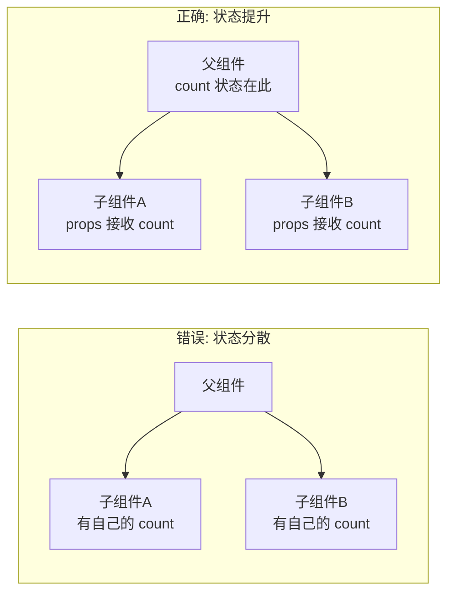

```tsx
function Parent() {
  const [count, setCount] = useState(0);

  return (
    <div>
      <CounterDisplay count={count} />
      <CounterControls count={count} setCount={setCount} />
    </div>
  );
}

function CounterDisplay({ count }: { count: number }) {
  return <h2>计数：{count}</h2>;
}

function CounterControls({ count, setCount }: {
  count: number;
  setCount: React.Dispatch<React.SetStateAction<number>>;
}) {
  return (
    <div>
      <button onClick={() => setCount(c => c + 1)}>+</button>
      <button onClick={() => setCount(c => c - 1)}>-</button>
    </div>
  );
}
```

## 6-9 深层嵌套 State 更新避坑

```tsx
interface User {
  name: string;
  address: {
    city: string;
    district: string;
    detail: string;
  };
  hobbies: string[];
}

const [user, setUser] = useState<User>({
  name: '张三',
  address: { city: '北京', district: '海淀', detail: '...' },
  hobbies: ['读书', '跑步'],
});

// ✅ 正确更新深层嵌套
function updateDistrict(district: string) {
  setUser(prev => ({
    ...prev,
    address: {
      ...prev.address,
      district,
    },
  }));
}

// ✅ 更新数组
function addHobby(hobby: string) {
  setUser(prev => ({
    ...prev,
    hobbies: [...prev.hobbies, hobby],
  }));
}
```

## 6-10 State 不可变性

```tsx
// ❌ 错误：直接修改 state
const [todos, setTodos] = useState(['a', 'b']);
todos.push('c');     // 直接修改
setTodos(todos);     // React 不会检测到变化！

// ✅ 正确：创建新数组
setTodos([...todos, 'c']);

// ✅ 删除
setTodos(todos.filter(t => t !== 'a'));

// ✅ 修改
setTodos(todos.map(t => t === 'a' ? 'A' : t));
```

## 6-11 复杂 State 更新的艺术：Immer

```bash
npm install immer
```

```tsx
import { produce } from 'immer';

const [user, setUser] = useState<User>({ ... });

// 使用 Immer：以可变的方式写不可变逻辑
function updateAddress(district: string) {
  setUser(produce(draft => {
    draft.address.district = district;
  }));
}

function addHobby(hobby: string) {
  setUser(produce(draft => {
    draft.hobbies.push(hobby);
  }));
}
```

## 6-12 柯里化 + Immer：万能 State 更新器

```tsx
function useCurriedUpdate<T extends object>(initialState: T) {
  const [state, setState] = useState(initialState);

  const createUpdate = useCallback(<K extends keyof T>(key: K) => {
    return (value: T[K] | ((prev: T[K]) => T[K])) => {
      setState(produce(draft => {
        draft[key] = typeof value === 'function'
          ? (value as (prev: T[K]) => T[K])(draft[key])
          : value;
      }));
    };
  }, []);

  return [state, createUpdate] as const;
}

// 使用
const [user, update] = useCurriedUpdate(userData);
const updateName = update('name');
const updateCity = (city: string) => {
  setUser(produce(draft => {
    draft.address.city = city;
  }));
};
```

---

# 📦 第7章：React + TypeScript 类型安全

## 7-1 类型安全体系与实践路线

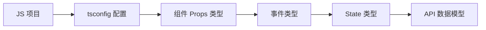

## 7-2 从 JS 平滑升级到 TS

```json
// tsconfig.json
{
  "compilerOptions": {
    "strict": true,
    "jsx": "react-jsx",
    "target": "ES2022",
    "module": "ESNext",
    "moduleResolution": "bundler",
    "skipLibCheck": true
  }
}
```

## 7-3 & 7-4 组件 Props 类型声明

```tsx
// 方式1：type 别名
type ButtonProps = {
  label: string;
  onClick: () => void;
  variant?: 'primary' | 'secondary' | 'danger';
  disabled?: boolean;
  size?: 'sm' | 'md' | 'lg';
};

// 方式2：interface
interface CardProps {
  title: string;
  children: React.ReactNode;
  footer?: React.ReactNode;
  className?: string;
}
```

## 7-5 interface + 联合类型封装万能按钮

```tsx
type ButtonVariant = 'primary' | 'secondary' | 'danger' | 'ghost';
type ButtonSize = 'sm' | 'md' | 'lg';

interface ButtonProps {
  variant?: ButtonVariant;
  size?: ButtonSize;
  disabled?: boolean;
  loading?: boolean;
  children: React.ReactNode;
  onClick?: () => void;
  type?: 'button' | 'submit' | 'reset';
}

function Button({
  variant = 'primary',
  size = 'md',
  disabled = false,
  loading = false,
  children,
  onClick,
  type = 'button',
}: ButtonProps) {
  const baseClass = 'px-4 py-2 rounded font-semibold transition-all duration-200';
  const variantClass = {
    primary: 'bg-blue-600 text-white hover:bg-blue-700',
    secondary: 'bg-gray-200 text-gray-800 hover:bg-gray-300',
    danger: 'bg-red-600 text-white hover:bg-red-700',
    ghost: 'bg-transparent text-gray-600 hover:bg-gray-100',
  }[variant];

  return (
    <button
      type={type}
      onClick={onClick}
      disabled={disabled || loading}
      className={`${baseClass} ${variantClass} ${disabled ? 'opacity-50 cursor-not-allowed' : ''}`}
    >
      {loading ? '加载中...' : children}
    </button>
  );
}
```

## 7-6 interface extends 揭秘组件继承

```tsx
interface BaseInputProps {
  label: string;
  error?: string;
  required?: boolean;
  disabled?: boolean;
}

interface TextInputProps extends BaseInputProps {
  type?: 'text' | 'email' | 'password';
  placeholder?: string;
  value: string;
  onChange: (value: string) => void;
}

interface NumberInputProps extends BaseInputProps {
  min?: number;
  max?: number;
  step?: number;
  value: number;
  onChange: (value: number) => void;
}
```

## 7-7 `.d.ts` 到底是干啥的？

```typescript
// src/types/global.d.ts
declare module '*.module.css' {
  const classes: { readonly [key: string]: string };
  export default classes;
}

declare module '*.svg' {
  const content: string;
  export default content;
}

// 为环境变量添加类型
/// <reference types="vite/client" />
interface ImportMetaEnv {
  readonly VITE_API_URL: string;
  readonly VITE_APP_TITLE: string;
}
```

## 7-8 React 事件类型

```tsx
// 鼠标事件
function handleClick(e: React.MouseEvent<HTMLButtonElement>) {
  console.log(e.clientX, e.clientY);
}

// 表单事件
function handleChange(e: React.ChangeEvent<HTMLInputElement>) {
  console.log(e.target.value);
}

// 表单提交
function handleSubmit(e: React.FormEvent<HTMLFormElement>) {
  e.preventDefault();
  console.log('submitted');
}

// 键盘事件
function handleKeyDown(e: React.KeyboardEvent<HTMLInputElement>) {
  if (e.key === 'Enter') console.log('pressed enter');
}
```

## 7-10 useState 类型安全

```tsx
// 类型推断
const [count, setCount] = useState(0); // type: number

// 显式类型
const [user, setUser] = useState<User | null>(null);

// 联合类型
type Status = 'idle' | 'loading' | 'success' | 'error';
const [status, setStatus] = useState<Status>('idle');
```

## 7-11 TS + useState 构建强类型电商状态

```tsx
interface CartItem {
  id: number;
  productId: number;
  name: string;
  price: number;
  quantity: number;
  image: string;
  sku: string;
}

interface CartState {
  items: CartItem[];
  totalAmount: number;
  totalCount: number;
  coupon?: string;
  discount?: number;
}

function useCart() {
  const [cart, setCart] = useState<CartState>({
    items: [],
    totalAmount: 0,
    totalCount: 0,
  });

  const addItem = useCallback((item: Omit<CartItem, 'quantity'>) => {
    setCart(prev => {
      const existing = prev.items.find(i => i.sku === item.sku);
      if (existing) {
        return {
          ...prev,
          items: prev.items.map(i =>
            i.sku === item.sku ? { ...i, quantity: i.quantity + 1 } : i
          ),
          totalCount: prev.totalCount + 1,
          totalAmount: prev.totalAmount + item.price,
        };
      }
      return {
        ...prev,
        items: [...prev.items, { ...item, quantity: 1 }],
        totalCount: prev.totalCount + 1,
        totalAmount: prev.totalAmount + item.price,
      };
    });
  }, []);

  return { cart, addItem };
}
```

---

# 📦 第8章：React Router v6 路由系统

## 8-1 React Router 是什么？

React Router 是 React 生态中最流行的路由库，实现 SPA 的**客户端路由**，在不刷新页面的情况下切换视图。

## 8-2 BrowserRouter + Route

```bash
npm install react-router-dom
```

```tsx
import { BrowserRouter, Routes, Route } from 'react-router-dom';
import Home from './pages/Home';
import About from './pages/About';
import Product from './pages/Product';

function App() {
  return (
    <BrowserRouter>
      <Routes>
        <Route path="/" element={<Home />} />
        <Route path="/about" element={<About />} />
        <Route path="/product/:id" element={<Product />} />
        <Route path="*" element={<NotFound />} />
      </Routes>
    </BrowserRouter>
  );
}
```

## 8-3 index 文件的妙用

```tsx
<Route path="/dashboard" element={<DashboardLayout />}>
  <Route index element={<DashboardHome />} />
  <Route path="settings" element={<Settings />} />
  <Route path="analytics" element={<Analytics />} />
</Route>
```

`index` 路由匹配父路径的精确路径 `/dashboard`。

## 8-4 Outlet：专业级路由布局

```tsx
import { Outlet } from 'react-router-dom';

function DashboardLayout() {
  return (
    <div className="dashboard-layout">
      <aside className="sidebar">
        <nav>{/* 导航菜单 */}</nav>
      </aside>
      <main className="content">
        <Outlet /> {/* 子路由在此渲染 */}
      </main>
    </div>
  );
}
```

## 8-5 createBrowserRouter 全解析

```tsx
import { createBrowserRouter, RouterProvider } from 'react-router-dom';

const router = createBrowserRouter([
  {
    path: '/',
    element: <RootLayout />,
    errorElement: <ErrorPage />,
    children: [
      { index: true, element: <Home /> },
      {
        path: 'products',
        element: <ProductLayout />,
        children: [
          { index: true, element: <ProductList /> },
          { path: ':id', element: <ProductDetail /> },
        ],
      },
      { path: 'cart', element: <Cart /> },
      { path: 'login', element: <Login /> },
      { path: '*', element: <NotFound /> },
    ],
  },
]);

function App() {
  return <RouterProvider router={router} />;
}
```

## 8-6 中大型项目：createBrowserRouter + Layout

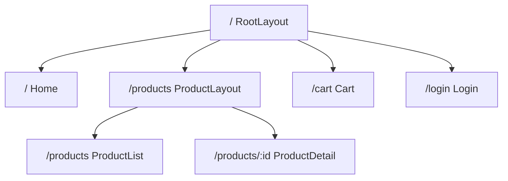

## 8-7 404 + Error Boundary

```tsx
// 404 路由
{ path: '*', element: <NotFound /> }

// Error Boundary
import { useRouteError } from 'react-router-dom';

function ErrorPage() {
  const error = useRouteError() as { statusText?: string; message?: string };
  return (
    <div className="error-page">
      <h1>出错了！</h1>
      <p>{error.statusText || error.message}</p>
    </div>
  );
}
```

## 8-8 Link vs NavLink

```tsx
import { Link, NavLink } from 'react-router-dom';

// Link：基本导航
<Link to="/about">关于我们</Link>

// NavLink：带激活状态的导航
<NavLink
  to="/products"
  className={({ isActive }) => isActive ? 'nav-link active' : 'nav-link'}
  style={({ isActive }) => ({ fontWeight: isActive ? 'bold' : 'normal' })}
>
  产品列表
</NavLink>
```

## 8-9 编程式导航：useNavigate

```tsx
import { useNavigate } from 'react-router-dom';

function LoginButton() {
  const navigate = useNavigate();

  const handleLogin = async () => {
    await login();
    navigate('/dashboard', { replace: true }); // 替换历史记录
  };

  return <button onClick={handleLogin}>登录</button>;
}

// 返回上一页
function BackButton() {
  const navigate = useNavigate();
  return <button onClick={() => navigate(-1)}>返回</button>;
}
```

## 8-10 URL 参数匹配

```tsx
// useParams：路径参数
// 路由：/product/:id
import { useParams } from 'react-router-dom';

function ProductDetail() {
  const { id } = useParams<{ id: string }>();
  // 使用 id 获取产品数据
  return <div>产品ID：{id}</div>;
}

// useSearchParams：查询参数
// URL: /products?category=electronics&sort=price
function ProductList() {
  const [searchParams, setSearchParams] = useSearchParams();
  const category = searchParams.get('category') || 'all';

  const updateFilter = (key: string, value: string) => {
    setSearchParams(prev => {
      prev.set(key, value);
      return prev;
    });
  };

  return (
    <div>
      <select value={category} onChange={e => updateFilter('category', e.target.value)}>
        <option value="all">全部分类</option>
        <option value="electronics">电子产品</option>
        <option value="clothing">服装</option>
      </select>
    </div>
  );
}
```

## 8-13 鉴权集成

```tsx
// 路由守卫
function ProtectedRoute({ children }: { children: React.ReactNode }) {
  const isAuthenticated = useAuth();

  if (!isAuthenticated) {
    return <Navigate to="/login" replace />;
  }

  return <>{children}</>;
}

// 路由配置
const router = createBrowserRouter([
  {
    path: '/dashboard',
    element: (
      <ProtectedRoute>
        <DashboardLayout />
      </ProtectedRoute>
    ),
    children: [
      { index: true, element: <DashboardHome /> },
    ],
  },
  { path: '/login', element: <Login /> },
]);
```

---

# 📦 第9章：副作用处理 useEffect 与异步请求

## 9-2 异步请求的本质

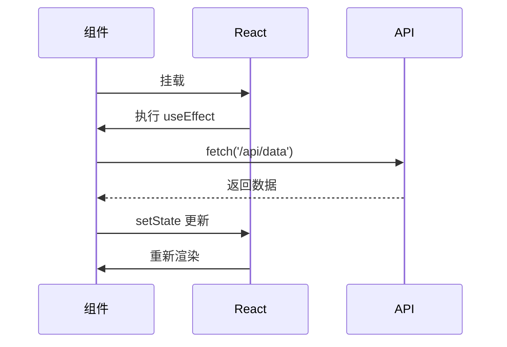

## 9-3 useEffect 详解

```tsx
useEffect(() => {
  // 副作用逻辑
  return () => {
    // 清理函数（组件卸载或依赖变化时执行）
  };
}, [dependencies]);
```

### 三种执行时机

```tsx
// 1. 每次渲染后执行
useEffect(() => {
  console.log('每次渲染后执行');
});

// 2. 仅挂载时执行
useEffect(() => {
  console.log('仅在挂载时执行');
  return () => console.log('卸载时清理');
}, []);

// 3. 依赖变化时执行
useEffect(() => {
  console.log('count 或 name 变化时执行');
}, [count, name]);
```

## 9-4 用 useEffect 搜索功能

```tsx
function SearchProducts() {
  const [query, setQuery] = useState('');
  const [results, setResults] = useState<Product[]>([]);
  const [loading, setLoading] = useState(false);

  useEffect(() => {
    if (!query) {
      setResults([]);
      return;
    }

    const fetchProducts = async () => {
      setLoading(true);
      try {
        const res = await fetch(`/api/products?q=${query}`);
        const data = await res.json();
        setResults(data);
      } catch (err) {
        console.error('搜索失败', err);
      } finally {
        setLoading(false);
      }
    };

    fetchProducts();
  }, [query]);

  return (
    <div>
      <input value={query} onChange={e => setQuery(e.target.value)} placeholder="搜索产品..." />
      {loading && <div>搜索中...</div>}
      <ul>
        {results.map(product => (
          <li key={product.id}>{product.name}</li>
        ))}
      </ul>
    </div>
  );
}
```

## 9-5 错误处理策略

```tsx
interface AsyncState<T> {
  data: T | null;
  loading: boolean;
  error: string | null;
}

function useProducts() {
  const [state, setState] = useState<AsyncState<Product[]>>({
    data: null,
    loading: true,
    error: null,
  });

  useEffect(() => {
    const fetchProducts = async () => {
      try {
        setState(prev => ({ ...prev, loading: true, error: null }));
        const res = await fetch('/api/products');
        if (!res.ok) throw new Error(`HTTP ${res.status}`);
        const data = await res.json();
        setState({ data, loading: false, error: null });
      } catch (err) {
        setState({
          data: null,
          loading: false,
          error: err instanceof Error ? err.message : '未知错误',
        });
      }
    };

    fetchProducts();
  }, []);

  return state;
}
```

## 9-6 依赖数组机制

```tsx
// ✅ 依赖数组中的值变化时重新执行
useEffect(() => {
  document.title = `${count} 条消息`;
}, [count]);

// ❌ 缺少依赖：闭包陷阱
useEffect(() => {
  const timer = setInterval(() => {
    console.log(count); // 永远是初始值
  }, 1000);
  return () => clearInterval(timer);
}, []); // 缺少 count
```

## 9-7 清理函数：内存泄漏不再

```tsx
useEffect(() => {
  const handleResize = () => console.log(window.innerWidth);
  window.addEventListener('resize', handleResize);

  // 清理函数在卸载时执行
  return () => {
    window.removeEventListener('resize', handleResize);
  };
}, []);
```

## 9-8 AbortController：API 请求的竞争与取消

```tsx
useEffect(() => {
  const controller = new AbortController();

  const fetchData = async () => {
    try {
      const res = await fetch('/api/products', {
        signal: controller.signal,
      });
      const data = await res.json();
      setProducts(data);
    } catch (err) {
      if (err instanceof DOMException && err.name === 'AbortError') {
        console.log('请求已取消');
        return;
      }
      console.error('请求失败', err);
    }
  };

  fetchData();

  return () => {
    controller.abort(); // 组件卸载时取消请求
  };
}, []);
```

## 9-9 输入防抖：useDebounce

```tsx
function useDebounce<T>(value: T, delay: number): T {
  const [debouncedValue, setDebouncedValue] = useState(value);

  useEffect(() => {
    const timer = setTimeout(() => {
      setDebouncedValue(value);
    }, delay);

    return () => clearTimeout(timer);
  }, [value, delay]);

  return debouncedValue;
}

// 使用
function SearchComponent() {
  const [query, setQuery] = useState('');
  const debouncedQuery = useDebounce(query, 500);

  useEffect(() => {
    if (debouncedQuery) {
      // 只在用户停止输入 500ms 后发起请求
      searchAPI(debouncedQuery);
    }
  }, [debouncedQuery]);

  return <input value={query} onChange={e => setQuery(e.target.value)} />;
}
```

## 9-12 React Router Loaders

```tsx
import { createBrowserRouter } from 'react-router-dom';

const router = createBrowserRouter([
  {
    path: '/products/:id',
    element: <ProductDetail />,
    loader: async ({ params }) => {
      const res = await fetch(`/api/products/${params.id}`);
      if (!res.ok) throw new Response('Not Found', { status: 404 });
      return res.json();
    },
    errorElement: <ErrorPage />,
  },
]);

// 组件中获取数据
import { useLoaderData } from 'react-router-dom';

function ProductDetail() {
  const product = useLoaderData() as Product;
  return <div>{product.name}</div>;
}
```

---

# 📦 第10章：Context API 跨组件状态管理

## 10-2 状态提升破解 Prop Drilling

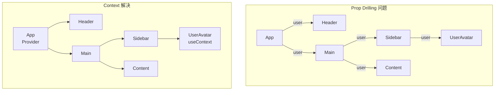

## 10-3 Context API 核心原理

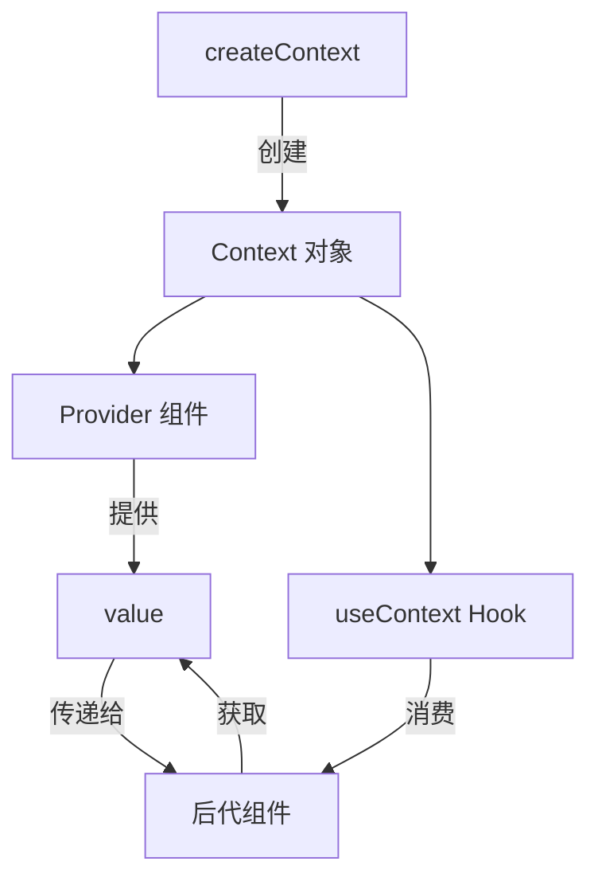

## 10-4 Context 创建：购物车状态

```tsx
interface CartItem {
  id: number;
  name: string;
  price: number;
  quantity: number;
  image: string;
}

interface CartContextType {
  items: CartItem[];
  addItem: (item: CartItem) => void;
  removeItem: (id: number) => void;
  updateQuantity: (id: number, quantity: number) => void;
  clearCart: () => void;
  totalAmount: number;
  totalCount: number;
}

const CartContext = createContext<CartContextType | undefined>(undefined);

export function CartProvider({ children }: { children: React.ReactNode }) {
  const [items, setItems] = useState<CartItem[]>([]);

  const addItem = useCallback((item: CartItem) => {
    setItems(prev => {
      const existing = prev.find(i => i.id === item.id);
      if (existing) {
        return prev.map(i =>
          i.id === item.id ? { ...i, quantity: i.quantity + item.quantity } : i
        );
      }
      return [...prev, item];
    });
  }, []);

  const totalAmount = useMemo(() =>
    items.reduce((sum, item) => sum + item.price * item.quantity, 0),
    [items]
  );

  const totalCount = useMemo(() =>
    items.reduce((sum, item) => sum + item.quantity, 0),
    [items]
  );

  return (
    <CartContext.Provider value={{
      items, addItem,
      removeItem: (id) => setItems(prev => prev.filter(i => i.id !== id)),
      updateQuantity: (id, qty) => setItems(prev =>
        prev.map(i => i.id === id ? { ...i, quantity: qty } : i)
      ),
      clearCart: () => setItems([]),
      totalAmount, totalCount,
    }}>
      {children}
    </CartContext.Provider>
  );
}

export function useCart() {
  const context = useContext(CartContext);
  if (!context) throw new Error('useCart must be used within CartProvider');
  return context;
}
```

## 10-5 Context 订阅与发布

```tsx
// 根组件包裹
function App() {
  return (
    <CartProvider>
      <Header />
      <MainContent />
    </CartProvider>
  );
}

// 任意后代组件消费
function CartBadge() {
  const { totalCount } = useCart();
  return (
    <span className="cart-badge">
      购物车 ({totalCount})
    </span>
  );
}
```

## 10-6 购物车 UI 重构

```tsx
function CartPage() {
  const { items, updateQuantity, removeItem, totalAmount } = useCart();

  return (
    <div className="max-w-4xl mx-auto p-6">
      <h1 className="text-2xl font-bold mb-6">购物车</h1>

      {items.length === 0 ? (
        <EmptyCart />
      ) : (
        <>
          <div className="space-y-4">
            {items.map(item => (
              <div key={item.id} className="flex items-center gap-4 p-4 bg-white rounded-lg shadow">
                
                <div className="flex-1">
                  <h3 className="font-semibold">{item.name}</h3>
                  <p className="text-gray-500">¥{item.price}</p>
                </div>
                <div className="flex items-center gap-2">
                  <button onClick={() => updateQuantity(item.id, item.quantity - 1)}
                    className="px-2 py-1 border rounded">-</button>
                  <span className="w-8 text-center">{item.quantity}</span>
                  <button onClick={() => updateQuantity(item.id, item.quantity + 1)}
                    className="px-2 py-1 border rounded">+</button>
                </div>
                <p className="font-bold">¥{(item.price * item.quantity).toFixed(2)}</p>
                <button onClick={() => removeItem(item.id)}
                  className="text-red-500 hover:text-red-700">删除</button>
              </div>
            ))}
          </div>

          <div className="mt-6 p-4 bg-gray-50 rounded-lg text-right">
            <p className="text-lg">合计：<span className="font-bold text-xl">¥{totalAmount.toFixed(2)}</span></p>
            <button className="mt-2 px-6 py-2 bg-blue-600 text-white rounded-lg hover:bg-blue-700">
              去结算
            </button>
          </div>
        </>
      )}
    </div>
  );
}
```

## 10-9 购物车持久化（localStorage）

```tsx
export function CartProvider({ children }: { children: React.ReactNode }) {
  const [items, setItems] = useState<CartItem[]>(() => {
    try {
      const saved = localStorage.getItem('cart');
      return saved ? JSON.parse(saved) : [];
    } catch {
      return [];
    }
  });

  // 自动持久化
  useEffect(() => {
    localStorage.setItem('cart', JSON.stringify(items));
  }, [items]);

  // 多标签同步
  useEffect(() => {
    const handleStorage = (e: StorageEvent) => {
      if (e.key === 'cart' && e.newValue) {
        setItems(JSON.parse(e.newValue));
      }
    };
    window.addEventListener('storage', handleStorage);
    return () => window.removeEventListener('storage', handleStorage);
  }, []);

  // ... rest of the provider
}
```

---

# 📦 第11章：React Hooks 深度赋能

## 11-1 React Hooks 核心规则

### Hooks 三大铁律

1. **只在顶层调用**：不在循环、条件、嵌套函数中调用
2. **只在函数组件或自定义 Hook 中调用**
3. **保证调用顺序不变**：每次渲染执行顺序必须一致

```tsx
// ❌ 错误：条件中调用 hooks
function Bad({ flag }) {
  if (flag) {
    const [count, setCount] = useState(0); // 违反规则！
  }
}

// ✅ 正确
function Good({ flag }) {
  const [count, setCount] = useState(0); // 总是在顶层
}
```

### Hooks 工作原理

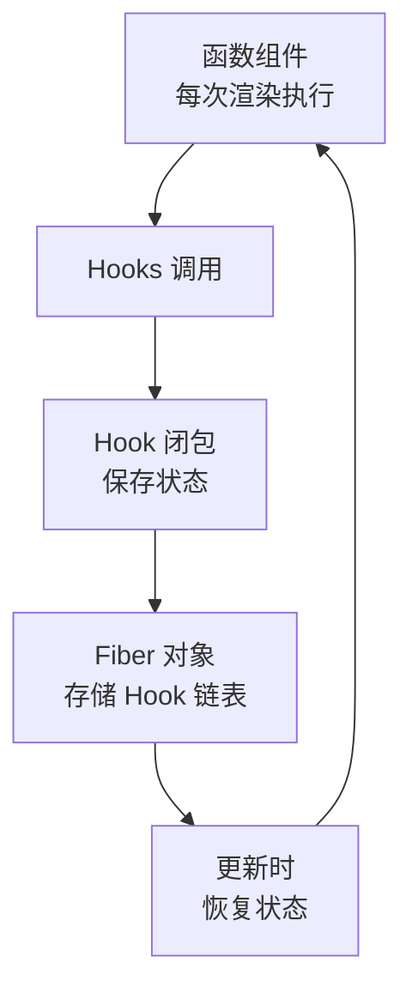

## 11-2 闭包冻结（Stale Closure）风险

```tsx
function StaleClosureExample() {
  const [count, setCount] = useState(0);

  // ❌ 闭包陷阱
  useEffect(() => {
    const timer = setInterval(() => {
      console.log(count); // 永远是 0！
      setCount(count + 1); // 永远是 1
    }, 1000);
    return () => clearInterval(timer);
  }, []); // 空依赖，count 被冻结

  // ✅ 使用函数式更新
  useEffect(() => {
    const timer = setInterval(() => {
      setCount(prev => prev + 1); // 正确的做法
    }, 1000);
    return () => clearInterval(timer);
  }, []);
}
```

## 11-3 StrictMode 双重调用

React 严格模式下，开发环境的 useEffect 会执行两次，用于检测副作用的清理是否正确。

```tsx
function App() {
  return (
    <StrictMode>
      <Main />
    </StrictMode>
  );
}

// 开发环境：组件挂载 → 卸载 → 重新挂载
// 用于检测：清理函数是否正确、是否有内存泄漏
```

## 11-4 useCallback + React.memo

```tsx
import { memo, useCallback } from 'react';

// React.memo：props 不变时跳过渲染
const ProductCard = memo(function ProductCard({
  product,
  onAddToCart,
}: {
  product: Product;
  onAddToCart: (id: number) => void;
}) {
  console.log('渲染：', product.name);
  return (
    <div>
      <h3>{product.name}</h3>
      <button onClick={() => onAddToCart(product.id)}>加入购物车</button>
    </div>
  );
});

function ProductList({ products }: { products: Product[] }) {
  // useCallback：缓存函数引用
  const handleAddToCart = useCallback((id: number) => {
    console.log('加入购物车', id);
  }, []);

  return (
    <div>
      {products.map(product => (
        <ProductCard
          key={product.id}
          product={product}
          onAddToCart={handleAddToCart}
        />
      ))}
    </div>
  );
}
```

## 11-5 useMemo 实战应用

```tsx
function ProductList({ products, searchQuery, category, sortBy }: {
  products: Product[];
  searchQuery: string;
  category: string;
  sortBy: 'price' | 'name' | 'rating';
}) {
  // useMemo：缓存昂贵计算
  const filteredAndSorted = useMemo(() => {
    console.log('重新计算过滤排序...');
    return products
      .filter(p =>
        (category === 'all' || p.category === category) &&
        p.name.toLowerCase().includes(searchQuery.toLowerCase())
      )
      .sort((a, b) => {
        if (sortBy === 'price') return a.price - b.price;
        if (sortBy === 'name') return a.name.localeCompare(b.name);
        return b.rating - a.rating;
      });
  }, [products, searchQuery, category, sortBy]);

  return (
    <div className="grid grid-cols-3 gap-4">
      {filteredAndSorted.map(product => (
        <ProductCard key={product.id} product={product} />
      ))}
    </div>
  );
}
```

## 11-6 useRef：引用持久化与 DOM 操作

```tsx
// 访问 DOM 元素
function AutoFocusInput() {
  const inputRef = useRef<HTMLInputElement>(null);

  useEffect(() => {
    inputRef.current?.focus();
  }, []);

  return <input ref={inputRef} className="border p-2 rounded" />;
}

// 保存可变值（不触发重新渲染）
function Timer() {
  const [count, setCount] = useState(0);
  const intervalRef = useRef<number | null>(null);

  const start = () => {
    intervalRef.current = window.setInterval(() => {
      setCount(c => c + 1);
    }, 1000);
  };

  const stop = () => {
    if (intervalRef.current) {
      clearInterval(intervalRef.current);
      intervalRef.current = null;
    }
  };

  useEffect(() => {
    return () => stop(); // 清理
  }, []);

  return <div>{count}<button onClick={start}>开始</button><button onClick={stop}>停止</button></div>;
}
```

## 11-7 自定义 Hook：useApiData

```tsx
interface UseApiDataResult<T> {
  data: T | null;
  loading: boolean;
  error: string | null;
  refetch: () => void;
}

function useApiData<T>(url: string): UseApiDataResult<T> {
  const [data, setData] = useState<T | null>(null);
  const [loading, setLoading] = useState(true);
  const [error, setError] = useState<string | null>(null);
  const [trigger, setTrigger] = useState(0);

  useEffect(() => {
    let cancelled = false;
    const controller = new AbortController();

    const fetchData = async () => {
      setLoading(true);
      setError(null);
      try {
        const res = await fetch(url, { signal: controller.signal });
        if (!res.ok) throw new Error(`HTTP ${res.status}`);
        const json = await res.json();
        if (!cancelled) {
          setData(json);
          setLoading(false);
        }
      } catch (err) {
        if (!cancelled && err instanceof DOMException && err.name !== 'AbortError') {
          setError(err instanceof Error ? err.message : '未知错误');
          setLoading(false);
        }
      }
    };

    fetchData();

    return () => {
      cancelled = true;
      controller.abort();
    };
  }, [url, trigger]);

  const refetch = useCallback(() => {
    setTrigger(t => t + 1);
  }, []);

  return { data, loading, error, refetch };
}

// 使用
function ProductList() {
  const { data: products, loading, error, refetch } = useApiData<Product[]>('/api/products');

  if (loading) return <Loading />;
  if (error) return <Error message={error} onRetry={refetch} />;
  return <ProductGrid products={products || []} />;
}
```

## 11-8 自定义 Hook：useLocalStorage

```tsx
function useLocalStorage<T>(key: string, initialValue: T): [T, (value: T | ((prev: T) => T)) => void] {
  const [storedValue, setStoredValue] = useState<T>(() => {
    try {
      const item = window.localStorage.getItem(key);
      return item ? JSON.parse(item) : initialValue;
    } catch {
      return initialValue;
    }
  });

  const setValue = (value: T | ((prev: T) => T)) => {
    try {
      const valueToStore = value instanceof Function ? value(storedValue) : value;
      setStoredValue(valueToStore);
      window.localStorage.setItem(key, JSON.stringify(valueToStore));
    } catch (error) {
      console.error('localStorage 写入失败', error);
    }
  };

  // 多标签同步
  useEffect(() => {
    const handleStorageChange = (e: StorageEvent) => {
      if (e.key === key && e.newValue) {
        setStoredValue(JSON.parse(e.newValue));
      }
    };
    window.addEventListener('storage', handleStorageChange);
    return () => window.removeEventListener('storage', handleStorageChange);
  }, [key]);

  return [storedValue, setValue];
}
```

---

# 📦 第12章：useReducer 复杂状态管理

## 12-2 useReducer 降维打击复杂场景

```tsx
type CartAction =
  | { type: 'ADD_ITEM'; payload: Product }
  | { type: 'REMOVE_ITEM'; payload: number }
  | { type: 'UPDATE_QUANTITY'; payload: { id: number; quantity: number } }
  | { type: 'APPLY_COUPON'; payload: string }
  | { type: 'CLEAR_CART' };

interface CartState {
  items: CartItem[];
  coupon: string | null;
  discount: number;
}

function cartReducer(state: CartState, action: CartAction): CartState {
  switch (action.type) {
    case 'ADD_ITEM': {
      const existing = state.items.find(i => i.id === action.payload.id);
      if (existing) {
        return {
          ...state,
          items: state.items.map(i =>
            i.id === action.payload.id
              ? { ...i, quantity: i.quantity + 1 }
              : i
          ),
        };
      }
      return {
        ...state,
        items: [...state.items, { ...action.payload, quantity: 1 }],
      };
    }
    case 'REMOVE_ITEM':
      return {
        ...state,
        items: state.items.filter(i => i.id !== action.payload),
      };
    case 'UPDATE_QUANTITY':
      return {
        ...state,
        items: state.items.map(i =>
          i.id === action.payload.id
            ? { ...i, quantity: Math.max(0, action.payload.quantity) }
            : i
        ),
      };
    case 'APPLY_COUPON':
      return { ...state, coupon: action.payload, discount: 0.1 };
    case 'CLEAR_CART':
      return { items: [], coupon: null, discount: 0 };
    default:
      return state;
  }
}
```

## 12-3 购物车重构：useReducer 四步法

```tsx
function Cart() {
  const [state, dispatch] = useReducer(cartReducer, {
    items: [],
    coupon: null,
    discount: 0,
  });

  const totalAmount = useMemo(() =>
    state.items.reduce((sum, i) => sum + i.price * i.quantity, 0) * (1 - state.discount),
    [state.items, state.discount]
  );

  return (
    <div>
      {state.items.map(item => (
        <CartItem
          key={item.id}
          item={item}
          onIncrease={() => dispatch({ type: 'UPDATE_QUANTITY', payload: { id: item.id, quantity: item.quantity + 1 } })}
          onDecrease={() => dispatch({ type: 'UPDATE_QUANTITY', payload: { id: item.id, quantity: item.quantity - 1 } })}
          onRemove={() => dispatch({ type: 'REMOVE_ITEM', payload: item.id })}
        />
      ))}
      <div>总计：¥{totalAmount.toFixed(2)}</div>
    </div>
  );
}
```

## 12-5 Action Creator

```tsx
// Action Creator：统一创建 action
const addItem = (product: Product): CartAction => ({
  type: 'ADD_ITEM',
  payload: product,
});

const removeItem = (id: number): CartAction => ({
  type: 'REMOVE_ITEM',
  payload: id,
});

const updateQuantity = (id: number, quantity: number): CartAction => ({
  type: 'UPDATE_QUANTITY',
  payload: { id, quantity },
});

// 使用
dispatch(addItem(product));
dispatch(removeItem(id));
```

## 12-6 useReducer + Immer 草案模式

```tsx
import { useImmerReducer } from 'use-immer';

function cartReducer(draft: CartState, action: CartAction) {
  switch (action.type) {
    case 'ADD_ITEM': {
      const existing = draft.items.find(i => i.id === action.payload.id);
      if (existing) {
        existing.quantity += 1;
      } else {
        draft.items.push({ ...action.payload, quantity: 1 });
      }
      break;
    }
    case 'REMOVE_ITEM':
      draft.items = draft.items.filter(i => i.id !== action.payload);
      break;
    case 'UPDATE_QUANTITY':
      const item = draft.items.find(i => i.id === action.payload.id);
      if (item) item.quantity = action.payload.quantity;
      break;
    case 'APPLY_COUPON':
      draft.coupon = action.payload;
      draft.discount = 0.1;
      break;
    case 'CLEAR_CART':
      draft.items = [];
      draft.coupon = null;
      draft.discount = 0;
      break;
  }
}
```

---

# 📦 第13章：Redux 生态与 RTK

## 13-2 Redux 管理状态的核心逻辑

### Redux 三大原则

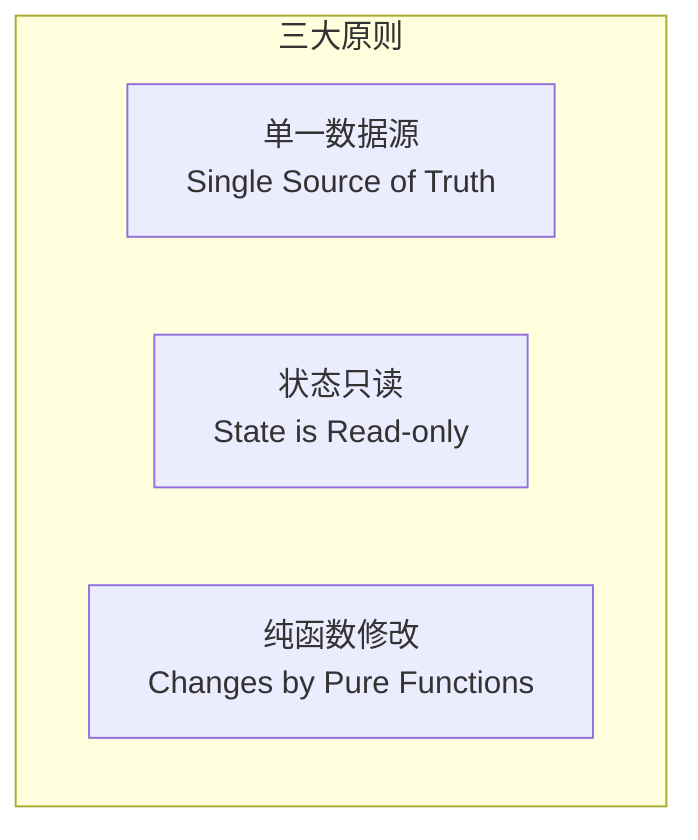

### 数据流

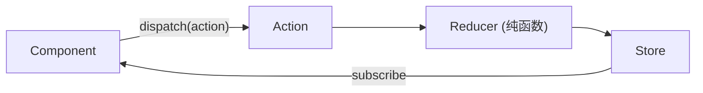

## 13-3 Store 构建

```tsx
import { createStore } from 'redux';

interface AppState {
  locale: string;
  theme: 'light' | 'dark';
}

const initialState: AppState = {
  locale: 'zh-CN',
  theme: 'light',
};

function rootReducer(state = initialState, action: any): AppState {
  switch (action.type) {
    case 'SET_LOCALE':
      return { ...state, locale: action.payload };
    case 'SET_THEME':
      return { ...state, theme: action.payload };
    default:
      return state;
  }
}

const store = createStore(rootReducer);
export type RootState = ReturnType<typeof store.getState>;
```

## 13-7 React-Redux

```tsx
import { useSelector, useDispatch } from 'react-redux';
import type { RootState } from './store';

function ThemeToggle() {
  const theme = useSelector((state: RootState) => state.theme);
  const dispatch = useDispatch();

  return (
    <button onClick={() => dispatch({ type: 'SET_THEME', payload: theme === 'light' ? 'dark' : 'light' })}>
      切换主题
    </button>
  );
}
```

## 13-8 Redux Toolkit：Slice 架构

```tsx
import { createSlice, configureStore } from '@reduxjs/toolkit';

const cartSlice = createSlice({
  name: 'cart',
  initialState: { items: [] as CartItem[] },
  reducers: {
    addItem: (state, action) => {
      const existing = state.items.find(i => i.id === action.payload.id);
      if (existing) {
        existing.quantity += action.payload.quantity || 1;
      } else {
        state.items.push(action.payload);
      }
    },
    removeItem: (state, action) => {
      state.items = state.items.filter(i => i.id !== action.payload);
    },
    clearCart: (state) => {
      state.items = [];
    },
  },
});

export const { addItem, removeItem, clearCart } = cartSlice.actions;

const store = configureStore({
  reducer: {
    cart: cartSlice.reducer,
    // 其他 slice...
  },
});

export type RootState = ReturnType<typeof store.getState>;
export type AppDispatch = typeof store.dispatch;
```

## 13-9 & 13-10 RTK 异步管理：createAsyncThunk

```tsx
import { createAsyncThunk, createSlice } from '@reduxjs/toolkit';

interface ProductsState {
  items: Product[];
  loading: boolean;
  error: string | null;
}

export const fetchProducts = createAsyncThunk(
  'products/fetchProducts',
  async (_, { rejectWithValue }) => {
    try {
      const response = await fetch('/api/products');
      if (!response.ok) throw new Error('Failed to fetch');
      return await response.json() as Product[];
    } catch (err) {
      return rejectWithValue((err as Error).message);
    }
  }
);

const productsSlice = createSlice({
  name: 'products',
  initialState: { items: [], loading: false, error: null } as ProductsState,
  reducers: {},
  extraReducers: (builder) => {
    builder
      .addCase(fetchProducts.pending, (state) => {
        state.loading = true;
        state.error = null;
      })
      .addCase(fetchProducts.fulfilled, (state, action) => {
        state.loading = false;
        state.items = action.payload;
      })
      .addCase(fetchProducts.rejected, (state, action) => {
        state.loading = false;
        state.error = action.payload as string;
      });
  },
});
```

### Redux Toolkit 数据流

```mermaid
flowchart TD
    A["React Component"] -->|"useAppDispatch"| B["dispatch(action)"]
    B --> C["createAsyncThunk<br/>pending/fulfilled/rejected"]
    B --> D["Slice Reducer (Immer)"]
    C --> D
    D --> E["Redux Store"]
    E -->|"useAppSelector"| A
```

---

# 📦 第14章：全栈实战与电商系统

## 14-2 JWT 原理剖析

```mermaid
sequenceDiagram
    participant U as 用户
    participant F as 前端
    participant B as 后端

    U->>F: 输入用户名密码
    F->>B: POST /api/login
    B->>B: 验证凭证
    B->>B: 生成 JWT（Header.Payload.Signature）
    B->>F: 返回 JWT Token
    F->>F: 存储 Token（localStorage）
    F->>B: 请求携带 Authorization: Bearer <token>
    B->>B: 验证 Signature
    B->>F: 返回受保护资源
```

### JWT 结构

```
Header:    { "alg": "HS256", "typ": "JWT" }
Payload:   { "sub": "user123", "iat": 1516239022, "exp": 1516242622 }
Signature: HMACSHA256(base64UrlEncode(header) + "." + base64UrlEncode(payload), secret)
```

## 14-4 注册与登录自定义 Hook

```tsx
interface AuthState {
  user: User | null;
  token: string | null;
  loading: boolean;
  error: string | null;
}

function useAuth() {
  const [state, setState] = useState<AuthState>(() => {
    const token = localStorage.getItem('token');
    const user = localStorage.getItem('user');
    return {
      token,
      user: user ? JSON.parse(user) : null,
      loading: false,
      error: null,
    };
  });

  const login = useCallback(async (email: string, password: string) => {
    setState(prev => ({ ...prev, loading: true, error: null }));
    try {
      const res = await fetch('/api/auth/login', {
        method: 'POST',
        headers: { 'Content-Type': 'application/json' },
        body: JSON.stringify({ email, password }),
      });
      if (!res.ok) throw new Error('登录失败');
      const data = await res.json();
      localStorage.setItem('token', data.token);
      localStorage.setItem('user', JSON.stringify(data.user));
      setState({ user: data.user, token: data.token, loading: false, error: null });
      return true;
    } catch (err) {
      setState(prev => ({ ...prev, loading: false, error: (err as Error).message }));
      return false;
    }
  }, []);

  const logout = useCallback(() => {
    localStorage.removeItem('token');
    localStorage.removeItem('user');
    setState({ user: null, token: null, loading: false, error: null });
  }, []);

  return { ...state, login, logout, isAuthenticated: !!state.token };
}
```

## 14-5 路由守卫 + Token 管理

```tsx
function AuthGuard({ children }: { children: React.ReactNode }) {
  const { isAuthenticated, token } = useAuth();

  if (!isAuthenticated) {
    return <Navigate to="/login" state={{ from: location }} replace />;
  }

  // Token 过期检查
  if (token) {
    const payload = JSON.parse(atob(token.split('.')[1]));
    if (payload.exp * 1000 < Date.now()) {
      return <Navigate to="/login" replace />;
    }
  }

  return <>{children}</>;
}

// 路由配置
<Route path="/checkout" element={
  <AuthGuard>
    <CheckoutPage />
  </AuthGuard>
} />
```

## 14-8 本地存储 vs 后端数据：联网版购物车

```tsx
function useSyncCart() {
  const { isAuthenticated } = useAuth();
  const localCart = useLocalStorage<CartItem[]>('cart', []);
  const [serverCart, setServerCart] = useState<CartItem[]>([]);

  // 登录后：将本地购物车同步到服务器
  useEffect(() => {
    if (isAuthenticated && localCart[0].length > 0) {
      syncCartToServer(localCart[0]);
      localCart[1]([]);
      fetchServerCart().then(setServerCart);
    }
  }, [isAuthenticated]);

  const items = isAuthenticated ? serverCart : localCart[0];
  const setItems = isAuthenticated ? setServerCart : localCart[1];

  return { items, setItems };
}
```

## 14-10 从购物车到支付成功

```tsx
function CheckoutFlow() {
  const { items, totalAmount } = useCart();
  const [step, setStep] = useState<'cart' | 'shipping' | 'payment' | 'confirm'>('cart');
  const [orderId, setOrderId] = useState<string | null>(null);

  const handlePlaceOrder = async () => {
    try {
      const res = await fetch('/api/orders', {
        method: 'POST',
        headers: {
          'Content-Type': 'application/json',
          Authorization: `Bearer ${localStorage.getItem('token')}`,
        },
        body: JSON.stringify({ items, totalAmount }),
      });
      const order = await res.json();
      setOrderId(order.id);
      setStep('confirm');
    } catch (err) {
      console.error('下单失败', err);
    }
  };

  return (
    <div className="max-w-2xl mx-auto p-6">
      {step === 'cart' && <CartStep onNext={() => setStep('shipping')} />}
      {step === 'shipping' && <ShippingForm onNext={() => setStep('payment')} />}
      {step === 'payment' && <PaymentForm onSubmit={handlePlaceOrder} />}
      {step === 'confirm' && <OrderConfirmation orderId={orderId!} />}
    </div>
  );
}
```

---

# 🎯 高频面试题精选

## Q1: React 渲染流程（Trigger→Render→Commit）

React 的渲染分为三个阶段：
- **Trigger**：setState / useState 触发更新
- **Render**：构建虚拟 DOM 树，执行 Diff
- **Commit**：将差异应用到真实 DOM

```mermaid
graph LR
    A["Trigger<br/>触发更新"] --> B["Render<br/>虚拟 DOM Diff"]
    B --> C["Commit<br/>DOM 操作"]
```

## Q2: useEffect 执行时序

| 阶段 | 执行内容 |
|------|---------|
| **挂载** | render → DOM 更新 → 浏览器绘制 → useEffect 执行 |
| **更新** | render → DOM 更新 → 浏览器绘制 → 清理旧 effect → 执行新 effect |
| **卸载** | 清理 effect |

## Q3: React 19 Actions 机制

Actions 是 React 19 的统一表单处理方案，自动管理 pending 状态、错误处理和乐观更新。

```tsx
async function submitAction(prevState: any, formData: FormData) {
  // 处理表单提交
}

function Form() {
  const [state, formAction] = useActionState(submitAction, null);
  const { pending } = useFormStatus();
  return <form action={formAction}>...</form>;
}
```

## Q4: key 的作用

key 帮助 React 识别列表中的每个节点，用于 Diff 算法中的**节点复用判断**。不设 key 或使用 index 作为 key 会导致：
- 列表排序时组件状态错乱
- 不必要的 DOM 操作
- 潜在的性能问题

## Q5: Concurrent Mode 并发模式

React 18+ 的并发模式允许渲染过程**可中断**，高优先级任务（用户输入）可以打断低优先级任务（数据加载）。

```tsx
import { startTransition } from 'react';

startTransition(() => {
  setSearchResults(filterData(input));
});
```

## Q6: use() vs useEffect

| 特性 | use() | useEffect |
|------|-------|-----------|
| 引入版本 | React 19 | React 16.8 |
| 调用位置 | 组件顶层/条件中 | 组件顶层 |
| 数据来源 | Promise / Context | 任意副作用 |
| 配合 Suspense | ✅ 必须 | ❌ |
| 条件调用 | ✅ 允许 | ❌ 禁止 |

## Q7: React 合成事件

React 的事件并非绑定在真实 DOM 上，而是通过**事件代理**统一绑定在根容器上。

```mermaid
graph TD
    A["点击 button"] --> B["原生 click 冒泡"]
    B --> C["根容器监听"]
    C --> D["查找组件处理函数"]
    D --> E["创建合成事件"]
    E --> F["执行处理函数"]
```

## Q8: Hooks 条件调用限制

**原因**：React 使用**链表**存储 Hooks 状态，每次渲染必须按**相同顺序**调用，否则链表顺序被打乱导致状态错乱。

```tsx
// 链表结构
fiber.memoizedState → Hook1(state) → Hook2(state) → Hook3(state) → null
```

## Q9: Server Component vs Client Component

| 特性 | Server Component | Client Component |
|------|----------------|-----------------|
| 渲染位置 | 服务器 | 客户端浏览器 |
| 交互能力 | ❌ 无交互 | ✅ 有交互 |
| 数据访问 | ✅ 直接访问 DB | ❌ 通过 API |
| Bundle | ❌ 不包含 | ✅ 包含 |
| 指令 | 默认 | `'use client'` |

## Q10: React.memo vs useMemo

| 维度 | React.memo | useMemo |
|------|-----------|---------|
| 对象 | 组件 | 值/计算结果 |
| 作用 | 跳过组件重渲染 | 跳过昂贵计算 |
| 对比方式 | 浅比较 props | 依赖数组 |
| 返回值 | 组件 | 计算值 |

## Q11: React Compiler 原理

React Compiler（原 Forget）在**编译阶段**进行静态分析，自动推导值的依赖关系，生成记忆化代码，消除手动 useMemo/useCallback 的需求。

```mermaid
graph TB
    A["源代码"] --> B["AST 解析"]
    B --> C["依赖分析"]
    C --> D["可达性分析"]
    D --> E["自动生成记忆化代码"]
```

## Q12: Fiber 可中断渲染

Fiber 架构将渲染任务拆分为小单元，每执行一个单元后检查是否有更高优先级任务。

```
Fiber 链表结构：
root → Fiber1 → Fiber2 → Fiber3
         ↓         ↓         ↓
      child     child     child
```

## Q13: React 事件机制对比

| 对比项 | 原生事件 | React 事件 |
|--------|---------|-----------|
| 绑定方式 | `addEventListener` | `onClick={handler}` |
| 命名规则 | 全小写 | 小驼峰 |
| 默认行为 | `return false` | `e.preventDefault()` |
| 事件对象 | 原生 Event | 合成事件 SyntheticEvent |
| 代理节点 | 目标元素 | 根容器（React 17+） |
