# 🚀 [React 19](https://react.dev) 完整学习指南

> 🎯 **面试星级**：★★★★★ | **建议用时**：5 天
> React 19 系统学习指南，融合核心原理、高级特性、工程实践与面试题，从入门到精通、源码级原理、React Compiler 深度、项目实战重难点、内存泄漏排查、深度面试追问题

### 🎯 React 核心概念关系图

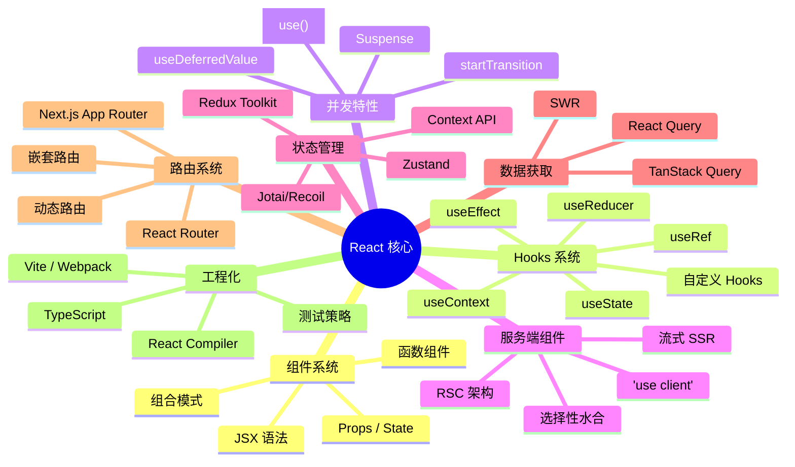

### 📈 React 技术栈完整知识体系

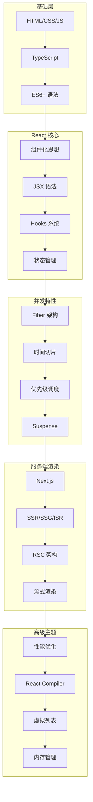

---

# 第一部分：核心基础

## 1️⃣ React 是什么？

### 📌 核心定义

**React** 是由 Facebook 开发的 JavaScript 库，用于构建用户界面。它通过**组件化思想**和**声明式编程**，帮助开发者高效构建交互式、动态的 Web 应用。

```typescript
// React 的三大特性：
// 1. 声明式：描述你想要什么，而不是如何实现
// 2. 组件化：封装独立可复用的 UI 单元
// 3. 虚拟 DOM：高效批量更新真实 DOM
```

### 🎯 React 的核心角色

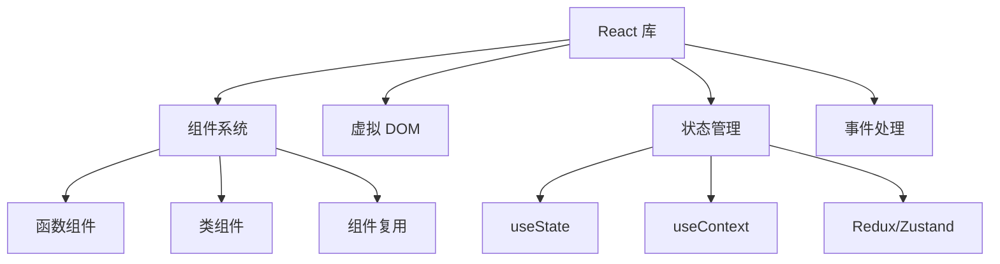

### 📊 React vs 其他框架

| 特性 | React | Vue | Angular |
|-----|-------|-----|---------|
| 学习曲线 | 🟡 中等 | 🟢 平缓 | 🔴 陡峭 |
| 灵活性 | ✅ 极高 | ⚠️ 中等 | ❌ 受限 |
| 生态系统 | ✅ 最庞大 | ⚠️ 中等 | ✅ 完整 |
| 性能 | ✅ 优秀 | ✅ 优秀 | ✅ 优秀 |
| 企业应用 | ✅ 完美 | ⚠️ 可行 | ✅ 完美 |

### 🗺️ 课程学习路径

```mermaid
graph LR
    A["第1章<br/>React 概述"] --> B["第2章<br/>环境搭建"]
    B --> C["第3章<br/>组件化基础"]
    C --> D["第4章<br/>高效渲染"]
    D --> E["第5章<br/>Tailwind CSS"]
    E --> F["第6章<br/>状态管理"]
    F --> G["第7章<br/>TypeScript"]
    G --> H["第8章<br/>路由系统"]
    H --> I["第9章<br/>数据请求"]
    I --> J["第10章<br/>Context API"]
    J --> K["第11章<br/>Hooks 深入"]
    K --> L["第12章<br/>useReducer"]
    L --> M["第13章<br/>Redux/RTK"]
    M --> N["第14章<br/>全栈实战"]
```

### 🎨 React 五大设计理念深度解析

React 的设计哲学可以概括为 **"UI = f(state)"** — 视图是状态函数的输出。这个简洁公式背后是五大设计理念的支撑。

#### ① 声明式（Declarative）

> **核心思想**：描述"想要什么"，而非"怎么做"

```jsx
// ❌ 命令式（jQuery 思维）
const div = document.createElement('div');
div.className = 'card';
div.textContent = 'Hello';
parent.appendChild(div);

// ✅ 声明式（React 思维）
function Card({ text }) {
  return <div className="card">{text}</div>;
}
```

**为什么重要？**
- **认知负荷降低**：开发者的精力集中在"什么状态对应什么 UI"，而非 DOM 操作的细节
- **可预测性**：给定相同 props + state，永远渲染相同结果
- **React 帮你做"脏活"**：Diff 对比、批量更新、DOM 操作全由框架管理
- **本质是抽象**：声明式将"如何操作 DOM"的复杂性封装在框架层

#### ② 组件化（Component-Based）

> **核心思想**：UI = 组件树（compose(Component₁, Component₂, ...)）

```jsx
// 组件 = 独立单元
function UserCard({ user }) {
  return (
    <Card>
      <Avatar src={user.avatar} />
      <Name>{user.name}</Name>
      <Stats posts={user.postCount} />
    </Card>
  );
}
```

**为什么重要？**
- **单一职责**：每个组件只做一件事，降低复杂度
- **可复用性**：组件像乐高积木，自由组合
- **可测试性**：每个组件独立测试，无需渲染整个页面
- **并行开发**：组件是天然的开发边界，团队可并行工作

#### ③ 虚拟 DOM（Virtual DOM）

> **核心思想**：在内存中维护 UI 的轻量级表示，批量计算差异后再操作真实 DOM

```
状态变化 → 新虚拟 DOM → Diff(旧虚拟DOM, 新虚拟DOM) → Patch(真实DOM)
```

**为什么不用直接操作 DOM？**
- 真实 DOM 操作极慢（浏览器需要重排/重绘）
- 每次 setState 都直接操作 DOM → 性能灾难
- 虚拟 DOM 在 JS 层面比较 → 只更新最小差异

**虚拟 DOM 的本质是"性能保底"**：React 通过虚拟 DOM 保证即使在没有手动优化的情况下，性能也不会太差。React 的设计原则是 **"默认足够快，需要极致时可手动优化"**。

**虚拟 DOM 的终极评价：** 它不是最快的 UI 更新方案，但它是**最优雅的折衷方案**——在开发体验（声明式）、性能（批量更新）、跨平台（抽象层）之间找到了最佳平衡点。React Compiler 的目标不是取代虚拟 DOM，而是让它的 Diff 范围更小、更精准。

#### ④ 函数式编程（Functional）

> **核心思想**：纯函数 + 不可变数据

```jsx
// ❌ 可变数据（违反函数式）
function BadList({ items }) {
  items.push('new item');  // 直接修改 props
  return <ul>{items.map(/* ... */)}</ul>;
}

// ✅ 不可变数据
function GoodList({ items }) {
  return <ul>{[...items, 'new item'].map(/* ... */)}</ul>;
}
```

**为什么重要？**
- **可预测性**：纯函数 → 相同输入永远相同输出
- **时间旅行调试**：不可变数据允许保存/回放状态快照
- **并发安全**：不可变数据天然支持 React 18+ 的并发渲染
- **易于推理**：无需追踪"谁修改了什么"

#### ⑤ 一次学习，随处编写（Learn Once, Write Anywhere）

```
React DOM      → Web 应用
React Native   → iOS / Android 原生应用
React Three    → 3D 场景（Three.js 封装）
React Ink      → 命令行终端 UI
React 360      → VR 应用
React PDF      → PDF 文档生成
```

**设计决策：** React 将"平台无关的 UI 逻辑"与"平台特定的渲染"彻底分离。`react` 包只关心组件树、状态、生命周期；渲染到哪个平台由 `react-dom`/`react-native` 等负责。这是 React 跨平台的架构基石。

---

### 💡 一个公式理解 React

```
UI = f(state)
│     │
▼     ▼
视图  纯函数  状态
```

- **f** 是 React 组件（纯函数）
- **state** 包括 props / state / context
- React 在 **f 变化时** 自动重新计算 UI

**与 Vue / Angular 的核心差异：**

| 维度 | React | Vue | Angular |
|------|-------|-----|---------|
| **UI 公式** | UI = f(state) | UI = template + state | UI = class + template |
| **更新时机** | setState → 全量重渲染 | Proxy 自动追踪 → 精确更新 | Zone.js → 全量检测 / Signals 精确 |
| **数据流** | 单向（强制） | 双向（v-model 可选） | 双向（[(ngModel)]） |
| **副作用** | useEffect 显式管理 | watchEffect 自动追踪 | 生命周期 + Observable |
| **范式的本质** | **纯函数式**: 状态快照不可变 | **响应式**: 状态变化自动追踪 | **面向对象**: 类 + 装饰器 |

---

## 2️⃣ React 版本迭代史（2013—2026）

> React 的演进史，就是前端声明式编程的进化史。

### 版本演进路线图

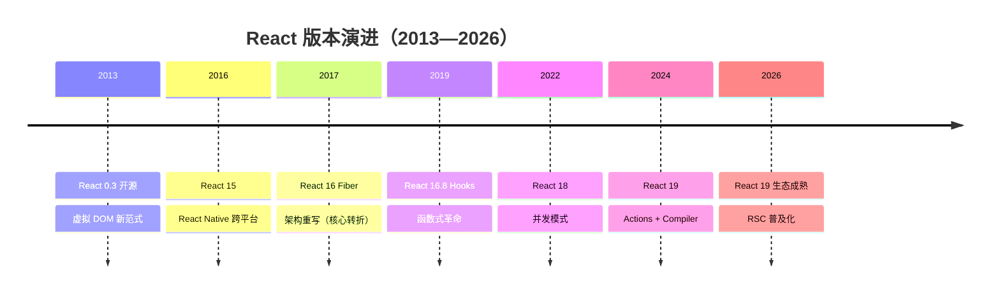

### 关键版本逐代解析

| 版本 | 年份 | 核心变化 | 对开发者的影响 |
|------|------|---------|--------------|
| **React 0.3** | 2013 | 虚拟 DOM，JSX 首次开源 | 开创性范式：声明式 UI |
| **React 15** | 2016 | DOM 重构 + React Native | 跨平台能力，一次学习随处编写 |
| **React 16** | 2017 | **Fiber 架构重写** | 可中断渲染，优先级调度 |
| **React 16.8** | 2019 | **Hooks** 发布 | 函数组件拥有状态，告别 class |
| **React 17** | 2020 | 渐进升级桥梁版 | 无重大新特性，平滑过渡 |
| **React 18** | 2022 | 并发模式、自动批处理 | 更好的用户体验，Suspense 完善 |
| **React 19** | 2024 | Actions、use()、React Compiler | 表单革新、自动记忆化、RSC |

### React 15 → 16 → 17 → 18 → 19 核心变化

| 维度 | 15 (DOM) | 16 (Fiber) | 17 | 18 (Concurrent) | 19 (Compiler) |
|------|---------|-----------|-----|-----------------|---------------|
| **架构** | Stack 栈递归 | Fiber 链表中断 | 桥接 | 并发模式 | 编译优化 |
| **渲染** | 同步不可中断 | 可中断/恢复 | 渐进升级 | 自动批处理 | 自动记忆化 |
| **组件** | class 为主 | class + function | 过渡 | 函数为主 | 函数 + Server |
| **状态** | setState | setState + Hooks(2019) | Hooks 完善 | useDeferredValue | Actions + use() |
| **编译** | 无 | 无 | React Refresh | 基础优化 | **React Compiler** |
| **生态** | 早期 | Redux 为主 | Context 增强 | Suspense + Streaming | RSC 主流 |

**Fiber 架构核心突破：**
```typescript
// Fiber 节点结构（简化）
interface Fiber {
  tag: WorkTag          // 节点类型
  key: string | null    // 唯一标识
  type: any             // 函数/类/原生标签
  stateNode: any        // 对应真实 DOM

  return: Fiber | null  // 父节点
  child: Fiber | null   // 第一个子节点
  sibling: Fiber | null // 右边兄弟节点

  pendingProps: any     // 新 props
  memoizedProps: any    // 旧 props
  memoizedState: any    // 状态
  updateQueue: any      // 更新队列

  lanes: Lanes          // 优先级
  alternate: Fiber | null // workInProgress 树关联
}
```

Fiber 将原本不可中断的**递归渲染**（Stack Reconciler）改造成了可中断/恢复的**链表遍历**（Fiber Reconciler），这是 React 并发能力的基石。

---

## 3️⃣ React 19 新特性详解

### 🌟 重要特性速览

```
React 19 (2024)
├─ React Compiler (自动优化)
├─ Actions (统一表单处理)
├─ use() Hook (异步数据)
├─ useOptimistic() (乐观更新)
├─ useFormStatus/useActionState (原 useFormState)
├─ Server Components 支持
└─ Web Components 增强
```

### 🔧 React Compiler 详解

#### 问题背景

手动优化 React 性能很复杂：

```typescript
import { memo, useCallback, useMemo } from 'react';

// ❌ 需要手动记忆化
const MyComponent = memo((props) => {
  const handleClick = useCallback(() => {}, []);
  const value = useMemo(() => expensiveComputation(), [dep]);
  return <Child onClick={handleClick} value={value} />;
});
```

#### 解决方案：Compiler 自动优化

```typescript
// ✅ 自动转换，无需手动记忆化
function MyComponent(props) {
  const handleClick = () => {};        // ← Compiler 自动缓存
  const value = expensiveComputation(); // ← Compiler 自动缓存
  return <Child onClick={handleClick} value={value} />;
}
```

**性能收益：**
- 自动消除不必要的重新渲染
- 减少 90%+ 的手写优化代码
- 编译时静态分析，极低运行时开销（仍需要运行时支持）

### 🎯 Actions 机制

```typescript
// 注意：useFormStatus 需要从 'react-dom' 导入
import { useFormStatus } from 'react-dom';
import { useActionState } from 'react';

async function submitForm(prevState, formData) {
  const username = formData.get('username');
  const password = formData.get('password');
  try {
    const response = await fetch('/api/login', {
      method: 'POST',
      body: JSON.stringify({ username, password })
    });
    return { success: true, message: '登录成功!' };
  } catch (error) {
    return { success: false, message: '登录失败' };
  }
}

export function LoginForm() {
  const [state, formAction] = useActionState(submitForm, null);
  const { pending } = useFormStatus();

  return (
    <form action={formAction}>
      <input name="username" />
      <button type="submit" disabled={pending}>
        {pending ? '登录中...' : '登录'}
      </button>
      {state?.message && <p>{state.message}</p>}
    </form>
  );
}
```

**改进点：**
- ✅ 自动加载状态管理
- ✅ 简化异步操作处理
- ✅ 内置乐观更新支持

### ⏳ `use()` Hook - 异步数据获取与 Context 读取

`use()` 是 React 19 新增的 Hook，可用于：
1. 读取 Promise（需配合 Suspense 使用）
2. 读取 Context（与 `useContext` 类似，但可在条件语句中调用）

```typescript
import { use, Suspense } from 'react';

// 方式 1：读取 Promise
function DataComponent() {
  const data = use(fetchPromise); // fetchPromise 是一个 Promise 对象
  return <div>{data.title}</div>;
}

// 方式 2：读取 Context（React 19 新用法）
function ThemedButton() {
  const theme = use(ThemeContext); // 也可用 useContext(ThemeContext)
  return <button style={{ color: theme }}>按钮</button>;
}
```

> ⚠️ **注意**：`use()` 可以在条件语句中调用（与 Hooks 规则不同），但 Promise 必须在 Suspense 边界内使用。

### ⏱️ React 18 vs 19 关键变化

| 特性 | React 18 (2022) | React 19 (2024) |
|------|-----------------|-----------------|
| 并发模式 | useTransition/useDeferredValue opt-in | 默认启用，并发特性为内置行为 |
| startTransition | ✅ | ✅ 增强 |
| use() | ❌ | ✅ |
| useOptimistic | ❌ | ✅ |
| Server Components | 实验性 | ✅ 稳定 |
| ref 传参 | forwardRef | 直接传 ref |
| Compiler | 实验性 | ✅ 自动 memo |

---

### 🚀 React 在 2026 年的最新进展

#### React 技术发展演进时间线

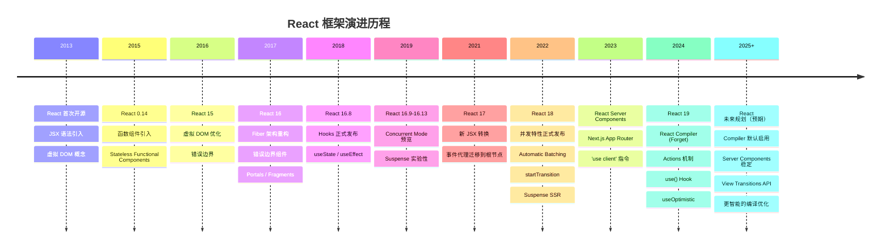

#### React Compiler 工作原理

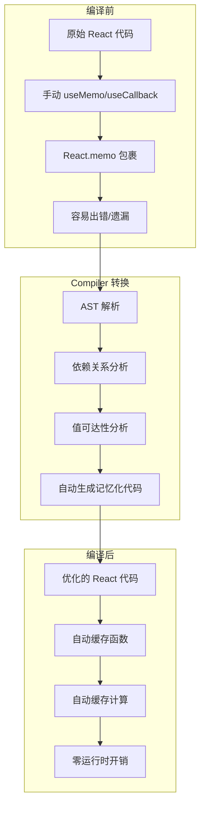

#### Compiler 优化对比

| 优化项 | 手动优化 | Compiler 自动优化 |
|--------|---------|------------------|
| 函数缓存 | useCallback | 自动识别并缓存 |
| 计算缓存 | useMemo | 自动识别并缓存 |
| 组件缓存 | React.memo | 自动包裹 |
| 依赖数组 | 手动维护 | 自动推导 |
| 性能收益 | 60-70% | 90%+（实验阶段） |
| 代码量 | 增加 30% | 减少 50% |

#### React Server Components 成为默认

```jsx
// app/page.jsx - 默认就是 Server Component
export default async function Page() {
  const data = await fetch('https://api.example.com/data')
  return <DataDisplay data={data} />
}

// app/component.client.jsx - 需要交互时标记
'use client'
export function InteractiveComponent() {
  const [count, setCount] = useState(0)
  return <button onClick={() => setCount(c => c + 1)}>{count}</button>
}
```

#### RSC 架构工作原理

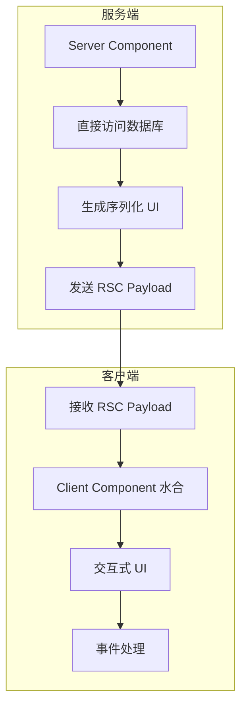

#### View Transitions API 集成（实验性）

> ⚠️ View Transitions API 在 React 19 中仍处于实验阶段，尚未正式发布。

```jsx
// React 实验性支持 View Transitions
// import { ViewTransition } from 'react'  // 尚未稳定

function PageTransition({ children }) {
  // 可用原生 document.startViewTransition 实现
  return <div>{children}</div>
}
```

#### 2026 年 React 生态工具链

| 工具 | 最新版本 | 关键变化 |
|------|----------|----------|
| React | 19 | Compiler 推荐启用，RSC 稳定 |
| Next.js | 15+ | App Router 默认，Turbopack |
| React Router | 7+ | 统一客户端/服务端路由 |
| Redux | 5+ | RTK 简化，更好的 TS |
| Zustand | 5+ | 更轻量，持久化内置 |
| TanStack Query | 5+ | 更精细缓存，SSR 优化 |
| React Testing Library | 16+ | 更好的异步测试 |

#### 2026 年前端框架格局

| 框架 | 定位 | 2026 状态 |
|------|------|-----------|
| React 19 + Next.js | 全栈应用首选 | 最广泛使用 |
| Angular 21 | 企业级应用 | Zoneless 默认，性能大幅提升 |
| Vue 3.6 + Nuxt 5 | 渐进式开发 | Vapor Mode 实验性，性能接近 Solid |
| Svelte 5 | 编译时优化 | Runes 响应式，轻量级首选 |
| Solid.js | 细粒度响应式 | 性能标杆，生态增长中 |
| Astro 5 | 内容型网站 | Islands 架构，零 JS 默认 |

#### React 生态全景图

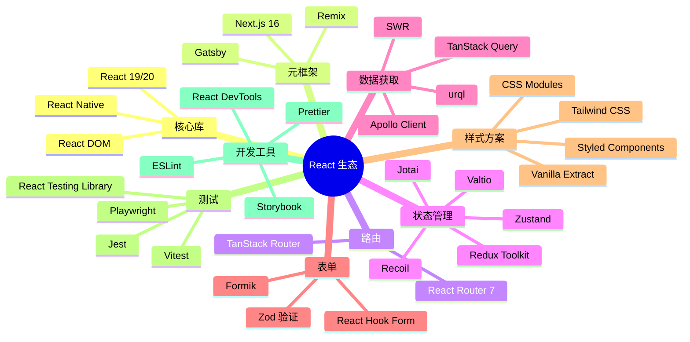

---

## 4️⃣ JSX 与 Babel

### 📝 JSX 详解

JSX 是 **JavaScript XML**，让你能在 JS 中写 HTML 结构。JSX 本质是 `React.createElement` 的语法糖，经 Babel 编译为 AST → createElement 调用 → React 元素对象 → 虚拟 DOM → 真实 DOM。

```jsx
// 原始 JSX
const element = <h1 className="greeting">Hello, {name}!</h1>;

// Babel 编译后
const element = React.createElement(
  "h1",
  { className: "greeting" },
  "Hello, ", name, "!"
);
```

### 🔄 JSX 转换流程图

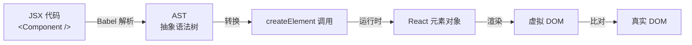

### ⚙️ JSX 规则

```jsx
// ✅ 使用 Fragment 避免多余 DOM
return (
  <>
    <p>Hello</p>
    <p>World</p>
  </>
);

// ✅ 属性驼峰命名
<div className="card" data-testid="card" />

// ✅ 表达式插值
<p>Count: {count * 2}</p>

// ✅ 条件渲染
{showTitle ? <h1>Title</h1> : null}
{showTitle && <h1>Title</h1>}
```

---

## 5️⃣ 组件与 Props 深度剖析

### 🧩 组件解剖

```typescript
import { ReactNode } from 'react';

interface CardProps {
  title: string;
  children: ReactNode;
  onClick?: (id: string) => void;
  disabled?: boolean;
}

function Card({ title, children, onClick, disabled = false }: CardProps) {
  return (
    <div className="card" style={{ opacity: disabled ? 0.5 : 1 }}>
      <h2>{title}</h2>
      <div className="card-body">{children}</div>
      <button onClick={() => onClick?.(title)} disabled={disabled}>Click Me</button>
    </div>
  );
}
```

### 📊 Props 完整对比

| 特征 | Props | State |
|------|-------|-------|
| 来源 | 父组件 | 组件自身 |
| 可修改 | ❌ 只读 | ✅ 可修改 |
| 默认值 | Component.defaultProps | useState 初值 |
| 影响重建 | ✅ Props 变化默认重新渲染 | ✅ State 变化默认重新渲染 |

### 🎯 Props 高级用法

```typescript
// 解构 + 默认值
function Card({ title = '默认标题', children }) {
  return (
    <div>
      <h2>{title}</h2>
      {children}
    </div>
  );
}

// Spread 批量传递
const productProps = { name: '手机', price: 2999, stock: 10 };
<ProductCard {...productProps} />

// 回调呼叫（子→父通信）
function Parent() {
  const handleChildEvent = (data: string) => console.log(data);
  return <Child onAction={handleChildEvent} />;
}

// 使用 eslint 防止 props 被非法修改
// eslint.config.js
// export default [{ rules: { "react/no-direct-mutation-state": "error" } }];
```

### 🔄 React.Component vs React.PureComponent

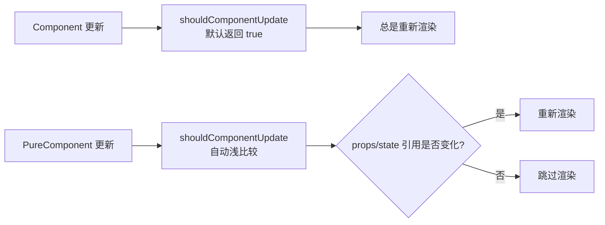

**注意：** PureComponent 进行**浅比较**，引用类型只比较地址。如需深比较的数据变更，必须创建新对象。

> ⚠️ **易错点**：直接在现有对象上修改属性然后 `setState` 不会触发 PureComponent 重新渲染。务必使用展开运算符或 Object.assign 创建新对象。

### 🆚 类组件与函数组件对比

> 面试高频考点：理解两种组件范式的本质差异与演进方向。

#### 语法与结构对比

```jsx
// 类组件（Class Component）
import React, { Component } from 'react';

class ClassCounter extends Component {
  constructor(props) {
    super(props);
    this.state = { count: 0 };
    this.handleClick = this.handleClick.bind(this);
  }

  handleClick() {
    this.setState({ count: this.state.count + 1 });
  }

  render() {
    return (
      <div>
        <p>Count: {this.state.count}</p>
        <button onClick={this.handleClick}>+1</button>
      </div>
    );
  }
}

// 函数组件（Function Component）+ Hooks
import { useState } from 'react';

function FunctionCounter() {
  const [count, setCount] = useState(0);

  return (
    <div>
      <p>Count: {count}</p>
      <button onClick={() => setCount(count + 1)}>+1</button>
    </div>
  );
}
```

#### 核心差异对比表

| 维度 | 类组件 | 函数组件 |
|------|--------|----------|
| **语法基础** | ES6 Class | 函数 |
| **状态管理** | `this.state` + `this.setState` | `useState` / `useReducer` |
| **生命周期** | `componentDidMount` 等方法 | `useEffect` Hook |
| **`this` 绑定** | 需要手动绑定（构造器或箭头函数） | 无 `this` 概念 |
| **代码量** | 较多（模板代码） | 简洁 |
| **可读性** | 生命周期分散 | 逻辑集中 |
| **性能** | 差异可忽略 | 差异可忽略（现代引擎中实例开销极小） |
| **复用机制** | HOC / Render Props | 自定义 Hooks |
| **React 19 支持** | ✅ 兼容 | ✅ **官方推荐** |

#### 生命周期对照

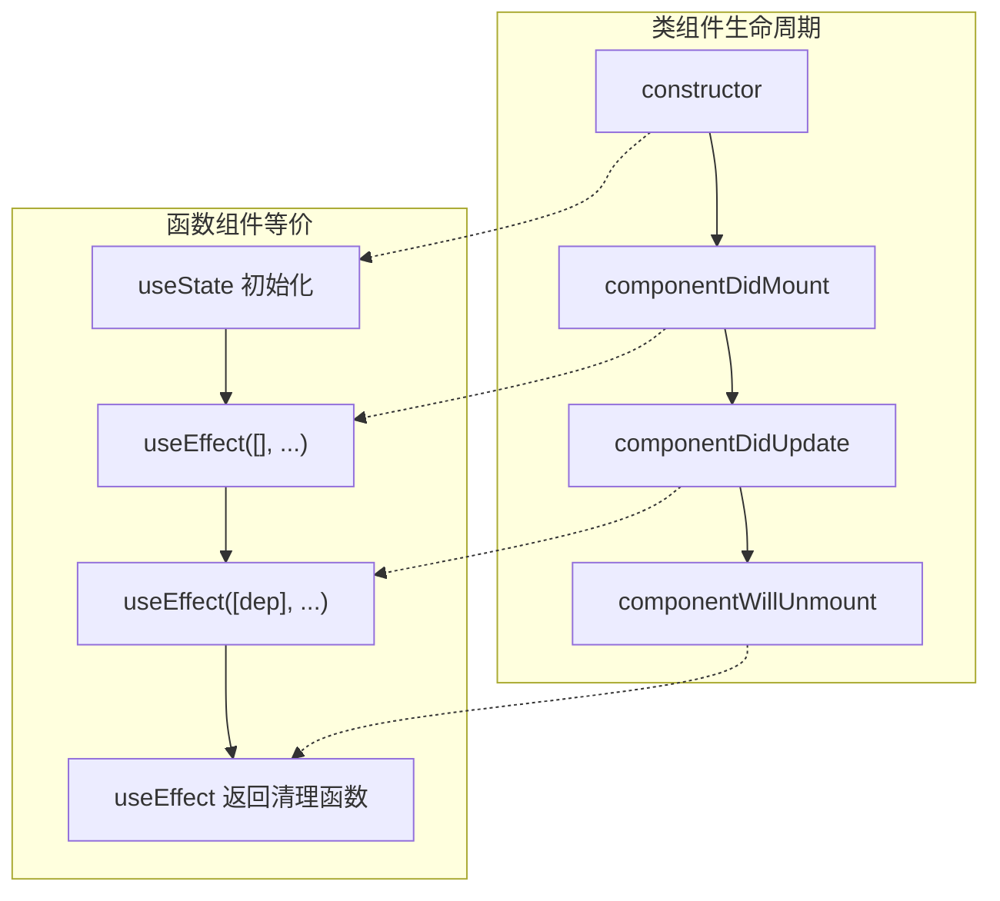

#### 状态管理对比

```jsx
// 类组件状态管理
class ClassComponent extends React.Component {
  constructor(props) {
    super(props);
    this.state = { user: null, loading: false };
    this.fetchUser = this.fetchUser.bind(this);
  }

  async fetchUser() {
    this.setState({ loading: true });
    const user = await getUser();
    this.setState({ user, loading: false });
  }

  render() {
    const { user, loading } = this.state;
    return loading ? <Spinner /> : <UserCard user={user} />;
  }
}

// 函数组件状态管理
function FunctionComponent() {
  const [user, setUser] = useState(null);
  const [loading, setLoading] = useState(false);

  const fetchUser = async () => {
    setLoading(true);
    const userData = await getUser();
    setUser(userData);
    setLoading(false);
  };

  return loading ? <Spinner /> : <UserCard user={user} />;
}
```

#### 选择建议

| 场景 | 推荐 | 原因 |
|------|------|------|
| 新项目开发 | ✅ **函数组件** | React 官方推荐，生态主流 |
| 需要复用状态逻辑 | ✅ **函数组件** | 自定义 Hooks 更灵活 |
| 维护旧项目 | ⚠️ 看情况 | 已有类组件无需强制重构 |
| 需要 Error Boundaries | ✅ **函数组件** | React 19 可通过 ErrorBoundary + `use()` 统一处理异步错误 |
| 需要 getSnapshotBeforeUpdate | ✅ **类组件** | 函数组件暂无等价 Hook |

> 💡 **React 演进方向**：从 React 16.8 Hooks 发布后，函数组件已成为主流。React 19 的 Compiler、Actions 等新特性均围绕函数组件设计。类组件不会被移除，但新功能不再为其扩展。

### 🧩有状态/无状态、受控/非受控组件

> 这两组概念是 React 组件分类的核心维度，面试高频考点。

#### 一、有状态组件 & 无状态组件

**状态（state）**：组件内部**私有数据**，数据变化驱动视图更新。

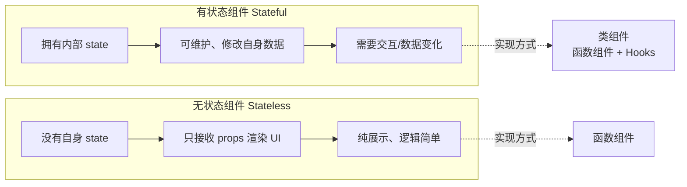

**无状态组件（Stateless）**

- 特点：**没有自身 state**，只接收 `props` 渲染 UI，纯展示
- 实现方式：**函数组件**（主流）
- 适用：纯展示、逻辑简单、仅接收父组件数据

```jsx
// 无状态函数组件
function Hello(props) {
  return <div>{props.name}</div>;
}
```

**有状态组件（Stateful）**

- 特点：**拥有内部 state**，可维护、修改自身数据
- 实现方式：
  1. 类组件（`class Component`）
  2. 函数组件 + **Hooks**（`useState`/`useReducer`，现在主流）
- 适用：需要交互、数据变化、表单、计数器等

```jsx
// 函数组件 + Hooks（有状态）
import { useState } from 'react';

function Counter() {
  const [count, setCount] = useState(0);
  return <button onClick={() => setCount(count + 1)}>{count}</button>;
}
```

| 维度 | 无状态组件 | 有状态组件 |
|------|-----------|-----------|
| 内部 state | ❌ 无 | ✅ 有 |
| 数据来源 | 仅 props | props + state |
| 实现方式 | 函数组件 | 类组件 / 函数组件 + Hooks |
| 可变数据 | ❌ 不可修改 | ✅ 可通过 setState/useState 修改 |
| 适用场景 | 展示、列表、文案 | 表单、计数器、交互逻辑 |
| 测试难度 | 🟢 简单 | 🟡 中等 |
| 性能 | 🟢 更快（无需跟踪状态） | 🟡 略慢（需要状态管理） |

#### 二、受控组件 & 非受控组件

> **专针对表单元素**：`input` / `textarea` / `select` 等表单标签，依据**数据来源**划分。

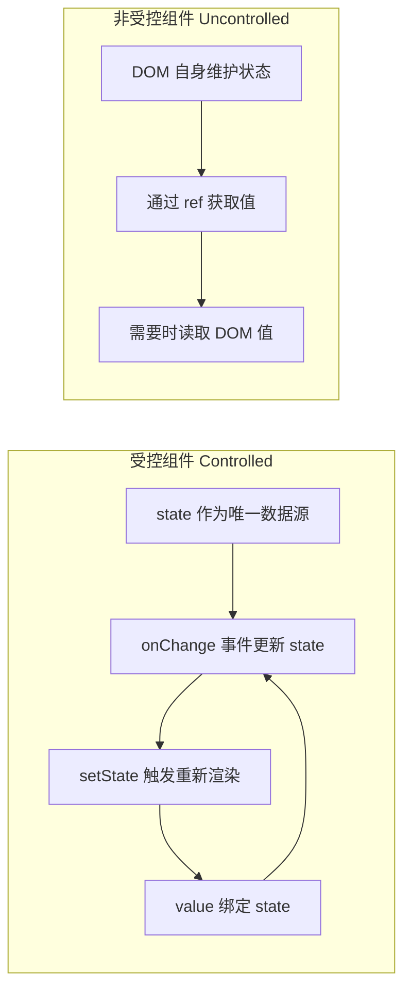

**受控组件（Controlled）**

- 核心：**表单值由 React state 完全控制**，视图 ↔ state 双向绑定
- 规则：
  1. `value` 绑定组件 state
  2. 通过 `onChange` 事件更新 state
- 特点：数据统一托管在 React，**完全可控**，推荐业务使用

```jsx
import { useState } from 'react';

function InputDemo() {
  const [val, setVal] = useState('');
  return (
    <input
      value={val}
      onChange={(e) => setVal(e.target.value)}
    />
  );
}
```

**非受控组件（Uncontrolled）**

- 核心：**表单值由 DOM 原生控制**，React 不托管 state
- 规则：
  1. 使用 `defaultValue` 设置默认值
  2. 通过 **ref** 直接获取 DOM 取值
- 特点：简单粗暴，适合**一次性取值**（文件上传、简单搜索）

```jsx
import { useRef } from 'react';

function InputDemo() {
  const inputRef = useRef(null);
  const getVal = () => {
    console.log(inputRef.current.value); // 直接读DOM
  };
  return (
    <>
      <input ref={inputRef} defaultValue="默认值" />
      <button onClick={getVal}>获取值</button>
    </>
  );
}
```

| 维度 | 受控组件 | 非受控组件 |
|------|---------|-----------|
| 数据源 | React state | DOM 自身 |
| 值获取 | state 变量 | ref 读取 |
| 表单验证 | ✅ 容易 | ❌ 困难 |
| 实时校验 | ✅ onChange 即时校验 | ❌ 需手动触发 |
| 动态控制 | ✅ 随意修改 value | ❌ 不方便 |
| 适用场景 | 复杂表单、需要验证 | 文件上传、简单一次性输入 |

#### 三、两组概念对比总结

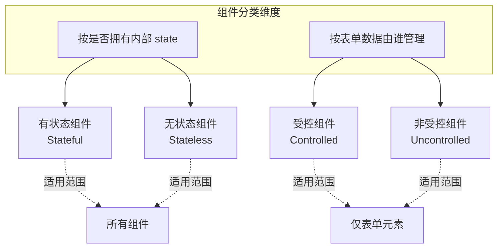

**快速记忆：**
- 无状态 = 纯展示，靠 props
- 有状态 = 内部存数据，靠 state/Hooks
- 受控表单 = state 管值，onChange 更新（推荐）
- 非受控表单 = DOM 管值，ref 取值

#### 四、使用场景建议

| 场景 | 推荐方案 | 原因 |
|------|---------|------|
| 大部分表单、复杂交互 | ✅ **受控组件** | 数据可控，支持验证、格式化 |
| 纯展示、列表、文案 | ✅ **无状态函数组件** | 简单高效，无需状态管理 |
| 文件上传 | ✅ **非受控组件** | 文件输入框是只读的，只能用 ref |
| 简单搜索框（无需实时校验） | ✅ **非受控组件** | 一次性取值，更简单 |
| 需要动态禁用/修改表单 | ✅ **受控组件** | value 由 state 控制，随心所欲 |
| 首次渲染后不再关心的值 | ✅ **非受控组件** | 无需维护 state |

---

## 6️⃣ React 事件机制

### 📌 合成事件（SyntheticEvent）

React 的事件并非绑定在真实的 DOM 节点上，而是通过**事件代理（Event Delegation）**的方式，将所有事件统一绑定在根容器上。当事件冒泡到根容器时，React 将事件内容封装并交由真正的处理函数运行。

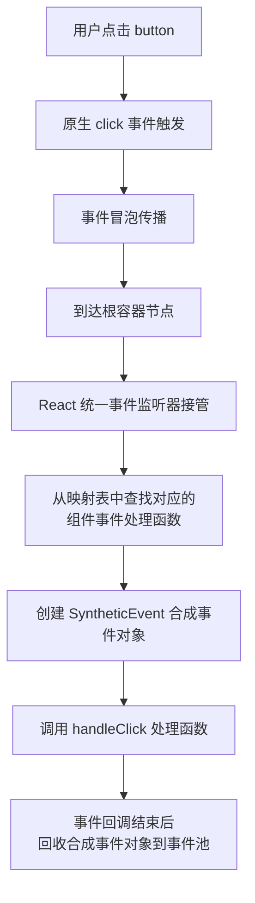

**React 事件与原生 HTML 事件的区别：**

| 对比项 | 原生事件 | React 事件 |
|--------|---------|-----------|
| 命名方式 | 全小写 `onclick` | 小驼峰 `onClick` |
| 处理函数语法 | 字符串 `"handle()"` | 函数 `{handleClick}` |
| 阻止默认行为 | `return false` | `e.preventDefault()` |
| 执行顺序 | 先执行 | 后执行（冒泡到根容器） |

> 💡 React 17+ 将事件代理从 document 迁移到 root DOM 容器，为微前端和多版本 React 共存提供更好的隔离性。

### 🔄 React 各版本事件代理演进

| 版本 | 事件代理位置 | 事件池机制 | 主要变化 |
|------|-------------|-----------|---------|
| **React 16** | `document` | ✅ 启用 | 所有事件代理到 document，需 `e.persist()` |
| **React 17** | `root DOM 容器` | ❌ **移除** | 事件代理从 document 迁移到 root，不再需要 persist |
| **React 18** | `root DOM 容器` | ❌ 已移除 | 同 React 17，保持向后兼容 |
| **React 19** | `root DOM 容器` | ❌ 已移除 | 同 React 18 |

#### 详细说明

**React 16 及以前：document 事件代理**
```jsx
// React 16：所有事件绑定在 document 上
<div id="root">
  <button onClick={handleClick}>Click</button>
</div>
// 事件监听器绑定在 document 上
// 事件冒泡到 document 后被 React 接管
```

**React 17+：root DOM 容器事件代理**
```jsx
// React 17+：事件绑定在 root 容器上
<div id="root">
  <button onClick={handleClick}>Click</button>
</div>
// 事件监听器绑定在 #root 上
// 更好的微前端隔离性，多版本 React 可共存
```

**React 18+：移除事件池**
```jsx
// React 16-17：需要调用 persist() 保留事件对象
function handleClick(e) {
  e.persist(); // 必须调用，否则异步访问会被回收
  setTimeout(() => {
    console.log(e.target); // React 16-17 需要 persist
  }, 100);
}

// React 18+：直接访问，无需 persist
function handleClick(e) {
  setTimeout(() => {
    console.log(e.target); // React 18+ 直接可用
  }, 100);
}
```

#### 事件代理迁移影响

| 影响场景 | React 16 | React 17+ | 解决方案 |
|---------|----------|-----------|---------|
| 微前端多版本共存 | ❌ 事件冲突 | ✅ 隔离 | 无 |
| 第三方库依赖 document 事件 | ✅ 正常工作 | ⚠️ 可能失效 | 使用 `stopPropagation` 阻止 |
| 事件对象异步访问 | ❌ 需要 persist | ✅ 直接访问 | 无 |

---

## 7️⃣ Hooks 系统完全指南

### 🎣 Hooks 工作原理

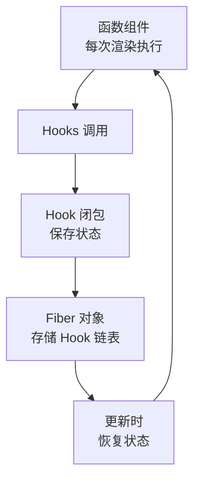

### 📍 useState - 状态管理

```typescript
const [count, setCount] = useState(0);

// 函数式初始化（避免重复计算）
const [state, setState] = useState(() => expensiveComputation());

// 更新函数（基于前一个状态）
setState(prev => prev + 1);
```

**规则 ⚠️：**
- ✅ 只在组件顶层调用
- ✅ 只在函数组件中调用
- ❌ 不要在循环、条件、嵌套函数中调用

### 📍 useEffect - 副作用管理

```typescript
function EffectDemo() {
  useEffect(() => {
    console.log('挂载 + 每次渲染后');
    return () => console.log('清理副作用');
  }); // 没有依赖数组，每次都运行

  useEffect(() => {
    console.log('仅在挂载时运行');
    return () => console.log('卸载时清理');
  }, []); // 空依赖数组，仅一次

  useEffect(() => {
    console.log('count 或 name 变化时运行');
  }, [count, name]); // 指定依赖

  return null;
}
```

**常见模式：**

```typescript
// 数据获取（处理竞态条件）
useEffect(() => {
  let ignore = false;
  fetchData().then(data => { if (!ignore) setData(data); });
  return () => { ignore = true; };
}, []);

// 事件监听
useEffect(() => {
  const handleResize = () => console.log('resized');
  window.addEventListener('resize', handleResize);
  return () => window.removeEventListener('resize', handleResize);
}, []);

// 定时器
useEffect(() => {
  const timer = setInterval(() => console.log('tick'), 1000);
  return () => clearInterval(timer);
}, []);

//⚠️ 闭包冻结（Stale Closure）风险
function StaleClosureExample() {
  const [count, setCount] = useState(0);

  // ❌ 闭包陷阱
  useEffect(() => {
    const timer = setInterval(() => {
      console.log(count); // 永远是 0！
      setCount(count + 1); // 永远是 1
    }, 1000);
    return () => clearInterval(timer);
  }, []); // 空依赖，count 被冻结

  // ✅ 使用函数式更新
  useEffect(() => {
    const timer = setInterval(() => {
      setCount(prev => prev + 1); // 正确的做法
    }, 1000);
    return () => clearInterval(timer);
  }, []);
}
```

### ⚡ StrictMode 双重调用

React 严格模式下，开发环境的 useEffect 会执行两次，用于检测副作用的清理是否正确。

```typescript
function App() {
  return (
    <StrictMode>
      <Main />
    </StrictMode>
  );
}

// 开发环境：组件挂载 → 卸载 → 重新挂载
// 用于检测：清理函数是否正确、是否有内存泄漏
```

### 🌊 useEffect 异步请求完全指南

#### 请求竞态与取消（AbortController）

```typescript
useEffect(() => {
  const controller = new AbortController();

  const fetchData = async () => {
    try {
      const res = await fetch('/api/products', {
        signal: controller.signal,
      });
      const data = await res.json();
      setProducts(data);
    } catch (err) {
      if (err instanceof DOMException && err.name === 'AbortError') {
        console.log('请求已取消');
        return;
      }
      console.error('请求失败', err);
    }
  };

  fetchData();

  return () => {
    controller.abort(); // 组件卸载时取消请求
  };
}, []);
```

#### 自定义 useDebounce 防抖 Hook

```typescript
function useDebounce<T>(value: T, delay: number): T {
  const [debouncedValue, setDebouncedValue] = useState(value);

  useEffect(() => {
    const timer = setTimeout(() => {
      setDebouncedValue(value);
    }, delay);

    return () => clearTimeout(timer);
  }, [value, delay]);

  return debouncedValue;
}

// 使用
function SearchComponent() {
  const [query, setQuery] = useState('');
  const debouncedQuery = useDebounce(query, 500);

  useEffect(() => {
    if (debouncedQuery) {
      searchAPI(debouncedQuery);
    }
  }, [debouncedQuery]);

  return <input value={query} onChange={e => setQuery(e.target.value)} />;
}
```

#### 搜索功能完整示例

```typescript
function SearchProducts() {
  const [query, setQuery] = useState('');
  const [results, setResults] = useState<Product[]>([]);
  const [loading, setLoading] = useState(false);

  useEffect(() => {
    if (!query) {
      setResults([]);
      return;
    }

    const fetchProducts = async () => {
      setLoading(true);
      try {
        const res = await fetch(`/api/products?q=${query}`);
        const data = await res.json();
        setResults(data);
      } catch (err) {
        console.error('搜索失败', err);
      } finally {
        setLoading(false);
      }
    };

    fetchProducts();
  }, [query]);

  return (
    <div>
      <input value={query} onChange={e => setQuery(e.target.value)} placeholder="搜索产品..." />
      {loading && <div>搜索中...</div>}
      <ul>
        {results.map(product => (
          <li key={product.id}>{product.name}</li>
        ))}
      </ul>
    </div>
  );
}
```

### 📍 useContext - 跨组件通信

```typescript
const ThemeContext = createContext<'light' | 'dark'>('light');

function ThemeProvider({ children }: { children: ReactNode }) {
  const [theme, setTheme] = useState<'light' | 'dark'>('light');
  return (
    <ThemeContext.Provider value={theme}>
      {children}
    </ThemeContext.Provider>
  );
}

function ThemedButton() {
  const theme = useContext(ThemeContext);
  return <button style={{
    background: theme === 'light' ? '#fff' : '#333',
    color: theme === 'light' ? '#000' : '#fff'
  }}>按钮</button>;
}
```

### 📍 useReducer - 复杂状态逻辑

```typescript
type Action =
  | { type: 'ADD_TODO'; payload: Todo }
  | { type: 'REMOVE_TODO'; payload: number }
  | { type: 'TOGGLE_TODO'; payload: number };

function todoReducer(state: State, action: Action): State {
  switch (action.type) {
    case 'ADD_TODO':
      return { ...state, todos: [...state.todos, action.payload] };
    case 'REMOVE_TODO':
      return { ...state, todos: state.todos.filter(t => t.id !== action.payload) };
    case 'TOGGLE_TODO':
      return {
        ...state,
        todos: state.todos.map(t => t.id === action.payload ? { ...t, completed: !t.completed } : t)
      };
    default:
      return state;
  }
}

function TodoApp() {
  const [state, dispatch] = useReducer(todoReducer, initialState);
  return (
    <div>
      {state.todos.map(todo => (
        <input type="checkbox" checked={todo.completed}
          onChange={() => dispatch({ type: 'TOGGLE_TODO', payload: todo.id })} />
      ))}
    </div>
  );
}

// 🎯 Action Creator 模式

// Action Creator 统一创建 action 对象，避免直接在组件中写 action 字面量。

const addItem = (product: Product): CartAction => ({
  type: 'ADD_ITEM',
  payload: product,
});

const removeItem = (id: number): CartAction => ({
  type: 'REMOVE_ITEM',
  payload: id,
});

const updateQuantity = (id: number, quantity: number): CartAction => ({
  type: 'UPDATE_QUANTITY',
  payload: { id, quantity },
});

// 使用
dispatch(addItem(product));
dispatch(removeItem(id));
```

#### 🎯 useReducer + Immer 草案模式

使用 `use-immer` 以可变语法写不可变逻辑：

```typescript
import { useImmerReducer } from 'use-immer';

function cartReducer(draft: CartState, action: CartAction) {
  switch (action.type) {
    case 'ADD_ITEM': {
      const existing = draft.items.find(i => i.id === action.payload.id);
      if (existing) {
        existing.quantity += 1;
      } else {
        draft.items.push({ ...action.payload, quantity: 1 });
      }
      break;
    }
    case 'REMOVE_ITEM':
      draft.items = draft.items.filter(i => i.id !== action.payload);
      break;
    case 'UPDATE_QUANTITY':
      const item = draft.items.find(i => i.id === action.payload.id);
      if (item) item.quantity = action.payload.quantity;
      break;
    case 'CLEAR_CART':
      draft.items = [];
      draft.coupon = null;
      draft.discount = 0;
      break;
  }
}
```

### 📍 useRef - 访问 DOM 和保存值

```typescript
// 访问 DOM 元素
function TextInput() {
  const inputRef = useRef<HTMLInputElement>(null);
  const focusInput = () => { inputRef.current?.focus(); };
  return <><input ref={inputRef} /><button onClick={focusInput}>Focus Input</button></>;
}

// 保存可变值（不触发重新渲染）
function StopWatch() {
  const intervalRef = useRef<number | null>(null);
  const start = () => { intervalRef.current = setInterval(() => {}, 1000); };
  const stop = () => { if (intervalRef.current) clearInterval(intervalRef.current); };
  return <><button onClick={start}>Start</button><button onClick={stop}>Stop</button></>;
}
```

### 📍 useCallback & useMemo - 性能优化

```typescript
// ❌ 问题：每次重新创建函数，导致子组件重新渲染
function Parent() {
  const handleClick = () => console.log('clicked');
  return <Child onClick={handleClick} />;
}

// ✅ useCallback 缓存函数
function Parent() {
  const handleClick = useCallback(() => console.log('clicked'), []);
  return <Child onClick={handleClick} />;
}

// ✅ useMemo 缓存计算结果
function Component() {
  const expensiveValue = useMemo(() => complexComputation(data), [data]);
  return <div>{expensiveValue}</div>;
}
```

### ⏱️ useEffect vs useLayoutEffect

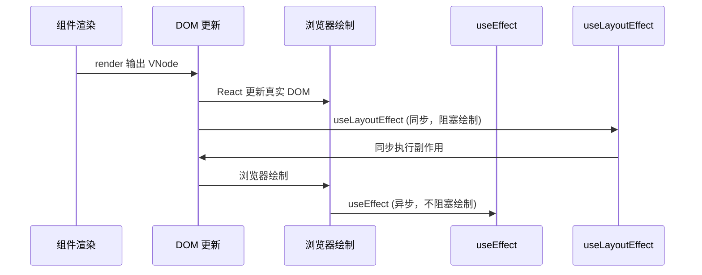

| 特性 | useEffect | useLayoutEffect |
|------|-----------|----------------|
| 执行时机 | 浏览器绘制后（异步） | DOM 更新后绘制前（同步） |
| 阻塞绘制 | ❌ 不阻塞 | ✅ 阻塞 |
| 适用场景 | 数据获取、订阅、日志 | DOM 测量、样式调整 |
| 推荐度 | ⭐ 优先使用 | ⚠️ 特殊场景使用 |

### 📋 Hooks 与 Class 生命周期对照

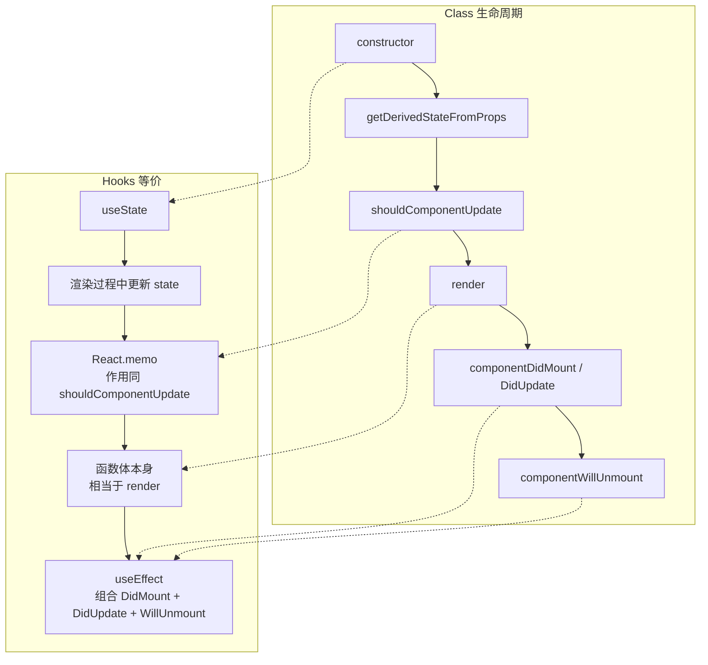

### 📍 React 19 新增 Hooks

```typescript
// use() - 异步数据获取
import { use } from 'react';
function DataComponent() {
  const data = use(fetchPromise);
  return <div>{data}</div>;
}

// useOptimistic() - 乐观更新
import { useOptimistic } from 'react';
function TodoList() {
  const [optimisticTodos, addOptimisticTodo] = useOptimistic(todos);
  const handleAdd = async (todo: Todo) => {
    addOptimisticTodo([...optimisticTodos, todo]);
    await saveTodo(todo);
  };
  return <ul>{optimisticTodos.map(todo => <li key={todo.id}>{todo.text}</li>)}</ul>;
}

// useFormStatus() - 表单状态（需从 react-dom 导入）
import { useFormStatus } from 'react-dom';
function SubmitButton() {
  const { pending } = useFormStatus();
  return <button disabled={pending}>{pending ? '提交中...' : '提交'}</button>;
}

// useActionState() - 表单结果（React 19 中 useFormState 已重命名）
import { useActionState } from 'react';
function LoginForm() {
  const [state, formAction] = useActionState(login, null);
  return (
    <form action={formAction}>
      <input name="email" type="email" />
      <button type="submit">登录</button>
      {state?.error && <p>{state.error}</p>}
    </form>
  );
}
```

---

## 8️⃣ 自定义 Hooks 设计模式

### 🎣 常用自定义 Hooks

```typescript
// useAsync - 异步操作管理
function useAsync<T>(asyncFunction: () => Promise<T>, immediate = true) {
  const [state, setState] = useState<{
    status: 'idle' | 'pending' | 'success' | 'error';
    data: T | null;
    error: Error | null;
  }>({ status: 'idle', data: null, error: null });

  const execute = useCallback(async () => {
    setState({ status: 'pending', data: null, error: null });
    try {
      const response = await asyncFunction();
      setState({ status: 'success', data: response, error: null });
      return response;
    } catch (error) {
      setState({ status: 'error', data: null, error: error as Error });
    }
  }, [asyncFunction]);

  useEffect(() => { if (immediate) execute(); }, [execute, immediate]);

  return { ...state, execute };
}

// useLocalStorage - 本地存储 Hook
function useLocalStorage<T>(key: string, initialValue: T) {
  const [storedValue, setStoredValue] = useState<T>(() => {
    try {
      const item = window.localStorage.getItem(key);
      return item ? JSON.parse(item) : initialValue;
    } catch { return initialValue; }
  });

  const setValue = (value: T | ((val: T) => T)) => {
    try {
      const valueToStore = value instanceof Function ? value(storedValue) : value;
      setStoredValue(valueToStore);
      window.localStorage.setItem(key, JSON.stringify(valueToStore));
    } catch (error) { console.error(error); }
  };

  return [storedValue, setValue] as const;
}

// useDebounce - 防抖 Hook
function useDebounce<T>(value: T, delay: number): T {
  const [debouncedValue, setDebouncedValue] = useState(value);
  useEffect(() => {
    const handler = setTimeout(() => setDebouncedValue(value), delay);
    return () => clearTimeout(handler);
  }, [value, delay]);
  return debouncedValue;
}
```

---

## 9️⃣ 生命周期与 Fiber 架构

### 🔄 组件生命周期（React 16+）

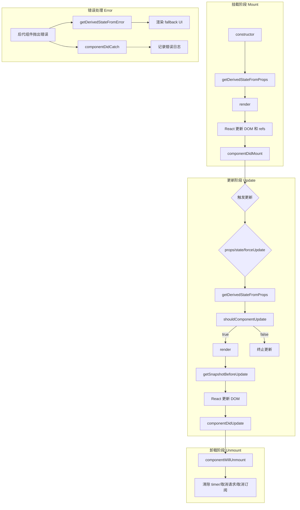

#### 废弃的三个生命周期（React 16.3+）

```mermaid
flowchart LR
    dep["废弃的三个生命周期"] --> W1["componentWillMount"]
    dep --> W2["componentWillReceiveProps"]
    dep --> W3["componentWillUpdate"]

    W1 -.->|替代| R1["constructor / componentDidMount"]
    W2 -.->|替代| R2["getDerivedStateFromProps"]
    W3 -.->|替代| R3["getSnapshotBeforeUpdate + componentDidUpdate"]
```

**核心废弃原因（Fiber 架构导致）：**

React 15 的 Stack Reconciler 采用递归同步渲染，一旦开始就不能中断。而 Fiber 架构将渲染过程改造为**可中断的异步任务**，这意味着 `render` 阶段可能被打断后重新执行。这直接导致了三个 `will` 生命周期在一次更新中可能被**多次调用**，产生严重的副作用问题：

```
Stack Reconciler (React 15):
  开始渲染 → 同步执行 → 完成
  生命周期只调用一次 ✅

Fiber Reconciler (React 16+):
  开始渲染 → 执行一部分 → 浏览器需要控制权 → 暂停
  → 恢复渲染 → 重新执行 render 前的生命周期
  → 生命周期可能被调用多次 ❌
```

**逐个分析：**

| 废弃方法 | 问题 | 替代方案 |
|---------|------|---------|
| `componentWillMount` | 在 render 前执行，可能因中断被调用多次；SSR 中不触发 | `constructor` 或 `componentDidMount` |
| `componentWillReceiveProps` | 每次 props 变化前调用，容易用 `this.state` 存派生值，破坏单一数据源；可被多次调用 | `static getDerivedStateFromProps` 或 `getDerivedStateFromProps` |
| `componentWillUpdate` | render 前调用，无法可靠读取 DOM；可能被多次调用 | `getSnapshotBeforeUpdate` + `componentDidUpdate` |

##### 1. componentWillMount → constructor / componentDidMount

```javascript
// ❌ 废弃写法
class UserProfile extends React.Component {
  componentWillMount() {
    // 危险：Fiber 中可能被多次调用
    this.fetchData(this.props.userId);  // 重复请求
    this.state = { data: null };         // 可能被覆盖
  }

  fetchData(userId) {
    fetch(`/api/users/${userId}`)
      .then(res => res.json())
      .then(data => this.setState({ data }));
  }

  render() {
    return <div>{this.state.data?.name || 'Loading...'}</div>;
  }
}

// ✅ 替代方案 1：异步操作放 componentDidMount
class UserProfile extends React.Component {
  state = { data: null };

  componentDidMount() {
    this.fetchData(this.props.userId);  // 只调用一次
  }

  fetchData(userId) {
    fetch(`/api/users/${userId}`)
      .then(res => res.json())
      .then(data => this.setState({ data }));
  }

  render() {
    return <div>{this.state.data?.name || 'Loading...'}</div>;
  }
}

// ✅ 替代方案 2：同步初始化放 constructor
class UserProfile extends React.Component {
  constructor(props) {
    super(props);
    // 同步初始化 state
    this.state = {
      data: null,
      derivedValue: computeExpensiveValue(props.someProp)
    };
  }
  // ...
}
```

**对比：**

| 场景 | componentWillMount | constructor | componentDidMount |
|------|-------------------|-------------|-------------------|
| 初始化 state | ✅ 可以（但 constructor 更早） | ✅ 最佳 | ❌ 已渲染 |
| 异步请求 | ⚠️ 重复调用 | ❌ 不合适 | ✅ 只执行一次 |
| DOM 操作 | ❌ DOM 不存在 | ❌ DOM 不存在 | ✅ DOM 已挂载 |
| 事件监听 | ❌ 组件未挂载 | ❌ 组件未挂载 | ✅ 可以绑定 |

##### 2. componentWillReceiveProps → getDerivedStateFromProps / 直接计算

```javascript
// ❌ 废弃写法：破坏单一数据源
class EmailInput extends React.Component {
  state = {
    email: this.props.email  // 用 state 存派生数据
  };

  componentWillReceiveProps(nextProps) {
    // 每次 props 变化都会调用
    if (nextProps.email !== this.props.email) {
      this.setState({
        email: nextProps.email  // 派生 state，来源不唯一
      });
    }
  }

  render() {
    return <input value={this.state.email} />;
  }
}
// 问题：email 有 props 和 state 两个来源，读哪个？

// ✅ 方案 1：getDerivedStateFromProps（有派生需求时）
class EmailInput extends React.Component {
  state = { email: '' };

  static getDerivedStateFromProps(props, state) {
    // 返回要更新 state 的对象，返回 null 表示不更新
    if (props.email !== state.prevEmail) {
      return {
        email: props.email,
        prevEmail: props.email  // 记住上一次的 props
      };
    }
    return null;
  }

  render() {
    return <input value={this.state.email} />;
  }
}

// ✅ 方案 2：完全受控组件（推荐）
function EmailInput({ email, onChange }) {
  return <input value={email} onChange={e => onChange(e.target.value)} />;
}

// ✅ 方案 3：非受控组件 + key 重置
function EmailInput({ email, onChange }) {
  const [localValue, setLocalValue] = useState(email);
  // key 变化时重新创建组件
  return <input key={email} defaultValue={email}
    onChange={e => setLocalValue(e.target.value)} />;
}
```

**componentWillReceiveProps vs getDerivedStateFromProps 对比：**

| 特性 | componentWillReceiveProps | getDerivedStateFromProps |
|------|--------------------------|------------------------|
| 调用时机 | 接收新 props 后、render 前 | 接收新 props 后、render 前 |
| 返回值 | 无 | 返回要更新 state 的对象或 null |
| 访问 this | ✅ 可以访问当前 props/state | ❌ 静态方法，无法访问 this |
| 副作用 | ✅ 可以（但可能导致重复调用） | ❌ 纯函数，禁止副作用 |
| 多次调用 | ✅ Fiber 中可能多次 | ✅ 多次调用但纯函数无影响 |
| 推荐度 | ⚠️ 废弃 | ⭐ 有派生需求时使用 |

> ⚠️ **重要**：`getDerivedStateFromProps` 应极少使用。大多数场景下，**完全受控组件**（props 作为唯一数据源）才是正确答案。

##### 3. componentWillUpdate → getSnapshotBeforeUpdate + componentDidUpdate

```javascript
// ❌ 废弃写法：无法可靠获取 DOM
class ChatList extends React.Component {
  state = { messages: [] };

  componentWillUpdate() {
    // 危险：Fiber 中可能被多次调用
    // 且此时 DOM 还未更新，但无法获取可靠的滚动位置
    this.scrollHeight = this.list.scrollHeight;  // 可能不准确
  }

  render() {
    return (
      <div ref={el => this.list = el}>
        {this.state.messages.map(msg => <div key={msg.id}>{msg.text}</div>)}
      </div>
    );
  }

  componentDidUpdate() {
    // 如果新消息到来，恢复滚动位置
    if (this.shouldScroll) {
      this.list.scrollTop = this.scrollHeight;
    }
  }
}

// ✅ 正确写法：getSnapshotBeforeUpdate
class ChatList extends React.Component {
  state = { messages: [] };

  // 在 React 更新 DOM 之前同步调用
  // 返回值会传给 componentDidUpdate 的第三个参数
  getSnapshotBeforeUpdate(prevProps, prevState) {
    const list = this.listRef.current;
    if (prevProps.messages.length < this.props.messages.length) {
      // 新消息到来，记录当前滚动信息
      return {
        scrollHeight: list.scrollHeight,
        scrollTop: list.scrollTop,
        clientHeight: list.clientHeight
      };
    }
    return null;
  }

  componentDidUpdate(prevProps, prevState, snapshot) {
    // snapshot 就是 getSnapshotBeforeUpdate 返回的值
    if (snapshot) {
      const list = this.listRef.current;
      // 如果之前在底部，新消息后自动滚到底部
      const isAtBottom =
        snapshot.scrollTop + snapshot.clientHeight >= snapshot.scrollHeight - 50;
      if (isAtBottom) {
        list.scrollTop = list.scrollHeight;
      }
    }
  }

  render() {
    return (
      <div ref={this.listRef}>
        {this.props.messages.map(msg => <div key={msg.id}>{msg.text}</div>)}
      </div>
    );
  }
}
```

**componentWillUpdate vs getSnapshotBeforeUpdate 对比：**

| 特性 | componentWillUpdate | getSnapshotBeforeUpdate |
|------|---------------------|------------------------|
| 调用时机 | render 前（DOM 更新前） | render 后、DOM 更新前（Pre-commit 阶段） |
| 读取 DOM | ⚠️ 可读但不可靠（可能被多次调用） | ✅ 可靠（只调用一次） |
| 返回值 | 无 | 返回值传给 componentDidUpdate |
| 适用场景 | 几乎没有安全场景 | DOM 测量/快照 |
| 推荐度 | ⚠️ 废弃 | ⭐ 唯一的 DOM 快照方案 |

#### 新旧生命周期完整对比

```mermaid
flowchart TD
    subgraph "Class 生命周期 (React 16+)"
        C1["constructor"]
        C2["static getDerivedStateFromProps<br/>(替代 componentWillReceiveProps)"]
        C3["shouldComponentUpdate"]
        C4["render"]
        C5["getSnapshotBeforeUpdate<br/>(替代 componentWillUpdate)"]
        C6["componentDidMount / DidUpdate"]
        C7["componentWillUnmount"]
        C8["componentDidCatch / getDerivedStateFromError"]
    end

    subgraph Hooks 等价实现
        H1["useState 初始化<br/>(替代 constructor 中的 state 初始化)"]
        H2["useEffect + 依赖项<br/>(自动跟踪 props 变化)"]
        H3["React.memo + useMemo<br/>(替代 shouldComponentUpdate)"]
        H4["函数体本身<br/>(替代 render)"]
        H5["useEffect 清理函数<br/>(替代 componentWillUnmount)"]
        H6["useRef<br/>(替代 getSnapshotBeforeUpdate 中的 DOM 测量)"]
    end

    C1 -.-> H1
    C2 -.-> H2
    C3 -.-> H3
    C4 -.-> H4
    C5 -.-> H6
    C6 -.-> H2
    C7 -.-> H5
```

#### Hooks 替换 Class 生命周期完整示例

```javascript
// ========== Class 组件写法 ==========
class TimerWithLifecycle extends React.Component {
  constructor(props) {
    super(props);
    this.state = { seconds: 0, message: '' };
  }

  static getDerivedStateFromProps(props, state) {
    if (props.resetOnPropChange !== state.prevProp) {
      return { seconds: 0, prevProp: props.resetOnPropChange };
    }
    return null;
  }

  componentDidMount() {
    this.interval = setInterval(() => {
      this.setState(prev => ({ seconds: prev.seconds + 1 }));
    }, 1000);

    document.title = `Timer: ${this.state.seconds}s`;
  }

  componentDidUpdate(prevProps, prevState) {
    if (prevState.seconds !== this.state.seconds) {
      document.title = `Timer: ${this.state.seconds}s`;
    }
  }

  componentWillUnmount() {
    clearInterval(this.interval);
  }

  getSnapshotBeforeUpdate() {
    return window.scrollY;  // DOM 快照
  }

  render() {
    return <div>Seconds: {this.state.seconds}</div>;
  }
}

// ========== Hooks 写法 ==========
function TimerWithHooks({ resetOnPropChange }) {
  const [seconds, setSeconds] = useState(0);

  // 等价 getDerivedStateFromProps
  const prevPropRef = useRef(resetOnPropChange);
  useEffect(() => {
    if (resetOnPropChange !== prevPropRef.current) {
      setSeconds(0);
      prevPropRef.current = resetOnPropChange;
    }
  }, [resetOnPropChange]);

  // 等价 componentDidMount + componentDidUpdate + componentWillUnmount
  useEffect(() => {
    const interval = setInterval(() => {
      setSeconds(prev => prev + 1);
    }, 1000);

    document.title = `Timer: ${seconds}s`;

    return () => clearInterval(interval);  // 等价 componentWillUnmount
  }, [seconds]);

  return <div>Seconds: {seconds}</div>;
}
```

### 🏗️ Fiber 架构

Fiber 架构将虚拟 DOM 从递归不可中断的 Stack Reconciler 重构为可中断的 Fiber 链表结构，引入时间切片和优先级调度机制。

```mermaid
flowchart TB
    subgraph React 15: Stack Reconciler
        S1["递归遍历 Virtual DOM"] --> S2["同步更新 DOM"]
        S2 --> S3["过程中不可中断"]
        S3 --> S4["长时间占用主线程<br/>导致卡顿/掉帧"]
    end

    subgraph React 16+: Fiber Reconciler
        F1["虚拟 DOM → Fiber 链表"] --> F2["可中断的异步渲染"]
        F2 --> F3["时间切片 + 优先级调度"]
        F3 --> F4{"浏览器空闲?"}
        F4 -->|是| F5["继续执行 Fiber 工作单元"]
        F4 -->|否| F6["让出主线程"]
        F5 --> F7["完成 Reconciliation"]
        F7 --> F8["一次性提交 DOM 更新"]
    end
```

**Fiber 架构核心概念：**
- **Fiber Node**：每个组件对应一个 Fiber 节点，构成 Fiber 树（单链表结构）
- **双缓冲**：`current` 树（当前 UI）和 `workInProgress` 树（内存中构建的新树）
- **时间切片（Time Slicing）**：将一个渲染任务拆分成多个小单元，每执行完一个单元就让出主线程
- **优先级调度**：任务分优先级，高优先级任务（如用户输入）可打断低优先级任务（如数据加载）

### 🔄 Reconciliation（协调）过程

```mermaid
flowchart TD
    A["触发更新: setState / props 变化"] --> B["进入 Render 阶段<br/>可中断"]
    B --> C["从 Fiber Root 开始遍历"]
    C --> D["构建 workInProgress 树"]
    D --> E{"节点是否可复用?"}
    E -->|是| F["复用旧 Fiber，更新 props"]
    E -->|否| G["创建新 Fiber"]
    F --> H["收集 effectTag"]
    G --> H
    H --> I{"还有更多节点?"}
    I -->|是| J["深度优先遍历"]
    J --> D
    I -->|否| K["workInProgress 树构建完成"]
    K --> L["进入 Commit 阶段<br/>不可中断"]
    L --> M["根据 effect 链表执行 DOM 操作"]
    M --> N["current 指针切换"]
    N --> O["触发生命周期回调"]
```

| 阶段 | 是否可中断 | 主要工作 |
|------|-----------|---------|
| Render | 可中断 | 构建 workInProgress 树，diff 对比，标记 effect |
| Pre-commit | 不可中断 | 读取 DOM 快照（getSnapshotBeforeUpdate） |
| Commit | 不可中断 | 执行 DOM 操作，触发生命周期 |

---

## 🔟 代码复用方案对比

### 🧩 HOC vs Render Props vs Hooks

```mermaid
flowchart LR
    subgraph 代码复用方案演进
        A["HOC<br/>高阶组件"] --> B["Render Props"]
        B --> C["Hooks<br/>React 16.8+"]
    end

    A --> A1["优点: 逻辑复用<br/>不影响内部逻辑"]
    A --> A2["缺点: props 命名冲突<br/>嵌套层级深"]

    B --> B1["优点: 数据共享灵活"]
    B --> B2["缺点: 嵌套地狱"]

    C --> C1["优点: 简洁直观<br/>解决props覆盖和嵌套地狱"]
    C --> C2["限制: 只能在顶层调用"]
```

| 维度 | HOC | Render Props | Hooks |
|------|-----|-------------|-------|
| 模式 | 装饰器模式 | 函数作为 children | 组合式函数 |
| 命名冲突 | ⚠️ 容易冲突 | ✅ 不冲突 | ✅ 不冲突 |
| 嵌套层级 | 深 | 深（嵌套地狱） | 浅 |
| 模板代码 | 多 | 多 | 少 |
| 推荐度 | ⭐⭐ | ⭐ | ⭐⭐⭐⭐⭐ |

**HOC 示例：**

```javascript
function withSubscription(WrappedComponent, selectData) {
  return class extends React.Component {
    constructor(props) {
      super(props)
      this.state = { data: selectData(DataSource, props) }
    }
    render() {
      return <WrappedComponent data={this.state.data} {...this.props} />
    }
  }
}
```

**Render Props 示例：**

```javascript
class DataProvider extends React.Component {
  state = { name: 'Tom' }
  render() {
    return <div>{this.props.render(this.state)}</div>
  }
}
// 使用: <DataProvider render={data => <h1>Hello {data.name}</h1>} />
```

---

# 第二部分：高级特性

## 1️⃣ Context API 深度应用

### 🔄 Context 完整工作流

```mermaid
graph TD
    A["createContext"] -->|创建| B["Context 对象"]
    B --> C["Provider 组件"]
    B --> D["useContext Hook"]

    C -->|提供| E["value"]
    E -->|传递给| F["后代组件"]
    D -->|消费| F
    F -->|获取| E
```

### 🎯 实战：主题系统

```typescript
// theme-context.ts
interface ThemeContextType {
  theme: { primary: string; background: string; text: string };
  toggleTheme: () => void;
  currentThemeName: 'light' | 'dark';
}

const ThemeContext = createContext<ThemeContextType | undefined>(undefined);

const themes = {
  light: { primary: '#007bff', background: '#ffffff', text: '#000000' },
  dark: { primary: '#0d6efd', background: '#1a1a1a', text: '#ffffff' }
};

export function ThemeProvider({ children }: { children: ReactNode }) {
  const [themeName, setThemeName] = useState<'light' | 'dark'>('light');
  const value: ThemeContextType = {
    theme: themes[themeName],
    toggleTheme: () => setThemeName(prev => prev === 'light' ? 'dark' : 'light'),
    currentThemeName: themeName
  };
  return <ThemeContext.Provider value={value}>{children}</ThemeContext.Provider>;
}

export function useTheme() {
  const context = useContext(ThemeContext);
  if (!context) throw new Error('useTheme must be used within ThemeProvider');
  return context;
}

### 🛒 实战：购物车 Context

interface CartItem {
  id: number;
  name: string;
  price: number;
  quantity: number;
  image: string;
}

interface CartContextType {
  items: CartItem[];
  addItem: (item: CartItem) => void;
  removeItem: (id: number) => void;
  updateQuantity: (id: number, quantity: number) => void;
  clearCart: () => void;
  totalAmount: number;
  totalCount: number;
}

const CartContext = createContext<CartContextType | undefined>(undefined);

export function CartProvider({ children }: { children: React.ReactNode }) {
  const [items, setItems] = useState<CartItem[]>([]);

  const addItem = useCallback((item: CartItem) => {
    setItems(prev => {
      const existing = prev.find(i => i.id === item.id);
      if (existing) {
        return prev.map(i =>
          i.id === item.id ? { ...i, quantity: i.quantity + item.quantity } : i
        );
      }
      return [...prev, item];
    });
  }, []);

  const totalAmount = useMemo(() =>
    items.reduce((sum, item) => sum + item.price * item.quantity, 0),
    [items]
  );

  const totalCount = useMemo(() =>
    items.reduce((sum, item) => sum + item.quantity, 0),
    [items]
  );

  return (
    <CartContext.Provider value={{
      items, addItem,
      removeItem: (id) => setItems(prev => prev.filter(i => i.id !== id)),
      updateQuantity: (id, qty) => setItems(prev =>
        prev.map(i => i.id === id ? { ...i, quantity: qty } : i)
      ),
      clearCart: () => setItems([]),
      totalAmount, totalCount,
    }}>
      {children}
    </CartContext.Provider>
  );
}

export function useCart() {
  const context = useContext(CartContext);
  if (!context) throw new Error('useCart must be used within CartProvider');
  return context;
}
```

#### 购物车持久化（localStorage）

```typescript
export function CartProvider({ children }: { children: React.ReactNode }) {
  const [items, setItems] = useState<CartItem[]>(() => {
    try {
      const saved = localStorage.getItem('cart');
      return saved ? JSON.parse(saved) : [];
    } catch {
      return [];
    }
  });

  // 自动持久化
  useEffect(() => {
    localStorage.setItem('cart', JSON.stringify(items));
  }, [items]);

  // 多标签同步
  useEffect(() => {
    const handleStorage = (e: StorageEvent) => {
      if (e.key === 'cart' && e.newValue) {
        setItems(JSON.parse(e.newValue));
      }
    };
    window.addEventListener('storage', handleStorage);
    return () => window.removeEventListener('storage', handleStorage);
  }, []);

  // ... rest of the provider
}
```

---

## 2️⃣ 状态管理完全指南

### 📊 状态管理全景图

```
┌─────────────────────────────────────────────────────────────┐
│                    React 状态管理生态（2026）                  │
├──────────────┬──────────────┬──────────────┬────────────────┤
│  本地状态      │  跨组件共享    │  全局状态      │  服务器状态      │
│              │              │              │                │
│ useState     │ Context API  │ Redux        │ TanStack Query│
│ useReducer   │ useMemo(值)  │ Zustand      │ SWR            │
│ useRef       │              │ Jotai        │ Apollo         │
│              │              │ MobX         │ RTK Query      │
│              │              │ Valtio       │                │
│              │              │ Legend State │                │
└──────────────┴──────────────┴──────────────┴────────────────┘
```

### 🧭 状态管理分类与演进

**四个象限分类法：**

| 象限 | 范围 | 典型方案 | 核心问题 |
|------|------|---------|---------|
| **本地** | 单个组件内 | useState / useReducer / useRef | 表单输入、UI 开关 |
| **共享** | 组件树内 | Context API / 组合提升 | 主题、语言、用户 |
| **全局（客户端）** | 整个应用 | Redux / Zustand / Jotai / MobX | 缓存数据、复杂交互 |
| **全局（服务端）** | 服务端来源 | TanStack Query / SWR / Apollo | API 数据同步 |

**版本演进时间线：**

```
2014: Redux 发布（Flux 理念 + 单一状态树）
2015: MobX 发布（响应式可变状态）
2016: Redux 成为 React 标配
2018: React Context + useReducer（内置替代方案）
2019: Recoil 发布（原子化先驱，Meta）
      SWR 发布（stale-while-revalidate）
2020: Zustand 发布（极简 API，~1KB）
      Jotai 发布（原子化改进，Recoil 竞争者）
      TanStack Query v3（服务器状态管理）
2021: Valtio 发布（Proxy 响应式）
      Redux Toolkit 成为官方推荐
2022: Legend State 发布（高性能信号式）
2023: Zustand v4 + Middleware
      Jotai v2（突破性改进）
2024-2026: React 19 + Signal 状态库融合
           Server State + Client State 界限模糊
           Zustand v5 / Jotai v2 稳定
```

### 💡 实战：useState 状态模式

#### SKU 选择器

```typescript
interface SKU {
  color: string;
  size: string;
  stock: number;
  price: number;
}

function SKUSelector({ skus }: { skus: SKU[] }) {
  const [selectedColor, setSelectedColor] = useState('');
  const [selectedSize, setSelectedSize] = useState('');

  const availableSizes = useMemo(() =>
    [...new Set(skus.filter(s => !selectedColor || s.color === selectedColor).map(s => s.size))],
    [skus, selectedColor]
  );

  const currentSKU = useMemo(() =>
    skus.find(s => s.color === selectedColor && s.size === selectedSize),
    [skus, selectedColor, selectedSize]
  );

  return (
    <div>
      <div className="mb-4">
        <label className="block mb-2">颜色：</label>
        <div className="flex gap-2">
          {[...new Set(skus.map(s => s.color))].map(color => (
            <button key={color}
              onClick={() => { setSelectedColor(color); setSelectedSize(''); }}
              className={`px-4 py-2 rounded ${selectedColor === color ? 'bg-blue-500 text-white' : 'bg-gray-200'}`}>
              {color}
            </button>
          ))}
        </div>
      </div>

      <div className="mb-4">
        <label className="block mb-2">尺寸：</label>
        <div className="flex gap-2">
          {availableSizes.map(size => (
            <button key={size}
              onClick={() => setSelectedSize(size)}
              className={`px-4 py-2 rounded ${selectedSize === size ? 'bg-blue-500 text-white' : 'bg-gray-200'}`}>
              {size}
            </button>
          ))}
        </div>
      </div>

      {currentSKU && (
        <div className="p-4 bg-gray-50 rounded">
          <p>价格：¥{currentSKU.price}</p>
          <p>库存：{currentSKU.stock > 0 ? `${currentSKU.stock}件` : '已售罄'}</p>
        </div>
      )}
    </div>
  );
}
```

#### 状态提升（Lifting State Up）

```mermaid
graph LR
    subgraph 错误: 状态分散
        A["父组件"] --> B["子组件A<br/>有自己的 count"]
        A --> C["子组件B<br/>有自己的 count"]
    end

    subgraph 正确: 状态提升
        D["父组件<br/>count 状态在此"] --> E["子组件A<br/>props 接收 count"]
        D --> F["子组件B<br/>props 接收 count"]
    end
```

```typescript
function Parent() {
  const [count, setCount] = useState(0);

  return (
    <div>
      <CounterDisplay count={count} />
      <CounterControls count={count} setCount={setCount} />
    </div>
  );
}

function CounterDisplay({ count }: { count: number }) {
  return <h2>计数：{count}</h2>;
}

function CounterControls({ count, setCount }: {
  count: number;
  setCount: React.Dispatch<React.SetStateAction<number>>;
}) {
  return (
    <div>
      <button onClick={() => setCount(c => c + 1)}>+</button>
      <button onClick={() => setCount(c => c - 1)}>-</button>
    </div>
  );
}
```

#### Immer：复杂状态简化

```typescript
import { produce } from 'immer';

interface User {
  name: string;
  address: { city: string; district: string; detail: string };
  hobbies: string[];
}

const [user, setUser] = useState<User>({
  name: '张三',
  address: { city: '北京', district: '海淀', detail: '...' },
  hobbies: ['读书', '跑步'],
});

// Immer：以可变的方式写不可变逻辑
function updateAddress(district: string) {
  setUser(produce(draft => {
    draft.address.district = district;
  }));
}

function addHobby(hobby: string) {
  setUser(produce(draft => {
    draft.hobbies.push(hobby);
  }));
}

// State 不可变更新速查
// ❌ 直接修改：todos.push('c'), setTodos(todos) → 不触发渲染
// ✅ 添加：setTodos([...todos, 'c'])
// ✅ 删除：setTodos(todos.filter(t => t !== 'a'))
// ✅ 修改：setTodos(todos.map(t => t === 'a' ? 'A' : t))
```

### 🎯 主流方案快速对比

| 方案 | 范式 | Bundle | Star | 学习曲线 | TS 支持 | 适用规模 |
|------|------|--------|------|---------|---------|---------|
| **useState** | 不可变 | 0KB（内置） | — | 🟢 极低 | ✅ | 单组件 |
| **Context + useReducer** | 不可变 | 0KB（内置） | — | 🟢 低 | ✅ | 小功能 |
| **Zustand** | 不可变 | ~1KB | 50k+ | 🟢 低 | ✅ 优秀 | 中/大型 |
| **Jotai** | 原子不可变 | ~3KB | 22k+ | 🟢 低 | ✅ 优秀 | 中/大型 |
| **Valtio** | 可变（Proxy） | ~2KB | 9k+ | 🟢 低 | ✅ 好 | 中/大型 |
| **MobX** | 可变（Proxy） | ~16KB | 27k+ | 🟡 中 | ⚠️ 一般 | 中/大型 |
| **Redux Toolkit** | 不可变（Immer） | ~12KB | 60k+ | 🔴 中-高 | ✅ 优秀 | 大型企业 |
| **TanStack Query** | 不可变（缓存） | ~13KB | 45k+ | 🟡 中 | ✅ 优秀 | 任意（服务端） |
| **Legend State** | 信号式 | ~3KB | 4k+ | 🟢 低 | ✅ 好 | 中/大型 |

### 🏆 方案深度对比

#### 1. [Zustand](https://github.com/pmndrs/zustand) — 极简全局状态（💡 推荐首选）

```typescript
import { create } from 'zustand';
import { devtools, persist, subscribeWithSelector } from 'zustand/middleware';

interface BearStore {
  bears: number;
  fishes: number;
  addBear: () => void;
  consumeFish: (n: number) => void;
}

export const useBearStore = create<BearStore>()(
  subscribeWithSelector(
    devtools(
      persist(
        (set) => ({
          bears: 0,
          fishes: 10,
          addBear: () => set((s) => ({ bears: s.bears + 1 })),
          consumeFish: (n) => set((s) => ({ fishes: s.fishes - n })),
        }),
        { name: 'bear-storage' }
      ),
      { name: 'BearStore' }
    )
  )
);

// 组件外读写
const bears = useBearStore.getState().bears;
useBearStore.getState().addBear();
useBearStore.subscribe((s) => console.log('changed:', s.bears));

// 选择器自动优化重渲染
function BearCounter() {
  const bears = useBearStore((s) => s.bears);
  return <h1>{bears} bears</h1>;
}

// 组合多个选择器
const { bears, fishes } = useBearStore((s) => ({ bears: s.bears, fishes: s.fishes }), shallow);
```

**Zustand vs Context 核心差异：**
- Context 导致 Provider 嵌套地狱，Zustand 无 Provider
- Context 会重渲染所有消费者，Zustand 选择器精确订阅
- Zustand 可在组件外读写（Router/Promise 回调）

#### 2. Redux Toolkit — 大型企业标准

```typescript
import { createSlice, configureStore } from '@reduxjs/toolkit';
import { useDispatch, useSelector } from 'react-redux';

// slice：action + reducer 自动生成
const counterSlice = createSlice({
  name: 'counter',
  initialState: { value: 0 },
  reducers: {
    increment: (state) => { state.value += 1; },      // Immer 可变写法
    decrement: (state) => { state.value -= 1; },
    incrementByAmount: (state, action) => { state.value += action.payload; },
  },
});

// 异步 thunk
const incrementAsync = createAsyncThunk('counter/fetchCount', async (amount: number) => {
  const response = await fetch('/api/count');
  return response.json() as number;
});

const store = configureStore({
  reducer: { counter: counterSlice.reducer },
  middleware: (gDM) => gDM().concat(logger),
});

// Hooks 封装 + TypeScript 类型
type RootState = ReturnType<typeof store.getState>;
type AppDispatch = typeof store.dispatch;
export const useAppSelector = useSelector.withTypes<RootState>();
export const useAppDispatch = useDispatch.withTypes<AppDispatch>();

function Counter() {
  const count = useAppSelector((s) => s.counter.value);
  const dispatch = useAppDispatch();
  return <button onClick={() => dispatch(increment())}>{count}</button>;
}
```

```mermaid
flowchart TD
    A["React Component"] -->|useAppDispatch| B["dispatch(action)"]
    B --> C["Middleware Chain"]
    C --> D["createAsyncThunk<br/>请求/成功/失败"]
    C --> E["reducer (Immer)"]
    E --> F["Store<br/>configureStore"]
    F -->|useAppSelector| A

    subgraph 三大原则
        P1["单一数据源"]
        P2["状态只读"]
        P3["纯函数修改"]
    end
```

**Redux 中间件洋葱模型：**

```mermaid
flowchart LR
    A["dispatch"] --> B["logger"]
    B --> C["thunk"]
    C --> D["saga"]
    D --> E["reducer"]
    E --> F["store"]
    style B fill:#e3f2fd
    style C fill:#e3f2fd
    style D fill:#e3f2fd
```

#### 3. Jotai — 原子化状态

```typescript
import { atom, useAtom, useAtomValue, useSetAtom } from 'jotai';
import { atomWithStorage, splitAtom, loadable } from 'jotai/utils';

// 基础原子
const countAtom = atom(0);

// 派生原子（懒计算，自动缓存）
const doubledAtom = atom((get) => get(countAtom) * 2);

// 异步原子
const userAtom = atom(async () => {
  const res = await fetch('/api/user');
  return res.json();
});

// 存储原子（自动持久化）
const themeAtom = atomWithStorage('theme', 'light');

// 拆分原子（数组管理）
const itemsAtom = atom([{ id: 1, text: 'hello' }]);
const itemAtomsAtom = splitAtom(itemsAtom);

function Counter() {
  const count = useAtomValue(countAtom);       // 只读
  const setCount = useSetAtom(countAtom);       // 只写
  return <button onClick={() => setCount(c => c + 1)}>{count}</button>;
}

// 异步 + loading 状态
function User() {
  const user = useAtomValue(loadable(userAtom));
  if (user.state === 'loading') return <Spinner />;
  if (user.state === 'hasError') return <Error message={user.error} />;
  return <div>{user.data.name}</div>;
}
```

| 维度 | Context API | Jotai | Recoil（已停更） |
|------|-------------|-------|-----------------|
| 渲染优化 | ❌ 所有消费者重渲染 | ✅ 仅关联原子变化 | ✅ 仅关联原子变化 |
| 组合性 | ❌ 多层 Provider 嵌套 | ✅ 原子自由组合 | ✅ 原子自由组合 |
| 异步支持 | ❌ 需手动管理 | ✅ loadable / 异步原子 | ✅ selector |
| Bundle | 0KB | ~3KB | ~15KB |
| 维护状态 | ✅ 活跃 | ✅ 活跃 | ❌ Meta 已不推荐 |

#### 4. MobX — 可变响应式

```typescript
import { makeAutoObservable } from 'mobx';
import { observer } from 'mobx-react-lite';

// 可观察状态（class-based）
class TodoStore {
  todos: Todo[] = [];
  filter: 'all' | 'active' | 'completed' = 'all';

  constructor() {
    makeAutoObservable(this);  // 自动将属性转为 observable
  }

  // action：修改状态
  addTodo(text: string) {
    this.todos.push({ id: Date.now(), text, completed: false });
  }

  // computed：自动衍生
  get filteredTodos() {
    if (this.filter === 'all') return this.todos;
    return this.todos.filter(t => t.completed === (this.filter === 'completed'));
  }
}

const todoStore = new TodoStore();

// 组件自动追踪依赖
const TodoList = observer(({ store }: { store: TodoStore }) => (
  <ul>
    {store.filteredTodos.map(todo => (
      <li key={todo.id}>{todo.text}</li>
    ))}
  </ul>
));
```

**MobX 与 Zustand 核心差异：**
- MobX 可变响应式（类似 Vue reactive），Zustand 不可变（类似 React setState）
- MobX 自动追踪依赖，Zustand 手动选择器
- MobX 更适合 OOP 思维，Zustand 更适合函数式

#### 5. Valtio — Proxy 响应式

```typescript
import { proxy, useSnapshot } from 'valtio';

// Proxy 代理对象，类似 Vue reactive
const state = proxy({
  count: 0,
  user: { name: 'John', todos: [] as Todo[] },
});

// mutations
state.count++;
state.user.todos.push({ id: 1, text: 'hello' });

// 组件订阅快照（不可变）
function Counter() {
  const snap = useSnapshot(state);        // 只读快照
  return <button onClick={() => state.count++}>{snap.count}</button>;
}

// 派生状态
const doubled = ref(0);
subscribe(state, () => { doubled.value = state.count * 2; });
```

#### 6. Legend State — 信号式高性能

```typescript
import { observable, useObservable, batch } from '@legendapp/state';

// 信号式状态（类似 Angular Signals）
const state = observable({
  count: 0,
  user: { name: '' },
});

// 精确依赖追踪，无需选择器
function Counter() {
  const count = useObservable(state.count);
  return <button onClick={() => state.count.set(c => c + 1)}>{count}</button>;
}

// 批量更新（合并触发）
batch(() => {
  state.count.set(5);
  state.user.name.set('Jane');
});
```

### 📊 八维对比矩阵

| 维度 | useState | Zustand | Redux Toolkit | Jotai | MobX | Valtio | TanStack Query |
|------|----------|---------|--------------|-------|------|--------|----------------|
| **范式** | 不可变 | 不可变 | 不可变(Immer) | 不可变 | 可变 | **Proxy** | 不可变 |
| **Bundle** | 0KB | ~1KB | ~12KB | ~3KB | ~16KB | ~2KB | ~13KB |
| **模板代码** | 无 | 极少 | 中 | 少 | 少 | 极少 | 少 |
| **组件外访问** | ❌ | ✅ | ✅ | ✅ | ✅ | ✅ | ✅ |
| **异步支持** | ❌ | Promise | createAsyncThunk | atom(async) | flow | proxy + | ✅ 内置 |
| **中间件** | — | persist/imber | thunk/saga | utils | — | — | 查询/变更 |
| **DevTools** | React DevTools | Zustand DevTools | **Redux DevTools** | Jotai DevTools | MobX DevTools | — | React Query Devtools |
| **SSR 友好** | ✅ | ✅ | ✅ | ✅ | ⚠️ | ✅ | ✅ |

### 🎯 技术选型决策树

```mermaid
graph TD
    A["状态管理选型"] --> B{"状态来源"}
    B -->|"服务端 API"| C["TanStack Query / SWR / RTK Query"]
    B -->|"客户端"| D{"应用规模"}

    D -->|"单组件"| E["useState"]
    D -->|"少数组件"| F["Context + useReducer"]
    D -->|"中等规模"| G{"团队偏好"}
    D -->|"大型企业"| H["Redux Toolkit<br/>（规范 + 生态）"]

    G -->|"极简 API"| I["Zustand 💡"]
    G -->|"原子化"| J["Jotai"]
    G -->|"响应式/可变"| K["MobX / Valtio"]

    I --> L{"需要中间件"}
    L -->|"持久化"| M["Zustand + persist"]
    L -->|"DevTools"| N["Zustand + devtools"]
    L -->|"大项目"| O["Zustand + immer"]
```

### 📊 性能基准（粗略）

```
# 更新 1000 个状态项 + 订阅组件重渲染（ms）
Zustand:     ~2ms  （选择器精确订阅）
Jotai:       ~3ms  （原子级依赖追踪）
MobX:        ~4ms  （自动追踪）
Valtio:      ~3ms  （Proxy + 快照对比）
Redux:       ~8ms  （全量 selector 检查）
Context:     ~15ms （所有消费者重渲染）

# Bundle 体积（gzip）
Zustand:     1.2KB
Valtio:      1.8KB
Jotai:       2.5KB
MobX:        12KB
RTK:         10KB
TanStack Q:  11KB
```

---

## 3️⃣ 路由完全指南

### 📍 React Router 实现原理

```mermaid
flowchart TD
    subgraph HashRouter
        H1["URL: http://xxx/#/path"] --> H2["监听 hashchange 事件"]
        H2 --> H3["hash 变化 → 匹配路由 → 渲染组件"]
    end

    subgraph BrowserRouter
        B1["URL: http://xxx/path"] --> B2["使用 History API"]
        B2 --> B3["pushState/replaceState<br/>改变 URL 不刷新页面"]
        B3 --> B4["监听 popstate 事件 → 匹配路由"]
    end

    subgraph react-router 封装
        L1["history 库<br/>抹平 hash 与 history 差异"]
        L2["Route 组件<br/>path 匹配当前 URL"]
        L3["Link 组件<br/>阻止 a 默认行为"]
    end
```

### 🛣️ 完整路由配置

```typescript
import { createBrowserRouter, RouterProvider, Outlet } from 'react-router-dom';

const router = createBrowserRouter([
  {
    path: '/',
    element: <RootLayout />,
    children: [
      { index: true, element: <Home /> },
      { path: 'about', element: <About /> },
      {
        path: 'dashboard',
        element: <DashboardLayout />,
        children: [
          { index: true, element: <DashboardHome /> },
          { path: 'settings', element: <Settings /> },
        ],
      },
      { path: 'products/:id', element: <ProductDetail /> },
      { path: '*', element: <NotFound /> }
    ]
  }
]);

function RootLayout() {
  return <div><Header /><Outlet /></div>;
}

export default function App() {
  return <RouterProvider router={router} />;
}
```

**参数读取与导航：**

```typescript
function ProductDetail() {
  const { id } = useParams<{ id: string }>();
  const navigate = useNavigate();
  return <div>Product: {id}<button onClick={() => navigate('/')}>返回</button></div>;
}

// 受保护路由
function ProtectedRoute({ children }: { children: ReactNode }) {
  const isAuthenticated = useAuth();
  return isAuthenticated ? children : <Navigate to="/login" />;
}
```

### 📍 loaders / actions (v6.4+)

```typescript
const router = createBrowserRouter([
  {
    path: '/products/:id',
    element: <ProductDetail />,
    loader: async ({ params }) => {
      const product = await fetch(`/api/products/${params.id}`);
      return product.json();
    },
    action: async ({ request, params }) => {
      const formData = await request.formData();
      await fetch(`/api/products/${params.id}`, { method: 'PUT', body: formData });
      return { success: true };
    },
  },
]);

function ProductDetail() {
  const product = useLoaderData();
  const actionData = useActionData();
  return (
    <div>
      <h1>{product.name}</h1>
      <Form method="put">
        <input name="price" defaultValue={product.price} />
        <button type="submit">更新</button>
        {actionData?.success && <p>更新成功</p>}
      </Form>
    </div>
  );
}
```

**defer / Await（延迟数据加载）：**

```typescript
async function loader() {
  const reviewsPromise = fetch('/api/reviews').then(r => r.json());
  return defer({
    product: await fetch('/api/product').then(r => r.json()),
    reviews: reviewsPromise,
  });
}

function ProductPage() {
  const data = useLoaderData();
  return (
    <div>
      <ProductDetail product={data.product} />
      <Suspense fallback={<ReviewsSkeleton />}>
        <Await resolve={data.reviews}>
          {(reviews) => <ReviewsList reviews={reviews} />}
        </Await>
      </Suspense>
    </div>
  );
}
```

---

## 4️⃣ 表单系统

### 📋 受控组件完整示例

```typescript
interface FormData {
  name: string;
  email: string;
  password: string;
  agreeTerms: boolean;
}

function RegistrationForm() {
  const [formData, setFormData] = useState<FormData>({
    name: '', email: '', password: '', agreeTerms: false
  });
  const [errors, setErrors] = useState<Partial<FormData>>({});

  const handleChange = (e: ChangeEvent<HTMLInputElement>) => {
    const { name, type, value, checked } = e.target;
    setFormData(prev => ({ ...prev, [name]: type === 'checkbox' ? checked : value }));
  };

  const validate = (): boolean => {
    const newErrors: Partial<FormData> = {};
    if (!formData.name) newErrors.name = '姓名必填';
    if (!formData.email) newErrors.email = '邮箱必填';
    if (!formData.password || formData.password.length < 6) newErrors.password = '密码至少6个字符';
    setErrors(newErrors);
    return Object.keys(newErrors).length === 0;
  };

  const handleSubmit = async (e: FormEvent) => {
    e.preventDefault();
    if (!validate()) return;
    await submitForm(formData);
  };

  return (
    <form onSubmit={handleSubmit}>
      <input name="name" value={formData.name} onChange={handleChange} />
      {errors.name && <span>{errors.name}</span>}
      <input type="email" name="email" value={formData.email} onChange={handleChange} />
      <input type="checkbox" name="agreeTerms" checked={formData.agreeTerms} onChange={handleChange} />
      <button type="submit">提交</button>
    </form>
  );
}
```

---

## 5️⃣ 组件设计模式

### 🎭 复合组件 (Compound Component)

```typescript
const AccordionContext = createContext(null);

function Accordion({ children }) {
  const [openIndex, setOpenIndex] = useState(null);
  return (
    <AccordionContext.Provider value={{ openIndex, setOpenIndex }}>
      <div className="accordion">{children}</div>
    </AccordionContext.Provider>
  );
}

function Item({ index, children }) {
  const { openIndex, setOpenIndex } = useContext(AccordionContext);
  const isOpen = openIndex === index;
  return (
    <div className="accordion-item">
      <button onClick={() => setOpenIndex(isOpen ? null : index)}>{children}</button>
      {isOpen && <div>{children}</div>}
    </div>
  );
}

Accordion.Item = Item;
// 使用: <Accordion><Accordion.Item index={0}>内容</Accordion.Item></Accordion>
```

### 🎨 Render Props 模式

```typescript
function MouseTracker({ render }: { render: (data: MousePosition) => ReactNode }) {
  const [position, setPosition] = useState({ x: 0, y: 0 });
  useEffect(() => {
    const handleMouseMove = (e: MouseEvent) => setPosition({ x: e.clientX, y: e.clientY });
    window.addEventListener('mousemove', handleMouseMove);
    return () => window.removeEventListener('mousemove', handleMouseMove);
  }, []);
  return render(position);
}
```

### 🔧 Control Props（受控属性）

```typescript
function Toggle({ on, onChange, defaultOn = false }) {
  const isControlled = on !== undefined;
  const [internalOn, setInternalOn] = useState(defaultOn);
  const isOn = isControlled ? on : internalOn;

  function toggle() {
    if (isControlled) onChange?.(!isOn);
    else setInternalOn(!isOn);
  }

  return <button onClick={toggle}>{isOn ? 'ON' : 'OFF'}</button>;
}
```

### 💡 State Reducer（状态归约器）

```typescript
function useToggle({ reducer = defaultReducer } = {}) {
  const [state, dispatch] = useReducer(reducer, { on: false });
  return { on: state.on, toggle: () => dispatch({ type: 'toggle' }) };
}

function customReducer(state, action) {
  switch (action.type) {
    case 'toggle': return { on: !state.on };
    default: return state;
  }
}
```

---

# 第三部分：工程实践

## 1️⃣ 工程化与测试

### 🔧 测试策略

| 层级 | 工具 | 测试内容 |
|------|------|---------|
| 单元测试 | Vitest + React Testing Library | 组件、Hooks、工具函数 |
| 集成测试 | Vitest + RTL | 组件交互、数据流 |
| E2E 测试 | Playwright / Cypress | 用户流程 |

**Vitest + React Testing Library：**

```tsx
import { render, screen, fireEvent } from '@testing-library/react';
import { describe, it, expect } from 'vitest';

describe('Counter', () => {
  it('renders initial count', () => {
    render(<Counter />);
    expect(screen.getByText('Count: 0')).toBeInTheDocument();
  });

  it('increments count on click', () => {
    render(<Counter />);
    fireEvent.click(screen.getByText('+1'));
    expect(screen.getByText('Count: 1')).toBeInTheDocument();
  });
});
```

**Hooks 测试：**

```tsx
import { renderHook, act } from '@testing-library/react';

describe('useCounter', () => {
  it('should increment counter', () => {
    const { result } = renderHook(() => useCounter());
    act(() => { result.current.increment(); });
    expect(result.current.count).toBe(1);
  });
});
```

**E2E 测试（Playwright）：**

```tsx
import { test, expect } from '@playwright/test';

test('user can complete purchase flow', async ({ page }) => {
  await page.goto('/products');
  await page.click('[data-testid="add-to-cart"]');
  await expect(page.locator('.cart-count')).toHaveText('1');
});
```

### 🛠️ 构建工具

| 工具 | 用途 |
|------|------|
| Vite | 开发/构建（推荐） |
| Turbopack | Next.js 构建 |
| Webpack | 传统项目 |

---

## 2️⃣ [Next.js](https://nextjs.org)（React 元框架）

### 🏗️ App Router vs Pages Router

**Pages Router（旧）：**
```
pages/
  index.tsx        → /
  about.tsx        → /about
  blog/[slug].tsx  → /blog/:slug
```

**App Router（新，推荐）：**
```
app/
  page.tsx         → /
  layout.tsx       → 根布局
  about/page.tsx   → /about
  blog/[slug]/page.tsx → /blog/:slug
```

**Layout 嵌套布局：**

```tsx
// app/layout.tsx - 根布局
export default function RootLayout({ children }: { children: React.ReactNode }) {
  return (
    <html>
      <body>
        <Header />
        <main>{children}</main>
        <Footer />
      </body>
    </html>
  );
}

// app/dashboard/layout.tsx - 仪表盘布局
export default function DashboardLayout({ children }: { children: React.ReactNode }) {
  return <section><DashboardSidebar />{children}</section>;
}
```

**loading / error / not-found 边界：**

```tsx
// app/dashboard/loading.tsx
export default function Loading() {
  return <div>Loading dashboard...</div>;
}

// app/dashboard/error.tsx
'use client';
export default function Error({ error, reset }: { error: Error; reset: () => void }) {
  return <div><h2>Something went wrong!</h2><button onClick={() => reset()}>Try again</button></div>;
}
```

### 📡 数据获取模式

```tsx
// Server-side fetching（async 组件 fetch）
async function PostsPage() {
  const posts = await fetch('https://api.example.com/posts', {
    next: { revalidate: 60 } // ISR: 60秒后重新验证
  }).then(r => r.json());

  return <ul>{posts.map(post => <li key={post.id}>{post.title}</li>)}</ul>;
}

// Static Generation（构建时）
export const dynamic = 'force-static';

// ISR（增量静态再生）
async function ProductPage({ params }: { params: { id: string } }) {
  const product = await fetch(`/api/products/${params.id}`, {
    next: { revalidate: 300 }
  }).then(r => r.json());
  return <ProductDetail product={product} />;
}

// Streaming SSR
async function Dashboard() {
  return (
    <div>
      <h1>Dashboard</h1>
      <Suspense fallback={<SlowWidgetSkeleton />}>
        <SlowWidget />
      </Suspense>
    </div>
  );
}
```

### 🗄️ 缓存策略

**多层缓存体系：**

```mermaid
graph TB
    subgraph "请求生命周期"
        A["用户请求"] --> B["Router Cache"]
        B -->|命中| C["客户端缓存页面"]
        B -->|未命中| D["Next.js Server"]
    end

    subgraph "服务端缓存层"
        D --> E["Full Route Cache"]
        E -->|命中| F["返回缓存的HTML"]
        E -->|未命中| G["渲染组件"]
        G --> H["Data Cache"]
        H -->|命中| I["使用缓存数据"]
        H -->|未命中| J["执行 fetch"]
        J --> K["写入 Data Cache"]
        I --> L["生成HTML"]
        K --> L
        L --> M["写入 Full Route Cache"]
    end

    M --> N["返回HTML给客户端"]
    N --> O["更新 Router Cache"]
```

| 缓存类型 | 作用 | 控制方式 |
|---------|------|---------|
| Full Route Cache | 静态路由构建时缓存 | `revalidate` / `dynamic` |
| Data Cache | fetch 响应缓存 | `cache: 'no-store'` / `next: { revalidate }` |
| Router Cache | 客户端预加载 | `prefetch` / `<Link prefetch>` |

### 🏪 Next.js vs Remix vs Gatsby

| 维度 | Next.js | Remix | Gatsby |
|------|---------|-------|--------|
| 渲染模式 | SSR/SSG/ISR/CSR | SSR + 渐进增强 | 纯 SSG |
| 路由 | App Router (RSC) + Pages Router | 嵌套路由 + loaders | 基于 GraphQL |
| 数据获取 | 服务端 fetch / RSC | loaders / actions | GraphQL 查询 |
| 缓存 | 多层缓存策略 | HTTP 缓存优先 | 静态文件 CDN |
| 学习曲线 | 中等 | 低 | 中 |
| 适用场景 | 通用/企业级 | SaaS/CRUD | 内容型网站 |

---

## 3️⃣ 开发环境搭建与 TypeScript 集成

### 🏗️ 环境要求

```
Node.js 22+（推荐 LTS）
npm / yarn / pnpm
VS Code + ESLint + Prettier 插件
```

### ⚡ Vite + React 19 项目创建

```bash
npm create vite@latest my-react-app -- --template react-ts
cd my-react-app
npm install
npm run dev
```

### 📁 项目目录结构

```
my-react-app/
├── index.html          # 入口 HTML
├── src/
│   ├── main.tsx        # 应用入口
│   ├── App.tsx         # 根组件
│   ├── App.css
│   ├── index.css
│   ├── assets/
│   └── vite-env.d.ts
├── package.json
├── tsconfig.json
├── vite.config.ts
└── public/
```

### 📦 package.json 配置

```json
{
  "name": "my-react-app",
  "private": true,
  "version": "0.0.0",
  "type": "module",
  "scripts": {
    "dev": "vite",
    "build": "tsc && vite build",
    "lint": "eslint .",
    "preview": "vite preview"
  },
  "dependencies": {
    "react": "^19.0.0",
    "react-dom": "^19.0.0"
  },
  "devDependencies": {
    "@types/react": "^19.0.0",
    "@types/react-dom": "^19.0.0",
    "@vitejs/plugin-react": "^5.0.0",
    "typescript": "^5.7.0",
    "vite": "^8.0.0"
  }
}
```

### 🔧 vite.config.ts 配置

```typescript
import { defineConfig } from 'vite';
import react from '@vitejs/plugin-react';
import path from 'path';

export default defineConfig({
  plugins: [react()],
  resolve: {
    alias: {
      '@': path.resolve(__dirname, './src'),
    },
  },
  server: {
    port: 3000,
    open: true,
  },
});
```

### 🎨 CSS 方案对比

| 方案 | 作用域 | 动态样式 | 运行时 | Bundle |
|------|--------|---------|--------|--------|
| 原生 CSS | 全局 | ❌ | 无 | 0 |
| CSS Modules | 组件级 | ❌ | 无 | 0 |
| Styled-components | 组件级 | ✅ 主题 | ✅ 有 | ~15KB |
| Tailwind CSS | 全局 | ✅ 条件 | 无 | 可 tree-shake |

**CSS Modules 示例：**

```css
/* Card.module.css */
.card {
  border: 1px solid #e0e0e0;
  border-radius: 8px;
  padding: 16px;
}
.title {
  font-size: 18px;
  font-weight: 600;
}
```

```tsx
import styles from './Card.module.css';

function Card({ title, children }) {
  return (
    <div className={styles.card}>
      <h2 className={styles.title}>{title}</h2>
      {children}
    </div>
  );
}
```

**Styled-components 示例：**

```tsx
import styled, { css } from 'styled-components';

const Button = styled.button<{ $primary?: boolean }>`
  padding: 12px 24px;
  border-radius: 6px;
  font-size: 16px;
  border: none;
  cursor: pointer;

  ${({ $primary }) => $primary && css`
    background: #007bff;
    color: white;
    &:hover {
      background: #0056b3;
    }
  `}
`;
```

### 🔤 TypeScript 集成

**tsconfig.json 核心配置：**

```json
{
  "compilerOptions": {
    "strict": true,
    "jsx": "react-jsx",
    "target": "ES2022",
    "module": "ESNext",
    "moduleResolution": "bundler",
    "skipLibCheck": true
  }
}
```

**组件 Props 类型声明：**

```tsx
// type 别名
type ButtonProps = {
  label: string;
  onClick: () => void;
  variant?: 'primary' | 'secondary' | 'danger';
  disabled?: boolean;
  size?: 'sm' | 'md' | 'lg';
};

// interface
interface CardProps {
  title: string;
  children: React.ReactNode;
  footer?: React.ReactNode;
  className?: string;
}
```

**interface extends 继承：**

```tsx
interface BaseInputProps {
  label: string;
  error?: string;
  required?: boolean;
  disabled?: boolean;
}

interface TextInputProps extends BaseInputProps {
  type?: 'text' | 'email' | 'password';
  placeholder?: string;
  value: string;
  onChange: (value: string) => void;
}
```

**React 事件类型：**

```tsx
// 鼠标事件
function handleClick(e: React.MouseEvent<HTMLButtonElement>) {
  console.log(e.clientX, e.clientY);
}

// 表单事件
function handleChange(e: React.ChangeEvent<HTMLInputElement>) {
  console.log(e.target.value);
}

// 表单提交
function handleSubmit(e: React.FormEvent<HTMLFormElement>) {
  e.preventDefault();
  console.log('submitted');
}

// 键盘事件
function handleKeyDown(e: React.KeyboardEvent<HTMLInputElement>) {
  if (e.key === 'Enter') console.log('pressed enter');
}
```

**useState 类型安全：**

```tsx
// 类型推断
const [count, setCount] = useState(0); // type: number

// 显式类型
const [user, setUser] = useState<User | null>(null);

// 联合类型
type Status = 'idle' | 'loading' | 'success' | 'error';
const [status, setStatus] = useState<Status>('idle');
```

**`.d.ts` 类型声明文件：**

```typescript
// src/types/global.d.ts
declare module '*.module.css' {
  const classes: { readonly [key: string]: string };
  export default classes;
}

declare module '*.svg' {
  const content: string;
  export default content;
}

// 为环境变量添加类型
/// <reference types="vite/client" />
interface ImportMetaEnv {
  readonly VITE_API_URL: string;
  readonly VITE_APP_TITLE: string;
}
```

---

## 4️⃣ React 最佳实践

### 🎭 现代组件模式

**Props Collection（属性集合）：**

```typescript
function useToggle() {
  const [on, setOn] = useState(false);
  const toggle = () => setOn(!on);

  const getTogglerProps = ({ onClick, ...props } = {}) => ({
    'aria-expanded': on,
    onClick: () => { onClick?.(); toggle(); },
    ...props,
  });

  return { on, toggle, getTogglerProps };
}

function MyComponent() {
  const { on, getTogglerProps } = useToggle();
  return <button {...getTogglerProps({ onClick: () => console.log('clicked') })}>
    {on ? 'ON' : 'OFF'}
  </button>;
}
```

### 🧪 Bundle 分析优化

- 使用 `vite-bundle-visualizer` 或 `webpack-bundle-analyzer`
- 动态导入大型库（`import('moment')` → 按需使用）
- 使用 `lodash-es` 替代 `lodash`

### 🧩 组件通信方式总结

| 方式 | 适用场景 | 方向 |
|------|----------|------|
| props | 父子组件 | 父→子 |
| 回调函数 | 父子组件 | 子→父 |
| 共同父组件转发 | 兄弟组件 | — |
| Context API | 跨层级 | 祖先→后代 |
| Redux / Zustand | 任意组件 | 全局 |

---

## 5️⃣ Tailwind CSS 原子化样式

> Tailwind CSS 是**原子化 CSS** 框架，提供大量工具类（utility class）来快速构建 UI，不命名、不冲突、不冗余。

### CSS 四大痛点 vs Tailwind 魔法

| 传统 CSS 痛点 | Tailwind 解决方案 |
|--------------|------------------|
| 命名困难（BEM/语义化） | 不命名，直接用工具类 |
| 样式冲突（全局污染） | 作用域天然隔离 |
| 重复代码多 | 组合可复用工具类 |
| 难以维护 | 修改即改 HTML |

### React + Tailwind CSS 开发配置

```bash
npm install -D tailwindcss @tailwindcss/vite
```

```typescript
// vite.config.ts
import { defineConfig } from 'vite';
import react from '@vitejs/plugin-react';
import tailwindcss from '@tailwindcss/vite';

export default defineConfig({
  plugins: [react(), tailwindcss()],
});
```

```css
/* index.css */
@import "tailwindcss";
```

### Flex 三板斧

```tsx
<div className="flex justify-center items-center h-screen">
  <div className="flex-1 bg-blue-500 p-4">项目1</div>
  <div className="flex-1 bg-green-500 p-4">项目2</div>
  <div className="flex-1 bg-red-500 p-4">项目3</div>
</div>
```

### Grid 网格布局

```tsx
<div className="grid grid-cols-3 gap-4">
  {products.map(product => (
    <div key={product.id} className="bg-white rounded-lg shadow p-4">
      <h3>{product.name}</h3>
    </div>
  ))}
</div>
```

### 响应式：手机、平板、PC 三屏联动

```tsx
<div className="
  grid
  grid-cols-1         /* 手机：1列 */
  sm:grid-cols-2      /* 平板：2列 */
  lg:grid-cols-3      /* 桌面：3列 */
  xl:grid-cols-4      /* 大屏：4列 */
  gap-4
  p-4
">
  {products.map(product => (
    <ProductCard key={product.id} product={product} />
  ))}
</div>
```

### 状态特效

```tsx
<button className="
  px-6 py-3 bg-blue-600 text-white rounded-lg font-semibold
  hover:bg-blue-700 hover:shadow-lg hover:scale-105
  focus:outline-none focus:ring-2 focus:ring-blue-400
  transition-all duration-200
">
  悬停发光按钮
</button>

<input className="
  w-full px-4 py-2 border border-gray-300 rounded-lg
  focus:border-blue-500 focus:ring-2 focus:ring-blue-200
  outline-none transition-all duration-200
" />
```

### 黑暗模式

```tsx
function ThemedCard() {
  const [dark, setDark] = useState(false);

  return (
    <div className={dark ? 'dark' : ''}>
      <div className="bg-white dark:bg-gray-800 text-black dark:text-white p-6 rounded-lg shadow">
        <h2 className="text-xl font-bold">暗黑模式切换</h2>
        <p className="mt-2 text-gray-600 dark:text-gray-300">
          使用 Tailwind 的 dark: 前缀实现
        </p>
        <button
          onClick={() => setDark(!dark)}
          className="mt-4 px-4 py-2 bg-blue-500 dark:bg-yellow-500 text-white rounded"
        >
          切换 {dark ? '亮色' : '暗黑'} 模式
        </button>
      </div>
    </div>
  );
}
```

### 主题与指令：自定义 CSS 变量

```css
@import "tailwindcss";

@theme {
  --color-primary: #007bff;
  --color-secondary: #6c757d;
  --color-accent: #ffc107;
}
```

---

## 6️⃣ 全栈实战：认证与购物车系统

### 🔐 JWT 认证原理

```mermaid
sequenceDiagram
    participant U as 用户
    participant F as 前端
    participant B as 后端

    U->>F: 输入用户名密码
    F->>B: POST /api/login
    B->>B: 验证凭证
    B->>B: 生成 JWT（Header.Payload.Signature）
    B->>F: 返回 JWT Token
    F->>F: 存储 Token（localStorage）
    F->>B: 请求携带 Authorization: Bearer <token>
    B->>B: 验证 Signature
    B->>F: 返回受保护资源
```

JWT 结构：`Header.Payload.Signature`

```
Header:    { "alg": "HS256", "typ": "JWT" }
Payload:   { "sub": "user123", "iat": 1516239022, "exp": 1516242622 }
Signature: HMACSHA256(base64UrlEncode(header) + "." + base64UrlEncode(payload), secret)
```

### 🔑 自定义 Auth Hook

```typescript
interface AuthState {
  user: User | null;
  token: string | null;
  loading: boolean;
  error: string | null;
}

function useAuth() {
  const [state, setState] = useState<AuthState>(() => {
    const token = localStorage.getItem('token');
    const user = localStorage.getItem('user');
    return {
      token,
      user: user ? JSON.parse(user) : null,
      loading: false,
      error: null,
    };
  });

  const login = useCallback(async (email: string, password: string) => {
    setState(prev => ({ ...prev, loading: true, error: null }));
    try {
      const res = await fetch('/api/auth/login', {
        method: 'POST',
        headers: { 'Content-Type': 'application/json' },
        body: JSON.stringify({ email, password }),
      });
      if (!res.ok) throw new Error('登录失败');
      const data = await res.json();
      localStorage.setItem('token', data.token);
      localStorage.setItem('user', JSON.stringify(data.user));
      setState({ user: data.user, token: data.token, loading: false, error: null });
      return true;
    } catch (err) {
      setState(prev => ({ ...prev, loading: false, error: (err as Error).message }));
      return false;
    }
  }, []);

  const logout = useCallback(() => {
    localStorage.removeItem('token');
    localStorage.removeItem('user');
    setState({ user: null, token: null, loading: false, error: null });
  }, []);

  return { ...state, login, logout, isAuthenticated: !!state.token };
}
```

### 🛡️ 路由守卫 + Token 管理

```typescript
function AuthGuard({ children }: { children: React.ReactNode }) {
  const { isAuthenticated, token } = useAuth();

  if (!isAuthenticated) {
    return <Navigate to="/login" state={{ from: location }} replace />;
  }

  // Token 过期检查
  if (token) {
    const payload = JSON.parse(atob(token.split('.')[1]));
    if (payload.exp * 1000 < Date.now()) {
      return <Navigate to="/login" replace />;
    }
  }

  return <>{children}</>;
}

// 路由配置
<Route path="/checkout" element={
  <AuthGuard>
    <CheckoutPage />
  </AuthGuard>
} />
```

### 🔄 本地存储 vs 后端数据：联网版购物车

```typescript
function useSyncCart() {
  const { isAuthenticated } = useAuth();
  const localCart = useLocalStorage<CartItem[]>('cart', []);
  const [serverCart, setServerCart] = useState<CartItem[]>([]);

  // 登录后：将本地购物车同步到服务器
  useEffect(() => {
    if (isAuthenticated && localCart[0].length > 0) {
      syncCartToServer(localCart[0]);
      localCart[1]([]);
      fetchServerCart().then(setServerCart);
    }
  }, [isAuthenticated]);

  const items = isAuthenticated ? serverCart : localCart[0];
  const setItems = isAuthenticated ? setServerCart : localCart[1];

  return { items, setItems };
}
```

### 💳 从购物车到支付成功

```typescript
function CheckoutFlow() {
  const { items, totalAmount } = useCart();
  const [step, setStep] = useState<'cart' | 'shipping' | 'payment' | 'confirm'>('cart');
  const [orderId, setOrderId] = useState<string | null>(null);

  const handlePlaceOrder = async () => {
    try {
      const res = await fetch('/api/orders', {
        method: 'POST',
        headers: {
          'Content-Type': 'application/json',
          Authorization: `Bearer ${localStorage.getItem('token')}`,
        },
        body: JSON.stringify({ items, totalAmount }),
      });
      const order = await res.json();
      setOrderId(order.id);
      setStep('confirm');
    } catch (err) {
      console.error('下单失败', err);
    }
  };

  return (
    <div className="max-w-2xl mx-auto p-6">
      {step === 'cart' && <CartStep onNext={() => setStep('shipping')} />}
      {step === 'shipping' && <ShippingForm onNext={() => setStep('payment')} />}
      {step === 'payment' && <PaymentForm onSubmit={handlePlaceOrder} />}
      {step === 'confirm' && <OrderConfirmation orderId={orderId!} />}
    </div>
  );
}
```

---

# 第四部分：性能优化

## 1️⃣ 性能优化完全指南

### 📊 优化策略金字塔

```
                    🚀 性能优化
                   /          \
                  /            \
          用户体验优化        运行时优化
         (Core Web Vitals)  (渲染/状态)

       ┌──────────────────────────────┐
       │  网络层优化                   │
       │  • 代码分割                   │
       │  • 资源预加载                 │
       │  • CDN 部署                  │
       │  • HTTP/2 多路复用           │
       └──────────────────────────────┘

       ┌──────────────────────────────┐
       │  编译时优化                 │
       │  • React Compiler           │
       │  • Tree-shaking            │
       │  • 代码压缩                 │
       │  • 静态分析                 │
       └──────────────────────────────┘

       ┌──────────────────────────────┐
       │  运行时优化                 │
       │  • React.memo               │
       │  • useMemo / useCallback    │
       │  • 虚拟列表                 │
       │  • 并发特性                 │
       └──────────────────────────────┘
```

#### 性能优化决策树

```mermaid
flowchart TD
    A["性能问题诊断"] --> B{"问题类型?"}

    B -->|"首屏加载慢"| C["网络层优化"]
    C --> C1["路由懒加载"]
    C --> C2["组件 React.lazy"]
    C --> C3["资源压缩/CDN"]
    C --> C4["预加载关键资源"]

    B -->|"运行时卡顿"| D["渲染优化"]
    D --> D1{"列表渲染?"}
    D1 -->|"是"| D2["react-window 虚拟列表"]
    D1 -->|"否"| D3["React.memo 缓存组件"]
    D --> D4["useMemo 缓存计算"]
    D --> D5["useCallback 缓存函数"]

    B -->|"频繁重渲染"| E["状态优化"]
    E --> E1["拆分状态"]
    E --> E2["提升状态位置"]
    E --> E3["使用 Context 优化"]
    E --> E4["原子化状态 Jotai"]

    B -->|"交互响应慢"| F["并发优化"]
    F --> F1["startTransition"]
    F --> F2["useDeferredValue"]
    F --> F3["Suspense 边界"]
    F --> F4["流式 SSR"]
```

### 🎯 渲染优化技巧

```typescript
// ❌ 问题 1：列表没有正确的 key
{items.map((item, index) => <li key={index}>{item.name}</li>)} // ❌

// ✅ 解决
{items.map((item) => <li key={item.id}>{item.name}</li>)} // ✅

// ❌ 问题 2：不必要的重新渲染
function Parent() {
  const [count, setCount] = useState(0);
  return <ExpensiveChild onUpdate={() => {}} />; // ❌ 每次创建新函数
}

// ✅ 解决方案：React.memo + useCallback
const MemoChild = React.memo(ExpensiveChild);
function Parent() {
  const handleUpdate = useCallback(() => {}, []);
  return <MemoChild data="data" onUpdate={handleUpdate} />;
}

// ❌ 问题 3：在渲染时创建新对象
function Parent() {
  const style = { color: 'red' }; // ❌ 每次都创建新对象
  return <Child style={style} />;
}

// ✅ 解决：提取到常量
const CONST_STYLE = { color: 'red' };
```

### 🚀 代码分割与懒加载

```typescript
// React.lazy + Suspense
const HeavyComponent = lazy(() => import('./HeavyComponent'));

function App() {
  return (
    <Suspense fallback={<LoadingSpinner />}>
      <HeavyComponent />
    </Suspense>
  );
}

// 路由级别代码分割
const Admin = lazy(() => import('./pages/Admin'));
const routeConfig = [
  { path: '/admin', element: <Admin /> }
];
```

### 🎯 React.memo 最佳实践

```typescript
const ExpensiveList = React.memo(function ExpensiveList({ items, onItemClick }) {
  return items.map(item => (
    <div key={item.id} onClick={() => onItemClick(item.id)}>{item.name}</div>
  ));
});
```

**useMemo / useCallback 合理使用：**

```typescript
// ✅ 需要：计算开销大
const sortedList = useMemo(() => items.sort((a, b) => a.name.localeCompare(b.name)), [items]);

// ✅ 需要：作为依赖传递给 useEffect/React.memo
const handleClick = useCallback((id) => dispatch({ type: 'SELECT', payload: id }), [dispatch]);

// ❌ 不需要：简单计算
const fullName = `${firstName} ${lastName}`;
```

### 📋 虚拟列表

```typescript
import { FixedSizeList } from 'react-window';

function VirtualList({ items }) {
  const Row = ({ index, style }) => <div style={style}>{items[index].name}</div>;

  return (
    <FixedSizeList height={400} itemCount={items.length} itemSize={50} width={300}>
      {Row}
    </FixedSizeList>
  );
}
```

### 🔄 setState 流程（批量更新机制）

```mermaid
flowchart TD
    A["调用 setState"] --> B["enqueueSetState<br/>将新的 state 放入队列"]
    B --> C["enqueueUpdate"]
    C --> D{"isBatchingUpdates?"}
    D -->|true 批量模式| E["推入 dirtyComponents<br/>等待批量处理"]
    D -->|false| F["立即执行 batchedUpdates"]
    E --> G["合并多个 setState"]
    G --> H["执行 shouldComponentUpdate"]
    H --> I["重新渲染 Virtual DOM"]
    I --> J["Diff + Patch 更新真实 DOM"]
```

**setState 是同步还是异步？**

| 场景 | 是否批量 | 行为 |
|------|---------|------|
| React 生命周期 | ✅ 批量 | 异步合并 |
| 合成事件处理器 | ✅ 批量 | 异步合并 |
| 原生事件 | ❌ 非批量 | 同步更新 |
| setTimeout / Promise | ❌ 非批量（React 18 前） | 同步更新 |

> React 18 中，Promise、setTimeout、原生事件中也能自动批处理。

```typescript
// React 18 中以下代码只触发一次渲染（自动批处理）
setTimeout(() => {
  setCount(c => c + 1);
  setFlag(f => !f);
}, 1000);
```

---

## 2️⃣ React 18 并发特性

### ⚡ startTransition - 非紧急更新

```typescript
function SearchUsers() {
  const [searchTerm, setSearchTerm] = useState('');
  const [results, setResults] = useState<User[]>([]);
  const [isPending, startTransition] = useTransition();

  const handleSearch = (value: string) => {
    setSearchTerm(value); // 紧急更新
    startTransition(() => { // 非紧急更新
      setResults(performExpensiveSearch(value));
    });
  };

  return (
    <>
      <input value={searchTerm} onChange={(e) => handleSearch(e.target.value)} />
      {isPending && <span>搜索中...</span>}
      <ul>{results.map(user => <li key={user.id}>{user.name}</li>)}</ul>
    </>
  );
}
```

### 🎯 useDeferredValue - 延迟值

```typescript
function List({ searchTerm }: { searchTerm: string }) {
  const deferredSearchTerm = useDeferredValue(searchTerm);

  const filteredItems = useMemo(() => {
    return items.filter(item => item.name.includes(deferredSearchTerm));
  }, [deferredSearchTerm]);

  return <ul>{filteredItems.map(item => <li key={item.id}>{item.name}</li>)}</ul>;
}
```

### 🎯 并发特性速览

| 特性 | 说明 |
|------|------|
| startTransition | 标记非紧急更新 |
| useDeferredValue | 延迟更新某个值 |
| Automatic Batching | Promise/setTimeout 中也能自动批处理 |
| Suspense SSR | 服务端流式渲染 + 选择性水合 |
| useId | SSR 场景下生成唯一 ID |
| useSyncExternalStore | 订阅外部存储，避免撕裂问题 |

### 🔄 自动批处理（Automatic Batching）

批处理：多个状态更新 → 合并为一次渲染 → 减少 DOM 开销、提升性能。

#### React 17 及更早

只在 React 合成事件（如 onClick）里自动批处理；在 setTimeout、Promise、原生事件里，每次 setState 都会触发一次渲染。

#### React 18 全场景自动批处理

```typescript
// 1. 同步事件（本来就批）：React 17/18 都只渲染 1 次
const handleClick = () => {
  setCount(c => c + 1);
  setFlag(f => !f);
};

// 2. 异步场景（关键升级）：React 17 渲染 2 次，React 18 自动批，只渲染 1 次
setTimeout(() => {
  setCount(c => c + 1);
  setFlag(f => !f);
}, 1000);

// 3. Promise / fetch：React 18 同样自动批
fetch("/api").then(() => {
  setLoading(false);
  setData({});
});

// 4. 原生事件监听：React 18 也会批处理
window.addEventListener("resize", () => {
  setW(window.innerWidth);
  setH(window.innerHeight);
});
```

#### 强制立即渲染（跳出批处理）

```typescript
import { flushSync } from "react-dom";

setTimeout(() => {
  flushSync(() => setCount(c => c + 1)); // 立即渲染
  setFlag(f => !f);                       // 这次仍会批
}, 1000);
```

#### 原理

React 18 新的并发渲染架构可以跨事件循环跟踪更新。同一"事件批次"内的所有 setState 会被收集，统一计算、一次提交。不阻塞主线程，可中断、可恢复。

#### 迁移要点

- 必须用 `createRoot`：旧的 `ReactDOM.render` 不会开启自动批处理
- 行为更一致：不用再记"哪里会批、哪里不会"
- 性能默认更好：异步代码渲染次数大幅减少
---

## 3️⃣ 图片和资源优化

```typescript
// 响应式图片
function ResponsiveImage() {
  return (
    
  );
}

// 延迟加载（Intersection Observer）
function LazyImage({ src, alt }: { src: string; alt: string }) {
  const imgRef = useRef<HTMLImageElement>(null);
  const [isLoaded, setIsLoaded] = useState(false);

  useEffect(() => {
    const observer = new IntersectionObserver(
      ([entry]) => {
        if (entry.isIntersecting) {
          const img = entry.target as HTMLImageElement;
          img.src = src;
          setIsLoaded(true);
          observer.unobserve(img);
        }
      },
      { rootMargin: '50px' }
    );
    if (imgRef.current) observer.observe(imgRef.current);
    return () => observer.disconnect();
  }, [src]);

  return ;
}
```

---


## 🤖 React in AI Era：AI 时代 React 的核心优势

> AI 时代并不消灭 React，反而让 React 的声明式 UI 和组件化思维变得更加重要。

### 为什么 AI 时代 React 更重要？

```
AI 生成代码的核心挑战：
  ├─ 如何保证生成代码的质量？
  ├─ 如何让生成代码可维护？
  └─ 如何让生成代码可预测？

React 的答案：
  ├─ 声明式 UI → 描述"要什么"，LLM 更容易理解和生成
  ├─ 纯函数组件 → 给定输入确定输出，AI 生成结果可测试
  ├─ 组件化 → 小单元生成，组合验证
  └─ TypeScript → AI 类型提示提升生成准确率
```

### AI 辅助 React 开发的核心场景

| 场景 | 工具/方式 | 效率提升 |
|------|----------|---------|
| **组件生成** | Copilot / Cursor 根据描述生成组件 | 3-5x |
| **测试生成** | AI 自动生成单元测试 + 边界用例 | 5-10x |
| **样式编写** | Tailwind CSS + AI 提示 | 2-3x |
| **代码迁移** | Class → Hooks / Vue → React | 10x+ |
| **Bug 修复** | AI 分析错误栈 + 定位修复 | 3-5x |
| **性能分析** | AI 识别重渲染 + 建议优化 | 2x |
| **文档生成** | 组件 props 自动生成文档 | 5x |

### React for AI：构建 AI 应用的最佳前端选择

```tsx
// AI Chat Stream 组件（React 天然适合流式 UI）
function AIChat() {
  const [messages, setMessages] = useState<Message[]>([]);
  const [isStreaming, setIsStreaming] = useState(false);

  async function sendMessage(text: string) {
    setIsStreaming(true);
    const response = await fetch('/api/chat', {
      method: 'POST',
      body: JSON.stringify({ message: text }),
    });

    const reader = response.body!.getReader();
    const decoder = new TextDecoder();

    // 流式读取，React 的声明式更新完美适配
    while (true) {
      const { done, value } = await reader.read();
      if (done) break;
      const chunk = decoder.decode(value);
      setMessages(prev => {
        const last = prev[prev.length - 1];
        return last?.role === 'assistant'
          ? [...prev.slice(0, -1), { ...last, content: last.content + chunk }]
          : [...prev, { role: 'assistant', content: chunk }];
      });
    }
    setIsStreaming(false);
  }

  return (
    <div>
      {messages.map((msg, i) => (
        <MessageBubble key={i} message={msg} />
      ))}
      {isStreaming && <TypingIndicator />}
    </div>
  );
}
```

### React Server Components 在 AI 时代的价值

```tsx
// Server Component：在服务器端调用 AI API，不暴露 API Key
// app/ai-insights/page.tsx
export default async function AIInsightsPage() {
  const insights = await callLLMApi('分析用户行为数据，给出建议');
  // 数据在服务器端渲染完成，直接返回 HTML
  return <InsightsView data={insights} />;
}

// Client Component：交互式 AI 对话
// app/ai-chat/page.tsx
'use client';
export default function AIChat() {
  // 客户端处理流式响应、用户交互
  return <ChatUI />;
}
```

**RSC 在 AI 时代的核心价值：**
1. **API Key 安全**：服务器端调用 AI API，不暴露密钥
2. **减少客户端 JS**：AI 处理结果在服务端渲染，客户端只需展示
3. **流式 SSR**：AI 生成内容可以边生成边推送
4. **资源优化**：大模型推理在服务端，客户端零负担

### 总结：React in AI Era 的不可替代性

```
React 的核心优势在 AI 时代被放大：
  ├─ 声明式 UI → LLM 更容易理解和生成
  ├─ 组件化 → AI 生成的小单元可组合验证
  ├─ Server Components → 安全的 AI API 调用
  ├─ Streaming SSR → AI 流式输出原生支持
  ├─ 庞大的生态系统 → AI 工具链最完善
  └─ TypeScript 深度集成 → AI 类型感知，准确率提升 30%+
```

---

## 最佳实践总结

### 🎯 React 开发黄金法则

```
1️⃣ 优先使用函数组件和 Hooks
   → 更简洁、更易测试、更好的代码复用

2️⃣ 合理拆分组件
   → 单一职责、易于维护和测试

3️⃣ 使用 TypeScript
   → 类型安全、IDE 智能提示、减少运行时错误

4️⃣ 为列表提供稳定的 key
   → 避免在 map 中使用索引

5️⃣ 避免在渲染时创建新对象
   → 提取到常量或使用 useMemo

6️⃣ 及时清理副作用
   → 在 useEffect 中返回清理函数

7️⃣ 使用受控组件处理表单
   → 更易验证、变换、条件提交

8️⃣ 分离关注点
   → 逻辑与 UI 分离，使用自定义 Hooks

9️⃣ 使用 React.memo 优化纯展示组件
   → 避免不必要的重渲染

🔟 充分利用 React DevTools
   → 分析性能瓶颈、调试组件状态
```

---

## 🛡️ ErrorBoundary 错误边界详解

> 💡 **要点**：ErrorBoundary 是 React 提供的错误捕获机制，可以防止组件崩溃导致整个页面白屏。

### 捕获范围

| 能捕获 | 不能捕获 |
|--------|---------|
| 渲染期间子组件抛出的错误 | 事件处理中的错误 |
| 生命周期方法中的错误 | 异步代码中的错误（setTimeout/requestAnimationFrame） |
| 构造函数中的错误 | 服务端渲染错误 |
| 类组件中的错误 | ErrorBoundary 自身抛出的错误 |

### 完整实现

```typescript
import { Component, ErrorInfo, ReactNode } from 'react';

interface ErrorBoundaryProps {
  children: ReactNode;
  fallback?: ReactNode;
  onError?: (error: Error, errorInfo: ErrorInfo) => void;
}

interface ErrorBoundaryState {
  hasError: boolean;
  error: Error | null;
}

class ErrorBoundary extends Component<ErrorBoundaryProps, ErrorBoundaryState> {
  constructor(props: ErrorBoundaryProps) {
    super(props);
    this.state = { hasError: false, error: null };
  }

  static getDerivedStateFromError(error: Error): ErrorBoundaryState {
    return { hasError: true, error };
  }

  componentDidCatch(error: Error, errorInfo: ErrorInfo) {
    // 将错误上报到监控系统
    this.props.onError?.(error, errorInfo);
    // 可以在此处记录日志、上报 Sentry 等
    console.error('Error caught by boundary:', error, errorInfo);
  }

  render() {
    if (this.state.hasError) {
      return this.props.fallback || (
        <div role="alert">
          <h2>页面出现异常</h2>
          <p>{this.state.error?.message}</p>
          <button onClick={() => this.setState({ hasError: false, error: null })}>
            重试
          </button>
        </div>
      );
    }
    return this.props.children;
  }
}

// 使用
<ErrorBoundary fallback={<ErrorUI />} onError={(e) => reportError(e)}>
  <MyComponent />
</ErrorBoundary>
```

---

## 🔄 useEffect 生命周期与执行顺序

### useEffect vs useLayoutEffect

| 特性 | useEffect | useLayoutEffect |
|------|-----------|----------------|
| **执行时机** | 浏览器绘制**之后**（异步） | 浏览器绘制**之前**（同步） |
| **阻塞绘制** | 否 | 是 |
| **触发时机** | commit 后异步调度 | commit 后同步执行 |
| **适用场景** | 数据获取、事件绑定、日志 | DOM 测量、同步更新布局 |
| **SSR 警告** | 无 | 在 SSR 中会警告 |

### 执行顺序

```mermaid
graph TD
    A["组件渲染"] --> B["React commit"]
    B --> C["useLayoutEffect 同步执行"]
    C --> D["浏览器绘制"]
    D --> E["useEffect 异步执行"]
    B --> F["清理上一轮 effect"]
    F --> C
```

```typescript
function Parent() {
  useEffect(() => {
    console.log('1: Parent useEffect');
    return () => console.log('1-1: Parent cleanup');
  });
  useLayoutEffect(() => {
    console.log('0: Parent useLayoutEffect');
    return () => console.log('0-1: Parent layout cleanup');
  });
  return <Child />;
}

function Child() {
  useEffect(() => {
    console.log('3: Child useEffect');
    return () => console.log('3-1: Child cleanup');
  });
  useLayoutEffect(() => {
    console.log('2: Child useLayoutEffect');
    return () => console.log('2-1: Child layout cleanup');
  });
  return <div>Child</div>;
}

// 首次渲染输出顺序:
// 0: Parent useLayoutEffect → 2: Child useLayoutEffect
// → (浏览器绘制)
// → 1: Parent useEffect → 3: Child useEffect
//
// 卸载时清理顺序:
// 3-1: Child cleanup → 1-1: Parent cleanup
// 0-1: Parent layout cleanup → 2-1: Child layout cleanup
```

---

## 📦 React 不可变数据

> 💡 **要点**：React 通过引用比较判断状态是否变化，直接修改对象/数组不会触发重新渲染。

```typescript
// ❌ 错误：直接修改状态
const [user, setUser] = useState({ name: 'Alice', age: 25 });
user.age = 26;      // 直接修改原对象
setUser(user);      // 引用不变，React 不会重新渲染

// ✅ 正确：创建新对象
setUser({ ...user, age: 26 });

// ✅ 函数式更新（依赖前一次状态时）
setUser(prev => ({ ...prev, age: prev.age + 1 }));
```

### 数组不可变更新

| 操作 | 变异方法（❌） | 不可变方法（✅） |
|------|-------------|----------------|
| **添加** | `arr.push(item)` | `[...arr, item]` |
| **删除** | `arr.splice(i, 1)` | `arr.filter((_, idx) => idx !== i)` |
| **替换** | `arr[i] = newVal` | `arr.map((v, idx) => idx === i ? newVal : v)` |
| **排序** | `arr.sort()` | `[...arr].sort()` |
| **反转** | `arr.reverse()` | `[...arr].reverse()` |

### 深层嵌套更新

```typescript
const [state, setState] = useState({
  user: {
    profile: {
      address: { city: 'Beijing', street: 'Main St' }
    }
  }
});

// 更新深层属性
setState(prev => ({
  ...prev,
  user: {
    ...prev.user,
    profile: {
      ...prev.user.profile,
      address: {
        ...prev.user.profile.address,
        city: 'Shanghai'
      }
    }
  }
}));

// 简化方案：使用 Immer
import { produce } from 'immer';

setState(produce(draft => {
  draft.user.profile.address.city = 'Shanghai';
}));
```

### 不可变数据的好处

1. **简化调试**：状态变更可追踪，每次修改产生新引用
2. **性能优化**：`React.memo` / `useMemo` 通过引用比较快速判断变化
3. **时间旅行**：Redux DevTools 可以回溯到任何历史状态
4. **可预测性**：纯函数保证相同输入 → 相同输出


---

## 🔬 React 面试重难点深度解析

> 以下内容针对技术面试中的高频难点，涵盖底层原理、易错陷阱和高频追问点。

---

## 🧬 虚拟 DOM 原理深度讲解

### 虚拟 DOM 的本质

虚拟 DOM 本质上就是一个**普通的 JavaScript 对象树**，是真实 DOM 的轻量级抽象表示。

```typescript
// 虚拟 DOM 节点（React Element）的核心数据结构
interface ReactElement {
  $$typeof: Symbol;          // 标记为 React 元素（防 XSS）
  type: string | Function;   // 'div' / 'span' / 组件函数
  key: string | null;        // Diff 优化标识
  ref: Ref | null;           // DOM 引用
  props: {
    children?: ReactElement | ReactElement[];
    [propName: string]: any;
  };
  _owner: Fiber | null;      // 创建该元素的 Fiber 节点
}
```

```typescript
// 一个 JSX 表达式编译后的虚拟 DOM
// <div className="container"><h1>Hello</h1></div>

// JSX 编译后（React 17 及以前）：
React.createElement(
  'div',
  { className: 'container' },
  React.createElement('h1', null, 'Hello')
)

// JSX 编译后（React 17+ 新 JSX 转换，自动导入 jsx）：
import { jsx as _jsx, jsxs as _jsxs } from 'react/jsx-runtime';
_jsxs('div', { className: 'container', children: [
  _jsx('h1', { children: 'Hello' })
]})

// 生成的虚拟 DOM 对象：
{
  $$typeof: Symbol.for('react.element'),
  type: 'div',
  key: null,
  ref: null,
  props: {
    className: 'container',
    children: [{
      $$typeof: Symbol.for('react.element'),
      type: 'h1',
      key: null,
      ref: null,
      props: { children: 'Hello' },
    }]
  }
}
```

**与真实 DOM 的关键区别：**

| 维度 | 真实 DOM | 虚拟 DOM |
|------|---------|----------|
| **数据结构** | 浏览器 C++ 对象，属性极多（>200 个） | 普通 JS 对象，仅 5-6 个属性 |
| **创建开销** | 高（需解析 HTML/CSS，构建渲染树） | 极低（new Object） |
| **修改开销** | 触发重排/重绘、样式计算、合成 | 无（纯 JS 对象比较） |
| **读写速度** | 慢（跨引擎边界） | 快（全 JS 堆内存） |
| **内存占用** | 大 | 小（仅保留渲染所需字段） |

---

###  JSX 到虚拟 DOM 的编译链路

JSX 不是模板引擎，而是**语法糖**，编译后直接变成 `React.createElement()` 调用。

```mermaid
graph LR
    A["JSX<br/>&lt;div class='box'&gt;Hi&lt;/div&gt;"] --> B["Babel/TypeScript<br/>编译"]
    B --> C["React.createElement('div',<br/>{className:'box'}, 'Hi')"]
    C --> D["虚拟 DOM 对象<br/>{type:'div', props:{...}}"]
    D --> E["Fiber 节点<br/>{tag, memoizedState, ...}"]
    E --> F["真实 DOM<br/>document.createElement('div')"]
```

**编译产出对比（React 17 vs 19）：**

```typescript
// JSX 源码
function Greeting({ name }: { name: string }) {
  return <div className="greeting">Hello, {name}</div>;
}

// React 17 编译结果（需要 React 在作用域内）
import React from 'react';
function Greeting({ name }) {
  return React.createElement('div', { className: 'greeting' }, 'Hello, ', name);
}

// React 17+ / 19 编译结果（自动导入，无需手动 import React）
import { jsx as _jsx } from 'react/jsx-runtime';
function Greeting({ name }) {
  return _jsx('div', { className: 'greeting', children: ['Hello, ', name] });
}
```

**为什么改用了 `jsx()` 函数？** 新函数做了两点优化：
1. **自动导入**：无需每个文件手动 `import React`，Tree Shaking 友好
2. **简化参数**：`jsx()` 比 `createElement()` 少了 `key`/`ref` 等参数处理，减少编译体积

---

### 虚拟 DOM 的全生命周期

```mermaid
sequenceDiagram
    participant Dev as 开发者
    participant VDOM as 虚拟 DOM
    participant Reconciler as Fiber Reconciler
    participant DOM as 真实 DOM

    Note over Dev,DOM: 初次渲染
    Dev->>VDOM: render() / JSX
    VDOM->>Reconciler: 创建 Fiber 树
    Reconciler->>DOM: 递归挂载到容器
    DOM-->>Dev: 页面展示

    Note over Dev,DOM: 更新渲染
    Dev->>VDOM: setState / dispatch
    VDOM->>Reconciler: 创建新虚拟 DOM 树
    Reconciler->>Reconciler: Diff 新旧 Fiber 树
    Reconciler->>Reconciler: 收集副作用（effect list）
    Reconciler->>DOM: 批量提交 DOM 更新
    DOM-->>Dev: 页面更新

    Note over Dev,DOM: 卸载
    Dev->>Reconciler: 组件 unmount
    Reconciler->>DOM: 移除 DOM 节点
    Reconciler->>Reconciler: 执行清理工作
```

**三个阶段详细说明：**

| 阶段 | 名称 | 做什么 | 是否可中断 | 产生什么 |
|------|------|--------|-----------|---------|
| **Render** | 协调（Reconciliation） | 创建虚拟 DOM，Diff 比较，标记变更 | ✅ 可中断（Fiber 时间切片） | Fiber 树的副作⽤标记 |
| **Commit** | 提交 | 根据副作⽤标记操作真实 DOM | ❌ 不可中断（同步执行） | DOM 变更 |
| **Cleanup** | 清理 | 执⾏ useEffect 清理函数 | ❌ 同步 | 副作⽤清理 |

---

### 虚拟 DOM 为什么能提升性能

**❌ 常见误解："虚拟 DOM 比真实 DOM 快"**

虚拟 DOM **不一定比直接操作 DOM 快**。它的核⼼价值是：
- 提供**声明式编程模型**（描述 UI 状态，而非操作步骤）
- 在**没有手动优化**的情况下性能不太差（性能保底）
- **批量处理** DOM 变更，减少重排/重绘次数

```typescript
// 场景：连续修改 100 次列表
for (let i = 0; i < 100; i++) {
  list.appendChild(newItem);  // 直接操作 DOM → 100 次重排
}

// React 虚拟 DOM 的做法：
// 1. 100 次 setState 合并为一次更新
// 2. Diff 计算出最小变更集
// 3. 一次批量更新 DOM → 1 次重排
```

**性能对比的真实情况：**

| 场景 | 直接 DOM 操作 | 虚拟 DOM |
|------|-------------|---------|
| 单次简单更新（改文本） | ✅ 最快 | ❌ 有额外比较开销 |
| 复杂树结构差异更新 | ❌ 难优化 | ✅ Diff 自动计算最小变更 |
| 频繁批量更新 | ❌ 多次重排 | ✅ 批量合并，一次重排 |
| 跨平台渲染 | ❌ 仅浏览器 | ✅ 可输出到 Native/Canvas/PDF |

**真实性能瓶颈在哪？** 虚拟 DOM 的**比较（Diff）本身也有开销**。这就是 React Compiler（React Forget）的⽬标——跳过不必要的比较，直接在编译时优化。

---

### 虚拟 DOM 到 Fiber 的映射

React 16+ 中，虚拟 DOM 并不直接参与 Diff，而是先转换成 **Fiber 节点**，再在 Fiber 树上进行 Diff：

```typescript
// 虚拟 DOM 与 Fiber 节点的映射关系
interface Fiber {
  tag: WorkTag;              // 节点类型（FunctionComponent = 0, HostComponent = 5, ...）
  type: string | Function;   // 与虚拟 DOM 的 type 一致
  key: string | null;        // 与虚拟 DOM 的 key 一致
  pendingProps: any;         // 新的 props（来自虚拟 DOM）
  memoizedProps: any;        // 旧的 props
  memoizedState: any;        // 组件状态（Hook 链表头）
  
  // Fiber 树结构（单向链表）
  return: Fiber | null;      // 父节点
  child: Fiber | null;       // 第一个子节点
  sibling: Fiber | null;     // 下一个兄弟节点
  
  // 副作⽤标记
  flags: Flags;              // Placement / Update / Deletion / Passive
  subtreeFlags: Flags;       // 子树副作⽤标记（React 18 优化）
  deletions: Fiber[] | null; // 待删除的子节点
  
  // 双缓冲
  alternate: Fiber | null;   // current ↔ workInProgress 互指
}
```

**虚拟 DOM → Fiber 的转换流程：**

```mermaid
flowchart LR
    subgraph VDOM["虚拟 DOM 树（React Element）"]
        A1["div<br/>props:{...}"] --> B1["h1<br/>props:{...}"]
        A1 --> B2["p<br/>props:{...}"]
        B2 --> C1["span<br/>props:{...}"]
    end

    subgraph Fiber["Fiber 树"]
        direction LR
        A2["Fiber(div)<br/>child↓"] --> B3["Fiber(h1)<br/>sibling→"]
        B3 --> B4["Fiber(p)<br/>child↓"]
        B4 --> C2["Fiber(span)<br/>↑return"]
    end

    A1 -->|beginWork| A2
    B1 -->|beginWork| B3
    B2 -->|beginWork| B4
    C1 -->|beginWork| C2
```

**为什么需要 Fiber 这一层？** 虚拟 DOM 树是普通树结构（只能用递归遍历），Fiber 将其转为**链表结构**（可用循环遍历），使得遍历过程可中断/恢复——这是并发模式的基础。

---

#### 6. 批量更新机制

React 不会每次 setState 都立即更新，而是批量收集后一次提交：

```mermaid
sequenceDiagram
    participant C as 组件
    participant S as 调度器
    participant Q as 更新队列
    participant R as 渲染器

    C->>S: setState(1)
    C->>S: setState(2)
    C->>S: setState(3)
    S->>Q: 合并更新：3 次 → 1 次
    Q->>R: 执行一次渲染
    R-->>C: 更新完成
```

```typescript
// React 18+ 自动批量更新
function handleClick() {
  setCount(c => c + 1);   // 不会立即渲染
  setFlag(f => !f);       // 不会立即渲染
  setText('hello');       // 不会立即渲染
  // 三次 setState 合并为一次渲染
}

// 如果需要"非批量"（React 18 需要 flushSync）
import { flushSync } from 'react-dom';
function handleClick() {
  flushSync(() => setCount(c => c + 1));  // 立即渲染
  flushSync(() => setFlag(f => !f));      // 第二次渲染
}
```

**批量更新的演进：**

| 版本 | 机制 | 范围 |
|------|------|------|
| **React 15** | 事务机制（Transaction） | 仅合成事件内 |
| **React 16-17** | 批量更新 + unstable_batchedUpdates | 合成事件 + 生命周期 |
| **React 18+** | 自动批量更新（无需手动） | 所有场景（Promise、setTimeout 等） |

---

#### 7. key 的精准含义

key 不是"索引"，而是**稳定标识符**，帮 Diff 算法判断元素是"移动"还是"新建"：

```typescript
// ❌ 用索引作 key（列表顺序会变时）
{items.map((item, index) => <Item key={index} data={item} />)}

// ✅ 用唯一 ID 作 key
{items.map(item => <Item key={item.id} data={item} />)}
```

**key 不同导致的 Diff 行为差异：**

```mermaid
flowchart TD
    subgraph NoKey["无 key / 索引作 key"]
        A["旧: [A, B, C]<br/>新: [C, A, B]"]
        A --> A1["比较索引0: A≠C → 销毁 A 创建 C"]
        A1 --> A2["比较索引1: B≠A → 销毁 B 创建 A"]
        A2 --> A3["比较索引2: C≠B → 销毁 C 创建 B"]
        A3 --> A4["结果: 3 次销毁 + 3 次创建"]
    end

    subgraph WithKey["有 key（正确做法）"]
        B["旧: {a→A, b→B, c→C}<br/>新: {c→C, a→A, b→B}"]
        B --> B1["key=c: C 复用，位置从 3→1"]
        B1 --> B2["key=a: A 复用，位置从 1→2"]
        B2 --> B3["key=b: B 复用，位置从 2→3"]
        B3 --> B4["结果: 0 次销毁/创建，3 次移动"]
    end
```

**没有 key 时的表现：** 新旧列表按索引逐个比较，索引 0 → 索引 0，索引 1 → 索引 1。一旦结构变化（头部插入或排序），所有元素都匹配不上，触发全量重建。

---

#### 8. 虚拟 DOM 的演进与 React 19

| 版本 | 虚拟 DOM 的角色 | 关键技术 |
|------|----------------|---------|
| **React 15** | Stack 递归遍历虚拟 DOM 树，同步、不可中断 | `createElement` + `diff` + `patch` |
| **React 16+** | 虚拟 DOM 作为 Fiber 的"输入"，Diff 在 Fiber 树上执⾏ | Fiber 链表 + 双缓冲 + 时间切片 |
| **React 18** | 并发渲染下虚拟 DOM 可多次创建（丢弃低优先级） | Lane 优先级 + Suspense |
| **React 19** | React Compiler 在编译时跳过虚拟 DOM 的比较 | 编译时优化 + useMemo 自动注入 |

**React Compiler 对虚拟 DOM 的影响：** Compiler 不再是"每次渲染都创建新虚拟 DOM → Diff"，而是**在编译时分析组件依赖**，跳过未变化组件的重新渲染，直接从源头减少虚拟 DOM 创建次数。但虚拟 DOM 作为**核心抽象层**仍然存在（处理跨平台、手写优化等场景）。

---

---

## 📌 Portals（createPortal）深度解析

### 基本概念

`createPortal` 允许你将组件渲染到**父组件 DOM 树之外**的 DOM 节点中，但组件的**React 树层级关系不变**（事件冒泡、Context 仍按 React 树传递）。

```jsx
import { createPortal } from 'react-dom';

function Modal({ children, onClose }) {
  return createPortal(
    <div className="modal-overlay" onClick={onClose}>
      <div className="modal-content" onClick={e => e.stopPropagation()}>
        {children}
        <button onClick={onClose}>关闭</button>
      </div>
    </div>,
    document.body  // 挂载到 body 上
  );
}
```

### 典型使用场景

```jsx
// 场景 1：Modal 弹窗（脱离父容器 overflow:hidden 的限制）
function App() {
  const [show, setShow] = useState(false);
  return (
    <div style={{ overflow: 'hidden' }}>
      <button onClick={() => setShow(true)}>打开弹窗</button>
      {show && (
        <Modal onClose={() => setShow(false)}>
          <p>弹窗内容</p>
        </Modal>
      )}
    </div>
  );
}

// 场景 2：Tooltip / Dropdown（避免被父容器裁剪）
function Tooltip({ children, text }) {
  const [position, setPosition] = useState({ top: 0, left: 0 });
  return (
    <>
      <span
        onMouseEnter={(e) => setPosition({ top: e.clientY + 10, left: e.clientX })}
        onMouseLeave={() => setPosition({ top: 0, left: 0 })}
      >
        {children}
      </span>
      {position.top !== 0 && createPortal(
        <div style={{ position: 'fixed', top: position.top, left: position.left }}>
          {text}
        </div>,
        document.body
      )}
    </>
  );
}

// 场景 3：Loading 覆盖层（全局遮罩）
function LoadingOverlay() {
  return createPortal(
    <div className="loading-mask">
      <Spinner />
    </div>,
    document.getElementById('loading-root')
  );
}
```

### ⚠️ 事件冒泡穿透问题（面试高频追问）

```jsx
function Parent() {
  const handleClick = () => console.log('Parent clicked');

  return (
    <div onClick={handleClick}>
      <button>按钮</button>
      {createPortal(
        <button onClick={() => console.log('Portal clicked')}>Portal 按钮</button>,
        document.body
      )}
    </div>
  );
}
// 点击 Portal 按钮 → 控制台输出：
// "Portal clicked" ✅
// "Parent clicked" ✅ 事件沿 React 树冒泡到 Parent
```

**关键规则：**

| 行为 | 说明 |
|------|------|
| 事件冒泡 | Portal 内的事件**沿 React 树冒泡**，不是 DOM 树 |
| Context 传递 | Portal 组件**可以访问**父组件的 Context |
| DOM 层级 | Portal 挂载到指定 DOM 节点，脱离父组件 DOM 树 |
| 阻止冒泡 | `e.stopPropagation()` 只阻止 React 树冒泡，不阻止 DOM 树冒泡 |

```jsx
// 阻止冒泡的正确方式
function Modal({ onClose }) {
  return createPortal(
    <div
      className="modal-overlay"
      onClick={(e) => {
        e.stopPropagation();  // 阻止 React 树冒泡到父组件
        onClose();
      }}
    >
      <div className="modal-content" onClick={e => e.stopPropagation()}>
        内容
      </div>
    </div>,
    document.body
  );
}
```

### createPortal vs ReactDOM.render

| 维度 | createPortal | ReactDOM.render（已废弃） |
|------|-------------|------------------------|
| React 树关系 | 保持父子关系 | 创建新的 React 树 |
| 事件冒泡 | 沿 React 树冒泡 | 独立事件系统 |
| Context | 共享父组件 Context | 独立 Context 树 |
| 卸载 | 随父组件卸载 | 需手动卸载 |

---

## 🏗️ Fiber 架构深度解析

### Lane 优先级模型

React 18 引入 **Lane** 模型替代之前的 `ExpirationTime`，提供更精细的优先级控制。

```typescript
// 简化的 Lane 定义（源码 lanes.js）
type Lane = number;
type Lanes = number;

// 优先级从高到低
const SyncLane           = 0b0000000000000000000000000000001;  // 同步（紧急更新）
const InputContinuousLane = 0b0000000000000000000000000000100; // 连续输入（拖拽）
const DefaultLane        = 0b0000000000000000000000000010000;  // 默认（普通更新）
const TransitionLane1    = 0b0000000000000000000000001000000;  // 过渡（startTransition）
const IdleLane           = 0b0100000000000000000000000000000;  // 空闲
```

**Lane 的位运算优势：**
```typescript
// 1. 快速判断是否包含某个 Lane
const includes = (lanes: Lanes, lane: Lane) => (lanes & lane) !== 0;

// 2. 快速合并 Lane
const mergeLanes = (a: Lanes, b: Lanes) => a | b;

// 3. 快速移除 Lane
const removeLane = (lanes: Lanes, lane: Lane) => lanes & ~lane;
```

**不同更新来源对应的 Lane：**

| 更新来源 | Lane | 优先级 |
|---------|------|--------|
| `flushSync` / `ReactDOM.flushSync` | SyncLane | 最高 |
| 用户输入（click/keydown） | InputContinuousLane | 高 |
| `useState` 普通更新 | DefaultLane | 中 |
| `startTransition` | TransitionLane | 低 |
| `requestIdleCallback` 回调 | IdleLane | 最低 |

### Scheduler 调度器原理

React 的 Scheduler 是一个**独立于 React 的通用任务调度库**，核心机制是 **MessageChannel + 时间切片**。

```typescript
// Scheduler 核心逻辑（简化）
let scheduledHostCallback = null;
let channel = new MessageChannel();
let port = channel.port2;

channel.port1.onmessage = performWorkUntilDeadline;

function performWorkUntilDeadline() {
  if (scheduledHostCallback) {
    const hasMoreWork = scheduledHostCallback();
    if (hasMoreWork) {
      port.postMessage(null);  // 有更多工作，继续调度
    }
  }
}

// 时间切片：每个切片最多 5ms
function requestHostCallback(callback) {
  scheduledHostCallback = callback;
  port.postMessage(null);  // 在下一个宏任务中执行
}

// shouldYieldToHost：判断是否需要让出主线程
function shouldYieldToHost() {
  const timeElapsed = performance.now() - startTime;
  return timeElapsed > 5;  // 超过 5ms 就让出
}
```

**为什么用 MessageChannel 而不是 requestIdleCallback？**
- `requestIdleCallback` 在高频事件中可能被浏览器节流
- `requestIdleCallback` 的回调时机不可控（浏览器空闲时才调用）
- `MessageChannel` 保证在宏任务中执行，时机更可预测

### 双缓冲机制（Double Buffering）

```mermaid
flowchart TD
    subgraph 双缓冲树
        A["current 树<br/>(屏幕上显示的 UI)"] -->|Render 阶段| B["workInProgress 树<br/>(内存中构建的新树)"]
        B -->|Commit 阶段| C["替换 current 指针"]
        C --> A
    end

    subgraph Fiber 节点结构
        D["stateNode"] --> E["type / tag"]
        E --> F["child / sibling / return"]
        F --> G["memoizedState / memoizedProps"]
        G --> H["effectTag / lanes"]
        H --> I["alternate (双向关联)"]
    end

    A -.->|alternate| B
```

**双缓冲的作用：**
- `current` 树：当前屏幕显示的 UI，**始终完整可读**
- `workInProgress` 树：在内存中构建，构建过程中可以**安全中断**
- Commit 阶段一次性替换：`current = workInProgress`，用户无感知

### Fiber 节点关键字段

```typescript
interface Fiber {
  // 身份信息
  tag: WorkTag;           // 函数组件/类组件/HostComponent 等
  key: string | null;     // 用于 diff 的 key
  type: any;              // 函数/类/原生标签名
  stateNode: any;         // 对应的真实 DOM 节点

  // 树结构
  return: Fiber | null;   // 父 Fiber
  child: Fiber | null;    // 第一个子 Fiber
  sibling: Fiber | null;  // 右边兄弟 Fiber

  // 状态
  memoizedProps: any;     // 上次渲染的 props
  memoizedState: any;     // 上次渲染的 state（Hook 链表头）
  pendingProps: any;      // 新 props
  updateQueue: any;       // 更新队列

  // 副作用
  effectTag: EffectTag;   // Placement / Update / Deletion
  firstEffect: Fiber | null;  // 第一个有副作用的子 Fiber
  lastEffect: Fiber | null;   // 最后一个有副作用的子 Fiber

  // 调度
  lanes: Lanes;           // 优先级
  childLanes: Lanes;      // 子树的优先级

  // 双缓冲
  alternate: Fiber | null; // 对应的 current/workInProgress 节点
}
```

### ⚠️ 面试高频追问

**Q: Fiber 为什么选择链表而不是树？**
> 链表可以随时暂停/恢复遍历（只需保存当前节点指针），而递归树需要栈帧，无法中断。

**Q: SyncLane 和 DefaultLane 的区别？**
> SyncLane 用于 `flushSync` 和事件处理，是同步不可中断的；DefaultLane 用于普通 `setState`，可以被高优先级任务打断。

**Q: 为什么 Scheduler 用 5ms 作为时间切片？**
> 5ms 是经验值，既能让 React 有足够时间处理工作单元，又不会阻塞浏览器的 16ms 帧预算（60fps）。

---
> 🎯 **面试星级**：★★★★★ | 本章深入 React 源码，适合中高级面试

## 🏗️ Fiber 架构源码分析

### 🔄 Fiber 节点结构

```typescript
// packages/react-reconciler/src/ReactFiber.ts
interface Fiber {
  // 1. 节点类型
  tag: WorkTag;           // 组件类型（FunctionComponent、ClassComponent 等）
  type: any;              // 组件函数/类
  key: string | null;     // key 属性

  // 2. 树结构
  return: Fiber | null;   // 父节点
  child: Fiber | null;    // 第一个子节点
  sibling: Fiber | null;  // 下一个兄弟节点
  index: number;          // 子节点索引

  // 3. 状态
  pendingProps: any;       // 新 props
  memoizedProps: any;      // 上次渲染的 props
  memoizedState: any;      // 上次渲染的 state
  updateQueue: UpdateQueue | null;  // 更新队列

  // 4. 副作用
  flags: Flags;           // 副作用标记（Placement、Update、Deletion）
  subtreeFlags: Flags;    // 子树的副作用标记
  deletions: Fiber[] | null;  // 需要删除的子节点

  // 5. 调度优先级
  lanes: Lanes;           // 优先级 lanes
  childLanes: Lanes;      // 子节点优先级

  // 6. 替换（双缓冲）
  alternate: Fiber | null;  // 替换 fiber（workInProgress ↔ current）
}
```

### 📍 Fiber 双缓冲机制

```typescript
// packages/react-reconciler/src/ReactFiber.ts
// 双缓冲：同时维护两棵 Fiber 树
// current: 屏幕上显示的树
// workInProgress: 正在内存中构建的树

function createWorkInProgress(current: Fiber, pendingProps: any): Fiber {
  let workInProgress = current.alternate;

  if (workInProgress === null) {
    // 首次渲染，创建新的 fiber
    workInProgress = createFiber(current.tag, pendingProps, current.key);
    workInProgress.type = current.type;
    workInProgress.stateNode = current.stateNode;
    workInProgress.alternate = current;
    current.alternate = workInProgress;
  } else {
    // 复用 alternate
    workInProgress.pendingProps = pendingProps;
    workInProgress.flags = NoFlags;
    workInProgress.subtreeFlags = NoFlags;
    workInProgress.deletions = null;
  }

  // 复制状态
  workInProgress.memoizedProps = current.memoizedProps;
  workInProgress.memoizedState = current.memoizedState;
  workInProgress.updateQueue = current.updateQueue;
  workInProgress.lanes = current.lanes;

  return workInProgress;
}

// 提交阶段：交换 current 和 workInProgress
function commitRoot(root: FiberRoot) {
  // 1. 执行所有副作用
  commitMutationEffects(root, finishedWork);

  // 2. 切换 current 指针
  root.current = finishedWork;

  // 3. 触发 useEffect
  commitPassiveMountEffects(root);
}
```

### 📍 Fiber 调度器（Scheduler）

```typescript
// packages/scheduler/src/forks/Scheduler.js
// 基于 MessageChannel 的微任务调度

let scheduleCallback = function(callback) {
  const channel = new MessageChannel();
  const port = channel.port2;

  channel.port1.onmessage = function() {
    callback();
  };

  port.postMessage(null);
};

// 优先级管理
const ImmediatePriority = 1;    // 立即执行
const UserBlockingPriority = 2; // 用户阻塞（如点击）
const NormalPriority = 3;       // 普通（如数据更新）
const LowPriority = 4;          // 低优先级（如分析）
const IdlePriority = 5;         // 空闲时执行

// 调度流程
function scheduleRootUpdate(root, update, lane) {
  // 1. 创建更新对象
  const update = createUpdate(lane);

  // 2. 加入更新队列
  enqueueUpdate(root.current, update);

  // 3. 调度渲染
  scheduleConcurrentWork(root, lane);
}

// 可中断渲染
function performConcurrentWorkOnRoot(root, lanes) {
  // 1. 检查是否有更高优先级的任务
  if (hasHigherPriorityWork(root)) {
    // 中断当前渲染
    return performConcurrentWorkOnRoot.bind(null, root, lanes);
  }

  // 2. 渲染组件
  renderRootSync(root, lanes);

  // 3. 提交更新
  commitRoot(root);
}
```
---

### 📍 workLoop 核心循环 —— Fiber 如何"边干边让"

Fiber 的核心是一个 `while` 循环，每次检查时间是否用完，用完了就让出主线程：

```typescript
// packages/react-reconciler/src/ReactFiberWorkLoop.ts

// 同步渲染：不可中断
function workLoopSync() {
  while (workInProgress !== null) {
    performUnitOfWork(workInProgress);
  }
}

// 并发渲染：时间切片可中断
function workLoopConcurrent() {
  while (workInProgress !== null && !shouldYield()) {
    performUnitOfWork(workInProgress);
  }
  // 如果 workInProgress !== null，说明被中断了
  // Scheduler 会在下一个宏任务中恢复
}

// 判断是否让出主线程（每 5ms 检查一次）
function shouldYield(): boolean {
  const timeElapsed = performance.now() - startTime;
  return timeElapsed > 5; // 5ms 时间片
}
```

**中断恢复流程：**

```mermaid
sequenceDiagram
    participant S as Scheduler
    participant W as workLoop
    participant B as beginWork
    participant C as completeWork
    participant D as DOM

    S->>W: scheduleCallback(workLoop)
    W->>W: workInProgress = fiberRoot
    Note over W: 5ms 时间片开始
    W->>B: performUnitOfWork
    B->>B: 处理当前节点<br/>(diff / 创建子Fiber)
    B->>W: 返回 child Fiber
    W->>W: shouldYield? 时间＞5ms?
    Note over W: 时间到！让出主线程
    W->>S: postMessage(恢复)
    Note over S: 等待下一个宏任务
    S->>W: 恢复执行
    W->>B: 从断点继续
    B->>C: 子节点处理完毕 → completeWork
    C->>C: 收集副作用<br/>(effect list / flags)
    C->>W: 返回 sibling / return
    W->>W: shouldYield?
    Note over W: 全部完成
    W->>D: commitRoot(批量提交 DOM)
```

---

### 📍 beginWork / completeWork —— Fiber 的"递"与"归"

Fiber 遍历是**先序深度优先遍历**，分为两个阶段：

```mermaid
flowchart TB
    subgraph beginWork["beginWork（递）"]
        direction TB
        A["进入 Fiber 节点"] --> B{"检查能否复用<br/>bailout?"}
        B -->|能| C["clone child Fiber<br/>跳过整棵子树"]
        B -->|不能| D["执行函数组件 / 类组件 render"]
        D --> E["reconcileChildren<br/>diff 创建子 Fiber"]
        E --> F["返回 child → 继续深入"]
        C --> F
    end

    subgraph completeWork["completeWork（归）"]
        direction TB
        G["子节点处理完毕或为 null"] --> H["completeUnitOfWork<br/>执行 completeWork"]
        H --> I{"当前节点是<br/>原生 DOM 节点?"}
        I -->|是| J["创建/更新 DOM 实例<br/>设置文本内容<br/>处理 props"]
        I -->|否| K["仅更新 flags 标记"]
        J --> L["收集节点 flags 到父节点"]
        K --> L
        L --> M{"有 sibling?"}
        M -->|是| N["返回 sibling<br/>→ 回到 beginWork"]
        M -->|否| O["返回 return（父节点）<br/>继续 completeWork"]
        O --> P["所有节点完成 → commitRoot"]
    end

    F -->|"递归深入"| G
    N -->|"转向兄弟"| A
```

```typescript
// 核心遍历函数
function performUnitOfWork(unitOfWork: Fiber): void {
  const current = unitOfWork.alternate;
  let next: Fiber | null;

  // ① beginWork（递）：处理当前节点，返回子节点
  next = beginWork(current, unitOfWork, renderLanes);
  unitOfWork.memoizedProps = unitOfWork.pendingProps;

  if (next !== null) {
    // 有子节点 → 继续深入（深度优先）
    workInProgress = next;
  } else {
    // ② completeWork（归）：没有子节点，开始回溯
    completeUnitOfWork(unitOfWork);
  }
}

// 回溯函数
function completeUnitOfWork(unitOfWork: Fiber): void {
  let completedWork = unitOfWork;
  do {
    const current = completedWork.alternate;
    const returnFiber = completedWork.return;

    // ① 执行 completeWork：创建 DOM / 收集 flags
    next = completeWork(current, completedWork, renderLanes);

    // ② 收集子节点的 flags 到当前节点
    if (returnFiber !== null) {
      // flags 冒泡：子节点的变化向上传递
      returnFiber.flags |= completedWork.flags;
    }

    // ③ 转向兄弟节点
    if (completedWork.sibling !== null) {
      workInProgress = completedWork.sibling;
      return; // 回到 performUnitOfWork 的 beginWork
    }

    // ④ 没有兄弟 → 回到父节点继续 completeWork
    completedWork = returnFiber;
  } while (completedWork !== null); // 全部完成
}
```

**核心洞察：** `beginWork` 是"向下递"，负责创建子 Fiber（调用组件 render、执行 diff）；`completeWork` 是"向上归"，负责创建 DOM 实例、更新 props、将副作用冒泡到父节点。这个"递→归→递→归"的模式让遍历过程可以**在任意节点暂停**（只需记住当前 `workInProgress` 指针）。

---

### 📍 完整更新链路 —— 从 setState 到 DOM 变更

```mermaid
sequenceDiagram
    participant C as 组件
    participant U as updateQueue
    participant R as 调度器
    participant W as workLoop
    participant F as Fiber 树
    participant D as DOM

    C->>U: setState(n => n + 1)
    U->>U: createUpdate(lane)
    U->>U: enqueueUpdate(fiber, update)
    U->>R: scheduleUpdateOnFiber(fiber, lane)

    R->>R: markRootUpdated(root, lane)
    R->>R: ensureRootIsScheduled(root)

    Note over R: 判断优先级
    alt 同步更新（click 事件内）
        R->>W: performSyncWorkOnRoot
        W->>W: workLoopSync（不可中断）
    else 并发更新（startTransition）
        R->>W: performConcurrentWorkOnRoot
        W->>W: workLoopConcurrent（可中断）
    end

    W->>F: performUnitOfWork
    F->>F: beginWork（递）
    F->>F: reconcileChildren（Diff）
    F->>F: completeWork（归 / 收集 flags）

    W->>W: 全部完成 → finishConcurrentRender

    W->>D: commitRoot
    D->>D: commitBeforeMutationEffects（getSnapshotBeforeUpdate）
    D->>D: commitMutationEffects（DOM 操作：增/删/改）
    D->>D: 切换 current 指针
    D->>D: commitLayoutEffects（useLayoutEffect / componentDidMount/Update）
    D-->>C: 更新完成

    Note over C,D: 浏览器绘制后
    D->>D: flushPassiveEffects（useEffect 回调）
```

```typescript
// 更新入口 → 调度关键路径
function scheduleUpdateOnFiber(fiber: Fiber, lane: Lane): void {
  // 1. 找到 FiberRoot
  const root = markUpdateLaneFromFiberToRoot(fiber, lane);

  // 2. 标记 root 有更新
  markRootUpdated(root, lane);

  // 3. 确保 root 被调度
  ensureRootIsScheduled(root);
}

// 从任意 Fiber 回溯到 FiberRoot
function markUpdateLaneFromFiberToRoot(fiber: Fiber, lane: Lane): FiberRoot {
  let node = fiber;
  let parent = fiber.return;

  // 沿 return 链向上回溯到根
  while (parent !== null) {
    node = parent;
    parent = parent.return;
  }

  // node 现在是 RootFiber（最顶层 Fiber）
  // node.stateNode 就是 FiberRoot
  return node.stateNode;
}
```

---

### 📍 FiberRoot vs RootFiber —— 两棵"根"的区别

```typescript
// FiberRoot：容器级别（每个 ReactDOM.createRoot 一个）
interface FiberRoot {
  containerInfo: Element;         // 挂载的 DOM 容器（如 document.getElementById('root')）
  current: Fiber;                // 指向当前显示的 RootFiber
  finishedWork: Fiber | null;    // 构建完成的 workInProgress 树
  pendingLanes: Lanes;           // 待处理的优先级
  callbackNode: any;             // Scheduler 回调
  callbackPriority: Lane;        // 回调优先级
  expirationTimes: number[];     // 过期时间
}

// RootFiber：组件树的根 Fiber 节点
interface Fiber {
  tag: WorkTag;                  // HostRoot（值为 3）
  stateNode: FiberRoot;          // 反向指向 FiberRoot
  child: Fiber;                  // 真正的根组件（如 <App/>）
  // ... 其他 Fiber 字段
}
```

```mermaid
graph TB
    subgraph Container["DOM 容器"]
        ROOT_DIV["&lt;div id='root'&gt;"]
    end

    subgraph React["React 内存"]
        FR["FiberRoot<br/>containerInfo → div#root<br/>current → RootFiber"]
        RF["RootFiber (HostRoot)<br/>tag=3, stateNode → FiberRoot<br/>child → App Fiber"]
        APP["App Fiber (FunctionComponent)<br/>tag=0, type=App<br/>child → div Fiber"]
        DIV["div Fiber (HostComponent)<br/>tag=5, type='div'<br/>stateNode → 真实 DOM"]
    end

    ROOT_DIV <-->|"containerInfo"| FR
    FR -->|"current"| RF
    RF -->|"child"| APP
    APP -->|"child"| DIV
    DIV -->|"stateNode"| ROOT_DIV
```

**关键区别：**

| 维度 | FiberRoot | RootFiber |
|------|----------|-----------|
| **数量** | 每个 `createRoot` 一个 | 每个 FiberRoot 一个（`current` 指向） |
| **角色** | 容器状态管理 | 组件树根节点 |
| **DOM 关联** | `containerInfo` 持有真实 DOM 容器 | 通过 `stateNode` 反向持有 FiberRoot |
| **更新** | 持有 `pendingLanes`、`finishedWork` | 作为 fiber 树的遍历起点 |
| **双缓冲** | `current` 指向当前显示的 RootFiber | `alternate` 指向 workInProgress 版本 |

---

### 📍 bailout 机制 —— 如何跳过未变化子树

React 在 `beginWork` 中会做 bailout 判断——如果能确定子树没有变化，**直接跳过整棵树**，不执行任何 reconciliation：

```typescript
// beginWork 简化逻辑
function beginWork(current: Fiber | null, workInProgress: Fiber, renderLanes: Lanes): Fiber | null {
  // 1. 非首次渲染且 props/state/context 都没变 → 尝试 bailout
  if (current !== null) {
    const oldProps = current.memoizedProps;
    const newProps = workInProgress.pendingProps;

    // props 没变 + 自身无更新 + context 没变 + 子树无更新
    if (oldProps === newProps &&
        !hasLegacyContextChanged() &&
        !checkScheduledUpdate(workInProgress, renderLanes)) {

      // 检查子树是否需要更新
      if (includesSomeLane(renderLanes, workInProgress.childLanes)) {
        // 子树有更新 → 不能完全跳过，但可以克隆子树
        cloneChildFibers(current, workInProgress);
        return workInProgress.child;
      }

      // 整棵子树都没更新 → bailout！
      return null;
    }
  }

  // 2. 需要更新 → 执行组件渲染和 reconciliation
  // ...
}
```

**bailout 的四个必要条件（必须全部满足）：**

| 条件 | 含义 | 不满足的典型场景 |
|------|------|----------------|
| `oldProps === newProps` | props 引用没变 | 父组件渲染传了新对象 `{...x}` |
| `!hasLegacyContextChanged()` | Context 没变 | Context.Provider 的值变了 |
| `!checkScheduledUpdate()` | 自身没有待处理更新 | 组件调用了 setState |
| `childLanes 不包含当前 Lane` | 子树没有待处理更新 | 子组件调用了 setState |

**这就是 `React.memo` / `useMemo` 的原理**：通过保持 props 引用稳定，让 `oldProps === newProps` 成立，触发 bailout，跳过子树的 reconciliation。

---

### 📍 subtreeFlags 优化 —— React 18 的位运算革命

React 18 之前，commit 阶段通过 **effect list**（单向链表）遍历有副作用的节点：

```
React 17 及以前（effect list）：
currentFiber.firstEffect → fiberA → fiberB → fiberC → lastEffect
遍历：从 firstEffect 沿 nextEffect 指针逐个处理
问题：effect list 需要在 completeWork 中构建，无法利用树结构
```

React 18 用 **subtreeFlags 位掩码**替代 effect list：

```
React 18+（subtreeFlags）：
每个 Fiber 节点用 32 位整数的位运算标记子树的副作用类别

const PerformedWork = 0b000000000001;  // 已执行工作
const Placement    = 0b000000000010;  // 新增/移动
const Update       = 0b000000000100;  // 更新
const Deletion     = 0b000000001000;  // 删除
const Snapshot     = 0b000010000000;  // getSnapshotBeforeUpdate
const Passive      = 0b000100000000;  // useEffect

// 合并子树 flags
function bubbleProperties(completedWork: Fiber): void {
  let newSubtreeFlags = NoFlags;
  let child = completedWork.child;
  while (child !== null) {
    newSubtreeFlags |= child.subtreeFlags;  // 合并子树的 flags
    newSubtreeFlags |= child.flags;         // 合并节点自身的 flags
    child = child.sibling;
  }
  completedWork.subtreeFlags = newSubtreeFlags;
}

// commit 时快速跳过：整棵子树无副作用则跳过
function commitMutationEffects(root: FiberRoot, renderLanes: Lanes): void {
  commitMutationEffectsOnFiber(root.current, renderLanes);
}

function commitMutationEffectsOnFiber(fiber: Fiber, renderLanes: Lanes): void {
  // ⚡ 位运算检查：子树是否有任何副作用？
  if ((fiber.subtreeFlags & MutationMask) === NoFlags) {
    // 整棵子树都无需操作 → 直接跳过
    return;
  }

  // 有副作⽤ → 遍历子节点
  let child = fiber.child;
  while (child !== null) {
    commitMutationEffectsOnFiber(child, renderLanes);
    child = child.sibling;
  }

  // 处理当前节点的 flags
  if (fiber.flags & Placement) { /* 插入/移动 DOM */ }
  if (fiber.flags & Update) { /* 更新 DOM 属性 */ }
  if (fiber.flags & Deletion) { /* 删除 DOM */ }
}
```

**effect list vs subtreeFlags 对比：**

| 维度 | effect list（React 17） | subtreeFlags（React 18+） |
|------|----------------------|------------------------|
| **数据结构** | 独立链表 | 位掩码（32 位整数） |
| **构建方式** | completeWork 中手动连接 | completeWork 中位运算合并 |
| **子树检查** | 必须遍历链表 | O(1) 位运算判断 `subtreeFlags & mask` |
| **内存占用** | 链表指针（8 字节 × n） | 1 个整数（4 字节） |
| **跳过整棵子树** | 不支持 | ✅ `subtreeFlags === NoFlags` 直接 return |

**性能收益：** 对于一棵有 10 万 Fiber 节点的树，如果只有 100 个节点有副作⽤，subtreeFlags 可以用 O(1) 判断跳过 99.9% 的子树遍历，而 effect list 必须遍历完整的链表（至少要把 100 个节点串起来）。这是 React 18 大规模应用性能提升的关键原因之一。

React 的 diff 算法基于三个大胆假设，将 O(n³) 复杂度降低到 O(n)：

| 假设 | 含义 | 复杂度影响 |
|------|------|-----------|
| **不同类型的元素产生不同的树** | 如果根节点类型不同，直接销毁重建，不比较子树 | 从 O(n³) → O(n²) |
| **通过 key 标识哪些元素在不同渲染中保持稳定** | 相同 key 的元素可以复用 | 从 O(n²) → O(n) |
| **同层比较，不跨层级移动** | 只比较同一层级的节点，不跨层级移动 | O(n) |

### 单节点 Diff（新子节点只有一个）

```typescript
// 简化逻辑
function reconcileSingleElement(returnFiber, currentFiber, element) {
  const key = element.key;

  // 1. current 存在且 key 相同
  if (currentFiber !== null) {
    if (currentFiber.key === key) {
      // 2. type 相同 → 复用节点，更新 props
      if (currentFiber.type === element.type) {
        const existing = createFiberFromElement(element);
        existing.return = returnFiber;
        return existing;  // 复用
      }
      // 3. type 不同 → 删除旧节点，创建新节点
      deleteRemainingChildren(returnFiber, currentFiber);
      return createFiberFromElement(element);
    }
    // key 不同 → 删除旧节点
    deleteRemainingChildren(returnFiber, currentFiber);
  }

  // 4. 创建新 Fiber
  return createFiberFromElement(element);
}
```

### 多节点 Diff（新子节点有多个）

多节点 diff 分为三步处理：

```mermaid
flowchart TD
    A["新子节点列表"] --> B{"遍历新节点"}
    B --> C{"新旧 key 相同?"}
    C -->|是| D{"type 相同?"}
    D -->|是| E["更新 props<br/>复用节点"]
    D -->|否| F["标记删除旧节点<br/>创建新节点"]
    C -->|否| G["标记删除"]
    B --> H{"旧节点还有剩余?"}
    H -->|是| I["删除所有剩余旧节点"]
    H -->|否| J["完成"]
```

**具体的多节点 diff 规则：**

```
情况 1: 新节点按顺序遍历
  新: [A, B, C]
  旧: [A, B, C]
  → 逐个比较，全部复用

情况 2: 有新节点插入
  新: [A, B, C, D]
  旧: [A, B, C]
  → 前三个复用，D 标记为 Placement

情况 3: 有旧节点删除
  新: [A, C]
  旧: [A, B, C]
  → A 复用，B 标记为 Deletion，C 复用

情况 4: 节点移动（key 相同但位置不同）
  新: [A, C, B]
  旧: [A, B, C]
  → A 复用，C 移动到 B 前面，B 移动到 C 后面
  → 通过 key 快速定位可复用节点
```

### effectTag 的作用

```typescript
// effectTag 标记了需要在 Commit 阶段执行的操作
const Placement = 0b000000000010;   // 新增节点
const Update = 0b000000000100;       // 更新节点
const Deletion = 0b000000001000;     // 删除节点
const ChildDeletion = 0b000001000000; // 删除子节点
```

### ⚠️ key 的正确使用（面试必问）

```jsx
// ❌ 错误：用 index 作为 key
{items.map((item, index) => <Item key={index} {...item} />)}
// 问题：列表重排时 index 变化，导致所有节点重新创建

// ✅ 正确：用唯一 ID 作为 key
{items.map(item => <Item key={item.id} {...item} />)}

// ❌ 错误：用随机数作为 key
{items.map(item => <Item key={Math.random()} {...item} />)}
// 问题：每次渲染 key 都变，所有节点重新创建
```

---
## 🔍 Reconciliation 算法

### 🔄 Diff 算法实现

```typescript
// packages/react-reconciler/src/ReactChildFiber.ts
function reconcileChildren(current, workInProgress, nextChildren) {
  if (current === null) {
    // 首次渲染：创建新的 fiber
    workInProgress.child = mountChildFibers(
      workInProgress,
      null,
      nextChildren
    );
  } else {
    // 更新：reconcile
    workInProgress.child = reconcileChildFibers(
      workInProgress,
      current.child,
      nextChildren
    );
  }
}

// 单节点 reconcile
function reconcileSingleElement(returnFiber, currentFirstChild, element) {
  const key = element.key;
  let child = currentFirstChild;

  while (child !== null) {
    if (child.key === key) {
      // key 相同，检查 type
      if (child.type === element.type) {
        // type 相同，复用 fiber
        deleteRemainingChildren(returnFiber, child.sibling);
        const existing = useFiber(child, element.props);
        existing.return = returnFiber;
        return existing;
      } else {
        // type 不同，删除所有子节点
        deleteRemainingChildren(returnFiber, child);
        break;
      }
    } else {
      // key 不同，删除当前节点
      deleteChild(returnFiber, child);
    }
    child = child.sibling;
  }

  // 创建新的 fiber
  const created = createFiberFromElement(element);
  created.return = returnFiber;
  return created;
}

// 多节点 reconcile（双端比较）
function reconcileChildrenArray(returnFiber, currentFirstChild, newChildren) {
  let resultingFirstChild = null;
  let previousNewFiber = null;
  let oldFiber = currentFirstChild;
  let lastPlacedIndex = 0;
  let newIdx = 0;
  let nextOldFiber = null;

  // 1. 遍历新旧节点，从头部开始比较
  for (; oldFiber !== null && newIdx < newChildren.length; newIdx++) {
    if (oldFiber.index > newIdx) {
      nextOldFiber = oldFiber;
      oldFiber = null;
    } else {
      nextOldFiber = oldFiber.sibling;
    }

    // 尝试复用
    const newFiber = updateSlot(returnFiber, oldFiber, newChildren[newIdx]);

    if (newFiber === null) {
      // key 不同，跳出循环
      if (oldFiber === null) {
        oldFiber = nextOldFiber;
      }
      break;
    }

    // 标记位置
    lastPlacedIndex = placeChild(newFiber, lastPlacedIndex, newIdx);

    // 连接 fiber 链表
    if (previousNewFiber === null) {
      resultingFirstChild = newFiber;
    } else {
      previousNewFiber.sibling = newFiber;
    }
    previousNewFiber = newFiber;
    oldFiber = nextOldFiber;
  }

  // 2. 处理剩余节点
  if (oldFiber === null) {
    // 新节点还有剩余，全部插入
    for (; newIdx < newChildren.length; newIdx++) {
      const newFiber = createChild(returnFiber, newChildren[newIdx]);
      if (newFiber === null) continue;

      lastPlacedIndex = placeChild(newFiber, lastPlacedIndex, newIdx);

      if (previousNewFiber === null) {
        resultingFirstChild = newFiber;
      } else {
        previousNewFiber.sibling = newFiber;
      }
      previousNewFiber = newFiber;
    }
  } else {
    // 旧节点还有剩余，全部删除
    const existingChildren = mapRemainingChildren(returnFiber, oldFiber);
    for (; newIdx < newChildren.length; newIdx++) {
      const newFiber = updateFromMap(
        existingChildren,
        returnFiber,
        newIdx,
        newChildren[newIdx]
      );
      if (newFiber !== null) {
        if (newFiber.alternate !== null) {
          // 复用了旧节点，从 map 中删除
          existingChildren.delete(
            newFiber.key === null ? newIdx : newFiber.key
          );
        }
        // 判断是否需要移动
        lastPlacedIndex = placeChild(newFiber, lastPlacedIndex, newIdx);
        if (previousNewFiber === null) {
          resultingFirstChild = newFiber;
        } else {
          previousNewFiber.sibling = newFiber;
        }
        previousNewFiber = newFiber;
      }
    }

    // 删除剩余的旧节点
    existingChildren.forEach(child => deleteChild(returnFiber, child));
  }

  return resultingFirstChild;
}
```

### 📍 Key 的作用原理

```typescript
// 为什么需要 key？
// 1. 身份识别：帮助 Diff 算法识别哪些节点是同一个
// 2. 状态保持：确保组件状态在列表重排时保持一致
// 3. 性能优化：避免不必要的重新创建

// 使用 index 作为 key 的问题
// 旧列表：[A(0), B(1), C(2)]
// 新列表：[B(0), A(1), C(2)]  // B 和 A 交换了位置

// 使用 index 作为 key 时：
// Diff 结果：
//   index 0: A → B（更新）
//   index 1: B → A（更新）
//   index 2: C → C（不变）
// 结果：3 次更新

// 使用唯一 key 时：
// Diff 结果：
//   key="a": A → A（移动到位置 1）
//   key="b": B → B（移动到位置 0）
//   key="c": C → C（不变）
// 结果：2 次移动，0 次更新
```

---

## ⏳ Suspense 深入原理

### 工作机制

Suspense 的核心原理是：**子组件在 "等待" 时抛出一个 Promise**，React 捕获这个 Promise 并显示 fallback。

```jsx
// Suspense 的工作流程（简化）
// 1. React 渲染子组件
// 2. 子组件触发异步操作（数据加载/代码分割）
// 3. 组件 throw 一个 Promise（不是 return）
// 4. React 捕获 Promise，暂停渲染
// 5. 显示 Suspense 的 fallback
// 6. Promise resolve 后，React 重新渲染子组件

function App() {
  return (
    <Suspense fallback={<Loading />}>
      <LazyComponent />  {/* 代码分割，加载时 throw Promise */}
    </Suspense>
  );
}
```

### Suspense 的三种使用场景

```jsx
// 场景 1：代码分割（React.lazy）
const LazyDashboard = React.lazy(() => import('./Dashboard'));

function App() {
  return (
    <Suspense fallback={<Spinner />}>
      <LazyDashboard />
    </Suspense>
  );
}

// 场景 2：数据获取（配合框架如 Next.js / Relay）
async function fetchUser(id) {
  const res = await fetch(`/api/users/${id}`);
  return res.json();
}

// 在支持 Suspense 的数据获取库中
function UserProfile({ id }) {
  const user = use(fetchUser(id));  // React 19 的 use() Hook
  return <div>{user.name}</div>;
}

// 场景 3：图片加载（配合 lazy loading）
function LazyImage({ src }) {
  const [loaded, setLoaded] = useState(false);
  return (
     setLoaded(true)}
      style={{ opacity: loaded ? 1 : 0 }}
    />
  );
}
```

### 多个 Suspense 嵌套

```jsx
function App() {
  return (
    <Suspense fallback={<PageSkeleton />}>
      <Header />
      <Suspense fallback={<SidebarSkeleton />}>
        <Sidebar />
      </Suspense>
      <Suspense fallback={<ContentSkeleton />}>
        <Content />
      </Suspense>
    </Suspense>
  );
}
// 规则：内层 Suspense 优先处理
// 如果 Content 加载慢，只显示 ContentSkeleton
// 如果 Sidebar 也加载慢，显示 SidebarSkeleton
// 如果 Header 加载慢，显示整个 PageSkeleton
```

### Suspense + ErrorBoundary 配合

```jsx
function App() {
  return (
    <ErrorBoundary fallback={<ErrorPage />}>
      <Suspense fallback={<Loading />}>
        <AsyncComponent />
      </Suspense>
    </ErrorBoundary>
  );
}
// ErrorBoundary 捕获错误，Suspense 捕获 Promise
// 两者配合处理异步组件的所有状态
```

### ⚠️ Suspense 的关键规则

| 规则 | 说明 |
|------|------|
| fallback 必须是有效 React 元素 | 不能是 `null`，需要用 `<Loading />` 而不是 `Loading` |
| Suspense 不是数据获取 Hook | 它是 UI 组件，用于声明等待状态的 UI |
| 缓存策略由框架实现 | React 本身不提供数据缓存，需配合 Next.js/Relay 等 |
| SSR 中的行为 | 服务端只渲染已加载的内容，未加载的留空 |

---

## 🌐 SSR 原理深度解析

### 服务端渲染 vs 客户端渲染

```mermaid
flowchart LR
    subgraph CSR 客户端渲染
        A1["服务器返回空 HTML"] --> A2["浏览器下载 JS"]
        A2 --> A3["JS 执行，渲染 DOM"]
        A3 --> A4["页面可见"]
    end

    subgraph SSR 服务端渲染
        B1["服务器执行 React"] --> B2["生成完整 HTML"]
        B2 --> B3["浏览器直接显示"]
        B3 --> B4["下载 JS，水合"]
        B4 --> B5["页面可交互"]
    end
```

### React SSR 核心 API

```jsx
// 1. renderToString（同步，React 18 推荐用 renderToPipeableStream）
import { renderToString } from 'react-dom/server';

const html = renderToString(<App />);
// 返回完整的 HTML 字符串

// 2. renderToNodeStream（流式，React 18 已废弃，推荐 renderToPipeableStream）
import { renderToNodeStream } from 'react-dom/server';

const stream = renderToNodeStream(<App />);
stream.pipe(res);  // 流式发送到客户端

// 3. renderToPipeableStream（React 18 新增，推荐）
import { renderToPipeableStream } from 'react-dom/server';

const { pipe, abort } = renderToPipeableStream(<App />, {
  onShellReady() {
    // Shell 准备好，可以开始流式发送
    res.statusCode = 200;
    pipe(res);
  },
  onShellError(error) {
    // Shell 渲染出错
    res.statusCode = 500;
    res.send('<h1>Something went wrong</h1>');
  },
  onError(error) {
    console.error(error);
  }
});

// 4. renderToReadableStream（Web Streams API）
import { renderToReadableStream } from 'react-dom/server';

const stream = await renderToReadableStream(<App />, {
  onError(error) {
    console.error(error);
  }
});
```

### Hydration（水合）过程

```mermaid
flowchart TD
    A["服务器返回 HTML"] --> B["浏览器显示 HTML<br/>(可读但不可交互)"]
    B --> C["下载并执行 React JS"]
    C --> D["React 在客户端渲染组件树"]
    D --> E{"客户端渲染结果<br/>与服务器 HTML 匹配?"}
    E -->|匹配| F["复用服务器 HTML<br/>(不重新渲染)"]
    E -->|不匹配| G["Hydration Mismatch 警告<br/>重新渲染客户端版本"]
    F --> H["绑定事件监听器"]
    G --> H
    H --> I["页面可交互 ✅"]
```

**Hydration Mismatch 常见原因：**

| 原因 | 示例 | 解决方案 |
|------|------|---------|
| 日期/时间 | `new Date().toLocaleString()` | `useEffect` 中设置，或 `suppressHydrationWarning` |
| 随机数 | `Math.random()` | 用 state 存储随机值 |
| 浏览器 API | `window.innerWidth` | 用 `useEffect` 或条件渲染 |
| localStorage | `localStorage.getItem('key')` | 用 `useEffect` 或 cookies |

```jsx
// 解决日期 mismatch
function CurrentTime() {
  const [time, setTime] = useState('');
  useEffect(() => {
    setTime(new Date().toLocaleString());
  }, []);
  return <span>{time || '...'}</span>;  // 服务器渲染 '...'，客户端渲染实际时间
}

// suppressHydrationWarning（谨慎使用）
<span suppressHydrationWarning>
  {new Date().toLocaleString()}
</span>
```

### 流式 SSR（Streaming SSR）

```jsx
// React 18 的 Streaming SSR
import { renderToPipeableStream } from 'react-dom/server';

app.get('/', (req, res) => {
  const { pipe, abort } = renderToPipeableStream(<App />, {
    // Shell 先发送（快速显示页面骨架）
    onShellReady() {
      res.statusCode = 200;
      pipe(res);
    },
    // 所有内容加载完成后发送
    onAllReady() {
      // 可选：等所有 Suspense 内容加载完再发送
    },
    onError(error) {
      console.error(error);
    }
  });

  // 超时自动中止
  setTimeout(abort, 10000);
});
```

**Streaming SSR 的优势：**
- 首屏加载更快（Shell 先发送）
- Suspense 边界内的内容可以逐步加载
- 不需要等待所有数据加载完才发送 HTML

### 选择性 Hydration（Selective Hydration）

```jsx
// React 18 + Suspense 实现选择性水合
// 1. 服务器标记 Suspense 边界
// 2. 客户端优先水合用户交互的区域
// 3. 其他区域可以延迟水合

function App() {
  return (
    <Layout>
      <Header />  {/* 优先水合 */}
      <Suspense fallback={<ContentSkeleton />}>
        <Content />  {/* 可以延迟水合 */}
      </Suspense>
      <Suspense fallback={<SidebarSkeleton />}>
        <Sidebar />  {/* 可以延迟水合 */}
      </Suspense>
    </Layout>
  );
}
// 用户点击 Content 时，React 优先水合 Content
```

---

## ⚡ React.memo 深入原理与滥用陷阱

### 浅比较实现原理

```typescript
// React.memo 内部使用 shallowEqual 进行比较
function shallowEqual(objA: any, objB: any): boolean {
  if (Object.is(objA, objB)) return true;

  if (typeof objA !== 'object' || objA === null ||
      typeof objB !== 'object' || objB === null) {
    return false;
  }

  const keysA = Object.keys(objA);
  const keysB = Object.keys(objB);

  if (keysA.length !== keysB.length) return false;

  for (const key of keysA) {
    if (!Object.prototype.hasOwnProperty.call(objB, key) ||
        !Object.is(objA[key], objB[key])) {
      return false;
    }
  }

  return true;
}
```

### React.memo 不生效的常见陷阱

```jsx
// ❌ 陷阱 1：内联对象作为 props
function Parent() {
  return (
    <MemoizedChild style={{ color: 'red' }} />
    // 每次渲染都创建新对象 → shallowEqual 返回 false → 重新渲染
  );
}

// ✅ 修复：用 useMemo 缓存对象
function Parent() {
  const style = useMemo(() => ({ color: 'red' }), []);
  return <MemoizedChild style={style} />;
}

// ❌ 陷阱 2：内联函数作为 props
function Parent() {
  const handleClick = () => console.log('clicked');
  // 每次渲染都创建新函数
  return <MemoizedChild onClick={handleClick} />;
}

// ✅ 修复：用 useCallback 缓存函数
function Parent() {
  const handleClick = useCallback(() => console.log('clicked'), []);
  return <MemoizedChild onClick={handleClick} />;
}

// ❌ 陷阱 3：Context 变化穿透
const ThemeContext = createContext('light');

function Parent() {
  const [theme, setTheme] = useState('light');
  return (
    <ThemeContext.Provider value={theme}>
      <MemoizedChild />  {/* 即使 memo 了，Context 变化仍会触发重渲染 */}
    </ThemeContext.Provider>
  );
}

// ✅ 修复：拆分 Context，避免不必要的更新
const ThemeUpdateContext = createContext(() => {});

function Parent() {
  const [theme, setTheme] = useState('light');
  return (
    <ThemeUpdateContext.Provider value={setTheme}>
      <ThemeContext.Provider value={theme}>
        <MemoizedChild />  {/* 现在只有 theme 变化时才重渲染 */}
      </ThemeContext.Provider>
    </ThemeUpdateContext.Provider>
  );
}
```

### React.memo vs useMemo vs useCallback

| API | 用途 | 返回值 | 使用场景 |
|-----|------|--------|---------|
| `React.memo` | 缓存**组件** | 包裹后的组件 | 避免父组件更新导致子组件重渲染 |
| `useMemo` | 缓存**计算结果** | 缓存的值 | 昂贵计算、避免每次渲染重新创建对象 |
| `useCallback` | 缓存**函数** | 缓存的函数 | 作为 props 传递的回调函数 |

```jsx
// 三者配合使用的完整示例
const MemoizedList = React.memo(function List({ items, onItemClick }) {
  // React.memo 避免父组件更新时重渲染
  return (
    <ul>
      {items.map(item => (
        <li key={item.id} onClick={() => onItemClick(item.id)}>
          {item.name}
        </li>
      ))}
    </ul>
  );
});

function Parent() {
  const [count, setCount] = useState(0);
  const [filter, setFilter] = useState('');

  // useMemo 缓存过滤后的列表（避免每次渲染重新计算）
  const filteredItems = useMemo(
    () => items.filter(item => item.name.includes(filter)),
    [items, filter]
  );

  // useCallback 缓存回调函数（避免子组件重渲染）
  const handleItemClick = useCallback((id) => {
    console.log('Clicked:', id);
  }, []);

  return (
    <div>
      <button onClick={() => setCount(c => c + 1)}>Count: {count}</button>
      <MemoizedList items={filteredItems} onItemClick={handleItemClick} />
    </div>
  );
}
```

### ⚠️ 什么时候不需要 React.memo

| 场景 | 原因 |
|------|------|
| 子组件很简单 | 重渲染成本低，memo 的比较成本反而更高 |
| props 总是变化 | memo 总是失败，没有缓存效果 |
| 使用了内联对象/函数 | 不修复引用问题，memo 无效 |
| React 19 + Compiler | Compiler 自动处理 memo，无需手动添加 |

---

## 🔗 forwardRef 与 useImperativeHandle

### forwardRef 基本用法

```jsx
// ❌ 问题：函数组件默认不接收 ref
function TextInput() {
  return <input />;
}

// ✅ 解决：用 forwardRef 包裹
const TextInput = forwardRef(function TextInput(props, ref) {
  return <input ref={ref} />;
});

// 使用
function Parent() {
  const inputRef = useRef(null);
  useEffect(() => {
    inputRef.current.focus();  // 直接操作子组件 DOM
  }, []);
  return <TextInput ref={inputRef} />;
}
```

### useImperativeHandle 暴露组件方法

```jsx
// 问题：直接暴露整个 DOM 元素太危险
// 解决：用 useImperativeHandle 只暴露需要的方法

const FancyInput = forwardRef(function FancyInput(props, ref) {
  const inputRef = useRef(null);
  const [value, setValue] = useState('');

  // 只暴露特定方法，而不是整个 input DOM
  useImperativeHandle(ref, () => ({
    focus: () => inputRef.current?.focus(),
    clear: () => {
      setValue('');
      inputRef.current?.value = '';
    },
    getValue: () => value,
  }), [value]);

  return (
    <input
      ref={inputRef}
      value={value}
      onChange={e => setValue(e.target.value)}
    />
  );
});

// 使用
function Parent() {
  const fancyRef = useRef(null);

  return (
    <>
      <FancyInput ref={fancyRef} />
      <button onClick={() => fancyRef.current?.focus()}>聚焦</button>
      <button onClick={() => fancyRef.current?.clear()}>清空</button>
      <button onClick={() => console.log(fancyRef.current?.getValue())}>获取值</button>
    </>
  );
}
```

### React 19 的 ref 变化

```jsx
// React 18：需要 forwardRef
const MyInput = forwardRef((props, ref) => {
  return <input ref={ref} />;
});

// React 19：ref 直接作为 prop
function MyInput({ ref, ...props }) {
  return <input ref={ref} />;
}
// 不再需要 forwardRef 包裹！

// React 19 的 ref cleanup
function MyInput({ ref }) {
  useEffect(() => {
    return () => {
      // 组件卸载时的清理逻辑
      console.log('Cleaning up ref');
    };
  }, []);

  return <input ref={ref} />;
}
```

### 面试高频问题

**Q: 什么时候用 forwardRef？**
> 需要父组件直接访问子组件 DOM 或暴露子组件方法时。React 19 不再需要。

**Q: useImperativeHandle 的第二个参数为什么需要依赖数组？**
> 确保暴露的方法在依赖变化时更新。如果省略，闭包中可能捕获过期的值。

**Q: 能否用 useRef 代替 forwardRef？**
> 不能。ref 不能作为 prop 传递给函数组件（React 18），必须用 forwardRef。React 19 解决了这个问题。

---

## 📦 useSyncExternalStore 原理与使用

### 解决什么问题（Tearing 问题）

```jsx
// 问题：并发模式下，外部状态可能导致 Tearing（UI 不一致）
// 旧方案：多个组件分别 subscribe 外部状态
// 问题：组件 A 读取的是新值，组件 B 读取的是旧值

// useSyncExternalStore 确保所有组件在同一时间点读取相同值
import { useSyncExternalStore } from 'react';
```

### 基本用法

```jsx
// 自定义一个外部 store
function createStore(initialState) {
  let state = initialState;
  const listeners = new Set();

  return {
    getState: () => state,
    setState: (newState) => {
      state = typeof newState === 'function' ? newState(state) : newState;
      listeners.forEach(listener => listener());
    },
    subscribe: (listener) => {
      listeners.add(listener);
      return () => listeners.delete(listener);
    },
  };
}

// 使用 useSyncExternalStore 订阅
function useStore(store) {
  const state = useSyncExternalStore(
    store.subscribe,     // 订阅函数
    store.getState,      // 获取当前值
    // 可选：服务端渲染时的初始值
    () => store.getState()
  );
  return state;
}

// 使用
const store = createStore({ count: 0 });

function Counter() {
  const { count } = useStore(store);
  return (
    <div>
      <p>{count}</p>
      <button onClick={() => store.setState(s => ({ ...s, count: s.count + 1 }))}>
        +1
      </button>
    </div>
  );
}
```

### React 19 的 useOptimistic + useActionState

```jsx
// useOptimistic：乐观更新
function TodoList({ todos }) {
  const [optimisticTodos, addOptimisticTodo] = useOptimistic(
    todos,
    (currentTodos, newTodo) => [...currentTodos, { ...newTodo, sending: true }]
  );

  const handleAdd = async (text) => {
    const newTodo = { id: Date.now(), text };
    addOptimisticTodo(newTodo);  // 立即显示
    await saveTodo(newTodo);      // 等待服务器响应
  };

  return (
    <ul>
      {optimisticTodos.map(todo => (
        <li key={todo.id} style={{ opacity: todo.sending ? 0.5 : 1 }}>
          {todo.text}
        </li>
      ))}
    </ul>
  );
}
```

### 与 Redux/MobX 的关系

```jsx
// Redux 使用 useSyncExternalStore（React 18+）
// redux/src/hooks/useSelector.ts
import { useSyncExternalStore } from 'react';

export function useSelector(selector) {
  return useSyncExternalStore(
    store.subscribe,
    () => selector(store.getState())
  );
}

// MobX 使用 useSyncExternalStore 兼容 React 18
// @mobx-react-lite 使用 useSyncExternalStore 包装 observer 组件
```

### 面试高频问题

**Q: useSyncExternalStore 解决什么问题？**
> 解决并发模式下的 Tearing 问题，确保所有组件在同一时间点读取外部状态的相同值。

**Q: getSnapshot 函数为什么必须返回稳定引用？**
> 如果每次调用返回新对象，会导致无限循环（每次渲染都触发重新渲染）。

**Q: subscribe 函数什么时候调用？**
> 组件挂载时调用，返回的清理函数在组件卸载时调用。

---

## 🔧 React 事件机制深入

### 事件委托完整链路

```mermaid
flowchart TD
    A["用户点击 button"] --> B["原生 click 事件触发"]
    B --> C["事件冒泡传播"]
    C --> D["到达 root DOM 容器<br/>(React 17+ 从 document 迁移到 root)"]
    D --> E["React 统一事件监听器"]
    E --> F["遍历 Fiber 树查找事件处理函数"]
    F --> G{"找到对应的<br/>事件处理函数?"}
    G -->|是| H["创建 SyntheticEvent"]
    H --> I["调用 onClick 处理函数"]
    I --> J["事件池回收<br/>(React 17+ 已废弃事件池)"]
    G -->|否| K["忽略"]
```

### React 17+ 事件系统变化

| 变化 | React 16 | React 17+ |
|------|---------|-----------|
| 事件绑定位置 | `document` | 根 DOM 容器 |
| 事件池 | 复用 SyntheticEvent（性能优化） | 废弃事件池（更安全） |
| 与原生事件交互 | 在 document 上拦截 | 在 root 上拦截 |
| 多版本 React 共存 | 困难（共享 document） | 可行（各自 root） |

### e.stopPropagation() vs 原生 stopPropagation

```jsx
function App() {
  return (
    <div onClick={() => console.log('React: App')}>
      <button
        onClick={(e) => {
          e.stopPropagation();  // 阻止 React 树冒泡
          console.log('React: Button clicked');
        }}
      >
        点击
      </button>
    </div>
  );
}

// 同时绑定原生事件
document.querySelector('button').addEventListener('click', () => {
  console.log('Native: Button clicked');  // ✅ 仍然执行
});

// 点击按钮输出：
// "Native: Button clicked" ✅ 原生事件不受 React stopPropagation 影响
// "React: Button clicked" ✅ React 事件处理函数执行
// React 的 stopPropagation 不会阻止原生事件冒泡！
```

### 如何正确阻止原生事件

```jsx
// 方案 1：使用原生事件的 stopPropagation
function App() {
  const buttonRef = useRef(null);

  useEffect(() => {
    const button = buttonRef.current;
    const handleNativeClick = (e) => {
      e.stopPropagation();  // 阻止原生事件冒泡
      console.log('Native: stopped');
    };
    button.addEventListener('click', handleNativeClick);
    return () => button.removeEventListener('click', handleNativeClick);
  }, []);

  return <button ref={buttonRef}>按钮</button>;
}

// 方案 2：使用 e.nativeEvent.stopImmediatePropagation
function App() {
  return (
    <button onClick={(e) => {
      e.nativeEvent.stopImmediatePropagation();  // 阻止所有后续事件
      console.log('Stopped all');
    }}>
      点击
    </button>
  );
}
```

### 事件执行顺序

```jsx
function App() {
  return (
    <div
      onClickCapture={() => console.log('1. React Capture')}
      onClick={() => console.log('4. React Bubble')}
    >
      <button
        onClickCapture={() => console.log('2. React Capture')}
        onClick={() => console.log('3. React Bubble')}
      >
        点击
      </button>
    </div>
  );
}

// 同时有原生事件：
// div.addEventListener('click', () => console.log('5. Native Bubble'), false);
// div.addEventListener('click', () => console.log('6. Native Capture'), true);

// 点击按钮输出顺序：
// 1. React Capture (外层 div)
// 2. React Capture (button)
// 6. Native Capture (外层 div) ← 原生捕获在 React 捕获之后！
// 3. React Bubble (button)
// 4. React Bubble (外层 div)
// 5. Native Bubble (外层 div) ← 原生冒泡在 React 冒泡之后！
```

### 面试高频问题

**Q: React 事件和原生事件的执行顺序？**
> 捕获阶段：React Capture → Native Capture；冒泡阶段：React Bubble → Native Bubble。

**Q: 为什么 React 要把事件委托到 root 而不是 document？**
> 为微前端和多版本 React 共存提供更好的隔离性，避免不同版本 React 的事件系统冲突。

**Q: React 17+ 为什么废弃事件池？**
> 事件池是为了性能优化（复用 SyntheticEvent 对象），但带来了异步访问事件属性的复杂性。现代浏览器性能足够，不需要这个优化。

---

# 第五部分：React 19 新特性深度解析

## 1️⃣ React Compiler 深度解析

### 🔄 工作原理

```typescript
// React Compiler 的核心思想：
// 1. 静态分析组件
// 2. 自动推断依赖
// 3. 自动添加 memo/useMemo/useCallback

// 编译器会做的事情：
// - 自动缓存计算结果
// - 自动优化 re-render
// - 自动跳过不必要的更新

// 示例：
function ProductList({ products, onSelect }) {
  // 编译器自动分析：
  // - products 依赖
  // - onSelect 依赖
  // - 生成 useMemo/useCallback

  const sorted = products.sort((a, b) => a.price - b.price);
  const handleClick = (id) => onSelect(id);

  return (
    <ul>
      {sorted.map(p => (
        <li key={p.id} onClick={() => handleClick(p.id)}>
          {p.name}
        </li>
      ))}
    </ul>
  );
}

// 编译后（简化）：
function ProductList({ products, onSelect }) {
  const sorted = useMemo(() => products.sort((a, b) => a.price - b.price), [products]);
  const handleClick = useCallback((id) => onSelect(id), [onSelect]);

  return (
    <ul>
      {sorted.map(p => (
        <li key={p.id} onClick={() => handleClick(p.id)}>
          {p.name}
        </li>
      ))}
    </ul>
  );
}
```

### 📍 编译器配置

```json
// .babelrc 或 babel.config.js（推荐使用 flat config 方式）
{
  "presets": [
    ["react-compiler", {
      "sources": (filename) => {
        return filename.endsWith('.tsx') || filename.endsWith('.jsx');
      },
      "compilationMode": "annotation",
      "panicThreshold": "CRITICAL_ERRORS"
    }]
  ]
}
```
----
## 🔍 React Compiler 源码原理

### 🔄 编译流程

```typescript
// packages/babel-plugin-react-compiler/src/index.ts
// React Compiler 的编译流程

function compileFunctionAST(ast) {
  // 1. 分析组件
  const analysis = analyzeComponent(ast);

  // 2. 确定依赖
  const dependencies = analyzeDependencies(analysis);

  // 3. 生成缓存代码
  const optimized = generateMemoCode(analysis, dependencies);

  return optimized;
}

// 示例：
// 原始代码
function Counter({ initialCount }) {
  const [count, setCount] = useState(initialCount);
  const double = count * 2;
  return <div>{double}</div>;
}

// 编译后
function Counter({ initialCount }) {
  const $ = useMemo(() => [initialCount], [initialCount]);
  const [count, setCount] = useState($[0]);
  const double = useMemo(() => count * 2, [count]);
  return <div>{double}</div>;
}
```

### 📍 依赖分析算法

```typescript
// packages/babel-plugin-react-compiler/src/DependencyAnalysis.ts
function analyzeDependencies(analysis) {
  const dependencies = new Map();

  // 1. 遍历所有 reactive 表达式
  for (const expr of analysis.reactiveExpressions) {
    // 2. 分析表达式依赖
    const deps = analyzeExpression(expr);

    // 3. 确定依赖项
    dependencies.set(expr, deps);
  }

  return dependencies;
}

// 依赖类型
enum DependencyType {
  State = 'state',         // useState
  Ref = 'ref',             // useRef
  Context = 'context',     // useContext
  Props = 'props',         // props
  Memo = 'memo',           // useMemo
  Callback = 'callback'    // useCallback
}

// 依赖分析结果
interface Dependency {
  type: DependencyType;
  source: string;          // 依赖来源
  path: string[];          // 访问路径
  isStable: boolean;       // 是否稳定
}
```

---
## 2️⃣ Actions 机制深度解析

```typescript
// Actions 的核心思想：
// 1. 自动管理 pending 状态
// 2. 自动处理错误
// 3. 自动批量更新

// 使用 useActionState
function Form() {
  const [state, formAction, isPending] = useActionState(
    async (previousState, formData) => {
      // 异步操作
      const result = await submitForm(formData);
      return result;
    },
    { success: false, message: '' }
  );

  return (
    <form action={formAction}>
      <input name="email" type="email" />
      <button type="submit" disabled={isPending}>
        {isPending ? '提交中...' : '提交'}
      </button>
      {state.message && <p>{state.message}</p>}
    </form>
  );
}

// useOptimistic 乐观更新
function TodoList({ todos, addTodo }) {
  const [optimisticTodos, addOptimisticTodo] = useOptimistic(
    todos,
    (state, newTodo) => [...state, { ...newTodo, pending: true }]
  );

  async function handleSubmit(formData) {
    const text = formData.get('text');
    addOptimisticTodo({ id: Date.now(), text, done: false });
    await addTodo(text);
  }

  return (
    <form action={handleSubmit}>
      <input name="text" />
      <button type="submit">添加</button>
      <ul>
        {optimisticTodos.map(todo => (
          <li key={todo.id} style={{ opacity: todo.pending ? 0.5 : 1 }}>
            {todo.text}
          </li>
        ))}
      </ul>
    </form>
  );
}
```

## 3️⃣ use() Hook 深度解析

```typescript
// use() 的核心能力：
// 1. 在渲染时读取 Promise
// 2. 在渲染时读取 Context
// 3. 条件调用（打破 Hooks 规则）

// 读取 Promise
function UserProfile({ userPromise }) {
  const user = use(userPromise);  // 暂挂组件直到 Promise resolve

  return <div>{user.name}</div>;
}

// 读取 Context
function Theme() {
  const theme = use(ThemeContext);  // 类似 useContext
  return <div style={{ color: theme.color }}>Hello</div>;
}

// 条件调用
function ConditionalComponent({ showData }) {
  const [data, setData] = useState(null);

  if (showData) {
    const result = use(fetchData());  // 条件调用
    return <div>{result}</div>;
  }

  return <div>No data</div>;
}

// 与 Suspense 配合
function App() {
  return (
    <Suspense fallback={<Loading />}>
      <UserProfile userPromise={fetchUser()} />
    </Suspense>
  );
}
```


# 第六部分：常见 Bug 与调试技巧

## 1️⃣ 闭包陷阱

### 📍 问题场景

```typescript
// ❌ 问题：闭包捕获旧值
function Counter() {
  const [count, setCount] = useState(0);

  useEffect(() => {
    const timer = setInterval(() => {
      console.log(count);  // ❌ 始终输出 0
      setCount(count + 1); // ❌ 始终设置为 1
    }, 1000);

    return () => clearInterval(timer);
  }, []);

  return <div>{count}</div>;
}

// ✅ 解决方案 1：使用函数式更新
setCount(prev => prev + 1);

// ✅ 解决方案 2：使用 useRef
const countRef = useRef(0);
useEffect(() => {
  countRef.current = count;
}, [count]);

useEffect(() => {
  const timer = setInterval(() => {
    console.log(countRef.current);  // ✅ 总是最新值
    setCount(countRef.current + 1);
  }, 1000);

  return () => clearInterval(timer);
}, []);

// ✅ 解决方案 3：使用 useEffect 的依赖
useEffect(() => {
  const timer = setInterval(() => {
    console.log(count);  // ✅ 依赖变化时重新创建
    setCount(count + 1);
  }, 1000);

  return () => clearInterval(timer);
}, [count]);  // 依赖变化时重新执行
```

## 2️⃣ 内存泄漏排查

### 📍 常见泄漏场景

```typescript
// ❌ 泄漏场景 1：未清理的订阅
function UserProfile({ userId }) {
  const [user, setUser] = useState(null);

  useEffect(() => {
    const subscription = api.subscribe(userId, setUser);
    // ❌ 组件卸载后仍在监听
  }, [userId]);

  return <div>{user?.name}</div>;
}

// ✅ 正确：清理订阅
useEffect(() => {
  const subscription = api.subscribe(userId, setUser);
  return () => subscription.unsubscribe();  // ✅ 清理
}, [userId]);

// ❌ 泄漏场景 2：未清理的事件监听
function WindowSize() {
  const [size, setSize] = useState({ width: 0, height: 0 });

  useEffect(() => {
    const handleResize = () => setSize({
      width: window.innerWidth,
      height: window.innerHeight
    });
    window.addEventListener('resize', handleResize);
    // ❌ 组件卸载后仍在监听
  }, []);

  return <div>{size.width} x {size.height}</div>;
}

// ✅ 正确：清理事件监听
useEffect(() => {
  const handleResize = () => setSize({
    width: window.innerWidth,
    height: window.innerHeight
  });
  window.addEventListener('resize', handleResize);
  return () => window.removeEventListener('resize', handleResize);  // ✅
}, []);
```

### 📍 内存泄漏检测

```typescript
// 使用 Chrome DevTools Memory 面板
// 1. 堆快照对比：查找 Detached 节点
// 2. 分配时间线：观察内存增长趋势

// 自动检测
export function detectMemoryLeaks() {
  if (performance.memory) {
    const used = performance.memory.usedJSHeapSize / 1024 / 1024;
    console.log(`内存使用: ${used.toFixed(2)}MB`);

    if (used > 100) {  // 超过 100MB
      console.warn('可能存在内存泄漏');
    }
  }
}
```

## 3️⃣ 调试技巧

```typescript
// 1. React DevTools Profiler
// - 记录渲染性能
// - 分析组件更新原因
// - 查看组件渲染次数

// 2. 自定义 Hook 调试
function useCounter(initialValue = 0) {
  const [count, setCount] = useState(initialValue);

  useEffect(() => {
    console.log('[useCounter] count:', count);
  }, [count]);

  return { count, increment: () => setCount(c => c + 1) };
}

// 3. 组件渲染追踪
function TrackedComponent({ data }) {
  const renderCount = useRef(0);
  renderCount.current++;

  useEffect(() => {
    console.log(`[TrackedComponent] rendered ${renderCount.current} times`);
  });

  return <div>{data}</div>;

```

---

# 第七部分：面试题汇总

### Q1：说说 React 的渲染流程（Trigger → Render → Commit）

**三阶段模型：**

```
┌──────────┐    ┌───────────┐    ┌────────┐
│  Trigger  │ → │   Render   │ → │  Commit  │
│  触发更新  │   │  渲染阶段   │   │  提交阶段  │
│ setState  │   │ 构建 VNode │   │ 操作 DOM │
│  useState │   │  Diff 对比  │   │ 生命周期 │
│  useReducer│   │ 收集 Effect│   │ 执行 Effect│
└──────────┘   └───────────┘    └────────┘
      ↑ 可多次           ↓ 可中断            ← 不可中断
```

**详细过程：**

```
1️⃣ Trigger（触发阶段）
   ├─ 首次渲染：createRoot → render
   ├─ 状态更新：setState / useReducer / useState dispatch
   └─ 强制更新：forceUpdate / useSyncExternalStore

2️⃣ Render（渲染阶段 — 可中断）
   ├─ 深度优先遍历 Fiber 树
   ├─ 构建 workInProgress 树
   ├─ Diff 对比 → 标记 effectTag（Placement/Update/Deletion）
   ├─ 收集 Hooks 链表
   └─ 时间切片：每 5ms 让出主线程

3️⃣ Commit（提交阶段 — 不可中断）
   ├─ Pre-mutation：getSnapshotBeforeUpdate
   ├─ Mutation：DOM 操作（插入/更新/删除），同步执行
   ├─ Layout：useLayoutEffect 同步执行
   ├─ Passive：useEffect 异步调度执行
   └─ current 指针切换到 workInProgress 树
```

**面试追问：** *Render 阶段为什么可以中断？哪些生命周期在 Render 阶段会被多次调用？*
> Fiber 架构将渲染拆分为最小工作单元（每个 Fiber 节点）。`componentWillMount`、`componentWillReceiveProps`、`componentWillUpdate` 在 Render 阶段执行，可能被多次调用，因此在 React 16+ 被标记为 UNSAFE_。

### Q2：useEffect 的完整执行时序是什么？

```typescript
function Lifecycle() {
  useEffect(() => {
    console.log('1. 浏览器绘制后异步执行');
    return () => console.log('3. 清理（下次 effect 前/unmount 时）');
  });

  useLayoutEffect(() => {
    console.log('2. DOM 更新后、浏览器绘制前同步执行');
    return () => console.log('4. 清理');
  });
}
```

**执行顺序：**
```
Render → DOM 更新 → useLayoutEffect（同步）→ 浏览器绘制 → useEffect（异步）
```

### Q3：React 19 Actions 是什么？解决了什么问题？

**核心问题：** 表单提交需要手动管理 loading、error、success 状态，代码冗余：

```typescript
// ❌ React 18 中管理表单状态
const [pending, setPending] = useState(false);
const [error, setError] = useState<Error | null>(null);
const [data, setData] = useState(null);

async function handleSubmit(formData: FormData) {
  setPending(true);
  setError(null);
  try {
    const result = await submitAPI(formData);
    setData(result);
  } catch (e) {
    setError(e as Error);
  } finally {
    setPending(false);
  }
}

// ✅ React 19 Actions：useActionState + useFormStatus
const [state, formAction, pending] = useActionState(async (prev, formData) => {
  const result = await submitAPI(formData);
  return result;
}, null);
```

**Actions 的四大能力：**
1. **自动管理 pending**：`useFormStatus` 读取最近的 `<form>` 的 pending 状态
2. **乐观更新**：`useOptimistic` 假设请求成功提前展示结果
3. **渐进增强**：`<form action={formAction}>` 即使 JS 未加载也能提交
4. **表单重置**：`formAction` 成功后自动调用 `form.reset()`

### Q4：React 中 key 的作用和最佳实践？

```mermaid
flowchart LR
    subgraph 无 key / index 作为 key
        L1["A(0) B(1) C(2)"] -->|"首位插入 X"| L2["X(0) A(1) B(2) C(3)"]
        L2 --> L3["所有子节点全部重渲染！"]
    end

    subgraph 稳定唯一 key
        R1["A:id1 B:id2 C:id3"] -->|"首位插入 X:id4"| R2["X:id4 A:id1 B:id2 C:id3"]
        R2 --> R3["仅插入 X，复用 A/B/C"]
    end
```

**最佳实践：**
```
✅ 使用唯一且稳定的 ID（`item.id` / `crypto.randomUUID()`）
❌ 不要使用数组 index（插入/删除/排序时 bug）
❌ 不要使用随机数（每次渲染都不同，导致不必要重建）
❌ 不要使用 Math.random()（完全破坏缓存）
⚠️ 只有静态列表可用 index（不增删改排）
```

### Q5：React 18 Concurrent Mode 解决了什么问题？

**核心价值：** 紧急更新不被非紧急更新阻塞。

```
用户输入（紧急）     ❌ 被数据加载（非紧急）阻塞 → 界面卡顿
                    ✅ Concurrent: 输入优先，数据加载可中断
```

| 特性            | React 17（同步） | React 18（Concurrent）      |
| --------------- | ---------------- | --------------------------- |
| 渲染            | 一次更新完整执行 | 可中断/恢复                 |
| 优先级          | 无优先级         | 任务分 urgency / transition |
| 用户输入        | 被所有更新阻塞   | **高优更新跳队优先**        |
| Suspense        | 基础支持         | 流式 SSR + 选择性 hydration |
| startTransition | ❌                | ✅ 标记非紧急更新            |

### Q6：React 19 `use()` 与 useEffect 数据获取的区别？

```typescript
// 方式 1：useEffect + useState（React 18 及以前）
function User() {
  const [user, setUser] = useState(null);
  useEffect(() => {
    fetch('/api/user').then(r => r.json()).then(setUser);
  }, []);
  if (!user) return <Spinner />;
  return <div>{user.name}</div>;
}

// 方式 2：use() + Suspense（React 19）
function User() {
  const user = use(fetchUserPromise);  // 直接消费 Promise
  return <div>{user.name}</div>;
}

// 父组件提供 Suspense 边界
function App() {
  return (
    <Suspense fallback={<Spinner />}>
      <User />
    </Suspense>
  );
}
```

| 维度     | useEffect + useState         | use() + Suspense            |
| -------- | ---------------------------- | --------------------------- |
| 代码量   | 多（loading/error 手动管理） | 少（Suspense 管理 loading） |
| 错误处理 | 手动 catch 设置 error        | ErrorBoundary 统一处理      |
| 竞态条件 | 需手动处理（ignore flag）    | 自动处理                    |
| 灵活性   | 高（完全控制）               | 受限于 Suspense 边界        |

### Q7：React 合成事件（SyntheticEvent）是什么？

**为什么需要合成事件？**

```
原生事件问题：
  ├─ 浏览器兼容性差异（e.target / e.preventDefault 命名不同）
  ├─ 内存泄漏风险（事件未卸载）
  └─ 无法在 Fiber 架构中优化

合成事件的优势：
  ├─ 跨浏览器统一接口
  ├─ 事件池（React 16 前）减少 GC
  ├─ 事件委托到 root 节点（React 17 前 document → React 17+ root）
  └─ 与 Fiber 架构深度集成（优先级调度）
```

```typescript
// React 16：事件委托到 document
document.addEventListener('click', ReactEvent.listener);

// React 17+：事件委托到 root 节点
root.addEventListener('click', ReactEvent.listener);

// React 19：基于 createRoot 的事件系统
function handleClick(e: React.MouseEvent) {
  // e 是 SyntheticEvent，但行为与原生事件一致
  e.preventDefault();  // 跨浏览器
  e.stopPropagation();
}
```

### Q8：React Hooks 为什么不能放在条件/循环中？

**根本原因：** Hooks 存储在 Fiber 节点的 **单向链表** 中，依赖**调用顺序**来匹配状态。

```typescript
// Hooks 在 Fiber 中的存储结构
fiber.memoizedState = {
  queue: { pending: null },      // useState 的更新队列
  next: {                        // 指向下一个 Hook
    queue: { pending: null },    // useEffect 的 effect 链表
    next: {
      queue: { pending: null },  // useRef
      next: null
    }
  }
}

// ✅ 正确：每次渲染，Hooks 调用顺序和数量一致
function Good() {
  const [a] = useState(0);       // Hook #1
  const [b] = useState(0);       // Hook #2
  useEffect(() => {}, []);        // Hook #3
}

// ❌ 错误：条件语句导致 Hook 数量不一致
function Bad({ flag }) {
  const [a] = useState(0);       // Hook #1
  if (flag) {
    const [b] = useState(0);     // flag=false 时 Hook #2 不存在
  }
  useEffect(() => {}, []);       // flag=false 时变成了 Hook #2（本应是 #3）
  // → React 无法匹配正确的状态！
}
```

### Q9：Server Component vs Client Component 的区别？

```tsx
// 🖥️ Server Component（默认）
// app/page.tsx
export default async function Page() {
  const data = await db.query('SELECT * FROM posts');
  // 1. 在服务器端执行（可访问数据库/文件系统/AI API）
  // 2. 不发送 JS bundle 到客户端
  // 3. 不可用 useState/useEffect/事件处理
  return <PostList posts={data} />;
}

// 💻 Client Component（需 'use client'）
// app/counter.tsx
'use client';
export function Counter() {
  // 1. 在客户端执行
  // 2. 可交互（事件/状态/副作用）
  // 3. 发送 JS bundle 到客户端
  const [count, setCount] = useState(0);
  return <button onClick={() => setCount(c => c + 1)}>{count}</button>;
}
```

| 维度             | Server Component | Client Component |
| ---------------- | ---------------- | ---------------- |
| 执行位置         | **服务器**       | **浏览器**       |
| 访问 DB/FS       | ✅ 直接           | ❌ 只能通过 API   |
| useState/Effects | ❌ 不可用         | ✅ 可用           |
| JS Bundle        | **0KB**          | 发送到客户端     |
| 数据获取         | 直接 await       | use/useEffect    |
| API Key 安全     | ✅ 安全           | ❌ 暴露风险       |

### Q10：React.memo 和 useMemo 的区别？

| 特性         | React.memo           | useMemo      |
| ------------ | -------------------- | ------------ |
| **作用对象** | 组件                 | 值/计算      |
| **比较方式** | props 浅比较（默认） | 依赖数组比较 |
| **返回值**   | 新的组件             | 缓存的值     |
| **使用场景** | 避免组件重渲染       | 避免重复计算 |

```typescript
// React.memo：缓存整个组件
const ExpensiveComponent = React.memo(function Expensive({ data }) {
  return <div>{/* 复杂渲染 */}</div>;
});

// useMemo：缓存计算值
function Parent({ items }) {
  const sorted = useMemo(
    () => items.sort((a, b) => a.name.localeCompare(b.name)),
    [items]
  );
  return <ExpensiveComponent data={sorted} />;
}

// useCallback：缓存函数（等价于无参数的 useMemo）
const handleClick = useCallback(() => doSomething(id), [id]);
// 等价于：const handleClick = useMemo(() => () => doSomething(id), [id]);
```

### Q11：React 19 Compiler 如何实现自动记忆化？

**原理：** Compiler 在编译阶段分析函数的作用域和依赖关系，自动推断哪些值和函数需要缓存。

```typescript
// 编译前（开发者写的代码）
function ProfilePage({ user }) {
  const title = user.name + '\'s Profile';
  const handleClick = () => showProfile(user.id);
  return <div onClick={handleClick}>{title}</div>;
}

// 编译后（React Compiler 自动转换）
function ProfilePage({ user }) {
  const $ = _c(2);                                        // 分配缓存槽
  let title, handleClick;

  if ($[0] !== user) {                                    // 依赖变化？
    title = user.name + '\'s Profile';
    handleClick = _F(() => showProfile(user.id));         // 自动缓存
    $[0] = user;
    $[1] = [title, handleClick];                         // 更新缓存
  } else {
    [title, handleClick] = $[1];                          // 复用缓存
  }

  return <div onClick={handleClick}>{title}</div>;
}
```

**关键机制：**
- `_c(n)`：分配 n 个缓存槽位
- `_F(fn)`：自动缓存函数引用
- 闭包语义感知：分析哪些外部变量被捕获
- 无手动依赖数组：Compiler 自动推导 `$[0] !== user`

### Q12：React Fiber 架构如何实现可中断渲染？

**核心数据结构：Fiber 链表**

```typescript
// 对比：Stack Reconciler vs Fiber Reconciler

// React 15：函数调用栈（不可中断）
function render15(element) {
  if (typeof element.type === 'function') {
    const children = element.type(element.props);
    render15(children);  // 递归，必须执行完
  }
  // 直接操作 DOM
  document.appendChild(element);
}

// React 16+：Fiber 链表（可中断）
function workLoop(fiber: Fiber) {
  while (fiber && shouldYield() === false) {  // 每次检查是否让出
    fiber = performUnitOfWork(fiber);         // 处理一个 Fiber 节点
    if (fiber === null) {                     // 遍历完成
      commitRoot();                           // 提交 DOM 更新
      break;
    }
  }
  if (fiber) {
    requestIdleCallback(() => workLoop(fiber)); // 下次空闲继续
  }
}
```

**调度机制：** React 通过 `requestIdleCallback` 或 `MessageChannel` 实现时间切片，每次处理一个 Fiber 节点后检查是否超时（约 5ms），超时则让出主线程。

### Q13：React 事件机制与原生事件的区别？

| 对比项       | 原生 DOM 事件              | React 合成事件                            |
| ------------ | -------------------------- | ----------------------------------------- |
| **绑定方式** | `element.addEventListener` | `onClick={handler}`                       |
| **事件委托** | 分散绑定                   | **统一委托到 root**（React 17+）          |
| **跨浏览器** | 需兼容性处理               | ✅ 统一接口                                |
| **阻止冒泡** | `e.stopPropagation()`      | ✅ 同样支持                                |
| **性能**     | 多个 listener              | 内存中 1 个 listener                      |
| **异步访问** | 始终可访问                 | React 16 需 `e.persist()`，React 17+ 无需 |

### Q14：React Fiber 与 Vue 3 虚拟 DOM 的区别？

| 维度 | React Fiber | Vue 3 Virtual DOM |
|------|------------|-------------------|
| **数据结构** | 链表（Fiber Tree） | 树（VNode Tree） |
| **调度方式** | 可中断、优先级调度 | 同步更新 |
| **更新机制** | 双缓冲 | 一次性更新 |
| **优化策略** | Time Slicing | Block Tree + PatchFlag |

### Q15：React 19 Actions 与 Vue 3 的区别？

| 维度 | React Actions | Vue 3 |
|------|--------------|-------|
| **异步处理** | 原生支持 | 需要手动管理 |
| **状态管理** | 自动 pending | 需要 ref |
| **错误处理** | 原生支持 | 需要 try/catch |
| **乐观更新** | useOptimistic | 需要手动实现 |

### Q16：React Server Components 与 SSR 的区别？

| 维度 | RSC | SSR |
|------|-----|-----|
| **执行环境** | 服务端 | 服务端 |
| **输出** | 可序列化的组件 | HTML 字符串 |
| **客户端 JS** | 不包含服务端组件 | 包含所有组件 |
| **交互性** | 无（纯数据） | 有（Hydration） |

---

## Hooks 实现原理

### 🧬 useState 实现原理

```typescript
// 简化版 useState 内部实现
let stateIndex = 0;
const stateQueue = [];

function useState(initialValue) {
  const currentIndex = stateIndex;

  if (stateQueue[currentIndex] === undefined) {
    stateQueue[currentIndex] = initialValue;
  }

  function setState(newValue) {
    const resolvedValue = typeof newValue === 'function'
      ? newValue(stateQueue[currentIndex])
      : newValue;
    stateQueue[currentIndex] = resolvedValue;
    scheduleUpdate(); // 触发重新渲染
  }

  stateIndex++;
  return [stateQueue[currentIndex], setState];
}
```

**核心要点：**
- 每个组件实例有一个 Fiber 节点，存储 hooks 链表
- 通过 `stateIndex` 按调用顺序匹配状态
- **不能在条件/循环中调用 Hooks**（保证调用顺序一致）
- `setState` 触发更新调度，合并到批量更新队列

### 🧬 useEffect 实现原理

```typescript
function useEffect(callback, deps) {
  const currentIndex = effectIndex;
  const previousDeps = effectQueue[currentIndex];

  const hasChanged = !previousDeps || deps.some((dep, i) => !Object.is(dep, previousDeps[i]));

  if (hasChanged) {
    if (effectQueue[currentIndex]?.cleanup) {
      effectQueue[currentIndex].cleanup();
    }
    scheduleAfterPaint(() => {
      const cleanup = callback();
      effectQueue[currentIndex] = { deps, cleanup };
    });
  }

  effectIndex++;
}
```

**核心要点：**
- 在 commit 阶段后异步执行（LayoutEffect 则是同步）
- 通过 `Object.is` 比较依赖项
- 返回的 cleanup 函数在下一次 effect 执行前调用

### 🧬 useRef 实现原理

```typescript
function useRef(initialValue) {
  const currentIndex = refIndex;
  if (refQueue[currentIndex] === undefined) {
    refQueue[currentIndex] = { current: initialValue };
  }
  refIndex++;
  return refQueue[currentIndex];
}
```

**核心要点：**
- 返回一个稳定的对象引用（整个生命周期不变）
- `.current` 变化不会触发重新渲染
- 常用于 DOM 引用、保存可变值

### 🧬 useContext 实现原理

```typescript
function useContext(Context) {
  const fiber = getCurrentFiber();
  let provider = fiber;

  while (provider) {
    if (provider.type === Context.Provider) {
      return provider.memoizedProps.value;
    }
    provider = provider.return; // 父 Fiber
  }

  return Context._defaultValue;
}
```

**核心要点：**
- 本质是沿着 Fiber 树向上遍历查找最近的 Context.Provider
- Provider 的 value 变化时，所有消费该 Context 的组件会强制更新

---

## 实战场景题

### 场景 1：实现一个具有分页、搜索、排序的数据表格

```typescript
function DataTable() {
  const [data, setData] = useState<Item[]>([]);
  const [searchTerm, setSearchTerm] = useState('');
  const [sortBy, setSortBy] = useState<'name' | 'date'>('name');
  const [page, setPage] = useState(1);
  const pageSize = 10;

  const filtered = useMemo(() => data.filter(item =>
    item.name.toLowerCase().includes(searchTerm.toLowerCase())
  ), [data, searchTerm]);

  const sorted = useMemo(() => {
    const newData = [...filtered];
    newData.sort((a, b) => sortBy === 'name'
      ? a.name.localeCompare(b.name)
      : new Date(a.date).getTime() - new Date(b.date).getTime());
    return newData;
  }, [filtered, sortBy]);

  const paginatedData = useMemo(() => {
    const start = (page - 1) * pageSize;
    return sorted.slice(start, start + pageSize);
  }, [sorted, page]);

  return (
    <div>
      <input placeholder="搜索..." value={searchTerm}
        onChange={(e) => { setSearchTerm(e.target.value); setPage(1); }} />
      <table>
        {paginatedData.map(item => <tr key={item.id}>
          <td>{item.name}</td><td>{item.date}</td>
        </tr>)}
      </table>
      <button onClick={() => setPage(Math.max(1, page - 1))}>上一页</button>
      <span>{page}</span>
      <button onClick={() => setPage(page + 1)}>下一页</button>
    </div>
  );
}
```

### 场景 2：实现一个具有撤销/重做功能的编辑器

```typescript
function useHistory<T>(initialValue: T) {
  const [state, setState] = useState(initialValue);
  const [history, setHistory] = useState<T[]>([initialValue]);
  const [historyStep, setHistoryStep] = useState(0);

  const updateState = (newState: T) => {
    const newHistory = history.slice(0, historyStep + 1);
    newHistory.push(newState);
    setHistory(newHistory);
    setHistoryStep(newHistory.length - 1);
    setState(newState);
  };

  const undo = () => {
    if (historyStep > 0) {
      const newStep = historyStep - 1;
      setHistoryStep(newStep);
      setState(history[newStep]);
    }
  };

  const redo = () => {
    if (historyStep < history.length - 1) {
      const newStep = historyStep + 1;
      setHistoryStep(newStep);
      setState(history[newStep]);
    }
  };

  return { state, updateState, undo, redo, canUndo: historyStep > 0, canRedo: historyStep < history.length - 1 };
}
```


---

## 📚 推荐学习资源

- 🌐 [官方文档](https://react.dev)
- 📖 [React 最佳实践](https://react.dev/learn)
- 🎓 [React 核心概念深入](https://react.dev/reference)
- 💻 [CodeSandbox 在线编辑](https://codesandbox.io)
- 🧪 [React Testing Library](https://testing-library.com)

---

## 🔗 官方参考链接

| 技术/库 | 官网 |
|---------|------|
| **框架与核心** |
| React | https://react.dev |
| React Router | https://reactrouter.com |
| TanStack Router | https://tanstack.com/router |
| Expo | https://expo.dev |
| Remix | https://remix.run |
| Gatsby | https://www.gatsbyjs.com |
| Astro | https://astro.build |
| **状态管理** |
| Redux / RTK | https://redux.js.org |
| Zustand | https://github.com/pmndrs/zustand |
| Jotai | https://jotai.org |
| Recoil | https://recoiljs.org |
| MobX | https://mobx.js.org |
| Legend State | https://legendapp.com/open-source/state |
| Immer | https://immerjs.github.io/immer |
| **数据获取** |
| TanStack Query | https://tanstack.com/query |
| SWR | https://swr.vercel.app |
| Apollo Client | https://www.apollographql.com |
| Zod | https://zod.dev |
| **UI 组件库** |
| shadcn/ui | https://ui.shadcn.com |
| Radix UI | https://www.radix-ui.com |
| Ant Design | https://ant.design |
| Tailwind CSS | https://tailwindcss.com |
| framer-motion | https://www.framer.com/motion |
| Three.js | https://threejs.org |
| React Aria | https://react-spectrum.adobe.com/react-aria |
| **表单** |
| React Hook Form | https://react-hook-form.com |
| Formik | https://formik.org |
| **测试** |
| Vitest | https://vitest.dev |
| Jest | https://jestjs.io |
| Playwright | https://playwright.dev |
| Cypress | https://www.cypress.io |
| **构建工具** |
| Vite | https://vite.dev |
| Turbopack | https://turbo.build/pack |
| Webpack | https://webpack.js.org |
| Babel | https://babeljs.io |
| Storybook | https://storybook.js.org |
| **SSR/Meta 框架** |
| Next.js | https://nextjs.org |
| Vercel AI SDK | https://sdk.vercel.ai |
| **部署** |
| Vercel | https://vercel.com |
| Netlify | https://www.netlify.com |
| Cloudflare Workers | https://workers.cloudflare.com |
| **代码质量** |
| ESLint | https://eslint.org |
| Prettier | https://prettier.io |
| Husky | https://typicode.github.io/husky |
| **监控** |
| Sentry | https://sentry.io |
| **其他** |
| TypeScript | https://www.typescriptlang.org |
| Node.js | https://nodejs.org |
| React Native | https://reactnative.dev |
| Auth0 | https://auth0.com |
| Clerk | https://clerk.com |
