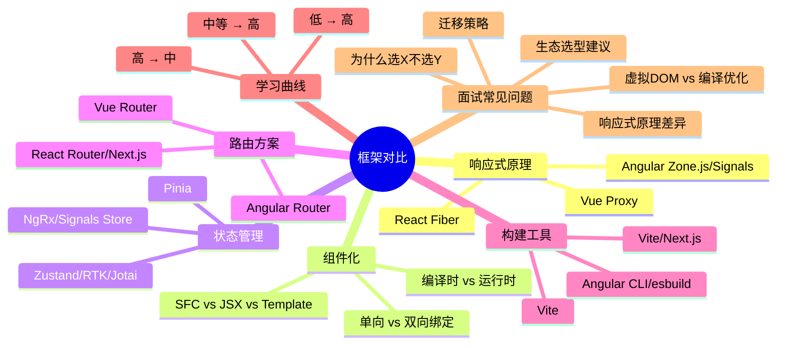
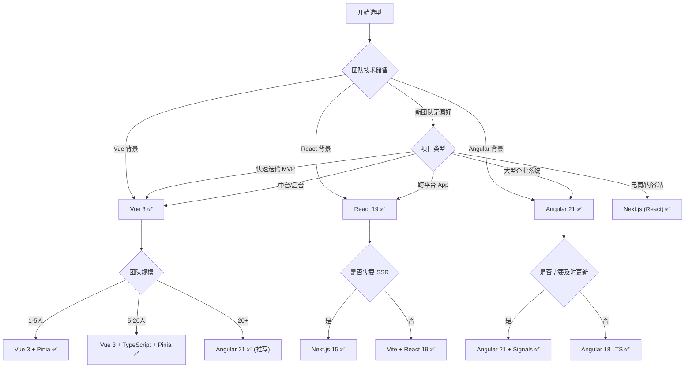

# ⚔️ 三大前端框架深度对比：Vue 3 vs React 19 vs Angular 21

> 🎯 **面试星级**：★★★★★ | **建议用时**：2 天
> 大厂必问框架选型题，掌握深度对比 = 面试加分项

---

## 📌 知识脑图



---

## 📑 目录

- [一、核心哲学差异](#一核心哲学差异)
- [二、响应式原理深度对比](#二响应式原理深度对比)
- [三、组件化方案对比](#三组件化方案对比)
- [四、状态管理生态](#四状态管理生态)
- [五、路由方案](#五路由方案)
- [六、构建工具链](#六构建工具链)
- [七、SSR/SSG 方案](#七ssrssg-方案)
- [八、TypeScript 集成](#八typescript-集成)
- [九、性能优化策略](#九性能优化策略)
- [十、学习曲线与团队适配](#十学习曲线与团队适配)
- [十一、版本迭代对比（2026）](#十一版本迭代对比2026)
- [十二、面试经典问答](#十二面试经典问答)
- [十三、技术选型决策树](#十三技术选型决策树)

---

## 一、核心哲学差异

| 维度 | Vue 3 | React 19 | Angular 21 |
|------|-------|----------|------------|
| **设计哲学** | 渐进式、渐进增强 | 纯 UI 库、一切皆 JS | 全栈框架、开箱即用 |
| **编程范式** | 声明式 + 响应式 | 声明式 + 函数式 | 声明式 + 面向对象 |
| **模板方式** | SFC（单文件组件） | JSX（JS 语法扩展） | Template + Decorator |
| **数据流** | 双向绑定（v-model） | 单向数据流 | 双向绑定（[(ngModel)]） |
| **变更检测** | Proxy 代理 + 自动追踪 | Fiber + 手动触发 setState | Zone.js + OnPush / Signals |
| **编译优化** | 编译时标记 + Block Tree | 运行时调度（React Compiler 即将改变） | 编译时 Ivy + 增量 DOM |
| **包体积** | ~33KB（gzip） | ~44KB（gzip React+DOM） | ~200KB+（含完整工具链） |
| **渲染方式** | 虚拟 DOM + 编译优化 | 虚拟 DOM + Fiber | 增量 DOM（直接操作真实 DOM） |
| **适用场景** | 中小型快速迭代、中台系统 | 大型 SPA、跨平台（RN） | 企业级、大型团队、复杂业务 |

### 设计哲学详解

**Vue：渐进式框架**
- 从 CDN 引入到完整 CLI 项目，按需使用
- 学习成本线性增长：模板 → 组件 → 路由 → 状态管理
- 设计目标：**让开发者少做决定**

**React：纯 UI 库**
- 只关心 View 层，路由/状态管理/构建需自行搭配
- 函数式编程 + 不可变数据
- 设计目标：**可预测的状态容器**

**Angular：全栈平台**
- 内置路由、HTTP、表单、动画、测试、构建
- 强约束、统一规范
- 设计目标：**企业级开发标准**

---

## 二、响应式原理深度对比

### 2.1 Vue 3 — Proxy 代理

```javascript
// Vue 3 响应式核心
const state = reactive({ count: 0 })
// 内部使用 Proxy 拦截 get/set
// get: 收集依赖（track）
// set: 触发更新（trigger）

// Vue 3.6 Alien Signals
const count = ref(0)
computed(() => count.value * 2)  // 精确依赖追踪
```

**特点：**
- Proxy 直接代理整个对象，无需递归遍历
- 自动追踪依赖，开发者无感
- 编译时标记静态节点，减少虚拟 DOM 对比
- Vue 3.6 引入 Alien Signals，性能接近 Solid.js

### 2.2 React 19 — Fiber + 调度

```javascript
// React 状态更新
const [count, setCount] = useState(0)
// setCount 触发重新渲染
// React 构建新的 Fiber 树，与旧树 Diff

// React 19 + React Compiler
// 自动 memo，无需手动 useMemo/useCallback
```

**特点：**
- 显式调用 setState 触发更新
- Fiber 架构支持中断/恢复/优先级调度
- 不可变数据 + 浅比较
- React Compiler（原 React Forget）将自动记忆化

### 2.3 Angular — Zone.js / Signals

```typescript
// Angular Zone.js 模式
@Component({})
class AppComponent {
  count = 0
  increment() { this.count++ }  // Zone.js 拦截 click → 触发变更检测
}

// Angular Signals 模式（17+）
@Component({})
class AppComponent {
  count = signal(0)
  increment() { this.count.update(v => v + 1) }  // 精确更新
}
```

**特点：**
- Zone.js 打补丁所有异步 API，触发全量检测
- OnPush 策略手动优化检测范围
- Signals 实现精确依赖追踪（17+），最终将替代 Zone.js
- Angular 18+ Zoneless 模式，完全基于 Signals

### 响应式对比总结

| 对比项 | Vue 3 | React 19 | Angular 21 |
|--------|-------|----------|------------|
| **触发方式** | 自动（Proxy） | 手动（setState） | 自动（Zone/Signals） |
| **调度能力** | 无 | Fiber 优先级调度 | 无 |
| **精确度** | 组件级（新: Signal 精确） | 组件级（整个子树） | 组件级（OnPush 可优化） |
| **运行时开销** | 低 | 中 | 中 |
| **编译优化** | Block Tree | React Compiler | Incremental DOM |
| **学习成本** | 低 | 中 | 中 |

---

## 三、组件化方案对比

### 3.1 模板语法

```vue
<!-- Vue SFC -->
<template>
  <div class="card" @click="handleClick">
    <h2>{{ title }}</h2>
    <slot />
  </div>
</template>
```

```tsx
// React JSX
function Card({ title, children, onClick }: Props) {
  return (
    <div className="card" onClick={onClick}>
      <h2>{title}</h2>
      {children}
    </div>
  )
}
```

```typescript
// Angular Component
@Component({
  selector: 'app-card',
  template: `
    <div class="card" (click)="handleClick()">
      <h2>{{ title }}</h2>
      <ng-content></ng-content>
    </div>
  `
})
class CardComponent {
  @Input() title = ''
  @Output() click = new EventEmitter()
}
```

### 3.2 组件通信

| 方式 | Vue 3 | React 19 | Angular 21 |
|------|-------|----------|------------|
| **父→子** | `props` | `props` | `@Input()` |
| **子→父** | `emit` | `callback prop` | `@Output()` |
| **跨级** | `provide/inject` + `mitt` | `Context API` | `DI + @Host()` |
| **全局** | Pinia | Zustand/RTK | NgRx/Signals Store |
| **兄弟** | 提升状态 + emit | 提升状态 + callback | 父组件引用 |

### 3.3 生命周期对比

| 阶段 | Vue 3 | React 19 | Angular 21 |
|------|-------|----------|------------|
| **创建** | `setup()` | `constructor` | `constructor` |
| **挂载** | `onMounted` | `useEffect([], [])` | `ngOnInit` |
| **更新** | `onUpdated` | `useEffect` | `ngOnChanges` |
| **销毁** | `onUnmounted` | `useEffect cleanup` | `ngOnDestroy` |
| **错误** | `onErrorCaptured` | `ErrorBoundary` | 全局 ErrorHandler |

---

## 四、状态管理生态

| 对比项 | Vue (Pinia) | React (Zustand/RTK) | Angular (NgRx/Signals) |
|--------|-------------|---------------------|------------------------|
| **核心库** | Pinia | Zustand, Jotai, RTK | NgRx, Elf, Signal Store |
| **响应式** | reactive/ref | produce (Immer) | Signals + Store |
| **异步** | 内置 action 支持 | createAsyncThunk | createEffect |
| **DevTools** | Vue DevTools + Pinia | Redux DevTools | Redux DevTools |
| **学习成本** | 低 | 中 | 高 |
| **TS 支持** | 优秀 | 优秀 | 优秀 |
| **样板代码** | 少 | 中 | 多 |
| **用例** | 中小项目 | 任意规模 | 大型企业 |

```typescript
// Pinia — 极简
const useStore = defineStore('counter', () => {
  const count = ref(0)
  function increment() { count.value++ }
  return { count, increment }
})

// Zustand — 轻量
const useStore = create<{ count: number; inc: () => void }>((set) => ({
  count: 0,
  inc: () => set((s) => ({ count: s.count + 1 })),
}))

// NgRx Signal Store — 新式
const CounterStore = signalStore(
  withState({ count: 0 }),
  withMethods((store) => ({
    increment: () => patchState(store, { count: store.count() + 1 }),
  }))
)
```

---

## 五、路由方案

| 对比项 | Vue Router | React Router | Angular Router |
|--------|-----------|-------------|----------------|
| **声明式路由** | `<router-view>` | `<Outlet>` | `<router-outlet>` |
| **动态路由** | `:id` 参数 | `:id` 参数 | `:id` 参数 |
| **嵌套路由** | ✅ 原生支持 | ✅ `<Outlet>` | ✅ 子路由配置 |
| **守卫** | beforeEach/resolve | loader/action | canActivate/canDeactivate |
| **懒加载** | 动态 import | React.lazy | loadChildren |
| **数据预取** | beforeEnter | loader | resolve |
| **过渡动画** | `<Transition>` | framer-motion | animations |
| **SSR** | Nuxt | Next.js / Remix | Angular Universal |

---

## 六、构建工具链

| 对比项 | Vue 生态 | React 生态 | Angular 生态 |
|--------|---------|-----------|-------------|
| **官方构建** | Vite | Create React App (已不推荐) / Vite | Angular CLI (esbuild) |
| **推荐方案** | Vite + @vitejs/plugin-vue | Vite / Next.js | Angular CLI (已迁移 esbuild) |
| **HMR** | < 50ms | < 50ms | < 200ms |
| **测试** | Vitest | Vitest / Jest | Jasmine / Karma (已弃用 Jest 可选) |
| **E2E** | Playwright / Cypress | Playwright / Cypress | Playwright / Cypress |
| **Lint** | ESLint + Prettier | ESLint + Prettier | ESLint + Prettier (Angular ESLint) |
| **Monorepo** | Turborepo / Nx | Turborepo / Nx | Nx (官方推荐) |
| **微前端** | Module Federation / qiankun | Module Federation / qiankun | Module Federation / single-spa |

---

## 七、SSR/SSG 方案

| 对比项 | Nuxt 3 (Vue) | Next.js 15 (React) | Analog (Angular) |
|--------|-------------|-------------------|-------------------|
| **模式** | SSR / SSG / ISR / SPA | SSR / SSG / ISR / SPA | SSR / SSG / SPA |
| **文件路由** | pages/ + app/ | app/ (App Router) | pages/ |
| **数据获取** | useAsyncData / $fetch | fetch / server functions | Resolver / HttpClient |
| **流式渲染** | ✅ | ✅ (Node.js Edge) | 开发中 |
| **边缘部署** | ✅ (Nitro) | ✅ (Edge Runtime) | 有限 |
| **成熟度** | 高 | 极高 | 低（仍在快速迭代） |
| **社区生态** | 大 | 极大 | 小 |

---

## 八、TypeScript 集成

| 对比项 | Vue 3 | React 19 | Angular 21 |
|--------|-------|----------|------------|
| **TS 支持** | 优秀（`<script setup lang="ts">`） | 优秀 | 原生（必须 TS） |
| **类型推断** | 基于 SFC 编译 | 基于 JSX | 基于装饰器 |
| **泛型组件** | `<script setup generic="T">` | `<T,>` | 类泛型 |
| **ref 类型** | `Ref<T>` | `RefObject<T>` | `Signal<T>` |
| **严格模式** | 可选 | 可选 | 默认（strict: true） |
| **工具类型** | 丰富 | 丰富（Utility Types） | 完整（Angular 类型包） |

**Angular 是唯一强制使用 TypeScript 的主流框架**，从创建项目到每个 API 都深度集成 TS。

---

## 九、性能优化策略

| 优化手段 | Vue 3 | React 19 | Angular 21 |
|---------|-------|----------|------------|
| **虚拟滚动** | vue-virtual-scroller | react-window | cdk-virtual-scroll |
| **懒加载** | defineAsyncComponent | React.lazy + Suspense | loadChildren |
| **防重新渲染** | v-memo / shallowRef | React.memo / useMemo | OnPush / Signals |
| **批量更新** | 自动批处理 | 自动批处理 (18+) | zone.js 自动批处理 |
| **时间切片** | ❌ | ✅ Fiber + Concurrent | ❌ |
| **编译优化** | Block Tree 静态标记 | React Compiler (自动 memo) | 增量 DOM |
| **不可变数据** | 推荐但不强制 | 强制 | 推荐（OnPush 需要） |
| **Web Worker** | ✅ | ✅ | ✅ |
| **WASM** | 社区方案 | 社区方案 | ✅ Angular 自身部分使用 |

### 性能基准（粗略）

```
渲染 1000 个列表项（首次渲染）：
  Vue 3:    ~15ms
  React 19: ~25ms
  Angular:  ~30ms

更新 1 个列表项：
  Vue 3:    ~3ms  (精准追踪)
  React 19: ~15ms (组件子树)
  Angular:  ~20ms (OnPush) / ~40ms (默认)
```

---

## 十、学习曲线与团队适配

### 学习曲线对比

```
高 │          Angular
   │         ↗       
略 │        /
   │  React
中 │ ↗     
   │/
低 │ Vue 3
   └──────────────────
     简单  中等  复杂   应用复杂度
```

### 团队适配建议

| 团队情况 | 推荐框架 | 理由 |
|---------|---------|------|
| 小团队、快速原型 | **Vue 3** | 低学习成本，开发效率高 |
| 大团队、严格规范 | **Angular** | 统一架构，强约束有利于大规模协作 |
| 跨平台（RN、Electron） | **React** | React Native、Tauri 生态最好 |
| 技术栈以 JS 为主 | **React** | JSX 纯 JS，全栈复用一个语言 |
| 技术栈以 TS 为主 | **Angular** | 原生 TS 支持，工具链完整 |
| 中台/后台系统 | **Vue 3 / React** | 灵活，UI 库丰富 |
| 追求最新技术 | **React** | Next.js + Server Components 引领潮流 |

---

## 十一、版本迭代对比（2026）

| 最新特性 | Vue 3.6 | React 19 | Angular 21 |
|---------|---------|----------|------------|
| **响应式** | Alien Signals | React Compiler | Zoneless Signals |
| **数据获取** | 社区方案 | Server Components + use() | httpResource() |
| **表单** | v-model 增强 | React Aria Components | Reactive Forms + Signal |
| **新 API** | `useTemplateRef` | `use()`, `useActionState` | `inject()`, `resource()` |
| **构建** | Vite 6 | Turbopack (Next.js) | esbuild 原生 |
| **SSR** | Nuxt 4 | Next.js 15 (App Router) | Angular Universal / Analog |
| **状态** | Pinia 3 | Zustand 5 / Jotai 2 | Signals Store (未稳定) |
| **测试** | Vitest 2 | Vitest 2 / Testing Library | Jest + Testing Library |

---

## 十二、面试经典问答

### Q1：三大框架各自的优缺点

**Vue 3**
- ✅ 优点：上手快、文档好、灵活、体积小
- ❌ 缺点：生态分散（2/3 不兼容）、过度灵活导致规范难统一

**React 19**
- ✅ 优点：生态最大、跨平台、函数式范式、JSX 灵活
- ❌ 缺点：学习曲线陡峭（Hooks 心智模型）、JSX 悖论、版本迭代快

**Angular 21**
- ✅ 优点：开箱即用、强类型、RxJS 生态、大厂背书
- ❌ 缺点：包体积大、学习曲线高、版本升级痛苦（尤其是 8→15）

### Q2：虚拟 DOM vs 模板编译优化

```
Vue 的编译优化：
  ├─ 静态提升：静态节点只创建一次
  ├─ Patch Flag：动态节点标记具体变化类型
  └─ Block Tree：以动态节点为边界分割树
     → 跳过静态子树，只 Diff 动态节点

React 的运行时优化：
  ├─ Fiber：可中断渲染
  ├─ 优先级调度：高优任务优先
  └─ React Compiler：自动记忆化
     → 编译器推断哪些值不变，自动 memo

核心区别：
  Vue 在编译时做尽可能多的工作
  React 保持运行时灵活性，编译器辅助优化
  Angular Ivy 编译器 + 增量 DOM，跳过虚拟 DOM 步骤
```

### Q3：为什么你们选择了 X 而不是 Y？

回答框架：
1. **业务需求**：我们主要做 ___（企业级平台/快速迭代/跨平台）
2. **团队能力**：团队主要技术栈是 ___，学习成本低
3. **生态支持**：___ 的 ___ 生态更适合我们的需求
4. **性能要求**：___ 的 ___ 特性满足我们的性能标准
5. **长期维护**：___ 的社区活跃度和版本稳定性可靠

### Q4：Vue 的响应式 vs React 的 Fiber

```
Vue Proxy：自动追踪（getter 收集依赖，setter 触发更新）
  → 精确到组件级别，无需手动优化
  → 不需要 Fiber 的调度机制
  
React Fiber：手动触发（setState 触发重新协调）
  → 不可知数据变化来源，需要 Diff
  → Fiber 的调度机制用于分片执行
  
本质差异：
  Vue 知道"什么变了"→ 直接更新对应组件
  React 不知道"什么变了"→ 重新渲染整个子树，然后 Diff
```

### Q5：Angular 为什么要从 Zone.js 迁移到 Signals？

```
Zone.js 的问题：
  ├─ 无法精确知道哪个组件变了
  ├─ 每个异步操作都触发全量检测
  └─ 难以与微前端、Web Worker 集成

Signals 的优势：
  ├─ 精确依赖追踪
  ├─ 无需 Zone.js，减少运行时开销
  ├─ 更好的 TypeScript 类型推断
  └─ Zoneless 模式，支持微前端
```

### Q6：选型建议

| 如果... | 推荐 |
|---------|------|
| 你想快速开发 MVP | Vue 3 |
| 你要做跨平台 App | React + React Native |
| 你在大型企业团队 | Angular |
| 你追求创新 | React (Server Components) |
| 你对模板语法有偏好 | Vue / Angular |
| 你对函数式编程有偏好 | React |

---

## 十三、技术选型决策树



---

## 📚 关联文件

| 关联专题 | 文件 |
|---------|------|
| Vue 3 完整指南 | [04-Vue3.md](./04-Vue3.md) |
| React 19 完整指南 | [05-React19.md](./05-React19.md) |
| Angular 20 完整指南 | [06-Angular20.md](./06-Angular20.md) |
| 面试题库 | [11-前端面试题库.md](../S4-面试冲刺/11-前端面试题库.md) |

---

> **💡 面试建议**：不要只说"X 好 Y 不好"。展示你对每个框架的优缺点都有客观认识，并结合实际项目经验给出选择理由。
