# 🚀 [Angular 21](https://angular.dev) 完整学习指南

> 🎯 **面试星级**：★★★★★ | **建议用时**：3 天
> Angular 21+ 系统学习指南，覆盖组件、模板、DI、Signals、RxJS、路由、表单、性能优化与工程实践

---


# 📦 第1章：起航Angular之旅

## 1-1 Angular 全景透视

### 📌 核心定义

**Angular** 是一个基于 TypeScript 的企业级 Web 应用框架，由 Google 维护。它提供了一套完整的解决方案，包括组件化、依赖注入、路由、表单、HTTP 客户端等，开箱即用。

```typescript
// Angular 的三大特性：
// 1. 组件化：UI 以组件树形式组织
// 2. 依赖注入：松耦合、高可测试性
// 3. 响应式：Signals + RxJS 驱动变化检测
```

### 🎯 Angular 的核心角色

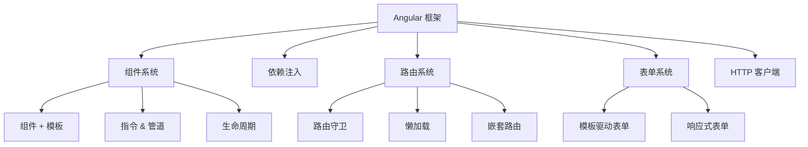

### 📊 框架对比

| 特性 | Angular | React | Vue |
|------|---------|-------|-----|
| 学习曲线 | 🔴 陡峭 | 🟡 中等 | 🟢 平缓 |
| 灵活性 | ⚠️ 受限 | ✅ 极高 | ✅ 高 |
| 生态系统 | ✅ 完整 | ✅ 最庞大 | ✅ 完整 |
| TypeScript | ✅ 原生 | ⚠️ 可选 | ⚠️ 可选 |
| 企业应用 | ✅ 完美 | ⚠️ 可行 | ⚠️ 可行 |
| **范式** | 面向对象 + 响应式 | 函数式 | 渐进式 |
| **变更检测** | Zone.js / Signals | 手动 setState | Proxy 自动追踪 |
| **Bundle** | 较大（~120KB） | 中等（~40KB） | 较小（~33KB） |

### 🎨 Angular 五大设计理念

#### ① 模块化（Modularity）

Angular 引导开发者将应用拆分为**功能模块**，每个模块封装相关组件、服务、指令。

```typescript
@NgModule({
  imports: [CommonModule, RouterModule],
  declarations: [ProductComponent, ProductListComponent],
  providers: [ProductService],
  exports: [ProductComponent],
})
export class ProductModule {}
```

> Angular 17+ 推荐使用**独立组件**（Standalone），不再需要 NgModule。

#### ② 依赖注入（Dependency Injection）

DI 是 Angular 的核心设计模式，让代码松耦合、易测试。

```typescript
@Injectable({ providedIn: 'root' })
export class ProductService {
  getProducts(): Observable<Product[]> { ... }
}

@Component({
  standalone: true,
  template: `...`,
})
export class ProductListComponent {
  private productService = inject(ProductService);
}
```

#### ③ 响应式（Reactive）

Angular 使用 **RxJS** 处理异步操作，使用 **Signals** 管理同步状态。

```typescript
// RxJS 处理异步数据流
const products$ = this.http.get<Product[]>('/api/products')
  .pipe(
    catchError(this.handleError),
    retry(2)
  );

// Signals 管理同步状态
const count = signal(0);
const doubled = computed(() => count() * 2);
```

#### ④ 编译优化（Compile-time Optimization）

Angular 的 **AOT（Ahead-of-Time）编译** 在构建时编译模板，减少运行时开销。

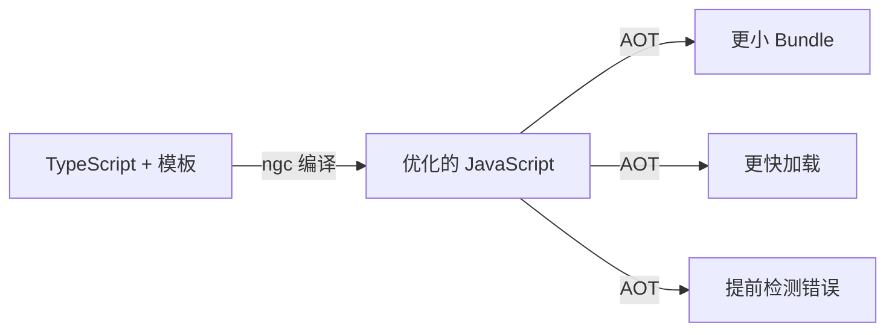

#### ⑤ 全栈全家桶（Batteries Included）

Angular 自带路由、表单、动画、HTTP 客户端、测试工具等，无需三方库。

```
Angular 内置的开箱即用：
├─ @angular/router        → 路由系统
├─ @angular/forms         → 表单系统
├─ @angular/common/http   → HTTP 客户端
├─ @angular/animations    → 动画系统
├─ @angular/service-worker→ PWA 支持
├─ @angular/platform-server → SSR
└─ @angular/cdk           → Material CDK
```

### 💡 一个公式理解 Angular

```
UI = Component(Template, State, DI)
│       │          │      │
▼       ▼          ▼      ▼
视图    组件      状态     依赖
```

### 🗺️ 版本演进（2016—2026）

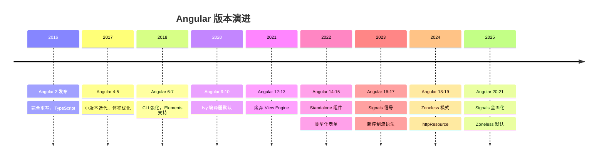

| 版本 | 年份 | 核心变化 | 对开发者的影响 |
|------|------|---------|--------------|
| **Angular 2** | 2016 | TypeScript，完全重写 | 全新的组件体系 |
| **Angular 4** | 2017 | 小版本优化 | 更小更快 |
| **Angular 9** | 2020 | **Ivy 编译器默认** | 更小 Bundle，更快编译 |
| **Angular 14** | 2022 | **Standalone 组件** | 不再需要 NgModule |
| **Angular 16** | 2023 | **Signals 发布** | 新的响应式范式 |
| **Angular 17** | 2023 | 新控制流 `@if/@for` | 模板更简洁 |
| **Angular 18** | 2024 | Zoneless 实验性 | 更小运行时 |
| **Angular 19** | 2024 | **httpResource** 实验性 | 声明式数据获取 |
| **Angular 20** | 2025 | Signals 全面化 | Zoneless 开发者预览 |
| **Angular 21** | 2026 | 全 Zoneless 默认 | 极致性能 |

---

# 📦 第2章：环境搭建与CLI

## 2-1 Angular CLI 安装

```bash
npm install -g @angular/cli
ng version
```

## 2-2 创建项目

```bash
ng new my-angular-app --standalone --routing --style=scss
cd my-angular-app
ng serve --open
```

## 2-3 项目结构

```
my-angular-app/
├── src/
│   ├── app/
│   │   ├── app.component.ts     # 根组件
│   │   ├── app.config.ts        # 应用配置
│   │   ├── app.routes.ts        # 路由配置
│   │   └── components/          # 组件目录
│   ├── assets/                  # 静态资源
│   ├── index.html               # 入口 HTML
│   ├── main.ts                  # 应用入口
│   └── styles.scss              # 全局样式
├── angular.json                 # Angular 配置
├── tsconfig.json                # TypeScript 配置
├── package.json
└── (无 Vite 配置文件，使用 esbuild)
```

## 2-4 angular.json 配置

```json
{
  "$schema": "./node_modules/@angular/cli/lib/config/schema.json",
  "projects": {
    "my-app": {
      "architect": {
        "build": {
          "builder": "@angular-devkit/build-angular:application",
          "options": {
            "aot": true,
            "outputPath": "dist/my-app",
            "index": "src/index.html",
            "polyfills": ["zone.js"]   // Angular 21 默认 Zoneless 不再需要 zone.js
          }
        }
      }
    }
  }
}
```

## 2-5 CLI 常用命令

```bash
ng generate component product-list      # 生成组件
ng generate service product             # 生成服务
ng generate directive highlight          # 生成指令
ng generate pipe filter                  # 生成管道
ng generate guard auth                   # 生成守卫
ng build --configuration production      # 生产构建
ng test                                  # 运行测试
eslint .                                 # 代码检查（Angular 20+ 改用原生 ESLint）
```

---

# 📦 第3章：组件系统

## 3-1 组件结构

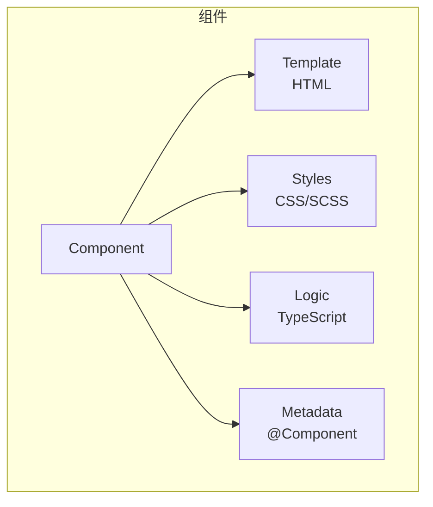

## 3-2 创建组件

```typescript
import { Component } from '@angular/core';

@Component({
  selector: 'app-product-card',
  standalone: true,
  imports: [],
  templateUrl: './product-card.component.html',
  styleUrl: './product-card.component.scss',
})
export class ProductCardComponent {
  productName = '无线耳机';
  price = 299;
}
```

```html
<div class="card">
  <h3>{{ productName }}</h3>
  <p class="price">¥{{ price }}</p>
</div>
```

## 3-3 input / output（Signal 语法）

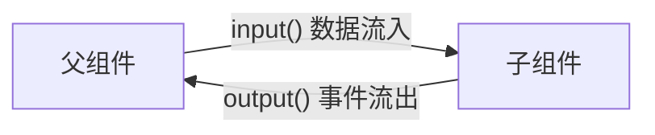

```typescript
import { Component, input, output } from '@angular/core';

@Component({ ... })
export class ProductCardComponent {
  product = input.required<Product>();
  showDiscount = input(false);

  addToCart = output<Product>();

  handleAdd() {
    this.addToCart.emit(this.product());
  }
}
```

## 3-4 组件生命周期

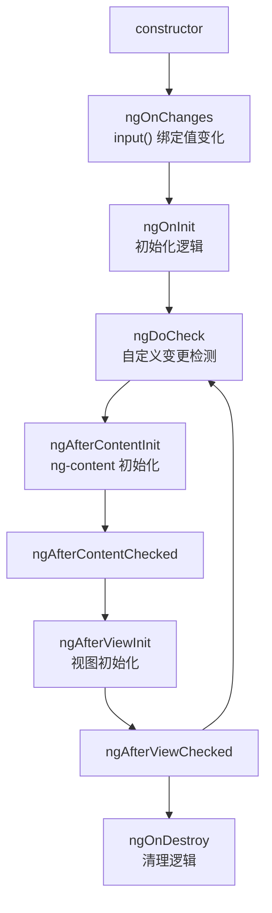

### 生命周期详解

| 钩子 | 触发时机 | 用途 |
|------|---------|------|
| `ngOnChanges` | 每次 input() 绑定值变化 | 响应输入变化 |
| `ngOnInit` | 首次 ngOnChanges 之后 | 初始化数据加载 |
| `ngDoCheck` | 每次变更检测 | 自定义变化检测 |
| `ngAfterContentInit` | 内容投影 ng-content 初始化后 | 内容初始化 |
| `ngAfterContentChecked` | 每次投影内容检测后 | — |
| `ngAfterViewInit` | 组件视图初始化后 | 操作 DOM |
| `ngAfterViewChecked` | 每次视图检测后 | — |
| `ngOnDestroy` | 组件销毁前 | 清理订阅/定时器 |

## 3-5 内容投影（Content Projection）

```html
<!-- 父组件使用 -->
<app-card>
  <h2 header>产品卡片</h2>
  <p body>这是卡片内容</p>
  <button footer>确认</button>
</app-card>
```

```html
<!-- 子组件模板 -->
<div class="card">
  <div class="card-header">
    <ng-content select="[header]"></ng-content>
  </div>
  <div class="card-body">
    <ng-content select="[body]"></ng-content>
  </div>
  <div class="card-footer">
    <ng-content select="[footer]"></ng-content>
  </div>
</div>
```

## 3-6 ViewChild / ViewChildren / ContentChild

```typescript
import { Component, viewChild, viewChildren, ElementRef } from '@angular/core';

@Component({ ... })
export class ParentComponent {
  // 获取模板中的单个子组件或元素
  child = viewChild.required<ChildComponent>();
  inputEl = viewChild.required<ElementRef<HTMLInputElement>>('myInput');

  // 获取多个
  cards = viewChildren(ProductCardComponent);

  ngAfterViewInit() {
    this.child().doSomething();
    this.inputEl().nativeElement.focus();
    this.cards().forEach(card => console.log(card.product));
  }
}
```

---

# 📦 第4章：模板语法与数据绑定

## 4-1 插值表达式

```html
<h1>{{ title }}</h1>
<p>{{ 1 + 1 }}</p>
<p>{{ user.name | uppercase }}</p>
```

## 4-2 属性绑定

```html
<!-- 属性绑定 [property]="expression" -->

<button [disabled]="!canSubmit">提交</button>
<div [class.active]="isActive">激活状态</div>
<div [style.color]="textColor">文本颜色</div>

<!-- 属性绑定与 HTML 属性的区别 -->
<input [value]="name" />   <!-- DOM 属性绑定 -->
<input attr.value="{{ name }}" />  <!-- HTML 属性绑定 -->
```

## 4-3 事件绑定

```html
<!-- (event)="handler" -->
<button (click)="handleClick($event)">点击</button>
<input (input)="handleInput($event)" />
<input (keyup.enter)="submit()" />
<div (mousedown)="onMouseDown()" (mouseup)="onMouseUp()">拖拽区域</div>
```

## 4-4 双向绑定

```html
<!-- 双向绑定 [(ngModel)] -->
<input [(ngModel)]="name" />

<!-- 等价于 -->
<input [ngModel]="name" (ngModelChange)="name = $event" />
```

需要在 `@Component.imports` 中导入 `FormsModule`：

```typescript
@Component({
  standalone: true,
  imports: [FormsModule],
})
export class MyComponent {}
```

## 4-5 控制流语法（Angular 17+）

### @if / @else

```html
@if (products.length > 0) {
  <div class="product-list">
    @for (product of products; track product.id) {
      <app-product-card [product]="product" />
    }
  </div>
} @else if (loading) {
  <app-spinner />
} @else {
  <app-empty-state message="暂无产品" />
}
```

### @for

```html
@for (item of items; track item.id; let i = $index, first = $first, last = $last) {
  <div [class.first]="first" [class.last]="last">
    {{ i + 1 }}. {{ item.name }}
  </div>
} @empty {
  <p>列表为空</p>
}
```

### @switch

```html
@switch (status) {
  @case ('loading') { <app-spinner /> }
  @case ('error') { <app-error [message]="errorMessage" /> }
  @case ('success') { <app-data-table [data]="data" /> }
  @default { <p>未知状态</p> }
}
```

### @let（Angular 19+）

```html
@let total = cartItems().reduce((sum, item) => sum + item.price * item.quantity, 0);
@let count = cartItems().length;

<div>
  <span>购物车 ({{ count }})</span>
  <span>总计: ¥{{ total }}</span>
</div>
```

## 4-6 旧版结构型指令

```html
<!-- ngIf -->
<div *ngIf="isVisible; else loading">内容</div>
<ng-template #loading><p>加载中...</p></ng-template>

<!-- ngFor -->
<div *ngFor="let product of products; trackBy: trackById">
  {{ product.name }}
</div>

<!-- ngSwitch -->
<div [ngSwitch]="status">
  <app-spinner *ngSwitchCase="'loading'" />
  <app-error *ngSwitchCase="'error'" />
  <app-data *ngSwitchDefault />
</div>
```

---

# 📦 第5章：指令与管道

## 5-1 内置属性指令

```html
<!-- ngClass：动态 CSS 类 -->
<div [ngClass]="{
  'active': isActive,
  'disabled': isDisabled,
  'highlight': isHighlighted
}">动态类</div>

<!-- ngStyle：动态样式 -->
<div [ngStyle]="{
  'background-color': bgColor,
  'font-size': fontSize + 'px',
  'color': textColor
}">动态样式</div>

<!-- ngModel：双向绑定 -->
<input [(ngModel)]="searchQuery" />
```

## 5-2 自定义属性指令

```typescript
import { Directive, ElementRef, HostListener, input } from '@angular/core';

@Directive({
  selector: '[appHighlight]',
  standalone: true,
})
export class HighlightDirective {
  highlightColor = input('yellow', { alias: 'appHighlight' });
  defaultColor = input('transparent');

  constructor(private el: ElementRef) {}

  @HostListener('mouseenter') onMouseEnter() {
    this.highlight(this.highlightColor());
  }

  @HostListener('mouseleave') onMouseLeave() {
    this.highlight(this.defaultColor());
  }

  private highlight(color: string) {
    this.el.nativeElement.style.backgroundColor = color;
  }
}
```

```html
<p [appHighlight]="'yellow'" defaultColor="transparent">鼠标悬停高亮</p>
```

## 5-3 自定义结构型指令

```typescript
import { Directive, TemplateRef, ViewContainerRef, input, effect } from '@angular/core';

@Directive({
  selector: '[appUnless]',
  standalone: true,
})
export class UnlessDirective {
  appUnless = input(false);

  constructor(
    private templateRef: TemplateRef<any>,
    private viewContainer: ViewContainerRef
  ) {
    effect(() => {
      if (!this.appUnless()) {
        this.viewContainer.createEmbeddedView(this.templateRef);
      } else {
        this.viewContainer.clear();
      }
    });
  }
}
```

```html
<div *appUnless="isLoading">内容显示</div>
```

## 5-4 管道（Pipes）

### 内置管道

```html
<p>{{ today | date:'yyyy-MM-dd' }}</p>
<p>{{ price | currency:'CNY':'symbol':'1.2-2' }}</p>
<p>{{ text | uppercase }}</p>
<p>{{ user | json }}</p>
<p>{{ 0.1234 | percent:'1.2-2' }}</p>
<p>{{ longText | slice:0:50 }}...</p>
```

### 自定义管道

```typescript
import { Pipe, PipeTransform } from '@angular/core';

@Pipe({
  name: 'productFilter',
  standalone: true,
  pure: true, // 纯管道：只有输入变化时才重新计算
})
export class ProductFilterPipe implements PipeTransform {
  transform(products: Product[], searchQuery: string): Product[] {
    if (!searchQuery) return products;
    return products.filter(p =>
      p.name.toLowerCase().includes(searchQuery.toLowerCase())
    );
  }
}
```

```html
@for (product of products | productFilter:searchQuery; track product.id) {
  <app-product-card [product]="product" />
}
```

### 纯管道 vs 非纯管道

| 特性 | 纯管道 (Pure) | 非纯管道 (Impure) |
|------|--------------|------------------|
| 触发时机 | 输入值变化 | 每次变更检测 |
| 性能 | ✅ 高效 | ❌ 可能影响性能 |
| 默认 | ✅ 是 | ❌ 需设置 `pure: false` |
| 适用场景 | 过滤、排序 | 异步数据、实时计算 |

---

# 📦 第6章：依赖注入（DI）

## 6-1 DI 核心概念

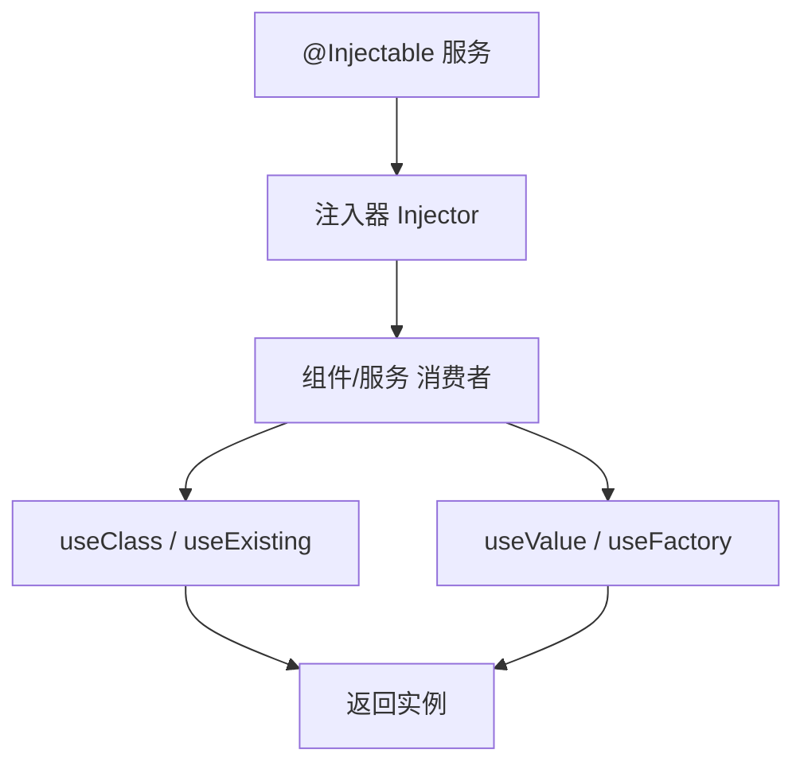

## 6-2 创建服务

```typescript
import { Injectable, inject } from '@angular/core';
import { HttpClient } from '@angular/common/http';
import { Observable } from 'rxjs';

export interface Product {
  id: number;
  name: string;
  price: number;
  category: string;
}

@Injectable({
  providedIn: 'root', // 全局单例
})
export class ProductService {
  private http = inject(HttpClient);
  private apiUrl = '/api/products';

  getProducts(): Observable<Product[]> {
    return this.http.get<Product[]>(this.apiUrl);
  }

  getProductById(id: number): Observable<Product> {
    return this.http.get<Product>(`${this.apiUrl}/${id}`);
  }
}
```

## 6-3 注入服务

```typescript
@Component({ ... })
export class ProductListComponent {
  // 方式1：inject() 函数（推荐）
  private productService = inject(ProductService);
  private route = inject(ActivatedRoute);

  // 方式2：构造函数注入
  constructor(private productService: ProductService) {}

  ngOnInit() {
    this.productService.getProducts().subscribe(products => {
      this.products = products;
    });
  }
}
```

## 6-4 注入层级

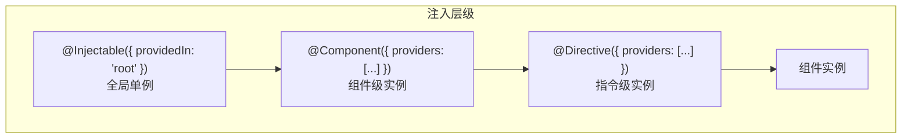

### Provider 作用域

| 层级 | 写法 | 作用域 |
|------|------|--------|
| **root** | `providedIn: 'root'` | 全局单例（所有组件共享） |
| **组件** | `providers: [Service]` | 每个组件实例独立 |
| **路由** | `providers: [Service]` (在路由配置中) | 路由级别 |

## 6-5 Provider 配置方式

```typescript
// 方式1：useClass
providers: [
  { provide: LoggerService, useClass: ConsoleLoggerService },
]

// 方式2：useExisting（别名）
providers: [
  { provide: OldLogger, useExisting: NewLogger },
]

// 方式3：useValue
providers: [
  { provide: API_URL, useValue: 'https://api.example.com' },
]

// 方式4：useFactory
providers: [
  {
    provide: ProductService,
    useFactory: (http: HttpClient, config: AppConfig) => {
      return new ProductService(http, config.apiUrl);
    },
    deps: [HttpClient, AppConfig],
  },
]
```

## 6-6 Injection Token

```typescript
// 定义 Token
export const API_URL = new InjectionToken<string>('API_URL');

// 提供值
providers: [
  { provide: API_URL, useValue: 'https://api.example.com/v2' },
]

// 注入
@Component({ ... })
export class DataService {
  private apiUrl = inject(API_URL);
}
```

---

# 📦 第7章：Signals 响应式系统

## 7-1 Signals 核心概念

Angular 16+ 引入的 **Signals** 是 Angular 新的响应式原语，提供细粒度的响应式更新。

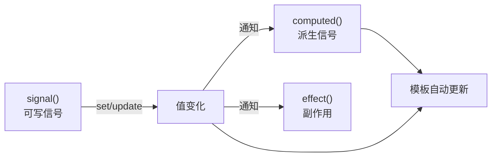

## 7-2 signal / computed / effect

```typescript
import { signal, computed, effect } from '@angular/core';

// signal：可写信号
const count = signal(0);
const product = signal<Product | null>(null);

// 读取
console.log(count()); // 0

// 写入
count.set(5);             // 直接赋值
count.update(v => v + 1); // 基于当前值更新

// computed：只读派生信号
const doubled = computed(() => count() * 2);
const status = computed(() => count() > 0 ? 'positive' : 'zero');

// effect：副作用（在组件销毁时自动清理）
effect(() => {
  console.log(`Count 变为: ${count()}`);
});
```

## 7-3 Signals vs 传统方式

```typescript
// ❌ 传统方式：Zone.js 检测，全组件检查
@Component({ ... })
export class OldComponent {
  items: Product[] = [];
  loading = false;

  loadData() {
    this.loading = true;
    this.productService.getProducts().subscribe(data => {
      this.items = data;      // Zone.js 触发变更检测
      this.loading = false;   // Zone.js 再次触发
    });
  }
}

// ✅ Signals 方式：精确更新
@Component({
  ...,
  changeDetection: ChangeDetectionStrategy.OnPush, // 可与 OnPush 配合
})
export class NewComponent {
  readonly items = signal<Product[]>([]);
  readonly loading = signal(false);

  private productService = inject(ProductService);

  loadData() {
    this.loading.set(true);
    this.productService.getProducts().subscribe(data => {
      this.items.set(data);
      this.loading.set(false);
    });
  }
}
```

## 7-4 input / output / model（Angular 17+）

### signal inputs

```typescript
@Component({ ... })
export class ProductCardComponent {
  // 必填输入
  product = input.required<Product>();

  // 可选输入，带默认值
  discount = input(0);
  variant = input<'small' | 'large'>('small');

  // 计算属性
  readonly discountedPrice = computed(() =>
    this.product().price * (1 - this.discount() / 100)
  );
}
```

### output

```typescript
@Component({ ... })
export class ProductCardComponent {
  addToCart = output<Product>();
  deleteProduct = output<number>();

  handleAdd() {
    this.addToCart.emit(this.product());
  }
}
```

### model（双向绑定）

```typescript
@Component({ ... })
export class StarRatingComponent {
  value = model(0);       // 类似 [(value)]
  readonly = input(false);

  setRating(rating: number) {
    if (!this.readonly()) {
      this.value.set(rating);
    }
  }
}
```

```html
<!-- 父组件使用 -->
<app-star-rating [(value)]="productRating" />
```

## 7-5 linkedSignal（Angular 19+）

`linkedSignal` 创建一个信号，可以在需要时从源信号重置：

```typescript
const userId = signal(1);
const userData = linkedSignal(() => fetchUser(userId()));

// 当 userId 变化时，linkedSignal 自动重新计算
```

## 7-6 httpResource（Angular 19+）

声明式数据获取：

```typescript
import { httpResource } from '@angular/common/http';

@Component({ ... })
export class ProductListComponent {
  private readonly query = signal('');

  readonly productsResource = httpResource<Product[]>(() => ({
    url: `/api/products?q=${this.query()}`,
  }));

  // 自动管理 loading、error、data 状态
  readonly products = computed(() => this.productsResource.value() ?? []);
  readonly loading = this.productsResource.isLoading;
  readonly error = this.productsResource.error;
}
```

---

# 📦 第8章：RxJS 集成

## 8-1 RxJS 核心概念

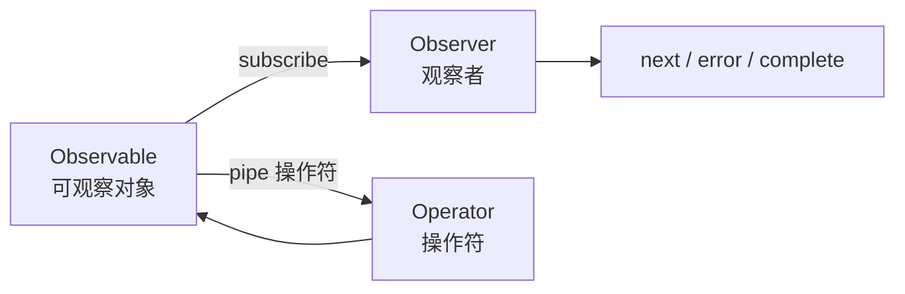

## 8-2 创建 Observable

```typescript
import { Observable, of, from, interval, fromEvent } from 'rxjs';

// 从值创建
const products$ = of<Product[]>([{ id: 1, name: 'Product A' }]);

// 从数组创建
const ids$ = from([1, 2, 3, 4, 5]);

// 从 Promise 创建
const data$ = from(fetch('/api/data').then(r => r.json()));

// 定时器
const tick$ = interval(1000);

// 从 DOM 事件
const clicks$ = fromEvent(document, 'click');
```

## 8-3 订阅与取消订阅

```typescript
@Component({ ... })
export class SearchComponent implements OnDestroy {
  private destroy$ = new Subject<void>();

  ngOnInit() {
    interval(3000)
      .pipe(takeUntil(this.destroy$))
      .subscribe(value => console.log(value));
  }

  ngOnDestroy() {
    this.destroy$.next();
    this.destroy$.complete();
  }
}
```

## 8-4 常用操作符

```typescript
import { pipe } from 'rxjs';
import {
  map, filter, tap, switchMap, debounceTime,
  distinctUntilChanged, catchError, retry,
  combineLatestWith, withLatestFrom,
} from 'rxjs/operators';

this.searchInput.valueChanges
  .pipe(
    debounceTime(300),               // 防抖
    distinctUntilChanged(),           // 值变化时才触发
    filter(query => query.length >= 2), // 至少2字符
    tap(query => this.loading.set(true)),
    switchMap(query =>               // 切换最新请求（取消上一个）
      this.productService.search(query).pipe(
        retry(2),                    // 重试2次
        catchError(err => {
          this.error.set(err.message);
          return of([]);
        })
      )
    ),
    tap(() => this.loading.set(false)),
  )
  .subscribe(products => this.products.set(products));
```

## 8-5 Subject 类型

```typescript
import { Subject, BehaviorSubject, ReplaySubject, AsyncSubject } from 'rxjs';

// Subject：普通 Subject，无初始值
const subject = new Subject<number>();
subject.next(1);                     // 已发出的值，新订阅者收不到

// BehaviorSubject：有初始值，新订阅者立即收到最新值
const behavior = new BehaviorSubject<number>(0);
behavior.value;                      // 同步获取最新值

// ReplaySubject：缓存指定数量的历史值
const replay = new ReplaySubject<number>(3); // 缓存最近3个值

// AsyncSubject：只在 complete 时发出最后一个值
const async = new AsyncSubject<number>();
```

## 8-6 RxJS 与 Signals 互操作

```typescript
import { toSignal, toObservable } from '@angular/core/rxjs-interop';

// Observable → Signal
const products$ = this.http.get<Product[]>('/api/products');
const products = toSignal(products$, { initialValue: [] });

// Signal → Observable
const count = signal(0);
const count$ = toObservable(count); // Signal 变化时 Observable 发出新值
```

---

# 📦 第9章：路由系统

## 9-1 路由配置

```typescript
import { Routes } from '@angular/router';

export const routes: Routes = [
  { path: '', redirectTo: '/home', pathMatch: 'full' },
  {
    path: 'home',
    loadComponent: () => import('./home/home.component').then(m => m.HomeComponent),
  },
  {
    path: 'products',
    loadChildren: () => import('./products/products.routes').then(m => m.productRoutes),
  },
  {
    path: 'cart',
    loadComponent: () => import('./cart/cart.component').then(m => m.CartComponent),
    canActivate: [authGuard],
  },
  {
    path: 'login',
    component: LoginComponent,
  },
  { path: '**', component: NotFoundComponent },
];
```

## 9-2 路由配置（含子路由）

```typescript
// products.routes.ts
import { Routes } from '@angular/router';

export const productRoutes: Routes = [
  {
    path: '',
    component: ProductLayoutComponent,
    children: [
      { path: '', component: ProductListComponent },
      { path: ':id', component: ProductDetailComponent },
    ],
  },
];
```

## 9-3 RouterOutlet / RouterLink

```html
<!-- 路由出口 -->
<router-outlet />

<!-- 导航链接 -->
<nav>
  <a routerLink="/home" routerLinkActive="active">首页</a>
  <a [routerLink]="['/products', productId]" routerLinkActive="active">产品详情</a>
  <a routerLink="/cart" routerLinkActive="active">购物车</a>
</nav>
```

## 9-4 路由参数

```typescript
@Component({ ... })
export class ProductDetailComponent {
  private route = inject(ActivatedRoute);
  private router = inject(Router);

  // 路径参数
  productId = signal<number>(0);

  constructor() {
    // 使用 Signals 方式监听参数变化
    const idParam = this.route.paramMap.pipe(
      map(params => Number(params.get('id'))),
    );
    // 或：直接使用 Angular 19+ 的 input
  }

  ngOnInit() {
    // 传统方式
    this.route.params.subscribe(params => {
      this.productId.set(Number(params['id']));
    });

    // 查询参数
    this.route.queryParams.subscribe(params => {
      const category = params['category'];
      const page = params['page'];
    });
  }

  // 编程式导航
  goToProduct(id: number) {
    this.router.navigate(['/products', id], {
      queryParams: { ref: 'home' },
    });
  }

  goBack() {
    this.router.navigate(['/products']);
  }
}
```

## 9-5 路由守卫

```typescript
import { inject } from '@angular/core';
import { Router, type CanActivateFn } from '@angular/router';

export const authGuard: CanActivateFn = (route, state) => {
  const authService = inject(AuthService);
  const router = inject(Router);

  if (authService.isAuthenticated()) {
    return true;
  }

  return router.createUrlTree(['/login'], {
    queryParams: { returnUrl: state.url },
  });
};

export const productLoadGuard: CanActivateFn = () => {
  const productService = inject(ProductService);
  return productService.checkAvailability();
};
```

```typescript
// 路由配置中使用
const routes: Routes = [
  {
    path: 'admin',
    loadComponent: () => import('./admin/admin.component').then(m => m.AdminComponent),
    canActivate: [authGuard],
    canDeactivate: [unsavedChangesGuard],
    canMatch: [featureToggleGuard],
    resolve: { products: productResolver },
  },
];
```

## 9-6 路由解析器（Resolver）

```typescript
import { ResolveFn } from '@angular/router';

export const productResolver: ResolveFn<Product> = (route, state) => {
  const productService = inject(ProductService);
  const id = Number(route.paramMap.get('id'));
  return productService.getProductById(id);
};
```

```typescript
@Component({ ... })
export class ProductDetailComponent {
  private route = inject(ActivatedRoute);

  ngOnInit() {
    // 获取 Resolver 数据
    this.route.data.subscribe(data => {
      this.product = data['products'];
    });
  }
}
```

## 9-7 懒加载架构

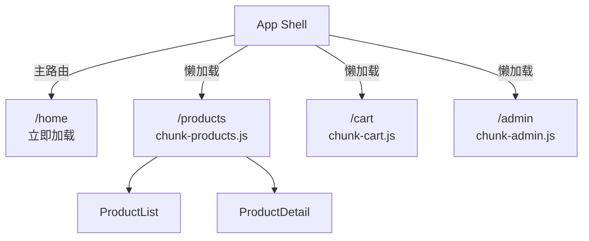

---

# 📦 第10章：表单处理

## 10-1 表单方案对比

| 特性 | 模板驱动表单 | 响应式表单 |
|------|------------|-----------|
| 复杂度 | 简单 | 复杂/灵活 |
| 数据模型 | 隐式 | 显式（TypeScript） |
| 验证 | 指令驱动 | 函数驱动 |
| 可测试性 | ⚠️ 一般 | ✅ 优秀 |
| 适用场景 | 简单表单 | 复杂/动态表单 |

## 10-2 模板驱动表单

```typescript
@Component({
  standalone: true,
  imports: [FormsModule],
  template: `
    <form #loginForm="ngForm" (ngSubmit)="onSubmit(loginForm)">
      <input
        name="email"
        ngModel
        required
        email
        #email="ngModel"
        placeholder="邮箱"
      />
      @if (email.invalid && email.touched) {
        <span class="error">请输入有效邮箱</span>
      }

      <input
        name="password"
        ngModel
        required
        minlength="6"
        #password="ngModel"
        type="password"
        placeholder="密码"
      />

      <button type="submit" [disabled]="loginForm.invalid">登录</button>
    </form>
  `,
})
export class LoginComponent {
  onSubmit(form: NgForm) {
    if (form.valid) {
      console.log(form.value); // { email: '...', password: '...' }
    }
  }
}
```

## 10-3 响应式表单

```typescript
@Component({
  standalone: true,
  imports: [ReactiveFormsModule],
  template: `
    <form [formGroup]="loginForm" (ngSubmit)="onSubmit()">
      <input formControlName="email" placeholder="邮箱" />
      @if (emailControl.invalid && emailControl.touched) {
        <span class="error">{{ getEmailError() }}</span>
      }

      <input formControlName="password" type="password" placeholder="密码" />

      <div formGroupName="address">
        <input formControlName="city" placeholder="城市" />
        <input formControlName="street" placeholder="街道" />
      </div>

      <button type="submit" [disabled]="loginForm.invalid">登录</button>
    </form>
  `,
})
export class LoginComponent {
  private fb = inject(FormBuilder);

  loginForm = this.fb.group({
    email: ['', [Validators.required, Validators.email]],
    password: ['', [Validators.required, Validators.minLength(6)]],
    address: this.fb.group({
      city: [''],
      street: [''],
    }),
  });

  get emailControl() {
    return this.loginForm.get('email')!;
  }

  getEmailError(): string {
    const control = this.emailControl;
    if (control.hasError('required')) return '邮箱不能为空';
    if (control.hasError('email')) return '请输入有效邮箱';
    return '';
  }

  onSubmit() {
    if (this.loginForm.valid) {
      console.log(this.loginForm.value);
    }
  }
}
```

## 10-4 自定义验证器

```typescript
import { AbstractControl, ValidationErrors, ValidatorFn } from '@angular/forms';

// 同步验证器
export function passwordStrengthValidator(): ValidatorFn {
  return (control: AbstractControl): ValidationErrors | null => {
    const value = control.value;
    if (!value) return null;

    const hasUpperCase = /[A-Z]/.test(value);
    const hasLowerCase = /[a-z]/.test(value);
    const hasNumber = /[0-9]/.test(value);

    const valid = hasUpperCase && hasLowerCase && hasNumber;

    return !valid ? { passwordStrength: { hasUpperCase, hasLowerCase, hasNumber } } : null;
  };
}

// 异步验证器
export function uniqueEmailValidator(authService: AuthService): AsyncValidatorFn {
  return (control: AbstractControl): Observable<ValidationErrors | null> => {
    return authService.checkEmail(control.value).pipe(
      map(isTaken => (isTaken ? { emailTaken: true } : null)),
      catchError(() => of(null)),
    );
  };
}

// 使用
this.form = this.fb.group({
  password: ['', [Validators.required, passwordStrengthValidator()]],
  email: ['', [Validators.required], [uniqueEmailValidator(this.authService)]],
});
```

## 10-5 表单状态类

```typescript
// CSS 类自动添加
// ng-valid / ng-invalid    → 验证状态
// ng-pristine / ng-dirty   → 是否修改过
// ng-touched / ng-untouched→ 是否失去过焦点
// ng-pending               → 异步验证中

// 组件中访问状态
const control = this.form.get('email')!;
control.valid;      // 是否有效
control.invalid;    // 是否无效
control.pristine;   // 未修改
control.dirty;      // 已修改
control.touched;    // 已触摸
control.untouched;  // 未触摸
control.pending;    // 验证中
control.errors;     // 错误对象
```

---

# 📦 第11章：HTTP 客户端与数据请求

## 11-1 HttpClient 配置

```typescript
import { provideHttpClient, withInterceptors } from '@angular/common/http';

// app.config.ts
export const appConfig: ApplicationConfig = {
  providers: [
    provideHttpClient(
      withInterceptors([authInterceptor, loggingInterceptor]),
    ),
  ],
};
```

## 11-2 HTTP 请求

```typescript
@Injectable({ providedIn: 'root' })
export class ProductService {
  private http = inject(HttpClient);
  private baseUrl = '/api/products';

  // GET
  getProducts(): Observable<Product[]> {
    return this.http.get<Product[]>(this.baseUrl);
  }

  // GET with params
  searchProducts(query: string, page: number): Observable<PaginatedResult<Product>> {
    return this.http.get<PaginatedResult<Product>>(this.baseUrl, {
      params: { q: query, page: page.toString() },
    });
  }

  // POST
  createProduct(product: Partial<Product>): Observable<Product> {
    return this.http.post<Product>(this.baseUrl, product);
  }

  // PUT
  updateProduct(id: number, product: Partial<Product>): Observable<Product> {
    return this.http.put<Product>(`${this.baseUrl}/${id}`, product);
  }

  // DELETE
  deleteProduct(id: number): Observable<void> {
    return this.http.delete<void>(`${this.baseUrl}/${id}`);
  }
}
```

## 11-3 HTTP 拦截器

```typescript
import { HttpInterceptorFn } from '@angular/common/http';

export const authInterceptor: HttpInterceptorFn = (req, next) => {
  const token = localStorage.getItem('token');

  if (token) {
    const cloned = req.clone({
      headers: req.headers.set('Authorization', `Bearer ${token}`),
    });
    return next(cloned);
  }

  return next(req);
};

export const loggingInterceptor: HttpInterceptorFn = (req, next) => {
  console.log(`[HTTP] ${req.method} ${req.url}`);
  const start = Date.now();

  return next(req).pipe(
    tap({
      next: () => console.log(`[HTTP] 完成: ${Date.now() - start}ms`),
      error: (err) => console.error(`[HTTP] 失败:`, err),
    })
  );
};
```

## 11-4 错误处理

```typescript
@Injectable({ providedIn: 'root' })
export class ErrorHandlingService {
  handleError(error: HttpErrorResponse) {
    let errorMessage = '未知错误';

    if (error.error instanceof ErrorEvent) {
      // 客户端错误
      errorMessage = `客户端错误: ${error.error.message}`;
    } else {
      // 服务端错误
      switch (error.status) {
        case 400: errorMessage = '请求参数错误'; break;
        case 401: errorMessage = '未授权，请登录'; break;
        case 403: errorMessage = '无权限访问'; break;
        case 404: errorMessage = '资源不存在'; break;
        case 500: errorMessage = '服务器内部错误'; break;
        default: errorMessage = `服务端错误: ${error.status}`;
      }
    }

    console.error(errorMessage);
    return throwError(() => new Error(errorMessage));
  }
}
```

## 11-5 httpResource 声明式数据获取（Angular 19+）

```typescript
import { httpResource } from '@angular/common/http';

@Component({ ... })
export class ProductComponent {
  private readonly productId = input.required<number>();

  // 自动管理请求生命周期
  readonly productResource = httpResource<Product>(() => ({
    url: `/api/products/${this.productId()}`,
  }));

  // 派生状态
  readonly product = computed(() => this.productResource.value());
  readonly loading = this.productResource.isLoading;
  readonly error = this.productResource.error;

  // 重新加载
  reload() {
    this.productResource.reload();
  }
}
```

---

# 📦 第12章：状态管理（NgRx/Signals Store）

## 12-1 状态管理方案对比

| 方案 | 复杂度 | Bundle | 适用场景 |
|------|--------|--------|---------|
| **Signals + DI** | 🟢 低 | 0KB | 中小型应用 |
| **NgRx** | 🔴 高 | ~30KB | 大型企业应用 |
| **NgRx SignalStore** | 🟡 中 | ~10KB | 中型应用 |
| **RxJS Service** | 🟡 中 | 0KB | 任意应用 |

## 12-2 Signals + DI 状态管理

```typescript
@Injectable({ providedIn: 'root' })
export class CartStore {
  // 内部信号
  private readonly items = signal<CartItem[]>([]);

  // 派生信号
  readonly totalCount = computed(() =>
    this.items().reduce((sum, item) => sum + item.quantity, 0)
  );

  readonly totalAmount = computed(() =>
    this.items().reduce((sum, item) => sum + item.price * item.quantity, 0)
  );

  readonly isEmpty = computed(() => this.items().length === 0);

  // 公开只读信号
  readonly cartItems = this.items.asReadonly();

  addItem(item: CartItem) {
    this.items.update(current => {
      const existing = current.find(i => i.id === item.id);
      if (existing) {
        return current.map(i =>
          i.id === item.id ? { ...i, quantity: i.quantity + 1 } : i
        );
      }
      return [...current, { ...item, quantity: 1 }];
    });
  }

  removeItem(id: number) {
    this.items.update(current => current.filter(i => i.id !== id));
  }

  clearCart() {
    this.items.set([]);
  }
}

// 组件中使用
@Component({ ... })
export class CartComponent {
  private cartStore = inject(CartStore);
  readonly cartItems = this.cartStore.cartItems;
  readonly totalAmount = this.cartStore.totalAmount;
}
```

## 12-3 NgRx SignalStore（NgRx 17+）

```typescript
import { signalStore, withState, withComputed, withMethods } from '@ngrx/signals';
import { withStorageSync } from '@ngrx/signals/storage-sync';

interface CartState {
  items: CartItem[];
  loading: boolean;
}

const initialState: CartState = {
  items: [],
  loading: false,
};

export const CartStore = signalStore(
  { providedIn: 'root' },
  withState(initialState),
  withStorageSync({ key: 'cart' }), // 自动持久化

  withComputed(({ items }) => ({
    totalCount: computed(() =>
      items().reduce((sum, item) => sum + item.quantity, 0)
    ),
    totalAmount: computed(() =>
      items().reduce((sum, item) => sum + item.price * item.quantity, 0)
    ),
  })),

  withMethods((store) => ({
    addItem(item: CartItem) {
      store.$update(state => ({
        items: [...state.items, item],
      }));
    },
    removeItem(id: number) {
      store.$update(state => ({
        items: state.items.filter(i => i.id !== id),
      }));
    },
  }))
);

// 组件中使用
@Component({ ... })
export class CartComponent {
  readonly store = inject(CartStore);

  ngOnInit() {
    console.log(this.store.totalCount());
  }
}
```

## 12-4 传统 NgRx（适用于大型应用）

```typescript
// Actions
export const loadProducts = createAction('[Product] Load Products');
export const loadProductsSuccess = createAction(
  '[Product] Load Products Success',
  props<{ products: Product[] }>()
);
export const loadProductsFailure = createAction(
  '[Product] Load Products Failure',
  props<{ error: string }>()
);

// Reducer
export interface ProductState {
  products: Product[];
  loading: boolean;
  error: string | null;
}

const initialState: ProductState = {
  products: [],
  loading: false,
  error: null,
};

export const productReducer = createReducer(
  initialState,
  on(loadProducts, state => ({ ...state, loading: true })),
  on(loadProductsSuccess, (state, { products }) => ({
    ...state, products, loading: false,
  })),
  on(loadProductsFailure, (state, { error }) => ({
    ...state, error, loading: false,
  }))
);

// Effects
@Injectable()
export class ProductEffects {
  private actions$ = inject(Actions);
  private productService = inject(ProductService);

  loadProducts$ = createEffect(() =>
    this.actions$.pipe(
      ofType(loadProducts),
      switchMap(() =>
        this.productService.getProducts().pipe(
          map(products => loadProductsSuccess({ products })),
          catchError(error => of(loadProductsFailure({ error })))
        )
      )
    )
  );
}

// Selector
export const selectProductState = (state: AppState) => state.products;
export const selectAllProducts = createSelector(
  selectProductState,
  (state) => state.products
);
```

---

# 📦 第13章：性能优化

## 13-1 OnPush 变更检测

```typescript
@Component({
  ...,
  changeDetection: ChangeDetectionStrategy.OnPush,
})
export class ProductCardComponent {
  // OnPush 下，只在以下情况触发检测：
  // 1. input() / @Input 引用变化
  // 2. 组件内事件触发
  // 3. Signals 变化
  // 4. 手动触发 markForCheck()
}
```

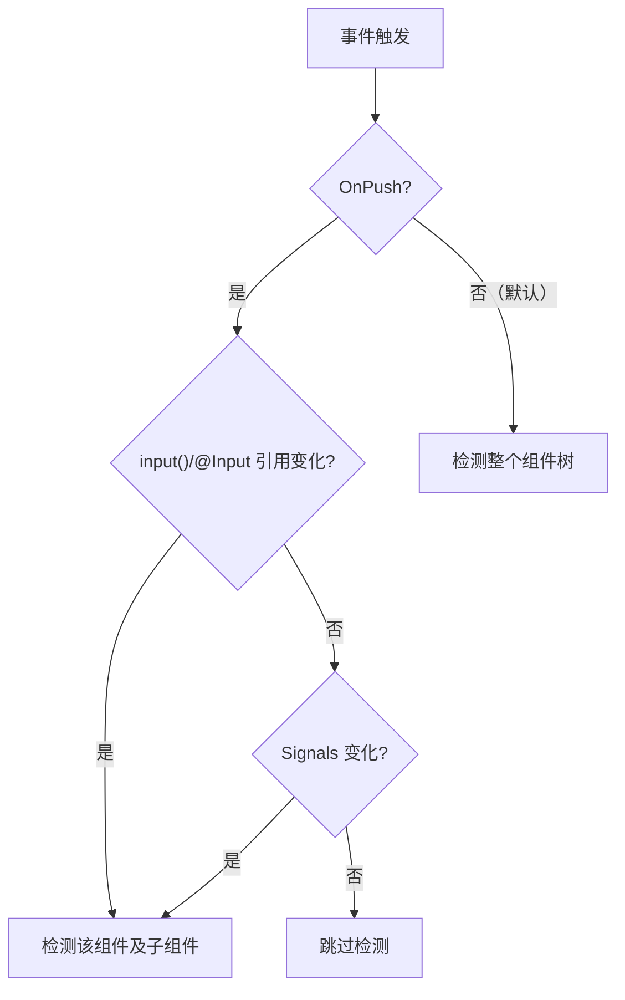

## 13-2 trackBy / track

```html
<!-- Angular 17+ 新语法 -->
@for (product of products; track product.id) {
  <app-product-card [product]="product" />
}

<!-- 旧语法（仍可用） -->
<li *ngFor="let product of products; trackBy: trackById">{{ product.name }}</li>
```

```typescript
trackById(index: number, product: Product): number {
  return product.id;
}
```

## 13-3 懒加载

```typescript
// 组件级别懒加载
{
  path: 'admin',
  loadComponent: () => import('./admin/admin.component').then(m => m.AdminComponent),
}

// 模块级别懒加载
{
  path: 'products',
  loadChildren: () => import('./products/products.routes').then(m => m.productRoutes),
}

// 图片懒加载

```

## 13-4 虚拟滚动

```bash
npm install @angular/cdk
```

```typescript
import { ScrollingModule } from '@angular/cdk/scrolling';

@Component({
  standalone: true,
  imports: [ScrollingModule],
  template: `
    <cdk-virtual-scroll-viewport itemSize="80" class="viewport">
      <div *cdkVirtualFor="let item of items">{{ item.name }}</div>
    </cdk-virtual-scroll-viewport>
  `,
  styles: [`.viewport { height: 500px; }`],
})
export class VirtualScrollComponent {
  items: Product[] = []; // 大量数据
}
```

## 13-5 Zoneless 模式（Angular 18+）

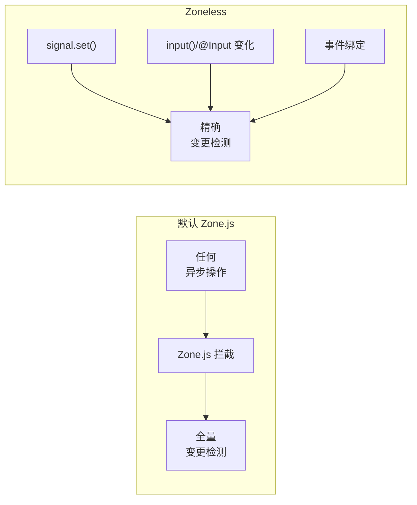

```typescript
// app.config.ts - 启用 Zoneless
import { provideZonelessChangeDetection } from '@angular/core';

export const appConfig: ApplicationConfig = {
  providers: [
    provideZonelessChangeDetection(),
  ],
};
```

## 13-6 构建优化

```json
// angular.json 优化配置
{
  "optimization": {
    "scripts": true,
    "styles": { "minify": true, "inlineCritical": true },
    "fonts": true
  },
  "outputHashing": "all",
  "sourceMap": false,
  "namedChunks": false,
  "aot": true,
  "extractLicenses": false,
  "budgets": {
    "initial": "500kb",
    "anyComponentStyle": "4kb"
  }
}
```

## 13-7 性能优化清单

| 优化项 | 效果 | 难度 |
|--------|------|------|
| **OnPush 变更检测** | 减少不必要的检测 | 🟢 低 |
| **trackBy/track** | 优化列表渲染 | 🟢 低 |
| **懒加载** | 减少首屏 Bundle | 🟢 低 |
| **虚拟滚动** | 优化长列表 | 🟡 中 |
| **Zoneless** | 减少运行时开销 | 🟡 中 |
| **AOT 编译** | 加快加载速度 | 🟢 低 |
| **Code Splitting** | 按需加载 | 🟡 中 |
| **图片优化** | 减少资源大小 | 🟢 低 |

---

# 📦 第14章：全栈实战与测试

## 14-1 项目架构

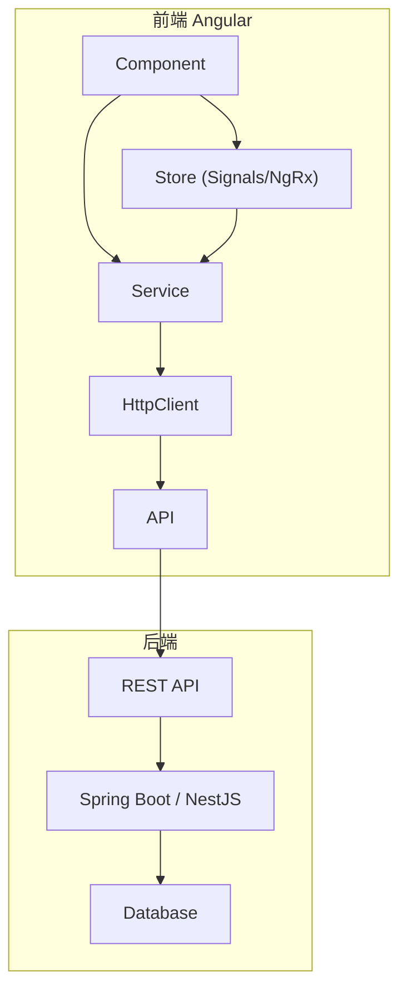

## 14-2 环境配置

```typescript
// environments/environment.ts
export const environment = {
  production: false,
  apiUrl: 'http://localhost:3000/api',
  appTitle: '电商管理系统',
};

// environments/environment.prod.ts
export const environment = {
  production: true,
  apiUrl: 'https://api.example.com',
  appTitle: '电商管理系统',
};
```

## 14-3 JWT 认证

```typescript
@Injectable({ providedIn: 'root' })
export class AuthService {
  private http = inject(HttpClient);
  private router = inject(Router);
  private readonly tokenKey = 'auth_token';

  // Signals 状态
  private readonly user = signal<User | null>(null);
  readonly currentUser = this.user.asReadonly();
  readonly isAuthenticated = computed(() => this.user() !== null);

  login(credentials: { email: string; password: string }): Observable<AuthResponse> {
    return this.http.post<AuthResponse>('/api/auth/login', credentials).pipe(
      tap(response => {
        localStorage.setItem(this.tokenKey, response.token);
        this.user.set(response.user);
      })
    );
  }

  logout() {
    localStorage.removeItem(this.tokenKey);
    this.user.set(null);
    this.router.navigate(['/login']);
  }

  getToken(): string | null {
    return localStorage.getItem(this.tokenKey);
  }
}
```

## 14-4 单元测试

```typescript
import { TestBed } from '@angular/core/testing';
import { ProductService } from './product.service';
import { provideHttpClient } from '@angular/common/http';
import { HttpTestingController, provideHttpClientTesting } from '@angular/common/http/testing';

describe('ProductService', () => {
  let service: ProductService;
  let httpMock: HttpTestingController;

  beforeEach(() => {
    TestBed.configureTestingModule({
      providers: [
        ProductService,
        provideHttpClient(),
        provideHttpClientTesting(),
      ],
    });
    service = TestBed.inject(ProductService);
    httpMock = TestBed.inject(HttpTestingController);
  });

  afterEach(() => {
    httpMock.verify();
  });

  it('should fetch products', () => {
    const mockProducts: Product[] = [
      { id: 1, name: 'Product A', price: 100, category: 'electronics' },
    ];

    service.getProducts().subscribe(products => {
      expect(products.length).toBe(1);
      expect(products[0].name).toBe('Product A');
    });

    const req = httpMock.expectOne('/api/products');
    expect(req.request.method).toBe('GET');
    req.flush(mockProducts);
  });
});
```

## 14-5 组件测试

```typescript
import { ComponentFixture, TestBed } from '@angular/core/testing';
import { ProductListComponent } from './product-list.component';
import { ProductService } from './product.service';
import { of } from 'rxjs';

describe('ProductListComponent', () => {
  let component: ProductListComponent;
  let fixture: ComponentFixture<ProductListComponent>;
  let mockProductService: jasmine.SpyObj<ProductService>;

  beforeEach(async () => {
    mockProductService = jasmine.createSpyObj('ProductService', ['getProducts']);
    mockProductService.getProducts.and.returnValue(of([
      { id: 1, name: 'Test', price: 100, category: 'test' },
    ]));

    await TestBed.configureTestingModule({
      imports: [ProductListComponent],
      providers: [
        { provide: ProductService, useValue: mockProductService },
      ],
    }).compileComponents();

    fixture = TestBed.createComponent(ProductListComponent);
    component = fixture.componentInstance;
    fixture.detectChanges();
  });

  it('should display products', () => {
    const compiled = fixture.nativeElement as HTMLElement;
    expect(compiled.querySelector('.product-name')?.textContent).toContain('Test');
  });

  it('should load products on init', () => {
    expect(mockProductService.getProducts).toHaveBeenCalled();
  });
});
```

## 14-6 SSR（Angular Universal）

```bash
ng add @angular/ssr
```

```typescript
// server.ts
import 'zone.js/node';
import { ngExpressEngine } from '@angular/ssr';
import express from 'express';

const server = express();
server.engine('html', ngExpressEngine({ bootstrap: AppServerModule }));
server.set('view engine', 'html');

// API 代理
server.use('/api', (req, res) => {
  res.redirect(`https://api.example.com${req.url}`);
});
```

---

# 🎯 高频面试题精选

## Q1: Angular 变更检测机制

Angular 默认使用 **Zone.js** 拦截所有异步任务（setTimeout、Promise、事件等），在异步任务完成后自动触发**全组件树**的变更检测（脏检查）。Angular 17+ 引入 **Signals**，提供更精确的更新路径。

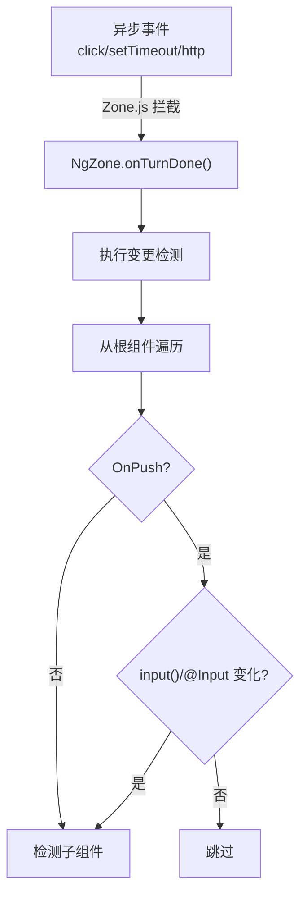

## Q2: DI 依赖注入原理

Angular 的 DI 框架基于**注入器树**，每个组件有自己的注入器，从当前组件向上查找至根注入器。

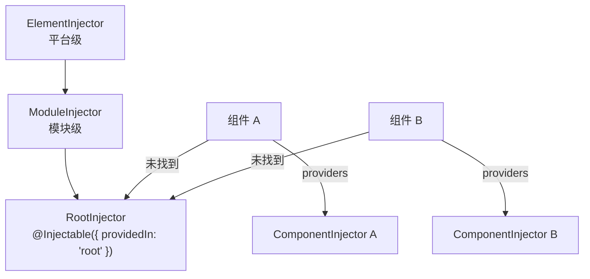

## Q3: Signals vs Observables

| 维度 | Signals | Observables |
|------|---------|-------------|
| 值类型 | 同步值 | 异步流 |
| 惰性 | ❌ 立即执行 | ✅ 懒惰（需订阅） |
| 初始值 | ✅ 必须 | ❌ 可选 |
| 多播 | ✅ 自动 | ⚠️ 需 share/publish |
| 清理 | ✅ 自动 | ⚠️ 需手动 unsubscribe |
| 模板使用 | ✅ 直接调用 | ❌ 需 async 管道 |

```typescript
// Signals：同步、简单
const count = signal(0);
count.set(1);
console.log(count()); // 1

// Observables：异步、复杂
const count$ = new BehaviorSubject(0);
count$.next(1);
count$.subscribe(v => console.log(v));
```

## Q4: 组件生命周期执行顺序

```
constructor → ngOnChanges → ngOnInit → ngDoCheck
→ ngAfterContentInit → ngAfterContentChecked
→ ngAfterViewInit → ngAfterViewChecked
→ ngOnDestroy
```

**父子组件顺序：**
```
父 constructor → 父 ngOnChanges → 父 ngOnInit
→ 子 constructor → 子 ngOnChanges → 子 ngOnInit
→ 子 ngAfterViewInit → 父 ngAfterViewInit
```

## Q5: input() / output() 数据流

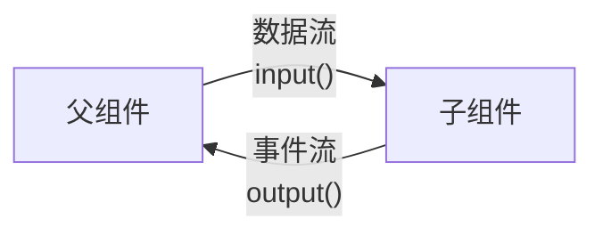

**input() 变化检测时机：** `ngOnChanges` 钩子接收 `SimpleChanges` 对象，包含当前值和前一个值（使用 `input()` 信号时同样触发 `ngOnChanges`）。

## Q6: 路由守卫类型

| 守卫 | 作用 | 执行时机 |
|------|------|---------|
| `canActivate` | 是否允许进入 | 进入路由前 |
| `canActivateChild` | 是否允许进入子路由 | 进入子路由前 |
| `canDeactivate` | 是否允许离开 | 离开路由前 |
| `canLoad`（已废弃） | 是否允许加载懒加载模块 | 加载前 |
| `canMatch` | 是否匹配路由（Angular 15+） | 匹配时 |

## Q7: Template-driven vs Reactive Forms

| 维度 | 模板驱动 | 响应式 |
|------|---------|--------|
| 数据源 | HTML 模板 | TypeScript 代码 |
| 验证 | HTML 属性 + 指令 | 验证函数 |
| 可测试性 | ⚠️ 一般 | ✅ 优秀 |
| 动态表单 | ❌ 困难 | ✅ 灵活 |
| 复杂度 | 简单表单 | 复杂表单 |

## Q8: Standalone 组件 vs NgModule

| 维度 | Standalone | NgModule |
|------|-----------|----------|
| 导入方式 | 组件内 imports | NgModule 内 imports |
| 模块文件 | ❌ 不需要 | ✅ 需要 |
| 懒加载 | ✅ 支持 | ✅ 支持 |
| 推荐度 | ✅ Angular 17+ 推荐 | ⚠️ 旧项目兼容 |
| 适用场景 | 新项目 | 遗留项目 |

## Q9: 纯管道 vs 非纯管道

- **纯管道**：只在输入值变化时重新计算（通过引用比较），性能好
- **非纯管道**：每次变更检测都重新计算，性能较差

```typescript
@Pipe({ name: 'pure', pure: true })    // 纯管道
@Pipe({ name: 'impure', pure: false }) // 非纯管道
```

## Q10: Angular 模块加载方式

```
Eager（立即加载）: 在 AppModule 中直接导入 → 包含在初始 Bundle 中
Lazy（懒加载）: loadChildren / loadComponent → 按需加载代码块
Preload（预加载）: PreloadAllModules → 在初始加载后后台加载
```

## Q11: TrackBy / track 的作用

优化列表渲染：`track`（新语法）/ `trackBy`（旧语法）帮助 Angular 识别列表中的每个元素，避免不必要的 DOM 操作。

```html
<!-- 没有 track：删除第一项时，所有列表项都会被重建 -->
@for (item of items; track $index) { ... }

<!-- 有 track：Angular 可以精确匹配和移动 DOM 节点 -->
@for (item of items; track item.id) { ... }
```

## Q12: Angular 跨平台能力

```
Web        → @angular/platform-browser
Mobile     → @angular/platform-browser + Capacitor/Cordova
Native     → NativeScript (Angular + NativeScript)
SSR        → @angular/ssr (Angular Universal)
Desktop    → Electron + Angular
PWA        → @angular/service-worker
```
