# 🚀 React 19 完整学习指南

> 这是一份全面、系统、图文并茂的 React 19 框架深度学习资料，融合核心原理、高级特性与工程实践，旨在帮助开发者从入门到精通。

---

## 📑 目录结构

- [📦 第一部分：核心基础](#第一部分核心基础)
  - [1️⃣ React 是什么？](#1️⃣-react-是什么)
  - [2️⃣ React 19 新特性](#2️⃣-react-19-新特性详解)
  - [3️⃣ JSX 语法](#3️⃣-jsx-语法)
  - [4️⃣ 组件基础](#4️⃣-组件基础)
  - [5️⃣ Props 与 State](#5️⃣-props-与-state)
  - [6️⃣ 事件处理](#6️⃣-事件处理)
  - [7️⃣ 条件渲染](#7️⃣-条件渲染)
  - [8️⃣ 列表与 Key](#8️⃣-列表与-key)
- [🚀 第二部分：高级特性](#第二部分高级特性)
  - [1️⃣ Hooks 系统](#1️⃣-hooks-系统)
  - [2️⃣ Context API](#2️⃣-context-api)
  - [3️⃣ Refs & DOM](#3️⃣-refs--dom)
  - [4️⃣ Portals](#4️⃣-portals)
  - [5️⃣ Error Boundaries](#5️⃣-error-boundaries)
  - [6️⃣ Fragments](#6️⃣-fragments)
  - [7️⃣ 高阶组件](#7️⃣-高阶组件)
  - [8️⃣ Render Props](#8️⃣-render-props)
- [🛠️ 第三部分：工程实践](#第三部分工程实践)
  - [1️⃣ Next.js 框架](#1️⃣-nextjs-框架)
  - [2️⃣ 状态管理](#2️⃣-状态管理)
  - [3️⃣ 路由系统](#3️⃣-路由系统)
  - [4️⃣ 测试策略](#4️⃣-测试策略)
  - [5️⃣ TypeScript 集成](#5️⃣-typescript-集成)
  - [6️⃣ 代码规范](#6️⃣-代码规范)
- [⚡ 第四部分：性能优化](#第四部分性能优化)
  - [1️⃣ React.memo](#1️⃣-reactmemo)
  - [2️⃣ useMemo & useCallback](#2️⃣-usememo--usecallback)
  - [3️⃣ 代码分割](#3️⃣-代码分割)
  - [4️⃣ 虚拟列表](#4️⃣-虚拟列表)
  - [5️⃣ 并发模式](#5️⃣-并发模式)
  - [6️⃣ React Compiler](#6️⃣-react-compiler)
  - [7️⃣ Server Components](#7️⃣-server-components)
  - [8️⃣ 2026 性能优化趋势](#8️⃣-2026-性能优化趋势)
- [🎯 第五部分：面试题汇总](#第五部分面试题汇总)
  - [1️⃣ 基础面试题](#1️⃣-基础面试题)
  - [2️⃣ Hooks 面试题](#2️⃣-hooks-面试题)
  - [3️⃣ 原理面试题](#3️⃣-原理面试题)
  - [4️⃣ 实战面试题](#4️⃣-实战面试题)

---

# 第一部分：核心基础

## 1️⃣ React 是什么？

### 📌 核心定义

**React** 是由 Facebook 开发的 JavaScript 库，用于构建用户界面。它通过**组件化思想**和**声明式编程**，帮助开发者高效构建交互式、动态的 Web 应用。

```typescript
// React 的三大特性：
// 1. 声明式：描述你想要什么，而不是如何实现
// 2. 组件化：封装独立可复用的 UI 单元
// 3. 虚拟 DOM：高效批量更新真实 DOM
```

### 🎯 React 的核心角色

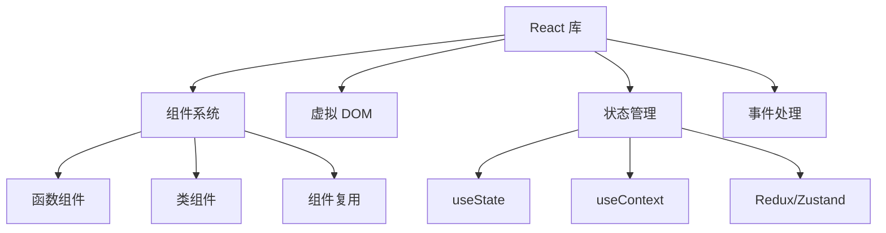

### 📊 React vs 其他框架

| 特性 | React | Vue | Angular |
|-----|-------|-----|---------|
| 学习曲线 | 🟡 中等 | 🟢 平缓 | 🔴 陡峭 |
| 灵活性 | ✅ 极高 | ⚠️ 中等 | ❌ 受限 |
| 生态系统 | ✅ 最庞大 | ⚠️ 中等 | ✅ 完整 |
| 性能 | ✅ 优秀 | ✅ 优秀 | ✅ 优秀 |
| 企业应用 | ✅ 完美 | ⚠️ 可行 | ✅ 完美 |

### 🎨 React 设计理念

1. **声明式**：为每个状态设计简洁的视图，数据变更时 React 高效更新
2. **组件化**：可组合、可复用、可维护、可测试
3. **虚拟 DOM**：函数式 UI 编程 + 保证性能下限
4. **函数式编程**：给定输入 → 确定输出，无副作用
5. **一次学习，随处编写**：Web / Native / SSR

---

## 2️⃣ React 19 新特性详解

### 🌟 重要特性速览

```
React 19 (2024)
├─ React Compiler (自动优化)
├─ Actions (统一表单处理)
├─ use() Hook (异步数据)
├─ useOptimistic() (乐观更新)
├─ useFormStatus/useFormState
├─ Server Components 支持
└─ Web Components 增强
```

### 🔧 React Compiler (Forget)详解

#### 问题背景

手动优化 React 性能很复杂：

```typescript
// ❌ 需要手动记忆化
const MyComponent = memo((props) => {
  const handleClick = useCallback(() => {}, []);
  const value = useMemo(() => expensiveComputation(), [dep]);
  return <Child onClick={handleClick} value={value} />;
});
```

#### 解决方案：Compiler 自动优化

```typescript
// ✅ 自动转换，无需手动记忆化
function MyComponent(props) {
  const handleClick = () => {};        // ← Compiler 自动缓存
  const value = expensiveComputation(); // ← Compiler 自动缓存
  return <Child onClick={handleClick} value={value} />;
}
```

**性能收益：**
- 自动消除不必要的重新渲染
- 减少 90%+ 的手写优化代码
- 编译时静态分析，零运行时成本

### 🎯 Actions 机制

```typescript
async function submitForm(prevState, formData) {
  const username = formData.get('username');
  try {
    const response = await fetch('/api/login', {
      method: 'POST',
      body: JSON.stringify({ username, password })
    });
    return { success: true, message: '登录成功!' };
  } catch (error) {
    return { success: false, message: '登录失败' };
  }
}

export function LoginForm() {
  const [state, formAction] = useFormState(submitForm, null);
  const { pending } = useFormStatus();

  return (
    <form action={formAction}>
      <input name="username" />
      <button type="submit" disabled={pending}>
        {pending ? '登录中...' : '登录'}
      </button>
      {state?.message && <p>{state.message}</p>}
    </form>
  );
}
```

**改进点：**
- ✅ 自动加载状态管理
- ✅ 简化异步操作处理
- ✅ 内置乐观更新支持

### ⏳ `use()` Hook - 异步数据获取

```typescript
import { use, Suspense } from 'react';

function DataComponent() {
  const data = use(fetchPromise);
  return <div>{data.title}</div>;
}

function App() {
  return (
    <Suspense fallback={<LoadingSpinner />}>
      <DataComponent />
    </Suspense>
  );
}
```

### ⏱️ React 18 vs 19 vs 20 关键变化

| 特性 | React 18 (2022) | React 19 (2024) | React 20 (2025+) |
|------|-----------------|-----------------|------------------|
| 并发模式 | 可选启用 | 默认启用 | 默认启用 |
| startTransition | ✅ | ✅ 增强 | ✅ 自动 |
| use() | ❌ | ✅ | ✅ 增强 |
| useOptimistic | ❌ | ✅ | ✅ 自动 |
| Server Components | 实验性 | ✅ 稳定 | ✅ 默认推荐 |
| ref 传参 | forwardRef | 直接传 ref | 直接传 ref |
| Compiler | 实验性 | ✅ 自动 memo | ✅ 默认 |

---

### 🚀 React 在 2026 年的最新进展

#### React 技术发展演进时间线

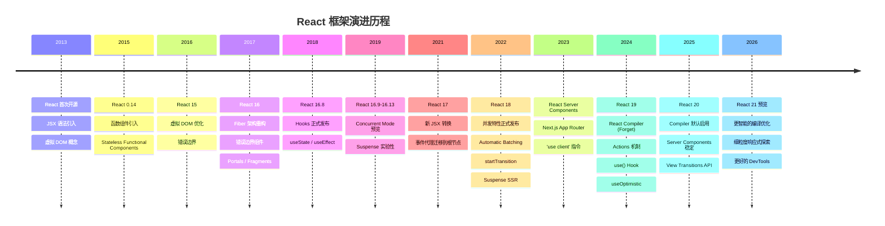

#### React Compiler 工作原理

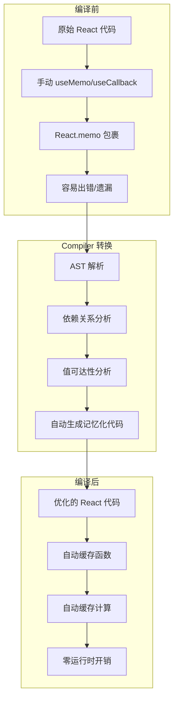

#### Compiler 优化对比

| 优化项 | 手动优化 | Compiler 自动优化 |
|--------|---------|------------------|
| 函数缓存 | useCallback | 自动识别并缓存 |
| 计算缓存 | useMemo | 自动识别并缓存 |
| 组件缓存 | React.memo | 自动包裹 |
| 依赖数组 | 手动维护 | 自动推导 |
| 性能收益 | 60-70% | 90%+ |
| 代码量 | 增加 30% | 减少 50% |

#### React Server Components 成为默认

```jsx
// app/page.jsx - 默认就是 Server Component
export default async function Page() {
  const data = await fetch('https://api.example.com/data')
  return <DataDisplay data={data} />
}

// app/component.client.jsx - 需要交互时标记
'use client'
export function InteractiveComponent() {
  const [count, setCount] = useState(0)
  return <button onClick={() => setCount(c => c + 1)}>{count}</button>
}
```

#### RSC 架构工作原理

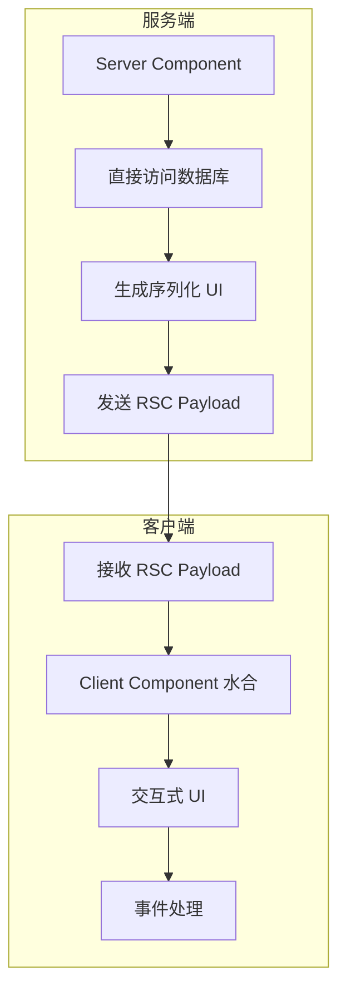

#### View Transitions API 集成

```jsx
// React 19+ 支持 View Transitions
import { useViewTransition } from 'react'

function PageTransition({ children }) {
  return (
    <ViewTransition>
      {children}
    </ViewTransition>
  )
}
```

#### 2026 年 React 生态工具链

| 工具 | 最新版本 | 关键变化 |
|------|----------|----------|
| React | 19/20 | Compiler 默认，RSC 稳定 |
| Next.js | 15+ | App Router 默认，Turbopack |
| React Router | 7+ | 统一客户端/服务端路由 |
| Redux | 5+ | RTK 简化，更好的 TS |
| Zustand | 5+ | 更轻量，持久化内置 |
| TanStack Query | 5+ | 更精细缓存，SSR 优化 |
| React Testing Library | 16+ | 更好的异步测试 |

#### 2026 年前端框架格局

| 框架 | 定位 | 2026 状态 |
|------|------|-----------|
| React 19 + Next.js | 全栈应用首选 | 最广泛使用 |
| Angular 21 | 企业级应用 | Zoneless 默认，性能大幅提升 |
| Vue 3.6 + Nuxt 4 | 渐进式开发 | Vapor Mode 实验性，性能接近 Solid |
| Svelte 5 | 编译时优化 | Runes 响应式，轻量级首选 |
| Solid.js | 细粒度响应式 | 性能标杆，生态增长中 |
| Astro 5 | 内容型网站 | Islands 架构，零 JS 默认 |

#### React 生态全景图

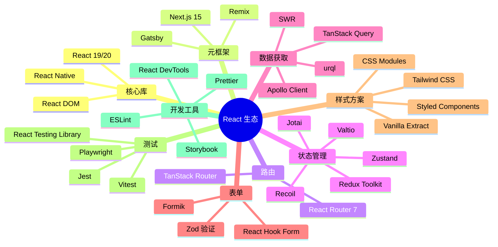

---

## 3️⃣ JSX 与 Babel

### 📝 JSX 详解

JSX 是 **JavaScript XML**，让你能在 JS 中写 HTML 结构。JSX 本质是 `React.createElement` 的语法糖，经 Babel 编译为 AST → createElement 调用 → React 元素对象 → 虚拟 DOM → 真实 DOM。

```jsx
// 原始 JSX
const element = <h1 className="greeting">Hello, {name}!</h1>;

// Babel 编译后
const element = React.createElement(
  "h1",
  { className: "greeting" },
  "Hello, ", name, "!"
);
```

### 🔄 JSX 转换流程图

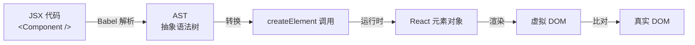

### ⚙️ JSX 规则

```jsx
// ✅ 使用 Fragment 避免多余 DOM
return (
  <>
    <p>Hello</p>
    <p>World</p>
  </>
);

// ✅ 属性驼峰命名
<div className="card" data-testid="card" />

// ✅ 表达式插值
<p>Count: {count * 2}</p>

// ✅ 条件渲染
{showTitle ? <h1>Title</h1> : null}
{showTitle && <h1>Title</h1>}
```

---

## 4️⃣ 组件与 Props 深度剖析

### 🧩 组件解剖

```typescript
import { ReactNode } from 'react';

interface CardProps {
  title: string;
  children: ReactNode;
  onClick?: (id: string) => void;
  disabled?: boolean;
}

function Card({ title, children, onClick, disabled = false }: CardProps) {
  return (
    <div className="card" style={{ opacity: disabled ? 0.5 : 1 }}>
      <h2>{title}</h2>
      <div className="card-body">{children}</div>
      <button onClick={() => onClick?.(title)} disabled={disabled}>Click Me</button>
    </div>
  );
}
```

### 📊 Props 完整对比

| 特征 | Props | State |
|------|-------|-------|
| 来源 | 父组件 | 组件自身 |
| 可修改 | ❌ 只读 | ✅ 可修改 |
| 默认值 | Component.defaultProps | useState 初值 |
| 影响重建 | ✅ Props 变化重新渲染 | ✅ State 变化重新渲染 |

### 🔄 React.Component vs React.PureComponent

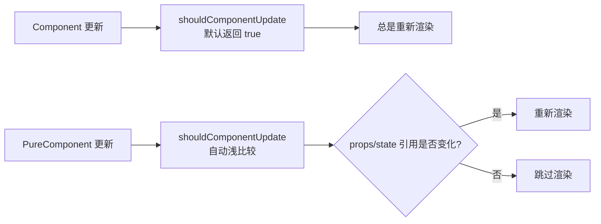

**注意：** PureComponent 进行**浅比较**，引用类型只比较地址。如需深比较的数据变更，必须创建新对象。

> ⚠️ **易错点**：直接在现有对象上修改属性然后 `setState` 不会触发 PureComponent 重新渲染。务必使用展开运算符或 Object.assign 创建新对象。

### 🔟 受控组件 vs 非受控组件

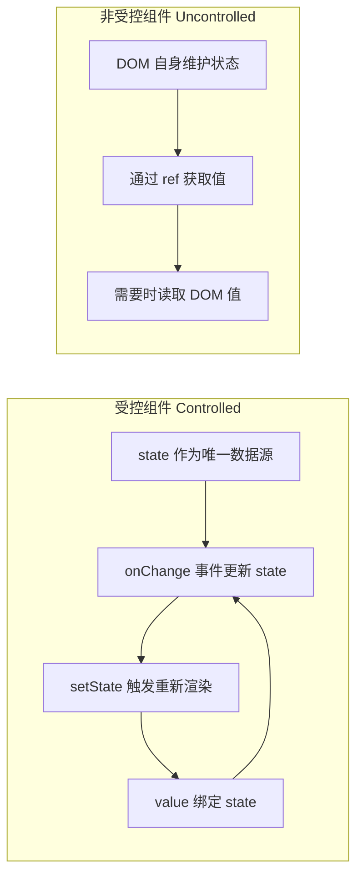

| 维度 | 受控组件 | 非受控组件 |
|------|---------|-----------|
| 数据源 | React state | DOM 自身 |
| 值获取 | state 变量 | ref 读取 |
| 表单验证 | ✅ 容易 | ❌ 困难 |
| 适用场景 | 复杂表单 | 简单一次性表单 |

---

## 5️⃣ React 事件机制

### 📌 合成事件（SyntheticEvent）

React 的事件并非绑定在真实的 DOM 节点上，而是通过**事件代理（Event Delegation）**的方式，将所有事件统一绑定在根容器上。当事件冒泡到根容器时，React 将事件内容封装并交由真正的处理函数运行。

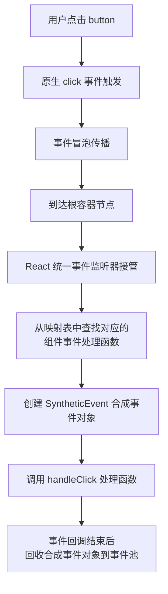

**React 事件与原生 HTML 事件的区别：**

| 对比项 | 原生事件 | React 事件 |
|--------|---------|-----------|
| 命名方式 | 全小写 `onclick` | 小驼峰 `onClick` |
| 处理函数语法 | 字符串 `"handle()"` | 函数 `{handleClick}` |
| 阻止默认行为 | `return false` | `e.preventDefault()` |
| 执行顺序 | 先执行 | 后执行（冒泡到根容器） |

> 💡 React 17+ 将事件代理从 document 迁移到 root DOM 容器，为微前端和多版本 React 共存提供更好的隔离性。

---

## 6️⃣ Hooks 系统完全指南

### 🎣 Hooks 工作原理

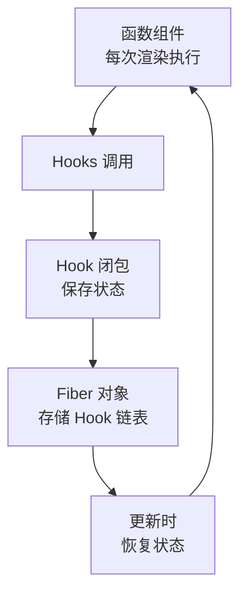

### 📍 useState - 状态管理

```typescript
const [count, setCount] = useState(0);

// 函数式初始化（避免重复计算）
const [state, setState] = useState(() => expensiveComputation());

// 更新函数（基于前一个状态）
setState(prev => prev + 1);
```

**规则 ⚠️：**
- ✅ 只在组件顶层调用
- ✅ 只在函数组件中调用
- ❌ 不要在循环、条件、嵌套函数中调用

### 📍 useEffect - 副作用管理

```typescript
function EffectDemo() {
  useEffect(() => {
    console.log('挂载 + 每次渲染后');
    return () => console.log('清理副作用');
  }); // 没有依赖数组，每次都运行

  useEffect(() => {
    console.log('仅在挂载时运行');
    return () => console.log('卸载时清理');
  }, []); // 空依赖数组，仅一次

  useEffect(() => {
    console.log('count 或 name 变化时运行');
  }, [count, name]); // 指定依赖

  return null;
}
```

**常见模式：**

```typescript
// 数据获取（处理竞态条件）
useEffect(() => {
  let ignore = false;
  fetchData().then(data => { if (!ignore) setData(data); });
  return () => { ignore = true; };
}, []);

// 事件监听
useEffect(() => {
  const handleResize = () => console.log('resized');
  window.addEventListener('resize', handleResize);
  return () => window.removeEventListener('resize', handleResize);
}, []);

// 定时器
useEffect(() => {
  const timer = setInterval(() => console.log('tick'), 1000);
  return () => clearInterval(timer);
}, []);
```

### 📍 useContext - 跨组件通信

```typescript
const ThemeContext = createContext<'light' | 'dark'>('light');

function ThemeProvider({ children }: { children: ReactNode }) {
  const [theme, setTheme] = useState<'light' | 'dark'>('light');
  return (
    <ThemeContext.Provider value={theme}>
      {children}
    </ThemeContext.Provider>
  );
}

function ThemedButton() {
  const theme = useContext(ThemeContext);
  return <button style={{
    background: theme === 'light' ? '#fff' : '#333',
    color: theme === 'light' ? '#000' : '#fff'
  }}>按钮</button>;
}
```

### 📍 useReducer - 复杂状态逻辑

```typescript
type Action =
  | { type: 'ADD_TODO'; payload: Todo }
  | { type: 'REMOVE_TODO'; payload: number }
  | { type: 'TOGGLE_TODO'; payload: number };

function todoReducer(state: State, action: Action): State {
  switch (action.type) {
    case 'ADD_TODO':
      return { ...state, todos: [...state.todos, action.payload] };
    case 'REMOVE_TODO':
      return { ...state, todos: state.todos.filter(t => t.id !== action.payload) };
    case 'TOGGLE_TODO':
      return {
        ...state,
        todos: state.todos.map(t => t.id === action.payload ? { ...t, completed: !t.completed } : t)
      };
    default:
      return state;
  }
}

function TodoApp() {
  const [state, dispatch] = useReducer(todoReducer, initialState);
  return (
    <div>
      {state.todos.map(todo => (
        <input type="checkbox" checked={todo.completed}
          onChange={() => dispatch({ type: 'TOGGLE_TODO', payload: todo.id })} />
      ))}
    </div>
  );
}
```

### 📍 useRef - 访问 DOM 和保存值

```typescript
// 访问 DOM 元素
function TextInput() {
  const inputRef = useRef<HTMLInputElement>(null);
  const focusInput = () => { inputRef.current?.focus(); };
  return <><input ref={inputRef} /><button onClick={focusInput}>Focus Input</button></>;
}

// 保存可变值（不触发重新渲染）
function StopWatch() {
  const intervalRef = useRef<number | null>(null);
  const start = () => { intervalRef.current = setInterval(() => {}, 1000); };
  const stop = () => { if (intervalRef.current) clearInterval(intervalRef.current); };
  return <><button onClick={start}>Start</button><button onClick={stop}>Stop</button></>;
}
```

### 📍 useCallback & useMemo - 性能优化

```typescript
// ❌ 问题：每次重新创建函数，导致子组件重新渲染
function Parent() {
  const handleClick = () => console.log('clicked');
  return <Child onClick={handleClick} />;
}

// ✅ useCallback 缓存函数
function Parent() {
  const handleClick = useCallback(() => console.log('clicked'), []);
  return <Child onClick={handleClick} />;
}

// ✅ useMemo 缓存计算结果
function Component() {
  const expensiveValue = useMemo(() => complexComputation(data), [data]);
  return <div>{expensiveValue}</div>;
}
```

### ⏱️ useEffect vs useLayoutEffect

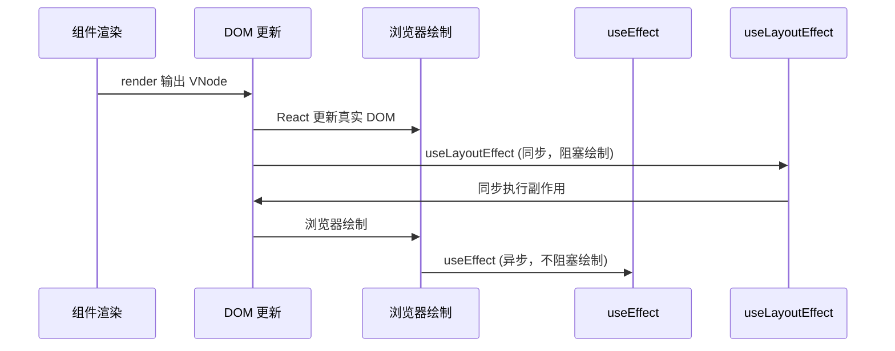

| 特性 | useEffect | useLayoutEffect |
|------|-----------|----------------|
| 执行时机 | 浏览器绘制后（异步） | DOM 更新后绘制前（同步） |
| 阻塞绘制 | ❌ 不阻塞 | ✅ 阻塞 |
| 适用场景 | 数据获取、订阅、日志 | DOM 测量、样式调整 |
| 推荐度 | ⭐ 优先使用 | ⚠️ 特殊场景使用 |

### 📋 Hooks 与 Class 生命周期对照

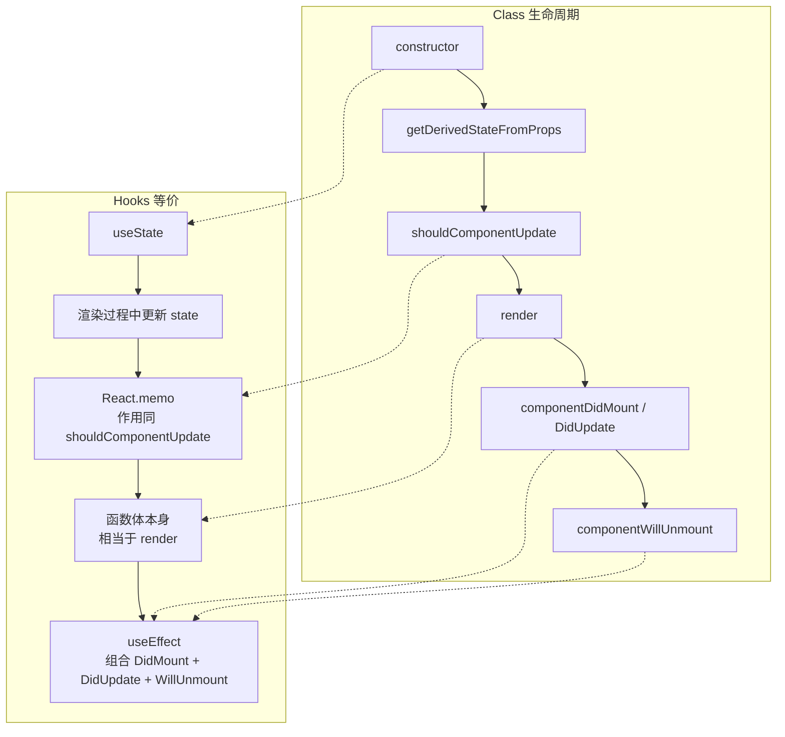

### 📍 React 19 新增 Hooks

```typescript
// use() - 异步数据获取
function DataComponent() {
  const data = use(fetchPromise);
  return <div>{data}</div>;
}

// useOptimistic() - 乐观更新
function TodoList() {
  const [optimisticTodos, addOptimisticTodo] = useOptimistic(todos);
  const handleAdd = async (todo: Todo) => {
    addOptimisticTodo([...optimisticTodos, todo]);
    await saveTodo(todo);
  };
  return <ul>{optimisticTodos.map(todo => <li key={todo.id}>{todo.text}</li>)}</ul>;
}

// useFormStatus() - 表单状态
function SubmitButton() {
  const { pending } = useFormStatus();
  return <button disabled={pending}>{pending ? '提交中...' : '提交'}</button>;
}

// useFormState() - 表单结果
function LoginForm() {
  const [state, formAction] = useFormState(login, null);
  return (
    <form action={formAction}>
      <input name="email" type="email" />
      <button type="submit">登录</button>
      {state?.error && <p>{state.error}</p>}
    </form>
  );
}
```

---

## 7️⃣ 自定义 Hooks 设计模式

### 🎣 常用自定义 Hooks

```typescript
// useAsync - 异步操作管理
function useAsync<T>(asyncFunction: () => Promise<T>, immediate = true) {
  const [state, setState] = useState<{
    status: 'idle' | 'pending' | 'success' | 'error';
    data: T | null;
    error: Error | null;
  }>({ status: 'idle', data: null, error: null });

  const execute = useCallback(async () => {
    setState({ status: 'pending', data: null, error: null });
    try {
      const response = await asyncFunction();
      setState({ status: 'success', data: response, error: null });
      return response;
    } catch (error) {
      setState({ status: 'error', data: null, error: error as Error });
    }
  }, [asyncFunction]);

  useEffect(() => { if (immediate) execute(); }, [execute, immediate]);

  return { ...state, execute };
}

// useLocalStorage - 本地存储 Hook
function useLocalStorage<T>(key: string, initialValue: T) {
  const [storedValue, setStoredValue] = useState<T>(() => {
    try {
      const item = window.localStorage.getItem(key);
      return item ? JSON.parse(item) : initialValue;
    } catch { return initialValue; }
  });

  const setValue = (value: T | ((val: T) => T)) => {
    try {
      const valueToStore = value instanceof Function ? value(storedValue) : value;
      setStoredValue(valueToStore);
      window.localStorage.setItem(key, JSON.stringify(valueToStore));
    } catch (error) { console.error(error); }
  };

  return [storedValue, setValue] as const;
}

// useDebounce - 防抖 Hook
function useDebounce<T>(value: T, delay: number): T {
  const [debouncedValue, setDebouncedValue] = useState(value);
  useEffect(() => {
    const handler = setTimeout(() => setDebouncedValue(value), delay);
    return () => clearTimeout(handler);
  }, [value, delay]);
  return debouncedValue;
}
```

---

## 8️⃣ 生命周期与 Fiber 架构

### 🔄 组件生命周期（React 16+）

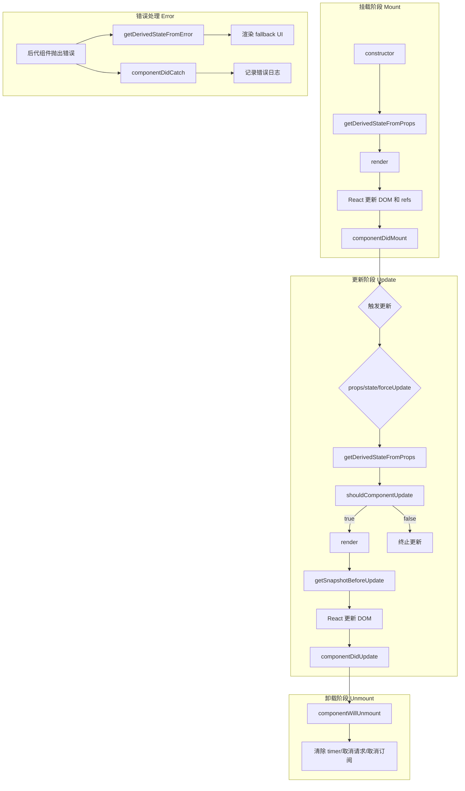

#### 废弃的生命周期（React 16+）

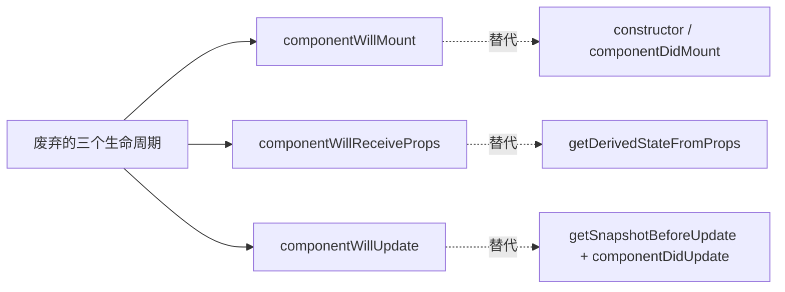

**废弃原因（Fiber 架构导致）：**
- Fiber 让渲染过程可中断，`render` 之前的生命周期可能被执行多次
- `componentWillMount`：功能可被 constructor 和 componentDidMount 替代
- `componentWillReceiveProps`：容易破坏单一数据源
- `componentWillUpdate`：回调可能被多次调用，无法可靠获取 DOM 信息

### 🏗️ Fiber 架构

Fiber 架构将虚拟 DOM 从递归不可中断的 Stack Reconciler 重构为可中断的 Fiber 链表结构，引入时间切片和优先级调度机制。

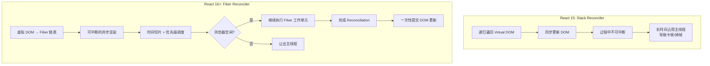

**Fiber 架构核心概念：**
- **Fiber Node**：每个组件对应一个 Fiber 节点，构成 Fiber 树（单链表结构）
- **双缓冲**：`current` 树（当前 UI）和 `workInProgress` 树（内存中构建的新树）
- **时间切片（Time Slicing）**：将一个渲染任务拆分成多个小单元，每执行完一个单元就让出主线程
- **优先级调度**：任务分优先级，高优先级任务（如用户输入）可打断低优先级任务（如数据加载）

### 🔄 Reconciliation（协调）过程

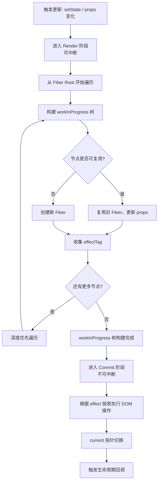

| 阶段 | 是否可中断 | 主要工作 |
|------|-----------|---------|
| Render | 可中断 | 构建 workInProgress 树，diff 对比，标记 effect |
| Pre-commit | 不可中断 | 读取 DOM 快照（getSnapshotBeforeUpdate） |
| Commit | 不可中断 | 执行 DOM 操作，触发生命周期 |

---

## 9️⃣ 代码复用方案对比

### 🧩 HOC vs Render Props vs Hooks

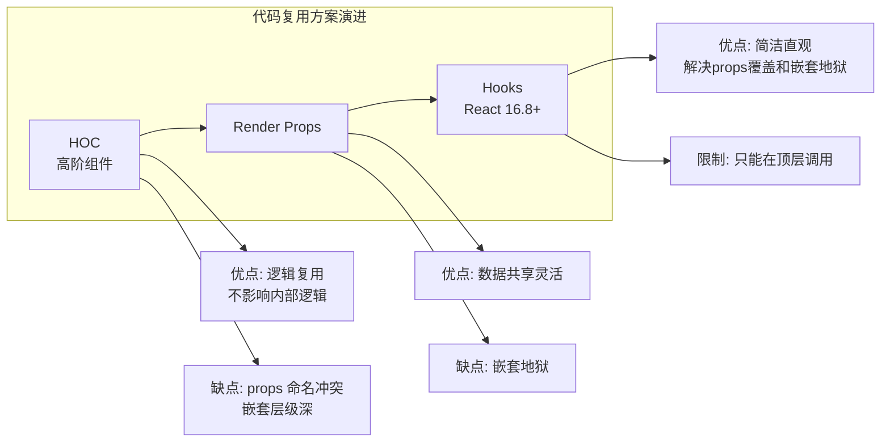

| 维度 | HOC | Render Props | Hooks |
|------|-----|-------------|-------|
| 模式 | 装饰器模式 | 函数作为 children | 组合式函数 |
| 命名冲突 | ⚠️ 容易冲突 | ✅ 不冲突 | ✅ 不冲突 |
| 嵌套层级 | 深 | 深（嵌套地狱） | 浅 |
| 模板代码 | 多 | 多 | 少 |
| 推荐度 | ⭐⭐ | ⭐ | ⭐⭐⭐⭐⭐ |

**HOC 示例：**

```javascript
function withSubscription(WrappedComponent, selectData) {
  return class extends React.Component {
    constructor(props) {
      super(props)
      this.state = { data: selectData(DataSource, props) }
    }
    render() {
      return <WrappedComponent data={this.state.data} {...this.props} />
    }
  }
}
```

**Render Props 示例：**

```javascript
class DataProvider extends React.Component {
  state = { name: 'Tom' }
  render() {
    return <div>{this.props.render(this.state)}</div>
  }
}
// 使用: <DataProvider render={data => <h1>Hello {data.name}</h1>} />
```

---

# 第二部分：高级特性

## 🔟 Context API 深度应用

### 🔄 Context 完整工作流

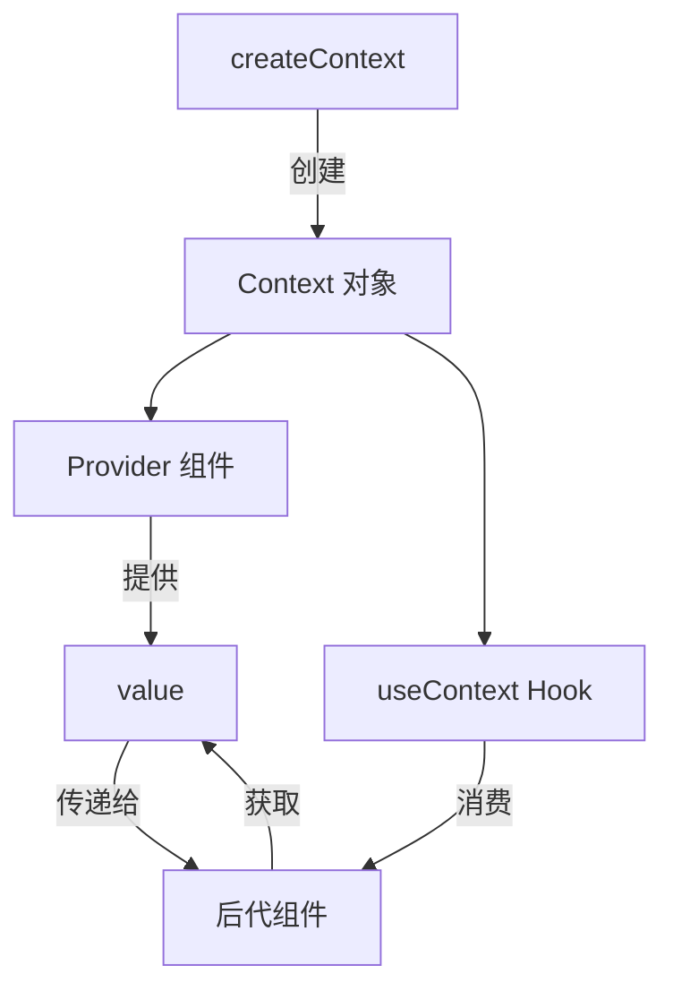

### 🎯 实战：主题系统

```typescript
// theme-context.ts
interface ThemeContextType {
  theme: { primary: string; background: string; text: string };
  toggleTheme: () => void;
  currentThemeName: 'light' | 'dark';
}

const ThemeContext = createContext<ThemeContextType | undefined>(undefined);

const themes = {
  light: { primary: '#007bff', background: '#ffffff', text: '#000000' },
  dark: { primary: '#0d6efd', background: '#1a1a1a', text: '#ffffff' }
};

export function ThemeProvider({ children }: { children: ReactNode }) {
  const [themeName, setThemeName] = useState<'light' | 'dark'>('light');
  const value: ThemeContextType = {
    theme: themes[themeName],
    toggleTheme: () => setThemeName(prev => prev === 'light' ? 'dark' : 'light'),
    currentThemeName: themeName
  };
  return <ThemeContext.Provider value={value}>{children}</ThemeContext.Provider>;
}

export function useTheme() {
  const context = useContext(ThemeContext);
  if (!context) throw new Error('useTheme must be used within ThemeProvider');
  return context;
}
```

---

## 1️⃣1️⃣ 状态管理完全指南

### 📊 状态管理金字塔

```
                    复杂全局状态
                   /            \
          Redux / Zustand     TanStack Query
              (客户端)         (服务器状态)

      ┌─────────────────────────────────┐
      │   Context API                   │
      │   主题、语言、用户信息          │
      └─────────────────────────────────┘

      ┌─────────────────────────────────┐
      │   useState / useReducer          │
      │   本地组件状态                   │
      └─────────────────────────────────┘
```

### 🎯 方案对比表

| 方案 | 复杂度 | 学习曲线 | 用途 |
|------|-------|----------|------|
| useState | 低 | 🟢 简单 | 简单本地状态 |
| useReducer | 中 | 🟡 中等 | 复杂本地状态 |
| Context | 中 | 🟡 中等 | 跨组件共享状态 |
| Redux | 高 | 🔴 陡峭 | 大型应用全局状态 |
| Zustand | 中 | 🟢 简单 | 轻量级全局状态 |
| TanStack Query | 中 | 🟡 中等 | 服务器数据管理 |

### 💡 Zustand 实例（推荐）

```typescript
import create from 'zustand';
import { devtools, persist } from 'zustand/middleware';

interface TodoStore {
  todos: Todo[];
  addTodo: (text: string) => void;
  removeTodo: (id: number) => void;
  toggleTodo: (id: number) => void;
}

export const useTodoStore = create<TodoStore>()(
  devtools(
    persist(
      (set) => ({
        todos: [],
        addTodo: (text) => set((state) => ({
          todos: [...state.todos, { id: Date.now(), text, completed: false }]
        })),
        removeTodo: (id) => set((state) => ({
          todos: state.todos.filter(t => t.id !== id)
        })),
        toggleTodo: (id) => set((state) => ({
          todos: state.todos.map(t => t.id === id ? { ...t, completed: !t.completed } : t)
        }))
      }),
      { name: 'todo-store' }
    ),
    { name: 'TodoStore' }
  )
);
```

### 🏪 Redux 工作流

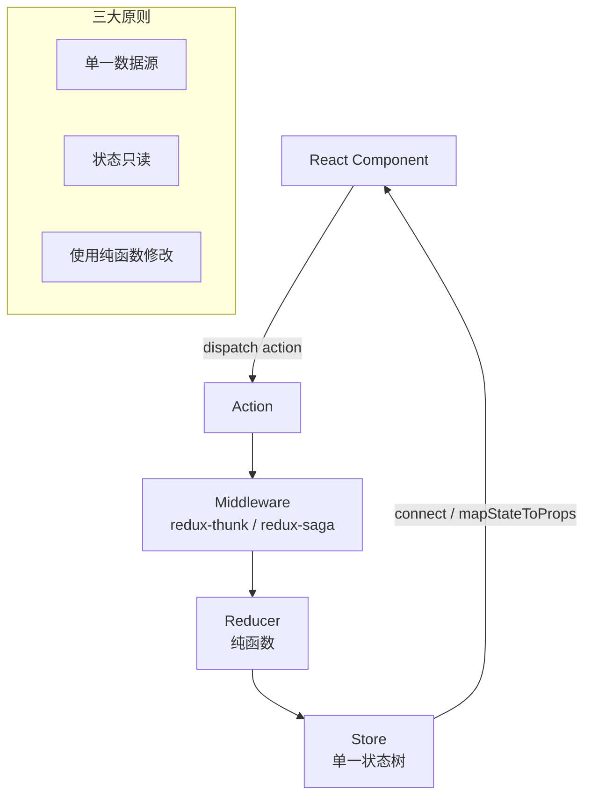

**Redux 中间件原理：**

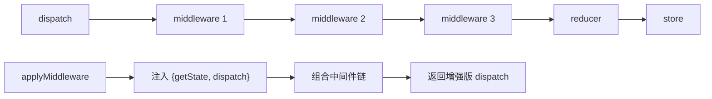

### 🧩 Jotai / Recoil（原子化状态管理）

```typescript
import { atom, useAtom } from 'jotai';

const countAtom = atom(0);
const doubledAtom = atom((get) => get(countAtom) * 2);

function Counter() {
  const [count, setCount] = useAtom(countAtom);
  const [doubled] = useAtom(doubledAtom);
  return <button onClick={() => setCount(c => c + 1)}>+1 (Double: {doubled})</button>;
}
```

**Context API vs Jotai/Recoil：**

| 维度 | Context API | Jotai/Recoil |
|------|-------------|--------------|
| 渲染优化 | 所有消费者重渲染 | 仅关联原子变化时重渲染 |
| 组合性 | 多层 Provider 嵌套 | 原子自由组合 |
| TypeScript | 中等 | 优秀 |
| Bundle 大小 | 内置 | ~3KB (Jotai) |

### 🔄 Zustand vs Redux vs MobX

| 维度 | Zustand | Redux Toolkit | MobX |
|------|---------|---------------|------|
| 范式 | 不可变 | 不可变（Immer） | 可变（响应式） |
| 模板代码 | 极少 | 中等 | 少 |
| Bundle | ~1KB | ~12KB | ~16KB |
| 学习曲线 | 低 | 中 | 低 |
| TypeScript | 优秀 | 优秀 | 一般 |
| 最适合 | 中小型项目 | 大型复杂项目 | 响应式思维项目 |

### 📡 TanStack Query (React Query)

```typescript
import { useQuery, useMutation, useQueryClient } from '@tanstack/react-query';

function Todos() {
  const { data, isLoading, error } = useQuery({
    queryKey: ['todos'],
    queryFn: () => fetch('/api/todos').then(r => r.json()),
    staleTime: 5 * 60 * 1000,
    cacheTime: 30 * 60 * 1000,
  });

  if (isLoading) return <Spinner />;
  return <TodoList todos={data} />;
}

function AddTodo() {
  const queryClient = useQueryClient();
  const mutation = useMutation({
    mutationFn: (newTodo) => fetch('/api/todos', { method: 'POST', body: JSON.stringify(newTodo) }),
    onSuccess: () => queryClient.invalidateQueries({ queryKey: ['todos'] }),
  });
  return <button onClick={() => mutation.mutate({ text: 'New Todo' })}>
    {mutation.isPending ? 'Adding...' : 'Add Todo'}
  </button>;
}
```

**TanStack Query vs SWR vs Apollo：**

| 维度 | TanStack Query | SWR | Apollo Client |
|------|----------------|-----|---------------|
| 协议 | REST/GraphQL | REST/GraphQL | GraphQL |
| 缓存策略 | 精细（GC/Stale） | 基础 | 规范化缓存 |
| 重试策略 | 可配置指数退避 | 基础 | 基础 |
| 乐观更新 | ✅ | ✅ | ✅ |
| Bundle | ~13KB | ~5KB | ~35KB |

**数据获取流程图：**

```mermaid
sequenceDiagram
    participant C as Component
    participant Q as QueryClient
    participant Cache as 缓存
    participant API as API Server

    C->>Q: useQuery(['todos'])
    Q->>Cache: 检查缓存

    alt 缓存命中且未过期
        Cache-->>C: 返回缓存数据
    else 缓存未命中或过期
        Q->>API: 发送请求
        API-->>Q: 返回数据
        Q->>Cache: 更新缓存
        Cache-->>C: 返回数据
    end
```

---

## 1️⃣2️⃣ 路由完全指南

### 📍 React Router 实现原理

```mermaid
flowchart TD
    subgraph HashRouter
        H1["URL: http://xxx/#/path"] --> H2["监听 hashchange 事件"]
        H2 --> H3["hash 变化 → 匹配路由 → 渲染组件"]
    end

    subgraph BrowserRouter
        B1["URL: http://xxx/path"] --> B2["使用 History API"]
        B2 --> B3["pushState/replaceState<br/>改变 URL 不刷新页面"]
        B3 --> B4["监听 popstate 事件 → 匹配路由"]
    end

    subgraph react-router 封装
        L1["history 库<br/>抹平 hash 与 history 差异"]
        L2["Route 组件<br/>path 匹配当前 URL"]
        L3["Link 组件<br/>阻止 a 默认行为"]
    end
```

### 🛣️ 完整路由配置

```typescript
import { createBrowserRouter, RouterProvider, Outlet } from 'react-router-dom';

const router = createBrowserRouter([
  {
    path: '/',
    element: <RootLayout />,
    children: [
      { index: true, element: <Home /> },
      { path: 'about', element: <About /> },
      {
        path: 'dashboard',
        element: <DashboardLayout />,
        children: [
          { index: true, element: <DashboardHome /> },
          { path: 'settings', element: <Settings /> },
        ],
      },
      { path: 'products/:id', element: <ProductDetail /> },
      { path: '*', element: <NotFound /> }
    ]
  }
]);

function RootLayout() {
  return <div><Header /><Outlet /></div>;
}

export default function App() {
  return <RouterProvider router={router} />;
}
```

**参数读取与导航：**

```typescript
function ProductDetail() {
  const { id } = useParams<{ id: string }>();
  const navigate = useNavigate();
  return <div>Product: {id}<button onClick={() => navigate('/')}>返回</button></div>;
}

// 受保护路由
function ProtectedRoute({ children }: { children: ReactNode }) {
  const isAuthenticated = useAuth();
  return isAuthenticated ? children : <Navigate to="/login" />;
}
```

### 📍 loaders / actions (v6.4+)

```typescript
const router = createBrowserRouter([
  {
    path: '/products/:id',
    element: <ProductDetail />,
    loader: async ({ params }) => {
      const product = await fetch(`/api/products/${params.id}`);
      return product.json();
    },
    action: async ({ request, params }) => {
      const formData = await request.formData();
      await fetch(`/api/products/${params.id}`, { method: 'PUT', body: formData });
      return { success: true };
    },
  },
]);

function ProductDetail() {
  const product = useLoaderData();
  const actionData = useActionData();
  return (
    <div>
      <h1>{product.name}</h1>
      <Form method="put">
        <input name="price" defaultValue={product.price} />
        <button type="submit">更新</button>
        {actionData?.success && <p>更新成功</p>}
      </Form>
    </div>
  );
}
```

**defer / Await（延迟数据加载）：**

```typescript
async function loader() {
  const reviewsPromise = fetch('/api/reviews').then(r => r.json());
  return defer({
    product: await fetch('/api/product').then(r => r.json()),
    reviews: reviewsPromise,
  });
}

function ProductPage() {
  const data = useLoaderData();
  return (
    <div>
      <ProductDetail product={data.product} />
      <Suspense fallback={<ReviewsSkeleton />}>
        <Await resolve={data.reviews}>
          {(reviews) => <ReviewsList reviews={reviews} />}
        </Await>
      </Suspense>
    </div>
  );
}
```

---

## 1️⃣3️⃣ 表单系统

### 📋 受控组件完整示例

```typescript
interface FormData {
  name: string;
  email: string;
  password: string;
  agreeTerms: boolean;
}

function RegistrationForm() {
  const [formData, setFormData] = useState<FormData>({
    name: '', email: '', password: '', agreeTerms: false
  });
  const [errors, setErrors] = useState<Partial<FormData>>({});

  const handleChange = (e: ChangeEvent<HTMLInputElement>) => {
    const { name, type, value, checked } = e.target;
    setFormData(prev => ({ ...prev, [name]: type === 'checkbox' ? checked : value }));
  };

  const validate = (): boolean => {
    const newErrors: Partial<FormData> = {};
    if (!formData.name) newErrors.name = '姓名必填';
    if (!formData.email) newErrors.email = '邮箱必填';
    if (!formData.password || formData.password.length < 6) newErrors.password = '密码至少6个字符';
    setErrors(newErrors);
    return Object.keys(newErrors).length === 0;
  };

  const handleSubmit = async (e: FormEvent) => {
    e.preventDefault();
    if (!validate()) return;
    await submitForm(formData);
  };

  return (
    <form onSubmit={handleSubmit}>
      <input name="name" value={formData.name} onChange={handleChange} />
      {errors.name && <span>{errors.name}</span>}
      <input type="email" name="email" value={formData.email} onChange={handleChange} />
      <input type="checkbox" name="agreeTerms" checked={formData.agreeTerms} onChange={handleChange} />
      <button type="submit">提交</button>
    </form>
  );
}
```

---

## 1️⃣4️⃣ 组件设计模式

### 🎭 复合组件 (Compound Component)

```typescript
const AccordionContext = createContext(null);

function Accordion({ children }) {
  const [openIndex, setOpenIndex] = useState(null);
  return (
    <AccordionContext.Provider value={{ openIndex, setOpenIndex }}>
      <div className="accordion">{children}</div>
    </AccordionContext.Provider>
  );
}

function Item({ index, children }) {
  const { openIndex, setOpenIndex } = useContext(AccordionContext);
  return (
    <div className="accordion-item">
      <button onClick={() => setOpenIndex(isOpen ? null : index)}>{children}</button>
      {openIndex === index && <div>{children}</div>}
    </div>
  );
}

Accordion.Item = Item;
// 使用: <Accordion><Accordion.Item index={0}>内容</Accordion.Item></Accordion>
```

### 🎨 Render Props 模式

```typescript
function MouseTracker({ render }: { render: (data: MousePosition) => ReactNode }) {
  const [position, setPosition] = useState({ x: 0, y: 0 });
  useEffect(() => {
    const handleMouseMove = (e: MouseEvent) => setPosition({ x: e.clientX, y: e.clientY });
    window.addEventListener('mousemove', handleMouseMove);
    return () => window.removeEventListener('mousemove', handleMouseMove);
  }, []);
  return render(position);
}
```

### 🔧 Control Props（受控属性）

```typescript
function Toggle({ on, onChange, defaultOn = false }) {
  const isControlled = on !== undefined;
  const [internalOn, setInternalOn] = useState(defaultOn);
  const isOn = isControlled ? on : internalOn;

  function toggle() {
    if (isControlled) onChange?.(!isOn);
    else setInternalOn(!isOn);
  }

  return <button onClick={toggle}>{isOn ? 'ON' : 'OFF'}</button>;
}
```

### 💡 State Reducer（状态归约器）

```typescript
function useToggle({ reducer = defaultReducer } = {}) {
  const [state, dispatch] = useReducer(reducer, { on: false });
  return { on: state.on, toggle: () => dispatch({ type: 'toggle' }) };
}

function customReducer(state, action) {
  switch (action.type) {
    case 'toggle': return { on: !state.on };
    default: return state;
  }
}
```

---

# 第三部分：工程实践

## 1️⃣5️⃣ 工程化与测试

### 🔧 测试策略

| 层级 | 工具 | 测试内容 |
|------|------|---------|
| 单元测试 | Vitest + React Testing Library | 组件、Hooks、工具函数 |
| 集成测试 | Vitest + RTL | 组件交互、数据流 |
| E2E 测试 | Playwright / Cypress | 用户流程 |

**Vitest + React Testing Library：**

```tsx
import { render, screen, fireEvent } from '@testing-library/react';
import { describe, it, expect } from 'vitest';

describe('Counter', () => {
  it('renders initial count', () => {
    render(<Counter />);
    expect(screen.getByText('Count: 0')).toBeInTheDocument();
  });

  it('increments count on click', () => {
    render(<Counter />);
    fireEvent.click(screen.getByText('+1'));
    expect(screen.getByText('Count: 1')).toBeInTheDocument();
  });
});
```

**Hooks 测试：**

```tsx
import { renderHook, act } from '@testing-library/react';

describe('useCounter', () => {
  it('should increment counter', () => {
    const { result } = renderHook(() => useCounter());
    act(() => { result.current.increment(); });
    expect(result.current.count).toBe(1);
  });
});
```

**E2E 测试（Playwright）：**

```tsx
import { test, expect } from '@playwright/test';

test('user can complete purchase flow', async ({ page }) => {
  await page.goto('/products');
  await page.click('[data-testid="add-to-cart"]');
  await expect(page.locator('.cart-count')).toHaveText('1');
});
```

### 🛠️ 构建工具

| 工具 | 用途 |
|------|------|
| Vite | 开发/构建（推荐） |
| Turbopack | Next.js 构建 |
| Webpack | 传统项目 |

---

## 1️⃣6️⃣ Next.js（React 元框架）

### 🏗️ App Router vs Pages Router

**Pages Router（旧）：**
```
pages/
  index.tsx        → /
  about.tsx        → /about
  blog/[slug].tsx  → /blog/:slug
```

**App Router（新，推荐）：**
```
app/
  page.tsx         → /
  layout.tsx       → 根布局
  about/page.tsx   → /about
  blog/[slug]/page.tsx → /blog/:slug
```

**Layout 嵌套布局：**

```tsx
// app/layout.tsx - 根布局
export default function RootLayout({ children }: { children: React.ReactNode }) {
  return (
    <html>
      <body>
        <Header />
        <main>{children}</main>
        <Footer />
      </body>
    </html>
  );
}

// app/dashboard/layout.tsx - 仪表盘布局
export default function DashboardLayout({ children }: { children: React.ReactNode }) {
  return <section><DashboardSidebar />{children}</section>;
}
```

**loading / error / not-found 边界：**

```tsx
// app/dashboard/loading.tsx
export default function Loading() {
  return <div>Loading dashboard...</div>;
}

// app/dashboard/error.tsx
'use client';
export default function Error({ error, reset }: { error: Error; reset: () => void }) {
  return <div><h2>Something went wrong!</h2><button onClick={() => reset()}>Try again</button></div>;
}
```

### 📡 数据获取模式

```tsx
// Server-side fetching（async 组件 fetch）
async function PostsPage() {
  const posts = await fetch('https://api.example.com/posts', {
    next: { revalidate: 60 } // ISR: 60秒后重新验证
  }).then(r => r.json());

  return <ul>{posts.map(post => <li key={post.id}>{post.title}</li>)}</ul>;
}

// Static Generation（构建时）
export const dynamic = 'force-static';

// ISR（增量静态再生）
async function ProductPage({ params }: { params: { id: string } }) {
  const product = await fetch(`/api/products/${params.id}`, {
    next: { revalidate: 300 }
  }).then(r => r.json());
  return <ProductDetail product={product} />;
}

// Streaming SSR
async function Dashboard() {
  return (
    <div>
      <h1>Dashboard</h1>
      <Suspense fallback={<SlowWidgetSkeleton />}>
        <SlowWidget />
      </Suspense>
    </div>
  );
}
```

### 🗄️ 缓存策略

**多层缓存体系：**

```mermaid
graph TB
    subgraph "请求生命周期"
        A["用户请求"] --> B["Router Cache"]
        B -->|命中| C["客户端缓存页面"]
        B -->|未命中| D["Next.js Server"]
    end

    subgraph "服务端缓存层"
        D --> E["Full Route Cache"]
        E -->|命中| F["返回缓存的HTML"]
        E -->|未命中| G["渲染组件"]
        G --> H["Data Cache"]
        H -->|命中| I["使用缓存数据"]
        H -->|未命中| J["执行 fetch"]
        J --> K["写入 Data Cache"]
        I --> L["生成HTML"]
        K --> L
        L --> M["写入 Full Route Cache"]
    end

    M --> N["返回HTML给客户端"]
    N --> O["更新 Router Cache"]
```

| 缓存类型 | 作用 | 控制方式 |
|---------|------|---------|
| Full Route Cache | 静态路由构建时缓存 | `revalidate` / `dynamic` |
| Data Cache | fetch 响应缓存 | `cache: 'no-store'` / `next: { revalidate }` |
| Router Cache | 客户端预加载 | `prefetch` / `<Link prefetch>` |

### 🏪 Next.js vs Remix vs Gatsby

| 维度 | Next.js | Remix | Gatsby |
|------|---------|-------|--------|
| 渲染模式 | SSR/SSG/ISR/CSR | SSR + 渐进增强 | 纯 SSG |
| 路由 | App Router (RSC) + Pages Router | 嵌套路由 + loaders | 基于 GraphQL |
| 数据获取 | 服务端 fetch / RSC | loaders / actions | GraphQL 查询 |
| 缓存 | 多层缓存策略 | HTTP 缓存优先 | 静态文件 CDN |
| 学习曲线 | 中等 | 低 | 中 |
| 适用场景 | 通用/企业级 | SaaS/CRUD | 内容型网站 |

---

## 1️⃣7️⃣ React 最佳实践

### 🎭 现代组件模式

**Props Collection（属性集合）：**

```typescript
function useToggle() {
  const [on, setOn] = useState(false);
  const toggle = () => setOn(!on);

  const getTogglerProps = ({ onClick, ...props } = {}) => ({
    'aria-expanded': on,
    onClick: () => { onClick?.(); toggle(); },
    ...props,
  });

  return { on, toggle, getTogglerProps };
}

function MyComponent() {
  const { on, getTogglerProps } = useToggle();
  return <button {...getTogglerProps({ onClick: () => console.log('clicked') })}>
    {on ? 'ON' : 'OFF'}
  </button>;
}
```

### 🧪 Bundle 分析优化

- 使用 `vite-bundle-visualizer` 或 `webpack-bundle-analyzer`
- 动态导入大型库（`import('moment')` → 按需使用）
- 使用 `lodash-es` 替代 `lodash`

### 🧩 组件通信方式总结

| 方式 | 适用场景 | 方向 |
|------|----------|------|
| props | 父子组件 | 父→子 |
| 回调函数 | 父子组件 | 子→父 |
| 共同父组件转发 | 兄弟组件 | — |
| Context API | 跨层级 | 祖先→后代 |
| Redux / Zustand | 任意组件 | 全局 |

---

# 第四部分：性能优化

## 1️⃣8️⃣ 性能优化完全指南

### 📊 优化策略金字塔

```
                    🚀 性能优化
                   /          \
                  /            \
          用户体验优化        运行时优化
         (Core Web Vitals)  (渲染/状态)

       ┌──────────────────────────────┐
       │  网络层优化                   │
       │  • 代码分割                   │
       │  • 资源预加载                 │
       │  • CDN 部署                  │
       │  • HTTP/2 多路复用           │
       └──────────────────────────────┘

       ┌──────────────────────────────┐
       │  编译时优化                 │
       │  • React Compiler           │
       │  • Tree-shaking            │
       │  • 代码压缩                 │
       │  • 静态分析                 │
       └──────────────────────────────┘

       ┌──────────────────────────────┐
       │  运行时优化                 │
       │  • React.memo               │
       │  • useMemo / useCallback    │
       │  • 虚拟列表                 │
       │  • 并发特性                 │
       └──────────────────────────────┘
```

#### 性能优化决策树

```mermaid
flowchart TD
    A["性能问题诊断"] --> B{"问题类型?"}
    
    B -->|"首屏加载慢"| C["网络层优化"]
    C --> C1["路由懒加载"]
    C --> C2["组件 React.lazy"]
    C --> C3["资源压缩/CDN"]
    C --> C4["预加载关键资源"]
    
    B -->|"运行时卡顿"| D["渲染优化"]
    D --> D1{"列表渲染?"}
    D1 -->|"是"| D2["react-window 虚拟列表"]
    D1 -->|"否"| D3["React.memo 缓存组件"]
    D --> D4["useMemo 缓存计算"]
    D --> D5["useCallback 缓存函数"]
    
    B -->|"频繁重渲染"| E["状态优化"]
    E --> E1["拆分状态"]
    E --> E2["提升状态位置"]
    E --> E3["使用 Context 优化"]
    E --> E4["原子化状态 Jotai"]
    
    B -->|"交互响应慢"| F["并发优化"]
    F --> F1["startTransition"]
    F --> F2["useDeferredValue"]
    F --> F3["Suspense 边界"]
    F --> F4["流式 SSR"]
```

### 🎯 渲染优化技巧

```typescript
// ❌ 问题 1：列表没有正确的 key
{items.map((item, index) => <li key={index}>{item.name}</li>)} // ❌

// ✅ 解决
{items.map((item) => <li key={item.id}>{item.name}</li>)} // ✅

// ❌ 问题 2：不必要的重新渲染
function Parent() {
  const [count, setCount] = useState(0);
  return <ExpensiveChild onUpdate={() => {}} />; // ❌ 每次创建新函数
}

// ✅ 解决方案：React.memo + useCallback
const MemoChild = React.memo(ExpensiveChild);
function Parent() {
  const handleUpdate = useCallback(() => {}, []);
  return <MemoChild data="data" onUpdate={handleUpdate} />;
}

// ❌ 问题 3：在渲染时创建新对象
function Parent() {
  const style = { color: 'red' }; // ❌ 每次都创建新对象
  return <Child style={style} />;
}

// ✅ 解决：提取到常量
const CONST_STYLE = { color: 'red' };
```

### 🚀 代码分割与懒加载

```typescript
// React.lazy + Suspense
const HeavyComponent = lazy(() => import('./HeavyComponent'));

function App() {
  return (
    <Suspense fallback={<LoadingSpinner />}>
      <HeavyComponent />
    </Suspense>
  );
}

// 路由级别代码分割
const routeConfig = [
  { path: '/admin', element: <React.lazy(() => import('./pages/Admin')) /> }
];
```

### 🎯 React.memo 最佳实践

```typescript
const ExpensiveList = React.memo(function ExpensiveList({ items, onItemClick }) {
  return items.map(item => (
    <div key={item.id} onClick={() => onItemClick(item.id)}>{item.name}</div>
  ));
});
```

**useMemo / useCallback 合理使用：**

```typescript
// ✅ 需要：计算开销大
const sortedList = useMemo(() => items.sort((a, b) => a.name.localeCompare(b.name)), [items]);

// ✅ 需要：作为依赖传递给 useEffect/React.memo
const handleClick = useCallback((id) => dispatch({ type: 'SELECT', payload: id }), [dispatch]);

// ❌ 不需要：简单计算
const fullName = `${firstName} ${lastName}`;
```

### 📋 虚拟列表

```typescript
import { FixedSizeList } from 'react-window';

function VirtualList({ items }) {
  const Row = ({ index, style }) => <div style={style}>{items[index].name}</div>;

  return (
    <FixedSizeList height={400} itemCount={items.length} itemSize={50} width={300}>
      {Row}
    </FixedSizeList>
  );
}
```

### 🔄 setState 流程（批量更新机制）

```mermaid
flowchart TD
    A["调用 setState"] --> B["enqueueSetState<br/>将新的 state 放入队列"]
    B --> C["enqueueUpdate"]
    C --> D{"isBatchingUpdates?"}
    D -->|true 批量模式| E["推入 dirtyComponents<br/>等待批量处理"]
    D -->|false| F["立即执行 batchedUpdates"]
    E --> G["合并多个 setState"]
    G --> H["执行 shouldComponentUpdate"]
    H --> I["重新渲染 Virtual DOM"]
    I --> J["Diff + Patch 更新真实 DOM"]
```

**setState 是同步还是异步？**

| 场景 | 是否批量 | 行为 |
|------|---------|------|
| React 生命周期 | ✅ 批量 | 异步合并 |
| 合成事件处理器 | ✅ 批量 | 异步合并 |
| 原生事件 | ❌ 非批量 | 同步更新 |
| setTimeout / Promise | ❌ 非批量（React 18 前） | 同步更新 |

> React 18 中，Promise、setTimeout、原生事件中也能自动批处理。

```typescript
// React 18 中以下代码只触发一次渲染（自动批处理）
setTimeout(() => {
  setCount(c => c + 1);
  setFlag(f => !f);
}, 1000);
```

---

## 1️⃣9️⃣ React 18 并发特性

### ⚡ startTransition - 非紧急更新

```typescript
function SearchUsers() {
  const [searchTerm, setSearchTerm] = useState('');
  const [results, setResults] = useState<User[]>([]);
  const [isPending, startTransition] = useTransition();

  const handleSearch = (value: string) => {
    setSearchTerm(value); // 紧急更新
    startTransition(() => { // 非紧急更新
      setResults(performExpensiveSearch(value));
    });
  };

  return (
    <>
      <input value={searchTerm} onChange={(e) => handleSearch(e.target.value)} />
      {isPending && <span>搜索中...</span>}
      <ul>{results.map(user => <li key={user.id}>{user.name}</li>)}</ul>
    </>
  );
}
```

### 🎯 useDeferredValue - 延迟值

```typescript
function List({ searchTerm }: { searchTerm: string }) {
  const deferredSearchTerm = useDeferredValue(searchTerm);

  const filteredItems = useMemo(() => {
    return items.filter(item => item.name.includes(deferredSearchTerm));
  }, [deferredSearchTerm]);

  return <ul>{filteredItems.map(item => <li key={item.id}>{item.name}</li>)}</ul>;
}
```

### 🎯 并发特性速览

| 特性 | 说明 |
|------|------|
| startTransition | 标记非紧急更新 |
| useDeferredValue | 延迟更新某个值 |
| Automatic Batching | Promise/setTimeout 中也能自动批处理 |
| Suspense SSR | 服务端流式渲染 + 选择性水合 |
| useId | SSR 场景下生成唯一 ID |
| useSyncExternalStore | 订阅外部存储，避免撕裂问题 |

---

## 2️⃣0️⃣ 图片和资源优化

```typescript
// 响应式图片
function ResponsiveImage() {
  return (
    
  );
}

// 延迟加载（Intersection Observer）
function LazyImage({ src, alt }: { src: string; alt: string }) {
  const imgRef = useRef<HTMLImageElement>(null);
  const [isLoaded, setIsLoaded] = useState(false);

  useEffect(() => {
    const observer = new IntersectionObserver(
      ([entry]) => {
        if (entry.isIntersecting) {
          const img = entry.target as HTMLImageElement;
          img.src = src;
          setIsLoaded(true);
          observer.unobserve(img);
        }
      },
      { rootMargin: '50px' }
    );
    if (imgRef.current) observer.observe(imgRef.current);
    return () => observer.disconnect();
  }, [src]);

  return ;
}
```

---

---

## React 技术体系化总结

### 🎯 React 核心概念关系图

```mermaid
mindmap
  root((React 核心))
    组件系统
      函数组件
      JSX 语法
      Props / State
      组合模式
    Hooks 系统
      useState
      useEffect
      useContext
      useReducer
      useRef
      自定义 Hooks
    并发特性
      startTransition
      useDeferredValue
      Suspense
      ["use()"]
    服务端组件
      RSC 架构
      'use client'
      流式 SSR
      选择性水合
    状态管理
      Context API
      Zustand
      Redux Toolkit
      Jotai/Recoil
    数据获取
      TanStack Query
      SWR
      React Query
    路由系统
      React Router
      Next.js App Router
      动态路由
      嵌套路由
    工程化
      Vite / Webpack
      TypeScript
      测试策略
      React Compiler
```

### 📈 React 技术栈完整知识体系

```mermaid
flowchart TB
    subgraph 基础层
        A1["HTML/CSS/JS"] --> A2["TypeScript"]
        A2 --> A3["ES6+ 语法"]
    end
    
    subgraph React 核心
        B1["组件化思想"] --> B2["JSX 语法"]
        B2 --> B3["Hooks 系统"]
        B3 --> B4["状态管理"]
    end
    
    subgraph 并发特性
        C1["Fiber 架构"] --> C2["时间切片"]
        C2 --> C3["优先级调度"]
        C3 --> C4["Suspense"]
    end
    
    subgraph 服务端渲染
        D1["Next.js"] --> D2["SSR/SSG/ISR"]
        D2 --> D3["RSC 架构"]
        D3 --> D4["流式渲染"]
    end
    
    subgraph 高级主题
        E1["性能优化"] --> E2["React Compiler"]
        E2 --> E3["虚拟列表"]
        E3 --> E4["内存管理"]
    end
    
    A3 --> B1
    B4 --> C1
    C4 --> D1
    D4 --> E1
```

---

# 第五部分：面试题汇总

## 核心概念面试题

### Q1：React 是什么？它的核心特性有哪些？

**标准答案：**

```
1️⃣ 声明式编程：
   描述 UI 应该是什么样子，而不是如何一步步构建它

2️⃣ 组件化：
   将 UI 拆分成独立的、可复用的组件

3️⃣ 虚拟 DOM：
   通过比对新旧虚拟 DOM，最小化真实 DOM 操作

4️⃣ 单向数据流：
   数据从父组件流向子组件，数据更新由父组件控制
```

### Q2：虚拟 DOM 是什么？它如何提高性能？

**工作原理：**
1. 组件状态改变
2. 创建新的虚拟 DOM 树
3. 与旧虚拟 DOM 比对（Diff）
4. 只更新有变化的真实 DOM

**性能优势：**
- 批量更新：多个状态变化合并为一次 DOM 更新
- 高效 Diff：只更新改变的部分（O(n) 复杂度）
- 避免频繁回流：直接操作 DOM 是最慢的

### Q3：useState 的闭包陷阱是什么？如何避免？

```typescript
function Counter() {
  const [count, setCount] = useState(0);

  // ❌ 闭包陷阱：setTimeout 捕获的是旧值
  const handleClick = () => {
    setTimeout(() => console.log(count), 1000);
  };
}
```

**解决方案：**

```typescript
// ✅ 使用函数式更新
setCount(prev => prev + 1);

// ✅ 使用 useRef 保存最新值
const countRef = useRef(count);
useEffect(() => { countRef.current = count; }, [count]);

// ✅ 依赖数组正确包含所有依赖
useEffect(() => {
  window.addEventListener('click', () => console.log(count));
  return () => window.removeEventListener('click', () => console.log(count));
}, [count]);
```

### Q4：如何优化 React 应用性能？

```
🎯 渲染优化
  ✅ React.memo 缓存组件
  ✅ useCallback 缓存函数
  ✅ useMemo 缓存计算结果
  ✅ 稳定 key 属性

📦 代码优化
  ✅ 代码分割和延迟加载
  ✅ Tree shaking
  ✅ 减少依赖库数量

🌐 网络优化
  ✅ 预加载关键资源
  ✅ 懒加载图片和组件
  ✅ CDN 部署资源
```

### Q5：Hooks 和 Class 组件有什么区别？

| 特性 | Hooks（函数组件） | Class 组件 |
|------|------------------|-----------|
| 语法 | 简洁 | 复杂 |
| 状态管理 | useState | this.state |
| 副作用 | useEffect | 生命周期方法 |
| 学习曲线 | 平缓 | 陡峭 |
| 社区趋势 | ⭐⭐⭐⭐⭐ | ⭐⭐ |

**建议：** 新项目优先 Hooks；需要 Error Boundary 或集成旧代码时用 Class。

### Q6：React Diff 算法的策略是什么？

**三大策略：**
1. **树分层对比**：只比较同一层级节点，跨层级直接删除重建
2. **组件对比**：同类型组件走树对比，不同类型直接替换
3. **元素对比**：通过 key 标识列表节点，高效复用 DOM 节点

**key 的作用：**

> ⚠️ 使用数组 index 作为 key 会导致列表更新时出现数据错乱。

```mermaid
flowchart LR
    subgraph 无 key
        L1["A B C D"] --> L2["插入 F"]
        L2 --> L3["4 次对比 + 1 次插入"]
    end

    subgraph 有 key
        R1["A B C D"] --> R2["插入 F"]
        R2 --> R3["仅 1 次插入"]
    end
```

### Q7：React 组件通信有哪几种方式？

| 方式 | 适用场景 | 方向 |
|------|----------|------|
| props | 父子组件 | 父→子 |
| 回调函数 | 父子组件 | 子→父 |
| 共同父组件转发 | 兄弟组件 | — |
| Context API | 跨层级 | 祖先→后代 |
| Redux / Zustand | 任意组件 | 全局 |

### Q8：useEffect 和 useLayoutEffect 的区别？

| 特性 | useEffect | useLayoutEffect |
|------|-----------|----------------|
| 执行时机 | 浏览器绘制后（异步） | DOM 更新后绘制前（同步） |
| 阻塞绘制 | ❌ 不阻塞 | ✅ 阻塞 |
| 适用场景 | 数据获取、订阅 | DOM 测量、样式调整 |

---

## Hooks 实现原理

### 🧬 useState 实现原理

```typescript
// 简化版 useState 内部实现
let stateIndex = 0;
const stateQueue = [];

function useState(initialValue) {
  const currentIndex = stateIndex;

  if (stateQueue[currentIndex] === undefined) {
    stateQueue[currentIndex] = initialValue;
  }

  function setState(newValue) {
    const resolvedValue = typeof newValue === 'function'
      ? newValue(stateQueue[currentIndex])
      : newValue;
    stateQueue[currentIndex] = resolvedValue;
    scheduleUpdate(); // 触发重新渲染
  }

  stateIndex++;
  return [stateQueue[currentIndex], setState];
}
```

**核心要点：**
- 每个组件实例有一个 Fiber 节点，存储 hooks 链表
- 通过 `stateIndex` 按调用顺序匹配状态
- **不能在条件/循环中调用 Hooks**（保证调用顺序一致）
- `setState` 触发更新调度，合并到批量更新队列

### 🧬 useEffect 实现原理

```typescript
function useEffect(callback, deps) {
  const currentIndex = effectIndex;
  const previousDeps = effectQueue[currentIndex];

  const hasChanged = !previousDeps || deps.some((dep, i) => !Object.is(dep, previousDeps[i]));

  if (hasChanged) {
    if (effectQueue[currentIndex]?.cleanup) {
      effectQueue[currentIndex].cleanup();
    }
    scheduleAfterPaint(() => {
      const cleanup = callback();
      effectQueue[currentIndex] = { deps, cleanup };
    });
  }

  effectIndex++;
}
```

**核心要点：**
- 在 commit 阶段后异步执行（LayoutEffect 则是同步）
- 通过 `Object.is` 比较依赖项
- 返回的 cleanup 函数在下一次 effect 执行前调用

### 🧬 useRef 实现原理

```typescript
function useRef(initialValue) {
  const currentIndex = refIndex;
  if (refQueue[currentIndex] === undefined) {
    refQueue[currentIndex] = { current: initialValue };
  }
  refIndex++;
  return refQueue[currentIndex];
}
```

**核心要点：**
- 返回一个稳定的对象引用（整个生命周期不变）
- `.current` 变化不会触发重新渲染
- 常用于 DOM 引用、保存可变值

### 🧬 useContext 实现原理

```typescript
function useContext(Context) {
  const fiber = getCurrentFiber();
  let provider = fiber;

  while (provider) {
    if (provider.type === Context.Provider) {
      return provider.memoizedProps.value;
    }
    provider = provider.return; // 父 Fiber
  }

  return Context._defaultValue;
}
```

**核心要点：**
- 本质是沿着 Fiber 树向上遍历查找最近的 Context.Provider
- Provider 的 value 变化时，所有消费该 Context 的组件会强制更新

---

## React 生态对比

### 元框架对比

| 维度 | Next.js | Remix | Gatsby |
|------|---------|-------|--------|
| 渲染模式 | SSR/SSG/ISR/CSR | SSR + 渐进增强 | 纯 SSG |
| 学习曲线 | 中等 | 低 | 中 |
| 适用场景 | 通用/企业级 | SaaS/CRUD | 内容型网站 |

### 状态管理对比

| 维度 | Zustand | Redux Toolkit | MobX |
|------|---------|---------------|------|
| 范式 | 不可变 | 不可变（Immer） | 可变（响应式） |
| 模板代码 | 极少 | 中等 | 少 |
| Bundle | ~1KB | ~12KB | ~16KB |
| 学习曲线 | 低 | 中 | 低 |

### 数据获取对比

| 维度 | TanStack Query | SWR | Apollo Client |
|------|----------------|-----|---------------|
| 协议 | REST/GraphQL | REST/GraphQL | GraphQL |
| 缓存策略 | 精细（GC/Stale） | 基础 | 规范化缓存 |
| Bundle | ~13KB | ~5KB | ~35KB |

---

## 实战场景题

### 场景 1：实现一个具有分页、搜索、排序的数据表格

```typescript
function DataTable() {
  const [data, setData] = useState<Item[]>([]);
  const [searchTerm, setSearchTerm] = useState('');
  const [sortBy, setSortBy] = useState<'name' | 'date'>('name');
  const [page, setPage] = useState(1);
  const pageSize = 10;

  const filtered = useMemo(() => data.filter(item =>
    item.name.toLowerCase().includes(searchTerm.toLowerCase())
  ), [data, searchTerm]);

  const sorted = useMemo(() => {
    const newData = [...filtered];
    newData.sort((a, b) => sortBy === 'name'
      ? a.name.localeCompare(b.name)
      : new Date(a.date).getTime() - new Date(b.date).getTime());
    return newData;
  }, [filtered, sortBy]);

  const paginatedData = useMemo(() => {
    const start = (page - 1) * pageSize;
    return sorted.slice(start, start + pageSize);
  }, [sorted, page]);

  return (
    <div>
      <input placeholder="搜索..." value={searchTerm}
        onChange={(e) => { setSearchTerm(e.target.value); setPage(1); }} />
      <table>
        {paginatedData.map(item => <tr key={item.id}>
          <td>{item.name}</td><td>{item.date}</td>
        </tr>)}
      </table>
      <button onClick={() => setPage(Math.max(1, page - 1))}>上一页</button>
      <span>{page}</span>
      <button onClick={() => setPage(page + 1)}>下一页</button>
    </div>
  );
}
```

### 场景 2：实现一个具有撤销/重做功能的编辑器

```typescript
function useHistory<T>(initialValue: T) {
  const [state, setState] = useState(initialValue);
  const [history, setHistory] = useState<T[]>([initialValue]);
  const [historyStep, setHistoryStep] = useState(0);

  const updateState = (newState: T) => {
    const newHistory = history.slice(0, historyStep + 1);
    newHistory.push(newState);
    setHistory(newHistory);
    setHistoryStep(newHistory.length - 1);
    setState(newState);
  };

  const undo = () => {
    if (historyStep > 0) {
      const newStep = historyStep - 1;
      setHistoryStep(newStep);
      setState(history[newStep]);
    }
  };

  const redo = () => {
    if (historyStep < history.length - 1) {
      const newStep = historyStep + 1;
      setHistoryStep(newStep);
      setState(history[newStep]);
    }
  };

  return { state, updateState, undo, redo, canUndo: historyStep > 0, canRedo: historyStep < history.length - 1 };
}
```

---

## 最佳实践总结

### 🎯 React 开发黄金法则

```
1️⃣ 优先使用函数组件和 Hooks
   → 更简洁、更易测试、更好的代码复用

2️⃣ 合理拆分组件
   → 单一职责、易于维护和测试

3️⃣ 使用 TypeScript
   → 类型安全、IDE 智能提示、减少运行时错误

4️⃣ 为列表提供稳定的 key
   → 避免在 map 中使用索引

5️⃣ 避免在渲染时创建新对象
   → 提取到常量或使用 useMemo

6️⃣ 及时清理副作用
   → 在 useEffect 中返回清理函数

7️⃣ 使用受控组件处理表单
   → 更易验证、变换、条件提交

8️⃣ 分离关注点
   → 逻辑与 UI 分离，使用自定义 Hooks

9️⃣ 使用 React.memo 优化纯展示组件
   → 避免不必要的重渲染

🔟 充分利用 React DevTools
   → 分析性能瓶颈、调试组件状态
```

---

## 📚 推荐学习资源

- 🌐 [官方文档](https://react.dev)
- 📖 [React 最佳实践](https://react.dev/learn)
- 🎓 [React 核心概念深入](https://react.dev/reference)
- 💻 [CodeSandbox 在线编辑](https://codesandbox.io)
- 🧪 [React Testing Library](https://testing-library.com)

---

**如有问题或建议，欢迎反馈！** 🚀
