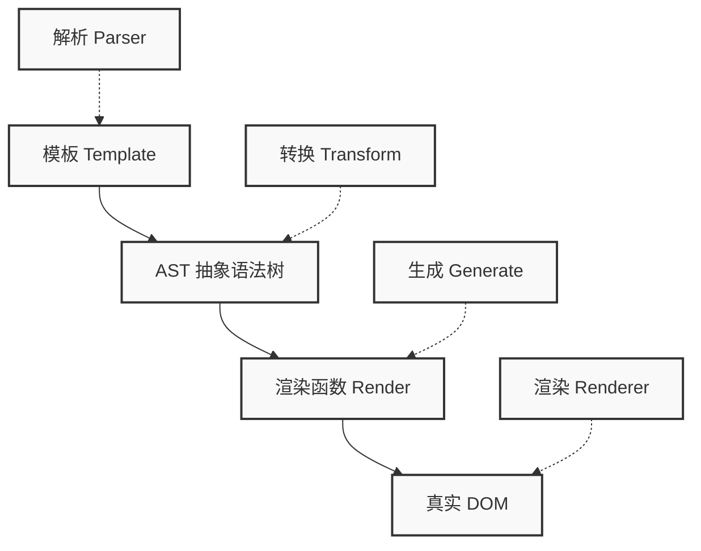
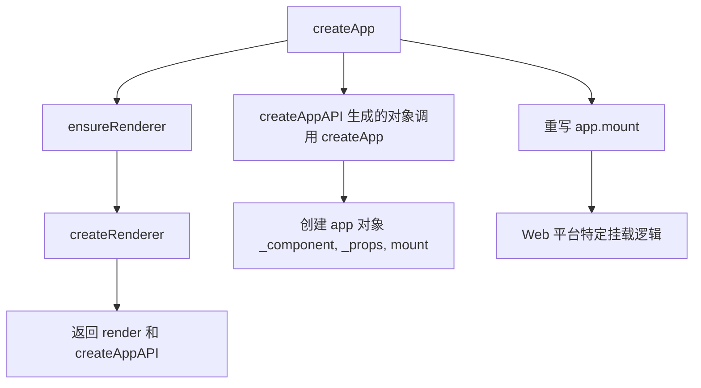
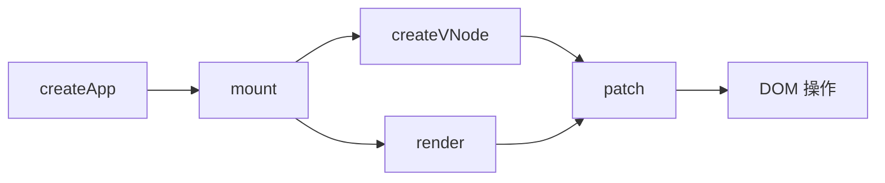
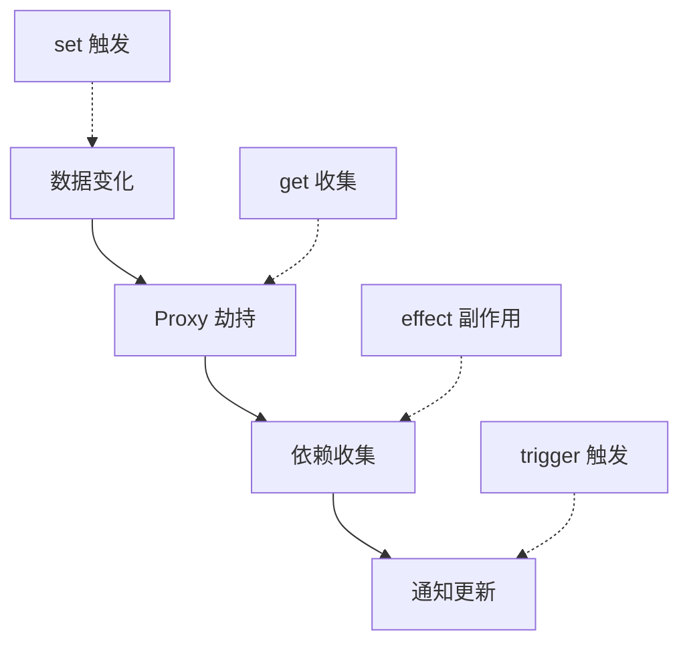
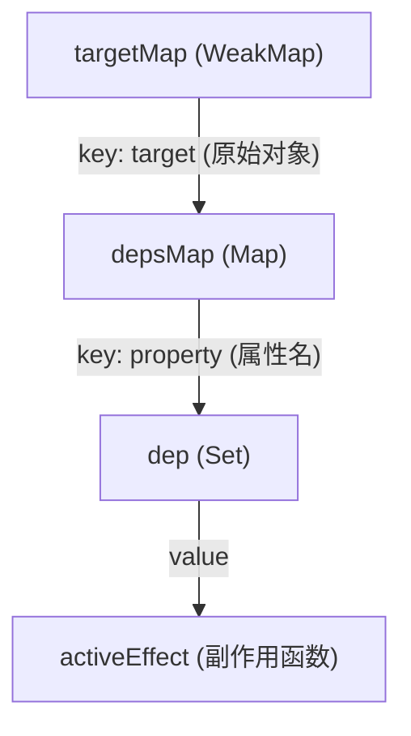
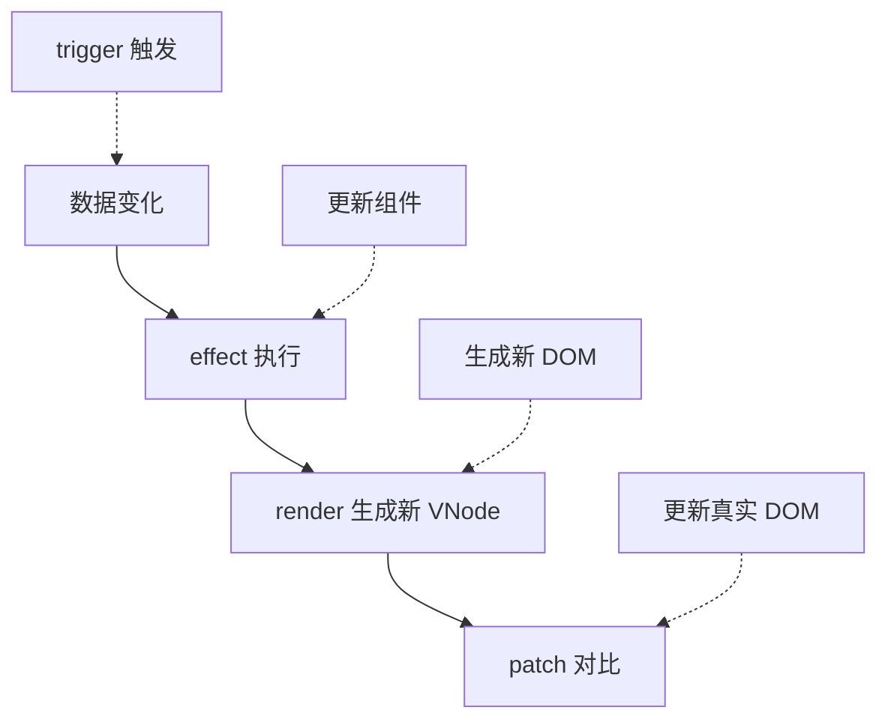
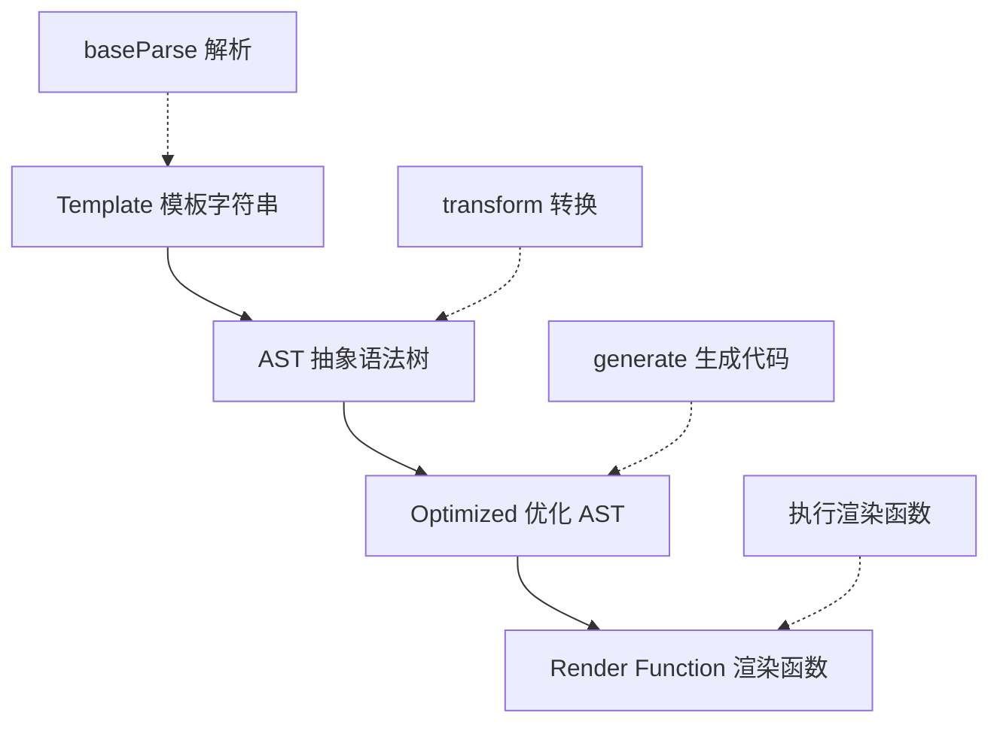

# Vue.js 3.0 源码深度解析

> 本文档基于 Vue.js 3.0 源码，深入剖析其核心实现原理，帮助开发者理解 Vue 的内部工作机制。

---

## 1. Vue.js 3.0 概述

### 1.1 为什么要学习 Vue 源码？

- **提升 JavaScript 功底**：Vue 源码使用纯原生 JavaScript 编写，学习过程中可以掌握大量编程技巧
- **提高工作效率**：理解底层原理，遇到问题时能快速定位和解决
- **借鉴优秀设计**：学习高手的代码组织、算法思想和设计模式
- **提升源码解读能力**：掌握看源码的技巧，学习其他框架也会更容易

### 1.2 Vue 3.0 核心优化

| 优化点 | 说明 |
|--------|------|
| **性能提升** | 编译时优化 + 运行时优化 |
| **体积减小** | Tree-shaking 支持 |
| **Composition API** | 更好的逻辑复用 |
| **TypeScript 支持** | 完整的类型定义 |
| **Fragment 支持** | 组件可以有多个根节点 |
| **Teleport** | 将组件渲染到 DOM 其他位置 |
| **Suspense** | 异步组件的等待状态处理 |

### 1.3 Vue 3.0 核心流程



---

## 2. 组件渲染流程

### 2.1 应用程序初始化

**Vue 2.x 初始化方式：**
```javascript
import Vue from 'vue'
import App from './App'
const app = new Vue({
  render: h => h(App)
})
app.$mount('#app')
```

**Vue 3.0 初始化方式：**
```javascript
import { createApp } from 'vue'
import App from './App'
const app = createApp(App)
app.mount('#app')
```

### 2.2 createApp 实现原理

```javascript
const createApp = ((...args) => {
  // 创建 app 对象
  const app = ensureRenderer().createApp(...args)
  const { mount } = app
  
  // 重写 mount 方法（Web 平台特定逻辑）
  app.mount = (containerOrSelector) => {
    // 标准化容器
    const container = normalizeContainer(containerOrSelector)
    if (!container) return
    
    const component = app._component
    // 如果组件没有定义 render 函数和 template，则取容器的 innerHTML
    if (!isFunction(component) && !component.render && !component.template) {
      component.template = container.innerHTML
    }
    
    // 挂载前清空容器内容
    container.innerHTML = ''
    
    // 真正的挂载
    return mount(container)
  }
  
  return app
})
```

**流程图：**



### 2.3 渲染器（Renderer）

渲染器是 Vue 跨平台渲染的核心，它封装了平台特定的渲染逻辑：

```javascript
// 渲染相关配置（Web 平台）
const rendererOptions = {
  patchProp,      // 更新属性的方法
  ...nodeOps      // DOM 操作方法
}

// 延时创建渲染器（支持 Tree-shaking）
let renderer
function ensureRenderer() {
  return renderer || (renderer = createRenderer(rendererOptions))
}

function createRenderer(options) {
  return baseCreateRenderer(options)
}

function baseCreateRenderer(options) {
  function render(vnode, container) {
    // 组件渲染的核心逻辑
  }

  return {
    render,
    createApp: createAppAPI(render)
  }
}
```

### 2.4 核心渲染流程



### 2.5 虚拟 DOM（VNode）

VNode 是用来描述 DOM 的 JavaScript 对象，它在 Vue 中可以描述不同类型的节点：

**普通元素 VNode：**
```javascript
// HTML: <button class="btn" style="width:100px;height:50px">click me</button>
const vnode = {
  type: 'button',
  props: { 
    'class': 'btn',
    style: {
      width: '100px',
      height: '50px'
    }
  },
  children: 'click me'
}
```

**组件 VNode：**
```javascript
// HTML: <custom-component msg="test"></custom-component>
const CustomComponent = {
  // 在这里定义组件对象
}
const vnode = {
  type: CustomComponent,
  props: { 
    msg: 'test'
  }
}
```

**VNode 类型编码：**
```javascript
const shapeFlag = isString(type)
  ? 1       /* ELEMENT */
  : isSuspense(type)
    ? 128   /* SUSPENSE */
    : isTeleport(type)
      ? 64  /* TELEPORT */
      : isObject(type)
        ? 4 /* STATEFUL_COMPONENT */
        : isFunction(type)
          ? 2 /* FUNCTIONAL_COMPONENT */
          : 0
```

### 2.6 创建 VNode

```javascript
function createVNode(type, props = null, children = null) {
  if (props) {
    // 处理 props 相关逻辑，标准化 class 和 style
  }
  
  // 对 vnode 类型信息编码
  const shapeFlag = isString(type)
    ? 1       /* ELEMENT */
    : isSuspense(type)
      ? 128   /* SUSPENSE */
      : isTeleport(type)
        ? 64  /* TELEPORT */
        : isObject(type)
          ? 4 /* STATEFUL_COMPONENT */
          : isFunction(type)
            ? 2 /* FUNCTIONAL_COMPONENT */
            : 0
  
  const vnode = {
    type,
    props,
    shapeFlag,
    // 一些其他属性
  }
  
  // 标准化子节点
  normalizeChildren(vnode, children)
  
  return vnode
}
```

### 2.7 渲染 VNode

```javascript
const render = (vnode, container) => {
  if (vnode == null) {
    // 销毁组件
    if (container._vnode) {
      unmount(container._vnode, null, null, true)
    }
  } else {
    // 创建或者更新组件
    patch(container._vnode || null, vnode, container)
  }
  // 缓存 vnode 节点，表示已经渲染
  container._vnode = vnode
}
```

### 2.8 Patch 函数

Patch 函数负责根据 VNode 挂载或更新 DOM：

```javascript
const patch = (n1, n2, container, anchor = null, parentComponent = null, parentSuspense = null, isSVG = false, optimized = false) => {
  // 如果存在新旧节点, 且新旧节点类型不同，则销毁旧节点
  if (n1 && !isSameVNodeType(n1, n2)) {
    anchor = getNextHostNode(n1)
    unmount(n1, parentComponent, parentSuspense, true)
    n1 = null
  }
  
  const { type, shapeFlag } = n2
  switch (type) {
    case Text:
      // 处理文本节点
      break
    case Comment:
      // 处理注释节点
      break
    case Static:
      // 处理静态节点
      break
    case Fragment:
      // 处理 Fragment 元素
      break
    default:
      if (shapeFlag & 1 /* ELEMENT */) {
        // 处理普通 DOM 元素
        processElement(n1, n2, container, anchor, parentComponent, parentSuspense, isSVG, optimized)
      }
      else if (shapeFlag & 6 /* COMPONENT */) {
        // 处理组件
        processComponent(n1, n2, container, anchor, parentComponent, parentSuspense, isSVG, optimized)
      }
      else if (shapeFlag & 64 /* TELEPORT */) {
        // 处理 TELEPORT
      }
      else if (shapeFlag & 128 /* SUSPENSE */) {
        // 处理 SUSPENSE
      }
  }
}

function isSameVNodeType(n1, n2) {
  // n1 和 n2 节点的 type 和 key 都相同，才是相同节点
  return n1.type === n2.type && n1.key === n2.key
}
```

### 2.9 组件挂载流程

```javascript
const processComponent = (n1, n2, container, anchor, parentComponent, parentSuspense, isSVG, optimized) => {
  if (n1 == null) {
    // 挂载组件
    mountComponent(n2, container, anchor, parentComponent, parentSuspense, isSVG, optimized)
  }
  else {
    // 更新组件
    updateComponent(n1, n2, parentComponent, optimized)
  }
}

const mountComponent = (initialVNode, container, anchor, parentComponent, parentSuspense, isSVG, optimized) => {
  // 创建组件实例
  const instance = (initialVNode.component = createComponentInstance(initialVNode, parentComponent, parentSuspense))
  
  // 设置组件实例
  setupComponent(instance)
  
  // 设置并运行带副作用的渲染函数
  setupRenderEffect(instance, initialVNode, container, anchor, parentSuspense, isSVG, optimized)
}
```

### 2.10 副作用渲染函数

```javascript
const setupRenderEffect = (instance, initialVNode, container, anchor, parentSuspense, isSVG, optimized) => {
  // 创建响应式的副作用渲染函数
  instance.update = effect(function componentEffect() {
    if (!instance.isMounted) {
      // 渲染组件生成子树 vnode
      const subTree = (instance.subTree = renderComponentRoot(instance))
      // 把子树 vnode 挂载到 container 中
      patch(null, subTree, container, anchor, instance, parentSuspense, isSVG)
      // 保留渲染生成的子树根 DOM 节点
      initialVNode.el = subTree.el
      instance.isMounted = true
    }
    else {
      // 更新组件
    }
  }, prodEffectOptions)
}
```

### 2.11 挂载 DOM 元素

```javascript
const mountElement = (vnode, container, anchor, parentComponent, parentSuspense, isSVG, optimized) => {
  let el
  const { type, props, shapeFlag } = vnode
  
  // 创建 DOM 元素节点
  el = vnode.el = hostCreateElement(vnode.type, isSVG, props && props.is)
  
  if (props) {
    // 处理 props，比如 class、style、event 等属性
    for (const key in props) {
      if (!isReservedProp(key)) {
        hostPatchProp(el, key, null, props[key], isSVG)
      }
    }
  }
  
  if (shapeFlag & 8 /* TEXT_CHILDREN */) {
    // 处理子节点是纯文本的情况
    hostSetElementText(el, vnode.children)
  }
  else if (shapeFlag & 16 /* ARRAY_CHILDREN */) {
    // 处理子节点是数组的情况
    mountChildren(vnode.children, el, null, parentComponent, parentSuspense, isSVG && type !== 'foreignObject', optimized || !!vnode.dynamicChildren)
  }
  
  // 把创建的 DOM 元素节点挂载到 container 上
  hostInsert(el, container, anchor)
}
```

---

## 3. 响应式原理

### 3.1 响应式概述

Vue 的响应式本质是当数据变化后会自动执行某个函数，映射到组件的实现就是，当数据变化后，会自动触发组件的重新渲染。

**Vue 2.x vs Vue 3.0 响应式对比：**

| 特性 | Vue 2.x | Vue 3.0 |
|------|---------|---------|
| **实现方式** | Object.defineProperty | Proxy |
| **监听粒度** | 属性级别 | 对象级别 |
| **新增属性** | 需要 $set | 自动监听 |
| **删除属性** | 需要 $delete | 自动监听 |
| **数组索引** | 无法监听 | 自动监听 |
| **性能** | 初始化递归 | 懒代理 |

### 3.2 响应式实现流程



### 3.3 Reactive API

```javascript
function reactive(target) {
  // 如果尝试把一个 readonly proxy 变成响应式，直接返回这个 readonly proxy
  if (target && target.__v_isReadonly) {
    return target
  }
  
  return createReactiveObject(target, false, mutableHandlers, mutableCollectionHandlers)
}

function createReactiveObject(target, isReadonly, baseHandlers, collectionHandlers) {
  // 目标必须是对象或数组类型
  if (!isObject(target)) {
    if (process.env.NODE_ENV !== 'production') {
      console.warn(`value cannot be made reactive: ${String(target)}`)
    }
    return target
  }
  
  // target 已经是 Proxy 对象，直接返回
  if (target.__v_raw && !(isReadonly && target.__v_isReactive)) {
    return target
  }
  
  // target 已经有对应的 Proxy 了
  if (hasOwn(target, isReadonly ? "__v_readonly" /* readonly */ : "__v_reactive" /* reactive */)) {
    return isReadonly ? target.__v_readonly : target.__v_reactive
  }
  
  // 只有在白名单里的数据类型才能变成响应式
  if (!canObserve(target)) {
    return target
  }
  
  // 利用 Proxy 创建响应式
  const observed = new Proxy(target, collectionTypes.has(target.constructor) ? collectionHandlers : baseHandlers)
  
  // 给原始数据打个标识
  def(target, isReadonly ? "__v_readonly" /* readonly */ : "__v_reactive" /* reactive */, observed)
  
  return observed
}
```

### 3.4 Proxy 处理器

```javascript
const mutableHandlers = {
  get,
  set,
  deleteProperty,
  has,
  ownKeys
}
```

### 3.5 依赖收集：get 函数

```javascript
function createGetter(isReadonly = false) {
  return function get(target, key, receiver) {
    if (key === "__v_isReactive" /* isReactive */) {
      return !isReadonly
    }
    else if (key === "__v_isReadonly" /* isReadonly */) {
      return isReadonly;
    }
    else if (key === "__v_raw" /* raw */) {
      return target
    }
    
    const targetIsArray = isArray(target)
    // arrayInstrumentations 包含对数组一些方法修改的函数
    if (targetIsArray && hasOwn(arrayInstrumentations, key)) {
      return Reflect.get(arrayInstrumentations, key, receiver)
    }
    
    // 求值
    const res = Reflect.get(target, key, receiver)
    
    // 内置 Symbol key 不需要依赖收集
    if (isSymbol(key) && builtInSymbols.has(key) || key === '__proto__') {
      return res
    }
    
    // 依赖收集
    !isReadonly && track(target, "get" /* GET */, key)
    
    return isObject(res)
      ? isReadonly
        ? readonly(res)
        : reactive(res)  // 如果 res 是对象或数组，递归执行 reactive
      : res
  }
}
```

### 3.6 派发通知：set 函数

```javascript
function createSetter(isReadonly = false) {
  return function set(target, key, value, receiver) {
    // 获取旧值
    const oldValue = target[key]
    
    // 判断是新增还是修改
    const hadKey = hasOwn(target, key)
    
    // 执行 set 操作
    const result = Reflect.set(target, key, value, receiver)
    
    // 只有当 target 和 receiver 对应的 proxy 是同一个时才执行
    if (target === toRaw(receiver)) {
      // 判断是否有 key
      if (!hadKey) {
        // 新增
        trigger(target, "add" /* ADD */, key, value)
      }
      else if (hasChanged(value, oldValue)) {
        // 修改
        trigger(target, "set" /* SET */, key, value, oldValue)
      }
    }
    
    return result
  }
}
```

### 3.7 track 函数（依赖收集）

```javascript
// 是否应该收集依赖
let shouldTrack = true
// 当前激活的 effect
let activeEffect
// 原始数据对象 map
const targetMap = new WeakMap()

function track(target, type, key) {
  if (!shouldTrack || activeEffect === undefined) {
    return
  }
  
  let depsMap = targetMap.get(target)
  if (!depsMap) {
    // 每个 target 对应一个 depsMap
    targetMap.set(target, (depsMap = new Map()))
  }
  
  let dep = depsMap.get(key)
  if (!dep) {
    // 每个 key 对应一个 dep 集合
    depsMap.set(key, (dep = new Set()))
  }
  
  if (!dep.has(activeEffect)) {
    // 收集当前激活的 effect 作为依赖
    dep.add(activeEffect)
    // 当前激活的 effect 收集 dep 集合作为依赖
    activeEffect.deps.push(dep)
  }
}
```

**依赖关系图：**



### 3.8 effect 函数

```javascript
function effect(fn, options = {}) {
  // 创建 effect
  const effect = createReactiveEffect(fn, options)
  
  // 如果不是 lazy，则立即执行
  if (!options.lazy) {
    effect()
  }
  
  return effect
}

function createReactiveEffect(fn, options) {
  const effect = function reactiveEffect() {
    // 如果 effect 没有被激活，则执行 fn
    if (!effect.active) {
      return options.scheduler ? options.scheduler(effect) : fn()
    }
    
    // 避免重复执行
    if (!effectStack.includes(effect)) {
      // 清空 effectStack
      cleanup(effect)
      
      try {
        // 开启追踪
        enableTracking()
        // 将 effect 压入栈
        effectStack.push(effect)
        // 设置当前激活的 effect
        activeEffect = effect
        // 执行 fn
        return fn()
      }
      finally {
        // 恢复
        effectStack.pop()
        resetTracking()
        activeEffect = effectStack[effectStack.length - 1]
      }
    }
  }
  
  // effect 配置
  effect.id = uid++
  effect.active = true
  effect.raw = fn
  effect.deps = []
  effect.options = options
  
  return effect
}
```

### 3.9 trigger 函数（派发更新）

```javascript
function trigger(target, type, key, newValue, oldValue) {
  // 获取依赖
  const depsMap = targetMap.get(target)
  if (!depsMap) {
    return
  }
  
  // 收集需要执行的 effect
  const effects = new Set()
  const add = (effectsToAdd) => {
    if (effectsToAdd) {
      effectsToAdd.forEach(effect => effects.add(effect))
    }
  }
  
  // 根据类型判断
  if (key !== undefined) {
    add(depsMap.get(key))
  }
  
  if (type === "add" /* ADD */) {
    // 如果是数组且是索引操作
    if (isArray(target) && isIntegerKey(key)) {
      add(depsMap.get('length'))
    }
  }
  
  if (type === "set" /* SET */) {
    // 如果是 Map 类型的 set 操作
    if (depsMap.has(target)) {
      add(depsMap.get(target))
    }
  }
  
  // 执行 effects
  if (effects.size) {
    const run = (effect) => {
      if (effect.options.scheduler) {
        effect.options.scheduler(effect)
      }
      else {
        effect()
      }
    }
    
    effects.forEach(run)
  }
}
```

---

## 4. 组件更新机制

### 4.1 更新流程



### 4.2 副作用渲染函数更新

```javascript
instance.update = effect(function componentEffect() {
  if (!instance.isMounted) {
    // 初次渲染
  }
  else {
    // 更新组件
    let { next, vnode } = instance
    
    // next 表示新的组件 vnode
    if (next) {
      // 更新组件 vnode 节点信息
      updateComponentPreRender(instance, next, optimized)
    }
    else {
      next = vnode
    }
    
    // 渲染新的子树 vnode
    const nextTree = renderComponentRoot(instance)
    // 缓存旧的子树 vnode
    const prevTree = instance.subTree
    // 更新子树 vnode
    instance.subTree = nextTree
    
    // 组件更新核心逻辑，根据新旧子树 vnode 做 patch
    patch(prevTree, nextTree,
      // 容器直接找旧树 DOM 元素的父节点
      hostParentNode(prevTree.el),
      // 参考节点直接找旧树 DOM 元素的下一个节点
      getNextHostNode(prevTree),
      instance,
      parentSuspense,
      isSVG
    )
    
    // 缓存更新后的 DOM 节点
    next.el = nextTree.el
  }
}, prodEffectOptions)
```

### 4.3 更新组件 VNode

```javascript
const updateComponentPreRender = (instance, nextVNode, optimized) => {
  // 新组件 vnode 的 component 属性指向组件实例
  nextVNode.component = instance
  
  // 旧组件 vnode 的 props 属性
  const prevProps = instance.vnode.props
  
  // 组件实例的 vnode 属性指向新的组件 vnode
  instance.vnode = nextVNode
  
  // 清空 next 属性，为了下一次重新渲染准备
  instance.next = null
  
  // 更新 props
  updateProps(instance, nextVNode.props, prevProps, optimized)
  
  // 更新 插槽
  updateSlots(instance, nextVNode.children)
}
```

### 4.4 组件更新判断

```javascript
const updateComponent = (n1, n2, parentComponent, optimized) => {
  const instance = (n2.component = n1.component)
  
  // 根据新旧子组件 vnode 判断是否需要更新子组件
  if (shouldUpdateComponent(n1, n2, parentComponent, optimized)) {
    // 新的子组件 vnode 赋值给 instance.next
    instance.next = n2
    
    // 子组件也可能因为数据变化被添加到更新队列里了，移除它们防止对一个子组件重复更新
    invalidateJob(instance.update)
    
    // 执行子组件的副作用渲染函数
    instance.update()
  }
  else {
    // 不需要更新，只复制属性
    n2.component = n1.component
    n2.el = n1.el
  }
}
```

### 4.5 Patch 元素

```javascript
const patchElement = (n1, n2, parentComponent, parentSuspense, isSVG, optimized) => {
  const el = (n2.el = n1.el)
  const oldProps = (n1 && n1.props) || EMPTY_OBJ
  const newProps = n2.props || EMPTY_OBJ
  
  // 更新 props
  patchProps(el, n2, oldProps, newProps, parentComponent, parentSuspense, isSVG)
  
  const areChildrenSVG = isSVG && n2.type !== 'foreignObject'
  
  // 更新子节点
  patchChildren(n1, n2, el, null, parentComponent, parentSuspense, areChildrenSVG)
}
```

### 4.6 Patch 子节点

子节点的更新逻辑比较复杂，需要考虑多种情况：

```javascript
const patchChildren = (n1, n2, container, anchor, parentComponent, parentSuspense, isSVG, optimized = false) => {
  const c1 = n1 && n1.children
  const prevShapeFlag = n1 ? n1.shapeFlag : 0
  const c2 = n2.children
  const { shapeFlag } = n2
  
  // 子节点有 3 种可能情况：文本、数组、空
  if (shapeFlag & 8 /* TEXT_CHILDREN */) {
    // 新子节点是文本
    if (prevShapeFlag & 16 /* ARRAY_CHILDREN */) {
      // 数组 -> 文本，则删除之前的子节点
      unmountChildren(c1, parentComponent, parentSuspense)
    }
    if (c2 !== c1) {
      // 文本对比不同，则替换为新文本
      hostSetElementText(container, c2)
    }
  }
  else {
    // 新子节点是数组或空
    if (prevShapeFlag & 16 /* ARRAY_CHILDREN */) {
      // 之前的子节点是数组
      if (shapeFlag & 16 /* ARRAY_CHILDREN */) {
        // 新的子节点仍然是数组，则做完整地 diff
        patchKeyedChildren(c1, c2, container, anchor, parentComponent, parentSuspense, isSVG, optimized)
      }
      else {
        // 数组 -> 空，则仅仅删除之前的子节点
        unmountChildren(c1, parentComponent, parentSuspense, true)
      }
    }
    else {
      // 之前的子节点是文本节点或者为空
      if (prevShapeFlag & 8 /* TEXT_CHILDREN */) {
        // 如果之前子节点是文本，则把它清空
        hostSetElementText(container, '')
      }
      if (shapeFlag & 16 /* ARRAY_CHILDREN */) {
        // 如果新的子节点是数组，则挂载新子节点
        mountChildren(c2, container, anchor, parentComponent, parentSuspense, isSVG, optimized)
      }
    }
  }
}
```

### 4.7 子节点更新情况图

通过表格总结一下新旧子节点的 9 种不同情况及对应的更新操作：

| 旧子节点 | 新子节点 | 更新操作描述 |
| :---: | :---: | :--- |
| **文本** | **文本** | 简单文本替换（`hostSetElementText`） |
| **文本** | **空** | 删除旧文本内容（`hostSetElementText(container, '')`） |
| **文本** | **数组** | 清空文本，挂载新子节点数组（`mountChildren`） |
| **空** | **文本** | 添加新文本节点（`hostSetElementText`） |
| **空** | **空** | 什么都不做 |
| **空** | **数组** | 挂载新子节点数组（`mountChildren`） |
| **数组** | **文本** | 卸载旧子节点数组（`unmountChildren`），添加新文本节点 |
| **数组** | **空** | 卸载旧子节点数组（`unmountChildren`） |
| **数组** | **数组** | **最复杂情况**，执行完整的 Diff 算法（`patchKeyedChildren`） |

---

## 5. 模板编译过程

### 5.1 编译流程



### 5.2 baseCompile 函数

```javascript
function baseCompile(template, options = {}) {
  const prefixIdentifiers = false
  
  // 解析 template 生成 AST
  const ast = isString(template) ? baseParse(template, options) : template
  
  const [nodeTransforms, directiveTransforms] = getBaseTransformPreset()
  
  // AST 转换
  transform(ast, extend({}, options, {
    prefixIdentifiers,
    nodeTransforms: [
      ...nodeTransforms,
      ...(options.nodeTransforms || [])
    ],
    directiveTransforms: extend({}, directiveTransforms, options.directiveTransforms || {})
  }))
  
  // 生成代码
  return generate(ast, extend({}, options, {
    prefixIdentifiers
  }))
}
```

### 5.3 baseParse 函数

```javascript
function baseParse(content, options = {}) {
  // 创建解析上下文
  const context = createParserContext(content, options)
  const start = getCursor(context)
  
  // 解析子节点，并创建 AST
  return createRoot(parseChildren(context, 0 /* DATA */, []), getSelection(context, start))
}
```

### 5.4 解析上下文

```javascript
const defaultParserOptions = {
  delimiters: [`{{`, `}}`],
  getNamespace: () => 0 /* HTML */,
  getTextMode: () => 0 /* DATA */,
  isVoidTag: NO,
  isPreTag: NO,
  isCustomElement: NO,
  decodeEntities: (rawText) => rawText.replace(decodeRE, (_, p1) => decodeMap[p1]),
  onError: defaultOnError
}

function createParserContext(content, options) {
  return {
    options: extend({}, defaultParserOptions, options),
    column: 1,
    line: 1,
    offset: 0,
    originalSource: content,
    source: content,
    inPre: false,
    inVPre: false
  }
}
```

### 5.5 parseChildren 函数

```javascript
function parseChildren(context, mode, ancestors) {
  const parent = last(ancestors)
  const ns = parent ? parent.ns : 0 /* HTML */
  const nodes = []
  
  // 自顶向下分析代码，生成 nodes
  while (!isEnd(context, mode, ancestors)) {
    const s = context.source
    let node = undefined
    
    if (mode === 0 /* DATA */ || mode === 1 /* RCDATA */) {
      if (!context.inVPre && startsWith(s, context.options.delimiters[0])) {
        // 处理 {{ 插值代码
        node = parseInterpolation(context, mode)
      }
      else if (mode === 0 /* DATA */ && s[0] === '<') {
        // 处理 < 开头的代码
        if (s.length === 1) {
          // s 长度为 1，说明代码结尾是 <，报错
          emitError(context, 5 /* EOF_BEFORE_TAG_NAME */, 1)
        }
        else if (s[1] === '!') {
          // 处理 <! 开头的代码
          if (startsWith(s, '<!--')) {
            // 处理注释节点
            node = parseComment(context)
          }
          // ... 其他处理
        }
        else if (s[1] === '/') {
          // 处理 </ 结束标签
          // ...
        }
        else if (/[a-z]/i.test(s[1])) {
          // 解析标签元素节点
          node = parseElement(context, ancestors)
        }
      }
    }
    
    if (!node) {
      // 解析普通文本节点
      node = parseText(context, mode)
    }
    
    if (isArray(node)) {
      for (let i = 0; i < node.length; i++) {
        pushNode(nodes, node[i])
      }
    }
    else {
      pushNode(nodes, node)
    }
  }
  
  return removedWhitespace ? nodes.filter(Boolean) : nodes
}
```

### 5.6 解析注释节点

```javascript
function parseComment(context) {
  const start = getCursor(context)
  let content
  
  // 常规注释的结束符
  const match = /--(\!)?>/.exec(context.source)
  
  if (!match) {
    // 没有匹配的注释结束符
    content = context.source.slice(4)
    advanceBy(context, context.source.length)
    emitError(context, 7 /* EOF_IN_COMMENT */)
  }
  else {
    if (match.index <= 3) {
      // 非法的注释符号
      emitError(context, 0 /* ABRUPT_CLOSING_OF_EMPTY_COMMENT */)
    }
    
    if (match[1]) {
      // 注释结束符不正确
      emitError(context, 10 /* INCORRECTLY_CLOSED_COMMENT */)
    }
    
    // 获取注释的内容
    content = context.source.slice(4, match.index)
    
    // 截取到注释结尾之间的代码，用于后续判断嵌套注释
    const s = context.source.slice(0, match.index)
    let prevIndex = 1, nestedIndex = 0
    
    // 判断嵌套注释符的情况，存在即报错
    while ((nestedIndex = s.indexOf('<!--', prevIndex)) !== -1) {
      advanceBy(context, nestedIndex - prevIndex + 1)
      if (nestedIndex + 4 < s.length) {
        emitError(context, 16 /* NESTED_COMMENT */)
      }
      prevIndex = nestedIndex + 1
    }
    
    // 前进代码到注释结束符后
    advanceBy(context, match.index + match[0].length - prevIndex + 1)
  }
  
  return {
    type: 3 /* COMMENT */,
    content,
    loc: getSelection(context, start)
  }
}
```

### 5.7 解析插值

```javascript
function parseInterpolation(context, mode) {
  // 从配置中获取插值开始和结束分隔符，默认是 {{ 和 }}
  const [open, close] = context.options.delimiters
  const closeIndex = context.source.indexOf(close, open.length)
  
  if (closeIndex === -1) {
    emitError(context, 25 /* X_MISSING_INTERPOLATION_END */)
    return undefined
  }
  
  const start = getCursor(context)
  
  // 代码前进到插值开始分隔符后
  advanceBy(context, open.length)
  
  const innerStart = getCursor(context)
  const innerEnd = getCursor(context)
  
  const rawContentLength = closeIndex - open.length
  const rawContent = context.source.slice(0, rawContentLength)
  
  // 获取插值的内容，并前进代码到插值的内容后
  const preTrimContent = parseTextData(context, rawContentLength, mode)
  const content = preTrimContent.trim()
  
  const startOffset = preTrimContent.indexOf(content)
  if (startOffset > 0) {
    advancePositionWithMutation(innerStart, rawContent, startOffset)
  }
  
  const endOffset = rawContentLength - (preTrimContent.length - content.length - startOffset)
  advancePositionWithMutation(innerEnd, rawContent, endOffset)
  
  // 前进代码到插值结束分隔符后
  advanceBy(context, close.length)
  
  return {
    type: 5 /* INTERPOLATION */,
    content: {
      type: 4 /* SIMPLE_EXPRESSION */,
      isStatic: false,
      isConstant: false,
      content,
      loc: getSelection(context, innerStart, innerEnd)
    },
    loc: getSelection(context, start)
  }
}
```

### 5.8 解析文本

```javascript
function parseText(context, mode) {
  // 文本结束符
  const endTokens = ['<', context.options.delimiters[0]]
  
  if (mode === 3 /* CDATA */) {
    endTokens.push(']]>')
  }
  
  let endIndex = context.source.length
  
  // 遍历文本结束符，匹配找到结束的位置
  for (let i = 0; i < endTokens.length; i++) {
    const index = context.source.indexOf(endTokens[i], 1)
    if (index !== -1 && endIndex > index) {
      endIndex = index
    }
  }
  
  const start = getCursor(context)
  
  // 获取文本的内容，并前进代码到文本的内容后
  const content = parseTextData(context, endIndex, mode)
  
  return {
    type: 2 /* TEXT */,
    content,
    loc: getSelection(context, start)
  }
}
```

### 5.9 advanceBy 函数

```javascript
function advanceBy(context, numberOfCharacters) {
  const { source } = context
  
  // 更新 context 的 offset、line、column
  advancePositionWithMutation(context, source, numberOfCharacters)
  
  // 更新 context 的 source
  context.source = source.slice(numberOfCharacters)
}

function advancePositionWithMutation(pos, source, numberOfCharacters = source.length) {
  let linesCount = 0
  let lastNewLinePos = -1
  
  for (let i = 0; i < numberOfCharacters; i++) {
    if (source.charCodeAt(i) === 10 /* newline char code */) {
      linesCount++
      lastNewLinePos = i
    }
  }
  
  pos.offset += numberOfCharacters
  pos.line += linesCount
  pos.column = 
    lastNewLinePos === -1
      ? pos.column + numberOfCharacters
      : numberOfCharacters - lastNewLinePos
  
  return pos
}
```

---

## 6. 编译优化策略

### 6.1 优化概述

Vue 3.0 的编译优化主要包括：

1. **静态提升**：将静态节点提升到渲染函数外，避免重复创建
2. **Patch Flag**：在编译阶段标记动态节点的类型，加速运行时 Diff
3. **Tree-shaking**：利用 ES Module 的静态结构移除未使用的代码
4. **Block Tree**：只对比带有动态子节点的区块，跳过静态节点的比对
5. **事件缓存**：缓存内联事件处理函数，避免不必要的组件更新

### 6.2 静态提升

```javascript
// 源代码
<div>
  <p>静态文本</p>
  <p>{{ dynamic }}</p>
</div>

// 优化后的渲染函数
const _hoisted_1 = /*#__PURE__*/_createElementVNode("p", null, "静态文本")

function render(_ctx, _cache) {
  return _createElementVNode("div", null, [
    _hoisted_1,  // 静态节点被提升
    _createElementVNode("p", null, _toDisplayString(_ctx.dynamic), 1 /* TEXT */)
  ])
}
```

### 6.3 Patch Flag

Patch Flag 用于标记动态节点的类型，diff 算法只需要关注这些动态节点：

```javascript
export const enum PatchFlags {
  TEXT = 1,                    // 动态文本内容
  CLASS = 1 << 1,             // 动态 class
  STYLE = 1 << 2,             // 动态 style
  PROPS = 1 << 3,             // 动态属性（不包含 class/style）
  FULL_PROPS = 1 << 4,        // 有动态 key 的属性
  NEED_HYDRATION = 1 << 5,    // 需要水合的内容
  STABLE_FRAGMENT = 1 << 6,   // 稳定的 Fragment
  KEYED_FRAGMENT = 1 << 7,    // 带 key 的 Fragment
  UNKEYED_FRAGMENT = 1 << 8,  // 无 key 的 Fragment
  NEED_PATCH = 1 << 9,        // 非 prop/attr 的节点（ref, directives）
  DYNAMIC_SLOTS = 1 << 10,    // 动态插槽
  HOISTED = -1,                // 静态提升
  BAIL = -2                    // diff 算法应该退出优化模式
}
```

### 6.4 Block Tree

Block Tree 是 Vue 3.0 的一个重要优化，它将模板中的动态节点收集到一个数组中，diff 算法只需要遍历这个数组：

```javascript
// 源代码
<div>
  <p>静态节点</p>
  <p>{{ msg }}</p>
  <p>静态节点</p>
</div>

// 编译后的 AST（简化）
{
  type: 1,
  tag: 'div',
  children: [
    { type: 1, tag: 'p', children: '静态节点', patchFlag: -1 /* HOISTED */ },
    { type: 1, tag: 'p', children: { content: 'msg' }, patchFlag: 1 /* TEXT */ },
    { type: 1, tag: 'p', children: '静态节点', patchFlag: -1 /* HOISTED */ }
  ],
  // 动态节点收集
  dynamicChildren: [
    { type: 1, tag: 'p', children: { content: 'msg' }, patchFlag: 1 /* TEXT */ }
  ]
}
```

### 6.5 事件缓存

```javascript
// 源代码
<div @click="handleClick">
  <p>{{ msg }}</p>
</div>

// 优化前
function render(_ctx, _cache) {
  return _createElementVNode("div", {
    onClick: _cache[0] || (_cache[0] = ($event) => (_ctx.handleClick($event)))
  }, [
    _createElementVNode("p", null, _toDisplayString(_ctx.msg), 1 /* TEXT */)
  ])
}

// 多次渲染时，事件处理函数会被缓存
```

---

## 7. 核心 API 实现

### 7.1 reactive API

```javascript
// 创建响应式对象
const state = reactive({ count: 0 })

// 使用 ref 创建响应式原始值
const count = ref(0)

// 使用 computed 创建计算属性
const doubleCount = computed(() => count.value * 2)

// 使用 watch 监听变化
watch(count, (newVal, oldVal) => {
  console.log(`count changed: ${oldVal} -> ${newVal}`)
})
```

### 7.2 ref API

```javascript
function ref(value) {
  return createRef(value, false)
}

function createRef(rawValue, shallow) {
  const r = {
    __v_isRef: true,
    get value() {
      // 依赖收集
      track(toRaw(r))
      return rawValue
    },
    set value(newVal) {
      if (hasChanged(newVal, rawValue)) {
        rawValue = newVal
        // 派发更新
        trigger(toRaw(r))
      }
    }
  }
  
  return r
}
```

### 7.3 computed API

```javascript
function computed(getterOrOptions) {
  let getter
  let setter
  
  if (isFunction(getterOrOptions)) {
    getter = getterOrOptions
    setter = () => {
      console.warn('write operation failed: computed value is readonly')
    }
  }
  else {
    getter = getterOrOptions.get
    setter = getterOrOptions.set
  }
  
  const cRef = shallowRef(getter(), setter)
  
  // 创建 effect
  effect(getter, {
    lazy: true,
    scheduler: (effect) => {
      // 在调度器中更新
      trigger(toRaw(cRef))
    }
  })
  
  return cRef
}
```

### 7.4 watch API

```javascript
function watch(source, cb, options = {}) {
  const { deep, immediate } = options
  
  // 创建 effect
  const effect = createReactiveEffect(
    // getter
    () => traverse(source, deep),
    // scheduler
    () => {
      // 执行回调
      cb(newValue, oldValue)
    }
  )
  
  // 立即执行
  if (immediate) {
    cb(source())
  }
  
  // 返回停止函数
  return () => {
    effect.stop()
  }
}

function traverse(value, seen = new Set()) {
  if (!isObject(value) || seen.has(value)) {
    return value
  }
  
  seen.add(value)
  
  if (isArray(value)) {
    for (let i = 0; i < value.length; i++) {
      traverse(value[i], seen)
    }
  }
  else {
    for (const key of Object.keys(value)) {
      traverse(value[key], seen)
    }
  }
  
  return value
}
```

### 7.5 生命周期

```javascript
// 在 setup 中使用生命周期钩子
import { onMounted, onUpdated, onUnmounted } from 'vue'

export default {
  setup() {
    onMounted(() => {
      console.log('组件已挂载')
    })
    
    onUpdated(() => {
      console.log('组件已更新')
    })
    
    onUnmounted(() => {
      console.log('组件已卸载')
    })
  }
}
```

### 7.6 provide/inject

```javascript
// 父组件
import { provide, ref } from 'vue'

export default {
  setup() {
    const message = ref('hello')
    provide('message', message)
    
    return { message }
  }
}

// 子组件
import { inject } from 'vue'

export default {
  setup() {
    const message = inject('message')
    return { message }
  }
}
```

---

## 总结

Vue 3.0 源码是一个设计精良的现代化前端框架，其核心思想包括：

1. **响应式系统**：基于 Proxy 实现，支持细粒度的依赖收集和派发更新
2. **虚拟 DOM**：使用 VNode 描述 UI，通过 diff 算法高效更新 DOM
3. **组件系统**：支持组件化开发，每个组件都有独立的状态和渲染逻辑
4. **编译优化**：通过静态提升、Patch Flag、Block Tree 等技术优化性能
5. **Composition API**：提供更好的逻辑复用和代码组织能力

理解这些核心概念和实现原理，不仅能够帮助我们更好地使用 Vue，还能够提升我们的 JavaScript 编程能力和架构设计能力。

---

## 参考资料

- [Vue.js 3.0 官方文档](https://cn.vuejs.org/)
- [Vue.js 3.0 源码仓库](https://github.com/vuejs/core)
- [Vue.js 3.0 设计文档](https://vuejs.org/guide/extras/reactivity-in-depth.html)
