# Vue.js 3.0 源码深度解析

> 本文档基于 Vue.js 3.0 源码（v3.5.38），深入剖析其核心实现原理，涵盖渲染器、响应式系统、编译器、内置组件等核心模块。

---

## 1. Vue 3.0 概述

### 1.1 为什么要学习 Vue 源码？

- **提升 JavaScript 功底**：Vue 源码使用纯原生 JS/TS 编写，学习过程中可以掌握大量编程技巧（位运算、闭包、Proxy、设计模式等）
- **提高工作效率**：理解底层原理，遇到问题时能快速定位和解决
- **借鉴优秀设计**：学习高手的代码组织、算法思想和设计模式
- **提升源码解读能力**：掌握看源码的技巧，学习其他框架也会更容易

### 1.2 Vue 2.x vs Vue 3.0 核心变化

| 维度 | Vue 2.x | Vue 3.0 |
|------|---------|---------|
| **响应式** | `Object.defineProperty` 递归劫持 | `Proxy` 懒代理，性能更优 |
| **组件** | Options API | Options API + Composition API |
| **包管理** | 单一仓库 | `monorepo` 分模块管理 |
| **TypeScript** | 类型支持较弱 | 完整 TS 重写 |
| **Diff 算法** | 双端 diff | `PatchFlag` + 最长递增子序列 |
| **静态提升** | 无 | 静态节点提升到 render 函数外 |
| **Tree-shaking** | 不支持 | 基于 ES Module 的 treeshaking |
| **Fragment** | 不支持 | 支持多根节点 |
| **Teleport** | 无 | 内置组件，可选择性/延迟挂载 |
| **Suspense** | 无 | 异步组件等待状态处理 + 惰性 hydration（v3.5） |
| **defineModel** | 无 | v3.4 稳定，支持 `v-model` 双向绑定宏 |
| **useTemplateRef** | 无 | v3.5 显式模板引用 API |
| **响应式追踪** | `Set` + `cleanup` | 双向链表 + 版本计数（v3.5） |

### 1.3 源码目录结构（Monorepo）

Vue 3 采用 `monorepo` 管理方式，核心包如下：

```
packages/
├── compiler-core      # 与平台无关的编译器实现
├── compiler-dom       # 浏览器相关的编译器上层
├── compiler-sfc       # 单文件组件编译器
├── compiler-ssr       # 服务端渲染编译器
├── reactivity         # 响应式核心包
├── runtime-core       # 与平台无关的渲染器核心
├── runtime-dom        # 浏览器相关的渲染器
├── runtime-test       # 渲染器测试
├── server-renderer    # 服务端渲染
├── shared             # 工具库
└── vue                # 包含编译时和运行时的发布包
```

### 1.4 核心流程总览

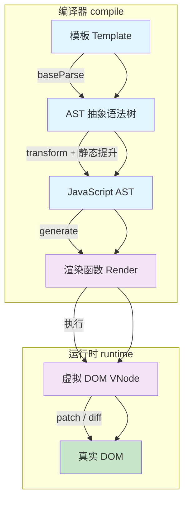

### 1.5 版本演进：v3.2 → v3.5.38

| 版本 | 代号 | 关键特性 |
|------|------|---------|
| **3.3** (2023-05) | Rurouni Kenshin | `defineOptions` / `defineSlots` 宏、SFC 泛型支持、导入类型在宏中使用 |
| **3.4** (2023-12) | Slam Dunk | `defineModel` 稳定、`watch` `once:true`、`v-bind` 同名简写、响应式重构（版本计数）、解析器优化、MathML 支持 |
| **3.5** (2024-09) | Tengrinew | 响应式 props 解构稳定、`useTemplateRef`、`useId`、`onWatcherCleanup`、惰性 hydration、`<Teleport>` 延迟挂载、`data-allow-mismatch`、`app.onUnmount()` |

每次 minor 更新都保持了源码核心架构的稳定性，主要变化集中在：
- **响应式系统**：从二进制位标记（v3.2）→ 版本计数 + 双向链表追踪（v3.5），内存占用降低约 60%
- **编译优化**：解析器重写（v3.4），编译速度提升
- **API 演进**：实验性 API 逐步稳定化（`defineModel`、props 解构），新增开发体验 API（`useTemplateRef`、`useId`）

---

## 2. 渲染器：组件是如何渲染成 DOM 的？

### 2.1 应用初始化

```javascript
// Vue 3 入口
import { createApp } from 'vue'
import App from './App.vue'

createApp(App).mount('#app')
```

### 2.2 createApp 实现原理

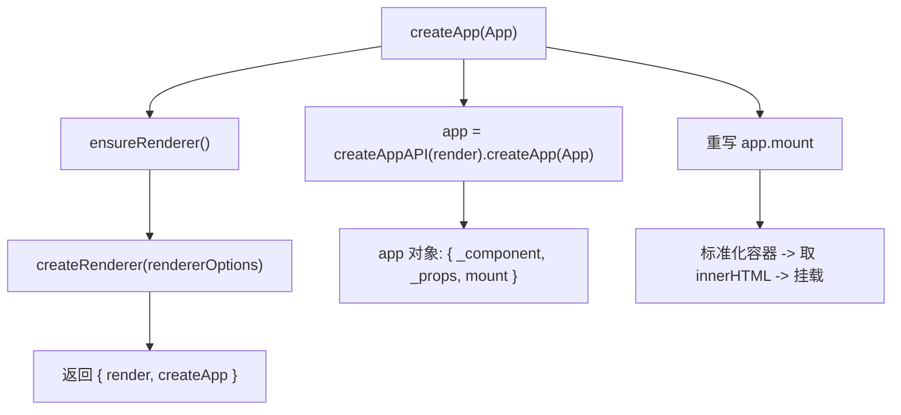

```javascript
// 渲染相关配置（Web 平台）
const rendererOptions = {
  patchProp,   // 更新属性的方法
  createElement,
  createText,
  setText,
  setElementText,
  insert,
  remove
}

// 延时创建渲染器（支持 Tree-shaking）
let renderer
function ensureRenderer() {
  return renderer || (renderer = createRenderer(rendererOptions))
}

function createRenderer(options) {
  return baseCreateRenderer(options)
}
```

### 2.3 Mount 流程

```javascript
// packages/runtime-core/src/apiCreateApp.ts
mount(rootContainer, isHydrate, isSVG) {
  if (!isMounted) {
    // 1. 创建根组件的 vnode
    const vnode = createVNode(rootComponent, rootProps)
    // 2. 渲染根组件
    render(vnode, rootContainer, isSVG)
    isMounted = true
  }
}

// v3.5: app.onUnmount 注册清理函数
const app = createApp(App)
app.onUnmount(() => {
  // 应用卸载时执行清理
  console.log('app unmounted')
})
```

### 2.4 虚拟 DOM（VNode）

VNode 是描述 DOM 的 JavaScript 对象，优势：
1. **性能优化**：JS 操作比 DOM 操作快得多
2. **跨平台**：VNode 是平台无关的数据结构

**普通元素 VNode：**
```javascript
// HTML: <button class="btn" style="width:100px">click me</button>
const vnode = {
  type: 'button',
  props: {
    'class': 'btn',
    style: { width: '100px', height: '50px' }
  },
  children: 'click me'
}
```

**组件 VNode：**
```javascript
const vnode = {
  type: CustomComponent,  // 组件对象
  props: { msg: 'test' },
  shapeFlag: 4            // STATEFUL_COMPONENT
}
```

### 2.5 Patch 函数（核心调度）

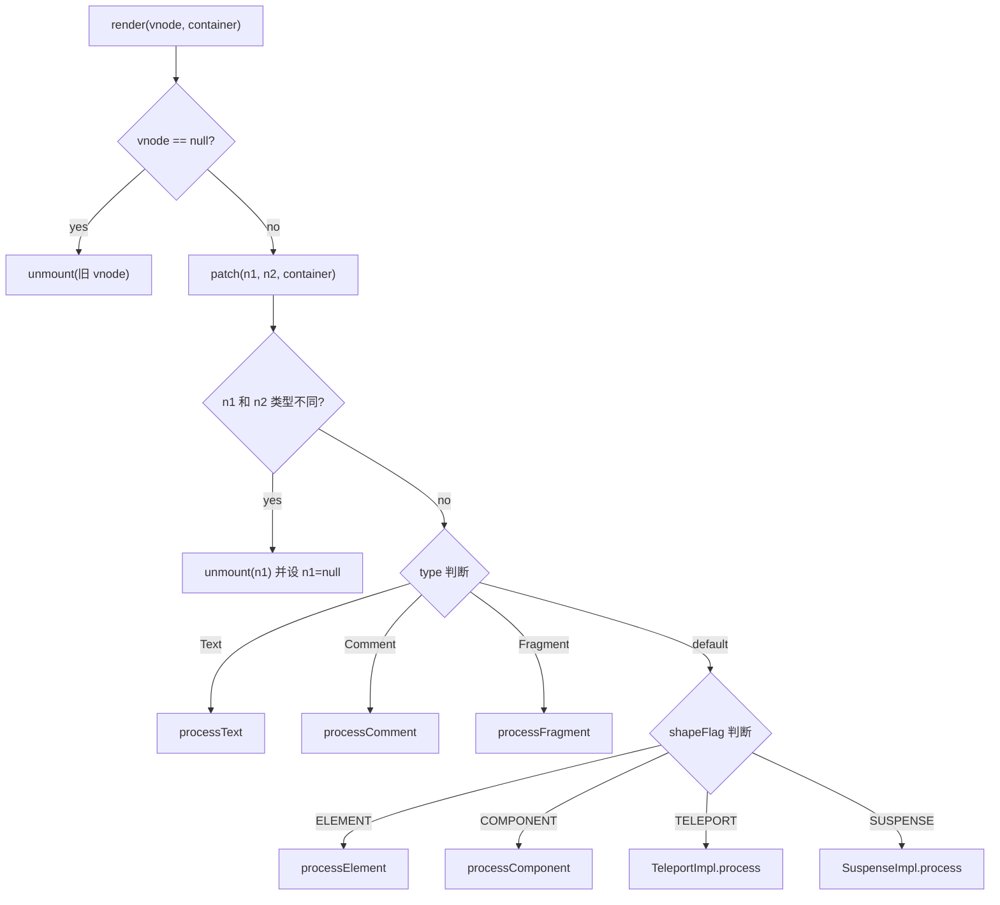

```javascript
const patch = (n1, n2, container, ...) => {
  // 新旧节点类型不同，销毁旧节点
  if (n1 && !isSameVNodeType(n1, n2)) {
    anchor = getNextHostNode(n1)
    unmount(n1, parentComponent, parentSuspense, true)
    n1 = null
  }

  const { type, shapeFlag } = n2
  switch (type) {
    case Text:       processText(n1, n2, container); break
    case Comment:    processComment(n1, n2, container); break
    case Fragment:   processFragment(n1, n2, container); break
    default:
      if (shapeFlag & 1 /* ELEMENT */)
        processElement(n1, n2, container, anchor, ...)
      else if (shapeFlag & 6 /* COMPONENT */)
        processComponent(n1, n2, container, ...)
      else if (shapeFlag & 64 /* TELEPORT */)
        type.process(n1, n2, container, ...)
      else if (shapeFlag & 128 /* SUSPENSE */)
        type.process(n1, n2, container, ...)
  }
}
```

### 2.6 组件挂载流程

```javascript
const mountComponent = (initialVNode, container, ...) => {
  // 1. 创建组件实例
  const instance = (initialVNode.component =
    createComponentInstance(initialVNode, parentComponent))

  // 2. 设置组件实例（props, slots, setup 等）
  setupComponent(instance)

  // 3. 设置并运行带副作用的渲染函数
  setupRenderEffect(instance, initialVNode, container, ...)
}
```

### 2.7 副作用渲染函数

```javascript
const setupRenderEffect = (instance, initialVNode, container, ...) => {
  instance.update = effect(function componentEffect() {
    if (!instance.isMounted) {
      // 初次渲染
      const subTree = (instance.subTree = renderComponentRoot(instance))
      patch(null, subTree, container, anchor, instance, parentSuspense, isSVG)
      initialVNode.el = subTree.el
      instance.isMounted = true
    } else {
      // 更新组件
      let { next, vnode } = instance
      if (next) {
        updateComponentPreRender(instance, next, optimized)
      } else {
        next = vnode
      }
      const nextTree = renderComponentRoot(instance)
      const prevTree = instance.subTree
      instance.subTree = nextTree
      patch(prevTree, nextTree, hostParentNode(prevTree.el), ...)
      next.el = nextTree.el
    }
  }, prodEffectOptions)
}
```

### 2.8 数据访问代理（实例上下文代理）

Vue 3 通过 `Proxy` 代理 `instance.ctx`，实现了从不同数据源（`setupState`、`data`、`props`、`ctx`）访问属性的统一，并带有优先级：

```javascript
export const PublicInstanceProxyHandlers = {
  get({ _: instance }, key) {
    const { ctx, setupState, data, props, accessCache } = instance

    // 先查缓存（性能优化：空间换时间）
    const n = accessCache[key]
    if (n !== undefined) {
      switch (n) {
        case 'SETUP': return setupState[key]
        case 'DATA':  return data[key]
        case 'CONTEXT': return ctx[key]
        case 'PROPS': return props[key]
      }
    }

    // 按优先级查找：setupState > data > props > ctx
    if (setupState !== EMPTY_OBJ && hasOwn(setupState, key)) {
      accessCache[key] = 'SETUP'
      return setupState[key]
    }
    if (data !== EMPTY_OBJ && hasOwn(data, key)) {
      accessCache[key] = 'DATA'
      return data[key]
    }
    // ... 以此类推
  }
}
```

**优先级顺序：**
| 操作 | 优先级 |
|------|--------|
| **get** | `setupState` > `data` > `props` > `ctx` |
| **set** | `setupState` > `data` > `props`（只读） |

---

## 3. Diff 算法：数组子节点更新

### 3.1 整体流程

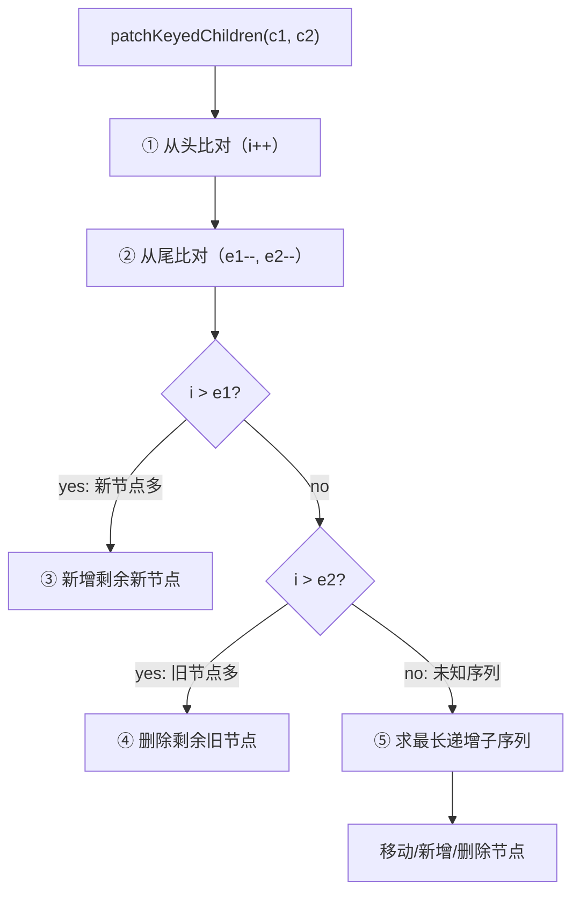

### 3.2 ① 从头比对

```javascript
let i = 0
let e1 = c1.length - 1  // 旧节点尾部索引
let e2 = c2.length - 1  // 新节点尾部索引

// (a b) c
// (a b) d e
while (i <= e1 && i <= e2) {
  const n1 = c1[i]
  const n2 = c2[i]
  if (isSameVNodeType(n1, n2)) {
    patch(n1, n2, container, ...)
  } else {
    break
  }
  i++
}
```

### 3.3 ② 从尾比对

```javascript
// a (b c)
// d e (b c)
while (i <= e1 && i <= e2) {
  const n1 = c1[e1]
  const n2 = c2[e2]
  if (isSameVNodeType(n1, n2)) {
    patch(n1, n2, container, ...)
  } else {
    break
  }
  e1--
  e2--
}
```

### 3.4 ③/④ 新增或删除

```javascript
// 新增：新节点多出剩余部分
if (i > e1) {
  while (i <= e2) {
    patch(null, c2[i], container, anchor, ...)
    i++
  }
}
// 删除：旧节点多出剩余部分
else if (i > e2) {
  while (i <= e1) {
    unmount(c1[i], parentComponent, parentSuspense, true)
    i++
  }
}
```

### 3.5 ⑤ 未知子序列（最长递增子序列）

当既不满足新增也不满足删除时（即中间部分乱序），核心策略：

1. **构建 `keyToNewIndexMap`**：新节点的 key → 索引映射
2. **遍历旧节点**：检查是否存在于新节点中，记录位置关系到 `newIndexToOldIndexMap`
3. **求最长递增子序列**：确定最少移动次数的方案

```javascript
// 核心算法：贪心 + 二分查找求最长递增子序列
function getSequence(arr) {
  const p = arr.slice()
  const result = [0]
  let i, j, u, v, c
  const len = arr.length

  for (i = 0; i < len; i++) {
    const arrI = arr[i]
    if (arrI !== 0) {
      j = result[result.length - 1]
      if (arr[j] < arrI) {
        p[i] = j
        result.push(i)
        continue
      }
      u = 0
      v = result.length - 1
      // 二分查找，找到第一个大于 arrI 的位置
      while (u < v) {
        c = ((u + v) / 2) | 0
        if (arr[result[c]] < arrI) {
          u = c + 1
        } else {
          v = c
        }
      }
      if (arrI < arr[result[u]]) {
        if (u > 0) p[i] = result[u - 1]
        result[u] = i
      }
    }
  }
  // 回溯得到正确序列
  u = result.length
  v = result[u - 1]
  while (u-- > 0) {
    result[u] = v
    v = p[v]
  }
  return result
}
```

**示例：** 旧序列 `[5, 3, 4, 0]`，最长递增子序列为 `[3, 4]`，对应索引 `[1, 2]`，这些节点不需要移动，只需要移动其余节点。

> **思考：** 为什么 Vue 3 不再沿用 Vue 2 的双端 diff？因为 `PatchFlag` + `dynamicChildren` 的靶向更新使得大多数情况下不需要完整 diff，复杂度降低。

---

## 4. 响应式原理

### 4.1 响应式总览

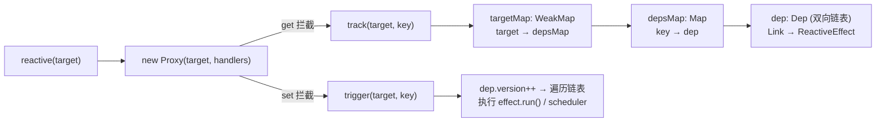

**Vue 2 vs Vue 3 响应式对比：**

| 特性 | Vue 2.x | Vue 3.0 |
|------|---------|---------|
| **实现** | `Object.defineProperty` | `Proxy` |
| **监听粒度** | 属性级别（需递归遍历） | 对象级别（懒递归） |
| **新增/删除属性** | 需 `$set` / `$delete` | 自动监听 |
| **数组索引** | 无法监听 | 自动监听 |
| **性能** | 初始化时递归所有属性 | 访问时才递归代理 |
| **依赖** | Watcher 实例 | effect 副作用函数 |

### 4.2 reactive 函数

```javascript
function reactive(target) {
  if (target && target.__v_isReadonly) {
    return target
  }
  return createReactiveObject(target, false, mutableHandlers, mutableCollectionHandlers)
}

function createReactiveObject(target, isReadonly, baseHandlers, collectionHandlers) {
  if (!isObject(target)) return target
  if (target.__v_raw) return target               // 已经是 Proxy
  if (hasOwn(target, '__v_reactive')) return target.__v_reactive
  if (!canObserve(target)) return target

  const observed = new Proxy(
    target,
    collectionTypes.has(target.constructor)
      ? collectionHandlers    // Map, Set, WeakMap, WeakSet
      : baseHandlers           // Object, Array
  )
  def(target, '__v_reactive', observed)
  return observed
}
```

### 4.3 依赖收集（track）

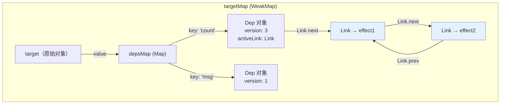

```javascript
let shouldTrack = true
let activeEffect = null
const targetMap = new WeakMap()

function track(target, type, key) {
  if (!shouldTrack || activeEffect === undefined) return

  let depsMap = targetMap.get(target)
  if (!depsMap) {
    targetMap.set(target, (depsMap = new Map()))
  }

  let dep = depsMap.get(key)
  if (!dep) {
    depsMap.set(key, (dep = new Dep()))
  }

  if (!activeEffect.deps) activeEffect.deps = new Map()

  // v3.5: 链表方式连接，避免 Set 迭代开销
  let link = activeEffect.deps.get(dep)
  if (!link) {
    link = new Link(activeEffect, dep)
    activeEffect.deps.set(dep, link)
    // 插入链表头部
    link.next = dep.activeLink
    if (dep.activeLink) dep.activeLink.prev = link
    dep.activeLink = link
  } else if (link.version !== dep.version) {
    link.version = dep.version  // 重新激活
  }
}
```

### 4.4 派发更新（trigger）

```javascript
function trigger(target, type, key, newValue, oldValue) {
  const depsMap = targetMap.get(target)
  if (!depsMap) return

  const deps = []

  // 根据 key 找到对应的 dep
  if (key === 'length' && isArray(target)) {
    // 数组 length 变化需要触发所有索引 ≥ 新 length 的元素
    depsMap.forEach((dep, keyStr) => {
      if (keyStr !== 'length' && Number(keyStr) >= newValue) {
        deps.push(dep)
      }
    })
  }
  if (key !== undefined) {
    deps.push(depsMap.get(key))
  }

  // 数组新增元素需触发 length 依赖
  if (type === "add" && isArray(target) && isIntegerKey(key)) {
    deps.push(depsMap.get('length'))
  }

  // 执行 effects
  for (const dep of deps) {
    if (dep) {
      dep.version++  // v3.5: 版本号递增
      // 遍历链表执行 effect
      let link = dep.activeLink
      while (link) {
        const effect = link.sub
        if (effect.scheduler) {
          effect.scheduler(effect)  // 有调度器则走调度
        } else {
          effect()                   // 否则直接执行
        }
        link = link.next
      }
    }
  }
}
```

### 4.5 Proxy 的 get 拦截细节

```javascript
function createGetter(isReadonly = false, shallow = false) {
  return function get(target, key, receiver) {
    // 处理 ReactiveFlags 特殊属性
    if (key === '__v_isReactive') return !isReadonly
    if (key === '__v_isReadonly') return isReadonly
    if (key === '__v_raw') return target

    const targetIsArray = isArray(target)
    // 数组特殊方法（includes, indexOf 等）需要额外 track
    if (targetIsArray && hasOwn(arrayInstrumentations, key)) {
      return Reflect.get(arrayInstrumentations, key, receiver)
    }

    const res = Reflect.get(target, key, receiver)

    // Symbol 内置 key 不收集依赖
    if (isSymbol(key) && builtInSymbols.has(key)) return res

    // 依赖收集
    !isReadonly && track(target, "get", key)

    // 递归响应式（懒代理的关键！）
    return isObject(res)
      ? isReadonly ? readonly(res) : reactive(res)
      : res
  }
}
```

### 4.6 effect 副作用函数

```javascript
// packages/reactivity/src/effect.ts
let activeEffect
const targetMap = new WeakMap()

function effect(fn, options = {}) {
  const _effect = new ReactiveEffect(fn, options.scheduler)
  if (!options.lazy) {
    _effect.run()
  }
  return _effect
}

class ReactiveEffect {
  active = true
  deps = new Map() // v3.5: Map<Dep, Link> 替代数组
  computed         // 是否为 computed
  allowRecurse     // 允许递归触发
  onStop           // stop 回调
  scheduler        // 调度器
  paused = false   // v3.5: 暂停/恢复能力

  constructor(fn, scheduler) {
    this.fn = fn
    this.scheduler = scheduler
  }

  run() {
    if (!this.active) return this.fn()
    if (this.paused) return  // v3.5: 暂停时不执行
    if (!effectStack.includes(this)) {
      try {
        enableTracking()
        effectStack.push(this)
        activeEffect = this
        return this.fn()  // 执行函数，触发 getter 自动依赖收集
      } finally {
        effectStack.pop()
        resetTracking()
        activeEffect = effectStack[effectStack.length - 1]
      }
    }
  }

  stop() {
    if (this.active) {
      cleanupEffect(this)
      this.onStop?.()
      this.active = false
    }
  }

  // v3.5: 暂停/恢复
  pause() { this.paused = true }
  resume() { this.paused = false }
}
```

### 4.7 依赖清理（v3.5 版本计数 + 双向链表）

Vue 3.4+ 重构了响应式系统的依赖追踪，使用**版本计数**和**双向链表**替代了 v3.2 的二进制位标记，内存占用降低约 60%：

```javascript
// v3.5 的 Dep 使用双向链表替代 Set
class Dep {
  constructor() {
    this.version = 0           // 版本号，每次 trigger 递增
    this.activeLink = undefined // 链表头
  }
}

// Link 节点：连接 effect 与 dep
class Link {
  constructor(sub, dep) {
    this.sub = sub      // 指向 effect
    this.dep = dep      // 指向 dep
    this.prev = undefined
    this.next = undefined
    this.version = -1   // 版本快照
  }
}
```

**v3.5 的 `ReactiveEffect` 中 `deps` 改为 `Map<Dep, Link>`：**
```javascript
class ReactiveEffect {
  deps = new Map()   // v3.5: Map<Dep, Link>，替代 v3.2 的数组
  // ...
}
```

**依赖清理机制（cleanup on read）：**

`track()` 执行时（§4.3），若 `activeEffect.deps.get(dep)` 不存在则创建 Link 并插入链表头部；若存在但 `link.version !== dep.version` 则重新激活。

`trigger()` 执行时（§4.4），`dep.version++` 递增版本号，随后遍历链表执行所有 `link.sub`。

当 effect 重新运行时，通过比对 `link.version` 与 `dep.version` 自动判定哪些 dep 已失效，无需 `cleanup(effect)` 清空旧依赖。

**链表的优势：**
1. 无需 `cleanup(effect)` 清空旧依赖——每个 effect 运行时会直接比对 `link.version !== dep.version`，自动跳过已失效的链接
2. 遍历 dep 时直接走链表，无需 `Set` 的迭代分配
3. 插入/删除为 O(1) 操作

### 4.8 nextTick 与异步批处理

```javascript
// 当触发 setter 时，如果 effect 有 scheduler，则执行 scheduler
// scheduler 会将 update 函数推入 queue 队列

function queueJob(job) {
  // 去重：相同 id 的 job 只会被添加一次
  if (!queue.includes(job, isFlushing ? flushIndex + 1 : flushIndex)) {
    if (job.id == null) {
      queue.push(job)
    } else {
      queue.splice(findInsertionIndex(job.id), 0, job)
    }
    queueFlush()
  }
}

function queueFlush() {
  if (!isFlushing && !isFlushPending) {
    isFlushPending = true
    // Vue 3 通过 Promise.then 实现异步更新
    currentFlushPromise = resolvedPromise.then(flushJobs)
  }
}
```

**更新流程：**

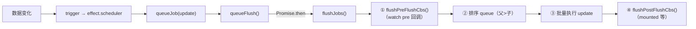

> **Q：** 为什么 `for` 循环 1000 次修改数据，视图只更新一次？
> **A：** 去重机制使相同 `id` 的 `update` 只入队一次，且 `flushJobs` 是微任务异步执行，当前宏任务的所有修改合并为一次更新。

---

## 5. watch 的实现原理

### 5.1 使用示例

```javascript
const x = ref(0)
const y = ref(0)
const state = reactive({ num: 0 })

// 单个 ref
watch(x, (newX) => { console.log(`x is ${newX}`) })

// getter 函数
watch(() => x.value + y.value, (sum) => { ... })

// 响应式对象（默认 deep: true）
watch(state, (newState) => { ... })

// 多个来源
watch([x, () => y.value], ([newX, newY]) => { ... })
```

### 5.2 核心实现

```javascript
function doWatch(source, cb, { immediate, deep, flush, ... } = {}) {
  let getter
  let forceTrigger = false
  let isMultiSource = false

  // 标准化 source：基于类型创建 getter
  if (isRef(source)) {
    getter = () => source.value
    forceTrigger = isShallow(source)
  } else if (isReactive(source)) {
    getter = () => source
    deep = true  // 响应式对象默认深度监听
  } else if (isArray(source)) {
    isMultiSource = true
    getter = () => source.map(s => {
      if (isRef(s)) return s.value
      if (isReactive(s)) return traverse(s)
      if (isFunction(s)) return callWithErrorHandling(s, instance, ...)
    })
  } else if (isFunction(source)) {
    getter = () => callWithErrorHandling(source, instance, ...)
  }

  // 深度监听：递归遍历所有属性
  if (cb && deep) {
    const baseGetter = getter
    getter = () => traverse(baseGetter())
  }

  // 构造调度器
  let oldValue = INITIAL_WATCHER_VALUE
  const job = () => {
    if (!effect.active) return
    if (cb) {
      const newValue = effect.run()
      callWithAsyncErrorHandling(cb, instance, ..., [
        newValue,
        oldValue === INITIAL_WATCHER_VALUE ? undefined : oldValue
      ])
      oldValue = newValue
    } else {
      effect.run()  // watchEffect
    }
  }

  let scheduler
  if (flush === 'sync') {
    scheduler = job
  } else if (flush === 'post') {
    scheduler = () => queuePostRenderEffect(job, ...)
  } else {
    // 默认：pre 阶段，渲染前执行
    job.pre = true
    scheduler = () => queueJob(job)
  }

  // 创建 effect
  const effect = new ReactiveEffect(getter, scheduler)

  if (cb) {
    if (immediate) {
      job()
    } else {
      oldValue = effect.run()
    }
  }

  return () => {
    effect.stop()           // 销毁 watcher
    if (instance && instance.scope) {
      remove(instance.scope.effects, effect)
    }
  }
}
```

### 5.3 watch 增强（v3.4+）

**`once: true` 选项（v3.4）：**
```javascript
const unwatch = watch(
  source,
  (newValue, oldValue) => {
    // 回调只触发一次后自动销毁
  },
  { once: true }
)
```

实现上，当 `once: true` 时，回调执行完毕后调用 `unwatch()`：
```javascript
function doWatch(source, cb, { once, ... } = {}) {
  let oldValue = INITIAL_WATCHER_VALUE
  const job = () => {
    if (once) {
      unwatch()
    }
    const newValue = effect.run()
    cb(newValue, oldValue)
    oldValue = newValue
  }
}
```

**`onWatcherCleanup` API（v3.5）：**
```javascript
watch(source, (newValue, oldValue, onCleanup) => {
  // onCleanup 是旧版清理方式
  onCleanup(() => { /* 副作用清理 */ })

  // v3.5: 更直接的 onWatcherCleanup
  import { onWatcherCleanup } from 'vue'

  onWatcherCleanup(() => {
    // 在 watcher 重新执行或销毁时自动清理
  })
})
```

**`deep` 支持数字控制深度（v3.5）：**
```javascript
watch(source, callback, { deep: 3 })  // 只递归 3 层
```

### 5.4 traverse 深度遍历

```javascript
function traverse(value, seen = new Set()) {
  if (!isObject(value) || seen.has(value)) return value
  seen.add(value)

  if (isRef(value)) {
    traverse(value.value, seen)
  } else if (Array.isArray(value)) {
    for (let i = 0; i < value.length; i++) {
      traverse(value[i], seen)
    }
  } else if (isPlainObject(value)) {
    for (const key in value) {
      traverse(value[key], seen)
    }
  }
  return value
}
```

---

## 6. computed 的实现原理

```javascript
function computed(getterOrOptions) {
  let getter, setter
  const onlyGetter = isFunction(getterOrOptions)

  if (onlyGetter) {
    getter = getterOrOptions
    setter = () => console.warn('computed is readonly')
  } else {
    getter = getterOrOptions.get
    setter = getterOrOptions.set
  }

  return new ComputedRefImpl(getter, setter, onlyGetter || !setter)
}

class ComputedRefImpl {
  _dirty = true        // 脏值标记，控制缓存
  _cacheable           // 是否可缓存
  __v_isRef = true     // 标记为 ref 类型
  dep = undefined

  constructor(getter, _setter, isReadonly, isSSR = false) {
    this.effect = new ReactiveEffect(getter, () => {
      if (!this._dirty) {
        this._dirty = true
        triggerRefValue(this)  // 标记脏值并触发更新
      }
    })
    this.effect.computed = this
    this._cacheable = !isSSR
  }

  get value() {
    const self = toRaw(this)
    trackRefValue(self)        // 依赖收集
    if (self._dirty || !self._cacheable) {
      self._dirty = false
      self._value = self.effect.run()  // 重新求值
    }
    return self._value
  }

  set value(newValue) {
    this._setter(newValue)
  }
}
```

**computed 特性：**

| 对比项 | computed | methods |
|--------|----------|---------|
| 缓存 | ✅ 依赖不变则不重新计算 | ❌ 每次都执行 |
| 实现 | `_dirty` 标记控制 | 无 |
| 执行顺序 | `computed effect` 优先于普通 `effect` | 按调用顺序 |

**v3.5 改进：getter/setter 类型解耦**
```typescript
const c = computed<string>({
  get: () => 42,       // getter 返回 number
  set: (v: string) => {} // setter 接受 string
})
// 3.5+ 允许 getter/setter 类型不同
```

**执行顺序保障（v3.5 链表版本）：**
```javascript
function triggerEffects(dep) {
  // v3.5: 使用链表遍历而非 Set 拷贝
  let link = dep.activeLink
  const computedLinks = []
  const effectLinks = []

  // 分离 computed 与普通 effect
  while (link) {
    if (link.sub.computed) {
      computedLinks.push(link)
    } else {
      effectLinks.push(link)
    }
    link = link.next
  }

  // 先执行所有 computed effect（确保其他 effect 读到最新值）
  for (const link of computedLinks) {
    triggerEffect(link.sub, ...)
  }
  // 再执行其他副作用
  for (const link of effectLinks) {
    triggerEffect(link.sub, ...)
  }
}
```

---

## 7. 模板编译过程

### 7.1 编译总览

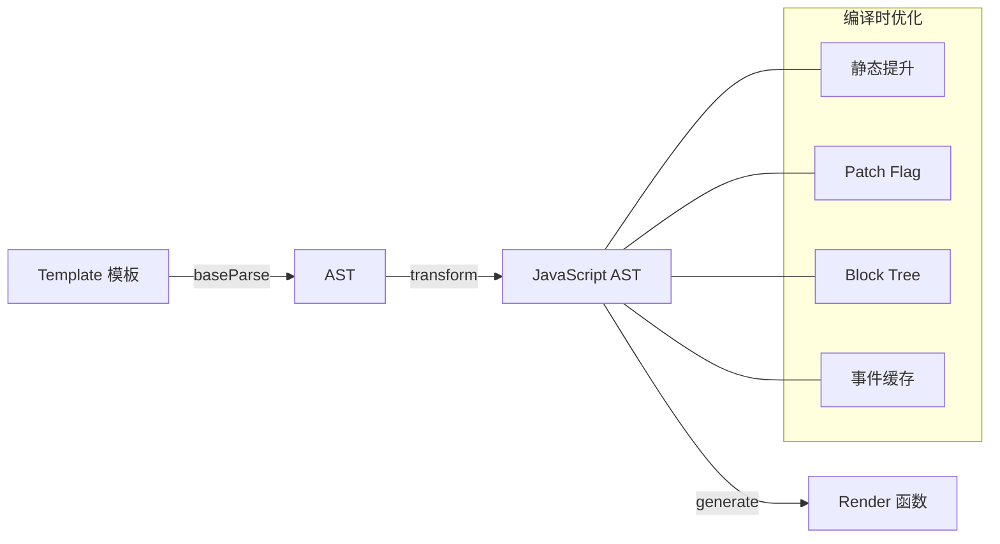

### 7.2 baseCompile 核心

```javascript
function baseCompile(template, options = {}) {
  // 1. 解析 template 生成 AST
  const ast = isString(template) ? baseParse(template, options) : template

  // 获取预设的转换函数
  const [nodeTransforms, directiveTransforms] = getBaseTransformPreset()

  // 2. AST 转换为 JavaScript AST（含优化）
  transform(ast, {
    nodeTransforms: [...nodeTransforms, ...(options.nodeTransforms || [])],
    directiveTransforms: { ...directiveTransforms, ...options.directiveTransforms }
  })

  // 3. 生成代码
  return generate(ast)
}
```

### 7.3 解析模板生成 AST（baseParse）

```javascript
function baseParse(content, options) {
  const context = createParserContext(content, options)
  const start = getCursor(context)
  return createRoot(
    parseChildren(context, 0 /* DATA */, []),
    getSelection(context, start)
  )
}
```

**parseChildren 解析流程：**

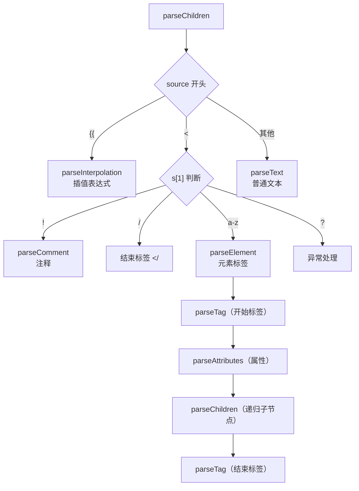

### 7.4 transform 转换

```javascript
export function transform(root, options) {
  const context = createTransformContext(root, options)
  traverseNode(root, context)          // 遍历 + 转换节点
  if (options.hoistStatic) {
    hoistStatic(root, context)         // 静态提升
  }
  if (!options.ssr) {
    createRootCodegen(root, context)   // 创建根代码生成节点
  }
  // 写入元信息
  root.helpers = [...context.helpers.keys()]
  root.hoists = context.hoists
  root.components = [...context.components]
  root.directives = [...context.directives]
}
```

**核心转换函数：**

| 函数 | 职责 |
|------|------|
| `transformIf` | `v-if` / `v-else-if` / `v-else` 条件编译 |
| `transformFor` | `v-for` 循环编译 |
| `transformElement` | 普通元素编译（生成 VNodeCall） |
| `transformExpression` | 表达式处理（添加 `_ctx.` 前缀等） |
| `transformText` | 文本节点处理 |
| `transformOn` | `v-on` 事件指令处理 |
| `transformBind` | `v-bind` 指令处理 |
| `transformModel` | `v-model` 双向绑定处理 |

### 7.5 静态提升

```javascript
// 优化前（每次 render 都创建 VNode）
function render(_ctx, _cache) {
  return createElementVNode("div", null, [
    createElementVNode("p", null, "text")
  ])
}

// 优化后（静态节点提升到 render 外）
const _hoisted_1 = createElementVNode("p", null, "text", -1 /* HOISTED */)

function render(_ctx, _cache) {
  return createElementVNode("div", null, [_hoisted_1])
}
```

### 7.6 预字符串化

对于大量连续的静态节点，Vue 3 会将其合成为字符串一次性创建：

```javascript
// 优化前：20 个 p 标签产生 20 个 createElementVNode
const _hoisted_1 = createElementVNode("p", null, null, -1)
const _hoisted_2 = createElementVNode("p", null, null, -1)
// ...

// 优化后：合并为一个 createStaticVNode
const _hoisted_1 = createStaticVNode("<p></p><p></p>...", 20)
```

---

## 8. 编译优化（PatchFlag + Block Tree）

### 8.1 PatchFlag

```javascript
export const enum PatchFlags {
  TEXT = 1,                    // 动态文本内容
  CLASS = 1 << 1,             // 动态 class
  STYLE = 1 << 2,             // 动态 style
  PROPS = 1 << 3,             // 动态属性
  FULL_PROPS = 1 << 4,        // 有动态 key 的属性
  HYDRATE_EVENTS = 1 << 5,    // 需要水合的事件
  STABLE_FRAGMENT = 1 << 6,   // 稳定的 Fragment
  KEYED_FRAGMENT = 1 << 7,    // 带 key 的 Fragment
  UNKEYED_FRAGMENT = 1 << 8,  // 无 key 的 Fragment
  NEED_PATCH = 1 << 9,        // 需 patch（ref, directives）
  DYNAMIC_SLOTS = 1 << 10,    // 动态插槽
  HOISTED = -1,                // 静态提升节点
  BAIL = -2                    // 退出优化模式
}
```

**编译示例：**

```html
<!-- 模板 -->
<div :class="classNames" id='test'>hello world</div>

<!-- 编译后 -->
createElementVNode("div", {
  class: normalizeClass(classNames),
  id: "test"
}, "hello world", 2 /* CLASS */)
```

`patchFlag = 2` 告诉运行时：**只需要对比 class 属性**，无需全量 diff props。

### 8.2 Block Tree

```html
<!-- 模板 -->
<div>
  <p>静态节点</p>
  <p>{{ msg }}</p>
  <p>静态节点</p>
</div>
```

```javascript
// 编译后的 vnode
const vnode = {
  type: 'div',
  children: [
    { type: 'p', children: '静态节点' },
    { type: 'p', children: ctx.msg, patchFlag: 1 /* TEXT */ },
    { type: 'p', children: '静态节点' }
  ],
  // 只收集动态节点
  dynamicChildren: [
    { type: 'p', children: ctx.msg, patchFlag: 1 /* TEXT */ }
  ]
}
```

`openBlock()` 和 `createElementBlock()` 负责收集动态节点：

```javascript
export let currentBlock = null

export function openBlock() {
  blockStack.push((currentBlock = []))
}

function createBaseVNode(...) {
  // ...
  if (currentBlock && (vnode.patchFlag > 0 || ...)) {
    currentBlock.push(vnode)  // 动态节点被收集
  }
  return vnode
}

function setupBlock(vnode) {
  vnode.dynamicChildren = currentBlock || []
  closeBlock()
  if (currentBlock) {
    currentBlock.push(vnode)
  }
  return vnode
}
```

**Patch 阶段：**
```javascript
const patchElement = (n1, n2, ...) => {
  let { patchFlag, dynamicChildren } = n2

  if (dynamicChildren) {
    // 靶向更新：只对比 dynamicChildren
    patchBlockChildren(n1.dynamicChildren, dynamicChildren, ...)
  } else if (!optimized) {
    // 全量 diff
    patchChildren(n1, n2, el, ...)
  }

  // 根据 patchFlag 精确更新 props
  if (patchFlag & PatchFlags.CLASS) { /* 只对比 class */ }
  if (patchFlag & PatchFlags.STYLE) { /* 只对比 style */ }
  // ...
}
```

### 8.3 事件缓存

```html
<div @click="handleClick">{{ msg }}</div>
```

```javascript
// 编译后
function render(_ctx, _cache) {
  return createElementVNode("div", {
    onClick: _cache[0] || (_cache[0] = ($event) => (_ctx.handleClick($event)))
  }, [
    createElementVNode("p", null, toDisplayString(_ctx.msg), 1 /* TEXT */)
  ])
}
```

事件处理函数被缓存在 `_cache` 中，避免重复创建导致子组件不必要的更新。

---

## 9. 内置组件

### 9.1 Transition

Transition 是一个函数式组件（无状态），本身不渲染额外 DOM：

```javascript
export const Transition = (props, { slots }) =>
  h(BaseTransition, resolveTransitionProps(props), slots)
```

**CSS 过渡原理：** Transition 的子节点会被注入 `enterHooks` 和 `leavingHooks`，在合适的时机添加/移除 CSS class：

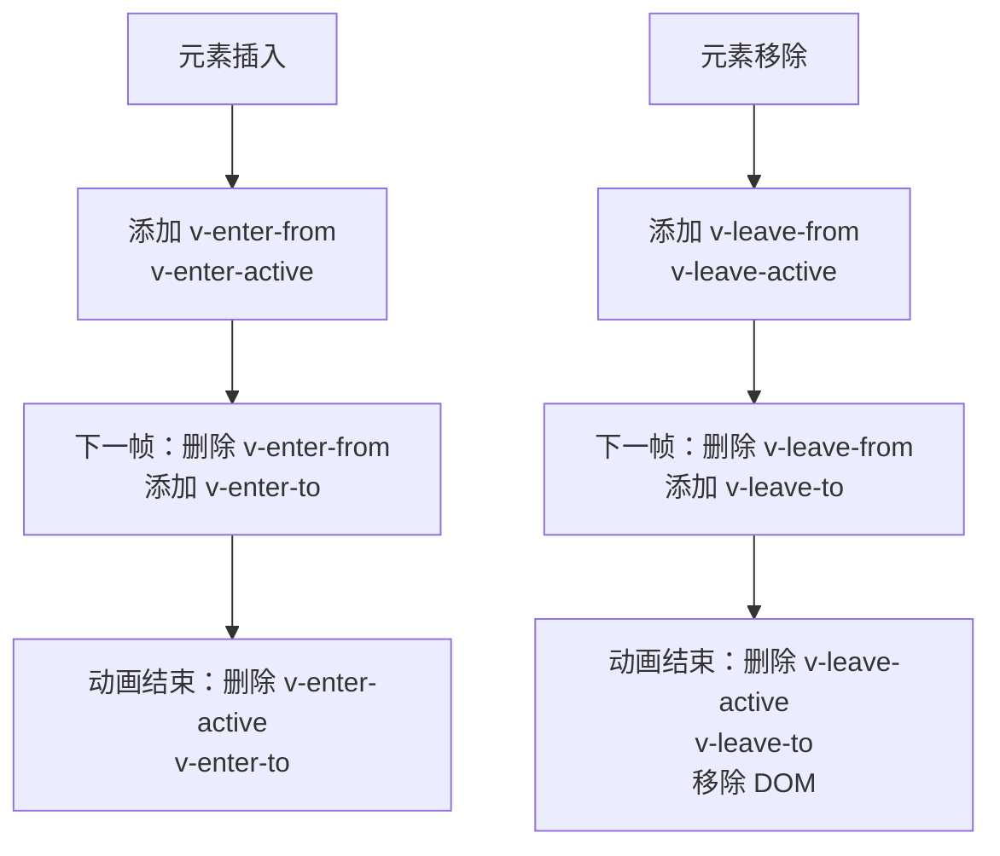

**hooks 挂载时机：**
```javascript
// 进入：mountElement 中
if (transition) {
  transition.beforeEnter(el)        // 添加 enter-from, enter-active
  queuePostRenderEffect(() => {
    transition.enter(el)            // 下一帧删除 from，添加 to
  }, parentSuspense)
}

// 离开：remove 中
if (transition) {
  const performLeave = () => leave(el, performRemove)
  performLeave()
}
```

### 9.2 KeepAlive

**缓存策略：** 类似 LRU（最近最少使用）算法

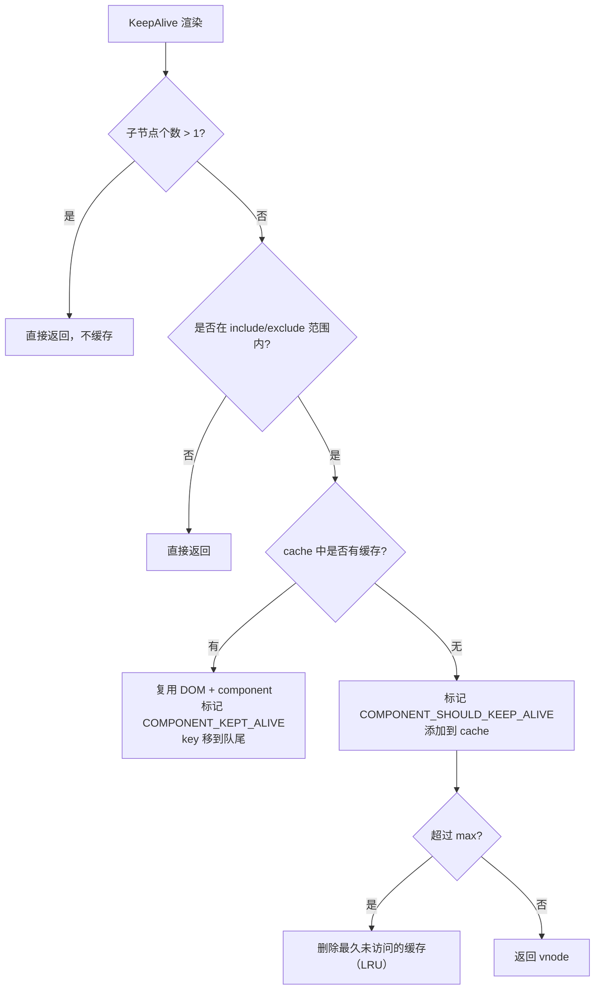

**激活 vs 卸载：**

| 状态 | 标记 | 行为 |
|------|------|------|
| **激活** | `COMPONENT_KEPT_ALIVE` | `move()` 到容器 + `patch` props + 触发 `onActivated` 钩子 |
| **卸载** | `COMPONENT_SHOULD_KEEP_ALIVE` | `move()` 到隐藏容器，触发 `onDeactivated` 钩子 |

### 9.3 Teleport

选择性挂载，避免先渲染到子节点再移动的性能开销。v3.5 新增 `deferred` 属性支持延迟挂载：

```html
<!-- v3.5: 延迟到目标元素存在后再挂载 -->
<Teleport defer to="#target">
  <div class="modal">...</div>
</Teleport>
```

```html
<Teleport to="body">
  <div class="modal">...</div>
</Teleport>
```

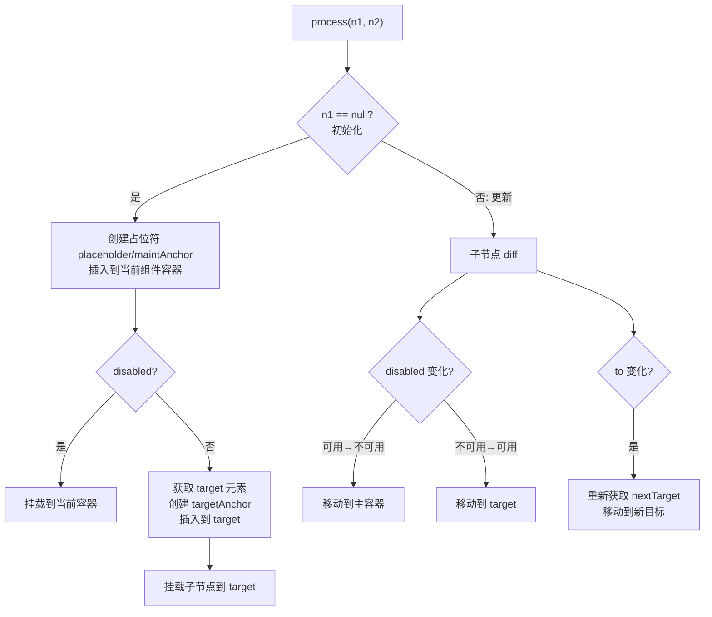

---

## 10. v-model 与插槽

### 10.1 v-model 实现

**表单元素：**
```html
<!-- 模板 -->
<input v-model='value' />
```

```javascript
// 编译后
withDirectives(
  createElementVNode("input", {
    "onUpdate:modelValue": $event => (_ctx.value = $event)
  }, null, 8 /* PROPS */, ["onUpdate:modelValue"]),
  [[vModelText, _ctx.value]]
)
```

`vModelText` 内部：
- **created**: 监听 `input/change` 事件，触发 `onUpdate:modelValue`
- **mounted**: 将 `value` 赋值给 `el.value`
- **beforeUpdate**: 更新 `el.value`

**组件（v3.4+ 推荐使用 `defineModel`）：**
```html
<!-- 父组件 -->
<Component v-model:title="bookTitle" />

<!-- 子组件：v3.2 方式 -->
<script setup>
defineProps(['title'])
defineEmits(['update:title'])
</script>

<!-- 子组件：v3.4+ 方式（推荐） -->
<script setup>
const title = defineModel('title')
// title 是一个 ref，可直接读写
console.log(title.value)
title.value = 'new title'  // 自动触发 update:title
</script>
```

```javascript
// 编译为（两种方式结果相同）
createVNode(_component_Component, {
  title: _ctx.bookTitle,
  "onUpdate:title": $event => (_ctx.bookTitle = $event)
}, null, 8 /* PROPS */, ["title", "onUpdate:title"])
```

**`defineModel` 内部实现（v3.4+ 稳定版）：**
```javascript
function useModel(props, name, options) {
  const i = getCurrentInstance()
  const res = customRef((track, trigger) => ({
    get() {
      track()
      return props[name]  // 读取 props
    },
    set(value) {
      // v3.4+: 本地突变模式为默认，自动 emit
      i.emit(`update:${name}`, value)
    }
  }))
  return res
}
```

**`defineModel` 与 `v-bind` 同名简写（v3.4）：**
```html
<!-- v3.4 支持 :id 简写为 :id -->
<input :id />
<!-- 等同于 :id="id" -->

<!-- defineModel 配合 default -->
const count = defineModel('count', { default: 0 })
```

**emit 函数查找 handler：**
```javascript
function emit(instance, event, ...rawArgs) {
  const props = instance.vnode.props
  // update:title → onUpdate:title
  let handlerName = toHandlerKey(event)
  let handler = props[handlerName]
  if (handler) {
    callWithAsyncErrorHandling(handler, instance, ..., rawArgs)
  }
}
```

### 10.2 插槽实现

**父组件定义插槽内容：**
```html
<ChildComponent>
  <template #header>header</template>
  <template #content>content</template>
</ChildComponent>
```

```javascript
// 编译后：slots 被收集到子组件 vnode 的 children 中
createBlock(_component_ChildComponent, null, {
  header: withCtx(() => [createTextVNode("header")]),
  content: withCtx(() => [createTextVNode("content")]),
  _: 1 /* STABLE */
})
```

**子组件渲染插槽出口：**
```html
<slot name="header"></slot>
<slot name="content"></slot>
```

```javascript
// 编译后
renderSlot(_ctx.$slots, "header")
renderSlot(_ctx.$slots, "content")
```

**withCtx 的关键作用：**
```javascript
function withCtx(fn, ctx = currentRenderingInstance) {
  const renderFnWithContext = (...args) => {
    // 保存父组件实例上下文
    const prevInstance = setCurrentRenderingInstance(ctx)
    try {
      return fn(...args)   // 在父组件上下文中创建 VNode
    } finally {
      setCurrentRenderingInstance(prevInstance)  // 恢复子组件实例
    }
  }
  return renderFnWithContext
}
```

**Dynamic Slots：** 当插槽名是动态的、有条件/循环时，标记 `DYNAMIC_SLOTS`：

```javascript
// shouldUpdateComponent 中
if (patchFlag & PatchFlags.DYNAMIC_SLOTS) {
  return true  // 必须更新
}
```

---

## 11. v3.3~v3.5 新增核心 API 源码解析

### 11.1 useTemplateRef（v3.5）

显式的模板引用 API，替代 `ref` 属性绑定：

```html
<script setup>
import { useTemplateRef, onMounted } from 'vue'

const inputRef = useTemplateRef('input')

onMounted(() => {
  inputRef.value?.focus()
})
</script>

<template>
  <input ref="input" />
</template>
```

```javascript
// packages/runtime-core/src/helpers/useTemplateRef.ts
function useTemplateRef(key) {
  const i = getCurrentInstance()
  const r = shallowRef(null)

  if (i) {
    // 通过 key 关联到组件实例的 refs
    const refs = i.refs === EMPTY_OBJ ? (i.refs = {}) : i.refs

    // 注册响应式 ref
    Object.defineProperty(refs, key, {
      enumerable: true,
      configurable: true,
      get: () => r.value,
      set: (val) => { r.value = val }
    })
  }

  return r
}
```

**对比传统 `ref`：** `useTemplateRef` 不会覆盖 `setup` 中同名的 `ref`，语义更清晰。

### 11.2 useId（v3.5）

生成 SSR 安全的唯一 ID：

```javascript
import { useId } from 'vue'

const id = useId()
// 服务端渲染：id="v:0"
// 客户端水合：保持与 SSR 一致
```

```javascript
// packages/runtime-core/src/helpers/useId.ts
let ids = 0

function useId() {
  const i = getCurrentInstance()
  if (i) {
    // 基于组件树深度生成层级 id
    const parentId = i.parent?.ids ?? ''
    const myIndex = ids++
    return `v:${parentId}${myIndex}`
  }
  return `v:${ids++}`
}
```

### 11.3 defineOptions（v3.3）

在 `<script setup>` 中直接声明组件选项：

```vue
<script setup>
defineOptions({
  name: 'MyComponent',
  inheritAttrs: false,
  emits: ['click']
})
</script>
```

实现原理——编译时宏，在 SFC 编译阶段注入到组件定义：

```javascript
// compiler-sfc/src/script.ts
function processDefineOptions(ctx, node) {
  // 提取 options 对象，编译时合并到组件配置
  const options = extractExpression(node.arguments[0])
  ctx.options = { ...ctx.options, ...options }
}
```

### 11.4 响应式 Props 解构（v3.5 稳定）

```vue
<script setup>
const { title, count = 0 } = defineProps(['title', 'count'])

// v3.5+: 解构出的变量保持响应性
watchEffect(() => {
  console.log(title)  // 响应式追踪
})
</script>
```

v3.5 之前需要通过 `.value` 访问，v3.5 在编译时将解构变量编译为 `props.title` 引用：

```javascript
// 编译前
const { title } = defineProps(['title'])
console.log(title)

// 编译后（自动转换）
const __props = defineProps(['title'])
console.log(__props.title)
```

### 11.5 data-allow-mismatch 与惰性 Hydration（v3.5）

```html
<!-- 抑制客户端与服务端不一致的警告 -->
<div data-allow-mismatch>{{ currentTime }}</div>

<!-- 惰性 hydration：组件在可见时才水合 -->
<LazyHydrate when-visible>
  <ExpensiveComponent />
</LazyHydrate>
```

---

## 12. 总结

Vue.js 源码是一个设计精良且持续进化的现代化前端框架，其核心思想：

1. **响应式系统**：基于 `Proxy` 实现懒代理，通过 `ReactiveEffect` + `Dep`（v3.5 版本计数 + 双向链表）实现细粒度的依赖收集和派发更新
2. **虚拟 DOM**：使用 VNode 描述 UI，通过 `PatchFlag` + `dynamicChildren` 实现靶向 diff，避免全量比对
3. **组件系统**：支持组件化开发，`setup` → `render` → `patch` 的更新链路，数据访问代理统一了多种数据源
4. **编译优化**：静态提升、预字符串化、PatchFlag、Block Tree、事件缓存、v-memo 六大优化策略
5. **Composition API**：`reactive` / `ref` / `computed` / `watch` 等 API 提供更好的逻辑复用能力，v3.3~v3.5 新增 `defineModel`、`defineOptions`、`useTemplateRef`、`useId`、`onWatcherCleanup`
6. **内置组件**：`Transition`（动画）、`KeepAlive`（LRU 缓存）、`Teleport`（选择性挂载/延迟挂载）、`Suspense`（异步等待/惰性 hydration）
7. **调度机制**：基于 `Promise` 的异步批量更新，`queueJob` + `flushJobs` 实现高效的更新队列管理

理解这些核心概念和实现原理，不仅能够帮助我们更好地使用 Vue，更能够提升我们的 JavaScript 编程能力和架构设计能力。

---

## 参考资料

- [Vue.js 3.0 官方文档](https://cn.vuejs.org/)
- [Vue.js 3.0 源码仓库](https://github.com/vuejs/core)（当前版本 v3.5.38）
- [Vue 3 技术揭秘](https://juejin.cn/book/7146465352120008743)
- [Vue 3.3 Rurouni Kenshin 发布公告](https://blog.vuejs.org/posts/vue-3-3)
- [Vue 3.4 Slam Dunk 发布公告](https://blog.vuejs.org/posts/vue-3-4)
- [Vue 3.5 Tengrinew 发布公告](https://blog.vuejs.org/posts/vue-3-5)
